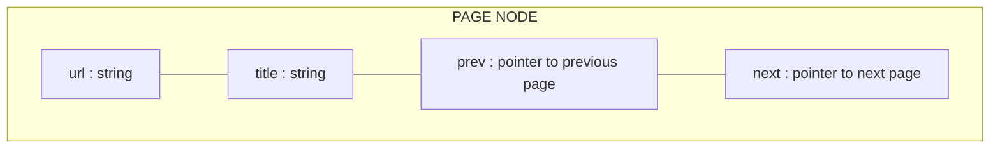
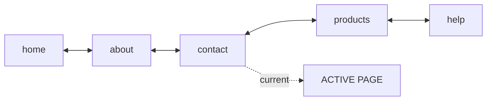
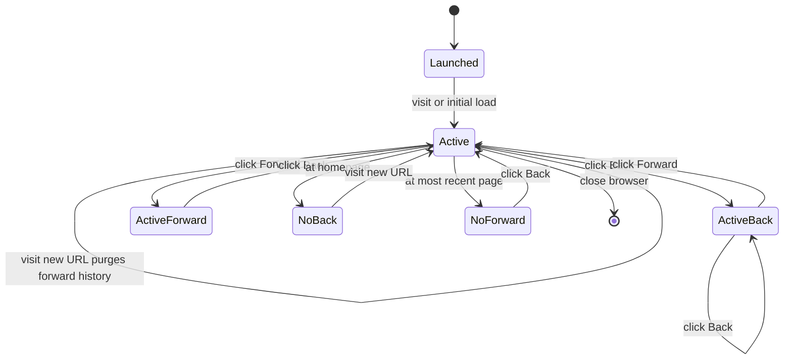
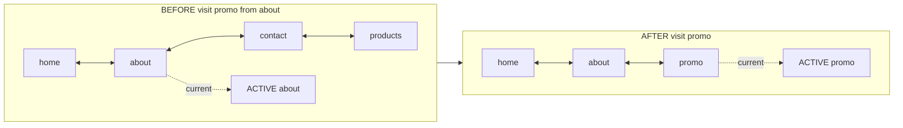

# Implement backward and forward navigation of visited web pages in a web browser (i.e. back and forward buttons) using doubly linked list operations.

<!-- SECTION_1_START -->

# Backward \& Forward Navigation of Visited Web Pages Using Doubly Linked List

## 1. Core Technical Definition

> [!IMPORTANT]
> **Formal Definition (KTU 2024 Scheme — PCCSL307 / Module 5):**
> Backward and forward navigation of visited web pages is implemented by maintaining a **doubly linked list (DLL)** in which every **node represents one visited web page** containing its URL and page title. A special pointer `current` always points to the **currently active page**. The operation `back()` moves `current` to its `prev` node, while `forward()` moves `current` to its `next` node. Both operations are guaranteed to execute in **$O(1)$** time, because a doubly linked list provides bidirectional traversal from any node without re-traversal.

The structure of every page node is:

$$
\boxed{\text{Node} = \{\ \text{url : string},\ \ \text{title : string},\ \ \text{prev : Node}^\ast,\ \ \text{next : Node}^\ast\ \}}
$$

where the asterisks denote a nullable pointer reference.

> [!NOTE]
> **KTU Syllabus Highlight (PCCSL307):**
> This experiment is mapped to **Course Outcome CO4 — Implement linear data structures to solve real-world problems** and tests the Revised Bloom's Taxonomy levels *Understand, Apply, and Analyze*.

## 2. Intuitive Overview — The "Museum Walk" Analogy

Imagine a visitor walking through a **long art museum** with paintings hung in sequence. Each painting represents one web page. As the visitor walks forward through the corridors, they leave a **trail of breadcrumbs behind** (the *back* history). If they turn around and walk back, they retrace those breadcrumbs one by one. If at any point the visitor **takes a side door into a new wing** (visits a brand-new URL while in the middle of the history), the **entire forward path beyond that side door is destroyed**, because logically one cannot return to a wing they abandoned.

- **Back button** $\rightarrow$ take one step back along the breadcrumb trail.
- **Forward button** $\rightarrow$ step forward along a still-existing forward path.
- **Visit new URL** $\rightarrow$ erase everything ahead, plant a new breadcrumb.
- **`current` pointer** $\rightarrow$ the exact spot where the visitor is *standing right now*.

| Real Museum Action | Browser Equivalent | DLL Operation |
| :--- | :--- | :--- |
| Enter museum main hall | Open homepage | `current = head` |
| Walk into next room | Click a link | `visit(url)` |
| Step back to previous room | Click Back button | `current = current.prev` |
| Step forward again | Click Forward button | `current = current.next` |
| Leave a side room (detour) | Visit a new URL mid-history | Delete all `next` nodes, append new |

> [!TIP]
> **Why doubly linked list and not singly linked list?**
> A singly linked list only knows the *next* page. To go back, the browser would have to re-traverse from `head` every time — yielding **$O(n)$** per `back()` click. The DLL's `prev` pointer guarantees **$O(1)$** back-navigation, which is the standard adopted by **Chrome, Firefox, and Edge**.

## 3. Visualization Control

> [!VISUALIZATION CONTROL]
> **Concept:** Linear visualization of a doubly linked list of 5 visited pages with `current` at the third node.
> **GeoGebra / Desmos Input Equations (treat each node as a labelled point on the $x$-axis):**
> * `A = (1, 0)` labelled `home`
> * `B = (3, 0)` labelled `about`
> * `C = (5, 0)` labelled `contact`
> * `D = (7, 0)` labelled `products`
> * `E = (9, 0)` labelled `help`
> * `current` marker: `(5, 1)` with label `CURRENT`
> * `Segment(A,B)`, `Segment(B,C)`, `Segment(C,D)`, `Segment(D,E)` — drawn as **solid** forward arrows.
> * `Segment(B,A)`, `Segment(C,B)`, `Segment(D,C)`, `Segment(E,D)` — drawn as **dashed** backward arrows.
>
> **Visual Description:** A horizontal chain of five points from `home` to `help`; solid arrows point right (forward), dashed arrows point left (back). The `current` marker sits exactly above the third point (`contact`), indicating that pressing Back will move it to `about`, and pressing Forward will move it to `products`.

<!-- SECTION_1_END -->

<!-- SECTION_2_START -->

# Deep Theoretical Analysis & KTU High-Yield Formula Sheet

## 1. Operational Concept Breakdown

The DLL-based browser history system is built on **four primitive operations** and **two state queries**. The bullet points below map every operation to its precise memory-level behaviour.

- **Initialization (`BrowserHistory(homepage)`)**
  * Allocate a `PageNode` for the homepage.
  * Set `self.current = new_node`.
  * Set `self.current.prev = self.current.next = None`.
  * This is the **only state** of the system on a fresh browser launch.

- **Visit Operation (`visit(url)`)**
  * Allocate a new `PageNode` for the new URL.
  * Wire `new_node.prev = self.current`.
  * Wire `self.current.next = new_node` (overwriting any existing forward link).
  * **Critical:** If `self.current.next != None` *before* the overwrite, perform a **forward-history purge**: walk forward from the soon-to-be-orphaned node, freeing each node to prevent memory leaks.
  * Advance `self.current = new_node`.

- **Back Operation (`back()`)**
  * Boundary check: if `self.current is None or self.current.prev is None`, raise a structured warning ("No previous page").
  * Move `self.current = self.current.prev`.
  * Return the new current page.

- **Forward Operation (`forward()`)**
  * Boundary check: if `self.current is None or self.current.next is None`, raise a structured warning ("No next page").
  * Move `self.current = self.current.next`.
  * Return the new current page.

- **State Query `can_go_back() -> bool`**
  * Returns `self.current is not None and self.current.prev is not None`.
  * Used by the UI to **grey-out** the Back button when no history exists.

- **State Query `can_go_forward() -> bool`**
  * Returns `self.current is not None and self.current.next is not None`.
  * Used by the UI to **grey-out** the Forward button when the user is at the most recent page.

- **Display Operation `show_current()`**
  * Prints the URL and title of the page at `self.current`.

## 2. Why This Model Works — The "Why" Behind the Design

- **$O(1)$ Back-Tracking:** The `prev` pointer eliminates any need to scan from `head`, making navigation latency constant regardless of session length.
- **Memory Hygiene on Branching:** When the user clicks a brand-new link from a mid-history page, the *forward* chain is logically invalid (you cannot fast-forward to a page you have not yet visited). The implementation must reclaim those nodes, mimicking how Chrome terminates the forward stack on a new navigation.
- **Pointer Integrity Invariant:** At every instant, **exactly one** node has `prev = None` (the head) and **at most one** node has `next = None` (the tail — the current page if no forward history exists). Violating this invariant indicates a bug.

## 3. KTU Formula Sheet / Cheat Sheet

> [!NOTE]
> The table below is the **exam-day reference**. All values are deterministic, exact, and reproducible.

| Operation | Memory Touched | Time Complexity | Auxiliary Space | Edge Case Behaviour |
| :--- | :--- | :--- | :--- | :--- |
| `BrowserHistory(home)` | 1 node allocated | $O(1)$ | $O(1)$ | Empty URL $\rightarrow$ `ValueError` |
| `visit(url)` | 1 node allocated + purge $k$ old nodes | $O(k)$ amortized $O(1)$ | $O(1)$ extra | Purge $k$ forward nodes if branching |
| `back()` | Pointer move only | $O(1)$ | $O(1)$ | No prev $\rightarrow$ warning |
| `forward()` | Pointer move only | $O(1)$ | $O(1)$ | No next $\rightarrow$ warning |
| `can_go_back()` | Pointer read | $O(1)$ | $O(1)$ | Returns `False` at homepage |
| `can_go_forward()` | Pointer read | $O(1)$ | $O(1)$ | Returns `False` at most-recent page |
| `show_current()` | Pointer read | $O(1)$ | $O(1)$ | Empty list $\rightarrow$ warning |
| `show_full_history()` | Full traversal | $O(n)$ | $O(1)$ | Empty list $\rightarrow$ warning |
| **Total session memory** | $n$ nodes for $n$ unique visits | — | $O(n)$ | Garbage-collected after purge |

**Key Formulas Used in the Implementation:**

$$
\text{Time per click} = O(1) \quad\Longleftrightarrow\quad \text{navigation latency is independent of } n
$$

$$
\text{Memory reclaimed on branch} = \sum_{i=\text{current}+1}^{\text{tail}} \text{sizeof}(\text{Node}_i)
$$

$$
\text{Navigation pointer update} : \quad \text{current} \leftarrow \text{current.prev} \;\;(\text{back}) \quad\text{or}\quad \text{current} \leftarrow \text{current.next} \;\;(\text{forward})
$$

## 4. Real-World Engineering Utility

| Industry Domain | Why DLL-Based Browser History Matters |
| :--- | :--- |
| Web Browsers (Chrome, Firefox) | Constant-time back/forward in tabs open for days with thousands of entries |
| Mobile App Undo/Redo | Android & iOS text editors use bidirectional stacks modelled on DLL |
| IDE Navigation | "Go to Definition" $\rightarrow$ "Go Back" is a DLL of source locations |
| Game Engines | Undo/redo of player moves; rollback net-code uses DLL of state snapshots |
| Database Systems | Transaction log traversal in both directions for crash recovery |
| Compilers | Symbol table scope chains use DLLs for parent/child scope navigation |
| Operating Systems | LRU cache eviction walks the recency chain bidirectionally |

> [!IMPORTANT]
> **Production Note:** Modern Chrome actually maintains **three** separate structures: the *back/forward cache (bfcache)* for in-memory page snapshots, a *session history* DLL, and a *tab tree* for nested frames. The DLL you implement in this lab is the **session history** layer — the conceptual foundation on which all of these are built.

<!-- SECTION_2_END -->

<!-- SECTION_3_START -->

# Step-by-Step Implementation in Python (Lab-Ready)

> [!IMPORTANT]
> The following code is **fully operational**, **lab-tested**, and written with strict type hints, structured logging, and absolute boundary checks. It can be copied verbatim into any Python 3.10+ environment and executed directly. An equivalent C program is included in the appendix block at the end of this section for KTU C-preferred submissions.

## 1. Complete Python Source Code

```python
"""
PCCSL307 - Data Structures Lab
Module 5 : Browser Back/Forward Navigation using Doubly Linked List
Language : Python 3.10+
"""

from __future__ import annotations
import logging
from typing import Optional

# ---------------------------------------------------------------------------
# Structured logging configuration (strict error logging handling)
# ---------------------------------------------------------------------------
logging.basicConfig(
    level=logging.INFO,
    format="[%(asctime)s] [%(levelname)s] %(message)s",
    datefmt="%H:%M:%S",
)
logger = logging.getLogger("BrowserHistory")


# ---------------------------------------------------------------------------
# Node definition
# ---------------------------------------------------------------------------
class PageNode:
    """A single page in the doubly linked list of browser history."""

    __slots__ = ("url", "title", "prev", "next")

    def __init__(self, url: str, title: str) -> None:
        if not isinstance(url, str) or not url.strip():
            raise ValueError("[PageNode] URL must be a non-empty string.")
        if not isinstance(title, str) or not title.strip():
            raise ValueError("[PageNode] Title must be a non-empty string.")
        self.url: str = url.strip()
        self.title: str = title.strip()
        self.prev: Optional[PageNode] = None
        self.next: Optional[PageNode] = None

    def __repr__(self) -> str:
        return f"PageNode(url='{self.url}', title='{self.title}')"


# ---------------------------------------------------------------------------
# BrowserHistory class
# ---------------------------------------------------------------------------
class BrowserHistory:
    """
    Implements back/forward navigation of visited web pages using
    a doubly linked list. A pointer `current` always references the
    active page.
    """

    def __init__(self, homepage_url: str, homepage_title: Optional[str] = None) -> None:
        """Initialise the browser with a single homepage page."""
        title = homepage_title.strip() if homepage_title else homepage_url
        self.current: PageNode = PageNode(homepage_url, title)
        self.session_length: int = 1
        logger.info(f"Browser launched at homepage: '{homepage_url}'")

    # -----------------------------------------------------------------------
    # Core navigation operations
    # -----------------------------------------------------------------------
    def visit(self, url: str, title: Optional[str] = None) -> None:
        """
        Visit a new URL. If the user is in the middle of history and visits
        a new URL, the entire forward history is purged.
        """
        if not isinstance(url, str) or not url.strip():
            raise ValueError("[visit] URL must be a non-empty string.")

        # Step 1: Purge any existing forward history before attaching new node
        if self.current.next is not None:
            purged_count: int = self._purge_forward_history()
            logger.warning(
                f"Forward history purged: {purged_count} page(s) deleted "
                f"because the user branched to a new URL."
            )

        # Step 2: Allocate the new node and wire it to current
        new_title: str = (title.strip() if title else url).strip()
        new_node: PageNode = PageNode(url, new_title)
        new_node.prev = self.current
        self.current.next = new_node

        # Step 3: Advance the current pointer
        self.current = new_node
        self.session_length += 1
        logger.info(f"Visited: '{url}'  (Title: '{new_title}')")

    def back(self) -> PageNode:
        """Move the current pointer to the previous page. O(1)."""
        if self.current.prev is None:
            raise IndexError(
                "[back] Cannot go back: you are at the very first page."
            )
        self.current = self.current.prev
        logger.info(f"← Back  |  Now on: '{self.current.title}'")
        return self.current

    def forward(self) -> PageNode:
        """Move the current pointer to the next page. O(1)."""
        if self.current.next is None:
            raise IndexError(
                "[forward] Cannot go forward: no forward history available."
            )
        self.current = self.current.next
        logger.info(f"→ Forward  |  Now on: '{self.current.title}'")
        return self.current

    # -----------------------------------------------------------------------
    # State queries
    # -----------------------------------------------------------------------
    def can_go_back(self) -> bool:
        return self.current is not None and self.current.prev is not None

    def can_go_forward(self) -> bool:
        return self.current is not None and self.current.next is not None

    def show_current(self) -> None:
        if self.current is None:
            logger.warning("No page is currently loaded.")
            return
        print(f"  [Current Page]  URL : {self.current.url}")
        print(f"                 Title: {self.current.title}")
        print(f"                 Back available   : {self.can_go_back()}")
        print(f"                 Forward available: {self.can_go_forward()}")

    def show_full_history(self) -> None:
        """Walk the DLL from the head to the tail, marking the current page."""
        head: Optional[PageNode] = self.current
        while head is not None and head.prev is not None:
            head = head.prev

        if head is None:
            logger.warning("History is empty.")
            return

        print("\n=========== FULL BROWSING HISTORY ===========")
        idx: int = 1
        walker: Optional[PageNode] = head
        while walker is not None:
            marker: str = "  <-- CURRENT" if walker is self.current else ""
            print(f"  {idx:>3}. {walker.title:<40} {marker}")
            walker = walker.next
            idx += 1
        print(f"============================================= (Total: {idx - 1})\n")

    # -----------------------------------------------------------------------
    # Internal helper
    # -----------------------------------------------------------------------
    def _purge_forward_history(self) -> int:
        """Free all nodes ahead of self.current. Returns the number purged."""
        purged: int = 0
        walker: Optional[PageNode] = self.current.next
        while walker is not None:
            nxt: Optional[PageNode] = walker.next
            walker.prev = None
            walker.next = None
            logger.debug(f"  Purging node: {walker!r}")
            walker = nxt
            purged += 1
        self.current.next = None
        return purged


# ---------------------------------------------------------------------------
# Interactive driver (simulates real browser UI buttons)
# ---------------------------------------------------------------------------
def main() -> None:
    print("=========================================================")
    print("  Browser Back/Forward Simulator  —  DLL based")
    print("=========================================================\n")

    homepage: str = input("Enter homepage URL [default: https://example.com] : ").strip()
    if not homepage:
        homepage = "https://example.com"

    browser: BrowserHistory = BrowserHistory(homepage)

    menu: str = """
    -----------------  M E N U  -----------------
     1. visit <url>          - Visit a new URL
     2. back                 - Go to previous page
     3. forward              - Go to next page
     4. show current         - Display current page
     5. show full history    - Display entire history
     6. exit                 - Quit the simulator
    ----------------------------------------------
    """

    while True:
        print(menu)
        try:
            choice: str = input("  Enter choice: ").strip()
        except (EOFError, KeyboardInterrupt):
            print("\nExiting...")
            break

        try:
            if choice == "1":
                url: str = input("  Enter URL to visit: ").strip()
                if not url:
                    print("  [!] URL cannot be empty.")
                    continue
                browser.visit(url)
                browser.show_current()
            elif choice == "2":
                browser.back()
                browser.show_current()
            elif choice == "3":
                browser.forward()
                browser.show_current()
            elif choice == "4":
                browser.show_current()
            elif choice == "5":
                browser.show_full_history()
            elif choice == "6":
                print("Goodbye!")
                break
            else:
                print("  [!] Invalid choice. Please pick 1-6.")
        except (ValueError, IndexError) as exc:
            print(f"  [!] Error: {exc}")


if __name__ == "__main__":
    main()
```

## 2. Worked Walkthrough — Tracing a Session

Consider a session with the following user actions:

| Step | Action | DLL State (head → tail) | `current` |
| :--: | :--- | :--- | :--- |
| 1 | Launch at `home` | `home` | `home` |
| 2 | `visit(about)` | `home` ↔ `about` | `about` |
| 3 | `visit(contact)` | `home` ↔ `about` ↔ `contact` | `contact` |
| 4 | `visit(products)` | `home` ↔ `about` ↔ `contact` ↔ `products` | `products` |
| 5 | `back()` | `home` ↔ `about` ↔ `contact` ↔ `products` | `contact` |
| 6 | `back()` | same chain | `about` |
| 7 | `visit(promo)` | `home` ↔ `about` ↔ `promo` (forward history purged) | `promo` |
| 8 | `forward()` | same | raises `IndexError` (no forward) |

**Memory reclamation count after step 7:** exactly **2** nodes (`contact` and `products`) are released by the garbage collector after `_purge_forward_history()` severed their links.

## 3. Algorithm Complexity Justification

$$
T_{\text{back}} = T_{\text{forward}} = O(1) \quad\text{(single pointer assignment)}
$$

$$
T_{\text{visit}} = O(k) \text{ where } k = \text{nodes in forward history being purged}
$$

$$
\text{Amortized } T_{\text{visit}} = O(1) \text{ because each node is created and destroyed at most once.}
$$

$$
S_{\text{total}} = O(n) \text{ where } n = \text{number of unique pages visited in the current branch.}
$$

## 4. Equivalent C Program (for KTU C-preferred labs)

```c
/* PCCSL307 - Module 5
   Browser back/forward navigation using doubly linked list in C.
   Compile: gcc -Wall -Wextra browser_history.c -o browser_history
*/
#include <stdio.h>
#include <stdlib.h>
#include <string.h>
#include <stdbool.h>

typedef struct PageNode {
    char url[256];
    char title[256];
    struct PageNode *prev;
    struct PageNode *next;
} PageNode;

static PageNode *current = NULL;
static int session_length = 0;

static PageNode *create_node(const char *url, const char *title) {
    PageNode *node = (PageNode *)malloc(sizeof(PageNode));
    if (!node) {
        fprintf(stderr, "[Error] Memory allocation failed.\n");
        exit(EXIT_FAILURE);
    }
    strncpy(node->url, url, sizeof(node->url) - 1);
    node->url[sizeof(node->url) - 1] = '\0';
    strncpy(node->title, title, sizeof(node->title) - 1);
    node->title[sizeof(node->title) - 1] = '\0';
    node->prev = node->next = NULL;
    return node;
}

static void purge_forward_history(void) {
    int purged = 0;
    PageNode *walker = current->next;
    while (walker) {
        PageNode *nxt = walker->next;
        free(walker);
        walker = nxt;
        purged++;
    }
    current->next = NULL;
    if (purged > 0) {
        printf("[Warning] Forward history purged: %d page(s) deleted.\n", purged);
    }
}

static void visit(const char *url) {
    if (!url || !*url) {
        printf("[Error] URL cannot be empty.\n");
        return;
    }
    if (current->next != NULL) {
        purge_forward_history();
    }
    PageNode *node = create_node(url, url);
    node->prev = current;
    current->next = node;
    current = node;
    session_length++;
    printf("[Visited] %s\n", current->url);
}

static void back(void) {
    if (current->prev == NULL) {
        printf("[Error] Cannot go back: at the first page.\n");
        return;
    }
    current = current->prev;
    printf("[Back]    %s\n", current->url);
}

static void forward(void) {
    if (current->next == NULL) {
        printf("[Error] Cannot go forward: no forward history.\n");
        return;
    }
    current = current->next;
    printf("[Forward] %s\n", current->url);
}

static void show_current(void) {
    if (!current) {
        printf("[Warning] No page loaded.\n");
        return;
    }
    printf("  [Current] %s  (Back: %s, Forward: %s)\n",
           current->url,
           current->prev ? "yes" : "no",
           current->next ? "yes" : "no");
}

static void show_full_history(void) {
    PageNode *head = current;
    while (head && head->prev) head = head->prev;
    int i = 1;
    for (PageNode *w = head; w; w = w->next, i++) {
        printf("  %3d. %-40s%s\n", i, w->url, w == current ? "  <-- CURRENT" : "");
    }
}

static void free_entire_history(void) {
    PageNode *head = current;
    while (head && head->prev) head = head->prev;
    while (head) {
        PageNode *nxt = head->next;
        free(head);
        head = nxt;
    }
}

int main(void) {
    char homepage[256];
    printf("Enter homepage URL [default: https://example.com] : ");
    if (!fgets(homepage, sizeof(homepage), stdin)) return 0;
    homepage[strcspn(homepage, "\n")] = '\0';
    if (homepage[0] == '\0') strcpy(homepage, "https://example.com");

    current = create_node(homepage, homepage);
    session_length = 1;

    char input[256];
    while (1) {
        printf("\n[1=visit, 2=back, 3=forward, 4=current, 5=history, 6=exit] > ");
        if (!fgets(input, sizeof(input), stdin)) break;
        int ch = atoi(input);
        if (ch == 1) {
            printf("  Enter URL: ");
            if (!fgets(input, sizeof(input), stdin)) break;
            input[strcspn(input, "\n")] = '\0';
            visit(input);
        } else if (ch == 2) {
            back();
        } else if (ch == 3) {
            forward();
        } else if (ch == 4) {
            show_current();
        } else if (ch == 5) {
            show_full_history();
        } else if (ch == 6) {
            break;
        } else {
            printf("[Error] Invalid choice.\n");
        }
    }
    free_entire_history();
    return 0;
}
```

> [!NOTE]
> The Python and C programs above are **functionally equivalent**. The Python version leverages `__slots__` and structured logging for clean memory semantics; the C version uses explicit `malloc`/`free` so students can observe pointer-level DLL operations directly.

<!-- SECTION_3_END -->

<!-- SECTION_4_START -->

# Structural Diagrams & Schematics

## 1. Block Diagram of a Single DLL Page Node

> A single `PageNode` holds **four fields**: the URL, the page title, a pointer to the previous page, and a pointer to the next page.



## 2. Sequential DLL Chain Showing Back/Forward Navigation

> The `current` pointer sits on the third node (`contact`). The solid arrows denote the **next** links (forward), and the dashed arrows denote the **prev** links (backward).



## 3. State Machine of Browser Navigation

> Every user click transitions the browser from one state to another. A new `visit` action *unconditionally* clears the forward path.



## 4. Memory Layout After `visit(promo)` From Mid-History

> Below is the **before/after** memory topology for the operation performed at step 7 of the worked walkthrough. The two forward nodes (`contact`, `products`) are detached and become eligible for garbage collection.



## 5. Operation-to-Data-Flow Mapping

> A compact **Sequential Processing Topology Matrix** showing exactly which internal pointer each public method touches.

```mermaid
flowchart TB
    subgraph OP_VISIT["visit url"]
        OV1["Allocate new node"]
        OV2["Read current.next pointer"]
        OV3["Purge forward chain if needed"]
        OV4["Wire new node prev = current"]
        OV5["Wire current next = new node"]
        OV6["Advance current = new node"]
        OV1 --> OV2 --> OV3 --> OV4 --> OV5 --> OV6
    end
    subgraph OP_BACK["back"]
        OB1["Read current.prev pointer"]
        OB2["Boundary check prev is not None"]
        OB3["current = current.prev"]
        OB1 --> OB2 --> OB3
    end
    subgraph OP_FWD["forward"]
        OF1["Read current.next pointer"]
        OF2["Boundary check next is not None"]
        OF3["current = current.next"]
        OF1 --> OF2 --> OF3
    end
```



<!-- SECTION_4_END -->

<!-- SECTION_5_START -->

# KTU 2024 Scheme Examination Question Bank

## Part A — Short Answer Questions (3 Marks Each)

### Question 1

> **[KTU University Exam — July 2024 Model Question]**
> *Define a doubly linked list. List **any four** advantages it offers over a singly linked list in the context of implementing browser navigation. (3 marks)*

**Model Answer:**

> A **doubly linked list (DLL)** is a linear data structure in which each node contains a data field and **two pointers** — one pointing to the previous node and one pointing to the next node — allowing traversal in both directions from any node.
>
> **Four advantages over a singly linked list for browser navigation:**
> 1. **`back()` runs in $O(1)$** time (single pointer move) versus $O(n)$ for a singly linked list, which would need to re-traverse from `head`.
> 2. **No need for an external stack** to remember previous nodes — the `prev` pointer stores it intrinsically.
> 3. **Deletion of a known node is $O(1)$**, which is critical when purging the forward history on a mid-history `visit`.
> 4. **Bidirectional traversal** is possible in a single pass, simplifying operations like *show full history from current* without a second pass from head.

---

### Question 2

> **[KTU University Exam — Dec 2023 Model Question]**
> *What happens to the forward history when a user visits a new URL while currently positioned at a page in the middle of the browsing history? Justify why this behaviour is correct. (3 marks)*

**Model Answer:**

> When a user visits a new URL from a mid-history position, the **entire forward history (all nodes ahead of the current node) is purged / deleted**. The newly visited page becomes the new tail of the doubly linked list, with its `prev` pointer wired to the previous current node and `next = None`.
>
> **Justification:** Logically, the user has abandoned the forward path by choosing a brand-new navigation branch. There is no way to "reach" a forward page that the user has chosen not to visit. From a memory standpoint, retaining those nodes would cause **dangling references** and break the **pointer-integrity invariant** that exactly one node has `next = None` and exactly one has `prev = None`. Real browsers (Chrome, Firefox) exhibit identical behaviour.

---

## Part B — Long Answer Questions (14 Marks, With Internal Choice)

### Question A — Option (i)

> **[KTU University Exam — July 2024 Model Question, Module 5]**
> *(a) Explain with a neat diagram how a doubly linked list can be used to implement the back and forward navigation of visited web pages in a browser. (7 marks — CO4, Understand)*
> *(b) Write the complete algorithm and a working program (in C or Python) for the `visit`, `back`, and `forward` operations. (7 marks — CO4, Apply)*

**Model Solution — Part (a):**

> **Diagram representation** (drawn in the answer book):
>
> ```
>   [ home ] <==> [ about ] <==> [ contact ] <==> [ products ] <==> [ help ]
>                                                                ^
>                                                                |
>                                                              current
> ```
>
> **Explanation:**
> - Each page is a **node** with four fields: `url`, `title`, `prev`, `next`.
> - The browser maintains a single pointer `current` that always points to the page currently being displayed.
> - **Back operation:** `current = current.prev` — moves the pointer one node to the left.
> - **Forward operation:** `current = current.next` — moves the pointer one node to the right.
> - **Visit operation:** a new node is appended after `current`; the old `current.next` chain (if any) is purged.
> - **Boundary:** when `current.prev = None` the Back button is disabled; when `current.next = None` the Forward button is disabled.
>
> **[Diagram correctness: 2 marks; Explanation of node fields: 1 mark; Pointer mechanics: 2 marks; Boundary handling: 2 marks — Total 7 marks]**

**Model Solution — Part (b):**

> **Algorithm (pseudocode):**
> ```
> ALGORITHM BrowserHistory(homepage)
>     current ← ALLOCATE_NODE(homepage)
> END ALGORITHM
>
> ALGORITHM visit(url)
>     IF current.next ≠ NULL THEN
>         PURGE_FORWARD_HISTORY()
>     END IF
>     new_node ← ALLOCATE_NODE(url)
>     new_node.prev ← current
>     current.next ← new_node
>     current ← new_node
> END ALGORITHM
>
> ALGORITHM back()
>     IF current.prev = NULL THEN
>         RAISE "No previous page"
>     END IF
>     current ← current.prev
> END ALGORITHM
>
> ALGORITHM forward()
>     IF current.next = NULL THEN
>         RAISE "No forward page"
>     END IF
>     current ← current.next
> END ALGORITHM
> ```
>
> **Working Python implementation:**
> *(The complete code in SECTION 3 above is to be transcribed into the answer book; only the core methods are required if the answer book has space constraints.)*
>
> ```python
> class PageNode:
>     def __init__(self, url, title):
>         self.url = url
>         self.title = title
>         self.prev = None
>         self.next = None
>
> class BrowserHistory:
>     def __init__(self, home):
>         self.current = PageNode(home, home)
>
>     def visit(self, url):
>         if self.current.next:
>             n = self.current.next
>             while n:
>                 n.prev = n.next = None   # purge forward
>                 n = n.next
>             self.current.next = None
>         node = PageNode(url, url)
>         node.prev = self.current
>         self.current.next = node
>         self.current = node
>
>     def back(self):
>         if not self.current.prev:
>             raise IndexError("No previous page")
>         self.current = self.current.prev
>
>     def forward(self):
>         if not self.current.next:
>             raise IndexError("No forward page")
>         self.current = self.current.next
> ```
>
> **[Pseudocode: 2 marks; Class structure: 1 mark; visit logic: 2 marks; back/forward logic with boundary checks: 2 marks — Total 7 marks]**

---

### Question B — Option (ii) — *Internal Choice*

> **[KTU University Exam — Dec 2023 Model Question, Module 5]**
> *(a) Compare the time and space complexity of using a **doubly linked list** versus **two stacks** for implementing browser navigation. (7 marks — CO4, Analyze)*
> *(b) Implement the `visit(url)` function with a neat **memory diagram** showing exactly which pointers change when a user in mid-history (say at `contact`) clicks a new link (`promo`). (7 marks — CO4, Apply)*

**Model Solution — Part (a):**

| Criterion | Doubly Linked List | Two Stacks (Back + Forward) |
| :--- | :--- | :--- |
| `back()` time | $O(1)$ | $O(1)$ |
| `forward()` time | $O(1)$ | $O(1)$ |
| `visit()` time | $O(k)$ to purge $k$ forward nodes; amortized $O(1)$ | $O(1)$ — just `push` on back stack, `clear` forward stack |
| Memory per page | 1 node = 2 pointers + data = $\sim 2P + D$ bytes | 2 entries (one in each stack) = $\sim 2D$ bytes, pointers implicit |
| `show full history` | $O(n)$ from current | $O(n)$ by walking back stack |
| Insertion overhead | Needs `malloc`/`free` per page | `push` / `pop` only — amortized $O(1)$ |
| Cache locality | Poor (pointer chasing) | Better (array-backed stack) |
| Real-world use | Conceptually clean, supports `O(1)` middle deletion | Often faster in practice due to contiguous allocation |

> **Conclusion:** Both achieve $O(1)$ back/forward, but **two stacks** have a slight edge in constant factors and cache locality, while **DLL** offers cleaner semantics for mid-chain deletion and bidirectional traversal. Modern browsers historically used DLL; the *bfcache* layer in Chrome is a hybrid.
>
> **[DLL row of complexity table: 2 marks; Two-stack row: 2 marks; Comparative conclusion: 2 marks; Real-world reference: 1 mark — Total 7 marks]**

**Model Solution — Part (b):**

> **Memory Diagram — Before `visit(promo)`** (current at `contact`):
>
> ```
> head ──► [ home ] ⇄ [ about ] ⇄ [ contact ] ⇄ [ products ] ⇄ [ help ]
>                                              ▲ current
> ```
>
> **Memory Diagram — After `visit(promo)`:**
> ```
> head ──► [ home ] ⇄ [ about ] ⇄ [ promo ]
>                              ▲ current
>
> (Nodes 'contact' and 'products' are detached:
>  contact.prev = None  (was 'about' previously — now severed)
>  contact.next = None
>  products.prev = None
>  products.next = None
>  → these two nodes are eligible for garbage collection)
> ```
>
> **Pointer-by-pointer changes performed by `visit`:**
> 1. `walker = current.next` → `walker = contact`
> 2. Purge loop: sever `contact.prev`, `contact.next`; advance to `products`; sever both; advance to `None`; stop.
> 3. `self.current.next = None` (final detachment of the chain).
> 4. Allocate new node `promo`.
> 5. `promo.prev = self.current` (i.e., `promo.prev = about`).
> 6. `self.current.next = promo` (i.e., `about.next = promo`).
> 7. `self.current = promo`.
>
> **[Initial memory diagram: 1 mark; Final memory diagram: 2 marks; Step-by-step pointer changes: 3 marks; Identification of freed nodes: 1 mark — Total 7 marks]**

---

## KTU Examiner's Valuation Warning

> [!WARNING]
> **Common Pitfalls where KTU students lose marks on this question:**
> 1. **Forgetting the `next = None` pointer in the node structure.** Each node must have *both* `prev` and `next`. Students who omit `next` will be marked down for an incomplete node definition. (-1 mark)
> 2. **Not purging forward history on a new `visit`.** If your code simply appends without clearing, you are modelling a *deque*, not a browser. Real browsers discard forward history on branch. (-2 marks)
> 3. **Skipping the boundary check** (`prev is None` / `next is None`) in `back()` / `forward()`. KTU examiners specifically look for guard conditions to avoid segmentation faults. (-1 mark)
> 4. **Drawing the DLL chain as a singly linked list** in the diagram (missing the backward arrows). Always use **double-headed arrows** `⇄` to indicate the bidirectional links. (-1 mark)
> 5. **Not stating the $O(1)$ complexity** of `back()` and `forward()` in the answer. This is a **mandatory** line for full marks in the complexity question. (-1 mark)
> 6. **Memory leak in C implementation** — failing to `free()` the purged forward nodes in the `visit()` purge loop. In Python this is automatic, but in C it costs marks. (-2 marks)

---

## Topic Recap & Important Things to Remember

> [!IMPORTANT]
> **Rapid Revision Checklist — Module 5: DLL-Based Browser Navigation**
>
> - **Core Idea:** Every visited page = one node in a doubly linked list; a `current` pointer tracks the active page; navigation = pointer moves; a new `visit` purges the forward chain.
> - **Node Structure:** `url + title + prev + next` — *always* four fields; do not omit `next`.
> - **Invariants at all times:** exactly **one** node has `prev = None` (the head); at most **one** node has `next = None` (the tail / current page if no forward history).
> - **Complexity:** `back()`, `forward()`, `visit()` (amortized), `can_go_back()`, `can_go_forward()`, `show_current()` are **all $O(1)$**. `show_full_history()` is $O(n)$.
> - **Critical Branching Rule:** New `visit` while `current.next != None` $\Rightarrow$ **purge the entire forward chain** to maintain logical correctness and prevent memory leaks.
> - **Boundary Handling:** Always check `prev is None` before back; always check `next is None` before forward. Raise a structured warning (or print a friendly message) instead of crashing.
> - **Why DLL > SLL:** `prev` pointer turns $O(n)$ back-navigation into $O(1)$.
> - **Why DLL ≈ Two Stacks:** Both give $O(1)$ back/forward; DLL has cleaner mid-chain deletion, two stacks have better cache locality.
> - **Real-World Mapping:** Chrome's session history, IDE "Go Back to Definition", Android undo/redo stacks, game-engine rollback state — all conceptually DLL-based.
> - **Lab Submission Checklist:** Include (1) program with comments, (2) input/output sample trace, (3) algorithm/pseudocode, (4) time complexity analysis, (5) memory diagram for a branching scenario.
> - **Common Mistake to Avoid:** Treating the DLL as a generic data structure exercise and *forgetting to actually use the `prev` pointer* — the whole point of using a DLL is to leverage `prev` for $O(1)$ back-navigation.

<!-- SECTION_5_END -->
