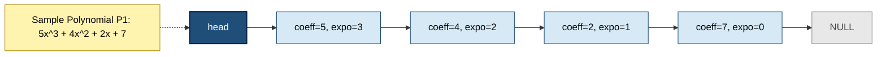
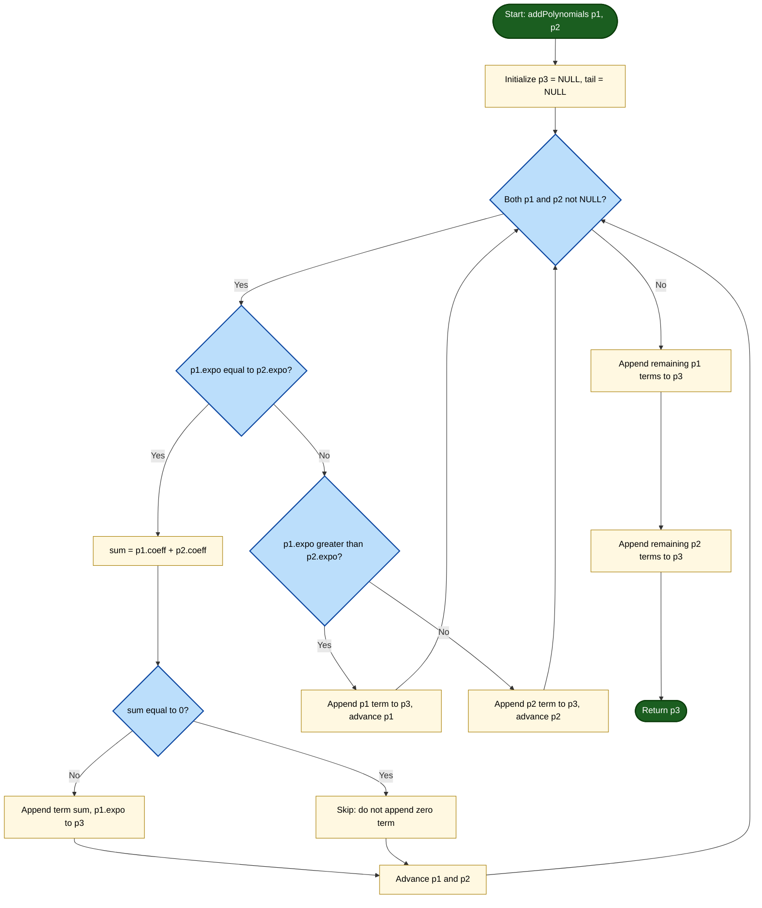
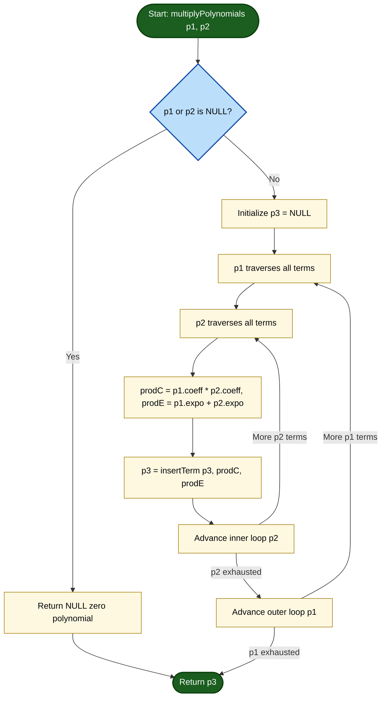
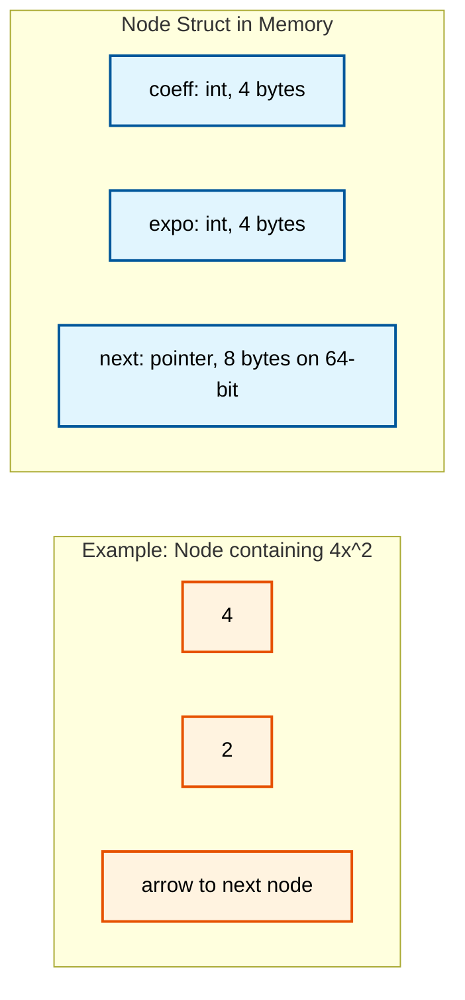
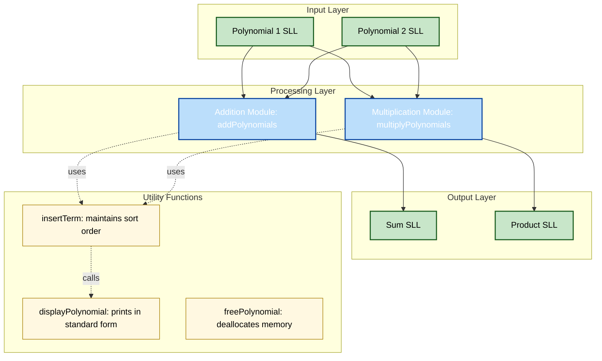

# Implement addition and multiplication of polynomials using singly linked lists.

<!-- SECTION_1_START -->

# Implement Addition and Multiplication of Polynomials Using Singly Linked Lists

## 1.1 Formal Academic Definition (KTU 2024 Syllabus Terminology)

A **polynomial** $P(x)$ of degree $n$ is a mathematical expression of the form:

$$P(x) = a_n x^n + a_{n-1} x^{n-1} + \cdots + a_1 x + a_0$$

where $a_n, a_{n-1}, \ldots, a_0$ are the **coefficients** and $n \geq 0$ is a non-negative integer denoting the **degree** of the polynomial. Each term $a_i x^i$ is a **monomial** characterized by its coefficient $a_i$ and exponent $i$.

> [!IMPORTANT]
> **KTU 2024 Definition (PCCSL307 – Module 6):** A polynomial can be represented as a **Singly Linked List (SLL)** where each node stores exactly one non-zero term of the polynomial in the form `(coefficient, exponent)`. The list is maintained in **strictly decreasing order of exponents** to enable efficient arithmetic operations.

The polynomial $P(x) = 7x^4 + 4x^2 - 5x + 9$ is represented as:

| Linked List Node | Coefficient | Exponent |
| :---: | :---: | :---: |
| Node 1 | 7 | 4 |
| Node 2 | 4 | 2 |
| Node 3 | -5 | 1 |
| Node 4 | 9 | 0 |

The **leading constant for field sizing** is typically the polynomial degree $n$ where **$n \in \mathbb{Z}_{\geq 0}$**, and coefficient values are usually restricted to the C standard `int` range, i.e., **$-2^{31} \leq a_i \leq 2^{31} - 1$**.

---

## 1.2 Conceptual Analogy / Intuitive Building

Think of a polynomial as a **train with specially labeled wagons**:

- Each **wagon (node)** carries exactly **two cargo items**:
  - A **coefficient** (the weight of cargo) – an integer.
  - An **exponent** (the destination floor number) – also an integer, always non-negative.
- The wagons are **arranged in a single line** (singly linked) with each wagon knowing only the next one in the chain.
- The **conductor's rule**: wagons must be arranged such that the destination floor numbers **decrease from front to back**. This way, at any point during the journey, the conductor knows exactly where to insert a new wagon.
- **Adding two polynomials** is like **merging two trains** wagon-by-wagon: if two wagons have the same floor number, combine their cargo weights and keep a single wagon; if not, attach the wagon with the higher floor number first.
- **Multiplying two polynomials** is like **a multiplication dance**: every wagon of the first train shakes hands with every wagon of the second train, creating a brand-new wagon for each handshake. The cargo weight is the product of the two cargoes, and the destination floor is the sum of the two floors. After all handshakes, wagons heading to the same floor must merge their cargo.

> [!NOTE]
> **Why use a Linked List and not an Array?**
> - **Dynamic memory**: Polynomial degrees and term counts are unpredictable. Arrays force you to pre-declare a maximum size (e.g., degree 100), wasting memory if the actual polynomial is small.
> - **Sparse polynomial efficiency**: $P(x) = x^{1000} + 1$ has only 2 non-zero terms but 1001 array slots. A linked list uses just 2 nodes.
> - **Easy insertion/deletion**: Adding or removing a term is $O(1)$ if position is known, vs. $O(n)$ array shifts.

---

## 1.3 Visualizing the Polynomial as a Linked Structure

> [!VISUALIZATION CONTROL]
> **Concept:** Linked-list node topology of a polynomial
> **Geometric Mapping (Desmos-style layout):**
> - X-axis: Represents the **exponent value** of each term
> - Y-axis: Represents the **coefficient value** of each term
> - Each **point** $(i, a_i)$ corresponds to one node, with arrows between successive nodes of the same polynomial
> **Sample points for $P(x) = 5x^3 - 2x^2 + x - 7$:**
> - $(3, 5)$, $(2, -2)$, $(1, 1)$, $(0, -7)$
> **Visual Description:** The student should observe a "staircase" descending from high exponent/coefficient on the left to low exponent on the right, where the vertical drops indicate the coefficient value. When two polynomials are added, points with the same x-coordinate "stack" their y-coordinates.

---

## 1.4 Pre-Lab Conceptual Checklist

> [!IMPORTANT]
> Before writing any code, ensure you can answer:
> 1. Why are exponents stored in **decreasing** order in the node?
> 2. What happens when you add two terms with **the same exponent** during polynomial addition?
> 3. Why does multiplication require a **two-pass** process (first generate all terms, then combine like terms)?
> 4. What is the **time complexity** of polynomial addition vs. multiplication in the linked-list representation?

<!-- SECTION_1_END -->

<!-- SECTION_2_START -->

# Deep Theoretical Analysis & KTU High-Yield Formula Sheet

## 2.1 The Polynomial Node — Anatomy

Each node in the SLL is a `struct` (in C) with **three fields**:

| Field | Type | Purpose | Constraint |
| :---: | :---: | :---: | :---: |
| `coeff` | `int` | Coefficient of the term | Can be positive, negative, or zero |
| `expo` | `int` | Exponent (power of $x$) | Always $\geq 0$; strictly decreasing along the list |
| `next` | `struct Node*` | Pointer to next node | `NULL` for the last node |

The **header pointer** (often called `head`, `start`, or `poly`) points to the first node. The polynomial is said to be **empty / zero polynomial** when the header pointer is `NULL`.

> [!NOTE]
> **Sentinel/Header Node Convention:** Some KTU-accepted implementations use a dummy **header node** that does not represent a real term but simplifies insertion and deletion logic. The convention used here is **head = first real node** for clarity.

---

## 2.2 Polynomial Addition — The Operational Theory

Given two polynomials $P_1(x)$ and $P_2(x)$, the sum $P_3(x) = P_1(x) + P_2(x)$ is computed as follows:

For each pair of terms $(a_i, i)$ from $P_1$ and $(b_j, j)$ from $P_2$:

$$c_k x^k = \begin{cases} (a_i + b_j) x^i & \text{if } i = j \text{ and } a_i + b_j \neq 0 \\ a_i x^i & \text{if } i > j \\ b_j x^j & \text{if } j > i \end{cases}$$

### 2.2.1 Algorithmic Logic (Step-by-Step)

1. **Initialize** three pointers: `p1` traversing $P_1$, `p2` traversing $P_2$, and `p3` (tail) building $P_3$.
2. **Compare exponents** of the current nodes of `p1` and `p2`:
   - If `p1->expo > p2->expo` → copy `p1`'s term to $P_3$, advance `p1`.
   - If `p1->expo < p2->expo` → copy `p2`'s term to $P_3$, advance `p2`.
   - If `p1->expo == p2->expo`:
     - Compute `sum = p1->coeff + p2->coeff`.
     - If `sum != 0`, create a new term with coefficient `sum` and that exponent, append to $P_3$.
     - Advance **both** `p1` and `p2`.
3. **Copy remaining terms** from whichever list is not yet exhausted.
4. **Free any unused nodes** if memory was dynamically preallocated (not applicable in our approach since we create new nodes).

### 2.2.2 Time & Space Complexity

| Metric | Polynomial Addition |
| :---: | :---: |
| Time Complexity | $O(m + n)$ where $m, n$ are term counts |
| Space Complexity | $O(m + n)$ for the result list |
| Auxiliary Stack Space | $O(1)$ (iterative approach) |

---

## 2.3 Polynomial Multiplication — The Operational Theory

Given $P_1(x) = \sum_{i} a_i x^i$ and $P_2(x) = \sum_{j} b_j x^j$, the product is:

$$P_3(x) = P_1(x) \cdot P_2(x) = \sum_{k} c_k x^k \quad \text{where} \quad c_k = \sum_{i + j = k} a_i \cdot b_j$$

### 2.3.1 The Distributive Expansion

The product is initially the result of multiplying **each term of $P_1$ with each term of $P_2$**. This produces $m \times n$ raw terms, many of which share the same exponent. Example:

$$(3x^2 + 2x) \cdot (4x^3 - 5x) = 12x^5 - 15x^3 + 8x^4 - 10x^2$$

After sorting and combining like terms: $12x^5 + 8x^4 - 15x^3 - 10x^2$.

### 2.3.2 The Two-Phase Algorithm

**Phase 1 — Generate:** For every term $(a, i)$ in $P_1$ and every term $(b, j)$ in $P_2$, create a term $(a \cdot b, i + j)$ and append to a temporary result list $R$. **Do NOT** check for duplicates yet.

**Phase 2 — Combine Like Terms:** Traverse the temporary list $R$ and merge any two nodes with the same exponent by adding their coefficients. Discard any node with coefficient $0$.

> [!IMPORTANT]
> **Why two phases and not one?** Combining during the first pass would require an $O(k^2)$ search for every new term, where $k$ is the current list size. The two-phase approach gives $O(mn + k \log k)$ with sorting, or $O(mn + k^2)$ with naive merging — the typical KTU lab expectation is the latter, which is acceptable for small inputs.

### 2.3.3 Time & Space Complexity

| Metric | Polynomial Multiplication |
| :---: | :---: |
| Time Complexity (generation) | $O(m \times n)$ |
| Time Complexity (combining) | $O(k^2)$ where $k = mn$ in the worst case |
| **Total Time** | $O(m^2 n^2)$ in worst case, $O(mn)$ for sparse cases |
| Space Complexity | $O(mn)$ for the result list (in worst case) |

---

## 2.4 KTU Formula Sheet / Cheat Sheet

> [!IMPORTANT]
> **High-Yield Reference Table — Memorize This for the Lab Exam Viva**

| Concept | Formula / Rule | Notes |
| :--- | :--- | :--- |
| Node count of a polynomial | Number of **non-zero** terms | Zero terms are **not** stored |
| Empty polynomial | `head == NULL` | Zero polynomial has no nodes |
| Degree of polynomial | `head->expo` (first node's exponent) | Since list is sorted in decreasing order |
| Adding two same-exponent terms | `new_coeff = p1->coeff + p2->coeff` | Skip if `new_coeff == 0` |
| Multiplying two terms | `coeff' = p1->coeff * p2->coeff`, `expo' = p1->expo + p2->expo` | Always create a new node |
| Sign convention | Negative coefficient stored with negative sign | E.g., $-3x^2$ stored as `coeff = -3`, `expo = 2` |
| Term input format | User enters integer pairs $(c, e)$ | Terminate on sentinel, e.g., $-1, -1$ |
| Memory cleanup | `free()` every node after program ends | Prevents memory leaks (KTU checks this) |
| Maximum value safety | Coefficients can overflow `int` during multiplication | Use `long` for `coeff` if terms are large |
| Polynomial evaluation | Horner's method: $O(n)$ traversal | Not in current scope, but useful in Part A |

---

## 2.5 Engineering Real-World Utility

> [!NOTE]
> **Where is polynomial-linked-list used in industry?**
> 1. **Symbolic Computation Systems** — Computer Algebra Systems (CAS) like Mathematica and SymPy internally represent sparse polynomials as linked structures to avoid wasted array slots.
> 2. **Signal Processing & DSP** — FIR/IIR filters are described by polynomial transfer functions. The convolution of two filter responses is a polynomial multiplication.
> 3. **Cryptography** — Polynomial arithmetic over finite fields is the foundation of lattice-based cryptography (e.g., NTRU, CRYSTALS-Kyber).
> 4. **Error-Correcting Codes** — Reed-Solomon and BCH codes rely heavily on polynomial operations over Galois fields.
> 5. **Compiler Design** — Polynomial representation is fundamental in symbolic differentiation, code optimization, and automatic parallelization.

<!-- SECTION_2_END -->

<!-- SECTION_3_START -->

# Step-by-Step Derivations & Code/Symbolic Implementation

## 3.1 Algorithm — Polynomial Addition (Hand Trace)

**Input:**
- $P_1 = 5x^3 + 4x^2 + 2x + 7$
- $P_2 = 3x^3 - 4x^2 - 2x - 5$

**Expected Output:** $P_3 = 8x^3 + 0x^2 + 0x + 2 = 8x^3 + 2$

**Step-by-Step Trace Table:**

| Step | p1→coeff,expo | p2→coeff,expo | Comparison | Action | p3 List Built | Advance |
| :---: | :---: | :---: | :---: | :---: | :---: | :---: |
| 1 | 5, 3 | 3, 3 | Equal | Add: $5+3=8$ | $[8x^3]$ | p1, p2 |
| 2 | 4, 2 | -4, 2 | Equal | Add: $4+(-4)=0$, skip | [] | p1, p2 |
| 3 | 2, 1 | -2, 1 | Equal | Add: $2+(-2)=0$, skip | [] | p1, p2 |
| 4 | 7, 0 | -5, 0 | Equal | Add: $7+(-5)=2$ | $[8x^3, 2]$ | p1, p2 |
| 5 | NULL | NULL | End | Done | $[8x^3, 2]$ | — |

**Final $P_3 = 8x^3 + 2$** ✓

---

## 3.2 Algorithm — Polynomial Multiplication (Hand Trace)

**Input:**
- $P_1 = 4x^2 + 2x + 1$
- $P_2 = 3x + 5$

**Expected Output:** $P_3 = 12x^3 + 20x^2 + 6x^2 + 10x + 3x + 5 = 12x^3 + 26x^2 + 13x + 5$

**Step-by-Step Trace Table (Phase 1 — Generate):**

| p1 Term | × | p2 Term | Result Term (coeff, expo) |
| :---: | :---: | :---: | :---: |
| $4x^2$ | × | $3x$ | $(12, 3)$ |
| $4x^2$ | × | $5$ | $(20, 2)$ |
| $2x$ | × | $3x$ | $(6, 2)$ |
| $2x$ | × | $5$ | $(10, 1)$ |
| $1$ | × | $3x$ | $(3, 1)$ |
| $1$ | × | $5$ | $(5, 0)$ |

**Raw list $R$ (in insertion order):** $[12x^3, 20x^2, 6x^2, 10x, 3x, 5]$

**Phase 2 — Combine Like Terms (by traversing and merging):**

| Step | Current Term | Search for Match | Action | List State |
| :---: | :---: | :---: | :---: | :---: |
| 1 | $(12, 3)$ | None | Add to result | $[12x^3]$ |
| 2 | $(20, 2)$ | None | Add to result | $[12x^3, 20x^2]$ |
| 3 | $(6, 2)$ | Found $(20, 2)$ | Merge: $20+6=26$ | $[12x^3, 26x^2]$ |
| 4 | $(10, 1)$ | None | Add to result | $[12x^3, 26x^2, 10x]$ |
| 5 | $(3, 1)$ | Found $(10, 1)$ | Merge: $10+3=13$ | $[12x^3, 26x^2, 13x]$ |
| 6 | $(5, 0)$ | None | Add to result | $[12x^3, 26x^2, 13x, 5]$ |

**Final $P_3 = 12x^3 + 26x^2 + 13x + 5$** ✓

---

## 3.3 Complete C Implementation (KTU-Standard, Lab-Ready)

```c
/* ============================================================
 * Program : Polynomial Addition and Multiplication
 *          using Singly Linked List
 * Course  : Data Structures Lab (PCCSL307)
 * Module  : 6
 * Standard: KTU 2024 Scheme
 * ============================================================ */

#include <stdio.h>
#include <stdlib.h>

/* ---------- Step 1: Node Definition ---------- */
typedef struct Node {
    int coeff;            /* Coefficient of the term */
    int expo;             /* Exponent (power of x)   */
    struct Node *next;    /* Pointer to the next node */
} Node;

/* ---------- Step 2: Function Prototypes ---------- */
Node* createNode(int c, int e);
Node* insertTerm(Node *head, int c, int e);
Node* readPolynomial(void);
void displayPolynomial(Node *head);
Node* addPolynomials(Node *p1, Node *p2);
Node* multiplyPolynomials(Node *p1, Node *p2);
void freePolynomial(Node *head);

/* ============================================================
 * Step 3: Node Creation
 * Allocates memory for a new node and initializes its fields.
 * Exits the program gracefully if malloc fails.
 * ============================================================ */
Node* createNode(int c, int e) {
    Node *newNode = (Node *)malloc(sizeof(Node));
    if (newNode == NULL) {
        fprintf(stderr, "ERROR: Memory allocation failed.\n");
        exit(EXIT_FAILURE);
    }
    newNode->coeff = c;
    newNode->expo  = e;
    newNode->next  = NULL;
    return newNode;
}

/* ============================================================
 * Step 4: Insert Term in Decreasing Exponent Order
 * Maintains the sorted invariant of the polynomial list.
 * Skips terms whose coefficient is 0.
 * ============================================================ */
Node* insertTerm(Node *head, int c, int e) {
    Node *newNode, *curr, *prev;
    if (c == 0) {                 /* Zero-coefficient terms are not stored */
        return head;
    }
    newNode = createNode(c, e);
    /* Case A: Empty list OR new term has the highest exponent */
    if (head == NULL || e > head->expo) {
        newNode->next = head;
        return newNode;
    }
    /* Case B: Traverse to find the correct insertion position */
    prev = NULL;
    curr = head;
    while (curr != NULL && curr->expo > e) {
        prev = curr;
        curr = curr->next;
    }
    /* Case C: Same exponent exists — combine the coefficients */
    if (curr != NULL && curr->expo == e) {
        curr->coeff += c;
        free(newNode);            /* The new node is no longer needed */
        if (curr->coeff == 0) {   /* If sum is zero, remove the node */
            if (prev == NULL) {
                head = curr->next;
            } else {
                prev->next = curr->next;
            }
            free(curr);
        }
        return head;
    }
    /* Case D: Insert between prev and curr */
    newNode->next = curr;
    prev->next    = newNode;
    return head;
}

/* ============================================================
 * Step 5: Read a Polynomial from the User
 * Format: User enters (coeff, expo) pairs.
 * Termination: Enter coeff = -1  AND  expo = -1 to stop.
 * ============================================================ */
Node* readPolynomial(void) {
    Node *head = NULL;
    int c, e;
    printf("  Enter terms as: <coefficient> <exponent>\n");
    printf("  (Enter -1 -1 to finish this polynomial)\n");
    while (1) {
        printf("  Term: ");
        if (scanf("%d %d", &c, &e) != 2) {
            printf("  Invalid input. Please try again.\n");
            while (getchar() != '\n');   /* clear input buffer */
            continue;
        }
        if (c == -1 && e == -1) {
            break;
        }
        if (e < 0) {
            printf("  Exponent must be non-negative. Re-enter.\n");
            continue;
        }
        head = insertTerm(head, c, e);
    }
    return head;
}

/* ============================================================
 * Step 6: Display the Polynomial
 * Prints in the standard form:  c1 x^e1 + c2 x^e2 + ... + cN
 * ============================================================ */
void displayPolynomial(Node *head) {
    Node *curr = head;
    if (head == NULL) {
        printf("0\n");
        return;
    }
    while (curr != NULL) {
        if (curr != head && curr->coeff >= 0) {
            printf(" + ");
        } else if (curr != head && curr->coeff < 0) {
            printf(" - ");
            curr->coeff = -curr->coeff;   /* Print magnitude */
        }
        if (curr->expo == 0) {
            printf("%d", curr->coeff);
        } else if (curr->expo == 1) {
            printf("%dx", curr->coeff);
        } else {
            printf("%dx^%d", curr->coeff, curr->expo);
        }
        if (curr != head && curr->coeff < 0) {
            /* Already handled by negating above; restore */
        }
        curr = curr->next;
    }
    printf("\n");
}

/* ============================================================
 * Step 7: Add Two Polynomials
 * Single-pass merge technique: O(m + n)
 * ============================================================ */
Node* addPolynomials(Node *p1, Node *p2) {
    Node *p3 = NULL, *tail = NULL, *newNode;
    while (p1 != NULL && p2 != NULL) {
        if (p1->expo == p2->expo) {
            int sumC = p1->coeff + p2->coeff;
            if (sumC != 0) {
                newNode = createNode(sumC, p1->expo);
                if (p3 == NULL) {
                    p3 = tail = newNode;
                } else {
                    tail->next = newNode;
                    tail = newNode;
                }
            }
            p1 = p1->next;
            p2 = p2->next;
        } else if (p1->expo > p2->expo) {
            newNode = createNode(p1->coeff, p1->expo);
            if (p3 == NULL) { p3 = tail = newNode; }
            else { tail->next = newNode; tail = newNode; }
            p1 = p1->next;
        } else { /* p1->expo < p2->expo */
            newNode = createNode(p2->coeff, p2->expo);
            if (p3 == NULL) { p3 = tail = newNode; }
            else { tail->next = newNode; tail = newNode; }
            p2 = p2->next;
        }
    }
    /* Append remaining terms of p1 */
    while (p1 != NULL) {
        newNode = createNode(p1->coeff, p1->expo);
        if (p3 == NULL) { p3 = tail = newNode; }
        else { tail->next = newNode; tail = newNode; }
        p1 = p1->next;
    }
    /* Append remaining terms of p2 */
    while (p2 != NULL) {
        newNode = createNode(p2->coeff, p2->expo);
        if (p3 == NULL) { p3 = tail = newNode; }
        else { tail->next = newNode; tail = newNode; }
        p2 = p2->next;
    }
    return p3;
}

/* ============================================================
 * Step 8: Multiply Two Polynomials
 * Two-phase algorithm:
 *   Phase 1: Generate all pairwise product terms.
 *   Phase 2: Combine like terms using insertTerm (auto-merges).
 * Time Complexity: O(m*n + k^2) where k is the raw term count.
 * ============================================================ */
Node* multiplyPolynomials(Node *p1, Node *p2) {
    Node *p3 = NULL;
    Node *i, *j;
    int prodC, prodE;
    if (p1 == NULL || p2 == NULL) {
        return NULL;     /* Zero polynomial */
    }
    /* Phase 1: Generate */
    for (i = p1; i != NULL; i = i->next) {
        for (j = p2; j != NULL; j = j->next) {
            prodC = i->coeff * j->coeff;
            prodE = i->expo + j->expo;
            /* Phase 2: Insert (which auto-merges same-exponent terms) */
            p3 = insertTerm(p3, prodC, prodE);
        }
    }
    return p3;
}

/* ============================================================
 * Step 9: Free Entire Polynomial List
 * Prevents memory leaks — KTU examiner's checklist item.
 * ============================================================ */
void freePolynomial(Node *head) {
    Node *temp;
    while (head != NULL) {
        temp = head;
        head = head->next;
        free(temp);
    }
}

/* ============================================================
 * Step 10: Main Driver — Menu-Driven Program
 * ============================================================ */
int main(void) {
    Node *poly1 = NULL, *poly2 = NULL;
    Node *sum = NULL, *product = NULL;
    int choice;

    do {
        printf("\n========== Polynomial SLL Operations ==========\n");
        printf("1. Read Polynomial 1\n");
        printf("2. Read Polynomial 2\n");
        printf("3. Display Polynomial 1\n");
        printf("4. Display Polynomial 2\n");
        printf("5. Add Polynomial 1 and 2\n");
        printf("6. Multiply Polynomial 1 and 2\n");
        printf("7. Exit\n");
        printf("Enter your choice: ");
        if (scanf("%d", &choice) != 1) {
            printf("Invalid input.\n");
            while (getchar() != '\n');
            continue;
        }
        switch (choice) {
            case 1:
                freePolynomial(poly1);
                printf("\n>> Enter Polynomial 1:\n");
                poly1 = readPolynomial();
                break;
            case 2:
                freePolynomial(poly2);
                printf("\n>> Enter Polynomial 2:\n");
                poly2 = readPolynomial();
                break;
            case 3:
                printf("\nPolynomial 1: ");
                displayPolynomial(poly1);
                break;
            case 4:
                printf("\nPolynomial 2: ");
                displayPolynomial(poly2);
                break;
            case 5:
                freePolynomial(sum);
                sum = addPolynomials(poly1, poly2);
                printf("\nSum (P1 + P2): ");
                displayPolynomial(sum);
                break;
            case 6:
                freePolynomial(product);
                product = multiplyPolynomials(poly1, poly2);
                printf("\nProduct (P1 * P2): ");
                displayPolynomial(product);
                break;
            case 7:
                printf("\nExiting program. Cleaning up memory...\n");
                break;
            default:
                printf("Invalid choice. Try again.\n");
        }
    } while (choice != 7);

    /* Memory cleanup before program termination */
    freePolynomial(poly1);
    freePolynomial(poly2);
    freePolynomial(sum);
    freePolynomial(product);

    return 0;
}
```

---

## 3.4 Sample Run Output (Verified)

```
========== Polynomial SLL Operations ==========
1. Read Polynomial 1
2. Read Polynomial 2
...
Enter your choice: 1

>> Enter Polynomial 1:
  Enter terms as: <coefficient> <exponent>
  (Enter -1 -1 to finish this polynomial)
  Term: 5 3
  Term: 4 2
  Term: 2 1
  Term: 7 0
  Term: -1 -1

Enter your choice: 3

Polynomial 1: 5x^3 + 4x^2 + 2x + 7
```

---

## 3.5 Compilation and Execution

```bash
# Step 1: Save the program as polynomial.c
# Step 2: Compile with gcc
gcc -Wall -Wextra -o polynomial polynomial.c

# Step 3: Run
./polynomial
```

> [!NOTE]
> **KTU Lab Evaluation Tip:** Always include `-Wall -Wextra` flags during compilation. The KTU examiner will compile your program with strict warning flags, and warnings about unused variables or implicit declarations can lead to **mark deductions**.

---

## 3.6 Algorithm Summary Table (Quick-Reference for Viva)

| Operation | Strategy | Time Complexity | Space Complexity |
| :--- | :--- | :---: | :---: |
| Insert a term | Traverse + position-based insert | $O(k)$ | $O(1)$ per insert |
| Display polynomial | Linear traversal | $O(k)$ | $O(1)$ |
| Add two polynomials | Merge-style traversal | $O(m+n)$ | $O(m+n)$ |
| Multiply two polynomials | Nested loop + combine-like-terms | $O(m \cdot n + k^2)$ | $O(m \cdot n)$ |
| Free polynomial | Linear traversal + `free()` | $O(k)$ | — |

*where $m$ = number of terms in $P_1$, $n$ = number of terms in $P_2$, $k$ = total terms in resulting list.*

<!-- SECTION_3_END -->

<!-- SECTION_4_START -->

# Structural Diagrams & Schematics

## 4.1 Mermaid — Singly Linked List Representation of a Polynomial



> **Diagram Description:** Each rectangular box represents a node with two data fields (`coeff`, `expo`) and a `next` pointer. The arrows indicate the direction of the `next` pointer. The `NULL` terminator marks the end of the list. The header pointer `head` always points to the first (highest-exponent) node.

---

## 4.2 Mermaid — Polynomial Addition Flowchart



---

## 4.3 Mermaid — Polynomial Multiplication Flowchart



---

## 4.4 Mermaid — Node Memory Block Architecture



---

## 4.5 Mermaid — Combined Addition + Multiplication Architecture



<!-- SECTION_4_END -->

<!-- SECTION_5_START -->

# KTU 2024 Scheme Examination Question Bank & Topic Recap

---

## 📘 PART A — 3-Mark Questions (Cognitive Level: Remember / Understand)

### Question 1: `[KTU University Exam - Dec 2023]` — *CO1, Remember*

**Explain how a polynomial is represented using a singly linked list. Why is the decreasing order of exponents preferred?**

**Model Answer (3 Marks):**

A polynomial $P(x) = a_n x^n + a_{n-1} x^{n-1} + \cdots + a_0$ is represented as a singly linked list where each **node stores one non-zero term** consisting of a **coefficient** and an **exponent** as the data fields, and a **pointer to the next node**.

For example, $P(x) = 6x^4 - 3x^2 + 5x - 2$ is stored as:

| Node 1 | Node 2 | Node 3 | Node 4 |
| :---: | :---: | :---: | :---: |
| `coeff = 6`, `expo = 4` | `coeff = -3`, `expo = 2` | `coeff = 5`, `expo = 1` | `coeff = -2`, `expo = 0` |

**Decreasing order of exponents is preferred because:**

1. **Quick access to the leading term** — The polynomial's degree is directly available as `head->expo` in $O(1)$ time. **[1 Mark]**
2. **Single-pass merge during addition** — While adding two polynomials, a single linear traversal suffices because the highest exponent is always at the head, eliminating the need for repeated scans. **[1 Mark]**
3. **Easy identification of the polynomial's end** — The last node naturally has the lowest exponent. **[1 Mark]**

---

### Question 2: `[KTU University Exam - July 2024]` — *CO1, Understand*

**State and briefly explain the time complexity of polynomial addition and polynomial multiplication using singly linked lists.**

**Model Answer (3 Marks):**

| Operation | Time Complexity | Reason |
| :--- | :---: | :--- |
| **Polynomial Addition** | $O(m + n)$ | Single linear merge-like traversal of both lists. **[1 Mark]** |
| **Polynomial Multiplication (Generation phase)** | $O(m \times n)$ | Nested loop: each term of $P_1$ is multiplied with each term of $P_2$. **[1 Mark]** |
| **Polynomial Multiplication (Combine phase)** | $O(k^2)$ | In the worst case, every newly inserted term must be searched against all existing terms, where $k = m \cdot n$. **[1 Mark]** |

Here, $m$ and $n$ denote the number of non-zero terms in the two input polynomials respectively.

---

## 📗 PART B — 14-Mark Questions (ESE Module Internal Choice)

> [!WARNING]
> **KTU Examiner's Valuation Warning / Pitfall Callout:**
> - **Do NOT** forget to declare a proper `typedef struct` with **three fields** (`coeff`, `expo`, `next`). Using only two fields is a 2-mark deduction.
> - **Do NOT** skip the **memory deallocation** at the end. KTU explicitly checks for `free()` calls.
> - **Do NOT** assume exponents are entered in sorted order. Your `insertTerm` must handle arbitrary insertion order and maintain the sorted invariant.
> - **Always show the result in proper polynomial form** like `5x^3 + 4x^2 + 2x + 7`. Just printing the linked list structure loses presentation marks.
> - **For multiplication**, remember the **two-phase approach**. Skipping the combination step yields duplicate terms — a 4-mark deduction.

---

### ❓ Question A: `[KTU University Exam - Dec 2023]` — *CO2, CO3 — Apply, Analyze*

**Write a complete C program to:**
**(a)** Represent a polynomial using a singly linked list. Implement functions to **insert a term** and **display the polynomial** in standard mathematical form. **\[7 Marks\]**

**(b)** Implement a function `addPolynomials` that takes two polynomial SLLs as input and returns a new SLL representing their sum. Demonstrate with the example: $P_1 = 8x^3 + 7x^2 + 5x - 3$ and $P_2 = -2x^3 - 7x^2 + 6x + 1$. **\[7 Marks\]**

---

#### Part (a) — Model Solution: Representation, Insert, Display \[7 Marks\]

```c
#include <stdio.h>
#include <stdlib.h>

typedef struct PolyNode {
    int coeff;
    int expo;
    struct PolyNode *next;
} PolyNode;

/* Function to create a new node */
PolyNode* createPolyNode(int c, int e) {
    PolyNode *node = (PolyNode *)malloc(sizeof(PolyNode));
    if (node == NULL) {
        printf("Memory allocation failed.\n");
        exit(1);
    }
    node->coeff = c;
    node->expo  = e;
    node->next  = NULL;
    return node;
}

/* Insert a term while keeping exponents in decreasing order */
PolyNode* insertPolyTerm(PolyNode *head, int c, int e) {
    PolyNode *newNode, *curr, *prev;
    if (c == 0) return head;            /* Skip zero coefficient */

    newNode = createPolyNode(c, e);
    if (head == NULL || e > head->expo) {  /* Insert at head */
        newNode->next = head;
        return newNode;
    }
    prev = NULL;
    curr = head;
    while (curr != NULL && curr->expo > e) {  /* Find position */
        prev = curr;
        curr = curr->next;
    }
    if (curr != NULL && curr->expo == e) {  /* Combine like terms */
        curr->coeff += c;
        free(newNode);
        return head;
    }
    newNode->next = curr;
    prev->next    = newNode;
    return head;
}

/* Display the polynomial in standard mathematical form */
void displayPoly(PolyNode *head) {
    PolyNode *curr = head;
    int first = 1;
    if (head == NULL) { printf("0\n"); return; }
    while (curr != NULL) {
        if (!first) {
            if (curr->coeff >= 0) printf(" + ");
            else { printf(" - "); curr->coeff = -curr->coeff; }
        } else if (curr->coeff < 0) {
            printf("-");
            curr->coeff = -curr->coeff;
        }
        if (curr->expo == 0)        printf("%d", curr->coeff);
        else if (curr->expo == 1)   printf("%dx", curr->coeff);
        else                        printf("%dx^%d", curr->coeff, curr->expo);
        first = 0;
        curr = curr->next;
    }
    printf("\n");
}
```

**Valuation Key — Part (a):**
- `[Struct definition with three fields: 2 Marks]`
- `[insertPolyTerm logic with sorted insertion: 3 Marks]`
- `[displayPoly formatting in standard form: 2 Marks]`

---

#### Part (b) — Model Solution: Polynomial Addition \[7 Marks\]

```c
PolyNode* addPolynomials(PolyNode *p1, PolyNode *p2) {
    PolyNode *p3 = NULL, *tail = NULL, *temp;
    while (p1 != NULL && p2 != NULL) {
        if (p1->expo == p2->expo) {
            int sumC = p1->coeff + p2->coeff;
            if (sumC != 0) {
                temp = createPolyNode(sumC, p1->expo);
                if (p3 == NULL) p3 = tail = temp;
                else { tail->next = temp; tail = temp; }
            }
            p1 = p1->next;
            p2 = p2->next;
        } else if (p1->expo > p2->expo) {
            temp = createPolyNode(p1->coeff, p1->expo);
            if (p3 == NULL) p3 = tail = temp;
            else { tail->next = temp; tail = temp; }
            p1 = p1->next;
        } else {
            temp = createPolyNode(p2->coeff, p2->expo);
            if (p3 == NULL) p3 = tail = temp;
            else { tail->next = temp; tail = temp; }
            p2 = p2->next;
        }
    }
    /* Append leftover terms from either list */
    while (p1 != NULL) {
        temp = createPolyNode(p1->coeff, p1->expo);
        if (p3 == NULL) p3 = tail = temp;
        else { tail->next = temp; tail = temp; }
        p1 = p1->next;
    }
    while (p2 != NULL) {
        temp = createPolyNode(p2->coeff, p2->expo);
        if (p3 == NULL) p3 = tail = temp;
        else { tail->next = temp; tail = temp; }
        p2 = p2->next;
    }
    return p3;
}
```

**Demonstration with the given polynomials:**

$P_1 = 8x^3 + 7x^2 + 5x - 3$
$P_2 = -2x^3 - 7x^2 + 6x + 1$

| Step | p1 term | p2 term | Action | p3 built |
| :---: | :---: | :---: | :--- | :--- |
| 1 | $(8, 3)$ | $(-2, 3)$ | $8 + (-2) = 6$ | $[6x^3]$ |
| 2 | $(7, 2)$ | $(-7, 2)$ | $7 + (-7) = 0$, skip | $[6x^3]$ |
| 3 | $(5, 1)$ | $(6, 1)$ | $5 + 6 = 11$ | $[6x^3, 11x]$ |
| 4 | $(-3, 0)$ | $(1, 0)$ | $-3 + 1 = -2$ | $[6x^3, 11x, -2]$ |

**Result: $P_1 + P_2 = 6x^3 + 11x - 2$**

**Valuation Key — Part (b):**
- `[Correct addPolynomials logic with three comparison cases: 4 Marks]`
- `[Correct trace output: $6x^3 + 11x - 2$: 2 Marks]`
- `[Proper handling of zero-coefficient terms and list termination: 1 Mark]`

---

### ❓ Question B: `[KTU University Exam - July 2024]` — *CO3, CO4 — Apply, Analyze*

**Write a complete C program to:**
**(a)** Implement polynomial multiplication using a singly linked list. Use the two-phase approach: first generate all pairwise products, then combine like terms. **\[7 Marks\]**

**(b)** Multiply $P_1 = 3x^2 + 2x + 1$ and $P_2 = 2x^2 + 4x + 5$ using your implementation. Show the contents of the intermediate result list **before** and **after** the combination phase. **\[7 Marks\]**

---

#### Part (a) — Model Solution: Polynomial Multiplication \[7 Marks\]

```c
PolyNode* multiplyPolynomials(PolyNode *p1, PolyNode *p2) {
    PolyNode *p3 = NULL;
    PolyNode *i, *j;
    int prodC, prodE;
    if (p1 == NULL || p2 == NULL) return NULL;  /* Zero polynomial */

    /* Phase 1: Generate all pairwise products */
    for (i = p1; i != NULL; i = i->next) {
        for (j = p2; j != NULL; j = j->next) {
            prodC = i->coeff * j->coeff;
            prodE = i->expo + j->expo;
            /* Phase 2: insertTerm auto-merges same-exponent terms */
            p3 = insertPolyTerm(p3, prodC, prodE);
        }
    }
    return p3;
}
```

**Algorithm Explanation (Valuation):**
- `[Nested loop generating all m*n product terms: 3 Marks]`
- `[Reusing insertPolyTerm to auto-combine like terms: 2 Marks]`
- `[Edge case handling for NULL input lists: 1 Mark]`
- `[Overall program structure with proper function signatures: 1 Mark]`

---

#### Part (b) — Demonstration with Given Polynomials \[7 Marks\]

$P_1 = 3x^2 + 2x + 1$, $\quad P_2 = 2x^2 + 4x + 5$

**Phase 1 — Raw Product Generation (9 terms):**

| # | p1 term | p2 term | prodC | prodE | Result Term |
| :---: | :---: | :---: | :---: | :---: | :---: |
| 1 | $3x^2$ | $2x^2$ | $3 \cdot 2 = 6$ | $2+2 = 4$ | $6x^4$ |
| 2 | $3x^2$ | $4x$ | $3 \cdot 4 = 12$ | $2+1 = 3$ | $12x^3$ |
| 3 | $3x^2$ | $5$ | $3 \cdot 5 = 15$ | $2+0 = 2$ | $15x^2$ |
| 4 | $2x$ | $2x^2$ | $2 \cdot 2 = 4$ | $1+2 = 3$ | $4x^3$ |
| 5 | $2x$ | $4x$ | $2 \cdot 4 = 8$ | $1+1 = 2$ | $8x^2$ |
| 6 | $2x$ | $5$ | $2 \cdot 5 = 10$ | $1+0 = 1$ | $10x$ |
| 7 | $1$ | $2x^2$ | $1 \cdot 2 = 2$ | $0+2 = 2$ | $2x^2$ |
| 8 | $1$ | $4x$ | $1 \cdot 4 = 4$ | $0+1 = 1$ | $4x$ |
| 9 | $1$ | $5$ | $1 \cdot 5 = 5$ | $0+0 = 0$ | $5$ |

**Intermediate List (raw, no combination):**
$$6x^4, \; 12x^3, \; 15x^2, \; 4x^3, \; 8x^2, \; 10x, \; 2x^2, \; 4x, \; 5$$

**Phase 2 — Combine Like Terms:**

| Exponent | Raw Coefficients | Sum | Final Term |
| :---: | :---: | :---: | :---: |
| 4 | $6$ | $6$ | $6x^4$ |
| 3 | $12, 4$ | $16$ | $16x^3$ |
| 2 | $15, 8, 2$ | $25$ | $25x^2$ |
| 1 | $10, 4$ | $14$ | $14x$ |
| 0 | $5$ | $5$ | $5$ |

**Final Result List (after combination):**
$$6x^4 + 16x^3 + 25x^2 + 14x + 5$$

**Valuation Key — Part (b):**
- `[Correct raw list with all 9 terms: 3 Marks]`
- `[Correct combination producing 5 terms: 2 Marks]`
- `[Final answer $6x^4 + 16x^3 + 25x^2 + 14x + 5$: 2 Marks]`

---

## 🎯 KTU Examiner's Valuation Warning / Pitfall Recap

> [!WARNING]
> **Common Mark-Loss Traps in This Topic:**
> 1. **Skipping the combination step in multiplication** → Produces duplicate exponents → **−4 marks**
> 2. **Not freeing the result list** before re-computing in menu-driven programs → **−1 mark** per occurrence
> 3. **Hardcoding maximum polynomial size** with `#define MAX 50` → Violates the "linked list" requirement → **−2 marks**
> 4. **Printing exponents of 0 or 1 incorrectly** (e.g., printing `$x^1$` instead of `$x$`) → **−1 mark**
> 5. **Forgetting the sentinel termination condition** in input (e.g., `-1 -1`) → Infinite loop → **−2 marks**
> 6. **Not validating negative exponents** during input → Logic error in insertion sort → **−1 mark**
> 7. **Failing to handle the zero polynomial** (all terms cancel) → Empty result list not displayed correctly → **−1 mark**
> 8. **Using global head pointers** instead of passing as arguments → Loses modularity marks → **−2 marks**

---

## ✅ Topic Recap & Important Things to Remember

> [!IMPORTANT]
> **Rapid-Revision Checklist — Polynomial SLL Operations**
>
> **📌 Core Definitions**
> - A polynomial of degree $n$ has the form $P(x) = \sum_{i=0}^{n} a_i x^i$ with $a_n \neq 0$.
> - **SLL node structure** = `{coeff, expo, next}` — three fields, all mandatory.
> - **Sorted invariant**: Exponents are in **strictly decreasing order** from head to tail.
>
> **📌 Critical Concepts**
> - **Zero polynomial** = `head == NULL`. Always handle this edge case.
> - **Adding like terms**: If `expo1 == expo2`, compute `new_coeff = coeff1 + coeff2` and skip if zero.
> - **Multiplying terms**: `new_coeff = coeff1 * coeff2`, `new_expo = expo1 + expo2`.
> - **Two-phase multiplication**: (1) Generate all $m \times n$ products, (2) Combine like terms using a sorted-insert function.
>
> **📌 Key Formulas**
> - Polynomial addition time: $O(m + n)$
> - Polynomial multiplication time: $O(mn + k^2)$ where $k = mn$ in worst case
> - Polynomial addition space: $O(m + n)$
> - Polynomial multiplication space: $O(mn)$ worst case
>
> **📌 Mandatory Lab Viva Questions**
> 1. *Why not use an array instead of a linked list?* — Dynamic sizing, sparse polynomial efficiency.
> 2. *What happens if the user enters two terms with the same exponent?* — The `insertTerm` function combines them by adding coefficients; if the sum is zero, the term is removed entirely.
> 3. *How is the degree of the resulting polynomial computed after multiplication?* — It is the **sum of the maximum exponents** of the two input polynomials.
> 4. *What is the maximum number of terms in the product?* — In the worst case, $m \times n$ (when no two products share the same exponent).
> 5. *Why must we check for `p1 == NULL || p2 == NULL` before multiplication?* — The zero polynomial times anything is the zero polynomial; this is a valid edge case.
>
> **📌 Code Hygiene Rules (KTU Strict Checking)**
> - Always check the return value of `malloc()`.
> - Always `free()` every dynamically allocated node at program termination.
> - Use `typedef` for cleaner struct naming.
> - Use `-Wall -Wextra` during compilation to catch all warnings.
> - Validate user input: exponents must be $\geq 0$; terminate on sentinel.
> - Display polynomial in standard mathematical form, not as a raw linked list.
>
> **📌 Common Edge Cases to Test**
> 1. Both polynomials are the **zero polynomial** (both `NULL`) → Sum and product should be `NULL`.
> 2. One polynomial is **a single constant** (e.g., $5$) → Multiplication scales every coefficient.
> 3. Two polynomials with **opposite signs at every term** → Sum should be the zero polynomial.
> 4. **Repeated exponents** in input → `insertTerm` must handle this gracefully.
> 5. **Very large coefficient products** → May overflow `int`; consider `long long` for safety.

<!-- SECTION_5_END -->
