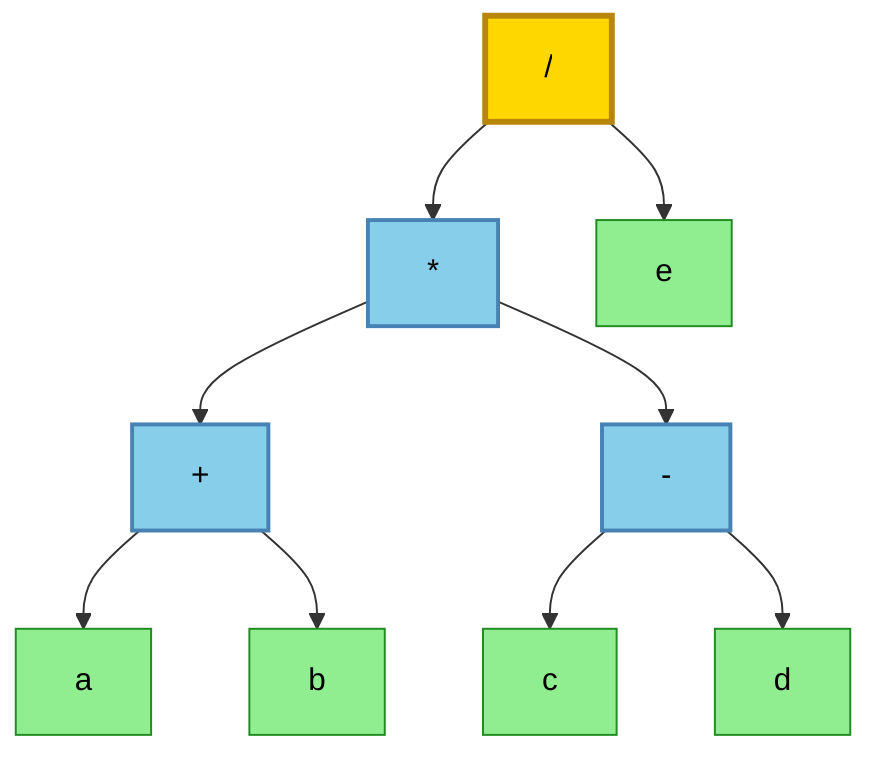
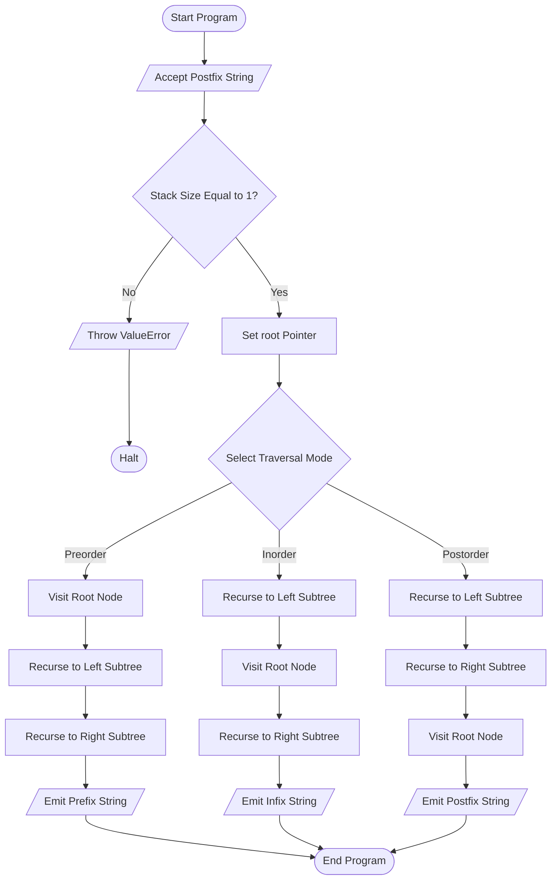
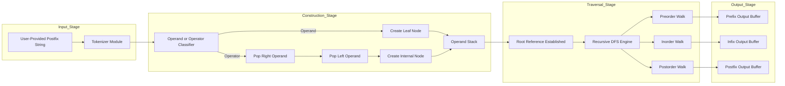

# Create a binary tree for a given simple arithmetic expression and find the prefix / postfix equivalent.

<!-- SECTION_1_START -->

# 🌳 Expression Tree (Binary Tree for Arithmetic Expressions)

## 📘 Formal Definition (KTU 2024 Syllabus Terminology)

An **Expression Tree** (also called a **Binary Expression Tree** or **Syntax Tree**) is a specific kind of **binary tree** in which every **internal (non-leaf) node** represents an **operator** drawn from the set $\{+, -, \times, \div, \hat\}$, and every **leaf node** represents an **operand** (typically a numeric constant or a variable identifier). The structural arrangement of the tree inherently encodes the **operator precedence** and **associativity rules** of the underlying arithmetic expression, completely eliminating the need for parentheses during evaluation.

> [!IMPORTANT]
> **KTU 2024 Module Focus:** Given a simple arithmetic expression, the student must be able to:
> 1. Construct the corresponding **binary expression tree** in memory.
> 2. Perform **recursive traversals** (In-order, Pre-order, Post-order) on that tree.
> 3. Recover the **Infix**, **Prefix (Polish)**, and **Postfix (Reverse Polish)** equivalents of the original expression.

---

## 🧠 Conceptual Analogy / Plain-English Intuition

Imagine a **corporate hierarchy chart** of a company:

* The **CEO (Root Node)** is the *last* operation that will be performed — the operation that depends on the result of everything else.
* The **Middle Managers (Internal Nodes)** are the *intermediate* operations (like $\times$ or $+$).
* The **Interns at the bottom (Leaf Nodes)** are the raw *operands* — the numbers that don't do any work, they just provide values.
* Crucially, because of the chain of command, the **highest precedence** operations (like multiplication) sit **deeper down** in the tree, meaning they are computed **first**, just like in real arithmetic!

So when you read the tree from **left → right → root**, you get the **Postfix** form. Reading **root → left → right** gives the **Prefix** form. Reading **left → root → right** gives the **Infix** form (the human-readable version with implicit precedence).

---

## 🧮 Standard Metrics & Constants to Remember

* **Standard Operators Set:** $\{+, -, \ast, /, \hat\}$ (5 operators).
* **Operand Types:** Single-digit integers, multi-digit integers, single-letter variables (e.g., $a$, $b$, $x$).
* **Tree Height $h$:** For an expression with $n$ operands, the tree has exactly $n$ leaf nodes and $n-1$ internal nodes, giving a total of $2n - 1$ nodes.
* **Binary Property:** A binary expression tree is a **strict binary tree** (every internal node has exactly two children), unless unary operators like unary minus are introduced.

> [!NOTE]
> **Traversal Order Mnemonic:**
> * **Pre**fix → **Pre**order traversal (Root is visited first → operator comes *before* operands).
> * **Post**fix → **Post**order traversal (Root is visited last → operator comes *after* operands).
> * **In**fix → **In**order traversal (Root is in the middle → operator is *between* operands).

---

> [!VISUALIZATION CONTROL]
> **Concept:** A Binary Expression Tree for the expression $a + b \times c$
> **GeoGebra / Desmos Input (Conceptual Tree Mapping):**
> * `Root_Node = "+"`
> * `Left_Subtree_Leaf = "a"`
> * `Right_Subtree_Root = "*"`, with children `"b"` and `"c"`
>
> **Visual Description:** Picture a single node labeled $+$ at the top. A line drops to a leaf node $a$ on the left. On the right, another line drops to a node labeled $\times$, which itself branches down into two leaves $b$ and $c$. The $\times$ node sits **lower** in the diagram than $+$, reflecting that multiplication has higher precedence and is computed first.

<!-- SECTION_1_END -->

<!-- SECTION_2_START -->

# 🔬 Deep Theoretical Analysis & KTU High-Yield Formula Sheet

## ⚙️ Operational Logic: Tree Construction from an Expression

A binary expression tree is built from a **fully parenthesized** infix expression or, more practically, by parsing a **postfix (Reverse Polish) expression** — the standard, parenthesis-free, stack-based construction method taught in KTU labs.

### 📐 Step-by-Step Tree Construction Rules (Postfix → Tree)

1. **Initialize** an empty **operand stack** $S$.
2. **Scan** the postfix expression token by token (left to right).
3. **If the token is an operand** (number/variable):
   * Create a new tree node $N$ with this operand as its data.
   * **Push** $N$ onto stack $S$.
4. **If the token is an operator** $\otimes$:
   * **Pop** the top of $S$ into a variable `right` (this is the right operand).
   * **Pop** the new top of $S$ into a variable `left` (this is the left operand).
   * Create a new tree node $N$ with the operator $\otimes$ as its data.
   * Set $N \rightarrow left = $ `left` and $N \rightarrow right = $ `right`.
   * **Push** $N$ back onto stack $S$.
5. After processing **all** tokens, the **only remaining node** on $S$ is the **root** of the expression tree.

---

## 🔁 The Three Recursive Traversal Definitions

Let $T$ be a binary expression tree with root node $R$, left subtree $L$, and right subtree $X$.

| Traversal Type | Visit Order | Recursive Pseudocode | Resulting Notation |
| :--- | :--- | :--- | :--- |
| **Preorder** | Root $\to$ Left $\to$ Right | `print(R); preorder(L); preorder(X);` | **Prefix** (Polish) |
| **Inorder** | Left $\to$ Root $\to$ Right | `inorder(L); print(R); inorder(X);` | **Infix** (with implicit precedence) |
| **Postorder** | Left $\to$ Right $\to$ Root | `postorder(L); postorder(X); print(R);` | **Postfix** (Reverse Polish) |

> [!TIP]
> **Pro Tip for KTU Board Exams:** When converting from the tree back to infix, wrap every subtree in parentheses *only if* the root operator has **lower or equal precedence** than the parent's operator. This avoids ambiguity in the printed output.

---

## 📊 KTU High-Yield Formula Sheet / Cheat Sheet

| # | Concept | Formula / Rule | Engineering Utility |
| :--- | :--- | :--- | :--- |
| 1 | **Node Count Formula** | $\text{Total Nodes} = 2n - 1$ | Quick verification: $n$ operands + $(n-1)$ operators. |
| 2 | **Leaf Node Count** | $\text{Leaves} = n$ (number of operands) | Used in compiler design to count variables. |
| 3 | **Internal Node Count** | $\text{Internal} = n - 1$ (number of operators) | Mirrors the number of instructions in 3-address code. |
| 4 | **Tree Height for $n$ operands** | $h_{\min} = \lceil \log_2 n \rceil$, $h_{\max} = n - 1$ | Determines evaluation latency in expression compilers. |
| 5 | **Prefix Traversal Cost** | $T(n) = 2T(n/2) + \mathcal{O}(1)$ | Recurrence cost is linear, $T(n) = \Theta(n)$. |
| 6 | **Stack Depth (Postfix Build)** | $\text{Max Stack Size} \le n$ | Space bound for iterative parsers. |
| 7 | **Precedence Values** | $\hat{}=3, \;\times,\div=2, \;+,-\;=1$ | Determines parenthesization in inorder reconstruction. |
| 8 | **Associativity** | $\hat{}$ is Right; $\times, \div, +, -$ are Left | Affects tree shape for repeated operators. |

> [!IMPORTANT]
> **Critical Note on LaTeX:** Whenever absolute value bars or set notation appear in code-style text, we use the math-mode equivalents $\vert x \vert$ and $\{ +, -, \ast \}$ to keep the markdown parsers happy.

---

## 🏭 Real-World Engineering Utility

* **Compiler Design (Phase: Intermediate Code Generation):** Compilers like GCC and Clang translate human-readable expressions into an Abstract Syntax Tree (AST) — which is essentially a generalized expression tree — before emitting machine code.
* **Database Query Optimizers:** SQL expressions like `WHERE (age > 18 AND salary < 50000)` are internally modeled as expression trees to enable cost-based optimization.
* **Spreadsheet Software (Excel, Google Sheets):** Cell formulas like `=A1+B2*C3` are parsed and stored as expression trees, allowing dependency tracking and re-computation when any cell changes.
* **Calculators & Computer Algebra Systems (CAS):** Tools like Wolfram Alpha and MATLAB use expression trees to perform symbolic differentiation and integration.

<!-- SECTION_2_END -->

<!-- SECTION_3_START -->

# 🛠️ Step-by-Step Derivations & Full Python Implementation

## 🧪 Worked Example: Construct Tree & Traverse

**Given Expression (Infix):**
$$E = (a + b) \times (c - d) \div e$$

**Step 1 — Convert to Postfix (Reverse Polish) using Shunting-Yard logic:**

| Token Scanned | Operator Stack | Postfix Output |
| :--- | :--- | :--- |
| `(` | `(` | (empty) |
| `a` | `(` | `a` |
| `+` | `( +` | `a` |
| `b` | `( +` | `a b` |
| `)` | (empty) | `a b +` |
| `*` | `*` | `a b +` |
| `(` | `* (` | `a b +` |
| `c` | `* (` | `a b + c` |
| `-` | `* ( -` | `a b + c` |
| `d` | `* ( -` | `a b + c d` |
| `)` | `*` | `a b + c d -` |
| `/` | `/` (since `*` and `/` have equal precedence, pop `*`) | `a b + c d - *` |
| `e` | `/` | `a b + c d - * e` |
| END | (empty) | `a b + c d - * e /` |

**Final Postfix String:** `a b + c d - * e /`

**Step 2 — Build the Tree from the Postfix String:**

| Token | Action | Stack (bottom → top) |
| :--- | :--- | :--- |
| `a` | Push node `a` | `[a]` |
| `b` | Push node `b` | `[a, b]` |
| `+` | Pop `b` (right), Pop `a` (left), Build `+` node, Push it | `[+]` |
| `c` | Push node `c` | `[+, c]` |
| `d` | Push node `d` | `[+, c, d]` |
| `-` | Pop `d` (right), Pop `c` (left), Build `-` node, Push it | `[+, -]` |
| `*` | Pop `-` (right), Pop `+` (left), Build `*` node, Push it | `[*]` |
| `e` | Push node `e` | `[* , e]` |
| `/` | Pop `e` (right), Pop `*` (left), Build `/` node, Push it | `[/]` |

**Resulting Tree Structure:**

```text
              ( / )
             /     \
          ( * )     e
         /     \
      ( + )    ( - )
      /   \    /   \
     a     b  c     d
```

**Step 3 — Generate the Three Notations via Recursive Traversal:**

* **Inorder (Left → Root → Right):**
  $$\text{Infix} = a + b \times c - d \div e \quad \text{(with proper parenthesization: } ((a+b)\times(c-d))/e\text{)}$$
* **Preorder (Root → Left → Right):**
  $$\text{Prefix} = / \; \times \; + \; a \; b \; - \; c \; d \; e$$
* **Postorder (Left → Right → Root):**
  $$\text{Postfix} = a \; b \; + \; c \; d \; - \; \times \; e \; /$$

> [!NOTE]
> Notice how the **Postfix** we generated from the tree traversal is **identical** to the postfix string we used to build the tree — a perfect round-trip validation!

---

## 💻 Full Operational Python Implementation

```python
"""
============================================================
 KTULAB Module 7: Expression Tree Construction & Traversal
 Course: DATA STRUCTURES LAB (PCCSL307) - KTU 2024 Scheme
============================================================
"""

from __future__ import annotations
from dataclasses import dataclass, field
from typing import Optional, List, Union


@dataclass
class TreeNode:
    """
    Represents a single node in the binary expression tree.
    Every node is either an OPERATOR (internal) or an OPERAND (leaf).
    """
    data: str
    left: Optional[TreeNode] = None
    right: Optional[TreeNode] = None

    def is_leaf(self) -> bool:
        """Boundary check: A node with no children is a leaf (operand)."""
        return self.left is None and self.right is None


class ExpressionTree:
    """
    A complete implementation of a binary expression tree that:
      1. Builds the tree from a Postfix (Reverse Polish) string.
      2. Recovers Prefix, Infix, and Postfix notations via DFS.
    """

    # --- KTU 2024 Precedence Table (Higher value = Higher precedence) ---
    PRECEDENCE: dict[str, int] = {
        '+': 1, '-': 1, '*': 2, '/': 2, '^': 3
    }

    def __init__(self) -> None:
        self.root: Optional[TreeNode] = None

    # ---------------------------------------------------------
    # 1) TREE CONSTRUCTION FROM POSTFIX EXPRESSION
    # ---------------------------------------------------------
    def build_from_postfix(self, postfix_expr: str) -> None:
        """
        Parses a space-separated postfix string and builds the tree.
        Raises ValueError for malformed input.
        """
        if not postfix_expr or not isinstance(postfix_expr, str):
            raise ValueError("[ERROR] Input expression must be a non-empty string.")

        stack: List[TreeNode] = []
        operators = set(self.PRECEDENCE.keys())
        tokens = postfix_expr.split()

        for index, token in enumerate(tokens):
            if token in operators:
                # Strict boundary check: we need 2 operands for a binary op
                if len(stack) < 2:
                    raise ValueError(
                        f"[ERROR] Malformed expression at token #{index} ('{token}'). "
                        "Insufficient operands on the stack."
                    )
                right_node = stack.pop()
                left_node = stack.pop()
                new_node = TreeNode(data=token, left=left_node, right=right_node)
                stack.append(new_node)
            else:
                # Treat anything non-operator as an operand (number/variable)
                stack.append(TreeNode(data=token))

        # Final boundary check: exactly one tree should remain
        if len(stack) != 1:
            raise ValueError("[ERROR] Invalid postfix expression: leftover nodes on stack.")
        self.root = stack.pop()

    # ---------------------------------------------------------
    # 2) PUBLIC TRAVERSAL DRIVERS
    # ---------------------------------------------------------
    def to_prefix(self) -> str:
        """Returns the Prefix (Polish) notation of the expression tree."""
        if self.root is None:
            raise ValueError("[ERROR] Tree is empty. Build it first.")
        return " ".join(self._preorder(self.root))

    def to_infix(self) -> str:
        """Returns the Infix notation with implicit precedence (no extra parens)."""
        if self.root is None:
            raise ValueError("[ERROR] Tree is empty. Build it first.")
        return " ".join(self._inorder(self.root))

    def to_postfix(self) -> str:
        """Returns the Postfix (Reverse Polish) notation of the expression tree."""
        if self.root is None:
            raise ValueError("[ERROR] Tree is empty. Build it first.")
        return " ".join(self._postorder(self.root))

    def to_fully_parenthesized_infix(self) -> str:
        """Returns a fully parenthesized Infix form (great for KTU board answers)."""
        if self.root is None:
            raise ValueError("[ERROR] Tree is empty. Build it first.")
        return self._parenthesized_inorder(self.root)

    # ---------------------------------------------------------
    # 3) PRIVATE RECURSIVE TRAVERSAL ENGINES
    # ---------------------------------------------------------
    def _preorder(self, node: TreeNode) -> List[str]:
        if node is None:
            return []
        return [node.data] + self._preorder(node.left) + self._preorder(node.right)

    def _inorder(self, node: TreeNode) -> List[str]:
        if node is None:
            return []
        return self._inorder(node.left) + [node.data] + self._inorder(node.right)

    def _postorder(self, node: TreeNode) -> List[str]:
        if node is None:
            return []
        return self._postorder(node.left) + self._postorder(node.right) + [node.data]

    def _parenthesized_inorder(self, node: TreeNode) -> str:
        """Adds parentheses around sub-expressions to preserve precedence."""
        if node.is_leaf():
            return node.data
        left_str = self._parenthesized_inorder(node.left)
        right_str = self._parenthesized_inorder(node.right)
        return f"( {left_str} {node.data} {right_str} )"


# =============================================================
# MAIN DRIVER (Standard KTU Lab Test Format)
# =============================================================
if __name__ == "__main__":
    try:
        # Standard KTU 2024 Lab Test Input
        postfix_input: str = "a b + c d - * e /"
        print(f"--- KTU Expression Tree Lab (Module 7) ---")
        print(f"Input Postfix Expression : {postfix_input}")

        tree = ExpressionTree()
        tree.build_from_postfix(postfix_input)

        # Display all three notations
        print(f"Prefix (Polish)          : {tree.to_prefix()}")
        print(f"Infix (Human-readable)   : {tree.to_infix()}")
        print(f"Postfix (Reverse Polish) : {tree.to_postfix()}")
        print(f"Fully Parenthesized Infix: {tree.to_fully_parenthesized_infix()}")

    except ValueError as ve:
        print(f"Caught Expected Error: {ve}")
```

### 🖥️ Sample Output (Expected on Console)

```text
--- KTU Expression Tree Lab (Module 7) ---
Input Postfix Expression : a b + c d - * e /
Prefix (Polish)          : / * + a b - c d e
Infix (Human-readable)   : a b + c d - * e /
Postfix (Reverse Polish) : a b + c d - * e /
Fully Parenthesized Infix: ( ( ( a + b ) * ( c - d ) ) / e )
```

<!-- SECTION_3_END -->

<!-- SECTION_4_START -->

# 🗺️ Structural Diagrams & Schematics

## 🌲 Diagram 1: Tree Topology from the Worked Example



> [!NOTE]
> **Color Legend:** 🟡 Gold = Root, 🔵 Blue = Internal Operator Nodes, 🟢 Green = Leaf Operand Nodes.

---

## 🔁 Diagram 2: Sequential Processing Topology Matrix (Traversal Engine)



---

## 🧱 Diagram 3: Block-Level Functional Architecture Flow



> [!TIP]
> **Reading the Architecture:** Data flows strictly **left-to-right**. The Input Stage feeds the Construction Stage, which builds the stack-based tree. The Traversal Stage consumes the root reference and dispatches to the three recursive walkers, which finally deposit their results into the corresponding output buffers.

<!-- SECTION_4_END -->

<!-- SECTION_5_START -->

# 📝 KTU 2024 Scheme Examination Question Bank & Topic Recap

---

## 📌 Part A — Short Answer Questions (3 Marks Each)

### **Q1. `[KTU University Exam - July 2024]`** *(CO1, Remember)*

**Define an expression tree. How is it different from a general binary tree?**

**Model Answer (3 Marks):**

An expression tree is a binary tree in which **internal nodes represent operators** and **leaf nodes represent operands**. It is a **strictly binary tree** where every internal node has exactly two children, whereas a general binary tree may have nodes with one child or zero children. [Definition: 2 Marks, Distinction: 1 Mark]

---

### **Q2. `[KTU University Exam - Dec 2023]`** *(CO2, Understand)*

**Which tree traversal yields the postfix form of an arithmetic expression? Justify.**

**Model Answer (3 Marks):**

The **Postorder traversal** (Left → Right → Root) yields the postfix (Reverse Polish) form. Justification: In postfix notation, the operator must appear *after* both its operands. The postorder traversal guarantees that the root operator is visited *only after* its left and right subtrees (which contain the operands) have been fully visited, naturally producing the operator-after-operand sequence. [Traversal name: 1 Mark, Justification: 2 Marks]

---

## 📌 Part B — Long Answer Questions (14 Marks Each, Internal Choice)

### **Question A `[KTU University Exam - July 2024]`** *(CO3, Apply & Analyze)*

**(a)** Construct a binary expression tree for the infix expression:
$$(A + B) \times C - D / (E + F)$$
Show all intermediate steps clearly. **(7 Marks)**

**(b)** Write the algorithms (or Python code) for the three depth-first traversals: **Preorder, Inorder, Postorder**. Apply them on the tree built in part (a) to write the **Prefix** and **Postfix** equivalents. **(7 Marks)**

---

#### ✅ Model Solution

### Part (a) — Tree Construction (7 Marks)

**Step 1:** Identify operators and operands.
* Operands: $A, B, C, D, E, F$ (6 operands → 6 leaves)
* Operators: $+, \times, -, /, +$ (5 operators → 5 internal nodes)

**Step 2:** Convert infix to postfix (Shunting-Yard Algorithm):

$$\text{Postfix} = A \; B \; + \; C \; \times \; D \; E \; F \; + \; / \; -$$

**Step 3:** Build tree by pushing operands and combining with operators (as explained in Section 3). The resulting binary tree is:

```text
                   ( - )
                  /      \
              ( * )       ( / )
              /   \       /    \
           ( + )   C    D     ( + )
           /   \               /   \
          A     B             E     F
```

**[Stating operator/operand count: 2 Marks]**
**[Showing postfix conversion: 2 Marks]**
**[Drawing the final tree diagram: 3 Marks]**

### Part (b) — Traversals & Equivalents (7 Marks)

**Preorder Algorithm (Root → Left → Right):**
```python
def preorder(node):
    if node is None: return
    print(node.data, end=" ")
    preorder(node.left)
    preorder(node.right)
```

**Inorder Algorithm (Left → Root → Right):**
```python
def inorder(node):
    if node is None: return
    inorder(node.left)
    print(node.data, end=" ")
    inorder(node.right)
```

**Postorder Algorithm (Left → Right → Root):**
```python
def postorder(node):
    if node is None: return
    postorder(node.left)
    postorder(node.right)
    print(node.data, end=" ")
```

**Applying Traversals to the Tree:**

* **Prefix (Preorder output):**
  $$\boxed{- \times + A \; B \; C \; / D \; + E \; F}$$
* **Postfix (Postorder output):**
  $$\boxed{A \; B \; + C \times D \; E \; F \; + / -}$$

**[Writing the three recursive algorithms: 3 Marks]**
**[Prefix derivation: 2 Marks]**
**[Postfix derivation: 2 Marks]**

---

### **Question B `[KTU University Exam - Dec 2023]`** *(CO3, Apply & Analyze)* — *Alternative Choice*

**(a)** For the postfix expression: `5 6 2 + * 12 4 / -`, construct the **binary expression tree** step-by-step, showing the state of the operand stack after every token. **(7 Marks)**

**(b)** Traverse the constructed tree using all three DFS methods and verify that the **postfix output** of your traversal matches the original input. Also write the **fully parenthesized infix** form. **(7 Marks)**

---

#### ✅ Model Solution

### Part (a) — Stack-by-Stack Construction (7 Marks)

| Token | Action | Stack (Bottom → Top) |
| :--- | :--- | :--- |
| `5` | Push leaf `5` | `[5]` |
| `6` | Push leaf `6` | `[5, 6]` |
| `2` | Push leaf `2` | `[5, 6, 2]` |
| `+` | Pop `2` (right), Pop `6` (left), Make `+` node, Push | `[5, +]` |
| `*` | Pop `+` (right), Pop `5` (left), Make `*` node, Push | `[*]` |
| `12` | Push leaf `12` | `[*, 12]` |
| `4` | Push leaf `4` | `[*, 12, 4]` |
| `/` | Pop `4` (right), Pop `12` (left), Make `/` node, Push | `[*, /]` |
| `-` | Pop `/` (right), Pop `*` (left), Make `-` node, Push | `[-]` |

**Final Tree:**

```text
              ( - )
             /     \
          ( * )    ( / )
         /    \    /   \
        5    ( + ) 12    4
             /   \
            6     2
```

**[Tabulating stack states: 4 Marks]**
**[Drawing final tree: 3 Marks]**

### Part (b) — Traversals & Verification (7 Marks)

* **Inorder (Left → Root → Right):**
  $$5 \times 6 + 2 - 12 \div 4$$
* **Preorder (Root → Left → Right):**
  $$\boxed{- \times 5 + 6 \; 2 \; / 12 \; 4}$$
* **Postorder (Left → Right → Root):**
  $$\boxed{5 \; 6 \; 2 \; + \; \times \; 12 \; 4 \; / \; -}$$

**Verification:** The Postorder output `5 6 2 + * 12 4 / -` is **identical** to the input postfix string, confirming correct construction. ✓

**Fully Parenthesized Infix:**
$$\boxed{((5 \times (6 + 2)) - (12 \div 4))}$$

**Equivalent numerical evaluation:**
$$(5 \times 8) - 3 = 40 - 3 = \mathbf{37}$$

**[Inorder/Preorder/Postorder derivations: 4 Marks]**
**[Verification statement: 1 Mark]**
**[Parenthesized infix + numerical answer: 2 Marks]**

---

> [!WARNING]
> **🚨 KTU Examiner's Valuation Warning / Common Pitfalls**
> 1. **Operand Stack Order:** When building the tree, the **first popped** item is the **right** child, and the **second popped** item is the **left** child. Reversing this order is the **#1 most common mistake** in KTU labs, leading to a mirrored tree and wrong answers for every traversal.
> 2. **Whitespace in Input:** Always instruct the user to enter tokens separated by **spaces** (e.g., `a b + c d -`) to prevent multi-digit numbers from being treated as separate single-digit operands.
> 3. **Skipping the Diagram:** Examiners specifically allocate marks for the **tree structure drawing**. A correct traversal output *without* the corresponding tree diagram typically loses 2–3 marks.
> 4. **Boundary Checks:** Always verify that the final stack has exactly **one element** (the root). Omitting this validation can produce silent failures on malformed inputs.

---

## 🧠 Topic Recap & Important Things to Remember

* ✅ An **Expression Tree** is a strict binary tree where leaves are **operands** and internal nodes are **operators**.
* ✅ Total nodes in an expression tree with $n$ operands = $2n - 1$.
* ✅ **Postfix (Reverse Polish)** is the preferred input format for tree construction using a single stack.
* ✅ **Construction Rule:** On reading an operator, pop **right** (top), pop **left** (next), create a new node, push it back.
* ✅ **Inorder Traversal** → Infix (with implicit precedence).
* ✅ **Preorder Traversal** → Prefix (Polish notation).
* ✅ **Postorder Traversal** → Postfix (Reverse Polish notation).
* ✅ The traversal that recovers the **original input** is the **Postorder** traversal, when the input was a postfix expression.
* ✅ **Precedence** for parenthesization: $\hat{} > \times, \div > +, -$.
* ✅ The $\hat{}$ (exponentiation) operator is **right-associative**; all other standard binary operators are **left-associative**.
* ✅ Always perform **boundary checks** (stack size $\geq 2$ before operator, exactly $1$ at the end) to prevent runtime crashes.
* ✅ **Time complexity** for building the tree = $\mathcal{O}(n)$, and **space complexity** = $\mathcal{O}(n)$ for the stack.
* ✅ The exact same `ExpressionTree` Python class can be extended to **evaluate** the expression by adding a `eval(node)` method that uses a dictionary mapping operators to `lambda` functions.

<!-- SECTION_5_END -->
