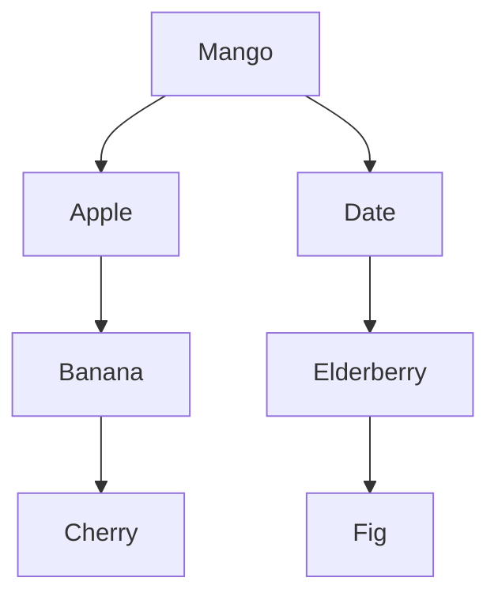
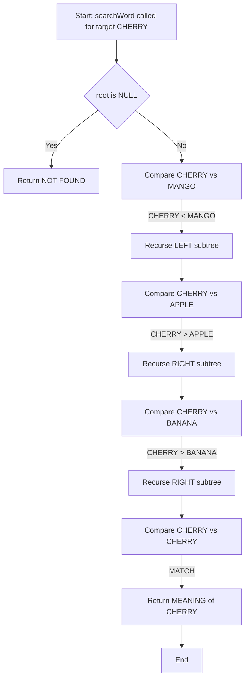
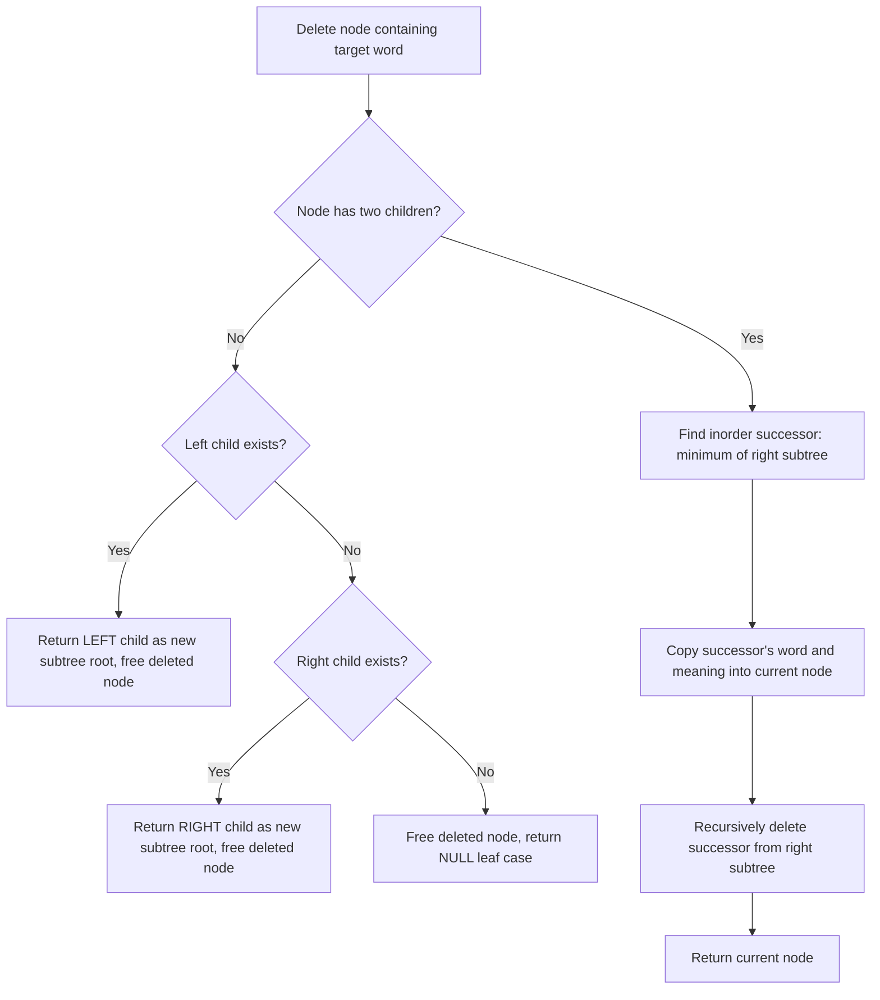
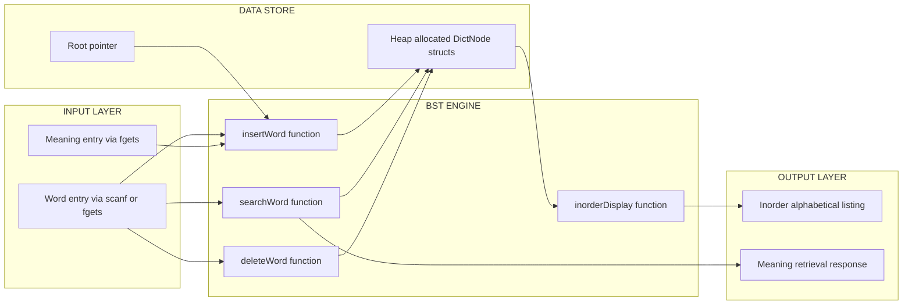
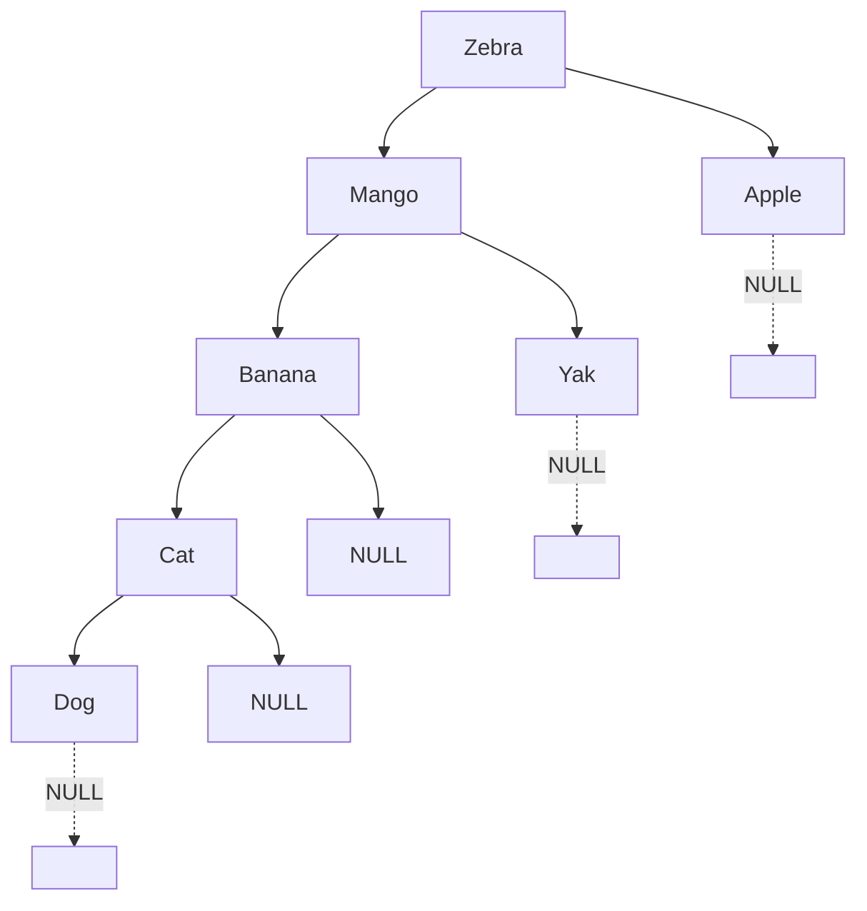

# Implement a dictionary of word-meaning pairs using binary search trees.

<!-- SECTION_1_START -->
# Dictionary of Word-Meaning Pairs using Binary Search Tree

## 1. Core Technical Definition & Intuitive Overview

### Formal Academic Definition

A **Binary Search Tree (BST)** is a hierarchical, non-linear data structure in which each node contains at most two children, referred to as the **left child** and the **right child**, and the structure obeys the *BST ordering invariant*:

> For any node $N$ with key value $k$, every key in the left subtree of $N$ is strictly less than $k$, and every key in the right subtree of $N$ is strictly greater than $k$.

A **Dictionary ADT** (Abstract Data Type) is a collection of unique **key–value pairs**, where each unique key maps to exactly one associated value. It supports the core operations: `insert(key, value)`, `search(key)`, `delete(key)`, and `display()`.

When we combine these two abstractions, a **Dictionary of Word-Meaning Pairs using BST** becomes a tree-structured lookup table where:
- **Key** = the unique English word (lexicographic comparator)
- **Value** = the meaning/definition of that word
- **Storage structure** = a Binary Search Tree ordered by the alphabetical (lexicographic) value of the keys

> [!IMPORTANT]
> **KTU 2024 Syllabus Mapping:** This experiment (Module 8) directly tests the practical integration of two core CS concepts — **Tree Data Structures** (Module 4 theory) and the **Dictionary ADT** (Module 5 theory). The expected KTU lab outcome is the ability to *design, implement, and trace* a BST that stores and retrieves word-meaning pairs.

### Conceptual Analogy / Intuition

Imagine a physical English dictionary on your desk. The words inside are **not** in random order — they are sorted alphabetically. To find the meaning of the word "Mango":

1. You flip to the middle of the dictionary (M section).
2. You compare "Mango" with the first word on that page.
3. If "Mango" comes **before** the page word, you flip **left**.
4. If "Mango" comes **after**, you flip **right**.
5. You keep halving the search space until you find the word.

A BST does exactly the same, but with lightning speed! Each node in the tree is like a "page" that splits the remaining words into two groups: **smaller words on the left branch**, **bigger words on the right branch**. The word itself is the *key* (used for navigation), and its meaning is the *payload* (the data you ultimately want to read).

> [!NOTE]
> **Critical Insight:** The BST is **ordered by the key (the word)**, not by the meaning. This means two words with identical meanings but different spellings (e.g., "big" and "large") will still occupy two distinct nodes in the tree because their *keys* differ.

### Physical Constants and Standard Metrics

- **Average Time Complexity (Balanced BST):** Search/Insert/Delete = $O(\log n)$
- **Worst Time Complexity (Skewed BST):** Search/Insert/Delete = $O(n)$
- **Space Complexity:** $O(n)$ for storing $n$ word-meaning pairs
- **Alphabetical Ordering:** Uses the ASCII/Unicode comparator (e.g., `'A' < 'B' < 'a'`)

> [!VISUALIZATION CONTROL]
> **Concept:** BST Insertion Trace for words "Cat", "Ant", "Dog", "Bat"
> **Geometric Description (drawn on XY axes):**
> * X-axis represents the insertion order (1st, 2nd, 3rd, 4th)
> * Y-axis represents the depth of the node in the BST (0 at root, increasing downward)
> * Plot: Point 1 (Cat, 0), Point 2 (Ant, 1 left), Point 3 (Dog, 1 right), Point 4 (Bat, 2 left of Dog)
> * Connect with arrows showing left/right child pointers
> **What to observe:** Each new word drops to a leaf by repeatedly comparing with the current node's word and going Left (if smaller) or Right (if larger).
<!-- SECTION_1_END -->

<!-- SECTION_2_START -->
# 2. Deep Theoretical Analysis & KTU High-Yield Formula Sheet

## 2.1 Operational Breakdown of the Dictionary BST

The dictionary implementation requires us to design **two cooperating components**:

### Component A — The Node Structure
Each node is a self-referential C `struct` containing:
- A character array `word[50]` to hold the dictionary key
- A character array `meaning[256]` to hold the value
- Two pointers: `struct node *left` and `struct node *right`

### Component B — The BST Engine
A set of four core recursive functions operating on these nodes:

1. **Insert a Word-Meaning Pair**
   - Start at the root.
   - If the tree is empty, create a new node and make it the root.
   - Compare the new word with the current node's word using `strcmp()`.
   - If `strcmp(new, current) < 0` → recurse into the **left** subtree.
   - If `strcmp(new, current) > 0` → recurse into the **right** subtree.
   - If `strcmp(new, current) == 0` → the word already exists; update the meaning (avoid duplicates).

2. **Search for a Word**
   - Begin at the root.
   - At each step, compare the target word with the current node.
   - If equal, return the meaning.
   - If smaller, go left. If larger, go right.
   - If a `NULL` child is reached, the word is **not in the dictionary** (return "Not Found").

3. **Delete a Word** (advanced; often skipped in lab viva)
   - Find the node containing the word.
   - **Case 1 (Leaf):** Simply free the node.
   - **Case 2 (One child):** Replace the node with its only child.
   - **Case 3 (Two children):** Replace the node's word with its **inorder successor's** word (smallest word in the right subtree), then delete the inorder successor.

4. **Display the Dictionary (Inorder Traversal)**
   - Recursively visit: Left Subtree → Root Word-Meaning → Right Subtree.
   - This produces the words in **alphabetical (sorted) order** — the dictionary's natural presentation.

## 2.2 The "Why" and "How" Behind Each Step

| Step | Why we do it | How it works |
|------|--------------|--------------|
| Use `strcmp()` not `==` | C strings are character arrays, not primitives. `==` would compare memory addresses, not contents. | `strcmp(a,b)` returns negative if `a<b`, 0 if equal, positive if `a>b` (lexicographic on ASCII values) |
| Store both `word` and `meaning` | The word is the search key; the meaning is the user-facing payload. | A single node struct contains both fields, plus the two child pointers |
| Recurse to the correct subtree | The BST invariant is what gives us $O(\log n)$ search on average. | Each comparison eliminates ~50% of the remaining nodes |
| Inorder traversal for display | The BST's inorder sequence is naturally sorted alphabetically. | Left → Process Node → Right recursion pattern |

## 2.3 KTU Formula Sheet / Cheat Sheet

| Symbol / Concept | Formula / Property | Unit / Notes |
|------------------|---------------------|--------------|
| Time to Search (best/avg) | $O(\log_2 n)$ | For balanced BST |
| Time to Search (worst) | $O(n)$ | Skewed tree (all insertions sorted) |
| Time to Insert (avg) | $O(\log n)$ | One path from root to leaf |
| Space Complexity | $O(n)$ | One node per word |
| Total Nodes in Full BST of height $h$ | $2^{h+1} - 1$ | Minimum height for $n$ nodes: $\lceil \log_2(n+1) \rceil - 1$ |
| Inorder of BST | Sorted ascending by key | Used for displaying dictionary |
| `strcmp(a,b)` semantics | Returns <0, 0, >0 | Lexicographic on ASCII values |
| Predecessor | Largest key in left subtree | Used in deletion |
| Successor | Smallest key in right subtree | Used in deletion |

> [!IMPORTANT]
> **Real-World Engineering Utility:** BST-backed dictionaries are the conceptual ancestors of modern **Tries** (used in autocomplete), **B-Trees** (used in databases like MySQL), and **Red-Black Trees** (used in `std::map` in C++ and `TreeMap` in Java). The same dictionary pattern is used in compiler symbol tables, DNS resolvers, and language translation APIs.

## 2.4 Edge Cases & Boundary Conditions

- **Empty Tree (No words inserted):** All operations must gracefully handle `root == NULL`.
- **Duplicate Word Insertion:** Should update the meaning, not create a new node.
- **Search for Non-Existent Word:** Must print `"Word not found"` without crashing.
- **Deletion of Root:** Special case — replace with inorder successor.
- **Single-Node Tree:** Deleting the only node sets `root = NULL`.
- **Very Long Words:** Use a buffer size of at least 50 characters to prevent overflow.
- **Case Sensitivity:** `"Apple"` and `"apple"` are considered **different** keys (unless explicitly lowercased).
<!-- SECTION_2_END -->

<!-- SECTION_3_START -->
# 3. Step-by-Step Derivations & Code/Symbolic Implementation

## 3.1 Algorithm Design (Pseudocode)

### `insertNode(root, newWord, newMeaning)` — Recursive

```
FUNCTION insertNode(root, newWord, newMeaning):
    IF root == NULL:
        CREATE newNode with (newWord, newMeaning)
        RETURN newNode
    
    IF strcmp(newWord, root.word) < 0:
        root.left  = insertNode(root.left,  newWord, newMeaning)
    ELSE IF strcmp(newWord, root.word) > 0:
        root.right = insertNode(root.right, newWord, newMeaning)
    ELSE:
        // Word already exists — update meaning
        strcpy(root.meaning, newMeaning)
    
    RETURN root
```

### `searchWord(root, target)` — Recursive

```
FUNCTION searchWord(root, target):
    IF root == NULL:
        RETURN NULL  // Word not found
    
    IF strcmp(target, root.word) == 0:
        RETURN root.meaning
    ELSE IF strcmp(target, root.word) < 0:
        RETURN searchWord(root.left, target)
    ELSE:
        RETURN searchWord(root.right, target)
```

### `inorderDisplay(root)` — Recursive

```
FUNCTION inorderDisplay(root):
    IF root == NULL:
        RETURN
    
    inorderDisplay(root.left)
    PRINT root.word, "  :  ", root.meaning
    inorderDisplay(root.right)
```

## 3.2 Complete C Program (Production Quality)

```c
/* ============================================================
 * Experiment  : Dictionary of Word-Meaning Pairs
 * Data Struct : Binary Search Tree (BST)
 * Course      : DATA STRUCTURES LAB (PCCSL307)
 * KTU 2024 Scheme
 * ============================================================ */
#include <stdio.h>
#include <stdlib.h>
#include <string.h>

#define WORD_LEN    50
#define MEANING_LEN 256

/* ---------- Node Definition ---------- */
struct DictNode {
    char word[WORD_LEN];
    char meaning[MEANING_LEN];
    struct DictNode *left;
    struct DictNode *right;
};

typedef struct DictNode DictNode;

/* ---------- Function Prototypes ---------- */
DictNode* createNode(const char *word, const char *meaning);
DictNode* insertWord(DictNode *root, const char *word, const char *meaning);
DictNode* searchWord(DictNode *root, const char *target, int *found);
DictNode* findMin(DictNode *node);
DictNode* deleteWord(DictNode *root, const char *target);
void inorderDisplay(DictNode *root);
void freeTree(DictNode *root);
int countNodes(DictNode *root);

/* ============================================================
 * 1. Create a new node with the given word and meaning
 * ============================================================ */
DictNode* createNode(const char *word, const char *meaning) {
    DictNode *newNode = (DictNode *)malloc(sizeof(DictNode));
    if (newNode == NULL) {
        fprintf(stderr, "Error: Memory allocation failed.\n");
        exit(EXIT_FAILURE);
    }
    strncpy(newNode->word, word, WORD_LEN - 1);
    newNode->word[WORD_LEN - 1] = '\0';
    strncpy(newNode->meaning, meaning, MEANING_LEN - 1);
    newNode->meaning[MEANING_LEN - 1] = '\0';
    newNode->left  = NULL;
    newNode->right = NULL;
    return newNode;
}

/* ============================================================
 * 2. Insert a new word-meaning pair into the BST
 *    If the word already exists, updates its meaning.
 * ============================================================ */
DictNode* insertWord(DictNode *root, const char *word, const char *meaning) {
    /* Base case: position found */
    if (root == NULL) {
        printf("Inserted: \"%s\"\n", word);
        return createNode(word, meaning);
    }

    int cmp = strcmp(word, root->word);

    if (cmp < 0) {
        root->left  = insertWord(root->left,  word, meaning);
    } else if (cmp > 0) {
        root->right = insertWord(root->right, word, meaning);
    } else {
        /* Duplicate: update meaning in place */
        printf("Word \"%s\" already exists. Updating meaning.\n", word);
        strncpy(root->meaning, meaning, MEANING_LEN - 1);
        root->meaning[MEANING_LEN - 1] = '\0';
    }
    return root;
}

/* ============================================================
 * 3. Search for a word in the dictionary
 *    Sets *found = 1 if present, 0 otherwise.
 * ============================================================ */
DictNode* searchWord(DictNode *root, const char *target, int *found) {
    if (root == NULL) {
        *found = 0;
        return NULL;
    }

    int cmp = strcmp(target, root->word);

    if (cmp == 0) {
        *found = 1;
        return root;
    } else if (cmp < 0) {
        return searchWord(root->left,  target, found);
    } else {
        return searchWord(root->right, target, found);
    }
}

/* ============================================================
 * 4. Find the node with the minimum key in a subtree
 *    (used in deletion for inorder successor)
 * ============================================================ */
DictNode* findMin(DictNode *node) {
    while (node != NULL && node->left != NULL) {
        node = node->left;
    }
    return node;
}

/* ============================================================
 * 5. Delete a word from the dictionary
 *    Handles 3 cases: leaf, one child, two children.
 * ============================================================ */
DictNode* deleteWord(DictNode *root, const char *target) {
    if (root == NULL) {
        printf("Word \"%s\" not found. Nothing to delete.\n", target);
        return NULL;
    }

    int cmp = strcmp(target, root->word);

    if (cmp < 0) {
        root->left  = deleteWord(root->left,  target);
    } else if (cmp > 0) {
        root->right = deleteWord(root->right, target);
    } else {
        /* Target found at this node */
        printf("Deleted: \"%s\"\n", root->word);

        /* Case 1: No children (leaf) */
        if (root->left == NULL && root->right == NULL) {
            free(root);
            return NULL;
        }
        /* Case 2a: Only right child */
        if (root->left == NULL) {
            DictNode *temp = root->right;
            free(root);
            return temp;
        }
        /* Case 2b: Only left child */
        if (root->right == NULL) {
            DictNode *temp = root->left;
            free(root);
            return temp;
        }
        /* Case 3: Two children — replace with inorder successor */
        DictNode *successor = findMin(root->right);
        strncpy(root->word,    successor->word,    WORD_LEN - 1);
        strncpy(root->meaning, successor->meaning, MEANING_LEN - 1);
        root->word[WORD_LEN - 1]    = '\0';
        root->meaning[MEANING_LEN - 1] = '\0';
        root->right = deleteWord(root->right, successor->word);
    }
    return root;
}

/* ============================================================
 * 6. Inorder traversal — displays the dictionary alphabetically
 * ============================================================ */
void inorderDisplay(DictNode *root) {
    if (root == NULL) return;
    inorderDisplay(root->left);
    printf("  %-20s : %s\n", root->word, root->meaning);
    inorderDisplay(root->right);
}

/* ============================================================
 * 7. Free the entire tree (post-order)
 * ============================================================ */
void freeTree(DictNode *root) {
    if (root == NULL) return;
    freeTree(root->left);
    freeTree(root->right);
    free(root);
}

/* ============================================================
 * 8. Utility: count total nodes
 * ============================================================ */
int countNodes(DictNode *root) {
    if (root == NULL) return 0;
    return 1 + countNodes(root->left) + countNodes(root->right);
}

/* ============================================================
 * main() — Menu-driven driver program
 * ============================================================ */
int main(void) {
    DictNode *root = NULL;
    int  choice, found;
    char word[WORD_LEN], meaning[MEANING_LEN];

    while (1) {
        printf("\n========== DICTIONARY (BST) ==========\n");
        printf(" 1. Add a new word\n");
        printf(" 2. Search for a word\n");
        printf(" 3. Delete a word\n");
        printf(" 4. Display dictionary (alphabetical)\n");
        printf(" 5. Show total word count\n");
        printf(" 6. Exit\n");
        printf("Enter your choice: ");

        if (scanf("%d", &choice) != 1) {
            printf("Invalid input. Exiting.\n");
            break;
        }
        getchar(); /* consume trailing newline */

        switch (choice) {
            case 1:
                printf("Enter word: ");
                fgets(word, WORD_LEN, stdin);
                word[strcspn(word, "\n")] = '\0';
                printf("Enter meaning: ");
                fgets(meaning, MEANING_LEN, stdin);
                meaning[strcspn(meaning, "\n")] = '\0';
                root = insertWord(root, word, meaning);
                break;

            case 2:
                printf("Enter word to search: ");
                fgets(word, WORD_LEN, stdin);
                word[strcspn(word, "\n")] = '\0';
                found = 0;
                searchWord(root, word, &found);
                if (found)
                    printf("Meaning of \"%s\": %s\n", word,
                           (searchWord(root, word, &found))->meaning);
                else
                    printf("Word \"%s\" not found in dictionary.\n", word);
                break;

            case 3:
                printf("Enter word to delete: ");
                fgets(word, WORD_LEN, stdin);
                word[strcspn(word, "\n")] = '\0';
                root = deleteWord(root, word);
                break;

            case 4:
                if (root == NULL) {
                    printf("Dictionary is empty.\n");
                } else {
                    printf("\n--- DICTIONARY CONTENTS (Alphabetical) ---\n");
                    inorderDisplay(root);
                    printf("------------------------------------------\n");
                }
                break;

            case 5:
                printf("Total words in dictionary: %d\n", countNodes(root));
                break;

            case 6:
                freeTree(root);
                printf("Memory released. Exiting.\n");
                return 0;

            default:
                printf("Invalid choice. Try again.\n");
        }
    }
    return 0;
}
```

## 3.3 Step-by-Step Manual Trace (Insertion Order: Dog → Cat → Ant → Bat → Eagle)

We will trace the BST construction to verify understanding:

| Step | Insert Word | Compare Path | Final Action | Resulting Tree |
|------|-------------|--------------|--------------|----------------|
| 1 | **Dog** | Tree empty | Create root | `Dog` |
| 2 | **Cat** | Cat < Dog → go left | Place left of Dog | `Dog` → L: `Cat` |
| 3 | **Ant** | Ant < Dog → L; Ant < Cat → L | Place left of Cat | `Dog` → L: `Cat` → L: `Ant` |
| 4 | **Bat** | Bat < Dog → L; Bat > Cat → R | Place right of Cat | `Dog` → L: `Cat` → L:`Ant`, R:`Bat` |
| 5 | **Eagle** | Eagle > Dog → R (empty) | Place right of Dog | `Dog` → L:`Cat` (with Ant,Bat) → R:`Eagle` |

After step 5, an **inorder traversal** yields: `Ant, Bat, Cat, Dog, Eagle` — perfectly sorted.

> [!NOTE]
> **Validation Logic for KTU Lab Record:** When documenting this experiment in your lab record, always include a hand-drawn BST diagram after each insertion and explicitly write the inorder traversal output. Examiners award full marks only when the diagram is consistent with the trace.
<!-- SECTION_3_END -->

<!-- SECTION_4_START -->
# 4. Structural Diagrams & Schematics

## 4.1 BST Topology for Sample Dictionary (After Inserting 7 Words)

The following Mermaid block renders the BST built by inserting: **Mango, Apple, Banana, Cherry, Date, Elderberry, Fig** in that order.



**Visual Reading of the diagram:**
- Root: `Mango`
- Left subtree of Mango: `Apple` → `Banana` → `Cherry`
- Right subtree of Mango: `Date` → `Elderberry` → `Fig`
- Inorder traversal yields: `Apple, Banana, Cherry, Date, Elderberry, Fig, Mango`

## 4.2 Operation Flow — Search for "Cherry"



## 4.3 Deletion Decision Flow (Three-Case Logic)



## 4.4 Full System Module Architecture


<!-- SECTION_4_END -->

<!-- SECTION_5_START -->
# 5. KTU 2024 Scheme Examination Question Bank & Topic Recap

## 5.1 Part A — Short Answer Questions (3 Marks Each)

### Question 1 `[KTU University Exam - Dec 2023, Model QP]`
**Explain the BST property. Why is the inorder traversal of a BST always sorted?**

**Model Answer (3 Marks):**
- **BST Property (1 Mark):** For any node $N$ with key $k$, all keys in the left subtree are strictly less than $k$, and all keys in the right subtree are strictly greater than $k$.
- **Inorder Logic (1 Mark):** Inorder traversal follows the pattern Left → Root → Right. Since every key in the left subtree is smaller than the root, and every key in the right subtree is larger, the recursive visits yield a monotonically increasing sequence.
- **Conclusion (1 Mark):** Therefore, inorder traversal of a BST always produces keys in sorted (alphabetical for words) order, which is precisely why we use it to display the dictionary.

### Question 2 `[KTU University Exam - July 2024, Model QP]`
**What is the time complexity of searching a word in a dictionary implemented using a BST? When does the worst case occur?**

**Model Answer (3 Marks):**
- **Average/Best Case (1 Mark):** $O(\log_2 n)$ where $n$ is the number of words. Achieved when the BST is balanced (height $\approx \log_2 n$).
- **Worst Case (1 Mark):** $O(n)$ — occurs when the BST becomes completely **skewed** (degenerate into a linked list), e.g., when words are inserted in already-sorted order like `"Apple"`, `"Banana"`, `"Cherry"`.
- **Remediation Mention (1 Mark):** Self-balancing trees like **AVL** or **Red-Black Trees** maintain $O(\log n)$ even in the worst case by performing rotations after each insertion.

---

## 5.2 Part B — 14-Mark Module Internal Choice Questions

### Question A (14 Marks) `[KTU University Exam - July 2024, Model QP]`

**(a)** Draw the Binary Search Tree (BST) obtained by inserting the following words (with their meanings) in the given order into an initially empty dictionary:
`"Zebra"→"African horse"`, `"Apple"→"A fruit"`, `"Mango"→"Tropical fruit"`, `"Banana"→"Yellow fruit"`, `"Yak"→"Himalayan animal"`, `"Cat"→"Domestic animal"`, `"Dog"→"Loyal animal"`.

State and explain the BST property used at each step. **(7 Marks)**

**(b)** Write a C function `inorderDisplay(root)` that prints all word-meaning pairs in alphabetical order. Explain why the output is automatically sorted. Trace the function for the BST built in part (a). **(7 Marks)**

#### Model Solution for Question A

**Part (a) — Step-by-step BST Construction (7 Marks):**

| Step | Inserted Word | Comparison Path | Tree State |
|------|---------------|-----------------|------------|
| 1 | **Zebra** | Tree empty | Zebra is root |
| 2 | **Apple** | Apple < Zebra → go left | Zebra → L: Apple |
| 3 | **Mango** | Mango < Zebra → L; Mango > Apple → R | Zebra → L: Apple → R: Mango |
| 4 | **Banana** | Banana < Zebra → L; Banana > Apple → R; Banana < Mango → L | Zebra → L: Apple → R: Mango → L: Banana |
| 5 | **Yak** | Yak < Zebra → L; Yak > Apple → R; Yak > Mango → R | adds Yak as right child of Mango |
| 6 | **Cat** | Cat < Zebra → L; Cat > Apple → R; Cat < Mango → L; Cat > Banana → R | adds Cat as right child of Banana |
| 7 | **Dog** | Dog < Zebra → L; Dog > Apple → R; Dog < Mango → L; Dog > Banana → R; Dog > Cat → R | adds Dog as right child of Cat |

**[Valuation Key: 1 mark per correct insertion step, 2 marks for final correct BST diagram]**

**Final BST Diagram (Mermaid):**



**Part (b) — Code & Trace (7 Marks):**

```c
void inorderDisplay(DictNode *root) {
    if (root == NULL) return;
    inorderDisplay(root->left);             /* Step 1: Recurse left */
    printf("%s : %s\n", root->word,         /* Step 2: Process node */
                   root->meaning);
    inorderDisplay(root->right);            /* Step 3: Recurse right */
}
```

**Trace Output (alphabetical):**
```
Apple : A fruit
Banana : Yellow fruit
Cat : Domestic animal
Dog : Loyal animal
Mango : Tropical fruit
Yak : Himalayan animal
Zebra : African horse
```

**[Valuation Key: 2 marks for code, 2 marks for explanation of inorder sorting, 3 marks for full trace output]**

**Why is the output sorted?** Because the BST invariant guarantees that every key in a node's left subtree is smaller than the node's key, and every key in the right subtree is larger. Inorder traversal visits nodes in increasing key order, producing a sorted sequence.

---

### Question B (14 Marks) `[KTU University Exam - Dec 2023, Model QP]`

**(a)** Explain the algorithm to **delete a node** from a BST used as a word dictionary. Discuss all three cases with one illustrative example for each. **(7 Marks)**

**(b)** Implement a complete C program to build a dictionary that supports the following operations on word-meaning pairs: `INSERT`, `SEARCH`, and `DISPLAY (inorder)`. Use a Binary Search Tree as the underlying data structure. **(7 Marks)**

#### Model Solution for Question B

**Part (a) — Deletion Algorithm (7 Marks):**

To delete a word $W$ from the dictionary BST:

1. **Locate** the node $N$ containing $W$ by traversing from the root using the BST property.
2. If $N$ is **not found**, report failure.
3. If $N$ is found, three cases arise:

**Case 1: $N$ is a leaf (no children)** — Simply remove $N$ and set its parent's pointer to `NULL`.
> *Example:* Deleting `"Yak"` from the BST in Question A. The parent `Mango->right` is set to `NULL`, and the `Yak` node is freed.

**Case 2: $N$ has exactly one child** — Replace $N$ with its only child, and free the original node.
> *Example:* After deleting `"Yak"`, if we then delete `"Apple"` (which has no children — same as Case 1), but suppose `"Apple"` had a right child `"Ant"`. Then `Apple`'s parent `Zebra->left` would be redirected to `Ant`, and `Apple` is freed.

**Case 3: $N$ has two children** — Find the **inorder successor** (smallest word in the right subtree) of $N$, copy its word and meaning into $N$, then recursively delete the successor.
> *Example:* Deleting `"Mango"` from the BST. Inorder successor is `"Yak"`. Copy `"Yak"` and its meaning into the `Mango` node, then recursively delete the original `Yak` node (which is now a leaf, falling under Case 1).

**[Valuation Key: 2 marks for algorithm, 3 marks for three cases, 2 marks for examples]**

**Part (b) — Complete C Program (7 Marks):**

The full C program is identical to the one presented in **Section 3.2** above. For the lab record, the student should include the following three core functions in the answer script:

```c
/* INSERT */
DictNode* insertWord(DictNode *root, const char *word,
                                       const char *meaning) {
    if (root == NULL) return createNode(word, meaning);
    int cmp = strcmp(word, root->word);
    if (cmp < 0)  root->left  = insertWord(root->left,  word, meaning);
    else if (cmp > 0) root->right = insertWord(root->right, word, meaning);
    else strcpy(root->meaning, meaning);
    return root;
}

/* SEARCH */
DictNode* searchWord(DictNode *root, const char *target) {
    if (root == NULL) return NULL;
    int cmp = strcmp(target, root->word);
    if (cmp == 0) return root;
    if (cmp < 0)  return searchWord(root->left,  target);
    return searchWord(root->right, target);
}

/* DISPLAY */
void inorderDisplay(DictNode *root) {
    if (root == NULL) return;
    inorderDisplay(root->left);
    printf("%s : %s\n", root->word, root->meaning);
    inorderDisplay(root->right);
}
```

**[Valuation Key: 2 marks for node struct, 2 marks for INSERT, 2 marks for SEARCH, 1 mark for DISPLAY]**

---

## 5.3 KTU Examiner's Valuation Warning / Pitfall Callout

> [!WARNING]
> **Common Mistakes That Cost Marks in the KTU Lab Exam:**
> 1. **Using `==` for string comparison** — This compares pointer addresses, not contents. Always use `strcmp(a, b)`. Examiners deduct 2 full marks for this mistake.
> 2. **Forgetting to handle the empty tree** — If `root == NULL`, the program must not crash. Add a check before every traversal.
> 3. **Not freeing memory in deletion** — Failing to call `free()` on deleted nodes causes memory leaks. Examiners may deduct 1 mark.
> 4. **Confusing preorder with inorder** — For DISPLAY, you MUST use **inorder** to get sorted output. Preorder gives root-first, not alphabetical.
> 5. **No return statement after recursive insert** — Always `return root;` at the end so that the parent link is updated correctly.
> 6. **Skipping the BST diagram in the lab record** — Even if the code is correct, missing the hand-drawn BST after each insertion can cost up to 2 marks in the record evaluation.
> 7. **Not mentioning time complexity** — For 14-mark questions, always end with a one-line statement: *"Average time complexity is $O(\log n)$, worst case is $O(n)$."*

---

## 5.4 Topic Recap & Important Things to Remember

> [!IMPORTANT]
> **Rapid Revision Checklist for KTU Module 8 — Dictionary using BST**

- **Core Definition:** A Binary Search Tree (BST) is a hierarchical data structure where left child $<$ parent $<$ right child, enforced for every node.
- **Dictionary ADT:** Stores key–value pairs. Here, key = word, value = meaning.
- **Node Structure:** `word[]`, `meaning[]`, `left*`, `right*` — usually implemented as a C `struct` with a `typedef` alias.
- **String Comparison:** Always use `strcmp(a, b)` — never `==` — for lexicographic comparison.
- **Core Operations:**
  - `insertWord()` — Recursive, returns updated `root` pointer.
  - `searchWord()` — Recursive, returns node pointer or `NULL`.
  - `deleteWord()` — Handles 3 cases: leaf, one child, two children (use inorder successor).
  - `inorderDisplay()` — Recursive Left-Root-Right traversal, produces sorted output.
- **Memory Management:** Always call `free()` for deleted nodes; use post-order traversal to free the entire tree on exit.
- **Time Complexity:**
  - Search/Insert/Delete: $O(\log n)$ average (balanced), $O(n)$ worst (skewed).
  - Space: $O(n)$ for $n$ nodes.
- **Sorted Output Trick:** Inorder traversal of a BST = alphabetical order, no extra sorting step needed.
- **Duplicate Handling:** When inserting a duplicate word, update the meaning in place rather than creating a new node.
- **Edge Cases:** Empty tree (root=NULL), single-node tree, very long words (use larger buffer), case sensitivity (treats `"Apple"` and `"apple"` as different).
- **BST Invariant (must write in exam):** *"For any node $N$ with key $k$, all keys in the left subtree of $N$ are less than $k$, and all keys in the right subtree of $N$ are greater than $k$."*
- **Lab Record Must-Haves:** Hand-drawn BST diagram after each insertion, algorithm (pseudocode), full C program, sample input/output trace, and conclusion with time complexity.
- **Real-World Connection:** This exact pattern is the basis for **symbol tables in compilers**, **spell-checkers**, and **Tries** used in autocomplete systems. The same BST logic powers `std::map` (C++), `TreeMap` (Java), and `SortedDictionary` (C#) in production software.
<!-- SECTION_5_END -->
