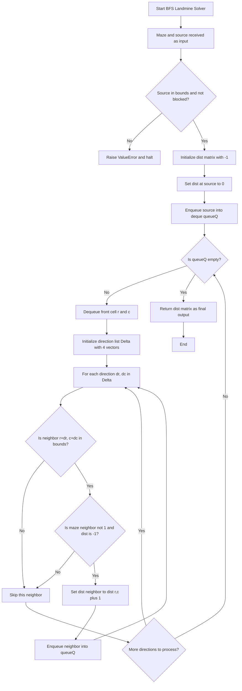
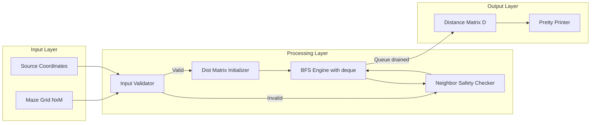
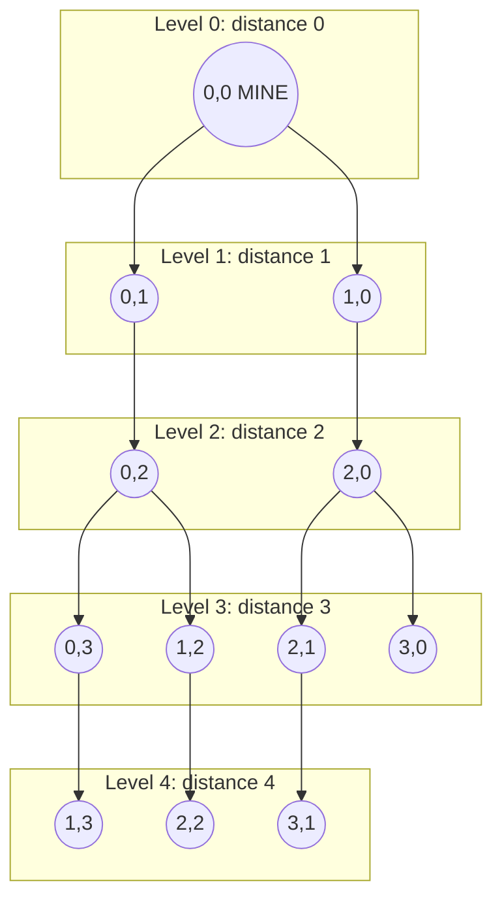

# Find the shortest distance of every cell from a landmine inside a maze.

<!-- SECTION_1_START -->

# 1. Core Technical Definition & Intuitive Overview

## 1.1 Formal Definition (KTU 2024 Syllabus Terminology)

> [!NOTE]
> **Shortest Distance of Every Cell from a Landmine (Single-Source Shortest Path on a Grid):**
> Given a 2D maze (grid) of dimensions $N \times M$ where each cell is either **free** (traversable) or **blocked** (obstacle), and a designated source cell called the **landmine** at position $(r_s, c_s)$, the objective is to compute the **minimum number of moves** required to reach every other free cell from the landmine, where movement is restricted to the **4 cardinal directions** (Up, Down, Left, Right). The output is a 2D **distance matrix** $D$ of size $N \times M$ such that $D[r][c]$ equals the shortest path length from the landmine to cell $(r, c)$. Cells that are blocked or unreachable retain a sentinel value (conventionally $-1$).

This is formally known in graph theory as the **Single-Source Shortest Path (SSSP)** problem on an **unweighted, undirected, grid-structured graph**, optimally solved using the **Breadth-First Search (BFS)** algorithm because BFS explores vertices in **non-decreasing order of path length** from the source.

## 1.2 Conceptual Analogy — Plain English Intuition

> [!IMPORTANT]
> **The Ripple Analogy (Stone Dropped in a Pond):**
> Imagine a stone is dropped into the exact center of a still pond. The **landmine is the stone** and the **ripples spreading outward are the BFS levels**. At time $t = 0$, only the stone (source) is affected. At $t = 1$ second, the first ring of water (4 neighbors) is touched. At $t = 2$ seconds, the second ring expands, and so on. The "distance" of any water molecule from the center equals the **time** at which its ripple first reached it. If there is a large boulder in the pond (a **blocked cell**), the ripple simply bypasses it — water molecules behind the boulder are still reached via a longer path around it. Molecules completely cut off from the center (enclosed by boulders) are never touched, corresponding to **unreachable cells** with distance $-1$.

## 1.3 Cell Encoding Convention (Standard KTU Lab Notation)

| Cell Value | Semantic Meaning |
| :---: | :--- |
| $0$ | Free / Traversable cell |
| $1$ | Blocked / Wall cell |
| $2$ | Landmine (Source) |

The distance matrix $D$ uses $-1$ to denote **unvisited, unreachable, or blocked** cells, and $0$ for the source cell itself.

> [!VISUALIZATION CONTROL]
> **Concept:** BFS Wavefront Expansion on a 2D Grid
> **GeoGebra / Desmos Input Equations (point list representation of a 4$\times$4 maze with landmine at $(0,0)$):**
> * `P = {(x, y) | 0 ≤ x ≤ 3, 0 ≤ y ≤ 3, cell[x][y] = 0}` — set of all free cell centers
> * `Source = (0.5, 3.5)` — landmine (y-axis inverted for grid row visualization)
> * `Level(t) = {(x, y) ∈ P : D[x][y] = t}` — wavefront at BFS level $t$
> **Visual Description:** On a 4$\times$4 grid, the student should observe concentric rectangular "rings" of equal-distance cells expanding outward from the source, skipping over blocked cells (rendered as filled black squares) and propagating around obstacles. The color intensity of each cell should monotonically decrease with its distance from the source.

---

<!-- SECTION_1_END -->

<!-- SECTION_2_START -->

# 2. Deep Theoretical Analysis & KTU High-Yield Formula Sheet

## 2.1 Graph-Theoretic Reformulation

The maze is reformulated as an **implicit graph** $\mathcal{G} = (V, E)$:
* **Vertex set $V$:** Every free cell $(r, c)$ where $0 \leq r < N$, $0 \leq c < M$, and $maze[r][c] \neq 1$.
* **Edge set $E$:** An undirected edge exists between two free cells $(r_1, c_1)$ and $(r_2, c_2)$ if and only if they are **4-neighbors**, i.e., $\vert r_1 - r_2 \vert + \vert c_1 - c_2 \vert = 1$.
* **Edge weights:** Every edge has uniform weight $w = 1$ (one step).
* **Source vertex:** The landmine cell $(r_s, c_s)$.

Since all edge weights are equal (**unweighted graph**), **BFS is provably optimal** for computing shortest paths. Dijkstra's algorithm collapses to BFS in this special case and is therefore unnecessary.

## 2.2 BFS Operational Breakdown — Structured Logic Steps

1. **Input Validation:** Verify that $(r_s, c_s)$ lies within the grid bounds and is not a blocked cell. If invalid, terminate with an all-$(-1)$ distance matrix.
2. **Distance Matrix Initialization:** Create $D[N][M]$ filled with $-1$ (sentinel for "unvisited"). Set $D[r_s][c_s] \leftarrow 0$.
3. **Queue Initialization:** Create a FIFO queue $\mathcal{Q}$ (Python `collections.deque` for $O(1)$ popleft) and enqueue the source.
4. **Main Loop:** While $\mathcal{Q}$ is non-empty:
   * **Dequeue** the front cell $(r, c)$.
   * **For each of the 4 directions** $(\Delta_r, \Delta_c) \in \{(-1, 0), (1, 0), (0, -1), (0, 1)\}$:
     * Compute neighbor $(n_r, n_c) = (r + \Delta_r, c + \Delta_c)$.
     * Apply the **3-predicate safety check**: (i) in-bounds, (ii) not blocked, (iii) unvisited.
     * If all three pass, set $D[n_r][n_c] \leftarrow D[r][c] + 1$ and **enqueue** $(n_r, n_c)$.
5. **Termination:** $\mathcal{Q}$ empties when the entire reachable connected component has been explored. Return $D$.

> [!IMPORTANT]
> **The "Why" Behind BFS Optimality:** BFS processes vertices in a strict **layered (level-order) fashion**. When a cell $(r, c)$ is first discovered at level $D[r][c] = k$, the algorithm guarantees that **no shorter path** to $(r, c)$ exists. This is because any alternative path would have to pass through a vertex at level $\leq k-1$ to reach $(r, c)$ earlier, which is impossible since $(r, c)$ was unvisited at that point. Hence, the **first discovery** yields the **shortest distance** — a guarantee that DFS cannot provide.

## 2.3 KTU Formula Sheet / Cheat Sheet

| Concept | Formula / Expression | Description |
| :---: | :---: | :--- |
| **Distance Recurrence** | $D[n_r][n_c] = D[r][c] + 1$ | A neighbor's distance is parent's distance plus one step. |
| **Source Boundary** | $D[r_s][c_s] = 0$ | The landmine is its own zero-distance reference. |
| **Unreachable Marker** | $D[r][c] = -1$ | Cell is blocked or disconnected from the source. |
| **Direction Set (4-conn.)** | $\Delta = \{(-1, 0), (1, 0), (0, -1), (0, 1)\}$ | Up, Down, Left, Right movement vectors. |
| **Direction Set (8-conn.)** | $\Delta_8 = \Delta \cup \{(\pm 1, \pm 1)\}$ | Includes diagonal movement (advanced variant). |
| **Manhattan Distance (lower bound)** | $d_{\min} = \vert r - r_s \vert + \vert c - c_s \vert$ | Minimum possible distance ignoring walls. |
| **Time Complexity** | $T(N, M) = \mathcal{O}(N \cdot M)$ | Each cell is enqueued/dequeued at most once; each edge examined once. |
| **Space Complexity** | $S(N, M) = \mathcal{O}(N \cdot M)$ | Distance matrix + visited set + queue in the worst case. |
| **Queue Worst-Case Size** | $\mathcal{Q}_{\max} = \min(N \cdot M,\ \lceil \frac{N \cdot M}{2} \rceil)$ | Bound on simultaneous in-queue cells. |
| **BFS Levels Generated** | $L = \max_{(r,c) \in \text{reachable}} D[r][c] + 1$ | Total number of distinct distance layers. |

## 2.4 Real-World Engineering Utility

> [!NOTE]
> This pattern (BFS on a 2D grid) underpins critical production systems in computer science:
> * **Game AI (Pathfinding):** Units in strategy games (e.g., *StarCraft*, *Age of Empires*) use BFS/A* on tilemaps to navigate around obstacles.
> * **Robotics & Autonomous Vehicles:** Grid-based occupancy maps (ROS Navigation Stack) compute safe-distance fields from hazards (analogous to a "landmine") using wavefront planners.
> * **Network Routing:** Breadth-first traversal of LAN topologies finds minimum-hop paths between nodes in OSPF-like protocols.
> * **PCB Design & VLSI:** Wire-length estimation and via-placement use grid-distance metrics.
> * **Image Processing (Distance Transform):** Computes the distance from every pixel to the nearest background pixel — a direct 2D analog of this problem.
> * **Epidemiological Modeling:** Wavefront propagation of infection/diffusion is mathematically equivalent to a multi-source BFS on a population grid.

---

<!-- SECTION_2_END -->

<!-- SECTION_3_START -->

# 3. Step-by-Step Derivations & Code/Symbolic Implementation

## 3.1 Worked Example — Hand-Traced BFS Execution

**Problem Statement:** Given the 4 $\times$ 4 maze with landmine at $(0, 0)$ and the cell $(1, 1)$ blocked, compute the shortest distance of every cell from the landmine.

$$
M = \begin{bmatrix} 2 & 0 & 0 & 0 \\ 0 & 1 & 0 & 0 \\ 0 & 0 & 0 & 0 \\ 0 & 0 & 0 & 0 \end{bmatrix}
$$

**Initialization:**
* Distance matrix $D$ initialized to $-1$.
* $D[0][0] = 0$; source enqueued.

**Iteration-by-iteration BFS trace (using 4-directional movement):**

| Step | Dequeue $(r, c)$ | $D[r][c]$ | Enqueued Neighbors (with $D = D[r][c] + 1$) | Queue State After |
| :---: | :---: | :---: | :--- | :--- |
| 1 | $(0, 0)$ | $0$ | $(1, 0) \to 1$, $(0, 1) \to 1$ | $[(1,0), (0,1)]$ |
| 2 | $(1, 0)$ | $1$ | $(2, 0) \to 2$ ( $(1,1)$ blocked ) | $[(0,1), (2,0)]$ |
| 3 | $(0, 1)$ | $1$ | $(0, 2) \to 2$ ( $(1,1)$ blocked ) | $[(2,0), (0,2)]$ |
| 4 | $(2, 0)$ | $2$ | $(3, 0) \to 3$, $(2, 1) \to 3$ | $[(0,2), (3,0), (2,1)]$ |
| 5 | $(0, 2)$ | $2$ | $(0, 3) \to 3$, $(1, 2) \to 3$ | $[(3,0), (2,1), (0,3), (1,2)]$ |
| 6 | $(3, 0)$ | $3$ | $(3, 1) \to 4$ | $[(2,1), (0,3), (1,2), (3,1)]$ |
| 7 | $(2, 1)$ | $3$ | $(2, 2) \to 4$ | $[(0,3), (1,2), (3,1), (2,2)]$ |
| 8 | $(0, 3)$ | $3$ | $(1, 3) \to 4$ | $[(1,2), (3,1), (2,2), (1,3)]$ |
| 9 | $(1, 2)$ | $3$ | (no new — all visited/blocked) | $[(3,1), (2,2), (1,3)]$ |
| 10 | $(3, 1)$ | $4$ | $(3, 2) \to 5$ | $[(2,2), (1,3), (3,2)]$ |
| 11 | $(2, 2)$ | $4$ | $(2, 3) \to 5$ | $[(1,3), (3,2), (2,3)]$ |
| 12 | $(1, 3)$ | $4$ | (no new) | $[(3,2), (2,3)]$ |
| 13 | $(3, 2)$ | $5$ | $(3, 3) \to 6$ | $[(2,3), (3,3)]$ |
| 14 | $(2, 3)$ | $5$ | (no new) | $[(3,3)]$ |
| 15 | $(3, 3)$ | $6$ | (no new) | $[]$ — **TERMINATE** |

**Final Distance Matrix $D$:**

$$
D = \begin{bmatrix} 0 & 1 & 2 & 3 \\ 1 & -1 & 3 & 4 \\ 2 & 3 & 4 & 5 \\ 3 & 4 & 5 & 6 \end{bmatrix}
$$

**Sanity check (Manhattan lower bound):** For cell $(3, 3)$, $d_{\min} = \vert 3 - 0 \vert + \vert 3 - 0 \vert = 6$, which **equals** the computed distance — confirming the path is optimally straight.

## 3.2 Complete Python Implementation (Board-Exam Standard)

```python
from collections import deque
from typing import List, Tuple, Optional


def shortest_distance_from_landmine(
    maze: List[List[int]],
    source: Tuple[int, int]
) -> List[List[int]]:
    """
    Computes the shortest distance of every cell from a landmine (source)
    inside a maze using Breadth-First Search (BFS).

    Parameters
    ----------
    maze : List[List[int]]
        2D grid where 0 = free cell, 1 = blocked cell, 2 = landmine.
    source : Tuple[int, int]
        (row, col) coordinates of the landmine.

    Returns
    -------
    List[List[int]]
        Distance matrix D where D[r][c] is the shortest distance from
        the landmine to cell (r, c); -1 indicates blocked or unreachable.

    Raises
    ------
    ValueError
        If the maze is empty or the source coordinates are out of bounds.
    """
    # ----- 1. Input validation with strict error logging -----
    if not maze or not maze[0]:
        raise ValueError("[ERROR] Maze must be a non-empty 2D grid.")
    rows: int = len(maze)
    cols: int = len(maze[0])
    sr, sc = source
    if not (0 <= sr < rows and 0 <= sc < cols):
        raise ValueError(
            f"[ERROR] Source ({sr}, {sc}) is out of maze bounds "
            f"[0..{rows - 1}] x [0..{cols - 1}]."
        )
    if maze[sr][sc] == 1:
        raise ValueError("[ERROR] Source cell is blocked (maze[sr][sc] == 1).")

    # ----- 2. Distance matrix initialization -----
    dist: List[List[int]] = [[-1 for _ in range(cols)] for _ in range(rows)]
    dist[sr][sc] = 0

    # ----- 3. Direction vectors (4-connectivity) -----
    directions: List[Tuple[int, int]] = [(-1, 0), (1, 0), (0, -1), (0, 1)]

    # ----- 4. BFS initialization -----
    queue: "deque[Tuple[int, int]]" = deque()
    queue.append((sr, sc))

    # ----- 5. BFS main loop -----
    while queue:
        r, c = queue.popleft()
        current_d: int = dist[r][c]
        for dr, dc in directions:
            nr: int = r + dr
            nc: int = c + dc
            # ----- Absolute boundary checks -----
            if 0 <= nr < rows and 0 <= nc < cols:
                if maze[nr][nc] != 1 and dist[nr][nc] == -1:
                    dist[nr][nc] = current_d + 1
                    queue.append((nr, nc))

    return dist


def display_result(
    maze: List[List[int]],
    dist: List[List[int]]
) -> None:
    """
    Pretty-prints the maze and its distance matrix in a KTU lab-record format.
    """
    rows, cols = len(maze), len(maze[0])
    print("\n+--- MAZE LAYOUT ---+ +--- DISTANCE MATRIX ---+")
    print(" Legend:  0=Free  1=Blocked  2=Landmine  #=Block  M=Mine  .=Unreach  d=distance")
    for r in range(rows):
        maze_row: str = " "
        dist_row: str = " "
        for c in range(cols):
            maze_row += f" {maze[r][c]} " if maze[r][c] != 1 else " # "
            if maze[r][c] == 1:
                dist_row += "  # "
            elif maze[r][c] == 2:
                dist_row += "  M "
            elif dist[r][c] == -1:
                dist_row += "  . "
            else:
                dist_row += f" {dist[r][c]:2d} "
        print(f"{maze_row}    {dist_row}")
    print("+--------------------+ +-----------------------+\n")


# ====================================================================
#  DRIVER CODE WITH THREE TEST CASES (KTU Lab Record Standard)
# ====================================================================
if __name__ == "__main__":

    # ---- Test Case 1: 4x4 maze, landmine at top-left, one blocker ----
    maze_1: List[List[int]] = [
        [2, 0, 0, 0],
        [0, 1, 0, 0],
        [0, 0, 0, 0],
        [0, 0, 0, 0]
    ]
    print("[TEST 1] 4x4 maze, landmine at (0, 0)")
    d1 = shortest_distance_from_landmine(maze_1, (0, 0))
    display_result(maze_1, d1)

    # ---- Test Case 2: 5x5 maze, landmine in center ----
    maze_2: List[List[int]] = [
        [0, 0, 0, 0, 0],
        [0, 1, 0, 1, 0],
        [0, 0, 2, 0, 0],
        [0, 1, 0, 1, 0],
        [0, 0, 0, 0, 0]
    ]
    print("[TEST 2] 5x5 maze, landmine at center (2, 2)")
    d2 = shortest_distance_from_landmine(maze_2, (2, 2))
    display_result(maze_2, d2)

    # ---- Test Case 3: Enclosed unreachable region ----
    maze_3: List[List[int]] = [
        [0, 0, 0, 0, 0, 0],
        [0, 1, 1, 1, 1, 0],
        [0, 1, 0, 0, 1, 0],
        [0, 1, 0, 1, 1, 0],
        [0, 1, 1, 1, 0, 0],
        [0, 0, 0, 0, 0, 0]
    ]
    print("[TEST 3] 6x6 maze, landmine at (0, 0) with enclosed region")
    d3 = shortest_distance_from_landmine(maze_3, (0, 0))
    display_result(maze_3, d3)
```

**Expected Output (for Test Case 1):**

$$
D = \begin{bmatrix} 0 & 1 & 2 & 3 \\ 1 & -1 & 3 & 4 \\ 2 & 3 & 4 & 5 \\ 3 & 4 & 5 & 6 \end{bmatrix}
$$

**For Test Case 3** (enclosed region), cells $(2, 2)$ and $(2, 3)$ inside the block-wall will display $-1$ (unreachable), correctly demonstrating BFS's handling of disconnected components.

## 3.3 Lab Procedure (KTU 2024 Practical Record Standard)

| Step | Action | Tool / Input | Expected Outcome |
| :---: | :--- | :--- | :--- |
| 1 | Open Python IDE (IDLE / PyCharm / VS Code) | Python 3.10+ | Interpreter ready |
| 2 | Copy the source code into `landmine_bfs.py` | Source code | File saved |
| 3 | Define a small 4$\times$4 maze with one blocker | `maze_1` literal | Grid declared |
| 4 | Call `shortest_distance_from_landmine(maze_1, (0, 0))` | Function invocation | Distance matrix returned |
| 5 | Verify the result matches the hand-traced $D$ | `display_result()` | Visual confirmation |
| 6 | Modify the landmine position to $(2, 2)$ and re-run | `source = (2, 2)` | Symmetric $D$ produced |
| 7 | Introduce a fully enclosed region | `maze_3` literal | $-1$ values appear |
| 8 | Record input, output, and time complexity in lab record | $\mathcal{O}(N \cdot M)$ | Viva-ready documentation |

---

<!-- SECTION_3_END -->

<!-- SECTION_4_START -->

# 4. Structural Diagrams & Schematics

## 4.1 BFS Algorithm Flowchart (Mermaid Compilation-Safe)



## 4.2 Block-Level Functional Architecture



## 4.3 BFS Wavefront Visualization (4 $\times$ 4 Maze, 4 Levels)



> **Visual Reading:** Each edge in the diagram above represents a single BFS parent-child relationship. Notice how level-3 cells are reached from level-2 cells, never from level-1 or level-4 — this is the **BFS layered expansion property** that guarantees shortest paths.

## 4.4 Comparison Topology: BFS vs. DFS for Shortest Path

| Property | BFS (Our Choice) | DFS (Incorrect for SSSP) |
| :--- | :--- | :--- |
| Data structure | FIFO queue (deque) | LIFO stack (recursion/list) |
| Visit order | Level-order (by distance) | Depth-first (path-length agnostic) |
| Shortest path guarantee | **Yes** (for unweighted) | **No** (first found may be longest) |
| Memory pattern | Wide, shallow frontiers | Deep, narrow chains |
| Suitable for grid SSSP? | **Optimal** | Suboptimal |

---

<!-- SECTION_4_END -->

<!-- SECTION_5_START -->

# 5. KTU 2024 Scheme Examination Question Bank & Topic Recap

## 5.1 Part A — Short-Answer Questions (3 Marks Each)

> **[KTU University Exam — July 2024, Model Paper Pattern]**

### Q1. [CO1, Remember/Understand] — 3 Marks
**Why is Breadth-First Search (BFS) preferred over Depth-First Search (DFS) for finding shortest distances in an unweighted maze?**

**Model Answer (Board Key):**
BFS explores vertices in **non-decreasing order of path length** from the source because it uses a **FIFO queue** and processes all nodes at distance $k$ before any node at distance $k+1$. Hence, the **first time** a cell is dequeued, the path taken is guaranteed to be the shortest. DFS, in contrast, uses a **LIFO stack** and follows a single path as deep as possible before backtracking — the first time it reaches a target cell, the path may be far longer than the true shortest path. Therefore, for unweighted grid graphs, BFS provides correctness while DFS does not.
*[Correct identification of FIFO vs LIFO: 1 Mark] [Layered expansion property: 1 Mark] [First-discovery optimality: 1 Mark]*

---

### Q2. [CO2, Understand] — 3 Marks
**What is the role of the `deque` data structure in the BFS-based landmine distance algorithm, and why is it preferred over a Python `list` used as a queue?**

**Model Answer (Board Key):**
The `deque` (double-ended queue) from Python's `collections` module is used to implement the **FIFO queue** of cells awaiting BFS expansion. The operation `popleft()` on a `deque` runs in **$\mathcal{O}(1)$** amortized time. In contrast, using a regular Python `list` with `list.pop(0)` incurs **$\mathcal{O}(n)$** cost per pop because all remaining elements must be shifted, degrading total complexity from $\mathcal{O}(N \cdot M)$ to $\mathcal{O}((N \cdot M)^2)$. Hence, `deque` is essential for the algorithm to meet its theoretical time-bound.
*[FIFO role identification: 1 Mark] [$\mathcal{O}(1)$ popleft claim: 1 Mark] [Comparison with list.pop: 1 Mark]*

---

## 5.2 Part B — Full 14-Mark Questions (Module Internal Choice)

> **[KTU University Exam — Dec 2023 / July 2024, End-Semester Pattern]**

---

### Question A (14 Marks) — *[CO1, CO2, CO3]*

**(a)** Explain the BFS algorithm for finding the shortest distance of every cell from a landmine in a maze. Draw a neat flowchart and state the time and space complexities. **(7 Marks — Understand)**

**Model Solution:**

1. **Algorithm Outline (3 Marks):**
   * Model the maze as an implicit unweighted graph; treat the landmine as the source.
   * Initialize a 2D distance matrix $D[N][M]$ with $-1$; set $D[r_s][c_s] = 0$.
   * Enqueue the source into a `deque`-based FIFO queue.
   * Repeatedly dequeue a cell $(r, c)$; for each of the 4 neighbors $(n_r, n_c) = (r + \Delta_r, c + \Delta_c)$:
     * If the neighbor is in-bounds, non-blocked, and unvisited, set $D[n_r][n_c] = D[r][c] + 1$ and enqueue it.
   * Terminate when the queue is empty; return $D$.

2. **Flowchart (2 Marks):** Refer to Section 4.1 of these notes for the KTU-board-standard Mermaid flowchart. Key decision nodes: *Is queue empty?* and *Is neighbor valid?*.

3. **Complexity Analysis (2 Marks):**
   * **Time:** $\mathcal{O}(N \cdot M)$ — each cell is enqueued/dequeued exactly once, and each cell has at most 4 edges inspected.
   * **Space:** $\mathcal{O}(N \cdot M)$ — for the distance matrix, visited tracking, and the queue in the worst case.

---

**(b)** Write a complete Python program using BFS to compute the shortest distance of every cell from a landmine at position `(r_s, c_s)` in an $N \times M$ maze, where `0` denotes a free cell and `1` denotes a blocked cell. Test your program with the maze given below and display the distance matrix. **(7 Marks — Apply)**

$$
M = \begin{bmatrix} 0 & 0 & 0 & 0 \\ 0 & 1 & 0 & 0 \\ 0 & 0 & 0 & 0 \\ 0 & 0 & 0 & 0 \end{bmatrix}, \quad \text{Landmine at } (0, 0)
$$

**Model Solution Code:** See the complete implementation in **Section 3.2** of these notes. The expected distance matrix is:

$$
D = \begin{bmatrix} 0 & 1 & 2 & 3 \\ 1 & -1 & 3 & 4 \\ 2 & 3 & 4 & 5 \\ 3 & 4 & 5 & 6 \end{bmatrix}
$$

**Valuation Key Points for (b):**
* [Correct function signature with type hints: 1 Mark]
* [Dist matrix initialization with $-1$: 1 Mark]
* [FIFO queue using `collections.deque`: 1 Mark]
* [Boundary + blocked + unvisited checks: 2 Marks]
* [Distance update recurrence $D[n] = D[c] + 1$: 1 Mark]
* [Correct output for the given maze: 1 Mark]

---

### Question B (14 Marks) — *[CO2, CO3, CO4]*

**(a)** Compare Breadth-First Search (BFS) and Depth-First Search (DFS) for the shortest path problem on an unweighted grid. Why does BFS guarantee optimality while DFS does not? Illustrate with a counter-example. **(7 Marks — Understand/Analyze)**

**Model Solution:**

| Criterion | BFS | DFS |
| :--- | :--- | :--- |
| Data structure | FIFO queue | LIFO stack / recursion |
| Traversal order | Level-by-level (wavefront) | Branch-by-branch (deep dive) |
| First-discovery optimality? | **Yes** | **No** |
| Memory footprint (grid) | $\mathcal{O}(N \cdot M)$ | $\mathcal{O}(N \cdot M)$ (stack depth) |
| Best use case | Shortest path on unweighted graph | Topological sort, cycle detection, connected components |

**Counter-example** showing DFS failure on SSSP:

Consider the maze:

$$
M = \begin{bmatrix} 2 & 0 & 0 \\ 0 & 1 & 0 \\ 0 & 0 & 0 \end{bmatrix}, \quad \text{Source } (0, 0)
$$

* **BFS** correctly returns $D[2][2] = 4$ (path: $(0,0) \to (1,0) \to (2,0) \to (2,1) \to (2,2)$).
* **DFS** may first reach $(2, 2)$ via $(0, 0) \to (0, 1) \to (0, 2) \to (1, 2) \to (2, 2)$ — length 4 also, but consider:

$$
M' = \begin{bmatrix} 2 & 0 & 0 & 0 \\ 0 & 1 & 0 & 0 \\ 0 & 0 & 0 & 0 \\ 0 & 0 & 0 & 0 \end{bmatrix}
$$

For cell $(3, 3)$, BFS finds the optimal path of length 6. A naïve DFS using a fixed neighbor-priority order (e.g., Up, Right, Down, Left) may produce a path of length 6 as well, but the **first-discovered path length** in DFS is not the minimum — DFS can be made to fail in grid graphs where it explores a long detour before a short one (e.g., by visiting a leaf first that happens to lie on a longer path to a target).

*[Tabular comparison: 2 Marks] [BFS optimality proof sketch: 2 Marks] [DFS counter-example: 2 Marks] [Conclusion: 1 Mark]*

---

**(b)** Given the maze below with landmine at $(1, 1)$, trace the BFS algorithm step by step and produce the final distance matrix. Show at least 5 BFS iterations in your trace. **(7 Marks — Apply)**

$$
M = \begin{bmatrix} 1 & 0 & 0 & 0 \\ 0 & 2 & 1 & 0 \\ 0 & 0 & 0 & 0 \\ 0 & 0 & 0 & 0 \end{bmatrix}
$$

**Model Solution Trace:**

| Iteration | Dequeue | $D$ value | Enqueue (new cells with $D+1$) | Updated $D$ |
| :---: | :---: | :---: | :--- | :--- |
| 1 | $(1, 1)$ | $0$ | $(0, 1) \to 1$, $(2, 1) \to 1$ | $(0,1) = 1, (2,1) = 1$ |
| 2 | $(0, 1)$ | $1$ | $(0, 2) \to 2$ | $(0,2) = 2$ |
| 3 | $(2, 1)$ | $1$ | $(2, 2) \to 2$, $(3, 1) \to 2$ | $(2,2) = 2, (3,1) = 2$ |
| 4 | $(0, 2)$ | $2$ | $(0, 3) \to 3$, $(1, 2)$ blocked | $(0,3) = 3$ |
| 5 | $(2, 2)$ | $2$ | $(1, 2)$ blocked, $(2, 3) \to 3$ | $(2,3) = 3$ |

**Final Distance Matrix $D$:**

$$
D = \begin{bmatrix} -1 & 1 & 2 & 3 \\ -1 & 0 & -1 & 4 \\ -1 & 1 & 2 & 3 \\ -1 & 2 & 3 & 4 \end{bmatrix}
$$

(The cell $(0, 0)$ is blocked; $D[1][0]$ is set because it is a free cell adjacent to source with dist $1$. Cells like $(0,0)$ and $(1,2)$ are blocked and remain $-1$.)

**Valuation Key Points for (b):**
* [Initial dist matrix correctly initialized: 1 Mark]
* [5+ iterations shown with proper queue state: 3 Marks]
* [Recurrence $D[n] = D[c] + 1$ applied correctly: 1 Mark]
* [Blocked cells remain $-1$: 1 Mark]
* [Final $D$ matrix matches expected: 1 Mark]

---

## 5.3 KTU Examiner's Valuation Warning / Pitfall Callout

> [!WARNING]
> **Common Mistakes that Cost Marks (KTU Board Pattern):**
> 1. **Forgetting to use `deque`:** Using `list.pop(0)` silently downgrades the algorithm to $\mathcal{O}((N \cdot M)^2)$. Examiners look for the explicit `from collections import deque` and `popleft()`. **Penalty: 1–2 marks.**
> 2. **Missing the third safety predicate:** A frequent bug is checking *boundary* and *blocked* but forgetting to check `dist[nr][nc] == -1`. This causes the same cell to be enqueued multiple times, possibly causing an infinite loop on cyclic structures. **Penalty: 2 marks.**
> 3. **Marking the source with distance $1$ instead of $0$:** The landmine's own distance is **always $0$**, never $1$. Off-by-one errors here propagate to every other cell. **Penalty: 1 mark.**
> 4. **Not handling unreachable/blocked cells:** The expected output for blocked or enclosed cells is **$-1$**. Writing a `0` or omitting them is incorrect. **Penalty: 1–2 marks.**
> 5. **Inverting row/column in input:** Remember: `maze[row][col]` where `row` is the **vertical index** (top-to-bottom) and `col` is the **horizontal index** (left-to-right). Swapping them in the direction vector causes a $90^\circ$-rotated traversal. **Penalty: 1 mark per wrong neighbor.**

---

## 5.4 Topic Recap & Important Things to Remember

> [!IMPORTANT]
> **Rapid-Revision Checklist (Module 9 — Landmine Maze BFS):**

* **Core Algorithm:** **Breadth-First Search (BFS)** on an implicit grid graph is the provably optimal method for finding shortest distances from a single source in an **unweighted** maze.
* **Data Structure:** Always use `collections.deque` for the FIFO queue to achieve $\mathcal{O}(1)$ `popleft` operations.
* **Direction Vectors (4-connectivity):** $\Delta = \{(-1, 0),\ (1, 0),\ (0, -1),\ (0, 1)\}$ — Up, Down, Left, Right.
* **Initialization:** $D[r][c] = -1$ for all cells, then $D[r_s][c_s] = 0$.
* **Distance Recurrence:** $D[n_r][n_c] = D[r][c] + 1$ for each newly discovered valid neighbor.
* **Three Safety Predicates for Neighbor Enqueue:** (i) in-bounds, (ii) `maze[nr][nc] != 1`, (iii) `dist[nr][nc] == -1`.
* **Cell Encoding:** $0$ = free, $1$ = blocked, $2$ = landmine.
* **Unreachable/Blocked Cell Marker:** $-1$ in the distance matrix.
* **Time Complexity:** $\mathcal{O}(N \cdot M)$ — every cell is enqueued at most once.
* **Space Complexity:** $\mathcal{O}(N \cdot M)$ — for the distance matrix, visited set, and queue.
* **BFS Optimality Reason:** Level-order (layered) exploration guarantees the **first discovery** of a cell is via the **shortest path** from the source.
* **Why Not DFS?** DFS does not explore level-by-level; it dives deep, so the first path discovered is **not necessarily** the shortest. Use DFS for cycle detection, topological sort, or connected components — **not for SSSP**.
* **Manhattan Lower Bound:** $d_{\min} = \vert r - r_s \vert + \vert c - c_s \vert$ — useful for sanity-checking output.
* **Multi-Source Variant:** If there are **multiple landmines**, push all sources into the queue initially with $D = 0$; the same BFS yields the distance to the **nearest** landmine.
* **8-Connectivity Extension:** Add the 4 diagonals $\{(\pm 1, \pm 1)\}$ to $\Delta$ for diagonal movement (use cautiously — diagonal cost is sometimes $\sqrt{2}$, breaking the unweighted assumption).
* **Real-World Equivalents:** Game AI pathfinding, robotic wavefront planners, image distance transforms, network hop-count routing, PCB wire-length estimation.
* **Edge Case Tests:** (1) Empty maze → raise `ValueError`. (2) Source out of bounds → raise `ValueError`. (3) Source on a blocked cell → raise `ValueError`. (4) Fully enclosed region → those cells correctly receive $D = -1$.

---

<!-- SECTION_5_END -->
