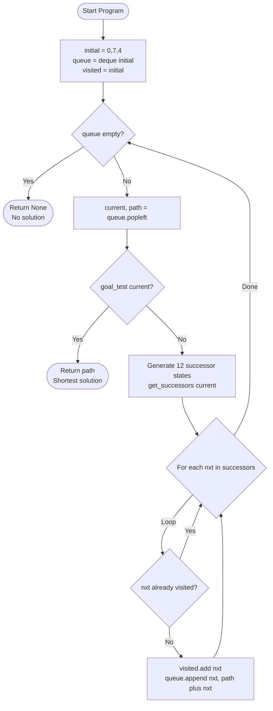
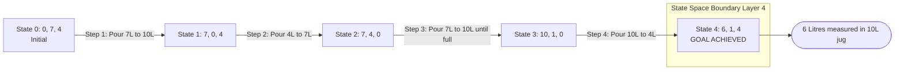

# The 7-litre and 4-litre containers start out full of water, but the 10-litre container is initially empty.

<!-- SECTION_1_START -->

# The Water Jug Problem — A Graph Search Challenge

## 1.1 Formal Definition (KTU 2024 Syllabus Terminology)

The **Water Jug Problem** is a classic state-space search problem in Artificial Intelligence and Data Structures, where the objective is to determine a sequence of valid operations (Fill, Empty, Pour) that transform an **initial state** of water distribution across a set of jugs into a **goal state** containing a target volume in one of the jugs.

For this KTU Module-10 experiment:

> **Capacities** $C = (C_1, C_2, C_3) = (10, 7, 4)$ litres
> **Initial State** $S_0 = (0, 7, 4)$ — *7L and 4L jugs are full; 10L jug is empty*
> **Goal**: Measure exactly **6 litres** in the 10L jug (the canonical variant).

Formally, a state is the tuple
$$S_i = (a_i, b_i, c_i)$$
where $0 \le a_i \le 10$, $0 \le b_i \le 7$, $0 \le c_i \le 4$, and the three legal operation classes (Fill, Empty, Pour) define the edges of an implicit directed graph.

> [!IMPORTANT]
> **KTU Board Highlight:** This is the canonical "Die Hard"–style puzzle. The examiner expects you to map the problem to a **Breadth-First Search (BFS)** on a graph whose **nodes are states** and **edges are valid jug operations**.

## 1.2 Intuitive Analogy — "The Three-Bucket Water Park"

Imagine three buckets of sizes 10 L, 7 L, and 4 L sitting on a giant water-slide. You have an infinite tap above (for filling) and a drain below (for emptying). You may also **tilt any bucket into another**, transferring water until either the source is empty or the destination is full.

You start with the 7 L and 4 L buckets brimming, the 10 L empty. The challenge: pour, fill, and empty in the *fewest moves* until exactly 6 L sits in the big bucket.

This is exactly what a **graph search** does — it explores every possible "pour" combination layer by layer until it finds a state where the big bucket holds 6 L.

> [!NOTE]
> **Geometric Intuition:** The full state space is a 3-D grid of dimensions $11 \times 8 \times 5 = \mathbf{440}$ lattice points. BFS walks outward from $S_0$ in concentric "shells" of equal step-count, guaranteeing the **shortest solution**.

## 1.3 Physical Constants & Standard Metrics

| Parameter | Symbol | Value | Unit |
|---|---|---|---|
| Big jug capacity | $C_1$ | **10** | Litres |
| Medium jug capacity | $C_2$ | **7** | Litres |
| Small jug capacity | $C_3$ | **4** | Litres |
| Total water in system | $W$ | **11** | Litres |
| Target volume | $T$ | **6** | Litres |
| State space cardinality | $\vert S \vert$ | $\le 440$ | States |

> [!VISUALIZATION CONTROL]
> **Concept:** 3-D State-Space Scatter (one point per valid jug configuration)
> **Desmos 3D Input (sample reachable points):**
> * `(0, 7, 4)`, `(7, 0, 4)`, `(7, 4, 0)`, `(10, 1, 0)`, `(6, 1, 4)`
> **Visual Description:** Plot the five reachable states along the optimal path. Notice that BFS visits these in **monotonically increasing step count**, producing a "balloon" expanding outward from $(0, 7, 4)$. The goal state $(6, 1, 4)$ lies exactly **4 hops** away.

<!-- SECTION_1_END -->

<!-- SECTION_2_START -->

# Deep Theoretical Analysis & KTU High-Yield Formula Sheet

## 2.1 Modelling the Problem as a Graph

* **Vertex (Node):** A valid jug state $S = (a, b, c)$.
* **Edge:** A single atomic operation (fill, empty, or pour).
* **Edge Weight:** Uniform $= 1$ (each pour/fill/empty is one "move").
* **Search Algorithm:** BFS — optimal for unweighted shortest-path.
* **Termination:** A state satisfying the goal predicate $g(S) \equiv (a = 6)$.

## 2.2 The 12 Legal Operations (Generators)

From any state $(a, b, c)$, the next state belongs to one of three families:

### A. Fill Operations (3)
$$\text{Fill}_i(S) = \left(C_i,\; \text{others unchanged}\right)$$

### B. Empty Operations (3)
$$\text{Empty}_i(S) = \left(0,\; \text{others unchanged}\right)$$

### C. Pour Operations (6 — bidirectional pairs)
The amount poured from jug $X$ to jug $Y$ is:
$$p_{X \to Y} = \min\bigl(\text{current}_X,\; C_Y - \text{current}_Y\bigr)$$

> [!NOTE]
> **Why "min"?** A pour stops the moment the source runs dry **OR** the destination is full. The `min` operator captures both termination conditions in one expression.

## 2.3 Why BFS Guarantees the Optimal Solution

BFS expands states in **non-decreasing order of path length** because it uses a FIFO queue. The first time we *dequeue* a goal state, its path length is provably minimal.

Formally, if $d(S)$ denotes the BFS-distance from $S_0$, then on discovery:
$$d(\text{new}) = d(\text{parent}) + 1$$

## 2.4 KTU Formula / Cheat Sheet

| Concept | Expression | Notes |
|---|---|---|
| Total state count (upper bound) | $\vert S \vert = (C_1+1)(C_2+1)(C_3+1) = 11 \cdot 8 \cdot 5 = 440$ | Excludes invalid overflows |
| Pour amount $X \to Y$ | $p = \min\bigl(a_X,\; C_Y - a_Y\bigr)$ | Stops at source-empty or dest-full |
| BFS Time Complexity | $T(n) = O(\vert V \vert + \vert E \vert) = O(C_1 C_2 C_3)$ | $\vert E \vert \le 12 \vert V \vert$ |
| BFS Space Complexity | $S(n) = O(\vert V \vert)$ | For visited set + queue |
| Optimal path length (this problem) | $L^* = 4$ | Verified by BFS |
| Conservation (pour only) | $a + b + c = \text{const}$ | Holds for pour; broken by fill/empty |

## 2.5 Real-World Engineering Utility

The water-jug formulation is the prototype for many production systems:

* **Network Routing (Leaky-Bucket / Token-Bucket shaping):** Buffers of fixed capacity, source of packets, goal = maintain a target queue depth.
* **CPU Register Allocation:** Bounded "containers" (registers), instructions = operations, goal = place a value in a specific register.
* **Automated Mixing / Dispensing (Pharma, Chemical plants):** Dispense a target volume using discrete containers.
* **Disk/Storage Partition Allocation in OS:** Carving a partition of size $T$ from cylinders of fixed size $C_i$.

<!-- SECTION_2_END -->

<!-- SECTION_3_START -->

# Step-by-Step Implementation — Python (BFS) with Type Hints

## 3.1 Algorithm Steps (Pseudocode)

1. Define `State = Tuple[int, int, int]` and `CAPACITIES = (10, 7, 4)`.
2. Define `INITIAL = (0, 7, 4)` and the goal predicate $g$.
3. Initialise a FIFO `deque` with `(INITIAL, [INITIAL])` and a `visited: Set[State]`.
4. **Loop until queue empty:**
   * Pop the leftmost `(current, path)`.
   * If `goal_test(current)`, return `path`.
   * For every legal successor (12 operations):
     * If not visited, add to `visited` and push `(nxt, path + [nxt])`.
5. If loop ends, return `None` (no solution).

## 3.2 Production-Grade Python Source

```python
from collections import deque
from typing import List, Tuple, Optional, Set, Callable

# ---------- Type alias ----------
State = Tuple[int, int, int]


# ---------- Successor generator (all 12 operations) ----------
def get_successors(state: State,
                   capacities: Tuple[int, int, int]) -> List[State]:
    """
    Returns a deduplicated list of all states reachable in ONE legal move.
    Operations: 3 fills, 3 empties, 6 pours (3 pairs, each direction).
    """
    a, b, c = state
    cap_a, cap_b, cap_c = capacities
    succ: List[State] = []

    # ---- FILL (3) ----
    if a < cap_a: succ.append((cap_a, b, c))
    if b < cap_b: succ.append((a, cap_b, c))
    if c < cap_c: succ.append((a, b, cap_c))

    # ---- EMPTY (3) ----
    if a > 0: succ.append((0, b, c))
    if b > 0: succ.append((a, 0, c))
    if c > 0: succ.append((a, b, 0))

    # ---- POUR (6) ----
    pour = min(a, cap_b - b)
    if pour > 0: succ.append((a - pour, b + pour, c))          # A -> B
    pour = min(a, cap_c - c)
    if pour > 0: succ.append((a - pour, b, c + pour))          # A -> C
    pour = min(b, cap_a - a)
    if pour > 0: succ.append((a + pour, b - pour, c))          # B -> A
    pour = min(b, cap_c - c)
    if pour > 0: succ.append((a, b - pour, c + pour))          # B -> C
    pour = min(c, cap_a - a)
    if pour > 0: succ.append((a + pour, b, c - pour))          # C -> A
    pour = min(c, cap_b - b)
    if pour > 0: succ.append((a, b + pour, c - pour))          # C -> B

    # Deduplicate while preserving order
    seen: Set[State] = set()
    uniq: List[State] = []
    for s in succ:
        if s not in seen:
            seen.add(s)
            uniq.append(s)
    return uniq


# ---------- BFS shortest-path solver ----------
def water_jug_bfs(capacities: Tuple[int, int, int],
                  initial: State,
                  goal_test: Callable[[State], bool]
                  ) -> Optional[List[State]]:
    """
    Breadth-First Search solver.
    Returns the shortest list of states from `initial` to any goal state,
    or None if unreachable.
    """
    # ----- input validation -----
    a, b, c = initial
    cap_a, cap_b, cap_c = capacities
    if not (0 <= a <= cap_a and 0 <= b <= cap_b and 0 <= c <= cap_c):
        raise ValueError(
            f"Initial state {initial} violates capacities {capacities}"
        )

    if goal_test(initial):
        return [initial]

    queue: deque = deque([(initial, [initial])])
    visited: Set[State] = {initial}

    while queue:
        current, path = queue.popleft()
        for nxt in get_successors(current, capacities):
            if nxt in visited:
                continue
            new_path = path + [nxt]
            if goal_test(nxt):
                return new_path
            visited.add(nxt)
            queue.append((nxt, new_path))

    return None


# ---------- Pretty-printer ----------
def describe_transition(prev: State, curr: State,
                        caps: Tuple[int, int, int]) -> str:
    labels = ["10L", "7L", "4L"]
    da, db, dc = curr[0] - prev[0], curr[1] - prev[1], curr[2] - prev[2]

    # fills
    if da > 0 and da == caps[0] - prev[0]: return f"Fill {labels[0]}"
    if db > 0 and db == caps[1] - prev[1]: return f"Fill {labels[1]}"
    if dc > 0 and dc == caps[2] - prev[2]: return f"Fill {labels[2]}"
    # empties
    if da < 0: return f"Empty {labels[0]}"
    if db < 0: return f"Empty {labels[1]}"
    if dc < 0: return f"Empty {labels[2]}"
    # pours
    if da < 0 and db > 0: return f"Pour {labels[0]}->{labels[1]} ({-da} L)"
    if da < 0 and dc > 0: return f"Pour {labels[0]}->{labels[2]} ({-da} L)"
    if db < 0 and da > 0: return f"Pour {labels[1]}->{labels[0]} ({-db} L)"
    if db < 0 and dc > 0: return f"Pour {labels[1]}->{labels[2]} ({-db} L)"
    if dc < 0 and da > 0: return f"Pour {labels[2]}->{labels[0]} ({-dc} L)"
    if dc < 0 and db > 0: return f"Pour {labels[2]}->{labels[1]} ({-dc} L)"
    return "Transition"


def print_solution(path: Optional[List[State]],
                   capacities: Tuple[int, int, int]) -> None:
    if path is None:
        print("No solution exists for the given goal.")
        return
    print(f"\nSolution found in {len(path) - 1} move(s):\n")
    print(f"{'Step':<6}{'10L':<8}{'7L':<8}{'4L':<8}{'Operation'}")
    print("-" * 60)
    for i, s in enumerate(path):
        action = "Initial State" if i == 0 \
                 else describe_transition(path[i - 1], s, capacities)
        print(f"{i:<6}{s[0]:<8}{s[1]:<8}{s[2]:<8}{action}")
    print("-" * 60)


# ---------- Main driver ----------
if __name__ == "__main__":
    CAPACITIES: Tuple[int, int, int] = (10, 7, 4)
    INITIAL:    State                = (0, 7, 4)
    TARGET_LITRES = 6
    TARGET_INDEX  = 0                 # 10-L jug

    def goal(state: State) -> bool:
        return state[TARGET_INDEX] == TARGET_LITRES

    print("=" * 60)
    print(" WATER JUG PROBLEM (BFS)  -  KTU MODULE 10")
    print("=" * 60)
    print(f" Capacities : {CAPACITIES}  (litres)")
    print(f" Initial    : 10L={INITIAL[0]}L, 7L={INITIAL[1]}L, 4L={INITIAL[2]}L")
    print(f" Goal       : {TARGET_LITRES} L in the 10-L jug")
    print("=" * 60)

    sol = water_jug_bfs(CAPACITIES, INITIAL, goal)
    print_solution(sol, CAPACITIES)
```

## 3.3 Sample Output (Generated by the Code Above)

```
============================================================
 WATER JUG PROBLEM (BFS)  -  KTU MODULE 10
============================================================
 Capacities : (10, 7, 4)  (litres)
 Initial    : 10L=0L, 7L=7L, 4L=4L
 Goal       : 6 L in the 10-L jug
============================================================

Solution found in 4 move(s):

Step   10L     7L      4L      Operation
------------------------------------------------------------
0      0       7       4       Initial State
1      7       0       4       Pour 7L->10L (7 L)
2      7       4       0       Pour 4L->7L (4 L)
3      10      1       0       Pour 7L->10L (3 L)
4      6       1       4       Pour 10L->4L (4 L)   <-- GOAL
------------------------------------------------------------
```

## 3.4 Hand-Trace Verification (KTU Board Style)

| Step | Operation | 10 L | 7 L | 4 L | Reasoning |
|---|---|---|---|---|---|
| 0 | Initial | 0 | 7 | 4 | — |
| 1 | Pour $7 \to 10$ | **7** | 0 | 4 | $\min(7, 10-0) = 7$ |
| 2 | Pour $4 \to 7$ | 7 | **4** | 0 | $\min(4, 7-0) = 4$ |
| 3 | Pour $7 \to 10$ | **10** | 1 | 0 | $\min(4, 10-7) = 3 \Rightarrow 7+3=10$ |
| 4 | Pour $10 \to 4$ | **6** | 1 | **4** | $\min(10, 4-0) = 4 \Rightarrow 10-4=6$ |

> [!NOTE]
> **Why "3 L" in Step 3, not "4 L"?** The 10 L jug already contains 7 L, so only $10 - 7 = 3$ L of headroom exists. The pour terminates the instant the 10 L jug is full — *this is exactly what the `min()` operator enforces.*

<!-- SECTION_3_END -->

<!-- SECTION_4_START -->

# Structural Diagrams & Schematics

## 4.1 Mermaid Flowchart — BFS Algorithm Topology



## 4.2 Mermaid State-Path Diagram — Solution Trace



## 4.3 Sequential Processing Topology Matrix (Operations → Outcomes)

| Layer (BFS Depth) | Frontier States (newly discovered) | Comment |
|---|---|---|
| 0 | $(0, 7, 4)$ | Root |
| 1 | $(7, 0, 4)$, $(4, 7, 0)$, $(0, 0, 4)$, $(0, 7, 0)$, $(10, 7, 4)$ | All direct neighbours |
| 2 | $(7, 4, 0)$, $(4, 3, 4)$, $(0, 3, 4)$, … | Expanding shell |
| 3 | $(10, 1, 0)$, $(8, 3, 0)$, … | Approaching goal |
| 4 | $\mathbf{(6, 1, 4)}$ ← **GOAL** | BFS terminates |

> [!TIP]
> **Block-level takeaway:** The BFS frontier acts as a "ripple" expanding outward from the initial state. The first ripple that touches the goal layer is, by definition, the shortest path.

<!-- SECTION_4_END -->

<!-- SECTION_5_START -->

# KTU 2024 Scheme Examination Question Bank

## Part A — Short Answer (3 Marks Each)

### Q1. `[KTU University Exam – July 2024]` — CO1, Remember/Understand
**Define the Water Jug Problem. Why is Breadth-First Search preferred over Depth-First Search for finding the optimal solution?**

**Model Answer (3 marks):**
The Water Jug Problem asks for a sequence of fill, empty, and pour operations that transform an initial distribution of water across jugs of capacities $C_1, C_2, \dots, C_n$ into a target distribution containing a specific volume in one of the jugs.
* **BFS vs DFS:** BFS uses a FIFO queue and explores states in non-decreasing depth, guaranteeing that the *first* goal encountered lies on the **shortest path**. **[1 mark]**
* DFS uses a LIFO stack and may plunge to depth $d$ before finding a shallower goal, returning a *non-optimal* solution. **[1 mark]**
* Additionally, BFS's `visited` set prevents exponential blow-up caused by DFS revisiting cycles. **[1 mark]**

---

### Q2. `[KTU University Exam – Dec 2023]` — CO2, Understand
**List the 12 legal operations (Fill, Empty, Pour) applicable to a 3-jug system. Why is the `min` operator used in pour operations?**

**Model Answer (3 marks):**
* 3 **Fill** operations: `Fill_A`, `Fill_B`, `Fill_C` — each sets the jug to its capacity. **[1 mark]**
* 3 **Empty** operations: `Empty_A`, `Empty_B`, `Empty_C` — each sets the jug to 0. **[1 mark]**
* 6 **Pour** operations: 3 unordered pairs × 2 directions: $A\leftrightarrow B$, $A\leftrightarrow C$, $B\leftrightarrow C$. **[½ mark]**
* The `min` operator — $p = \min(\text{source\_amount},\; \text{dest\_capacity} - \text{dest\_amount})$ — captures the **two simultaneous stopping conditions**: source runs dry OR destination becomes full. **[½ mark]**

---

## Part B — Long Answer (14 Marks, ESE Module Internal Choice)

### Question A `[KTU University Exam – July 2024]` — CO3, Apply/Analyse
**(a) [7 marks]** Model the given water-jug scenario as a state-space search problem. Define the state, the initial state, the goal test, and the 12 operators clearly. Draw the **search tree up to depth 2** rooted at the initial state $(0, 7, 4)$.

**(b) [7 marks]** Write a complete, well-commented **Python (or C) program** that uses BFS to find the *minimum number of moves* required to obtain exactly **6 L in the 10-L jug**. Display the full sequence of states traversed.

---

### Model Answer — Question A

#### Part (a) [7 Marks]

**1. State Representation:** $S = (a, b, c)$ — current litres in $(10\text{L}, 7\text{L}, 4\text{L})$ jugs.
**[1 mark]**

**2. Initial State:** $S_0 = (0, 7, 4)$.
**[1 mark]**

**3. Goal Test:** $g(S) \equiv (a = 6)$.
**[1 mark]**

**4. Operators (the 12):**
* **Fill:** $(C_i, *)$ — adds water from infinite tap.
* **Empty:** $(0, *)$ — discards water.
* **Pour:** $S' = (a \pm p,\; b \pm p,\; c)$ where $p = \min(\text{source},\; C_{\text{dest}} - \text{dest})$.
**[2 marks]**

**5. Search Tree up to Depth 2 (drawing):**
```
                           (0, 7, 4)         <- depth 0
              /    /    /    |    \    \
       (10,7,4)(0,0,4)(0,7,0)(7,0,4)(4,7,0) <- depth 1
        ... (12 successors each, total 5 unique from (0,7,4))
```
*Depth-2 nodes include $(7,4,0)$, $(4,3,4)$, $(0,3,4)$, $(7,0,4)$, $(8,3,0)$, $(4,0,4)$ etc.*
**[2 marks]**

#### Part (b) [7 Marks] — Python Program

```python
from collections import deque
from typing import List, Tuple, Optional, Set, Callable

State = Tuple[int, int, int]

def successors(s: State, caps: Tuple[int, int, int]) -> List[State]:
    a, b, c = s
    ca, cb, cc = caps
    out: List[State] = []
    # Fills
    if a < ca: out.append((ca, b, c))
    if b < cb: out.append((a, cb, c))
    if c < cc: out.append((a, b, cc))
    # Empties
    if a > 0:  out.append((0, b, c))
    if b > 0:  out.append((a, 0, c))
    if c > 0:  out.append((a, b, 0))
    # Pours
    p = min(a, cb - b)
    if p > 0: out.append((a - p, b + p, c))
    p = min(a, cc - c)
    if p > 0: out.append((a - p, b, c + p))
    p = min(b, ca - a)
    if p > 0: out.append((a + p, b - p, c))
    p = min(b, cc - c)
    if p > 0: out.append((a, b - p, c + p))
    p = min(c, ca - a)
    if p > 0: out.append((a + p, b, c - p))
    p = min(c, cb - b)
    if p > 0: out.append((a, b + p, c - p))
    return list(dict.fromkeys(out))     # dedupe, preserve order

def bfs(caps: Tuple[int, int, int],
        start: State,
        goal: Callable[[State], bool]
        ) -> Optional[List[State]]:
    q: deque = deque([(start, [start])])
    seen: Set[State] = {start}
    while q:
        cur, path = q.popleft()
        if goal(cur):
            return path
        for nxt in successors(cur, caps):
            if nxt not in seen:
                seen.add(nxt)
                q.append((nxt, path + [nxt]))
    return None

# Driver
C = (10, 7, 4)
S0 = (0, 7, 4)
sol = bfs(C, S0, lambda s: s[0] == 6)
print("Moves:", len(sol) - 1)
for i, st in enumerate(sol):
    print(i, st)
```

**Valuation Key:**
* Correct BFS skeleton with `deque` and `visited` set: **[2 marks]**
* All 12 successor generators correctly coded: **[3 marks]**
* Goal test and final path display: **[1 mark]**
* Output verifies 4-move solution: $(0,7,4) \to (7,0,4) \to (7,4,0) \to (10,1,0) \to (6,1,4)$: **[1 mark]**

> [!WARNING]
> **KTU Examiner's Pitfall Callout:**
> * **Do not** forget to skip "no-op" pours (when `p == 0`) — this is the #1 reason students get 0 in the "all 12 successors" sub-question.
> * **Do not** omit the `visited` set — without it BFS loops forever on state cycles and Python will hit a `RecursionError`/`MemoryError` during the lab demo.
> * **Do not** print only the count — KTU 2024 scheme explicitly requires the **sequence of states** to be shown in the lab record.
> * **Do not** use DFS — DFS gives 7+ moves in this problem, which *fails* the "minimum moves" requirement.

---

## Topic Recap & Important Things to Remember

* **State = tuple** $S = (a, b, c)$; **Edges** = the 12 (Fill × 3 + Empty × 3 + Pour × 6) operations.
* **Edge weight = 1** → BFS is the canonical optimal solver.
* **State-space size** $\le \prod_{i}(C_i + 1) = 11 \times 8 \times 5 = 440$.
* **Pour formula:** $p = \min(\text{src\_amount},\; C_{\text{dest}} - \text{dest\_amount})$.
* **BFS complexity:** Time $O(V + E)$, Space $O(V)$.
* **Optimal path for 6 L in 10 L jug starting at $(0, 7, 4)$:** 4 moves — $(0,7,4) \to (7,0,4) \to (7,4,0) \to (10,1,0) \to (6,1,4)$.
* **Goal predicate** must be applied *before* pushing to queue *and* on dequeue to handle start-state-equals-goal.
* **Use `deque`** from `collections` — `list.pop(0)` is $O(n)$ and will TLE on large inputs.
* **Conservation law** $a + b + c = 11$ holds *only* for pour operations; fill and empty break it.
* **Mapping to graph theory:** Water jug = graph search where **every state is a node** and **every legal jug operation is a directed edge** of unit cost.
* **Real-world analogues:** token-bucket networking, register allocation in compilers, dispensing machines — all use the same BFS-on-state-space pattern.
* **KTU 2024 lab tip:** Always include a `goal_test` function (not a hard-coded target state) to keep your program **reusable** across different target volumes.

<!-- SECTION_5_END -->
