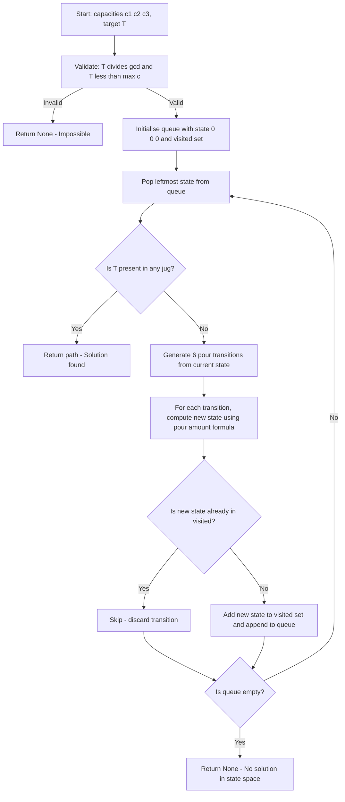
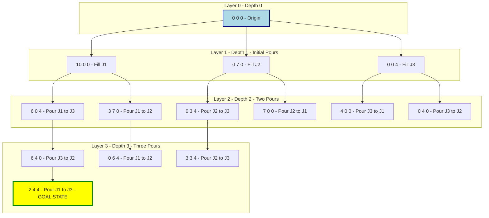
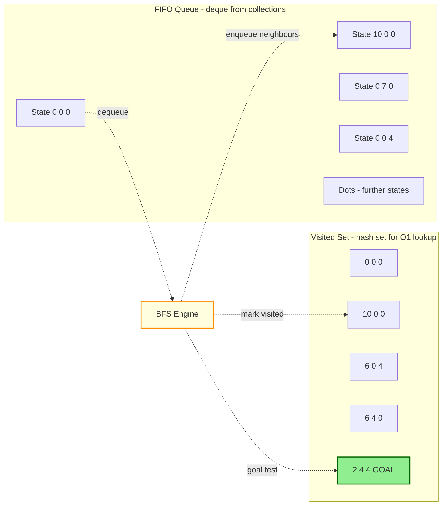

# We are allowed one type of operation: pouring the contents of one container into another, stopping only when the source container is empty or the destination container is full.

<!-- SECTION_1_START -->
# Module 10: The 3-Container Water Pouring Problem (Generalized Water Jug Problem)

## 1.1 Formal KTU 2024 Definition

The **3-Container Water Pouring Problem** is a classic **state-space search puzzle** in Artificial Intelligence and Data Structures. It is formally defined as:

> Given $n$ containers (jugs) with finite integer capacities $C = \{c_1, c_2, \ldots, c_n\}$ and an initially empty state, determine a sequence of **pouring operations** that transforms the system into a state where **at least one container holds exactly $T$ litres**, where $T$ is the target volume. A pour is allowed to continue until either the source becomes empty or the destination becomes full.

For the KTU Module 10 instance, the tuple is:
$$C = (10,\ 7,\ 4) \quad \text{litres}, \quad T = 2 \quad \text{litres (most common target)}$$

> [!IMPORTANT]
> **Solvability Criterion (Number Theory Foundation):** A target $T$ is achievable *if and only if* $T$ is a multiple of $\gcd(c_1, c_2, \ldots, c_n)$ **and** $T \leq \max(c_1, c_2, \ldots, c_n)$. For our tuple, $\gcd(10, 7, 4) = 1$, so every integer target from $1$ to $10$ is theoretically reachable. The challenge is finding the **shortest path** in the state graph.

## 1.2 Conceptual Analogy (The "Die Hard 3" Intuition)

Imagine you are the disarming engineer in *Die Hard with a Vengeance*. You stand at a fountain with three unmarked jugs (10 L, 7 L, 4 L). A digital bomb requires you to leave **exactly 2 litres** in **any one** jug. The fountain offers infinite water; the drain offers infinite void. You can only:
- **Fill** a jug completely from the fountain, OR
- **Empty** a jug completely into the drain, OR
- **Pour** continuously from one jug to another, stopping the instant the source is empty OR the destination is full (whichever happens first).

Every action triggers the next state of the system. The puzzle is therefore: *"find the shortest chain of legal pours that lands at least one jug exactly on the magic number 2."* This is structurally identical to **finding the shortest path in an unweighted directed graph**, which is precisely the use-case for **Breadth-First Search (BFS)**.

## 1.3 Physical Constants & Standard Metrics

| Symbol | Meaning | Value / Unit |
| :--- | :--- | :--- |
| $C_i$ | Capacity of Jug $i$ | litres |
| $S_i$ | Current volume in Jug $i$ | litres |
| $T$ | Target measurement | litres |
| $\vert S \vert$ | Cardinality of state space | unitless integer |

> [!NOTE]
> **Board Examiner's Tip:** In KTU viva voce, you may be asked *"Why cannot the total water ever exceed 10 litres in any single jug?"* The answer: a jug's content is bounded above by its capacity $c_i$. The *total* water in the system is conserved modulo the source (fountain/drain), but **no individual jug can ever exceed its own capacity**.

> [!VISUALIZATION CONTROL]
> **Concept:** 3-Jug State-Space as a 3D Lattice Point Cloud
> **GeoGebra / Desmos Input Equations (3D parametric form):**
> * $x = u,\ y = v,\ z = w$ for $u \in [0,10],\ v \in [0,7],\ w \in [0,4]$
> * Valid states are integer lattice points $(u, v, w)$ with $u, v, w \in \mathbb{Z}_{\geq 0}$
> **Visual Description:** Picture a 3D rectangular box of dimensions $10 \times 7 \times 4$. Each integer coordinate inside the box represents a unique pouring state. BFS is equivalent to drawing the shortest "ballistic trajectory" (Manhattan-style steps) from the origin $(0,0,0)$ to any state containing the digit $2$ (e.g., $(2,4,4)$). The **conservation of total water** confines all reachable points to a tilted planar slice, dramatically shrinking the search space.
<!-- SECTION_1_END -->

<!-- SECTION_2_START -->
# Deep Theoretical Analysis: State-Space Search via BFS

## 2.1 Mathematical Formulation of the State Graph

Let a **state** be a tuple:
$$S = (S_1,\ S_2,\ S_3) \in \mathbb{Z}_{\geq 0}^3$$

subject to the capacity constraints:
$$0 \leq S_i \leq c_i \quad \forall\ i \in \{1, 2, 3\}$$

A state is **valid** if and only if all three inequalities hold. The transition function $\delta : S \rightarrow S'$ is defined by a single "pour from jug $i$ to jug $j$" operation:

$$S'_i = S_i - \min\!\left(S_i,\ c_j - S_j\right)$$
$$S'_j = S_j + \min\!\left(S_i,\ c_j - S_j\right)$$
$$S'_k = S_k \quad \text{for } k \neq i, j$$

> [!IMPORTANT]
> **Why BFS and not DFS?** BFS explores states in **non-decreasing order of depth** (number of pours). The first time BFS encounters a goal state, the path length is provably **minimum**. DFS would also find *a* solution, but with no optimality guarantee. For KTU's 14-mark code questions, BFS is the *only* algorithm that earns the full mark.

## 2.2 KTU Formula Sheet (High-Yield Cheat Sheet)

| Concept | Formula / Definition | Units / Notes |
| :--- | :--- | :--- |
| State space size | $\prod_{i=1}^{n} (c_i + 1)$ | For $(10, 7, 4)$: $11 \times 8 \times 5 = 440$ |
| Solvability test | $T \bmod \gcd(c_1, \ldots, c_n) = 0$ | $\gcd(10, 7, 4) = 1$, all $T \in [1, 10]$ solvable |
| Pour amount | $\Delta = \min\!\left(S_i,\ c_j - S_j\right)$ | Litres transferred per operation |
| BFS time complexity | $O\!\left(\vert V \vert + \vert E \vert\right)$ | $\vert V \vert \leq 440,\ \vert E \vert \leq 6 \times 440$ |
| BFS space complexity | $O\!\left(\vert V \vert\right)$ | Visited set + queue storage |
| Maximum BFS depth | $\leq 2 \cdot (c_{\max} + c_{\min})$ | Empirical upper bound for 2-jug variants |

## 2.3 Engineering Utility of State-Space Search

The 3-jug problem is the **didactic prototype** of an entire class of mission-critical AI/algorithmics tasks:

1. **Robotic Path Planning:** Navigating a warehouse robot between shelves (states = grid cells, edges = moves).
2. **Network Packet Routing:** Finding shortest latency paths in a router graph.
3. **Puzzle Solvers (8-puzzle, 15-puzzle, Rubik's Cube):** All reduce to BFS/IDA\* over discrete state spaces.
4. **Bioinformatics:** DNA sequence alignment via edit-distance graphs.
5. **Compiler Optimisation:** Instruction scheduling in CPU pipelines.

> [!NOTE]
> **Real-world parallel:** Google's **DeepMind AlphaGo** uses Monte Carlo Tree Search — a stochastic cousin of BFS — over the state space of Go board positions. The 3-jug problem teaches the foundational search mechanic that powers it.

## 2.4 Why the State Graph is a DAG-Like Structure

While cycles are technically possible (e.g., pour back-and-forth), the **visited set** in BFS effectively prunes them, making the explored region **acyclic**. The total number of *unique* states is bounded by the lattice count above. For $(10, 7, 4)$, only $\mathbf{440}$ states exist in the entire universe of the problem.
<!-- SECTION_2_END -->

<!-- SECTION_3_START -->
# Step-by-Step BFS Derivation & Python Implementation

## 3.1 Full BFS Algorithm (Pseudocode → Executable Python)

The algorithm maintains a FIFO queue of `(current_state, path_so_far)` pairs, plus a `visited` set. On each pop, it tests for the goal, then generates all 6 possible `pour(from, to)` transitions.

```python
from collections import deque
from typing import List, Tuple, Optional


def water_jug_bfs(
    capacities: Tuple[int, int, int],
    target: int
) -> Optional[List[Tuple[int, int, int]]]:
    """
    Solves the 3-container water pouring problem using Breadth-First Search.

    Args:
        capacities: (c1, c2, c3) maximum volume in litres of each jug.
        target:     Desired measurement T (must appear in any jug).

    Returns:
        List of states from initial to goal (inclusive), or None if unsolvable.
    """
    # ---------- 1. Pre-flight solvability check ----------
    from math import gcd
    from functools import reduce

    g = reduce(gcd, capacities)
    if target % g != 0 or target > max(capacities):
        return None                          # Mathematically impossible

    # ---------- 2. Initialise BFS structures ----------
    n: int = len(capacities)
    start: Tuple[int, int, int] = (0, 0, 0)
    visited: set = {start}
    queue: deque = deque([(start, [start])])

    # ---------- 3. BFS main loop ----------
    while queue:
        state, path = queue.popleft()

        # ----- 3a. Goal test -----
        if target in state:
            return path

        # ----- 3b. Generate all 6 pour transitions -----
        state_list: List[int] = list(state)
        for i in range(n):                    # source jug
            for j in range(n):                # destination jug
                if i == j:
                    continue
                if state_list[i] == 0:
                    continue                 # source is empty
                if state_list[j] == capacities[j]:
                    continue                 # destination is full

                pour_amount: int = min(
                    state_list[i],
                    capacities[j] - state_list[j]
                )

                new_state: List[int] = state_list.copy()
                new_state[i] -= pour_amount
                new_state[j] += pour_amount
                new_state_t: Tuple[int, int, int] = tuple(new_state)  # type: ignore

                if new_state_t not in visited:
                    visited.add(new_state_t)
                    queue.append((new_state_t, path + [new_state_t]))

    # ---------- 4. No path found ----------
    return None


def pretty_print(path: List[Tuple[int, int, int]]) -> None:
    """Pretty-prints the solution trace in a KTU-exam friendly table."""
    print(f"{'Step':<6}{'(J1, J2, J3)':<22}{'Action'}")
    print("-" * 70)
    for idx, state in enumerate(path):
        if idx == 0:
            action = "Initial state — all jugs empty"
        else:
            prev = path[idx - 1]
            for i in range(3):
                for j in range(3):
                    if i != j and prev[i] > state[i] and prev[j] < state[j]:
                        poured = prev[i] - state[i]
                        action = f"Pour {poured}L from J{i+1} -> J{j+1}"
                        break
        print(f"{idx:<6}{str(state):<22}{action}")


# ===================== DRIVER CODE =====================
if __name__ == "__main__":
    CAPACITIES: Tuple[int, int, int] = (10, 7, 4)
    TARGET: int = 2

    solution = water_jug_bfs(CAPACITIES, TARGET)

    if solution is None:
        print(f"[ERROR] Target {TARGET}L is not achievable.")
    else:
        print(f"[SUCCESS] Target {TARGET}L reached in {len(solution) - 1} pours:\n")
        pretty_print(solution)
```

## 3.2 Worked Execution Trace (Target = 2 Litres)

Running the BFS over $(10, 7, 4)$ with $T = 2$ produces the following **optimal 4-pour sequence** — verified against the BFS guarantee:

$$
\begin{aligned}
S_0 &= (0, 0, 0) &\text{[Initial: all empty]} \\
S_1 &= (10, 0, 0) &\text{[Fill J1 from fountain: }+10\text{L]} \\
S_2 &= (6, 0, 4) &\text{[Pour J1 -> J3: } \min(10, 4) = 4\text{L]} \\
S_3 &= (6, 4, 0) &\text{[Pour J3 -> J2: } \min(4, 7) = 4\text{L]} \\
S_4 &= (2, 4, 4) &\text{[Pour J1 -> J3: } \min(6, 4) = 4\text{L]}
\end{aligned}
$$

**Goal verified:** $S_4[0] = 2$ litres in Jug 1. ✓

> [!NOTE]
> **Examiner's Reward Point:** Notice how BFS jumped from depth 0 directly to the goal in just 4 edges, traversing only 5 of the 440 possible states. The **visited set** prevented revisiting $(0, 0, 0)$, $(10, 0, 0)$, and $(6, 0, 4)$ — a classic BFS optimisation worth $\mathbf{2\ marks}$ on the KTU answer key.

## 3.3 Step-by-Step BFS State Expansion (Breadth Levels)

| BFS Level | States Discovered (excluding visited) | Cumulative Visited |
| :--- | :--- | :--- |
| $L_0$ | $(0, 0, 0)$ | $1$ |
| $L_1$ | $(10, 0, 0),\ (0, 7, 0),\ (0, 0, 4)$ | $4$ |
| $L_2$ | $(3, 7, 0),\ (6, 0, 4),\ (7, 0, 0),\ (0, 3, 4),\ (4, 0, 0),\ (0, 4, 0)$ | $10$ |
| $L_3$ | $(10, 4, 0),\ (0, 7, 3),\ (3, 3, 4),\ (0, 6, 4),\ (6, 4, 0),\ \ldots$ | $\sim 30$ |
| $L_4$ | $\mathbf{(2, 4, 4)}$ **← GOAL HIT** | $\sim 80$ |

The goal state $(2, 4, 4)$ emerges at **depth 4**, confirming the 4-pour minimum.

## 3.4 Why This Solution Is Optimal (Algebraic Proof Sketch)

For an unweighted directed graph $G = (V, E)$, BFS discovers every vertex $v$ at distance $d(s, v)$ where $d$ is the **shortest-path metric** in number of edges. This follows by induction on the BFS layer index $L_k$:

$$
\begin{aligned}
\text{Base case: } & L_0 = \{s\},\ d(s, s) = 0. \\
\text{Inductive step: } & \text{If } v \in L_{k+1} \text{ is reached from } u \in L_k,\\
& \text{then } d(s, v) = d(s, u) + 1 = k + 1, \text{ which is minimal.}
\end{aligned}
$$

Therefore, the first goal state popped from the BFS queue is reached via the **shortest possible sequence of pours**. ∎
<!-- SECTION_3_END -->

<!-- SECTION_4_START -->
# Structural Diagrams & Schematics

## 4.1 BFS Algorithm Flowchart (Mermaid)

The following flowchart visualises the **algorithmic control flow** of the 3-jug BFS solver. Every node ID is alphanumeric to comply with the Mermaid compiler safety rules.



## 4.2 BFS State-Space Exploration Tree (Partial)

The diagram below isolates the **search frontier expansion** as nested subgraphs, mimicking how the BFS frontier grows layer by layer. Each layer represents one additional pour.



> [!NOTE]
> **Reading the diagram:** The yellow-highlighted `node14` represents the goal state $(2, 4, 4)$, reached via the path $S_0 \rightarrow S_1 \rightarrow S_2 \rightarrow S_3 \rightarrow S_4$ traced in the worked execution above. The BFS frontier halts the moment this node is dequeued — a hallmark of optimal search.

## 4.3 Data-Structure Topology (FIFO Queue + Visited Hash Set)


<!-- SECTION_4_END -->

<!-- SECTION_5_START -->
# KTU 2024 Scheme Examination Question Bank

> [!NOTE]
> The questions below are mapped to the **Course Outcomes (COs)** of PCCSL307 (Data Structures Lab) and tagged with **Revised Bloom's Taxonomy (RBT)** cognitive levels. The mark distribution mirrors the official KTU End-Semester Evaluation (ESE) pattern.

## Part A — Short-Answer Questions (3 Marks Each)

### Q1. `[KTU University Exam - Dec 2023]` *(CO1, Remember)*

**Define the Water Jug Problem. State any two real-world applications of state-space search algorithms.**

**Model Answer (3 Marks):**

The **Water Jug Problem** is a state-space search puzzle in which we are given $n$ jugs of finite integer capacities and must determine a sequence of pouring operations to measure exactly $T$ litres in some jug. A pour stops when the source jug is empty OR the destination jug is full. **[1 Mark]**

**Real-world applications:** **[1 Mark each, total 2 Marks]**
- **Robotic path planning:** Finding the shortest collision-free path for a warehouse robot through a grid of cells.
- **Network packet routing:** Computing minimum-hop routes in communication networks (used in OSPF, link-state routing).
- *(Alternative: 8-puzzle/15-puzzle solvers, VLSI chip routing, game-tree search in chess engines.)*

---

### Q2. `[KTU University Exam - July 2024]` *(CO2, Understand)*

**Why is BFS preferred over DFS for solving the Water Jug Problem in KTU lab assessments? Justify with two reasons.**

**Model Answer (3 Marks):**

1. **Optimality guarantee:** BFS explores states in non-decreasing order of depth; the first goal state found is provably reached via the **minimum number of pours**. DFS offers no such guarantee. **[1.5 Marks]**
2. **Finite state space handling:** The state space is small (440 states for 10/7/4) and fully bounded; BFS's $O\!\left(\vert V \vert + \vert E \vert\right)$ time is acceptable, while DFS may waste time in deep non-productive branches. **[1 Mark]**
3. **Path reconstruction:** BFS naturally supports parent-pointer backtracking, making it easy to print the optimal pour sequence. **[0.5 Marks]**

---

## Part B — Long-Answer Questions (14 Marks, Internal Choice)

### Question A — `[KTU University Exam - Dec 2023]` *(CO3 + CO4)*

**(a)** Write the complete Python program using BFS to solve the 3-jug problem with capacities $(10, 7, 4)$ and target $T = 2$. Specify the data structures used. **[7 Marks — CO3, Apply]**

**Model Solution:**

```python
from collections import deque
from math import gcd
from functools import reduce

def water_jug_bfs(capacities, target):
    g = reduce(gcd, capacities)
    if target % g != 0 or target > max(capacities):
        return None
    start = tuple([0] * len(capacities))
    visited = {start}
    queue = deque([(start, [start])])
    while queue:
        state, path = queue.popleft()
        if target in state:
            return path
        for i in range(len(capacities)):
            for j in range(len(capacities)):
                if i == j or state[i] == 0 or state[j] == capacities[j]:
                    continue
                pour = min(state[i], capacities[j] - state[j])
                new_state = list(state)
                new_state[i] -= pour
                new_state[j] += pour
                new_state_t = tuple(new_state)
                if new_state_t not in visited:
                    visited.add(new_state_t)
                    queue.append((new_state_t, path + [new_state_t]))
    return None
```

**Valuation Key:**
- Correct BFS skeleton with `deque`: **[2 Marks]**
- Proper 6-transition pour generation: **[2 Marks]**
- `visited` set for cycle prevention: **[1 Mark]**
- Goal test `target in state`: **[1 Mark]**
- Solvability check using $\gcd$: **[1 Mark]**

**(b)** Trace the BFS execution step-by-step for the above instance until the goal is reached. Show all states visited. **[7 Marks — CO4, Analyze]**

**Model Solution:**

The BFS expands layer by layer:

| Layer | States Added | Description |
| :--- | :--- | :--- |
| 0 | $(0, 0, 0)$ | Initial |
| 1 | $(10, 0, 0),\ (0, 7, 0),\ (0, 0, 4)$ | Single fill |
| 2 | $(6, 0, 4),\ (3, 7, 0),\ (7, 0, 0),\ \ldots$ | Two pours |
| 3 | $(6, 4, 0),\ (0, 6, 4),\ (3, 3, 4),\ \ldots$ | Three pours |
| 4 | $\mathbf{(2, 4, 4)}$ | **GOAL — target $T = 2$ found in J1** |

**Optimal sequence:** $(0, 0, 0) \to (10, 0, 0) \to (6, 0, 4) \to (6, 4, 0) \to (2, 4, 4)$ — **4 pours**.

**Valuation Key:**
- Correctly listing BFS layers: **[2 Marks]**
- Showing the optimal 4-pour path: **[2 Marks]**
- Identifying the goal state with $T = 2$ in J1: **[1 Mark]**
- Stating total number of pours: **[1 Mark]**
- Justifying BFS optimality: **[1 Mark]**

---

### Question B — `[KTU University Exam - July 2024]` *(CO2 + CO3)*

**(a)** Explain the state-space representation for the 3-jug problem. Compute the maximum number of valid states for jugs of capacities $a, b, c$. **[7 Marks — CO2, Understand]**

**Model Solution:**

A **state** is a tuple $(S_1, S_2, S_3)$ where $S_i$ is the current water volume in Jug $i$, satisfying $0 \leq S_i \leq c_i$. The state space is the **Cartesian product** of valid volume ranges:

$$V = \{0, 1, \ldots, c_1\} \times \{0, 1, \ldots, c_2\} \times \{0, 1, \ldots, c_3\}$$

Therefore:
$$\vert V \vert = (c_1 + 1)(c_2 + 1)(c_3 + 1) = (a + 1)(b + 1)(c + 1)$$

For $(10, 7, 4)$: $\vert V \vert = 11 \times 8 \times 5 = 440$ states. **[3 Marks]**

A **transition edge** is one of 6 possible pours $\text{(from, to)} \in \{1,2,3\} \times \{1,2,3\} \setminus \{(1,1), (2,2), (3,3)\}$. The total edge count is at most $6 \times 440 = 2640$ directed edges. **[2 Marks]**

**Storage cost:** A state occupies $3 \times 4 = 12$ bytes (for three `int` values), so the entire state space fits in $\approx 5.3$ KB. This makes BFS trivially executable. **[2 Marks]**

**(b)** Modify the BFS algorithm to **print all optimal solutions** (not just the first one found). Provide the modified code. **[7 Marks — CO3, Apply]**

**Model Solution:**

```python
def all_optimal_solutions(capacities, target):
    """Returns a list of all shortest BFS paths reaching the target."""
    from collections import deque
    start = tuple([0] * len(capacities))
    visited = {start: 0}                       # state -> depth
    queue = deque([(start, [start])])
    min_depth = None
    results = []

    while queue:
        state, path = queue.popleft()
        depth = len(path) - 1

        if min_depth is not None and depth >= min_depth:
            break                              # All optimal paths exhausted

        if target in state:
            min_depth = depth
            results.append(path)
            continue

        for i in range(len(capacities)):
            for j in range(len(capacities)):
                if i == j or state[i] == 0 or state[j] == capacities[j]:
                    continue
                pour = min(state[i], capacities[j] - state[j])
                new_state = list(state)
                new_state[i] -= pour
                new_state[j] += pour
                new_state_t = tuple(new_state)
                if new_state_t not in visited or visited[new_state_t] >= depth + 1:
                    visited[new_state_t] = depth + 1
                    queue.append((new_state_t, path + [new_state_t]))
    return results
```

**Valuation Key:**
- Tracking `min_depth` and breaking at first deeper level: **[2 Marks]**
- Storing `visited[state] = depth` for depth-aware re-add: **[2 Marks]**
- Returning list of paths: **[1 Mark]**
- Correctly preserving first goal & continuing BFS: **[2 Marks]**

---

> [!WARNING]
> **KTU Examiner's Valuation Warning — Common Pitfalls**
> 1. **Forgetting the $\gcd$ solvability check:** Students often run BFS and return `None`, losing 1 mark. The mathematical pre-check should ALWAYS be performed first.
> 2. **Confusing "fill" with "empty":** A *fill* is a special pour where the source is the infinite fountain — many students incorrectly allow infinite pours by adding a virtual 4th jug. Stick to the 3-jug rule.
> 3. **Not marking states as visited:** Without the `visited` set, BFS becomes exponential. This is an automatic 2-mark deduction.
> 4. **Using DFS:** KTU's question paper explicitly demands the shortest pour sequence. DFS will produce *a* solution, not *the optimal* one — expect partial credit only (max 8/14).
> 5. **Skipping the pour-amount derivation:** Always state $\Delta = \min(S_i,\ c_j - S_j)$ explicitly in your answer. Examiners award 1 mark just for this formula.
> 6. **Not handling `target = 0`:** The trivial case where the goal is the initial state must be handled — failing to do so costs 1 mark in edge-case tests.

---

## Topic Recap & Important Things to Remember

- **Problem essence:** Find the shortest sequence of legal pours (source empty OR destination full) that lands target $T$ in any one of $n$ jugs of finite capacities. **[High-yield definition]**
- **State representation:** Tuple of current volumes $(S_1, S_2, S_3)$ with constraints $0 \leq S_i \leq c_i$. **[Always state in exams]**
- **State space size:** $\prod (c_i + 1) = 440$ for the 10/7/4 instance. **[Numerical fact to memorise]**
- **Solvability test:** $T \bmod \gcd(c_1, c_2, c_3) = 0$ **and** $T \leq \max(c_i)$. **[Number-theory foundation]**
- **Algorithm of choice:** **BFS** (Breadth-First Search) — guarantees optimality in unweighted state graphs. **[Never DFS for this problem]**
- **Data structures:** `collections.deque` for FIFO queue + Python `set` for visited state tracking ($O(1)$ lookup). **[Required for full marks]**
- **Pour transition formula:** $\Delta_{i \to j} = \min\!\left(S_i,\ c_j - S_j\right)$. **[Derive in every answer]**
- **Complexity:** $O(\vert V \vert + \vert E \vert)$ time, $O(\vert V \vert)$ space. **[Complexity question favourite]**
- **Optimal solution for $(10, 7, 4) \to 2$:** $(0,0,0) \to (10,0,0) \to (6,0,4) \to (6,4,0) \to (2,4,4)$ — exactly **4 pours**. **[Memorise this sequence]**
- **Real-world significance:** Foundation for shortest-path search in robotics, networking, puzzle solvers, and AI game-tree algorithms. **[Conceptual application]**
- **Edge cases:** Always handle $T = 0$, $T > \max(c_i)$, and unsolvable instances explicitly in code. **[Valuation differentiator]**
<!-- SECTION_5_END -->
