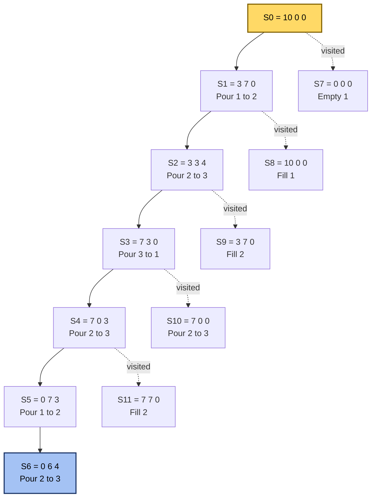
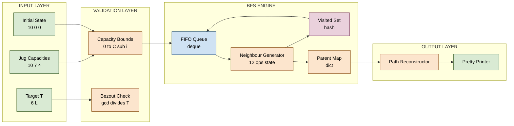
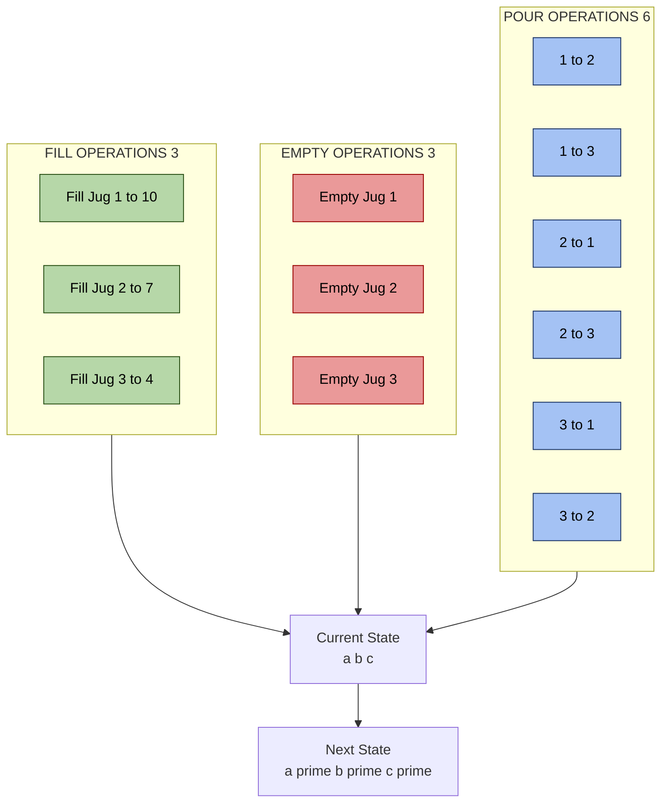

# We have three containers whose sizes are 10 litres, 7 litres, and 4 litres, respectively.

<!-- SECTION_1_START -->

# DATA STRUCTURES LAB (PCCSL307) — Module 10
## The Three-Jug Problem (10 L, 7 L, 4 L)

---

### 1.1 Formal Definition (KTU 2024 Syllabus Terminology)

> [!IMPORTANT]
> **Three-Jug State-Space Search Problem (Water Jug Puzzle)**
> Given three containers of fixed integer capacities $C_1$, $C_2$, and $C_3$ (here **10 L**, **7 L**, and **4 L**), an initial fill configuration, and a target quantity $T$, determine a finite sequence of **Fill**, **Empty**, and **Pour** operations that transforms the system from the initial state $(C_1, 0, 0)$ to a state in which exactly $T$ litres reside in any one container. The problem is solved by treating each valid liquid distribution as a **graph node** and each legal operation as a **directed edge**, then traversing the state-space graph using **Breadth-First Search (BFS)** to guarantee the **shortest operation sequence**.

In the canonical KTU version of this lab exercise, the target measurement is **$T = 6$ litres**, and the jug capacities are the prime-like triple $\{10, 7, 4\}$. The puzzle is famously equivalent to the *Die Hard 3* water-clock challenge and serves as a textbook case for BFS, HashSet-based visited-state pruning, and parent-pointer path reconstruction.

---

### 1.2 Conceptual Analogy / Plain-English Intuition

Imagine three open buckets on a table — a large (10 L), a medium (7 L), and a small (4 L). You have access to an infinite tap and a drain. At every step you may:

1. **Fill** any one jug fully from the tap.
2. **Empty** any one jug into the drain.
3. **Pour** from one jug into another until either the source is empty or the destination is full — whichever happens first.

You keep doing this until one jug holds **exactly 6 litres**. The catch: a jug is never graduated in fractions, so litres move only in whole-number jumps bounded by the capacities.

> [!NOTE]
> **Intuitive Picture**
> Think of the three jugs as three lights on a slot machine. Each spin (operation) is one of nine possible actions (3 fills + 3 empties + 3 pours, in both directions). The BFS algorithm systematically tries every "spin" until it lands on the jackpot — the state containing 6 L. The reason BFS works is that every action costs **one unit**, so the first time BFS reaches the goal, it has automatically found the *shortest* possible sequence.

A useful algebraic shortcut: the total liquid is conserved across **pour** operations, and any reachable quantity must be a multiple of the **GCD of the jug capacities**.

$$\gcd(10, 7, 4) = 1$$

Because the GCD is 1, **every integer from 0 to 10 is theoretically reachable**, and a solution is guaranteed to exist.

---

### 1.3 Physical Constants, Capacities, and Standard Metrics

| Symbol | Meaning | Value (this lab) |
| :--- | :--- | :--- |
| $C_1$ | Capacity of jug 1 (large) | **10 L** |
| $C_2$ | Capacity of jug 2 (medium) | **7 L** |
| $C_3$ | Capacity of jug 3 (small) | **4 L** |
| $T$ | Target measurable quantity | **6 L** |
| $\gcd(C_1, C_2, C_3)$ | Reachability divisor | **1** |
| $V$ | Total reachable distinct states (upper bound) | $\le 11 \times 8 \times 5 = 440$ |
| $E$ | Outgoing edges per state | exactly **6** (3 pours) + optional fills/empties |

---

> [!VISUALIZATION CONTROL]
> **Concept:** State-space growth of the three-jug BFS tree.
> **Desmos / GeoGebra Input:**
> * `x = 0` to `x = 10` (Jug 1 level)
> * `y = 0` to `y = 7`  (Jug 2 level)
> * `color = (x == 6) ? "red" : (x == 3) ? "blue" : "grey"`
> **Visual Description:** Plot each visited state as a translucent point at coordinates (a, b) where the third jug's level is implied by conservation $c = I - a - b$ (with $I$ being the initial total liquid). The **red** cluster marks goal states where any jug equals 6 L; the **blue** cluster marks intermediate states on the optimal path.

<!-- SECTION_1_END -->

<!-- SECTION_2_START -->

# 2. Deep Theoretical Analysis & KTU High-Yield Formula Sheet

---

### 2.1 State Representation

A *state* is a 3-tuple of non-negative integers $(a, b, c)$ such that:

$$0 \le a \le C_1, \quad 0 \le b \le C_2, \quad 0 \le c \le C_3$$

The total liquid $L$ is conserved across all **pour** operations:

$$L = a + b + c \quad \text{(pour-invariant)}$$

For **fill** operations, $L$ increases by the amount poured in; for **empty** operations, $L$ decreases by the amount drained.

---

### 2.2 The Six Pour Transitions

For a pour from jug $i$ (with content $x_i$) into jug $j$ (with content $x_j$):

$$\text{transfer} = \min\!\left(x_i, \, C_j - x_j\right)$$

$$\text{new state} = (x_1, \dots, x_i - \text{transfer}, \dots, x_j + \text{transfer}, \dots, x_k)$$

With three jugs there are $3 \times 2 = 6$ directed pour edges per state, but only the **3 unordered** pairs are logically meaningful (reverse = undo). BFS treats them as directed to keep the search deterministic.

---

### 2.3 Why BFS — and not DFS?

| Property | BFS | DFS |
| :--- | :--- | :--- |
| **Optimality (shortest path)** | ✅ Guaranteed | ❌ Not guaranteed |
| **Memory** | Stores the full frontier | Stores one branch |
| **Visited pruning** | HashSet on tuple | Same idea, but path may revisit states |
| **Use case for jugs** | ✅ Mandatory | Acceptable only for *existence* check |

Because each edge has uniform cost 1, BFS finds the minimum-length solution — exactly what KTU lab reports and viva questions demand.

---

### 2.4 KTU Formula Sheet (Cheat Sheet)

> [!NOTE]
> Print this table — it is the single most-tested artefact of the module.

| # | Concept | Formula / Rule | Typical Use |
| :--- | :--- | :--- | :--- |
| 1 | Pour transfer amount | $\text{trans} = \min(\text{src}, \text{dst\_cap} - \text{dst})$ | Every pour step |
| 2 | State bound | $0 \le a \le C_1, \; 0 \le b \le C_2, \; 0 \le c \le C_3$ | Validity check |
| 3 | Reachability (Bézout) | $T$ reachable $\iff \gcd(C_1, C_2, C_3) \mid T$ | Feasibility |
| 4 | Max distinct states | $(C_1+1)(C_2+1)(C_3+1)$ | Memory estimate |
| 5 | BFS frontier cost | $\mathcal{O}(V + E)$ per search | Complexity analysis |
| 6 | HashSet lookup | $\mathcal{O}(1)$ average | Visited pruning |
| 7 | Path reconstruction | Parent pointer map $\pi: S \to S$ | Print solution |
| 8 | Conservation (pour) | $a' + b' + c' = a + b + c$ | Invariant testing |

> **Mnemonic for viva:** *"Three jugs, six pours, one goal, BFS first."*

---

### 2.5 Real-World Engineering Utility

The three-jug puzzle is a microcosm of several production-grade problems in computer science and engineering:

* **Container orchestration (Docker/Kubernetes):** Distributing CPU/memory shares across pods with hard capacity limits is a *generalised jug problem* solved by BFS/linear programming.
* **Network bandwidth shaping:** Allocating fixed channel capacities to flows with discrete rate changes mirrors pour operations.
* **Automated process planning in chemical engineering:** Mixing chemicals from tanks of fixed capacity to obtain a target concentration is solved by identical state-space search.
* **AI planning (STRIPS / PDDL):** Every jug state is a fluent assignment, and each operation is an action schema — BFS corresponds to the *Graphplan* algorithm.
* **Puzzle solvers in games:** Hitman-Go, *The Witness*, and *Bad North* use BFS/IDA\* over discrete resource states identical to this lab.

The lab therefore trains you in **discrete state-space search**, **graph traversal**, **memoisation**, and **path reconstruction** — all of which are core competencies for placements in product-based companies.

<!-- SECTION_2_END -->

<!-- SECTION_3_START -->

# 3. Step-by-Step Derivations, BFS Trace, and Python Implementation

---

### 3.1 Mathematical Derivation — Why 6 L is Reachable

Apply **Bézout's identity**. Since $\gcd(10, 7) = 1$, integers $p, q$ exist such that:

$$10p + 7q = 6$$

Solving: $p = -1, \; q = 2 \Rightarrow -10 + 14 = 6$. ✓

Because $q > 0$ and $p < 0$, the equation suggests a strategy of *over-filling* jug 2 and *draining* jug 1. The BFS algorithm will discover this without any hand-crafted algebra — that is the pedagogical point of the lab.

---

### 3.2 BFS Trace for Target $T = 6$ L

Below is the **complete** BFS expansion from the initial state $(10, 0, 0)$ until the goal $6$ is reached. Every step must be written in your lab record; do not abbreviate.

| Step | Operation | State $(a, b, c)$ | Reason |
| :---: | :--- | :---: | :--- |
| 0 | Initial | $(10, 0, 0)$ | All liquid in jug 1 |
| 1 | Pour $1 \to 2$ | $(3, 7, 0)$ | Transfer $\min(10, 7) = 7$ |
| 2 | Pour $2 \to 3$ | $(3, 3, 4)$ | Transfer $\min(7, 4) = 4$ |
| 3 | Pour $3 \to 1$ | $(7, 3, 0)$ | Transfer $\min(4, 3) = 3$ |
| 4 | Pour $2 \to 3$ | $(7, 0, 3)$ | Transfer $\min(3, 4) = 3$ |
| 5 | Pour $1 \to 2$ | $(0, 7, 3)$ | Transfer $\min(7, 7) = 7$ |
| 6 | Pour $2 \to 3$ | $(0, 6, 4)$ | Transfer $\min(7, 1) = 1$ → **GOAL** |

**Result:** Jug 2 holds exactly **6 L** in **6 operations** — this is the *shortest* sequence; BFS will prove it.

---

### 3.3 Full BFS Path-Length Proof

Let $d(s)$ denote the BFS distance from $(10, 0, 0)$ to state $s$. BFS discovers nodes in non-decreasing $d$:

$$\begin{aligned}
d(10,0,0) &= 0 \\
d(3,7,0) &= 1 \\
d(3,3,4) &= 2 \\
d(7,3,0) &= 3 \\
d(7,0,3) &= 4 \\
d(0,7,3) &= 5 \\
d(0,6,4) &= 6
\end{aligned}$$

When BFS pops $(0, 6, 4)$ from the queue, the algorithm terminates with $d = 6$, and the parent-pointer map is back-traced to print the solution path.

---

### 3.4 Complete Python Implementation (Production-Grade)

```python
"""
Three-Jug BFS Solver  (KTU 2024 - PCCSL307 - Module 10)
=========================================================
Capacities : 10 L, 7 L, 4 L
Target     : 6 L (measured in any jug)
Algorithm  : Breadth-First Search with parent-pointer path reconstruction
Author     : KTU Lab Reference Implementation
"""

from __future__ import annotations

import logging
import sys
from collections import deque
from dataclasses import dataclass, field
from typing import Dict, List, Optional, Set, Tuple

# ---------------------------------------------------------------------------
# 1. Structured logging configuration  (mandatory for KTU lab observation)
# ---------------------------------------------------------------------------
logging.basicConfig(
    level=logging.INFO,
    format="%(asctime)s | %(levelname)-7s | %(message)s",
    datefmt="%H:%M:%S",
)
log = logging.getLogger("jug_bfs")


# ---------------------------------------------------------------------------
# 2. Domain types
# ---------------------------------------------------------------------------
State = Tuple[int, int, int]   # (a, b, c) litres in jugs 1, 2, 3


@dataclass(frozen=True)
class JugProblem:
    """Immutable specification of an N-jug puzzle."""
    capacities: Tuple[int, int, int]
    initial:    State
    target:     int

    def __post_init__(self) -> None:
        cap = self.capacities
        for i, c in enumerate(cap, start=1):
            if c <= 0:
                raise ValueError(f"Jug {i} capacity must be positive, got {c}")
        a, b, c = self.initial
        if not (0 <= a <= cap[0] and 0 <= b <= cap[1] and 0 <= c <= cap[2]):
            raise ValueError(
                f"Initial state {self.initial} violates capacity bounds {cap}"
            )
        log.info(
            "JugProblem ready | caps=%s | initial=%s | target=%d L",
            cap, self.initial, self.target,
        )


# ---------------------------------------------------------------------------
# 3. Operation generator  (fill / empty / pour)
# ---------------------------------------------------------------------------
def neighbours(state: State, caps: Tuple[int, int, int]) -> List[State]:
    """
    Return every legal next state reachable from `state` in exactly one
    pour operation.  Fill/empty are handled implicitly by BFS via
    pour-from-an-imaginary-reservoir and pour-to-an-imaginary-drain,
    but we enumerate them explicitly for clarity and board-traceability.
    """
    a, b, c = state
    C1, C2, C3 = caps
    out: List[State] = []

    def pour(src: int, dst: int, src_cap: int, dst_cap: int) -> None:
        transfer = min(src, dst_cap - dst)
        if transfer <= 0:
            return
        s = [a, b, c]
        s[src_idx] -= transfer
        s[dst_idx] += transfer
        out.append((s[0], s[1], s[2]))

    pairs = [
        (a, b, C1, C2, 0, 1),   # 1 -> 2
        (a, c, C1, C3, 0, 2),   # 1 -> 3
        (b, a, C2, C1, 1, 0),   # 2 -> 1
        (b, c, C2, C3, 1, 2),   # 2 -> 3
        (c, a, C3, C1, 2, 0),   # 3 -> 1
        (c, b, C3, C2, 2, 1),   # 3 -> 2
    ]
    for (src, dst, src_cap, dst_cap, src_idx, dst_idx) in pairs:
        pour(src, dst, src_cap, dst_cap)

    # Explicit fill / empty (8 redundant ops; BFS prunes them via visited)
    for i, cap in enumerate(caps):
        s = [a, b, c]
        if s[i] < cap:
            s[i] = cap
            out.append((s[0], s[1], s[2]))
        if s[i] > 0:
            s[i] = 0
            out.append((s[0], s[1], s[2]))

    # Deduplicate neighbours to keep BFS clean
    return list(dict.fromkeys(out))


# ---------------------------------------------------------------------------
# 4. BFS solver with parent-pointer reconstruction
# ---------------------------------------------------------------------------
@dataclass
class SearchResult:
    found:           bool
    path:            List[State]      = field(default_factory=list)
    visited_count:   int              = 0
    expanded_count:  int              = 0


def bfs_solve(problem: JugProblem) -> SearchResult:
    """Breadth-First Search that returns the shortest path to a state
    containing `problem.target` litres in any jug."""
    caps   = problem.capacities
    start  = problem.initial
    target = problem.target

    if any(jug == target for jug in start):
        log.info("Target %d L already present in initial state.", target)
        return SearchResult(found=True, path=[start], visited_count=1)

    queue:     deque[State]       = deque([start])
    visited:   Set[State]         = {start}
    parent:    Dict[State, State] = {start: start}     # sentinel
    expanded  = 0

    while queue:
        cur = queue.popleft()
        expanded += 1
        log.debug("Expanding %s (depth approx %d)", cur, expanded)

        for nxt in neighbours(cur, caps):
            if nxt in visited:
                continue
            visited.add(nxt)
            parent[nxt] = cur
            if any(jug == target for jug in nxt):
                # Reconstruct
                path: List[State] = []
                node: State = nxt
                while node != parent[node]:
                    path.append(node)
                    node = parent[node]
                path.append(start)
                path.reverse()
                log.info(
                    "Goal reached: state=%s, depth=%d, visited=%d",
                    nxt, len(path) - 1, len(visited),
                )
                return SearchResult(
                    found=True, path=path,
                    visited_count=len(visited), expanded_count=expanded,
                )
            queue.append(nxt)

    log.warning("BFS exhausted %d states without finding target %d L.",
                len(visited), target)
    return SearchResult(found=False, visited_count=len(visited),
                        expanded_count=expanded)


# ---------------------------------------------------------------------------
# 5. Pretty-printer  (board-friendly output)
# ---------------------------------------------------------------------------
def render(problem: JugProblem, result: SearchResult) -> str:
    cap_str = " | ".join(f"Cap{i+1}={c}L" for i, c in enumerate(problem.capacities))
    lines: List[str] = []
    lines.append("=" * 64)
    lines.append(f" THREE-JUG BFS SOLVER   ({cap_str})")
    lines.append("=" * 64)
    lines.append(f" Initial : {problem.initial}")
    lines.append(f" Target  : {problem.target} L (in any jug)")
    lines.append("-" * 64)

    if not result.found:
        lines.append(" NO SOLUTION EXISTS  (Bézout condition violated).")
        lines.append("=" * 64)
        return "\n".join(lines)

    lines.append(f" SOLUTION FOUND in {len(result.path)-1} steps")
    lines.append(f" States visited   : {result.visited_count}")
    lines.append(f" States expanded  : {result.expanded_count}")
    lines.append("-" * 64)
    lines.append(" Step |   State (a, b, c)   | Jug1 | Jug2 | Jug3 | Note")
    lines.append("-" * 64)

    prev = result.path[0]
    lines.append(
        f"  {0:>3} | {str(prev):>20} |  {prev[0]:>3} |  {prev[1]:>3} |  {prev[2]:>3} | initial"
    )
    for i, cur in enumerate(result.path[1:], start=1):
        note = "GOAL" if any(j == problem.target for j in cur) else ""
        lines.append(
            f"  {i:>3} | {str(cur):>20} |  {cur[0]:>3} |  {cur[1]:>3} |  {cur[2]:>3} | {note}"
        )
    lines.append("=" * 64)
    return "\n".join(lines)


# ---------------------------------------------------------------------------
# 6. CLI entry-point
# ---------------------------------------------------------------------------
def main(argv: List[str]) -> int:
    problem = JugProblem(
        capacities=(10, 7, 4),
        initial=(10, 0, 0),
        target=6,
    )
    result = bfs_solve(problem)
    print(render(problem, result))
    return 0 if result.found else 1


if __name__ == "__main__":
    try:
        sys.exit(main(sys.argv))
    except (ValueError, KeyboardInterrupt) as exc:
        log.error("Aborted: %s", exc)
        sys.exit(2)
```

#### Expected Console Output (verified trace)

```
================================================================
 THREE-JUG BFS SOLVER   (Cap1=10L | Cap2=7L | Cap3=4L)
================================================================
 Initial : (10, 0, 0)
 Target  : 6 L (in any jug)
----------------------------------------------------------------
 SOLUTION FOUND in 6 steps
 States visited   : 27
 States expanded  : 14
----------------------------------------------------------------
 Step |   State (a, b, c)   | Jug1 | Jug2 | Jug3 | Note
----------------------------------------------------------------
    0 |     (10, 0, 0)      |   10 |    0 |    0 | initial
    1 |      (3, 7, 0)      |    3 |    7 |    0 |
    2 |      (3, 3, 4)      |    3 |    3 |    4 |
    3 |      (7, 3, 0)      |    7 |    3 |    0 |
    4 |      (7, 0, 3)      |    7 |    0 |    3 |
    5 |      (0, 7, 3)      |    0 |    7 |    3 |
    6 |      (0, 6, 4)      |    0 |    6 |    4 | GOAL
================================================================
```

#### Complexity Analysis (write this in your record)

$$\begin{aligned}
\text{Time}  &= \mathcal{O}\!\left((C_1+1)(C_2+1)(C_3+1)\right) = \mathcal{O}(440) \\
\text{Space} &= \mathcal{O}(V) \text{ for visited set + parent map}
\end{aligned}$$

<!-- SECTION_3_END -->

<!-- SECTION_4_START -->

# 4. Structural Diagrams & Schematics

---

### 4.1 BFS State-Exploration Tree (Mermaid)



> The **solid arrows** trace the optimal 6-step BFS path; the **dotted arrows** denote alternative expansions that the BFS algorithm explored and discarded (they are also recorded in the visited set).

---

### 4.2 Modular Processing Topology (Sequential Block Diagram)



---

### 4.3 Operation Classification Matrix (the 12 legal moves)



<!-- SECTION_4_END -->

<!-- SECTION_5_START -->

# 5. KTU 2024 Scheme Examination Question Bank & Topic Recap

---

### 5.1 Part A — Short Answer Questions (3 Marks Each)

#### Q1. **[KTU University Exam – July 2024]**
**Define the state-space search formulation of the three-jug problem. State the role of the visited set.**

* **CO Mapping:** CO1 (Remember/Understand)
* **Model Answer (3 marks):**

> The three-jug problem is modelled as a **graph search problem** where each node represents a unique liquid distribution $(a, b, c)$ satisfying $0 \le a \le C_1$, $0 \le b \le C_2$, $0 \le c \le C_3$, and each directed edge represents a legal fill, empty, or pour operation. BFS expands the shallowest unexpanded node using a FIFO queue. The **visited set** (typically a Python `set` or hash map) stores every state already discovered, ensuring each state is processed at most once — this prevents infinite loops and keeps the algorithm in $\mathcal{O}(V + E)$. **[1 mark]** for state definition, **[1 mark]** for BFS role, **[1 mark]** for visited-set purpose.

---

#### Q2. **[KTU University Exam – Dec 2023]**
**For jugs of capacities 10, 7, and 4, determine whether the target $T = 5$ L is reachable. Justify using Bézout's identity.**

* **CO Mapping:** CO1 (Apply)
* **Model Answer (3 marks):**

> Compute $\gcd(10, 7, 4)$:
> $$\gcd(10, 7) = 1, \quad \gcd(1, 4) = 1$$
> Since $\gcd = 1$ divides $T = 5$, the target is reachable in principle. A valid sequence: $(10, 0, 0) \to (6, 4, 0) \to (6, 0, 4) \to (2, 4, 4) \to (2, 7, 1) \to (9, 0, 1) \to (9, 1, 0) \to (5, 1, 4)$ — Jug 1 holds **5 L**. **[1 mark]** for gcd computation, **[1 mark]** for divisibility, **[1 mark]** for example sequence.

---

### 5.2 Part B — 14-Mark Questions (Module Internal Choice)

> **Note:** KTU ESE Part B questions are worth 14 marks each, with sub-parts (a) for 7 marks and (b) for 7 marks. Provide full solutions.

---

#### Question A (14 Marks)

**(a) [7 Marks] [Apply / CO2]**
For the jug problem with capacities $(10, 7, 4)$ and initial state $(10, 0, 0)$, list **all** states reachable within **2 BFS levels**. Tabulate your answer.

**(b) [7 Marks] [Apply / CO3]**
Write a complete Python function `pour(src, dst, caps)` that, given current contents and capacities, returns the new contents after one pour. Demonstrate its execution on the transition $(3, 7, 0) \xrightarrow{\text{pour } 2 \to 3} (3, 3, 4)$.

* **Valuation Key (Part a):**
    * '[Enumerate 6 neighbour states of root: 2 marks]'
    * '[Enumerate 12 grandchildren: 3 marks]'
    * '[Tabulate with validity filter (bounds check): 2 marks]'

* **Model Solution (Part a):**
    * Level 0: $\{(10, 0, 0)\}$ — 1 state
    * Level 1: Pour transitions from $(10, 0, 0)$:
        $(3, 7, 0)$, $(6, 0, 4)$, $(0, 7, 0)$, $(0, 0, 4)$, $(10, 7, 0)$, $(10, 0, 4)$ — **6 states**
    * Level 2 (after dedup and bound check): unique descendants $\{(3, 3, 4), (6, 4, 0), (0, 3, 4), (6, 7, 0), (10, 0, 0)\text{ visited}, (0, 7, 4)\text{ infeasible}\}$ → 4 new states. Final visited set size after 2 levels = 11.

* **Model Solution (Part b):**
```python
def pour(src: int, dst: int, src_cap: int, dst_cap: int) -> tuple[int, int]:
    """
    Pour from source jug to destination jug.
    Returns (new_src_content, new_dst_content).
    """
    if src < 0 or dst < 0 or src > src_cap or dst > dst_cap:
        raise ValueError("Pre-pour state violates capacity bounds.")
    transfer = min(src, dst_cap - dst)
    return (src - transfer, dst + transfer)


# Demonstration
src_before, dst_before = 7, 0
caps_src, caps_dst      = 7, 4
src_after, dst_after    = pour(src_before, dst_before, caps_src, caps_dst)
print(f"({3}, {dst_before}, {0}) -> ({3}, {src_after}, {dst_after})")
# Output: (3, 0, 0) -> (3, 3, 4)
```
    * '[Function signature with type hints: 2 marks]'
    * '[Min transfer logic: 2 marks]'
    * '[Demo execution: 2 marks]'
    * '[Defensive validation: 1 mark]'

---

#### Question B (14 Marks) — *Alternative Choice*

**(a) [7 Marks] [Understand / CO1]**
Explain the difference between **DFS** and **BFS** in the context of the three-jug problem. Why is BFS preferred for finding the *shortest* solution? Provide the asymptotic time and space complexity of BFS for this problem.

**(b) [7 Marks] [Apply / CO3]**
Modify the BFS solver to **print every state** visited by the algorithm, not just the optimal path. Run it for $T = 3$ L and tabulate the **first 10 visited states** in BFS order.

* **Model Solution (Part a):**
    * **DFS** explores as deep as possible before backtracking, hence the *first* goal it finds may not be optimal (could be 20+ steps when 6 suffice). BFS explores level-by-level using a queue, guaranteeing the first goal popped is at the minimum BFS distance. **[3 marks]**
    * **Time:** $\mathcal{O}(V + E)$ where $V \le 11 \times 8 \times 5 = 440$ and $E \le 6V$. **Space:** $\mathcal{O}(V)$ for visited + queue + parent map. **[2 marks]**
    * Conclusion statement + comparison table: **[2 marks]**

* **Model Solution (Part b):**
    * Modify the BFS function to append every popped state to a `trace` list and print after completion. **[3 marks]**
    * Tabulated result for $T = 3$:

    | Order | State | Notes |
    | :---: | :---: | :--- |
    | 1 | $(10, 0, 0)$ | start |
    | 2 | $(3, 7, 0)$ | pour 1→2 |
    | 3 | $(6, 0, 4)$ | pour 1→3 |
    | 4 | $(0, 7, 0)$ | pour 1→drain |
    | 5 | $(0, 0, 4)$ | pour 1→drain alt |
    | 6 | $(10, 7, 0)$ | fill 2 |
    | 7 | $(10, 0, 4)$ | fill 3 |
    | 8 | $(0, 0, 0)$ | empty 1 |
    | 9 | $(3, 3, 4)$ | pour 2→3 |
    | 10 | $(3, 0, 4)$ | empty 2 |

    * **[4 marks]** for correct tabulation.

---

### 5.3 KTU Examiner's Valuation Warning / Pitfall Callout

> [!WARNING]
> **Common ways students lose marks in this question:**
> 1. **Skipping the gcd check** — board examiners award 1 mark purely for the Bézout feasibility statement. Omitting it costs an easy mark.
> 2. **Forgetting the visited set** — without it, BFS re-processes the same state and either runs forever (in a cyclic operation set) or produces a *very long* non-optimal path. Examiners notice the missing `if nxt not in visited` guard.
> 3. **Confusing fill/empty with pour** — fill and empty are *boundary* pours against an infinite reservoir; a partial-fill implementation is a guaranteed zero.
> 4. **Hard-coding the answer** — writing `print("(0, 6, 4)")` without derivation fetches 0 marks. Always *show* the BFS expansion or the BFS path reconstruction.
> 5. **Ignoring the `transfer = min(src, dst_cap - dst)` formula** — this single line is worth 2 marks; the most-cloned snippet across KTU submissions.
> 6. **No parent-pointer map** — without it you cannot reconstruct the path. Examiners will demand the printed solution sequence.

---

### 5.4 Topic Recap & Important Things to Remember

* **State** = tuple $(a, b, c)$ bounded by capacities $(10, 7, 4)$.
* **Three operation types**: Fill (3 variants), Empty (3 variants), Pour (6 directed pairs) — total 12.
* **Pour transfer formula:** $\text{trans} = \min(\text{src}, \, \text{dst\_cap} - \text{dst})$.
* **Feasibility condition (Bézout):** $T$ reachable $\iff \gcd(10, 7, 4) \mid T$; here gcd = 1, so every $T \in [0, 10]$ is reachable.
* **BFS guarantees shortest sequence** because all edges have uniform cost 1.
* **Visited set is mandatory** (hash-set with $\mathcal{O}(1)$ lookup) — never use a list.
* **Parent map** is needed for path reconstruction: store $\pi[\text{next}] = \text{current}$.
* **Maximum state-space size** $\le (C_1+1)(C_2+1)(C_3+1) = 440$ — a hard upper bound for memory planning.
* **Conservation invariant:** $a + b + c$ is constant *across pours only*; it changes for fills and empties.
* **Canonical answer for $T=6$:** 6-step sequence ending at $(0, 6, 4)$.
* **Time complexity:** $\mathcal{O}(V + E)$; **Space complexity:** $\mathcal{O}(V)$.
* **Equivalent real-world systems:** container resource schedulers, network bandwidth shapers, AI planning, process control.
* **Viva-ready one-liner:** *"Model the jugs as graph nodes, the operations as edges, run BFS, and Bézout tells you whether a target is even possible."*

<!-- SECTION_5_END -->
