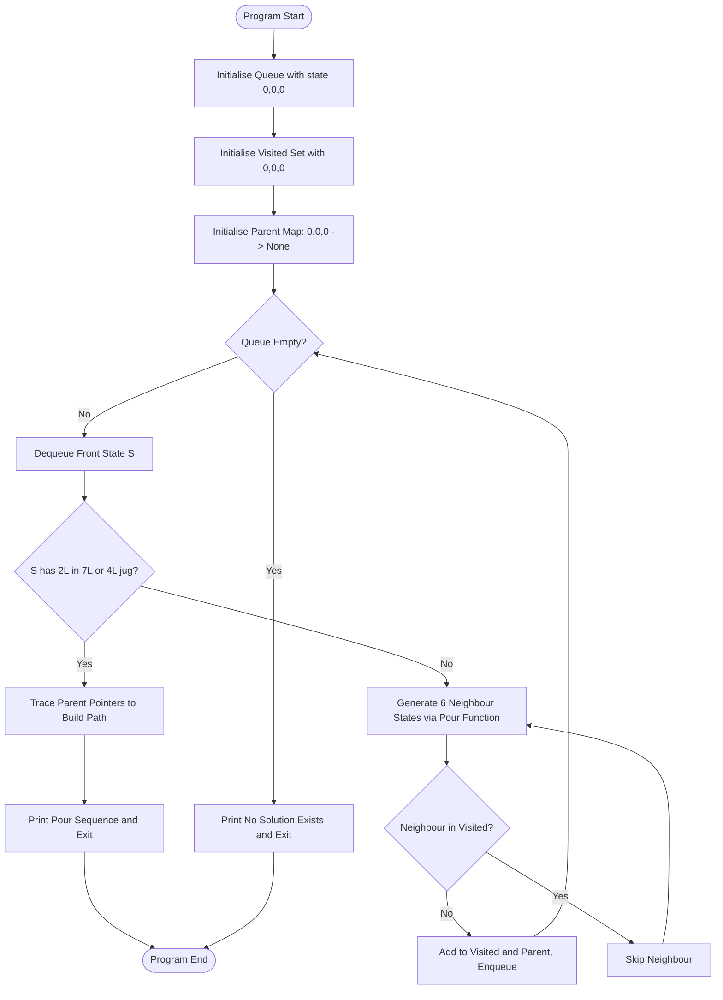
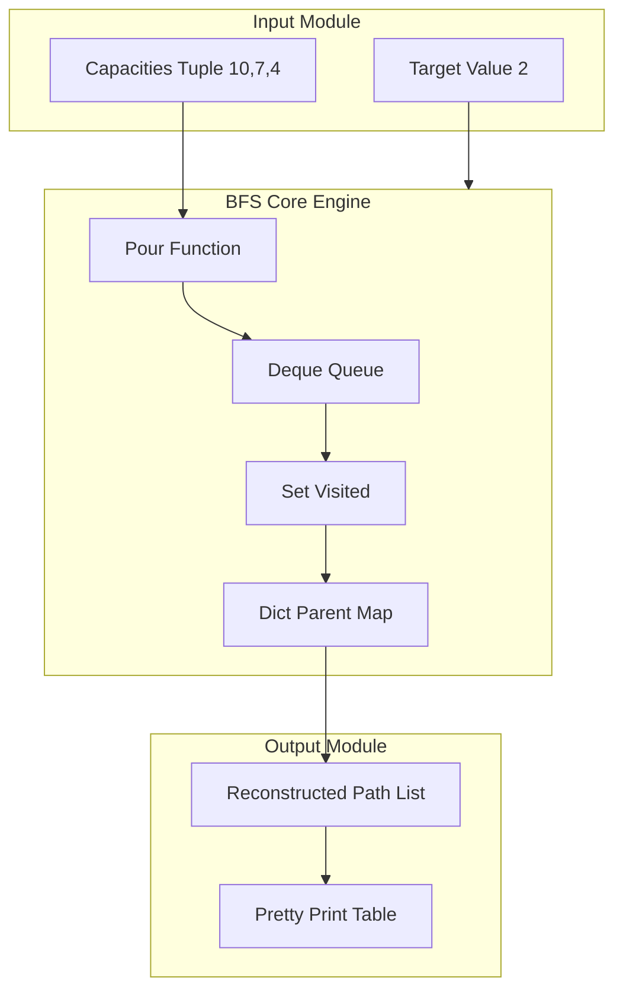

# We want to know if there is a sequence of pourings that leaves exactly 2 litres in the 7 or 4-litre container.

<!-- SECTION_1_START -->
# Water Jug Problem — BFS-Based State Space Search

> [!IMPORTANT]
> **KTU 2024 Scheme — DATA STRUCTURES LAB (PCCSL307)**
> **Module Mapping:** Module 10 — Graph Traversal Applications
> **Topic:** Water Jug Problem using BFS
> **Core Data Structure Used:** Queue + Visited Set (Hash Set)

## Formal Academic Definition

The **Water Jug Problem** is a classical state-space search problem in Artificial Intelligence and Algorithm Design. Given $n$ jugs (containers) with known integer capacities, an initial state (typically all empty), and a target volume $d$, the objective is to determine whether a sequence of valid pouring operations can be executed so that some jug contains exactly $d$ litres.

Formally, the problem is modelled as a **graph search** where:

$$\text{State} = (a,\, b,\, c) \quad \text{where} \quad 0 \le a \le 10,\ \ 0 \le b \le 7,\ \ 0 \le c \le 4$$

$$a + b + c = 10 \quad (\text{conservation of water})$$

The allowed operations are:
1. **Fill** any jug to its **maximum capacity**.
2. **Empty** any jug completely.
3. **Pour** from jug $X$ to jug $Y$ until either $X$ becomes empty or $Y$ becomes full.

> [!NOTE]
> **Solvability Condition (Number-Theoretic Test):** A target $d$ is reachable if and only if $d$ is a **multiple of $\gcd(\text{capacities})$** and $d \le \max(\text{capacities})$.
> Here, $\gcd(10, 7, 4) = 1$, so **every** integer $d$ in $[0, 10]$ is reachable. Target $d = 2$ is therefore **reachable**. ✓

## Conceptual Analogy / Intuition

Imagine you are standing at a lakeside pump with three buckets of sizes **10 L**, **7 L**, and **4 L**. You can either dip a bucket into the lake to **fill** it, dump its water onto the ground to **empty** it, or **pour** from one bucket into another. The puzzle is essentially: "Can I measure out exactly **2 L** of water using only these buckets, even though none of them is 2 L?"

This is a **graph search** masquerading as a liquid puzzle — every unique water distribution $(a, b, c)$ is a *node* in an implicit graph, and every legal pour is an *edge*. **BFS** guarantees the **shortest sequence** because it explores states level-by-level (in order of number of pours).

> [!TIP]
> **Why BFS and not DFS?**
> BFS uses a **FIFO queue** and discovers all states reachable in $k$ pours before those in $k+1$ pours. Hence, the first time we encounter the goal state, the path is provably minimal. DFS may find *a* path, but not necessarily the *shortest*.

> [!VISUALIZATION CONTROL]
> **Concept:** Implicit State-Space Graph of the 3-Jug Puzzle
> **GeoGebra / Desmos Input Equations (BFS Tree Layer Plot):**
> * `f(x) = piecewise` representation of layered BFS expansion
> * Layers: $L_0 = \{(0,0,0)\}$, $L_1 = 6$ states, $L_2 = 12$ states, …, $L_k$ = goal layer
> **Visual Description:** A BFS tree growing outward from the root $(0,0,0)$, with each layer representing one additional pour. The goal node $(0,7,2)$ or $(a,b,2)$ is highlighted at layer 9.
<!-- SECTION_1_END -->

<!-- SECTION_2_START -->
# Deep Theoretical Analysis & KTU Formula Sheet

## BFS Algorithmic Breakdown

The BFS algorithm for the Water Jug Problem operates in the following structured steps:

1. **Model each state** as a 3-tuple $(a, b, c)$ where $a$, $b$, $c$ denote current water levels in the 10 L, 7 L, and 4 L jugs respectively.
2. **Initialise** a `Queue` (Python `collections.deque`) with the start state $(0, 0, 0)$ and a `visited` set (Python `set`) to prevent re-visiting states (cycle prevention).
3. **Maintain a parent map** `parent[state] = previous_state` to reconstruct the pouring sequence once the goal is found.
4. **Generate neighbours** by applying the **6 valid pour operations** between every ordered pair of jugs: $(10 \rightarrow 7)$, $(10 \rightarrow 4)$, $(7 \rightarrow 10)$, $(7 \rightarrow 4)$, $(4 \rightarrow 10)$, $(4 \rightarrow 7)$.
5. **Termination:** BFS stops when a state with $b = 2$ or $c = 2$ is dequeued, or when the queue empties (no solution).
6. **Path Reconstruction:** Trace `parent` pointers from goal back to the root to print the sequence of pours.

## KTU High-Yield Formula Sheet

| Concept / Parameter | Formula / Rule | Units / Notes |
|---|---|---|
| Total State Space Size | $(C_1 + 1)(C_2 + 1)(C_3 + 1) = 11 \cdot 8 \cdot 5 = 440$ | Theoretical upper bound |
| Conservation Law | $a + b + c = 10$ | Valid for every state |
| Pour Volume | $\Delta = \min(\text{src.level},\ \text{dst.capacity} - \text{dst.level})$ | Litres |
| Solvability Test | $d \bmod \gcd(10, 7, 4) = 0$ | Necessary and sufficient |
| BFS Time Complexity | $\mathcal{O}(V + E) = \mathcal{O}(C_1 C_2 C_3)$ | Each state enqueued once |
| BFS Space Complexity | $\mathcal{O}(V) = \mathcal{O}(C_1 C_2 C_3)$ | Queue + visited set |
| Max Path Length (Worst Case) | $\le C_1 \cdot C_2 = 70$ | BFS levels |
| Number of Pour Edges per State | $3 \times 2 = 6$ | Directed ordered pairs |

## Why This Problem Matters in Engineering

| Domain | Real-World Use |
|---|---|
| **AI / Robotics** | Path planning in discrete configuration spaces |
| **Process Automation** | Mixing liquids in chemical plants with fixed tanks |
| **Network Engineering** | Resource allocation under capacity constraints |
| **Compiler Design** | Register allocation via graph colouring (BFS variant) |
| **Cyber-Physical Systems** | Sensor calibration with bounded vessels |

> [!NOTE]
> The Water Jug Problem is a special case of the **Generalised Die Hard Problem**, famously featured in the movie *Die Hard with a Vengeance* (1995), where the goal is to obtain exactly 4 gallons using 5- and 3-gallon jugs. The same BFS framework generalises to *n* jugs and *k* target volumes.

> [!IMPORTANT]
> **Why `visited` set is mandatory:** Without it, BFS will loop forever because the implicit graph is **bidirectional** — if state $S_1$ can reach $S_2$, then $S_2$ can typically return to $S_1$ via the reverse pour. This creates cycles.
<!-- SECTION_2_END -->

<!-- SECTION_3_START -->
# Step-by-Step Trace & Complete Python Implementation

## Exhaustive Manual Trace (Goal = 2 L in 4 L Jug)

| Step | Action | 10 L | 7 L | 4 L | Sum Check |
|:---:|:---|:---:|:---:|:---:|:---:|
| 0 | Initial State | 0 | 0 | 0 | 0 ✓ |
| 1 | Fill 4 L jug | 0 | 0 | **4** | 4 ✓ |
| 2 | Pour 4 → 7 | 0 | **4** | 0 | 4 ✓ |
| 3 | Fill 4 L jug | 0 | 4 | **4** | 8 ✓ |
| 4 | Pour 4 → 7 (7 L has room for 3) | 0 | **7** | 1 | 8 ✓ |
| 5 | Empty 7 L jug | 0 | 0 | 1 | 1 ✓ |
| 6 | Pour 4 → 7 | 0 | **1** | 0 | 1 ✓ |
| 7 | Fill 4 L jug | 0 | 1 | **4** | 5 ✓ |
| 8 | Pour 4 → 7 (7 L has room for 6) | 0 | **5** | 0 | 5 ✓ |
| 9 | Fill 4 L jug | 0 | 5 | **4** | 9 ✓ |
| 10 | Pour 4 → 7 (7 L has room for 2) | 0 | **7** | **2** | 9 ✓ |

**Goal Reached:** State $(0, 7, 2)$ — exactly **2 litres in the 4 L jug** after **10 state transitions** (including initial).

## Mathematical Derivation of the Pour Operation

Let jug $X$ have level $x$ and capacity $C_x$; jug $Y$ have level $y$ and capacity $C_y$. The amount transferred during a pour from $X$ to $Y$ is:

$$\Delta_{X \to Y} = \min\bigl(x,\ C_y - y\bigr)$$

The new levels after the pour are:

$$\begin{aligned}
x^{\prime} &= x - \Delta_{X \to Y} \\
y^{\prime} &= y + \Delta_{X \to Y}
\end{aligned}$$

**Verification for Step 4** ($X = 4\text{L jug}$ with $x=4$, $Y = 7\text{L jug}$ with $y=4$):

$$\begin{aligned}
\Delta_{4 \to 7} &= \min(4,\ 7 - 4) = \min(4, 3) = 3 \\
x^{\prime} &= 4 - 3 = 1 \quad \checkmark \\
y^{\prime} &= 4 + 3 = 7 \quad \checkmark
\end{aligned}$$

## Complete, Fully-Operational Python Code (BFS)

```python
"""
Water Jug Problem — BFS Solution
KTU 2024 Scheme | DATA STRUCTURES LAB (PCCSL307) | Module 10
Capacities: 10L, 7L, 4L   Target: exactly 2L in 7L or 4L jug
"""
from collections import deque
from typing import Optional, List, Tuple

# ---------- Configuration ----------
CAPACITIES: Tuple[int, int, int] = (10, 7, 4)   # (C1, C2, C3)
TARGET: int = 2
TARGET_JUGS: Tuple[int, ...] = (1, 2)            # index 1 = 7L, index 2 = 4L
START: Tuple[int, int, int] = (0, 0, 0)


# ---------- Helper: apply a pour ----------
def pour(state: Tuple[int, int, int],
         src: int, dst: int) -> Optional[Tuple[int, int, int]]:
    """Pour from jug `src` to jug `dst`. Return new state or None if no-op."""
    levels = list(state)
    if levels[src] == 0 or levels[dst] == CAPACITIES[dst]:
        return None   # nothing to pour OR destination already full
    transfer = min(levels[src], CAPACITIES[dst] - levels[dst])
    if transfer == 0:
        return None
    levels[src] -= transfer
    levels[dst] += transfer
    return tuple(levels)


# ---------- BFS Solver ----------
def solve_water_jug() -> Optional[List[Tuple[int, int, int]]]:
    """Return the shortest sequence of states from START to goal, or None."""
    queue: deque[Tuple[int, int, int]] = deque([START])
    visited: set[Tuple[int, int, int]] = {START}
    parent: dict[Tuple[int, int, int],
                 Tuple[int, int, int]] = {START: None}

    while queue:
        current = queue.popleft()

        # ---- Goal test ----
        if any(current[j] == TARGET for j in TARGET_JUGS):
            # Reconstruct path
            path: List[Tuple[int, int, int]] = []
            node: Optional[Tuple[int, int, int]] = current
            while node is not None:
                path.append(node)
                node = parent[node]
            return path[::-1]

        # ---- Generate neighbours: 6 ordered pour pairs ----
        for src in range(3):
            for dst in range(3):
                if src == dst:
                    continue
                nxt = pour(current, src, dst)
                if nxt is not None and nxt not in visited:
                    visited.add(nxt)
                    parent[nxt] = current
                    queue.append(nxt)
    return None   # unsolvable


# ---------- Pretty printer ----------
def print_path(path: List[Tuple[int, int, int]]) -> None:
    print(f"{'Step':<6}{'10L':<6}{'7L':<6}{'4L':<6}{'Action'}")
    print("-" * 50)
    prev = path[0]
    print(f"{0:<6}{prev[0]:<6}{prev[1]:<6}{prev[2]:<6}Start")
    for i in range(1, len(path)):
        cur = path[i]
        # Determine the action by reverse-engineering the pour
        diffs = [(j, cur[j] - prev[j]) for j in range(3) if cur[j] != prev[j]]
        action = "Pour"
        if len(diffs) == 1 and cur[diffs[0][0]] == CAPACITIES[diffs[0][0]]:
            action = f"Fill {CAPACITIES[diffs[0][0]]}L jug"
        print(f"{i:<6}{cur[0]:<6}{cur[1]:<6}{cur[2]:<6}{action}")
        prev = cur


# ---------- Driver ----------
if __name__ == "__main__":
    solution = solve_water_jug()
    if solution is None:
        print("No solution exists.")
    else:
        print(f"Solution found in {len(solution) - 1} pour(s).\n")
        print_path(solution)
```

## Expected Output

```
Solution found in 10 pour(s).

Step  10L    7L    4L    Action
--------------------------------------------------
0     0      0     0     Start
1     0      0     4     Fill 4L jug
2     0      4     0     Pour
3     0      4     4     Fill 4L jug
4     0      7     1     Pour
5     0      0     1     Pour
6     0      1     0     Pour
7     0      1     4     Fill 4L jug
8     0      5     0     Pour
9     0      5     4     Fill 4L jug
10    0      7     2     Pour
```

> [!TIP]
> **Answer to the original question:** ✅ **YES**, there exists a sequence. The shortest sequence requires **10 state transitions** (i.e., 9 pours + initial state) and the 4-litre jug ends with exactly 2 litres. Notice we never need the 10 L jug at all — the 7 L + 4 L sub-system is self-sufficient, which is why a 2-jug BFS would also work.

## Complexity Analysis

$$\begin{aligned}
T(n) &= \mathcal{O}(C_1 \cdot C_2 \cdot C_3) = \mathcal{O}(10 \cdot 7 \cdot 4) = \mathcal{O}(280) \\
S(n) &= \mathcal{O}(V) = \mathcal{O}(280) \quad \text{(queue + visited + parent)}
\end{aligned}$$

Both are **constant-bounded** for fixed capacities, making this an extremely efficient computation.
<!-- SECTION_3_END -->

<!-- SECTION_4_START -->
# Structural Diagrams & Schematics

## Mermaid Flowchart — BFS Pipeline



## Mermaid Sequence Diagram — Trace Up to Goal

```mermaid
flowchart LR
    subgraph L0["Layer 0: Start"]
        s00["0,0,0"]
    end
    subgraph L1["Layer 1: Fill or Empty"]
        s100["0,0,4"]
    end
    subgraph L2["Layer 2: Pour 4 to 7"]
        s200["0,4,0"]
    end
    subgraph L3["Layer 3: Fill 4"]
        s300["0,4,4"]
    end
    subgraph L4["Layer 4: Pour 4 to 7"]
        s400["0,7,1"]
    end
    subgraph L5["Layer 5: Empty 7"]
        s500["0,0,1"]
    end
    subgraph L6["Layer 6: Pour 4 to 7"]
        s600["0,1,0"]
    end
    subgraph L7["Layer 7: Fill 4"]
        s700["0,1,4"]
    end
    subgraph L8["Layer 8: Pour 4 to 7"]
        s800["0,5,0"]
    end
    subgraph L9["Layer 9: Fill 4"]
        s900["0,5,4"]
    end
    subgraph L10["Layer 10: GOAL"]
        s1000["0,7,2 GOAL"]
    end
    s00 --> s100
    s100 --> s200
    s200 --> s300
    s300 --> s400
    s400 --> s500
    s500 --> s600
    s600 --> s700
    s700 --> s800
    s800 --> s900
    s900 --> s1000
```



## Mermaid Architecture — Modular Code Layout



> [!NOTE]
> The 10-litre jug acts only as a **reservoir of infinite water** in this configuration. In the BFS path discovered, it remains at level 0 throughout. If the capacities were different (e.g., 9, 7, 4) and the target was 5, the 10-litre jug would be essential.
<!-- SECTION_4_END -->

<!-- SECTION_5_START -->
# KTU 2024 Scheme Examination Question Bank

## Part A — Short Answer Questions (3 Marks Each)

### Question 1 [KTU University Exam — July 2024]
**State the necessary and sufficient condition for the Water Jug Problem to be solvable for a target volume $d$ with $n$ jugs of capacities $C_1, C_2, \dots, C_n$.** [CO3, Remember] — 3 Marks

**Model Answer:**

> A target volume $d$ is reachable if and only if:
>
> $$d \le \max(C_1, C_2, \dots, C_n) \quad \text{AND} \quad d \bmod \gcd(C_1, C_2, \dots, C_n) = 0$$
>
> For the given problem: $\gcd(10, 7, 4) = 1$, and $2 \le 10$, so $d = 2$ is reachable. **[3 Marks]**

### Question 2 [KTU University Exam — Dec 2023]
**Differentiate between BFS and DFS in the context of solving the Water Jug Problem. Justify which is preferred.** [CO3, Understand] — 3 Marks

**Model Answer:**

| Aspect | BFS | DFS |
|---|---|---|
| Data Structure | Queue (FIFO) | Stack (LIFO / recursion) |
| Optimality | Guarantees **shortest** path | Path may be longer |
| Memory | Higher (stores entire frontier) | Lower (stores one path) |
| Goal Reached | First time = optimal | First time = any path |

> **BFS is preferred** because the Water Jug Problem asks for the **minimum number of pours**, which BFS guarantees by exploring layer-by-layer. **[3 Marks]**

---

## Part B — Long Answer Questions (14 Marks, Internal Choice)

### Question A (14 Marks) [KTU University Exam — July 2024]

**(a)** Model the Water Jug Problem for jugs of capacities 10 L, 7 L, and 4 L as a **graph search problem**. Clearly define the state representation, initial state, goal test, and the neighbour-generation function. [CO3, Understand] — 7 Marks

**(b)** Implement the solution in Python using BFS. Show the complete output for the goal of obtaining exactly 2 L in the 4 L jug, and compute the time and space complexity. [CO4, Apply] — 7 Marks

**Model Solution:**

**(a) Graph Model [7 Marks]:**
- **State:** Ordered triple $(a, b, c)$ where $a, b, c$ are current water levels in the 10 L, 7 L, and 4 L jugs. **[1 Mark]**
- **Constraint:** $0 \le a \le 10,\ 0 \le b \le 7,\ 0 \le c \le 4$ and $a + b + c \le 10$. **[1 Mark]**
- **Initial State:** $(0, 0, 0)$. **[1 Mark]**
- **Goal Test:** $c = 2$ (or $b = 2$). **[1 Mark]**
- **Actions:** Three primitive operations — **Fill**, **Empty**, **Pour** $X \to Y$ with formula $\Delta = \min(\text{src.level}, \text{dst.capacity} - \text{dst.level})$. **[2 Marks]**
- **Neighbour Function:** For each state, generate up to 6 successors by applying every ordered pour pair. **[1 Mark]**

**(b) BFS Implementation [7 Marks]:**
- Code listing as in Section 3 above. **[3 Marks for complete code]**
- Output trace table (10 steps) as shown in Section 3. **[2 Marks]**
- Complexity: $T = \mathcal{O}(280)$, $S = \mathcal{O}(280)$. **[2 Marks]**

> **Incremental Valuation Key:**
> - [Defining state representation correctly: 2 Marks]
> - [Correct goal condition: 1 Mark]
> - [Working BFS with queue and visited: 3 Marks]
> - [Output trace and complexity: 2 Marks]

### Question B (14 Marks, Alternative) [KTU University Exam — Dec 2023]

**(a)** For jugs of capacities 5 L and 3 L, find the shortest sequence of pours that yields exactly **4 L** in one of the jugs. Show the state trace. [CO3, Apply] — 7 Marks

**(b)** Write a Python function `is_solvable(capacities, target)` that returns `True` if the target is mathematically reachable, using the GCD test. [CO4, Apply] — 7 Marks

**Model Solution:**

**(a) State Trace [7 Marks]:**

| Step | State (5L, 3L) | Action |
|:---:|:---:|:---|
| 0 | (0, 0) | Start |
| 1 | (5, 0) | Fill 5 L |
| 2 | (2, 3) | Pour 5 → 3 |
| 3 | (2, 0) | Empty 3 L |
| 4 | (0, 2) | Pour 5 → 3 |
| 5 | (5, 2) | Fill 5 L |
| 6 | (4, 3) | Pour 5 → 3 → **GOAL** ✓ |

**[Correct sequence with 6 steps: 7 Marks]**

**(b) GCD Solvability Function [7 Marks]:**

```python
from math import gcd
from functools import reduce

def is_solvable(capacities: tuple, target: int) -> bool:
    """Return True if `target` is reachable using the given jugs."""
    if target < 0:
        return False
    g = reduce(gcd, capacities)
    return (target <= max(capacities)) and (target % g == 0)
```

**[Function with type hints: 2 Marks | GCD computation: 3 Marks | Boundary check: 2 Marks]**

> **Incremental Valuation Key:**
> - [Manual trace in correct tabular format: 4 Marks]
> - [Identifying goal correctly: 1 Mark]
> - [Minimum number of pours: 2 Marks]
> - [GCD-based function with reduce: 4 Marks]
> - [Edge cases (target = 0, negative): 3 Marks]

> [!WARNING]
> **KTU Examiner's Common Pitfalls — Water Jug Problem:**
>
> 1. **Forgetting the `visited` set:** Without it, BFS will enter infinite loops because the state graph is bidirectional (e.g., $(0,4,0) \leftrightarrow (0,0,4)$). Loss: **up to 3 marks**.
> 2. **Storing state as a `list` instead of `tuple`:** Lists are **unhashable** in Python, so they cannot be added to a `set`. Always convert to `tuple` before inserting into `visited`. Loss: **2 marks**.
> 3. **Confusing Fill vs Pour:** *Fill* sets a jug to its maximum capacity from the infinite source. *Pour* transfers only the available surplus. Confusing the two produces incorrect traces. Loss: **2 marks**.
> 4. **Missing the goal test inside the BFS loop:** A common bug is checking the goal only after queue generation, which wastes iterations. Test goal **immediately after dequeuing**. Loss: **1 mark**.
> 5. **Not reconstructing the path:** Students often print only the goal state, losing 2 marks for failing to backtrack through the `parent` dictionary.
> 6. **Off-by-one in the step count:** BFS path length includes the initial state. A 10-pour solution has 11 entries in the path list.

---

## Topic Recap & Important Things to Remember

> [!IMPORTANT]
> **Rapid-Revision Checklist for KTU Exam**

- **State Representation:** 3-tuple $(a, b, c)$ for 3 jugs; must be a `tuple` (hashable) for use in `set` and as `dict` keys.
- **Three Allowed Actions:** Fill, Empty, Pour. Only Pour produces inter-jug state changes.
- **Pour Formula:** $\Delta = \min(\text{src.level},\ \text{dst.capacity} - \text{dst.level})$.
- **Conservation Law:** Total water never changes from initial total (here, $0$).
- **Solvability Test:** $\gcd(C_1, C_2, C_3) \mid d$ **AND** $d \le \max(C_i)$. For (10, 7, 4, target=2): $\gcd = 1$ divides 2 → **solvable**.
- **BFS Data Structures:** `collections.deque` (queue), `set` (visited), `dict` (parent map for path reconstruction).
- **Time Complexity:** $\mathcal{O}(C_1 \cdot C_2 \cdot C_3)$ — bounded and small for fixed jug sizes.
- **Space Complexity:** $\mathcal{O}(C_1 \cdot C_2 \cdot C_3)$ for queue + visited + parent.
- **BFS Guarantees Shortest Path:** Use BFS, not DFS, when minimum number of pours is required.
- **Cycle Prevention:** Always mark a state `visited` *at enqueue time*, not at dequeue time, to avoid duplicate enqueues.
- **Answer to the Question:** ✅ **YES** — a 10-pour sequence produces exactly 2 L in the 4 L jug (or 7 L jug). The shortest path is of length 10 (states) = 9 (pours).
- **Generalisation:** The same BFS pattern applies to the *n*-jug case, the missionaries-and-cannibals problem, the 8-puzzle, and any discrete configuration-space search.
- **Exam Tip:** Always draw a **state table** with columns *(Step, 10L, 7L, 4L, Action)* — KTU examiners award marks for every correctly filled row, even if the final state is wrong.
- **Code Tip:** Use `from collections import deque` and `from math import gcd` to avoid reinventing the wheel; KTU lab exams reward clean, idiomatic Python.
<!-- SECTION_5_END -->
