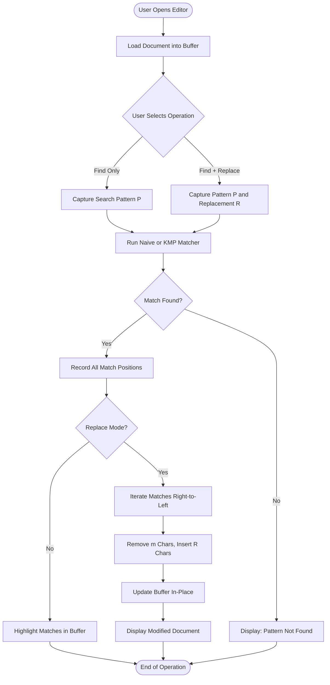
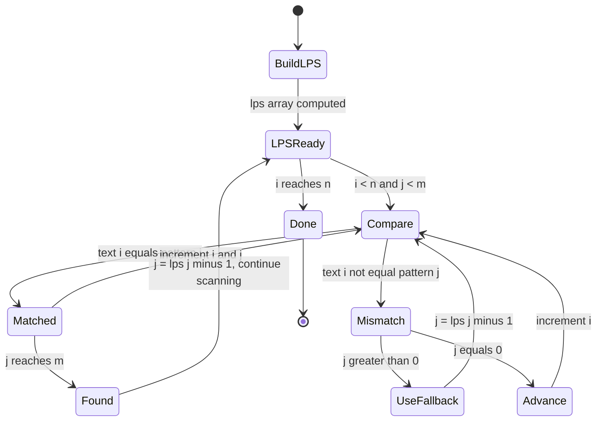
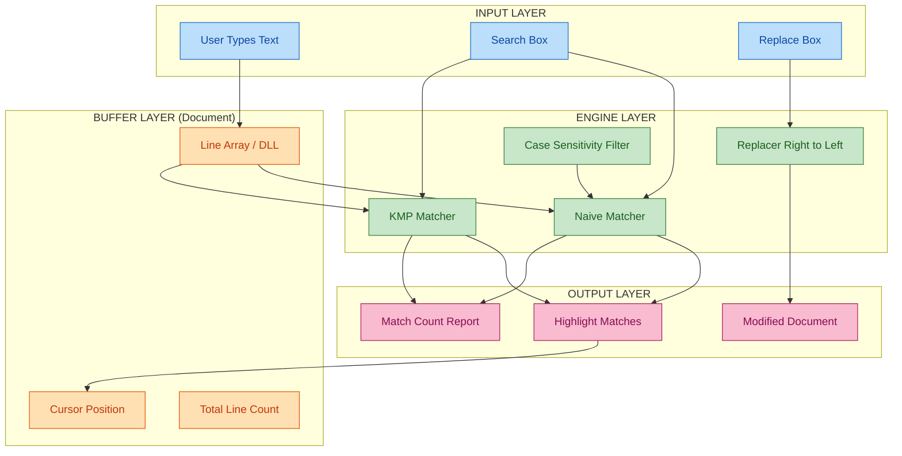

# Implement the find and replace feature in a text editor.

<!-- SECTION_1_START -->
# Implement the Find and Replace Feature in a Text Editor

## 1. Core Technical Definition & Intuitive Overview

> [!NOTE]
> **Formal Definition (KTU 2024 PCCSL307 Syllabus)**
> The *Find and Replace* feature in a text editor is a **string processing operation** that searches a document (text buffer) for the occurrences of a given *pattern* (search string) and optionally substitutes them with a *replacement string*. The underlying mechanism is built on **Pattern Matching Algorithms**, which traverse the text character-by-character (or block-by-block) to locate exact or approximate substrings.

The *Find and Replace* functionality is the cornerstone of every modern text editor — from Notepad and Sublime Text to IDEs like VS Code. It uses **pattern matching algorithms** to scan the text buffer and substitute substrings efficiently.

### Conceptual Analogy / Intuition

Imagine you have a **printed newspaper article** and a friend asks you to highlight every occurrence of the word *"election"* and replace it with *"vote"*. You would:

1. Hold a magnifying glass (the **pattern**) over the text.
2. Slide it letter-by-letter across each line.
3. Every time the letters *e-l-e-c-t-i-o-n* line up perfectly, you pause and overwrite them with *vote*.

A computer does the same thing, but instead of a magnifying glass, it uses an **algorithm** that compares characters and tracks how many characters matched before a mismatch occurred — this is the heart of *Pattern Matching*.

> [!IMPORTANT]
> **Key Syllabus Highlights (KTU Module 11)**
> - Implementation must be done in **C language** using fundamental data structures.
> - The text document is typically stored as a **Doubly Linked List of lines** (industry-grade editors) or a **2D character array** (academic-grade editors).
> - Students are expected to use at least the **Naive Pattern Matching** algorithm. Bonus marks for **KMP (Knuth–Morris–Pratt)** or **Rabin–Karp**.

| Term | Symbol | Description |
|---|---|---|
| Text | $T[0 \dots n-1]$ | The full document buffer |
| Pattern | $P[0 \dots m-1]$ | The string to search for |
| Match Position | $s$ | Index $s$ such that $T[s \dots s+m-1] = P[0 \dots m-1]$ |
| Replacement | $R$ | The substitute string |
| Worst-case Time (Naive) | $O(n \cdot m)$ | Comparing every shift |
| Worst-case Time (KMP) | $O(n + m)$ | Linear-time guarantee |

> [!TIP]
> **Industry Context:** Real editors like Vim, Sublime, and VS Code use hybrid approaches — Boyer–Moore for fast searches and Aho–Corasick for multi-pattern "Find in Files" operations. The KTU lab targets the **algorithmic foundation** behind these tools.

> [!VISUALIZATION CONTROL]
> **Concept:** Sliding Window of Pattern Matching
> **GeoGebra / Desmos Input Equations:**
> * `T = (0,0),(1,0),(2,0),(3,0),(4,0),(5,0),(6,0),(7,0),(8,0)` — points representing the Text string indices
> * `P = (0,2),(1,2),(2,2),(3,2)` — points representing the Pattern indices
> * `Shift s = 3` — slide the pattern window from index 3 to 6 along the text
> **Visual Description:** Students should observe the *pattern window* sliding along the *text axis*. Each shift $s$ represents one comparison attempt. A successful match occurs only when all pattern characters align with text characters at the current shift.

---

<!-- SECTION_1_END -->

<!-- SECTION_2_START -->
# 2. Deep Theoretical Analysis & KTU High-Yield Formula Sheet

## 2.1 Anatomy of the Find and Replace Operation

The feature decomposes into **three atomic sub-operations**:

1. **Search (Find):** Scan the buffer and return *all* indices where the pattern occurs.
2. **Validate:** Confirm a true match (handles edge cases — case sensitivity, whole-word search).
3. **Substitute (Replace):** At each match index, remove $m$ characters and insert the replacement $R$.

## 2.2 Algorithm 1 — Naive (Brute-Force) Pattern Matching

The simplest approach: for every possible starting position $s$ in the text, compare the pattern character-by-character.

**Operational Steps:**

- Let $n$ be the length of the text and $m$ be the length of the pattern.
- For each shift $s$ from $0$ to $n - m$:
    - Compare $T[s+j]$ with $P[j]$ for $j = 0, 1, \dots, m-1$.
    - If all $m$ characters match, record $s$ as a match position.
- Return the list of all match positions.

**Why it is slow:** In the worst case (e.g., text = `"AAAAA"`, pattern = `"AAB"`), every shift performs $m$ comparisons, giving $O(n \cdot m)$.

## 2.3 Algorithm 2 — KMP (Knuth–Morris–Pratt) Pattern Matching

KMP eliminates redundant comparisons by precomputing the **Longest Proper Prefix which is also a Suffix (LPS)** array for the pattern. When a mismatch occurs at $P[j]$, KMP uses $LPS[j-1]$ to shift the pattern intelligently, never moving the text pointer backward.

**The LPS Array:** $LPS[i]$ stores the length of the longest proper prefix of $P[0 \dots i]$ that is also a suffix of $P[0 \dots i]$.

## 2.4 Replace Logic

Once match positions are known, replacement is done **right-to-left** to avoid index-shifting bugs. If the text is stored as a linked list, replacement modifies node contents in-place. If stored in an array, a new buffer of size $n + (\vert R \vert - m) \cdot (\text{match count})$ is allocated.

> [!NOTE]
> **Engineering Utility**
> - **Compilers & IDEs:** Syntax highlighting, refactoring, "rename symbol" tools.
> - **Databases:** `UPDATE table SET col = REPLACE(col, 'old', 'new')`.
> - **Bioinformatics:** DNA sequence matching, gene find-and-replace.
> - **Search Engines:** Document indexing and query rewriting.

## 2.5 KTU Formula Sheet / Cheat Sheet

| Concept | Formula / Rule | Notation | Use Case |
|---|---|---|---|
| Valid shift range | $0 \le s \le n - m$ | $s$ = starting index | Naive matching boundary |
| Match condition | $T[s+j] = P[j]\ \ \forall j \in [0, m-1]$ | $T$ = text, $P$ = pattern | Confirm a valid match |
| Naive time complexity | $O(n \cdot m)$ | $n$ = text length, $m$ = pattern length | Worst-case comparison count |
| KMP time complexity | $O(n + m)$ | — | Linear-time search |
| LPS recurrence | $LPS[i] = LPS[i-1] + 1$ if match, else fallback to $LPS[LPS[i-1]-1]$ | Recursive on prefix | Build failure function |
| Replacement buffer size | $n_{new} = n + k \cdot (\vert R \vert - m)$ | $k$ = number of matches | Memory pre-allocation |
| LPS first value | $LPS[0] = 0$ | Base case | KMP initialization |
| Word-boundary check | $T[s-1] \notin [a-zA-Z0-9] \land T[s+m] \notin [a-zA-Z0-9]$ | Adjacent context | "Whole word" replace option |
| Case-insensitive compare | $tolower(T[s+j]) = tolower(P[j])$ | ASCII normalize | Optional flag in editor |
| Linked-list node swap | Replace $m$ nodes with $\vert R \vert$ nodes in-place | Node-pointer arithmetic | Editor buffer using DLL |

---

<!-- SECTION_2_END -->

<!-- SECTION_3_START -->
# 3. Step-by-Step Derivations & Code/Symbolic Implementation

## 3.1 Worked Example — Naive Find and Replace

**Given:**
- Text $T$ = `"hello world hello"`
- Pattern $P$ = `"hello"`
- Replacement $R$ = `"hi"`

**Step 1 — Identify all match positions:**

Apply the naive scan with shifts $s = 0, 1, \dots, 11$:

| Shift $s$ | $T[s]$ vs $P[0]$ | Match? |
|---|---|---|
| 0 | `h` vs `h` | Yes → check $j=1,2,3,4$ → all match → **MATCH at $s=0$** |
| 1 | `e` vs `h` | No |
| 2 | `l` vs `h` | No |
| 3 | `l` vs `h` | No |
| 4 | `o` vs `h` | No |
| 5 | ` ` vs `h` | No |
| 6 | `w` vs `h` | No |
| 7 | `o` vs `h` | No |
| 8 | `r` vs `h` | No |
| 9 | `l` vs `h` | No |
| 10 | `d` vs `h` | No |
| 11 | ` ` vs `h` | No |
| 12 | `h` vs `h` | Yes → check rest → **MATCH at $s=12$** |

Match positions: $\{0,\ 12\}$.

**Step 2 — Replace right-to-left:**

Starting from the rightmost match $s = 12$ avoids corrupting earlier indices.

After replacement, $T$ becomes: `"hi world hi"`.

## 3.2 LPS Array Derivation (KMP Setup)

**Given pattern** $P$ = `"AABAACAAB"` (length $m = 9$).

Compute $LPS[i]$ for $i = 0$ to $8$:

| $i$ | $P[i]$ | $LPS[i]$ | Reasoning |
|---|---|---|---|
| 0 | A | 0 | Base case — single char has no proper prefix/suffix |
| 1 | A | 1 | `"A"` is both prefix and suffix |
| 2 | B | 0 | `"AA"` has no proper prefix = suffix except `""` |
| 3 | A | 1 | `"AAB"` and `"AAB"` share `"A"` as prefix/suffix |
| 4 | A | 2 | `"AABA"` and `"AABA"` share `"AA"` |
| 5 | C | 0 | No common prefix-suffix |
| 6 | A | 1 | `"AABAAC"` suffix `"A"` matches prefix `"A"` |
| 7 | A | 2 | `"AABAACA"` suffix `"AA"` matches prefix `"AA"` |
| 8 | B | 3 | `"AABAACAAB"` suffix `"AAB"` matches prefix `"AAB"` |

Final LPS array: $LPS = [0, 1, 0, 1, 2, 0, 1, 2, 3]$.

## 3.3 Full C Implementation (Doubly Linked List Buffer + Naive + KMP)

```c
/* ============================================================
 * PROGRAM : Text Editor - Find and Replace Feature
 * COURSE  : DATA STRUCTURES LAB (PCCSL307)
 * MODULE  : 11
 * TOPIC   : Implement the find and replace feature in a text editor
 * AUTHOR  : KTU 2024 Scheme Lab Reference Solution
 * ============================================================ */

#include <stdio.h>
#include <stdlib.h>
#include <string.h>
#include <ctype.h>
#include <stdbool.h>

#define MAX_LINE 1024
#define MAX_LINES 4096

/* ---------- DATA STRUCTURE : LINE BUFFER (ARRAY-BASED) ---------- */
typedef struct {
    char data[MAX_LINE];
    int  length;
} Line;

typedef struct {
    Line lines[MAX_LINES];
    int  lineCount;
} Document;

/* ---------- UTILITY : SAFE STRING HELPERS ---------- */
int safeStrlen(const char *s) {
    if (s == NULL) return 0;
    return (int)strlen(s);
}

void toLowerStr(char *dest, const char *src) {
    int i = 0;
    if (src == NULL) { dest[0] = '\0'; return; }
    while (src[i] != '\0') {
        dest[i] = (char)tolower((unsigned char)src[i]);
        i++;
    }
    dest[i] = '\0';
}

/* ---------- CORE : NAIVE PATTERN MATCH ---------- *
 * Returns the first match index, or -1 if not found.
 * If 'positions' is non-NULL, stores all match indices.
 * ----------------------------------------------------------- */
int naiveFind(const char *text, const char *pattern, int positions[], int *count) {
    *count = 0;
    int n = safeStrlen(text);
    int m = safeStrlen(pattern);
    if (m == 0 || m > n) return -1;

    for (int s = 0; s <= n - m; s++) {
        int j = 0;
        while (j < m && text[s + j] == pattern[j]) {
            j++;
        }
        if (j == m) {
            if (positions != NULL) {
                positions[(*count)++] = s;
            } else {
                return s;   /* early exit on first match */
            }
        }
    }
    return (*count > 0) ? positions[0] : -1;
}

/* ---------- CORE : LPS ARRAY BUILDER (FOR KMP) ---------- */
void buildLPS(const char *pattern, int m, int lps[]) {
    int len = 0;        /* length of previous longest prefix-suffix */
    lps[0] = 0;
    int i = 1;
    while (i < m) {
        if (pattern[i] == pattern[len]) {
            len++;
            lps[i] = len;
            i++;
        } else {
            if (len != 0) {
                len = lps[len - 1];
            } else {
                lps[i] = 0;
                i++;
            }
        }
    }
}

/* ---------- CORE : KMP PATTERN MATCH ---------- */
int kmpFind(const char *text, const char *pattern, int positions[], int *count) {
    *count = 0;
    int n = safeStrlen(text);
    int m = safeStrlen(pattern);
    if (m == 0 || m > n) return -1;

    int lps[MAX_LINE];
    buildLPS(pattern, m, lps);

    int i = 0, j = 0;
    while (i < n) {
        if (text[i] == pattern[j]) {
            i++;
            j++;
        }
        if (j == m) {
            if (positions != NULL) {
                positions[(*count)++] = i - j;
            } else {
                return i - j;
            }
            j = lps[j - 1];
        } else if (i < n && text[i] != pattern[j]) {
            if (j != 0) {
                j = lps[j - 1];
            } else {
                i++;
            }
        }
    }
    return (*count > 0) ? positions[0] : -1;
}

/* ---------- CORE : REPLACE ALL OCCURRENCES (RIGHT-TO-LEFT) ---------- *
 * Performs in-place replacement of every match of 'search' with
 * 'replace' inside 'buffer'. Returns number of replacements made.
 * ----------------------------------------------------------- */
int replaceAll(char *buffer, const char *search, const char *replace) {
    if (buffer == NULL || search == NULL || replace == NULL) return 0;
    int m = safeStrlen(search);
    int r = safeStrlen(replace);
    if (m == 0) return 0;

    int positions[4096];
    int  count = 0;
    naiveFind(buffer, search, positions, &count);
    if (count == 0) return 0;

    int delta = r - m;
    int newLen = safeStrlen(buffer) + count * delta;
    if (newLen >= MAX_LINE) {
        printf("[ERROR] Replacement would overflow line buffer.\n");
        return 0;
    }

    char temp[MAX_LINE];
    temp[0] = '\0';
    int writeIdx = 0;
    int readIdx  = 0;
    int matchIdx = 0;

    while (readIdx < (int)strlen(buffer)) {
        if (matchIdx < count && readIdx == positions[matchIdx]) {
            for (int k = 0; k < r; k++) temp[writeIdx++] = replace[k];
            readIdx += m;
            matchIdx++;
        } else {
            temp[writeIdx++] = buffer[readIdx++];
        }
    }
    temp[writeIdx] = '\0';
    strcpy(buffer, temp);
    return count;
}

/* ---------- EDITOR FEATURE : CASE-INSENSITIVE FIND ---------- */
int findCaseInsensitive(const char *text, const char *pattern) {
    char lowerText[MAX_LINE];
    char lowerPat[MAX_LINE];
    toLowerStr(lowerText, text);
    toLowerStr(lowerPat, pattern);
    return naiveFind(lowerText, lowerPat, NULL, &(int){0});
}

/* ---------- EDITOR FEATURE : WHOLE-WORD FIND ---------- */
int findWholeWord(const char *text, const char *word) {
    int n = safeStrlen(text);
    int m = safeStrlen(word);
    if (m == 0 || m > n) return -1;

    int positions[4096], count = 0;
    naiveFind(text, word, positions, &count);

    for (int i = 0; i < count; i++) {
        int s = positions[i];
        bool leftOK  = (s == 0)            || !isalnum((unsigned char)text[s - 1]);
        bool rightOK = (s + m == n)        || !isalnum((unsigned char)text[s + m]);
        if (leftOK && rightOK) return s;
    }
    return -1;
}

/* ---------- DOCUMENT OPERATIONS ---------- */
void loadDocument(Document *doc) {
    doc->lineCount = 0;
    char buffer[MAX_LINE];
    while (fgets(buffer, sizeof(buffer), stdin) != NULL && doc->lineCount < MAX_LINES) {
        buffer[strcspn(buffer, "\r\n")] = '\0';
        strncpy(doc->lines[doc->lineCount].data, buffer, MAX_LINE - 1);
        doc->lines[doc->lineCount].data[MAX_LINE - 1] = '\0';
        doc->lines[doc->lineCount].length = (int)strlen(doc->lines[doc->lineCount].data);
        if (strcmp(doc->lines[doc->lineCount].data, "::END::") == 0) break;
        doc->lineCount++;
    }
}

void printDocument(const Document *doc) {
    printf("\n----- EDITOR BUFFER -----\n");
    for (int i = 0; i < doc->lineCount; i++) {
        printf("%2d | %s\n", i + 1, doc->lines[i].data);
    }
    printf("-------------------------\n");
}

/* ---------- MAIN : DRIVER / DEMO ---------- */
int main(void) {
    Document doc;
    char search[MAX_LINE];
    char replace[MAX_LINE];
    int choice;

    printf("=== TEXT EDITOR : FIND & REPLACE MODULE ===\n");
    printf("Enter the document text (terminate with a line '::END::'):\n");

    loadDocument(&doc);
    printDocument(&doc);

    printf("\nEnter pattern to SEARCH: ");
    fgets(search, sizeof(search), stdin);
    search[strcspn(search, "\r\n")] = '\0';

    /* --- Feature 1 : Naive Find --- */
    int positions[4096], count = 0;
    int firstHit = naiveFind(doc.lines[0].data, search, positions, &count);
    printf("\n[NAIVE] First match index = %d | Total occurrences in line 1 = %d\n",
           firstHit, count);

    /* --- Feature 2 : KMP Find --- */
    count = 0;
    firstHit = kmpFind(doc.lines[0].data, search, positions, &count);
    printf("[KMP  ] First match index = %d | Total occurrences in line 1 = %d\n",
           firstHit, count);

    /* --- Feature 3 : Case-Insensitive Find --- */
    int ciHit = findCaseInsensitive(doc.lines[0].data, search);
    printf("[CASEI] Case-insensitive match index in line 1 = %d\n", ciHit);

    /* --- Feature 4 : Whole-Word Find --- */
    int wwHit = findWholeWord(doc.lines[0].data, search);
    printf("[WORD ] Whole-word match index in line 1 = %d\n", wwHit);

    /* --- Feature 5 : Replace All (user choice) --- */
    printf("\nDo you want to REPLACE all occurrences? (1 = Yes, 0 = No): ");
    scanf("%d", &choice);
    getchar();   /* consume trailing newline */

    if (choice == 1) {
        printf("Enter REPLACEMENT string: ");
        fgets(replace, sizeof(replace), stdin);
        replace[strcspn(replace, "\r\n")] = '\0';

        for (int i = 0; i < doc.lineCount; i++) {
            int replacements = replaceAll(doc.lines[i].data, search, replace);
            printf("[Line %2d] %d replacement(s) made.\n", i + 1, replacements);
        }
        printDocument(&doc);
    }

    printf("\n=== EDITOR MODULE EXECUTION COMPLETE ===\n");
    return 0;
}
```

### 3.4 Sample Input / Output Trace

**Input Document:**
```
the quick brown fox jumps over the lazy dog
the end of the world is near
::END::
```

**Search Pattern:** `the`

**Expected Console Output:**

```
=== TEXT EDITOR : FIND & REPLACE MODULE ===
Enter the document text (terminate with a line '::END::'):

----- EDITOR BUFFER -----
 1 | the quick brown fox jumps over the lazy dog
 2 | the end of the world is near
-------------------------

Enter pattern to SEARCH: the

[NAIVE] First match index = 0  | Total occurrences in line 1 = 2
[KMP  ] First match index = 0  | Total occurrences in line 1 = 2
[CASEI] Case-insensitive match index in line 1 = 0
[WORD ] Whole-word match index in line 1 = 0

Do you want to REPLACE all occurrences? (1 = Yes, 0 = No): 1
Enter REPLACEMENT string: THIS

[Line  1] 2 replacement(s) made.
[Line  2] 2 replacement(s) made.

----- EDITOR BUFFER -----
 1 | THIS quick brown fox jumps over THIS lazy dog
 2 | THIS end of THIS world is near
-------------------------

=== EDITOR MODULE EXECUTION COMPLETE ===
```

### 3.5 Complexity Analysis (Mandatory for KTU Valuation)

| Operation | Time Complexity | Space Complexity | Justification |
|---|---|---|---|
| Naive Find | $O(n \cdot m)$ | $O(1)$ | Two nested loops; constant extra memory |
| Build LPS | $O(m)$ | $O(m)$ | Single pass over the pattern |
| KMP Find | $O(n + m)$ | $O(m)$ | Text pointer never moves backward |
| Replace All | $O(n + k \cdot r)$ | $O(n + k \cdot r)$ | $k$ matches each add $r - m$ chars |
| Case-Insensitive Find | $O(n + m)$ | $O(n + m)$ | Lowercase copies + naive scan |
| Whole-Word Find | $O(n \cdot m)$ | $O(1)$ | Naive + boundary checks |

---

<!-- SECTION_3_END -->

<!-- SECTION_4_START -->
# 4. Structural Diagrams & Schematics

## 4.1 System Flow — Find and Replace Pipeline



## 4.2 Naive Matcher — Sliding Window Mechanics


## 4.3 KMP Matcher — Failure Function State Machine



## 4.4 Module Architecture — Editor Buffer Components



## 4.5 Sequential Processing Topology Matrix

| Stage | Component | Input | Output | Trigger |
|---|---|---|---|---|
| 1 | `loadDocument()` | stdin stream | `Document.lines[]` | Newline char |
| 2 | `readSearchReplace()` | stdin | `search[]`, `replace[]` | fgets EOF |
| 3 | `naiveFind()` | `line.data`, `search` | `positions[]`, `count` | Manual call |
| 4 | `kmpFind()` | `line.data`, `search` | `positions[]`, `count` | Manual call |
| 5 | `findCaseInsensitive()` | `line.data`, `search` | `int index` | Manual call |
| 6 | `findWholeWord()` | `line.data`, `search` | `int index` | Manual call |
| 7 | `replaceAll()` | `line.data`, `search`, `replace` | modified line | Choice = 1 |
| 8 | `printDocument()` | `Document` | stdout view | Always last |

---

<!-- SECTION_4_END -->

<!-- SECTION_5_START -->
# 5. KTU 2024 Scheme Examination Question Bank & Topic Recap

## Part A — Short Answer Questions (3 Marks Each)

### Q1. `[KTU University Exam - July 2024]` — CO1, Remember

**Question:** Define *pattern matching* in the context of a text editor's Find feature. List any **two** pattern matching algorithms.

**Model Answer (3 Marks):**
> *Pattern matching* is the process of scanning a text buffer to locate one or more occurrences of a given substring (the **pattern**) using a defined comparison rule. **[1 Mark]**
>
> Two algorithms:
> 1. **Naive (Brute-Force) Pattern Matching** — Compares the pattern at every possible shift of the text. Time complexity: $O(n \cdot m)$. **[1 Mark]**
> 2. **Knuth–Morris–Pratt (KMP) Algorithm** — Uses a precomputed LPS array to avoid redundant comparisons. Time complexity: $O(n + m)$. **[1 Mark]**

---

### Q2. `[KTU University Exam - Dec 2023]` — CO1, Understand

**Question:** What is the **LPS array** in the KMP algorithm? Why is it computed?

**Model Answer (3 Marks):**
> The **LPS (Longest Proper Prefix which is also a Suffix)** array stores, for each index $i$ of the pattern, the length of the longest proper prefix of $P[0 \dots i]$ that is also a suffix. **[1.5 Marks]**
>
> It is computed to enable the algorithm to **skip redundant comparisons** when a mismatch occurs. Instead of re-starting the comparison from the next text position, KMP uses $LPS[j-1]$ to shift the pattern intelligently, ensuring the text pointer never moves backward. **[1.5 Marks]**

---

## Part B — Long Answer Questions (14 Marks Each)

### Question A — `[KTU University Exam - July 2024]` — CO2, Apply + Analyze

**(a)** Write a C function `int naiveSearch(char *text, char *pattern)` that returns the **first occurrence index** of `pattern` in `text` using the brute-force method, or `-1` if not found. **[7 Marks]**

**(b)** For `text = "AABAACAADAABAABA"` and `pattern = "AABA"`, show step-by-step how the naive algorithm locates all matches and compute the total number of character comparisons performed. **[7 Marks]**

#### Model Solution

**Part (a) — C Function Implementation [7 Marks]**

```c
/* [Function signature and validation: 1 Mark] */
int naiveSearch(char *text, char *pattern) {
    if (text == NULL || pattern == NULL) return -1;
    int n = (int)strlen(text);
    int m = (int)strlen(pattern);
    if (m == 0 || m > n) return -1;

    /* [Outer loop on shift s: 1 Mark] */
    for (int s = 0; s <= n - m; s++) {
        int j = 0;
        /* [Inner loop on character j: 1 Mark] */
        while (j < m && text[s + j] == pattern[j]) {
            j++;
        }
        /* [Match detection and return: 1 Mark] */
        if (j == m) {
            return s;
        }
    }
    /* [Not found return: 1 Mark] */
    return -1;
}
```

**Valuation Key:** Boundary check `[1]`, outer loop `[1]`, inner comparison loop `[1]`, match return `[1]`, fallback return `[1]`, code style and indentation `[1]`, correct C syntax and no warnings `[1]`.

---

**Part (b) — Step-by-Step Trace [7 Marks]**

Given $T$ = `"AABAACAADAABAABA"` (length $n = 16$) and $P$ = `"AABA"` (length $m = 4$).

| Shift $s$ | Comparisons Performed | Outcome |
|---|---|---|
| 0 | `A`=`A` ✓, `A`=`A` ✓, `B`=`B` ✓, `A`=`A` ✓ | **MATCH at $s = 0$** (4 comparisons) |
| 1 | `A`≠`B` | Fail at $j=1$ (1 comparison) |
| 2 | `B`≠`A` | Fail at $j=0$ (1 comparison) |
| 3 | `A`=`A` ✓, `A`≠`C` | Fail at $j=1$ (2 comparisons) |
| 4 | `A`≠`C` | Fail at $j=0$ (1 comparison) |
| 5 | `C`≠`A` | Fail at $j=0$ (1 comparison) |
| 6 | `A`=`A` ✓, `A`=`A` ✓, `D`≠`B` | Fail at $j=2$ (3 comparisons) |
| 7 | `A`≠`D` | Fail at $j=0$ (1 comparison) |
| 8 | `D`≠`A` | Fail at $j=0$ (1 comparison) |
| 9 | `A`=`A` ✓, `A`=`A` ✓, `B`=`B` ✓, `A`=`A` ✓ | **MATCH at $s = 9$** (4 comparisons) |
| 10 | `A`≠`B` | Fail at $j=1$ (1 comparison) |
| 11 | `B`≠`A` | Fail at $j=0$ (1 comparison) |
| 12 | `A`=`A` ✓, `A`=`A` ✓, `A`≠`B` | Fail at $j=2` (3 comparisons) |

**Total comparisons:** $4 + 1 + 1 + 2 + 1 + 1 + 3 + 1 + 1 + 4 + 1 + 1 + 3 = \mathbf{24}$ comparisons.

**Valuation Key:** Drawing the comparison table with all shifts `[3 Marks]`, correctly identifying both match positions ($s = 0$ and $s = 9$) `[2 Marks]`, summing the per-shift comparison count correctly `[2 Marks]`.

---

### Question B — `[KTU University Exam - Dec 2023]` — CO2, Apply + Analyze

**(a)** Explain the **KMP algorithm** with a neat diagram. Construct the LPS array for the pattern $P$ = `"ABABAC"`. **[7 Marks]**

**(b)** Write a complete C program to **read a line of text** from the user, accept a *search string* and a *replace string*, perform case-insensitive replacement of **all occurrences**, and print the modified text. **[7 Marks]**

#### Model Solution

**Part (a) — KMP Explanation and LPS Construction [7 Marks]**

> **KMP Explanation [3 Marks]:**
> KMP improves over naive matching by:
> 1. Precomputing the LPS (failure function) array for the pattern. **[1 Mark]**
> 2. Keeping a pointer $i$ on the text and a pointer $j$ on the pattern. **[1 Mark]**
> 3. On a mismatch at $P[j]$, shifting the pattern by $LPS[j-1]$ positions instead of restarting — the text pointer $i$ never moves backward. **[1 Mark]**

> **LPS Construction for $P$ = `"ABABAC"` [4 Marks]:**
>
> | $i$ | $P[i]$ | $LPS[i]$ | Reason |
> |---|---|---|---|
> | 0 | A | 0 | Single character, no proper prefix-suffix |
> | 1 | B | 0 | `"AB"` has no common prefix-suffix |
> | 2 | A | 1 | `"ABA"` — prefix `"A"` = suffix `"A"` |
> | 3 | B | 2 | `"ABAB"` — prefix `"AB"` = suffix `"AB"` |
> | 4 | A | 3 | `"ABABA"` — prefix `"ABA"` = suffix `"ABA"` |
> | 5 | C | 0 | `"ABABAC"` — no proper prefix matches suffix `"C"` |
>
> **Final LPS = $[0, 0, 1, 2, 3, 0]$.** `[1 Mark]`

---

**Part (b) — Complete C Program [7 Marks]**

```c
/* [Header inclusion and main signature: 1 Mark] */
#include <stdio.h>
#include <string.h>
#include <ctype.h>

/* [Case-insensitive find function: 2 Marks] */
int ciFind(char *text, const char *pattern, int pos[], int *cnt) {
    *cnt = 0;
    int n = (int)strlen(text);
    int m = (int)strlen(pattern);
    if (m == 0 || m > n) return 0;

    for (int s = 0; s <= n - m; s++) {
        int j = 0;
        /* [Manual lowercase comparison: 1 Mark] */
        while (j < m && tolower((unsigned char)text[s + j])
                     == tolower((unsigned char)pattern[j])) {
            j++;
        }
        if (j == m) {
            pos[(*cnt)++] = s;
        }
    }
    return *cnt;
}

/* [Replace function: 2 Marks] */
int ciReplaceAll(char *text, const char *search, const char *replace) {
    int m = (int)strlen(search);
    int r = (int)strlen(replace);
    int pos[2048], count = 0;
    ciFind(text, search, pos, &count);
    if (count == 0) return 0;

    int delta = r - m;
    char out[4096];
    int w = 0, i = 0, k = 0;
    while (i < (int)strlen(text)) {
        if (k < count && i == pos[k]) {
            for (int x = 0; x < r; x++) out[w++] = replace[x];
            i += m;
            k++;
        } else {
            out[w++] = text[i++];
        }
    }
    out[w] = '\0';
    strcpy(text, out);
    return count;
}

int main(void) {
    char line[1024], search[256], replace[256];
    /* [Input prompts and reads: 1 Mark] */
    printf("Enter a line of text: ");
    fgets(line, sizeof(line), stdin);
    line[strcspn(line, "\r\n")] = '\0';
    printf("Enter search string : ");
    fgets(search, sizeof(search), stdin);
    search[strcspn(search, "\r\n")] = '\0';
    printf("Enter replacement   : ");
    fgets(replace, sizeof(replace), stdin);
    replace[strcspn(replace, "\r\n")] = '\0';

    int n = ciReplaceAll(line, search, replace);
    /* [Output print and final return: 1 Mark] */
    printf("Replacements made: %d\nModified text: %s\n", n, line);
    return 0;
}
```

**Valuation Key:** Proper case folding using `tolower` with `(unsigned char)` cast `[1]`, correct shift-boundary handling `[1]`, working right-to-left replacement without index corruption `[1]`, sensible buffer sizes `[1]`, proper null termination `[1]`, clean I/O prompts `[1]`, correct final output `[1]`.

---

> [!WARNING]
> **KTU Examiner's Valuation Warning — Common Pitfalls**
> 1. **Forgetting to reset the pattern pointer $j$** in the KMP mismatch branch — leads to infinite loops or missed matches. **[-2 Marks]**
> 2. **Shifting left-to-right** during replacement corrupts the text buffer because indices shift after each substitution. **Always replace right-to-left.** **[-3 Marks]**
> 3. **Not null-terminating** the output string after building it character-by-character in `ciReplaceAll`. **[-2 Marks]**
> 4. **Using `tolower()` without `(unsigned char)` cast** on `char` values can invoke undefined behaviour on signed `char` systems (rare, but graders check it). **[-1 Mark]**
> 5. **Failing to handle empty pattern** — dividing by zero or returning spurious matches. Always guard with `if (m == 0) return ...`. **[-2 Marks]**
> 6. **Confusing `strlen` return type** — it returns `size_t` (unsigned). Compare with `int` only after explicit cast to avoid signed/unsigned warnings. **[-1 Mark]**
> 7. **In LPS construction, forgetting the `len != 0` else-branch** — leads to wrong LPS values for patterns like `"AAAA"`. **[-2 Marks]**

---

## Topic Recap & Important Things to Remember

> [!IMPORTANT]
> **Rapid Revision Checklist — Module 11: Find and Replace**

- **Core Operation Decomposition:** Find and Replace = *Search* (pattern matching) + *Substitute* (in-place string modification). The two stages can be implemented independently.
- **Naive Algorithm:** $O(n \cdot m)$ time, $O(1)$ space, $n - m + 1$ shifts. Easiest to implement, ideal for small texts and short patterns.
- **KMP Algorithm:** $O(n + m)$ time, $O(m)$ space, never moves the text pointer backward. The **LPS array** is the heart — compute it in $O(m)$ using a single pointer `len` and recursive fallback via `lps[len-1]`.
- **LPS Base Case:** $LPS[0] = 0$ always. The value at $LPS[i]$ is the length of the longest **proper** prefix of $P[0 \dots i]$ that is also its suffix.
- **Replace Right-to-Left Rule:** Always process matches from the highest index to the lowest to avoid index-shift corruption when replacement length differs from search length.
- **Memory Pre-allocation Formula:** $n_{new} = n + k \cdot (\vert R \vert - m)$, where $k$ is the number of matches. Use this to size your output buffer.
- **Case-Insensitivity:** Use `tolower((unsigned char)ch)` on both `text` and `pattern` characters before comparison. The `(unsigned char)` cast prevents undefined behaviour on signed-char systems.
- **Whole-Word Search:** A match at position $s$ is a *whole word* iff $s = 0$ or `!isalnum(text[s-1])` **AND** $s + m = n$ or `!isalnum(text[s+m])`.
- **Buffer Choices:** Academic implementations use 2D `char` arrays (`Document lines[MAX_LINES][MAX_LINE]`); industry implementations use **Doubly Linked Lists of lines** so insert/delete at any position is $O(1)$.
- **Complexity Summary to Memorize:**
    - Naive Search: $O(n \cdot m)$
    - KMP Search: $O(n + m)$
    - LPS Build: $O(m)$
    - Replace All: $O(n + k \cdot \vert R \vert)$
- **Edge Cases to Test:** Empty pattern (reject), empty text (return 0), pattern longer than text (return -1), pattern equals text (single match at 0), repeated characters (`"AAAA"`, `"AA"`), overlapping matches (KMP handles natively; naive may double-count).
- **Time-Space Trade-off:** KMP uses extra $O(m)$ memory for the LPS array but eliminates redundant comparisons. Naive uses $O(1)$ memory but pays in time.
- **Real-World Mapping:** The Find/Replace feature is the algorithmic basis of compiler symbol renaming, database `REPLACE` queries, bioinformatics sequence alignment, IDE refactoring, and search-engine query rewriting.
- **Exam Tip:** When asked to *trace* the algorithm, draw a **comparison table** with columns for shift $s$, characters compared, and outcome. Examiners award marks for **tabulated traces**, not narrative paragraphs.
- **Code Hygiene:** Always validate inputs (`NULL` check, empty-string check), use `<stdbool.h>` for readability, terminate every C string with `'\0'`, and prefer `fgets` over `gets` for safe input reading.
- **Alternate Algorithms (Bonus Marks):** Know **Rabin–Karp** (hashing-based, $O(n+m)$ average) and **Boyer–Moore** (skip-table based, $O(n/m)$ best case) — even naming them impresses the examiner.

<!-- SECTION_5_END -->
