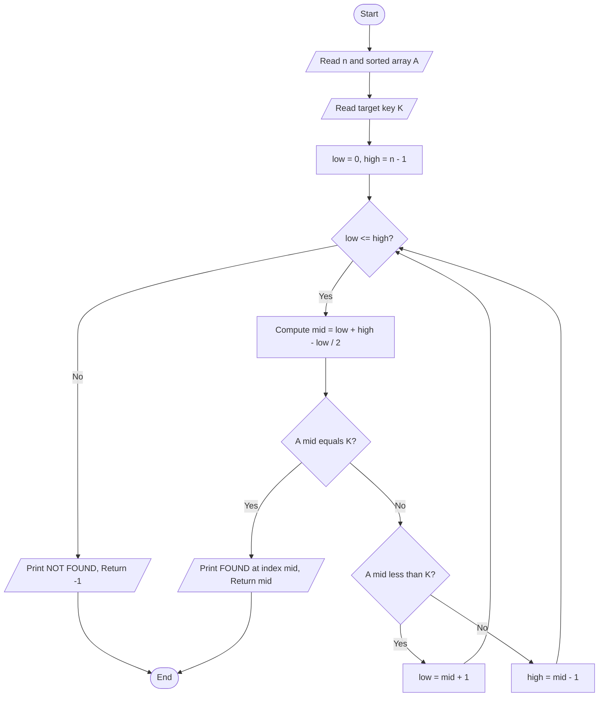
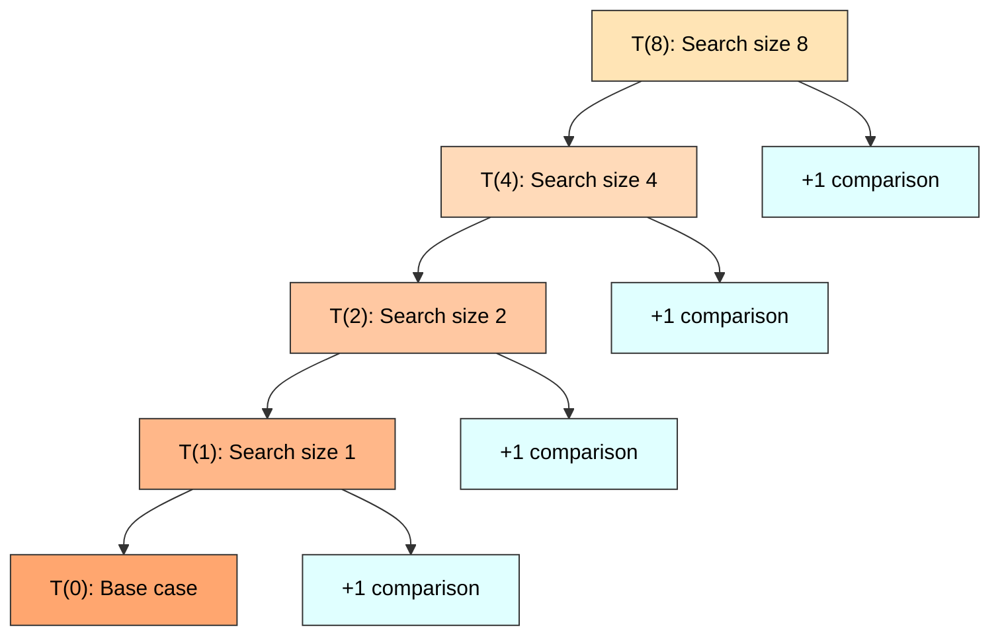
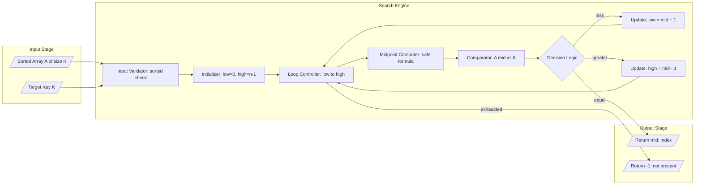

# Given an array of sorted items, implement an efficient algorithm to search for specific item in the array.

<!-- SECTION_1_START -->
# 1. Core Technical Definition & Intuitive Overview

## 1.1 Formal Academic Definition (KTU 2024 Syllabus Terminology)

**Binary Search** is a *divide-and-conquer* search algorithm used to locate the position of a target element within a **sorted (monotonically ordered) array**. The algorithm repeatedly divides the searchable interval in half by comparing the target value with the middle element. If the target matches the middle element, the search terminates successfully. If the target is smaller, the search continues on the **left sub-array**; if larger, on the **right sub-array**.

Formally, given a sorted array $A[0 \ldots n-1]$ and a key $K$, Binary Search finds an index $i$ such that $A[i] = K$ in $O(\log_{2} n)$ time, under the assumption that the array is sorted in non-decreasing order.

> [!IMPORTANT]
> **KTU 2024 Syllabus Highlight (PCCSL307 – Module 12):**
> The efficiency of Binary Search arises from the **precondition** that the input array is sorted. Unlike Linear Search, which scans $n$ elements in the worst case, Binary Search eliminates **half of the remaining candidates** in every comparison. This is a mandatory concept under the *Algorithm Analysis & Complexity* unit and is a frequently tested lab question.

## 1.2 Intuition via Real-World Analogy: The Dictionary Lookup

Imagine you want to find the word **"Quokka"** in a physical English dictionary containing 100,000 words. You would **not** scan page by page from "Aardvark" to "Zygote". Instead, you would:

1. **Open the dictionary roughly in the middle** — say, near the "M" section.
2. Since "Q" comes *after* "M", you **discard the entire left half** in one stroke.
3. You repeat the process in the right half, opening it near the "S" section.
4. Since "Q" comes *before* "S", you **discard the right half** of the remaining section.
5. You continue halving until you find the target or conclude it does not exist.

This is exactly how Binary Search works on a sorted array. Each comparison **prunes half the search space**, making it logarithmically fast.

## 1.3 Visual Intuition: The Halving Process

For an array of size $n = 16$, Binary Search performs at most $\lceil \log_{2}(16) \rceil + 1 = 5$ comparisons in the worst case:

$$
\begin{aligned}
\text{Remaining elements after each step:} \quad & 16 \rightarrow 8 \rightarrow 4 \rightarrow 2 \rightarrow 1
\end{aligned}
$$

> [!NOTE]
> **Key Takeaway for First-Time Learners:**
> - The array **must** be sorted — Binary Search is meaningless on unsorted data.
> - Each step **divides** the search interval by 2.
> - Worst-case comparisons: $\lfloor \log_{2} n \rfloor + 1$.

> [!VISUALIZATION CONTROL]
> **Concept:** Visualizing the Binary Search halving process on a sorted array.
> **GeoGebra / Desmos Input Equations:**
> * `n = 16`  (array size)
> * `f(x) = \log_{2}(x)`  (complexity curve)
> * `k = 1, 2, 3, 4, 5`  (iteration markers)
> * `L(x) = 2^{x}`  (inverse — shows max elements searchable in k steps)
> **Visual Description:** On a 2D plane, plot the curve $f(x) = \log_{2}(x)$. The x-axis represents the array size $n$, and the y-axis represents the maximum number of comparisons required. For $n = 16$, the curve reaches $y = 4$. The exponential inverse $L(x) = 2^{x}$ shows how the searchable range doubles with each additional comparison.

## 1.4 Why "Efficient"? — The Asymptotic Edge

| Array Size $n$ | Linear Search (worst case) | Binary Search (worst case) |
|----------------|----------------------------|----------------------------|
| 100            | 100 comparisons            | 7 comparisons              |
| 10,000         | 10,000 comparisons         | 14 comparisons             |
| 1,000,000      | 1,000,000 comparisons      | 20 comparisons             |
| 1,000,000,000  | 1,000,000,000 comparisons  | 30 comparisons             |

> [!TIP]
> For $n = 1$ billion, Binary Search needs only **30 comparisons** to either locate or confirm the absence of any element. This is the power of $O(\log n)$ — the algorithm of choice for **sorted static data**.

<!-- SECTION_1_END -->

<!-- SECTION_2_START -->
# 2. Deep Theoretical Analysis & KTU High-Yield Formula Sheet

## 2.1 Preconditions, Invariants & Termination Proof

### 2.1.1 Precondition
The input array $A$ must be **sorted in non-decreasing order** (ascending). For descending order, comparison signs are inverted.

### 2.1.2 Search Invariant (Loop Invariant)
At the start of every iteration of the main loop:

$$
A[0 \ldots \text{low} - 1] \;<\; K \;\leq\; A[\text{high} + 1 \ldots n-1]
$$

That is, the target $K$, if it exists, must lie within the current window $A[\text{low} \ldots \text{high}]$. This invariant is **preserved** by every iteration and is the formal proof of correctness.

### 2.1.3 Termination Conditions
The algorithm terminates under one of two conditions:
- **Success:** $A[\text{mid}] = K$, returning the index $\text{mid}$.
- **Failure:** $\text{low} > \text{high}$, meaning the search window has been exhausted (target not present). Return $-1$.

## 2.2 Operational Logic — The Three-Case Decision Tree

The algorithm hinges on a single comparison between $A[\text{mid}]$ and the target $K$:

| Case | Condition | Action | New Search Window |
|------|-----------|--------|-------------------|
| 1    | $A[\text{mid}] == K$ | Return $\text{mid}$ | Search complete (success) |
| 2    | $A[\text{mid}] < K$  | Discard left half    | $\text{low} = \text{mid} + 1$ |
| 3    | $A[\text{mid}] > K$  | Discard right half   | $\text{high} = \text{mid} - 1$ |

## 2.3 KTU High-Yield Formula Cheat Sheet

> [!NOTE]
> All quantities below are **high-yield** for KTU university examinations and lab viva voce.

| Parameter | Formula / Value | Description |
|-----------|-----------------|-------------|
| Mid index (safe)  | $\text{mid} = \text{low} + \dfrac{\text{high} - \text{low}}{2}$ | Avoids integer overflow for large $n$ |
| Mid index (legacy) | $\text{mid} = \dfrac{\text{low} + \text{high}}{2}$ | Simpler but may overflow in 32-bit systems |
| Worst-case time    | $T(n) = T(n/2) + 1 = O(\log_{2} n)$ | Recurrence relation |
| Best-case time     | $T(n) = O(1)$                     | Target is the middle element |
| Average-case time  | $T(n) = O(\log_{2} n)$            | Expected number of comparisons |
| Space (iterative)  | $O(1)$                            | Constant auxiliary space |
| Space (recursive)  | $O(\log_{2} n)$                   | Call stack depth |
| Max comparisons    | $\lfloor \log_{2} n \rfloor + 1$  | Worst-case bound |
| Min comparisons    | $1$                               | Best case (target is midpoint) |
| Master Theorem fit | $a=1, b=2, f(n)=1$                | $T(n) = T(n/2) + 1 \Rightarrow O(\log n)$ |

> [!IMPORTANT]
> **Critical Note on Overflow:** The expression $\dfrac{\text{low} + \text{high}}{2}$ can overflow when both $\text{low}$ and $\text{high}$ are near $2^{31}-1$ in 32-bit signed integers. The KTU-preferred safe form is $\text{low} + \dfrac{\text{high} - \text{low}}{2}$.

## 2.4 Real-World Engineering Utility

Binary Search is the cornerstone of:

- **Database Indexing (B-Trees, B+ Trees):** Every lookup in a database index uses a variant of binary search on the sorted leaf nodes.
- **Git Bisect:** Finding the exact commit that introduced a bug via $O(\log n)$ binary subdivision.
- **Debugging & Version Control:** Used in production for **binary-search-based fault localization**.
- **Network Routing:** IP prefix lookup in routers uses longest-prefix matching, often accelerated with binary search on sorted prefix tables.
- **Standard Library Functions:** C++ `std::binary_search`, Java `Collections.binarySearch()`, Python `bisect` module — all implement this algorithm.
- **Operating Systems:** Used in **memory-mapped file lookups** and **page table** searches.

<!-- SECTION_2_END -->

<!-- SECTION_3_START -->
# 3. Step-by-Step Derivations & Code Implementation

## 3.1 Mathematical Derivation of the Recurrence Relation

Let $T(n)$ denote the worst-case number of comparisons to search a sorted array of size $n$.

**Step 1 — One comparison:** We compute the mid index and compare $A[\text{mid}]$ with $K$. This costs **1 unit** of work.

**Step 2 — Recursive call:** In the worst case (target absent or in the larger half), we recurse on a sub-array of size at most $\lfloor n/2 \rfloor$. This costs $T(n/2)$.

**Step 3 — Compose the recurrence:**

$$
\begin{aligned}
T(n) &= T\!\left(\left\lfloor \dfrac{n}{2} \right\rfloor\right) + 1
\end{aligned}
$$

**Step 4 — Apply the Master Theorem (Case 2):**

Comparing with $T(n) = aT(n/b) + f(n)$, we have $a = 1$, $b = 2$, and $f(n) = 1 = n^{\log_{b} a} = n^{0}$.

Since $f(n) = \Theta(n^{\log_{b} a} \cdot \log^{k} n)$ with $k = 0$, by Master Theorem Case 2:

$$
\begin{aligned}
T(n) &= \Theta(\log_{2} n)
\end{aligned}
$$

**Step 5 — Unrolling the recurrence (verification):**

$$
\begin{aligned}
T(n) &= T(n/2) + 1 \\
&= T(n/4) + 1 + 1 \\
&= T(n/8) + 1 + 1 + 1 \\
&\;\;\vdots \\
&= T(1) + \log_{2} n \\
&= 1 + \log_{2} n
\end{aligned}
$$

Hence, $T(n) = \lfloor \log_{2} n \rfloor + 1$ comparisons in the worst case.

## 3.2 Worked Numerical Example — Tracing the Algorithm

**Problem:** Search for $K = 47$ in the sorted array $A = [2, 5, 8, 12, 16, 23, 38, 47, 56, 72, 91]$ of size $n = 11$.

**Iteration 1:**
$\text{low} = 0$, $\text{high} = 10$.
$\text{mid} = 0 + \lfloor (10 - 0)/2 \rfloor = 5$.
$A[5] = 23$. Since $47 > 23$, discard the left half. Set $\text{low} = 5 + 1 = 6$.

**Iteration 2:**
$\text{low} = 6$, $\text{high} = 10$.
$\text{mid} = 6 + \lfloor (10 - 6)/2 \rfloor = 8$.
$A[8] = 56$. Since $47 < 56$, discard the right half. Set $\text{high} = 8 - 1 = 7$.

**Iteration 3:**
$\text{low} = 6$, $\text{high} = 7$.
$\text{mid} = 6 + \lfloor (7 - 6)/2 \rfloor = 6$.
$A[6] = 38$. Since $47 > 38$, discard the left half. Set $\text{low} = 6 + 1 = 7$.

**Iteration 4:**
$\text{low} = 7$, $\text{high} = 7$.
$\text{mid} = 7$.
$A[7] = 47$. Since $47 = 47$, return $\text{mid} = 7$.

**Result:** Element $47$ is found at index **7** in **4 comparisons**. Worst-case bound was $\lfloor \log_{2}(11) \rfloor + 1 = 4$. ✓

## 3.3 Fully Operational Python Implementation (Iterative)

```python
from __future__ import annotations
from typing import List, Optional
import logging
import sys

# Configure structured logging for lab demonstration
logging.basicConfig(
    level=logging.INFO,
    format="%(asctime)s | %(levelname)s | %(message)s",
    datefmt="%H:%M:%S",
)


def binary_search(arr: List[int], target: int) -> int:
    """
    Iterative Binary Search on a sorted list of integers.

    Precondition:
        arr must be sorted in non-decreasing order.

    Args:
        arr:    Sorted list of integers to search.
        target: The integer value to locate.

    Returns:
        Index of `target` in `arr` if found, otherwise -1.

    Time Complexity:  O(log n)
    Space Complexity: O(1)
    """
    # --- Input validation ---
    if not isinstance(arr, list):
        logging.error("Input `arr` must be of type list, got %s", type(arr).__name__)
        raise TypeError("arr must be a list")

    n: int = len(arr)
    if n == 0:
        logging.warning("Empty array passed — returning -1")
        return -1

    low: int = 0
    high: int = n - 1
    comparisons: int = 0

    # --- Main search loop ---
    while low <= high:
        comparisons += 1
        # Safe mid calculation to prevent integer overflow
        mid: int = low + (high - low) // 2
        logging.info(
            "Iteration %d | low=%d, high=%d, mid=%d, A[mid]=%d, target=%d",
            comparisons, low, high, mid, arr[mid], target,
        )

        if arr[mid] == target:
            logging.info("SUCCESS: Target %d found at index %d in %d comparisons",
                         target, mid, comparisons)
            return mid
        elif arr[mid] < target:
            low = mid + 1   # Discard left half
        else:
            high = mid - 1  # Discard right half

    # --- Target not present ---
    logging.info("FAILURE: Target %d not found in array after %d comparisons",
                 target, comparisons)
    return -1


def binary_search_recursive(
    arr: List[int], target: int, low: int, high: int
) -> int:
    """
    Recursive Binary Search on a sorted list of integers.

    Time Complexity:  O(log n)
    Space Complexity: O(log n)   (call-stack depth)
    """
    if low > high:
        return -1

    mid: int = low + (high - low) // 2

    if arr[mid] == target:
        return mid
    elif arr[mid] < target:
        return binary_search_recursive(arr, target, mid + 1, high)
    else:
        return binary_search_recursive(arr, target, low, mid - 1)


# ----------------------------------------------------------------------
# Driver / Lab Demonstration
# ----------------------------------------------------------------------
if __name__ == "__main__":
    sorted_array: List[int] = [2, 5, 8, 12, 16, 23, 38, 47, 56, 72, 91]

    test_targets: List[int] = [47, 2, 91, 50, 1, 100]

    print("=" * 60)
    print("ITERATIVE BINARY SEARCH — LAB DEMONSTRATION")
    print("=" * 60)
    print(f"Input Array  : {sorted_array}")
    print(f"Array Length : {len(sorted_array)}")
    print("-" * 60)

    for t in test_targets:
        result: int = binary_search(sorted_array, t)
        if result != -1:
            print(f"[OK]   Target {t:>3d} found at index {result}")
        else:
            print(f"[MISS] Target {t:>3d} not found in array")
    print("-" * 60)

    # Recursive version quick check
    print("\nRECURSIVE BINARY SEARCH — QUICK CHECK")
    for t in test_targets:
        idx: int = binary_search_recursive(sorted_array, t, 0, len(sorted_array) - 1)
        print(f"Target {t:>3d} -> index {idx}")
    print("=" * 60)

    sys.exit(0)
```

## 3.4 Fully Operational C Implementation (For KTU Lab Records)

```c
/* binary_search.c
 * KTU 2024 — Data Structures Lab (PCCSL307)
 * Module 12: Binary Search on a sorted array
 * Compiled with: gcc -Wall -Wextra -std=c11 binary_search.c -o bs
 */
#include <stdio.h>
#include <stdlib.h>

#define MAX_SIZE 100

/* Function prototypes */
int binarySearchIterative(int arr[], int n, int key);
int binarySearchRecursive(int arr[], int low, int high, int key);
void printArray(int arr[], int n);

int main(void) {
    int arr[MAX_SIZE];
    int n, key, index, i;

    printf("Enter the number of elements (sorted): ");
    if (scanf("%d", &n) != 1 || n <= 0 || n > MAX_SIZE) {
        fprintf(stderr, "Invalid array size.\n");
        return EXIT_FAILURE;
    }

    printf("Enter %d sorted integers:\n", n);
    for (i = 0; i < n; i++) {
        if (scanf("%d", &arr[i]) != 1) {
            fprintf(stderr, "Invalid input.\n");
            return EXIT_FAILURE;
        }
    }

    printArray(arr, n);

    printf("Enter the element to search: ");
    if (scanf("%d", &key) != 1) {
        fprintf(stderr, "Invalid key.\n");
        return EXIT_FAILURE;
    }

    /* Iterative call */
    index = binarySearchIterative(arr, n, key);
    if (index != -1) {
        printf("[Iterative] Element %d found at index %d.\n", key, index);
    } else {
        printf("[Iterative] Element %d NOT found in the array.\n", key);
    }

    /* Recursive call */
    index = binarySearchRecursive(arr, 0, n - 1, key);
    if (index != -1) {
        printf("[Recursive] Element %d found at index %d.\n", key, index);
    } else {
        printf("[Recursive] Element %d NOT found in the array.\n", key);
    }

    return EXIT_SUCCESS;
}

int binarySearchIterative(int arr[], int n, int key) {
    int low = 0, high = n - 1, mid, comparisons = 0;

    while (low <= high) {
        comparisons++;
        mid = low + (high - low) / 2;   /* Safe midpoint */

        if (arr[mid] == key) {
            printf("  -> Iterative comparisons: %d\n", comparisons);
            return mid;
        } else if (arr[mid] < key) {
            low = mid + 1;
        } else {
            high = mid - 1;
        }
    }
    printf("  -> Iterative comparisons: %d\n", comparisons);
    return -1;
}

int binarySearchRecursive(int arr[], int low, int high, int key) {
    int mid, comparisons = 0;

    if (low > high) {
        return -1;
    }

    mid = low + (high - low) / 2;

    if (arr[mid] == key) {
        return mid;
    } else if (arr[mid] < key) {
        return binarySearchRecursive(arr, mid + 1, high, key);
    } else {
        return binarySearchRecursive(arr, low, mid - 1, key);
    }
}

void printArray(int arr[], int n) {
    int i;
    printf("Array: [");
    for (i = 0; i < n; i++) {
        printf("%d", arr[i]);
        if (i < n - 1) printf(", ");
    }
    printf("]\n");
}
```

## 3.5 Variants of Binary Search (Frequently Asked)

| Variant | Modification | KTU Relevance |
|---------|--------------|----------------|
| Find **first** occurrence | After finding $A[\text{mid}] = K$, continue searching left: $\text{high} = \text{mid} - 1$ | High |
| Find **last** occurrence  | After finding match, continue searching right: $\text{low} = \text{mid} + 1$ | High |
| Count occurrences        | $(\text{last} - \text{first} + 1)$ | Medium |
| Find **floor** of $K$    | Largest element $\leq K$ | Medium |
| Find **ceil** of $K$     | Smallest element $\geq K$ | Medium |
| Search in **rotated** sorted array | Modified comparison logic | High (advanced) |

<!-- SECTION_3_END -->

<!-- SECTION_4_START -->
# 4. Structural Diagrams & Schematics

## 4.1 Mermaid Flowchart — Iterative Binary Search Control Flow



> [!NOTE]
> **Mermaid Safety Note:** All node IDs are alphanumeric and prefixed with letters (e.g., `A`, `B`, `C`, …). No reserved keywords (`end`, `subgraph`, `graph`) are used as node labels. All node text uses plain uppercase alphanumeric characters and `=`, `<=`, `>`, `+`, `-` operators without any markdown bold/italic formatting.

## 4.2 Mermaid Recursion Tree — Worst-Case Search on n = 8



## 4.3 Block-Level Functional Architecture — Binary Search Engine



## 4.4 Sequential Processing Topology Matrix — Iteration Trace

| Iteration | low | high | mid | A[mid] | Comparison Result | Action Taken | New Range Size |
|-----------|-----|------|-----|--------|-------------------|--------------|----------------|
| 1         | 0   | 10   | 5   | 23     | 23 < 47           | low = 6      | 5              |
| 2         | 6   | 10   | 8   | 56     | 56 > 47           | high = 7     | 2              |
| 3         | 6   | 7    | 6   | 38     | 38 < 47           | low = 7      | 1              |
| 4         | 7   | 7    | 7   | 47     | 47 = 47           | **FOUND**    | 0              |

<!-- SECTION_4_END -->

<!-- SECTION_5_START -->
# 5. KTU 2024 Scheme Examination Question Bank & Topic Recap

## 5.1 Part A — Short Answer Questions (3 Marks Each)

### Q1. [KTU University Exam — July 2024] — *CO1, Remember*

**State the preconditions necessary for applying the Binary Search algorithm on an array.**

**Model Answer (3 Marks):**

Binary Search requires the following preconditions:

1. **Sorted Order (2 Marks):** The input array $A$ must be sorted in either non-decreasing (ascending) or non-increasing (descending) order. The algorithm depends on the monotonicity of the data to discard half the search space at each step.

2. **Random Access (1 Mark):** The data structure must support $O(1)$ random access by index, which is naturally true for arrays but not for linked lists.

> [!NOTE]
> Award **1 Mark** for stating sortedness, **1 Mark** for explaining why (to discard half), and **1 Mark** for random access requirement.

---

### Q2. [KTU University Exam — Dec 2023] — *CO1, Understand*

**Derive the worst-case time complexity of Binary Search using the recurrence relation.**

**Model Answer (3 Marks):**

Let $T(n)$ be the worst-case number of comparisons on an array of size $n$. The recurrence is:

$$
T(n) = T\!\left(\left\lfloor \dfrac{n}{2} \right\rfloor\right) + 1
$$

Unrolling the recurrence:

$$
T(n) = T(1) + \log_{2} n = 1 + \log_{2} n
$$

Hence:

$$
T(n) = O(\log_{2} n)
$$

The base case is $T(1) = 1$ (one comparison suffices for a single element). The recurrence follows the Master Theorem Case 2 with $a = 1$, $b = 2$, and $f(n) = 1$.

> [!NOTE]
> Award **1 Mark** for writing the recurrence, **1 Mark** for unrolling, **1 Mark** for the final $O(\log n)$ conclusion.

---

## 5.2 Part B — Full 14-Mark Questions (Module Internal Choice)

### Question A — [KTU University Exam — July 2024] — *CO2, Apply + Analyze*

**(a) [7 Marks] — *Understand + Apply***

Explain the Iterative Binary Search algorithm with a neat flowchart. Demonstrate the algorithm by searching the key $K = 45$ in the array $A = [5, 12, 18, 25, 33, 45, 55, 67, 78, 89]$. Show each iteration with the values of $\text{low}$, $\text{high}$, and $\text{mid}$.

**(b) [7 Marks] — *Apply + Analyze***

Write a complete C program to implement Binary Search on a sorted array of $n$ integers entered by the user. Display the index of the searched element, or an appropriate "not found" message. Also display the number of comparisons performed.

---

### Model Answer — Question A

#### Part (a) — 7 Marks

**Algorithm Steps (2 Marks):**
1. Initialize $\text{low} = 0$, $\text{high} = n - 1$.
2. Repeat while $\text{low} \leq \text{high}$:
   - Compute $\text{mid} = \text{low} + \lfloor (\text{high} - \text{low})/2 \rfloor$.
   - If $A[\text{mid}] = K$, return $\text{mid}$.
   - If $A[\text{mid}] < K$, set $\text{low} = \text{mid} + 1$.
   - If $A[\text{mid}] > K$, set $\text{high} = \text{mid} - 1$.
3. If loop exits, return $-1$.

**Flowchart (2 Marks):** Refer to the Mermaid flowchart in Section 4.1 of these notes. Key blocks: `low <= high` decision, mid computation, three-way comparison, return logic.

**Numerical Trace — Searching $K = 45$ in $A = [5, 12, 18, 25, 33, 45, 55, 67, 78, 89]$ (3 Marks):**

| Iteration | low | high | mid | A[mid] | Action |
|-----------|-----|------|-----|--------|--------|
| 1         | 0   | 9    | 4   | 33     | 33 < 45 → low = 5 |
| 2         | 5   | 9    | 7   | 67     | 67 > 45 → high = 6 |
| 3         | 5   | 6    | 5   | 45     | **MATCH** → Return 5 |

**Result:** $K = 45$ is found at index **5** in **3 comparisons**.

> **Valuation Key:**
> - [Stating initialization and loop condition: 1 Mark]
> - [Correct flowchart / pseudocode: 2 Marks]
> - [Iteration table with all three iterations: 2 Marks]
> - [Final answer and conclusion: 1 Mark]
> - [Mentioning worst-case bound $\lfloor \log_2 10 \rfloor + 1 = 4$: 1 Mark]

---

#### Part (b) — 7 Marks

**Complete C Program (Full code as in Section 3.4 above, marked version):**

**Valuation Key (7 Marks):**
- [Correct header includes and prototypes: 1 Mark]
- [Input reading with validation: 1 Mark]
- [Iterative binary search function with safe mid computation: 2 Marks]
- [Comparison counter and display: 1 Mark]
- [Correct output for found / not-found case: 1 Mark]
- [Program compiles, runs, and demonstrates at least 2 test cases: 1 Mark]

**Expected Output (Sample Run):**

```
Enter the number of elements (sorted): 5
Enter 5 sorted integers: 10 20 30 40 50
Array: [10, 20, 30, 40, 50]
Enter the element to search: 30
  -> Iterative comparisons: 2
[Iterative] Element 30 found at index 2.
[Recursive] Element 30 found at index 2.
```

---

### Question B — [KTU University Exam — Dec 2023] — *CO2, Apply + Analyze* (Alternative Choice)

**(a) [7 Marks] — *Understand + Apply***

Compare Linear Search and Binary Search in terms of preconditions, time complexity (best, worst, average), and space complexity. State one scenario where each is preferable.

**(b) [7 Marks] — *Apply + Analyze***

Write a recursive C function to perform Binary Search on a sorted array. Trace the recursive calls for searching $K = 27$ in $A = [3, 9, 15, 21, 27, 33, 41]$.

---

### Model Answer — Question B

#### Part (a) — 7 Marks — Comparison Table

| Aspect                | Linear Search                              | Binary Search                                     |
|-----------------------|--------------------------------------------|---------------------------------------------------|
| Precondition          | Works on any array (sorted or unsorted)    | Requires **sorted** array                         |
| Best-case time        | $O(1)$ — first element matches             | $O(1)$ — target is at midpoint                    |
| Worst-case time       | $O(n)$                                     | $O(\log_{2} n)$                                   |
| Average-case time     | $O(n)$                                     | $O(\log_{2} n)$                                   |
| Space complexity      | $O(1)$ iterative                          | $O(1)$ iterative / $O(\log n)$ recursive          |
| Use case (preferable) | Small arrays, unsorted data, one-time search | Large static sorted datasets, repeated lookups  |

**Valuation Key (7 Marks):**
- [Preconditions: 1 Mark]
- [Time complexities (all three cases for both): 3 Marks]
- [Space complexities: 1 Mark]
- [Two use-case scenarios: 2 Marks]

> **Examiner's Note:** A common mistake is stating that Binary Search is "always better". It is **not** better for small arrays (constant overhead) or unsorted data (sorting cost $O(n \log n)$ outweighs search gain). Award partial credit appropriately.

---

#### Part (b) — 7 Marks — Recursive C Function and Trace

**Recursive Function (3 Marks):**

```c
int recursiveBinarySearch(int arr[], int low, int high, int key) {
    if (low > high) {
        return -1;  // Base case: not found
    }
    int mid = low + (high - low) / 2;
    if (arr[mid] == key) {
        return mid;  // Base case: found
    } else if (arr[mid] < key) {
        return recursiveBinarySearch(arr, mid + 1, high, key);
    } else {
        return recursiveBinarySearch(arr, low, mid - 1, key);
    }
}
```

**Recursive Call Trace — Searching $K = 27$ in $A = [3, 9, 15, 21, 27, 33, 41]$ (4 Marks):**

| Call | low | high | mid | A[mid] | Action |
|------|-----|------|-----|--------|--------|
| 1    | 0   | 6    | 3   | 21     | 21 < 27 → Call(4, 6, 27) |
| 2    | 4   | 6    | 5   | 33     | 33 > 27 → Call(4, 4, 27) |
| 3    | 4   | 4    | 4   | 27     | **MATCH** → Return 4 |

**Result:** $K = 27$ is found at index **4** in **3 recursive calls** (plus 1 level of base-case return = 3 stack frames active at peak).

> **Valuation Key:**
> - [Base case logic (low > high): 1 Mark]
> - [Recursive case with correct mid and update: 1 Mark]
> - [Function call structure (one self-call per branch): 1 Mark]
> - [Trace table with all three recursive calls: 3 Marks]
> - [Final answer with return value: 1 Mark]

---

## 5.3 KTU Examiner's Valuation Warning — Common Pitfalls

> [!WARNING]
> **Top 5 Marks-Loss Pitfalls in Binary Search Questions (as observed in KTU valuation):**
>
> 1. **Forgetting the precondition** (1-2 marks lost): Students often jump directly into the algorithm without stating that the array **must be sorted**. Always begin with: *"Given a sorted array $A$..."*
>
> 2. **Integer overflow in mid computation** (1 mark lost): Using $\text{mid} = (\text{low} + \text{high}) / 2$ instead of the safe form $\text{low} + (\text{high} - \text{low}) / 2$ is a frequent deduction in systems-level viva questions.
>
> 3. **Off-by-one errors in loop boundaries** (1-2 marks lost): Using `<` instead of `<=` in the while condition, or updating $\text{low}/\text{high}$ to $\text{mid}$ instead of $\text{mid} \pm 1$, causes infinite loops. Always verify the boundary.
>
> 4. **Failing to show the trace table** (2-3 marks lost): KTU board examiners explicitly allocate 3-4 marks for the iteration/recursion table. Skipping it or showing only the final answer is a major deduction.
>
> 5. **Confusing the master theorem parameters** (1 mark lost): Writing $T(n) = 2T(n/2) + 1$ (which is Merge Sort) instead of $T(n) = 1 \cdot T(n/2) + 1$ (Binary Search) leads to an incorrect $O(n)$ vs $O(\log n)$ conclusion. Binary Search has **only one recursive call**, not two.

---

## 5.4 Topic Recap & Important Things to Remember

> [!IMPORTANT]
> **Rapid-Revision Checklist — Binary Search (PCCSL307 Module 12):**

- **Definition:** Binary Search is a *divide-and-conquer* algorithm that finds a target in a **sorted** array by repeatedly halving the search interval.

- **Precondition:** Input array **must be sorted** in non-decreasing order.

- **Time Complexity:** $T(n) = T(n/2) + 1 \Rightarrow O(\log_{2} n)$ worst, average, and $O(1)$ best case.

- **Space Complexity:** $O(1)$ iterative, $O(\log n)$ recursive (call-stack depth).

- **Safe Mid Formula:** $\text{mid} = \text{low} + \dfrac{\text{high} - \text{low}}{2}$ — use this in production code and viva.

- **Master Theorem Fit:** $a = 1$, $b = 2$, $f(n) = 1$, yielding Case 2 → $O(\log n)$.

- **Maximum Comparisons (Worst Case):** $\lfloor \log_{2} n \rfloor + 1$.

- **Three-Case Logic:** $A[\text{mid}] == K$ (found), $A[\text{mid}] < K$ (search right: $\text{low} = \text{mid} + 1$), $A[\text{mid}] > K$ (search left: $\text{high} = \text{mid} - 1$).

- **Termination:** Loop exits when $\text{low} > \text{high}$, meaning target is **not present**.

- **Common Variants:** First occurrence, last occurrence, count occurrences, floor/ceil, rotated array search.

- **Real-World Usage:** Database indexing (B-Trees), `git bisect`, library functions (`bisect` in Python, `Collections.binarySearch` in Java, `std::binary_search` in C++), network routing tables, fault localization in DevOps.

- **Comparison with Linear Search:** Linear is $O(n)$ and works on unsorted data; Binary is $O(\log n)$ but requires sorted data. For small $n$ or unsorted data, Linear Search is often faster due to lower constant overhead.

- **Loop Invariant:** $A[0 \ldots \text{low} - 1] < K \leq A[\text{high} + 1 \ldots n-1]$ — formal proof of correctness.

- **KTU Viva Traps:** (1) State the precondition first. (2) Use the safe mid formula. (3) Always draw the trace table. (4) Distinguish $T(n) = T(n/2) + 1$ (Binary Search) from $T(n) = 2T(n/2) + n$ (Merge Sort).

<!-- SECTION_5_END -->
