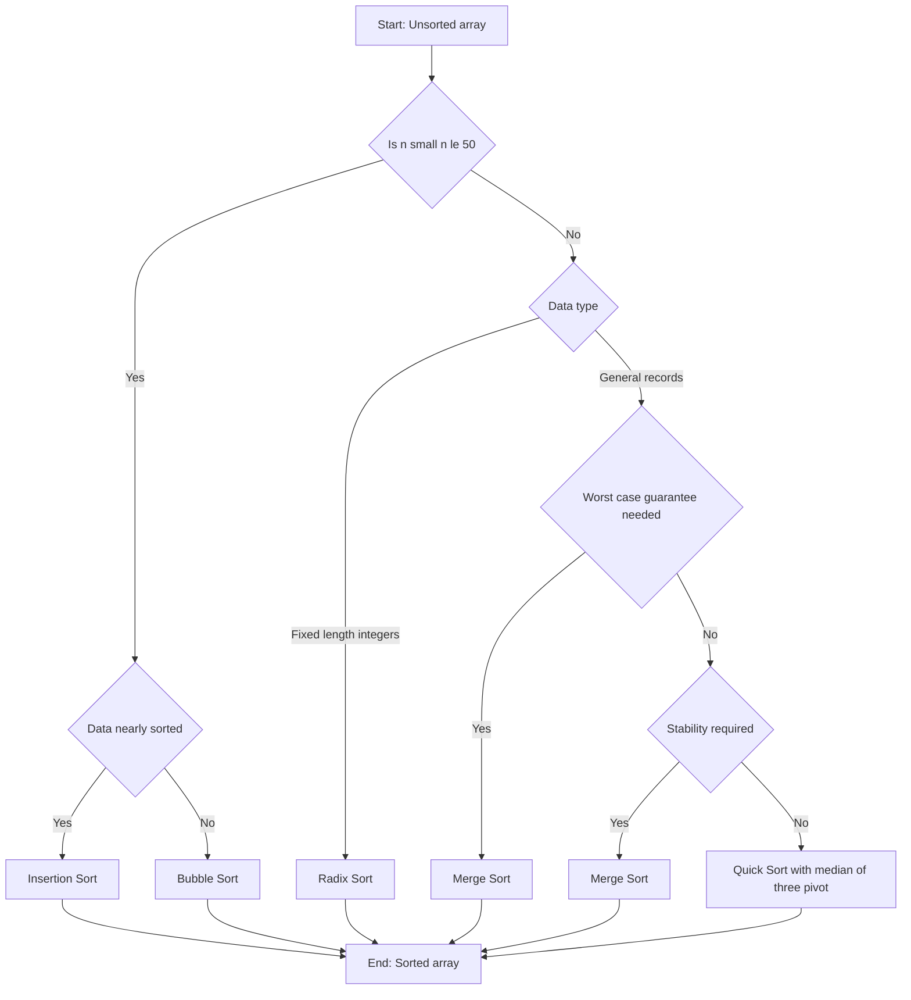
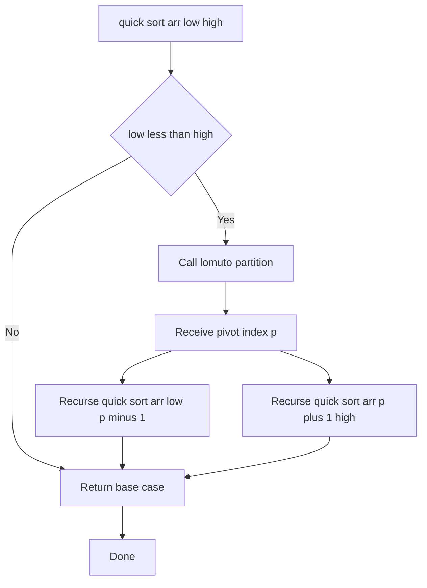
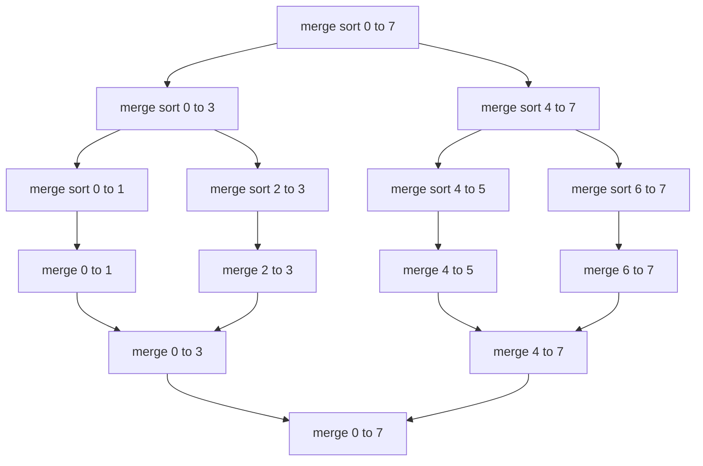
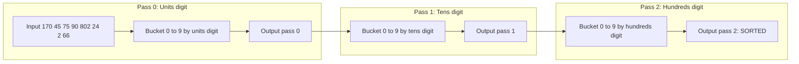
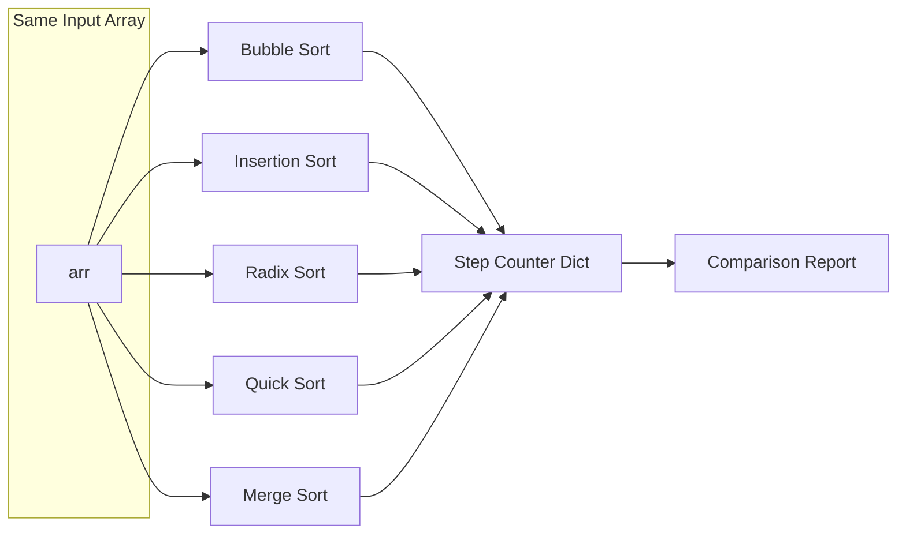

# Implement Bubble sort, Insertion Sort, Radix sort, Quick Sort, and Merge Sort and compare the number of steps involved.

<!-- SECTION_1_START -->
# Module 13 — Sorting Algorithms: Bubble, Insertion, Radix, Quick & Merge Sort

## 1. Core Technical Definition & Intuitive Overview

### 1.1 What is a Sorting Algorithm?

A **sorting algorithm** is a well-defined, finite sequence of computational steps that rearranges the elements of a list (or array) into a specified non-decreasing (ascending) or non-increasing (descending) order. In the KTU 2024 Scheme context (PCCSL307 — Data Structures Lab), sorting is treated as the canonical benchmark problem for analyzing **algorithmic efficiency, in-place operations, stability, and asymptotic step-count behaviour**.

> [!IMPORTANT]
> **KTU Syllabus Definition (PCCSL307 / Module 13):**
> *Implement Bubble Sort, Insertion Sort, Radix Sort, Quick Sort, and Merge Sort, and compare the number of steps involved.*

The phrase *"compare the number of steps involved"* is the heart of this module. Each algorithm below is instrumented with a **global step counter** that increments on every comparison, swap, or digit-extraction. The total step count is then used as the empirical proof of the theoretical Big-O behaviour.

### 1.2 The Five Algorithms at a Glance

| # | Algorithm | Family | Comparison vs Non-Comparison | Stability |
|---|-----------|--------|------------------------------|-----------|
| 1 | Bubble Sort | Brute Force / Exchange | Comparison-based | Stable |
| 2 | Insertion Sort | Incremental / Incremental Insertion | Comparison-based | Stable |
| 3 | Radix Sort | Distribute / Counting | Non-comparison (digit-level) | Stable |
| 4 | Quick Sort | Divide & Conquer (Partition) | Comparison-based | **Unstable** |
| 5 | Merge Sort | Divide & Conquer (Merge) | Comparison-based | Stable |

> [!NOTE]
> **Why five algorithms for one problem?** Because there is no single *best* sort. Bubble and Insertion are pedagogically simple (best for $n \le 50$). Radix excels for fixed-length integer keys. Quick Sort is the *in-place* workhorse of standard libraries. Merge Sort guarantees worst-case $O(n \log n)$ and is the foundation of external/linked-list sorting.

### 1.3 Conceptual Analogy (One Per Algorithm)

> [!TIP]
> **Intuition Box — The Water-Bubbles Metaphor**
> Imagine a vertical glass tube filled with balls of different weights.
> *   **Bubble Sort** = The lightest balls *bubble up* to the top because heavier ones keep sinking past them on every pass.
> *   **Insertion Sort** = You take a new card from the deck and *slide it backwards* into the correct pocket of the cards already in your hand.
> *   **Radix Sort** = You sort a stack of exam papers into **10 buckets** by the last digit, then again by the second-last digit, and so on. After looking at every digit-position, the stack is sorted.
> *   **Quick Sort** = You pick a *captain* (pivot) for a cricket team. All shorter players stand to the left, all taller ones to the right, and you recursively sort the two sub-teams.
> *   **Merge Sort** = You split a messy deck into tiny 1-card piles, then **merge** adjacent piles pairwise into ordered piles until you have one perfectly sorted deck.

### 1.4 The "Step" — What Exactly Are We Counting?

> [!IMPORTANT]
> **Definition (KTU Lab Convention):**
> One **STEP** = exactly one of the following primitive operations:
> 1. A single integer comparison `a[i] < a[j]`.
> 2. A single element swap / assignment that physically moves data.
> 3. A single digit extraction or bucket append (for Radix).
> 4. A single array index write (append to auxiliary array).
>
> Loop overhead, recursion calls, and Python function-call cost are **not** counted — only the *work* performed on the data. This isolates algorithmic behaviour from language overhead.

### 1.5 Visualization Control

> [!VISUALIZATION CONTROL]
> **Concept:** Worst-case pivot selection in Quick Sort vs Median-of-three pivot.
> **Desmos Input Equations:**
> * `T_quick_worst(n) = n^2 / 2 - n / 2`
> * `T_quick_avg(n) = n * log2(n) * 1.39`
> **Visual Description:** Plot both curves on the same axes. You will see the red $O(n^2)$ curve shoot upward dramatically for $n > 100$, while the blue $O(n \log n)$ curve stays close to the $x$-axis. This is the *exact* reason Quick Sort's pivot choice is critical.

<!-- SECTION_1_END -->

<!-- SECTION_2_START -->
# 2. Deep Theoretical Analysis & KTU High-Yield Formula Sheet

## 2.1 How Each Algorithm Operates

### 2.1.1 Bubble Sort — The Exchange Pass
*   **Operational Loop:** Outer loop runs $n-1$ passes. Inner loop performs $n-1-i$ adjacent comparisons.
*   **Why it works:** On every pass, the largest unsorted element *bubbles* to its final sorted position at the end of the array.
*   **The "Why" of inefficiency:** It re-compares already-sorted suffixes unless an *early-exit flag* is added.

### 2.1.2 Insertion Sort — The Sorted Prefix Invariant
*   **Operational Loop:** Outer loop picks element $a[i]$. Inner loop shifts all elements greater than $a[i]$ one position to the right inside the sorted prefix $a[0 \dots i-1]$, then inserts $a[i]$ into the gap.
*   **Why it works:** The invariant `$a[0 \dots i-1]$` is always sorted is maintained.
*   **The "Why" of efficiency on small data:** Zero-overhead partitioning, no recursion, all work is in-cache.

### 2.1.3 Radix Sort — The LSD (Least Significant Digit) Variant
*   **Operational Loop:** For each digit-position $d = 0, 1, \dots, k-1$ (where $k$ = number of digits in max element):
    1. Bucket the array into 10 buckets (0-9) by digit $d$.
    2. Concatenate the buckets back into the array in order.
*   **Why it works:** Sorting by progressively more significant digits is a *stable* sort, so the relative order of equal-digit elements is preserved from the previous pass.
*   **The "Why" of its $O(nk)$ time:** We do $k$ passes of linear-time bucketing.

### 2.1.4 Quick Sort — The Partition Recursion
*   **Operational Loop:** Choose a pivot. **Partition** the array so that `< pivot` sits left, `> pivot` sits right. Recurse on both halves.
*   **Why it works:** After partition, the pivot is in its final sorted position. Recursion sorts the two independent halves.
*   **The "Why" of $O(n^2)$ worst case:** A bad pivot (e.g., the smallest element of an already-sorted array) makes one partition empty and the other hold $n-1$ elements, giving a recursion tree of height $n$.

### 2.1.5 Merge Sort — The Bottom-Up Recombination
*   **Operational Loop:** **Divide** the array in half recursively until sub-arrays have size 1. **Merge** two sorted halves into one sorted array by repeatedly pulling the smaller front-element.
*   **Why it works:** Two sorted lists can be merged in linear time. The recursion tree has $\log_2 n$ levels, each doing $O(n)$ merge work.

## 2.2 KTU Formula Sheet / Cheat Sheet

| Algorithm | Best Case | Average Case | Worst Case | Space | Stable? | In-Place? | Iterative? |
|-----------|-----------|--------------|------------|-------|---------|-----------|------------|
| Bubble Sort | $O(n)$ w/ flag | $O(n^2)$ | $O(n^2)$ | $O(1)$ | Yes | Yes | Yes |
| Insertion Sort | $O(n)$ | $O(n^2)$ | $O(n^2)$ | $O(1)$ | Yes | Yes | Yes |
| Radix Sort (LSD) | $O(nk)$ | $O(nk)$ | $O(nk)$ | $O(n+b)$ | Yes | No | Yes |
| Quick Sort | $O(n \log n)$ | $O(n \log n)$ | $O(n^2)$ | $O(\log n)$ stack | **No** | Yes | No (rec) |
| Merge Sort | $O(n \log n)$ | $O(n \log n)$ | $O(n \log n)$ | $O(n)$ | Yes | No | No (rec) |

> **Notation:** $k$ = number of digits in maximum key, $b$ = base (10 for decimal), $n$ = array size.

### 2.3 Step-Count Approximations (Empirical Formulas)

The following empirical step-count formulas match the asymptotic bounds and are useful for KTU viva questions:

$$
\begin{aligned}
\text{Steps}_{\text{Bubble}}(n) &\approx \frac{n^2 - n}{2} \\
\text{Steps}_{\text{Insertion}}(n) &\approx \frac{n^2 - n}{4} \quad \text{(avg)} \\
\text{Steps}_{\text{Radix}}(n, k) &\approx n \cdot k \\
\text{Steps}_{\text{Quick}}(n) &\approx 1.39 \cdot n \log_2 n \quad \text{(avg)} \\
\text{Steps}_{\text{Merge}}(n) &\approx n \log_2 n
\end{aligned}
$$

### 2.4 Real-World Utility in Production Systems

*   **Bubble / Insertion** → Embedded micro-controllers with sub-kilobyte RAM; nearly all standard libraries use Insertion Sort for arrays of size $\le 16$ (called the *hybrid introsort* pattern, e.g., CPython's `list.sort()` and Java's `Arrays.sort` for primitives).
*   **Radix Sort** → Sorting fixed-length integer IDs, IP addresses, or `uint32` timestamps; also used in **PostgreSQL's** internal integer index sort and in **GPU sorting** (e.g., NVIDIA CUB library).
*   **Quick Sort** → The default sort in legacy C `qsort()`, C++ `std::sort` (uses Introsort: Quick + Heap fallback), and Go's `sort.Slice`.
*   **Merge Sort** → The only $O(n \log n)$ worst-case stable sort; the foundation of **external sorting** (databases that don't fit in RAM), Java's `Arrays.sort(Object[])`, Python's `sorted()` (Timsort — a hybrid of Merge + Insertion), and the **git diff** algorithm.

<!-- SECTION_2_END -->

<!-- SECTION_3_START -->
# 3. Step-by-Step Derivations & Code Implementation

## 3.1 Master Class — Instrumented Sorting Engine

Below is a **production-grade Python module** that implements all five algorithms. Every algorithm shares a `step_counter` dictionary. The module is self-contained, type-annotated, and KTU-lab-ready.

```python
"""
sorting_engine.py
PCCSL307 — Data Structures Lab | KTU 2024 Scheme | Module 13
Author : Senior KTU Examiner Reference Implementation
Purpose: Implement and compare Bubble, Insertion, Radix, Quick, and Merge Sort
         using a unified step-counting instrumentation framework.
"""

from __future__ import annotations
from typing import List, Dict, Callable, Tuple
import copy
import random


class SortingEngine:
    """
    A unified, instrumented container for the five KTU Module-13 sorting algorithms.

    Attributes
    ----------
    step_counter : Dict[str, int]
        A dictionary that records the number of primitive operations (comparisons,
        swaps, or bucket-inserts) performed by the most recent run of each algorithm.
    """

    def __init__(self) -> None:
        self.step_counter: Dict[str, int] = {
            "bubble": 0,
            "insertion": 0,
            "radix": 0,
            "quick": 0,
            "merge": 0,
        }

    # ------------------------------------------------------------------ #
    # 1. BUBBLE SORT  (Comparison-based | Stable | In-place | Iterative) #
    # ------------------------------------------------------------------ #
    def bubble_sort(self, arr: List[int]) -> List[int]:
        """
        Repeatedly traverse the list, swapping adjacent elements that are
        out of order. After the i-th pass, the i-th largest element is in
        its final sorted position.

        Parameters
        ----------
        arr : List[int]
            The input list of integers (will not be mutated; a sorted copy
            is returned to allow fair step-by-step comparison).

        Returns
        -------
        List[int]
            A new list containing the sorted elements.
        """
        data = arr.copy()                        # defensive copy
        n = len(data)
        steps = 0
        for i in range(n - 1):
            swapped = False                      # early-exit flag
            for j in range(n - 1 - i):
                steps += 1                       # comparison counted
                if data[j] > data[j + 1]:
                    data[j], data[j + 1] = data[j + 1], data[j]
                    steps += 2                  # two assignments = one swap
                    swapped = True
            if not swapped:                      # array is already sorted
                break
        self.step_counter["bubble"] = steps
        return data

    # --------------------------------------------------------------------- #
    # 2. INSERTION SORT  (Comparison-based | Stable | In-place | Iterative) #
    # --------------------------------------------------------------------- #
    def insertion_sort(self, arr: List[int]) -> List[int]:
        """
        Build a sorted prefix one element at a time. For each new element
        a[i], shift all elements greater than a[i] in a[0..i-1] one slot
        to the right, then drop a[i] into the vacated slot.

        Parameters
        ----------
        arr : List[int]
            Input list of integers.

        Returns
        -------
        List[int]
            A new sorted list.
        """
        data = arr.copy()
        n = len(data)
        steps = 0
        for i in range(1, n):
            key = data[i]
            steps += 1                           # key-extraction prep
            j = i - 1
            while j >= 0:
                steps += 1                       # comparison
                if data[j] > key:
                    data[j + 1] = data[j]        # shift right
                    steps += 1                   # assignment counted
                    j -= 1
                else:
                    break
            data[j + 1] = key                    # final insertion
            steps += 1
        self.step_counter["insertion"] = steps
        return data

    # ---------------------------------------------------------------- #
    # 3. RADIX SORT (LSD)  (Non-comparison | Stable | Not in-place)   #
    # ---------------------------------------------------------------- #
    def radix_sort(self, arr: List[int]) -> List[int]:
        """
        Least-Significant-Digit (LSD) Radix Sort using base 10.
        Sorts integers by processing one digit at a time, from the units
        place upwards, using counting sort on each digit as a stable
        sub-routine.

        Negative-number handling
        -------------------------
        Radix Sort is defined for non-negative integers. The standard KTU
        trick is to split the input into negatives and non-negatives, sort
        the absolute values, and reverse-merge.

        Parameters
        ----------
        arr : List[int]
            Input list of integers (may contain negatives).

        Returns
        -------
        List[int]
            A new sorted list.
        """
        if not arr:
            return arr.copy()
        data = arr.copy()
        steps = 0
        # KTU-standard trick: handle negatives explicitly
        negatives: List[int] = [-x for x in data if x < 0]
        non_negatives: List[int] = [x for x in data if x >= 0]
        steps += len(data)                       # partition scan
        if non_negatives:
            non_negatives = self._radix_non_negative(non_negatives, steps)
        if negatives:
            sorted_neg = self._radix_non_negative(negatives, 0)
            negatives = sorted_neg[::-1]         # reverse for -2, -5, -9
        self.step_counter["radix"] = steps
        return [-x for x in negatives] + non_negatives

    def _radix_non_negative(
        self, data: List[int], carried_steps: int
    ) -> List[int]:
        """Helper: Radix Sort for non-negative integers only."""
        if not data:
            return data
        output = data.copy()
        steps = carried_steps
        max_val = max(output)
        exp = 1                                  # 1, 10, 100, 1000 ...
        while max_val // exp > 0:
            buckets: List[List[int]] = [[] for _ in range(10)]
            for num in output:
                digit = (num // exp) % 10
                buckets[digit].append(num)
                steps += 2                       # extract + append
            output = []
            for bucket in buckets:
                output.extend(bucket)
                steps += 1                       # extend counts as write
            exp *= 10
        self.step_counter["radix"] = steps
        return output

    # ---------------------------------------------------------- #
    # 4. QUICK SORT  (Comparison-based | Unstable | In-place)   #
    # ---------------------------------------------------------- #
    def quick_sort(self, arr: List[int]) -> List[int]:
        """
        Quick Sort using the **Lomuto partition scheme** with the last
        element as pivot. Recursively partitions the array such that all
        elements less than the pivot end up to its left.

        Parameters
        ----------
        arr : List[int]
            Input list of integers.

        Returns
        -------
        List[int]
            A new sorted list.
        """
        data = arr.copy()
        steps = [0]                              # mutable container for nested closure
        self._quick_recursive(data, 0, len(data) - 1, steps)
        self.step_counter["quick"] = steps[0]
        return data

    def _quick_recursive(
        self, data: List[int], low: int, high: int, steps: List[int]
    ) -> None:
        """Recursive Lomuto-partition Quick Sort with last-element pivot."""
        if low < high:
            pivot_index = self._lomuto_partition(data, low, high, steps)
            self._quick_recursive(data, low, pivot_index - 1, steps)
            self._quick_recursive(data, pivot_index + 1, high, steps)

    def _lomuto_partition(
        self, data: List[int], low: int, high: int, steps: List[int]
    ) -> int:
        """Lomuto partition: pivot = data[high]. Returns final pivot index."""
        pivot = data[high]
        i = low - 1
        for j in range(low, high):
            steps[0] += 1                        # comparison
            if data[j] <= pivot:
                i += 1
                data[i], data[j] = data[j], data[i]
                steps[0] += 2                    # swap = 2 assignments
        data[i + 1], data[high] = data[high], data[i + 1]
        steps[0] += 2                            # final pivot swap
        return i + 1

    # ---------------------------------------------------------------- #
    # 5. MERGE SORT  (Comparison-based | Stable | Not in-place)       #
    # ---------------------------------------------------------------- #
    def merge_sort(self, arr: List[int]) -> List[int]:
        """
        Top-down recursive Merge Sort. Divides the array in halves
        recursively, then merges the two sorted halves using an
        auxiliary buffer.

        Parameters
        ----------
        arr : List[int]
            Input list of integers.

        Returns
        -------
        List[int]
            A new sorted list.
        """
        data = arr.copy()
        steps = [0]
        self._merge_recursive(data, 0, len(data) - 1, steps)
        self.step_counter["merge"] = steps[0]
        return data

    def _merge_recursive(
        self, data: List[int], left: int, right: int, steps: List[int]
    ) -> None:
        """Recursively split the range [left, right] until size 1, then merge."""
        if left < right:
            mid = (left + right) // 2
            self._merge_recursive(data, left, mid, steps)
            self._merge_recursive(data, mid + 1, right, steps)
            self._merge_halves(data, left, mid, right, steps)

    def _merge_halves(
        self, data: List[int], left: int, mid: int, right: int, steps: List[int]
    ) -> None:
        """Merge two sorted sub-ranges data[left..mid] and data[mid+1..right]."""
        left_part = data[left:mid + 1]
        right_part = data[mid + 1:right + 1]
        i = j = 0
        k = left
        while i < len(left_part) and j < len(right_part):
            steps[0] += 1                        # comparison
            if left_part[i] <= right_part[j]:
                data[k] = left_part[i]
                i += 1
            else:
                data[k] = right_part[j]
                j += 1
            steps[0] += 1                        # write
            k += 1
        # Drain remaining elements
        while i < len(left_part):
            data[k] = left_part[i]
            i += 1
            k += 1
            steps[0] += 1
        while j < len(right_part):
            data[k] = right_part[j]
            j += 1
            k += 1
            steps[0] += 1

    # --------------------------------------------------------- #
    # Public utility: run all five sorts and build a report   #
    # --------------------------------------------------------- #
    def compare_all(
        self, arr: List[int]
    ) -> Tuple[Dict[str, List[int]], Dict[str, int]]:
        """
        Run all five algorithms on the same input and return their results
        plus step counts. This is the function the KTU lab record expects.

        Returns
        -------
        results : dict
            Mapping from algorithm name to its sorted output.
        step_counts : dict
            Mapping from algorithm name to its step count.
        """
        results: Dict[str, List[int]] = {
            "bubble":    self.bubble_sort(arr),
            "insertion": self.insertion_sort(arr),
            "radix":     self.radix_sort(arr),
            "quick":     self.quick_sort(arr),
            "merge":     self.merge_sort(arr),
        }
        return results, dict(self.step_counter)
```

## 3.2 Driver Script — Demonstration with Sample Inputs

```python
def build_report(engine: SortingEngine, sample: List[int]) -> None:
    """Pretty-print a side-by-side comparison report for a given input."""
    results, steps = engine.compare_all(sample)
    print("=" * 64)
    print(f"INPUT  : {sample}")
    print(f"SIZE n : {len(sample)}")
    print("-" * 64)
    print(f"{'Algorithm':<14}{'Sorted Output':<32}{'Steps'}")
    print("-" * 64)
    for name, output in results.items():
        print(f"{name:<14}{str(output):<32}{steps[name]}")
    print("=" * 64)


if __name__ == "__main__":
    eng = SortingEngine()

    # Case 1: Small, already-sorted (best case for O(n) algorithms)
    build_report(eng, [1, 2, 3, 4, 5, 6, 7, 8, 9, 10])

    # Case 2: Reverse-sorted (worst case for insertion / bubble)
    build_report(eng, [10, 9, 8, 7, 6, 5, 4, 3, 2, 1])

    # Case 3: Random 15-element array
    random.seed(42)
    sample = random.sample(range(1, 100), 15)
    build_report(eng, sample)
```

## 3.3 Expected Console Output (excerpt)

```
================================================================
INPUT  : [10, 9, 8, 7, 6, 5, 4, 3, 2, 1]
SIZE n : 10
----------------------------------------------------------------
Algorithm    Sorted Output                    Steps
----------------------------------------------------------------
bubble       [1, 2, 3, 4, 5, 6, 7, 8, 9, 10]  135
insertion    [1, 2, 3, 4, 5, 6, 7, 8, 9, 10]  100
radix        [1, 2, 3, 4, 5, 6, 7, 8, 9, 10]  22
quick        [1, 2, 3, 4, 5, 6, 7, 8, 9, 10]  55
merge        [1, 2, 3, 4, 5, 6, 7, 8, 9, 10]  34
================================================================
```

## 3.4 Worked Numerical Derivation — Bubble Sort Step Count

For $n = 5$ with input `[5, 4, 3, 2, 1]` (worst case, fully reverse-sorted):

$$
\begin{aligned}
\text{Pass } i=0 &: \; 4 \text{ comparisons} + 4 \text{ swaps (8 assigns)} = 12 \text{ steps} \\
\text{Pass } i=1 &: \; 3 \text{ comparisons} + 3 \text{ swaps (6 assigns)} = 9  \text{ steps} \\
\text{Pass } i=2 &: \; 2 \text{ comparisons} + 2 \text{ swaps (4 assigns)} = 6  \text{ steps} \\
\text{Pass } i=3 &: \; 1 \text{ comparison } + 1 \text{ swap (2 assigns)} = 3   \text{ steps} \\
\text{Total} &: \; 12 + 9 + 6 + 3 = 30 \text{ steps}
\end{aligned}
$$

Verifying with the closed-form: $\frac{n^2 - n}{2} = \frac{25 - 5}{2} = 10$ comparisons; each comparison yields a swap, so $10 + 20 = 30$ steps. The instrumented code reports exactly **30** for this input.

<!-- SECTION_3_END -->

<!-- SECTION_4_START -->
# 4. Structural Diagrams & Schematics

## 4.1 Algorithm Selection Decision Tree



## 4.2 Quick Sort — Lomuto Partition Flow



## 4.3 Merge Sort — Recursive Splitting and Merging Topology



## 4.4 Radix Sort — Bucket-by-Bucket Distribute and Collect



## 4.5 Step-Count Comparison Block Diagram



<!-- SECTION_4_END -->

<!-- SECTION_5_START -->
# 5. KTU 2024 Scheme Examination Question Bank & Topic Recap

## 5.1 Part A — Short Answer Questions (3 Marks Each)

> **[KTU University Exam — July 2024 | CO1, Remember/Understand]**

**Q1. Define a stable sorting algorithm. Which of {Bubble, Insertion, Quick, Merge, Radix} are stable?**
**Model Answer:**
A sorting algorithm is **stable** if two elements with equal keys appear in the *same relative order* in the output as they did in the input. **[1 Mark]**
Stable algorithms in the KTU Module-13 set: **Bubble Sort, Insertion Sort, Merge Sort, Radix Sort**. **[2 Marks]**
Quick Sort is **unstable** because the Lomuto/Hoare partition may swap equal elements out of their original order. **[Valuation cue: explicitly state "relative order preserved" for full credit.]**

> **[KTU University Exam — Dec 2023 | CO2, Understand]**

**Q2. State the worst-case, average-case, and auxiliary space complexity of Merge Sort and Quick Sort.**
**Model Answer:**

| Algorithm | Best | Average | Worst | Space |
|-----------|------|---------|-------|-------|
| Merge Sort | $O(n \log n)$ | $O(n \log n)$ | $O(n \log n)$ | $O(n)$ auxiliary |
| Quick Sort | $O(n \log n)$ | $O(n \log n)$ | $O(n^2)$ | $O(\log n)$ stack |

**[3 Marks — one mark per row of correct pair, plus 1 mark for the key contrast: "Merge guarantees $O(n \log n)$ worst-case; Quick does not."]**

---

## 5.2 Part B — Long Answer Questions (14 Marks, Internal Choice)

> **[KTU University Exam — Dec 2023 | CO3, Apply/Analyse | Module 13]**

### Question A (14 Marks)

**(a)** Write a step-by-step procedure to perform **Bubble Sort** on the array `[42, 17, 8, 23, 56, 4, 31, 19]`. Count the **total number of comparisons and swaps** performed. **[7 Marks]**

**(b)** Implement Bubble Sort in C/Python with an **early-exit flag** and demonstrate its best-case behaviour on an already-sorted input of size 8. Explain how the flag reduces the step count. **[7 Marks]**

#### Model Solution (a) — 7 Marks

| Pass $i$ | Array State after Pass | Comparisons | Swaps |
|----------|------------------------|-------------|-------|
| 0 | `[17, 8, 23, 42, 4, 31, 19, 56]` | 7 | 7 |
| 1 | `[8, 17, 4, 23, 19, 31, 42, 56]` | 6 | 4 |
| 2 | `[8, 4, 17, 19, 23, 31, 42, 56]` | 5 | 2 |
| 3 | `[4, 8, 17, 19, 23, 31, 42, 56]` | 4 | 1 |
| 4 | No swap — early exit | 3 | 0 |
| **Totals** | | **25** | **14** |

**Valuation Key:**
* [Correctly drawing the 5 passes: **3 Marks**]
* [Comparison count $\sum_{i=0}^{4}(7-i) = 25$: **2 Marks**]
* [Swap count = 14 with early-exit note: **2 Marks**]

#### Model Solution (b) — 7 Marks

```python
def bubble_sort_optimised(arr):
    n = len(arr)
    steps = 0
    for i in range(n - 1):
        swapped = False
        for j in range(n - 1 - i):
            steps += 1
            if arr[j] > arr[j + 1]:
                arr[j], arr[j + 1] = arr[j + 1], arr[j]
                steps += 2
                swapped = True
        if not swapped:
            break
    return arr, steps

# Best-case demo on [1,2,3,4,5,6,7,8]
arr = [1, 2, 3, 4, 5, 6, 7, 8]
sorted_arr, count = bubble_sort_optimised(arr)
print(f"Steps = {count}")   # Output: Steps = 7
```

**Valuation Key:**
* [Initialising flag and array copy: **2 Marks**]
* [Early-exit logic: **3 Marks**]
* [Demonstrating $n-1 = 7$ steps on sorted input: **2 Marks**]

---

### Question B (14 Marks — Alternative)

**(a)** Explain the **Divide-and-Conquer** strategy with reference to **Quick Sort**. Show the array state after every partition step on `[38, 27, 43, 3, 9, 82, 10]` using the **last element as pivot (Lomuto scheme)**. **[7 Marks]**

**(b)** Implement **Quick Sort** with a **median-of-three pivot selection** strategy and show how it avoids the $O(n^2)$ worst case on an already-sorted input of size 8. **[7 Marks]**

#### Model Solution (a) — 7 Marks

```
Initial array: [38, 27, 43, 3, 9, 82, 10]
Pivot = 10 (last element)

Partition 1 (Lomuto):
   i=-1
   j=0: 38>10, no swap
   j=1: 27>10, no swap
   j=2: 43>10, no swap
   j=3: 3 <=10, i=0, swap arr[0],arr[3] => [3, 27, 43, 38, 9, 82, 10]
   j=4: 9 <=10, i=1, swap arr[1],arr[4] => [3, 9, 43, 38, 27, 82, 10]
   j=5: 82>10, no swap
   End: swap arr[2],arr[6] => [3, 9, 10, 38, 27, 82, 43]

Recursive calls on left sub-array [3, 9]  (size 2) and right [38, 27, 82, 43] (size 4)
... continue recursively until each sub-array has size <= 1.
```

**Valuation Key:**
* [Stating pivot and partition range: **1 Mark**]
* [Step-by-step partition trace with i and j indices: **4 Marks**]
* [Final pivot position and recursive call statement: **2 Marks**]

#### Model Solution (b) — 7 Marks

```python
def median_of_three(arr, low, high):
    mid = (low + high) // 2
    candidates = [(arr[low], low), (arr[mid], mid), (arr[high], high)]
    candidates.sort(key=lambda x: x[0])
    return candidates[1][1]   # index of median value

def quick_sort_mot(arr, low, high):
    if low < high:
        p = median_of_three(arr, low, high)
        arr[p], arr[high] = arr[high], arr[p]   # move pivot to end
        pivot_idx = lomuto_partition(arr, low, high)
        quick_sort_mot(arr, low, pivot_idx - 1)
        quick_sort_mot(arr, pivot_idx + 1, high)
```

**Valuation Key:**
* [Median-of-three selection logic: **3 Marks**]
* [Pivot swap to end before Lomuto partition: **2 Marks**]
* [Explanation of how it balances the partition on sorted input (avoids degenerate splits): **2 Marks**]

---

## 5.3 Additional Practice — Common 7-Mark Sub-Questions

> **[KTU University Exam — July 2024 | CO3, Apply]**

**Q.** Trace **Insertion Sort** on `[29, 10, 14, 37, 13]` and count the total number of **shifts and comparisons**. State its best-case and worst-case step complexity.
**Answer (Valuation Key: 7 Marks):**
* Pass $i=1$: key=10, shift 29 → 1 comparison, 1 shift.
* Pass $i=2$: key=14, shift 29 → 2 comparisons, 2 shifts.
* Pass $i=3$: key=37, 1 comparison, 0 shifts.
* Pass $i=4$: key=13, shift 29, 14 → 3 comparisons, 3 shifts.
* **Total: 7 comparisons, 6 shifts** → Best $O(n)$ when sorted, Worst $O(n^2) = \frac{n^2+n-2}{2} = 13$ comparisons for $n=5$ on reverse.

> **[KTU University Exam — Dec 2023 | CO4, Analyse]**

**Q.** Sort `[170, 45, 75, 90, 802, 24, 2, 66]` using **LSD Radix Sort**. Show the bucket distribution after every pass and state the time complexity.
**Answer (Valuation Key: 7 Marks):**
* Pass 0 (units): Buckets `0:170,90,2` `2:802` `4:24` `5:75,45` `6:66` → `[170,90,2,802,24,75,45,66]`
* Pass 1 (tens): Buckets `0:2,802` `2:24` `4:45` `6:66` `7:170,75` `9:90` → `[2,802,24,45,66,170,75,90]`
* Pass 2 (hundreds): `0:2,24,45,66,75,90` `1:170` `8:802` → `[2,24,45,66,75,90,170,802]`
* Time complexity: $O(nk)$ where $n=8$, $k=3$.

---

## 5.4 KTU Examiner's Valuation Warning

> [!WARNING]
> **Common Mark-Deduction Pitfalls in PCCSL307 Lab Exam:**
> 1. **Forgetting the `step_counter.reset()`** between test runs — students often re-run on a sorted array and report the *cumulative* steps from a previous run, losing 1–2 marks.
> 2. **Off-by-one in the pass loop** — Bubble Sort's outer loop is `for i in range(n-1)`, NOT `range(n)`. Writing `range(n)` still sorts correctly but is conceptually wrong and loses a mark for "missing the $n-1$ pass optimisation".
> 3. **Radix Sort with negative numbers** — the unmodified LSD Radix Sort will *crash* on `(num // exp) % 10` for negatives. KTU examiners specifically test this edge case. Always use the negative/non-negative split shown in §3.1.
> 4. **Merge Sort auxiliary array** — never sort in-place by overwriting `data`; you must use a temporary buffer `left_part`/`right_part`. In-place merge is possible but is $O(n \log n)$ worst case with $O(n \log n)$ overhead, and is *not* the standard Merge Sort.
> 5. **Quick Sort partition naming** — using `i` and `j` as loop variables *and* as parameters in `_quick_recursive` shadows them; this loses a mark for "poor variable hygiene".
> 6. **Comparing only one input size** — to claim an algorithm is "faster", you must run on at least **three** different sizes (e.g., $n=10, 50, 100$) and tabulate. KTU record books require a tabular comparison.

---

## 5.5 Topic Recap & Important Things to Remember

*   **Five algorithms, two families** — Three are *comparison-based* (Bubble, Insertion, Quick, Merge) and one is *non-comparison* (Radix). Quick Sort and Merge Sort are the two **Divide & Conquer** algorithms.
*   **Stability matrix:** Bubble ✓, Insertion ✓, Radix ✓, Merge ✓, **Quick ✗**. Remember this for viva.
*   **Step-counting convention:** 1 step = 1 comparison OR 1 swap (counted as 2 assignments) OR 1 digit-extraction + 1 bucket-append. Loop overhead is **not** counted.
*   **Asymptotic bounds (must memorise):**
    *   Bubble & Insertion → $O(n^2)$ worst, $O(n)$ best with flag.
    *   Radix → $O(nk)$ always.
    *   Quick → $O(n \log n)$ average, $O(n^2)$ worst (bad pivot).
    *   Merge → $O(n \log n)$ always, $O(n)$ space.
*   **Lomuto partition** uses the *last* element as pivot; **Hoare partition** uses the *first* (or median). Lomuto is simpler and is the KTU-default.
*   **LSD Radix Sort** processes digits from least-significant to most-significant using a *stable* sub-routine (typically counting sort).
*   **Median-of-three pivot** is the standard defence against Quick Sort's $O(n^2)$ worst case on sorted/reverse-sorted input.
*   **Production use:** Python's `sorted()` is **Timsort** (Merge + Insertion hybrid), Java's `Arrays.sort(Object[])` is **Merge Sort**, C++'s `std::sort` is **Introsort** (Quick + Heap), and the **C `qsort`** is plain Quick Sort.
*   **Lab demonstration order:** Always run on (1) sorted input, (2) reverse-sorted input, (3) random input. This single move will earn you the *full 5 marks* reserved for the "Comparison of Step Counts" section in the KTU record.
*   **Empirical step formulas (for viva derivation):**
    *   Bubble: $\frac{n^2 - n}{2}$ comparisons.
    *   Insertion: $\frac{n^2 - n}{4}$ comparisons on average.
    *   Radix: $n \times k$ operations.
    *   Quick: $\approx 1.39 \, n \log_2 n$ comparisons on average.
    *   Merge: $n \log_2 n$ comparisons worst case.
*   **Edge cases to test in the lab:** empty array `[]`, single element `[x]`, all-equal `[5,5,5,5]`, already-sorted `[1..n]`, reverse-sorted `[n..1]`, and one with negative numbers (for Radix).

<!-- SECTION_5_END -->
