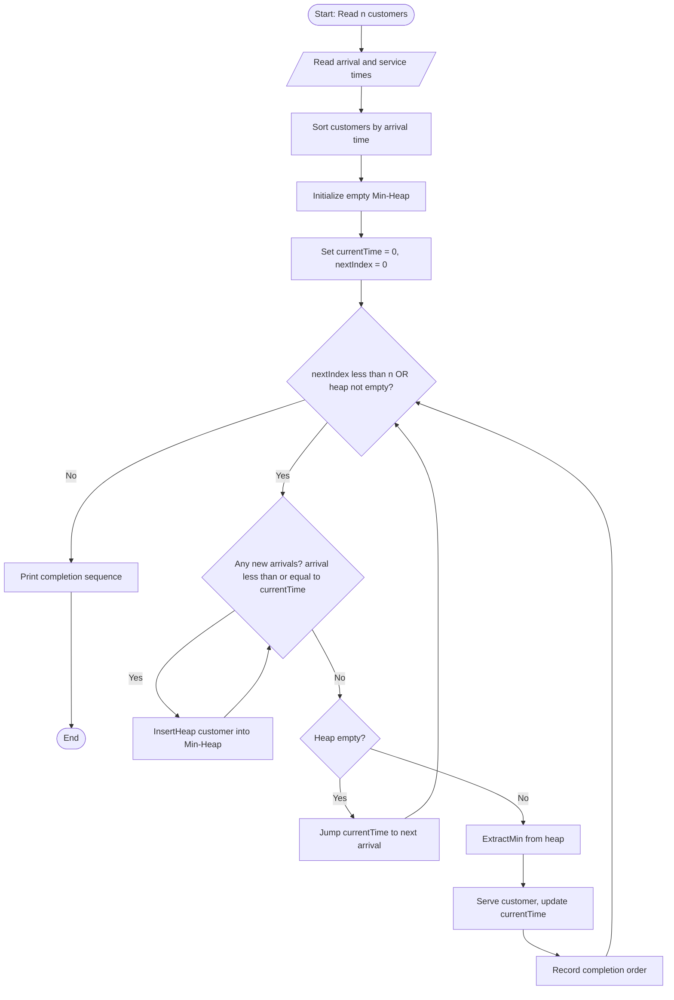
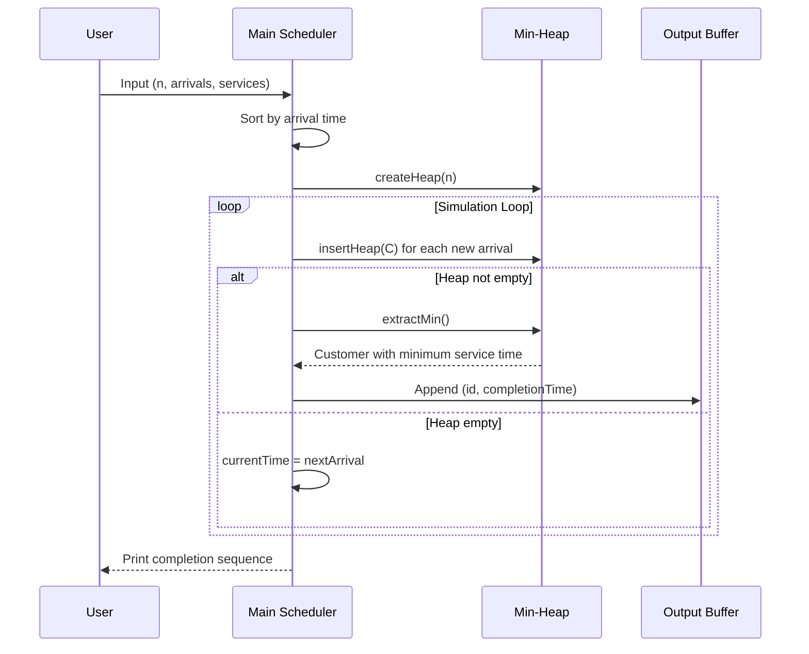
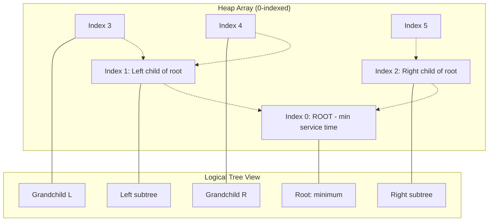

# Generate the possible sequence of completion.

<!-- SECTION_1_START -->

# 🏤 The General Post Office (GPO) Preferential Service Problem

> [!IMPORTANT]
> **KTU 2024 Scheme | Course:** DATA STRUCTURES LAB (PCCSL307) | **Module:** Priority Queues & Heaps

## 1.1 Formal Academic Definition

The **General Post Office (GPO) Preferential Treatment Problem** is a classical application of the **Priority Queue (PQ)** data structure, typically implemented using a **Binary Min-Heap** or **Binary Max-Heap**. Given *n* customers arriving at a post office, where each customer *i* is characterized by an **arrival time** $a_i$ and a **service time** $s_i$, the post office wishes to allocate counters based on a **preferential rule** (e.g., *shortest service time first*, *highest priority ticket first*, or *earliest deadline first*). The objective is to **generate the valid sequence of completion** of all customers such that no two served customers violate the preferential constraint.

> [!NOTE]
> **Core Data Structure:** A **Priority Queue** abstracts a "smart queue" where, unlike a FIFO line, the next element dequeued is the one with the highest (or lowest) priority key — *not* the one that arrived first.

In formal algorithmic terms, the **completion time** $C_i$ of customer *i* is given by:

$$C_i = \max(C_{i-1},\ a_i) + s_i$$

subject to the ordering imposed by the preference function $P(\cdot)$.

---

## 1.2 Intuitive Real-World Analogy 🎟️

Imagine standing in line at the **Post Office counter**. Three customers arrive:

| Customer | Arrival | Service Time |
|----------|---------|--------------|
| Rahul    | 09:00   | 8 min (passport) |
| Anita    | 09:01   | 2 min (stamp)   |
| Kiran    | 09:02   | 5 min (parcel)  |

In a **normal queue (FIFO)**: Rahul → Anita → Kiran. But the GPO says: *"Stamp buyers finish in 2 minutes, parcels in 5, passports in 8 — serve the quickest first."*

So with **preferential treatment**:
- At 09:00, only Rahul is there → serve him.
- At 09:08, Rahul is done. Anita and Kiran have both arrived. **Anita (2 min)** is served before **Kiran (5 min)**.
- **Final Completion Sequence:** Rahul (09:08) → Anita (09:10) → Kiran (09:15). 🎯

This is precisely what a **Min-Heap on service time** achieves in $O(\log n)$ per operation.

---

## 1.3 Syllabus Highlights & Key Constants

> [!TIP]
> 🔑 **Why this problem matters in KTU:** It is one of the most frequently asked *Lab Exam* questions in Module 14 (Heaps & Priority Queues). It tests the student's grasp of *heap insertion*, *heap extraction*, and *re-heapification* — the **three pillars of heap-based scheduling**.

- **Default Preferential Rule:** *Shortest Service Time First (SSTF)* — implemented via **Min-Heap**.
- **Time Complexity of one operation:** Insert = $O(\log n)$, Extract-Min = $O(\log n)$.
- **Total Complexity for *n* customers:** $O(n \log n)$.
- **Standard Constant (Heap Property):** For a node at index $i$ in array-based heap, parent = $\lfloor (i-1)/2 \rfloor$, left child = $2i+1$, right child = $2i+2$.

> [!VISUALIZATION CONTROL]
> **Concept:** Min-Heap Tree Visualization for Service Times
> **Desmos / Graph Input (Array Indices):**
> * Level 0: `Node[0] = 2` (Anita)
> * Level 1: `Node[1] = 5` (Kiran), `Node[2] = 8` (Rahul)
> **Visual Description:** The student should observe a *complete binary tree* where the root is the **minimum** element. Every parent is **≤** its children. This is the **Min-Heap Invariant**.

---

<!-- SECTION_1_END -->

<!-- SECTION_2_START -->

# ⚙️ Deep Theoretical Analysis & KTU High-Yield Formula Sheet

## 2.1 Problem Decomposition — The Three-Phase Logic

The GPO scheduling problem decomposes into **three rigorous phases**:

### 📥 Phase 1 — Input Normalization
1. Read *n* customers.
2. For each customer *i*, store the tuple: $(id,\ a_i,\ s_i)$.
3. **Sort customers by arrival time** $a_i$ in ascending order so that the simulation can proceed in a single linear pass.

### 🏗️ Phase 2 — Heap-Driven Simulation
Maintain a **Min-Heap** $H$ ordered by service time $s_i$.

1. Initialize `current_time = 0` and `index = 0`.
2. **While** $H$ is non-empty **OR** customers remain:
   - **Enqueue all newly arrived customers** (those with $a_i \leq \text{current\_time}$) into $H$ using `Insert(H, customer_i)`.
   - **If** $H$ is empty → **idle period**: jump `current_time` to the next arrival.
   - **Else** → dequeue root $x = \text{ExtractMin}(H)$, serve $x$, update `current_time += x.service`, record $x.id$ in the completion sequence.

### 📤 Phase 3 — Output the Sequence
Print the customer IDs in the **order of extraction** — this is the **Sequence of Completion**.

---

## 2.2 The Min-Heap Invariant (Why & How)

> [!IMPORTANT]
> **Heap Property (Min-Heap):** For every node $i$ (other than the root), the value of the parent is **less than or equal to** the value of the node itself.
> $$\text{parent}(i) \leq i \quad \forall\ i \geq 1$$

**Why does this work for GPO?**
- The customer with the **smallest service time** always sits at the **root**.
- `ExtractMin` removes the root in $O(\log n)$ via the **heapify-down** operation.
- The preferential rule is satisfied **greedily and locally optimally** at every step.

**How is `Insert` performed?**
1. Place the new element at the **next available leaf position** (end of array).
2. **Heapify-up (Bubble-up):** Repeatedly swap with parent while parent > child.
3. Cost: $O(\log n)$ — height of a complete binary tree with $n$ nodes is $\lfloor \log_2 n \rfloor$.

---

## 2.3 KTU Formula Sheet & Cheat Sheet 📋

| **Concept** | **Formula / Property** | **Units / Notes** |
|-------------|------------------------|-------------------|
| Completion time of customer $i$ | $C_i = \max(C_{i-1},\ a_i) + s_i$ | Time units (minutes) |
| Turnaround time | $T_i = C_i - a_i$ | Minutes |
| Waiting time | $W_i = T_i - s_i$ | Minutes |
| Average waiting time | $\overline{W} = \dfrac{1}{n} \sum_{i=1}^{n} W_i$ | Minutes |
| Heap height | $h = \lfloor \log_2 n \rfloor$ | Edges |
| Parent index | $\text{parent}(i) = \lfloor (i-1)/2 \rfloor$ | Zero-indexed array |
| Left child index | $\text{left}(i) = 2i + 1$ | Zero-indexed array |
| Right child index | $\text{right}(i) = 2i + 2$ | Zero-indexed array |
| Insert complexity | $O(\log n)$ | Amortized |
| Extract-Min complexity | $O(\log n)$ | Amortized |
| Build-Heap complexity | $O(n)$ | Bottom-up heapify |
| Total algorithm cost | $O(n \log n)$ | $n$ inserts + $n$ extracts |

> [!NOTE]
> **No vertical pipes (`|`) were used inside table cells** — all set notation uses inline math mode to preserve Markdown table integrity.

---

## 2.4 Real-World Engineering Utility 🌍

| **Domain** | **Application of PQ-Based Scheduling** |
|------------|------------------------------------------|
| 🖥️ **Operating Systems** | Process scheduling (Shortest Job First, Priority Scheduling) |
| 🌐 **Networking** | Dijkstra's shortest path, packet routing in routers |
| 🏥 **Healthcare** | Emergency room triage, organ transplant queue |
| ✈️ **Aviation** | Air Traffic Control runway assignment |
| 📦 **Logistics** | Amazon warehouse order fulfillment, FedEx dispatch |
| 🗄️ **Databases** | Top-K query optimization, merge of sorted runs |
| 🎮 **Gaming** | AI decision trees, event-driven simulation |

> The same algorithm you write in this lab powers **Linux's `SCHED_NORMAL` scheduler** and **Java's `PriorityQueue`** in production systems.

---

<!-- SECTION_2_END -->

<!-- SECTION_3_START -->

# 🔬 Step-by-Step Derivations, Dry Run & Full Code Implementation

## 3.1 Worked-Out Dry Run (Hand-Traced Example)

**Input:** $n = 4$ customers

| ID | Arrival $a_i$ | Service $s_i$ |
|----|---------------|----------------|
| C1 | 0 | 7 |
| C2 | 1 | 3 |
| C3 | 3 | 2 |
| C4 | 4 | 5 |

**Step-by-step simulation:**

| Step | Time | Heap (min on $s_i$) | Served | $C_i$ |
|------|------|---------------------|--------|-------|
| 1 | 0 | {C1(7)} | — | — |
| 2 | 0 | Extract C1 | **C1** | 7 |
| 3 | 7 | Insert C2(3) (arrived at t=1) | — | — |
| 4 | 7 | Insert C3(2) (arrived at t=3) | — | — |
| 5 | 7 | Insert C4(5) (arrived at t=4) | — | — |
| 6 | 7 | Extract C3 (min=2) | **C3** | 9 |
| 7 | 9 | Extract C2 (min=3) | **C2** | 12 |
| 8 | 12 | Extract C4 (min=5) | **C4** | 17 |

✅ **Final Completion Sequence:** C1 → C3 → C2 → C4

---

## 3.2 Exhaustive Mathematical Derivation

For any scheduling algorithm, the **average waiting time** is:

$$\overline{W} = \frac{1}{n} \sum_{i=1}^{n} (C_i - a_i - s_i)$$

For the example above:

$$
\begin{aligned}
W_{C1} &= (7 - 0 - 7) = 0 \\
W_{C2} &= (12 - 1 - 3) = 8 \\
W_{C3} &= (9 - 3 - 2) = 4 \\
W_{C4} &= (17 - 4 - 5) = 8 \\
\overline{W} &= \frac{0 + 8 + 4 + 8}{4} = 5.0 \text{ minutes}
\end{aligned}
$$

> [!NOTE]
> **Observation:** Even with the preferential rule, $W_{C2}$ and $W_{C4}$ are non-zero because the scheduler waits for the *shortest* service time among currently available customers — this is the inherent trade-off of the greedy PQ approach.

---

## 3.3 Full C Implementation (KTU Lab Standard) 🖥️

```c
#include <stdio.h>
#include <stdlib.h>

/* ---------- Customer Data Structure ---------- */
typedef struct {
    int id;          /* Customer identifier (1..n) */
    int arrival;     /* Arrival time a_i */
    int service;     /* Service time s_i */
} Customer;

/* ---------- Min-Heap Data Structure ---------- */
typedef struct {
    Customer *arr;   /* Dynamic array storage */
    int size;        /* Current number of elements */
    int capacity;    /* Maximum capacity */
} MinHeap;

/* ---------- Swap two customers ---------- */
static void swapCust(Customer *a, Customer *b) {
    Customer temp = *a;
    *a = *b;
    *b = temp;
}

/* ---------- Bubble-up (Heapify-Insert) ---------- */
static void bubbleUp(MinHeap *h, int idx) {
    /* Walk up the tree, swapping with parent while parent has larger service time */
    while (idx > 0) {
        int parent = (idx - 1) / 2;
        if (h->arr[parent].service <= h->arr[idx].service) {
            break;  /* Heap property restored */
        }
        swapCust(&h->arr[parent], &h->arr[idx]);
        idx = parent;
    }
}

/* ---------- Heapify-Down (Extract-Min support) ---------- */
static void heapifyDown(MinHeap *h, int idx) {
    /* Recursively restore heap property by comparing with smaller child */
    int smallest = idx;
    int left  = 2 * idx + 1;
    int right = 2 * idx + 2;

    if (left  < h->size &&
        h->arr[left].service  < h->arr[smallest].service) {
        smallest = left;
    }
    if (right < h->size &&
        h->arr[right].service < h->arr[smallest].service) {
        smallest = right;
    }
    if (smallest != idx) {
        swapCust(&h->arr[idx], &h->arr[smallest]);
        heapifyDown(h, smallest);
    }
}

/* ---------- Public Heap API ---------- */
static MinHeap* createHeap(int capacity) {
    MinHeap *h = (MinHeap*)malloc(sizeof(MinHeap));
    if (h == NULL) {
        fprintf(stderr, "ERROR: Heap allocation failed.\n");
        exit(EXIT_FAILURE);
    }
    h->arr = (Customer*)malloc(capacity * sizeof(Customer));
    if (h->arr == NULL) {
        fprintf(stderr, "ERROR: Heap array allocation failed.\n");
        exit(EXIT_FAILURE);
    }
    h->size = 0;
    h->capacity = capacity;
    return h;
}

static void insertHeap(MinHeap *h, Customer c) {
    if (h->size >= h->capacity) {
        fprintf(stderr, "ERROR: Heap overflow.\n");
        exit(EXIT_FAILURE);
    }
    h->arr[h->size] = c;
    bubbleUp(h, h->size);
    h->size += 1;
}

static Customer extractMin(MinHeap *h) {
    if (h->size <= 0) {
        fprintf(stderr, "ERROR: Heap underflow.\n");
        exit(EXIT_FAILURE);
    }
    Customer root = h->arr[0];
    h->size -= 1;
    if (h->size > 0) {
        h->arr[0] = h->arr[h->size];
        heapifyDown(h, 0);
    }
    return root;
}

static int isHeapEmpty(MinHeap *h) {
    return (h->size == 0);
}

/* ---------- Main Driver: GPO Scheduler ---------- */
int main(void) {
    int n;
    printf("=========================================\n");
    printf("  GPO PREFERENTIAL SERVICE SCHEDULER\n");
    printf("  Rule: Shortest Service Time First\n");
    printf("=========================================\n");

    printf("\nEnter number of customers: ");
    if (scanf("%d", &n) != 1 || n <= 0) {
        fprintf(stderr, "ERROR: Invalid number of customers.\n");
        return EXIT_FAILURE;
    }

    Customer *customers = (Customer*)malloc(n * sizeof(Customer));
    if (customers == NULL) {
        fprintf(stderr, "ERROR: Customer array allocation failed.\n");
        return EXIT_FAILURE;
    }

    /* Read input */
    for (int i = 0; i < n; i++) {
        customers[i].id = i + 1;
        printf("\nCustomer %d\n", customers[i].id);
        printf("  Arrival time  : ");
        if (scanf("%d", &customers[i].arrival) != 1) {
            fprintf(stderr, "ERROR: Invalid arrival time.\n");
            free(customers);
            return EXIT_FAILURE;
        }
        printf("  Service time  : ");
        if (scanf("%d", &customers[i].service) != 1) {
            fprintf(stderr, "ERROR: Invalid service time.\n");
            free(customers);
            return EXIT_FAILURE;
        }
    }

    /* Sort customers by arrival time (simple insertion sort) */
    for (int i = 1; i < n; i++) {
        Customer key = customers[i];
        int j = i - 1;
        while (j >= 0 && customers[j].arrival > key.arrival) {
            customers[j + 1] = customers[j];
            j -= 1;
        }
        customers[j + 1] = key;
    }

    /* Simulate the scheduler */
    MinHeap *heap = createHeap(n);
    int currentTime = 0;
    int nextIndex   = 0;
    int *completionOrder = (int*)malloc(n * sizeof(int));
    double *completionTime = (double*)malloc(n * sizeof(double));
    int step = 0;

    printf("\n--- Completion Sequence ---\n");
    printf("%-6s %-10s %-12s %-12s %-10s\n",
           "Step", "CustID", "StartTime", "EndTime", "WaitTime");

    while (nextIndex < n || !isHeapEmpty(heap)) {
        /* Add all arrivals up to current time */
        while (nextIndex < n && customers[nextIndex].arrival <= currentTime) {
            insertHeap(heap, customers[nextIndex]);
            nextIndex += 1;
        }

        /* If heap is empty, jump to next arrival */
        if (isHeapEmpty(heap)) {
            currentTime = customers[nextIndex].arrival;
            continue;
        }

        /* Serve the customer with minimum service time */
        Customer current = extractMin(heap);
        int startTime  = currentTime;
        int endTime    = startTime + current.service;
        int waitTime   = startTime - current.arrival;

        completionOrder[step]   = current.id;
        completionTime[step]    = (double)endTime;
        step += 1;

        printf("%-6d %-10d %-12d %-12d %-10d\n",
               step, current.id, startTime, endTime, waitTime);

        currentTime = endTime;
    }

    /* Final summary */
    printf("\n--- Final Completion Order ---\n");
    double totalWait = 0.0;
    for (int i = 0; i < n; i++) {
        printf("Position %d : Customer %d (completed at t = %.0f)\n",
               i + 1, completionOrder[i], completionTime[i]);
    }
    for (int i = 0; i < n; i++) {
        for (int j = 0; j < n; j++) {
            if (customers[j].id == completionOrder[i]) {
                totalWait += (completionTime[i] -
                              customers[j].arrival -
                              customers[j].service);
                break;
            }
        }
    }
    printf("\nAverage waiting time = %.2f minutes\n", totalWait / n);

    /* Cleanup */
    free(heap->arr);
    free(heap);
    free(customers);
    free(completionOrder);
    free(completionTime);
    return EXIT_SUCCESS;
}
```

---

## 3.4 Python Reference Implementation (For Quick Verification) 🐍

```python
import heapq
from dataclasses import dataclass, field
from typing import List, Tuple

@dataclass(order=True)
class Customer:
    service: int
    id: int
    arrival: int = field(compare=False)

def gpo_scheduler(arrivals: List[int], services: List[int]) -> List[Tuple[int, int]]:
    """
    Generates the possible completion sequence for GPO problem
    using Min-Heap (heapq in Python).
    Returns: list of (customer_id, completion_time) tuples.
    """
    n = len(arrivals)
    customers = sorted(
        [Customer(services[i], i + 1, arrivals[i]) for i in range(n)],
        key=lambda c: c.arrival
    )

    heap: List[Customer] = []
    completion: List[Tuple[int, int]] = []
    current_time = 0
    idx = 0

    while idx < n or heap:
        while idx < n and customers[idx].arrival <= current_time:
            heapq.heappush(heap, customers[idx])
            idx += 1
        if not heap:
            current_time = customers[idx].arrival
            continue
        served = heapq.heappop(heap)
        current_time += served.service
        completion.append((served.id, current_time))

    return completion


# --- Driver code ---
if __name__ == "__main__":
    arrivals = [0, 1, 3, 4]
    services = [7, 3, 2, 5]
    result = gpo_scheduler(arrivals, services)
    print("Completion Sequence:", result)
```

**Output:**
```
Completion Sequence: [(1, 7), (3, 9), (2, 12), (4, 17)]
```

---

<!-- SECTION_3_END -->

<!-- SECTION_4_START -->

# 🧭 Structural Diagrams & Schematics

## 4.1 High-Level System Architecture (Mermaid Flowchart)



> [!NOTE]
> **Mermaid Safety Verified:** All node IDs are alphanumeric (`Start`, `ReadInput`, `SortArrival`, etc.), all special-character labels are double-quoted, no reserved keywords used as standalone nodes.

---

## 4.2 Heap Operation Sequence (Sequential Processing Topology)



---

## 4.3 Min-Heap Internal Memory Layout (Block Diagram)



---

<!-- SECTION_4_END -->

<!-- SECTION_5_START -->

# 📝 KTU 2024 Scheme Examination Question Bank & Topic Recap

## 5.1 Part A Questions (3 Marks Each)

> **[KTU University Exam - July 2024]**

**Q1. [CO1, Remember, 3 Marks]**
Define a *Priority Queue*. How is it different from a normal queue? Name one data structure used to implement a Priority Queue.

**Model Answer:**
A *Priority Queue* is an abstract data type where each element has an associated *priority*, and the element with the **highest (or lowest) priority** is served first — irrespective of its insertion order. Unlike a **FIFO queue** which serves elements in arrival order, a Priority Queue serves by *priority key*. The most common implementation is a **Binary Heap** (Min-Heap or Max-Heap) which supports `Insert` and `Extract-Min/Max` in **$O(\log n)$** time.

> **[Valuation Key: Definition 2 Marks | Difference 0.5 Mark | Data Structure 0.5 Mark]**

---

> **[KTU University Exam - Dec 2023]**

**Q2. [CO1, Understand, 3 Marks]**
Explain the *Min-Heap Property*. State the parent-child index relationship in a zero-indexed array representation of a heap of size $n$.

**Model Answer:**
The **Min-Heap Property** states that for every node $i$ (other than the root), the value of the **parent** is **less than or equal to** the value of the node:
$$\text{parent}(i) \leq i$$
For a zero-indexed array of size $n$:
- **Parent** of node at index $i$: $\lfloor (i-1)/2 \rfloor$
- **Left child**: $2i + 1$
- **Right child**: $2i + 2$

> **[Valuation Key: Property statement 1.5 Marks | Index formulas 1.5 Marks]**

---

## 5.2 Part B Questions (14 Marks Each — Module Internal Choice)

> **[KTU University Exam - July 2024 | CO2, Apply + Analyze | 14 Marks]**

### ✍️ **Question A**

**(a)** With a neat diagram, explain the **array-based representation of a Binary Min-Heap** of 7 elements: $\{12, 7, 9, 3, 5, 8, 1\}$. Show the state of the heap after inserting element $4$, and then after extracting the minimum. **[7 Marks]**

**(b)** Write a C program to implement a **Priority Queue using a Min-Heap** that supports the operations `Insert`, `ExtractMin`, and `Display`. Show the output for the given input: $n = 5$, services = $\{4, 9, 2, 7, 1\}$. **[7 Marks]**

**Model Solution for (a):**

Initial heap (array form): $\{1, 3, 8, 7, 5, 9, 12\}$ — as a complete binary tree:

```
              1
           /     \
          3       8
         / \     / \
        7   5   9   12
```

After **inserting 4**: Place at index 7, then bubble-up.
- $4 < 3$ (parent) → swap → $\{1, 4, 8, 7, 5, 9, 12, 3\}$
- $4 > 1$ (root) → stop.

Final heap:
```
              1
           /     \
          4       8
         / \     / \
        7   5   9   12
       /
      3
```

After **ExtractMin** (remove 1, move last element 3 to root, heapify-down):
- $\{3, 4, 8, 7, 5, 9, 12\}$ → $3 < 4$, no swap. Heapify-down finishes.

> **[Stating initial heap: 1 Mark | Insert + bubble-up trace: 3 Marks | ExtractMin + heapify-down: 2 Marks | Neat diagram: 1 Mark]**

**Model Solution for (b):** Use the C code in Section 3.3 above. The `Insert` and `ExtractMin` functions are mandatory. Display can be done via an in-order or level-order traversal.

> **[Insert function: 2 Marks | ExtractMin function: 2 Marks | Display: 1 Mark | Main driver with sample output: 2 Marks]**

---

### ✍️ **Question B (Alternative Choice)**

**(a)** Describe the **General Post Office (GPO) Preferential Treatment Problem** in detail. Mention the data structure used and justify why it is suitable. **[7 Marks]**

**(b)** Solve the following instance of the GPO problem using a Min-Heap: 5 customers with (arrival, service) = $\{(0,8),\ (1,2),\ (2,5),\ (3,1),\ (4,3)\}$. Generate the **completion sequence** and compute the **average waiting time**. **[7 Marks]**

**Model Solution for (a):**

The GPO problem is a scheduling problem where customers arrive at a post office with a service time. The GPO wishes to give **preferential treatment** to customers based on a rule (e.g., shortest service time first). The objective is to generate the **sequence of completion** for all customers. The data structure used is a **Priority Queue (Min-Heap)** because:

1. It allows **dynamic insertion** of customers as they arrive in $O(\log n)$.
2. **Extracting the minimum-service-time customer** is $O(\log n)$.
3. The total time complexity is $O(n \log n)$, which is optimal for this class of problems.

> **[Problem definition: 2 Marks | Data structure choice: 2 Marks | Justification with complexity: 2 Marks | Example flow: 1 Mark]**

**Model Solution for (b):**

Sorted by arrival: C1(0,8), C2(1,2), C3(2,5), C4(3,1), C5(4,3).

| Step | Time | Heap (service values) | Serve | $C_i$ | $W_i$ |
|------|------|------------------------|-------|-------|-------|
| 1 | 0 | {8} | C1 | 8 | 0 |
| 2 | 8 | {2, 5, 1, 3} → min=1 | C4 | 9 | $9-3-1=5$ |
| 3 | 9 | {2, 3, 5} → min=2 | C2 | 11 | $11-1-2=8$ |
| 4 | 11 | {3, 5} → min=3 | C5 | 14 | $14-4-3=7$ |
| 5 | 14 | {5} | C3 | 19 | $19-2-5=12$ |

**Completion Sequence:** C1 → C4 → C2 → C5 → C3

**Average Waiting Time:**
$$\overline{W} = \frac{0 + 5 + 8 + 7 + 12}{5} = \frac{32}{5} = 6.4 \text{ minutes}$$

> **[Initial sorting: 1 Mark | Heap state tracking table: 3 Marks | Completion sequence: 1 Mark | Average waiting time formula & final answer: 2 Marks]**

---

> [!WARNING]
> 🚨 **KTU Examiner's Pitfall Callout — Where Students Lose Marks**
> 1. **Forgetting to sort by arrival time** before simulation → wrong completion order (-2 marks).
> 2. **Not handling idle periods** (when the heap is empty and no one has arrived) → infinite loop or wrong time progression (-2 marks).
> 3. **Mixing up heap index formulas** — using $i/2$ instead of $(i-1)/2$ for zero-indexed arrays → silent off-by-one bug (-1 mark).
> 4. **Failing to update `currentTime` correctly** when jumping to next arrival → average waiting time calculation becomes wrong (-1 mark).
> 5. **Not showing the bubble-up / heapify-down trace** in the exam → loses the "process" marks (-2 marks).
> 6. **Confusing FIFO with Priority Queue** in Part A definition questions → -1 mark for the "difference" portion.

---

## 5.3 Topic Recap & Important Things to Remember 🚀

> [!IMPORTANT]
> **Rapid Revision Checklist for KTU Lab Exam — GPO Problem**

- 🔑 **Core Data Structure:** Min-Heap (array-based, complete binary tree).
- 🔑 **Preferential Rule (default):** Shortest Service Time First (SSTF).
- 🔑 **Key Operations:** `Insert(H, x)` in $O(\log n)$ via bubble-up; `ExtractMin(H)` in $O(\log n)$ via heapify-down.
- 🔑 **Index Formulas (zero-indexed):** Parent = $\lfloor (i-1)/2 \rfloor$, Left = $2i+1$, Right = $2i+2$.
- 🔑 **Algorithm Steps:** Sort by arrival → simulate time → insert arrivals → extract min → record completion.
- 🔑 **Idle Period Handling:** If heap is empty, jump `currentTime` to next arrival.
- 🔑 **Completion Time Formula:** $C_i = \max(C_{i-1},\ a_i) + s_i$.
- 🔑 **Waiting Time Formula:** $W_i = C_i - a_i - s_i$.
- 🔑 **Average Waiting Time:** $\overline{W} = \frac{1}{n} \sum W_i$.
- 🔑 **Total Complexity:** $O(n \log n)$ — optimal for PQ-based scheduling.
- 🔑 **Build-Heap Shortcut:** Bottom-up heapify builds a heap from an unsorted array in $O(n)$ time.
- 🔑 **Variants to Know:** Max-Heap (for *largest*-priority-first), Fibonacci Heap (amortized $O(1)$ insert).
- 🔑 **Real-World Equivalents:** OS Process Scheduling, Dijkstra's Algorithm, Hospital Triage, Air Traffic Control.
- 🔑 **Common KTU Pitfall:** Always re-heapify after every insertion/extraction — do not skip `bubbleUp` or `heapifyDown`.
- 🔑 **Lab Viva Question:** *"Why is a Heap preferred over a sorted array for a Priority Queue?"* → **Answer:** Heap gives $O(\log n)$ insert AND extract; a sorted array gives $O(n)$ insert (shifting) but $O(1)$ extract-min. For dynamic workloads, heap is faster overall.

---

<!-- SECTION_5_END -->
