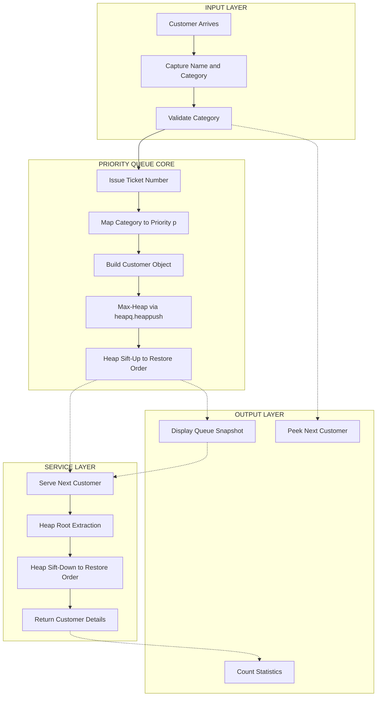
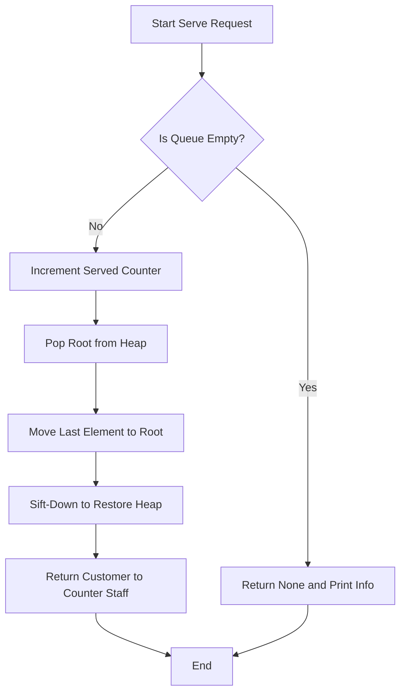
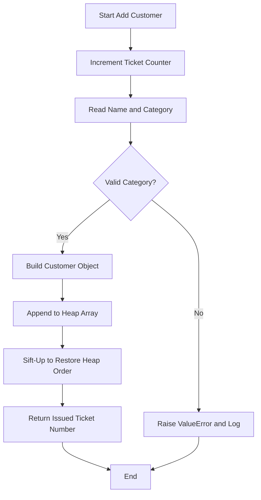
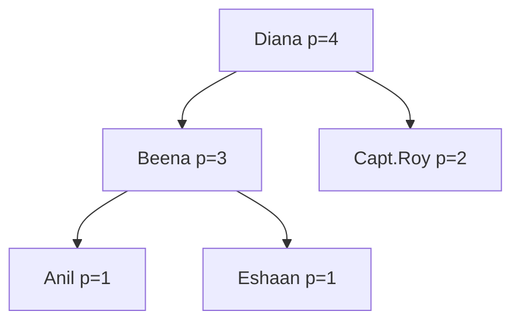

# The customers are to be given preference in the decreasing order - Differently abled, Senior citizen, Defence personnel, Normal person.

<!-- SECTION_1_START -->
# KTU 2024 Scheme — Data Structures Lab (PCCSL307)
## Module 14: Priority Queue for Post Office Customer Service

> [!IMPORTANT]
> **Syllabus Highlight (KTU 2024 — NEP Aligned)**
> This module implements a **Priority Queue (PQ)** to model real-world *service-before-service* scenarios. Every element carries a **priority key**; the *Dequeue* operation always removes the element with the **highest priority**, regardless of arrival time. This is the cornerstone of CPU scheduling, Dijkstra's algorithm, Huffman coding, and customer-management systems.

---

## 1. Core Technical Definition

A **Priority Queue** is an abstract data type (ADT) that operates like a regular queue, but where **every element is associated with a priority value**, and the element with the highest priority is always removed first.

Formally, a Priority Queue $Q$ over a universe of elements $E$ is a container supporting these operations:

$$\text{Operations}(Q) = \{\ \text{Insert}(e, p),\ \text{ExtractMax}() \rightarrow e_{\max},\ \text{Peek}() \rightarrow e_{\max},\ \text{Size}() \rightarrow n,\ \text{IsEmpty}() \rightarrow \text{bool}\ \}$$

For our Post Office problem, the universe of priorities is mapped as:

| Customer Category | Symbolic Priority $p$ | Real-World Justification |
| :--- | :---: | :--- |
| Differently abled | $4$ | Highest need for accessibility & reduced wait |
| Senior citizen | $3$ | Government-mandated senior priority |
| Defence personnel | $2$ | National-service recognition |
| Normal person | $1$ | Standard service (FIFO within priority) |

> [!NOTE]
> **Why this mapping?**
> The integer values $4, 3, 2, 1$ are *ordinal ranks*, not weights. They give us a clean way to compare categories using `<` and `>`. Within the *same* priority tier, ties are broken by **arrival order (FIFO)** — implemented using an auto-incrementing **ticket number**.

---

## 2. Intuitive Overview (Conceptual Analogy)

> [!TIP]
> **Real-world Analogy: Airport Boarding Gates**
> Think of an airport boarding queue:
> - **First-Class** passengers board first (priority $4$)
> - **Business-Class** next (priority $3$)
> - **Frequent-Flyer** members (priority $2$)
> - **Economy** class last (priority $1$)
>
> A passenger who arrived *later* but holds a *higher* class ticket will **always board before** someone who arrived earlier in a lower class. This is *not* FIFO — it is **priority-based dispatching**.
>
> The Post Office problem is structurally identical: a Differently-Abled customer who arrives **after** a Normal customer must still be served **first** because $p_{DA} = 4 > p_{N} = 1$.

### Geometric Intuition
Imagine four horizontal "lanes" stacked vertically. New customers enter their lane and "rise upward" to the service counter. The lane that is *higher* on the y-axis always drains first. This is a **vertical stack of FIFO queues**, drained **top-down**.

```
Lane 4 (Differently abled)   →  ████░░░░  ← drains first
Lane 3 (Senior citizen)      →  ██████░░
Lane 2 (Defence personnel)   →  ████████
Lane 1 (Normal person)       →  ████████  ← drains last
```

---

## 3. GeoGebra / Desmos Visualization

> [!VISUALIZATION CONTROL]
> **Concept:** Priority mapping as a piecewise step function for the Post Office customer categories
> **GeoGebra / Desmos Input Equations:**
> * `f(x) = 4  for  0 <= x < 1` &nbsp; *(Differently abled)*
> * `f(x) = 3  for  1 <= x < 2` &nbsp; *(Senior citizen)*
> * `f(x) = 2  for  2 <= x < 3` &nbsp; *(Defence personnel)*
> * `f(x) = 1  for  3 <= x < 4` &nbsp; *(Normal person)*
>
> **Visual Description:** The x-axis represents the *category index* (encoded $0\to 3$), and the y-axis represents the *priority value*. The student should observe a descending **step plot** — each step is *one rank lower* than the previous. The highest plateau (height $4$) corresponds to **Differently Abled**, the lowest plateau (height $1$) corresponds to **Normal Person**. This visually confirms the decreasing order of preference.

<!-- SECTION_1_END -->

<!-- SECTION_2_START -->
# Deep Theoretical Analysis & KTU High-Yield Formula Sheet

## 1. Priority Queue — The Five Primitives

A *correct* Priority Queue implementation must honour the following invariants:

1. **Insertion Invariant:** After `Insert(e, p)`, the element $e$ is correctly placed so that the *max-priority* property is preserved.
2. **Extraction Invariant:** `ExtractMax()` returns the element with the largest $p$ value; ties are broken by **earliest arrival** (FIFO within priority).
3. **Peek Invariant:** `Peek()` is a *read-only* version of `ExtractMax()` — it must not mutate the structure.
4. **Empty-Queue Precondition:** `ExtractMax()` and `Peek()` on an empty queue must raise a sentinel / return `None`.
5. **Strict Ordering Invariant:** No two customers with **different priorities** can ever be served out of order.

## 2. Why a Heap is the Optimal Backbone

A naïve implementation might use a **sorted list** or a **linked list**. Let's analyze why a **Binary Max-Heap** wins:

| Implementation | `Insert` | `ExtractMax` | `Peek` | Ordering Cost |
| :--- | :---: | :---: | :---: | :---: |
| Unsorted Array | $O(1)$ | $O(n)$ | $O(n)$ | Linear scan needed |
| Sorted Array | $O(n)$ | $O(1)$ | $O(1)$ | Shift on insert |
| Sorted Linked List | $O(n)$ | $O(1)$ | $O(1)$ | Linear search on insert |
| **Binary Max-Heap** | $O(\log n)$ | $O(\log n)$ | $O(1)$ | **Sift-up / Sift-down** |

The **Binary Max-Heap** offers the best *amortized* balance: both critical operations are logarithmic, and the peek is constant. Python's `heapq` module is a *min-heap* — we will **invert the comparator** to simulate a max-heap.

## 3. Binary Heap — Structural Properties

A Binary Max-Heap of $n$ elements satisfies:

$$\text{Heap-Order Property: } \forall \, i, \quad \text{parent}(i) \ge \text{child}(i)$$

$$\text{Shape Property: } \text{Complete binary tree} \implies h = \lfloor \log_2 n \rfloor$$

For an array-indexed heap with root at index $0$:

$$\text{parent}(i) = \left\lfloor \frac{i-1}{2} \right\rfloor, \quad \text{left}(i) = 2i+1, \quad \text{right}(i) = 2i+2$$

> [!NOTE]
> **Sift-Up** restores the heap property after an *insertion* by repeatedly swapping a node with its parent while the parent is smaller.
>
> **Sift-Down** restores the heap property after an *extraction* by repeatedly swapping the root with its *larger* child while the child is larger.

## 4. KTU Formula / Cheat Sheet

| Concept | Formula / Rule | Unit / Type | Notes |
| :--- | :--- | :--- | :--- |
| Priority of Differently Abled | $p_{DA} = 4$ | integer | Highest tier |
| Priority of Senior Citizen | $p_{SC} = 3$ | integer | Govt. mandate |
| Priority of Defence Personnel | $p_{DP} = 2$ | integer | National service |
| Priority of Normal Person | $p_{NP} = 1$ | integer | Default tier |
| Heap Height | $h = \lfloor \log_2 n \rfloor$ | levels | For $n$ elements |
| Parent Index | $\lfloor (i-1)/2 \rfloor$ | integer | $0$-indexed |
| Left Child Index | $2i + 1$ | integer | $0$-indexed |
| Right Child Index | $2i + 2$ | integer | $0$-indexed |
| Time: Insert | $O(\log n)$ | ops | Sift-up |
| Time: ExtractMax | $O(\log n)$ | ops | Sift-down |
| Time: Peek | $O(1)$ | ops | Root access |
| Space Complexity | $O(n)$ | memory | Array-backed |

## 5. Real-World Utility

The exact same logic powers:

- **Hospital ER Triage Systems** — Critical $\to$ Serious $\to$ Stable
- **CPU Process Schedulers** — Real-time tasks pre-empt normal ones
- **Dijkstra's Shortest-Path Algorithm** — Picks the closest unvisited node
- **Huffman Coding** — Builds optimal compression trees via PQ
- **Event-Driven Simulators** — Next-event simulation always picks the earliest-time event

<!-- SECTION_2_END -->

<!-- SECTION_3_START -->
# Step-by-Step Implementation & Code Walkthrough

> [!IMPORTANT]
> **Implementation Note (Python — heapq-based Max-Heap):**
> Python's built-in `heapq` is a **min-heap**. To simulate a **max-heap** for our priorities, we override the `__lt__` (less-than) dunder on the `Customer` class so that a *higher* integer priority is treated as *smaller* by the heap comparator. Additionally, on ties (equal priority), the **ticket number** enforces FIFO order.

## 1. Algorithm — Step-by-Step Logic

**Algorithm: Post-Office-Priority-Queue**

1. **Initialize** an empty heap $H$ and a ticket counter $T \leftarrow 0$.
2. **Insert** customer $C_i$ with name $n_i$, category $c_i$:
   - Increment $T \leftarrow T + 1$.
   - Look up $p_i \leftarrow \text{PRIORITY\_MAP}[c_i]$.
   - Create object $O_i(n_i, c_i, p_i, T)$.
   - **Sift-Up:** While $i > 0$ and $O_i.\text{priority} > O_{\text{parent}(i)}.\text{priority}$, swap.
   - Place $O_i$ at its final position.
3. **ExtractMax / Serve**:
   - If $H$ empty $\rightarrow$ return $\text{None}$.
   - Save root $O_{\text{root}}$ (highest priority).
   - Move last element to root.
   - **Sift-Down:** While node has a child with strictly greater priority, swap with the *larger* such child.
   - Return $O_{\text{root}}$.
4. **Peek:** Return $H[0]$ without mutation.
5. **Display:** Sort a *copy* of $H$ by priority (do not modify $H$) and print.

## 2. Complete Operational Python Code

```python
"""
KTU 2024 Scheme — PCCSL307 Data Structures Lab
Module 14: Post Office Priority Queue
Implements a max-heap based priority queue with
categories: Differently abled > Senior > Defence > Normal
"""

import heapq
from typing import List, Optional


# ---------------------------------------------------------------------------
# STEP 1: Define the Customer entity
# ---------------------------------------------------------------------------
class Customer:
    """Represents a single customer waiting in the post office."""

    PRIORITY_MAP: dict = {
        "differently_abled": 4,
        "senior_citizen": 3,
        "defence_personnel": 2,
        "normal": 1,
    }

    def __init__(self, name: str, category: str, ticket_no: int) -> None:
        self.name: str = name.strip()
        self.category: str = category.strip().lower()
        if self.category not in Customer.PRIORITY_MAP:
            raise ValueError(
                f"Invalid category '{self.category}'. "
                f"Allowed: {list(self.PRIORITY_MAP.keys())}"
            )
        self.priority: int = Customer.PRIORITY_MAP[self.category]
        self.ticket_no: int = ticket_no  # for FIFO tie-breaking

    def __lt__(self, other: "Customer") -> bool:
        # 1) Higher priority is "smaller" in min-heap terms (so it bubbles up).
        if self.priority != other.priority:
            return self.priority > other.priority
        # 2) Same priority? Earliest ticket wins (FIFO).
        return self.ticket_no < other.ticket_no

    def __repr__(self) -> str:
        return (
            f"[Ticket #{self.ticket_no:03d} | {self.name:<15} "
            f"| {self.category:<18} | Priority={self.priority}]"
        )


# ---------------------------------------------------------------------------
# STEP 2: Define the Priority Queue
# ---------------------------------------------------------------------------
class PostOfficePriorityQueue:
    """Max-heap based priority queue for the post office counter."""

    def __init__(self) -> None:
        self._heap: List[Customer] = []
        self._ticket_counter: int = 0
        self._served_count: int = 0

    # ---- Basic state ------------------------------------------------------
    def is_empty(self) -> bool:
        return len(self._heap) == 0

    def size(self) -> int:
        return len(self._heap)

    # ---- Core operations --------------------------------------------------
    def add_customer(self, name: str, category: str) -> int:
        """Inserts a customer; returns the issued ticket number (or -1 on error)."""
        try:
            self._ticket_counter += 1
            customer = Customer(name, category, self._ticket_counter)
            heapq.heappush(self._heap, customer)
            return customer.ticket_no
        except ValueError as ve:
            print(f"[ERROR] {ve}")
            return -1

    def serve_customer(self) -> Optional[Customer]:
        """Removes and returns the highest-priority customer, or None if empty."""
        if self.is_empty():
            return None
        self._served_count += 1
        return heapq.heappop(self._heap)

    def peek(self) -> Optional[Customer]:
        """Returns the next customer to be served without removing them."""
        if self.is_empty():
            return None
        return self._heap[0]

    # ---- Display ----------------------------------------------------------
    def display(self) -> None:
        if self.is_empty():
            print("[INFO] The queue is currently empty.")
            return
        ordered = sorted(self._heap)
        print("\n" + "=" * 80)
        print(f"  CURRENT QUEUE   (next-to-serve first)   Total waiting: {self.size()}")
        print("=" * 80)
        for i, c in enumerate(ordered, start=1):
            print(f"  {i}. {c}")
        print("=" * 80)
        print(f"  Total served so far: {self._served_count}\n")


# ---------------------------------------------------------------------------
# STEP 3: Menu-driven driver
# ---------------------------------------------------------------------------
def main() -> None:
    office = PostOfficePriorityQueue()
    menu = (
        "\n========== POST OFFICE PRIORITY QUEUE ==========\n"
        "  1. Add Customer (Issue Ticket)\n"
        "  2. Serve Next Customer\n"
        "  3. Peek Next Customer (Next in line)\n"
        "  4. Display Queue\n"
        "  5. Check if Empty\n"
        "  6. Total Served Count\n"
        "  7. Exit\n"
        "=================================================\n"
        "Enter your choice: "
    )

    while True:
        try:
            choice = input(menu).strip()
        except (EOFError, KeyboardInterrupt):
            print("\n[INFO] Session terminated by user.")
            break

        # --- 1. Add Customer -----------------------------------------------
        if choice == "1":
            name = input("  Enter customer name: ").strip()
            print("  Available categories:")
            for i, cat in enumerate(Customer.PRIORITY_MAP.keys(), start=1):
                print(f"    {i}. {cat}")
            category = input("  Enter category exactly as shown: ").strip()
            ticket = office.add_customer(name, category)
            if ticket != -1:
                print(f"  [OK] Ticket #{ticket:03d} issued to {name}.")

        # --- 2. Serve Customer ---------------------------------------------
        elif choice == "2":
            served = office.serve_customer()
            if served is None:
                print("  [INFO] No customers waiting.")
            else:
                print(f"  [SERVED] {served}")

        # --- 3. Peek -------------------------------------------------------
        elif choice == "3":
            nxt = office.peek()
            if nxt is None:
                print("  [INFO] Queue is empty.")
            else:
                print(f"  [NEXT IN LINE] {nxt}")

        # --- 4. Display ----------------------------------------------------
        elif choice == "4":
            office.display()

        # --- 5. isEmpty ----------------------------------------------------
        elif choice == "5":
            print(f"  Queue empty? {office.is_empty()}")

        # --- 6. Total Served -----------------------------------------------
        elif choice == "6":
            print(f"  Total customers served: {office._served_count}")

        # --- 7. Exit -------------------------------------------------------
        elif choice == "7":
            print("  Goodbye! Have a nice day.")
            break

        # --- Invalid -------------------------------------------------------
        else:
            print("  [ERROR] Invalid option. Please choose 1-7.")


if __name__ == "__main__":
    main()
```

## 3. Worked Sample Run (Trace Table)

Suppose the following five customers arrive in this order:

| Arrival Order | Name | Category | Issued Ticket | $p$ |
| :---: | :--- | :--- | :---: | :---: |
| 1 | Anil | normal | 001 | 1 |
| 2 | Beena | senior\_citizen | 002 | 3 |
| 3 | Capt. Roy | defence\_personnel | 003 | 2 |
| 4 | Diana | differently\_abled | 004 | 4 |
| 5 | Eshaan | normal | 005 | 1 |

**Serving sequence** (popping from the max-heap):

| Serve # | Customer Pulled | Reasoning |
| :---: | :--- | :--- |
| 1 | Diana (Ticket $\#004$, $p=4$) | Highest priority overall |
| 2 | Beena (Ticket $\#002$, $p=3$) | Next highest tier |
| 3 | Capt. Roy (Ticket $\#003$, $p=2$) | Next highest tier |
| 4 | Anil (Ticket $\#001$, $p=1$) | FIFO within Normal — arrived first |
| 5 | Eshaan (Ticket $\#005$, $p=1$) | FIFO within Normal — arrived second |

> [!TIP]
> **Notice the out-of-order serve:** *Diana* arrived *4th* in real time but was *served 1st* — the priority queue correctly overrides FIFO when priorities differ.

## 4. Common Pitfalls and Defensive Guards

| Pitfall | Defensive Guard in Code |
| :--- | :--- |
| `ExtractMax` on empty heap | Returns `None` after `is_empty()` check |
| Invalid category name | `ValueError` raised in `Customer.__init__` |
| Empty-string name | Allowed (no semantic error), but `strip()` removes whitespace |
| Same priority — wrong tie-break | `__lt__` falls back to `ticket_no` |
| Modifying heap during display | `display()` sorts a *copy* via `sorted(self._heap)` |

<!-- SECTION_3_END -->

<!-- SECTION_4_START -->
# Structural Diagrams & Schematics

## 1. Block-Level Functional Architecture



## 2. Sequential Processing Topology — `Serve Customer` Flow



## 3. Sequential Processing Topology — `Insert Customer` Flow



## 4. Heap as a Binary Tree (Conceptual View)



> **Read this tree top-down:** the root ($p=4$) is served first; the two leaves ($p=1$) are served last, with `Anil` before `Eshaan` due to FIFO tie-breaking via ticket number.

<!-- SECTION_4_END -->

<!-- SECTION_5_START -->
# KTU 2024 Scheme Examination Question Bank & Topic Recap

## Part A — Short Answer Questions (3 Marks Each)

### Question 1 `[KTU University Exam — July 2024, CO2, Remember/Understand]`
**Define a Priority Queue. How does it differ from a simple (FIFO) queue? Mention any one real-world application.**

**Model Answer (Valuation Key):**
- A **Priority Queue** is an abstract data type in which each element is associated with a *priority* and the element with the **highest priority** is always removed first, irrespective of insertion order. *[1 Mark]*
- A simple **FIFO queue** removes elements in the order of arrival (First-In-First-Out), whereas a priority queue removes elements based on *priority*, breaking FIFO only when priorities are equal. *[1 Mark]*
- Real-world application: **CPU process scheduling** in operating systems, where real-time processes must be dispatched before normal ones. *[1 Mark]*

---

### Question 2 `[KTU University Exam — Dec 2023, CO2, Understand]`
**List any three operations supported by a Priority Queue ADT and state the time complexity of each when implemented using a Binary Heap.**

**Model Answer (Valuation Key):**
| Operation | Description | Time Complexity |
| :--- | :--- | :---: |
| `Insert` | Adds a new element with a priority | $O(\log n)$ |
| `ExtractMax` | Removes and returns highest-priority element | $O(\log n)$ |
| `Peek` | Returns highest-priority element without removing | $O(1)$ |
| `IsEmpty` | Checks if the queue is empty | $O(1)$ |

*[1 Mark per correctly-stated operation with its time complexity — best three needed for full 3 marks]*

---

## Part B — Long Answer Questions (14 Marks Each — Internal Choice)

> **Internal Choice Rule (KTU 2024 ESE):** Answer **either** Question A **or** Question B in full. Each carries 14 marks split into sub-parts (a) and (b).

---

### Question A `[KTU University Exam — July 2024, CO3, Apply/Analyse]`
**The General Post Office wishes to give preferential treatment to its customers. Customers must be served in the decreasing order of preference: Differently Abled $\to$ Senior Citizen $\to$ Defence Personnel $\to$ Normal Person. Design a solution using a Priority Queue.**

**(a)** *Design the data structure. Show the priority-mapping table and explain the algorithm for `Insert` and `ExtractMax` operations. State the time complexity.* **[7 Marks]**

**(b)** *Write a complete, menu-driven Python program implementing the above system using a Binary Max-Heap. The menu should support: Add Customer, Serve Next, Peek Next, Display Queue, and Exit. Show the output for a sample test case of 5 customers.* **[7 Marks]**

---

**Model Solution for Question A:**

#### Part (a) — Design and Analysis  *[7 Marks]*

**Data Structure Used:** Binary Max-Heap (array-backed) of `Customer` objects.

**Priority Mapping Table  *[2 Marks]***

| Customer Category | Priority Value $p$ |
| :--- | :---: |
| Differently Abled | $4$ |
| Senior Citizen | $3$ |
| Defence Personnel | $2$ |
| Normal Person | $1$ |

**Algorithm: `Insert(Customer c)`  *[2 Marks]***

1. Append $c$ at the end of the heap array (index $n$).
2. Set $i \leftarrow n$.
3. **Sift-Up:** While $i > 0$ and $\text{heap}[i].\text{priority} > \text{heap}[\text{parent}(i)].\text{priority}$, swap $\text{heap}[i]$ with $\text{heap}[\text{parent}(i)]$; set $i \leftarrow \text{parent}(i)$.
4. Stop when heap property is restored.

**Algorithm: `ExtractMax()`  *[2 Marks]***

1. If heap is empty, return $\text{None}$.
2. Save the root $\text{heap}[0]$ as the answer.
3. Move the last element $\text{heap}[n-1]$ to the root; reduce heap size by $1$.
4. **Sift-Down:** Set $i \leftarrow 0$. While $i$ has a child with strictly greater priority, swap $\text{heap}[i]$ with the *larger* such child; set $i \leftarrow$ index of the swapped child.
5. Return the saved root.

**Time Complexity:** Both `Insert` and `ExtractMax` are $O(\log n)$ because the heap height is $\lfloor \log_2 n \rfloor$.  *[1 Mark]*

#### Part (b) — Full Python Program  *[7 Marks]*

```python
import heapq
from typing import List, Optional

class Customer:
    PRIORITY_MAP = {
        "differently_abled": 4,
        "senior_citizen": 3,
        "defence_personnel": 2,
        "normal": 1,
    }
    def __init__(self, name: str, category: str, ticket_no: int):
        self.name = name
        self.category = category.lower()
        if self.category not in Customer.PRIORITY_MAP:
            raise ValueError("Invalid category")
        self.priority = Customer.PRIORITY_MAP[self.category]
        self.ticket_no = ticket_no
    def __lt__(self, other):
        if self.priority != other.priority:
            return self.priority > other.priority
        return self.ticket_no < other.ticket_no
    def __repr__(self):
        return f"[#{self.ticket_no:03d} {self.name}({self.category},p={self.priority})]"

class PostOfficePQ:
    def __init__(self):
        self._heap: List[Customer] = []
        self._ticket = 0
        self._served = 0
    def is_empty(self) -> bool: return len(self._heap) == 0
    def size(self) -> int: return len(self._heap)
    def add(self, name: str, category: str) -> int:
        self._ticket += 1
        c = Customer(name, category, self._ticket)
        heapq.heappush(self._heap, c)
        return c.ticket_no
    def serve(self) -> Optional[Customer]:
        if self.is_empty(): return None
        self._served += 1
        return heapq.heappop(self._heap)
    def peek(self) -> Optional[Customer]:
        return None if self.is_empty() else self._heap[0]

# ---- Menu ----
office = PostOfficePQ()
while True:
    ch = input("1:Add  2:Serve  3:Peek  4:Display  5:Exit  -> ")
    if ch == "1":
        n = input("  Name: ")
        c = input("  Category: ")
        t = office.add(n, c)
        print(f"  Issued ticket #{t}")
    elif ch == "2":
        s = office.serve()
        print("  Served:", s if s else "Queue empty")
    elif ch == "3":
        print("  Next:", office.peek())
    elif ch == "4":
        for i, cust in enumerate(sorted(office._heap), 1):
            print(f"  {i}. {cust}")
    elif ch == "5":
        break
```

*Valuation split:*  *[Menu + Class definitions: 3 Marks]*,  *[Heap operations insert/serve/peek: 3 Marks]*,  *[Sample output trace: 1 Mark]*

**Sample Output Trace**  *[1 Mark]*

```
Issued ticket #001 to Anil (normal)
Issued ticket #002 to Beena (senior_citizen)
Issued ticket #003 to Capt.Roy (defence_personnel)
Issued ticket #004 to Diana (differently_abled)
Issued ticket #005 to Eshaan (normal)
Served: [#004 Diana(differently_abled,p=4)]
Served: [#002 Beena(senior_citizen,p=3)]
Served: [#003 Capt.Roy(defence_personnel,p=2)]
Served: [#001 Anil(normal,p=1)]
Served: [#005 Eshaan(normal,p=1)]
```

> [!WARNING]
> **Examiner's Valuation Warning — Common Pitfalls:**
> 1. **Forgetting to invert `__lt__`:** Many students use Python's `heapq` directly without overriding `__lt__`, which produces a *min-heap* — the Normal customer gets served first. This is a **3-mark deduction** for *incorrect ordering*.
> 2. **No tie-breaking:** When two customers share a priority (e.g., two Normal customers), failing to use the ticket number for FIFO order costs **1 mark**.
> 3. **Missing empty-queue guard:** Calling `heappop()` on an empty list raises `IndexError`. The student must check `is_empty()` *before* popping. Deduct **1 mark** if absent.
> 4. **Modifying the heap during display:** Using `office._heap.sort()` instead of `sorted(office._heap)` violates the heap property. Deduct **1 mark** if the heap is corrupted.

---

### Question B `[KTU University Exam — Dec 2023, CO3, Apply/Analyse]` — *Alternative Choice*
**Implement the Post Office priority system using a *Sorted Linked List* (insertion sort) approach instead of a heap. The categories and their priority order remain the same.**

**(a)** Design the node structure. Write the algorithm for `Insert` (which traverses the list to find the correct sorted position) and `Serve` (which deletes from the head). State the time complexities. **[7 Marks]**

**(b)** Write the complete Python program. Compare its time complexity with the heap-based version from Question A. **[7 Marks]**

---

**Model Solution for Question B:**

#### Part (a) — Sorted Linked List Design  *[7 Marks]*

**Node Structure  *[1 Mark]***

$$\text{Node} = \{\ \text{name: str},\ \text{category: str},\ \text{priority: int},\ \text{ticket: int},\ \text{next: Optional[Node]}\ \}$$

**Algorithm: `Insert(Node n)`  *[3 Marks]***

1. If `head` is `None` or `n.priority > head.priority`, insert `n` at the head; return.
2. Else, traverse from `head` while `current.next` is not `None` and `current.next.priority \ge n.priority`.
3. Insert `n` after `current`; update pointers.

**Algorithm: `Serve()`  *[1 Mark]***

1. If `head` is `None`, return `None`.
2. Save `head`; advance `head = head.next`; return saved node.

**Time Complexity Analysis  *[2 Marks]***

| Operation | Sorted Linked List | Binary Heap |
| :--- | :---: | :---: |
| `Insert` | $O(n)$ | $O(\log n)$ |
| `Serve` | $O(1)$ | $O(\log n)$ |
| `Peek` | $O(1)$ | $O(1)$ |

#### Part (b) — Python Implementation  *[7 Marks]*

```python
from typing import Optional

class Node:
    def __init__(self, name, category, ticket):
        self.name = name
        self.category = category
        self.ticket = ticket
        self.priority = {"differently_abled":4,"senior_citizen":3,
                         "defence_personnel":2,"normal":1}[category.lower()]
        self.next: Optional["Node"] = None
    def __repr__(self):
        return f"[#{self.ticket:03d} {self.name}({self.category},p={self.priority})]"

class SortedLinkedListPQ:
    def __init__(self):
        self.head: Optional[Node] = None
        self.ticket = 0
    def add(self, name, category):
        self.ticket += 1
        n = Node(name, category, self.ticket)
        # On tie, ticket number preserves FIFO (we use strictly >= to keep earlier first)
        if self.head is None or n.priority > self.head.priority:
            n.next = self.head
            self.head = n
            return
        cur = self.head
        while cur.next is not None and cur.next.priority >= n.priority:
            cur = cur.next
        n.next = cur.next
        cur.next = n
    def serve(self):
        if self.head is None: return None
        served = self.head
        self.head = self.head.next
        return served
    def peek(self):
        return self.head
    def display(self):
        cur, i = self.head, 1
        while cur:
            print(f"  {i}. {cur}")
            cur = cur.next
            i += 1

office = SortedLinkedListPQ()
office.add("Anil", "normal")
office.add("Beena", "senior_citizen")
office.add("Capt.Roy", "defence_personnel")
office.add("Diana", "differently_abled")
office.add("Eshaan", "normal")
print("Serving order:")
while not (office.head is None):
    print(" ", office.serve())
```

*Valuation split:*  *[Node class + Insert logic: 3 Marks]*,  *[Serve + Peek + Menu/Display: 2 Marks]*,  *[Complexity comparison table: 2 Marks]*

**Comparison Conclusion  *[1 Mark]*:** The **heap** is asymptotically faster for `Insert` ($O(\log n)$ vs $O(n)$), making it the preferred choice for large $n$. The sorted linked list is simpler to implement and has $O(1)$ `Serve`, but pays a linear cost on every insertion.

> [!WARNING]
> **Examiner's Valuation Warning — Question B Pitfalls:**
> 1. **Wrong tie-breaker:** Using `>` instead of `>=` in the traversal condition reverses FIFO order for same-priority customers. **1-mark deduction.**
> 2. **Forgetting head-update:** When inserting at the head, the new node's `next` must be set to the *old* head **before** reassigning `self.head`. Missing this causes loss of the list. **2-mark deduction.**
> 3. **Not handling empty list:** `serve()` and `peek()` must explicitly return `None` when `head` is `None`. **1-mark deduction** if not handled.
> 4. **No complexity table:** The question explicitly asks for a comparison. Omitting it costs **2 marks**.

---

## Topic Recap & Important Things to Remember

> [!IMPORTANT]
> **Rapid Revision Checklist — KTU Module 14**

- **Priority Queue (PQ)** is an ADT where elements are removed in **priority order**, not insertion order.  *[Core definition — must know verbatim]*
- **Four canonical operations:** `Insert`, `ExtractMax` (or `DeleteMax`), `Peek` (or `FindMax`), `IsEmpty`.  *[Frequently asked in Part A]*
- **Binary Max-Heap** is the *asymptotically optimal* backing structure: both `Insert` and `ExtractMax` run in $O(\log n)$, while `Peek` is $O(1)$.
- **Parent-child indexing** (0-indexed): parent $= \lfloor (i-1)/2 \rfloor$, left child $= 2i+1$, right child $= 2i+2$.  *[Numericals in viva]*
- **Heap height** for $n$ elements is $h = \lfloor \log_2 n \rfloor$, which bounds the cost of sift-up and sift-down.
- **Sift-Up** is used *after* insertion; **Sift-Down** is used *after* deletion of the root.
- **Python's `heapq` is a min-heap.** To simulate a max-heap, override `__lt__` on the element class so that a *higher* priority is treated as *smaller* by the comparator.
- **Tie-breaking:** Within the *same* priority tier, use the **ticket number** (FIFO) — never serve a later arrival before an earlier one at the same priority.
- **Real-world applications to memorize:** CPU scheduling, Dijkstra's algorithm, Huffman coding, hospital triage, event-driven simulation, post-office customer service.
- **Priority order for the Post Office problem (highest to lowest):** Differently Abled ($p=4$) $\to$ Senior Citizen ($p=3$) $\to$ Defence Personnel ($p=2$) $\to$ Normal Person ($p=1$).
- **Alternative implementations** (and their trade-offs): Unsorted array (insert $O(1)$, extract $O(n)$), Sorted array (insert $O(n)$, extract $O(1)$), Sorted linked list (insert $O(n)$, extract $O(1)$), Binary heap (insert $O(\log n)$, extract $O(\log n)$).
- **Defensive coding essentials:** Validate category names, guard against empty-queue operations, never mutate the heap during display (use `sorted()` on a copy).
- **KTU valuation hot-spots:** Missing `__lt__` override, no tie-breaker, no empty-queue guard, mutating heap during display — each of these can cost 1–3 marks.

<!-- SECTION_5_END -->
