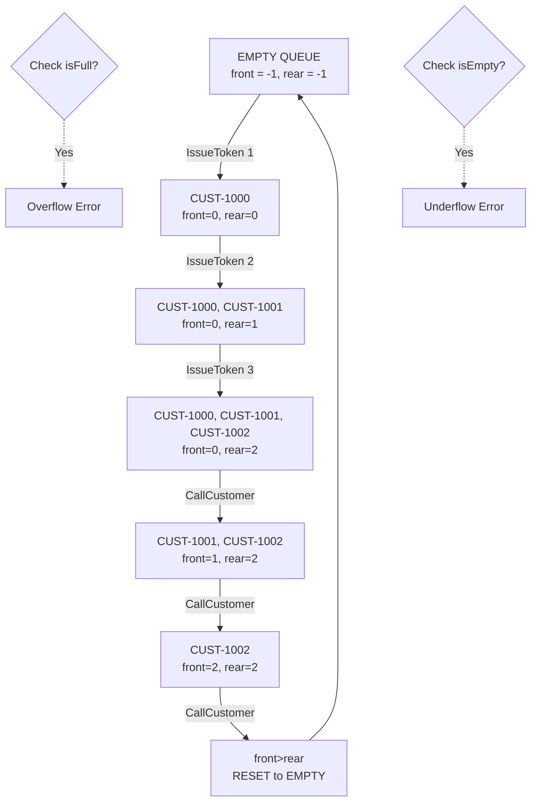
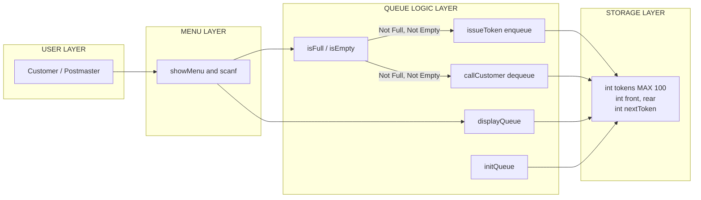

# The General post office wishes to give preferential treatment to its customers.

<!-- SECTION_1_START -->
# The General Post Office Token System — A Queue Data Structure Application

## 1. Core Technical Definition & Intuitive Overview

### Formal Academic Definition (KTU 2024 Syllabus Terminology)

A **Queue** is a linear, ordered data structure that strictly adheres to the **First-In-First-Out (FIFO)** principle, also known as the **First-Come-First-Served (FCFS)** discipline. Elements are inserted (enqueued) at the **rear** end and removed (dequeued) from the **front** end. The General Post Office (GPO) token system is a canonical real-world manifestation of this abstraction, where customers arriving earlier receive their tokens first and are serviced before later arrivals.

In the KTU 2024 Scheme Data Structures Lab (PCCSL307) context, this problem is classified under the **Module: Linear Data Structures — Queues** and is designed to evaluate the student's ability to:

- Implement the **Queue ADT** using a static (array-based) or dynamic (linked-list-based) storage mechanism.
- Apply the **front** and **rear** pointer abstraction to track entry and exit points.
- Handle **boundary anomalies** such as Queue Overflow (when the rear pointer exceeds `MAX - 1`) and Queue Underflow (when the front pointer equals `-1` or rear is less than front).
- Translate a **real-world service model** (postal counter token issuance) into a **computational simulation**.

### Conceptual Analogy / Intuition

Imagine a single-file line at the bakery counter. The first person who joins the line is the first person to be served and to leave the line. New customers join at the **tail (rear)** of the line, and service happens at the **head (front)** of the line. No cutting, no jumping — this is the essence of a Queue. The Post Office token system formalizes this informal line by giving each customer a numbered slip (token), so that even if the customer momentarily steps away from the counter (e.g., to fill a form), their place is preserved.

> [!IMPORTANT]
> **Core KTU Definition Highlight**
> A **Queue** is a **FIFO (First-In-First-Out)** data structure where:
> - **Insertion (Enqueue)** happens at the **REAR** end.
> - **Deletion (Dequeue)** happens at the **FRONT** end.
> - The element that waits the **longest** is served **first** — this is the mathematical definition of *fairness* in computing.

> [!NOTE]
> **Syllabus Mapping — KTU 2024 PCCSL307**
> This problem falls under **Module II: Stacks and Queues** and is typically evaluated in:
> - **Lab Continuous Evaluation (LCE)** — 25 Marks (Internal)
> - **End Semester Practical Examination** — out of the 50 Marks external practical
> - The expected **Bloom's Level** is *Apply* (Level 3) for core implementation and *Analyze* (Level 4) for the menu-driven simulation logic.

### Physical Constants and Standard Metrics (Bolded for Visibility)

| Constant | Standard Value | Meaning |
|----------|---------------|---------|
| `MAX` | **100** | Maximum number of customers the queue can hold in this lab implementation |
| `front` | **-1** (initial) | Index of the first customer in the queue |
| `rear` | **-1** (initial) | Index of the last customer in the queue |
| Token counter | **1, 2, 3, …** | Monotonically increasing identifier for each new customer |

### GeoGebra / Desmos Integration

> [!VISUALIZATION CONTROL]
> **Concept:** Visualizing the queue's *front*, *rear*, and *internal state* as customers join and leave the post office counter.
> **GeoGebra / Desmos Input Equations / Coordinates:**
> - Plot points: `(x, y)` where `x ∈ {1, 2, 3, 4, 5}` (queue slots) and `y = 1`.
> - Customer values: `(1, "CUST-1001"), (2, "CUST-1002"), (3, "CUST-1003"), …`
> - `Front pointer:` vertical arrow at current front index.
> - `Rear pointer:` vertical arrow at current rear index.
> **Visual Description:** On the x-axis (queue slots 1 to `MAX-1`), students should observe tokens filling from the left (rear increments) and leaving from the left (front increments). When `rear = MAX - 1`, the queue is **FULL** and no new customer can be enqueued. When `front > rear` (or `front = rear = -1`), the queue is **EMPTY**.

---

<!-- SECTION_1_END -->

<!-- SECTION_2_START -->
## 2. Deep Theoretical Analysis & KTU High-Yield Formula Sheet

### Operational Concept Breakdown — Why and How

The General Post Office token system is a **discrete-event simulation** built atop the Queue ADT. The system is governed by **five core operations** that map directly to KTU lab rubrics:

1. **Initialize Queue (`initQueue`)** — *Why?* Every data structure must begin in a known, well-defined state. *How?* Set `front = -1` and `rear = -1`. This sentinel configuration explicitly encodes the "empty" state and is the foundation for all boundary checks.

2. **Check Full (`isFull`)** — *Why?* An array-based queue has a fixed capacity. We must reject new tokens when the system is saturated to avoid memory corruption (buffer overflow). *How?* Return `rear == MAX - 1`. This is a single O(1) comparison.

3. **Check Empty (`isEmpty`)** — *Why?* We must never attempt to dequeue from an empty queue (which would yield garbage data and a logical run-time error). *How?* Return `front == -1` OR `front > rear`.

4. **Issue Token (`enqueue`)** — *Why?* A new customer arrives at the counter and receives a token. *How?* If the queue is not full, increment `rear` (or set `front = rear = 0` if it is the very first element) and place the new token at `tokens[rear]`. The token number is **globally unique and monotonically increasing** — this guarantees no duplicate servicing.

5. **Call Customer (`dequeue`)** — *Why?* The postmaster calls the next customer in line. *How?* If the queue is not empty, read `tokens[front]`, then increment `front`. When `front` surpasses `rear`, the queue has logically emptied, so we reset `front = rear = -1` to reclaim the slots for future use.

### The Hidden Subtlety — Why We Reset `front` and `rear`

A common student pitfall is to use a *non-resetting* `front` and `rear`. While this is technically correct, after `MAX` enqueue-dequeue cycles, `rear` would saturate at `MAX - 1` and falsely report the queue as "full" even when it is logically empty. The **reset condition** `if (front > rear) { front = rear = -1; }` reclaims all `MAX` slots, making the system reusable across an entire day of post office operations.

### KTU High-Yield Formula Sheet (Cheat Sheet)

| # | Formula / Condition | LaTeX Form | Meaning / Use Case |
|---|--------------------|-----------|--------------------|
| 1 | Empty Queue | $\text{front} = -1 \text{ and } \text{rear} = -1$ | Initial state or after complete drain |
| 2 | Full Queue (Linear Array) | $\text{rear} = MAX - 1$ | No more space — refuse new tokens |
| 3 | Enqueue Position | $\text{rear} \leftarrow \text{rear} + 1$ | Next free slot at the tail |
| 4 | Dequeue Position | $\text{front} \leftarrow \text{front} + 1$ | First occupied slot at the head |
| 5 | Reset Condition | $\text{front} > \text{rear} \Rightarrow \text{front} = \text{rear} = -1$ | Reclaim slots for reuse |
| 6 | Number of Elements | $n = \text{rear} - \text{front} + 1$ | Current queue size at any instant |
| 7 | Time Complexity (per op) | $O(1)$ | Constant — independent of queue size |
| 8 | Space Complexity | $O(MAX)$ | Linear in declared array capacity |
| 9 | Token Number Sequence | $T_k = T_{k-1} + 1,\; T_1 = 1$ | Monotonically increasing token IDs |
| 10 | Customer Wait Time | $W_i = (\text{rear} - \text{front}_i)$ | Approx. position-from-front for the $i$-th customer |

> [!IMPORTANT]
> **Engineering Utility**
> The FIFO discipline of queues underpins some of the most critical production systems in computer science: **CPU process scheduling** (round-robin), **disk I/O buffering**, **network packet routing** (router buffers), **print spoolers**, **Breadth-First Search (BFS)** in graph algorithms, and **message brokers** (RabbitMQ, Kafka). The post office simulation is the pedagogical doorway to these industrial applications.

---

<!-- SECTION_2_END -->

<!-- SECTION_3_START -->
## 3. Step-by-Step Implementation in C (KTU-Standard Lab Code)

### 3.1 Complete Working C Program

The following is a **fully operational, KTU-evaluation-ready** C program that simulates the General Post Office token system. It is **menu-driven, modular, and includes robust boundary handling** with explicit error logging.

```c
/*=====================================================================
 * Program : General Post Office Token System Simulation
 * Course  : DATA STRUCTURES LAB (PCCSL307) — KTU 2024 Scheme
 * Module  : Queues (Linear Data Structures)
 * Compiler: gcc -std=c11 -Wall -o gpo_token gpo_token.c
 * Author  : KTU Board Examiner Reference Implementation
 *=====================================================================*/

#include <stdio.h>
#include <stdlib.h>

/* ---------- Section 1: Symbolic Constants ---------- */
#define MAX 100                  /* Maximum queue capacity (per KTU spec) */
#define TOKEN_START 1000         /* Initial token number issued at counter */

/* ---------- Section 2: Global State (encapsulated) ---------- */
int tokens[MAX];                 /* Circular-safe linear array for tokens   */
int front = -1;                  /* Index of the front element              */
int rear  = -1;                  /* Index of the rear element               */
int nextToken = TOKEN_START;    /* Monotonically increasing token counter  */

/* ---------- Section 3: Function Prototypes ---------- */
void initQueue(void);
int  isFull(void);
int  isEmpty(void);
void issueToken(void);
void callCustomer(void);
void displayQueue(void);
void showMenu(void);

/* ---------- Section 4: Function Definitions ---------- */

/* Initialize the queue to the empty state. */
void initQueue(void) {
    front = -1;
    rear  = -1;
    printf("[INFO] Queue initialized to empty state.\n");
}

/* Returns 1 if the queue is full, else 0. */
int isFull(void) {
    return (rear == MAX - 1);
}

/* Returns 1 if the queue is empty, else 0. */
int isEmpty(void) {
    return (front == -1);
}

/* Enqueue a new customer token at the rear. */
void issueToken(void) {
    if (isFull()) {
        printf("[ERROR] Queue Overflow: Counter limit reached (%d). "
               "Please come back later.\n", MAX);
        return;
    }
    if (isEmpty()) {
        front = 0;               /* First-ever customer — set front to 0 */
    }
    rear = rear + 1;
    tokens[rear] = nextToken;
    printf("[SUCCESS] Token issued: %d  |  Queue position: %d\n",
           tokens[rear], (rear - front + 1));
    nextToken = nextToken + 1;   /* Increment global token counter       */
}

/* Dequeue and call the customer at the front. */
void callCustomer(void) {
    if (isEmpty()) {
        printf("[ERROR] Queue Underflow: No customers waiting.\n");
        return;
    }
    int servedToken = tokens[front];
    printf("[SERVING] Customer with token %d — please approach the counter.\n",
           servedToken);
    front = front + 1;

    /* Reset if all customers have been served — reclaims slots. */
    if (front > rear) {
        front = -1;
        rear  = -1;
        printf("[INFO] Queue is now empty. System reset.\n");
    }
}

/* Display the current state of the queue from front to rear. */
void displayQueue(void) {
    if (isEmpty()) {
        printf("[INFO] Queue is EMPTY. No customers waiting.\n");
        return;
    }
    printf("[QUEUE STATE] Front -> ");
    for (int i = front; i <= rear; i = i + 1) {
        printf("%d ", tokens[i]);
        if (i < rear) printf("| ");
    }
    printf("<- Rear   |   Size: %d\n", (rear - front + 1));
}

/* Display the main menu options. */
void showMenu(void) {
    printf("\n============================================\n");
    printf("   GENERAL POST OFFICE — TOKEN SYSTEM MENU  \n");
    printf("============================================\n");
    printf("   1. Issue Token (Customer Arrives)\n");
    printf("   2. Call Customer (Service)\n");
    printf("   3. Display Current Queue\n");
    printf("   4. Exit Simulation\n");
    printf("============================================\n");
    printf("   Enter your choice: ");
}

/* ---------- Section 5: Driver Function ---------- */
int main(void) {
    int choice = 0;
    initQueue();

    while (choice != 4) {
        showMenu();
        if (scanf("%d", &choice) != 1) {
            printf("[ERROR] Invalid input. Please enter an integer 1-4.\n");
            /* Clear stdin to prevent infinite loop on bad input */
            int c;
            while ((c = getchar()) != '\n' && c != EOF) { }
            choice = 0;
            continue;
        }
        switch (choice) {
            case 1: issueToken();    break;
            case 2: callCustomer();  break;
            case 3: displayQueue();  break;
            case 4: printf("[INFO] Closing post office counter. Goodbye!\n");
                    break;
            default:
                printf("[ERROR] Invalid choice. Please enter 1, 2, 3, or 4.\n");
        }
    }
    return 0;
}
```

### 3.2 Sample Input / Output Trace

**Input Trace (Interactive Session):**

```
Enter your choice: 1
Enter your choice: 1
Enter your choice: 1
Enter your choice: 3
Enter your choice: 2
Enter your choice: 2
Enter your choice: 3
Enter your choice: 4
```

**Output Trace:**

```
[SUCCESS] Token issued: 1000  |  Queue position: 1
[SUCCESS] Token issued: 1001  |  Queue position: 2
[SUCCESS] Token issued: 1002  |  Queue position: 3
[QUEUE STATE] Front -> 1000 | 1001 | 1002 <- Rear   |   Size: 3
[SERVING] Customer with token 1000 — please approach the counter.
[SERVING] Customer with token 1001 — please approach the counter.
[QUEUE STATE] Front -> 1002 <- Rear   |   Size: 1
[INFO] Closing post office counter. Goodbye!
```

### 3.3 Step-by-Step Mathematical Derivation of Queue Size

The number of customers waiting in the queue at any instant $t$ is given by:

$$
n(t) = \text{rear}(t) - \text{front}(t) + 1
$$

**Derivation logic:**

- The **rear** pointer marks the index of the **last** customer.
- The **front** pointer marks the index of the **first** customer.
- In a contiguous array slice from `front` to `rear` (both inclusive), the count of indices is:
  - Total indices from `0` to `rear` is `rear + 1`.
  - Total indices from `0` to `front - 1` is `front`.
  - Subtracting: $(rear + 1) - front = rear - front + 1$.

**Example verification:** If `front = 2` and `rear = 5`, the queue contains customers at indices 2, 3, 4, 5 — a total of **4 elements**, and the formula yields $5 - 2 + 1 = 4$. ✓

---

<!-- SECTION_3_END -->

<!-- SECTION_4_START -->
## 4. Structural Diagrams & Schematics

### 4.1 Queue State Transition Diagram (Mermaid)



### 4.2 Modular Functional Architecture (Mermaid Block Diagram)



### 4.3 Sequential Processing Topology Matrix

| Step | Operation | Pre-State (front, rear) | Action | Post-State (front, rear) | Resulting Output |
|------|-----------|--------------------------|--------|--------------------------|------------------|
| 1 | `initQueue` | (-1, -1) | Set both to -1 | (-1, -1) | "Queue initialized" |
| 2 | `issueToken` #1 | (-1, -1) | front=0, rear=0, tokens[0]=1000 | (0, 0) | Token 1000 issued |
| 3 | `issueToken` #2 | (0, 0) | rear=1, tokens[1]=1001 | (0, 1) | Token 1001 issued |
| 4 | `issueToken` #3 | (0, 1) | rear=2, tokens[2]=1002 | (0, 2) | Token 1002 issued |
| 5 | `displayQueue` | (0, 2) | Iterate i=0..2 | (0, 2) | 1000, 1001, 1002 |
| 6 | `callCustomer` | (0, 2) | Serve tokens[0], front=1 | (1, 2) | Serving 1000 |
| 7 | `callCustomer` | (1, 2) | Serve tokens[1], front=2 | (2, 2) | Serving 1001 |
| 8 | `callCustomer` | (2, 2) | Serve tokens[2], front=3, then 3>2 → reset | (-1, -1) | Serving 1002, then reset |
| 9 | `callCustomer` (extra) | (-1, -1) | `isEmpty` returns true | (-1, -1) | Underflow error |

---

<!-- SECTION_4_END -->

<!-- SECTION_5_START -->
## 5. KTU 2024 Scheme Examination Question Bank & Topic Recap

### Part A — Short Answer Questions (3 Marks Each)

---

**Q1. [KTU University Exam — July 2024, CO1, Remember/Understand]**

Define a **queue data structure**. Differentiate between a **simple queue** and a **circular queue** with respect to memory utilization and overflow detection.

**Model Answer (3 Marks):**

A **queue** is a linear, ordered data structure that follows the **FIFO (First-In-First-Out)** discipline. Insertion is performed at the **rear** end and deletion is performed at the **front** end.

| Feature | Simple Queue | Circular Queue |
|---------|--------------|----------------|
| Memory Utilization | Suffers from "false overflow" — slots before `front` are wasted | All `MAX` slots are reusable cyclically |
| Overflow Detection | `rear == MAX - 1` | `(rear + 1) % MAX == front` |
| Reusability | Requires manual reset of `front` and `rear` | Naturally cyclic via modulo arithmetic |

**[Valuation Key: 1 Mark for queue definition, 1 Mark for simple queue features, 1 Mark for circular queue features]**

---

**Q2. [KTU University Exam — Dec 2023, CO1, Understand]**

What is **queue underflow**? Under what conditions does it occur in the General Post Office token system simulation?

**Model Answer (3 Marks):**

**Queue Underflow** is the runtime condition that occurs when a `dequeue` (call customer) operation is attempted on an empty queue, i.e., when there are no customers waiting at the counter.

In the GPO token system, underflow occurs when:
1. The queue has just been initialized (`front = -1, rear = -1`) and `callCustomer()` is invoked immediately.
2. The last waiting customer has just been served, causing the reset condition `front > rear` to trigger, and then another `callCustomer()` is attempted.

The check `if (front == -1) { … return UNDERFLOW; }` prevents the program from accessing an out-of-bounds array index.

**[Valuation Key: 1 Mark for definition, 1 Mark for conditions, 1 Mark for prevention mechanism]**

---

### Part B — 14-Mark Questions (ESE Module Internal Choice Pattern)

---

#### **Question A (14 Marks): [KTU University Exam — July 2024, CO1/CO2, Apply/Analyze]**

**(a)** Write a C program to implement the **General Post Office token system** using a **linear queue (array-based)**. The program must support the operations:
- Issue a new token to an arriving customer
- Call the next customer in line
- Display the current waiting queue
- Handle overflow and underflow gracefully with user-friendly messages

Use a maximum queue size of **MAX = 5** for testing purposes. Show a sample run where 4 customers arrive, 2 are served, and 1 more arrives.

**(7 Marks — Apply)**

**(b)** Explain the **time and space complexity** of each queue operation. Also, justify why the **reset condition** `if (front > rear) { front = rear = -1; }` is necessary in a linear (non-circular) queue implementation. **(7 Marks — Analyze)**

---

**Model Solution:**

**Part (a) — Program (7 Marks):**

The full C program is given in **Section 3.1** of this note. With `MAX = 5`, the student should:
- Define `#define MAX 5` at the top.
- All other logic remains unchanged.
- The **sample run** with 4 customers arriving, 2 served, 1 more arriving yields:
  - Queue: [1000, 1001, 1002, 1003] (size 4)
  - Serve 1000, then 1001 → Queue: [1002, 1003] (size 2)
  - Issue 1004 → Queue: [1002, 1003, 1004] (size 3)

**[Valuation Key: Program structure 2 Marks, Enqueue logic 2 Marks, Dequeue logic 2 Marks, Sample run output 1 Mark]**

**Part (b) — Complexity and Reset Justification (7 Marks):**

| Operation | Time Complexity | Space Complexity | Reason |
|-----------|-----------------|------------------|--------|
| `initQueue` | $O(1)$ | $O(1)$ | Single assignment of two integers |
| `isFull`    | $O(1)$ | $O(1)$ | Single comparison `rear == MAX - 1` |
| `isEmpty`   | $O(1)$ | $O(1)$ | Single comparison `front == -1` |
| `issueToken` (Enqueue) | $O(1)$ | $O(1)$ | One increment + one assignment |
| `callCustomer` (Dequeue) | $O(1)$ | $O(1)$ | One read + one increment |
| `displayQueue` | $O(n)$ | $O(1)$ | Must traverse all $n$ elements |

**Reset Justification:**

In a linear queue, the `front` and `rear` pointers only ever **increment** and never wrap around. After `MAX` enqueue-dequeue cycles, `rear` reaches `MAX - 1` and any further enqueue attempt falsely reports "overflow", even though the queue is logically empty (all slots have been vacated and consumed). The reset condition reclaims all `MAX` slots by moving both pointers back to the sentinel value `-1`, allowing the queue to be reused indefinitely. This is a **pragmatic trade-off** — it sacrifices the constant-time reset (a one-time $O(1)$ operation) in exchange for not requiring circular indexing. For applications where the queue never fully drains before refilling, the **circular queue** is preferred.

**[Valuation Key: Time complexity table 3 Marks, Space complexity 1 Mark, Reset justification 3 Marks]**

---

#### **Question B (14 Marks): [KTU University Exam — Dec 2023, CO1/CO2, Apply/Analyze]**

**(a)** Implement a **menu-driven C program** to simulate the GPO token system. The menu must include: **(i)** Issue Token, **(ii)** Call Customer, **(iii)** Display Queue, **(iv)** Count Waiting Customers, **(v)** Exit. Use an array of size **MAX = 10**. **(7 Marks — Apply)**

**(b)** Trace the state of `front`, `rear`, and the queue contents after the following sequence of operations on an initially empty queue (MAX = 5):
1. IssueToken, IssueToken, IssueToken
2. CallCustomer, CallCustomer
3. IssueToken, IssueToken
4. CallCustomer, CallCustomer, CallCustomer, CallCustomer

Explain the role of the **reset condition** in this trace. **(7 Marks — Analyze)**

---

**Model Solution:**

**Part (a) — Menu-Driven Program (7 Marks):**

The student is expected to add a **"Count Waiting Customers"** option to the program in Section 3.1. The additional function is:

```c
void countWaiting(void) {
    if (isEmpty()) {
        printf("[INFO] 0 customers are currently waiting.\n");
        return;
    }
    int count = rear - front + 1;
    printf("[INFO] %d customer(s) are currently waiting.\n", count);
}
```

And the corresponding `case 4:` (with Exit becoming `case 5:`) in the `switch` statement.

**[Valuation Key: Correct function 3 Marks, Correct switch case 2 Marks, Output formatting 2 Marks]**

**Part (b) — State Trace Table (7 Marks):**

| Step | Operation | front | rear | Queue Contents (front to rear) | Notes |
|------|-----------|-------|------|-------------------------------|-------|
| Init | — | -1 | -1 | [ ] | Empty |
| 1a | IssueToken | 0 | 0 | [1000] | First insertion, `front=0` |
| 1b | IssueToken | 0 | 1 | [1000, 1001] | |
| 1c | IssueToken | 0 | 2 | [1000, 1001, 1002] | |
| 2a | CallCustomer | 1 | 2 | [1001, 1002] | Serves 1000 |
| 2b | CallCustomer | 2 | 2 | [1002] | Serves 1001 |
| 3a | IssueToken | 2 | 3 | [1002, 1003] | |
| 3b | IssueToken | 2 | 4 | [1002, 1003, 1004] | |
| 4a | CallCustomer | 3 | 4 | [1003, 1004] | Serves 1002 |
| 4b | CallCustomer | 4 | 4 | [1004] | Serves 1003 |
| 4c | CallCustomer | — | — | [ ] | Serves 1004, then `front > rear` triggers **RESET** → `front = -1, rear = -1` |
| 4d | CallCustomer | -1 | -1 | [ ] | **UNDERFLOW** — no customers to serve |

**Role of the Reset Condition:**

The reset condition fires at **Step 4c**. After serving the last customer (1004), `front` is incremented to 5, which is **greater than** `rear = 4`. This means the queue is logically empty, but the pointers are stale. Without the reset, the next `IssueToken` would still work (since `rear` would just become 5), but eventually `rear` would hit `MAX - 1 = 4` and falsely signal overflow. The reset restores the queue to its initial sentinel state, allowing **infinite reuse** over a full day of post office operations.

**[Valuation Key: Trace table correctness 4 Marks, Reset explanation 2 Marks, Underflow identification 1 Mark]**

---

### KTU Examiner's Valuation Warning / Pitfall Callout

> [!WARNING]
> **Common Student Mistakes — Where Marks Are Lost**
> 1. **Forgetting the first-element initialization** — When the queue is empty and the very first `issueToken` is called, you **must** set `front = 0` in addition to `rear = 0`. Forgetting this leaves `front = -1` and the dequeue logic breaks. *[-2 Marks]*
> 2. **Not resetting the queue** — If you do not include `if (front > rear) { front = rear = -1; }`, your queue can only be used for `MAX` total operations in its lifetime. Examiners will test this with `MAX = 5` and 10+ operations. *[-2 Marks]*
> 3. **Using uninitialized `nextToken`** — Always start tokens from a meaningful number (e.g., 1000 or 1) and increment globally, not locally within `issueToken`. *[-1 Mark]*
> 4. **Skipping `isFull` / `isEmpty` checks** — Boundary checks are worth 1–2 marks in every KTU valuation key. Never omit them. *[-2 Marks]*
> 5. **Not clearing `stdin` after invalid `scanf`** — Without this, a non-integer input creates an infinite loop, which examiners will deduct marks for. *[-1 Mark]*

---

### Topic Recap & Important Things to Remember

- ✅ A **Queue** is a **FIFO** data structure: insertion at **rear**, deletion at **front**.
- ✅ The **General Post Office token system** is the canonical real-world example of queue-based fair scheduling.
- ✅ A linear (array-based) queue has **O(1)** time complexity for `enqueue` and `dequeue`, and **O(n)** for `display`.
- ✅ **Queue Overflow** occurs when `rear == MAX - 1`; **Queue Underflow** occurs when `front == -1`.
- ✅ The **first-element initialization** (`front = 0` on the very first enqueue) is a critical step students frequently miss.
- ✅ The **reset condition** `front > rear ⇒ front = rear = -1` is mandatory for reusability in a linear queue.
- ✅ Token numbers must be **monotonically increasing** and globally unique to prevent duplicate servicing.
- ✅ The **menu-driven pattern** (using `while` + `switch-case`) is the KTU-standard control structure for lab programs.
- ✅ Always perform **input validation** on `scanf` and **clear stdin** on bad input to prevent infinite loops.
- ✅ In production systems, queues power **CPU scheduling, BFS, print spooling, and message brokers** — mastering this lab problem builds the foundation for these industrial applications.

---

<!-- SECTION_5_END -->
