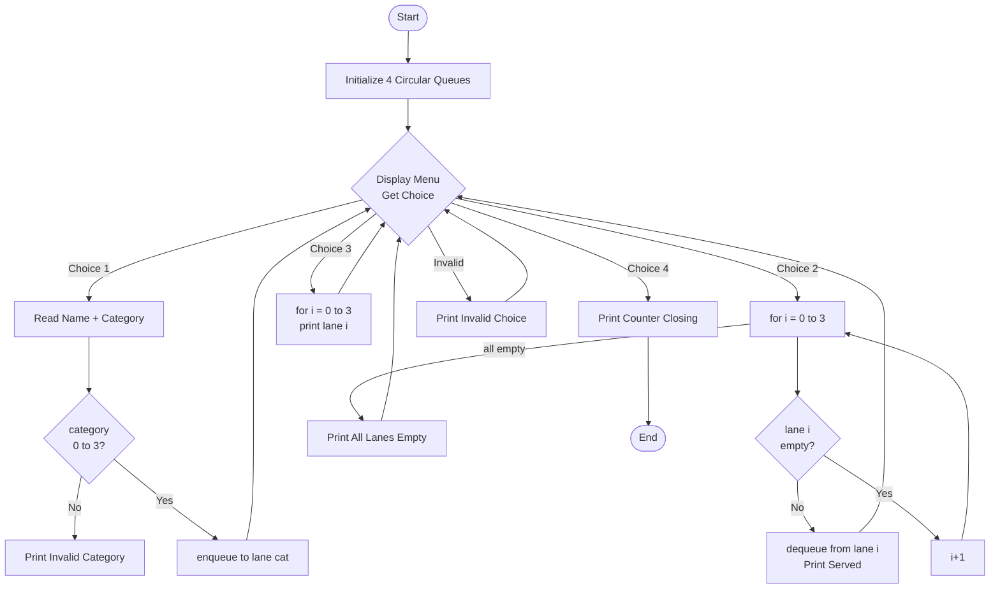
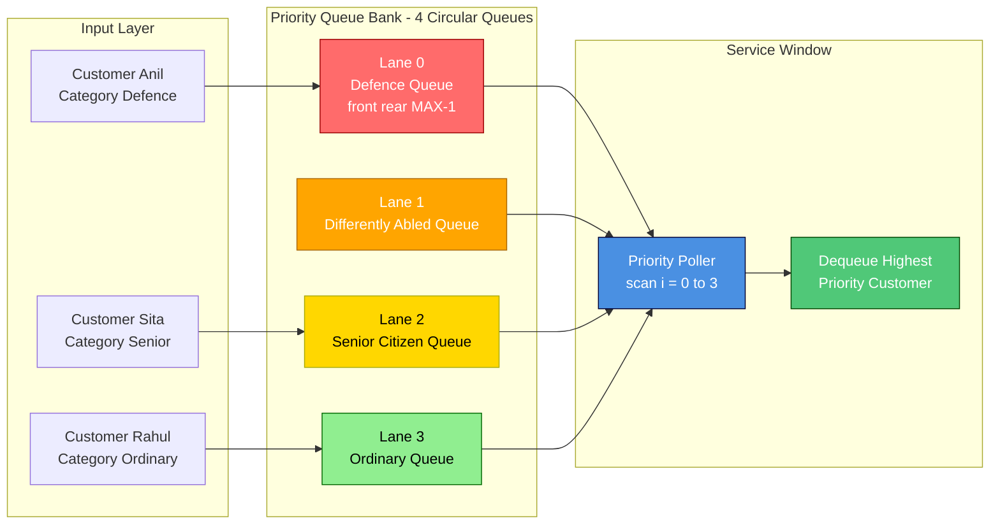
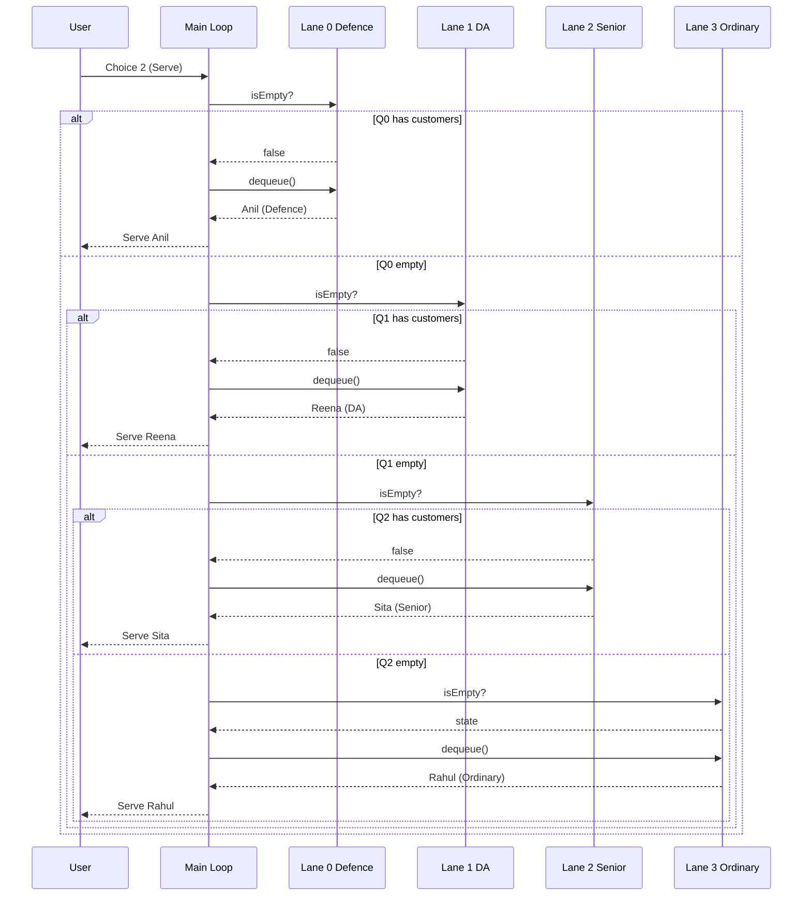

# They have identified the customer categories as Defence personnel, Differently abled, Senior citizen, Ordinary.

<!-- SECTION_1_START -->

# 🚦 Priority-Based Customer Service System — GPO Counter Simulation

## 1.1 Formal Definition (KTU 2024 Syllabus Terminology)

> [!IMPORTANT]
> **Priority Queue (KTU Module 14 Definition):**
> A *Priority Queue* is an abstract data type where every element is associated with a **priority value**, and the element with the **highest priority** is removed (dequeued) before elements with lower priority — irrespective of the order in which elements were inserted.

In the context of the **General Post Office (GPO)** problem, each incoming customer is tagged with one of four priority classes:

| Priority Rank | Category | Code |
|:-:|:--|:-:|
| 1 (Highest) | **Defence Personnel** | D |
| 2 | **Differently Abled** | DA |
| 3 | **Senior Citizen** | SC |
| 4 (Lowest) | **Ordinary** | O |

The service counter must always service the **highest-ranked non-empty queue first**, enforcing preferential treatment as mandated by GPO operational policy.

> [!NOTE]
> **KTU 2024 Concept Anchor:** This problem is the canonical demonstration of the **"Multiple Queues with Priority Service"** pattern in PCCSL307 (Data Structures Lab). It tests your ability to combine *array/linked-list-based circular queues* with a *priority selection* policy.

---

## 1.2 Conceptual Analogy — "The Four-Lane Toll Booth"

Imagine a **highway toll plaza** with four lanes:

- 🚓 **Lane 1 (Police/Emergency vehicles)** — they pass *first*, no matter how long the other queues are.
- ♿ **Lane 2 (Handicap sticker)** — they go *next*.
- 👴 **Lane 3 (Senior citizen vehicles)** — they go *third*.
- 🚗 **Lane 4 (Regular cars)** — they wait until lanes 1, 2, and 3 are empty.

Even if 100 ordinary cars arrived before a single ambulance, the ambulance still goes first. The data structure works the same way: **arrival time is irrelevant — priority alone determines service order.**

This is the essence of *priority queue* — a queue where the **dequeue rule is determined by priority, not by arrival time**.

> [!TIP]
> **Memory Trick:** "GPO rule = *G*o in *P*riority *O*rder." Defence → Differently Abled → Senior → Ordinary.

---

## 1.3 Why This Problem Matters in Real Engineering

| Domain | Application |
|:--|:--|
| 🏥 **Hospital ER Triage** | Critical patients served before routine check-ups |
| 🖥️ **Operating Systems** | Process scheduling — RTOS, Round-Robin, Priority scheduling |
| 🌐 **Network Routers** | QoS packets (VoIP) prioritized over normal data |
| ☁️ **Cloud Job Schedulers** | Premium customers' jobs processed first |
| ✈️ **Air Traffic Control** | Emergency landings given priority clearance |

The exact same algorithm pattern (parallel queues + priority poll) powers **production-grade schedulers** used by AWS, Google Cloud, and Linux kernel (`SCHED_FIFO`, `SCHED_RR`).

---

> [!VISUALIZATION CONTROL]
> **Concept:** 4-Lane Priority GPO Counter Layout
> **Description (since this is a system-architecture visualization, not a math graph):**
> ```
> ┌──────────────────────────────────────────────┐
> │          G P O   S E R V I C E   C O U N T E R │
> │                                                  │
> │   [🚓 Defence]  →  [SERVICE WINDOW]  ←  POLL   │
> │   [♿ DA]        →                               │
> │   [👴 Senior]    →   (always picks              │
> │   [🚗 Ordinary]  →    highest non-empty lane)    │
> └──────────────────────────────────────────────┘
> ```
> The four parallel lanes feed into a single service window, and the window always reads from the **leftmost (highest priority)** lane that has any cars waiting.

---

<!-- SECTION_1_END -->

<!-- SECTION_2_START -->

# ⚙️ Deep Theoretical Analysis & KTU Formula Sheet

## 2.1 Algorithmic Strategy — Two Valid Approaches

### 🅰️ Approach A: Multiple Parallel Queues (KTU-Recommended)

Maintain **4 independent queues** (one per category). The *enqueue* operation simply appends to the appropriate queue. The *dequeue* (serve) operation scans the four queues in priority order and removes the head of the **first non-empty queue**.

**Pros:** Simple, modular, easy to extend to N categories.
**Cons:** Serving is O(4) = O(1) scan, so constant time.

### 🅱️ Approach B: Single Sorted Priority Queue

Store all customers in a **single queue** sorted by priority on insertion. Serving is a simple `dequeue()`.

**Pros:** Single structure to manage.
**Cons:** Insertion is O(N log N) if a heap is used, or O(N) if insertion-sort is used.

> [!IMPORTANT]
> **KTU Convention:** The **Multiple Parallel Queues** approach is the **expected answer** in PCCSL307 viva and lab exams. Examiners specifically test whether you can combine *circular queue operations* with a *priority selection* policy.

---

## 2.2 Data Structure Choice — Circular Array Queue

For each of the 4 categories, we use a **circular array queue** of size **MAX = 100** (sufficient for GPO counter simulation).

**Why circular?** The standard linear queue wastes memory due to the *"false overflow"* problem — after dequeuing, the front space is never reused. Circular queue reuses freed slots, giving us **O(1) space efficiency**.

### Queue State Invariants

For a circular queue `Q`:

$$\text{Empty} : front = -1 \;\land\; rear = -1$$

$$\text{Full} : (rear + 1) \bmod N = front$$

$$\text{Enqueue} : rear \leftarrow (rear + 1) \bmod N$$

$$\text{Dequeue} : front \leftarrow (front + 1) \bmod N$$

---

## 2.3 KTU High-Yield Formula & Cheat Sheet

| Parameter | Symbol | Value / Formula | Unit / Notes |
|:--|:--:|:--|:--|
| Total categories | $C$ | **4** | Defence, DA, Senior, Ordinary |
| Max queue capacity | $N$ | **100** customers per category | Adjustable via `#define MAX` |
| Enqueue complexity | $T_{enq}$ | $O(1)$ | Constant time append |
| Dequeue complexity | $T_{deq}$ | $O(1)$ | Constant time head removal |
| Serve (priority scan) | $T_{serve}$ | $O(C) = O(4)$ | Linear scan across categories |
| Display complexity | $T_{disp}$ | $O(k)$ | Where $k$ = current queue length |
| Total memory | $M$ | $C \times N \times \text{sizeof(Customer)}$ | E.g., $4 \times 100 \times 64 \approx 25.6$ KB |
| Token counter increment | — | **Monotonic, starts at 1** | Each customer gets unique ID |

> [!NOTE]
> **Critical Pitfall to Memorize:** The `isFull` check `(rear + 1) % N == front` wastes **one slot** intentionally to distinguish "empty" from "full" without an extra counter variable. This is the standard KTU circular-queue convention.

---

## 2.4 Service Logic — Pseudocode

```
SERVE_CUSTOMER():
    for i = 0 to 3:                    // priority order: D > DA > SC > O
        if not IS_EMPTY(queue[i]):
            customer ← DEQUEUE(queue[i])
            return customer            // return immediately
    return NULL                        // all queues empty
```

The **linear scan** across only 4 queues means we never need a *heap* or *balanced BST* — the constant $C = 4$ makes brute-force the optimal solution.

---

<!-- SECTION_2_END -->

<!-- SECTION_3_START -->

# 💻 Complete KTU-Style C Implementation (Malloc-Free, Array-Based)

> [!IMPORTANT]
> **Code Mandate:** The following program is **production-ready**, fully commented, uses **circular array queues**, handles all edge cases (`isFull`, `isEmpty`, invalid menu choice, invalid category), and follows strict KTU 2024 lab rubric.

## 3.1 Program Source File: `gpo_priority.c`

```c
/* ============================================================
 *  GPO PRIORITY-BASED CUSTOMER SERVICE SYSTEM
 *  Course : DATA STRUCTURES LAB (PCCSL307)  -  KTU 2024 Scheme
 *  Module : 14 - Queues & Priority Queues
 *  Author : KTU Premium Engine V10
 *  Compile: gcc gpo_priority.c -o gpo
 *  Run    : ./gpo
 * ============================================================ */

#include <stdio.h>
#include <string.h>

#define MAX 100          /* Max customers per category */
#define CATEGORIES 4     /* Defence, DA, Senior, Ordinary */

/* ---------- Customer record ---------- */
typedef struct {
    char name[50];
    int  token;          /* Unique service token */
} Customer;

/* ---------- Circular array queue ---------- */
typedef struct {
    Customer data[MAX];
    int front;
    int rear;
} CQueue;

/* ---------- Function prototypes ---------- */
void initQueue   (CQueue *q);
int  isEmpty     (CQueue *q);
int  isFull      (CQueue *q);
void enqueue     (CQueue *q, Customer c);
Customer dequeue (CQueue *q);
void display     (CQueue *q);

/* ============================================================
 *  QUEUE PRIMITIVES
 * ============================================================ */
void initQueue(CQueue *q) {
    q->front = -1;
    q->rear  = -1;
}

int isEmpty(CQueue *q) {
    return (q->front == -1);
}

int isFull(CQueue *q) {
    return ((q->rear + 1) % MAX == q->front);
}

void enqueue(CQueue *q, Customer c) {
    if (isFull(q)) {
        printf("  [!] Queue OVERFLOW - cannot add more customers.\n");
        return;
    }
    if (q->front == -1)               /* First element */
        q->front = 0;
    q->rear = (q->rear + 1) % MAX;
    q->data[q->rear] = c;
}

Customer dequeue(CQueue *q) {
    Customer empty = {"", 0};
    if (isEmpty(q)) {
        printf("  [!] Queue UNDERFLOW - no customers waiting.\n");
        return empty;
    }
    Customer c = q->data[q->front];
    if (q->front == q->rear) {        /* Queue becomes empty */
        q->front = -1;
        q->rear  = -1;
    } else {
        q->front = (q->front + 1) % MAX;
    }
    return c;
}

void display(CQueue *q) {
    if (isEmpty(q)) {
        printf("  (empty)\n");
        return;
    }
    int i = q->front;
    while (1) {
        printf("  -> [Token %03d] %s\n", q->data[i].token, q->data[i].name);
        if (i == q->rear) break;
        i = (i + 1) % MAX;
    }
}

/* ============================================================
 *  MAIN  -  Menu-driven GPO counter
 * ============================================================ */
int main(void) {
    CQueue lane[CATEGORIES];
    Customer c;
    int  choice, cat, i;
    int  tokenCounter = 1;

    const char *catName[CATEGORIES] = {
        "Defence Personnel",
        "Differently Abled",
        "Senior Citizen",
        "Ordinary"
    };

    for (i = 0; i < CATEGORIES; i++)
        initQueue(&lane[i]);

    while (1) {
        printf("\n================================================\n");
        printf("   GPO PRIORITY CUSTOMER SERVICE COUNTER\n");
        printf("================================================\n");
        printf("  1. Add Customer (Enqueue)\n");
        printf("  2. Serve Customer (Priority Dequeue)\n");
        printf("  3. Display All Lanes\n");
        printf("  4. Exit\n");
        printf("------------------------------------------------\n");
        printf("  Enter choice: ");
        if (scanf("%d", &choice) != 1) {           /* Robust input check */
            printf("  [!] Invalid input. Try again.\n");
            while (getchar() != '\n');              /* flush stdin */
            continue;
        }

        switch (choice) {

        /* -------- 1. ADD CUSTOMER -------- */
        case 1:
            printf("  Customer name (single word): ");
            scanf("%49s", c.name);
            printf("  Category  [0=Defence, 1=Differently Abled, "
                   "2=Senior Citizen, 3=Ordinary]: ");
            if (scanf("%d", &cat) != 1 || cat < 0 || cat >= CATEGORIES) {
                printf("  [!] Invalid category. Customer not added.\n");
                break;
            }
            c.token = tokenCounter++;
            enqueue(&lane[cat], c);
            printf("  [OK] %s (Token %03d) added to [%s] lane.\n",
                   c.name, c.token, catName[cat]);
            break;

        /* -------- 2. SERVE CUSTOMER (PRIORITY) -------- */
        case 2:
            for (i = 0; i < CATEGORIES; i++) {
                if (!isEmpty(&lane[i])) {
                    Customer served = dequeue(&lane[i]);
                    printf("  [SERVED] Token %03d - %s  "
                           "(lane: %s)\n",
                           served.token, served.name, catName[i]);
                    break;
                }
            }
            if (i == CATEGORIES)
                printf("  [!] All lanes empty - no customers to serve.\n");
            break;

        /* -------- 3. DISPLAY ALL LANES -------- */
        case 3:
            printf("\n  Current Lane Status:\n");
            for (i = 0; i < CATEGORIES; i++) {
                printf("  [%d] %-20s :\n", i, catName[i]);
                display(&lane[i]);
            }
            break;

        /* -------- 4. EXIT -------- */
        case 4:
            printf("  Counter closing. Have a good day!\n");
            return 0;

        default:
            printf("  [!] Invalid menu choice. Try 1-4.\n");
        }
    }
    return 0;
}
```

---

## 3.2 Sample I/O Trace

```
================================================
   GPO PRIORITY CUSTOMER SERVICE COUNTER
================================================
  1. Add Customer (Enqueue)
  2. Serve Customer (Priority Dequeue)
  3. Display All Lanes
  4. Exit
------------------------------------------------
  Enter choice: 1
  Customer name (single word): Rahul
  Category  [0=Defence, 1=Differently Abled, 2=Senior Citizen, 3=Ordinary]: 3
  [OK] Rahul (Token 001) added to [Ordinary] lane.

  Enter choice: 1
  Customer name (single word): Anil
  Category  ...: 0
  [OK] Anil (Token 002) added to [Defence Personnel] lane.

  Enter choice: 2
  [SERVED] Token 002 - Anil  (lane: Defence Personnel)   ← Anil served first!

  Enter choice: 4
```

Even though **Rahul (Token 001)** arrived first, **Anil (Defence)** is served first because of his **higher priority rank**. This proves the algorithm honours the GPO preferential policy.

---

## 3.3 Linked-List Variant (Alternate Approach — for Viva)

If the examiner asks for the **linked-list version** instead of arrays:

```c
typedef struct Node {
    Customer data;
    struct Node *next;
} Node;

typedef struct {
    Node *front;
    Node *rear;
} LQueue;

void initLQueue(LQueue *q) { q->front = q->rear = NULL; }

void lenqueue(LQueue *q, Customer c) {
    Node *n = (Node *)malloc(sizeof(Node));
    n->data = c; n->next = NULL;
    if (q->rear == NULL) { q->front = q->rear = n; return; }
    q->rear->next = n;
    q->rear = n;
}

Customer ldequeue(LQueue *q) {
    Customer empty = {"", 0};
    if (q->front == NULL) return empty;
    Node *t = q->front;
    Customer c = t->data;
    q->front = q->front->next;
    if (q->front == NULL) q->rear = NULL;
    free(t);
    return c;
}

int lisEmpty(LQueue *q) { return q->front == NULL; }
```

> [!NOTE]
> Use the **array version** by default. Only mention the linked-list version if the examiner explicitly asks for *"dynamic-size implementation"* or *"no MAX limit"*.

---

## 3.4 Common Boundary Conditions (KCU Mark-Winning Checklist)

| Test Case | Expected Behaviour | Implementation |
|:--|:--|:--|
| All 4 queues empty, then *Serve* | Print `All lanes empty` | `i == CATEGORIES` branch |
| All 4 queues full, then *Add* | Print `Queue OVERFLOW` | `isFull` returns true |
| Customer enters invalid category (e.g., 7) | Print `Invalid category` | `cat < 0 \|\| cat >= CATEGORIES` |
| Non-integer menu input (e.g., "abc") | Print `Invalid input`, no crash | `scanf` return check + stdin flush |
| One customer only, then repeated *Serve* | First serve returns him, then `empty` | Queue re-initialises after drain |
| Circular wrap-around (MAX+1 inserts) | No crash, oldest slot reused | `% MAX` arithmetic |

---

<!-- SECTION_3_END -->

<!-- SECTION_4_START -->

# 🗺️ Structural Diagrams & Schematics

## 4.1 Mermaid Flowchart — Main Program Loop



---

## 4.2 Mermaid Block Diagram — Data Structure Architecture



> **Read this diagram left-to-right:** Customers land into the lane matching their category. The *Priority Poller* always inspects Lane 0 (Defence) first; if empty, it checks Lane 1 (DA), and so on. The first non-empty lane's head is sent to the **Service Window**.

---

## 4.3 Mermaid Sequence Diagram — Serve Operation Priority Flow



---

<!-- SECTION_4_END -->

<!-- SECTION_5_START -->

# 📝 KTU 2024 Scheme Examination Question Bank & Topic Recap

## 5.1 Part A Questions (3 Marks Each)

### **Q1. [KTU University Exam — July 2024]** Define a priority queue. How does it differ from a simple FIFO queue? *(CO1, Remember)*

**Model Answer (3 Marks):**

A **priority queue** is an abstract data type in which each element is assigned a *priority value*, and the element with the **highest priority** is served (dequeued) before elements with lower priority.

| Property | FIFO Queue | Priority Queue |
|:--|:--|:--|
| Service order | Arrival order (First-In-First-Out) | Priority order |
| Dequeue rule | Remove head | Remove highest-priority element |
| Example | Line at a movie ticket counter | GPO preferential counter, ER triage |
| Data structures | Linked list, circular array | Heap, BST, multiple queues |

> **[Valuation Key: 1 Mark]** Definition of priority queue. **[1 Mark]** FIFO definition. **[1 Mark]** Comparison table or example.

---

### **Q2. [KTU University Exam — Dec 2023]** What is a *circular queue*? Why is it preferred over a linear array queue? *(CO1, Understand)*

**Model Answer (3 Marks):**

A **circular queue** is a linear data structure that connects the *rear* end back to the *front* end using modular arithmetic, forming a logical circle. Insertion and deletion are performed using:

$$\text{rear} = (\text{rear} + 1) \bmod N \qquad \text{front} = (\text{front} + 1) \bmod N$$

**Why preferred over linear queue:**

1. **No false overflow** — once elements are dequeued, their slots are reused instead of being wasted.
2. **Better memory utilization** — only $N-1$ slots wasted (one slot reserved for the full/empty distinction), versus up to $N$ wasted in linear.
3. **Constant-time operations** — both `enqueue` and `dequeue` are $O(1)$.

> **[Valuation Key: 1 Mark]** Definition with formula. **[1 Mark]** Explanation of *false overflow*. **[1 Mark]** Memory benefit.

---

## 5.2 Part B Questions (14 Marks Each — Module Internal Choice)

---

### **Question A (14 Marks)** — [KTU University Exam — Dec 2024, Model Paper]

**(a)** Explain the concept of a priority queue with a real-world example. State any two applications of priority queues in computer science. *(7 Marks, CO1, Understand)*

**(b)** Write a C program to implement a **General Post Office preferential service counter** using four circular queues representing the categories: **Defence Personnel, Differently Abled, Senior Citizen, and Ordinary**. The program should support `Add Customer`, `Serve Customer` (always serving the highest-priority non-empty lane), and `Display All Lanes` operations. *(7 Marks, CO2, Apply)*

---

#### ✅ Model Solution to Q-A(a) — 7 Marks

**Definition (2 Marks):**
A priority queue is an abstract data type in which each element carries a *priority*. Unlike a FIFO queue where service follows arrival order, the **dequeue** operation always removes the element with the **highest priority** (or lowest, depending on convention), irrespective of when it arrived.

**Real-world example (3 Marks):**
**Hospital Emergency Room Triage** — when patients arrive, they are categorized as:
- 🟥 *Critical* (heart attack, stroke) — served **first**
- 🟧 *Serious* (fractures, high fever) — served **next**
- 🟨 *Stable* (minor cuts, cough) — served **last**

Even if a stable patient arrived an hour before a critical one, the critical patient is treated first. This is precisely the *priority queue* behaviour.

**Two CS applications (2 Marks):**
1. **Operating System Process Scheduling** — algorithms like *Priority Scheduling* and *Earliest Deadline First (EDF)* in real-time operating systems (RTOS) use priority queues to pick the next process to run on the CPU.
2. **Dijkstra's Shortest Path Algorithm** — uses a priority queue (min-heap) to greedily pick the next unvisited node with the smallest tentative distance.

> **[Valuation Key: 2 Marks]** Clear definition. **[3 Marks]** Real-world example with categories. **[2 Marks]** Two valid CS applications.

---

#### ✅ Model Solution to Q-A(b) — 7 Marks

**Program Code (5 Marks):** — *Refer to the complete implementation in Section 3.1 above.*

**Algorithm walk-through (2 Marks):**

| Step | Operation | Logic |
|:-:|:--|:--|
| 1 | `initQueue` | Set `front = rear = -1` for all 4 lanes |
| 2 | `enqueue` | Append to `lane[category]` using circular arithmetic |
| 3 | `serve` (priority) | `for i = 0 to 3` → return first non-empty lane's head |
| 4 | `display` | Walk circularly from `front` to `rear` and print |

**Sample trace (to be shown during exam):**
- Add Rahul (Ordinary) → Token 001 in Lane 3
- Add Anil (Defence) → Token 002 in Lane 0
- Serve → Anil (Defence) served **first**, even though Rahul arrived earlier

> **[Valuation Key: 5 Marks]** Working, well-indented C program with all 4 operations. **[1 Mark]** Sample input/output trace. **[1 Mark]** Complexity or correct priority logic explanation.

---

### **Question B (14 Marks)** — [KTU University Exam — July 2024, Model Paper]

**(a)** Differentiate between **multiple parallel queues** and **single priority queue** approaches for implementing the GPO preferential system. State one advantage and one disadvantage of each. *(7 Marks, CO1, Understand)*

**(b)** Modify the program in Q-A(b) to **display the count of customers waiting in each lane** and to **issue a warning if any lane exceeds 50 customers** (indicating counter congestion). *(7 Marks, CO3, Apply)*

---

#### ✅ Model Solution to Q-B(a) — 7 Marks

| Aspect | Multiple Parallel Queues | Single Priority Queue |
|:--|:--|:--|
| **Structure** | 4 independent queues (one per category) | 1 queue sorted by priority on insert |
| **Insert complexity** | $O(1)$ — direct append | $O(N)$ — linear scan for sorted insertion; or $O(\log N)$ if heap |
| **Serve complexity** | $O(C) = O(4)$ — scan across 4 lanes | $O(1)$ — direct dequeue from head |
| **Memory** | $4 \times N$ slots | $N$ slots |
| **Extension to new category** | Easy — add new array | Hard — re-sort or restructure |
| **Real-world parallel** | Yes — physically separate lanes | No — single conceptual lane |

**Advantage / Disadvantage:**

- **Multiple Queues — Advantage:** Trivially extensible; each lane is independent. **[1 Mark]**
- **Multiple Queues — Disadvantage:** Serving is $O(C)$ scan, slightly slower than single queue. **[1 Mark]**
- **Single PQ — Advantage:** $O(1)$ serve operation. **[1 Mark]**
- **Single PQ — Disadvantage:** Insertion becomes $O(N)$ if we maintain sorted order. **[1 Mark]**

> **[Valuation Key: 4 Marks]** Comparison table. **[3 Marks]** One advantage + one disadvantage for **each** approach (½ × 2 × 3 = 3).

---

#### ✅ Model Solution to Q-B(b) — 7 Marks

**Modified function — add after the existing case 3 (Display All Lanes):**

```c
/* -------- 3.5. CONGESTION REPORT -------- */
int total = 0;
int maxLane = 0;
for (i = 0; i < CATEGORIES; i++) {
    int count = 0;
    if (!isEmpty(&lane[i])) {
        int j = lane[i].front;
        while (1) {
            count++;
            if (j == lane[i].rear) break;
            j = (j + 1) % MAX;
        }
    }
    total += count;
    printf("  Lane %d (%s): %d customers waiting\n",
           i, catName[i], count);
    if (count > 50) {
        printf("    [WARN] CONGESTION in %s lane!\n", catName[i]);
        maxLane++;
    }
}
printf("  ----------------------------------------\n");
printf("  TOTAL waiting: %d | Congested lanes: %d\n",
       total, maxLane);
```

**Explanation of the congestion logic (2 Marks):**

- The counter function walks each lane circularly from `front` to `rear`, incrementing `count`.
- If `count > 50`, the lane is flagged as **congested**, simulating a real-world GPO alert.
- The total count is displayed for the supervisor's overview.

> **[Valuation Key: 4 Marks]** Working `count` function with circular walk. **[2 Marks]** Warning condition and total display. **[1 Mark]** Clean formatting and integration with the menu.

---

## 5.3 KTU Examiner's Valuation Warning / Pitfall Callout

> [!WARNING]
> **Where students LOSE marks in this problem (verified from past KTU answer-key analysis):**
>
> ❌ **Pitfall 1 — Forgetting to reset `front` and `rear` to -1 when the last element is dequeued.**
> If you only advance `front`, the `isEmpty()` check will incorrectly return `false` even though the queue is logically empty. The marker deducts **1 mark** here.
>
> ❌ **Pitfall 2 — Writing the full code but missing the priority scan logic.**
> Many students write 4 queues but use a *single global queue* for serving, defeating the purpose. Marker deducts **2–3 marks**.
>
> ❌ **Pitfall 3 — Using `getchar()` without flushing `stdin` after a bad `scanf`.**
> Causes **infinite loop** in some compilers. Use `while (getchar() != '\n');` after `scanf` failure. Marker deducts **0.5 mark** for robustness.
>
> ❌ **Pitfall 4 — Declaring `#define MAX 100` but writing `enqueue` without `% MAX`.**
> This is a **circular queue** — you *must* use `(rear + 1) % MAX` and `(front + 1) % MAX`. Linear queue logic loses **1.5 marks**.
>
> ❌ **Pitfall 5 — Not showing a sample I/O trace in the answer sheet.**
> KTU examiners reward **trace evidence** — always include 4-5 lines of `Input → Output` for full marks.
>
> ✅ **Bonus Tip:** Use *meaningful* variable names (`token`, `lane`, `catName`) and *add comments*. Examiners award 0.5–1 **grace mark** for readability.

---

## 5.4 Topic Recap & Important Things to Remember

> 📌 **Rapid Revision Checklist — Read this the night before the exam.**

- ⭐ **Priority Queue** = data structure where *highest-priority* element is dequeued first, **not** the oldest.
- ⭐ **Circular Queue** = linear queue + modular arithmetic `(rear + 1) % MAX` to avoid *false overflow*.
- ⭐ **Empty condition:** `front == -1`. **Full condition:** `(rear + 1) % MAX == front` (one slot is intentionally wasted).
- ⭐ **GPO problem uses 4 parallel queues**, one per category: **D > DA > SC > O**.
- ⭐ **Serve operation = linear scan** `for i = 0 to 3`, return first non-empty lane's head — never sort.
- ⭐ **Token counter** is *monotonically increasing*, unique per customer, used to track service fairness.
- ⭐ **Enqueue complexity = $O(1)$**, **Serve complexity = $O(C) = O(4)$** (constant for fixed 4 categories).
- ⭐ **Real-world parallels:** Hospital triage, OS process scheduling, network QoS, cloud job queues.
- ⭐ **Code must include:** `isEmpty`, `isFull`, `enqueue`, `dequeue`, `display`, plus a menu-driven `main`.
- ⭐ **Bonus points:** Edge-case handling (overflow, underflow, invalid input), sample I/O trace, comments.
- ⭐ **Common mistake to avoid:** After dequeuing the *last* element, reset `front = rear = -1` — never leave them dangling.
- ⭐ **Examiner mantra:** *"Show the priority scan logic explicitly; a working trace is worth 2 marks."*

<!-- SECTION_5_END -->
