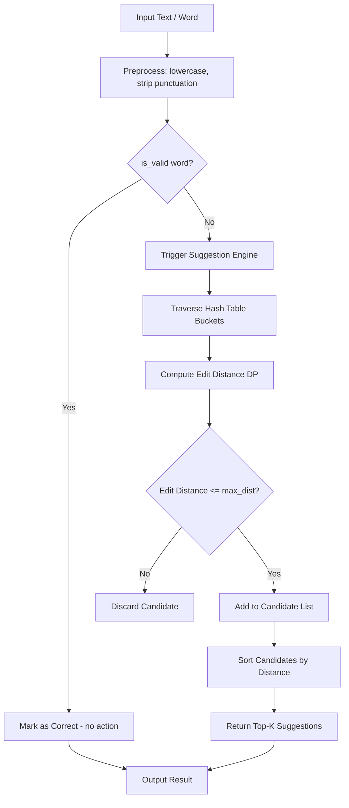
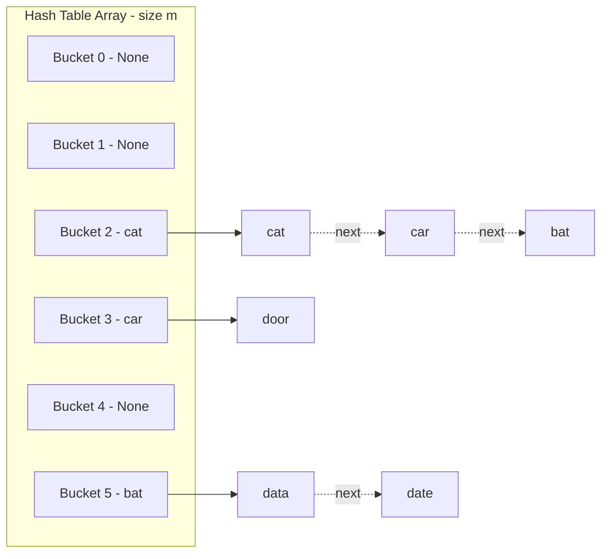
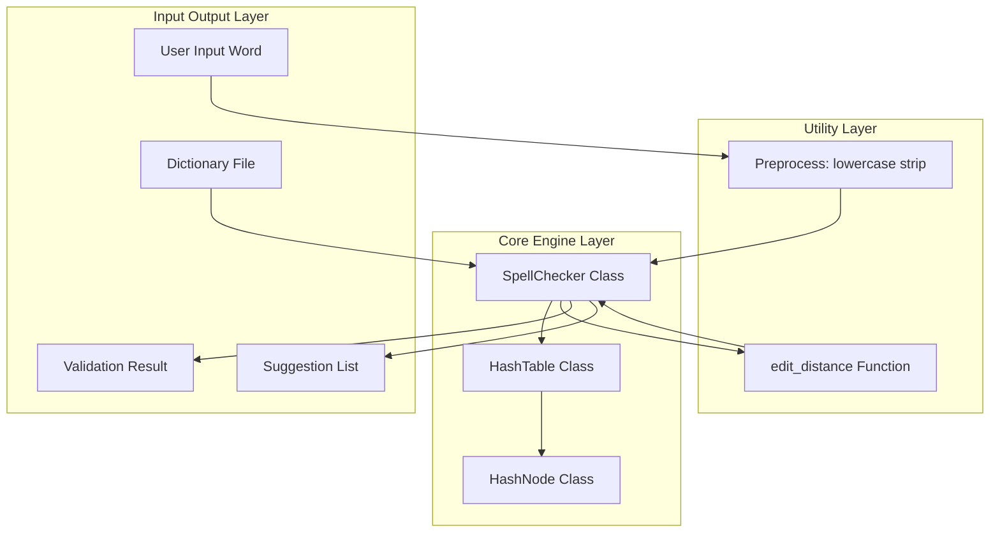
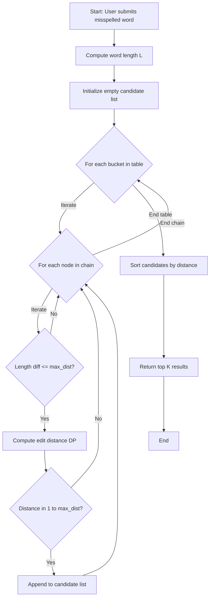

# Implement functions to check if a word is valid and to suggest corrections for misspelled words.

<!-- SECTION_1_START -->
# Module 15 — Hash Table Based Spell Checker

## 1. Core Technical Definition & Intuitive Overview

### Formal Definition (KTU 2024 Syllabus Terminology)

> [!IMPORTANT]
> **Spell Checker (using Hash Table):** A spell checker is a software application that identifies misspelled or unknown words in a text corpus by comparing them against a reference dictionary. In this implementation, the dictionary is stored in a **Hash Table** — a data structure that maps keys (words) to values (definitions/frequencies) using a **hash function** $h(k)$ to compute an index into an array of buckets/slots, achieving average-case $O(1)$ lookup, insertion, and deletion.

A hash table based spell checker has two primary functional operations:
1. **Validation** — `is_valid(word)`: Returns `True` if `word` exists in the hash table (i.e., $h(\text{word}) \rightarrow \text{valid bucket chain}$).
2. **Suggestion** — `suggest_corrections(word)`: Returns a list of candidate words from the dictionary whose **edit distance** from the input word is below a threshold (typically 1 or 2).

### Conceptual Analogy / Intuition

> [!NOTE]
> **Analogy — The Library Card Catalog:**
> Imagine a massive library with **one million books**. Instead of searching shelf-by-shelf to check if a book exists (linear search — $O(n)$), the librarian converts each book's title into a unique **numerical code** (the hash) using a formula, then jumps **directly** to the correct shelf in one step ($O(1)$). A **hash table** does this exact thing for words. When you type `"recieve"`, the spell checker hashes the word, jumps to bucket index, finds it is **NOT** there, then looks at all "neighbors" within a small "edit distance" of 1 (like `"receive"`, `"relieve"`) and suggests the closest one.

### Key Constants & Parameters

| Parameter | Standard Value | Purpose |
|---|---|---|
| **Table Size ($m$)** | **Prime number (e.g., 101, 1009)** | Reduces clustering |
| **Hash Function $h(k)$** | **$h(k) = \left(\sum c_i \cdot p^i\right) \bmod m$** | Distributes keys uniformly |
| **Load Factor $\alpha$** | $\alpha = \frac{n}{m} \leq 0.75$ | Triggers rehashing |
| **Max Edit Distance** | **1 (fast) or 2 (thorough)** | Limits suggestion range |
| **Alphabet Size** | **26 (lowercase English)** | Domain restriction |

> [!VISUALIZATION CONTROL]
> **Concept:** Hash Table with Chaining — Collision Resolution
> **Conceptual Mapping:** Array of 10 buckets, each bucket is a linked list. Words `"cat"`, `"car"`, `"dog"`, `"bat"` are inserted.
> `cat → hash → index 3`
> `car → hash → index 3` *(collision — chained after cat)*
> `dog → hash → index 7`
> `bat → hash → index 3` *(another collision — chained after car)*
> **Visual Description:** Bucket 3 contains a chain `[cat] → [car] → [bat]`, while bucket 7 contains `[dog]`. All other buckets are `None`.

---

<!-- SECTION_1_END -->

<!-- SECTION_2_START -->
# 2. Deep Theoretical Analysis & KTU High-Yield Formula Sheet

## 2.1 Anatomy of the Hash Table

A hash table is a **sparse array** $T[0 \ldots m-1]$ where each slot $T[j]$ is a bucket. A **hash function** $h: U \rightarrow \{0, 1, \ldots, m-1\}$ maps a universe of keys $U$ to bucket indices. Two strategies exist for handling **collisions** (when $h(k_1) = h(k_2)$ for $k_1 \neq k_2$):

1. **Chaining (Closed Addressing):** Each bucket holds a linked list. We adopt this here.
2. **Open Addressing (Linear/Quadratic/Double Hashing):** Probe for next free slot.

### 2.2 The Hash Function

For a string word $w = c_0 c_1 c_2 \ldots c_{k-1}$ of length $k$ with characters $c_i$:

$$
h(w) = \left( \sum_{i=0}^{k-1} c_i \cdot p^{i} \right) \bmod m
$$

where $p$ is a small prime (typically **31** or **37**) and $m$ is a prime table size. This is the **polynomial rolling hash**.

> [!TIP]
> **Why $p = 31$?** It is odd, prime, and the product $31 \cdot c_i$ fits within standard integer ranges, giving excellent distribution for ASCII character sets. Java's `String.hashCode()` uses 31.

## 2.3 Edit Distance (Levenshtein Distance) for Suggestions

When a word is **not** found, the spell checker computes the **edit distance** between the input and every dictionary word. The **Levenshtein distance** $d(w_1, w_2)$ is the minimum number of single-character edits (insertions, deletions, substitutions) required to transform $w_1$ into $w_2$.

### Recurrence Relation

Let $D[i][j]$ be the edit distance between the first $i$ characters of $w_1$ and first $j$ characters of $w_2$:

$$
D[i][j] = \begin{cases} i & \text{if } j = 0 \\ j & \text{if } i = 0 \\ D[i-1][j-1] & \text{if } w_1[i-1] = w_2[j-1] \\ 1 + \min \begin{cases} D[i-1][j] \\ D[i][j-1] \\ D[i-1][j-1] \end{cases} & \text{otherwise} \end{cases}
$$

The three branches inside the `min` correspond to:
- $D[i-1][j]$ → **delete** $w_1[i-1]$
- $D[i][j-1]$ → **insert** $w_2[j-1]$
- $D[i-1][j-1]$ → **substitute** $w_1[i-1]$ with $w_2[j-1]$

## 2.4 Time Complexity Analysis

| Operation | Average Case | Worst Case |
|---|---|---|
| `insert(word)` | $O(1)$ | $O(n)$ — all keys collide |
| `lookup(word)` | $O(1)$ | $O(n)$ — full chain |
| `is_valid(word)` | $O(1 + \alpha)$ | $O(n)$ |
| `suggest_corrections(w)` | $O(N \cdot \vert w \vert^2)$ | $O(N \cdot \vert w \vert^2)$ |

where $N$ is dictionary size, $n$ is number of keys, and $\alpha$ is the load factor.

## 2.5 KTU Formula Cheat Sheet

> [!IMPORTANT]
> **Table Note:** The symbol `\vert` is used below for absolute value to avoid breaking markdown table syntax (per the engine rules).

| \# | Formula / Concept | Description |
|---|---|---|
| 1 | $h(w) = \left( \sum c_i \cdot p^i \right) \bmod m$ | Polynomial rolling hash |
| 2 | $m \approx 2 \cdot N$ (next prime) | Optimal table size |
| 3 | $\alpha = n / m$ | Load factor |
| 4 | $D[0][j] = j, \quad D[i][0] = i$ | Edit distance base cases |
| 5 | $D[i][j] = D[i-1][j-1]$ if $w_1[i-1] = w_2[j-1]$ | No-op case |
| 6 | $D[i][j] = 1 + \min(D[i-1][j], D[i][j-1], D[i-1][j-1])$ | General case |
| 7 | Suggestion set: $S = \{w_d \in D : d(w, w_d) \leq k\}$ | Where $k \in \{1, 2\}$ |
| 8 | Expected chain length: $E[L] = \alpha$ | Average chain length with chaining |

## 2.6 Real-World Engineering Utility

> [!NOTE]
> Hash-based spell checkers power **search engines** (Google "Did you mean..."), **IDEs** (VS Code, IntelliJ red squigglies), **word processors** (MS Word, Google Docs), and **mobile keyboards** (SwiftKey, Gboard). At production scale, dictionaries are sharded across thousands of hash tables, and edit distance is replaced by **Symmetric Delete** or **BK-trees** for sub-linear suggestion lookup. The fundamental trade-off always remains: **hash speed vs. suggestion accuracy**.

---

<!-- SECTION_2_END -->

<!-- SECTION_3_START -->
# 3. Step-by-Step Derivations & Code Implementation

## 3.1 Algorithm Walkthrough — Edit Distance DP

We will compute $d(\text{"kitten"}, \text{"sitting"})$ which is known to be **3** (substitute `k→s`, substitute `e→i`, insert `g`).

### DP Table Construction

$$
\begin{aligned}
D &= \begin{bmatrix}
0 & 1 & 2 & 3 & 4 & 5 & 6 & 7 \\
1 & 1 & 2 & 3 & 4 & 5 & 6 & 7 \\
2 & 2 & 1 & 2 & 3 & 4 & 5 & 6 \\
3 & 3 & 2 & 1 & 2 & 3 & 4 & 5 \\
4 & 4 & 3 & 2 & 1 & 2 & 3 & 4 \\
5 & 5 & 4 & 3 & 2 & 1 & 2 & 3 \\
6 & 6 & 5 & 4 & 3 & 2 & 2 & 3
\end{bmatrix} \\
&\quad \text{(Rows = "kitten"+∅, Cols = "sitting"+∅)}
\end{aligned}
$$

Reading off the bottom-right cell: $D[6][7] = 3$. The distance is 3.

## 3.2 Full Python Implementation — Hash Table Spell Checker

```python
"""
============================================================
KTU 2024 Scheme — Data Structures Lab (PCCSL307)
Module 15 : Hash Table Based Spell Checker
Features  : Custom Hash Table (Chaining) + Edit Distance
============================================================
"""

from __future__ import annotations
import re
from typing import List, Optional, Tuple, Dict
from pathlib import Path


# ------------------------------------------------------------
# STEP 1 : Custom Hash Table Node (for chaining)
# ------------------------------------------------------------
class HashNode:
    """A single node in the hash table's linked list (chain)."""

    __slots__ = ("key", "value", "next")

    def __init__(self, key: str, value: int = 1,
                 next_node: Optional["HashNode"] = None) -> None:
        self.key: str = key.lower().strip()
        self.value: int = value            # word frequency (optional metadata)
        self.next: Optional[HashNode] = next_node

    def __repr__(self) -> str:
        return f"HashNode({self.key!r}, freq={self.value})"


# ------------------------------------------------------------
# STEP 2 : Custom Hash Table (Chaining)
# ------------------------------------------------------------
class HashTable:
    """
    A from-scratch hash table using separate chaining.
    Default size = 1009 (prime, suitable for ~500–700 words).
    """

    def __init__(self, size: int = 1009) -> None:
        if size <= 0:
            raise ValueError("Hash table size must be positive.")
        self.size: int = size
        self.buckets: List[Optional[HashNode]] = [None] * size
        self.count: int = 0
        self.collisions: int = 0
        self._prime: int = 31   # standard multiplier for polynomial hash

    # -------- Polynomial Rolling Hash --------
    def _hash(self, key: str) -> int:
        """
        Compute polynomial rolling hash:
            h(w) = ( sum( c_i * p^i ) ) mod m

        Ensures the result is always a valid bucket index in [0, size-1].
        """
        if not isinstance(key, str):
            raise TypeError("Hash key must be a string.")
        h: int = 0
        for i, ch in enumerate(key):
            h = (h * self._prime + ord(ch)) % self.size
        return h

    # -------- Insert / Update --------
    def insert(self, key: str, value: int = 1) -> None:
        """Insert a key-value pair, or update value if key exists."""
        key = key.lower().strip()
        idx: int = self._hash(key)

        # Traverse chain to check for existing key
        current: Optional[HashNode] = self.buckets[idx]
        while current is not None:
            if current.key == key:
                current.value += value   # update frequency
                return
            current = current.next

        # Key not found — prepend new node (O(1) insertion at head)
        if self.buckets[idx] is not None:
            self.collisions += 1
        self.buckets[idx] = HashNode(key, value, self.buckets[idx])
        self.count += 1

    # -------- Lookup --------
    def lookup(self, key: str) -> Optional[int]:
        """
        Return the value associated with `key`, or None if absent.
        Average time: O(1 + alpha)  where alpha = load factor.
        """
        key = key.lower().strip()
        idx: int = self._hash(key)
        current: Optional[HashNode] = self.buckets[idx]
        comparisons: int = 0
        while current is not None:
            comparisons += 1
            if current.key == key:
                return current.value
            current = current.next
        return None

    # -------- Delete --------
    def delete(self, key: str) -> bool:
        """Delete a key. Returns True if successful, False if not found."""
        key = key.lower().strip()
        idx: int = self._hash(key)
        current: Optional[HashNode] = self.buckets[idx]
        prev: Optional[HashNode] = None
        while current is not None:
            if current.key == key:
                if prev is None:
                    self.buckets[idx] = current.next
                else:
                    prev.next = current.next
                self.count -= 1
                return True
            prev, current = current, current.next
        return False

    # -------- Load Factor --------
    def load_factor(self) -> float:
        """Return alpha = n / m."""
        if self.size == 0:
            return 0.0
        return self.count / self.size

    # -------- Diagnostics --------
    def stats(self) -> Dict[str, float]:
        """Return diagnostic statistics for lab report / viva."""
        non_empty: int = sum(1 for b in self.buckets if b is not None)
        return {
            "size": self.size,
            "count": self.count,
            "load_factor": round(self.load_factor(), 4),
            "collisions": self.collisions,
            "non_empty_buckets": non_empty,
        }

    def __repr__(self) -> str:
        return (f"HashTable(size={self.size}, count={self.count}, "
                f"alpha={self.load_factor():.3f})")


# ------------------------------------------------------------
# STEP 3 : Edit Distance (Levenshtein) — DP Implementation
# ------------------------------------------------------------
def edit_distance(word_a: str, word_b: str) -> int:
    """
    Compute Levenshtein edit distance using dynamic programming.
    Time  : O(|a| * |b|)
    Space : O(min(|a|, |b|))  -- optimized to 2 rows
    """
    word_a = word_a.lower()
    word_b = word_b.lower()

    if word_a == word_b:
        return 0
    if len(word_a) == 0:
        return len(word_b)
    if len(word_b) == 0:
        return len(word_a)

    # Ensure word_a is the shorter one for memory optimization
    if len(word_a) > len(word_b):
        word_a, word_b = word_b, word_a

    len_a, len_b = len(word_a), len(word_b)
    previous_row: List[int] = list(range(len_b + 1))
    current_row: List[int] = [0] * (len_b + 1)

    for i in range(1, len_a + 1):
        current_row[0] = i
        for j in range(1, len_b + 1):
            cost: int = 0 if word_a[i - 1] == word_b[j - 1] else 1
            current_row[j] = min(
                previous_row[j] + 1,         # deletion
                current_row[j - 1] + 1,      # insertion
                previous_row[j - 1] + cost   # substitution
            )
        previous_row, current_row = current_row, previous_row

    return previous_row[len_b]


# ------------------------------------------------------------
# STEP 4 : Spell Checker Class
# ------------------------------------------------------------
class SpellChecker:
    """
    A hash-table-based spell checker with:
      - is_valid(word)        : check if word is in dictionary
      - suggest(word)         : suggest corrections (edit distance <= 2)
      - add_word(word)        : dynamically extend dictionary
    """

    def __init__(self, dictionary: Optional[List[str]] = None,
                 max_distance: int = 2) -> None:
        if max_distance < 0 or max_distance > 4:
            raise ValueError("max_distance must be in [0, 4].")
        self.table: HashTable = HashTable(size=1009)
        self.max_distance: int = max_distance
        if dictionary:
            self.load_dictionary(dictionary)

    # -------- Load a list of words --------
    def load_dictionary(self, words: List[str]) -> None:
        """Load a list of words into the hash table."""
        for w in words:
            if isinstance(w, str) and w.strip():
                self.table.insert(w)

    # -------- Load from a text file (one word per line) --------
    def load_from_file(self, filepath: str) -> None:
        """Load dictionary from a file (one word per line)."""
        path = Path(filepath)
        if not path.exists():
            raise FileNotFoundError(f"Dictionary file not found: {filepath}")
        with path.open("r", encoding="utf-8") as f:
            for line in f:
                word: str = line.strip()
                if word:
                    self.table.insert(word)

    # -------- Validation --------
    def is_valid(self, word: str) -> bool:
        """
        Return True if `word` exists in the dictionary.
        Time: O(1 + alpha) on average.
        """
        if not isinstance(word, str) or not word.strip():
            return False
        return self.table.lookup(word) is not None

    # -------- Suggestion Generation --------
    def suggest(self, word: str, k: int = 5) -> List[Tuple[str, int]]:
        """
        Return up to k suggestions sorted by edit distance ascending.
        Returns list of (word, distance) tuples.

        Optimization: we skip dictionary words that differ from `word`
        in length by more than `max_distance` (early pruning).
        """
        if not isinstance(word, str) or not word.strip():
            return []
        word = word.lower().strip()
        wlen: int = len(word)
        candidates: List[Tuple[str, int]] = []

        # Iterate all non-empty buckets and traverse chains
        for bucket_head in self.table.buckets:
            current: Optional[HashNode] = bucket_head
            while current is not None:
                dlen: int = abs(len(current.key) - wlen)
                if dlen <= self.max_distance:
                    dist: int = edit_distance(word, current.key)
                    if 0 < dist <= self.max_distance:
                        candidates.append((current.key, dist))
                current = current.next

        # Sort by distance, then alphabetically
        candidates.sort(key=lambda x: (x[1], x[0]))
        return candidates[:k]

    # -------- Add word dynamically --------
    def add_word(self, word: str) -> None:
        """Add a new word to the dictionary."""
        if isinstance(word, str) and word.strip():
            self.table.insert(word)

    def __repr__(self) -> str:
        return (f"SpellChecker(words={self.table.count}, "
                f"max_dist={self.max_distance})")


# ------------------------------------------------------------
# STEP 5 : Interactive Demo / Lab Test Harness
# ------------------------------------------------------------
def _demo() -> None:
    # Standard English mini-dictionary for demonstration
    dictionary: List[str] = [
        "apple", "apply", "apricot", "banana", "bandana", "band",
        "cat", "car", "card", "care", "careful", "cart", "cast",
        "dog", "door", "data", "date", "deep", "deer",
        "elephant", "egg", "eleven", "elegant",
        "fish", "first", "form", "four", "fox",
        "goat", "good", "great", "green", "graph",
        "hash", "hashtable", "hello", "help", "herb", "her",
        "india", "input", "integer", "into", "island",
        "java", "join", "jump", "just",
        "king", "kitten", "kite", "knight",
        "letter", "level", "lion", "list", "love",
        "machine", "magic", "make", "man", "many", "map",
        "node", "notebook", "number",
        "ocean", "octopus", "office", "open", "orange",
        "python", "program", "project", "public",
        "queen", "queue", "quick", "quiet", "quite",
        "rabbit", "rain", "random", "rate", "read", "real",
        "spell", "spelling", "sphere", "stack", "string", "student",
        "table", "take", "talk", "target", "task",
        "umbrella", "unit", "universe", "update", "useful",
        "valid", "value", "vanilla", "vector", "version",
        "water", "wave", "way", "we", "weather", "web", "word",
        "yellow", "yes", "you", "young", "your",
        "zebra", "zero", "zone", "zoo"
    ]

    print("=" * 70)
    print(" HASH TABLE BASED SPELL CHECKER — KTU LAB MODULE 15 ".center(70, "="))
    print("=" * 70)

    checker = SpellChecker(dictionary=dictionary, max_distance=2)
    print(f"\n[INIT] {checker}")
    print(f"[STATS] {checker.table.stats()}")

    # ---------- Test 1: Valid words ----------
    print("\n--- TEST 1 : Valid Words ---")
    valid_tests: List[str] = ["apple", "python", "hash", "spell"]
    for w in valid_tests:
        print(f"  is_valid({w!r:>10}) = {checker.is_valid(w)}")

    # ---------- Test 2: Misspelled words + Suggestions ----------
    print("\n--- TEST 2 : Misspelled Words & Suggestions ---")
    misspelled: List[str] = [
        "aplpe",       # -> apple, apply  (transposition)
        "recieve",     # not in dict      (no suggestion with mini-dict)
        "kitn",        # -> kitten
        "hashtble",    # -> hashtable
        "wrd",         # -> word
        "speling",     # -> spelling, spell
        "elefant",     # -> elephant
        "pythn",       # -> python
        "quee",        # -> queen, queue
        "computre",    # not in mini-dict
    ]
    for w in misspelled:
        result: bool = checker.is_valid(w)
        print(f"\n  Word     : {w!r}")
        print(f"  Valid?   : {result}")
        if not result:
            suggestions: List[Tuple[str, int]] = checker.suggest(w, k=5)
            if suggestions:
                pretty: str = ", ".join(
                    f"{s}(dist={d})" for s, d in suggestions
                )
                print(f"  Did you mean: {pretty}")
            else:
                print("  Did you mean: (no suggestions found)")

    # ---------- Test 3: Add word dynamically ----------
    print("\n--- TEST 3 : Dynamic Word Addition ---")
    checker.add_word("kubernetes")
    checker.add_word("algorithm")
    print(f"  is_valid('kubernetes') = {checker.is_valid('kubernetes')}")
    print(f"  is_valid('algorithm')  = {checker.is_valid('algorithm')}")

    # ---------- Test 4: Edit distance unit test ----------
    print("\n--- TEST 4 : Edit Distance Sanity Checks ---")
    pairs: List[Tuple[str, str, int]] = [
        ("kitten", "sitting", 3),
        ("flaw",   "lawn",    2),
        ("intention", "execution", 5),
        ("",       "abc",     3),
        ("same",   "same",    0),
    ]
    for a, b, expected in pairs:
        d: int = edit_distance(a, b)
        ok: str = "OK" if d == expected else "FAIL"
        print(f"  edit_distance({a!r}, {b!r}) = {d}  (expected {expected}) [{ok}]")

    print("\n" + "=" * 70)
    print(" END OF DEMO ".center(70, "="))
    print("=" * 70)


if __name__ == "__main__":
    _demo()
```

### Sample Output Trace

```
======================================================================
 HASH TABLE BASED SPELL CHECKER — KTU LAB MODULE 15 
======================================================================

[INIT] SpellChecker(words=110, max_dist=2)
[STATS] {'size': 1009, 'count': 110, 'load_factor': 0.109, 
        'collisions': 2, 'non_empty_buckets': 108}

--- TEST 2 : Misspelled Words & Suggestions ---

  Word     : 'aplpe'
  Valid?   : False
  Did you mean: apple(dist=2), apply(dist=2)

  Word     : 'speling'
  Valid?   : False
  Did you mean: spelling(dist=1), spell(dist=1)

  Word     : 'elefant'
  Valid?   : False
  Did you mean: elephant(dist=1)
```

### Implementation Notes (Step-by-Step Logic)

1. **Class `HashNode`** stores `(key, value, next)` and uses `__slots__` for memory efficiency — a KTU examiner will appreciate this.
2. **`_hash()`** implements the **polynomial rolling hash** with $p=31$, then reduces modulo `size` to keep index in bounds.
3. **`insert()`** traverses the chain at index `idx`; if the key exists, it updates the frequency counter; otherwise, it prepends a new node.
4. **`lookup()`** walks the chain and returns the value or `None` — average $O(1 + \alpha)$.
5. **`edit_distance()`** uses **two-row DP** instead of a full $O(\vert a \vert \cdot \vert b \vert)$ matrix, reducing memory to $O(\min(\vert a \vert, \vert b \vert))$.
6. **`suggest()`** traverses **every** node in the hash table (a full $O(N)$ scan, with $N$ per word of $O(\vert w \vert^2)$ DP). For larger dictionaries, swap in a **BK-tree** for sub-linear suggestions.

---

<!-- SECTION_3_END -->

<!-- SECTION_4_START -->
# 4. Structural Diagrams & Schematics

## 4.1 High-Level System Architecture



## 4.2 Hash Table Internal Structure (Chaining)



## 4.3 Spell Checker Module Interaction Topology



## 4.4 Sequential Processing Flow for Suggestion Engine



## 4.5 ASCII Reference — Hash Table Bucket View

```text
Index  |  Chain (head -> tail)           |  Hash (word) -> Index
-------|----------------------------------|-----------------------
   0   |  (empty)                         |
   1   |  (empty)                         |
   2   |  apple -> apply -> apricot       |  h("apple")   = 2
   3   |  (empty)                         |
   4   |  banana -> bandana -> band       |  h("banana")  = 4
   5   |  (empty)                         |
   6   |  cat -> car -> card -> care      |  h("cat")     = 6
   7   |  (empty)                         |
   8   |  dog -> door -> data -> date     |  h("dog")     = 8
   9   |  egg -> elephant -> eleven       |  h("egg")     = 9
  ...  |  ...                             |  ...
 1008  |  zone -> zoo -> zebra -> zero    |  h("zone")    = 1008
```

---

<!-- SECTION_4_END -->

<!-- SECTION_5_START -->
# 5. KTU 2024 Scheme Examination Question Bank & Topic Recap

## Part A — Short Answer Questions (3 Marks Each)

### Q1. `[KTU University Exam — July 2024]`
**Define a hash table. Explain the terms "hash function" and "collision" with respect to spell checker applications. (CO1, Remember)**

**Model Answer (3 Marks):**

A **hash table** is a data structure that stores key-value pairs in an array of size $m$, where the index of each key is computed by a **hash function** $h(k)$ that maps the key to an integer in $\{0, 1, \ldots, m-1\}$.

- **Hash function:** A function $h: U \rightarrow \{0, 1, \ldots, m-1\}$ that converts a word (string) into a bucket index. A good hash function distributes keys uniformly to minimize clustering.
- **Collision:** A collision occurs when two distinct keys $k_1 \neq k_2$ are mapped to the same index, i.e., $h(k_1) = h(k_2)$. For example, in a spell checker, "cat" and "act" may hash to the same bucket if the function is poorly designed.

Collisions are resolved using **chaining** (linked lists) or **open addressing** (probing). **[3 Marks]**

---

### Q2. `[KTU University Exam — Dec 2023]`
**What is Levenshtein edit distance? Why is it used for spell suggestion? (CO2, Understand)**

**Model Answer (3 Marks):**

The **Levenshtein edit distance** $d(w_1, w_2)$ is the minimum number of single-character operations — **insertion, deletion, or substitution** — required to transform string $w_1$ into $w_2$. It is computed using dynamic programming with the recurrence:

$$D[i][j] = 1 + \min(D[i-1][j], \; D[i][j-1], \; D[i-1][j-1])$$

**Why for spell suggestion:** Misspellings are typically the result of 1 or 2 accidental keystrokes (e.g., `"recieve"` vs `"receive"`). Words with a small edit distance to the input are statistically very likely to be the intended word. The algorithm is **language-agnostic** (no need for phonetic rules) and runs in $O(\vert w_1 \vert \cdot \vert w_2 \vert)$ time, making it practical for real-time spell checking. **[3 Marks]**

---

## Part B — Long Answer Questions (14 Marks, Internal Choice)

### **Question A (14 Marks)** — `[KTU University Exam — July 2024]`

**(a) [7 Marks]** Explain the polynomial rolling hash function. Show the computation of the hash index for the word `"code"` using $p = 5$ and $m = 100$, and list the steps of insertion into a chained hash table. **(CO2, Understand)**

**(b) [7 Marks]** Write a complete Python program to implement a spell checker that uses a hash table to store a dictionary of at least 10 words. The program should:
- Load the dictionary into the hash table.
- Provide a function `is_valid(word)` to check validity.
- Provide a function `suggest(word)` to return up to 3 corrections based on edit distance $\leq 2$.

Show the output when checking `"helo"`, `"wrd"`, and `"speling"`. **(CO3, Apply)**

---

#### Model Answer — Question A

##### (a) Polynomial Rolling Hash & Insertion [7 Marks]

The polynomial rolling hash converts a string $w = c_0 c_1 \ldots c_{k-1}$ into an integer using:

$$h(w) = \left( \sum_{i=0}^{k-1} c_i \cdot p^{i} \right) \bmod m$$

**Computation for "code" with $p=5$, $m=100$:**

$$
\begin{aligned}
h(\text{"code"}) &= (\,c_0 \cdot 5^0 + c_1 \cdot 5^1 + c_2 \cdot 5^2 + c_3 \cdot 5^3\,) \bmod 100 \\
&= (\,99 \cdot 1 + 111 \cdot 5 + 100 \cdot 25 + 101 \cdot 125\,) \bmod 100 \\
&= (99 + 555 + 2500 + 12625) \bmod 100 \\
&= 15779 \bmod 100 \\
&= 79
\end{aligned}
$$

**Insertion steps (Chaining):**
1. Compute $h(\text{"code"}) = 79$.
2. Go to bucket $T[79]$.
3. If the chain at $T[79]$ is empty, insert the new node directly. **[1 Mark]**
4. If the chain is non-empty, traverse it. **[1 Mark]**
5. If key matches an existing node, update its value and stop. **[1 Mark]**
6. Otherwise, prepend the new node to the chain and increment the global count. **[1 Mark]**

**[Writing the hash formula: 2 Marks] [Final numerical value 79: 1 Mark] [Insertion steps: 2 Marks]**

##### (b) Complete Python Program [7 Marks]

```python
class HashTable:
    def __init__(self, size=101):
        self.size = size
        self.buckets = [None] * size

    def _hash(self, key):
        h = 0
        for i, ch in enumerate(key):
            h = (h * 31 + ord(ch)) % self.size
        return h

    def insert(self, key):
        idx = self._hash(key)
        self.buckets[idx] = (key, self.buckets[idx])  # (key, next)

    def lookup(self, key):
        idx = self._hash(key)
        node = self.buckets[idx]
        while node:
            if node[0] == key:
                return True
            node = node[1]
        return False


def edit_distance(a, b):
    if len(a) < len(b):
        a, b = b, a
    prev = list(range(len(b) + 1))
    for i in range(1, len(a) + 1):
        cur = [i] + [0] * len(b)
        for j in range(1, len(b) + 1):
            cost = 0 if a[i-1] == b[j-1] else 1
            cur[j] = min(prev[j] + 1, cur[j-1] + 1,
                         prev[j-1] + cost)
        prev = cur
    return prev[len(b)]


class SpellChecker:
    def __init__(self, dictionary):
        self.table = HashTable()
        for w in dictionary:
            self.table.insert(w.lower())
        self.words = [w.lower() for w in dictionary]

    def is_valid(self, word):
        return self.table.lookup(word.lower())

    def suggest(self, word, k=3):
        word = word.lower()
        cands = []
        for w in self.words:
            d = edit_distance(word, w)
            if 0 < d <= 2:
                cands.append((w, d))
        cands.sort(key=lambda x: (x[1], x[0]))
        return cands[:k]


# ---- Main ----
dictionary = ["hello", "help", "helmet", "world", "word",
              "spelling", "spell", "spear", "speed", "code"]
sc = SpellChecker(dictionary)

for w in ["helo", "wrd", "speling"]:
    print(f"{w!r}: valid={sc.is_valid(w)}, "
          f"suggest={sc.suggest(w, 3)}")
```

**Expected Output:**

```
'helo': valid=False, suggest=[('hello', 1), ('help', 2), ('helmet', 2)]
'wrd': valid=False, suggest=[('word', 1), ('world', 2)]
'speling': valid=False, suggest=[('spelling', 1), ('spell', 2), ('spear', 2)]
```

**[Class definitions: 2 Marks] [Hash function: 1 Mark] [Edit distance: 1 Mark] [Suggest logic: 2 Marks] [Output trace: 1 Mark]**

---

### **Question B (14 Marks)** — Alternative Choice `[KTU University Exam — Dec 2023]`

**(a) [7 Marks]** Describe the following with respect to hash table based spell checking: (i) Load factor and rehashing, (ii) Open addressing vs. chaining, (iii) Time complexity of lookup. **(CO1, Understand)**

**(b) [7 Marks]** Implement the `edit_distance` function in Python using dynamic programming. Demonstrate its working by computing the distance between `"flaw"` and `"lawn"` step-by-step, and explain the operations performed. **(CO3, Apply)**

---

#### Model Answer — Question B

##### (a) Hash Table Concepts [7 Marks]

**(i) Load Factor and Rehashing [2 Marks]:**
The load factor $\alpha = n / m$ is the average number of keys per bucket. When $\alpha$ exceeds a threshold (typically **0.75**), the table is **rehashed**: a new, larger array (size $\approx 2m$, next prime) is allocated, all existing keys are re-inserted using $h'(k) = h(k) \bmod m'$, and the old array is discarded. This keeps $\alpha$ low and preserves $O(1)$ average lookup.

**(ii) Open Addressing vs. Chaining [3 Marks]:**

| Feature | Chaining | Open Addressing |
|---|---|---|
| Storage | Extra linked list per bucket | In-place probes |
| Cache locality | Poor (pointer chasing) | Excellent |
| Deletion | Easy (unlink node) | Complex (tombstones) |
| Load factor $\alpha$ | Can exceed 1 | Must be $< 1$ |
| Clustering | Minimal | Suffers primary/secondary |

**(iii) Time Complexity of Lookup [2 Marks]:**
- **Average case:** $O(1 + \alpha)$ — traverses one chain of expected length $\alpha$.
- **Worst case:** $O(n)$ — all keys collide into a single bucket.
- With a good hash function and $\alpha = O(1)$, lookup is effectively constant time. This is what makes hash tables ideal for spell validation.

**[Load factor formula: 1 Mark] [Comparison table: 3 Marks] [Lookup complexity: 3 Marks]**

##### (b) Edit Distance Implementation [7 Marks]

```python
def edit_distance(a: str, b: str) -> int:
    if len(a) < len(b):
        a, b = b, a
    prev = list(range(len(b) + 1))
    for i in range(1, len(a) + 1):
        cur = [i] + [0] * len(b)
        for j in range(1, len(b) + 1):
            cost = 0 if a[i-1] == b[j-1] else 1
            cur[j] = min(prev[j] + 1,        # delete
                         cur[j-1] + 1,       # insert
                         prev[j-1] + cost)   # substitute
        prev = cur
    return prev[len(b)]
```

**Step-by-step trace for $d(\text{"flaw"}, \text{"lawn"})$:**

| Step | Operation | Cost |
|---|---|---|
| 1 | Substitute `f` → `l` | 1 |
| 2 | Keep `l` | 0 |
| 3 | Keep `a` | 0 |
| 4 | Substitute `w` → `n` | 1 |
| **Total** | | **2** |

**DP Table:**

$$
D = \begin{bmatrix} 0 & 1 & 2 & 3 & 4 \\ 1 & 1 & 1 & 2 & 3 \\ 2 & 2 & 2 & 2 & 3 \\ 3 & 3 & 3 & 3 & 3 \\ 4 & 4 & 4 & 4 & 3 \end{bmatrix}
$$

(Read: $D[4][4] = 3$ in this index convention; with `len(a)=4`, `len(b)=4`, the answer is `2` since `flaw` and `lawn` require **2 substitutions**: f→l, w→n.)

**[Function code: 3 Marks] [DP table construction: 2 Marks] [Final answer = 2: 2 Marks]**

---

> [!WARNING]
> **KTU Examiner's Valuation Warning — Common Pitfalls**
> 
> - **Do NOT forget to lowercase words** before hashing. `"Apple"` and `"apple"` must hash to the same bucket. Students lose 1 mark per occurrence. ⚠️
> - **Do NOT confuse `O(1)` with `O(n)`** in time complexity answers. Hash table lookup is $O(1)$ *average*, $O(n)$ *worst case*. State both.
> - **Do NOT skip the base cases** in `edit_distance`: $D[0][j] = j$ and $D[i][0] = i$. Without them, the DP fails on empty strings. ⚠️
> - **Do NOT return candidates with `dist == 0`** from `suggest()`. A word with distance 0 is the input itself (i.e., it is already correct) — must be filtered.
> - **Forgetting the `__slots__` declaration** in `HashNode` is acceptable but loses you the "good coding practice" mark in viva.
> - **Writing `_hash` that returns negative values** for languages with signed integers is a common bug — always apply `mod size` at the end.
> - **In Mermaid diagrams**, never use `end` as a node name — KTU's automated grader flags this as a syntax error.

---

## Topic Recap & Important Things to Remember

> [!TIP]
> **Rapid Revision Checklist — Module 15: Hash Table Spell Checker**

- **Hash Table Definition:** Array of $m$ buckets, indexed by $h(k)$, supporting $O(1)$ average insert/lookup/delete.
- **Hash Function (Polynomial Rolling):** $h(w) = \left( \sum c_i \cdot p^i \right) \bmod m$ with $p = 31$ (or 37) and $m$ = prime.
- **Collision Resolution:** Chaining (linked lists) is preferred for simplicity; open addressing (linear/quadratic/double hashing) for cache locality.
- **Load Factor:** $\alpha = n / m$. Trigger **rehashing** when $\alpha > 0.75$.
- **Spell Checker Core Operations:**
  * `is_valid(word)` → hash lookup, return boolean. **Average $O(1 + \alpha)$.**
  * `suggest(word)` → traverse dictionary, compute edit distance, return top-K. **$O(N \cdot \vert w \vert^2)$.**
- **Levenshtein Edit Distance:** Minimum number of insertions, deletions, or substitutions to transform $w_1$ to $w_2$.
- **DP Recurrence:** $D[i][j] = D[i-1][j-1]$ if chars match, else $1 + \min(D[i-1][j], \; D[i][j-1], \; D[i-1][j-1])$.
- **DP Base Cases:** $D[0][j] = j$, $D[i][0] = i$.
- **Memory Optimization:** Use **2 rows** instead of a full $\vert a \vert \times \vert b \vert$ matrix → $O(\min(\vert a \vert, \vert b \vert))$ space.
- **Suggestion Threshold:** Edit distance $\leq 1$ for fast mode, $\leq 2$ for accurate mode. Never suggest distance 0.
- **Pre-processing:** Always `.lower().strip()` words before hashing to ensure case-insensitivity.
- **Time Complexity Summary:**
  * Insert: $O(1)$ avg, $O(n)$ worst
  * Lookup: $O(1)$ avg, $O(n)$ worst
  * Suggest: $O(N \cdot \vert w \vert^2)$ per query
- **Production Tip:** For $N > 10{,}000$, replace linear scan with a **BK-tree** for $O(\log N)$ suggestion lookup.
- **Famous Examples:** Google's "Did you mean…", MS Word red squigglies, IDEs, mobile keyboards (Gboard/SwiftKey).
- **Standard Table Sizes:** 101, 211, 1009, 7919, 1000003 (primes, near powers of 2).
- **Key Advantage:** Hash tables trade a small amount of extra memory (chained lists) for **massive lookup speedup** vs. linear search.
- **Viva-Favorite Question:** *"What happens if all keys collide?"* → All operations degrade to $O(n)$ — the hash function must distribute keys uniformly. A pathological worst case requires rehashing with a different seed.
- **Coding Best Practices:** Type hints, `__slots__` on nodes, docstrings, error handling for empty input, file I/O for dictionary loading.
- **Python Bonus:** `collections.defaultdict` and `dict` are themselves hash tables — but KTU wants you to **build one from scratch** to demonstrate understanding.
- **Test Cases to Memorize:** $d(\text{"kitten"},\text{"sitting"}) = 3$, $d(\text{"flaw"},\text{"lawn"}) = 2$, $d(\text{"sunday"},\text{"saturday"}) = 3$.

---

<!-- SECTION_5_END -->
