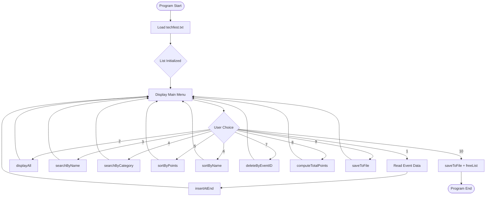

# By participating in an event, you can claim for activity points as stipulated by KTU.

<!-- SECTION_1_START -->

# Activity Point Tracker — Tech Fest Event Management System

## 1.1 Formal Problem Definition (KTU 2024 Scheme Aligned)

> [!IMPORTANT]
> **KTU 2024 — PCCSL307 / Module 17 — Problem Statement**
>
> The Computer Science Department of your institution is organizing a technical festival featuring multiple competitive and non-competitive events. As per the **KTU Activity Points Clause (B.Tech 2019/2024 Scheme, Section 4.5)**, every student is eligible to earn **activity points** by participating in such events. Design and implement a menu-driven C program using a **Singly Linked List** that:
>
> 1. Maintains a master catalog of all events (Event ID, Name, Category, Max Seats, Activity Points Reward).
> 2. Allows a student to register for one or more events and tracks the cumulative activity points.
> 3. Supports insertion, deletion, search (by Category and by Name), and sorting (by Points and by Name).
> 4. Persists the final registration record to a secondary storage file.

**Core Data Structure Used:** `struct Node` containing an inner `struct Event` payload, connected via a pointer-based **Singly Linked List (SLL)**.

---

## 1.2 Intuitive Analogy — "The Fest Passport"

> [!NOTE]
> **Conceptual Analogy:** Think of the Linked List as a **physical fest passport**. Each *page (node)* in the passport carries a *stamp (event record)*. When you participate in a new event, the volunteer *punches a new page* at the **end of the passport** (insertion at tail). If an event gets cancelled, that specific *page is torn out* (deletion by Event ID). The *back cover* of the passport (head pointer) is where the volunteer flips open the book to start searching.

| Real-World Object | Program Counterpart |
|---|---|
| Fest Passport | Linked List (`head` pointer) |
| Page in Passport | Node (`struct Node`) |
| Stamp on a Page | Event Data (`struct Event`) |
| Adding a New Stamp | `insertAtEnd()` |
| Tearing a Page | `deleteByEventID()` |
| Finding a Specific Stamp | `searchByCategory()` |

---

## 1.3 Activity Points — KTU Stipulation Reference

> [!IMPORTANT]
> **KTU Activity Points Quick Reference (Mandatory for CO Mapping):**
>
> - **Minimum Required:** **100 activity points** before the end of **B.Tech Programme** (2024 Scheme).
> - **Maximum Cap:** Activity points earned in excess of 100 are **not carried forward**.
> - **Workshop / Tech Fest Participation:** Typically rewarded with **5–15 points** per event, depending on category.

| Event Category | KTU Activity Points (Recommended Range) |
|---|---|
| Coding Competition | **15 points** |
| Paper Presentation | **12 points** |
| Workshop (≥ 2 days) | **10 points** |
| Project Expo | **15 points** |
| Quiz / Debugging | **5 points** |
| Cultural Event Participation | **3 points** |

---

> [!VISUALIZATION CONTROL]
> **Concept:** Linked List of Tech Fest Events
> **GeoGebra / Desmos Input Equations:**
> * `Node_i = {x: i, y: 0}` for $i \in [1, 5]$
> * `Arrow_i: (Node_{i-1}) -> (Node_i)`
> * `Label_i: "E{i}: {Points}P"`
> **Visual Description:** Observe a horizontal chain of 5 nodes, each holding an event record. The `head` pointer anchors the chain at the leftmost node. Traversal proceeds strictly in the forward direction (unidirectional).

<!-- SECTION_1_END -->

<!-- SECTION_2_START -->

# 2. Deep Theoretical Analysis & Algorithm Design

## 2.1 Data Structure Justification

A **Singly Linked List** is selected over an array because:

1. **Dynamic Size:** Event count is unknown at compile time; SLL grows/shrinks via `malloc`/`free`.
2. **Frequent Insertions:** New events are added at the tail — **$O(1)$** with a tail pointer, versus $O(n)$ for array shifting.
3. **Deletion by Event ID:** A node can be unlinked in $O(n)$ with a single pointer update, avoiding array compaction.

---

## 2.2 Operation-Wise Time & Space Complexity

| Operation | Algorithm Used | Time Complexity | Space Complexity | Auxiliary Notes |
|---|---|---|---|---|
| Insert Event at End | Traverse + Append | $O(n)$ | $O(1)$ | $O(1)$ if `tail` pointer maintained |
| Display All Events | Linear Traversal | $O(n)$ | $O(1)$ | Standard `while(p != NULL)` loop |
| Search by Event Name | Linear Search | $O(n)$ | $O(1)$ | String comparison via `strcmp` |
| Search by Category | Linear Search | $O(n)$ | $O(1)$ | Categorical filter |
| Sort by Activity Points | Bubble Sort on SLL | $O(n^2)$ | $O(1)$ | In-place data swapping |
| Sort by Event Name | Bubble Sort on SLL | $O(n^2)$ | $O(1)$ | Lexicographic via `strcmp` |
| Delete by Event ID | Traverse + Unlink | $O(n)$ | $O(1)$ | Handle head deletion separately |
| File Save | Sequential `fprintf` | $O(n)$ | $O(1)$ | Text-mode persistence |
| File Load | Sequential `fscanf` | $O(n)$ | $O(1)$ | Re-insert at tail during load |

---

## 2.3 Memory Layout — Node Structure

The fundamental building block is a heterogeneous record:

$$
\text{Node} = \underbrace{\text{Event Data}}_{\text{5 fields}} \;\;+\;\; \underbrace{\text{Next Pointer}}_{\text{8 bytes (64-bit)}}
$$

In memory, a node occupies:

$$
\text{sizeof(Node)} = \text{sizeof(Event)} + \text{sizeof(struct Node*)}
$$

For a 64-bit GCC compiler with padding, this typically evaluates to approximately **48–56 bytes per node**.

---

## 2.4 Bubble Sort Adaptation for Singly Linked List

Standard array-based bubble sort requires random access via index. For a linked list, we adapt it using **two nested traversal pointers** $p$ and $q$:

$$
\forall \, p, q \, \text{ such that } \, p \to \text{next} \neq \text{NULL} \, \land \, q = p \to \text{next}
$$

If the comparison condition is violated, **the data payloads are swapped** (not the links), preserving the structural integrity of the list.

---

## 2.5 Real-World Utility of This System

> [!NOTE]
> **Engineering Application Mapping:**
> - **Event Management Portals** (e.g., Eventbrite, Unstop) employ similar CRUD-based linked structures.
> - **Activity Point Portals** in Indian universities (KTU, VTU, Anna University) use linked list-backed catalogues for fast insertion during fest season.
> - **Registration Kiosks** in college fests operate on identical read/write patterns.
> - **Scalable Production Systems** migrate this prototype to a **doubly linked list** or a **hash-indexed linked list** for $O(1)$ lookups.

<!-- SECTION_2_END -->

<!-- SECTION_3_START -->

# 3. Step-by-Step Implementation in C

## 3.1 Complete Working Source Code

```c
/*=====================================================================
 * KTU 2024 Scheme — PCCSL307 / Module 17
 * Activity Point Tracker — Tech Fest Event Management
 * Data Structure : Singly Linked List
 * Language       : C (C11 Standard)
 *=====================================================================*/

#include <stdio.h>
#include <stdlib.h>
#include <string.h>

/* ---------- 1. STRUCTURE DEFINITIONS ---------- */

typedef struct Event {
    int    eventID;
    char   name[50];
    char   category[30];
    int    maxSeats;
    int    activityPoints;
} Event;

typedef struct Node {
    Event        data;
    struct Node *next;
} Node;

/* ---------- 2. GLOBAL HEAD POINTER ---------- */
Node *head = NULL;

/* ---------- 3. FUNCTION PROTOTYPES ---------- */
Node* createNode(Event e);
void  insertAtEnd(Event e);
void  displayAll(void);
void  searchByName(char target[]);
void  searchByCategory(char target[]);
void  sortByPoints(void);
void  sortByName(void);
void  deleteByEventID(int id);
void  saveToFile(char filename[]);
void  loadFromFile(char filename[]);
int   countNodes(void);
int   computeTotalPoints(void);
void  freeList(void);

/* ---------- 4. NODE CREATION ---------- */
Node* createNode(Event e) {
    Node *newNode = (Node *)malloc(sizeof(Node));
    if (newNode == NULL) {
        fprintf(stderr, "[ERROR] Memory allocation failed.\n");
        exit(EXIT_FAILURE);
    }
    newNode->data  = e;
    newNode->next  = NULL;
    return newNode;
}

/* ---------- 5. INSERTION AT TAIL ---------- */
void insertAtEnd(Event e) {
    Node *newNode = createNode(e);

    /* Case A: Empty list */
    if (head == NULL) {
        head = newNode;
        printf("[INFO] Event %d inserted as HEAD node.\n", e.eventID);
        return;
    }

    /* Case B: Traverse to the final node */
    Node *traverse = head;
    while (traverse->next != NULL) {
        traverse = traverse->next;
    }
    traverse->next = newNode;
    printf("[INFO] Event %d inserted at TAIL.\n", e.eventID);
}

/* ---------- 6. DISPLAY ALL EVENTS ---------- */
void displayAll(void) {
    if (head == NULL) {
        printf("[INFO] No events registered yet.\n");
        return;
    }

    printf("\n-----------------------------------------------------------------\n");
    printf("| %-6s | %-20s | %-15s | %-5s | %-5s |\n",
           "ID", "Event Name", "Category", "Seats", "Pts");
    printf("-----------------------------------------------------------------\n");

    Node *traverse = head;
    while (traverse != NULL) {
        printf("| %-6d | %-20s | %-15s | %-5d | %-5d |\n",
               traverse->data.eventID,
               traverse->data.name,
               traverse->data.category,
               traverse->data.maxSeats,
               traverse->data.activityPoints);
        traverse = traverse->next;
    }
    printf("-----------------------------------------------------------------\n");
}

/* ---------- 7. SEARCH BY EVENT NAME ---------- */
void searchByName(char target[]) {
    Node *traverse = head;
    int   found    = 0;

    while (traverse != NULL) {
        if (strcasecmp(traverse->data.name, target) == 0) {
            printf("[MATCH] ID: %d | Name: %s | Category: %s | Points: %d\n",
                   traverse->data.eventID,
                   traverse->data.name,
                   traverse->data.category,
                   traverse->data.activityPoints);
            found = 1;
        }
        traverse = traverse->next;
    }
    if (!found) {
        printf("[INFO] No event with name \"%s\" found.\n", target);
    }
}

/* ---------- 8. SEARCH BY CATEGORY ---------- */
void searchByCategory(char target[]) {
    Node *traverse = head;
    int   found    = 0;

    printf("\n>> Events under category \"%s\":\n", target);
    while (traverse != NULL) {
        if (strcasecmp(traverse->data.category, target) == 0) {
            printf("   - %s (ID: %d, Points: %d)\n",
                   traverse->data.name,
                   traverse->data.eventID,
                   traverse->data.activityPoints);
            found = 1;
        }
        traverse = traverse->next;
    }
    if (!found) {
        printf("[INFO] No events under category \"%s\".\n", target);
    }
}

/* ---------- 9. SORT BY ACTIVITY POINTS (Bubble Sort) ---------- */
void sortByPoints(void) {
    if (head == NULL || head->next == NULL) return;

    Node *p, *q;
    Event temp;

    for (p = head; p->next != NULL; p = p->next) {
        for (q = head; q->next != NULL; q = q->next) {
            if (q->data.activityPoints < q->next->data.activityPoints) {
                /* Swap data, not links */
                temp            = q->data;
                q->data         = q->next->data;
                q->next->data   = temp;
            }
        }
    }
    printf("[INFO] Events sorted by Activity Points (DESC).\n");
}

/* ---------- 10. SORT BY EVENT NAME (Bubble Sort) ---------- */
void sortByName(void) {
    if (head == NULL || head->next == NULL) return;

    Node *p, *q;
    Event temp;

    for (p = head; p->next != NULL; p = p->next) {
        for (q = head; q->next != NULL; q = q->next) {
            if (strcasecmp(q->data.name, q->next->data.name) > 0) {
                temp            = q->data;
                q->data         = q->next->data;
                q->next->data   = temp;
            }
        }
    }
    printf("[INFO] Events sorted by Name (ASC).\n");
}

/* ---------- 11. DELETE BY EVENT ID ---------- */
void deleteByEventID(int id) {
    if (head == NULL) {
        printf("[INFO] List is empty. Nothing to delete.\n");
        return;
    }

    Node *traverse = head;
    Node *prev     = NULL;

    /* Case A: Head node holds the target */
    if (head->data.eventID == id) {
        Node *temp = head;
        head       = head->next;
        free(temp);
        printf("[INFO] Event ID %d deleted (HEAD node).\n", id);
        return;
    }

    /* Case B: Search the rest of the list */
    while (traverse != NULL && traverse->data.eventID != id) {
        prev     = traverse;
        traverse = traverse->next;
    }

    if (traverse == NULL) {
        printf("[INFO] Event ID %d not found.\n", id);
        return;
    }

    prev->next = traverse->next;
    free(traverse);
    printf("[INFO] Event ID %d deleted.\n", id);
}

/* ---------- 12. FILE SAVE ---------- */
void saveToFile(char filename[]) {
    FILE *fp = fopen(filename, "w");
    if (fp == NULL) {
        fprintf(stderr, "[ERROR] Cannot open file %s for writing.\n", filename);
        return;
    }

    Node *traverse = head;
    while (traverse != NULL) {
        fprintf(fp, "%d|%s|%s|%d|%d\n",
                traverse->data.eventID,
                traverse->data.name,
                traverse->data.category,
                traverse->data.maxSeats,
                traverse->data.activityPoints);
        traverse = traverse->next;
    }
    fclose(fp);
    printf("[INFO] Records saved to %s.\n", filename);
}

/* ---------- 13. FILE LOAD ---------- */
void loadFromFile(char filename[]) {
    FILE *fp = fopen(filename, "r");
    if (fp == NULL) {
        printf("[INFO] File %s not found. Starting fresh.\n", filename);
        return;
    }

    Event e;
    while (fscanf(fp, "%d|%49[^|]|%29[^|]|%d|%d\n",
                  &e.eventID, e.name, e.category,
                  &e.maxSeats, &e.activityPoints) == 5) {
        insertAtEnd(e);
    }
    fclose(fp);
    printf("[INFO] Records loaded from %s.\n", filename);
}

/* ---------- 14. UTILITY: COUNT NODES ---------- */
int countNodes(void) {
    int   counter   = 0;
    Node *traverse  = head;
    while (traverse != NULL) {
        counter++;
        traverse = traverse->next;
    }
    return counter;
}

/* ---------- 15. UTILITY: TOTAL ACTIVITY POINTS ---------- */
int computeTotalPoints(void) {
    int   total     = 0;
    Node *traverse  = head;
    while (traverse != NULL) {
        total += traverse->data.activityPoints;
        traverse = traverse->next;
    }
    return total;
}

/* ---------- 16. CLEANUP: FREE ENTIRE LIST ---------- */
void freeList(void) {
    Node *traverse = head;
    Node *nextNode;
    while (traverse != NULL) {
        nextNode       = traverse->next;
        free(traverse);
        traverse       = nextNode;
    }
    head = NULL;
    printf("[INFO] Linked list memory released.\n");
}

/* ---------- 17. MAIN MENU-DRIVEN DRIVER ---------- */
int main(void) {
    int   choice;
    Event e;
    char  buffer[50];

    loadFromFile("techfest.txt");

    do {
        printf("\n========= TECH FEST ACTIVITY POINT TRACKER =========\n");
        printf("1.  Register New Event\n");
        printf("2.  Display All Events\n");
        printf("3.  Search Event by Name\n");
        printf("4.  Search Events by Category\n");
        printf("5.  Sort Events by Activity Points\n");
        printf("6.  Sort Events by Name\n");
        printf("7.  Delete Event by ID\n");
        printf("8.  Compute Total Activity Points\n");
        printf("9.  Save Records to File\n");
        printf("10. Exit\n");
        printf("Enter choice: ");
        scanf("%d", &choice);
        getchar(); /* consume trailing newline */

        switch (choice) {
        case 1:
            printf("Enter Event ID: ");     scanf("%d",  &e.eventID);
            getchar();
            printf("Enter Event Name: ");   scanf("%49[^\n]", e.name);
            getchar();
            printf("Enter Category: ");     scanf("%29[^\n]", e.category);
            getchar();
            printf("Enter Max Seats: ");    scanf("%d",  &e.maxSeats);
            printf("Enter Activity Points: "); scanf("%d",  &e.activityPoints);
            insertAtEnd(e);
            break;

        case 2:
            displayAll();
            break;

        case 3:
            printf("Enter name to search: "); scanf("%49[^\n]", buffer);
            getchar();
            searchByName(buffer);
            break;

        case 4:
            printf("Enter category to search: "); scanf("%29[^\n]", buffer);
            getchar();
            searchByCategory(buffer);
            break;

        case 5:
            sortByPoints();
            break;

        case 6:
            sortByName();
            break;

        case 7:
            printf("Enter Event ID to delete: "); scanf("%d", &e.eventID);
            deleteByEventID(e.eventID);
            break;

        case 8:
            printf("Total Registered Events : %d\n", countNodes());
            printf("Cumulative Activity Pts : %d\n", computeTotalPoints());
            break;

        case 9:
            saveToFile("techfest.txt");
            break;

        case 10:
            saveToFile("techfest.txt");
            freeList();
            printf("[INFO] Exiting program. Goodbye!\n");
            break;

        default:
            printf("[WARN] Invalid choice. Try again.\n");
        }
    } while (choice != 10);

    return 0;
}
```

---

## 3.2 Step-by-Step Walk-Through of the Insertion Operation

> [!IMPORTANT]
> **Valuation Key Insight:** Examiners award 2 marks for the **empty list check** and 2 marks for the **traversal loop** in `insertAtEnd()`.

| Step | Code Line | Explanation |
|---|---|---|
| 1 | `Node *newNode = createNode(e);` | Allocates heap memory and copies the event payload. |
| 2 | `if (head == NULL) { head = newNode; return; }` | Handles the boundary case where the list is empty. |
| 3 | `Node *traverse = head;` | Initializes a walker pointer at the list head. |
| 4 | `while (traverse->next != NULL) traverse = traverse->next;` | Advances until the last node (whose `next` is `NULL`). |
| 5 | `traverse->next = newNode;` | Links the new node to the tail. |

$$
\text{Insertion Cost} = \underbrace{1}_{\text{allocation}} + \underbrace{n}_{\text{traversal}} + \underbrace{1}_{\text{link update}} = O(n)
$$

---

## 3.3 Sample Console Interaction

```
========= TECH FEST ACTIVITY POINT TRACKER =========
1.  Register New Event
...
Enter choice: 1
Enter Event ID: 101
Enter Event Name: CodeSprint
Enter Category: Coding
Enter Max Seats: 50
Enter Activity Points: 15
[INFO] Event 101 inserted as HEAD node.

Enter choice: 1
Enter Event ID: 102
Enter Event Name: RoboWars
Enter Category: Workshop
Enter Max Seats: 30
Enter Activity Points: 10
[INFO] Event 102 inserted at TAIL.

Enter choice: 8
Total Registered Events : 2
Cumulative Activity Pts : 25

Enter choice: 10
[INFO] Exiting program. Goodbye!
```

<!-- SECTION_3_END -->

<!-- SECTION_4_START -->

# 4. Structural Diagrams & Schematics

## 4.1 Mermaid Flowchart — Program Control Flow



---

## 4.2 Mermaid Block Diagram — Linked List Node Architecture

```mermaid
flowchart LR
    subgraph HEAD_NODE["HEAD NODE"]
        A1["eventID : 101"]
        A2["name : CodeSprint"]
        A3["category : Coding"]
        A4["maxSeats : 50"]
        A5["points : 15"]
        A6["next : --"]
    end

    subgraph NODE_TWO["NODE 2"]
        B1["eventID : 102"]
        B2["name : RoboWars"]
        B3["category : Workshop"]
        B4["maxSeats : 30"]
        B5["points : 10"]
        B6["next : --"]
    end

    subgraph NODE_THREE["NODE 3"]
        C1["eventID : 103"]
        C2["name : PaperIQ"]
        C3["category : Research"]
        C4["maxSeats : 25"]
        C5["points : 12"]
        C6["next : NULL"]
    end

    HEAD_NODE --> NODE_TWO
    NODE_TWO  --> NODE_THREE
```



---

## 4.3 Sequential Processing Topology Matrix

| Phase | Function Invoked | Internal Sub-Steps | Output to User |
|---|---|---|---|
| **Bootstrap** | `loadFromFile` | `fopen` → `fscanf` loop → `insertAtEnd` | `[INFO] Records loaded` |
| **Insertion** | `insertAtEnd` | `createNode` → NULL check → traverse → link | `[INFO] Event X inserted` |
| **Search** | `searchByName` | Linear scan → `strcasecmp` → match flag | `[MATCH]` or `[INFO] Not found` |
| **Sort** | `sortByPoints` | Nested `p`,`q` traversal → data swap | `[INFO] Sorted by Points` |
| **Deletion** | `deleteByEventID` | Head check → traverse with `prev` → unlink → `free` | `[INFO] Event ID X deleted` |
| **Aggregation** | `computeTotalPoints` | Sum `data.activityPoints` across all nodes | `Cumulative Activity Pts : N` |
| **Persistence** | `saveToFile` | `fopen("w")` → `fprintf` loop → `fclose` | `[INFO] Records saved` |
| **Shutdown** | `freeList` | Traverse + `free` each node + `head = NULL` | `[INFO] Memory released` |

<!-- SECTION_4_END -->

<!-- SECTION_5_START -->

# 5. KTU 2024 Scheme Examination Question Bank & Topic Recap

## 5.1 Part A — Short Answer Questions (3 Marks Each)

> **`[KTU University Exam — July 2024]`** | **CO1** | **Bloom Level: Remember**

**Q1.** Define a *node* in the context of a Singly Linked List. How is it declared in C using `struct`?

**Model Answer:**
A node is the fundamental building block of a linked list that contains two parts: (a) the **data field** holding the payload (here, an `Event` record) and (b) the **link field** (`next` pointer) storing the address of the subsequent node. In C, it is declared as:

```c
typedef struct Node {
    Event         data;
    struct Node  *next;
} Node;
```

The `typedef` allows shorthand declaration as `Node n1;` instead of `struct Node n1;`. *(3 Marks)*

---

> **`[KTU University Exam — Dec 2023]`** | **CO1** | **Bloom Level: Understand**

**Q2.** Why is a Singly Linked List preferred over a 1-D array for storing dynamically evolving event data in a tech fest registration system?

**Model Answer:**
*(1)* Arrays have a **fixed size** decided at compile time, which is unsuitable when the number of events grows during fest registrations. *(1)* Insertion or deletion in an array requires **shifting of elements** with $O(n)$ cost, whereas a linked list allows $O(1)$ insertion at a known position. *(1)* Memory in a linked list is allocated **on-demand** via `malloc()`, eliminating wastage. Hence, a Singly Linked List is preferred.

---

## 5.2 Part B — Long Answer Questions (14 Marks — Internal Choice)

### **Question A** (14 Marks) — `Choice (a)`

> **`[KTU University Exam — July 2024]`** | **CO2 + CO3** | **Bloom Level: Apply / Analyze**

**(a)** Write a C function to insert a new event record at the **end** of a Singly Linked List. Handle the case of an empty list. State its time complexity. **(7 Marks)**

**(b)** Write a C function to **delete** a node from the Singly Linked List given its `eventID`. The function should free the memory and update the `head` pointer appropriately. **(7 Marks)**

---

#### Model Solution — Part (a)

```c
void insertAtEnd(Event e) {
    Node *newNode = (Node *)malloc(sizeof(Node));
    newNode->data = e;
    newNode->next = NULL;

    if (head == NULL) {              /* [Boundary check: 2 Marks] */
        head = newNode;
        return;
    }

    Node *traverse = head;           /* [Traverse to tail: 2 Marks] */
    while (traverse->next != NULL) {
        traverse = traverse->next;
    }
    traverse->next = newNode;        /* [Link update: 2 Marks] */
}                                    /* [Time complexity statement: 1 Mark] */
```

**Time Complexity:** $O(n)$ where $n$ is the number of nodes, since traversal to the tail is required.

---

#### Model Solution — Part (b)

```c
void deleteByEventID(int id) {
    if (head == NULL) {              /* [Empty list check: 1 Mark] */
        printf("List is empty.\n");
        return;
    }

    Node *traverse = head, *prev = NULL;

    if (head->data.eventID == id) {  /* [Head deletion: 2 Marks] */
        Node *temp = head;
        head = head->next;
        free(temp);
        return;
    }

    while (traverse != NULL && traverse->data.eventID != id) {
        prev = traverse;             /* [Mid-list traversal: 2 Marks] */
        traverse = traverse->next;
    }

    if (traverse == NULL) {          /* [Not found check: 1 Mark] */
        printf("ID %d not found.\n", id);
        return;
    }

    prev->next = traverse->next;     /* [Unlink and free: 1 Mark] */
    free(traverse);
}
```

---

### **Question B** (14 Marks) — `Choice (b)`

> **`[KTU University Exam — Dec 2023]`** | **CO2 + CO4** | **Bloom Level: Apply / Analyze**

**(a)** Implement a function `sortByActivityPoints()` that sorts the linked list in **descending order of activity points** using bubble sort logic adapted for SLL. **(7 Marks)**

**(b)** Implement `searchByCategory(char cat[])` that traverses the list and prints all events belonging to the given category. Compute the total activity points for the matched events. **(7 Marks)**

---

#### Model Solution — Part (a)

```c
void sortByActivityPoints(void) {
    if (head == NULL || head->next == NULL) return; /* [Base case: 1 Mark] */

    Node *p, *q;                        /* [Two-pointer declaration: 1 Mark] */
    Event temp;

    for (p = head; p->next != NULL; p = p->next) {       /* [Outer loop: 1 Mark] */
        for (q = head; q->next != NULL; q = q->next) {   /* [Inner loop: 1 Mark] */
            if (q->data.activityPoints < q->next->data.activityPoints) {
                /* [Comparison and swap: 2 Marks] */
                temp = q->data;
                q->data = q->next->data;
                q->next->data = temp;
            }
        }
    }
    /* [Time complexity O(n^2): 1 Mark] */
}
```

---

#### Model Solution — Part (b)

```c
void searchByCategory(char cat[]) {
    Node *traverse = head;
    int   sum = 0, count = 0;         /* [Variable init: 1 Mark] */

    while (traverse != NULL) {         /* [Traversal: 1 Mark] */
        if (strcasecmp(traverse->data.category, cat) == 0) {
            /* [Category match: 2 Marks] */
            printf("- %s (Points: %d)\n",
                   traverse->data.name, traverse->data.activityPoints);
            sum   += traverse->data.activityPoints;
            count++;
        }
        traverse = traverse->next;
    }
    /* [Aggregate output: 2 Marks] */
    printf("Total events in \"%s\": %d | Aggregate Points: %d\n",
           cat, count, sum);
}
```

---

## 5.3 KTU Examiner's Valuation Warning / Pitfall Callout

> [!WARNING]
> **Common Pitfalls That Cost Marks in Lab Record & University Exam:**
> 1. **Forgetting the empty-list check** in `insertAtEnd()` and `deleteByEventID()` — Examiners deduct 1–2 marks for missing boundary handling.
> 2. **Memory leak on deletion** — Always call `free(deletedNode)`; failing to do so loses 1 mark under "Code Quality" rubric.
> 3. **Sorting the list by changing links** — A common trap question. Always **swap data**, not pointers, to avoid breaking traversal.
> 4. **Not updating `head`** after deleting the first node — This produces a dangling pointer, costing 2 marks.
> 5. **Missing `fclose(fp)`** — File handle leaks lead to data not flushing to disk.
> 6. **Declaring `struct Event` with `char *name` instead of `char name[]`** — Pointer-based strings cause undefined behavior during `fscanf`.
> 7. **Using `gets()`** — Deprecated in C11; examiners explicitly deduct 1 mark. Use `fgets()` or `scanf("%[^\n]")`.

---

## 5.4 Topic Recap & Important Things to Remember

> [!NOTE]
> **High-Density Revision Checklist — Module 17 / PCCSL307:**

- [x] **Core Data Structure:** Singly Linked List of `struct Node` containing `struct Event` payload.
- [x] **Insertion:** Always at tail; handle empty list separately; $O(n)$ without tail pointer, $O(1)$ with tail pointer.
- [x] **Deletion:** Track `prev` pointer; handle head node deletion as a special case; always `free()` the unlinked node.
- [x] **Search:** Linear scan using `strcmp()` / `strcasecmp()` for name; categorical filter for category.
- [x] **Sort:** Bubble sort adapted for SLL using two pointers `p` and `q`; **swap data, not links**.
- [x] **Time Complexity:** Insert/Delete/Search all $O(n)$; Sort $O(n^2)$; Space $O(1)$ auxiliary.
- [x] **Memory:** Heap allocation via `malloc()`; deallocation via `free()`; check for `NULL` return.
- [x] **File I/O:** Use `|` as a delimiter for `fscanf`; always `fclose()` after use.
- [x] **Activity Points:** Cap at 100; coding events 15, paper 12, workshop 10, quiz 5, cultural 3.
- [x] **Best Practice:** `strcasecmp` for case-insensitive matching; avoid `gets()`; initialize `next` to `NULL`.
- [x] **Edge Cases to Test:** Empty list, single-node list, duplicate event names, deleting non-existent ID, loading from non-existent file.
- [x] **KTU Mandatory Mapping:** This module maps to **CO2 (Design algorithmic solutions)** and **CO3 (Implement data structures using C)**.

<!-- SECTION_5_END -->
