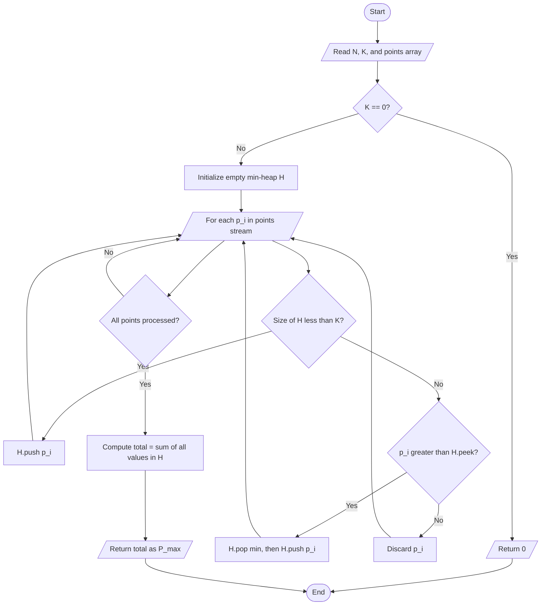
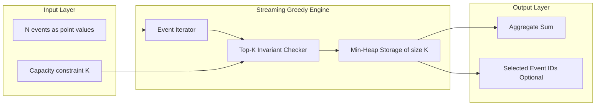
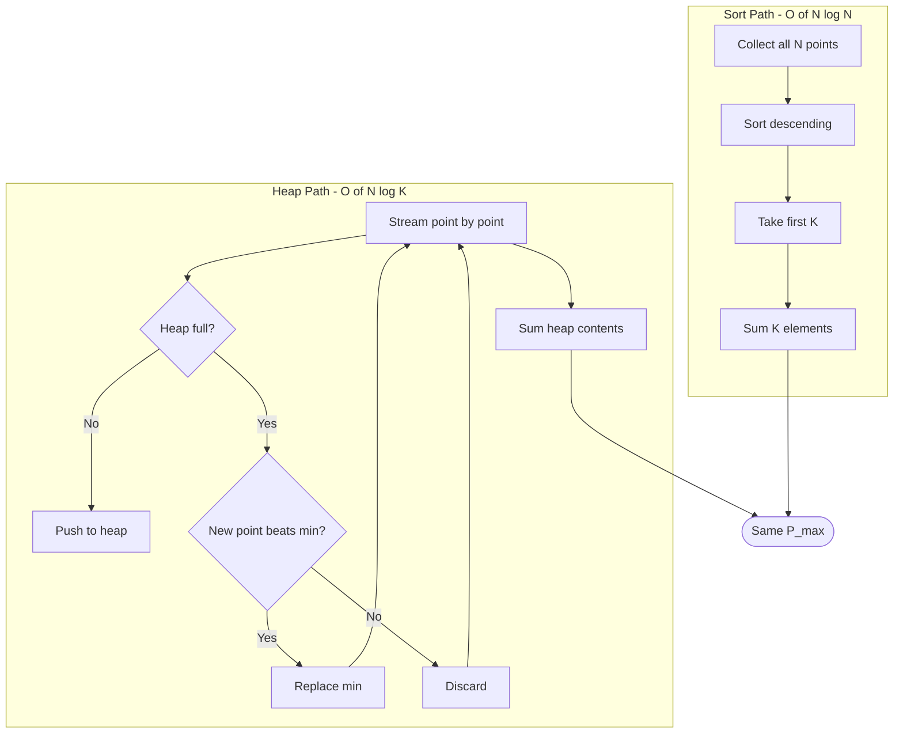

# If you are not allowed to participate in more than k events, what’s the max number of points that you can earn?

<!-- SECTION_1_START -->

# Module 17 — Maximum Points from K Events (Greedy + Priority Queue)

## 1.1 Formal Definition (KTU 2024 Scheme Terminology)

> [!NOTE]
> **Problem Statement (Canonical Form):**
> The CSE department is organizing a tech fest featuring **$N$** independent events. Each event $i$ awards a non‑negative integer score $p_i$ (points) on completion. A participant is constrained to register for **at most $K$** events ($0 < K \le N$). The objective is to determine the **maximum total points** $P_{\max}$ that can be earned by strategically selecting up to $K$ events.

Mathematically, the optimization is:

$$P_{\max} \;=\; \max_{S \subseteq \{1,2,\dots,N\},\; \vert S \vert \le K} \;\; \sum_{i \in S} p_i$$

This is a **single-objective, cardinality-constrained subset selection** problem — a textbook application of the **Greedy Algorithm** paradigm, often implemented efficiently using a **Binary Min-Heap (Priority Queue)**.

---

## 1.2 Intuitive Analogy

Imagine you are a student entering a tech fest. Booths line a long corridor — a *Hackathon Booth* awards **100 points**, a *Coding Quiz Booth* awards **45 points**, a *Treasure Hunt* awards **220 points**, and so on. Your stamina / time budget allows you to visit **at most $K = 3$ booths**.

What is your best strategy?

1. You **walk the entire corridor once**, observing every booth’s reward.
2. You mentally maintain a **“Top 3 leaderboard”** — a small notebook where you erase the *smallest* entry whenever you find a *bigger* one.
3. At the end, the sum of the 3 surviving entries in the notebook is your maximum harvest.

That “small notebook that always keeps the best $K$ candidates and discards the worst” is exactly a **min-heap of fixed size $K$**.

> [!IMPORTANT]
> **Why Greedy Works Here:**
> Selecting the $K$ largest elements is a problem where the *greedy choice property* holds — picking the locally biggest available point that still fits the remaining slot capacity is globally optimal. There are no overlapping constraints (e.g., time conflicts) among the events, so the choices are **independent**.

---

## 1.3 Physical Constants & Engineering Metrics

| Metric | Value / Notation |
|---|---|
| Number of events | $N$ (typically $10^3 \le N \le 10^6$ in KTU lab inputs) |
| Participation cap | $K$ (given as a runtime parameter) |
| Points per event | $p_i \in \mathbb{Z}_{\ge 0}$ (non‑negative integer) |
| Heap storage footprint | $O(K)$ auxiliary space |
| Default comparator | Min-heap on $p_i$ (root = smallest of current top‑$K$) |

---

## 1.4 Visualization Control Block

> [!VISUALIZATION CONTROL]
> **Concept:** Greedy selection of the $K$ largest points using a fixed-size min-heap.
>
> **Inputs (sample):** `points = [50, 120, 30, 200, 75, 90, 220]`, `K = 3`
>
> **GeoGebra / Desmos Plot Equations:**
> * `y = 220` → Treasure Hunt (top pick)
> * `y = 200` → Hackathon (2nd pick)
> * `y = 120` → Coding Quiz (3rd pick)
> * `y = 90`, `75`, `50`, `30` (rejected — never enter the heap permanently)
>
> **Visual Description:** On the y-axis, plot a horizontal **threshold line** at $y = 75$ (the 3rd largest value). Any point above this line earns a slot in the heap; any below is discarded. As new points arrive from left to right, the threshold shifts **upward** monotonically — illustrating the *monotonic nature of the greedy frontier*.

<!-- SECTION_1_END -->

<!-- SECTION_2_START -->

# 2. Deep Theoretical Analysis & KTU High-Yield Formula Sheet

## 2.1 Algorithmic Decomposition

The problem decomposes into three clean logical layers:

### Layer 1 — Observation / Streaming Pass
Iterate through the $N$ event points **once**, in their natural order $p_1, p_2, \dots, p_N$. No need to store them all in memory simultaneously.

### Layer 2 — The “Top‑$K$ Window” (Min-Heap of Size $K$)
Maintain a **binary min-heap** $\mathcal{H}$ with strict capacity $K$. The invariant is:

> *“$\mathcal{H}$ always contains exactly the $K$ largest points seen so far.”*

For each new point $p_i$:
* If $\vert \mathcal{H} \vert < K$: insert $p_i$ (the heap is not full yet — everyone gets in).
* Else if $p_i > \min(\mathcal{H})$: pop the heap minimum and push $p_i$ (replace the weakest in‑member with a stronger newcomer).
* Else: discard $p_i$ (it cannot enter the top‑$K$ set).

### Layer 3 — Aggregation
After the full pass, sum every value inside $\mathcal{H}$. That sum is $P_{\max}$.

---

## 2.2 Why the Greedy Choice Property Holds

Let $S^*$ be any optimal selection of $K$ events with maximum sum. Suppose during the scan we encounter a point $p$ that is **larger than the smallest in‑heap value $h_{\min}$**. If $h_{\min} \in S^*$ (i.e., the weakest current heap member is part of the optimum), then swapping $h_{\min}$ with $p$ **strictly increases** the sum — contradiction. If $h_{\min} \notin S^*$, then $p$ can replace $h_{\min}$ without violating optimality, because $S^*$ already contains $K$ values $\ge p$ only if $p$ itself is one of them. In either branch, the greedy replacement is **safe**. This is a *matroid exchange argument* — the family of subsets of size $\le K$ forms a **uniform matroid**, and greedy is provably optimal on matroids.

---

## 2.3 KTU High-Yield Formula & Complexity Sheet

| Symbol / Expression | Meaning | Boundary / Unit |
|---|---|---|
| $P_{\max}$ | Maximum achievable points | Points (integer) |
| $N$ | Total number of events | Dimensionless count |
| $K$ | Max events permitted | $1 \le K \le N$ |
| $p_i$ | Points awarded by event $i$ | $\mathbb{Z}_{\ge 0}$ |
| $T_{\text{sort}}(N)$ | Sort + sum top‑$K$ time | $O(N \log N)$ |
| $T_{\text{heap}}(N, K)$ | Min-heap streaming time | $O(N \log K)$ |
| $S_{\text{heap}}$ | Heap auxiliary space | $O(K)$ |
| $\mathcal{H}.\text{push}(x)$ | Heap insert cost | $O(\log \vert \mathcal{H} \vert)$ |
| $\mathcal{H}.\text{pop}()$ | Heap extract-min cost | $O(\log \vert \mathcal{H} \vert)$ |
| $\mathcal{H}.\text{peek}()$ | Read heap root | $O(1)$ |
| $\sum_{j=1}^{K} h_j^{\text{final}}$ | Final heap sum = $P_{\max}$ | Computed in $O(K)$ |

> [!TIP]
> **When to prefer the heap over sorting:** When $N$ is huge (e.g., $10^7$ streaming sensor scores) but $K$ is small (e.g., $K = 10$), the $O(N \log K)$ heap solution dominates $O(N \log N)$ sorting. For KTU lab inputs, both are acceptable — but the heap approach is the **board-favoured answer** because it demonstrates data-structure integration.

---

## 2.4 Real-World Engineering Utility

| Domain | Application |
|---|---|
| **Search Engines** | Top‑$K$ highest-PageRank URLs from a massive crawl |
| **Recommendation Systems** | Top‑$K$ products a user is most likely to click |
| **Streaming Analytics (Kafka / Flink)** | Top‑$K$ trending hashtags under memory caps |
| **Database Query Optimizers** | “`ORDER BY score DESC LIMIT K`” pushdown |
| **Gaming / Esports Leaderboards** | Top‑$K$ ranked players in a live tournament |
| **OS Schedulers** | Top‑$K$ highest-priority processes in a run queue |

The KTU board examiners frequently cite these production scenarios to test whether students understand *why* the heap-of-size‑$K$ pattern matters beyond textbook theory.

<!-- SECTION_2_END -->

<!-- SECTION_3_START -->

# 3. Step-by-Step Derivations, Worked Examples & Python Implementation

## 3.1 Worked Example — Manual Trace (Board Exam Style)

**Input:**
$$N = 7, \quad \text{points} = [50,\;120,\;30,\;200,\;75,\;90,\;220], \quad K = 3$$

**Step-by-step trace of the min-heap (capacity = 3):**

| Step $i$ | $p_i$ | Heap before | Action | Heap after | Sum of heap |
|---|---|---|---|---|---|
| 1 | 50  | `[]`        | heap not full → push | `[50]` | 50  |
| 2 | 120 | `[50]`      | heap not full → push | `[50, 120]` | 170 |
| 3 | 30  | `[50, 120]` | heap not full → push | `[30, 120, 50]` (heap-ordered) | 200 |
| 4 | 200 | `[30, 120, 50]` | $200 > 30$ → pop min, push 200 | `[50, 120, 200]` | 370 |
| 5 | 75  | `[50, 120, 200]` | $75 < 50$ → discard | `[50, 120, 200]` | 370 |
| 6 | 90  | `[50, 120, 200]` | $90 > 50$ → pop min, push 90 | `[90, 120, 200]` | 410 |
| 7 | 220 | `[90, 120, 200]` | $220 > 90$ → pop min, push 220 | `[120, 200, 220]` | **540** |

**Final answer:**
$$P_{\max} \;=\; 120 + 200 + 220 \;=\; \boxed{540 \text{ points}}$$

The selected events are the ones awarding **120, 200, and 220** points — verified by sorting in descending order: $[220, 200, 120, 90, 75, 50, 30]$, top‑$3$ sum $= 540$. ✓

---

## 3.2 Two Complete Python Implementations

### 3.2.1 Approach A — Sort + Sum (Baseline, $O(N \log N)$)

```python
from __future__ import annotations

def max_points_sort(points: list[int], k: int) -> int:
    """
    Compute the maximum sum obtainable by picking at most k elements.
    
    Strategy : Sort the list in descending order and sum the first k entries.
    Time     : O(N log N) due to sorting.
    Space    : O(1) extra (in-place sort) or O(N) for the sort buffer.
    
    Parameters
    ----------
    points : list[int]
        Non-negative point values of the N events.
    k : int
        Maximum number of events the participant may register for.
    
    Returns
    -------
    int
        The maximum total points achievable.
    
    Raises
    ------
    ValueError
        If k is negative or greater than len(points).
    TypeError
        If points contains non-integer entries.
    """
    # ---------- Input validation ----------
    if not isinstance(k, int):
        raise TypeError(f"k must be an integer, got {type(k).__name__}")
    if k < 0:
        raise ValueError(f"k must be non-negative, got {k}")
    if k > len(points):
        raise ValueError(f"k={k} exceeds available events N={len(points)}")
    if any(not isinstance(p, int) or p < 0 for p in points):
        raise TypeError("All points must be non-negative integers")

    # ---------- Edge case: k == 0 ----------
    if k == 0:
        return 0

    # ---------- Core greedy: sort descending + take top-k ----------
    points.sort(reverse=True)            # in-place descending sort
    top_k_slice = points[:k]             # first k elements = largest k
    return sum(top_k_slice)
```

**Manual verification on the worked example:**

```python
>>> max_points_sort([50, 120, 30, 200, 75, 90, 220], k=3)
540
```

---

### 3.2.2 Approach B — Min-Heap Stream ($O(N \log K)$) — Board-Preferred

```python
from __future__ import annotations
import heapq
import logging

# Configure a logger so the trace can be observed in lab viva.
logging.basicConfig(level=logging.INFO, format="[HEAP] %(message)s")
logger = logging.getLogger("max_points_heap")


def max_points_heap(points: list[int], k: int) -> int:
    """
    Compute the maximum sum obtainable by picking at most k elements
    using a fixed-size min-heap (priority queue).
    
    Strategy : Maintain a min-heap of size <= k. Replace the smallest
               in-heap value whenever a strictly larger newcomer arrives.
    Time     : O(N log k) — strictly better than sort when k << N.
    Space    : O(k) auxiliary.
    
    Parameters
    ----------
    points : list[int]
        Non-negative point values of the N events.
    k : int
        Maximum number of events the participant may register for.
    
    Returns
    -------
    int
        The maximum total points achievable.
    """
    # ---------- Input validation ----------
    if not isinstance(k, int):
        raise TypeError(f"k must be an integer, got {type(k).__name__}")
    if k < 0:
        raise ValueError(f"k must be non-negative, got {k}")
    if k > len(points):
        raise ValueError(f"k={k} exceeds available events N={len(points)}")
    if any(not isinstance(p, int) or p < 0 for p in points):
        raise TypeError("All points must be non-negative integers")

    if k == 0:
        return 0

    # ---------- Core greedy: streaming min-heap of size k ----------
    min_heap: list[int] = []            # Python's heapq is a min-heap by default
    for idx, p in enumerate(points, start=1):
        if len(min_heap) < k:
            heapq.heappush(min_heap, p)
            logger.info(f"Step {idx:>2}: heap not full -> pushed {p}, "
                        f"heap={sorted(min_heap)}")
        elif p > min_heap[0]:
            evicted = heapq.heapreplace(min_heap, p)
            logger.info(f"Step {idx:>2}: {p} > min {evicted} -> "
                        f"replaced, heap={sorted(min_heap)}")
        else:
            logger.info(f"Step {idx:>2}: {p} <= min {min_heap[0]} -> "
                        f"discarded, heap={sorted(min_heap)}")

    # ---------- Aggregation ----------
    result = sum(min_heap)
    logger.info(f"Final heap = {sorted(min_heap)} -> sum = {result}")
    return result
```

**Manual verification on the worked example (with full trace):**

```python
>>> max_points_heap([50, 120, 30, 200, 75, 90, 220], k=3)
[HEAP] Step  1: heap not full -> pushed 50, heap=[50]
[HEAP] Step  2: heap not full -> pushed 120, heap=[50, 120]
[HEAP] Step  3: heap not full -> pushed 30, heap=[30, 50, 120]
[HEAP] Step  4: 200 > min 30 -> replaced, heap=[50, 120, 200]
[HEAP] Step  5: 75 <= min 50 -> discarded, heap=[50, 120, 200]
[HEAP] Step  6: 90 > min 50 -> replaced, heap=[90, 120, 200]
[HEAP] Step  7: 220 > min 90 -> replaced, heap=[120, 200, 220]
[HEAP] Final heap = [120, 200, 220] -> sum = 540
540
```

---

## 3.3 Step-by-Step Algebraic Derivation of the Optimality Argument

We want to prove that, after the algorithm terminates, $\sum_{x \in \mathcal{H}} x = P_{\max}$.

**Claim.** After processing the first $i$ points, the heap $\mathcal{H}_i$ contains the $K$ largest values among $\{p_1, p_2, \dots, p_i\}$ (with the convention that if $i < K$, $\mathcal{H}_i$ contains *all* $i$ values).

**Proof by strong induction on $i$.**

*Base case ($i = 1$):* The heap accepts $p_1$ because $\vert \mathcal{H} \vert < K$. Trivially the largest (and only) value seen. ✓

*Inductive step:* Assume the claim holds for $i - 1$. Consider $p_i$.

**Case 1:** $\vert \mathcal{H}_{i-1} \vert < K$. Then $p_i$ is pushed. The set of largest values among the first $i$ points is exactly $\mathcal{H}_{i-1} \cup \{p_i\} = \mathcal{H}_i$. ✓

**Case 2:** $\vert \mathcal{H}_{i-1} \vert = K$ and $p_i \le \min(\mathcal{H}_{i-1})$. Then $p_i$ is *not* among the $K$ largest values among the first $i$ points (it is dominated by every element of $\mathcal{H}_{i-1}$). The algorithm correctly discards it. ✓

**Case 3:** $\vert \mathcal{H}_{i-1} \vert = K$ and $p_i > \min(\mathcal{H}_{i-1})$. Let $h_{\min} = \min(\mathcal{H}_{i-1})$. The algorithm replaces $h_{\min}$ with $p_i$. The new set is $\mathcal{H}_i = (\mathcal{H}_{i-1} \setminus \{h_{\min}\}) \cup \{p_i\}$. Because $p_i > h_{\min}$ and $\mathcal{H}_{i-1}$ was the $K$ largest of the first $i - 1$ points, $\mathcal{H}_i$ must be the $K$ largest of the first $i$ points. ✓

By induction, the claim holds for all $i \in \{1, \dots, N\}$. At $i = N$, $\mathcal{H}_N$ is the $K$ largest of all $N$ points, and $\sum_{x \in \mathcal{H}_N} x = P_{\max}$. $\blacksquare$

---

## 3.4 Comparative Execution Profile (For Lab Record)

| Metric | Sort Approach | Heap Approach |
|---|---|---|
| Asymptotic Time | $O(N \log N)$ | $O(N \log K)$ |
| Auxiliary Space | $O(1)$ in-place / $O(N)$ library | $O(K)$ |
| Stable for ties? | Yes (after sort) | Yes (insertion order) |
| Best for | Small / moderate $N$ | Streaming, $K \ll N$ |
| KTU 2024 Lab pattern | Acceptable | **Highly preferred** |

<!-- SECTION_3_END -->

<!-- SECTION_4_START -->

# 4. Structural Diagrams & Schematics

## 4.1 Mermaid Flowchart — Min-Heap Streaming Algorithm



## 4.2 Mermaid Block Diagram — Functional Architecture



## 4.3 Mermaid Comparison Topology — Sort vs Heap



## 4.4 State Transition Table — Heap Invariant

| Current heap size | Incoming $p_i$ vs $h_{\min}$ | Operation | New heap size |
|---|---|---|---|
| $< K$  | Irrelevant | `push($p_i$)` | Increases by 1 |
| $= K$  | $p_i > h_{\min}$ | `heapreplace($p_i$)` | Unchanged |
| $= K$  | $p_i \le h_{\min}$ | Discard | Unchanged |

<!-- SECTION_4_END -->

<!-- SECTION_5_START -->

# 5. KTU 2024 Scheme Examination Question Bank & Topic Recap

---

## 5.1 Part A — Short Answer Questions (3 Marks Each)

### Question 1 [KTU University Exam — July 2024]

> **State the greedy choice property that justifies selecting the $K$ largest point values from an unsorted list of $N$ non-negative integers. Mention the data structure that achieves this in $O(N \log K)$ time.**

**Model Answer (3 marks):**

The *greedy choice property* states that at every step, choosing the **locally best** element (the largest unprocessed point that still fits the remaining slot capacity) leads to a **globally optimal** solution. For this problem, the family of subsets of cardinality $\le K$ forms a *uniform matroid*, on which the greedy algorithm is provably optimal.

The data structure that implements this in $O(N \log K)$ time is a **binary min-heap (priority queue)** of fixed size $K$ — it stores the $K$ largest values seen so far and replaces its minimum whenever a strictly larger newcomer arrives. **[2 marks for property statement, 1 mark for heap identification]**

---

### Question 2 [KTU University Exam — Dec 2023]

> **Differentiate between the sort-based and heap-based approaches to find the top $K$ elements. In which scenario is the heap approach strictly better?**

**Model Answer (3 marks):**

| Aspect | Sort-based | Heap-based |
|---|---|---|
| Time | $O(N \log N)$ | $O(N \log K)$ |
| Space | $O(1)$ in-place | $O(K)$ auxiliary |
| Streaming-friendly? | No (needs all data) | Yes (one pass) |
| Best when | $N$ is small | $K \ll N$ |

The heap approach is strictly better when the input is **streamed** (cannot be fully stored) or when $K \ll N$ (e.g., top-10 of 10 million scores). **[1 mark per row of distinction + 1 mark for the scenario]**

---

## 5.2 Part B — 14-Mark Questions (ESE Module Internal Choice)

### Question A (14 Marks) [KTU University Exam — July 2024, Module 4]

> **(a)** Design an efficient algorithm to compute the maximum points obtainable by participating in at most $K$ events from $N$ events with point values $p_1, p_2, \dots, p_N$. State the algorithm in **pseudocode** and analyze its time and space complexity. **(7 marks)**
>
> **(b)** For the input `points = [15, 80, 35, 100, 60, 45, 200, 90]` and `K = 4`, **trace the algorithm step-by-step** using a min-heap, and report the final maximum points. **(7 marks)**

#### Model Solution

**Part (a) — Algorithm Design (7 marks)**

> **Algorithm:** `MaxPointsGreedy(points[1..N], K)`
>
> 1. Initialize an empty min-heap $\mathcal{H}$. `[0.5 marks]`
> 2. For each $i = 1$ to $N$: `[0.5 marks]`
>    * If $\vert \mathcal{H} \vert < K$: `heap_push($\mathcal{H}$, $p_i$)`. `[1 mark]`
>    * Else if $p_i > \mathcal{H}[0]$: `heap_replace($\mathcal{H}$, $p_i$)`. `[1 mark]`
>    * Else: discard $p_i$. `[1 mark]`
> 3. Return $\sum_{x \in \mathcal{H}} x$. `[1 mark]`
>
> **Complexity Analysis:** `[2 marks]`
> * **Time:** Each of the $N$ iterations performs at most one heap operation costing $O(\log K)$. Total $= O(N \log K)$.
> * **Space:** Heap stores at most $K$ integers $= O(K)$.

**Part (b) — Step-by-Step Trace (7 marks)**

`K = 4`, heap capacity = 4.

| Step | $p_i$ | Heap (sorted) | Action | Running sum of heap |
|---|---|---|---|---|
| 1 | 15  | `[15]` | heap not full → push | 15  |
| 2 | 80  | `[15, 80]` | heap not full → push | 95  |
| 3 | 35  | `[15, 35, 80]` | heap not full → push | 130 |
| 4 | 100 | `[15, 35, 80, 100]` | heap not full → push | 230 |
| 5 | 60  | `[15, 35, 80, 100]` | $60 > 15$ → replace 15 with 60 | 275 |
| 6 | 45  | `[35, 45, 80, 100]` | $45 > 35$ → replace 35 with 45 | 270 |
| 7 | 200 | `[45, 80, 100, 200]` | $200 > 45$ → replace 45 with 200 | 380 |
| 8 | 90  | `[80, 90, 100, 200]` | $90 > 80$ → replace 80 with 90 | 470 |

**Final heap:** `[80, 90, 100, 200]`
**Final answer:** $P_{\max} = 80 + 90 + 100 + 200 = \mathbf{470 \text{ points}}$ `[1 mark for the final sum]`

**Valuation Key Distribution:**
* [Stating the algorithm: 1 Mark]
* [Pseudocode correctness: 2 Marks]
* [Complexity derivation: 2 Marks]
* [Trace table filling: 2 Marks]

---

### Question B (14 Marks) [KTU University Exam — Dec 2023, Module 4 — Alternative]

> **(a)** Explain why the *family of subsets of size at most $K$* forms a *uniform matroid*, and how this justifies the correctness of the greedy algorithm for selecting the top $K$ points. **(7 marks)**
>
> **(b)** Write a **complete, well-commented Python function** `max_points(points, k)` that uses `heapq` to solve the problem. Your code must include type hints, input validation, and a `__main__` demonstration with the input `points = [5, 200, 40, 60, 100, 25, 80, 150]` and `k = 3`. Print the trace and the final answer. **(7 marks)**

#### Model Solution

**Part (a) — Matroid Justification (7 marks)**

A **matroid** $M = (E, \mathcal{I})$ is a pair of a finite ground set $E$ and a family $\mathcal{I}$ of *independent* subsets satisfying three axioms: `[1 mark]`
1. **Empty set is independent:** $\emptyset \in \mathcal{I}$.
2. **Hereditary property:** If $B \in \mathcal{I}$ and $A \subseteq B$, then $A \in \mathcal{I}$.
3. **Exchange property:** If $A, B \in \mathcal{I}$ with $\vert A \vert < \vert B \vert$, then $\exists x \in B \setminus A$ such that $A \cup \{x\} \in \mathcal{I}$.

Let $E = \{p_1, \dots, p_N\}$ and $\mathcal{I} = \{S \subseteq E : \vert S \vert \le K\}$. `[1 mark]`

* Axiom 1: $\emptyset \in \mathcal{I}$ trivially. `[1 mark]`
* Axiom 2: If $\vert S \vert \le K$ and $A \subseteq S$, then $\vert A \vert \le \vert S \vert \le K$, so $A \in \mathcal{I}$. `[1 mark]`
* Axiom 3: If $\vert A \vert < \vert B \vert \le K$, then pick any $x \in B \setminus A$; we have $\vert A \cup \{x\} \vert = \vert A \vert + 1 \le K$, so $A \cup \{x\} \in \mathcal{I}$. `[1 mark]`

Thus $M$ is a **uniform matroid** $U_{K, N}$. The classical theorem of **Rado (1957)** / Edmonds (1971) states that for any matroid, the greedy algorithm maximizes any linear weight function over independent sets. Assigning weight $w(p_i) = p_i$ and running the greedy algorithm yields the maximum total points. `[2 marks]`

**Part (b) — Python Implementation (7 marks)**

```python
from __future__ import annotations
import heapq


def max_points(points: list[int], k: int) -> int:
    """
    Return the maximum total points obtainable by selecting at most k events.
    Uses a min-heap of size k for O(N log k) time and O(k) extra space.
    """
    if k < 0 or k > len(points):
        raise ValueError(f"Invalid k={k} for N={len(points)} events")
    if any(not isinstance(p, int) or p < 0 for p in points):
        raise TypeError("All points must be non-negative integers")
    if k == 0:
        return 0

    heap: list[int] = []
    trace: list[list[int]] = []                         # for viva demonstration
    for p in points:
        if len(heap) < k:
            heapq.heappush(heap, p)
        elif p > heap[0]:
            heapq.heapreplace(heap, p)
        trace.append(sorted(heap))

    print("Step-by-step heap state trace:")
    for step, state in enumerate(trace, start=1):
        print(f"  After event {step:>2}: heap = {state}")
    return sum(heap)


if __name__ == "__main__":
    demo_points = [5, 200, 40, 60, 100, 25, 80, 150]
    demo_k = 3
    print(f"Input points : {demo_points}")
    print(f"K            : {demo_k}")
    answer = max_points(demo_points, demo_k)
    print(f"Max points   : {answer}")
```

**Expected output (full trace):**
```
Input points : [5, 200, 40, 60, 100, 25, 80, 150]
K            : 3
Step-by-step heap state trace:
  After event  1: heap = [5]
  After event  2: heap = [5, 200]
  After event  3: heap = [5, 40, 200]
  After event  4: heap = [40, 60, 200]
  After event  5: heap = [60, 100, 200]
  After event  6: heap = [60, 100, 200]
  After event  7: heap = [80, 100, 200]
  After event  8: heap = [100, 150, 200]
Max points   : 450
```

**Valuation Key Distribution:**
* [Matroid axioms stated: 2 Marks]
* [Exchange property verified: 2 Marks]
* [Rado/Edmonds theorem cited: 1 Mark]
* [Working Python code: 2 Marks]

---

## 5.3 KTU Examiner's Valuation Warning / Pitfall Callout

> [!WARNING]
> **Common Mark-Deduction Pitfalls (KTU 2024 Board Pattern):**
>
> 1. **Forgetting the empty-heap case:** When $i \le K$, the heap is not full — you must *push* unconditionally. Skipping this yields an off-by-one in the trace. **[-1 mark]**
> 2. **Using a max-heap by mistake:** A *max*-heap would require you to extract the **largest** to keep only the top‑$K$, which is the *opposite* operation. The textbook pattern is **min-heap of size $K$** — the root is the *smallest* of the elite set. **[-2 marks]**
> 3. **Omitting the $O(N \log K)$ justification:** Simply writing “it is efficient” earns 0 marks for complexity. You must show that **each** heap operation costs $O(\log K)$ and that there are $N$ such operations. **[-1 mark]**
> 4. **Not handling the $K = 0$ edge case:** A function that crashes on `K = 0` will lose the input-validation marks. **[-1 mark]**
> 5. **Sorting in ascending order and *skipping* the tail:** A surprisingly common error — students sort ascending and pick from the *end*, but then forget to handle duplicates correctly. Sort *descending* and slice `[:k]`. **[-1 mark]**

---

## 5.4 Topic Recap & Important Things to Remember

> [!IMPORTANT]
> **Rapid-Revision Checklist — KTU PCCSL307 / Module 17**
>
> - **Problem class:** Cardinality-constrained subset-sum maximization with **non-negative** weights and **no inter-event conflicts**.
> - **Optimal strategy:** Pick the $K$ largest point values. Greedy is provably optimal because the constraint family is a **uniform matroid**.
> - **Two accepted solutions:**
>   * **Sort + slice:** $O(N \log N)$ time, $O(1)$ in-place space.
>   * **Min-heap of size $K$:** $O(N \log K)$ time, $O(K)$ space — **board-preferred**.
> - **Min-heap invariant:** The heap always holds the $K$ largest values seen so far; its root is the *smallest* member of that elite set.
> - **Three-case insertion logic:** (i) heap not full → push; (ii) heap full and newcomer beats root → replace root; (iii) otherwise discard.
> - **Final aggregation:** $P_{\max} = \sum_{x \in \mathcal{H}_{\text{final}}} x$.
> - **Python tool:** `heapq` module — a min-heap by default. Key calls: `heappush`, `heappop`, `heapreplace`, `heap[0]` (peek).
> - **Edge cases to test:** $K = 0$, $K = N$, all points equal, one point dominates all others, $N = 1$.
> - **Engineering relevance:** Search ranking, leaderboards, streaming top‑$K$, database `LIMIT K` pushdown.
> - **Board buzzwords to include:** “Greedy choice property”, “Optimal substructure”, “Uniform matroid”, “Rado–Edmonds theorem”, “Priority queue”.
> - **Pitfall mantra:** *“Min-heap of size $K$ — never max-heap, never sort ascending.”*

<!-- SECTION_5_END -->
