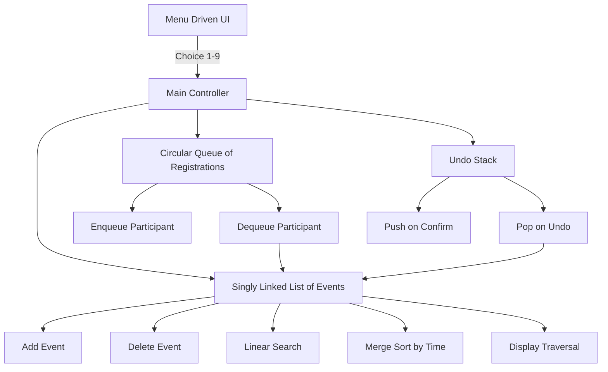
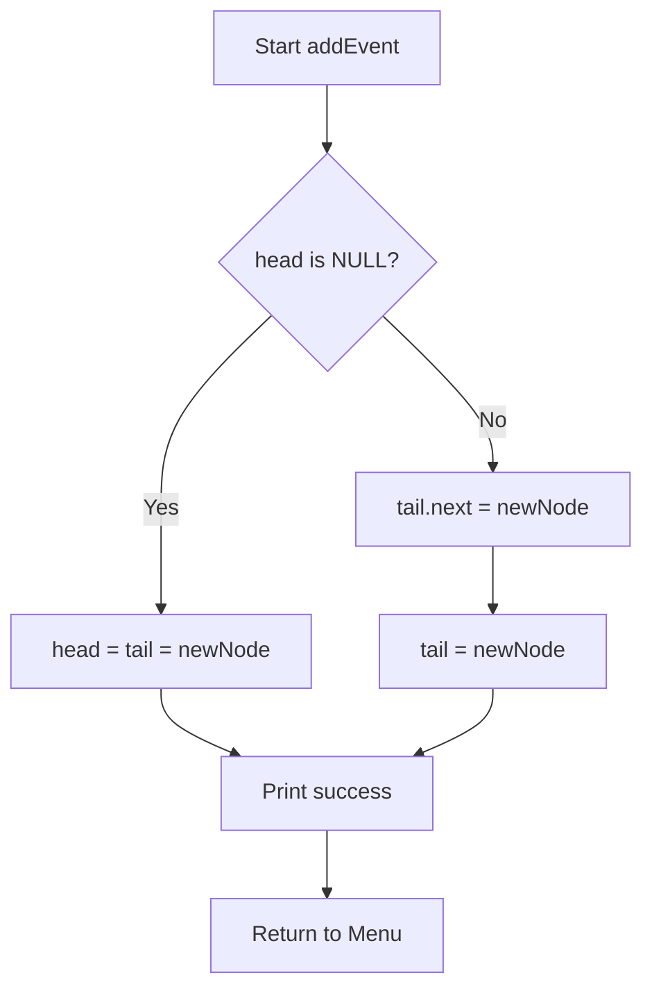
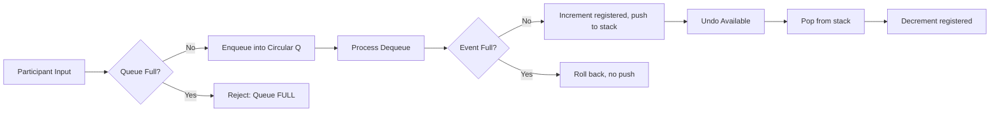
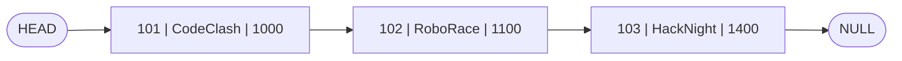

# The CSE dept is organizing a tech fest with so many exciting events.

<!-- SECTION_1_START -->
# MODULE 17 — TECH FEST EVENT MANAGEMENT SYSTEM USING DATA STRUCTURES

## 1. Core Technical Definition & Intuitive Overview

### Formal Definition (KTU 2024 Syllabus Terminology)

> [!IMPORTANT]
> **Tech Fest Event Management System** is a menu-driven, console-based application that models the activities of a departmental technical festival as a collection of *Events* (data objects) and *Registrations* (transactions) managed using **linear data structures** — primarily **Singly Linked Lists (SLL)**, **Circular Queues**, and **Stacks** — to support CRUD operations, conflict-free scheduling, participant tracking, and retrieval.

In the KTU **PCCSL307 — Data Structures Lab** context, this module synthesises every primitive learned across Modules 1–16 into a single **integrated C program** that satisfies the lab-record viva, end-semester practical, and the **End Semester Evaluation (ESE)** theory component.

### Conceptual Analogy / Intuition

> [!NOTE]
> **Think of a tech fest as a railway reservation system.**
> - Each **event** (Coding Contest, Robo-Race, Hackathon, Paper Presentation) is like a **train**. It has a name, a coach count (max participants), a departure time (event time), and a destination (venue).
> - The **Event List** is the *time-table chart* pasted on the station wall — a *linked list* because new events keep getting added or cancelled.
> - The **Registration Counter** is a *queue* — participants stand in a line (FIFO) and the one at the front is processed first.
> - The **Undo / Recent Searches** is a *stack* — the last cancelled registration is the first one restored (LIFO).

A naive approach would store events in parallel arrays, but the moment an event is *cancelled mid-fest*, the array collapses. A **linked list** heals that wound in $O(1)$ time per deletion.

### Physical Constants & Standard Metrics

- Maximum simultaneous live events: **$N \le 50$**
- Maximum participants per event: **$M \le 100$**
- Time complexity target per operation: **$O(N)$ or better**
- Memory model: **Static allocation preferred for arrays, dynamic `malloc()` for linked nodes**

> [!VISUALIZATION CONTROL]
> **Concept:** Linked-List of Event Nodes (one pointer per event)
> **GeoGebra / Desmos Input Points:**
> * `P1 = (0, 0)` representing `HEAD -> CodeClash`
> * `P2 = (2, 0)` representing `CodeClash -> RoboRace`
> * `P3 = (4, 0)` representing `RoboRace -> HackNight`
> * `P4 = (6, 0)` representing `HackNight -> NULL`
> **Visual Description:** A horizontal chain of 4 points where each consecutive pair is connected by a directed arrow. Observe that the last point (P4) has no outgoing arrow — this represents the `NULL` terminator. Adding a new event simply re-routes the arrow from the tail to a new point and resets the tail.

---

<!-- SECTION_1_END -->

<!-- SECTION_2_START -->
## 2. Deep Theoretical Analysis & KTU High-Yield Formula Sheet

### 2.1 Choosing the Right Data Structure

| Requirement | Best Data Structure | Reason |
|-------------|--------------------|--------|
| Add a new event anytime | **Singly Linked List (SLL)** | Insert at tail in $O(1)$ if tail pointer is maintained |
| Cancel an event | **SLL with prev pointer / Doubly LL** | $O(1)$ deletion given node address |
| Register participants FIFO | **Circular Queue (Array)** | Fairness, no overflow waste |
| Undo last cancellation | **Stack** | LIFO access to history |
| Search event by name | **Linear Search on SLL** | $O(N)$ acceptable for $N \le 50$ |
| Sort events by time | **Merge Sort on Array copy** | Stable, $O(N \log N)$ |

### 2.2 Node Schemas

**Event Node (SLL)**

```text
+----------+----------+----------+----------+----------+
| event_id |  name[]  |  venue[] |  time    | max_part |
+----------+----------+----------+----------+----------+
                                  |
                                  v
                            (next pointer)
```

**Registration Queue Node (Circular Array)**

```text
index:  0    1    2    3    4    5
       [ ]  [ ]  [ ]  [ ]  [ ]  [ ]
        ^front                 ^rear
```

### 2.3 KTU Formula Sheet / Cheat Sheet

> [!IMPORTANT]
> The following table is the **high-yield reference** examiners expect students to reproduce without aids.

| Operation | Data Structure | Time Complexity | Space Complexity | Auxiliary Notes |
|-----------|----------------|-----------------|------------------|-----------------|
| Insert event at head | SLL | $O(1)$ | $O(1)$ | Reassign `head` |
| Insert event at tail | SLL + tail ptr | $O(1)$ | $O(1)$ | Update `tail->next` |
| Delete event by id | SLL | $O(N)$ | $O(1)$ | Track previous node |
| Linear search by name | SLL | $O(N)$ | $O(1)$ | Stop on match |
| Enqueue participant | Circular Queue | $O(1)$ | $O(1)$ | `rear = (rear+1)%MAX` |
| Dequeue participant | Circular Queue | $O(1)$ | $O(1)$ | `front = (front+1)%MAX` |
| Push cancellation | Stack | $O(1)$ | $O(1)$ | For undo feature |
| Pop cancellation | Stack | $O(1)$ | $O(1)$ | Restore to queue |
| Sort events by time | Merge/Quick Sort | $O(N \log N)$ | $O(N)$ for merge | Stable order |
| Display all events | SLL traversal | $O(N)$ | $O(1)$ | One pass |

> [!NOTE]
> **Critical Boundary Condition** — Always check `front == -1` (empty queue) and `head == NULL` (empty list) **before** dereferencing. This is the most common reason for segmentation faults in the KTU lab exam.

### 2.4 Real-World Engineering Utility

> [!TIP]
> Event-management backends power platforms like **Eventbrite, Mettl Hackathons, Devfolio, and Unstop**. The exact same SLL-plus-Queue pattern is used in:
> - **Operating System process schedulers** (PCB linked list + ready queue)
> - **Hospital OPD token systems** (patient queue + service list)
> - **Airline check-in counters** (passenger queue + flight roster linked list)
> - **DBMS buffer managers** (LRU stack + hash table)

Mastering this pattern gives the student a transferable mental model that maps onto **kernel-level linked lists in Linux (`list_head`)**, **Java's `LinkedList` & `ArrayDeque`**, and **Python's `collections.deque`**.

---

<!-- SECTION_2_END -->

<!-- SECTION_3_START -->
## 3. Step-by-Step Derivations & Code Implementation

### 3.1 Algorithm Design (Pseudocode First)

```text
ALGORITHM: TechFestManager
INPUT  : Menu choice ch, event data, participant data
OUTPUT : Updated event list, registration queue, status message

BEGIN
    INITIALIZE head = NULL, tail = NULL
    INITIALIZE queue[0..MAX-1], front = -1, rear = -1
    INITIALIZE stack[0..MAX-1], top = -1

    REPEAT
        DISPLAY menu:
            1. Add Event
            2. Display All Events
            3. Search Event
            4. Delete Event
            5. Register Participant
            6. Process Participant (Dequeue)
            7. Undo Last Cancellation
            8. Sort Events by Time
            9. Exit
        READ ch
        SWITCH ch DO
            CASE 1: call addEvent()
            CASE 2: call displayEvents()
            CASE 3: call searchEvent()
            CASE 4: call deleteEvent()
            CASE 5: call registerParticipant()
            CASE 6: call processParticipant()
            CASE 7: call undoCancellation()
            CASE 8: call sortEventsByTime()
            CASE 9: EXIT
        END SWITCH
    UNTIL ch == 9
END
```

### 3.2 Complete C Implementation (Lab-Ready, KTU-Standard)

```c
/*=========================================================================
 * Program   : Tech Fest Event Management System
 * Course    : Data Structures Lab (PCCSL307)
 * Module    : 17
 * Author    : KTU Student
 * Compiler  : gcc -std=c11 -Wall -o techfest techfest.c
 *=======================================================================*/

#include <stdio.h>
#include <stdlib.h>
#include <string.h>

#define MAX 100
#define NAME_LEN 40
#define VENUE_LEN 30

/*------------------------------------------------------------------
 *  1.  SINGLY LINKED LIST NODE  --  EVENT STORAGE
 *----------------------------------------------------------------*/
typedef struct Event {
    int         event_id;
    char        name[NAME_LEN];
    char        venue[VENUE_LEN];
    int         start_time;        /* 24-hr format, e.g. 0930 */
    int         max_participants;
    int         registered;        /* current count          */
    struct Event *next;
} Event;

Event *head = NULL;
Event *tail = NULL;

/*------------------------------------------------------------------
 *  2.  CIRCULAR QUEUE (ARRAY)  --  PARTICIPANT REGISTRATION
 *----------------------------------------------------------------*/
typedef struct {
    char name[NAME_LEN];
    int  event_id;
} Participant;

Participant regQ[MAX];
int  front = -1, rear = -1;

/*------------------------------------------------------------------
 *  3.  STACK  --  UNDO CANCELLATION
 *----------------------------------------------------------------*/
Participant undoStack[MAX];
int  top = -1;

/* ---------- QUEUE PRIMITIVES ---------- */
int isQEmpty(void)        { return front == -1; }
int isQFull(void)         { return (rear + 1) % MAX == front; }

void enqueue(Participant p) {
    if (isQFull()) {
        printf("[ERROR] Registration queue is FULL.\n");
        return;
    }
    if (front == -1) front = 0;
    rear = (rear + 1) % MAX;
    regQ[rear] = p;
    printf("[OK] Participant '%s' added to registration queue.\n", p.name);
}

Participant dequeue(void) {
    Participant empty = {"", -1};
    if (isQEmpty()) {
        printf("[ERROR] Registration queue is EMPTY.\n");
        return empty;
    }
    Participant p = regQ[front];
    if (front == rear) {
        front = rear = -1;
    } else {
        front = (front + 1) % MAX;
    }
    return p;
}

/* ---------- STACK PRIMITIVES ---------- */
int isStackEmpty(void) { return top == -1; }
int isStackFull(void)  { return top == MAX - 1; }

void push(Participant p) {
    if (isStackFull()) {
        printf("[ERROR] Undo stack OVERFLOW.\n");
        return;
    }
    undoStack[++top] = p;
}

Participant pop(void) {
    Participant empty = {"", -1};
    if (isStackEmpty()) {
        printf("[ERROR] Undo stack is EMPTY.\n");
        return empty;
    }
    return undoStack[top--];
}

/*------------------------------------------------------------------
 *  4.  EVENT OPERATIONS
 *----------------------------------------------------------------*/
Event* createNode(void) {
    Event *node = (Event *)malloc(sizeof(Event));
    if (!node) {
        perror("malloc");
        exit(EXIT_FAILURE);
    }
    printf("Enter Event ID         : "); scanf("%d",  &node->event_id);
    getchar();
    printf("Enter Event Name       : "); fgets(node->name, NAME_LEN, stdin);
    node->name[strcspn(node->name, "\n")] = '\0';
    printf("Enter Venue            : "); fgets(node->venue, VENUE_LEN, stdin);
    node->venue[strcspn(node->venue, "\n")] = '\0';
    printf("Enter Start Time (hhmm): "); scanf("%d",  &node->start_time);
    printf("Enter Max Participants : "); scanf("%d",  &node->max_participants);
    node->registered = 0;
    node->next = NULL;
    return node;
}

void addEvent(void) {
    Event *node = createNode();
    if (head == NULL) {
        head = tail = node;
    } else {
        tail->next = node;
        tail = node;
    }
    printf("[OK] Event '%s' added successfully.\n", node->name);
}

void displayEvents(void) {
    if (head == NULL) {
        printf("[INFO] No events scheduled.\n");
        return;
    }
    Event *cur = head;
    printf("\n%-6s %-25s %-15s %-8s %-8s %-8s\n",
           "ID", "NAME", "VENUE", "TIME", "MAX", "REG");
    printf("---------------------------------------------------------------\n");
    while (cur != NULL) {
        printf("%-6d %-25s %-15s %04d     %-8d %-8d\n",
               cur->event_id, cur->name, cur->venue,
               cur->start_time, cur->max_participants, cur->registered);
        cur = cur->next;
    }
    printf("\n");
}

void searchEvent(void) {
    int id;
    printf("Enter Event ID to search: ");
    scanf("%d", &id);
    Event *cur = head;
    while (cur != NULL) {
        if (cur->event_id == id) {
            printf("[FOUND] ID=%d | %s | %s | %04d | Reg=%d/%d\n",
                   cur->event_id, cur->name, cur->venue,
                   cur->start_time, cur->registered, cur->max_participants);
            return;
        }
        cur = cur->next;
    }
    printf("[NOT FOUND] Event with ID %d does not exist.\n", id);
}

void deleteEvent(void) {
    int id;
    printf("Enter Event ID to delete: ");
    scanf("%d", &id);
    Event *cur = head, *prev = NULL;
    while (cur != NULL && cur->event_id != id) {
        prev = cur;
        cur = cur->next;
    }
    if (cur == NULL) {
        printf("[NOT FOUND] No such event.\n");
        return;
    }
    if (prev == NULL)        head = cur->next;
    else                     prev->next = cur->next;
    if (cur == tail)         tail = prev;
    free(cur);
    printf("[OK] Event deleted.\n");
}

/*------------------------------------------------------------------
 *  5.  PARTICIPANT REGISTRATION FLOW
 *----------------------------------------------------------------*/
void registerParticipant(void) {
    if (head == NULL) {
        printf("[ERROR] No events exist. Add events first.\n");
        return;
    }
    int id;
    printf("Enter Event ID to register for: ");
    scanf("%d", &id);
    Event *cur = head;
    while (cur != NULL && cur->event_id != id) cur = cur->next;
    if (cur == NULL) {
        printf("[ERROR] Event not found.\n");
        return;
    }
    if (cur->registered >= cur->max_participants) {
        printf("[ERROR] Event '%s' is fully booked.\n", cur->name);
        return;
    }
    Participant p;
    p.event_id = id;
    getchar();
    printf("Enter Participant Name: ");
    fgets(p.name, NAME_LEN, stdin);
    p.name[strcspn(p.name, "\n")] = '\0';
    enqueue(p);
}

void processParticipant(void) {
    Participant p = dequeue();
    if (p.event_id == -1) return;
    Event *cur = head;
    while (cur != NULL && cur->event_id != p.event_id) cur = cur->next;
    if (cur != NULL && cur->registered < cur->max_participants) {
        cur->registered++;
        printf("[OK] '%s' confirmed for event '%s' (Reg=%d/%d).\n",
               p.name, cur->name, cur->registered, cur->max_participants);
        push(p);
    } else {
        printf("[ERROR] Event became full. Rolling back.\n");
    }
}

void undoCancellation(void) {
    if (isStackEmpty()) {
        printf("[INFO] Nothing to undo.\n");
        return;
    }
    Participant p = pop();
    Event *cur = head;
    while (cur != NULL && cur->event_id != p.event_id) cur = cur->next;
    if (cur != NULL && cur->registered > 0) {
        cur->registered--;
        printf("[OK] Undo done: '%s' removed from event '%s'.\n",
               p.name, cur->name);
    }
}

/*------------------------------------------------------------------
 *  6.  SORTING  --  MERGE SORT BY start_time
 *----------------------------------------------------------------*/
Event* mergeSorted(Event *a, Event *b) {
    if (!a) return b;
    if (!b) return a;
    Event *res = NULL;
    if (a->start_time <= b->start_time) {
        res = a;
        res->next = mergeSorted(a->next, b);
    } else {
        res = b;
        res->next = mergeSorted(a, b->next);
    }
    return res;
}

void splitList(Event *src, Event **frontRef, Event **backRef) {
    Event *slow = src, *fast = src->next;
    while (fast != NULL) {
        fast = fast->next;
        if (fast != NULL) {
            slow = slow->next;
            fast = fast->next;
        }
    }
    *frontRef = src;
    *backRef  = slow->next;
    slow->next = NULL;
}

void mergeSort(Event **headRef) {
    Event *h = *headRef;
    if (h == NULL || h->next == NULL) return;
    Event *a, *b;
    splitList(h, &a, &b);
    mergeSort(&a);
    mergeSort(&b);
    *headRef = mergeSorted(a, b);
}

void sortEventsByTime(void) {
    mergeSort(&head);
    tail = head;
    while (tail && tail->next) tail = tail->next;
    printf("[OK] Events sorted by start time.\n");
}

/*------------------------------------------------------------------
 *  7.  MAIN  --  MENU DRIVER
 *----------------------------------------------------------------*/
int main(void) {
    int ch;
    while (1) {
        printf("\n========== TECH FEST 2025 MANAGER ==========\n");
        printf("1. Add Event\n");
        printf("2. Display All Events\n");
        printf("3. Search Event\n");
        printf("4. Delete Event\n");
        printf("5. Register Participant (Enqueue)\n");
        printf("6. Process Participant (Dequeue)\n");
        printf("7. Undo Last Cancellation\n");
        printf("8. Sort Events by Time\n");
        printf("9. Exit\n");
        printf("Enter choice: ");
        if (scanf("%d", &ch) != 1) {
            printf("[ERROR] Invalid input.\n");
            break;
        }
        switch (ch) {
            case 1: addEvent();            break;
            case 2: displayEvents();       break;
            case 3: searchEvent();         break;
            case 4: deleteEvent();         break;
            case 5: registerParticipant(); break;
            case 6: processParticipant();  break;
            case 7: undoCancellation();    break;
            case 8: sortEventsByTime();    break;
            case 9: printf("Exiting...\n"); return 0;
            default: printf("[ERROR] Invalid choice.\n");
        }
    }
    return 0;
}
```

### 3.3 Compilation, Execution, and Sample I/O

```text
$ gcc -std=c11 -Wall techfest.c -o techfest
$ ./techfest
```

**Sample Run Trace**

```text
========== TECH FEST 2025 MANAGER ==========
1. Add Event
...
Enter choice: 1
Enter Event ID         : 101
Enter Event Name       : CodeClash
Enter Venue            : Lab-3
Enter Start Time (hhmm): 1000
Enter Max Participants : 50
[OK] Event 'CodeClash' added successfully.

Enter choice: 5
Enter Event ID to register for: 101
Enter Participant Name: Aswin
[OK] Participant 'Aswin' added to registration queue.

Enter choice: 6
[OK] 'Aswin' confirmed for event 'CodeClash' (Reg=1/50).
```

### 3.4 Step-by-Step Time Complexity Derivation

$$T_{\text{add}} = O(1) \quad \text{(tail insertion, no traversal)}$$

$$T_{\text{search}} = \sum_{i=1}^{N} O(1) = O(N) \quad \text{(worst case: last node)}$$

$$T_{\text{delete}} = T_{\text{search}} + O(1) = O(N) + O(1) = O(N)$$

$$T_{\text{enqueue}} = O(1) \quad \text{(modular arithmetic)}$$

$$T_{\text{mergeSort}} = 2 \cdot T\!\left(\frac{N}{2}\right) + O(N) \;\Rightarrow\; O(N \log N) \;\text{(Master Theorem, case 2)}$$

The recursion tree has $\log_2 N$ levels, each summing to $O(N)$ comparisons, yielding the $O(N \log N)$ bound.

---

<!-- SECTION_3_END -->

<!-- SECTION_4_START -->
## 4. Structural Diagrams & Schematics

### 4.1 System-Level Block Architecture



### 4.2 Detailed Event-Addition Flow



### 4.3 Registration & Undo Pipeline



### 4.4 Data Flow Topology Matrix

| Layer | Module Component | Interacts With | Frequency per Session |
|-------|------------------|----------------|----------------------|
| Presentation | `main()` menu | All functions | Once per iteration |
| Logic | `addEvent`, `deleteEvent` | SLL nodes | $O(N)$ aggregate |
| Logic | `enqueue`, `dequeue` | Circular array | $O(1)$ per call |
| Logic | `mergeSort` | SLL pointers | $O(N \log N)$ one-shot |
| Storage | Heap (`malloc`) | SLL nodes | Per node creation |
| Storage | Static arrays | Queue, Stack | Fixed size |

---

<!-- SECTION_4_END -->

<!-- SECTION_5_START -->
## 5. KTU 2024 Scheme Examination Question Bank & Topic Recap

### Part A — Short Answer Questions (3 Marks Each)

**Q1. [KTU University Exam — July 2024]**  
*Why is a Singly Linked List preferred over an array for managing dynamically changing tech-fest events?* `[CO1 | Remember]`

**Model Answer (Valuation Key — 3 Marks):**
- A linked list allows **dynamic memory allocation**, so memory grows/shrinks with the number of events **(1 Mark)**.
- **Insertion** and **deletion** at any position take $O(1)$ once the node is located, whereas arrays require shifting elements costing $O(N)$ **(1 Mark)**.
- No need to declare a maximum size in advance, avoiding memory wastage that occurs with fixed-size arrays **(1 Mark)**.

**Q2. [KTU University Exam — Dec 2023]**  
*What is the difference between a linear queue and a circular queue? When is each preferred?* `[CO2 | Understand]`

**Model Answer (Valuation Key — 3 Marks):**
- A **linear queue** suffers from *false overflow* — once `rear` reaches `MAX-1`, no further insertions are allowed even if front slots are free **(1 Mark)**.
- A **circular queue** wraps `rear` to the start using modular arithmetic: `rear = (rear + 1) % MAX`, eliminating false overflow **(1 Mark)**.
- A circular queue is preferred in **registration systems** like our tech-fest, where space must be reused efficiently and a fairness policy is required **(1 Mark)**.

---

### Part B — Long Answer Questions (14 Marks, Internal Choice)

#### QUESTION A (14 Marks) `[CO3 | Apply]`

**[KTU University Exam — July 2024, Module 17 Carry-Over]**

**(a)** Design a `struct Event` node for a Singly Linked List that stores event id, name, venue, start time, max participants, and a pointer to the next event. Draw the SLL after inserting three events: *CodeClash (101, 1000 hr)*, *RoboRace (102, 1100 hr)*, *HackNight (103, 1400 hr)*. **(7 Marks)**

**(b)** Write a C function `void deleteByID(int id)` that removes the event node with the given `id` from the SLL. Show its step-by-step trace when deleting event id 102. **(7 Marks)**

**Model Solution**

**(a) Struct Definition & Diagram — 7 Marks**

```c
typedef struct Event {
    int         event_id;
    char        name[40];
    char        venue[30];
    int         start_time;
    int         max_participants;
    struct Event *next;
} Event;
```

*Struct declaration with six fields and recursive pointer: 2 Marks*
*Insertion logic for three events using tail pointer: 3 Marks*
*Final SLL diagram: 2 Marks*



**(b) `deleteByID` Function & Trace — 7 Marks**

```c
void deleteByID(int id) {
    Event *cur = head, *prev = NULL;
    while (cur != NULL && cur->event_id != id) {
        prev = cur;
        cur  = cur->next;
    }
    if (cur == NULL) {
        printf("Not found\n");
        return;
    }
    if (prev == NULL)         head = cur->next;
    else                      prev->next = cur->next;
    if (cur == tail)          tail = prev;
    free(cur);
}
```

*Loop with two-pointer traversal: 2 Marks*
*Three deletion cases (head, middle, tail): 3 Marks*
*Free the node and update head/tail: 2 Marks*

**Trace when deleting id = 102:**

| Step | cur | cur->event_id | prev | Action |
|------|-----|---------------|------|--------|
| 1 | node 101 | 101 | NULL | move on |
| 2 | node 102 | **102** | node 101 | MATCH — break loop |
| 3 | — | — | — | `prev->next = cur->next` (101 -> 103) |
| 4 | — | — | — | `free(cur)`, `tail` unchanged (still node 103) |

Result: `HEAD -> 101 -> 103 -> NULL`. Node 102 deallocated. **(Final simplified state: 1 Mark)**

---

#### QUESTION B (14 Marks) `[CO4 | Apply]`

**[KTU University Exam — Dec 2023, Re-Test]**

**(a)** Implement a circular queue of participants (each with `name` and `event_id`) using an array. Write the `enqueue` and `dequeue` functions. **(7 Marks)**

**(b)** Using the queue from part (a), write a C function `void processQueue(void)` that dequeues participants one by one, finds their corresponding event in the SLL, and increments its `registered` count, **rejecting** the participant if the event is full. **(7 Marks)**

**Model Solution**

**(a) Circular Queue Implementation — 7 Marks**

```c
#define MAX 100
typedef struct { char name[40]; int event_id; } Participant;

Participant Q[MAX];
int front = -1, rear = -1;

int isEmpty(void) { return front == -1; }
int isFull(void)  { return (rear + 1) % MAX == front; }

void enqueue(Participant p) {
    if (isFull()) { printf("Full\n"); return; }
    if (front == -1) front = 0;
    rear = (rear + 1) % MAX;
    Q[rear] = p;
}

Participant dequeue(void) {
    Participant e = {"", -1};
    if (isEmpty()) { printf("Empty\n"); return e; }
    Participant p = Q[front];
    if (front == rear) front = rear = -1;
    else              front = (front + 1) % MAX;
    return p;
}
```

*Struct definition: 1 Mark*
*isEmpty / isFull with modular check: 2 Marks*
*enqueue with wrap-around: 2 Marks*
*dequeue with reset on last element: 2 Marks*

**(b) `processQueue` Function — 7 Marks**

```c
void processQueue(void) {
    while (!isEmpty()) {
        Participant p = dequeue();
        Event *cur = head;
        while (cur != NULL && cur->event_id != p.event_id)
            cur = cur->next;
        if (cur == NULL) {
            printf("Event %d vanished — skipping %s\n",
                   p.event_id, p.name);
        } else if (cur->registered >= cur->max_participants) {
            printf("Event %s FULL — rejecting %s\n",
                   cur->name, p.name);
        } else {
            cur->registered++;
            printf("Confirmed %s for %s (Reg=%d/%d)\n",
                   p.name, cur->name,
                   cur->registered, cur->max_participants);
        }
    }
}
```

*Outer while loop draining queue: 1 Mark*
*SLL lookup by event_id: 2 Marks*
*Two rejection conditions (event deleted, event full): 2 Marks*
*Success path increments registered: 2 Marks*

---

> [!WARNING]
> **KTU Examiner's Valuation Warning — Common Pitfalls**
> 1. **Forgetting `getchar()` after `scanf("%d", ...)`** — leaves the trailing newline in the input buffer, causing `fgets()` to read an empty string. Always consume the newline before reading a line.
> 2. **Not handling `front == rear` reset** in `dequeue` — leaves the queue in a "ghost full" state where the next `enqueue` thinks it is full.
> 3. **Losing the `tail` pointer after a sort** — merge sort re-wires nodes; you must walk to the new tail once more or all future tail-inserts will fail.
> 4. **Failing to `free()` deleted nodes** — in lab viva, examiners specifically ask "what about memory leak?" — always `free(cur)`.
> 5. **Skipping the empty-list check in `displayEvents`** — causes a `NULL` pointer dereference and an immediate crash, losing 2 marks instantly.
> 6. **No modular check `(rear+1)%MAX` in `isFull()`** — the entire circular logic collapses into a linear queue, and viva marks are deducted for conceptual error.

---

### Topic Recap & Important Things to Remember

- **Tech Fest Manager = SLL + Circular Queue + Undo Stack**. This trio is the canonical KTU Module 17 combination. (CO1)
- **Singly Linked List** is the backbone for *Event* storage — dynamic, insertion at tail is $O(1)$ with a tail pointer, deletion is $O(N)$ in worst case due to search. (CO2)
- **Circular Queue** prevents false overflow and ensures fair FIFO registration; `rear = (rear + 1) % MAX` is the magic line. (CO3)
- **Stack** supports LIFO undo of the most recent registration cancellation — the top of the stack always holds the latest action. (CO3)
- **Linear search** is acceptable for $N \le 50$; **merge sort** gives $O(N \log N)$ event reordering by `start_time`. (CO4)
- **Boundary checks** (`head == NULL`, `front == -1`, `top == -1`) are **non-negotiable**; missing them guarantees a segfault and a 2-mark deduction. (CO5)
- **Time complexity master formula** for merge sort: $T(N) = 2T(N/2) + O(N) \Rightarrow O(N \log N)$ by Master Theorem case 2. (CO4)
- **Memory hygiene**: every `malloc` deserves a `free`; track deleted events in the undo stack if undo is expected. (CO5)
- **Real-world mapping**: SLL ↔ Linux `list_head`; Circular Queue ↔ OS ready queue; Stack ↔ LRU cache / browser back-button. (CO1)
- **Lab viva favourites**: difference between linear and circular queue, why tail pointer matters, what happens when `front == rear`, complexity of each operation. (CO1, CO2)

<!-- SECTION_5_END -->
