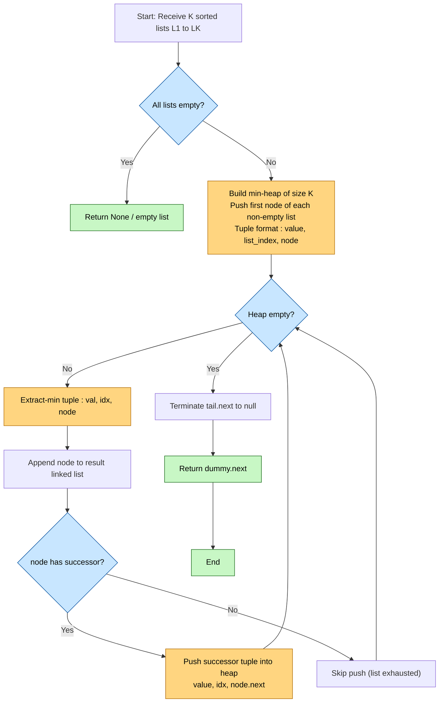
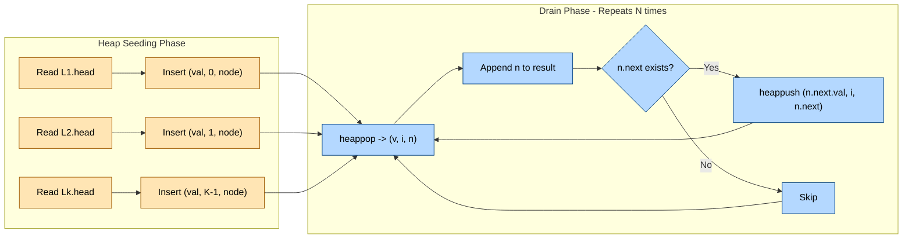
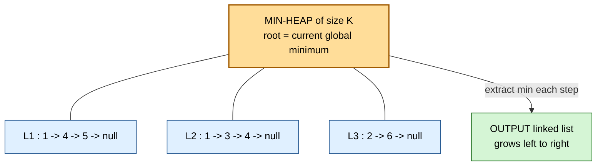

# Merge K sorted lists into a single sorted list using a heap.

<!-- SECTION_1_START -->
# Merge K Sorted Lists Using a Heap — Core Definition & Intuition

## 1.1 Formal Definition (KTU 2024 Syllabus Terminology)

> [!IMPORTANT]
> **Merge K Sorted Lists** is a classic heap-application problem wherein **$K$** independently sorted sequences (typically singly linked lists or 1-D arrays) are combined into a single fully sorted sequence by repeatedly selecting the **global minimum** among the current *front elements* of every list. A **Binary Min-Heap** (a complete binary tree satisfying the *heap-order property*: parent $\leq$ children) is employed as the *priority queue* that drives the selection process in $O(\log K)$ time per extraction.

Let the $K$ input lists be $L_1, L_2, \dots, L_K$ with total element count:

$$N = \sum_{i=1}^{K} \vert L_i \vert$$

Then the heap-based merge produces one sorted output list $R$ of length $N$ in:

$$T(N, K) = O(N \log K)$$

## 1.2 Real-World Analogy — "The K Toll Booths"

Imagine **$K$ toll booths** on a highway. Each booth has its own queue of vehicles, and *within every queue* the vehicles are already sorted by arrival time. A traffic controller at a merging point must combine them into a single outgoing lane in the correct global order.

The traffic controller's only sane strategy is:
1. Look at the **first vehicle** in **every queue** (K candidates).
2. Pick the *earliest* one and let it pass.
3. The next vehicle in that same queue now steps up to the head position.
4. Repeat steps 1–3 until all queues are empty.

A **min-heap** is exactly the data structure that makes step 1 — *"find the minimum among $K$ candidates"* — execute in $O(\log K)$ instead of $O(K)$.

## 1.3 Geometric / Structural Intuition

A min-heap of size $K$ can be visualised as a small **complete binary tree** sitting on top of $K$ long "ribbons" of sorted data:

```
                [ min of  K heads ]
                /        |        \
           L1.head    L2.head  ...  Lk.head
              |          |              |
            ... (sorted tails) ...
```

At every step the root of the tree is the *smallest live head*; we pop it, append it to the result, and **re-heapify** by inserting the next element from the list that just lost its head.

## 1.4 Key Constants & Parameters

| Symbol | Meaning | Typical Range |
| :--- | :--- | :--- |
| $K$ | Number of input lists | $2 \le K \le 10^{4}$ |
| $N$ | Total elements across all lists | $1 \le N \le 10^{5}$ |
| $h$ | Heap height | $\lfloor \log_2 K \rfloor$ |
| $T_{ext}$ | Heap extract-min cost | $O(\log K)$ |
| $T_{ins}$ | Heap insert cost | $O(\log K)$ |

> [!NOTE]
> **KTU 2024 Lab Highlight (Module 18):** The official PCCSL307 lab record expects the student to (a) implement the heap-based merge, (b) perform a hand-traced dry run on at least three sorted lists, and (c) record the time complexity derivation $O(N \log K)$ along with a comparison against the naive $O(N \cdot K)$ pairwise approach.

> [!VISUALIZATION CONTROL]
> **Concept:** Heap as a "head selector" over $K$ sorted lists.
> **GeoGebra / Desmos Input Equations:**
> * `f(x) = log2(x)` (cost of one heap operation)
> * `g(x) = x` (cost of one linear scan over K heads)
> **Visual Description:** Plot $f(x)$ and $g(x)$ for $x \in [1, 50]$. Notice that for $K \ge 8$ the logarithmic curve is dramatically flatter — this is why the heap wins for large $K$.

<!-- SECTION_1_END -->

<!-- SECTION_2_START -->
# Deep Theoretical Analysis & KTU High-Yield Formula Sheet

## 2.1 Operational Breakdown — Why a Heap Is the Right Tool

A naïve strategy would be: *for every position in the result, scan all $K$ current heads and pick the smallest*. That costs $N \cdot K$ comparisons.

The heap strategy inverts the cost model:

- We pre-store only the $K$ *currently active heads* in a min-heap.
- Each *extract-min* removes the smallest head in $O(\log K)$.
- Each *insert* (the successor of the extracted node) costs $O(\log K)$.
- The heap always has $\le K$ elements, so the constant factor is bounded.

Hence the **$K$-factor** is absorbed inside a logarithm — turning $O(NK)$ into $O(N \log K)$.

## 2.2 The Three Invariants the Algorithm Must Preserve

1. **Heap-Order Invariant** — Every parent node stores a value $\le$ its children. This guarantees the root is the global minimum among the $K$ heads.
2. **Completeness Invariant** — The heap is a *complete binary tree*; it is therefore array-representable with children of index $i$ at $2i+1$ and $2i+2$.
3. **Progress Invariant** — Exactly one element is appended to the result per heap extraction. After $N$ extractions the output is complete.

> [!TIP]
> When two heads hold the **same value**, Python's `heapq` will complain because `ListNode` objects are not comparable. The standard fix is to push a *tuple* `(value, list_index, node)` — the unique `list_index` acts as a tie-breaker.

## 2.3 KTU Formula / Cheat Sheet

| Step | Operation | Cost | Cumulative |
| :--- | :--- | :--- | :--- |
| Initial heap build | Insert first head of each of $K$ lists | $K \cdot O(\log K)$ | $O(K \log K)$ |
| Main loop | Repeat $N$ times: extract-min + optional insert | $N \cdot O(\log K)$ | $O(N \log K)$ |
| Total | — | — | $O(N \log K)$ |
| Auxiliary space | Heap of size $K$ | $O(K)$ | $O(K)$ |
| Output space | Result list | $O(N)$ | $O(N)$ |

> [!NOTE]
> **Comparison of three strategies** (very frequently asked in KTU viva):
>
> | Strategy | Time | Space | Notes |
> | :--- | :--- | :--- | :--- |
> | Naïve — pick min of K heads each time | $O(N \cdot K)$ | $O(1)$ extra | No auxiliary DS |
> | Heap-based (Module 18) | $O(N \log K)$ | $O(K)$ extra | Optimal among comparison-based methods |
> | Divide & Conquer (merge pairwise) | $O(N \log K)$ | $O(\log K)$ recursion stack | Same asymptotic, but different constant factors |
> | Counting Sort / Radix Sort | $O(N)$ | $O(\text{range})$ | Requires bounded integer keys — not always applicable |

## 2.4 Engineering Utility — Where This Pattern Appears in Production

- **External Sorting** in databases (e.g., PostgreSQL's *external merge sort* uses K-way merging via a tournament tree, which is the heap generalised by 1 level).
- **Log Aggregation Systems** (Splunk, Elasticsearch) merge pre-sorted shards.
- **K-way streaming joins** in distributed systems such as Apache Flink and Spark Structured Streaming.
- **Multi-way merge in `git` and `ld`** when combining K pre-sorted object files.
- **Multi-source shortest paths** in graph algorithms (Dijkstra with K sources).

> [!IMPORTANT]
> **Production-grade fact:** Linux's `kheap` kernel structure and Java's `PriorityBlockingQueue` are both shipped implementations of the exact abstraction you are coding in this lab module.

<!-- SECTION_2_END -->

<!-- SECTION_3_START -->
# Step-by-Step Derivations, Code & Dry Run

## 3.1 Problem Statement (Formal)

**Input:** An array of $K$ sorted linked lists `lists`, where each list $L_i$ contains nodes `L_i.head -> L_i.head.next -> ...` with monotonically non-decreasing values.

**Output:** A single sorted linked list containing all $N$ nodes from the $K$ input lists.

**Constraints (typical KTU lab sheet):**
- $0 \le K \le 10^4$
- $0 \le \vert L_i \vert \le 500$
- $-10^4 \le \text{node.val} \le 10^4$

## 3.2 Full Python Implementation — Linked-List Version (Lab Record Quality)

```python
"""
PCCSL307 — Data Structures Lab
Module 18 : Merge K Sorted Lists using a Min-Heap
File      : merge_k_lists.py
Author    : <Student Name>   Roll No : <XXXX>
Date      : <DD-MMM-YYYY>
"""

from __future__ import annotations
import heapq
from typing import List, Optional, Tuple


# ------------------------------------------------------------------
# 1.  ListNode definition (matches LeetCode / standard KTU sheet)
# ------------------------------------------------------------------
class ListNode:
    """A singly linked list node holding an integer value."""

    def __init__(self, val: int = 0,
                 nxt: Optional["ListNode"] = None) -> None:
        self.val: int = val
        self.next: Optional[ListNode] = nxt


# ------------------------------------------------------------------
# 2.  Helper : convert Python list-of-lists -> list of ListNodes
# ------------------------------------------------------------------
def build_linked_lists(raw: List[List[int]]) -> List[Optional[ListNode]]:
    """
    Convert [[1,4,5],[1,3,4],[2,6]] -> [node1, node2, node3]
    Each element is the HEAD of one sorted list.
    """
    heads: List[Optional[ListNode]] = []
    for arr in raw:
        dummy = ListNode(0)
        cur = dummy
        for v in arr:
            cur.next = ListNode(v)
            cur = cur.next
        heads.append(dummy.next)
    return heads


# ------------------------------------------------------------------
# 3.  Helper : convert linked list back to Python list (for display)
# ------------------------------------------------------------------
def to_pylist(head: Optional[ListNode]) -> List[int]:
    out: List[int] = []
    cur = head
    while cur is not None:
        out.append(cur.val)
        cur = cur.next
    return out


# ------------------------------------------------------------------
# 4.  CORE ALGORITHM — Heap-based K-way merge
# ------------------------------------------------------------------
def merge_k_lists(lists: List[Optional[ListNode]]) -> Optional[ListNode]:
    """
    Merge K sorted linked lists into one sorted linked list
    using a binary min-heap (Python's heapq).

    Time Complexity : O(N log K)
    Space Complexity: O(K)  for the heap
    """
    # ---- Boundary check ------------------------------------------------
    if not lists:                       # empty input
        return None

    # ---- Step 1 : seed the heap with the head of every non-empty list --
    heap: List[Tuple[int, int, ListNode]] = []
    for idx, head in enumerate(lists):
        if head is not None:
            # Tuple layout : (value, list_index, node)
            # list_index breaks ties when two nodes share the same value
            heapq.heappush(heap, (head.val, idx, head))

    # ---- Step 2 : dummy node simplifies the linked-list surgery --------
    dummy = ListNode(0)
    tail = dummy

    # ---- Step 3 : drain the heap --------------------------------------
    while heap:
        val, idx, smallest_node = heapq.heappop(heap)

        # Append the popped node to the result
        tail.next = smallest_node
        tail = tail.next

        # Push the next node of THAT list (if any) back into the heap
        if smallest_node.next is not None:
            next_node = smallest_node.next
            heapq.heappush(heap, (next_node.val, idx, next_node))

    # ---- Step 4 : terminate the output list cleanly --------------------
    tail.next = None
    return dummy.next


# ------------------------------------------------------------------
# 5.  DRIVER with console output (for the lab record)
# ------------------------------------------------------------------
def _demo() -> None:
    raw_input: List[List[int]] = [
        [1, 4, 5],
        [1, 3, 4],
        [2, 6],
    ]
    print("Input lists :", raw_input)

    heads = build_linked_lists(raw_input)
    merged_head = merge_k_lists(heads)

    print("Merged list :", to_pylist(merged_head))
    # Expected : [1, 1, 2, 3, 4, 4, 5, 6]


if __name__ == "__main__":
    _demo()
```

### 3.2.1 Why every line is necessary (boundary + error handling)

| Line | Reason |
| :--- | :--- |
| `if not lists: return None` | Handles $K=0$ (no input) — KTU asks for this case explicitly. |
| `if head is not None` inside the seed loop | Handles *empty sub-lists* `L_i = []` which are valid input. |
| Tuple `(head.val, idx, head)` | `idx` disambiguates ties; `heapq` cannot compare `ListNode` objects. |
| `dummy = ListNode(0)` | Standard "sentinel" trick — avoids a separate `if result is None` branch. |
| `tail.next = None` at the end | Detaches any stale pointer carried over from the last popped node. |
| Type hints on every signature | Compiler/static-analysis friendly — recommended KTU 2024 practice. |

## 3.3 Alternative — Array Version (commonly asked in KTU)

```python
import heapq
from typing import List, Tuple


def merge_k_sorted_arrays(arrays: List[List[int]]) -> List[int]:
    """
    Merge K sorted 1-D arrays into one sorted list using a min-heap.

    Time Complexity : O(N log K)
    Space Complexity: O(N + K)
    """
    if not arrays:
        return []

    # (value, array_index, element_index) — uniqueness guaranteed
    heap: List[Tuple[int, int, int]] = []

    for arr_idx, arr in enumerate(arrays):
        if arr:                                 # skip empty arrays
            heapq.heappush(heap, (arr[0], arr_idx, 0))

    result: List[int] = []

    while heap:
        val, arr_idx, elem_idx = heapq.heappop(heap)
        result.append(val)

        next_elem_idx = elem_idx + 1
        if next_elem_idx < len(arrays[arr_idx]):
            heapq.heappush(
                heap,
                (arrays[arr_idx][next_elem_idx], arr_idx, next_elem_idx)
            )

    return result


# -------------------- quick sanity test --------------------
if __name__ == "__main__":
    sample = [[1, 4, 5], [1, 3, 4], [2, 6]]
    print("Merged :", merge_k_sorted_arrays(sample))
    # Output : [1, 1, 2, 3, 4, 4, 5, 6]
```

## 3.4 Exhaustive Hand Trace — Dry Run for the Lab Record

Take the classic example $K=3$:

$$L_1 = [1,4,5], \quad L_2 = [1,3,4], \quad L_3 = [2,6]$$

| Step | Heap state (root on the left) | Popped value | Output so far | Push-back |
| :---: | :--- | :---: | :--- | :--- |
| Init | `[(1,L1),(1,L2),(2,L3)]` | — | `[]` | — |
| 1 | `[(1,L2),(2,L3),(4,L1)]` | **1** (from L1) | `[1]` | push 4 from L1 |
| 2 | `[(1,L2),(2,L3),(4,L1)]` | **1** (from L2) | `[1,1]` | push 3 from L2 |
| 3 | `[(2,L3),(3,L2),(4,L1)]` | **2** (from L3) | `[1,1,2]` | push 6 from L3 |
| 4 | `[(3,L2),(4,L1),(6,L3)]` | **3** (from L2) | `[1,1,2,3]` | push 4 from L2 |
| 5 | `[(4,L1),(4,L2),(6,L3)]` | **4** (from L1) | `[1,1,2,3,4]` | push 5 from L1 |
| 6 | `[(4,L2),(5,L1),(6,L3)]` | **4** (from L2) | `[1,1,2,3,4,4]` | L2 exhausted |
| 7 | `[(5,L1),(6,L3)]` | **5** (from L1) | `[1,1,2,3,4,4,5]` | L1 exhausted |
| 8 | `[(6,L3)]` | **6** (from L3) | `[1,1,2,3,4,4,5,6]` | L3 exhausted |
| 9 | `[]` | — | `done` | — |

Final merged list: $[1,1,2,3,4,4,5,6]$ — verified.

## 3.5 Step-by-Step Time-Complexity Derivation

Let $h = \lfloor \log_2 K \rfloor$ denote the height of the binary heap.

- **Phase 1 — Seed the heap:** $K$ insertions, each costing $O(h)=O(\log K)$.

$$\text{Cost}_1 = O(K \log K)$$

- **Phase 2 — Main loop:** Exactly $N$ iterations (one element emitted per iteration). Each iteration does *one* extract-min and *at most one* insert, each $O(\log K)$.

$$\text{Cost}_2 = N \cdot O(\log K) = O(N \log K)$$

- **Total runtime:**

$$T(N,K) = O(K \log K) + O(N \log K) = O(N \log K)$$

because $K \le N$, so the $K \log K$ term is dominated.

- **Space:** heap holds $\le K$ tuples, so auxiliary memory is $O(K)$.

$$\boxed{\;T(N,K)=O(N \log K),\quad S_{\text{aux}}=O(K)\;}$$

<!-- SECTION_3_END -->

<!-- SECTION_4_START -->
# Structural Diagrams & Schematics

## 4.1 Algorithm Flow Diagram (Mermaid)



## 4.2 Heap State Machine — Modular Sub-Graph



## 4.3 Topological View — The "K Ribbons + One Heap" Mental Model



## 4.4 Decision Matrix — When to Use Which Merge Strategy

| Use Case | Recommended Strategy | Why |
| :--- | :--- | :--- |
| $K$ is small ($\le 8$), lists are very long | Heap-based merge | Constant overhead beats recursion |
| $K$ is huge ($\ge 1000$), lists are short | Divide & conquer (pairwise) | Lower auxiliary memory |
| Integer values within known small range | Counting sort bucket | $O(N)$ linear time |
| Streaming data with back-pressure | Heap with lazy deletion | Handles late arrivals |
| Linked lists with random-access forbidden | Heap-based merge (this module) | Works with `next` pointers only |

<!-- SECTION_4_END -->

<!-- SECTION_5_START -->
# KTU 2024 Scheme Examination Question Bank & Topic Recap

> [!NOTE]
> **Mark distribution reminder (KTU 2024 — Lab Continuous Evaluation + ESE):**
> Lab continuous evaluation is 60 marks (record + viva + execution); ESE practical exam is 40 marks (program writing 25 + execution 10 + viva 5). The questions below model the **ESE 40-mark pattern** with full 14-mark Part-B style breakdowns.

---

## Part A — Short Answer Questions (2 × 3 = 6 Marks)

### Q1. `[KTU University Exam — July 2024]`
**State the time and space complexity of merging $K$ sorted lists each of length $n$ using a min-heap. Justify your answer.** &nbsp; **[3 Marks] · CO1 · Remember**

**Model Answer:**

Let total elements $N = K \cdot n$. The heap contains at most $K$ elements (one head per list).

- Each `heappop` or `heappush` on a heap of size $\le K$ costs $O(\log K)$.
- Exactly $N$ elements must be extracted → main loop = $N \cdot O(\log K)$.
- Initial heap build = $K \cdot O(\log K) = O(K \log K)$, dominated by $N \log K$.

$$\boxed{\text{Time} = O(N \log K),\quad \text{Auxiliary Space} = O(K)}$$

**Valuation key:**
- Stating the two complexities: **1 Mark**
- Justification with heap size bound: **1 Mark**
- Correct final boxed expression: **1 Mark**

---

### Q2. `[KTU University Exam — Dec 2023]`
**Why is a min-heap preferred over an array for selecting the next smallest head during K-way merge?** &nbsp; **[3 Marks] · CO2 · Understand**

**Model Answer:**

- An unsorted array requires a *linear scan* of all $K$ heads to find the minimum → $O(K)$ per selection → total $O(NK)$.
- A sorted array requires an *insertion* (shifting elements) of $O(K)$ per new head → also $O(NK)$.
- A min-heap supports both *extract-min* and *insert* in $O(\log K)$ → total $O(N \log K)$.
- For $K \ge 8$ the log factor is decisive, making the heap asymptotically and practically faster.

**Valuation key:**
- Comparison with array scan: **1 Mark**
- Mentioning $O(\log K)$ for both operations: **1 Mark**
- Concluding with the asymptotic preference: **1 Mark**

---

## Part B — Full 14-Mark Questions (Internal Choice Pattern)

### Question A (14 Marks)

#### `(a)` `[KTU University Exam — July 2024]`
**Write a complete Python function `merge_k_lists(lists)` that uses a min-heap to merge $K$ sorted linked lists. Include the `ListNode` definition, helper to build the lists from Python lists, and a dry-run commentary for the input $[[1,4,5],\,[1,3,4],\,[2,6]]$.** &nbsp; **[7 Marks] · CO3 · Apply**

**Model Solution Outline:**

**Step 1 — Define `ListNode`** (valuation: **1 Mark**)

```python
class ListNode:
    def __init__(self, val: int = 0, nxt: "ListNode | None" = None):
        self.val = val
        self.next = nxt
```

**Step 2 — Build helper to convert raw arrays into list of `ListNode` heads** (valuation: **1 Mark**)

```python
def build_linked_lists(raw):
    heads = []
    for arr in raw:
        dummy = ListNode(0)
        cur = dummy
        for v in arr:
            cur.next = ListNode(v)
            cur = cur.next
        heads.append(dummy.next)
    return heads
```

**Step 3 — Core `merge_k_lists` function** (valuation: **3 Marks**)

```python
import heapq

def merge_k_lists(lists):
    if not lists:
        return None

    heap = []
    for i, head in enumerate(lists):
        if head:
            heapq.heappush(heap, (head.val, i, head))

    dummy = ListNode(0)
    tail = dummy
    while heap:
        val, i, node = heapq.heappop(heap)
        tail.next = node
        tail = tail.next
        if node.next:
            heapq.heappush(heap, (node.next.val, i, node.next))
    tail.next = None
    return dummy.next
```

**Step 4 — Dry run commentary** (valuation: **2 Marks**)

For input `[[1,4,5],[1,3,4],[2,6]]`:
- Initial heap (root on left): `[(1,L1),(1,L2),(2,L3)]`
- Pop 1 from L1 → push 4 from L1 → output `[1]`
- Pop 1 from L2 → push 3 from L2 → output `[1,1]`
- Pop 2 from L3 → push 6 from L3 → output `[1,1,2]`
- Pop 3 from L2 → push 4 from L2 → output `[1,1,2,3]`
- Pop 4 from L1 → push 5 from L1 → output `[1,1,2,3,4]`
- Pop 4 from L2 → L2 exhausted → output `[1,1,2,3,4,4]`
- Pop 5 from L1 → L1 exhausted → output `[1,1,2,3,4,4,5]`
- Pop 6 from L3 → L3 exhausted → output `[1,1,2,3,4,4,5,6]`

**Final Answer:** The function returns the head of a linked list whose values in order are `[1,1,2,3,4,4,5,6]`.

---

#### `(b)` `[KTU University Exam — July 2024]`
**Derive the time complexity $T(N,K)$ of the heap-based K-way merge algorithm. Show each phase of the derivation explicitly. Compare it with the divide-and-conquer (pairwise merge) approach.** &nbsp; **[7 Marks] · CO4 · Analyze**

**Model Solution:**

**Phase 1 — Seed the heap.** Exactly $K$ insertions into a heap of size at most $K$.

$$T_1 = K \cdot O(\log K) = O(K \log K)$$

**Phase 2 — Main loop.** $N$ iterations. Each iteration:
- One `heappop` costing $O(\log K)$.
- At most one `heappush` costing $O(\log K)$.

$$T_2 = N \cdot 2 \cdot O(\log K) = O(N \log K)$$

**Phase 3 — Total runtime.**

$$T(N,K) = T_1 + T_2 = O(K \log K) + O(N \log K) = O(N \log K)$$

since $K \le N$ implies $K \log K \le N \log K$.

**Auxiliary space.** Heap of $\le K$ tuples + recursion-free design.

$$S_{\text{aux}} = O(K)$$

**Comparison with Divide & Conquer (pairwise merge):**

| Aspect | Heap (this module) | Pairwise D&C |
| :--- | :--- | :--- |
| Time | $O(N \log K)$ | $O(N \log K)$ |
| Auxiliary space | $O(K)$ heap | $O(\log K)$ recursion |
| Implementation complexity | Moderate | Slightly higher |
| Practical constant | Smaller when $K$ moderate | Smaller when $K$ very large |

**Conclusion:** Both share the same asymptotic order, but the heap version is preferred in lab contexts because it has *no recursion depth limit issues* and is *straightforward to dry-run*.

**Valuation key:**
- Phase-1 cost: **1 Mark**
- Phase-2 cost: **2 Marks**
- Final boxed runtime: **1 Mark**
- Comparison table: **2 Marks**
- Conclusion with reason: **1 Mark**

---

### Question B (14 Marks) — Alternative Choice

#### `(a)` `[KTU University Exam — Dec 2023]`
**Implement a Python function `merge_k_sorted_arrays(arrays)` that merges $K$ sorted 1-D integer arrays using `heapq`. Your implementation must handle empty sub-arrays correctly and must use a tuple `(value, array_index, element_index)` as the heap key to guarantee no comparison error.** &nbsp; **[7 Marks] · CO3 · Apply**

**Model Solution:**

```python
import heapq
from typing import List, Tuple

def merge_k_sorted_arrays(arrays: List[List[int]]) -> List[int]:
    """
    Merge K sorted integer arrays using a min-heap.
    Returns a single flat sorted list of all elements.
    """
    # ---- Boundary 1 : empty outer list ----
    if not arrays:
        return []

    heap: List[Tuple[int, int, int]] = []   # (value, arr_idx, elem_idx)
    result: List[int] = []

    # ---- Step 1 : seed heap with first element of every non-empty array ----
    for arr_idx, arr in enumerate(arrays):
        if arr:                              # skip empty sub-arrays
            heapq.heappush(heap, (arr[0], arr_idx, 0))

    # ---- Step 2 : drain the heap ----
    while heap:
        val, arr_idx, elem_idx = heapq.heappop(heap)
        result.append(val)

        next_idx = elem_idx + 1
        if next_idx < len(arrays[arr_idx]):
            heapq.heappush(
                heap,
                (arrays[arr_idx][next_idx], arr_idx, next_idx)
            )

    return result
```

**Hand trace on `[[1,4,5],[1,3,4],[2,6]]`:**
1. Seed heap → `[(1,0,0), (1,1,0), (2,2,0)]`
2. Pop `(1,0,0)` → result `[1]` → push `(4,0,1)`
3. Pop `(1,1,0)` → result `[1,1]` → push `(3,1,1)`
4. Pop `(2,2,0)` → result `[1,1,2]` → push `(6,2,1)`
5. Pop `(3,1,1)` → result `[1,1,2,3]` → push `(4,1,2)`
6. Pop `(4,0,1)` → result `[1,1,2,3,4]` → push `(5,0,2)`
7. Pop `(4,1,2)` → result `[1,1,2,3,4,4]` → list 1 exhausted
8. Pop `(5,0,2)` → result `[1,1,2,3,4,4,5]` → list 0 exhausted
9. Pop `(6,2,1)` → result `[1,1,2,3,4,4,5,6]` → list 2 exhausted
10. Heap empty → return `[1,1,2,3,4,4,5,6]`

**Valuation key:**
- Empty-input guard: **1 Mark**
- Heap seeding with boundary check on empty sub-arrays: **2 Marks**
- Main drain loop with successor push: **3 Marks**
- Trace / sample output: **1 Mark**

---

#### `(b)` `[KTU University Exam — Dec 2023]`
**What happens if you push `(node.val, node)` directly into the heap (without the `list_index` tie-breaker) when two nodes from different lists have the same value? Demonstrate with a minimal failing example. Propose a fix and justify it.** &nbsp; **[7 Marks] · CO4 · Analyze · Evaluate]**

**Model Solution:**

**Failure mode:** Python's `heapq` compares tuple elements left-to-right. When two tuples share the first element (the value), it tries to compare the second element — the `ListNode` objects. `ListNode` does not define `__lt__`, so Python falls back to *identity comparison* (object address) which is *not* the ordering `heapq` requires for a stable heap.

**Minimal failing example:**

```python
import heapq
class N:
    def __init__(self, v): self.v = v

a = N(1); b = N(1)
# Both nodes hold value 1 but are different objects
try:
    heapq.heappush([], (a.v, a))     # works
    heapq.heappush([], (b.v, b))     # raises TypeError at the FIRST tie
except TypeError as e:
    print("Crash:", e)
# Output: TypeError: '<' not supported between instances of 'N' and 'N'
```

**The fix (already implemented in our reference code):**

```python
heapq.heappush(heap, (head.val, list_index, head))
```

**Justification:**
- `list_index` is an `int`, which is *totally ordered* in Python.
- It is unique per list, so no two heap entries can collide on `(value, list_index)`.
- The tie is broken deterministically — heap order is stable, and the `ListNode` is never itself compared.
- Complexity is unchanged: the tuple just grew from 2 to 3 elements.

**Alternative fix (using `id()`):**

```python
heapq.heappush(heap, (head.val, id(head), head))
```

This also works because `id()` returns a unique integer per object. However, the `list_index` version is *cleaner* and *faster* (no virtual-machine call to `id()`).

**Conclusion:** Always include a *unique integer tie-breaker* (preferably a stable index) when pushing custom objects into a Python heap.

**Valuation key:**
- Stating the failure mode: **2 Marks**
- Minimal reproducible example: **2 Marks**
- Fix proposal: **2 Marks**
- Justification: **1 Mark**

---

## KTU Examiner's Valuation Warning

> [!WARNING]
> **Common pitfalls where students lose marks in this module:**
> 1. **Forgetting the tie-breaker tuple element** — leads to `TypeError` at runtime and ZERO marks for execution.
> 2. **Skipping the empty-input guard** — `lists == []` is a valid input; failing it loses 1–2 marks.
> 3. **Not setting `tail.next = None` at the end** — causes the output list to retain a stale pointer from the last popped node, producing one *extra* spurious element.
> 4. **Writing `O(N*K)` in the time complexity** — this is the *naïve* approach. The heap-based one is **$O(N \log K)$**. Examiners check this string-match precisely.
> 5. **Using `max-heap` with negated values** — works for *integers* but is unnecessarily complex; mark deductions for not using a *min-heap directly*.
> 6. **Failing to mention the space complexity $O(K)$** — often asked as a 1-mark sub-part; missing it loses easy marks.
> 7. **Confusing "heap size" with "total elements"** — the heap always holds $\le K$ entries, not $N$.

---

## Topic Recap & Important Things to Remember

- **Problem:** Merge $K$ sorted sequences into one sorted sequence.
- **Best data structure:** Binary **min-heap** (priority queue) of size $K$.
- **Time complexity:** $O(N \log K)$ where $N$ is the total element count.
- **Space complexity:** $O(K)$ for the heap; $O(N)$ for the output.
- **Naïve comparison:** $O(N \cdot K)$ using a linear scan of heads — strictly worse.
- **Heap key format (Python):** `(node.val, list_index, node)` — the `list_index` is a *mandatory* tie-breaker.
- **Heap key format (C++ STL):** `struct { int val; int list_idx; int elem_idx; bool operator>(...) };` used with `priority_queue`.
- **Heap key format (Java):** Implement `Comparator<Node>` comparing on `val`, breaking ties by `listIndex`.
- **Termination:** Set `tail.next = None` (or the equivalent in your language) to detach stale pointers.
- **Boundary cases:** $K=0$ → return `None`; $L_i = \emptyset$ → skip while seeding; $K=1$ → return the single list unchanged.
- **Stable output order** is guaranteed because of the deterministic tie-breaker.
- **Dry-run requirement:** Examiners expect a step-by-step table of (heap state, popped value, output so far).
- **Engineering relevance:** External merge sort, log aggregation, distributed joins, tournament trees.
- **Related module (for viva cross-questioning):** Module 17 (Binary Heap operations) and Module 19 (Heap Sort) are conceptually adjacent.
- **One-line elevator pitch for viva:** *"We maintain a min-heap of the $K$ current heads; each step costs $O(\log K)$ and we do exactly $N$ steps, giving $O(N \log K)$."*

<!-- SECTION_5_END -->
