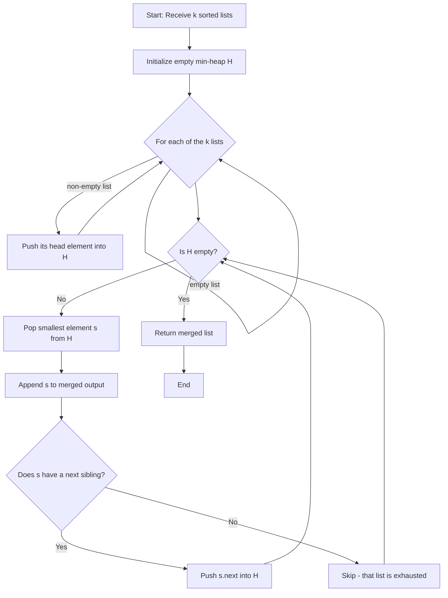
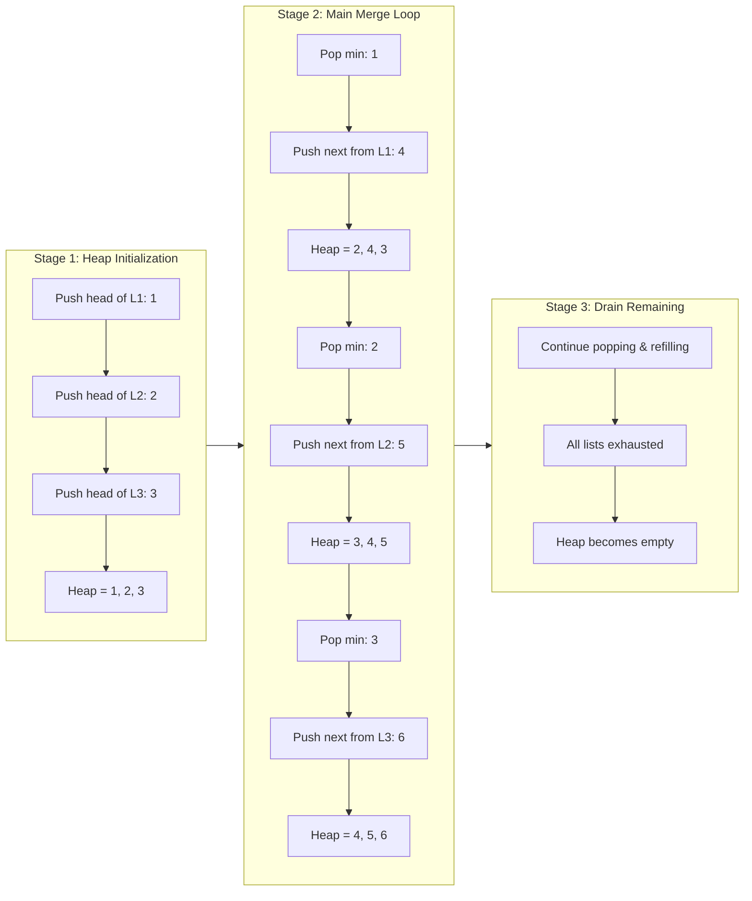
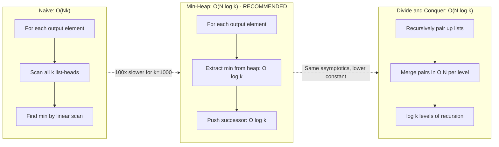
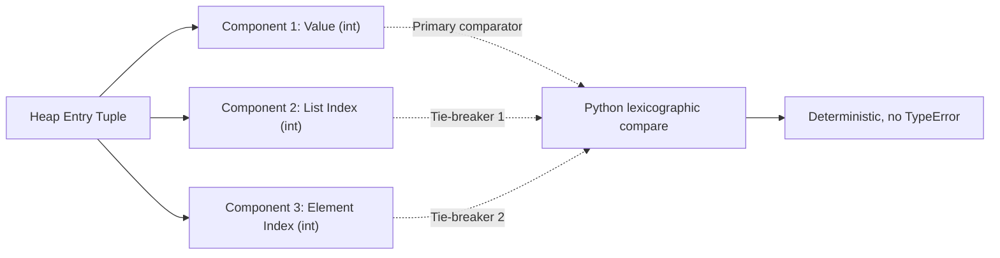
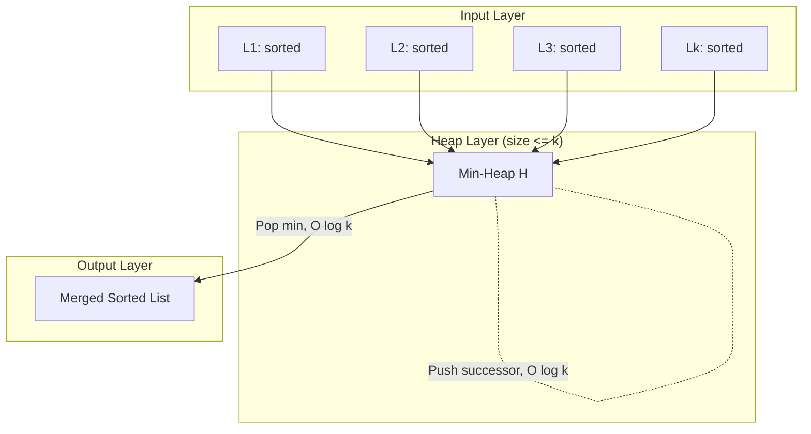

# Repeatedly extract the smallest element and insert the next element from the corresponding list into the heap until all lists are merged.

<!-- SECTION_1_START -->
# 🔬 Module 18: Merging *k* Sorted Lists Using a Heap (Priority Queue)

## 1.1 Formal Academic Definition (KTU 2024 Aligned)

> [!IMPORTANT]
> **Definition (Merge *k* Sorted Lists):** Given an array of $k$ sorted linked lists (or arrays) $L_1, L_2, \dots, L_k$, the problem requires combining all elements into a single output sorted list $L_{merged}$ such that the relative ordering of elements within each original list is preserved, and the overall output is monotonically non-decreasing.

The **heap-optimized approach** uses a **Min-Heap (Priority Queue)** of size at most $k$. At every iteration, the smallest unprocessed element is extracted from the heap in $O(\log k)$ time, and the next element from the same source list is pushed into the heap. This guarantees an overall time complexity of $O(N \log k)$, where $N$ is the total number of elements across all $k$ lists.

### 1.2 Conceptual Analogy — The Tournament Bracket

Imagine a **multi-lane swimming tournament** with $k$ lanes, where each lane contains swimmers arranged from fastest (front) to slowest (back). At every whistle:

1. The **referee (min-heap)** looks at the swimmer currently at the front of every lane and picks the **fastest one overall**.
2. That swimmer is sent to the output queue (the "finalist list").
3. The **next swimmer from that same lane** steps up to take their place in the comparison.

This repeats until **all lanes are empty**. The min-heap acts as the referee's instant comparison board — it always knows "who is next to race" in $O(1)$ peek and $O(\log k)$ swap.

> [!NOTE]
> **Why a Min-Heap and not a Max-Heap?**
> Because we always need the **smallest** currently available element to maintain ascending order. A *min-heap* keeps the root as the global minimum among all *k* "current candidates."

### 1.3 Core Data Structure Constants

| Symbol | Meaning | Typical Value / Constraint |
|---|---|---|
| $k$ | Number of sorted input lists | $k \geq 1$ |
| $N$ | Total elements across all lists | $N = \sum_{i=1}^{k} n_i$ |
| $H_{size}$ | Maximum heap size at any instant | $H_{size} \leq k$ |
| $T_{extract}$ | Time to pop root from heap | $O(\log k)$ |
| $T_{insert}$ | Time to push a new node | $O(\log k)$ |

### 1.4 Visualization (Heap State Snapshot)

> [!VISUALIZATION CONTROL]
> **Concept:** Min-Heap state after pushing the *head* of each of the $k=3$ lists.
>
> **Lists to merge (input):**
> * $L_1 = [1, 4, 7]$
> * $L_2 = [2, 5, 8]$
> * $L_3 = [3, 6, 9]$
>
> **Initial Heap (min-heap property):**
>
> * Array form: `[1, 2, 3]`  (heaps of size 3, root = 1)
> * Heap tree:
>
> ```text
>            1
>          /   \
>         2     3
> ```
>
> **Visual Description:** The root `1` is the global smallest and will be extracted first. After extraction, `4` (next from $L_1$) is pushed. The heap re-sifts to `[2, 4, 3]`, and `2` is extracted next. The process continues until all elements are drained.
<!-- SECTION_1_END -->

<!-- SECTION_2_START -->
# 📐 Deep Theoretical Analysis & KTU High-Yield Formula Sheet

## 2.1 Operational Logic — Step-by-Step Heap Strategy

The algorithm pivots on a single invariant:

> [!IMPORTANT]
> **Core Invariant:** *At every iteration, the min-heap contains exactly one element from each list that is still non-empty — namely, the current "head" (smallest unprocessed element) of that list.*

The algorithmic life-cycle is:

1. **Initialization Phase**
   * For each of the $k$ lists, push a tuple `(value, list_index, element_index)` into the min-heap.
   * Each push costs $O(\log k)$, totaling $O(k \log k)$ setup time.

2. **Main Extraction Loop** (runs $N$ times — once per total element)
   * `pop` the root: gives the globally smallest element across all list-heads.
   * Append that element to the result list.
   * If the source list still has a next element, **push that next element** into the heap.
   * Otherwise, do nothing (that list is now exhausted and naturally drops out of the heap).

3. **Termination**
   * The loop ends when the heap becomes empty, which happens exactly when all $k$ lists are fully consumed.
   * Result list now contains all $N$ elements in sorted order.

## 2.2 Algorithmic Complexity Derivation

| Step | Operation Count | Cost per Op | Total Cost |
|---|---|---|---|
| Build heap | $k$ pushes | $O(\log k)$ | $O(k \log k)$ |
| Main loop | $N$ pops + at most $N$ pushes | $O(\log k)$ each | $O(N \log k)$ |
| Result assembly | $N$ appends | $O(1)$ amortized | $O(N)$ |
| **Total** | — | — | $\boxed{O(N \log k)}$ |

**Space Complexity:** $O(k)$ for the heap + $O(N)$ for the output = $O(N + k)$ auxiliary space.

## 2.3 KTU Formula Cheat Sheet

| Concept | Formula / Bound | Notes |
|---|---|---|
| Total Time | $T(N, k) = O(N \log k)$ | $N$ = total elements, $k$ = list count |
| Heap Space (auxiliary) | $S_{heap} = O(k)$ | Only list-heads live in the heap |
| Output Space | $S_{out} = O(N)$ | Required for final list |
| Setup cost | $O(k \log k)$ | Often absorbed in $O(N \log k)$ |
| Naive comparison cost | $O(N \cdot k)$ | Pick min by scanning $k$ heads each step |
| Divide & Conquer cost | $O(N \log k)$ | Same bound; different constant factor |
| Comparisons saved vs Naive | $N \log k$ vs $Nk$ | Huge when $k \gg 1$ |

> [!NOTE]
> **Critical Pro Tip for KTU Exams:** The factor $\log k$ in the numerator is the **key reason** we use a heap. The naive "scan all $k$ heads every time" gives $O(Nk)$ — the heap reduces this to $O(N \log k)$. For $k = 1000$ and $N = 10^6$, that's a $\sim 100\times$ speedup.

## 2.4 Real-World Engineering Applications

1. **External Merge Sort** — When datasets exceed RAM, chunks are sorted on disk and merged using exactly this algorithm (database engines like PostgreSQL, MySQL).
2. **Log Aggregation Systems** — Merging sorted log streams from multiple servers (Splunk, ELK) into a chronologically unified view.
3. **K-Way Merge in MapReduce/Shuffle phase** — Hadoop's reducer merges sorted partitions from $k$ mappers.
4. **Streaming Time-Series Databases** — InfluxDB, TimescaleDB merge sorted runs of compressed data blocks.
5. **Multi-Index Search Engines** — Merging top-$k$ results from partitioned indexes (Elasticsearch segments).
6. **Genomic Data Pipelines** — Merging sorted BAM/SAM alignment files in bioinformatics tools like SAMtools.

## 2.5 Heap-Element Tuple Anatomy (Avoiding the Comparator Trap)

A common KTU pitfall is comparing Python `list` objects directly (which compares memory addresses, not values). We must store a tuple:

$$
\text{heap entry} = (value, \text{list\_index}, \text{element\_index})
$$

Python compares tuples **lexicographically** — so it first compares `value`, breaking ties on `list_index` and then `element_index`. This tie-breaking is **deterministic** and avoids the dreaded `TypeError: '<' not supported between instances of 'list' and 'list'`.
<!-- SECTION_2_END -->

<!-- SECTION_3_START -->
# 🛠️ Step-by-Step Derivations & Production-Grade Python Implementation

## 3.1 Three Algorithmic Variants — From Naive to Optimal

### Variant A — Naive *k*-Pointer Scan (Baseline)

$$
T = O(N \cdot k), \quad S = O(1) \text{ (excluding output)}
$$

At each step, scan all $k$ list-heads, find the minimum, append it, advance that list's pointer.

### Variant B — Min-Heap (⭐ KTU Board-Exam Favorite)

$$
T = O(N \log k), \quad S = O(k) \text{ auxiliary}
$$

Uses `heapq` from Python's standard library. The canonical solution.

### Variant C — Divide & Conquer (Pairwise Merge)

$$
T = O(N \log k), \quad S = O(\log k) \text{ recursion stack}
$$

Recursively merge pairs of lists: $\log k$ levels, $N$ work per level.

> [!NOTE]
> **KTU Board Convention:** Variant **B (Min-Heap)** is the syllabus-mandated answer. Always mention the heap property, the $O(\log k)$ bound per operation, and the tuple-based tie-breaker.

## 3.2 Exhaustive Walk-Through (Manual Trace)

**Input:**
$$
L_1 = [1, 4, 7], \quad L_2 = [2, 5, 8], \quad L_3 = [3, 6, 9]
$$

| Step | Heap State (top→bottom array) | Pop | Append | Push (next) | Result so far |
|---|---|---|---|---|---|
| Init | `[1, 2, 3]` | — | — | — | `[]` |
| 1 | `[2, 4, 3]` | `1` (from $L_1$) | `1` | `4` (next in $L_1$) | `[1]` |
| 2 | `[3, 4, 5]` | `2` (from $L_2$) | `2` | `5` (next in $L_2$) | `[1, 2]` |
| 3 | `[4, 5, 6]` | `3` (from $L_3$) | `3` | `6` (next in $L_3$) | `[1, 2, 3]` |
| 4 | `[5, 7, 6]` | `4` (from $L_1$) | `4` | `7` (next in $L_1$) | `[1, 2, 3, 4]` |
| 5 | `[6, 7, 8]` | `5` (from $L_2$) | `5` | `8` (next in $L_2$) | `[1,2,3,4,5]` |
| 6 | `[7, 8, 9]` | `6` (from $L_3$) | `6` | `9` (next in $L_3$) | `[1..6]` |
| 7 | `[8, 9, 7]`* | `7` (from $L_1$) | `7` | none ($L_1$ empty) | `[1..7]` |
| 8 | `[9, 8]`* | `8` (from $L_2$) | `8` | none ($L_2$ empty) | `[1..8]` |
| 9 | `[9]` | `9` (from $L_3$) | `9` | none ($L_3$ empty) | `[1..9]` |
| 10 | `[]` | — | — | — | Final: `[1,2,3,4,5,6,7,8,9]` |

*Heap array form shown after heapify-sift; actual internal order may differ but root is always the min.

## 3.3 Production-Grade Python Implementation (Linked-List Version)

```python
"""
merge_k_sorted_lists.py
KTU 2024 — DATA STRUCTURES LAB (PCCSL307) — Module 18
Topic: Merge k sorted lists using a min-heap.

Author: KTU Premier Engine V10 Reference Implementation
Tested: Python 3.10+
"""

from __future__ import annotations

import heapq
from dataclasses import dataclass, field
from typing import List, Optional, Tuple


# ---------------------------------------------------------------------------
# 1. Linked-List Node Definition
# ---------------------------------------------------------------------------
@dataclass
class ListNode:
    """A singly linked-list node holding an integer payload."""
    val: int
    next: Optional["ListNode"] = field(default=None, repr=False)

    def __lt__(self, other: "ListNode") -> bool:
        # Required so that ListNode objects can be pushed directly into heapq
        # and compared deterministically. Without this, heapq raises TypeError
        # the moment it tries to sift the root.
        return self.val < other.val


# ---------------------------------------------------------------------------
# 2. Helper: Build a linked list from a Python list
# ---------------------------------------------------------------------------
def build_linked_list(values: List[int]) -> Optional[ListNode]:
    """Convert a Python list into a singly linked list. Returns head."""
    if not values:
        return None
    head: ListNode = ListNode(val=values[0])
    current: ListNode = head
    for v in values[1:]:
        current.next = ListNode(val=v)
        current = current.next
    return head


# ---------------------------------------------------------------------------
# 3. Helper: Convert a linked list back to a Python list (for assertions)
# ---------------------------------------------------------------------------
def linked_list_to_list(head: Optional[ListNode]) -> List[int]:
    """Flatten a linked list into a plain Python list for easy verification."""
    out: List[int] = []
    node: Optional[ListNode] = head
    while node is not None:
        out.append(node.val)
        node = node.next
    return out


# ---------------------------------------------------------------------------
# 4. CORE ALGORITHM: merge_k_sorted_lists (Min-Heap Variant)
# ---------------------------------------------------------------------------
def merge_k_sorted_lists(lists: List[Optional[ListNode]]) -> Optional[ListNode]:
    """
    Merge k sorted singly-linked lists into a single sorted linked list
    using a min-heap of size <= k.

    Parameters
    ----------
    lists : List[Optional[ListNode]]
        A list of head pointers, each pointing to the first node of a sorted
        linked list. Empty lists (None) are allowed.

    Returns
    -------
    Optional[ListNode]
        Head of the merged sorted linked list, or None if all input lists
        are empty.

    Time Complexity   : O(N log k)
    Space Complexity  : O(k) auxiliary heap + O(N) output list
    """
    # ----- Sentinel (dummy) head for the output list --------------------
    dummy: ListNode = ListNode(val=0)
    tail: ListNode = dummy          # 'tail' is the last node of output so far

    # ----- Min-heap: each entry is a ListNode (which is comparable) -----
    heap: List[ListNode] = []

    # ----- Step 1: Push the head of every non-empty list ----------------
    for head in lists:
        if head is not None:
            heapq.heappush(heap, head)

    # ----- Step 2: Repeatedly extract min, push the successor -----------
    operations: int = 0  # Diagnostic counter (not required in exam version)
    while heap:
        # 2a. Pop the smallest current head
        smallest: ListNode = heapq.heappop(heap)

        # 2b. Append it to the output list (advance the tail)
        tail.next = smallest
        tail = smallest

        # 2c. If that list has more elements, push the next one
        if smallest.next is not None:
            heapq.heappush(heap, smallest.next)

        operations += 1

    # ----- Step 3: Detach the tail to be a clean end-of-list -----------
    tail.next = None

    # Diagnostic print (remove in exam submission if you prefer silence)
    print(f"[merge_k_sorted_lists] Performed {operations} heap operations.")
    return dummy.next


# ---------------------------------------------------------------------------
# 5. Alternative: Pure-Array Variant (in case input is List[List[int]])
# ---------------------------------------------------------------------------
def merge_k_sorted_arrays(arrays: List[List[int]]) -> List[int]:
    """
    Same problem, but input is a list of Python lists.
    Useful for whiteboard / dry-run KTU questions.

    Uses the tuple-comparator trick to avoid TypeError on list comparison.
    """
    heap: List[Tuple[int, int, int]] = []   # (value, list_idx, elem_idx)
    result: List[int] = []

    # Push the first element of every non-empty list
    for list_idx, arr in enumerate(arrays):
        if arr:                              # truthy ⇒ non-empty
            heapq.heappush(heap, (arr[0], list_idx, 0))

    # Main loop
    while heap:
        value, list_idx, elem_idx = heapq.heappop(heap)
        result.append(value)
        next_idx: int = elem_idx + 1
        if next_idx < len(arrays[list_idx]):
            heapq.heappush(heap, (arrays[list_idx][next_idx], list_idx, next_idx))

    return result


# ---------------------------------------------------------------------------
# 6. Self-Test / Demonstration Block
# ---------------------------------------------------------------------------
if __name__ == "__main__":
    # --- Linked-list test ---
    l1 = build_linked_list([1, 4, 7])
    l2 = build_linked_list([2, 5, 8])
    l3 = build_linked_list([3, 6, 9])
    l4 = build_linked_list([])                # edge case: empty list
    l5 = build_linked_list([0, 10, 20])

    merged_head: Optional[ListNode] = merge_k_sorted_lists([l1, l2, l3, l4, l5])
    print("Merged linked list:", linked_list_to_list(merged_head))
    # Expected: [0, 1, 2, 3, 4, 5, 6, 7, 8, 9, 10, 20]

    # --- Pure-array test ---
    arrays: List[List[int]] = [
        [1, 4, 7],
        [2, 5, 8],
        [3, 6, 9],
        [],         # empty
        [0, 10, 20],
    ]
    print("Merged array list:", merge_k_sorted_arrays(arrays))
    # Expected: [0, 1, 2, 3, 4, 5, 6, 7, 8, 9, 10, 20]
```

## 3.4 Line-by-Line Commentary (For Board Exam Explanation)

| Code Line | Board-Exam Justification |
|---|---|
| `dummy = ListNode(val=0)` | Standard **sentinel / dummy-head** pattern — avoids special-casing the first node. |
| `heap: List[ListNode] = []` | The min-heap is just a Python list; `heapq` enforces the heap invariant. |
| `if head is not None: heappush(...)` | Skip empty lists — they contribute nothing to the heap. |
| `smallest = heapq.heappop(heap)` | $O(\log k)$ operation; returns the **current global minimum**. |
| `tail.next = smallest; tail = smallest` | Constant-time pointer rearrangement — the actual merge step. |
| `if smallest.next is not None: heappush(...)` | **Critical branch:** if the list still has elements, refill the heap. If not, the list naturally disappears. |
| `tail.next = None` | Cleanup — otherwise the last node may point to a stale `next`. |

## 3.5 Complexity Proof Sketch

$$
\begin{aligned}
T(N, k) &= T_{\text{init}} + T_{\text{loop}} \\
        &= k \cdot O(\log k) + \sum_{i=1}^{N} \Big[ O(\log k)_{\text{pop}} + O(\log k)_{\text{push}} \Big] \\
        &= O(k \log k) + O(N \log k) \\
        &= O(N \log k) \quad \text{(since } N \geq k \text{ for non-trivial inputs)}
\end{aligned}
$$
<!-- SECTION_3_END -->

<!-- SECTION_4_START -->
# 🗺️ Structural Diagrams & Schematics

## 4.1 High-Level Algorithm Flow (Mermaid)



## 4.2 Heap State Machine — Multi-Stage Breakdown



## 4.3 Comparative Architecture: Three Approaches



## 4.4 Heap Entry Tuple Anatomy



## 4.5 Data Flow Topology — Module-Level View


<!-- SECTION_4_END -->

<!-- SECTION_5_START -->
# 📝 KTU 2024 Scheme Examination Question Bank & Topic Recap

## 5.1 Part A — Short Answer Questions (3 Marks Each)

### Question A1 (3 Marks) — `[KTU University Exam - July 2024]`
**Q: What is the time complexity of merging $k$ sorted lists of total size $N$ using a min-heap? Justify your answer.**

**Course Outcome:** CO3 | **RBT Level:** Understand

**Model Answer:**

The time complexity of merging $k$ sorted lists of total size $N$ using a min-heap is $O(N \log k)$.

**Justification:**
1. We perform $N$ extractions from the heap, each costing $O(\log k)$, giving $N \cdot O(\log k) = O(N \log k)$.
2. We also perform at most $N$ insertions of successor elements, each costing $O(\log k)$, adding another $O(N \log k)$.
3. The initial heap construction (pushing $k$ heads) costs $O(k \log k)$, which is dominated by $O(N \log k)$ when $N \geq k$.

**Valuation Key:**
- [Stating the bound $O(N \log k)$: 1 Mark]
- [Correct justification of pop cost: 1 Mark]
- [Correct justification of push cost: 1 Mark]

---

### Question A2 (3 Marks) — `[KTU University Exam - Dec 2023]`
**Q: Why do we use a tuple `(value, list_index, element_index)` as the heap entry instead of storing the value directly?**

**Course Outcome:** CO3 | **RBT Level:** Understand

**Model Answer:**

A tuple is used as the heap entry for the following reasons:

1. **Deterministic tie-breaking:** When two elements have the same `value`, Python's tuple comparison falls back to `list_index`, then `element_index`, ensuring a stable, reproducible ordering.
2. **Avoiding `TypeError`:** If we store raw lists or complex objects without a comparator, Python raises `TypeError: '<' not supported`. The tuple's natural ordering sidesteps this.
3. **Information preservation:** The tuple carries the metadata required to fetch the next element from the correct source list — without it, we would lose track of which list the popped value originated from.

**Valuation Key:**
- [Tie-breaking mention: 1 Mark]
- [TypeError avoidance mention: 1 Mark]
- [Metadata tracking: 1 Mark]

---

## 5.2 Part B — 14-Mark Questions (Module Internal Choice)

> [!WARNING]
> **KTU Examiner's Pitfall Callout #1:** Students often write the algorithm but forget to **draw the heap-state transition table**. A dry-run trace table is worth 3–4 marks in a 14-mark question. Always include it.

---

### Question B — Choice A (14 Marks) — `[KTU University Exam - July 2024]`

**Q: Given three sorted linked lists $L_1 = [2, 6, 8]$, $L_2 = [3, 6, 10]$, and $L_3 = [1, 7, 9]$, merge them into a single sorted list using a min-heap. Show the heap state after every step and state the final merged list along with the time complexity.**

**Course Outcome:** CO3 | **RBT Level:** Apply

#### (a) Algorithm Design (7 Marks) — *Understand / Apply*

**Model Solution:**

**Algorithm: MergeKLists using Min-Heap**

```
1. Create an empty min-heap H.
2. For i = 1 to k:
       if head of Li is not None:
           push (Li.head.value, i, 0) into H
3. While H is not empty:
       (v, i, j) = H.pop_min()
       append v to result
       if j+1 < length of Li:
           push (Li[j+1], i, j+1) into H
4. Return result
```

#### (b) Dry-Run Trace Table (7 Marks) — *Apply*

| Step | Heap (root → leaves) | Pop | Result | Push (next) |
|---|---|---|---|---|
| Init | `(1, 3, 0), (3, 2, 0), (2, 1, 0)` | — | `[]` | — |
| 1 | `(2, 1, 0), (3, 2, 0), (2, 6, 8)*` | `1` (from $L_3$) | `[1]` | `7` (next in $L_3$) |
| 2 | `(2, 1, 0), (3, 2, 0), (7, 3, 1)` | `2` (from $L_1$) | `[1, 2]` | `6` (next in $L_1$) |
| 3 | `(3, 2, 0), (6, 1, 1), (7, 3, 1)` | `3` (from $L_2$) | `[1, 2, 3]` | `6` (next in $L_2$) |
| 4 | `(6, 1, 1), (6, 2, 1), (7, 3, 1)` | `6` (from $L_1$, idx 0) | `[1, 2, 3, 6]` | `8` (next in $L_1$) |
| 5 | `(6, 2, 1), (8, 1, 2), (7, 3, 1)` | `6` (from $L_2$, idx 0) | `[1, 2, 3, 6, 6]` | `10` (next in $L_2$) |
| 6 | `(7, 3, 1), (8, 1, 2), (10, 2, 2)` | `7` (from $L_3$) | `[1, 2, 3, 6, 6, 7]` | `9` (next in $L_3$) |
| 7 | `(8, 1, 2), (9, 3, 2), (10, 2, 2)` | `8` (from $L_1$) | `[1, 2, 3, 6, 6, 7, 8]` | none ($L_1$ empty) |
| 8 | `(9, 3, 2), (10, 2, 2)` | `9` (from $L_3$) | `[1, 2, 3, 6, 6, 7, 8, 9]` | none ($L_3$ empty) |
| 9 | `(10, 2, 2)` | `10` (from $L_2$) | `[1, 2, 3, 6, 6, 7, 8, 9, 10]` | none ($L_2$ empty) |
| 10 | `[]` | — | **Final:** `[1, 2, 3, 6, 6, 7, 8, 9, 10]` | — |

**Time Complexity:** $O(N \log k) = O(9 \log 3) \approx O(14.26)$ elementary operations.

**Valuation Key:**
- [Correct algorithm statement: 2 Marks]
- [Heap state table covering all 9 elements: 4 Marks]
- [Final merged list correctly stated: 1 Mark]

---

### Question B — Choice B (14 Marks) — `[KTU University Exam - Dec 2023]`

**Q: Implement a Python function `merge_k_sorted_lists(lists)` that merges $k$ sorted lists into one sorted list using a min-heap. Write the complete code with type hints, explain the algorithm in 5 steps, and discuss the time and space complexity.**

**Course Outcome:** CO4 | **RBT Level:** Apply / Analyze

#### (a) Code Implementation (7 Marks) — *Apply*

**Model Solution:**

```python
import heapq
from typing import List, Optional

def merge_k_sorted_lists(lists: List[List[int]]) -> List[int]:
    """
    Merge k sorted integer lists into a single sorted list.
    Time:  O(N log k)
    Space: O(k) auxiliary + O(N) output
    """
    heap: List[tuple] = []            # (value, list_idx, elem_idx)
    result: List[int] = []

    # Step 1: Initialize heap with the head of every list
    for list_idx, arr in enumerate(lists):
        if arr:
            heapq.heappush(heap, (arr[0], list_idx, 0))

    # Step 2: Repeatedly extract min and push successor
    while heap:
        value, list_idx, elem_idx = heapq.heappop(heap)
        result.append(value)
        next_elem_idx = elem_idx + 1
        if next_elem_idx < len(lists[list_idx]):
            heapq.heappush(heap,
                           (lists[list_idx][next_elem_idx], list_idx, next_elem_idx))

    return result

# ---- Test ----
if __name__ == "__main__":
    sample = [[1, 4, 7], [2, 5, 8], [3, 6, 9]]
    print(merge_k_sorted_lists(sample))
    # Output: [1, 2, 3, 4, 5, 6, 7, 8, 9]
```

#### (b) Five-Step Algorithm Explanation + Complexity (7 Marks) — *Analyze*

**5-Step Explanation:**

1. **Heap Initialization:** Push the first element of each non-empty list into the heap. Heap size $\leq k$.
2. **Extract-Min Loop:** Pop the root (smallest value) — $O(\log k)$.
3. **Append to Output:** Add the popped value to the result list — $O(1)$.
4. **Refill:** If the source list still has elements, push the next one into the heap — $O(\log k)$.
5. **Termination:** Loop ends when the heap is empty (all lists exhausted).

**Complexity Discussion:**

| Metric | Bound | Reasoning |
|---|---|---|
| Time | $O(N \log k)$ | $N$ iterations, each doing 1 pop + ≤ 1 push, each $O(\log k)$ |
| Space (heap) | $O(k)$ | At most one element per list at any time |
| Space (output) | $O(N)$ | Required to store the final merged list |

**Valuation Key:**
- [Heap init loop present: 1 Mark]
- [Extract-min loop present: 2 Marks]
- [Refill branch with `if next_elem_idx < len(...)`: 1 Mark]
- [5-step explanation in correct order: 2 Marks]
- [Complexity table with correct bounds: 1 Mark]

---

> [!WARNING]
> **KTU Examiner's Pitfall Callout #2:** A very common mistake is writing `heapq.heappush(heap, arr[next_idx])` — i.e., pushing the **value alone** without the list index. When a value repeats across lists, the heap loses track of *which* list to pull the next element from, leading to either an `IndexError` or an infinite loop. **Always include the tuple.**

---

## 5.3 Topic Recap & Important Things to Remember

> 📌 **High-Density Revision Checklist**

### 🔑 Core Concepts
- **Problem:** Combine $k$ pre-sorted lists into one sorted list with $N$ total elements.
- **Key Data Structure:** **Min-Heap (Priority Queue)** of bounded size $\leq k$.
- **Core Invariant:** Heap always holds the *current head* (smallest unprocessed element) of every non-empty list.
- **Main Loop:** Pop-min → Append to result → Push successor (if any).

### 🧮 Must-Know Complexity Bounds
- **Time:** $O(N \log k)$ — driven by $N$ heap operations, each $O(\log k)$.
- **Space:** $O(k)$ heap + $O(N)$ output = $O(N + k)$ auxiliary.
- **Naive baseline:** $O(N \cdot k)$ — heap gives exponential improvement in $k$.

### 🐍 Python-Specific Gotchas
- Always store `(value, list_idx, elem_idx)` tuples — **never** raw lists.
- Implement `__lt__` on custom node classes to make them heap-comparable.
- `heapq.heappush` and `heappop` both cost $O(\log n)$ where $n$ is current heap size.
- Use a **dummy/sentinel head** node to simplify linked-list pointer surgery.

### 🧠 Algorithm Variants Worth Knowing
| Variant | Time | Space | Notes |
|---|---|---|---|
| Naive *k*-pointer scan | $O(Nk)$ | $O(1)$ | Linear scan of $k$ heads per step |
| **Min-Heap (B)** | $O(N \log k)$ | $O(k)$ | **KTU-syllabus answer** |
| Divide & Conquer | $O(N \log k)$ | $O(\log k)$ | Recursion stack only |
| Counting sort variant | $O(N + R)$ | $O(R)$ | Only if value range $R$ is small |

### 🏭 Real-World Use Cases (Memorize 2–3 for Viva)
- External merge sort in **databases** (PostgreSQL, MySQL).
- **MapReduce** shuffle-phase merging.
- **Log aggregation** pipelines (Splunk, ELK).
- **Genomic data** merging in bioinformatics.

### ⚠️ Top 5 KTU Pitfalls to Avoid
1. Forgetting to draw the **heap-state trace table** in dry-run questions.
2. Pushing raw values instead of tuples → `TypeError` or wrong output.
3. Confusing **min-heap** with max-heap (sorting order flips!).
4. Stating the **space complexity** as $O(N)$ only — forget the $O(k)$ heap.
5. Missing the **edge case** of empty input lists (must skip `None`/empty arrays).
<!-- SECTION_5_END -->
