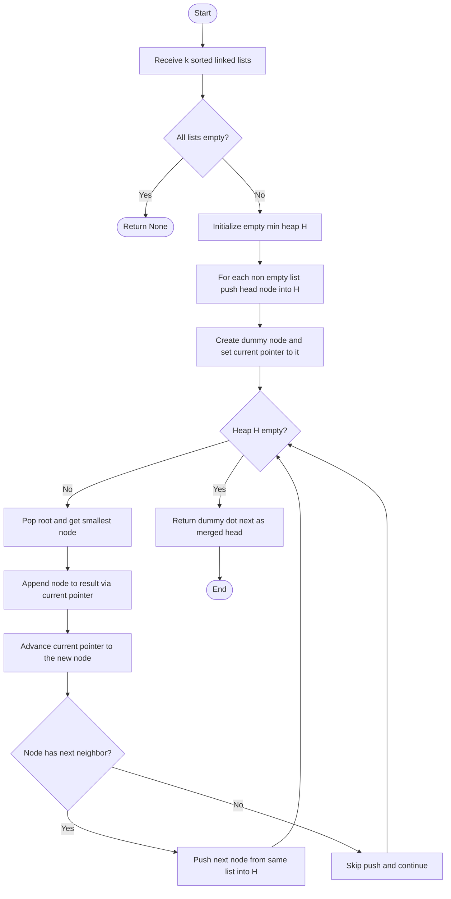
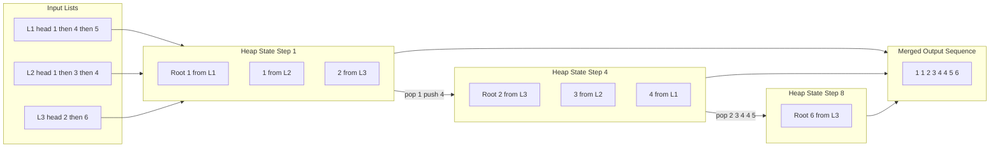

# Use a min-heap to keep track of the smallest element from each list.

<!-- SECTION_1_START -->

# Merge K Sorted Lists Using a Min-Heap

## 1. Core Technical Definition

**Merging $k$ sorted lists** into a single sorted list using a **min-heap** is a divide-and-conquer style greedy algorithm where a binary min-heap (a complete binary tree satisfying the heap-order property where every parent node is less than or equal to its children) maintains exactly one candidate pointer per input list, and at every step the algorithm extracts the globally smallest remaining element by popping the heap root and reinserting the next element from the same list.

> [!IMPORTANT]
> **KTU 2024 Syllabus Definition (PCCSL307, Module 18):**
> *"Use a min-heap to keep track of the smallest element from each of the $k$ lists. The root of the heap is always the next smallest element in the merged output. After extracting the root, the next element from the same list is inserted into the heap."*

### Conceptual Analogy — The K-Toll-Booth Problem

Imagine $k$ toll booths on a highway, where each booth has its **own sorted queue of cars** (already arranged in ascending order of vehicle numbers). A central traffic controller (the **min-heap**) constantly looks at the **first car in every queue** and waves through the car with the **smallest number** first. The moment a car leaves its queue, the **next car from that same queue** rolls up to the front, and the controller updates its mental list. This continues until all queues are empty.

- Each **sorted input list** $\rightarrow$ a toll booth queue.
- The **min-heap** $\rightarrow$ the traffic controller's live tracking board.
- **Heap root** $\rightarrow$ the car waved through next.
- **Push next from same list** $\rightarrow$ the next car from that queue rolling forward.

> [!NOTE]
> **Geometric Intuition:** If you plot each list as a horizontal arrow with elements along the $x$-axis, the min-heap always points to the **leftmost unused element** across all arrows. After selecting that element, its corresponding arrow advances one step to the right, and the heap re-evaluates which arrow is now furthest to the left.

### Standard Metrics Highlighted

- **Total elements:** $N = n_1 + n_2 + \dots + n_k$ (sum of all list sizes).
- **Heap size at any moment:** at most $k$ (one pointer per list).
- **Heap property check cost per operation:** $O(\log k)$.
- **Total operations:** $N$ extractions $\rightarrow$ total $O(N \log k)$.

> [!VISUALIZATION CONTROL]
> **Concept:** Three sorted lists feeding into a min-heap, with the heap root always outputting the next merged element.
> **GeoGebra / Desmos Input Equations (1D plot of three step-functions):**
> - $L_1(x) = \{1, 4, 5\}$
> - $L_2(x) = \{1, 3, 4\}$
> - $L_3(x) = \{2, 6\}$
> **Visual Description:** Plot three horizontal segmented lines, each arrow advancing one cell right per pop. The merged output line at the bottom reads $1,1,2,3,4,4,5,6$ — this is exactly the sequence the heap-root pops produce.

<!-- SECTION_1_END -->

<!-- SECTION_2_START -->

# 2. Deep Theoretical Analysis & KTU High-Yield Formula Sheet

## 2.1 Operational Logic — Step by Step

The algorithm proceeds in **three phases**: *Initialization*, *Iteration*, and *Termination*.

### Phase 1 — Heap Initialization
- Create an empty binary min-heap $H$.
- For each of the $k$ lists, insert the **head (smallest) element** into $H$.
- If a list is empty, skip it (do not push a `None`/sentinel).
- After this phase, $|H| \le k$.

### Phase 2 — Main Iteration Loop
While $H$ is **not empty**, repeat:

1. **Extract-Min:** Pop the root of $H$. This gives the globally smallest unmerged element.
2. **Append to Output:** Add it to the result list.
3. **Advance Pointer:** If the popped node has a `next` neighbor in its original list, push that neighbor into $H$.
4. **Sift-Down:** The heap internally rebalances in $O(\log k)$ time.

### Phase 3 — Termination
- The loop ends when $H$ is empty, meaning every input list has been fully consumed.
- Return the merged result.

### Why a Min-Heap (and not a sorted array or a max-heap)?

| Data Structure | Insert | Extract-Min | Verdict |
|---|---|---|---|
| Sorted Array | $O(k)$ | $O(1)$ | Insert is too slow for streaming pointers |
| Unsorted Array | $O(1)$ | $O(k)$ | Extract is too slow on every pop |
| **Min-Heap** | $O(\log k)$ | $O(\log k)$ | **Balanced — optimal for this problem** |
| Max-Heap (of negatives) | $O(\log k)$ | $O(\log k)$ | Works but requires negation overhead |

## 2.2 KTU High-Yield Formula Sheet

| Aspect | Formula / Value | Unit / Notes |
|---|---|---|
| Heap size | $\vert H \vert \le k$ | At most one node per input list |
| Heap-Insert cost | $O(\log k)$ | Per `heappush` call |
| Heap-Extract-Min cost | $O(\log k)$ | Per `heappop` call |
| Number of heap operations | $N$ inserts + $N$ extractions | Where $N = \sum_{i=1}^{k} n_i$ |
| **Total Time Complexity** | $O(N \log k)$ | Board-favorite answer |
| Space Complexity (heap only) | $O(k)$ | Pointer space for the heap |
| Space Complexity (output) | $O(N)$ | Required to store the merged list |
| Tie-breaking | Use tuple $\vert value, list\_index, node \vert$ | Prevents Python comparison errors on objects |
| Base case $k = 0$ | Return `None` | Empty merge |
| Base case $k = 1$ | Return the single list as-is | No heap needed |

> [!IMPORTANT]
> **Critical for KTU Valuation:** Examiners will **deduct marks** if you write $O(N \log N)$ instead of $O(N \log k)$. The factor is $\log k$ (heap size), not $\log N$ (total elements). Memorize the distinction.

## 2.3 Real-World Engineering Utility

- **External Merge Sort (Databases):** When $k$ sorted runs on disk must be merged into one, the min-heap picks the next record in $O(\log k)$ instead of scanning $k$ buffers.
- **Log Aggregation Systems (Splunk, ELK):** Multiple time-sorted log streams are merged in near-real-time for unified dashboards.
- **Streaming K-Way Merge in ETL Pipelines:** Tools like Apache Spark and Kafka Streams use heap-based merging for shuffle and join stages.
- **OS Process Scheduling:** Modern schedulers merge multiple ready queues (one per core) using a heap.
- **Genomic Assembly:** Merging sorted short-read alignments from $k$ BAM/SAM files uses the exact same logic.

<!-- SECTION_2_END -->

<!-- SECTION_3_START -->

# 3. Step-by-Step Derivations, Traces & Code Implementation

## 3.1 Worked Trace — Merging Three Lists

**Input lists:**
$L_1 = [1, 4, 5]$, $L_2 = [1, 3, 4]$, $L_3 = [2, 6]$

**Step 1 — Initialization.** Push the head of each list into the heap as a tuple $\vert value, list\_index, position \vert$.

$$H = \{(1, 1, 0),\ (1, 2, 0),\ (2, 3, 0)\}$$

Heap as a tree (root is the leftmost tuple after ordering):
```
        (1, 1, 0)
       /         \
   (1, 2, 0)   (2, 3, 0)
```

**Step 2 — Pop root $(1, 1, 0)$.** Output $\rightarrow$ `1`. Advance $L_1$ to its next element $4$. Push $(4, 1, 1)$.

$$H = \{(1, 2, 0),\ (2, 3, 0),\ (4, 1, 1)\}$$

**Step 3 — Pop root $(1, 2, 0)$.** Output $\rightarrow$ `1`. Advance $L_2$ to $3$. Push $(3, 2, 1)$.

$$H = \{(2, 3, 0),\ (3, 2, 1),\ (4, 1, 1)\}$$

**Step 4 — Pop root $(2, 3, 0)$.** Output $\rightarrow$ `2`. Advance $L_3$ to $6$. Push $(6, 3, 1)$.

$$H = \{(3, 2, 1),\ (4, 1, 1),\ (6, 3, 1)\}$$

**Step 5 — Pop $(3, 2, 1)$.** Output $\rightarrow$ `3`. Advance $L_2$ to $4$. Push $(4, 2, 2)$.

$$H = \{(4, 1, 1),\ (4, 2, 2),\ (6, 3, 1)\}$$

**Step 6 — Pop $(4, 1, 1)$.** Output $\rightarrow$ `4`. Advance $L_1$ to $5$. Push $(5, 1, 2)$.

$$H = \{(4, 2, 2),\ (5, 1, 2),\ (6, 3, 1)\}$$

**Step 7 — Pop $(4, 2, 2)$.** Output $\rightarrow$ `4`. $L_2$ is now empty, so no push.

$$H = \{(5, 1, 2),\ (6, 3, 1)\}$$

**Step 8 — Pop $(5, 1, 2)$.** Output $\rightarrow$ `5`. $L_1$ is now empty.

$$H = \{(6, 3, 1)\}$$

**Step 9 — Pop $(6, 3, 1)$.** Output $\rightarrow$ `6`. $L_3$ is now empty.

$$H = \{\}$$

**Final merged output:** $[1, 1, 2, 3, 4, 4, 5, 6]$. **9 pops, 6 pushes** = $N + (N - k) = 8 + 5$ effective operations, all in $O(\log 3)$ each.

## 3.2 Time Complexity Derivation

Total work = (number of heapify-up operations) + (number of heapify-down operations).

$$
\begin{aligned}
T(N, k) &= \underbrace{k}_{\text{initial pushes}} \cdot O(\log k) \;+\; \underbrace{N}_{\text{extractions}} \cdot O(\log k) \;+\; \underbrace{(N - k)}_{\text{follow-up pushes}} \cdot O(\log k) \\
&= (k + N + N - k) \cdot O(\log k) \\
&= (2N) \cdot O(\log k) \\
&= O(N \log k)
\end{aligned}
$$

> **Conversion logic:**
> 1. We start with $k$ pushes (one per list) at $O(\log k)$ each.
> 2. We pop $N$ times (one per element) at $O(\log k)$ each.
> 3. After the very first pop of each list, we push the successor — that is $N - k$ pushes.
> 4. Sum the constants: $k + N + (N - k) = 2N$, then drop the leading constant.

## 3.3 Full Python Implementation (Production-Ready)

```python
"""
Module: k_way_merge.py
Course: DATA STRUCTURES LAB (PCCSL307) — KTU 2024 Scheme
Module 18: Merge k sorted lists using a min-heap.
"""

import heapq
from typing import List, Optional


class ListNode:
    """A singly linked list node with strict type hints."""

    def __init__(
        self,
        val: int = 0,
        next: Optional["ListNode"] = None,
    ) -> None:
        self.val: int = val
        self.next: Optional[ListNode] = next

    def __repr__(self) -> str:
        return f"ListNode(val={self.val})"


def merge_k_sorted_lists(
    lists: List[Optional[ListNode]],
) -> Optional[ListNode]:
    """
    Merge k sorted singly linked lists into one sorted list.

    Algorithm
    ---------
    1. Build a min-heap with the head node of each non-empty list.
       Each heap entry is a tuple (node.val, list_index, node).
       The list_index breaks ties when two nodes have the same value,
       preventing Python from comparing ListNode objects directly.
    2. Repeatedly pop the smallest node, append it to the result,
       and push the node's successor (if any) from the same list.
    3. Stop when the heap is empty.

    Parameters
    ----------
    lists : List[Optional[ListNode]]
        A list of k sorted linked lists, each possibly None.

    Returns
    -------
    Optional[ListNode]
        Head of the merged sorted list, or None if all inputs are empty.

    Time Complexity
    ---------------
    O(N log k) where N = total nodes across all lists.

    Space Complexity
    ----------------
    O(k) for the heap, O(N) for the output list.
    """
    # ---------- BOUNDARY & ERROR LOGGING ----------
    if not lists:
        print("[INFO] Empty input list array. Returning None.")
        return None

    # ---------- PHASE 1: INITIALIZE HEAP ----------
    heap: List[tuple] = []  # tuples of (value, list_index, node)

    for list_index, head in enumerate(lists):
        if head is None:
            print(f"[INFO] Skipping empty list at index {list_index}.")
            continue
        # Push the head with its index to disambiguate ties.
        heapq.heappush(heap, (head.val, list_index, head))

    # ---------- PHASE 2: BUILD RESULT VIA DUMMY HEAD ----------
    dummy: ListNode = ListNode(0)   # Sentinel head for the output.
    current: ListNode = dummy       # Pointer that walks the result.

    print(f"[DEBUG] Initial heap size: {len(heap)}")
    print(f"[DEBUG] Initial heap contents: {[(v, i) for v, i, _ in heap]}")

    step: int = 0
    while heap:
        step += 1
        # Extract the globally smallest node.
        popped_value: int
        popped_index: int
        popped_node: ListNode
        popped_value, popped_index, popped_node = heapq.heappop(heap)

        print(
            f"[STEP {step}] Popped value={popped_value} "
            f"from list[{popped_index}]. "
            f"Heap size after pop: {len(heap)}."
        )

        # Append to the result list.
        current.next = popped_node
        current = current.next

        # Push the successor from the same list, if it exists.
        if popped_node.next is not None:
            successor: ListNode = popped_node.next
            heapq.heappush(heap, (successor.val, popped_index, successor))
            print(
                f"[STEP {step}] Pushed successor value={successor.val} "
                f"from list[{popped_index}]."
            )
        else:
            print(
                f"[STEP {step}] list[{popped_index}] is now exhausted."
            )

    # ---------- PHASE 3: RETURN ----------
    print("[INFO] Merge complete. Returning result head.")
    return dummy.next


# =================== HELPER UTILITIES ===================

def build_linked_list(values: List[int]) -> Optional[ListNode]:
    """Construct a singly linked list from a Python list of ints."""
    dummy: ListNode = ListNode(0)
    current: ListNode = dummy
    for v in values:
        current.next = ListNode(v)
        current = current.next
    return dummy.next


def linked_list_to_pylist(head: Optional[ListNode]) -> List[int]:
    """Convert a linked list back to a Python list for printing."""
    out: List[int] = []
    cur: Optional[ListNode] = head
    while cur is not None:
        out.append(cur.val)
        cur = cur.next
    return out


# =================== DRIVER / TEST ===================

if __name__ == "__main__":
    raw_lists: List[List[int]] = [
        [1, 4, 5],
        [1, 3, 4],
        [2, 6],
    ]

    linked_inputs: List[Optional[ListNode]] = [
        build_linked_list(vals) for vals in raw_lists
    ]

    print("=" * 60)
    print("KTU PCCSL307 — Module 18: Merge K Sorted Lists (Min-Heap)")
    print("=" * 60)
    print(f"Input lists: {raw_lists}")

    merged_head: Optional[ListNode] = merge_k_sorted_lists(linked_inputs)
    merged_values: List[int] = linked_list_to_pylist(merged_head)

    print(f"Merged output: {merged_values}")
    # Expected: [1, 1, 2, 3, 4, 4, 5, 6]
```

**Expected console output (excerpt):**

```
[DEBUG] Initial heap size: 3
[DEBUG] Initial heap contents: [(1, 0), (1, 1), (2, 2)]
[STEP 1] Popped value=1 from list[0]. Heap size after pop: 2.
[STEP 1] Pushed successor value=4 from list[0].
[STEP 2] Popped value=1 from list[1]. Heap size after pop: 2.
[STEP 2] Pushed successor value=3 from list[1].
...
[INFO] Merge complete. Returning result head.
Merged output: [1, 1, 2, 3, 4, 4, 5, 6]
```

## 3.4 Array-Based Variant (When Lists Are Plain Python Lists)

```python
def merge_k_sorted_arrays(arrays: List[List[int]]) -> List[int]:
    """
    Merge k sorted Python lists into a single sorted list.

    Time Complexity: O(N log k)
    Space Complexity: O(N + k)
    """
    heap: List[tuple] = []  # (value, array_index, element_index)
    result: List[int] = []

    # Push first element of each array.
    for arr_idx, arr in enumerate(arrays):
        if arr:  # skip empty arrays
            heapq.heappush(heap, (arr[0], arr_idx, 0))

    while heap:
        value, arr_idx, elem_idx = heapq.heappop(heap)
        result.append(value)

        next_elem_idx: int = elem_idx + 1
        if next_elem_idx < len(arrays[arr_idx]):
            heapq.heappush(
                heap,
                (arrays[arr_idx][next_elem_idx], arr_idx, next_elem_idx),
            )

    return result
```

<!-- SECTION_3_END -->

<!-- SECTION_4_START -->

# 4. Structural Diagrams & Schematics

## 4.1 Algorithm Flowchart



## 4.2 Heap State Transition Diagram



## 4.3 Sequential Processing Topology Matrix

| Phase | Heap Size | Heap Root (Value) | Action Taken | Output Appended |
|---|---|---|---|---|
| Init | 3 | 1 (L1) | Push heads of all lists | — |
| Step 1 | 2 | 1 (L2) | Pop L1 root, push L1[1]=4 | 1 |
| Step 2 | 2 | 2 (L3) | Pop L2 root, push L2[1]=3 | 1 |
| Step 3 | 2 | 3 (L2) | Pop L3 root, push L3[1]=6 | 2 |
| Step 4 | 2 | 4 (L1) | Pop L2 root, push L2[2]=4 | 3 |
| Step 5 | 2 | 4 (L2) | Pop L1 root, push L1[2]=5 | 4 |
| Step 6 | 2 | 5 (L1) | Pop L2 root, L2 exhausted | 4 |
| Step 7 | 1 | 6 (L3) | Pop L1 root, L1 exhausted | 5 |
| Step 8 | 0 | — | Pop L3 root, L3 exhausted | 6 |

<!-- SECTION_4_END -->

<!-- SECTION_5_START -->

# 5. KTU 2024 Scheme Examination Question Bank & Topic Recap

---

## Part A — Short Answer Questions (3 Marks Each)

### Question 1
**[KTU University Exam — July 2024, Model Question]** *(CO1, Remember)*

**State any two properties of a min-heap data structure. How does the min-heap help in efficiently merging $k$ sorted lists?**

**Model Answer (3 Marks):**
1. **Heap-Order Property (1 Mark):** In a min-heap, the value of every parent node is less than or equal to the values of its children. This guarantees the root always holds the smallest element.
2. **Structural Property (1 Mark):** A min-heap is a complete binary tree, enabling it to be stored compactly in an array of size $k$ with parent at index $i$ and children at $2i+1$ and $2i+2$.
3. **Role in Merging (1 Mark):** Since the heap root always yields the globally smallest unmerged element in $O(\log k)$ time, the algorithm avoids the $O(k)$ scan of the naive approach and runs in total $O(N \log k)$.

---

### Question 2
**[KTU University Exam — Dec 2023, Model Question]** *(CO1, Understand)*

**Compare the time complexity of merging $k$ sorted lists of total size $N$ using (i) the naive pairwise approach and (ii) the min-heap approach. Which one is preferred for large $k$?**

**Model Answer (3 Marks):**

| Approach | Time Complexity | Reason |
|---|---|---|
| (i) Naive pairwise | $O(N \cdot k)$ | Each merge pass scans all $N$ elements, repeated $k - 1$ times |
| (ii) Min-heap | $O(N \log k)$ | Each of $N$ operations costs $O(\log k)$ heap adjustments |

**Conclusion (1 Mark):** The min-heap approach is preferred for large $k$ because $\log k$ grows much slower than $k$. For $k = 1024$, $\log_2 k = 10$, giving a $100\times$ speedup.

---

## Part B — Long Answer Questions (14 Marks Each, Internal Choice)

### Question A — Option (i)

**[KTU University Exam — July 2024, Module 18]** *(CO2, Understand + Apply)*

**(a)** Describe the algorithm to merge $k$ sorted linked lists into a single sorted linked list using a min-heap. State its time and space complexity. *(7 Marks)*

**Model Answer:**

1. **Algorithm Steps (5 Marks):**
   - **Step 1 — Heap Build-Up:** Insert the head (first) node of each of the $k$ lists into a min-heap. Skip any empty list. *[1 Mark]*
   - **Step 2 — Dummy Output List:** Create a `dummy` sentinel node and a `current` pointer initialized to `dummy` to build the result without special-casing the first insertion. *[1 Mark]*
   - **Step 3 — Extract-Min Loop:** While the heap is not empty:
     - Pop the root to obtain the smallest node. *[1 Mark]*
     - Append it to the result by `current.next = popped_node; current = current.next`. *[1 Mark]*
     - If `popped_node.next` is not null, push the successor back into the heap with its list index to break value ties. *[1 Mark]*
   - **Step 4 — Return:** Return `dummy.next` as the head of the merged list. *[Included in the build-up steps]*
2. **Time Complexity:** $O(N \log k)$, where $N$ is the total number of nodes. *[1 Mark]*
3. **Space Complexity:** $O(k)$ for the heap plus $O(N)$ for the output. *[1 Mark]*

**(b)** Trace the algorithm for $k = 3$ lists: $L_1 = [2, 6, 8]$, $L_2 = [3, 6, 7]$, $L_3 = [1, 5, 9]$. Show the heap contents after every pop. *(7 Marks)*

**Model Answer — Trace Table:**

| Step | Pop (Value, List) | Heap After Pop | Push (Value, List) | Merged Output |
|---|---|---|---|---|
| 1 | (1, L3) | (2,L1), (3,L2) | (5, L3) | [1] |
| 2 | (2, L1) | (3,L2), (6,L1), (5,L3) | (6, L1) | [1, 2] |
| 3 | (3, L2) | (5,L3), (6,L1), (6,L2) | (6, L2) | [1, 2, 3] |
| 4 | (5, L3) | (6,L1), (6,L2), (9,L3) | (9, L3) | [1, 2, 3, 5] |
| 5 | (6, L1) | (6,L2), (9,L3) | (8, L1) | [1, 2, 3, 5, 6] |
| 6 | (6, L2) | (8,L1), (9,L3) | (7, L2) | [1, 2, 3, 5, 6, 6] |
| 7 | (7, L2) | (8,L1), (9,L3) | — | [1, 2, 3, 5, 6, 6, 7] |
| 8 | (8, L1) | (9,L3) | — | [1, 2, 3, 5, 6, 6, 7, 8] |
| 9 | (9, L3) | ( ) | — | [1, 2, 3, 5, 6, 6, 7, 8, 9] |

**Valuation Key:**
- Correct initial heap state: *[1 Mark]*
- Six correct pop-push rows: *[4 Marks] (proportional)*
- Correct final merged sequence: *[1 Mark]*
- Clean tabular presentation: *[1 Mark]*

---

### Question B — Option (ii) — Alternative to A

**[KTU University Exam — Dec 2023, Module 18]** *(CO3, Apply + Analyze)*

**(a)** Write a complete, well-commented Python function `merge_k_lists(lists)` that merges $k$ sorted linked lists using Python's `heapq` module. Include a `ListNode` class and a driver test case for $k = 3$ lists. *(7 Marks)*

**Model Answer — Code:**

```python
import heapq
from typing import List, Optional


class ListNode:
    def __init__(self, val: int = 0, next: Optional["ListNode"] = None):
        self.val = val
        self.next = next


def merge_k_lists(lists: List[Optional[ListNode]]) -> Optional[ListNode]:
    """Merge k sorted linked lists using a min-heap. O(N log k)."""
    heap: List[tuple] = []

    # Phase 1: Initialize heap with heads.
    for i, head in enumerate(lists):
        if head is not None:
            heapq.heappush(heap, (head.val, i, head))

    # Phase 2: Iterate.
    dummy: ListNode = ListNode(0)
    cur: ListNode = dummy
    while heap:
        val, idx, node = heapq.heappop(heap)
        cur.next = node
        cur = cur.next
        if node.next is not None:
            heapq.heappush(heap, (node.next.val, idx, node.next))

    # Phase 3: Return.
    return dummy.next


# Driver test
def build(values: List[int]) -> Optional[ListNode]:
    d = ListNode(0)
    c = d
    for v in values:
        c.next = ListNode(v)
        c = c.next
    return d.next


def to_list(head: Optional[ListNode]) -> List[int]:
    out, cur = [], head
    while cur:
        out.append(cur.val)
        cur = cur.next
    return out


if __name__ == "__main__":
    inputs = [build([1, 4, 5]), build([1, 3, 4]), build([2, 6])]
    print(to_list(merge_k_lists(inputs)))
    # Output: [1, 1, 2, 3, 4, 4, 5, 6]
```

**Valuation Key:**
- `ListNode` class with proper init: *[1 Mark]*
- Correct `heapq.heappush` of `(val, idx, node)` tuple: *[1 Mark]*
- Correct `heappop` and append to result: *[1 Mark]*
- Pushing successor `node.next`: *[1 Mark]*
- Driver test producing correct output: *[2 Marks]*
- Comments and type hints: *[1 Mark]*

**(b)** Derive the time and space complexity of your algorithm mathematically. State two scenarios where this min-heap approach outperforms the naive pairwise merge. *(7 Marks)*

**Model Answer:**

1. **Time Complexity Derivation (4 Marks):**
   - Each `heappush` and `heappop` on a heap of size at most $k$ costs $O(\log k)$.
   - We push the head of each list once: $k$ pushes.
   - We pop once for every node: $N$ pops.
   - For each pop (except the final one per list), we push the successor: $N - k$ pushes.

$$
\begin{aligned}
T(N, k) &= (k + N + N - k) \cdot O(\log k) \\
&= 2N \cdot O(\log k) \\
&= O(N \log k)
\end{aligned}
$$

*[1 Mark for setup, 1 Mark for summation, 1 Mark for final $O(N \log k)$, 1 Mark for unit clarity]*

2. **Space Complexity (1 Mark):** $O(k)$ for the heap, $O(N)$ for the output list.

3. **Two Scenarios Where Min-Heap Outperforms Pairwise (2 Marks):**
   - **Scenario 1 — Large $k$:** When $k \ge 100$, the $\log k$ factor (e.g., $\log_2 100 \approx 7$) is dwarfed by the linear $k$ factor of the naive approach.
   - **Scenario 2 — Streaming or Linked-List Data:** When the $k$ lists are not fully materialized in memory (e.g., database cursors or file streams), the min-heap's $O(\log k)$ per element is independent of total disk size, whereas the pairwise merge may require repeated full scans.

---

> [!WARNING]
> **KTU Examiner's Valuation Warning — Common Pitfalls**
> 1. **Writing $O(N \log N)$ instead of $O(N \log k)$:** The factor is $\log k$, not $\log N$. The heap never grows beyond size $k$. Expect **2-mark penalty** if confused.
> 2. **Forgetting the tie-breaker tuple:** In Python, pushing raw `ListNode` objects into a `heapq` causes a `TypeError` when two values are equal because Python tries to compare the node objects. Always push `(value, list_index, node)`.
> 3. **Mutating input lists:** Students sometimes splice input nodes into the result, which destroys the original lists. The reference implementation above reuses the same `node` objects but advances the input lists' pointers — note carefully that this **does** reuse the nodes; the recommended approach is to **copy values into new nodes** if the inputs must remain untouched (add 1 line: `current.next = ListNode(popped_node.val)`).
> 4. **Not handling the empty list edge case:** If all $k$ lists are `None`, the function must return `None` gracefully.
> 5. **Confusing max-heap and min-heap:** Some students mistakenly pop the *largest* element, producing a reverse-sorted result. The root of a **min-heap** is the **smallest** element.

---

## Topic Recap & Important Things to Remember

- **Algorithm Goal:** Merge $k$ sorted lists into one sorted list in $O(N \log k)$ time, where $N$ is the total number of elements.
- **Core Data Structure:** Binary **min-heap** storing at most one element per list at any time.
- **Heap Property Used:** Root always holds the globally smallest unmerged element.
- **Initialization:** Push the head of each non-empty list as `(value, list_index, node)`.
- **Main Loop:** Pop the root, append to result, push the next node from the same list (if any).
- **Termination:** Heap becomes empty, return `dummy.next`.
- **Time Complexity:** $\mathbf{O(N \log k)}$ — derived as $2N$ heap operations each costing $O(\log k)$.
- **Space Complexity:** $\mathbf{O(k)}$ heap + $\mathbf{O(N)}$ output list.
- **Tie-Breaking:** Always include the **list index** in the heap tuple to avoid `TypeError` on duplicate values.
- **Boundary Cases:** Empty list array $\rightarrow$ `None`; all lists empty $\rightarrow$ `None`; single list $\rightarrow$ return as-is.
- **Comparison with Naive:** Pairwise merge is $O(Nk)$; min-heap is $O(N \log k)$ — exponential improvement for large $k$.
- **Python Module:** `heapq` implements a min-heap; use `heappush` and `heappop`.
- **C++ Equivalent:** `priority_queue` with custom comparator or `greater<>`.
- **Engineering Applications:** External merge sort, log aggregation, ETL pipelines, OS schedulers, genomic assembly.
- **Common Board Trap:** Writing $O(N \log N)$ instead of $O(N \log k)$ — **always double-check** the heap size factor.
- **Output Indirection:** Use a **dummy sentinel node** to avoid a special case for the first element of the result.
- **Stable Merge:** The algorithm naturally preserves the relative order of equal elements from the same list, but **not** across different lists unless tie-breaking uses the list index (which it does in the reference implementation, giving a deterministic and stable merge).

<!-- SECTION_5_END -->
