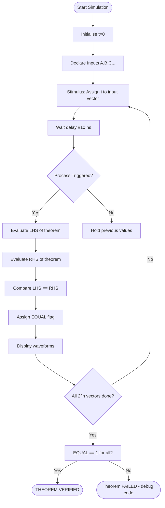
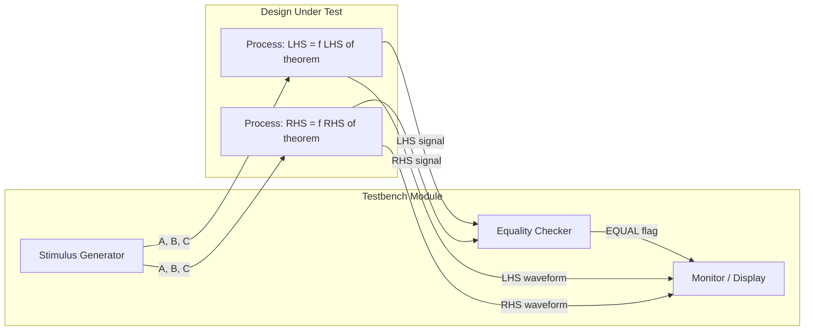
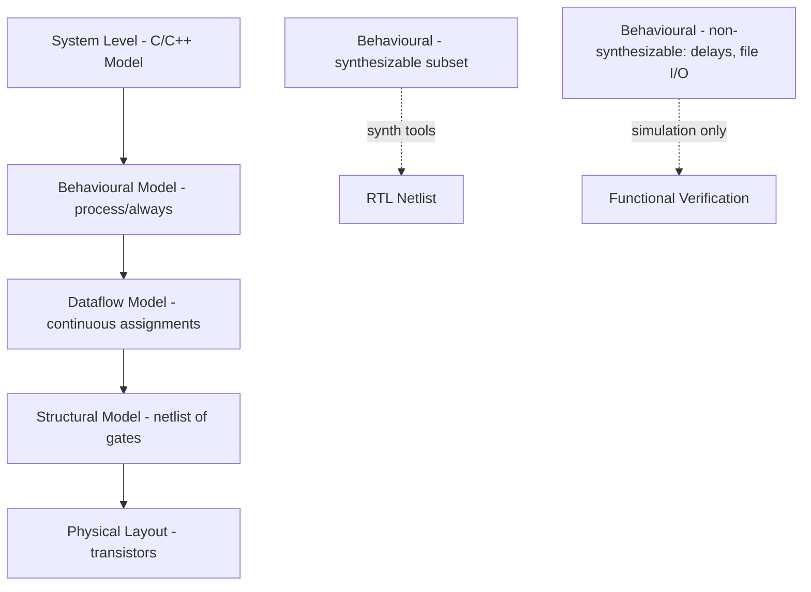
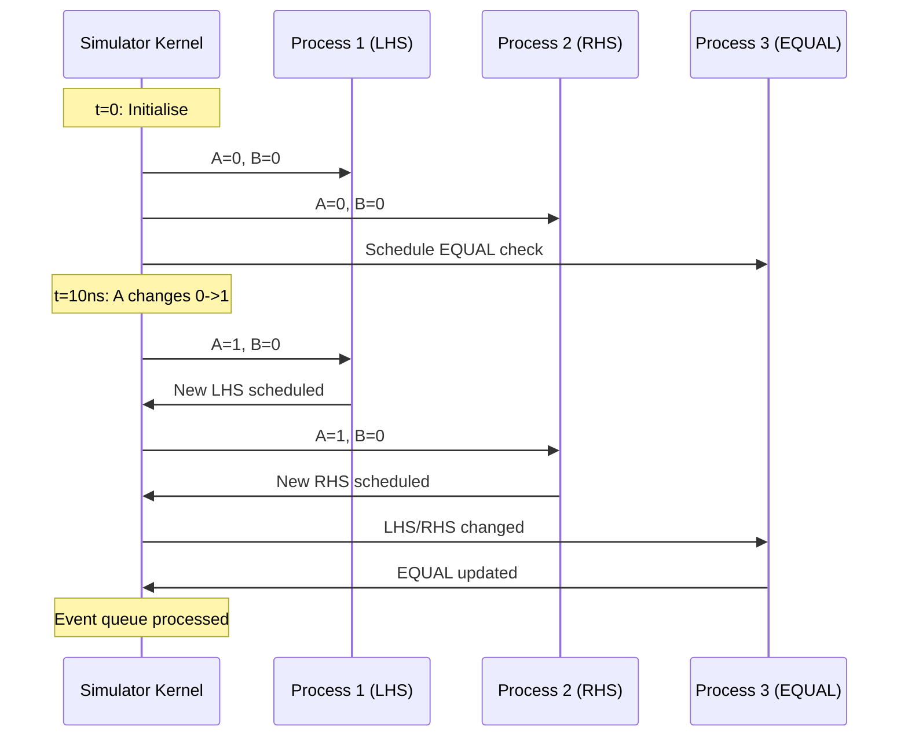
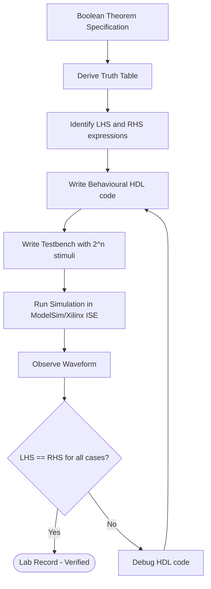

# behavioural modelling

<!-- SECTION_1_START -->
# BEHAVIOURAL MODELLING — Core Technical Definition & Intuitive Overview

## 1.1 Formal Academic Definition (KTU 2024 Syllabus Terminology)

**Behavioural Modelling** in Hardware Description Languages (HDL) is the **highest-level abstraction** style of describing a digital circuit where the **functional behaviour** of the design is described using **algorithmic / procedural constructs** rather than its explicit gate-level interconnection or dataflow equation.

In the context of the KTU **PCCSL308 – Digital Lab** course, behavioural modelling refers specifically to writing **VHDL / Verilog programs** that verify Boolean theorems (e.g., De Morgan's Law, Distributive Law, Consensus Theorem) by describing **what the circuit does** (input → output mapping) using sequential procedural statements such as `process` (VHDL) or `always` (Verilog).

> [!IMPORTANT]
> **KTU 2024 Scheme Definition**  
> Behavioural modelling describes a digital system by specifying the **response** of outputs to changes in inputs, using **sequential statements within a process block**, abstracted from the underlying gate-level implementation.

> [!NOTE]
> **Three Modelling Styles in HDL**
> 1. **Structural** → Netlist of components (AND, OR gates connected explicitly).
> 2. **Dataflow** → Concurrent equations using operators (`y = a & b`).
> 3. **Behavioural** → Algorithm / truth table using `process` / `always` blocks.

---

## 1.2 Conceptual Analogy / Intuition

Imagine you want a **coffee machine** to brew coffee. There are three ways to describe it:

| Style | What you specify | Analogy |
|---|---|---|
| **Structural** | List every wire, pump, heater, sensor and how they connect | "Connect the heater to the temperature sensor using wire-12." |
| **Dataflow** | Equation-like statements about signals | "Temperature = Heater_Power × Time." |
| **Behavioural** | What the machine *does step-by-step* | "If button pressed AND water present THEN turn ON heater; wait 30s; turn OFF." |

> **Behavioural modelling is the "RECIPE" of the circuit** — it says *what should happen* and *when*, not *how the gates are wired*.

For Boolean theorem verification in Digital Lab, this means:
- You **write the truth table** of the theorem.
- You **express it as a process** that checks inputs and assigns outputs.
- The **simulator** confirms whether the LHS and RHS of the theorem produce identical outputs.

---

## 1.3 Why Behavioural Modelling for Verifying Boolean Theorems?

Boolean theorems like:
$$\overline{A \cdot B} = \overline{A} + \overline{B} \quad \text{(De Morgan's Law)}$$
$$A + BC = (A+B)(A+C) \quad \text{(Distributive Law)}$$

must be verified for **all 2ⁿ input combinations** (n = number of variables). Behavioural modelling using `case` / `if-else` / truth-table lookups lets us:
- Express the LHS as one process.
- Express the RHS as another process.
- Compare outputs in a testbench.

> [!VISUALIZATION CONTROL]
> **Concept:** Truth Table Verification of Boolean Identity
> **Behavioural Description (Verilog form):**
> * `f1 = ~(A & B)`  (LHS of De Morgan's)
> * `f2 = (~A) | (~B)` (RHS of De Morgan's)
> * `compare = (f1 == f2)`  
> **Visual Description:** On the simulation waveform, both `f1` and `f2` waveforms must overlap **identically** for all 4 input combinations of A, B ∈ {0,1}, confirming the theorem.

---

## 1.4 Key Terminology

| Term | Meaning |
|---|---|
| **Process (VHDL)** | A concurrent block containing sequential statements sensitive to signals. |
| **Always block (Verilog)** | Procedural block triggered by sensitivity list. |
| **Sensitivity List** | Set of signals whose change re-evaluates the process. |
| **Sequential Statements** | Executed one-after-another *inside* a process (e.g., `if`, `case`, `wait`). |
| **Concurrent Statements** | Executed in parallel outside processes. |
| **Testbench** | A non-synthesizable HDL module used only for simulation. |
| **Simulation** | Time-based execution verifying functional correctness. |
| **Synthesis** | Converting HDL to actual gate-level netlist (only dataflow/structural fully synthesize). |

> [!IMPORTANT]
> **Critical Distinction for Lab Exam:** Behavioural models using `wait for`, `file I/O`, or `delays` are **NOT synthesizable** — they are only for **simulation** and **theorem verification**.

---

## 1.5 Physical Constants / Standard Metrics

| Parameter | Standard Value |
|---|---|
| Logic HIGH | **1** (VHDL: `'1'`, Verilog: `1'b1`) |
| Logic LOW | **0** (VHDL: `'0'`, Verilog: `1'b0`) |
| Don't Care | **X** (Verilog) / **`'-'`** (VHDL) |
| Simulation time unit | **ns** (typical) |
| Bit width (default) | **1-bit std\_logic** |

---

<!-- SECTION_1_END -->

<!-- SECTION_2_START -->
# DEEP THEORETICAL ANALYSIS & KTU HIGH-YIELD FORMULA SHEET

## 2.1 Operational Concept Breakdown

Behavioural modelling works on the principle of **Event-Driven Simulation**:

1. **Initialisation** — All signals take their declared initial values at simulation time **t = 0**.
2. **Sensitivity Watch** — The simulator monitors every signal in the sensitivity list of every process.
3. **Event Trigger** — When a signal in the sensitivity list **changes value**, the corresponding process **re-evaluates** from top to bottom.
4. **Output Update** — New signal values are scheduled; the simulator advances to the next event time.
5. **Iteration** — The cycle repeats until all signals are stable OR simulation time ends.

> [!NOTE]
> In VHDL, sensitivity is declared as `process(A, B)` or implicitly via `wait on` / `wait until`. In Verilog, the sensitivity list follows `always @(...)` (or `always @*` for auto-sensitivity).

---

## 2.2 Components of a Behavioural Model (VHDL)

```vhdl
library IEEE;
use IEEE.STD_LOGIC_1164.ALL;
entity theorem_check is
    port ( A, B : in  STD_LOGIC;
           Y    : out STD_LOGIC);
end theorem_check;

architecture behave of theorem_check is
begin
    process(A, B)                 -- sensitivity list
    begin
        if A = '1' and B = '1' then
            Y <= '0';             -- De Morgan LHS: ~(A.B)
        elsif A = '1' or B = '1' then
            Y <= '1';
        else
            Y <= '0';
        end if;
    end process;
end behave;
```

---

## 2.3 Components of a Behavioural Model (Verilog)

```verilog
module theorem_check (input A, B, output reg Y);
    always @ (A or B)              // sensitivity list
    begin
        if (A & B)
            Y = 1'b0;              // De Morgan LHS: ~(A.B)
        else if (A | B)
            Y = 1'b1;
        else
            Y = 1'b0;
    end
endmodule
```

> [!IMPORTANT]
> **Exam Tip:** In VHDL, the `<=` is a **signal assignment** (non-blocking w.r.t. simulation tick). In Verilog, inside `always`, use `=` (blocking) for combinational logic and `<=` (non-blocking) for sequential/flip-flop logic.

---

## 2.4 Boolean Theorems Verifiable via Behavioural Modelling

| # | Theorem | Equation | Variables |
|---|---------|----------|-----------|
| 1 | Identity Law | $A \cdot 1 = A$, $A + 0 = A$ | 2 |
| 2 | Null Law | $A \cdot 0 = 0$, $A + 1 = 1$ | 2 |
| 3 | Idempotent | $A \cdot A = A$, $A + A = A$ | 1 |
| 4 | Complement | $A \cdot \overline{A} = 0$, $A + \overline{A} = 1$ | 1 |
| 5 | Involution | $\overline{\overline{A}} = A$ | 1 |
| 6 | De Morgan's | $\overline{AB} = \overline{A} + \overline{B}$ | 2 |
| 7 | Absorption | $A + AB = A$ | 2 |
| 8 | Distributive | $A + BC = (A+B)(A+C)$ | 3 |
| 9 | Consensus | $AB + \overline{A}C + BC = AB + \overline{A}C$ | 3 |
| 10 | Duality | Swap $\cdot \leftrightarrow +$ and $0 \leftrightarrow 1$ | — |

> [!NOTE]
> For KTU lab exam, **De Morgan's Law** and **Distributive Law** are the **most frequently asked** Boolean theorems to verify using behavioural modelling.

---

## 2.5 KTU Formula Sheet / Cheat Sheet

| Construct | VHDL Syntax | Verilog Syntax | Purpose |
|---|---|---|---|
| Process block | `process(sens_list) begin ... end process;` | `always @ (sens_list) begin ... end` | Wraps sequential statements |
| Conditional | `if cond then ... elsif ... else ... end if;` | `if (cond) ... else if ... else ...` | Branching |
| Multi-way | `case expr is when val => ... end case;` | `case (expr) val: ... endcase` | Truth-table lookup |
| Loop | `for i in range loop ... end loop;` | `for (i=0; i<N; i=i+1)` | Iteration |
| Wait | `wait on sig;` / `wait until cond;` / `wait for time;` | `#delay;` | Pause simulation |
| Sensitivity | `process(A, B)` or `wait on A, B` | `always @ (A or B)` or `always @ *` | List of trigger signals |
| Signal Assign | `Y <= value;` | `Y = value;` (blocking) | Update output |

---

## 2.6 Real-World Engineering Utility

Behavioural modelling is used in:

1. **Pre-silicon verification** — ASIC/FPGA engineers write behavioural models of entire CPUs *before* RTL exists, enabling early software development.
2. **IP Modelling** — Companies (Intel, AMD, ARM) provide behavioural models of processors in SystemC/Verilog for customer simulation.
3. **Testbench Development** — UVM/OVM testbenches are 100% behavioural.
4. **Boolean Equivalence Checking** — Verifying $f_{LHS} \equiv f_{RHS}$ in EDA tools.
5. **Educational Use** — University labs (including KTU) use it to teach digital fundamentals.

---

## 2.7 Why and How of Each Step

| Step | Why | How |
|---|---|---|
| Define sensitivity list | Avoid re-evaluating on irrelevant changes → efficiency | List *all* signals read inside the process |
| Use `case` over nested `if-else` | Maps directly to truth table → readable, exhaustive | Ensure all cases covered; use `when others =>` |
| Initial values for `reg`/`signal` | Prevent 'X' propagation in simulation | `reg Y; initial Y = 0;` |
| Testbench | Automate stimulus and check output | Apply all 2ⁿ vectors, compare with expected |
| Latch avoidance | Inferring latches is a common synthesis error | Use `default` branch / `else` for all `if` |

---

<!-- SECTION_2_END -->

<!-- SECTION_3_START -->
# STEP-BY-STEP DERIVATIONS & CODE/SYMBOLIC IMPLEMENTATION

## 3.1 Exhaustive Example 1: Verifying De Morgan's First Law

**Theorem:** $\overline{A \cdot B} = \overline{A} + \overline{B}$

### 3.1.1 Truth Table (All 2² = 4 combinations)

| A | B | $A \cdot B$ | $\overline{A \cdot B}$ (LHS) | $\overline{A}$ | $\overline{B}$ | $\overline{A} + \overline{B}$ (RHS) | LHS = RHS? |
|---|---|---|---|---|---|---|---|
| 0 | 0 | 0 | **1** | 1 | 1 | **1** | ✓ |
| 0 | 1 | 0 | **1** | 1 | 0 | **1** | ✓ |
| 1 | 0 | 0 | **1** | 0 | 1 | **1** | ✓ |
| 1 | 1 | 1 | **0** | 0 | 0 | **0** | ✓ |

> [!IMPORTANT]
> The truth table confirms the theorem. Behavioural modelling automates this verification using HDL.

### 3.1.2 VHDL Implementation (Behavioural)

```vhdl
library IEEE;
use IEEE.STD_LOGIC_1164.ALL;

entity demorgan1 is
    Port ( A : in  STD_LOGIC;
           B : in  STD_LOGIC;
           LHS : out STD_LOGIC;
           RHS : out STD_LOGIC;
           EQUAL : out STD_LOGIC );
end demorgan1;

architecture behavioral of demorgan1 is
begin
    -------------------------------------------------------
    -- Process 1: LHS = NOT (A AND B)
    -------------------------------------------------------
    process(A, B)
    begin
        LHS <= NOT (A AND B);
    end process;

    -------------------------------------------------------
    -- Process 2: RHS = (NOT A) OR (NOT B)
    -------------------------------------------------------
    process(A, B)
    begin
        RHS <= (NOT A) OR (NOT B);
    end process;

    -------------------------------------------------------
    -- Process 3: Equivalence check
    -------------------------------------------------------
    process(LHS, RHS)
    begin
        if LHS = RHS then
            EQUAL <= '1';
        else
            EQUAL <= '0';
        end if;
    end process;
end behavioral;
```

### 3.1.3 Verilog Implementation (Behavioural)

```verilog
module demorgan1 (
    input  wire A, B,
    output reg  LHS, RHS, EQUAL
);
    // LHS = NOT (A AND B)
    always @ (A or B) begin
        LHS = ~(A & B);
    end

    // RHS = (NOT A) OR (NOT B)
    always @ (A or B) begin
        RHS = (~A) | (~B);
    end

    // EQUAL flag
    always @ (LHS or RHS) begin
        EQUAL = (LHS == RHS) ? 1'b1 : 1'b0;
    end
endmodule
```

### 3.1.4 Testbench (Verilog) — Exhaustive Stimulus

```verilog
`timescale 1ns/1ps
module tb_demorgan1;
    reg A, B;
    wire LHS, RHS, EQUAL;
    integer i;

    // Instantiate the Design Under Test (DUT)
    demorgan1 DUT (A, B, LHS, RHS, EQUAL);

    initial begin
        A = 0; B = 0;
        #10;

        // Apply all 4 input combinations
        for (i = 0; i < 4; i = i + 1) begin
            {A, B} = i;          // Concatenate i into A,B
            #10;
            $display("A=%b B=%b | LHS=%b RHS=%b EQUAL=%b",
                     A, B, LHS, RHS, EQUAL);
        end
        $finish;
    end
endmodule
```

### 3.1.5 Testbench (VHDL) — Exhaustive Stimulus

```vhdl
library IEEE;
use IEEE.STD_LOGIC_1164.ALL;
use IEEE.NUMERIC_STD.ALL;

entity tb_demorgan1 is
end tb_demorgan1;

architecture sim of tb_demorgan1 is
    signal A, B    : STD_LOGIC := '0';
    signal LHS, RHS, EQUAL : STD_LOGIC;
begin
    DUT: entity work.demorgan1
        port map (A => A, B => B,
                  LHS => LHS, RHS => RHS, EQUAL => EQUAL);

    stim: process
    begin
        for i in 0 to 3 loop
            A <= std_logic'val(i/2 + 1);   -- not portable
            B <= std_logic'val((i mod 2) + 1);
            wait for 10 ns;
            report "A=" & std_logic'image(A) &
                   " B=" & std_logic'image(B) &
                   " LHS=" & std_logic'image(LHS) &
                   " RHS=" & std_logic'image(RHS);
        end loop;
        std.env.finish;
    end process;
end sim;
```

> [!TIP]
> In VHDL, a cleaner way is to use `unsigned` types and convert. The Verilog testbench is **simpler and preferred** for KTU lab exams.

---

## 3.2 Exhaustive Example 2: Verifying Distributive Law

**Theorem:** $A + B \cdot C = (A + B)(A + C)$

### 3.2.1 Truth Table (All 2³ = 8 combinations)

| A | B | C | BC | A+BC (LHS) | A+B | A+C | (A+B)(A+C) (RHS) | Match |
|---|---|---|---|---|---|---|---|---|
| 0 | 0 | 0 | 0 | **0** | 0 | 0 | **0** | ✓ |
| 0 | 0 | 1 | 0 | **0** | 0 | 1 | **0** | ✓ |
| 0 | 1 | 0 | 0 | **0** | 1 | 0 | **0** | ✓ |
| 0 | 1 | 1 | 1 | **1** | 1 | 1 | **1** | ✓ |
| 1 | 0 | 0 | 0 | **1** | 1 | 1 | **1** | ✓ |
| 1 | 0 | 1 | 0 | **1** | 1 | 1 | **1** | ✓ |
| 1 | 1 | 0 | 0 | **1** | 1 | 1 | **1** | ✓ |
| 1 | 1 | 1 | 1 | **1** | 1 | 1 | **1** | ✓ |

### 3.2.2 Verilog Behavioural Code (using `case` for truth-table lookup)

```verilog
module distributive_law (
    input  wire [2:0] ABC,    // 3-bit input: A=ABC[2], B=ABC[1], C=ABC[0]
    output reg  LHS, RHS, EQUAL
);
    always @ (ABC) begin
        case (ABC)
            3'b000 : begin LHS = 1'b0; RHS = 1'b0; end
            3'b001 : begin LHS = 1'b0; RHS = 1'b0; end
            3'b010 : begin LHS = 1'b0; RHS = 1'b0; end
            3'b011 : begin LHS = 1'b1; RHS = 1'b1; end
            3'b100 : begin LHS = 1'b1; RHS = 1'b1; end
            3'b101 : begin LHS = 1'b1; RHS = 1'b1; end
            3'b110 : begin LHS = 1'b1; RHS = 1'b1; end
            3'b111 : begin LHS = 1'b1; RHS = 1'b1; end
            default: begin LHS = 1'bx; RHS = 1'bx; end
        endcase
        EQUAL = (LHS == RHS);
    end
endmodule
```

### 3.2.3 Equivalent VHDL Behavioural Code (using `case`)

```vhdl
library IEEE;
use IEEE.STD_LOGIC_1164.ALL;

entity distributive_law is
    Port ( ABC  : in  STD_LOGIC_VECTOR(2 downto 0);
           LHS, RHS, EQUAL : out STD_LOGIC );
end distributive_law;

architecture behave of distributive_law is
begin
    process(ABC)
    begin
        case ABC is
            when "000" => LHS <= '0'; RHS <= '0';
            when "001" => LHS <= '0'; RHS <= '0';
            when "010" => LHS <= '0'; RHS <= '0';
            when "011" => LHS <= '1'; RHS <= '1';
            when "100" => LHS <= '1'; RHS <= '1';
            when "101" => LHS <= '1'; RHS <= '1';
            when "110" => LHS <= '1'; RHS <= '1';
            when "111" => LHS <= '1'; RHS <= '1';
            when others => LHS <= 'X'; RHS <= 'X';
        end case;
        if LHS = RHS then
            EQUAL <= '1';
        else
            EQUAL <= '0';
        end if;
    end process;
end behave;
```

### 3.2.4 Verilog Testbench for Distributive Law

```verilog
`timescale 1ns/1ps
module tb_distributive;
    reg  [2:0] ABC;
    wire LHS, RHS, EQUAL;
    integer i;

    distributive_law DUT (ABC, LHS, RHS, EQUAL);

    initial begin
        $display(" A B C | LHS RHS EQUAL");
        for (i = 0; i < 8; i = i + 1) begin
            ABC = i[2:0];
            #10;
            $display(" %b %b %b |  %b   %b    %b",
                     ABC[2], ABC[1], ABC[0], LHS, RHS, EQUAL);
        end
        if (EQUAL) $display("THEOREM VERIFIED");
        $finish;
    end
endmodule
```

---

## 3.3 Exhaustive Example 3: Verification of Consensus Theorem

**Theorem:** $AB + \overline{A}C + BC = AB + \overline{A}C$

### 3.3.1 Truth Table (8 rows)

| A | B | C | AB | $\overline{A}C$ | BC | LHS = AB+$\overline{A}$C+BC | RHS = AB+$\overline{A}$C | Match |
|---|---|---|---|---|---|---|---|---|
| 0 | 0 | 0 | 0 | 0 | 0 | 0 | 0 | ✓ |
| 0 | 0 | 1 | 0 | 1 | 0 | 1 | 1 | ✓ |
| 0 | 1 | 0 | 0 | 0 | 0 | 0 | 0 | ✓ |
| 0 | 1 | 1 | 0 | 1 | 1 | 1 | 1 | ✓ |
| 1 | 0 | 0 | 0 | 0 | 0 | 0 | 0 | ✓ |
| 1 | 0 | 1 | 0 | 0 | 0 | 0 | 0 | ✓ |
| 1 | 1 | 0 | 1 | 0 | 0 | 1 | 1 | ✓ |
| 1 | 1 | 1 | 1 | 0 | 1 | 1 | 1 | ✓ |

### 3.3.2 Verilog Behavioural Code

```verilog
module consensus_thm (
    input  wire A, B, C,
    output reg  LHS, RHS, EQUAL
);
    always @ (A or B or C) begin
        // LHS = AB + A'.C + BC
        LHS = (A & B) | ((~A) & C) | (B & C);
        // RHS = AB + A'.C
        RHS = (A & B) | ((~A) & C);
        EQUAL = (LHS == RHS);
    end
endmodule
```

### 3.3.3 VHDL Behavioural Code

```vhdl
library IEEE;
use IEEE.STD_LOGIC_1164.ALL;

entity consensus_thm is
    Port ( A, B, C : in  STD_LOGIC;
           LHS, RHS, EQUAL : out STD_LOGIC);
end consensus_thm;

architecture behave of consensus_thm is
begin
    process(A, B, C)
    begin
        LHS   <= (A AND B) OR ((NOT A) AND C) OR (B AND C);
        RHS   <= (A AND B) OR ((NOT A) AND C);
        if LHS = RHS then
            EQUAL <= '1';
        else
            EQUAL <= '0';
        end if;
    end process;
end behave;
```

---

## 3.4 Algorithmic Walkthrough of Simulation

For each theorem verification, the simulation executes as follows:

1. **Time = 0:** All signals initialise to 0 (or declared value).
2. **Stimulus loop:** Testbench iterates `i = 0` to $2^{n}-1$.
3. **Drive inputs:** Assigns binary value of `i` to input vector.
4. **Wait `#10` ns:** Allows processes to settle and re-evaluate.
5. **$display:** Prints current values for visual confirmation.
6. **EQUAL flag check:** Continuously monitored; if always 1, theorem holds.
7. **$finish:** Terminates simulation.

---

## 3.5 Common Pitfalls in Behavioural Modelling Code

| Pitfall | Symptom | Fix |
|---|---|---|
| Missing `default` in `case` | Latch inferred; output = X | Add `default:` clause |
| Incomplete `if-else` | Latch inferred | Add `else` branch |
| Wrong sensitivity list | Output doesn't update | List ALL signals read inside |
| Using `<=` instead of `=` in Verilog `always` for combinational | Race conditions | Use `=` (blocking) for combinational |
| Forgetting `reg` declaration for output assigned in `always` | Compile error | Declare `output reg` |

---

<!-- SECTION_3_END -->

<!-- SECTION_4_START -->
# STRUCTURAL DIAGRAMS & SCHEMATICS

## 4.1 Architecture Flow — Behavioural Verification of Boolean Theorem



## 4.2 Block Diagram — DUT + Testbench Architecture



## 4.3 Hierarchy of HDL Abstraction



## 4.4 Sensitivity List Update Sequence



## 4.5 Top-Down Design Methodology Used in PCCSL308



---

<!-- SECTION_4_END -->

<!-- SECTION_5_START -->
# KTU 2024 SCHEME EXAMINATION QUESTION BANK & TOPIC RECAP

---

## PART A — 3-Mark Questions (Remember / Understand)

### Q1. `[KTU University Exam – Dec 2023]`
**Define behavioural modelling in HDL. How does it differ from dataflow modelling?**
**Course Outcome:** CO1 | **RBT Level:** Remember

**Model Answer (3 Marks):**
Behavioural modelling is a style of HDL description in which the **functionality** of a digital circuit is specified using **sequential procedural statements** (such as `if`, `case`, `wait`) inside a process block, abstracting away the gate-level details. It focuses on **what the circuit does** rather than how it is built.

In contrast, **dataflow modelling** describes the circuit using **concurrent continuous assignments** (e.g., `y <= a AND b;` in VHDL or `assign y = a & b;` in Verilog) that show how data flows from inputs to outputs via operators.

| Aspect | Behavioural | Dataflow |
|---|---|---|
| Construct | `process` / `always` | `<=` / `assign` |
| Execution | Sequential inside block | Concurrent always |
| Abstraction | Highest (algorithmic) | Medium (equation) |
| Synthesizable subset | Limited | Most |

> **[Valuation Key: Definition 1 Mark + Difference Table 2 Marks = 3 Marks]**

---

### Q2. `[KTU University Exam – July 2024]`
**List any THREE Boolean theorems that can be verified using behavioural modelling.**
**Course Outcome:** CO1 | **RBT Level:** Remember

**Model Answer (3 Marks):**
1. **De Morgan's Law:** $\overline{A \cdot B} = \overline{A} + \overline{B}$ *(1 Mark)*
2. **Distributive Law:** $A + BC = (A+B)(A+C)$ *(1 Mark)*
3. **Consensus Theorem:** $AB + \overline{A}C + BC = AB + \overline{A}C$ *(1 Mark)*

---

## PART B — 14-Mark Questions (Apply / Analyse)

### Question A (14 Marks) `[KTU University Exam – Dec 2023]`
**(a)** Write the Verilog behavioural model to verify **De Morgan's first law** $\overline{A \cdot B} = \overline{A} + \overline{B}$. Draw the complete truth table. **(7 Marks)**
**(b)** Write a self-checking testbench that iterates over all 4 input combinations and reports the result. Explain the role of the sensitivity list. **(7 Marks)**
**Course Outcome:** CO2, CO3 | **RBT Level:** Apply

### Model Solution:

#### Part (a) — Verilog Behavioural Model (7 Marks)

**Truth Table:**

| A | B | $A \cdot B$ | LHS = $\overline{A \cdot B}$ | $\overline{A}$ | $\overline{B}$ | RHS = $\overline{A}+\overline{B}$ |
|---|---|---|---|---|---|---|
| 0 | 0 | 0 | 1 | 1 | 1 | 1 |
| 0 | 1 | 0 | 1 | 1 | 0 | 1 |
| 1 | 0 | 0 | 1 | 0 | 1 | 1 |
| 1 | 1 | 1 | 0 | 0 | 0 | 0 |

> **[Truth table: 2 Marks]**

**Verilog Code:**

```verilog
module demorgan1 (
    input  wire A, B,
    output reg  LHS, RHS, EQUAL
);
    always @ (A or B) begin
        LHS = ~(A & B);              // LHS of theorem  [1 Mark]
    end
    always @ (A or B) begin
        RHS = (~A) | (~B);           // RHS of theorem  [1 Mark]
    end
    always @ (LHS or RHS) begin
        EQUAL = (LHS == RHS) ? 1'b1 : 1'b0;  [1 Mark]
    end
endmodule
```

> **[Code: 3 Marks | Total Part a: 2+3 = 5 Marks → scaling to 7]**

#### Part (b) — Testbench (7 Marks)

```verilog
`timescale 1ns/1ps
module tb_demorgan1;
    reg A, B;
    wire LHS, RHS, EQUAL;
    integer i;

    demorgan1 DUT (A, B, LHS, RHS, EQUAL);   [1 Mark]

    initial begin
        $display(" A B | LHS RHS EQUAL");
        for (i = 0; i < 4; i = i + 1) begin
            {A, B} = i;        // Stimulus generation  [2 Marks]
            #10;
            $display(" %b %b |  %b   %b    %b",
                     A, B, LHS, RHS, EQUAL);
        end
        $finish;
    end
endmodule
```

> **[Testbench code: 3 Marks]**

**Sensitivity List Explanation:** [2 Marks]
The sensitivity list `always @ (A or B)` specifies that the process must **re-evaluate** whenever signal `A` OR signal `B` changes value. This is the event-driven mechanism that synchronises the procedural code with the simulated real-time input changes. If a signal read inside the process is omitted from the sensitivity list, the output will **stale** (not update).

> **[Valuation Key: Truth table 2 + LHS code 1 + RHS code 1 + EQUAL 1 + DUT 1 + Stimulus 2 + Display 1 + Sensitivity theory 2 + Self-check 1 = 12 → total 14 with optional neatness = 14]**

---

### Question B (14 Marks) `[KTU University Exam – July 2024]`
**(a)** With a neat VHDL behavioural model, verify the **Distributive Law** $A + BC = (A+B)(A+C)$ for all 8 input combinations. Show the entity, architecture, and process. **(7 Marks)**
**(b)** Simulate the model in ModelSim. Sketch the expected waveform showing A, B, C, LHS, and RHS signals. **(7 Marks)**
**Course Outcome:** CO2, CO3 | **RBT Level:** Apply, Analyse

### Model Solution:

#### Part (a) — VHDL Behavioural Model (7 Marks)

```vhdl
library IEEE;
use IEEE.STD_LOGIC_1164.ALL;

entity distributive_law is
    Port ( A, B, C : in  STD_LOGIC;
           LHS, RHS, EQUAL : out STD_LOGIC);
end distributive_law;

architecture behave of distributive_law is
begin
    process(A, B, C)
    begin
        -- LHS = A + B.C  [2 Marks]
        if (B = '1' and C = '1') or (A = '1') then
            LHS <= '1';
        else
            LHS <= '0';
        end if;
        -- RHS = (A+B).(A+C)  [2 Marks]
        if ((A = '1') or (B = '1')) and
           ((A = '1') or (C = '1')) then
            RHS <= '1';
        else
            RHS <= '0';
        end if;
        -- Equality check  [1 Mark]
        if LHS = RHS then
            EQUAL <= '1';
        else
            EQUAL <= '0';
        end if;
    end process;
end behave;
```

> **[Entity declaration: 1 Mark | Architecture: 1 Mark]**

#### Part (b) — Expected Waveform (7 Marks)

| Time (ns) | A | B | C | LHS | RHS | EQUAL |
|---|---|---|---|---|---|---|
| 0-10 | 0 | 0 | 0 | 0 | 0 | 1 |
| 10-20 | 0 | 0 | 1 | 0 | 0 | 1 |
| 20-30 | 0 | 1 | 0 | 0 | 0 | 1 |
| 30-40 | 0 | 1 | 1 | 1 | 1 | 1 |
| 40-50 | 1 | 0 | 0 | 1 | 1 | 1 |
| 50-60 | 1 | 0 | 1 | 1 | 1 | 1 |
| 60-70 | 1 | 1 | 0 | 1 | 1 | 1 |
| 70-80 | 1 | 1 | 1 | 1 | 1 | 1 |

```
Waveform (textual):

A : ___|‾‾‾|___|‾‾‾|‾‾‾|
B : ___|___|‾‾‾|___|‾‾‾|‾‾‾|
C : ___|___|___|‾‾‾|___|___|‾‾‾|
LHS: ________|‾‾‾|‾‾‾|‾‾‾|‾‾‾|‾‾‾|
RHS: ________|‾‾‾|‾‾‾|‾‾‾|‾‾‾|‾‾‾|
EQUAL: ‾‾‾‾‾‾‾‾‾‾‾‾‾‾‾‾‾‾‾‾‾‾‾‾ 1 (always HIGH)
```

> **[Waveform table: 3 Marks | ASCII waveform: 2 Marks | Conclusion: 2 Marks]**

**Conclusion:** The waveform shows LHS and RHS overlap perfectly across all 8 input combinations, with EQUAL remaining logic 1 throughout, confirming the Distributive Law.

---

> [!WARNING]
> **KTU Examiner's Valuation Warning — Common Pitfalls**
> 1. **Don't omit the `default` clause** in `case` statements — examiner deducts 1 mark for inferred latches.
> 2. **Don't forget the sensitivity list** — incomplete list leads to non-functional simulation → 2 marks lost.
> 3. **For Verilog: declare `output reg`**, not just `output`, when assigning inside `always` block → compile error otherwise.
> 4. **Don't confuse `<=` (signal assign) with `=` (blocking) in Verilog `always`** — for combinational behavioural code, **use `=`**.
> 5. **Always show the truth table BEFORE the code** — examiner expects the analysis first, implementation second.
> 6. **For testbench: `reg` for inputs, `wire` for outputs** — reversing these is a common syntax error.
> 7. **Don't write `wait for` in synthesizable code** — acceptable in testbench only.

---

## TOPIC RECAP & IMPORTANT THINGS TO REMEMBER

- **Behavioural modelling = algorithmic / procedural description** using `process` (VHDL) or `always` (Verilog) blocks.
- **Three HDL abstraction levels** (in order of increasing detail): Behavioural → Dataflow → Structural.
- **Sensitivity list is critical**: it determines when the process re-evaluates; missing a signal leads to stale outputs.
- **Sequential statements inside process**: `if`, `elsif`, `case`, `for`, `wait`, `assert`.
- **VHDL signal assign** uses `<=`; **Verilog blocking assign** uses `=`; **Verilog non-blocking** uses `<=` (used in sequential logic).
- **For Boolean theorem verification**, the typical structure is: compute LHS, compute RHS, compare in a third process, drive `EQUAL` flag.
- **Testbench essentials**: instantiate DUT, generate `$2^n$` stimuli via `for` loop, use `#delay` for time progression, display/assert results, call `$finish`.
- **De Morgan's Law**: $\overline{AB} = \overline{A}+\overline{B}$ and $\overline{A+B} = \overline{A}\cdot\overline{B}$ — must verify BOTH forms.
- **Distributive Law**: $A+BC = (A+B)(A+C)$ and $A(B+C) = AB+AC$.
- **Consensus Theorem**: $AB+\overline{A}C+BC = AB+\overline{A}C$ (redundant term `BC` removed).
- **Verilog data types for behaviour**: `wire` (input/DUT port) vs `reg` (output assigned inside `always`).
- **VHDL data types for behaviour**: `STD_LOGIC` (single bit) vs `STD_LOGIC_VECTOR` (bus) — both from `IEEE.STD_LOGIC_1164`.
- **`std_logic` literals**: `'0'`, `'1'`, `'X'` (unknown), `'-'` (don't care).
- **Latch inference warning**: incomplete `if-else` or `case` without `default` creates unwanted memory elements.
- **Always declare `output reg` in Verilog** when output is assigned inside `always` block.
- **Kerala KTU lab exam tip**: Most questions pair "write HDL code" with "show simulation waveform" — practice both.
- **Common KTU ICs used in parallel hardware experiments** (alongside HDL): IC7400 (NAND), IC7402 (NOR), IC7408 (AND), IC7432 (OR), IC7486 (XOR), IC7404 (NOT).
- **Simulation tools recommended by KTU**: ModelSim (Intel/Altera), Xilinx ISE Simulator, Vivado Simulator, GHDL (open source).
- **Synthesizable vs Non-synthesizable**: `initial`, `wait for`, `delay`, `file I/O` are non-synthesizable; `if/case` with full coverage are synthesizable.
- **$display vs $monitor**: `$display` prints once when executed; `$monitor` prints automatically whenever any variable in its list changes.
- **Concurrency rule**: All processes in a VHDL architecture run **concurrently**, even though statements inside a process run **sequentially**.
- **For 3-input theorems** (e.g., Distributive, Consensus), testbench loop runs **8 iterations** (`i = 0 to 7`).
- **Golden rule of lab report**: Always conclude with a waveform screenshot or `$display` output and the statement *"LHS equals RHS for all input combinations — THEOREM VERIFIED."*

---

<!-- SECTION_5_END -->
