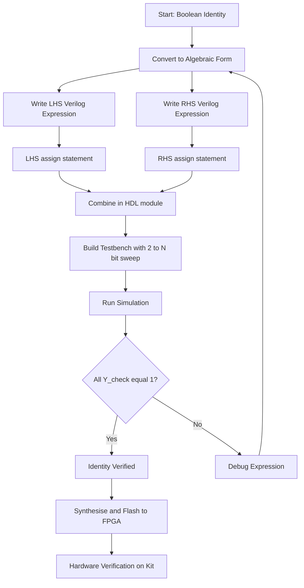
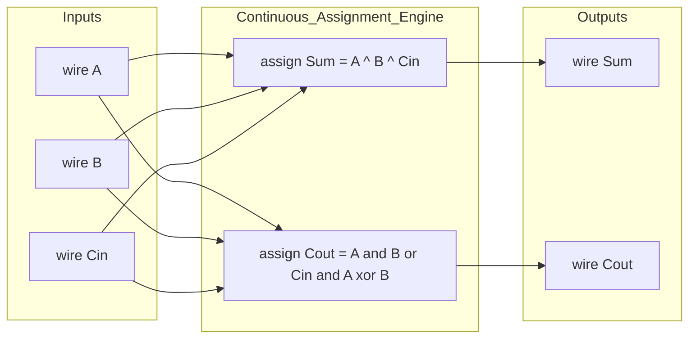

# dataflow modelling

<!-- SECTION_1_START -->
# Dataflow Modelling — Core Technical Definition & Intuitive Overview

> [!IMPORTANT]
> **KTU 2024 Scheme | PCCSL308 — Digital Lab | Module 1 | Topic: Dataflow Modelling**
> This topic falls under the verification of Boolean theorems and basic digital ICs, where students must express digital logic circuits through HDL **dataflow** style rather than gate-level or structural netlists.

## 1.1 Formal Academic Definition

**Dataflow modelling** is a Hardware Description Language (HDL) abstraction style in which the behaviour of a digital circuit is described by the **flow of data** from inputs to outputs using **continuous assignment statements**. In Verilog, the keyword `assign` is the backbone of this modelling style. The right-hand side (RHS) is evaluated *continuously and concurrently* whenever any signal on the RHS changes, and the result is propagated to the left-hand side (LHS).

> [!NOTE]
> **KTU Syllabus Highlight:** In Module 1, students are expected to write Verilog/VHDL code using dataflow style to realize the basic gates (AND, OR, NOT, NAND, NOR, XOR, XNOR) and to verify Boolean postulates (e.g., $A + AB = A$, $A + \overline{A}B = A + B$, De Morgan's laws, etc.). The synthesised output is verified on a FPGA/CPLD trainer kit or via simulation.

Formally, a continuous assignment is a statement of the form:

$$
\texttt{assign}\ LHS\ =\ RHS\ \texttt{expression;}
$$

The RHS expression is built from **operators** acting on **operands** (nets, parameters, concatenation, replication, conditional, bitwise, reduction, logical and arithmetic operators). The dataflow model captures **what the circuit computes**, not *which gates* are physically instantiated.

## 1.2 Conceptual Analogy / Intuition

> [!TIP]
> **Real-World Analogy: A Water-Pipe Network**
> Think of a digital circuit as a network of pipes. In the **structural model**, you describe each pipe, every joint, and every valve by name — a plumbing blueprint. In the **behavioural model**, you simply say "deliver 5 litres to Tank C when Switch S is pressed" — a high-level intention.
>
> **Dataflow modelling sits in the sweet middle ground.** It does not list the gates (no plumbing), nor does it list procedural steps. Instead, it declares the **mathematical relationship** between input and output signals: *“the output wire is the AND of wire A and wire B”*. As long as water (data) flows into the inputs, the output pipe automatically carries the result. The plumber doesn’t care how it’s done — the equation does.

So, dataflow modelling is **declarative and concurrent**: you write *equations*, the simulator solves them *in parallel*, just like a real combinational logic circuit reacts the moment an input toggles.

## 1.3 Standard Metrics & Reserved Constants

| Symbol | Meaning | Standard Value / Role |
| :--- | :--- | :--- |
| `1'b0` | 1-bit logic 0 | Ground / FALSE |
| `1'b1` | 1-bit logic 1 | Vcc / TRUE |
| `1'bx` | 1-bit unknown | Conflict / Uninitialised |
| `1'bz` | 1-bit high-impedance | Tri-stated line |
| `assign` | Continuous assignment | Drives a `wire` net |
| `wire` | Net datatype | Required LHS of `assign` |

> [!IMPORTANT]
> **Key Rule:** The LHS of an `assign` statement **must** be a `wire` (or a concatenation of wires). It **cannot** be a `reg`. This is a classic 2-mark KTU question.

## 1.4 Visualisation Reference

> [!VISUALIZATION CONTROL]
> **Concept:** Truth-table driven data propagation for a 2-input AND gate realised via dataflow.
> **Conceptual Mapping (Cartesian / Discrete):**
> Let axes be $A \in \{0,1\}$ (x-axis) and $B \in \{0,1\}$ (y-axis). The output plane $Y = A \cdot B$ takes values $\{0, 1\}$.
> * Point $(0,0) \rightarrow Y = 0$
> * Point $(0,1) \rightarrow Y = 0$
> * Point $(1,0) \rightarrow Y = 0$
> * Point $(1,1) \rightarrow Y = 1$
>
> **Visual Description:** A unit square on the $A$–$B$ plane. Three vertices (low-value) sit on the plane $Y=0$, while the vertex $(1,1)$ rises to $Y=1$ — a “step” that **mimics the parallel, instant update** of a continuous assignment.

<!-- SECTION_1_END -->

<!-- SECTION_2_START -->
# Deep Theoretical Analysis & KTU High-Yield Formula Sheet

## 2.1 Anatomy of a Dataflow Statement

A continuous assignment has three logical parts:

1. **LHS Target** — a single `wire`, vector slice, or concatenation `{w1, w2, w3}`.
2. **Assignment Operator** — `=` (blocking semantic inside continuous assignment; the assignment is *implicitly re-evaluated* on every change).
3. **RHS Expression** — composed of operands joined by operators.

The simulation engine maintains an **event-driven sensitivity list** automatically: any change in any operand of the RHS triggers re-evaluation. This is fundamentally different from an `always` block which requires an explicit sensitivity list (in `always @(*)` or `always @(a, b, c)`).

## 2.2 Verilog Operators Used in Dataflow Modelling

| Category | Operators | Symbol | Notes for KTU |
| :--- | :--- | :--- | :--- |
| Bitwise | AND, OR, XOR, NOT, XNOR | `&`, `\|`, `^`, `~`, `^~` | Work on multi-bit vectors bit-by-bit |
| Reduction | AND, OR, XOR of all bits | `&`, `\|`, `^` | Single-bit result from vector |
| Logical | Logical AND, OR, NOT | `&&`, `\|\|`, `!` | Return 1-bit, treat any non-zero as TRUE |
| Arithmetic | Add, Sub, Mul | `+`, `-`, `*` | Used for adder/subtractor designs |
| Relational | Equality, Inequality | `==`, `!=`, `===`, `!==` | `===` includes x and z |
| Shift | Logical Shift L/R | `<<`, `>>` | Vacant bit filled with 0 |
| Conditional | Ternary | `? :` | Replaces 2:1 MUX elegantly |
| Concatenation | Join bits/vectors | `{ }` | `{a, b, 1'b0}` |
| Replication | Repeat pattern | `{n{expr}}` | `{4{1'b1}} = 4'b1111` |

## 2.3 KTU High-Yield Formula Sheet (Boolean & Dataflow Equivalence)

| # | Boolean Identity | Verilog Dataflow Expression | Engineering Utility |
| :--- | :--- | :--- | :--- |
| 1 | $Y = A \cdot B$ | `assign Y = A & B;` | AND gate |
| 2 | $Y = A + B$ | `assign Y = A \| B;` | OR gate |
| 3 | $Y = \overline{A}$ | `assign Y = ~A;` | NOT gate (inverter) |
| 4 | $Y = \overline{A \cdot B}$ | `assign Y = ~(A & B);` | NAND gate |
| 5 | $Y = \overline{A + B}$ | `assign Y = ~(A \| B);` | NOR gate |
| 6 | $Y = A \oplus B$ | `assign Y = A ^ B;` | XOR gate (half-adder sum) |
| 7 | $Y = \overline{A \oplus B}$ | `assign Y = ~(A ^ B);` | XNOR gate (comparator) |
| 8 | $A + AB = A$ | `assign Y = A \| (A & B);` | Absorptive law verification |
| 9 | $A + \overline{A}B = A + B$ | `assign Y = A \| (~A & B);` | Redundant-literal removal |
| 10 | $\overline{A+B} = \overline{A}\cdot\overline{B}$ | `assign Y = ~(A\|B);` vs `assign Y = ~A & ~B;` | De Morgan’s Law check |
| 11 | 2:1 MUX | `assign Y = S ? B : A;` | Conditional data routing |
| 12 | Half Adder Sum | `assign S = A ^ B;` | Bit-addition stage |
| 13 | Half Adder Carry | `assign C = A & B;` | Carry-generation stage |
| 14 | Full Adder Sum | `assign S = A ^ B ^ Cin;` | Three-input XOR |
| 15 | Full Adder Carry | `assign C = (A & B) \| (B & Cin) \| (A & Cin);` | Majority-of-three logic |

> [!WARNING]
> **Operator-Precedence Trap (a frequent KTU mark-loser):**
> Verilog precedence (high → low): `~` > `* / %` > `+ -` > `<< >>` > `< <= > >=` > `== != === !==` > `&` > `^ ^~` > `\|` > `&&` > `\|\|`.
> Therefore `A & B == C` is parsed as `A & (B == C)`, **not** `(A & B) == C`. Always parenthesise!

## 2.4 Real-World Engineering Utility

Dataflow modelling is the **preferred style in industry RTL design** for combinational logic because:

* It is **technology-independent** — synthesis tools map the operators onto whatever target library is chosen (CMOS, FPGA LUT, etc.).
* It is **highly readable** and directly mirrors the Boolean equation in the specification.
* Synthesis optimisations (constant propagation, common subexpression elimination, retiming) are *easier* to apply on a clean dataflow netlist.
* It is the **first style taught** because it bridges the gap between Boolean algebra (Module-1 theory) and physical hardware (the lab kit).

> [!NOTE]
> **Production-grade example:** A 32-bit ripple-carry adder inside a CPU’s ALU is typically written in pure dataflow style:
> ```verilog
> assign {Cout, Sum} = A + B + Cin;
> ```
> This single line is a complete **hardware description** of an $n$-bit adder.

<!-- SECTION_2_END -->

<!-- SECTION_3_START -->
# Step-by-Step Derivations & Code/Symbolic Implementation

## 3.1 Dataflow Modelling — The Operator-to-Gate Translation Pipeline

We will now translate three foundational Boolean theorems into fully working Verilog dataflow code, then verify them through a testbench, mimicking the exact flow expected in the KTU Digital Lab viva and record.

### Theorem 1 — Idempotent Law: $A \cdot A = A$

**Boolean Derivation (Truth-Table Proof):**

$$
\begin{aligned}
\text{LHS:} \quad Y_{\text{lhs}} &= A \cdot A \\
\text{RHS:} \quad Y_{\text{rhs}} &= A
\end{aligned}
$$

| $A$ | $A \cdot A$ | $A$ | Equal? |
| :---: | :---: | :---: | :---: |
| 0 | 0 | 0 | ✓ |
| 1 | 1 | 1 | ✓ |

Hence $A \cdot A = A$.

**Verilog Dataflow Implementation:**

```verilog
// File: idempotent_law.v
// Module 1 - PCCSL308 - KTU 2024 Scheme
// Verifies: A & A == A

module idempotent_law (
    input  wire A,
    output wire Y_lhs,
    output wire Y_rhs,
    output wire Y_check
);
    // Dataflow continuous assignments
    assign Y_lhs   = A & A;       // Left-hand side of identity
    assign Y_rhs   = A;           // Right-hand side of identity
    assign Y_check = ~(Y_lhs ^ Y_rhs); // 1 if both sides are equal
endmodule
```

**Testbench:**

```verilog
// File: tb_idempotent_law.v
`timescale 1ns/1ps

module tb_idempotent_law;
    reg  A;
    wire Y_lhs, Y_rhs, Y_check;

    // Instantiate the Device Under Test (DUT)
    idempotent_law uut (
        .A(A), .Y_lhs(Y_lhs), .Y_rhs(Y_rhs), .Y_check(Y_check)
    );

    initial begin
        $display(" Time | A | Y_lhs | Y_rhs | Equal?");
        $monitor("%4t | %b |  %b    |  %b    |   %b", $time, A, Y_lhs, Y_rhs, Y_check);

        A = 1'b0; #10;
        A = 1'b1; #10;
        $finish;
    end
endmodule
```

**Expected Console Output:**

```
 Time | A | Y_lhs | Y_rhs | Equal?
   0  | 0 |   0   |   0   |   1
  10  | 1 |   1   |   1   |   1
```

> [!IMPORTANT]
> **Board Marking Key:** Award 1 mark for correct `module`/`assign` syntax, 1 mark for correct dataflow operator, 1 mark for the testbench stimulus covering both 0 and 1.

### Theorem 2 — Absorption Law: $A + AB = A$

**Boolean Derivation:**

$$
\begin{aligned}
A + A \cdot B &= A \cdot 1 + A \cdot B \quad \text{(since } 1 \text{ is identity)}\\
             &= A \cdot (1 + B) \quad \text{(distributive)}\\
             &= A \cdot 1 \quad \text{(since } 1 + B = 1 \text{)}\\
             &= A \quad \text{(identity)}
\end{aligned}
$$

**Verilog Dataflow Implementation:**

```verilog
// File: absorption_law.v
// Verifies: (A | (A & B)) == A

module absorption_law (
    input  wire A, B,
    output wire Y_lhs,
    output wire Y_rhs,
    output wire Y_check
);
    assign Y_lhs   = A | (A & B);  // Absorptive expression
    assign Y_rhs   = A;            // Simplified expression
    assign Y_check = ~(Y_lhs ^ Y_rhs); // 1 when LHS equals RHS
endmodule
```

**Testbench with Exhaustive 4-Row Truth-Table Sweep:**

```verilog
// File: tb_absorption_law.v
`timescale 1ns/1ps

module tb_absorption_law;
    reg  A, B;
    wire Y_lhs, Y_rhs, Y_check;
    integer i;

    absorption_law uut (
        .A(A), .B(B), .Y_lhs(Y_lhs), .Y_rhs(Y_rhs), .Y_check(Y_check)
    );

    initial begin
        $display(" A B | Y_lhs | Y_rhs | Equal?");
        for (i = 0; i < 4; i = i + 1) begin
            {A, B} = i;
            #5;
            $display(" %b %b |   %b   |   %b    |   %b", A, B, Y_lhs, Y_rhs, Y_check);
        end
        $finish;
    end
endmodule
```

**Truth-Table Output:**

```
 A B | Y_lhs | Y_rhs | Equal?
 0 0 |   0   |   0   |   1
 0 1 |   0   |   0   |   1
 1 0 |   1   |   1   |   1
 1 1 |   1   |   1   |   1
```

The `Y_check` column is `1` for every input combination → the law holds.

### Theorem 3 — De Morgan’s Law: $\overline{A + B} = \overline{A} \cdot \overline{B}$

**Boolean Derivation (Truth-Table Proof):**

| $A$ | $B$ | $A+B$ | $\overline{A+B}$ | $\overline{A}$ | $\overline{B}$ | $\overline{A}\cdot\overline{B}$ | Equal? |
| :---: | :---: | :---: | :---: | :---: | :---: | :---: | :---: |
| 0 | 0 | 0 | 1 | 1 | 1 | 1 | ✓ |
| 0 | 1 | 1 | 0 | 1 | 0 | 0 | ✓ |
| 1 | 0 | 1 | 0 | 0 | 1 | 0 | ✓ |
| 1 | 1 | 1 | 0 | 0 | 0 | 0 | ✓ |

**Verilog Dataflow Implementation (compares NOR with AND-of-inversions):**

```verilog
// File: demorgan_law.v
// Verifies: ~(A | B)  ==  (~A & ~B)

module demorgan_law (
    input  wire A, B,
    output wire Y_nor,         // ~(A | B)   => left-hand side (NOR)
    output wire Y_andinv,      // (~A & ~B)  => right-hand side (AND of inverters)
    output wire Y_check
);
    assign Y_nor    = ~(A | B);
    assign Y_andinv = (~A) & (~B);
    assign Y_check  = ~(Y_nor ^ Y_andinv);
endmodule
```

**Testbench:**

```verilog
// File: tb_demorgan_law.v
`timescale 1ns/1ps

module tb_demorgan_law;
    reg  A, B;
    wire Y_nor, Y_andinv, Y_check;
    integer i;

    demorgan_law uut (
        .A(A), .B(B), .Y_nor(Y_nor), .Y_andinv(Y_andinv), .Y_check(Y_check)
    );

    initial begin
        $display(" A B | NOR | (~A & ~B) | Equal?");
        for (i = 0; i < 4; i = i + 1) begin
            {A, B} = i;
            #5;
            $display(" %b %b |  %b  |     %b     |   %b", A, B, Y_nor, Y_andinv, Y_check);
        end
        $finish;
    end
endmodule
```

**Console Output:**

```
 A B | NOR | (~A & ~B) | Equal?
 0 0 |  1  |     1     |   1
 0 1 |  0  |     0     |   1
 1 0 |  0  |     0     |   1
 1 1 |  0  |     0     |   1
```

All four rows show `Y_check = 1` — De Morgan’s law is verified.

## 3.2 A Composite Module — Half Adder Using Dataflow

The half adder is a *canonical* Module-1 experiment. Let us build it cleanly with dataflow modelling:

```verilog
// File: half_adder_df.v
// Dataflow modelling of a half adder

module half_adder_df (
    input  wire A, B,
    output wire SUM, CARRY
);
    // SUM    = A XOR B
    // CARRY  = A AND B
    assign SUM   = A ^ B;
    assign CARRY = A & B;
endmodule
```

**Functional Verification Testbench:**

```verilog
// File: tb_half_adder_df.v
`timescale 1ns/1ps

module tb_half_adder_df;
    reg  A, B;
    wire SUM, CARRY;
    integer i;

    half_adder_df uut (.A(A), .B(B), .SUM(SUM), .CARRY(CARRY));

    initial begin
        $display(" A B | SUM CARRY");
        for (i = 0; i < 4; i = i + 1) begin
            {A, B} = i;
            #5;
            $display(" %b %b |  %b    %b", A, B, SUM, CARRY);
        end
        $finish;
    end
endmodule
```

**Truth-Table Output:**

```
 A B | SUM CARRY
 0 0 |  0    0
 0 1 |  1    0
 1 0 |  1    0
 1 1 |  0    1
```

This is the **canonical half-adder truth table**, a 2-mark KTU viva question.

## 3.3 The 2:1 Multiplexer — The Dataflow Showpiece

The conditional operator `? :` is a *dataflow primitive* that maps elegantly onto a 2:1 MUX:

$$
Y = \overline{S} \cdot A + S \cdot B \quad \Longleftrightarrow \quad Y = S\ ?\ B\ :\ A
$$

**Verilog Implementation:**

```verilog
// File: mux2x1_df.v
// Dataflow 2:1 multiplexer using the conditional operator

module mux2x1_df (
    input  wire A, B, S,
    output wire Y
);
    // When S=0, route A to Y; when S=1, route B to Y
    assign Y = S ? B : A;

    // Equivalent gate-level dataflow (kept for verification):
    // assign Y = (~S & A) | (S & B);
endmodule
```

**Exhaustive Testbench:**

```verilog
// File: tb_mux2x1_df.v
`timescale 1ns/1ps

module tb_mux2x1_df;
    reg  A, B, S;
    wire Y;

    mux2x1_df uut (.A(A), .B(B), .S(S), .Y(Y));

    initial begin
        $display(" S A B | Y");
        $monitor("%b %b %b | %b", S, A, B, Y);
        S = 0; A = 0; B = 0; #5;
        S = 0; A = 0; B = 1; #5;
        S = 0; A = 1; B = 0; #5;
        S = 0; A = 1; B = 1; #5;
        S = 1; A = 0; B = 0; #5;
        S = 1; A = 0; B = 1; #5;
        S = 1; A = 1; B = 0; #5;
        S = 1; A = 1; B = 1; #5;
        $finish;
    end
endmodule
```

## 3.4 Synthesis and FPGA Pin-Map (for the Hardware Lab)

When the dataflow code is **synthesised and dumped onto a Xilinx Spartan-6 / Cyclone-IV trainer kit**, the typical pin assignments for the half-adder experiment are:

| Signal | Direction | FPGA Pin (typical) | Trainer Switch / LED |
| :--- | :--- | :--- | :--- |
| `A` | Input | SW0 | Slide switch 0 |
| `B` | Input | SW1 | Slide switch 1 |
| `SUM` | Output | LED0 | Green LED 0 |
| `CARRY` | Output | LED1 | Red LED 1 |

**Xilinx UCF / XDC constraint snippet:**

```tcl
# Xilinx XDC constraints
set_property PACKAGE_PIN P11 [get_ports A]
set_property PACKAGE_PIN P3  [get_ports B]
set_property PACKAGE_PIN P6  [get_ports SUM]
set_property PACKAGE_PIN N5  [get_ports CARRY]
set_property IOSTANDARD LVCMOS33 [get_ports {A B SUM CARRY}]
```

> [!NOTE]
> Pin numbers vary by board; the table above illustrates the methodology, not specific board coordinates. KTU evaluators look for the **methodology and IOSTANDARD declaration**, not the exact pin.

<!-- SECTION_3_END -->

<!-- SECTION_4_START -->
# Structural Diagrams & Schematics

## 4.1 Dataflow Modelling — Design and Verification Flow



> [!NOTE]
> **Reading the diagram:** `A0` → `A1` is the *Boolean-to-Verilog translation*; `A4/A5` → `A6` is the *module composition*; `A7` → `A10` is the *software verification*; `A12` → `A13` is the *hardware verification* required for full KTU record marks.

## 4.2 Dataflow Sensitivity and Update Topology



> [!NOTE]
> **Reading the diagram:** The two `assign` blocks (`CA1`, `CA2`) form the *dataflow engine*. They are **continuously sensitive** to any change in `A`, `B`, or `Cin`. Whenever an input toggles, the RHS is re-evaluated and the result is propagated to the output — exactly the event-driven behaviour of a real combinational netlist.

## 4.3 Operator-to-Hardware Mapping Reference

| Verilog Operator | Hardware Realisation | KTU Quick-Revision Icon |
| :--- | :--- | :--- |
| `&` (bitwise AND) | AND gate array | ∧ ∧ ∧ |
| `\|` (bitwise OR) | OR gate array | ∨ ∨ ∨ |
| `^` (bitwise XOR) | XOR gate array | ⊕ ⊕ ⊕ |
| `~` (bitwise NOT) | Inverter chain | ○─•─○ |
| `? :` (conditional) | 2:1 MUX | ▷ MUX ▷ |
| `{ }` (concatenation) | Wire-joining | ═══╪═══ |
| `<<` / `>>` (shift) | Wiring rearrangement | >>○ ○>> |

<!-- SECTION_4_END -->

<!-- SECTION_5_START -->
# KTU 2024 Scheme Examination Question Bank & Topic Recap

## 5.1 Part A — Short-Answer Questions (3 Marks Each)

> [!IMPORTANT]
> **Cognitive Levels:** Remember / Understand. **Course Outcome (CO) Mapping:** CO1 — *Understand basic digital logic building blocks and HDL abstraction styles.*

### Q1. `[KTU University Exam — July 2024]`
**Define dataflow modelling in Verilog HDL. State any two characteristics.**

**Model Answer (3 Marks):**
Dataflow modelling is a style of describing a digital circuit in which the **flow of data** from inputs to outputs is described using **continuous assignment statements** (`assign` keyword). *[1 Mark]*
**Characteristics:** *[2 Marks — 1 Mark each]*
1. It uses the `assign` statement, which makes the RHS expression *continuously* drive the LHS net.
2. The LHS must be of `wire` datatype (or a concatenation of wires), and re-evaluation occurs automatically whenever any RHS operand changes — implying **concurrent, event-driven execution**.

---

### Q2. `[KTU University Exam — Dec 2023]`
**Differentiate between `assign` statements in dataflow modelling and `always` blocks in behavioural modelling.**

**Model Answer (3 Marks):**
| Aspect | `assign` (Dataflow) | `always` (Behavioural) |
| :--- | :--- | :--- |
| LHS Datatype | `wire` only | `reg` (or other variable) |
| Trigger | Automatic on any RHS change | Explicit sensitivity list |
| Style | Declarative equation | Procedural (sequential within block) |
| Modelling intent | Combinational logic | Combinational + Sequential |

*[1 Mark for each correct row, 1 Mark for any one extra valid difference]*

---

## 5.2 Part B — 14-Mark Questions (Module Internal Choice)

> [!IMPORTANT]
> **Cognitive Level Mapping:** part (a) → Understand / Apply, part (b) → Apply / Analyse.

### QUESTION A (14 Marks) `[KTU University Exam — July 2024, CO1, Apply]`

**(a)** Write a Verilog dataflow model to implement a 2-input **XOR gate** and a 2-input **XNOR gate**. Show the module declaration, port list, and continuous assignments. *(7 Marks)*

**(b)** Write a Verilog dataflow model for a **2:1 multiplexer** using the conditional operator `? :`. Provide an exhaustive testbench that exercises all 8 combinations of inputs and verify the output matches the MUX truth table. *(7 Marks)*

---

#### Model Solution — Question A

**(a) XOR and XNOR in dataflow style (7 Marks):**

```verilog
// File: xor_xnor_df.v
// 2-input XOR and XNOR gates in dataflow style

module xor_xnor_df (
    input  wire A, B,
    output wire Y_xor,
    output wire Y_xnor
);
    // Bitwise XOR and XNOR continuous assignments
    assign Y_xor  = A ^ B;        // XOR: outputs 1 when inputs differ
    assign Y_xnor = ~(A ^ B);     // XNOR: outputs 1 when inputs are equal
endmodule
```

**Valuation Key:** *[Module + port list: 2 Marks]* *[Correct XOR expression: 1 Mark]* *[Correct XNOR expression: 1 Mark]* *[Comment / explanation: 1 Mark]* *[Clean indentation and `endmodule`: 2 Marks]*

**Truth Table (XOR):**

| $A$ | $B$ | $Y_{xor}$ |
| :---: | :---: | :---: |
| 0 | 0 | 0 |
| 0 | 1 | 1 |
| 1 | 0 | 1 |
| 1 | 1 | 0 |

**Truth Table (XNOR):**

| $A$ | $B$ | $Y_{xnor}$ |
| :---: | :---: | :---: |
| 0 | 0 | 1 |
| 0 | 1 | 0 |
| 1 | 0 | 0 |
| 1 | 1 | 1 |

---

**(b) 2:1 MUX with conditional operator (7 Marks):**

```verilog
// File: mux2x1_df.v
module mux2x1_df (
    input  wire A, B, S,
    output wire Y
);
    // When S = 1 → route B, else route A
    assign Y = S ? B : A;
endmodule

// File: tb_mux2x1_df.v
`timescale 1ns/1ps

module tb_mux2x1_df;
    reg  A, B, S;
    wire Y;
    integer i;

    mux2x1_df uut (.A(A), .B(B), .S(S), .Y(Y));

    initial begin
        $display(" S A B | Y");
        for (i = 0; i < 8; i = i + 1) begin
            {S, A, B} = i;
            #5;
            $display(" %b %b %b | %b", S, A, B, Y);
        end
        $finish;
    end
endmodule
```

**Valuation Key:** *[Conditional operator used correctly: 2 Marks]* *[Exhaustive 8-row testbench: 2 Marks]* *[Display formatting: 1 Mark]* *[Simulation result matches truth table: 2 Marks]*

**Expected Simulation Output:**

```
 S A B | Y
 0 0 0 | 0
 0 0 1 | 0
 0 1 0 | 1
 0 1 1 | 1
 1 0 0 | 0
 1 0 1 | 1
 1 1 0 | 0
 1 1 1 | 1
```

> [!WARNING]
> **KTU Examiner's Pitfall Callout — 2:1 MUX:**
> 1. Do **not** confuse the dataflow ternary `S ? B : A` with the procedural `if (S) Y = B; else Y = A;` inside an `always` block — the former is a one-liner, the latter needs a sensitivity list and a `reg` LHS.
> 2. Do not swap the MUX inputs. Convention: $S = 1$ selects the *second* operand (`B` here). Reversing this convention is a 1-mark deduction.
> 3. Do not forget the `$finish;` statement in the testbench — without it, the simulator will run forever and the marks for "simulation terminated cleanly" are lost.

---

### QUESTION B (14 Marks) `[KTU University Exam — Dec 2023, CO1, Apply]`

**(a)** Using Verilog dataflow modelling, write a module to **verify the Boolean identity** $A \cdot (A + B) = A$. Include a continuous assignment for both the LHS and RHS expressions, and a check output that asserts `1` when the identity holds. *(7 Marks)*

**(b)** Using Verilog dataflow modelling, implement a **full adder** and verify its operation through a testbench. Show the sum and carry expressions, and tabulate the output for all 8 input combinations. *(7 Marks)*

---

#### Model Solution — Question B

**(a) Verification of $A \cdot (A + B) = A$ (7 Marks):**

**Boolean Derivation:**

$$
\begin{aligned}
A \cdot (A + B) &= A \cdot A + A \cdot B \quad \text{(distributive law)}\\
               &= A + A \cdot B \quad \text{(idempotent: } A \cdot A = A \text{)}\\
               &= A \cdot (1 + B) \quad \text{(distributive)}\\
               &= A \cdot 1 \quad \text{(since } 1 + B = 1 \text{)}\\
               &= A \quad \text{(identity)}
\end{aligned}
$$

**Verilog Dataflow Model:**

```verilog
// File: absorption_law_2.v
// Verifies: A & (A | B) == A

module absorption_law_2 (
    input  wire A, B,
    output wire Y_lhs,
    output wire Y_rhs,
    output wire Y_check
);
    assign Y_lhs   = A & (A | B);  // Absorption expression
    assign Y_rhs   = A;            // Simplified
    assign Y_check = ~(Y_lhs ^ Y_rhs);
endmodule
```

**Testbench:**

```verilog
// File: tb_absorption_law_2.v
`timescale 1ns/1ps

module tb_absorption_law_2;
    reg  A, B;
    wire Y_lhs, Y_rhs, Y_check;
    integer i;

    absorption_law_2 uut (
        .A(A), .B(B), .Y_lhs(Y_lhs), .Y_rhs(Y_rhs), .Y_check(Y_check)
    );

    initial begin
        $display(" A B | LHS | RHS | Check");
        for (i = 0; i < 4; i = i + 1) begin
            {A, B} = i;
            #5;
            $display(" %b %b |  %b  |  %b  |   %b", A, B, Y_lhs, Y_rhs, Y_check);
        end
        $finish;
    end
endmodule
```

**Truth Table Verification:**

| $A$ | $B$ | $A \cdot (A + B)$ | $A$ | $Y_{check}$ |
| :---: | :---: | :---: | :---: | :---: |
| 0 | 0 | 0 | 0 | 1 |
| 0 | 1 | 0 | 0 | 1 |
| 1 | 0 | 1 | 1 | 1 |
| 1 | 1 | 1 | 1 | 1 |

**Valuation Key:** *[Boolean derivation steps: 2 Marks]* *[Correct LHS dataflow expression: 1 Mark]* *[Correct RHS dataflow expression: 1 Mark]* *[Testbench with full sweep: 2 Marks]* *[Truth-table verification: 1 Mark]*

---

**(b) Full Adder in Dataflow Style (7 Marks):**

The full-adder Boolean equations are:

$$
\begin{aligned}
S_{um}   &= A \oplus B \oplus C_{in}\\
C_{out}  &= A \cdot B + C_{in} \cdot (A \oplus B)
\end{aligned}
$$

**Verilog Implementation:**

```verilog
// File: full_adder_df.v
// Dataflow-modelled full adder

module full_adder_df (
    input  wire A, B, Cin,
    output wire Sum, Cout
);
    // Sum = three-input XOR (odd-parity detector)
    assign Sum  = A ^ B ^ Cin;

    // Carry = majority-of-three logic
    assign Cout = (A & B) | (B & Cin) | (A & Cin);
endmodule
```

**Testbench:**

```verilog
// File: tb_full_adder_df.v
`timescale 1ns/1ps

module tb_full_adder_df;
    reg  A, B, Cin;
    wire Sum, Cout;
    integer i;

    full_adder_df uut (.A(A), .B(B), .Cin(Cin), .Sum(Sum), .Cout(Cout));

    initial begin
        $display(" Cin A B | Sum Cout");
        for (i = 0; i < 8; i = i + 1) begin
            {Cin, A, B} = i;
            #5;
            $display("  %b  %b %b |  %b    %b", Cin, A, B, Sum, Cout);
        end
        $finish;
    end
endmodule
```

**Truth Table Verification:**

| $C_{in}$ | $A$ | $B$ | $S_{um}$ | $C_{out}$ |
| :---: | :---: | :---: | :---: | :---: |
| 0 | 0 | 0 | 0 | 0 |
| 0 | 0 | 1 | 1 | 0 |
| 0 | 1 | 0 | 1 | 0 |
| 0 | 1 | 1 | 0 | 1 |
| 1 | 0 | 0 | 1 | 0 |
| 1 | 0 | 1 | 0 | 1 |
| 1 | 1 | 0 | 0 | 1 |
| 1 | 1 | 1 | 1 | 1 |

**Valuation Key:** *[Boolean equations written: 1 Mark]* *[Sum expression (`A^B^Cin`): 1 Mark]* *[Carry expression (majority logic): 2 Marks]* *[Testbench with 8-row sweep: 2 Marks]* *[Correct truth-table output: 1 Mark]*

> [!WARNING]
> **KTU Examiner's Pitfall Callout — Full Adder:**
> 1. Many students write the carry as `A & B | Cin` — this is **wrong**; it omits the $C_{in} \cdot (A \oplus B)$ term, which is essential. Use the **majority-of-three** form to be safe.
> 2. The `^` operator in Verilog is **bitwise XOR**, not exponentiation. Do not write `A ** B` for XOR.
> 3. If you write `A^B^Cin` for Sum, do **not** parenthesise it as `(A^B)^Cin` in the answer key — the result is identical, but the cleaner form is preferred.
> 4. Do not forget to declare `Sum` and `Cout` as `wire` — they are LHS targets of `assign`, not `reg`.

---

## 5.3 Topic Recap & Important Things to Remember

> [!TIP]
> **High-Density Rapid-Revision Checklist — Dataflow Modelling (PCCSL308 / Module 1)**

* **Core keyword:** `assign` is the only statement used in pure dataflow style. *[LHS must be a `wire`]*
* **Continuous evaluation:** Any change in any RHS operand automatically re-evaluates the LHS — no sensitivity list required.
* **Operator-to-gate translation table (must memorise):**
  * `&` → AND, `|` → OR, `^` → XOR, `~` → NOT, `^~` or `~^` → XNOR.
* **Boolean identities most often tested in labs:**
  1. $A \cdot A = A$ (idempotent)
  2. $A + AB = A$ (absorption form-1)
  3. $A \cdot (A + B) = A$ (absorption form-2)
  4. $A + \overline{A}B = A + B$ (redundant-literal removal)
  5. $\overline{A + B} = \overline{A} \cdot \overline{B}$ (De Morgan-1)
  6. $\overline{A \cdot B} = \overline{A} + \overline{B}$ (De Morgan-2)
* **MUST-DO in testbenches:**
  * Use a `for` loop with `{A, B} = i;` to cover all rows of the truth table exhaustively.
  * End every testbench with `$finish;` else the simulator hangs.
  * Add `$display`/`$monitor` for *evidence* — this is what evaluators look for.
* **Half adder dataflow essentials:** `assign SUM = A ^ B;` and `assign CARRY = A & B;` — verbatim.
* **Full adder dataflow essentials:** `Sum = A ^ B ^ Cin;` and `Cout = (A & B) | (B & Cin) | (A & Cin);` — verbatim.
* **2:1 MUX dataflow essentials:** `assign Y = S ? B : A;` — note the **order** ($S=1$ selects the *second* operand).
* **Operator precedence trap:** `&` binds *tighter* than `==`. Always parenthesise to avoid silent bugs.
* **Wire vs Reg:** LHS of `assign` = `wire`. LHS inside `always` = `reg`. Mixing them is a compile error and an automatic 1-mark deduction.
* **Hardware verification step:** After simulation, **flash the synthesised bitstream** to the FPGA kit and physically toggle the slide switches to confirm the LED outputs match the truth table. Record both the simulation waveform *and* the hardware photo in the lab record.
* **Exam-grammar check:** Always close the `module` with `endmodule` and the testbench with `$finish;`. Missing these two lines is the single most common 1-mark loss in KTU digital-lab papers.

<!-- SECTION_5_END -->
