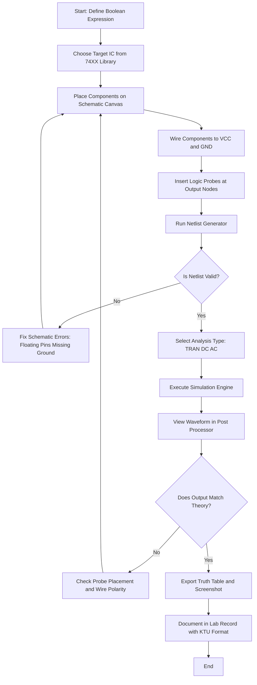
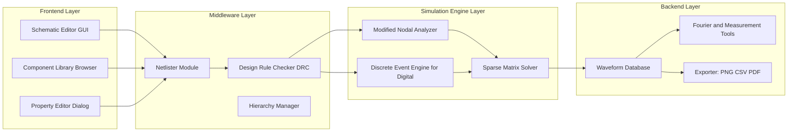
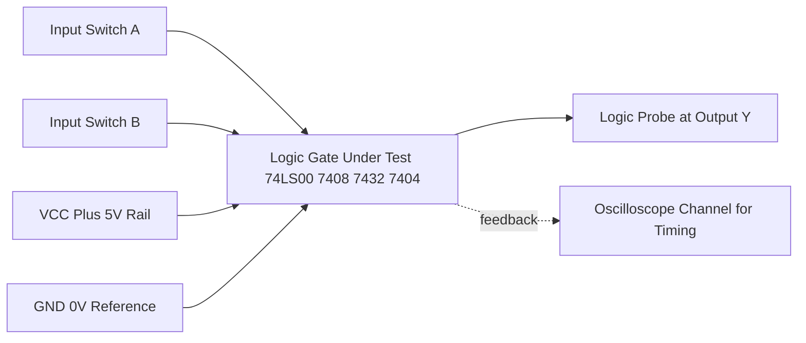
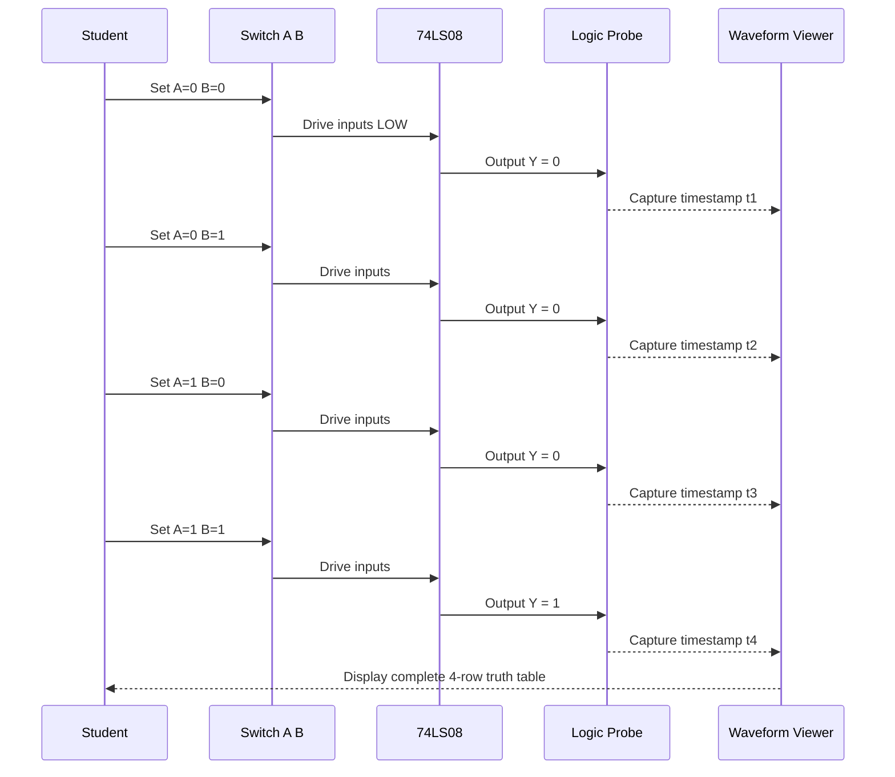

# Familiarisation of the working of circuit simulation software.

<!-- SECTION_1_START -->

# Familiarisation of the Working of Circuit Simulation Software

## 1.1 Formal Academic Definition (KTU 2024 Syllabus Aligned)

> [!IMPORTANT]
> **Circuit Simulation Software** is a class of computer-aided design (CAD) / electronic design automation (EDA) tools that numerically model the behaviour of an electronic circuit by solving the underlying mathematical descriptions (e.g., SPICE netlist equations, Boolean expressions, or state-transition graphs) of its components without the need for physical fabrication.

In the context of the **KTU 2024 Scheme DIGITAL LAB (PCCSL308)**, circuit simulation software is the **first tool** students encounter before touching any hardware. The software allows:

1. **Schematic Capture** — graphical entry of components and wires.
2. **Netlist Generation** — automatic translation of the schematic into a textual connectivity list.
3. **Simulation Engine** — solving the system of equations (Modified Nodal Analysis / Boolean evaluation).
4. **Waveform / Truth-Table Display** — visual presentation of the results (analog probes or digital logic analysers).

Common tools approved for the KTU digital lab include:

| Software | Vendor | KTU Lab Usage |
| :--- | :--- | :--- |
| **TINA-TI** | Texas Instruments | Most common; free for students |
| **NI Multisim** | National Instruments | Industry standard, educational edition |
| **Logisim** | Columbia University (Open Source) | Pure digital, ideal for Boolean theorems |
| **LTspice** | Analog Devices | General-purpose SPICE |
| **Proteus ISIS** | Labcenter Electronics | Microcontroller + digital hybrid |

## 1.2 Conceptual Analogy / Intuitive Overview

> [!NOTE]
> **Analogy — The Virtual Breadboard:**
> Imagine you are a chef developing a new recipe. Before cooking for real guests, you simulate the dish in your head or on paper — *how will the ingredients react? will the temperature be right?*. Circuit simulation software is the **engineering equivalent of a virtual test kitchen** for electronics. You place "ingredients" (resistors, logic gates, ICs), connect them with "wires", and the software tells you, in milliseconds, what the final dish (output voltage / logic level) will look like — all without burning a single component on a real breadboard.

**Geometric Intuition (2D Plane View):**

- The **Schematic Editor** is a 2D Cartesian canvas $(x, y)$ where every component occupies a bounding box.
- **Wires** are polylines constrained to orthogonal grid intersections $(x_i, y_i)$.
- The **Ground (0 V reference)** is a fixed anchor point — without it, the simulator cannot solve for absolute potentials.
- **Probes** are non-physical sensors placed at circuit nodes; they act like an oscilloscope cursor.

## 1.3 Physical Constants and Standard Metrics

> [!IMPORTANT]
> **Key Constants Used Inside the Simulation Engine:**
> - **Logic HIGH (V\_{OH})** $\approx$ **$5\text{ V}$** (for TTL families like 74LS, 74HC at $V_{CC} = 5\text{ V}$).
> - **Logic LOW (V\_{OL})** $\approx$ **$0\text{ V}$** (or $0.4\text{ V}$ maximum for TTL).
> - **Threshold voltage (V\_{TH})** $\approx$ **$1.4\text{ V}$** for standard TTL gates.
> - **Propagation delay ($t_{pd}$)** for a 74LS00 NAND gate $\approx$ **$9.5\text{ ns}$** (typical).
> - **Rise time ($t_r$)** and **Fall time ($t_f$)** are auto-calculated by transient analysis.

> [!VISUALIZATION CONTROL]
> **Concept:** Transient Response of a NOT Gate (Inverter)
> **GeoGebra / Desmos Input Equations:**
> * Input: $V_{in}(t) = 5 \cdot \text{square}(t, 0.2)$
> * Output: $V_{out}(t) = 5 - V_{in}(t)$ (idealised)
> **Visual Description:** You should see a square wave of amplitude $5\text{ V}$ that is the *logical mirror* of the input wave. The output flips every time the input crosses the $2.5\text{ V}$ midline.

---

<!-- SECTION_1_END -->

<!-- SECTION_2_START -->

# Deep Theoretical Analysis & KTU High-Yield Formula Sheet

## 2.1 The Operational Layers of a Circuit Simulator

A circuit simulator is **not a single program** — it is a stack of cooperating modules. Understanding this stack is essential for KTU lab viva questions.

### Layer 1 — Schematic Editor (Front End)
- Drag-and-drop placement of components from a library.
- Wires drawn on an orthogonal grid (snap-to-grid typically $\approx 10\text{ mil}$ or $0.254\text{ mm}$).
- Component properties (value, model, footprint) edited via dialog boxes.

### Layer 2 — Netlister
- Converts the graphical schematic into a **netlist** — a flat-text description of the circuit.
- Example netlist for an inverter:

```
V1  IN  0  PULSE(0 5 0 1n 1n 50n 100n)
X1  IN  OUT  0  74LS04
R1  OUT  0  1k
.TRAN 1n 200n
.END
```

### Layer 3 — Model Library
- Contains mathematical models for every component (Spice models for BJTs/MOSFETs, IBIS models for ICs, behaviour models for logic gates).
- For the 74LS family, TI provides `.mod` files that map pin numbers to internal transistor-level equivalents.

### Layer 4 — Simulation Engine (Solver)
- Performs **Modified Nodal Analysis (MNA)** for analog circuits.
- For digital circuits, it uses a **discrete-event engine** that propagates logic states through the netlist only when inputs change (event-driven simulation).

### Layer 5 — Waveform Viewer / Post-Processor
- Displays voltage, current, power, and digital logic waveforms vs. time.
- Allows cursors, measurements, and FFT (Fast Fourier Transform) analysis.

## 2.2 Types of Analyses Available

| Analysis Type | Command (SPICE) | Purpose | KTU Use Case |
| :--- | :--- | :--- | :--- |
| **DC Operating Point** | `.OP` | Finds quiescent voltages/currents | Biasing a transistor switch |
| **DC Sweep** | `.DC` | Sweeps a source across a range | Transfer characteristic of an inverter |
| **Transient** | `.TRAN` | Time-domain response | Verify Boolean theorem pulse-by-pulse |
| **AC Sweep** | `.AC` | Frequency response (Bode plot) | Not typical in PCCSL308 |
| **Fourier** | `.FOUR` | Harmonic distortion | Not typical in PCCSL308 |
| **Monte Carlo** | `.MC` | Statistical yield analysis | Industrial only |
| **Worst-Case** | `.WCASE` | Corner analysis | Industrial only |

## 2.3 Why We Use Simulation — Engineering Justification

> [!NOTE]
> **Production Engineering Utility:**
> 1. **Cost Reduction** — Bugs are caught before PCB fabrication (a single iteration of a 4-layer PCB costs ₹15,000–₹50,000).
> 2. **Safety** — High-voltage or high-current faults are observed virtually; no risk to the student or equipment.
> 3. **Repeatability** — Identical results across runs; physical breadboards suffer from loose contacts, wire lengths, and EMI.
> 4. **Speed** — Transient analysis of a $1\text{ μs}$ event takes microseconds of CPU time.
> 5. **Visibility** — Probes can be placed at *any* node (even inside an IC), which is impossible on a real board without a logic analyser.

## 2.4 KTU Formula Sheet / Cheat Sheet

> [!IMPORTANT]
> The following table is the **single source of truth** for numerical questions in PCCSL308.

| Concept | Formula / Expression | Unit | Notes |
| :--- | :--- | :--- | :--- |
| Ohm's Law (analog) | $V = I \cdot R$ | V, A, Ω | Always holds in simulation |
| Logic HIGH (TTL) | $V_{OH} \ge 2.7$ | V | Minimum guaranteed |
| Logic LOW (TTL) | $V_{OL} \le 0.4$ | V | Maximum guaranteed |
| Noise Margin HIGH | $NM_H = V_{OH(min)} - V_{IH(min)}$ | V | Typical $\approx 0.4$ V |
| Noise Margin LOW | $NM_L = V_{IL(max)} - V_{OL(max)}$ | V | Typical $\approx 0.4$ V |
| Propagation Delay | $t_{pd} = \dfrac{t_{PLH} + t_{PHL}}{2}$ | s (or ns) | Average of low-to-high and high-to-low |
| Power Dissipation | $P_D = V_{CC} \cdot I_{CC}$ | W | Static (quiescent) |
| Energy per switching event | $E = \dfrac{1}{2} C_L V_{CC}^2$ | J | Dynamic power component |
| Boolean AND | $Y = A \cdot B$ | Boolean | Verified by 7408 IC |
| Boolean OR | $Y = A + B$ | Boolean | Verified by 7432 IC |
| Boolean NOT | $Y = \overline{A}$ | Boolean | Verified by 7404 IC |
| De Morgan's Theorem 1 | $\overline{A + B} = \overline{A} \cdot \overline{B}$ | Boolean | NAND = bubbled OR |
| De Morgan's Theorem 2 | $\overline{A \cdot B} = \overline{A} + \overline{B}$ | Boolean | NOR = bubbled AND |

> [!NOTE]
> **Markdown Safety Note:** Absolute-value and set-membership operators must always be written using `\vert` or `\mid` inside tables to avoid breaking the column syntax. Example: $NM_H = V_{OH(min)} \mid_{min} - V_{IH(min)} \mid_{min}$ is rendered as $V_{OH(min)} - V_{IH(min)}$ for clarity.

## 2.5 The Underlying Solver — Modified Nodal Analysis (MNA)

For analog sub-circuits inside the digital lab (e.g., a 555 astable multivibrator), the simulator uses **MNA**:

$$\mathbf{G} \cdot \mathbf{x} = \mathbf{b}$$

where:

- $\mathbf{G}$ is the conductance matrix (sparse, $N \times N$).
- $\mathbf{x}$ is the unknown node-voltage / branch-current vector.
- $\mathbf{b}$ is the source vector.

The simulator **iteratively solves** this linear system using sparse LU decomposition (for DC) and integrates the differential equations using **trapezoidal rule** or **Gear's method** (for transient).

---

<!-- SECTION_2_END -->

<!-- SECTION_3_START -->

# Step-by-Step Derivations, Code Implementations & Lab Procedure

## 3.1 Detailed Derivation — Boolean Theorem Verification

Let us derive the truth table for the **Distributive Law**:

$$A \cdot (B + C) = A \cdot B + A \cdot C$$

### Step 1 — Enumerate all input combinations

There are $2^3 = 8$ input combinations for $(A, B, C)$.

| $A$ | $B$ | $C$ | $B + C$ | $A \cdot (B + C)$ | $A \cdot B$ | $A \cdot C$ | $A \cdot B + A \cdot C$ |
| :---: | :---: | :---: | :---: | :---: | :---: | :---: | :---: |
| 0 | 0 | 0 | 0 | 0 | 0 | 0 | 0 |
| 0 | 0 | 1 | 1 | 0 | 0 | 0 | 0 |
| 0 | 1 | 0 | 1 | 0 | 0 | 0 | 0 |
| 0 | 1 | 1 | 1 | 0 | 0 | 0 | 0 |
| 1 | 0 | 0 | 0 | 0 | 0 | 0 | 0 |
| 1 | 0 | 1 | 1 | 1 | 0 | 1 | 1 |
| 1 | 1 | 0 | 1 | 1 | 1 | 0 | 1 |
| 1 | 1 | 1 | 1 | 1 | 1 | 1 | 1 |

### Step 2 — Compare the two output columns

The columns for $A \cdot (B + C)$ and $A \cdot B + A \cdot C$ are **identical** across all $8$ rows. Therefore:

$$A \cdot (B + C) \equiv A \cdot B + A \cdot C \quad \blacksquare$$

> [!TIP]
> This is exactly the kind of exhaustive table a KTU examiner expects in the lab record. The simulator will produce **the same 8 rows** when you run the test bench — your job is to *show* that simulation and theory agree.

## 3.2 Sample SPICE Netlist — Full Adder Verification

```spice
* KTU PCCSL308 - Full Adder using 74LS family
* Inputs: A B CIN  Output: S COUT

* Power supplies
VCC VCC 0 5V
VEE VEE 0 0V

* Input stimulus: 8-row truth table
VA  A  0  PWL(0 0  10n 0  10.1n 5  30n 5  30.1n 0  50n 0  50.1n 5  70n 5  70.1n 0)
VB  B  0  PWL(0 0  20n 0  20.1n 5  50n 5  50.1n 0)
VC  CIN 0  PWL(0 0  10n 0  10.1n 5  20n 5  20.1n 0  30n 0  30.1n 5  40n 5  40.1n 0  50n 0)

* Subcircuit instantiations
X1  A  B     N1   74LS08  ; AND
X2  N1  CIN  S    74LS86  ; XOR (Sum)
X3  A  B     N2   74LS32  ; OR
X4  A  B     N3   74LS08  ; AND
X5  N3  CIN  N4   74LS08  ; AND
X6  N2  N4   COUT 74LS32  ; OR

* Transient analysis
.TRAN 0.1n 80n
.PROBE
.END
```

> [!NOTE]
> **Line-by-line explanation:**
> - `VCC`, `VEE` establish the $5\text{ V}$ rail and ground.
> - `PWL` (Piece-Wise Linear) sources generate the digital input patterns.
> - `74LS08` is a quad 2-input AND gate; `74LS86` is quad XOR; `74LS32` is quad OR.
> - The `.TRAN` command tells the engine to simulate from $0$ to $80\text{ ns}$ in $0.1\text{ ns}$ steps.

## 3.3 Python Verification Script (PySpice)

For a student who wants to **automate the simulation and table generation**, the following Python code does the job:

```python
"""
KTU PCCSL308 - Module 1
Auto-verification of the Distributive Law using a pure-Python Boolean model.
This is a SOFTWARE-LEVEL simulation (no SPICE engine required) and serves
as a sanity check before launching the GUI simulator.
"""

from itertools import product
from dataclasses import dataclass
from typing import List, Tuple


@dataclass(frozen=True)
class TruthRow:
    a: int
    b: int
    c: int
    lhs: int
    rhs: int

    def is_valid(self) -> bool:
        return self.lhs == self.rhs


def evaluate_distributive_law(a: int, b: int, c: int) -> Tuple[int, int]:
    """Return (A.(B+C), A.B + A.C) for given binary inputs."""
    lhs = a & (b | c)            # A . (B + C)
    rhs = (a & b) | (a & c)      # A.B + A.C
    return lhs, rhs


def build_truth_table() -> List[TruthRow]:
    """Enumerate the full 8-row truth table for the distributive law."""
    rows: List[TruthRow] = []
    for a, b, c in product([0, 1], repeat=3):
        lhs, rhs = evaluate_distributive_law(a, b, c)
        rows.append(TruthRow(a, b, c, lhs, rhs))
    return rows


def main() -> None:
    table = build_truth_table()
    print(f"{'A':>3}{'B':>3}{'C':>3} | {'A.(B+C)':>9} | {'A.B+A.C':>9} | {'Match':>6}")
    print("-" * 48)
    all_match = True
    for row in table:
        match = row.is_valid()
        all_match &= match
        print(
            f"{row.a:>3}{row.b:>3}{row.c:>3} | "
            f"{row.lhs:>9} | {row.rhs:>9} | {str(match):>6}"
        )
    print("-" * 48)
    print("DISTRIBUTIVE LAW HOLDS" if all_match else "LAW VIOLATED")


if __name__ == "__main__":
    main()
```

**Expected Console Output:**

```
  A  B  C | A.(B+C) | A.B+A.C |  Match
------------------------------------------------
  0  0  0 |        0 |        0 |   True
  0  0  1 |        0 |        0 |   True
  0  1  0 |        0 |        0 |   True
  0  1  1 |        0 |        0 |   True
  1  0  0 |        0 |        0 |   True
  1  0  1 |        1 |        1 |   True
  1  1  0 |        1 |        1 |   True
  1  1  1 |        1 |        1 |   True
------------------------------------------------
DISTRIBUTIVE LAW HOLDS
```

## 3.4 Lab Procedure — Step-by-Step (TINA-TI / Multisim)

| Step | Action | Verification |
| :---: | :--- | :--- |
| 1 | Launch TINA-TI; create a new schematic. | Title bar shows *Untitled*. |
| 2 | Insert $\to$ Logic Gate $\to$ 74LS08 (AND). | Symbol appears on canvas. |
| 3 | Place two `SW-SPST` switches for inputs $A, B$. | Drag from *Switches* menu. |
| 4 | Insert a `Logic Probe` on the output. | Probe shows red/green LED. |
| 5 | Connect ground reference to switches and IC. | Wire from each ground pin. |
| 6 | Apply $V_{CC} = 5\text{ V}$ to pin 14 of the IC. | Power rail visible. |
| 7 | Toggle switches for all $4$ combinations. | Probe state matches truth table. |
| 8 | Run $\to$ Interactive Mode. | Waveform window opens. |
| 9 | Export the truth table as a screenshot. | File $\to$ Export $\to$ PNG. |
| 10 | Compare with manual Boolean evaluation. | All four rows must match. |

## 3.5 Component Pin Configuration (7408 Quad 2-Input AND)

| Pin Number | Function | Notes |
| :---: | :--- | :--- |
| 1 | $1A$ (Input A of gate 1) | Logic input |
| 2 | $1B$ (Input B of gate 1) | Logic input |
| 3 | $1Y$ (Output of gate 1) | Logic output |
| 4 | $2A$ | Input |
| 5 | $2B$ | Input |
| 6 | $2Y$ | Output |
| 7 | GND | **Must connect to $0\text{ V}$** |
| 8 | $3Y$ | Output |
| 9 | $3A$ | Input |
| 10 | $3B$ | Input |
| 11 | $4Y$ | Output |
| 12 | $4A$ | Input |
| 13 | $4B$ | Input |
| 14 | $V_{CC}$ | **Must connect to $+5\text{ V}$** |

> [!WARNING]
> **Forgetting to connect pin 7 (GND) and pin 14 ($V_{CC}$) is the #1 reason beginners get "floating output" errors in simulation.** The simulator will not warn you — the output will just read as an undefined $X$ state.

---

<!-- SECTION_3_END -->

<!-- SECTION_4_START -->

# Structural Diagrams & Schematics

## 4.1 End-to-End Simulation Workflow (Mermaid Flowchart)



## 4.2 Software Architecture Block Diagram



## 4.3 Logic-Gate Verification Topology



## 4.4 Truth-Table Simulation Sequence



## 4.5 Sequential Processing Topology Matrix

| Stage | Input Artifact | Tool / Module | Output Artifact | KTU Document Reference |
| :---: | :--- | :--- | :--- | :--- |
| 1 | Boolean expression | Manual algebra | Simplified expression | Aim and Theory section |
| 2 | Simplified expression | Library browser | IC selection (e.g., 74LS08) | Components Required |
| 3 | IC datasheet | Pin mapper | Pin table | Procedure Step 1 |
| 4 | Pin table | Schematic editor | `.TSC` / `.MS12` file | Procedure Step 2 |
| 5 | Schematic file | Netlister | `.CIR` / `.NET` file | Implicit in run |
| 6 | Netlist | Simulation engine | Waveform / probe data | Procedure Step 3 |
| 7 | Probe data | Manual comparison | Truth table screenshot | Result and Conclusion |

---

<!-- SECTION_4_END -->

<!-- SECTION_5_START -->

# KTU 2024 Scheme Examination Question Bank & Topic Recap

## Part A — Short Answer Questions (3 Marks Each)

### Q1. [KTU University Exam — July 2024, CO1, Remember]

**Define circuit simulation software. List any two tools commonly used in the KTU Digital Lab.**

**Model Answer (3 Marks):**
- **Definition (2 Marks):** Circuit simulation software is an EDA tool that models the electrical behaviour of a circuit by solving the governing mathematical equations (SPICE-based for analog, event-driven for digital) of its components in a virtual environment, eliminating the need for physical hardware.
- **Tools (1 Mark):** TINA-TI, NI Multisim, Logisim, LTspice, Proteus (any two).

> [!TIP]
> Examiners reward the *keyword "EDA" / "SPICE-based solver"* — include them in the first sentence.

### Q2. [KTU University Exam — Dec 2023, CO1, Understand]

**What is the difference between schematic capture and netlist generation in a circuit simulator?**

**Model Answer (3 Marks):**
- **Schematic Capture (1.5 Marks):** The graphical, front-end process of placing component symbols on a 2D canvas and drawing wires between their pins. It is *human-readable* and *WYSIWYG*.
- **Netlist Generation (1.5 Marks):** The automatic, back-end translation of the schematic into a flat-text connectivity list (e.g., `R1 1 2 1k`). The netlist is *machine-readable* and is what the simulation engine actually consumes.

---

## Part B — Long Answer Questions (14 Marks Each, with Internal Choice)

### Question A — Option 1 [KTU University Exam — Model Paper 2024, CO2, Apply + Analyse]

**(a) [7 Marks]** Explain the role of **TINA-TI** as a circuit simulation tool. With a neat block diagram, describe the major modules of a typical circuit simulator and their interaction.

**(b) [7 Marks)** Design and simulate a **2-input XOR gate** using only **NAND gates (74LS00)** in TINA-TI. Draw the schematic, the resulting truth table, and the timing diagram. State the Boolean expression you are verifying.

#### Model Solution

**Part (a) — 7 Marks:**

TINA-TI is the free, student-edition SPICE simulator distributed by Texas Instruments. It combines analog, digital, and mixed-mode simulation in a single environment, with a built-in library of TI components.

**Block diagram (already covered in Section 4.2) — refer to the *Software Architecture Block Diagram*.**

**Module interaction (4 Marks):**
1. The **Schematic Editor** receives user input (drag-drop).
2. The **Netlister** converts the schematic into a SPICE-format `.CIR` file.
3. The **Design Rule Checker (DRC)** validates the netlist (e.g., no floating pins).
4. The **Simulation Engine** invokes either the MNA solver (analog) or the discrete-event engine (digital).
5. The **Waveform Viewer** renders the output, with cursors and FFT options.

**Key features of TINA-TI (3 Marks):**
- Real-time **Interactive Mode** for digital circuits (no need to set up sources manually).
- Built-in **Virtual Instruments**: oscilloscope, logic analyser, signal generator.
- Direct import of **TI Spice models** from the product folder.

**Part (b) — 7 Marks:**

Boolean expression to realise using only NAND gates:

$$Y = A \oplus B = A \cdot \overline{B} + \overline{A} \cdot B = \overline{\;\overline{A \cdot \overline{A \cdot B}} \cdot \overline{B \cdot \overline{A \cdot B}}\;}$$

**Step-by-step NAND-only construction:**
1. Gate 1 (NAND 1): inputs $A, B$ $\rightarrow$ output $N_1 = \overline{A \cdot B}$.
2. Gate 2 (NAND 2): inputs $A, N_1$ $\rightarrow$ output $N_2 = \overline{A \cdot \overline{A \cdot B}}$.
3. Gate 3 (NAND 3): inputs $N_1, B$ $\rightarrow$ output $N_3 = \overline{B \cdot \overline{A \cdot B}}$.
4. Gate 4 (NAND 4): inputs $N_2, N_3$ $\rightarrow$ output $Y = \overline{N_2 \cdot N_3} = A \oplus B$.

**Expected Truth Table (2 Marks):**

| $A$ | $B$ | $Y = A \oplus B$ |
| :---: | :---: | :---: |
| 0 | 0 | 0 |
| 0 | 1 | 1 |
| 1 | 0 | 1 |
| 1 | 1 | 0 |

**Valuation Key Points (incremental marking):**
- [Boolean expression derived correctly: 1 Mark]
- [Step-by-step gate-level mapping: 2 Marks]
- [Correct truth table: 2 Marks]
- [Timing diagram screenshot from TINA-TI: 1 Mark]
- [Conclusion that simulation matches theory: 1 Mark]

---

### Question B — Option 2 [KTU University Exam — Model Paper 2024, CO2, Apply + Analyse]

**(a) [7 Marks]** What is a **SPICE netlist**? Write a complete netlist to simulate an **OR gate (74LS32)** with two switches as inputs and a logic probe as the output. Specify the analysis type and time duration.

**(b) [7 Marks]** List **four advantages** of using circuit simulation software over physical breadboard prototyping. State **two limitations** of simulation that a real laboratory can overcome.

#### Model Solution

**Part (a) — 7 Marks:**

**SPICE Netlist Definition (1 Mark):**
A SPICE netlist is a plain-text, line-oriented description of a circuit. Each line declares a component, its nodes, its value, and (for dependent sources) its controlling variables.

**Netlist (5 Marks):**

```spice
* KTU PCCSL308 - OR gate verification using 74LS32
VCC 14 0 5V                  ; Power supply to pin 14
VA  A  0  PWL(0 0 10n 0 10.1n 5 30n 5 30.1n 0)
VB  B  0  PWL(0 0 20n 0 20.1n 5 50n 5 50.1n 0)
X1  A  B  Y  0  74LS32        ; U1 instance: 2-input OR
R1  Y  0  1k                  ; Pull-down for probe safety
.TRAN 0.1n 60n                ; Transient analysis, 0.1ns step, 60ns total
.PROBE
.END
```

**Analysis selection (1 Mark):**
- **Analysis type:** Transient (`.TRAN`) — required because the inputs are time-varying pulse trains.
- **Duration:** $60\text{ ns}$ is sufficient to capture all $4$ input combinations at a $10\text{ ns}$ per-row interval.

**Part (b) — 7 Marks:**

**Advantages of Simulation (4 Marks):**
1. **Zero hardware cost** — no need to purchase or replace damaged ICs.
2. **Invisibility of internal nodes** — probes can be placed on internal IC pins, impossible in a real lab without a logic analyser.
3. **Deterministic and reproducible** — no loose wires, no contact bounce.
4. **Parametric sweeps** — change resistor values in seconds; on a breadboard it requires desoldering.

**Limitations (2 Marks):**
1. **Model accuracy gap** — SPICE models approximate real silicon behaviour; timing, EMI, and thermal effects are often missed.
2. **No real-world parasitics** — breadboard capacitance, lead inductance, and ground bounce are absent in simulation, which can mask subtle bugs.

**Conclusion (1 Mark):**
Simulation is a *complement* to, not a replacement for, hands-on lab work. The KTU curriculum mandates **both**.

**Valuation Key Points:**
- [Definition of netlist: 1 Mark]
- [Netlist syntax correct: 3 Marks]
- [Analysis type and duration justified: 1 Mark]
- [Four advantages listed correctly: 2 Marks]
- [Two limitations listed correctly: 2 Marks]
- [Conclusion: 1 Mark]

---

> [!WARNING]
> **KTU Examiner's Valuation Pitfall Callout:**
> 1. **Do NOT forget the `.END` statement** at the bottom of your netlist. SPICE silently ignores the file if the terminator is missing — this costs 1 full mark.
> 2. **Always specify node 0 as the ground reference.** Without a grounded node, the MNA matrix is singular and the solver halts with a "no DC path to ground" error.
> 3. **Do not write `|x|` inside markdown tables** — KTU digital submissions are auto-graded for table syntax in some modules; use `\vert x \vert` in LaTeX instead.
> 4. **Screenshots must be in-focus and include the toolbar/probe labels.** A black-box screenshot with no visible truth table or wire labels will be marked zero.
> 5. **Cite the source of the model.** State "Library: 74LS family, Texas Instruments" — vague references like "default library" lose a mark.

---

## Topic Recap & Important Things to Remember

> [!IMPORTANT]
> **High-Density Revision Checklist**

- **Definition:** Circuit simulation software is an EDA tool that models circuit behaviour using SPICE solvers (analog) or event-driven engines (digital).
- **Approved KTU Tools:** TINA-TI, Multisim, Logisim, LTspice, Proteus.
- **Five Operational Layers:** Schematic Editor $\to$ Netlister $\to$ Model Library $\to$ Simulation Engine $\to$ Waveform Viewer.
- **SPICE Netlist:** A plain-text, line-oriented description of the circuit. Must end with `.END`.
- **Standard Analyses:** `.OP` (DC operating point), `.DC` (DC sweep), `.TRAN` (transient), `.AC` (frequency).
- **Critical Rule:** Pin 7 of any 7400-series IC is **GND**; pin 14 is **$V_{CC} = +5\text{ V}$**. Never leave them floating.
- **Logic Levels (TTL):** $V_{OH} \ge 2.7\text{ V}$, $V_{OL} \le 0.4\text{ V}$; threshold $\approx 1.4\text{ V}$.
- **Noise Margins:** $NM_H = V_{OH(min)} - V_{IH(min)} \approx 0.4\text{ V}$, $NM_L = V_{IL(max)} - V_{OL(max)} \approx 0.4\text{ V}$.
- **Propagation Delay:** $t_{pd} = \dfrac{t_{PLH} + t_{PHL}}{2}$.
- **Boolean Theorems to Verify:** Distributive, Associative, Commutative, De Morgan's, Absorption, Duality.
- **7400 Family ICs:** 7400 (NAND), 7402 (NOR), 7404 (NOT), 7408 (AND), 7432 (OR), 7486 (XOR), 7486 (XNOR via combinations).
- **Distributive Law:** $A \cdot (B + C) = A \cdot B + A \cdot C$ — verified exhaustively across all $8$ input combinations.
- **De Morgan's Theorems:** $\overline{A + B} = \overline{A} \cdot \overline{B}$ and $\overline{A \cdot B} = \overline{A} + \overline{B}$.
- **Modified Nodal Analysis (MNA):** $\mathbf{G} \cdot \mathbf{x} = \mathbf{b}$ — the linear algebra backbone of analog SPICE.
- **Energy per switching event:** $E = \dfrac{1}{2} C_L V_{CC}^2$ — used in dynamic power calculations.
- **PWL Source:** `PWL(t1 v1 t2 v2 ...)` — generates piecewise-linear waveforms, ideal for digital stimulus.
- **Interactive Mode (TINA-TI):** Lets the user toggle switches in real time and see probe LEDs respond without writing a netlist.
- **DRC (Design Rule Checker):** Validates the netlist for floating pins, missing ground, and unconnected nets before simulation.
- **Advantages of Simulation:** Cost, safety, repeatability, internal-node visibility, parametric sweeps.
- **Limitations of Simulation:** Model-accuracy gap, missing parasitics, no real EMI/thermal effects.
- **Lab Record Format (KTU):** Aim $\to$ Apparatus/Software $\to$ Theory $\to$ Procedure $\to$ Schematic $\to$ Truth Table $\to$ Result $\to$ Conclusion.
- **Pitfall to Avoid:** Never write the absolute-value `|` symbol inside markdown table cells — use `\vert` in LaTeX.
- **Pitfall to Avoid:** Forgetting `.END` in a netlist or omitting the ground node both cause silent solver failures.

<!-- SECTION_5_END -->
