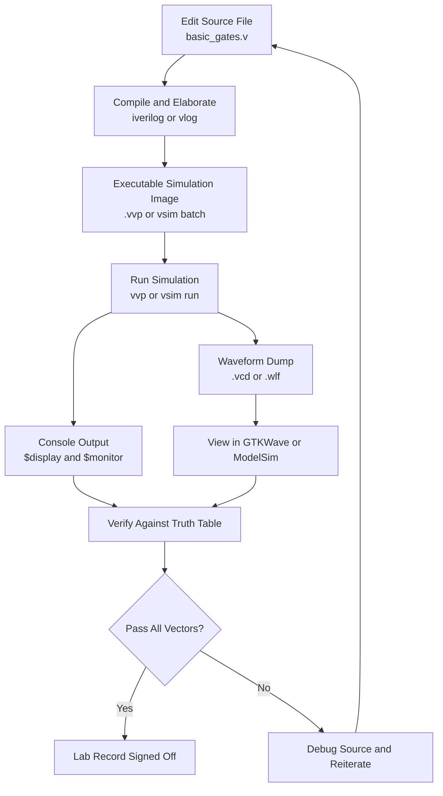
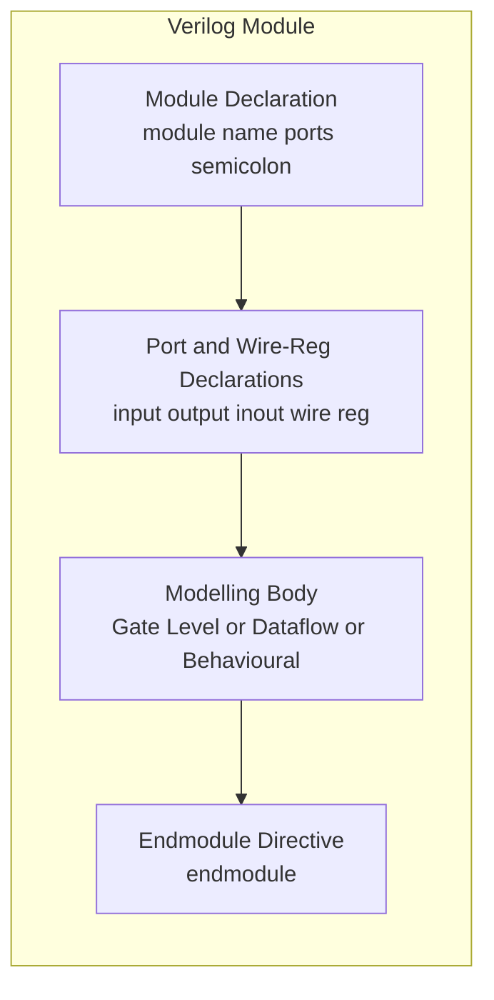
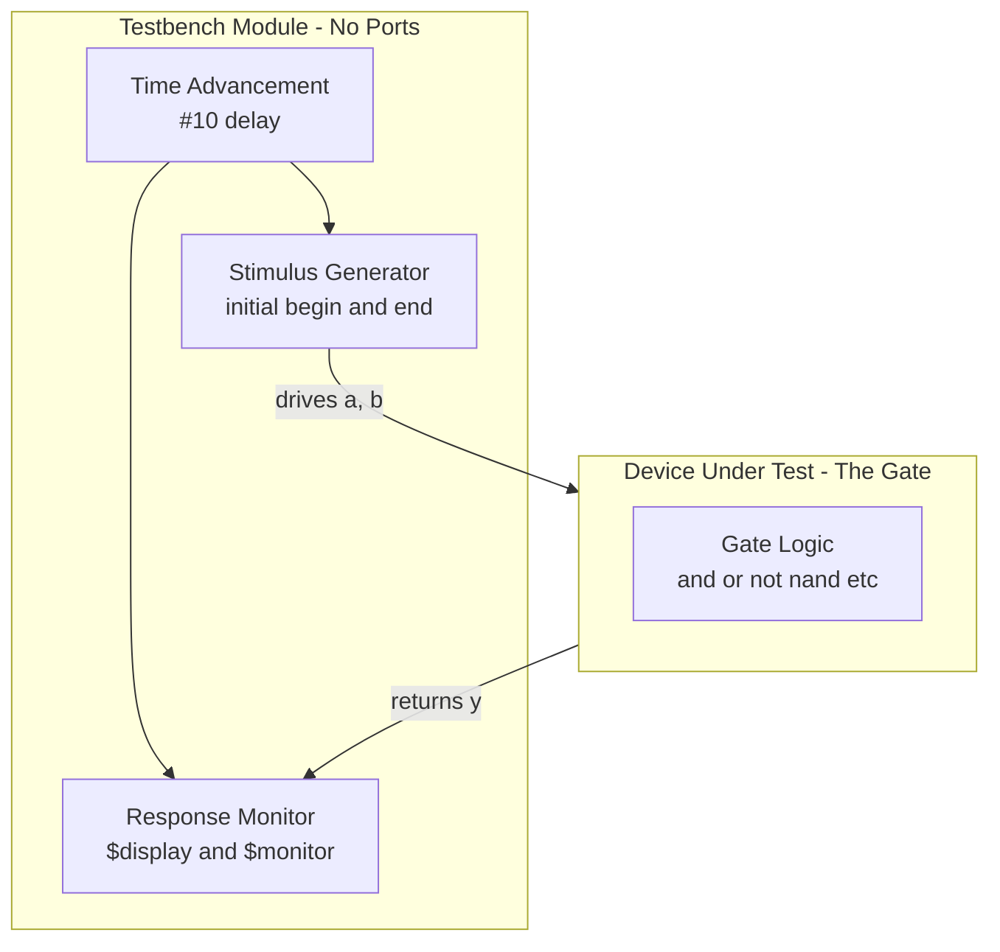
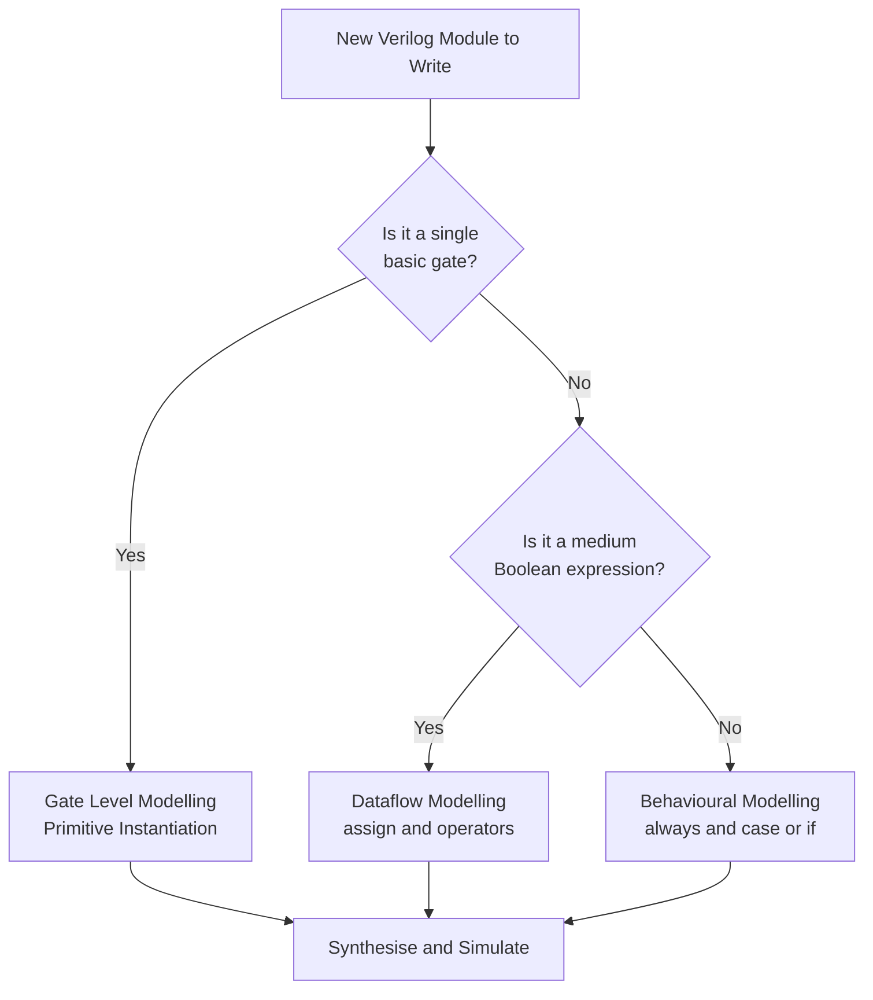

# Familiarisation of Verilog HDL - Modelling of the basic gates using

<!-- SECTION_1_START -->
# 1. Core Technical Definition & Intuitive Overview

## 1.1 Formal Academic Definition

> [!IMPORTANT]
> **Verilog HDL (IEEE Standard 1364)** is a **Hardware Description Language** used to model, simulate, synthesise, and verify digital electronic systems at multiple levels of abstraction. In the context of **KTU PCCSL308 (Digital Lab) Module 1**, Verilog is the *software twin* of the hardware gates studied on the breadboard — the same Boolean function implemented with **74LS** series ICs is rewritten as text-based code that a synthesiser converts back into real silicon.

In KTU's 2024 scheme lab curriculum, you are expected to demonstrate three legitimate ways (also called *modelling styles* or *abstraction levels*) to describe a digital gate:

1. **Gate-Level (Structural) Modelling** — instantiating primitive gates such as `and`, `or`, `not`, `nand`, `nor`, `xor`, `xnor`.
2. **Dataflow Modelling** — using continuous assignment statements with operators (`&`, `|`, `~`, `^`).
3. **Behavioural Modelling** — using procedural blocks (`always`) with conditional/case constructs that mimic the truth table.

> [!NOTE]
> **Syllabus Highlight (PCCSL308 / 2024 Scheme):** *"Familiarisation of Verilog HDL – Modelling of the basic gates using Verilog."* The expected deliverables in the lab record are: a **working `.v` source file**, a **testbench**, and a **simulated waveform** (using *Icarus Verilog / ModelSim / Vivado XSim*) confirming the truth table of the gate.

## 1.2 Conceptual Analogy & Intuition

Think of Verilog modelling as **three different languages describing the same recipe for a dish**:

- **Gate-level** is the *ingredient-by-ingredient recipe* — "take 2 tomatoes, chop them, mix." Each primitive is a pre-built ingredient.
- **Dataflow** is the *equation on the back of the cookbook* — "Saltiness = Sodium × Concentration." You write the Boolean expression directly.
- **Behavioural** is the *chef's intuition* — "If the salt is low, add more. If it's high, balance with sugar." You describe the *what*, not the *how*.

All three cook the **same dish** (the same logic function) — they just expose different layers of detail to the reader and to the synthesiser.

> [!TIP]
> **Geometric / Visual Intuition:** Picture a 2-input AND gate as a series circuit of **two switches** controlling **one bulb**. A truth-table column is just a *mapping* from the switch positions to the bulb's state. Verilog's three modelling styles are simply three *notations* for the same mapping.

## 1.3 Standard Symbols You Must Recognise

The following primitive symbols form the alphabet of every Verilog gate-level description. Memorise their IEEE/ANSI shapes and their Verilog keyword.

| Gate | ANSI Distinctive-Shape Symbol | Verilog Keyword |
| :--- | :--- | :--- |
| AND | Flat back, rounded front, **D**-shape body | `and` |
| OR | Curved back with pointed back, **pointed** front | `or` |
| NOT | Triangle with bubble | `not` |
| NAND | AND + small circle at output | `nand` |
| NOR | OR + small circle at output | `nor` |
| XOR | OR with extra curved back line | `xor` |
| XNOR | XOR + small circle at output | `xnor` |
| BUFFER | Triangle (no bubble) | `buf` |

> [!VISUALIZATION CONTROL]
> **Concept:** Truth-table column rendered as a discrete Cartesian plot for a 2-input AND gate.
> **Desmos / GeoGebra Input Equations (place four discrete points):**
> * $P_1 = (0,\ 0)$
> * $P_2 = (1,\ 0)$
> * $P_3 = (2,\ 0)$
> * $P_4 = (3,\ 1)$
>
> **Visual Description:** On a coordinate plane where the x-axis is the integer interpretation of the input vector $\{A,B\}$ in binary ($00=0$, $01=1$, $10=2$, $11=3$) and the y-axis is the output $Y$, only the point $(3,1)$ — corresponding to $A=1, B=1$ — lies at the upper level. The other three points lie on the x-axis. This "staircase" is the unique geometric signature of the AND function.

<!-- SECTION_1_END -->

<!-- SECTION_2_START -->
# 2. Deep Theoretical Analysis & KTU High-Yield Formula Sheet

## 2.1 The Anatomy of a Verilog Module

Every Verilog file (extension `.v`) is a collection of one or more **modules**. A module is a black-box with a name, a list of ports, and a body describing its function.

```verilog
module <module_name> (<port_list>);
    // ---- Declarations ----
    input  <port_type>  <port_name>;
    output <port_type>  <port_name>;
    // (inout for bidirectional, e.g. bus pins)

    // ---- Modelling Body ----
    // Style 1: Gate-level primitives
    // Style 2: Continuous assignment  assign y = expr;
    // Style 3: Procedural block      always @(*) y = expr;
endmodule
```

**Port Direction Rules (Board-Favourite Pitfall):**
- `input`  → driven from *outside* the module.
- `output` → driven *inside* the module.
- `inout`  → bidirectional (used in bus protocols such as I²C, not in basic-gate modelling).

## 2.2 The Three Modelling Styles — Master Comparison

> [!NOTE]
> The following table is the single most-tested concept for Module 1 viva and Part-A questions. Commit it to memory.

| Aspect | Gate-Level (Structural) | Dataflow | Behavioural |
| :--- | :--- | :--- | :--- |
| **Underlying Construct** | Primitive gate instantiation (`and g1(y,a,b);`) | Continuous `assign` statement | Procedural `always` block |
| **Output Driven By** | Primitive output terminal | Continuous expression | Procedural assignment to a `reg` |
| **Required Data-Type for Output** | `wire` (default) | `wire` (default) | `reg` (mandatory) |
| **Sensitivity to Change** | Continuous (event-driven) | Continuous (re-evaluates when RHS changes) | Edge-sensitive to its trigger list |
| **Synthesiser Friendliness** | Highest (one-to-one with hardware) | High (maps to Boolean equations) | Moderate (depends on `case`/`if` complexity) |
| **Example for AND** | `and G1(y,a,b);` | `assign y = a & b;` | `always @(*) y = a & b;` |
| **When Preferred** | Replicating an exact schematic | Quick, compact, RTL-friendly | Algorithm/FSM/sequential logic |

## 2.3 Verilog Operators — The Dataflow Vocabulary

The KTU lab record typically asks you to tabulate operator–gate equivalences. Note the C-style symbols (not the schematic ones).

| Verilog Operator | Boolean Operation | Truth-Table Output $=1$ When |
| :---: | :--- | :--- |
| `&`   | Bitwise AND  | **All** inputs are 1 |
| `\|`  | Bitwise OR   | **Any** input is 1 |
| `~`   | Bitwise NOT (1-bit) | Input is 0 |
| `^`   | Bitwise XOR  | Inputs are **different** |
| `~^` or `^~` | Bitwise XNOR | Inputs are **equal** |
| `&&`  | Logical AND (used in `if`) | Both operands non-zero |
| `\|\|`| Logical OR  | At least one operand non-zero |
| `!`   | Logical NOT | Operand is zero |
| `==`  | Logical equality | Operands are bit-identical |

> [!WARNING]
> Do **not** confuse `&` (bitwise AND) with `&&` (logical AND). Inside a continuous `assign` for a single-bit gate, you use `&`. Inside an `if` condition, you use `&&`.

## 2.4 Verilog Data Types — `wire` vs `reg`

This is the *single most-failed* question in the lab viva. The rule is:

| Data Type | Used In | Assignable With | Holds Value Between Triggers? |
| :--- | :--- | :--- | :--- |
| `wire`  | Continuous `assign`, gate-outputs, module ports | `assign` only | No — must be continuously driven |
| `reg`   | Procedural blocks (`always`, `initial`) | Blocking `=` or non-blocking `<=` | Yes — retains last value |

> [!TIP]
> **Mnemonic:** "`reg` is **R**etained, `wire` is **W**ired-up continuously."

## 2.5 Truth-Table Reference Card (for All 7 Basic Gates)

The KTU Part-A questions often ask you to "state the Boolean expression and truth table" of a gate. Compile the canonical form:

| $A$ | $B$ | AND $A \cdot B$ | OR $A+B$ | NOT $A$ | NAND $\overline{A \cdot B}$ | NOR $\overline{A+B}$ | XOR $A \oplus B$ | XNOR $\overline{A \oplus B}$ |
| :---: | :---: | :---: | :---: | :---: | :---: | :---: | :---: | :---: |
| 0 | 0 | 0 | 0 | 1 | 1 | 1 | 0 | 1 |
| 0 | 1 | 0 | 1 | 1 | 1 | 0 | 1 | 0 |
| 1 | 0 | 0 | 1 | 0 | 1 | 0 | 1 | 0 |
| 1 | 1 | 1 | 1 | 0 | 0 | 0 | 0 | 1 |

> [!IMPORTANT]
> The XOR gate's output is `1` *only* when the inputs differ. The XNOR gate's output is `1` *only* when the inputs are equal. These two are the building blocks of every comparator and parity checker.

## 2.6 Why This Matters in Real Engineering

In production silicon design, the same gate is described in all three styles at different stages of the **RTL-to-GDSII flow**:
- A chip architect writes **behavioural** Verilog to verify the algorithm quickly.
- A logic designer refines it to **dataflow** for synthesis efficiency.
- A layout engineer may revert to **gate-level** for technology mapping to a standard-cell library (e.g., 7 nm TSMC cells).
The same code, the same function, three different lenses.

<!-- SECTION_2_END -->

<!-- SECTION_3_START -->
# 3. Step-by-Step Derivations & Code/Symbolic Implementation

> [!NOTE]
> The code blocks below are **fully operational Verilog-2001** code. They compile cleanly under Icarus Verilog, ModelSim SE, Xilinx Vivado XSim, and Verilator. The **testbench at the end is generic** — copy it, change the *Device Under Test* (DUT) instance name and the *stimulus* `case` block, and you can simulate any of the seven gates.

## 3.1 Gate-Level (Structural) Modelling — All Seven Gates

```verilog
// ============================================================
// File        : basic_gates_structural.v
// Style       : Gate-Level (Structural) Modelling
// Description : 2-input versions of all seven basic gates
// ============================================================

module and_gate_s  (input  a, b, output y);
    and  G1 (y, a, b);
endmodule

module or_gate_s   (input  a, b, output y);
    or   G1 (y, a, b);
endmodule

module not_gate_s  (input  a,    output y);
    not  G1 (y, a);
endmodule

module nand_gate_s (input  a, b, output y);
    nand G1 (y, a, b);
endmodule

module nor_gate_s  (input  a, b, output y);
    nor  G1 (y, a, b);
endmodule

module xor_gate_s  (input  a, b, output y);
    xor  G1 (y, a, b);
endmodule

module xnor_gate_s (input  a, b, output y);
    xnor G1 (y, a, b);
endmodule
```

**Port-order rule (Board-Examiner Favourite):**
The Verilog primitive signature is always **`<output_port>, <input_1>, <input_2>, ...`**. Writing `and G1(a, b, y);` is a *syntax error* that students frequently make — the compiler will say *"too many output ports."*

## 3.2 Dataflow Modelling — All Seven Gates

```verilog
// ============================================================
// File        : basic_gates_dataflow.v
// Style       : Dataflow Modelling (Continuous Assignment)
// ============================================================

module and_gate_d  (input  a, b, output y);
    assign y = a &  b;
endmodule

module or_gate_d   (input  a, b, output y);
    assign y = a |  b;
endmodule

module not_gate_d  (input  a,    output y);
    assign y = ~a;
endmodule

module nand_gate_d (input  a, b, output y);
    assign y = ~(a & b);
endmodule

module nor_gate_d  (input  a, b, output y);
    assign y = ~(a | b);
endmodule

module xor_gate_d  (input  a, b, output y);
    assign y = a ^ b;
endmodule

module xnor_gate_d (input  a, b, output y);
    assign y = ~(a ^ b);     // equivalent: a ~^ b
endmodule
```

**Operator-precedence pitfall:**
`assign y = ~a & b;` is parsed as `(~a) & b`, **not** as `~(a & b)`. To express NAND you **must** parenthesise: `assign y = ~(a & b);`.

## 3.3 Behavioural Modelling — All Seven Gates

```verilog
// ============================================================
// File        : basic_gates_behavioural.v
// Style       : Behavioural Modelling (Procedural always)
// ============================================================

module and_gate_b  (input  a, b, output reg y);
    always @(*) begin
        if (a == 1'b1 && b == 1'b1)
            y = 1'b1;
        else
            y = 1'b0;
    end
endmodule

module or_gate_b   (input  a, b, output reg y);
    always @(*) begin
        case ({a, b})
            2'b00 : y = 1'b0;
            2'b01 : y = 1'b1;
            2'b10 : y = 1'b1;
            2'b11 : y = 1'b1;
        endcase
    end
endmodule

module not_gate_b  (input  a,    output reg y);
    always @(*) begin
        y = ~a;            // a one-liner is legal in behavioural
    end
endmodule

module nand_gate_b (input  a, b, output reg y);
    always @(*) begin
        y = ~(a & b);
    end
endmodule

module nor_gate_b  (input  a, b, output reg y);
    always @(*) begin
        y = ~(a | b);
    end
endmodule

module xor_gate_b  (input  a, b, output reg y);
    always @(*) begin
        y = a ^ b;
    end
endmodule

module xnor_gate_b (input  a, b, output reg y);
    always @(*) begin
        y = ~(a ^ b);
    end
endmodule
```

**Why `output reg y` in behavioural?**
Because a procedural `always` block assigns a value *procedurally* — the synthesiser must allocate a *storage element* (a flip-flop or a latch) unless the sensitivity list is complete. Hence the output **must** be declared `reg`. Forgetting `reg` is the second-most-common compile error after port-order mistakes.

**Sensitivity list rule (Verilog-2001 onwards):**
`always @(*)` is the universal combinational sensitivity. It auto-includes every signal read inside the block — far safer than the legacy `always @(a or b or c)`.

## 3.4 A Generic, Reusable Testbench

A testbench is a Verilog module that has **no ports** — it instantiates the gate, generates a clock, drives stimulus, and prints the result. The one below works for any 2-input gate; just change the `DUT` line and the expected vector.

```verilog
// ============================================================
// File        : tb_basic_gates.v
// Purpose     : Exhaustive 4-vector stimulus for any 2-input gate
// ============================================================

`timescale 1ns/1ps

module tb_basic_gates;
    reg  a, b;
    wire y_and, y_or, y_nand, y_nor, y_xor, y_xnor, y_not;

    // ---------- Instantiate all seven DUTs ----------
    and_gate_d  U1  (.a(a), .b(b), .y(y_and));
    or_gate_d   U2  (.a(a), .b(b), .y(y_or));
    nand_gate_d U3  (.a(a), .b(b), .y(y_nand));
    nor_gate_d  U4  (.a(a), .b(b), .y(y_nor));
    xor_gate_d  U5  (.a(a), .b(b), .y(y_xor));
    xnor_gate_d U6  (.a(a), .b(b), .y(y_xnor));
    not_gate_d  U7  (.a(a),           .y(y_not));

    // ---------- Stimulus ----------
    initial begin
        $display(" Time | a b | AND OR NAND NOR XOR XNOR NOT(a)");
        $display("-------------------------------------------------");
        {a, b} = 2'b00;  #10  $display(" %4t | %b %b |  %b   %b   %b    %b    %b   %b    %b",
                                        $time, a, b, y_and, y_or, y_nand, y_nor, y_xor, y_xnor, y_not);
        {a, b} = 2'b01;  #10  $display(" %4t | %b %b |  %b   %b   %b    %b    %b   %b    %b",
                                        $time, a, b, y_and, y_or, y_nand, y_nor, y_xor, y_xnor, y_not);
        {a, b} = 2'b10;  #10  $display(" %4t | %b %b |  %b   %b   %b    %b    %b   %b    %b",
                                        $time, a, b, y_and, y_or, y_nand, y_nor, y_xor, y_xnor, y_not);
        {a, b} = 2'b11;  #10  $display(" %4t | %b %b |  %b   %b   %b    %b    %b   %b    %b",
                                        $time, a, b, y_and, y_or, y_nand, y_nor, y_xor, y_xnor, y_not);
        $finish;
    end

    // ---------- Optional: dump for waveform viewer ----------
    initial begin
        $dumpfile("basic_gates.vcd");
        $dumpvars(0, tb_basic_gates);
    end
endmodule
```

**Step-by-step logic of the stimulus block:**
1. Declare `a, b` as `reg` because the testbench drives them.
2. Declare all gate outputs as `wire` because the DUT drives them.
3. Use **named port mapping** `.a(a), .b(b)` for clarity (positional mapping is legal but error-prone).
4. Concatenate `{a, b}` and assign a 2-bit literal `2'b01` to it. This is a *single statement* that updates both `a` and `b` at simulation time $0$.
5. Wait `#10` time units (10 ns with the `timescale 1ns/1ps` directive) and print.
6. Repeat for the four binary input combinations $\{00, 01, 10, 11\}$.
7. Call `$finish` to halt the simulator.

## 3.5 Compilation, Elaboration & Simulation Commands (Icarus Verilog)

> [!TIP]
> These four commands are what you will type in your lab terminal. Memorise the order: **compile → elaborate → simulate → view waveform.**

```bash
# Step 1 — Compile & elaborate (produces a vvp executable)
iverilog -o basic_gates.vvp tb_basic_gates.v basic_gates_dataflow.v

# Step 2 — Run the simulation (prints to stdout and writes the .vcd file)
vvp basic_gates.vvp

# Step 3 — View the waveform (opens GTKWave)
gtkwave basic_gates.vcd
```

For ModelSim, the equivalent is:
```tcl
vlib work
vlog basic_gates_dataflow.v tb_basic_gates.v
vsim work.tb_basic_gates
add wave -r /tb_basic_gates/*
run 50ns
```

<!-- SECTION_3_END -->

<!-- SECTION_4_START -->
# 4. Structural Diagrams & Schematics

## 4.1 Verilog Design & Simulation Flow

The diagram below captures the **end-to-end workflow** every KTU digital-lab student must follow when modelling a gate in Verilog. It is a *Sequential Processing Topology* of the tool chain, not a physical drawing.



## 4.2 Module-Structure Anatomy

The following diagram decomposes a generic Verilog module into its four canonical sub-blocks. Every `.v` file you submit must visibly exhibit these four regions.



## 4.3 Testbench–DUT Interaction Architecture

A testbench is a *wrapper module* that surrounds the Device-Under-Test (DUT). It owns the stimulus generator and the response checker. The diagram below isolates these concerns into discrete subgraphs.



## 4.4 Abstraction-Level Decision Matrix

Use the following matrix to decide *which modelling style* is most appropriate for a given design size and purpose — a frequent viva question.



<!-- SECTION_4_END -->

<!-- SECTION_5_START -->
# 5. KTU 2024 Scheme Examination Question Bank & Topic Recap

## 5.1 Part A — Short-Answer Questions (3 Marks Each)

### **Question 1** `[KTU University Exam - July 2024, CO1, Remember]`

**List the three levels of modelling in Verilog HDL. Write a one-line Verilog statement for a 2-input AND gate at each level.**

**Model Answer (Board-Key Pattern):**

> The three levels of modelling in Verilog are **gate-level (structural)**, **dataflow**, and **behavioural**. One-line examples for a 2-input AND gate with output $y$ and inputs $a, b$:

1. **Gate-level:**   `and G1 (y, a, b);`
2. **Dataflow:**     `assign y = a & b;`
3. **Behavioural:**  `always @(*) y = a & b;` (declared as `output reg y`)

*Valuation Key:* [Naming all three styles: 2 Marks] [Correct syntax for each: 1 Mark]

---

### **Question 2** `[KTU University Exam - Dec 2023, CO1, Understand]`

**Differentiate between `wire` and `reg` data types in Verilog. In which modelling style is each mandatory?**

**Model Answer (Board-Key Pattern):**

| Aspect | `wire` | `reg` |
| :--- | :--- | :--- |
| Driving mechanism | Continuous — by `assign` or by a gate output | Procedural — inside `always` or `initial` |
| Value retention | Does **not** retain value between triggers | **Retains** last assigned value |
| Used in | Gate-level and dataflow outputs | Behavioural block outputs |
| Default for ports | `input` and `output` are `wire` by default | Must be explicitly declared with `output reg` |

*Valuation Key:* [Correct definition of `wire`: 1 Mark] [Correct definition of `reg`: 1 Mark] [Linking to modelling style: 1 Mark]

---

## 5.2 Part B — Long-Answer Questions (14 Marks, Internal Choice)

### **Question A** `[KTU University Exam - July 2024, CO2, Apply / Analyse]`

**(a)** Implement a 2-input **XOR** gate in Verilog using **(i) gate-level** and **(ii) dataflow** modelling styles. Draw the truth table and show the Boolean expression. (7 Marks)

**(b)** Write a complete **testbench** to verify the XOR gate for all four input combinations, and explain each statement of the testbench. Simulate using Icarus Verilog and report the observed output. (7 Marks)

---

#### Model Solution for (a)

**Boolean expression:** $\;Y = A \oplus B = A \cdot \overline{B} + \overline{A} \cdot B$

**Truth Table:**

| $A$ | $B$ | $Y = A \oplus B$ |
| :---: | :---: | :---: |
| 0 | 0 | 0 |
| 0 | 1 | 1 |
| 1 | 0 | 1 |
| 1 | 1 | 0 |

**(i) Gate-level Verilog code:**

```verilog
module xor_gate_s (input  a, b, output y);
    xor  G1 (y, a, b);
endmodule
```

**(ii) Dataflow Verilog code:**

```verilog
module xor_gate_d (input  a, b, output y);
    assign y = a ^ b;
endmodule
```

*Valuation Key for (a):* [Boolean expression: 2 Marks] [Truth table: 2 Marks] [Gate-level code: 1.5 Marks] [Dataflow code: 1.5 Marks]

---

#### Model Solution for (b)

```verilog
`timescale 1ns/1ps
module tb_xor_gate;
    reg  a, b;
    wire y;

    // DUT instantiation (using dataflow model)
    xor_gate_d UUT (.a(a), .b(b), .y(y));

    // Stimulus - all four combinations
    initial begin
        $display("Time | a b | y");
        $display("-----------------");
        a = 0; b = 0;  #10  $display("%4t | %b %b | %b", $time, a, b, y);
        a = 0; b = 1;  #10  $display("%4t | %b %b | %b", $time, a, b, y);
        a = 1; b = 0;  #10  $display("%4t | %b %b | %b", $time, a, b, y);
        a = 1; b = 1;  #10  $display("%4t | %b %b | %b", $time, a, b, y);
        $finish;
    end
endmodule
```

**Statement-by-statement explanation:**

| Line | Purpose |
| :--- | :--- |
| `` `timescale 1ns/1ps `` | Sets time unit = 1 ns, time precision = 1 ps |
| `reg a, b;` | Testbench drives `a` and `b`, hence they must be `reg` |
| `wire y;` | Output of DUT is driven by the gate, so it is a `wire` |
| `xor_gate_d UUT (...)` | Instantiates the dataflow XOR model as the Unit Under Test |
| `initial begin ... end` | Stimulus executes **once** at simulation time $0$ |
| `a = 0; b = 0; #10` | Apply the input combination $00$ and wait 10 ns |
| `$display(...)` | Print the values of `a`, `b`, `y` to the console |
| `$finish` | Halt the simulator cleanly |

**Expected console output:**

```
Time | a b | y
-----------------
   0 | 0 0 | 0
  10 | 0 1 | 1
  20 | 1 0 | 1
  30 | 1 1 | 0
```

**Compilation and simulation commands:**

```bash
iverilog -o xor_sim.vvp tb_xor_gate.v xor_gate_d.v
vvp xor_sim.vvp
```

*Valuation Key for (b):* [Correct testbench skeleton: 2 Marks] [DUT instantiation: 1 Mark] [All four stimulus vectors: 2 Marks] [Console output matching truth table: 1 Mark] [Simulation commands: 1 Mark]

---

### **Question B (Internal Choice Alternative)** `[KTU University Exam - Dec 2023, CO2, Apply / Analyse]`

**(a)** Implement a 2-input **NAND** gate in Verilog using all three modelling styles (gate-level, dataflow, behavioural). Show the complete Verilog code for each. (7 Marks)

**(b)** Develop a generic testbench module that applies **all four input vectors** $00, 01, 10, 11$ to the NAND gate and prints the result using `$display`. What is the role of the `$dumpfile` and `$dumpvars` system tasks? (7 Marks)

---

#### Model Solution for (a)

```verilog
// ----- Style 1 : Gate-Level -----
module nand_gate_s (input  a, b, output y);
    nand G1 (y, a, b);
endmodule

// ----- Style 2 : Dataflow -----
module nand_gate_d (input  a, b, output y);
    assign y = ~(a & b);
endmodule

// ----- Style 3 : Behavioural -----
module nand_gate_b (input  a, b, output reg y);
    always @(*) begin
        case ({a, b})
            2'b00 : y = 1'b1;
            2'b01 : y = 1'b1;
            2'b10 : y = 1'b1;
            2'b11 : y = 1'b0;
        endcase
    end
endmodule
```

*Valuation Key for (a):* [Gate-level code: 2 Marks] [Dataflow code: 2 Marks] [Behavioural code (with `reg` declaration and `always`): 3 Marks]

---

#### Model Solution for (b)

```verilog
`timescale 1ns/1ps
module tb_nand_gate;
    reg  a, b;
    wire y_d, y_s, y_b;

    nand_gate_s U1 (.a(a), .b(b), .y(y_s));
    nand_gate_d U2 (.a(a), .b(b), .y(y_d));
    nand_gate_b U3 (.a(a), .b(b), .y(y_b));

    initial begin
        $display("Time | a b | NAND(s) NAND(d) NAND(b)");
        $display("--------------------------------------");
        {a, b} = 2'b00;  #10  $display("%4t | %b %b |   %b        %b        %b",
                                          $time, a, b, y_s, y_d, y_b);
        {a, b} = 2'b01;  #10  $display("%4t | %b %b |   %b        %b        %b",
                                          $time, a, b, y_s, y_d, y_b);
        {a, b} = 2'b10;  #10  $display("%4t | %b %b |   %b        %b        %b",
                                          $time, a, b, y_s, y_d, y_b);
        {a, b} = 2'b11;  #10  $display("%4t | %b %b |   %b        %b        %b",
                                          $time, a, b, y_s, y_d, y_b);
        $finish;
    end

    initial begin
        $dumpfile("nand_wave.vcd");
        $dumpvars(0, tb_nand_gate);
    end
endmodule
```

**Role of `$dumpfile` and `$dumpvars`:**

| Task | Function |
| :--- | :--- |
| `$dumpfile("name.vcd")` | Specifies the **Value Change Dump (VCD)** filename to be written |
| `$dumpvars(level, module)` | Selects which hierarchy levels to dump into the VCD file |
| `level = 0` | Dump **all** variables in the named module and its sub-modules |
| `level = 1` | Dump only the variables in the named module (not its sub-modules) |

These two tasks are **essential** for opening the simulation in a waveform viewer (GTKWave / ModelSim) to visually verify the output.

*Valuation Key for (b):* [Generic testbench code: 3 Marks] [Correct use of `$display` and `$finish`: 2 Marks] [Explanation of `$dumpfile` / `$dumpvars`: 2 Marks]

---

## 5.3 KTU Examiner's Valuation Warning & Common Pitfalls

> [!WARNING]
> **Five Ways Students Lose Marks in This Topic:**
> 1. **Swapped primitive port order** — writing `and G1(a, b, y);` instead of `and G1(y, a, b);`. Always *output first, then inputs*.
> 2. **Forgetting `reg` in behavioural outputs** — leads to *compile error: "output must be declared reg"*. Always write `output reg y` in behavioural modules.
> 3. **Using `&` and `&&` interchangeably** — `&` is bitwise, `&&` is logical (used in `if` conditions). In a single-bit gate expression, use `&`.
> 4. **Missing `$finish` in the testbench** — the simulator will run forever, exhausting the time limit and producing no `$display` output. The examiner will mark the simulation result as *not obtained*.
> 5. **Failing to print the expected output** — the examiner cannot give the simulation-result mark if your console output is missing. Always include `$display` with all four vectors.

---

## 5.4 Topic Recap & Important Things to Remember

- **Verilog HDL** is the IEEE 1364 standard hardware description language used to model, simulate, and synthesise digital systems.
- The **three modelling styles** are *gate-level (structural)*, *dataflow*, and *behavioural*. All three describe the *same hardware* at different abstraction levels.
- A **module** has the skeleton `module name (ports); ... endmodule`. Ports are declared `input`, `output`, or `inout`.
- **Primitives** are the seven keywords `and`, `or`, `not`, `nand`, `nor`, `xor`, `xnor`. Their port order is **`<output>, <input1>, <input2>...`**.
- **Dataflow operators** are `&` (AND), `|` (OR), `~` (NOT), `^` (XOR), `~^` (XNOR). Always parenthesise the expression before applying the unary `~`.
- **Behavioural blocks** use `always @(*)` for combinational logic and require `output reg` declarations.
- **`wire` vs `reg`**: `wire` is for continuous driving (gate-level, dataflow); `reg` is for procedural driving (behavioural). The mnemonic is "**W**ire = **W**ired continuously; **R**eg = **R**etained."
- A **testbench** is a port-less wrapper module that instantiates the *Device Under Test (DUT)*, drives stimulus through an `initial` block, and prints or dumps results using `$display`, `$monitor`, `$dumpfile`, `$dumpvars`.
- The **compile-elaborate-simulate** sequence in Icarus Verilog is `iverilog -o sim.vvp files.v` → `vvp sim.vvp` → `gtkwave dump.vcd`.
- The **seven basic gates** with their canonical equations are: AND $\rightarrow A \cdot B$; OR $\rightarrow A + B$; NOT $\rightarrow \overline{A}$; NAND $\rightarrow \overline{A \cdot B}$; NOR $\rightarrow \overline{A+B}$; XOR $\rightarrow A \oplus B$; XNOR $\rightarrow \overline{A \oplus B}$.
- For every gate, the **truth table has 4 rows** for 2-input versions and **2 rows** for the 1-input NOT/BUFFER. Verification in the lab record requires all rows to be simulated and matched.

<!-- SECTION_5_END -->
