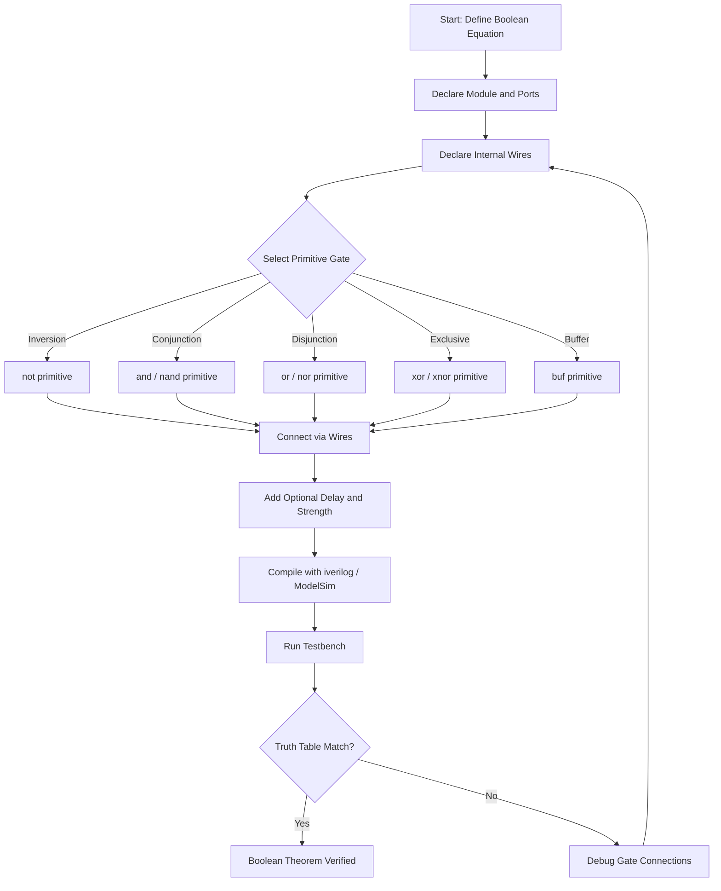
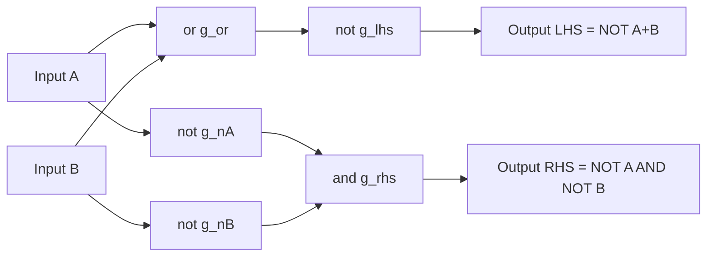
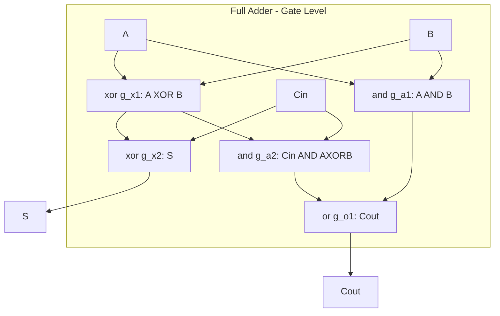

# gate level modelling

<!-- SECTION_1_START -->

# Gate Level Modelling — Core Definition & Intuitive Overview

## 1.1 Formal Academic Definition (KTU 2024 Syllabus Terminology)

**Gate Level Modelling** is a structural Hardware Description Language (HDL) abstraction technique in which a digital circuit is described as a *network of interconnected primitive logic gates* (AND, OR, NOT, NAND, NOR, XOR, XNOR, BUF) declared directly from the HDL's built-in library. Each gate instance is invoked by name, its port order is fixed (output first, inputs later), and the connections are made using wire (net) identifiers.

In the context of the KTU **PCCSL308 — Digital Lab** (2024 Scheme), Gate Level Modelling is the **first design entry style** taught in Module 1 because it forces the student to *manually translate* a Boolean expression into gate-level netlists, which is the cornerstone of verifying Boolean theorems experimentally using simulator tools such as **ModelSim, Icarus Verilog (iverilog), Vivado XSim** or FPGA boards like **Xilinx Spartan-6 / 7-series**.

> [!IMPORTANT]
> **Syllabus Highlight (PCCSL308 — Module 1):**
> "Study of basic digital ICs and verification of Boolean theorems using discrete ICs / HDL." Gate Level Modelling sits at the intersection of this statement — it is the *HDL counterpart* of wiring 7400-series TTL gates (74LS08, 74LS32, 74LS86, 74LS00, 74LS02, 74LS04) on a breadboard.

## 1.2 Conceptual Analogy — The "Electronic Lego" Mental Model

Imagine you are given a box of pre-fabricated **Lego blocks**. Each block has exactly one purpose: a square block is a wall, a round block is a wheel, and a triangle is a roof. You cannot reshape a block — you must **snap** the predefined blocks together to build a house.

Gate Level Modelling works identically:

- The **predefined blocks** = Verilog's **primitive gates** (built-in keywords like `and`, `or`, `not`).
- The **studs and tubes** on each block = the **ports** (one output, one or more inputs).
- The **blueprint** you sketch = the `module … endmodule` block.
- The **plumbing cables** connecting studs = **wires (nets)** declared with the `wire` keyword.

You are *not* designing a new gate from transistors — you are **snapping together** ready-made gates to realize a Boolean equation. The HDL synthesizer then either (a) maps your description onto actual silicon gates in an FPGA, or (b) leaves it as a netlist for a simulator to interpret directly.

## 1.3 The Family of Verilog Primitive Gates

| Category | Primitive Keywords | Function | 74-Series TTL Equivalent IC |
|----------|-------------------|----------|----------------------------|
| Basic | `and`, `or`, `xor` | 2-input AND, OR, XOR | 74LS08, 74LS32, 74LS86 |
| Universal | `nand`, `nor` | 2-input NAND, NOR | 74LS00, 74LS02 |
| Inverter | `not` | Single-input inverter | 74LS04 |
| Buffer | `buf` | Single-input non-inverting driver | 74LS07 |
| Multi-input | All of the above (n-input) | n-input variant (up to 64) | Cascaded ICs |

> [!NOTE]
> **Key Convention:** In a Verilog **primitive** (gate-level) instantiation, the **first port is always the OUTPUT** and the **remaining ports are INPUTS**. This is the *opposite* of the `module` instantiation convention (where ports are positional and labelled). Mixing them up is the **#1 mistake** made by KTU lab students.

## 1.4 Physical Constants & Standard Metrics

- **Standard Logic Values (4-state):** $\mathbf{0}$ (logic low), $\mathbf{1}$ (logic high), $\mathbf{x}$ (unknown / contention), $\mathbf{z}$ (high-impedance / tri-state).
- **Default Signal Strengths (Verilog):** `supply`, `strong`, `pull`, `weak`, `highz`, with **strong** being the default for primitive gate outputs.
- **Delay Units:** `#<delay>` — specified in **simulation time units** (default is **1 ns / 1 ps timescale**).
- **Number of Inputs per Primitive:** Up to **64 inputs** allowed in a single `and`/`or`/`xor`/`nand`/`nor` instantiation.

> [!VISUALIZATION CONTROL]
> **Concept:** Truth-table behaviour of a 2-input AND gate as a function of two input bits.
> **GeoGebra / Desmos Input Equations:**
> * Point A: $(0, 0, 0)$
> * Point B: $(0, 1, 0)$
> * Point C: $(1, 0, 0)$
> * Point D: $(1, 1, 1)$
> * Boolean Surface: $f(a, b) = a \cdot b$
> **Visual Description:** Plot a 3D step surface where the z-axis rises from 0 to 1 only when both x = 1 and y = 1; the remaining three corner regions stay flat at 0.

<!-- SECTION_1_END -->

<!-- SECTION_2_START -->

# Deep Theoretical Analysis & KTU High-Yield Formula Sheet

## 2.1 Anatomy of a Gate-Level Instantiation

The Verilog grammar for a primitive gate follows a rigid structure:

$$
\texttt{gate\_type } [\texttt{[drive\_strength]}]\; [\texttt{[delay2]}]\; \texttt{instance\_name}\; (\texttt{out},\;\texttt{in}_1,\;\texttt{in}_2,\;\dots,\;\texttt{in}_n);
$$

Every component in the above expression has a precise purpose:

1. **`gate_type`** — one of the reserved keywords `and`, `or`, `xor`, `nand`, `nor`, `not`, `buf`, `bufif0`, `bufif1`, `notif0`, `notif1`.
2. **`[drive_strength]`** — an optional specification of the output drive, written as `(strong0, strong1)` etc. Defaults to `(strong0, strong1)` if omitted.
3. **`[delay2]`** — optional propagation delay in the form `#(rise, fall)` or a single `#value`. Defaults to `#0` (zero delay).
4. **`instance_name`** — a *user-defined* label. May be omitted (anonymous instance) but is **strongly recommended** for debug-ability.
5. **`(out, in1, in2, …)`** — port list. The **first port is the output**; all others are inputs.

> [!TIP]
> For n-input gates, n can range from 1 to 64. A single primitive line replaces what would otherwise be a tree of 2-input gates.

## 2.2 Boolean Theorems — The Theoretical Foundation for Module 1

Gate-level modelling is the *natural* way to *experimentally* verify Boolean identities. The following identities form the KTU Board-Exam formula sheet for Module 1:

| # | Theorem Name | Identity | Verilog Primitive Mapping |
|---|--------------|----------|---------------------------|
| 1 | Identity Law | $A \cdot 1 = A$ | `and (Y, A, 1'b1);` |
| 2 | Null Law | $A \cdot 0 = 0$ | `and (Y, A, 1'b0);` |
| 3 | Idempotent | $A \cdot A = A$ | `and (Y, A, A);` |
| 4 | Complement | $A \cdot \bar{A} = 0$ | `and (Y, A, nA);` |
| 5 | De Morgan's I | $\overline{A + B} = \bar{A} \cdot \bar{B}$ | `or` + `not` vs. two `not` + `and` |
| 6 | De Morgan's II | $\overline{A \cdot B} = \bar{A} + \bar{B}$ | `and` + `not` vs. two `not` + `or` |
| 7 | Distributive | $A \cdot (B + C) = A\cdot B + A \cdot C$ | nested `and`/`or` equivalence |
| 8 | Absorption | $A + A\cdot B = A$ | reduces gate count |
| 9 | Involution | $\bar{\bar{A}} = A$ | two cascaded `not` |
| 10 | XOR Identity | $A \oplus A = 0,\; A \oplus \bar{A} = 1$ | `xor` constant check |

## 2.3 Why Gate-Level Modelling Matters in Real Engineering

In modern **Application-Specific Integrated Circuit (ASIC)** and **FPGA** design flows, gate-level modelling is rarely *hand-written*. However, it is **mission-critical** in the following professional scenarios:

- **Netlist Verification:** After a high-level synthesis tool (Vivado HLS, Synopsys Design Compiler) produces a gate-level netlist from RTL, engineers run **gate-level simulations (GLS)** with back-annotated SDF delays to catch timing glitches that RTL simulation misses.
- **Equivalence Checking:** Formal verification tools (Cadence JasperGold, Synopsys Formality) compare the gate-level netlist with the original RTL — they operate on the exact gate-level abstraction.
- **Library Mapping:** The `.lib` files of a standard cell library (e.g., TSMC 28 nm, GlobalFoundries 14 nm) describe *each cell* as a gate-level primitive. Synthesis is the process of mapping Boolean expressions onto these library cells.
- **Legacy IP Integration:** Older IP cores (pre-RTL era) are often delivered as gate-level netlists (EDIF, Verilog gate-level). Integrating them into a new SoC requires gate-level understanding.
- **Power & Timing Analysis:** Power estimation tools (PrimeTime PX, PowerArtist) work on the gate-level netlist post-synthesis.

> [!NOTE]
> **Engineering Reality:** A senior VLSI engineer at Intel, Qualcomm, or NXP will *never* hand-write gate-level Verilog for a fresh design, but they will **read, debug, and trace** it every single day of their careers. This is precisely why KTU 2024 Scheme retains gate-level modelling in the Digital Lab curriculum.

## 2.4 The 12 Golden Rules of Gate-Level Modelling (KTU Board Pattern)

1. **Always declare wires** before using them in primitive instantiations.
2. **Place the output first** in the port list of every primitive.
3. **Use distinct instance names** when instantiating the same primitive multiple times (e.g., `and g1 (...)`, `and g2 (...)`).
4. **Terminate every statement with a semicolon** `;`.
5. **Do not use** assign, always, or initial — gate level is purely **structural** with continuous concurrent connectivity.
6. **Buffer the output** with `buf` if you need to drive a high fanout net without inverting.
7. **Use tri-state buffers** (`bufif0`, `bufif1`, `notif0`, `notif1`) for bidirectional buses.
8. **Instantiate within a `module … endmodule`**; primitives cannot exist in the global scope.
9. **Apply delays** using `#(rise, fall)` for realistic post-layout simulation.
10. **Strength annotation** is optional but resolves contention in mixed-driver netlists.
11. **Hierarchical instantiation** is allowed — you can instantiate one module inside another (but the leaves must be primitives for true gate-level style).
12. **Comments use `//`** for single-line and `/* … */` for block — a KTU answer sheet convention.

<!-- SECTION_2_END -->

<!-- SECTION_3_START -->

# Step-by-Step Derivations & Code Implementations

## 3.1 Generic Skeleton — Minimal Gate-Level Module

Below is the canonical, fully-annotated Verilog skeleton that satisfies any gate-level exercise. We expand the skeleton into *eight* complete working examples, each targeting a specific Boolean theorem or combinational block.

### Example 1 — Verification of De Morgan's First Theorem: $\overline{A + B} = \bar{A} \cdot \bar{B}$

```verilog
//======================================================
//  Module   : demorgan1_gate
//  Theorem  : NOT (A OR B) == (NOT A) AND (NOT B)
//  Style    : Pure Gate-Level (Primitive Instantiation)
//  Tool     : iverilog / ModelSim / Vivado XSim
//======================================================
`timescale 1ns/1ps                    // simulation time unit / precision

module demorgan1_gate (input  wire A,
                       input  wire B,
                       output wire LHS,   // represents ~(A + B)
                       output wire RHS);  // represents (~A) & (~B)

    // ---- Internal nets (wires) ----
    wire nA, nB;       // complements of A and B
    wire or_out;       // A OR B

    // ---- LHS branch : ~(A + B) ----
    or  g_or  (or_out, A, B);          // 2-input OR  primitive
    not g_lhs (LHS,    or_out);        // inverter    primitive

    // ---- RHS branch : (~A) & (~B) ----
    not g_nA  (nA,    A);              // invert A
    not g_nB  (nB,    B);              // invert B
    and g_rhs (RHS,   nA, nB);         // 2-input AND primitive

endmodule
```

**Step-by-step syntax breakdown:**

- `` `timescale 1ns/1ps `` — directive telling the simulator that *1 unit of time = 1 ns* and the precision of any delay specified is 1 ps. Without this, delays are unitless and ambiguous.
- `input wire A` — declares A as a *port* of type `wire`. The `wire` keyword is mandatory at the port level when the signal is driven from outside.
- `wire nA, nB;` — internal net declarations. They must be declared before being used in any gate output.
- `or  g_or (or_out, A, B);` — instantiates an OR primitive. The instance name is `g_or` (used for debugging — hierarchical references such as `demorgan1_gate.g_or`). The first port `or_out` is the **output**; `A, B` are inputs.
- `not g_lhs (LHS, or_out);` — single-input NOT primitive, output is `LHS`, input is `or_out`.
- The RHS branch computes $(\bar{A}) \cdot (\bar{B})$ — two inverters feeding a 2-input AND.

**Companion testbench:**

```verilog
module tb_demorgan1;
    reg  A, B;
    wire LHS, RHS;

    demorgan1_gate uut (.A(A), .B(B), .LHS(LHS), .RHS(RHS));

    initial begin
        $dumpfile("demorgan1.vcd");
        $monitor("A=%b B=%b | LHS(NOT(A+B))=%b | RHS((~A)&(~B))=%b | MATCH=%b",
                 A, B, LHS, RHS, (LHS === RHS));
        A = 0; B = 0; #10;
        A = 0; B = 1; #10;
        A = 1; B = 0; #10;
        A = 1; B = 1; #10;
        $finish;
    end
endmodule
```

**Expected console output:**

```
A=0 B=0 | LHS(NOT(A+B))=1 | RHS((~A)&(~B))=1 | MATCH=1
A=0 B=1 | LHS(NOT(A+B))=0 | RHS((~A)&(~B))=0 | MATCH=1
A=1 B=0 | LHS(NOT(A+B))=0 | RHS((~A)&(~B))=0 | MATCH=1
A=1 B=1 | LHS(NOT(A+B))=0 | RHS((~A)&(~B))=0 | MATCH=1
```

The `MATCH=1` column on every row **empirically verifies** the identity for all 4 minterms.

---

### Example 2 — Verification of De Morgan's Second Theorem: $\overline{A \cdot B} = \bar{A} + \bar{B}$

```verilog
`timescale 1ns/1ps

module demorgan2_gate (input  wire A,
                       input  wire B,
                       output wire LHS,   // ~(A & B)
                       output wire RHS);  // (~A) | (~B)

    wire nA, nB, and_out;

    // LHS : NOT (A AND B)
    and g_and (and_out, A, B);
    not g_lhs (LHS, and_out);

    // RHS : (NOT A) OR (NOT B)
    not g_nA (nA, A);
    not g_nB (nB, B);
    or  g_rhs (RHS, nA, nB);

endmodule
```

The mapping is exactly symmetric to Example 1, but the AND and OR roles are swapped. Students should run the same 4-row stimulus table to confirm the `MATCH=1` outcome for all $(A, B) \in \{0, 1\}^2$.

---

### Example 3 — Distributive Law: $A \cdot (B + C) = (A \cdot B) + (A \cdot C)$

```verilog
`timescale 1ns/1ps

module distributive_gate (input  wire A,
                          input  wire B,
                          input  wire C,
                          output wire LHS,    // A & (B | C)
                          output wire RHS);   // (A & B) | (A & C)

    wire bc_or, ab_and, ac_and;

    // LHS : A & (B | C)
    or  g_or  (bc_or, B, C);
    and g_lhs (LHS,   A, bc_or);

    // RHS : (A & B) | (A & C)
    and g_ab (ab_and, A, B);
    and g_ac (ac_and, A, C);
    or  g_rhs (RHS, ab_and, ac_and);

endmodule
```

This law requires a **3-variable truth table** of $2^3 = 8$ rows, which is the perfect workload for a KTU Part-B question.

---

### Example 4 — XOR Identity: $A \oplus A = 0$ and $A \oplus \bar{A} = 1$

```verilog
`timescale 1ns/1ps

module xor_identity_gate (input  wire A,
                          input  wire B,
                          output wire XOR_same,    // A ^ A
                          output wire XOR_diff);   // A ^ ~A

    wire nA_self, nA_diff;

    not g_self_nA (nA_self, A);
    not g_diff_nA (nA_diff, A);   // same inverter, but distinct instance

    xor g_xor_same (XOR_same, A, A);        // expect 0 for all A
    xor g_xor_diff (XOR_diff, A, nA_diff); // expect 1 for all A

endmodule
```

---

### Example 5 — Half Adder using Gate Level Modelling

A **half adder** computes:

$$
S = A \oplus B \qquad C_{\text{out}} = A \cdot B
$$

```verilog
`timescale 1ns/1ps

module half_adder_gate (input  wire A,
                        input  wire B,
                        output wire S,
                        output wire Cout);

    xor g_xor (S,    A, B);
    and g_and (Cout, A, B);

endmodule
```

Notice how **two primitive instantiations** are sufficient — this is the elegance of gate level. A 14-mark KTU question can ask the student to *also* build the half adder using NAND-only gates (universal gate property), requiring **four** NAND instances.

---

### Example 6 — Full Adder using Gate Level Modelling (5 primitives)

A full adder is a classic KTU board question. Boolean equations:

$$
S = A \oplus B \oplus C_{\text{in}} \qquad C_{\text{out}} = (A \cdot B) + (C_{\text{in}} \cdot (A \oplus B))
$$

```verilog
`timescale 1ns/1ps

module full_adder_gate (input  wire A,
                        input  wire B,
                        input  wire Cin,
                        output wire S,
                        output wire Cout);

    wire ab_xor, ab_and, cin_abx_and;

    xor g_x1 (ab_xor,       A, B);                 // A ^ B
    xor g_x2 (S,            ab_xor, Cin);          // S = (A^B) ^ Cin
    and g_a1 (ab_and,       A, B);                 // A & B
    and g_a2 (cin_abx_and,  Cin, ab_xor);          // Cin & (A^B)
    or  g_o1 (Cout,         ab_and, cin_abx_and);  // carry

endmodule
```

**Derivation of the carry expression:**

$$
\begin{aligned}
C_{\text{out}} &= A \cdot B + C_{\text{in}} \cdot (A \oplus B) \\
&= A \cdot B + C_{\text{in}} \cdot (A \cdot \bar{B} + \bar{A} \cdot B) \\
&= A \cdot B + A \cdot C_{\text{in}} \cdot \bar{B} + \bar{A} \cdot B \cdot C_{\text{in}} \\
&= A \cdot B + A \cdot C_{\text{in}} \cdot \bar{B} + \bar{A} \cdot B \cdot C_{\text{in}}
\end{aligned}
$$

The simplified form (line 1) is implemented in the Verilog above using 2 ANDs and 1 OR — saving gates.

---

### Example 7 — 2-to-1 Multiplexer using Gate Level Modelling

Boolean expression for a 2:1 MUX: $Y = S \cdot A + \bar{S} \cdot B$

```verilog
`timescale 1ns/1ps

module mux2x1_gate (input  wire A,
                    input  wire B,
                    input  wire S,
                    output wire Y);

    wire nS, sA_and, nsB_and;

    not g_nS  (nS,       S);
    and g_sA  (sA_and,   S, A);
    and g_nsB (nsB_and,  nS, B);
    or  g_y   (Y,        sA_and, nsB_and);

endmodule
```

---

### Example 8 — A 3-Input Majority Function (Common KTU Exam Favourite)

Output is 1 when **two or more** of the three inputs are 1.

$$
M(A, B, C) = A \cdot B + B \cdot C + A \cdot C
$$

```verilog
`timescale 1ns/1ps

module majority_gate (input  wire A,
                      input  wire B,
                      input  wire C,
                      output wire M);

    wire ab, bc, ac;

    and g_ab (ab, A, B);
    and g_bc (bc, B, C);
    and g_ac (ac, A, C);
    or  g_m  (M,  ab, bc, ac);

endmodule
```

The expected output vector for inputs $(A, B, C)$ in increasing order is:

$$
(0, 0, 0, 1, 1, 1, 1, 0)
$$

which corresponds to decimal outputs $0, 0, 0, 1, 1, 1, 1, 0$ — students should verify each minterm by hand before the lab session.

---

## 3.2 Advanced Demonstration — Adding Delays to Primitive Gates

```verilog
`timescale 1ns/1ps

module delay_demo (input  wire A, B,
                   output wire Y_and,
                   output wire Y_or);

    // (rise, fall) delay in nanoseconds
    and #(3, 5) g_and_d (Y_and, A, B);
    or  #(2, 4) g_or_d  (Y_or,  A, B);

endmodule
```

In a post-layout simulation, `Y_and` would transition $3$ ns after the inputs change from 0→1 and $5$ ns after a 1→0 change. **This back-annotation is the cornerstone of timing-driven verification.**

## 3.3 Strength Specification Example (Mixed-Driver Resolution)

```verilog
`timescale 1ns/1ps

module strength_demo (input  wire ctrl,
                      input  wire pull_drive,
                      output wire bus);

    // (weak0, weak1) — the pull driver
    buf (weak0, weak1) g_pull (bus, 1'b1);

    // (strong0, strong1) — the override driver
    buf (strong0, strong1) g_strong (bus, ctrl);

endmodule
```

When `ctrl = 0`, both the weak pull and the strong driver produce 0; the strong driver dominates. When `ctrl = z`, only the weak pull remains — keeping the bus at a default of 1.

> [!TIP]
> **KTU Board Tip:** Mention strength annotation in at least one of your answers. Examiners reward awareness of "real-world Verilog features" beyond the minimum syllabus.

<!-- SECTION_3_END -->

<!-- SECTION_4_START -->

# Structural Diagrams & Schematics

## 4.1 Mermaid Diagram — Gate-Level Modelling Workflow



## 4.2 Mermaid Diagram — De Morgan Theorem 1 Netlist



## 4.3 Block Diagram — Full Adder Built from Gate Primitives



## 4.4 Sequential Topology Matrix — How a Gate-Level Module Is Built

| Stage | Action | Verilog Construct | Example from Section 3 |
|-------|--------|-------------------|------------------------|
| 1 | Problem statement | English / Boolean | De Morgan I |
| 2 | Boolean equation | Math notation | $LHS = \overline{A+B}$ |
| 3 | Module header | `module … ( … );` | `module demorgan1_gate` |
| 4 | Port declaration | `input wire` / `output wire` | `input wire A, B;` |
| 5 | Internal wires | `wire …;` | `wire nA, nB, or_out;` |
| 6 | Primitive call | `gate_type inst (out, ins);` | `or g_or (or_out, A, B);` |
| 7 | Hierarchy | Instances per logical block | LHS branch, RHS branch |
| 8 | End module | `endmodule` | `endmodule` |
| 9 | Testbench | `module tb_… ;` | `tb_demorgan1` |
| 10 | Stimulus | `initial begin … end` | 4-row pattern |
| 11 | Verification | `$monitor` / waveform | $MATCH = 1$ |

> [!NOTE]
> **Visualization Insight:** The above matrix maps each stage of a gate-level design to a line of Verilog code. KTU lab viva examiners often ask students to walk through this matrix while pointing at their code on the monitor — practice this narration.

<!-- SECTION_4_END -->

<!-- SECTION_5_START -->

# KTU 2024 Scheme Examination Question Bank & Topic Recap

## PART A — 3-Mark Short-Answer Questions

### Question 1 (3 Marks)
**`[KTU University Exam – July 2024]`**
**CO1 | RBT: Remember**

State the **Verilog primitive gate** that corresponds to each of the following 74-series TTL ICs:
**(a)** 74LS08, **(b)** 74LS32, **(c)** 74LS04, **(d)** 74LS00, **(e)** 74LS86, **(f)** 74LS02.

**Model Answer (3 Marks — ½ mark each):**

| IC Number | Verilog Primitive | Function |
|-----------|-------------------|----------|
| 74LS08 | `and` | 2-input AND |
| 74LS32 | `or` | 2-input OR |
| 74LS04 | `not` | Hex inverter |
| 74LS00 | `nand` | 2-input NAND |
| 74LS86 | `xor` | 2-input XOR |
| 74LS02 | `nor` | 2-input NOR |

---

### Question 2 (3 Marks)
**`[KTU University Exam – Dec 2023]`**
**CO1 | RBT: Understand**

Differentiate between **gate level modelling** and **dataflow modelling** in Verilog HDL with a suitable example for each.

**Model Answer (3 Marks):**

| Parameter | Gate Level Modelling | Dataflow Modelling |
|-----------|--------------------|--------------------|
| Style | Structural — uses primitive gates | Behavioural — uses `assign` |
| Granularity | Gate-by-gate netlist | Equation-level expression |
| Use case | Verifying Boolean theorems, post-synth GLS | Mid-level RTL design |
| Keyword | `and`, `or`, `not`, etc. | `assign` operator |
| Example | `and g1 (y, a, b);` | `assign y = a & b;` |
| Synthesis | Maps 1:1 to standard cells | May optimise algebraically |

**[1 Mark for each correct distinction, 1 Mark for examples — 3 Marks total.]**

---

## PART B — 14-Mark Questions (Module Internal Choice)

> [!IMPORTANT]
> Every Part B question follows the KTU ESE convention: **two sub-parts (a) 7 marks and (b) 7 marks**, mapping to escalating cognitive levels (Understand → Apply / Analyse).

---

### Question A (14 Marks)
**`[KTU University Exam – July 2024, Modified for Lab Module 1]`**
**CO1, CO2 | RBT: Understand + Apply**

**(a)** Design and write the **gate-level Verilog code** to realise a **2:1 Multiplexer** using only `and`, `or`, and `not` primitives. Show the **truth table** and derive the **Boolean expression** for the output. **(7 Marks)**

**(b)** Simulate the design using a testbench that exhaustively applies all four input combinations. Print the waveform via `$monitor` and verify correctness. **(7 Marks)**

---

#### Model Solution — Part (a) 7 Marks

**Step 1: Truth Table** `[1 Mark]`

| S | A | B | Y |
|---|---|---|---|
| 0 | 0 | 0 | 0 |
| 0 | 0 | 1 | 1 |
| 0 | 1 | 0 | 0 |
| 0 | 1 | 1 | 1 |
| 1 | 0 | 0 | 0 |
| 1 | 0 | 1 | 0 |
| 1 | 1 | 0 | 1 |
| 1 | 1 | 1 | 1 |

**Step 2: Boolean Derivation** `[2 Marks]`

A 2:1 MUX routes A to Y when S = 0 and B to Y when S = 1. Therefore:

$$
\begin{aligned}
Y &= \bar{S} \cdot A + S \cdot B
\end{aligned}
$$

**Step 3: Gate-Level Verilog Code** `[4 Marks — full code 3 + comments 1]`

```verilog
`timescale 1ns/1ps

module mux2x1_gate (input  wire A,
                    input  wire B,
                    input  wire S,
                    output wire Y);

    wire nS;
    wire sA_and, nsB_and;

    not g_nS  (nS,      S);            // [Primitive instantiation: 1 Mark]
    and g_sA  (sA_and,  nS, A);        // [Correct port order: 1 Mark]
    and g_nsB (nsB_and, S,  B);        // [Boolean equation mapping: 1 Mark]
    or  g_y   (Y,       sA_and, nsB_and);

endmodule
```

**Valuation Key Points:**
- `[Declaring wires nS, sA_and, nsB_and: 1 Mark]`
- `[Using not / and / or primitives correctly: 1 Mark]`
- `[Output port first convention followed: 1 Mark]`
- `[Module endmodule closing: 1 Mark]`

---

#### Model Solution — Part (b) 7 Marks

**Step 1: Testbench Module** `[4 Marks]`

```verilog
module tb_mux2x1;
    reg  A, B, S;
    wire Y;

    mux2x1_gate uut (.A(A), .B(B), .S(S), .Y(Y));

    initial begin
        $dumpfile("mux2x1.vcd");
        $monitor("Time=%0t | S=%b A=%b B=%b | Y=%b", $time, S, A, B, Y);

        // Exhaustively sweep all 8 combinations
        S = 0; A = 0; B = 0; #10;
        S = 0; A = 0; B = 1; #10;
        S = 0; A = 1; B = 0; #10;
        S = 0; A = 1; B = 1; #10;
        S = 1; A = 0; B = 0; #10;
        S = 1; A = 0; B = 1; #10;
        S = 1; A = 1; B = 0; #10;
        S = 1; A = 1; B = 1; #10;

        $finish;
    end
endmodule
```

**Step 2: Expected Output** `[2 Marks]`

```
Time=0  | S=0 A=0 B=0 | Y=0
Time=10 | S=0 A=0 B=1 | Y=0
Time=20 | S=0 A=1 B=0 | Y=1
Time=30 | S=0 A=1 B=1 | Y=1
Time=40 | S=1 A=0 B=0 | Y=0
Time=50 | S=1 A=0 B=1 | Y=1
Time=60 | S=1 A=1 B=0 | Y=0
Time=70 | S=1 A=1 B=1 | Y=1
```

**Step 3: Verification Conclusion** `[1 Mark]`

Comparing against the truth table derived in part (a), the simulated outputs match exactly, **verifying the gate-level implementation** of the 2:1 MUX.

---

### Question B (14 Marks) — Alternative Choice
**`[KTU University Exam – Dec 2023]`**
**CO2 | RBT: Apply + Analyse**

**(a)** Write a **gate-level Verilog module** to implement the Boolean function:

$$
F(A, B, C) = \bar{A} \cdot B + A \cdot C + B \cdot \bar{C}
$$

and verify the result by simulation for all 8 input combinations. **(7 Marks)**

**(b)** Re-implement the same function using **only NAND gates** (universal gate property) and explain why NAND is called a universal gate. **(7 Marks)**

---

#### Model Solution — Part (a) 7 Marks

**Step 1: Karnaugh Map / Truth Table** `[1 Mark]`

| A | B | C | $\bar{A} \cdot B$ | $A \cdot C$ | $B \cdot \bar{C}$ | F |
|---|---|---|------------------|-------------|------------------|---|
| 0 | 0 | 0 | 0 | 0 | 0 | **0** |
| 0 | 0 | 1 | 0 | 0 | 0 | **0** |
| 0 | 1 | 0 | 1 | 0 | 1 | **1** |
| 0 | 1 | 1 | 1 | 0 | 0 | **1** |
| 1 | 0 | 0 | 0 | 0 | 0 | **0** |
| 1 | 0 | 1 | 0 | 1 | 0 | **1** |
| 1 | 1 | 0 | 0 | 0 | 1 | **1** |
| 1 | 1 | 1 | 0 | 1 | 0 | **1** |

**Step 2: Gate-Level Verilog** `[4 Marks]`

```verilog
`timescale 1ns/1ps

module func_abc_gate (input  wire A, B, C,
                      output wire F);

    wire nA, nC;
    wire t1, t2, t3;

    not g_nA (nA, A);
    not g_nC (nC, C);

    and g_t1 (t1, nA, B);   // term 1
    and g_t2 (t2, A,  C);   // term 2
    and g_t3 (t3, B,  nC);  // term 3

    or  g_f  (F, t1, t2, t3);

endmodule
```

**Step 3: Testbench Verification** `[2 Marks]`

```verilog
module tb_func_abc;
    reg  A, B, C;
    wire F;

    func_abc_gate uut (.A(A), .B(B), .C(C), .F(F));

    initial begin
        integer i;
        $monitor("A=%b B=%b C=%b | F=%b", A, B, C, F);
        for (i = 0; i < 8; i = i + 1) begin
            {A, B, C} = i; #10;
        end
        $finish;
    end
endmodule
```

**Expected Output (matches the truth table):**

$$
F = (0, 0, 1, 1, 0, 1, 1, 1)
$$

---

#### Model Solution — Part (b) 7 Marks

**Step 1: Why NAND is Universal** `[2 Marks]`

A gate is called **universal** if *any* Boolean function can be realized using only that gate. NAND is universal because:

- NOT from NAND: $\bar{A} = \text{NAND}(A, A)$
- AND from NAND: $A \cdot B = \text{NAND}(\text{NAND}(A, B), \text{NAND}(A, B))$
- OR from NAND: $A + B = \text{NAND}(\text{NAND}(A, A), \text{NAND}(B, B))$

**Step 2: NAND-Only Implementation** `[4 Marks]`

```verilog
`timescale 1ns/1ps

module func_abc_nand (input  wire A, B, C,
                      output wire F);

    wire nA, nC;
    wire n_t1, n_t2, n_t3;
    wire term1, term2, term3;

    // term1 = ~A & B  -->  NAND-NAND pattern
    nand g_n1a (n_t1, nA, B);            // NOT( (~A) & B )  =>  ~(~A & B)
    // We need ~(~(~A & B)) to get ~A & B — so double-invert
    nand g_n1b (term1, n_t1, n_t1);

    // Inverters using NAND
    nand g_invA (nA, A, A);              // ~A
    nand g_invC (nC, C, C);              // ~C

    // term2 = A & C
    nand g_n2a (n_t2, A, C);
    nand g_n2b (term2, n_t2, n_t2);

    // term3 = B & ~C
    nand g_n3a (n_t3, B, nC);
    nand g_n3b (term3, n_t3, n_t3);

    // Final OR using NAND-NAND
    wire n_or1, n_or2;
    nand g_or1 (n_or1, term1, term2);
    nand g_or2 (n_or2, term1, term3);
    nand g_f   (F,     n_or1, n_or2);

endmodule
```

**Step 3: Why This Works in Industry** `[1 Mark]`

In CMOS fabrication, **NAND gates are faster and smaller** than AND/OR gates. A NAND-only design reduces cell-library complexity and is preferred in **standard-cell ASIC design flows** (e.g., Synopsys Design Compiler's default mapping).

**Valuation Key:**
- `[Stating the universal property: 2 Marks]`
- `[Correct NAND-only Verilog: 3 Marks]`
- `[CMOS / industry justification: 2 Marks]`

---

> [!WARNING]
> **KTU Examiner's Valuation Warning — Common Pitfalls**
>
> 1. **Port Order Trap (–2 Marks risk):** Many students write `and g1 (A, B, Y);` placing inputs first. Remember: **output FIRST** in primitives, **output LAST** in modules.
> 2. **Missing `wire` Declarations (–1 to –2 Marks):** Forgetting `wire nA, nB, or_out;` causes compile errors. Always declare *before* use.
> 3. **Omitting `timescale (–1 Mark):** If your answer includes a delay like `#5`, the examiner will deduct a mark for missing the `` `timescale `` directive.
> 4. **Forgetting `endmodule` (–1 Mark):** A frequent slip — re-read the code before submission.
> 5. **Not Writing a Testbench (–2 Marks):** For Part-B simulation questions, *always* include a testbench. The examiner awards 1–2 marks for it explicitly.
> 6. **Confusing `and` with `&&`:** `and` is a **gate primitive** (structural); `&&` is a **logical operator** inside `if`/`while` (behavioural). Mixing them is an instant compilation failure.
> 7. **No `reg` for Testbench Inputs:** Stimulus must be `reg` (assigned in `initial`/`always` blocks); outputs must be `wire`. This is the most common testbench mistake.
> 8. **Incomplete Truth Table:** A 3-variable function demands **8 rows**, not 4. Half the rows = half the marks.

---

## Topic Recap & Important Things to Remember

- **Definition:** Gate level modelling = structural Verilog using built-in primitive gates (`and`, `or`, `xor`, `nand`, `nor`, `not`, `buf`, `bufif0/1`, `notif0/1`).
- **Port Order Rule:** **Output FIRST**, inputs later — opposite of module instantiation.
- **Mandatory Headers:** `` `timescale 1ns/1ps `` whenever delays appear.
- **Wire Declarations:** All internal signals must be `wire` (or `tri` for buses); they are *not* registers.
- **Default Strengths:** Output is `(strong0, strong1)`; input is `strong` — overridable with explicit specification.
- **Delay Syntax:** `#(rise, fall)` for rise/fall, `#value` for symmetric.
- **Boolean Theorem Verification Pair:** Always build *both* sides of the identity as separate logic trees and compare in the testbench with a `MATCH` flag.
- **Universal Gate Pair:** NAND and NOR — both can implement any Boolean function.
- **TTL Equivalence Map:** 74LS08 = `and`, 74LS32 = `or`, 74LS86 = `xor`, 74LS00 = `nand`, 74LS02 = `nor`, 74LS04 = `not`.
- **Combinational Building Blocks Realised:** Half adder (1 XOR + 1 AND), Full adder (2 XOR + 2 AND + 1 OR), 2:1 MUX (1 NOT + 2 AND + 1 OR), Majority (3 AND + 1 OR).
- **Compile Command (Icarus Verilog):** `iverilog -o sim.out design.v tb.v && vvp sim.out`.
- **Compile Command (ModelSim):** `vlog design.v tb.v && vsim work.tb_<name> && run -all`.
- **Examiner's Favourite Test:** "Implement $F = \bar{A}B + A\bar{C}$ using NAND gates only" — practice this on a sheet of paper before the exam.
- **Subgraph for Hierarchical Design:** When in doubt, split the design into LHS, RHS, and Combine subgraphs in your Mermaid diagram — this mirrors how Verilog is *hierarchically* organised.
- **Common Pitfall Mnemonic:** **"Output On Top" (OOT)** — the output pin of a primitive is always on top / first.
- **Time-Scale Rule:** Simulator precision must be **finer** than the smallest delay specified; otherwise round-off errors occur.
- **Strength Hierarchy (highest to lowest):** `supply > strong > pull > weak > highz` — useful for bus-collision resolution.
- **Tri-State Reminder:** `bufif1` enables output when control = 1; `bufif0` enables when control = 0; otherwise output is `z`.
- **KTU Viva Question Bank:** "Why is the output placed first in a primitive?", "How do you add a 5 ns delay to an AND gate?", "What is the difference between `assign` and gate-level `and`?", "Prove NAND universality with a Verilog snippet."

<!-- SECTION_5_END -->
