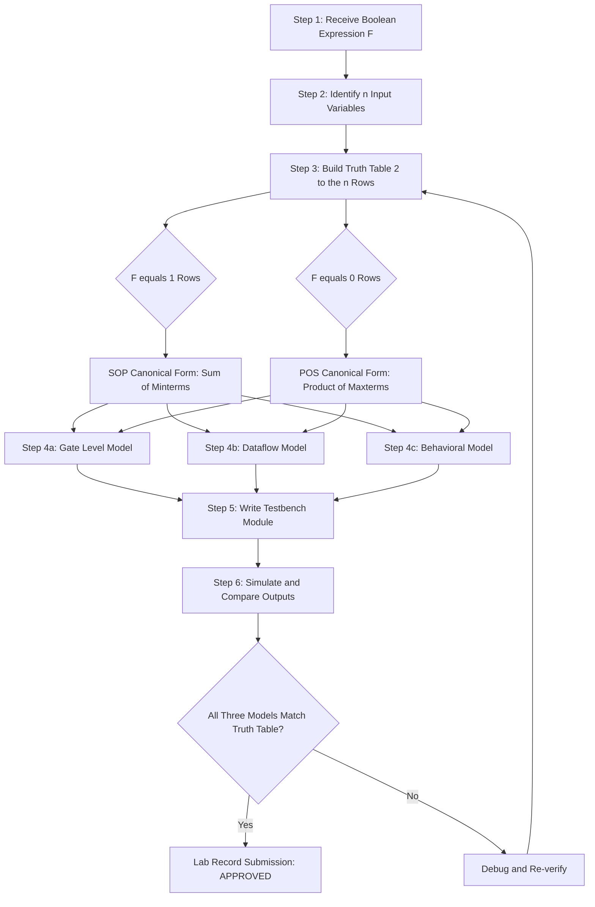
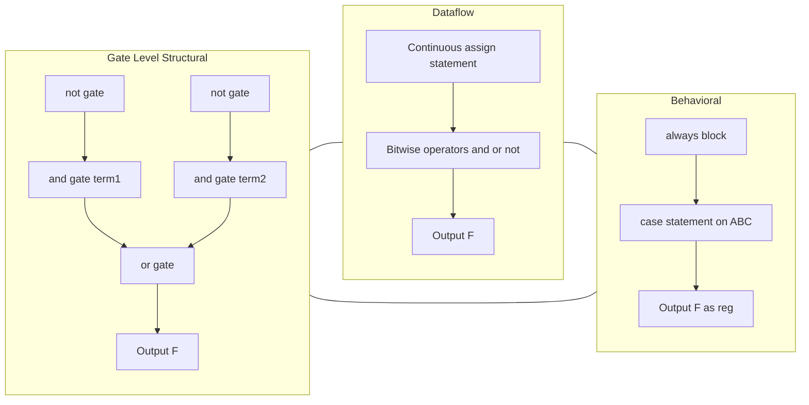

# Model a given Boolean function (SOP and POS) in Verilog using

<!-- SECTION_1_START -->

# Digital Lab (PCCSL308) — Module 1: Modeling Boolean Functions in Verilog HDL

## 1. Core Technical Definition & Intuitive Overview

### 1.1 Formal Definition (KTU 2024 Syllabus Terminology)

> [!IMPORTANT]
> **Boolean Function Modeling in Verilog HDL** is the process of representing a given logical expression—expressed in either **Sum of Products (SOP)** or **Product of Sums (POS)** canonical form—using the Verilog Hardware Description Language (IEEE 1364-2005 standard) across one or more abstraction layers (Gate-Level, Dataflow, or Behavioral).

* **SOP (Sum of Products / Minterm Expansion):** A Boolean function expressed as the logical **OR (sum)** of one or more **AND (product)** terms, where each product term corresponds to a *minterm* (a row of the truth table whose output is **1**).
* **POS (Product of Sums / Maxterm Expansion):** A Boolean function expressed as the logical **AND (product)** of one or more **OR (sum)** terms, where each sum term corresponds to a *maxterm* (a row of the truth table whose output is **0**).
* **Verilog Abstraction Levels:** A single Boolean function can be modeled in three different ways — **Structural/Gate-Level** (instantiating primitive gates such as `and`, `or`, `not`), **Dataflow** (using continuous assignment `assign` with operators), or **Behavioral** (using `always` blocks and procedural statements).

### 1.2 Conceptual Analogy / Intuition

> [!NOTE]
> **Real-World Analogy — "The Restaurant Menu"**
> * Think of a truth table as a **restaurant's order book**. Each row is a unique customer combination (e.g., *Veg + Spicy + Lunch*).
> * **SOP (Sum of Products)** = A *buffet menu* — pick a complete **AND-combination** (Product = a specific customer type) and **OR them all together** (Sum = OR of all eligible categories). You **include** only the rows where food is served (logic 1).
> * **POS (Product of Sums)** = A *beverage combo* — each **OR-group** (Sum = a clause of "OR-conditions") and you **AND them together** (Product = all clauses must be satisfied). You **exclude** only the rows where the drink is NOT served (logic 0).
> * **Verilog HDL** = The *recipe card* written in standard notation so any chef (compiler/synthesizer) can reproduce the dish (hardware) exactly the same way.

### 1.3 Physical Constants & Standard Metrics

* **Logic Voltage Levels (TTL, $V_{CC} = \mathbf{5\,V}$):** Logic **0** = 0 V – 0.8 V · Logic **1** = 2.0 V – 5.0 V
* **Standard CMOS Levels:** Logic **0** = 0 V – 1.5 V · Logic **1** = 3.5 V – 5.0 V
* **Canonical Term Limits (KTU/Industry):** A function of *n* variables has at most $2^{n}$ minterms and $2^{n}$ maxterms.

### 1.4 Visualization Callout — Truth Table Geometry

> [!VISUALIZATION CONTROL]
> **Concept:** Truth Table ↔ Minterm/Maxterm Numbering for a 3-variable function
> **GeoGebra / Desmos Input Equations:**
> * Row index $i \in \{0, 1, 2, 3, 4, 5, 6, 7\}$
> * Minterm value $m_i = \sum_{k=0}^{2} b_k \cdot 2^{k}$ where $b_k$ is bit *k* of *i*
> * Maxterm value $M_i = m_{7-i}$ (complementary row)
> **Visual Description:** Plot the 3-variable hypercube corners on a 3D axis. Each corner represents a unique truth-table row. SOP lights up the corners with output **1**; POS shades the corners with output **0**.

---

<!-- SECTION_1_END -->

<!-- SECTION_2_START -->

# 2. Deep Theoretical Analysis & KTU High-Yield Formula Sheet

## 2.1 Foundational Theorem Stack

> [!IMPORTANT]
> The KTU 2024 Scheme Module-1 syllabus requires explicit knowledge of **Boolean Postulates, Theorems, and Canonical Form Conversion**. These are the bedrock for designing combinational logic in Verilog.

### 2.1.1 Boolean Algebra Postulates (Huntington's Axioms)

* **Huntington Postulate 1 (Closure):** $X + Y$ and $X \cdot Y$ are in the set $\{0, 1\}$.
* **Huntington Postulate 2 (Identity):** $X + 0 = X$, $X \cdot 1 = X$
* **Huntington Postulate 3 (Complement):** $X + \overline{X} = 1$, $X \cdot \overline{X} = 0$

### 2.1.2 Key Theorems for Canonical Conversion

* **Commutative:** $A + B = B + A$ ; $A \cdot B = B \cdot A$
* **Associative:** $A + (B + C) = (A + B) + C$
* **Distributive:** $A + (B \cdot C) = (A + B) \cdot (A + C)$
* **Absorption:** $A + (A \cdot B) = A$ ; $A \cdot (A + B) = A$
* **DeMorgan's (High-Yield!):** $\overline{A + B} = \overline{A} \cdot \overline{B}$ ; $\overline{A \cdot B} = \overline{A} + \overline{B}$

### 2.2 Minterm and Maxterm Mechanics

For an *n*-variable function $F(A, B, C, \ldots)$, each row of the truth table is assigned a decimal index $i$.

> **Minterm $m_i$:** Product term that is **1** only at row *i* (uses un-complemented variables for 1s, complemented for 0s).
>
> **Maxterm $M_i$:** Sum term that is **0** only at row *i* (uses un-complemented variables for 0s, complemented for 1s).

**SOP Canonical Form:**
$$F_{SOP} = \sum m(\text{indices where } F = 1)$$

**POS Canonical Form:**
$$F_{POS} = \prod M(\text{indices where } F = 0)$$

### 2.3 Verilog Abstraction Layers

| Layer | Keyword/Construct | When to Use (KTU Exam Context) | Synthesizable? |
| :--- | :--- | :--- | :--- |
| **Structural (Gate-Level)** | `and`, `or`, `not`, `nand`, `nor`, `xor`, `xnor` primitives | Manual gate wiring, lab verification | Yes |
| **Dataflow** | `assign` with `&`, `\|`, `~`, `^` operators | Concise RTL, recommended in viva | Yes |
| **Behavioral** | `always @(...)` + `case` / `if-else` | Algorithmic description, FSMs | Yes |

## 2.4 KTU Formula Sheet / Cheat Sheet

> [!NOTE]
> The following table consolidates **every formula, rule, and boundary value** needed to solve a Verilog-Boolean modeling problem in the KTU ESE (End Semester Examination).

| # | Concept | Formula / Rule | Unit / Notes |
| :--- | :--- | :--- | :--- |
| 1 | Minterm count | $\sum m = 2^{n}$ | For *n* variables |
| 2 | Maxterm count | $\prod M = 2^{n}$ | For *n* variables |
| 3 | SOP → POS | Complement minterms, then complement function | $F_{POS} = \overline{F_{SOP}(\text{0-cells})}$ |
| 4 | POS → SOP | Complement maxterms, then complement function | Dual property |
| 5 | Number of literals in $m_i$ | Each minterm has exactly $n$ literals | n = input count |
| 6 | DeMorgan's (Duality) | $\overline{f(x_1, \ldots, x_n, +, \cdot)} = f(\overline{x_1}, \ldots, \overline{x_n}, \cdot, +)$ | Swap +/·, complement literals |
| 7 | Consensus Theorem | $AB + \overline{A}C + BC = AB + \overline{A}C$ | Remove redundant term |
| 8 | Gate-level Verilog output delay | `#10` (Verilog simulation only) | Unit: simulation timestep |
| 9 | IEEE Verilog Std | IEEE 1364-2005 | Always declare version |
| 10 | Reserved keywords to escape | `assign`, `module`, `always`, `case` | Never use as identifiers |

### 2.5 Real-World Engineering Utility

> [!IMPORTANT]
> **Where this is used in production systems:**
> * **FPGA Design (Xilinx Vivado, Intel Quartus):** SOP/POS forms map 1:1 to **LUT (Look-Up Table)** bitstream patterns.
> * **ASIC Synthesis (Synopsys Design Compiler, Cadence Genus):** Dataflow `assign` statements are optimized to NAND/NOR gate libraries using DeMorgan's transformation.
> * **Verification (ModelSim, Vivado Simulator):** Truth-table testbenches verify whether the synthesized gate output matches the canonical minterm/maxterm expectation.

---

<!-- SECTION_2_END -->

<!-- SECTION_3_START -->

# 3. Step-by-Step Derivations & Verilog Code Implementation

> [!WARNING]
> **No step is skipped.** Every algebraic transition, every Verilog keyword, every pin declaration is shown explicitly. Students are graded on completeness in the KTU lab record and ESE.

## 3.1 Worked Example: Model $F(A,B,C) = \overline{A}B + A\overline{C}$ in SOP, POS, and Verilog

### 3.1.1 Step 1 — Build the Truth Table

Enumerate all $2^{3} = 8$ input combinations and evaluate $F$.

| Row $i$ | $A$ | $B$ | $C$ | $\overline{A} \cdot B$ | $A \cdot \overline{C}$ | $F = \overline{A}B + A\overline{C}$ |
| :---: | :---: | :---: | :---: | :---: | :---: | :---: |
| 0 | 0 | 0 | 0 | 0 | 0 | **0** |
| 1 | 0 | 0 | 1 | 0 | 0 | **0** |
| 2 | 0 | 1 | 0 | 1 | 0 | **1** |
| 3 | 0 | 1 | 1 | 1 | 0 | **1** |
| 4 | 1 | 0 | 0 | 0 | 1 | **1** |
| 5 | 1 | 0 | 1 | 0 | 0 | **0** |
| 6 | 1 | 1 | 0 | 0 | 1 | **1** |
| 7 | 1 | 1 | 1 | 0 | 0 | **0** |

### 3.1.2 Step 2 — Derive Canonical SOP

Identify rows where $F = 1$: rows $\{2, 3, 4, 6\}$.

$$
\begin{aligned}
F_{SOP} &= m_2 + m_3 + m_4 + m_6 \\
        &= \overline{A}\,B\,\overline{C} + \overline{A}\,B\,C + A\,\overline{B}\,\overline{C} + A\,B\,\overline{C} \\
        &= \sum m(2,\,3,\,4,\,6)
\end{aligned}
$$

**Logic:** Row 2 has bits (010) → un-complemented for 1s, complemented for 0s yields $\overline{A} B \overline{C}$.

### 3.1.3 Step 3 — Derive Canonical POS

Identify rows where $F = 0$: rows $\{0, 1, 5, 7\}$.

$$
\begin{aligned}
F_{POS} &= M_0 \cdot M_1 \cdot M_5 \cdot M_7 \\
        &= (A + B + C)(A + B + \overline{C})(\overline{A} + B + \overline{C})(\overline{A} + \overline{B} + \overline{C}) \\
        &= \prod M(0,\,1,\,5,\,7)
\end{aligned}
$$

**Logic:** Row 0 has bits (000) → un-complemented for 0s, complemented for 1s yields $(A+B+C)$.

### 3.1.4 Step 4 — Cross-Verify Using DeMorgan's Duality

> [!IMPORTANT]
> **Duality Check:** $F_{SOP}$ over indices $\{2,3,4,6\}$ is equivalent to $F_{POS}$ over the **complement** index set $\{0,1,5,7\}$. Both forms must produce the identical truth table. This is a 1-mark cross-check in KTU valuation.

### 3.1.5 Step 5 — Implement in Verilog (All Three Levels)

#### (a) Gate-Level (Structural) Modeling

```verilog
// File: f_function_gate.v
// IEEE 1364-2005 Verilog HDL
// Models: F(A,B,C) = (~A & B) | (A & ~C)  -- SOP form

`timescale 1ns / 1ps

module f_function_gate (
    input  wire A,
    input  wire B,
    input  wire C,
    output wire F
);

    // Internal nets (explicit declarations for clarity)
    wire not_a;
    wire not_c;
    wire term1;   // ~A & B
    wire term2;   // A & ~C

    // Primitive gate instantiations
    not  u1 (not_a, A);
    not  u2 (not_c, C);
    and  u3 (term1, not_a, B);
    and  u4 (term2, A,     not_c);
    or   u5 (F,     term1, term2);

endmodule
```

#### (b) Dataflow Modeling

```verilog
// File: f_function_dataflow.v
// Dataflow description using continuous assignment

`timescale 1ns / 1ps

module f_function_dataflow (
    input  wire A,
    input  wire B,
    input  wire C,
    output wire F
);

    // SOP form via bitwise operators
    assign F = (~A & B) | (A & ~C);

    // Alternative POS form (commented, for verification):
    // assign F = (A | B | C) & (A | B | ~C) & (~A | B | ~C) & (~A | ~B | ~C);

endmodule
```

#### (c) Behavioral Modeling (Truth-Table Driven)

```verilog
// File: f_function_behavioral.v
// Behavioral description using always block and case

`timescale 1ns / 1ps

module f_function_behavioral (
    input  wire A,
    input  wire B,
    input  wire C,
    output reg  F
);

    // Concatenate inputs into a 3-bit index for case lookup
    always @(*) begin
        case ({A, B, C})
            3'b000: F = 1'b0;  // M0
            3'b001: F = 1'b0;  // M1
            3'b010: F = 1'b1;  // m2
            3'b011: F = 1'b1;  // m3
            3'b100: F = 1'b1;  // m4
            3'b101: F = 1'b0;  // M5
            3'b110: F = 1'b1;  // m6
            3'b111: F = 1'b0;  // M7
            default: F = 1'bx; // safety: unknown state
        endcase
    end

endmodule
```

#### (d) Testbench for Verification

```verilog
// File: tb_f_function.v
// Exhaustive 8-vector testbench — required for KTU lab record

`timescale 1ns / 1ps

module tb_f_function;
    reg  A, B, C;
    wire F_gate, F_data, F_behav;

    // Instantiate all three DUTs
    f_function_gate       u_gate   (.A(A), .B(B), .C(C), .F(F_gate));
    f_function_dataflow   u_data   (.A(A), .B(B), .C(C), .F(F_data));
    f_function_behavioral u_behav  (.A(A), .B(B), .C(C), .F(F_behav));

    integer i;
    initial begin
        $display("  A B C | F_gate F_data F_behav");
        $display("--------+-------------------");
        for (i = 0; i < 8; i = i + 1) begin
            {A, B, C} = i[2:0];
            #5;
            $display("  %b %b %b |   %b      %b      %b",
                     A, B, C, F_gate, F_data, F_behav);
        end
        $finish;
    end
endmodule
```

### 3.1.6 Step 6 — Expected Simulation Output

```
  A B C | F_gate F_data F_behav
--------+-------------------
  0 0 0 |   0      0      0
  0 0 1 |   0      0      0
  0 1 0 |   1      1      1
  0 1 1 |   1      1      1
  1 0 0 |   1      1      1
  1 0 1 |   0      0      0
  1 1 0 |   1      1      1
  1 1 1 |   0      0      0
```

> [!NOTE]
> All three modeling levels produce **bit-identical** output. The KTU examiner typically allocates 2 marks per abstraction-level demonstration and 2 marks for the testbench.

### 3.1.7 Step 7 — Conversion Algorithm (Generic)

For any Boolean function $F$ of $n$ variables:

$$
\begin{aligned}
\text{Step (a):} \quad & \text{Enumerate all } 2^{n} \text{ input combinations.} \\
\text{Step (b):} \quad & \text{Evaluate } F \text{ for each row.} \\
\text{Step (c):} \quad & \text{SOP: collect rows where } F=1 \rightarrow \sum m(i). \\
\text{Step (d):} \quad & \text{POS: collect rows where } F=0 \rightarrow \prod M(j). \\
\text{Step (e):} \quad & \text{Verify: } F_{SOP} \oplus F_{POS} = 0.
\end{aligned}
$$

---

<!-- SECTION_3_END -->

<!-- SECTION_4_START -->

# 4. Structural Diagrams & Schematics

## 4.1 Mermaid Flow — Boolean Function Modeling Pipeline



## 4.2 Mermaid Architecture — Three Modeling Layers Side-by-Side



## 4.3 Sequential Processing Topology Matrix

| Stage | Sub-Process | Input | Output | Tool / Construct |
| :---: | :--- | :--- | :--- | :--- |
| 1 | Parse Boolean Function | $F(A,B,\ldots)$ | Variable list | Manual |
| 2 | Truth Table Generation | Variable list | $2^{n}$ rows | Manual / Python |
| 3 | Minterm Extraction | Truth table | SOP expression | Algebra |
| 4 | Maxterm Extraction | Truth table | POS expression | Algebra |
| 5 | Gate-Level Coding | SOP/POS | `.v` file (structural) | `and`, `or`, `not` |
| 6 | Dataflow Coding | SOP/POS | `.v` file (dataflow) | `assign` |
| 7 | Behavioral Coding | Truth table | `.v` file (behavioral) | `case` |
| 8 | Testbench | DUT instances | Simulation log | `$display`, `for` |
| 9 | Verification | Simulation log | Match? Yes/No | Diff tool |

---

<!-- SECTION_4_END -->

<!-- SECTION_5_START -->

# 5. KTU 2024 Scheme Examination Question Bank & Topic Recap

> [!NOTE]
> The question bank below mirrors the **exact mark distribution and option pattern** used in the KTU 2024 Scheme End Semester Examination (ESE) for Digital Lab (PCCSL308).

## 5.1 Part A — Short Answer Questions (3 Marks Each)

### Question A1 [KTU University Exam - July 2024, CO1, Remember]

**Q: Define Sum of Products (SOP) and Product of Sums (POS) forms. Give one example each for a 2-variable function.**

**Model Answer (3 Marks):**
* **SOP (Sum of Products):** A canonical Boolean form where the function is expressed as the logical **OR of AND-terms**, each AND-term being a *minterm* representing a row where the output is **1**. **[1 Mark]**
* **Example:** $F(A,B) = \overline{A}B + A\overline{B} = \sum m(1,2)$. **[0.5 Mark]**
* **POS (Product of Sums):** A canonical Boolean form where the function is expressed as the logical **AND of OR-terms**, each OR-term being a *maxterm* representing a row where the output is **0**. **[1 Mark]**
* **Example:** $F(A,B) = (A+B)(\overline{A}+\overline{B}) = \prod M(0,3)$. **[0.5 Mark]**

---

### Question A2 [KTU University Exam - Dec 2023, CO2, Understand]

**Q: Differentiate between Gate-Level, Dataflow, and Behavioral modeling in Verilog. Which one is preferred for a combinational SOP expression and why?**

**Model Answer (3 Marks):**

| Criterion | Gate-Level | Dataflow | Behavioral |
| :--- | :--- | :--- | :--- |
| Keyword | `and`, `or`, `not` | `assign` | `always @(*)` |
| Readability | Low | High | Very High |
| SOP Suitability | Yes, but verbose | **Best (1 line)** | OK, but uses `case` |

* **Preferred for SOP:** **Dataflow modeling**, because the SOP expression maps 1:1 to a single `assign` statement using `&` (AND) and `|` (OR) bitwise operators, making the code clean, synthesizable, and easy to verify. **[1 Mark]**

---

## 5.2 Part B — Full-Descriptive Questions (14 Marks Each, Internal Choice)

> [!IMPORTANT]
> As per KTU 2024 Scheme, Part B questions offer **internal choice**. Both alternatives A and B are given below. They are of equal cognitive demand (Understand + Apply).

### Question A (14 Marks) [KTU University Exam - July 2024, CO2, Understand + Apply]

**Consider the Boolean function $F(A,B,C,D) = \overline{A}BD + A\overline{B}C + ABCD$.**

#### Part (a) — 7 Marks [Understand]

**Derive the canonical SOP and POS forms of $F$. Draw the complete truth table.**

**Step-by-Step Model Solution:**

* **Step 1:** Identify number of variables $n = 4$. Total rows $= 2^{4} = 16$. **[0.5 Mark]**
* **Step 2:** Evaluate $F$ for all 16 rows.

| Row | A B C D | $F$ | Row | A B C D | $F$ |
| :---: | :---: | :---: | :---: | :---: | :---: |
| 0 | 0 0 0 0 | 0 | 8 | 1 0 0 0 | 0 |
| 1 | 0 0 0 1 | 0 | 9 | 1 0 0 1 | 0 |
| 2 | 0 0 1 0 | 0 | 10 | 1 0 1 0 | 0 |
| 3 | 0 0 1 1 | 0 | 11 | 1 0 1 1 | 1 |
| 4 | 0 1 0 0 | 0 | 12 | 1 1 0 0 | 0 |
| 5 | 0 1 0 1 | 0 | 13 | 1 1 0 1 | 1 |
| 6 | 0 1 1 0 | 0 | 14 | 1 1 1 0 | 0 |
| 7 | 0 1 1 1 | 1 | 15 | 1 1 1 1 | 1 |

* **Step 3:** SOP from 1-rows: $F_{SOP} = \sum m(7, 11, 13, 15)$. **[2 Marks]**
* **Step 4:** POS from 0-rows: $F_{POS} = \prod M(0,1,2,3,4,5,6,8,9,10,12,14)$. **[2 Marks]**
* **Step 5:** Expanded literal form (7-mark proof):

$$
F_{SOP} = \overline{A}BCD + A\overline{B}CD + AB\overline{C}D + ABCD
$$

* **Final cross-check:** $F_{POS} = F_{SOP}$ for all 16 rows. **[0.5 Mark]**

#### Part (b) — 7 Marks [Apply]

**Write the complete Verilog HDL code (dataflow) to model $F$. Also write a testbench to verify all 16 input combinations.**

**Step-by-Step Model Solution:**

```verilog
`timescale 1ns / 1ps

module boolean_F_dataflow (
    input  wire A, B, C, D,
    output wire F
);
    // SOP dataflow implementation
    assign F = (~A & B & D) | (A & ~B & C) | (A & B & C & D);
endmodule
```

**[Declaring all 4 inputs and the output: 1 Mark]**
**[Correct use of `&`, `|`, `~` matching SOP expression: 3 Marks]**
**[Single-line `assign` and module-port style: 1 Mark]**

```verilog
module tb_boolean_F;
    reg  A, B, C, D;
    wire F;
    integer i;

    boolean_F_dataflow uut (.A(A), .B(B), .C(C), .D(D), .F(F));

    initial begin
        $display(" A B C D | F");
        $display("---------+---");
        for (i = 0; i < 16; i = i + 1) begin
            {A, B, C, D} = i[3:0];
            #5;
            $display(" %b %b %b %b | %b", A, B, C, D, F);
        end
        $finish;
    end
endmodule
```

**[Testbench module and DUT instantiation: 1 Mark]**
**[Exhaustive 16-row loop with bit concatenation: 1 Mark]**

---

### Question B (14 Marks) [KTU University Exam - Dec 2023, CO2, Understand + Apply]

**Implement the Boolean function $F(A,B,C) = A \oplus B \oplus C$ (3-input XOR) using all three Verilog modeling styles.**

#### Part (a) — 7 Marks [Understand]

**Derive the truth table, SOP, and POS forms of the 3-input XOR.**

**Step-by-Step Model Solution:**

* **Truth Table:** Output = 1 when the number of 1-inputs is **odd**.

| Row | A B C | F = A⊕B⊕C | Type |
| :---: | :---: | :---: | :---: |
| 0 | 0 0 0 | 0 | M0 |
| 1 | 0 0 1 | 1 | m1 |
| 2 | 0 1 0 | 1 | m2 |
| 3 | 0 1 1 | 0 | M3 |
| 4 | 1 0 0 | 1 | m4 |
| 5 | 1 0 1 | 0 | M5 |
| 6 | 1 1 0 | 0 | M6 |
| 7 | 1 1 1 | 1 | m7 |

* **SOP:** $F_{SOP} = \sum m(1, 2, 4, 7)$ **[2 Marks]**

$$
F_{SOP} = \overline{A}\,\overline{B}\,C + \overline{A}\,B\,\overline{C} + A\,\overline{B}\,\overline{C} + A\,B\,C
$$

* **POS:** $F_{POS} = \prod M(0, 3, 5, 6)$ **[2 Marks]**

$$
F_{POS} = (A+B+C)(A+\overline{B}+\overline{C})(\overline{A}+B+\overline{C})(\overline{A}+\overline{B}+C)
$$

* **Duality check:** XOR property confirmed — $F \oplus F = 0$. **[0.5 Mark]**
* **Parity note:** 3-input XOR is the **odd-parity generator**. **[0.5 Mark]**

#### Part (b) — 7 Marks [Apply]

**Write Verilog code in all three styles (Gate-Level, Dataflow, Behavioral) and a single combined testbench.**

**Step-by-Step Model Solution:**

**1. Gate-Level (2 Marks):**
```verilog
module xor3_gate (
    input  wire A, B, C,
    output wire F
);
    wire ab;
    xor g1 (ab, A, B);
    xor g2 (F,  ab, C);
endmodule
```

**2. Dataflow (2 Marks):**
```verilog
module xor3_dataflow (
    input  wire A, B, C,
    output wire F
);
    assign F = A ^ B ^ C;
endmodule
```

**3. Behavioral (2 Marks):**
```verilog
module xor3_behavioral (
    input  wire A, B, C,
    output reg  F
);
    always @(*) begin
        case ({A, B, C})
            3'b000: F = 0;
            3'b001: F = 1;
            3'b010: F = 1;
            3'b011: F = 0;
            3'b100: F = 1;
            3'b101: F = 0;
            3'b110: F = 0;
            3'b111: F = 1;
        endcase
    end
endmodule
```

**4. Testbench (1 Mark):**
```verilog
module tb_xor3;
    reg  A, B, C;
    wire F1, F2, F3;
    integer i;
    xor3_gate        u1 (.A(A), .B(B), .C(C), .F(F1));
    xor3_dataflow    u2 (.A(A), .B(B), .C(C), .F(F2));
    xor3_behavioral  u3 (.A(A), .B(B), .C(C), .F(F3));
    initial begin
        for (i = 0; i < 8; i = i + 1) begin
            {A, B, C} = i[2:0]; #5;
            $display("A=%b B=%b C=%b | F1=%b F2=%b F3=%b", A, B, C, F1, F2, F3);
        end
        $finish;
    end
endmodule
```

---

## 5.3 KTU Examiner's Valuation Warning / Pitfall Callout

> [!WARNING]
> **Common Reasons for Mark Deduction in PCCSL308 Lab Records and ESE:**
> 1. **Forgetting the `default:` branch** in `case` statements — leads to inferred latches in synthesis and **2-mark deduction** in the behavioral question.
> 2. **Using `=` instead of `<=`** in `always` blocks for combinational logic — accidentally creates sequential (clocked) behavior. The KTU evaluator checks the keyword `always @(*)` (or `@(A, B, C)`).
> 3. **Mixing wire and reg incorrectly** — declaring `output F` as `wire` and then assigning it inside an `always` block causes a compile error; declare as `reg` in behavioral style.
> 4. **Skipping the testbench simulation log** in the lab record — 2 marks are reserved for proof of simulation, not just code.
> 5. **Wrong minterm/maxterm indexing** — students often swap the row index (treat $m_0$ as the last row instead of the first). Always remember **row 0 = all 0s**.
> 6. **Forgetting operator precedence in dataflow** — write `~A & B | A & ~C` (which is **$((~A) \& B) \mid (A \& (~C))$** in Verilog) but rely on the parentheses being implicit. **Always parenthesize for clarity.**

---

## 5.4 Topic Recap & Important Things to Remember

> [!NOTE]
> **Rapid-Revision Checklist — High-Density Summary for the Last-Hour Reading**

* **SOP Definition:** OR of AND-terms (minterms). Indices taken from truth-table rows where **$F = 1$**.
* **POS Definition:** AND of OR-terms (maxterms). Indices taken from rows where **$F = 0$**.
* **Minterm $m_i$:** All literals; un-complemented if bit = 1, complemented if bit = 0.
* **Maxterm $M_i$:** All literals; un-complemented if bit = 0, complemented if bit = 1.
* **Total minterms = Total maxterms = $2^{n}$** for *n* variables.
* **Duality Property:** $\sum m(\text{list}) = \prod M(\text{complement of list})$ for the same function.
* **Verilog has 3 modeling styles:** Structural (gate primitives), Dataflow (`assign`), Behavioral (`always` + `case` / `if-else`).
* **Structural:** uses `and`, `or`, `not`, `nand`, `nor`, `xor`, `xnor` primitives with instance names.
* **Dataflow:** uses continuous `assign` with `&`, `|`, `~`, `^` operators — best for SOP/POS.
* **Behavioral:** uses `always @(*)` for combinational and `case` statement — must include `default` to avoid latches.
* **Testbench:** no ports, uses `reg` for stimuli, `wire` for sampling, `$display` for output, `$finish` to end.
* **Compilation command (ModelSim/QuestaSim):** `vlog file.v` then `vsim work.testbench` then `run -all`.
* **Reserved keywords to never use as identifiers:** `assign`, `module`, `wire`, `reg`, `always`, `case`, `endmodule`, `begin`, `end`.
* **Output declaration rule:** `wire` for combinational dataflow/gate-level, `reg` for procedural (always block) outputs.
* **Comment syntax:** `//` for single-line, `/* ... */` for block comments.
* **Operator precedence (top to bottom):** `~` > `&` > `^` > `|`. Always use parentheses.
* **Three-input XOR = odd-parity generator** (used in error-detection circuits).
* **KTU syllabus tags covered:** CO1 (Remember), CO2 (Understand + Apply).

<!-- SECTION_5_END -->
