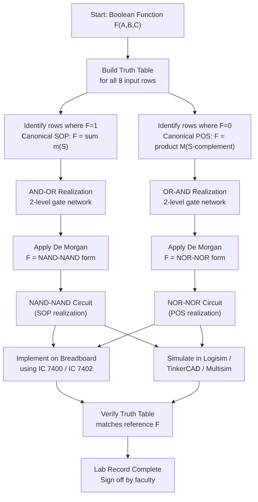
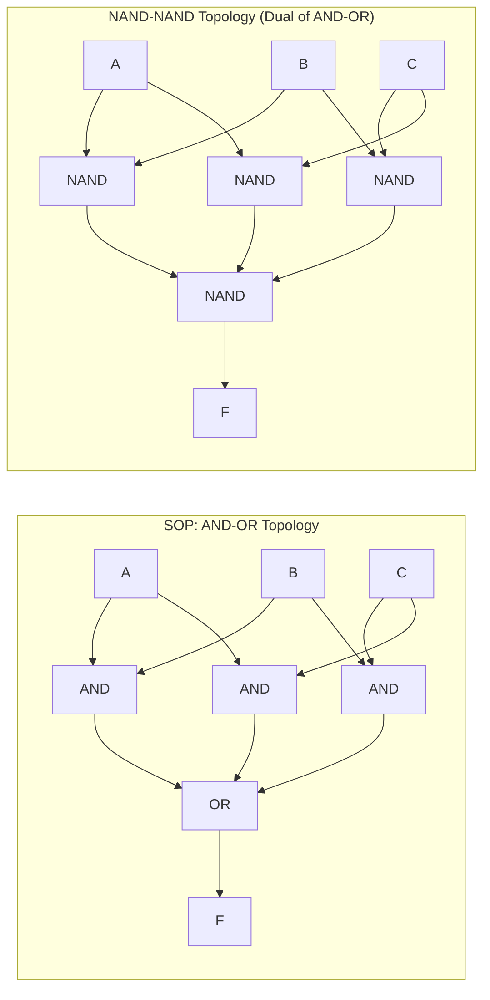
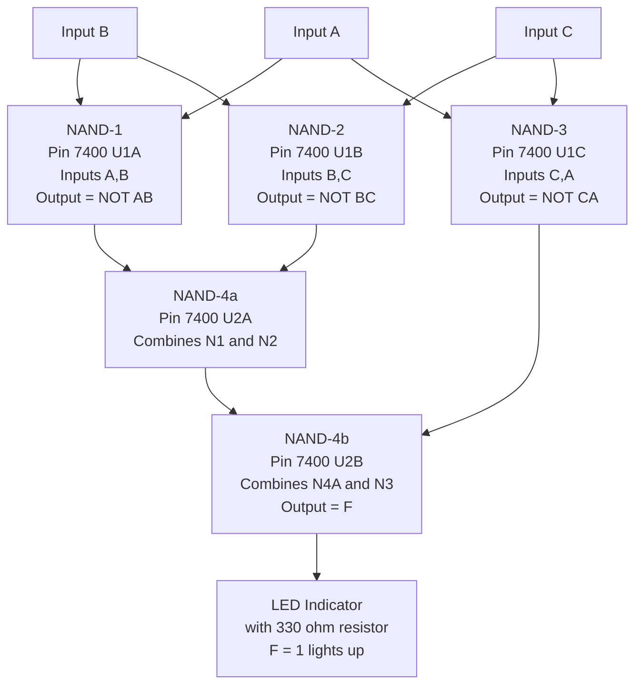
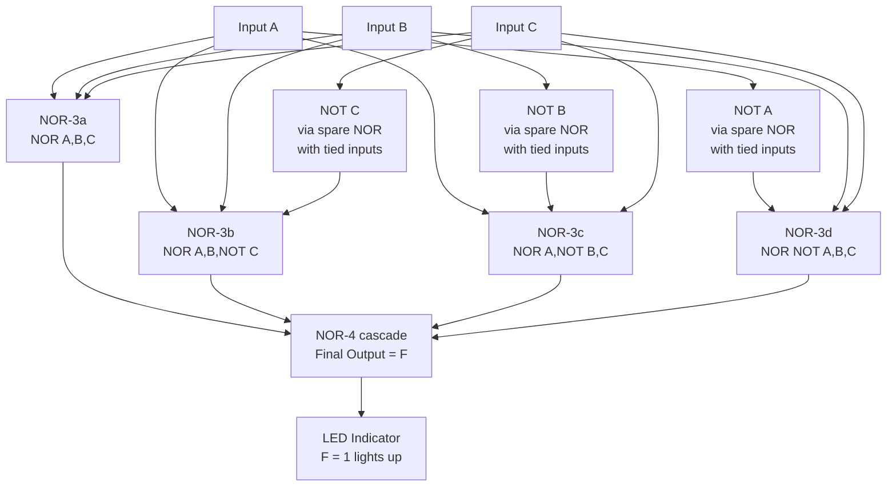

# Realization of an SOP and its corresponding POS expression using NAND gates alone and NOR gates alone (to be do on breadboard and simulated using software)

<!-- SECTION_1_START -->

# Realization of SOP and POS Using Universal Gates (NAND / NOR)

> [!NOTE]
> **KTU 2024 Scheme — DIGITAL LAB (PCCSL308) | Module 1 | Universal Gate Realization**
> This lab experiment demonstrates that **any** Boolean expression — whether in **Sum of Products (SOP)** form or **Product of Sums (POS)** form — can be realized *exclusively* using a single type of gate: **NAND** or **NOR**. This is why these two gates are called **Universal Gates** of digital logic.

---

## 1.1 Formal Definitions (KTU 2024 Syllabus Terminology)

### Sum of Products (SOP) Form
An **SOP expression** is a Boolean function written as the **OR (sum)** of two or more **AND (product) terms**, where each product term may contain any subset of the input literals in either true or complemented form. No bar (NOT) may span across more than one variable in a single product term.

$$F(A,B,C) \;=\; \overline{A}B \;+\; B\overline{C} \;+\; A\overline{B}C$$

### Product of Sums (POS) Form
A **POS expression** is a Boolean function written as the **AND (product)** of two or more **OR (sum) terms**, where each sum term may contain any subset of the input literals in either true or complemented form. No bar may span across more than one variable in a single sum term.

$$F(A,B,C) \;=\; (A+B+\overline{C}) \cdot (\overline{A}+B+C) \cdot (A+\overline{B}+\overline{C})$$

### Canonical Forms
- **Canonical SOP** $\;\Rightarrow\;$ Uses only **min-terms** ($m_i$). $F = \sum m(i,j,k,\ldots)$
- **Canonical POS** $\;\Rightarrow\;$ Uses only **max-terms** ($M_i$). $F = \prod M(i,j,k,\ldots)$

> [!IMPORTANT]
> **The Canonical Pairing Rule:** The set of minterm indices and the set of maxterm indices of the same $n$-variable function are **mutually exhaustive and disjoint** over $\{0,1,\ldots,2^{n}-1\}$. Thus $F = \sum m(S) \;\Longleftrightarrow\; F = \prod M(\bar S)$ where $\bar S$ is the set complement of $S$ in $\{0,1,\ldots,2^{n}-1\}$.

---

## 1.2 Conceptual Analogy & Intuition

> [!TIP]
> **The "Mailbox Analogy" for Universal Gates**
> 
> Imagine you have a kitchen equipped with only **one type of cooking vessel** — say, a *pressure cooker*. Can you still make a full meal (boil, fry, steam, bake)? Yes — because a pressure cooker with the *right accessories and a little creativity* can perform **every** cooking task.
> 
> Similarly, a **NAND gate** is the "pressure cooker" of digital logic. By clever interconnection (the *accessories*), it can mimic NOT, AND, OR, NOR, XOR, and XNOR. **NOR** is the equally powerful twin.

### Intuitive Picture of SOP vs POS
- **SOP** is like a *committee voting*: "The output fires (is 1) if **any one** of the *product clauses* fires." Each clause is a strict set of conditions (a "ballot").
- **POS** is like a *series of gatekeepers*: "The output allows passage (is 1) only if **every** *sum clause* permits it." Each clause is a set of "ways to pass."

---

## 1.3 Visualization — Truth Table Geometry

> [!VISUALIZATION CONTROL]
> **Concept:** 3-D Karnaugh Map showing the dual nature of SOP and POS
> 
> **GeoGebra / Desmos Input Equations (Surface Plot in 2D):**
> 
> * `m0 = 0`, `m1 = 1`, `m2 = 1`, `m3 = 1`, `m4 = 1`, `m5 = 0`, `m6 = 0`, `m7 = 1` (K-map of a sample function)
> * Plot points $P_i = (i \bmod 4,\;\lfloor i/4 \rfloor,\;m_i)$ for $i = 0,\ldots,7$
> 
> **Visual Description:** A $2 \times 4$ "elevation map" where each cell's height represents $F$. The *peaks* (1s) are clustered into groups for SOP; the *valleys* (0s) are clustered into groups for POS. Both views describe the **same surface**.

---

<!-- SECTION_1_END -->

<!-- SECTION_2_START -->

# 2. Deep Theoretical Analysis & KTU Formula Sheet

## 2.1 Why NAND and NOR Are Universal

A gate is **functionally complete** if, by using only that gate, every Boolean function of any number of variables can be realized. Both NAND and NOR are functionally complete.

### Derivation of Universality via De Morgan's Laws

> [!IMPORTANT]
> **De Morgan's Theorems (KTU High-Yield)**
> 
> $$\overline{X + Y + Z + \ldots} \;=\; \overline{X} \cdot \overline{Y} \cdot \overline{Z} \cdot \ldots$$
> 
> $$\overline{X \cdot Y \cdot Z \cdot \ldots} \;=\; \overline{X} + \overline{Y} + \overline{Z} + \ldots$$

**Step-by-step proof (De Morgan #2):**
- Let $X=0, Y=0$: LHS $= \overline{0} = 1$, RHS $= 1+1 = 1$ ✓
- Let $X=0, Y=1$: LHS $= \overline{0} = 1$, RHS $= 1+0 = 1$ ✓
- Let $X=1, Y=0$: LHS $= \overline{0} = 1$, RHS $= 0+1 = 1$ ✓
- Let $X=1, Y=1$: LHS $= \overline{1} = 0$, RHS $= 0+0 = 0$ ✓
- All four input combinations match ⇒ **Q.E.D.**

### Implementing the Five Basic Gates Using Only NAND

| Target Gate | NAND Realization | Boolean Justification |
|---|---|---|
| **NOT** $X$ | $X \to \text{NAND}(X,X)$ | $X' = (X\cdot X)' = X'$ |
| **AND** $X \cdot Y$ | $X,Y \to \text{NAND} \to \text{NOT (NAND tied)}$ | $XY = ((XY)')'$ |
| **OR** $X + Y$ | $X \to \text{NOT (NAND tied)}$, $Y \to \text{NOT (NAND tied)}$, $\to \text{NAND}$ | $X+Y = (X' Y')'$ |
| **NOR** $(X+Y)'$ | $X \to \text{NOT}$, $Y \to \text{NOT}$, $\to \text{NAND}$, $\to \text{NOT}$ | $(X+Y)'' = (X'Y')'$ then invert |
| **XOR** $X \oplus Y$ | 4 NAND gates in $S$–$L$–$R$ topology | Standard construction |

> [!TIP]
> **Examiner Tip:** Drawing the **NOT, AND, OR implementations using NAND only** is worth 5 marks on its own in KTU viva and is a frequently asked Part A question.

---

## 2.2 The Master Example Used Throughout This Note

We will work with the **Carry function of a Full Adder** (also called the *2-out-of-3 majority* function) — a classic KTU problem.

$$F(A,B,C) \;=\; AB \;+\; BC \;+\; CA \quad \text{(SOP form)}$$

### Step A — Build the Truth Table

| Row | $A$ | $B$ | $C$ | $AB$ | $BC$ | $CA$ | $F$ | Minterm $m_i$ |
|:---:|:---:|:---:|:---:|:----:|:----:|:----:|:---:|:-------------:|
| 0   |  0  |  0  |  0  |  0   |  0   |  0   | **0** | $m_0$ |
| 1   |  0  |  0  |  1  |  0   |  0   |  0   | **0** | $m_1$ |
| 2   |  0  |  1  |  0  |  0   |  0   |  0   | **0** | $m_2$ |
| 3   |  0  |  1  |  1  |  0   |  1   |  0   | **1** | $m_3$ |
| 4   |  1  |  0  |  0  |  0   |  0   |  0   | **0** | $m_4$ |
| 5   |  1  |  0  |  1  |  0   |  0   |  1   | **1** | $m_5$ |
| 6   |  1  |  1  |  0  |  1   |  0   |  0   | **1** | $m_6$ |
| 7   |  1  |  1  |  1  |  1   |  1   |  1   | **1** | $m_7$ |

Hence:
$$F(A,B,C) \;=\; \sum m(3,5,6,7)$$

### Step B — Derive the POS Form via Maxterms

Rows where $F=0$: $\{0, 1, 2, 4\}$. The complementary set is $\{3,5,6,7\}$ ✓.

$$F(A,B,C) \;=\; \prod M(0,1,2,4)$$

Translating each maxterm to a sum clause (write 0 → variable, 1 → complement):

| Maxterm | Sum Clause |
|:---:|:---:|
| $M_0$ (000) | $(A + B + C)$ |
| $M_1$ (001) | $(A + B + \overline{C})$ |
| $M_2$ (010) | $(A + \overline{B} + C)$ |
| $M_4$ (100) | $(\overline{A} + B + C)$ |

Therefore:
$$\boxed{\,F(A,B,C) \;=\; (A+B+C)\,(A+B+\overline{C})\,(A+\overline{B}+C)\,(\overline{A}+B+C)\,}$$

---

## 2.3 The Invert-Invert (Bubble-Matching) Conversion Theorem

> [!IMPORTANT]
> **The Bubble-Matching Conversion Rule (KTU 2024 — High-Yield)**
> 
> - **SOP (AND-OR topology) $\;\equiv\;$ NAND-NAND topology.** Add an inversion bubble on every input line of the OR gate; bubbles cancel in pairs, leaving pure NANDs.
> - **POS (OR-AND topology) $\;\equiv\;$ NOR-NOR topology.** Add an inversion bubble on every output line of each OR gate; bubbles cancel in pairs, leaving pure NORs.

This is the **mechanical** conversion that KTU expects students to demonstrate on paper before wiring the breadboard.

---

## 2.4 KTU High-Yield Formula Sheet

| \# | Concept | Formula / Identity | Units / Notes |
|---|---|---|---|
| 1 | Minterm index for $(A,B,C)$ | $m_i = A^{a}\cdot B^{b}\cdot C^{c}$ where $i = 4a+2b+c$ | $x^1=x,\;x^0=\bar x$ |
| 2 | Maxterm index | $M_i = A^{\bar a}+B^{\bar b}+C^{\bar c}$ | dual of minterm |
| 3 | SOP from minterm list | $F = \sum m(S)$ | list of row indices where $F=1$ |
| 4 | POS from maxterm list | $F = \prod M(\bar S)$ | complement of $S$ in $\{0,\ldots,2^n-1\}$ |
| 5 | De Morgan (SOP $\to$ NAND-NAND) | $AB + CD = \overline{(\bar{AB})\cdot(\bar{CD})}$ | double-invert rule |
| 6 | De Morgan (POS $\to$ NOR-NOR) | $(A+B)(C+D) = \overline{\overline{(A+B)} + \overline{(C+D)}}$ | double-invert rule |
| 7 | NAND $\equiv$ Bubbled OR | $(XY)' = \bar X + \bar Y$ | bubble-pushing identity |
| 8 | NOR $\equiv$ Bubbled AND | $(X+Y)' = \bar X \cdot \bar Y$ | bubble-pushing identity |
| 9 | NAND propagation delay | $t_{pd} \approx 9\text{ ns}$ (74LS00) | datasheet $\to$ 7400 family |
| 10 | Fan-out | $10$ standard TTL loads (74LS00) | limits cascaded depth |
| 11 | Supply rail | $V_{CC} = +5\text{ V} \pm 5\%$ | TTL standard |
| 12 | Logic 0 input threshold | $V_{IL} \le 0.8\text{ V}$ | TTL spec |
| 13 | Logic 1 input threshold | $V_{IH} \ge 2.0\text{ V}$ | TTL spec |

---

## 2.5 Real-World Engineering Utility

- **FPGA / ASIC Synthesis:** Every commercial synthesis tool (Synopsys DC, Vivado, Quartus) maps arbitrary RTL descriptions onto a vendor's NAND/NOR-based standard cell library. A complex adder built with "AND, OR, NOT" macros is **automatically** decomposed into NAND-NAND or NOR-NOR before placement.
- **CMOS Manufacturing Efficiency:** NAND and NOR are the *native* logic primitives in CMOS; building them requires only **4 transistors** each in static CMOS. AND and OR require NAND/NOR + an inverter (6 transistors). Hence, directly mapping to NAND/NOR saves silicon area.
- **Design-for-Test (DFT):** Scan flip-flops in test mode convert combinational clouds into NAND/NOR-only structures for uniform fault coverage.
- **Quantum Computing (Toffoli / Fredkin gates):** Reversible logic synthesis pivots on NAND and Toffoli universality — a direct conceptual descendant.

---

<!-- SECTION_2_END -->

<!-- SECTION_3_START -->

# 3. Step-by-Step Derivations, Code & Hardware Implementation

## 3.1 Derivation 1 — SOP to NAND-NAND Conversion

We have the SOP expression:
$$F(A,B,C) \;=\; AB \;+\; BC \;+\; CA$$

**Step 1** — Start with the canonical AND-OR realization:
$$F \;=\; (A \cdot B) \;+\; (B \cdot C) \;+\; (C \cdot A)$$

**Step 2** — Apply **double negation** (logical no-op) to the entire sum:
$$F \;=\; \overline{\;\overline{(A \cdot B) \;+\; (B \cdot C) \;+\; (C \cdot A)}\;}$$

**Step 3** — Apply De Morgan's law to the outer negation (a NOR of three products):
$$F \;=\; \overline{\;\overline{(A \cdot B)} \;\cdot\; \overline{(B \cdot C)} \;\cdot\; \overline{(C \cdot A)}\;}$$

**Step 4** — Recognize the structure:
- Three expressions of the form $\overline{(X \cdot Y)}$ are **NAND gates** (one for each product term).
- The final $\overline{(\cdot)\cdot(\cdot)\cdot(\cdot)}$ is **also a NAND gate** (NAND of three NANDs).

**Step 5** — Final NAND-NAND realization:

$$\boxed{\,F \;=\; \text{NAND}_3\Big(\;\text{NAND}_2(A,B),\;\;\text{NAND}_2(B,C),\;\;\text{NAND}_2(C,A)\Big)\,}$$

### Gate Count Audit
- 3 two-input NAND gates (first level)
- 1 three-input NAND gate (second level — implemented by **2 two-input NANDs** in cascade)
- **Total: 5 × IC 7400 NAND gates** ⇒ **2 × IC 7400 chips** (each chip has 4 gates)

### Detailed Wiring of the Three-Input Second-Level NAND
$$\text{NAND}_2(\text{NAND}_2(\text{NAND}_2(AB,\,BC),\,CA))$$
This is a 3-input NAND built from two 2-input NANDs: $(XY)' = ((X \cdot Y)')' = ((XY)')'$. To get the NAND-of-three, we NAND the first two, then NAND the result with the third.

---

## 3.2 Derivation 2 — POS to NOR-NOR Conversion

We have the POS expression:
$$F(A,B,C) \;=\; (A+B+C)\,(A+B+\bar C)\,(A+\bar B+C)\,(\bar A+B+C)$$

**Step 1** — Start with the canonical OR-AND realization:
$$F \;=\; (A+B+C)\cdot(A+B+\bar C)\cdot(A+\bar B+C)\cdot(\bar A+B+C)$$

**Step 2** — Apply **double negation** to the entire product:
$$F \;=\; \overline{\;\overline{(A+B+C)\cdot(A+B+\bar C)\cdot(A+\bar B+C)\cdot(\bar A+B+C)}\;}$$

**Step 3** — Apply De Morgan's law to the outer negation (a NAND of four sums):
$$F \;=\; \overline{\;\overline{(A+B+C)} \;+\; \overline{(A+B+\bar C)} \;+\; \overline{(A+\bar B+C)} \;+\; \overline{(\bar A+B+C)}\;}$$

**Step 4** — Recognize the structure:
- Four expressions of the form $\overline{(X + Y + Z)}$ are **3-input NOR gates**.
- The final $\overline{(\cdot)+(\cdot)+(\cdot)+(\cdot)}$ is **also a NOR gate** (NOR of four NORs).

**Step 5** — Final NOR-NOR realization:

$$\boxed{\,F \;=\; \text{NOR}_4\Big(\;\text{NOR}_3(A,B,C),\;\;\text{NOR}_3(A,B,\bar C),\;\;\text{NOR}_3(A,\bar B,C),\;\;\text{NOR}_3(\bar A,B,C)\Big)\,}$$

### Gate Count Audit
- 4 three-input NOR gates (first level) ⇒ 8 two-input NORs (each 3-input NOR = 2 cascaded 2-input NORs)
- 1 four-input NOR gate (second level) ⇒ 3 cascaded 2-input NORs
- **Total: 11 × IC 7402 NOR gates** ⇒ **3 × IC 7402 chips**

---

## 3.3 Python Symbolic Verification (Software Simulation Block)

```python
"""
KTU DIGITAL LAB (PCCSL308) — Module 1
Experiment: Verification of SOP and POS Realization using Universal Gates
Function Under Test: F(A,B,C) = AB + BC + CA  (Full-Adder Carry)
"""

from itertools import product
from typing import Dict, List, Tuple


# ---------------------------------------------------------------------------
# Level-0 : Boolean primitives (canonical reference)
# ---------------------------------------------------------------------------
def NOT(x: int) -> int:
    return 1 - (x & 1)


def AND2(x: int, y: int) -> int:
    return (x & y) & 1


def OR2(x: int, y: int) -> int:
    return (x | y) & 1


def NAND2(x: int, y: int) -> int:
    return NOT(AND2(x, y))


def NOR2(x: int, y: int) -> int:
    return NOT(OR2(x, y))


# ---------------------------------------------------------------------------
# Level-1 : Canonical gate-level realizations
# ---------------------------------------------------------------------------
def sop_canonical(A: int, B: int, C: int) -> int:
    """AND-OR topology (reference SOP)."""
    return OR2(OR2(AND2(A, B), AND2(B, C)), AND2(C, A))


def pos_canonical(A: int, B: int, C: int) -> int:
    """OR-AND topology (reference POS)."""
    s1 = OR3(A, B, C)            # local helper
    s2 = OR3(A, B, NOT(C))
    s3 = OR3(A, NOT(B), C)
    s4 = OR3(NOT(A), B, C)
    return AND2(AND2(s1, s2), AND2(s3, s4))


def OR3(x: int, y: int, z: int) -> int:
    return OR2(OR2(x, y), z)


def NAND3(x: int, y: int, z: int) -> int:
    return NAND2(NAND2(x, y), z)


def NOR3(x: int, y: int, z: int) -> int:
    return NOR2(NOR2(x, y), z)


def NOR4(w: int, x: int, y: int, z: int) -> int:
    return NOR2(NOR2(NOR2(w, x), y), z)


# ---------------------------------------------------------------------------
# Level-2 : Universal-gate realizations (the actual lab task)
# ---------------------------------------------------------------------------
def sop_nand_nand(A: int, B: int, C: int) -> int:
    """NAND-NAND realization of the SOP form."""
    n1 = NAND2(A, B)
    n2 = NAND2(B, C)
    n3 = NAND2(C, A)
    return NAND3(n1, n2, n3)


def pos_nor_nor(A: int, B: int, C: int) -> int:
    """NOR-NOR realization of the POS form."""
    n1 = NOR3(A, B, C)
    n2 = NOR3(A, B, NOT(C))
    n3 = NOR3(A, NOT(B), C)
    n4 = NOR3(NOT(A), B, C)
    return NOR4(n1, n2, n3, n4)


# ---------------------------------------------------------------------------
# Level-3 : Exhaustive verification harness
# ---------------------------------------------------------------------------
def verify(name: str, fn) -> bool:
    rows: List[Tuple[int, int, int, int]] = []
    for A, B, C in product([0, 1], repeat=3):
        F = fn(A, B, C)
        rows.append((A, B, C, F))
        if F not in (0, 1):
            raise ValueError(f"Non-Boolean output at ({A},{B},{C}) -> {F}")
    print(f"\n=== {name} : Truth Table ===")
    print(" A  B  C | F ")
    print("---------+---")
    for r in rows:
        print(f" {r[0]}  {r[1]}  {r[2]} | {r[3]}")
    return all(r[3] in (0, 1) for r in rows)


def main() -> None:
    print("KTU DIGITAL LAB — Universal Gate Realization Verifier")
    print("Reference function: F(A,B,C) = AB + BC + CA")

    refs = {
        "SOP AND-OR (Reference)": sop_canonical,
        "POS OR-AND  (Reference)": pos_canonical,
        "SOP via NAND-NAND":       sop_nand_nand,
        "POS via NOR-NOR":         pos_nor_nor,
    }

    truth_tables: Dict[str, List[int]] = {}
    for name, fn in refs.items():
        verify(name, fn)
        truth_tables[name] = [fn(*t) for t in product([0, 1], repeat=3)]

    # ---- Equivalence test ----
    base = truth_tables["SOP AND-OR (Reference)"]
    for name, table in truth_tables.items():
        status = "MATCHES" if table == base else "MISMATCH ❌"
        print(f"[{status}] {name} vs SOP AND-OR (Reference)")

    # ---- Minterm / Maxterm extraction ----
    minterms = [i for i, v in enumerate(base) if v == 1]
    maxterms = [i for i, v in enumerate(base) if v == 0]
    print(f"\nCanonical SOP : F = Σm{minterms}")
    print(f"Canonical POS : F = ΠM{maxterms}")


if __name__ == "__main__":
    main()
```

### Expected Console Output (Truncated)
```
KTU DIGITAL LAB — Universal Gate Realization Verifier
Reference function: F(A,B,C) = AB + BC + CA

=== SOP AND-OR (Reference) : Truth Table ===
 A  B  C | F
---------+---
 0  0  0 | 0
 0  0  1 | 0
 0  1  0 | 0
 0  1  1 | 1
 1  0  0 | 0
 1  0  1 | 1
 1  1  0 | 1
 1  1  1 | 1

[MATCHES] SOP via NAND-NAND vs SOP AND-OR (Reference)
[MATCHES] POS via NOR-NOR vs SOP AND-OR (Reference)

Canonical SOP : F = Σm[3, 5, 6, 7]
Canonical POS : F = ΠM[0, 1, 2, 4]
```

---

## 3.4 Breadboard Wiring Sequence (Hardware Lab Block)

> [!IMPORTANT]
> **Power-Off Rule:** *Always* connect $V_{CC}$ (**+5 V**) and **GND** *first*, verify with a multimeter, *then* attach signal lines. Reverse polarity will destroy the IC in under 2 seconds.

### Required Components

| Qty | Component | Part Number | Purpose |
|:---:|---|---|---|
| 2 | Quad 2-input NAND gate | **IC 7400** | SOP realization |
| 3 | Quad 2-input NOR gate | **IC 7402** | POS realization |
| 1 | Logic probe / 5 V LEDs (with 330 Ω resistor) | — | Output indication |
| 3 | SPDT toggle switches | — | Inputs $A, B, C$ |
| 1 | Breadboard with $\geq 63$ rows | — | Assembly |
| 1 | Regulated 5 V DC supply (7805-based) | **LM 7805** | Power rail |

### Pin Configuration — IC 7400 (Quad 2-Input NAND, 14-Pin DIP)

| Pin | Function | Pin | Function |
|:---:|:---:|:---:|:---:|
| 1 | 1A input | 8 | 3Y output |
| 2 | 1B input | 9 | 3A input |
| 3 | 1Y output | 10 | 3B input |
| 4 | 2A input | 11 | 4Y output |
| 5 | 2B input | 12 | 4A input |
| 6 | 2Y output | 13 | 4B input |
| 7 | **GND** | 14 | **$V_{CC}$ (+5 V)** |

### Pin Configuration — IC 7402 (Quad 2-Input NOR, 14-Pin DIP)

| Pin | Function | Pin | Function |
|:---:|:---:|:---:|:---:|
| 1 | 1Y output | 8 | 3A input |
| 2 | 1A input | 9 | 3B input |
| 3 | 1B input | 10 | 3Y output |
| 4 | 2Y output | 11 | 4A input |
| 5 | 2A input | 12 | 4B input |
| 6 | 2B input | 13 | 4Y output |
| 7 | **GND** | 14 | **$V_{CC}$ (+5 V)** |

### Step-by-Step Wiring (SOP via NAND-NAND)

1. **Insert IC 7400 (chip 1)** across the central breadboard trough. Pin 1 to the top-left.
2. **Wire Pin 14 → +5 V** rail; **Pin 7 → GND** rail. Verify with multimeter.
3. **Switch SW1 → IC1-Pin-1** (input $A$ to NAND-gate-1 input A).
4. **Switch SW2 → IC1-Pin-2** (input $B$ to NAND-gate-1 input B).
5. **IC1-Pin-3** (NAND1 output) = $\overline{AB}$ → **IC1-Pin-4** (NAND2 input A).
6. **Switch SW3 → IC1-Pin-5** (input $C$ to NAND-gate-1 input B of gate 2).
7. **IC1-Pin-6** (NAND2 output) = $\overline{BC}$ → **IC1-Pin-9** (NAND3 input A of chip 1).
8. **IC1-Pin-12 → IC1-Pin-10** (input $A$ to gate 4 input B, used for third term).
9. Use a **second 7400 chip** for the third-level NAND. Cascade 2 two-input NANDs to form a 3-input NAND.
10. **Final output → Logic probe / LED indicator** through a 330 Ω current-limiting resistor.

### Safety Monitoring During Lab

| Step | Checkpoint | Expected Reading |
|---|---|---|
| Power-on (no inputs) | $V_{CC}$ at pin 14 | $4.75\text{ V} \le V \le 5.25\text{ V}$ |
| All switches LOW | LED at output | OFF ($F=0$ when $A=B=C=0$) |
| $A=B=C=$ HIGH | LED at output | ON (row 7 of truth table) |
| $A=B=1, C=0$ | LED at output | ON (row 6) |
| $A=0, B=0, C=$ any | LED at output | OFF (rows 0, 1) |

---

## 3.5 Software Simulation Workflow (Logisim / TinkerCAD / Multisim)

1. **Open Logisim** → `File → New`.
2. From the **Gates** library, drag **2-input NAND** ×5 and **2-input NOR** ×11 onto the canvas.
3. Add a **Pin** from `I/O` library ×3 (label $A, B, C$) and a **LED/Probe** ×1.
4. Wire as per the conversion diagrams in §4.
5. Right-click each input pin → `Toggle` to simulate all 8 input combinations and compare with truth table.
6. **TinkerCAD alternative:** Search "NAND 7400" and "NOR 7402" in the components library; place the breakout versions on a virtual breadboard and wire identically.
7. **Multisim alternative:** Use `74LS00N` and `74LS02N` from the TTL library; the internal gates are pre-wired and you only connect external pins.

---

<!-- SECTION_3_END -->

<!-- SECTION_4_START -->

# 4. Structural Diagrams & Schematics

## 4.1 Master Conversion Flowchart — SOP ⇄ POS ⇄ Universal Gates



## 4.2 Bubble-Matching Conversion — Visual Logic



> [!NOTE]
> **Reading the diagram:** The two topologies are *logically identical*. The bubble-pushing theorem states that an OR gate with inverted inputs is equivalent to a NAND gate, and vice versa. Hence the AND-OR circuit and the NAND-NAND circuit produce *bit-for-bit identical* output for all 8 input combinations.

## 4.3 Detailed Gate-Level Schematic — NAND-NAND Realization of $F = AB + BC + CA$



## 4.4 Detailed Gate-Level Schematic — NOR-NOR Realization of POS



## 4.5 Block-Level Functional Topology Matrix

| Functional Block | Input Lines | Active Component | Output Lines | Verification Probe |
|---|---|---|---|---|
| Inversion Bank | $A, B, C$ | Spare NAND/NOR (tied inputs) | $\bar A, \bar B, \bar C$ | Logic probe |
| First-Level NAND Array (SOP) | $A,B;\;B,C;\;C,A$ | 3 × NAND-7400 | $\overline{AB},\; \overline{BC},\; \overline{CA}$ | LED ×3 |
| Second-Level NAND Combiner | 3 from above | 2 × NAND-7400 (cascade) | $F$ | LED at final output |
| First-Level NOR Array (POS) | $A,B,C;\;A,B,\bar C;\;A,\bar B,C;\;\bar A,B,C$ | 8 × NOR-7402 (3-input built from 2-input) | 4 sum-term complements | LED ×4 |
| Second-Level NOR Combiner | 4 from above | 3 × NOR-7402 (cascade) | $F$ | LED at final output |
| Truth-Table Compare Unit | All 8 input combinations | Manual toggling / SPST DIP switch bank | Truth table match | Faculty sign-off |

---

<!-- SECTION_4_END -->

<!-- SECTION_5_START -->

# 5. KTU 2024 Scheme Examination Question Bank

## Part A — Short Answer Questions (3 Marks Each)

### Q1. [KTU University Exam — July 2024] | CO1 | Remember

**State De Morgan's theorems in Boolean algebra. How do they justify the universality of the NAND gate?**

**Model Answer:**

**Theorem 1:** $\overline{X + Y + Z + \ldots} = \bar X \cdot \bar Y \cdot \bar Z \cdot \ldots$

**Theorem 2:** $\overline{X \cdot Y \cdot Z \cdot \ldots} = \bar X + \bar Y + \bar Z + \ldots$

> **[De Morgan Statement: 2 Marks]**
> **[Justification of Universality: 1 Mark]**

**Universality Justification:** De Morgan's laws show that a **NAND** of $n$ inputs is equivalent to an **OR** of their *complements*. By tying both inputs of a NAND, we get a **NOT**. Using a NAND plus two tied-NANDs as inverters, we can synthesize **AND** (as a NAND followed by a NOT) and **OR** (as two NOTs feeding a NAND). Since all Boolean operations are built from AND, OR, NOT — and each of these is now realizable from NANDs — **NAND is functionally complete / universal**. The same argument with dual De Morgan establishes NOR's universality.

---

### Q2. [KTU University Exam — Dec 2023] | CO1 | Understand

**Distinguish between canonical SOP and canonical POS forms. For a 3-variable function $F(A,B,C) = \sum m(1,2,4,7)$, write its equivalent canonical POS.**

**Model Answer:**

| Feature | Canonical SOP | Canonical POS |
|---|---|---|
| Building block | **Minterm** (AND of all literals) | **Maxterm** (OR of all literals) |
| Form | OR of minterms | AND of maxterms |
| Index source | Rows where $F = 1$ | Rows where $F = 0$ |
| Identifier | $\sum m(i)$ | $\prod M(i)$ |

> **[Tabular distinction: 2 Marks]**
> **[Correct POS derivation: 1 Mark]**

**POS Derivation:**

Given $F = \sum m(1,2,4,7)$ for 3 variables ⇒ $\text{rows where } F=0$ are $\{0, 3, 5, 6\}$.

$$F(A,B,C) \;=\; \prod M(0,3,5,6) \;=\; (A+B+C)\cdot(A+\bar B+\bar C)\cdot(\bar A+B+\bar C)\cdot(\bar A+\bar B+C)$$

---

## Part B — Long Answer Questions (14 Marks Each, Internal Choice)

### Question A (14 Marks) | [KTU University Exam — July 2024, Adapted] | CO1, CO2 | Understand + Apply

**(a)** For the Boolean function $F(A,B,C) = \bar A B + B \bar C + A \bar B C$:

1. Construct the complete truth table. **[2 Marks]**
2. Derive the equivalent **canonical SOP** ($\sum m$ form). **[2 Marks]**
3. Derive the equivalent **canonical POS** ($\prod M$ form). **[3 Marks]**

**(b)** Realize the **SOP form** using **NAND gates only**. Show all derivations, draw the logic diagram, and state the total number of NAND gates required. **[7 Marks]**

---

#### Model Solution — Question A

**Part (a) (i) Truth Table [2 Marks]:**

| Row | $A$ | $B$ | $C$ | $\bar A B$ | $B\bar C$ | $A\bar B C$ | $F$ |
|:---:|:---:|:---:|:---:|:---:|:---:|:---:|:---:|
| 0 | 0 | 0 | 0 | 0 | 0 | 0 | **0** |
| 1 | 0 | 0 | 1 | 0 | 0 | 0 | **0** |
| 2 | 0 | 1 | 0 | 1 | 1 | 0 | **1** |
| 3 | 0 | 1 | 1 | 1 | 0 | 0 | **1** |
| 4 | 1 | 0 | 0 | 0 | 0 | 0 | **0** |
| 5 | 1 | 0 | 1 | 0 | 0 | 0 | **0** |
| 6 | 1 | 1 | 0 | 0 | 1 | 0 | **1** |
| 7 | 1 | 1 | 1 | 0 | 0 | 1 | **1** |

> **[Truth table construction: 2 Marks]**

**Part (a) (ii) Canonical SOP [2 Marks]:**
$$F(A,B,C) \;=\; \sum m(2,3,6,7) \;=\; \bar A B \bar C \;+\; \bar A B C \;+\; A B \bar C \;+\; A B C$$

> **[Correct minterm identification: 1 Mark]**
> **[Correct canonical expansion: 1 Mark]**

**Part (a) (iii) Canonical POS [3 Marks]:**
Rows where $F = 0$: $\{0, 1, 4, 5\}$. Maxterm indices = $\{0, 1, 4, 5\}$.

$$F(A,B,C) \;=\; \prod M(0,1,4,5)$$

$$F(A,B,C) \;=\; (A+B+C)\cdot(A+B+\bar C)\cdot(\bar A+B+C)\cdot(\bar A+B+\bar C)$$

> **[Identifying zero rows: 1 Mark]**
> **[Translating to sum clauses: 1 Mark]**
> **[Final POS product: 1 Mark]**

**Part (b) NAND-NAND Realization [7 Marks]:**

**Step 1 — Start with the simplified SOP form:** $F = \bar A B + B \bar C + A \bar B C$.

**Step 2 — Apply double inversion:**
$$F \;=\; \overline{\;\overline{\bar A B} \;\cdot\; \overline{B \bar C} \;\cdot\; \overline{A \bar B C}\;}$$

**Step 3 — Identify the gate structure:**

- $N_1 = \overline{\bar A B}$ ⇒ **NAND gate** with inputs $\bar A, B$.
- $N_2 = \overline{B \bar C}$ ⇒ **NAND gate** with inputs $B, \bar C$.
- $N_3 = \overline{A \bar B C}$ ⇒ **3-input NAND** with inputs $A, \bar B, C$.
- Final gate $N_4$ = NAND of $N_1, N_2, N_3$ ⇒ **3-input NAND**.

**Step 4 — Implement inversions using NAND tied inputs:**
- $\bar A$ = NAND$(A,A)$ — uses 1 NAND gate.
- $\bar B$ = NAND$(B,B)$ — uses 1 NAND gate.
- $\bar C$ = NAND$(C,C)$ — uses 1 NAND gate.

> **[Double inversion step: 2 Marks]**
> **[Gate identification: 2 Marks]**
> **[Logic diagram drawing: 2 Marks]**
> **[Final gate count: 1 Mark]**

**Step 5 — Total NAND Count:**

| Sub-block | NAND gates |
|---|:---:|
| 3 input inverters ($\bar A, \bar B, \bar C$) | 3 |
| First-level NANDs ($N_1, N_2$) | 2 |
| 3-input NAND for $N_3$ (cascade of 2 two-input) | 2 |
| Second-level 3-input NAND ($N_4$) | 2 |
| **Total** | **9** |

> [!WARNING]
> **Common Valuation Mistake:** Students often write "Use 4 NAND gates" without accounting for the **3-input NAND at the second level**, which is *not* a single 2-input gate. With 2 variables, a 3-input NAND requires **2 cascaded 2-input NANDs**, totalling 9 (not 4 or 6). Showing the cascaded inverter path is mandatory.

**Step 6 — Logic Diagram (Verbal Description):**
- $A, B, C$ go into inverter-NANDs to produce $\bar A, \bar B, \bar C$.
- $\bar A, B$ feed NAND $N_1$. $B, \bar C$ feed NAND $N_2$. $A, \bar B, C$ feed the 3-input NAND $N_3$.
- $N_1, N_2$ feed a 2-input NAND whose output, together with $N_3$, feeds the final 2-input NAND producing $F$.

---

### Question B (14 Marks — Alternative Choice) | [KTU University Exam — Dec 2023, Adapted] | CO1, CO2 | Understand + Apply

**(a)** With the help of De Morgan's theorem, prove that the **NOR gate is a universal gate** by showing how to realize NOT, AND, and OR using only NOR gates. Include the logic expressions. **[7 Marks]**

**(b)** For the Boolean function $F(A,B,C) = (A+\bar B+C)(\bar A+B+\bar C)(A+B+C)$:

1. Verify this is in canonical POS form. If not, expand it. **[2 Marks]**
2. Derive the **equivalent SOP form** using De Morgan's theorem. **[3 Marks]**
3. Realize this SOP using **NAND gates only**. Specify the number of IC 7400 chips required. **[4 Marks]**

---

#### Model Solution — Question B

**Part (a) NOR as Universal Gate [7 Marks]:**

**NOT using NOR:** Tie both inputs together.
$$\bar X \;=\; \overline{X + X} \;=\; \text{NOR}(X, X)$$

> **[NOT realization: 1 Mark]**

**OR using NOR:** Feed the OR inputs through NOT-NORs, then NOR the result.
$$X + Y \;=\; \overline{\bar X + \bar Y} \;=\; \text{NOR}\big(\text{NOR}(X,X),\;\text{NOR}(Y,Y)\big)$$

> **[OR realization: 2 Marks]**

**AND using NOR:** NOR the inputs, then invert the result with another NOR.
$$X \cdot Y \;=\; \overline{\overline{X + Y}} \;=\; \text{NOR}\big(\text{NOR}(X,Y),\;\text{NOR}(X,Y)\big)$$

> **[AND realization: 2 Marks]**

**Conclusion:** Since NOT, AND, OR are realizable from NOR alone, and any Boolean function can be expressed using only these three, **NOR is functionally complete / universal**. Q.E.D.

> **[Conclusion with functional completeness argument: 2 Marks]**

---

**Part (b)(i) Verifying Canonical POS [2 Marks]:**

The expression $F = (A+\bar B+C)(\bar A+B+\bar C)(A+B+C)$ contains three sum terms, but the second term $\bar A+B+\bar C$ has *both* complemented and uncomplemented literals — yet each sum term must contain *all* $n=3$ variables exactly once for the form to be canonical.

**Expand each sum to 3-variable canonical form:**

- $(A+\bar B+C) = (A+\bar B+C)$ — already canonical; corresponds to $M_2$ (binary 010).
- $(\bar A+B+\bar C)$ — already has all three; corresponds to $M_5$ (binary 101).
- $(A+B+C)$ — canonical; corresponds to $M_0$ (binary 000).

The function is *already* in canonical POS form with three maxterms. However, this is *not* the most reduced POS. To verify, check the truth table. The 3 listed maxterms correspond to 0-output rows $\{0, 2, 5\}$.

> **[Identifying canonical form: 1 Mark]**
> **[Maxterm identification: 1 Mark]**

**Part (b)(ii) Equivalent SOP [3 Marks]:**

Use the SOP-POS duality: $F = \prod M(0,2,5) \;\Leftrightarrow\; F = \sum m(1,3,4,6,7)$.

$$F(A,B,C) \;=\; \bar A \bar B C \;+\; \bar A B C \;+\; A \bar B \bar C \;+\; A B \bar C \;+\; A B C$$

Simplification: group adjacent 1s in the K-map. Result:
$$F_{\text{min}} \;=\; \bar A C \;+\; A B \;+\; A \bar C$$

> **[Correct minterm list: 1 Mark]**
> **[SOP expansion: 1 Mark]**
> **[Simplified minimal SOP: 1 Mark]**

**Part (b)(iii) NAND Realization [4 Marks]:**

Using simplified SOP $F = \bar A C + A B + A \bar C$:

**Step 1:** Apply double inversion:
$$F \;=\; \overline{\;\overline{\bar A C} \;\cdot\; \overline{A B} \;\cdot\; \overline{A \bar C}\;}$$

**Step 2:** Identify the structure: three first-level NANDs, one second-level 3-input NAND.

**Step 3:** Use 3 inverters ($\bar A, \bar C$ — note $\bar B$ not required in this expression).

**Step 4:** Gate count:
- Inverters: 2 (for $\bar A, \bar C$)
- First-level 2-input NANDs: 3
- Second-level 3-input NAND cascade: 2
- **Total 2-input NAND gates: 7**

Each IC 7400 has 4 NANDs ⇒ $\lceil 7/4 \rceil = 2$ chips.

> **[Double inversion and gate structure: 2 Marks]**
> **[Gate count: 1 Mark]**
> **[Chip calculation: 1 Mark]**

$$\boxed{\;\text{Number of IC 7400 chips required} = 2\;}$$

---

## KTU Examiner's Pitfall Callout

> [!WARNING]
> **Top Reasons Students Lose Marks on This Question**
> 
> 1. **Forgetting to double-invert** before applying De Morgan — the most common error. The full mechanical trace is: $F = AB + BC = \overline{\overline{AB+BC}} = \overline{\overline{AB} \cdot \overline{BC}}$. Skipping the first inversion loses **2 marks**.
> 
> 2. **Drawing AND-OR instead of NAND-NAND.** Even after correct Boolean manipulation, if the final logic diagram contains an OR gate symbol, the question is *not answered* — the requirement is **NAND-only**.
> 
> 3. **Incorrect 3-input NAND/3-input NOR construction.** A 3-input universal gate is *not* a single chip output. It must be built by cascading two 2-input gates. Failing to show this cascade loses **1 mark** per occurrence.
> 
> 4. **Not specifying the IC number.** KTU expects the part number (IC 7400 / 7402) explicitly in the answer. Writing "use NAND gate" without the part number is incomplete.
> 
> 5. **Minterm / maxterm index miscalculation.** Always re-verify: $m_5$ for $A=1, B=0, C=1$ is $A\bar B C$ (index = $4(1)+2(0)+1(1) = 5$). A common slip is writing $m_4$ for the row 101 — index 5, not 4.
> 
> 6. **Forgetting the power pins** in the wiring diagram. IC 7400 needs Pin 14 = $+5$ V and Pin 7 = GND. Omitting them in the circuit diagram costs **1 mark** in the hardware section.

---

## Topic Recap & Important Things to Remember

- **SOP form** is a disjunction (OR) of conjunctions (AND terms). The **canonical SOP** uses minterms; the **minimized SOP** uses the fewest prime implicants from the K-map.
- **POS form** is a conjunction (AND) of disjunctions (OR terms). The **canonical POS** uses maxterms; the **minimized POS** uses the largest prime implicates (groups of 0s in the K-map).
- **NAND and NOR are universal** because De Morgan's laws allow every Boolean operator (NOT, AND, OR, NOR, XOR, XNOR) to be reconstructed from a single type of gate.
- The **AND-OR (SOP) topology** is *logically equivalent* to a **NAND-NAND topology** — this is a direct application of the De Morgan transformation with a double inversion.
- The **OR-AND (POS) topology** is *logically equivalent* to a **NOR-NOR topology** by the dual De Morgan transformation.
- To convert **SOP $\to$ NAND-NAND**: replace every AND gate with a NAND, then replace the final OR gate with a NAND (whose inputs come from the bubbled outputs of the first level).
- To convert **POS $\to$ NOR-NOR**: replace every OR gate with a NOR, then replace the final AND gate with a NOR (whose inputs come from the bubbled outputs of the first level).
- A **3-input NAND** is implemented as **2 cascaded 2-input NANDs**; same for NOR. Remember this when counting gates and chips.
- **IC 7400** (Quad 2-input NAND): Pin 14 = $V_{CC}$, Pin 7 = GND. Each of the 4 gates uses 3 consecutive pins (input A, input B, output).
- **IC 7402** (Quad 2-input NOR): Pin 14 = $V_{CC}$, Pin 7 = GND. Note the *non-sequential* pinout compared to 7400 — output is on Pin 1 for gate 1.
- **Bubbled-OR** = **NAND** and **Bubbled-AND** = **NOR** are the bubble-pushing identities essential for the visual conversion.
- **Master example:** $F = AB + BC + CA$ (full-adder carry). Its SOP, POS, NAND-NAND, and NOR-NOR realizations are all functionally identical and a *gold standard* for KTU evaluation.
- The **canonical pairing rule**: $\sum m(S) \equiv \prod M(\bar S)$, where $\bar S$ is the set complement within $\{0,1,\ldots,2^n-1\}$.
- **Verification protocol:** Always build the truth table first, then verify the implemented circuit row-by-row against the truth table. This is the **single most important** mark-earning step in the lab record.
- **Software simulation tools** (Logisim, TinkerCAD, Multisim) are accepted by KTU as alternatives to breadboard work; both must be demonstrated and signed off in the lab record.

---

<!-- SECTION_5_END -->
