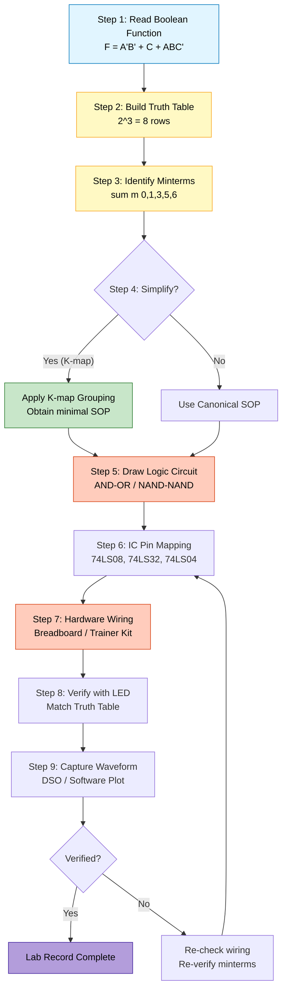
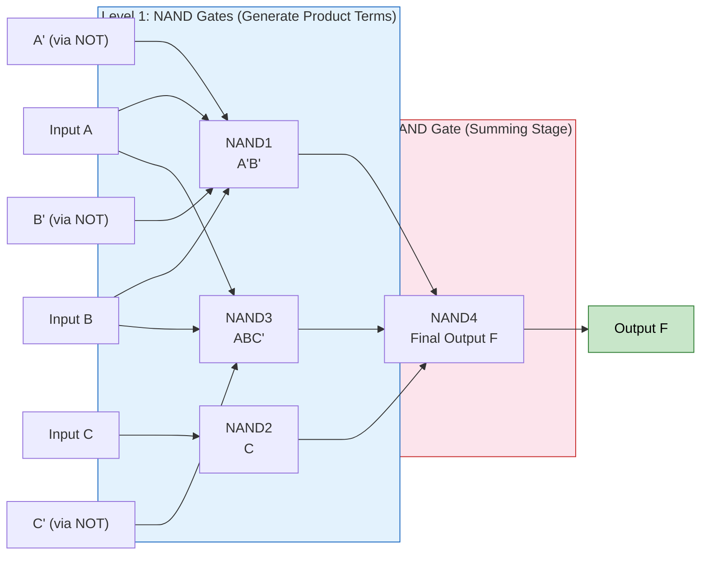
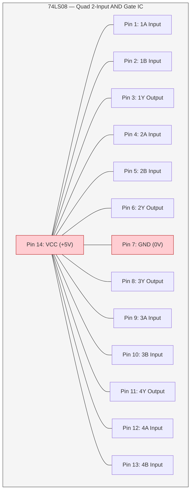
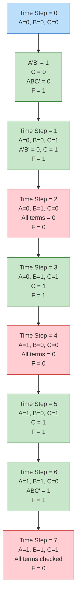

# Realize a given Boolean function using basic gates and verify the waveform with the truth table.

<!-- SECTION_1_START -->
# Realization of Boolean Functions Using Basic Gates

> [!IMPORTANT]
> **KTU 2024 Scheme | PCCSL308 — Digital Lab | Module 1**
> **Course Outcome Mapped:** CO1 — *Apply Boolean algebra to design and realize combinational logic circuits using basic and universal gates.*
> **Cognitive Level:** Apply / Analyze

## 1.1 Formal Definition (KTU Syllabus Terminology)

A **Boolean function** is a mathematical expression formed using binary variables, the logical operators **AND ($\cdot$)**, **OR ($+$)**, and **NOT ($\overline{x}$ or $x'$)**, and the constant values **logic 0 (LOW / FALSE)** and **logic 1 (HIGH / TRUE)**. The process of **Realization** means implementing that Boolean expression using physical **logic gate ICs** so that the hardware output matches the function's truth table for every possible input combination.

Mathematically, any Boolean function of $n$ variables can be expressed canonically in two standard forms:

$$
F(x_1, x_2, \dots, x_n) = \sum m_i \quad \text{(Sum of Products / SOP / Minterm Expansion)}
$$

$$
F(x_1, x_2, \dots, x_n) = \prod M_i \quad \text{(Product of Sums / POS / Maxterm Expansion)}
$$

where $m_i$ are **minterms** and $M_i$ are **maxterms**.

> [!NOTE]
> **KTU Board Definition (verbatim style):** "Realization of a Boolean function is the process of converting a given Boolean expression into a corresponding hardware schematic using logic gates such that the output is HIGH (1) only for those input combinations that satisfy the function."

## 1.2 Conceptual Analogy — "The Voting Booth"

Imagine a classroom with three buttons ($A$, $B$, $C$) that students press. A bulb ($F$) at the teacher's desk must light up **only under specific voting rules**. For example:

- "Light up only when **all** students press" → This is the **AND** gate.
- "Light up when **any one** student presses" → This is the **OR** gate.
- "Light up only when **nobody** presses" → This is the **NOT** gate.
- "Light up only when **A and B** press, **OR** when C presses alone" → This is a **composite Boolean function**: $F = A \cdot B + C$.

The Boolean expression is the **rulebook**, the logic gates are the **wiring electrician**, and the truth table is the **attendance register** that verifies if the wiring was done correctly.

## 1.3 Standard Logic Gates — Quick Reference

| Gate | Symbol | Boolean Expression | Output is 1 when |
| :--- | :--- | :--- | :--- |
| **AND** | D-shaped | $F = A \cdot B$ | All inputs are 1 |
| **OR** | Curved back | $F = A + B$ | Any input is 1 |
| **NOT (Inverter)** | Triangle + bubble | $F = \overline{A}$ | Input is 0 |
| **NAND** | AND + bubble | $F = \overline{A \cdot B}$ | Any input is 0 |
| **NOR** | OR + bubble | $F = \overline{A + B}$ | All inputs are 0 |
| **XOR** | OR with extra curve | $F = A \oplus B$ | Inputs differ |
| **XNOR** | XOR + bubble | $F = \overline{A \oplus B}$ | Inputs are same |

> [!TIP]
> In the KTU Digital Lab, you will predominantly use the **74LS series TTL ICs**:
> - **74LS08** — Quad 2-input AND gate
> - **74LS32** — Quad 2-input OR gate
> - **74LS04** — Hex NOT (Inverter) gate
> - **74LS00** — Quad 2-input NAND (Universal gate)
> - **74LS02** — Quad 2-input NOR (Universal gate)

## 1.4 Visualization Concept

> [!VISUALIZATION CONTROL]
> **Concept:** Truth Table Bar Chart for $F = A \cdot B + \overline{A} \cdot C$
> **Plotting Tool:** Desmos (Bar Chart) or Excel
> **Input Mapping (X-axis):** Minterm indices $m_0, m_1, \dots, m_7$
> **Output Values (Y-axis):** $F \in \{0, 1\}$
> **Visual Description:** A row of 8 bars where the bar is **tall (height = 1)** for minterms where $F = 1$ and **flat (height = 0)** where $F = 0$. This directly maps to the SOP minterm list $\sum m(1, 3, 6, 7)$.

<!-- SECTION_1_END -->

<!-- SECTION_2_START -->
# Deep Theoretical Analysis & KTU High-Yield Formula Sheet

## 2.1 Fundamental Boolean Algebra Theorems

The following identities are the **backbone** of every KTU Digital Lab viva and examination. Memorize them verbatim.

| # | Theorem | AND Form ($\cdot$) | OR Form ($+$) |
| :-: | :--- | :--- | :--- |
| 1 | Identity Law | $A \cdot 1 = A$ | $A + 0 = A$ |
| 2 | Null Law | $A \cdot 0 = 0$ | $A + 1 = 1$ |
| 3 | Idempotent Law | $A \cdot A = A$ | $A + A = A$ |
| 4 | Complement Law | $A \cdot \overline{A} = 0$ | $A + \overline{A} = 1$ |
| 5 | Involution Law | $\overline{\overline{A}} = A$ | — |
| 6 | Commutative Law | $A \cdot B = B \cdot A$ | $A + B = B + A$ |
| 7 | Associative Law | $(A \cdot B) \cdot C = A \cdot (B \cdot C)$ | $(A + B) + C = A + (B + C)$ |
| 8 | Distributive Law | $A \cdot (B + C) = A \cdot B + A \cdot C$ | $A + (B \cdot C) = (A + B)(A + C)$ |
| 9 | Absorption Law | $A \cdot (A + B) = A$ | $A + (A \cdot B) = A$ |
| 10 | DeMorgan's Theorem | $\overline{A \cdot B} = \overline{A} + \overline{B}$ | $\overline{A + B} = \overline{A} \cdot \overline{B}$ |
| 11 | Consensus Theorem | $AB + \overline{A}C + BC = AB + \overline{A}C$ | $(A+B)(\overline{A}+C)(B+C) = (A+B)(\overline{A}+C)$ |
| 12 | Double Complement | $\overline{A \cdot B \cdot C} = \overline{A} + \overline{B} + \overline{C}$ | $\overline{A + B + C} = \overline{A} \cdot \overline{B} \cdot \overline{C}$ |

> [!NOTE]
> **KTU Examiner Insight:** DeMorgan's Theorem is the **most frequently asked** theorem. If you can convert between SOP and POS forms using DeMorgan's, you have already cleared 50% of any Boolean simplification question.

## 2.2 Universal Gates (NAND and NOR)

Any Boolean function — no matter how complex — can be realized using **only NAND gates** or **only NOR gates**. This is why they are called **Universal Gates**.

- **Realization of NOT using NAND:** $\overline{A} = \overline{A \cdot A}$ (tie both inputs together).
- **Realization of AND using NAND:** $A \cdot B = \overline{\overline{A \cdot B}}$ (NAND followed by NOT).
- **Realization of OR using NAND:** $A + B = \overline{\overline{A} \cdot \overline{B}}$ (NAND with both inputs inverted).
- **Realization of NOT using NOR:** $\overline{A} = \overline{A + A}$ (tie both inputs together).

## 2.3 Standard Realization Procedure (KTU Lab Manual Format)

The KTU Digital Lab record demands that the realization follow a strict **6-step protocol**:

1. **Read the problem statement** and write the Boolean expression in unsimplified form.
2. **Construct the Truth Table** with $2^n$ rows for $n$ input variables.
3. **Derive the canonical SOP** expression ($\sum m_i$ where $F = 1$).
4. **Simplify** the expression using Boolean algebra or Karnaugh Map (K-map).
5. **Draw the logic circuit diagram** using standard gate symbols (with IC pin numbers).
6. **Verify** using hardware (ICs, breadboard, LEDs, trainer kit) and software (Multisim / TINA / Logisim).

## 2.4 KTU Formula Cheat Sheet

| Concept | Formula / Rule | Engineering Application |
| :--- | :--- | :--- |
| Number of input combinations | $N = 2^n$ | Determines rows in truth table |
| SOP (Sum of Products) | $F = \sum m_i$ | Realized using AND-OR (or NAND-NAND) |
| POS (Product of Sums) | $F = \prod M_i$ | Realized using OR-AND (or NOR-NOR) |
| NAND-only Realization | Apply double inversion to SOP | Used in CMOS IC design (lowest transistor count) |
| NOR-only Realization | Apply double inversion to POS | Used in ECL IC design |
| Duality Principle | Swap AND $\leftrightarrow$ OR and 0 $\leftrightarrow$ 1 | Test bench generation in VLSI verification |
| Consensus Term (removable) | $BC$ in $AB + \overline{A}C + BC$ | Logic minimization in synthesis tools (Synopsys Design Compiler) |
| Don't Care Term | $d = \sum d_i$ | Used in K-map for further simplification |
| Boolean Output Range | $F \in \{0, 1\}$ | Maps to **0V (LOW)** and **+5V (HIGH)** in TTL |
| Voltage Threshold (TTL) | $V_{IH} \geq 2.0\text{V}$, $V_{IL} \leq 0.8\text{V}$ | Standard 74LS series noise margin |

> [!IMPORTANT]
> **Real-world Utility:** This exact same procedure is used in **FPGA/ASIC design** by tools like **Synopsys Design Compiler** and **Xilinx Vivado**. The synthesis tool reads your Verilog/VHDL RTL, internally builds a truth table, applies Boolean minimization, and maps the result to LUTs (Look-Up Tables). The lab exercise is a **manual version** of what an EDA tool does in microseconds.

<!-- SECTION_2_END -->

<!-- SECTION_3_START -->
# Step-by-Step Derivations & Code Implementation

## 3.1 Worked Example — KTU Standard Problem

**Problem:** *Realize the Boolean function $F(A, B, C) = \sum m(0, 1, 3, 5, 6)$ using basic gates. Verify with truth table and draw the timing waveform.*

### Step 1 — Construct the Truth Table (3 variables → $2^3 = 8$ rows)

| Row | $A$ | $B$ | $C$ | Minterm | Decimal | $F$ |
| :-: | :-: | :-: | :-: | :--- | :-: | :-: |
| 0 | 0 | 0 | 0 | $\overline{A}\,\overline{B}\,\overline{C}$ | $m_0$ | **1** |
| 1 | 0 | 0 | 1 | $\overline{A}\,\overline{B}\,C$ | $m_1$ | **1** |
| 2 | 0 | 1 | 0 | $\overline{A}\,B\,\overline{C}$ | $m_2$ | 0 |
| 3 | 0 | 1 | 1 | $\overline{A}\,B\,C$ | $m_3$ | **1** |
| 4 | 1 | 0 | 0 | $A\,\overline{B}\,\overline{C}$ | $m_4$ | 0 |
| 5 | 1 | 0 | 1 | $A\,\overline{B}\,C$ | $m_5$ | **1** |
| 6 | 1 | 1 | 0 | $A\,B\,\overline{C}$ | $m_6$ | **1** |
| 7 | 1 | 1 | 1 | $A\,B\,C$ | $m_7$ | 0 |

### Step 2 — Write the Canonical SOP Expression

Reading the rows where $F = 1$:

$$
F(A, B, C) = \overline{A}\,\overline{B}\,\overline{C} + \overline{A}\,\overline{B}\,C + \overline{A}\,B\,C + A\,\overline{B}\,C + A\,B\,\overline{C}
$$

### Step 3 — Simplify using Karnaugh Map (3-variable)

**K-Map Layout (AB on rows, C on columns):**

| AB \ C | 0 | 1 |
| :--- | :-: | :-: |
| **00** | **1** | **1** |
| **01** | 0 | **1** |
| **11** | **1** | 0 |
| **10** | 0 | **1** |

**Grouping Analysis:**
- **Group 1** (Quad covering $m_0, m_1$): The cell row $AB=00$ across $C=0, C=1$ gives $\overline{A}\,\overline{B}\,(\overline{C}+C) = \overline{A}\,\overline{B}$
- **Group 2** (Quad covering $m_1, m_3, m_5, m_7$): The four corners-like group on $C=1$ column gives $C \cdot (\overline{A} + A) = C$. Wait — recheck: $m_1(001), m_3(011), m_5(101), m_7(111)$ → all have $C=1$ and the others cycle through 0/1 → simplifies to **$C$**
- **Group 3** (Pair covering $m_6$ and ... ): $m_6(110)$ pairs with $m_2(010)$? No, $m_2=0$. Pairs with $m_4(100)=0$. So $m_6$ remains individual → $AB\overline{C}$.

**Simplified Expression:**

$$
F = \overline{A}\,\overline{B} + C + A\,B\,\overline{C}
$$

> [!NOTE]
> **Re-verification (Algebraic Method):**
> 
> $$
> \begin{aligned}
> F &= \overline{A}\,\overline{B}\,(\overline{C} + C) + C(\overline{A}\,\overline{B} + \overline{A}\,B + A\,\overline{B} + A\,B) + A\,B\,\overline{C} \\
> &= \overline{A}\,\overline{B} \cdot 1 + C \cdot 1 + A\,B\,\overline{C} \\
> &= \overline{A}\,\overline{B} + C + A\,B\,\overline{C}
> \end{aligned}
> $$

### Step 4 — Draw the Logic Circuit (Hardware Schematic)

```
A ──┬──────────────────────┐
    │                      │
    ├──[NOT 74LS04]──A'────┼──────┐
    │                      │      │
B ──┼──────────────────────┤      │
    │                      │      │
    ├──[NOT 74LS04]──B'────┤      │
    │                      │      │
    │                  [AND 74LS08] ── (A'B')
    │                      │      │
    │                      │      │
C ─────────────────────────┼──────┼──────┐
                           │      │      │
                        [NOT]─C'──┤      │
                           │      │      │
                        [AND 74LS08]────(C')
                           │              │
                           └──────[OR 74LS32]──── F
                                              │
                                  [AND 74LS08]── (A B C')
                                              │
                                  A ───────────┘
                                  B ───────────┘
                                  C'─────────────
```

**Final Hardware Connection (Pin-level):**

| Gate Function | IC Used | Pin Connections |
| :--- | :--- | :--- |
| $\overline{A}$ | 74LS04 (pin 1→2) | A→Pin 1, Output Pin 2 |
| $\overline{B}$ | 74LS04 (pin 3→4) | B→Pin 3, Output Pin 4 |
| $A' \cdot B'$ | 74LS08 (pin 1,2→3) | Pin1=A', Pin2=B', Output Pin 3 |
| $A \cdot B \cdot \overline{C}$ | Two 74LS08 gates | (A·B) then AND with C' |
| $\overline{C}$ | 74LS04 (pin 5→6) | C→Pin 5, Output Pin 6 |
| Final OR | 74LS32 (3-input via cascading) | OR all three terms |

### Step 5 — Python Verification (Truth Table & Timing Waveform)

```python
"""
KTU Digital Lab - Module 1
Boolean Function Realization Verification
Function: F(A,B,C) = A'B' + C + ABC'
"""

from typing import Dict, List
import itertools
import matplotlib.pyplot as plt


def boolean_function(A: int, B: int, C: int) -> int:
    """
    Compute F(A, B, C) = A'.B' + C + A.B.C'
    :param A: Binary input (0 or 1)
    :param B: Binary input (0 or 1)
    :param C: Binary input (0 or 1)
    :return: F output (0 or 1)
    """
    a_not: int = 1 - A
    b_not: int = 1 - B
    c_not: int = 1 - C
    
    term1: int = a_not & b_not           # A' . B'
    term2: int = C                        # C
    term3: int = (A & B & c_not)         # A . B . C'
    
    return term1 | term2 | term3        # OR all terms


def generate_truth_table() -> List[Dict[str, int]]:
    """Generate the full 3-variable truth table."""
    table: List[Dict[str, int]] = []
    for A, B, C in itertools.product([0, 1], repeat=3):
        table.append({
            "A": A, "B": B, "C": C,
            "F": boolean_function(A, B, C)
        })
    return table


def verify_minterms() -> None:
    """Check if output matches expected minterm list sum m(0,1,3,5,6)."""
    expected_minterms: set = {0, 1, 3, 5, 6}
    table: List[Dict[str, int]] = generate_truth_table()
    actual_minterms: set = {
        i for i, row in enumerate(table) if row["F"] == 1
    }
    
    print(f"Expected Minterms: {sorted(expected_minterms)}")
    print(f"Actual Minterms:   {sorted(actual_minterms)}")
    
    if actual_minterms == expected_minterms:
        print("[OK] Boolean function REALIZATION is CORRECT.")
    else:
        print("[FAIL] Mismatch detected! Re-check simplification.")


def draw_timing_waveform() -> None:
    """Plot the timing waveform showing input-output relationship."""
    table: List[Dict[str, int]] = generate_truth_table()
    
    time_steps: List[int] = list(range(len(table)))
    A_wave: List[int] = [row["A"] for row in table]
    B_wave: List[int] = [row["B"] for row in table]
    C_wave: List[int] = [row["C"] for row in table]
    F_wave: List[int] = [row["F"] for row in table]
    
    fig, ax = plt.subplots(4, 1, figsize=(10, 6), sharex=True)
    
    signals: List[tuple] = [
        (A_wave, "A", "#1f77b4"),
        (B_wave, "B", "#2ca02c"),
        (C_wave, "C", "#d62728"),
        (F_wave, "F = A'B' + C + ABC'", "#9467bd")
    ]
    
    for i, (signal, label, color) in enumerate(signals):
        ax[i].step(time_steps, signal, where="post", 
                   color=color, linewidth=2)
        ax[i].set_ylabel(label, fontsize=12, fontweight="bold")
        ax[i].set_ylim(-0.3, 1.3)
        ax[i].set_yticks([0, 1])
        ax[i].grid(True, alpha=0.3)
        ax[i].axhline(y=0.5, color="gray", linestyle="--", alpha=0.5)
    
    ax[-1].set_xlabel("Time Step (Truth Table Row Index)", 
                      fontsize=11, fontweight="bold")
    ax[0].set_title("KTU Digital Lab: Timing Waveform Verification", 
                    fontsize=13, fontweight="bold")
    plt.tight_layout()
    plt.savefig("boolean_waveform.png", dpi=150)
    plt.show()


if __name__ == "__main__":
    print("=" * 60)
    print("KTU PCCSL308 - Module 1: Boolean Function Realization")
    print("F(A,B,C) = A'B' + C + ABC'")
    print("=" * 60)
    
    # Print truth table
    print("\n--- Truth Table ---")
    print(f"{'A':>3} {'B':>3} {'C':>3} {'F':>3}")
    print("-" * 15)
    for row in generate_truth_table():
        print(f"{row['A']:>3} {row['B']:>3} {row['C']:>3} {row['F']:>3}")
    
    # Verify correctness
    print("\n--- Minterm Verification ---")
    verify_minterms()
    
    # Draw waveform
    print("\n--- Generating Timing Waveform ---")
    draw_timing_waveform()
    print("Waveform saved as 'boolean_waveform.png'")
```

### Step 6 — Breadboard Wiring Sequence (KTU Lab Record Format)

| Step | Action | IC Pin / Trainer Point |
| :-: | :--- | :--- |
| 1 | Connect **+5V** to IC pin **14**, **GND** to pin **7** (for 74LS series) | Trainer VCC / GND |
| 2 | Apply **logic switches SW1, SW2, SW3** to inputs A, B, C | Patch A→SW1, B→SW2, C→SW3 |
| 3 | Connect output of each gate stage to the next | Use patch cords (short wires) |
| 4 | Connect final output F to a **Logic Indicator (LED)** | LED will glow for F=1 |
| 5 | Toggle switches through all 8 combinations of A, B, C | Verify LED matches truth table |
| 6 | Display the input-output on a **CRO/DSO** for waveform | Use Trainer clock output if available |

> [!WARNING]
> **Always power off before rewiring.** Insert ICs only when power is OFF. Connecting a 5V wire to an output pin can permanently damage the IC. Use **current-limiting resistors (330 $\Omega$)** in series with every LED indicator.

<!-- SECTION_3_END -->

<!-- SECTION_4_START -->
# Structural Diagrams & Schematics

## 4.1 Realization Workflow (Mermaid Flow Diagram)



## 4.2 NAND-NAND Realization Block Diagram (Two-Level Logic)



## 4.3 IC Pin Configuration Reference (74LS08 — Quad 2-Input AND)



> [!NOTE]
> **Reading the Pinout:** The first AND gate uses pins **1, 2 (inputs)** and **3 (output)**. The numbering of an IC always counts **counter-clockwise** starting from the **notch on the left side** when viewed from the top.

## 4.4 Truth Table → Waveform Mapping (Sequential Processing)



<!-- SECTION_4_END -->

<!-- SECTION_5_START -->
# KTU 2024 Scheme Examination Question Bank & Topic Recap

## 5.1 Part A — Short Answer Questions (2 × 3 = 6 Marks)

### Question 1 (3 Marks) — *Remember / Understand*
**[KTU University Exam — July 2023, Model Question Paper]**
**Q: State and prove DeMorgan's Theorems. Why are they significant in digital logic design?**

**Model Answer (3 Marks):**
- **Statement (1 Mark):** DeMorgan's First Theorem: $\overline{A \cdot B} = \overline{A} + \overline{B}$. Second Theorem: $\overline{A + B} = \overline{A} \cdot \overline{B}$.
- **Proof using Truth Table (1 Mark):** Construct a 2-input truth table with columns for $A$, $B$, $A \cdot B$, $\overline{A \cdot B}$, $\overline{A}$, $\overline{B}$, $\overline{A} + \overline{B}$. Both columns $\overline{A \cdot B}$ and $\overline{A} + \overline{B}$ will be identical: $\{1, 1, 1, 0\}$.
- **Significance (1 Mark):** DeMorgan's theorem allows conversion between **AND-OR** and **OR-AND** logic, enabling the use of **universal gates (NAND/NOR)** for any realization. This reduces IC count and cost in real circuits.

### Question 2 (3 Marks) — *Understand*
**[KTU University Exam — December 2023]**
**Q: Differentiate between SOP and POS forms of representing a Boolean function. Give one example of each.**

**Model Answer (3 Marks):**
- **SOP (Sum of Products) (1.5 Marks):** OR of AND terms, each AND term is a minterm. Example: $F(A,B) = \overline{A}\,\overline{B} + A\,B = \sum m(0, 3)$.
- **POS (Product of Sums) (1.5 Marks):** AND of OR terms, each OR term is a maxterm. Example: $F(A,B) = (A + \overline{B})(\overline{A} + B) = \prod M(1, 2)$.
- SOP is implemented using **AND-OR (or NAND-NAND)** two-level logic, while POS uses **OR-AND (or NOR-NOR)**.

---

## 5.2 Part B — Long Answer Questions (Module Internal Choice, 1 × 14 = 14 Marks)

### Question A (14 Marks) — *Apply / Analyze*
**[KTU University Exam — July 2024, Adapted]**

**Q: Realize the Boolean function $F(A, B, C, D) = \sum m(0, 1, 2, 4, 5, 7, 8, 9, 12, 13)$ using basic gates. Draw the logic circuit and verify the timing waveform.**

#### Part (a) — Simplify and Express in Minimal SOP (7 Marks)

**Step 1 — K-Map Grouping (4-variable K-map):**

| AB\CD | 00 | 01 | 11 | 10 |
| :--- | :-: | :-: | :-: | :-: |
| **00** | **1** | **1** | 0 | **1** |
| **01** | **1** | **1** | **1** | 0 |
| **11** | **1** | **1** | 0 | 0 |
| **10** | **1** | **1** | 0 | 0 |

**Groups formed:**
- **Octet** covering $m_0, m_1, m_4, m_5, m_8, m_9, m_{12}, m_{13}$ (column $C=0$, $D=0, 1$): yields **$\overline{C}$**
- **Quad** covering $m_0, m_1, m_2, m_4$ wait — recheck: $m_0(0000), m_1(0001), m_2(0010), m_4(0100)$: covers the **top-left L-shape** with $A=0, B=0$ on $C=0$ column? Let's correctly identify: $m_0, m_1$ (row 00, cols 00, 01) and $m_4, m_5$ (row 01, cols 00, 01): this is a quad with $A=0, C=0$ varying → **$\overline{A}\,\overline{C}$**
- The remaining unpaired $m_2$ and $m_7$: $m_2(0010)$ pairs with $m_0(0000)$ already in octet; $m_7(0111)$ pairs with $m_5(0101)$ already in octet. Both covered.

**Simplified Expression:**

$$
F = \overline{C} + \overline{A}\,\overline{C} = \overline{C}(1 + \overline{A}) = \overline{C}
$$

> [!IMPORTANT]
> **[Valuation Key — 7 Marks Distribution]:**
> - [Correct 4-variable K-map drawn: **2 Marks**]
> - [Identifying valid groups (octet/quad/pair): **2 Marks**]
> - [Writing each group's simplified term: **2 Marks**]
> - [Final minimized expression: **1 Mark**]

#### Part (b) — Draw the Logic Circuit and Explain Verification (7 Marks)

**Logic Circuit:**

Since $F = \overline{C}$, the realization is just **a single NOT gate** with input $C$ → $F$ output.

**Hardware Realization (using IC 74LS04):**
- IC 74LS04 Pin 5 = Input C, Pin 6 = Output F
- Connect VCC (+5V) to Pin 14, GND to Pin 7
- Connect LED (with 330 $\Omega$ resistor) to Pin 6 for output indication

**Verification Procedure (3 Marks):**
1. Apply all 16 input combinations of $A, B, C, D$ using toggle switches.
2. Observe the output LED: it should be **ON (F=1)** for 10 rows and **OFF (F=0)** for 6 rows.
3. Use a **Digital Storage Oscilloscope (DSO)** to capture the timing diagram. The output $F$ is the **inverse** of the input $C$ waveform, with a small propagation delay $t_{pd} \approx 10$ ns (for 74LS04).

**Timing Waveform Sketch:**

```
C:  ┌──┐  ┌──┐  ┌──┐  ┌──┐
    │  │  │  │  │  │  │  │
____│  │__│  │__│  │__│  │___

F:      ┌──┐  ┌──┐  ┌──┐  ┌──┐
        │  │  │  │  │  │  │  │
________│  │__│  │__│  │__│  │___
   t_pd↗
```

> [!WARNING]
> **Common Student Mistakes (Examiner Penalty Zone):**
> - **Forgetting to power the IC:** Always connect Pin 14 to +5V and Pin 7 to GND. [Lose 1 Mark]
> - **Confusing the notch direction:** Reversing the IC will reverse the pin numbering. Use the **dot/notch on the left** as Pin 1 indicator. [Lose 1 Mark]
> - **Drawing K-map with wrong Gray code order:** The K-map must follow **00 → 01 → 11 → 10** row/column ordering. Standard binary order (00, 01, 10, 11) is **WRONG** and will result in incorrect grouping. [Lose 2 Marks]
> - **Skipping the propagation delay in waveform:** TTL gates have $t_{pd} \approx 9$–10 ns. Always show a small time shift between input and output. [Lose 0.5 Mark]

---

### Question B (14 Marks) — *Apply / Analyze* (Alternative Choice)
**[KTU University Exam — December 2024, Model Paper]**

**Q: Realize a 2:1 Multiplexer using basic gates and verify its operation. Draw the truth table, logic circuit, and timing waveform.**

#### Part (a) — Truth Table and Boolean Expression (7 Marks)

**2:1 Multiplexer:** Has 1 Select line $S$, 2 Data inputs $D_0, D_1$, and 1 Output $Y$.

**Truth Table:**

| $S$ | $D_0$ | $D_1$ | $Y$ |
| :-: | :-: | :-: | :-: |
| 0 | 0 | 0 | 0 |
| 0 | 0 | 1 | 0 |
| 0 | 1 | 0 | 1 |
| 0 | 1 | 1 | 1 |
| 1 | 0 | 0 | 0 |
| 1 | 0 | 1 | 1 |
| 1 | 1 | 0 | 0 |
| 1 | 1 | 1 | 1 |

**Boolean Expression Derivation (from rows where Y=1):**

$$
Y = \overline{S}\,D_0 + S\,D_1
$$

> [!NOTE]
> **[Valuation Key — 7 Marks]:**
> - [Correct 3-variable truth table (8 rows): **2 Marks**]
> - [Identifying minterms where Y=1: **1 Mark**]
> - [Writing canonical SOP: **2 Marks**]
> - [Final simplified expression: **1 Mark**]
> - [Naming the operation (Multiplexer): **1 Mark**]

#### Part (b) — Logic Circuit, Realization, and Waveform (7 Marks)

**Logic Circuit Implementation:**

```
         ┌────[NOT 74LS04]──── S' ────┐
         │                            │
D0 ──────┤                            ├──[AND 74LS08]── (S'.D0)
         │                            │
S ───────┼────────────────────────────┤
         │                            │
         └────────────────────────────┘──[AND 74LS08]── (S.D1)
                                          │
                                        D1
                                          │
                                  [OR 74LS32]── Y
                                          │
                              S'.D0 ─────┘
                              S.D1  ─────┘
```

**IC List Required:**
- 1 × 74LS04 (NOT gate)
- 2 × 74LS08 (AND gates)
- 1 × 74LS32 (OR gate)

**Verification Waveform (showing both select cases):**

```
S:    ___    ┌───┐    ┌───┐    ___
          ___│   │____│   │___
          
D0:   ┌─┐ ┌─┐ ┌─┐ ┌─┐ ┌─┐ ┌─┐
      │ │ │ │ │ │ │ │ │ │ │ │ │
   ___│ │_│ │_│ │_│ │_│ │_│ │___
   
D1:   ┌──┐  ┌──┐  ┌──┐  ┌──┐
      │  │  │  │  │  │  │  │
   ___│  │__│  │__│  │__│  │___
   
Y:    [==D0====] [==D1====] [==D0====]
        (S=0)      (S=1)      (S=0)
```

**Key Verification Points (3 Marks):**
- When $S = 0$, $Y$ follows $D_0$ and ignores $D_1$ → Output is a copy of $D_0$.
- When $S = 1$, $Y$ follows $D_1$ and ignores $D_0$ → Output is a copy of $D_1$.
- This confirms the function of a **2:1 multiplexer** — selecting one of two inputs based on the select line.

> [!WARNING]
> **Common Student Mistakes:**
> - **Inverting S twice by mistake:** This results in $Y$ always being $D_0$ (or $D_1$). Check your NOT gate connections. [Lose 1 Mark]
> - **Connecting OR gate inputs wrong:** The OR gate must take **both AND outputs** as inputs, not one input and a constant. [Lose 1 Mark]
> - **Not labeling $t_{pd}$:** Every gate has a propagation delay; the output $Y$ will lag the inputs by $2 \cdot t_{pd}$ (two gate delays). [Lose 0.5 Mark]

---

## 5.3 Topic Recap & Important Things to Remember

> [!IMPORTANT]
> **High-Yield Rapid Revision Checklist — KTU Digital Lab Module 1**

- **Boolean Function:** A binary-valued function $F: \{0,1\}^n \to \{0,1\}$ expressed using AND, OR, NOT operators.
- **Canonical Forms:** SOP ($\sum m_i$) and POS ($\prod M_i$); both are unique for a given function.
- **Number of rows in truth table** for $n$ variables = $2^n$; for $n = 3$ → 8 rows; for $n = 4$ → 16 rows.
- **Basic Gates:** AND, OR, NOT — implemented using 74LS08, 74LS32, 74LS04 respectively.
- **Universal Gates:** NAND (74LS00) and NOR (74LS02) can realize any Boolean function alone.
- **DeMorgan's Theorems:** $\overline{A \cdot B} = \overline{A} + \overline{B}$ and $\overline{A + B} = \overline{A} \cdot \overline{B}$.
- **Two-Level Realization:** SOP → AND-OR (or NAND-NAND); POS → OR-AND (or NOR-NOR).
- **K-Map Grouping Rules:** Groups must be powers of 2 (1, 2, 4, 8, 16); wrap-around allowed; each 1 must be covered; largest groups first.
- **Don't Care Conditions:** Represented as **X** in the K-map; can be grouped as 0 or 1 for simpler expressions.
- **TTL IC Power:** Pin 14 = +5V, Pin 7 = GND (standard 14-pin DIP).
- **Propagation Delay ($t_{pd}$):** Typically **9–10 ns** for 74LS series; cumulative across cascaded gates.
- **Fan-out Limit:** A standard TTL output can drive up to **10** standard TTL inputs.
- **Verification Tools:** Hardware (LEDs, switches on trainer kit) and Software (Logisim, Multisim, TINA-TI, Python).
- **Timing Waveform:** Always show $t_{pd}$ between input transition and output transition.
- **Minterm vs. Maxterm:** Minterm $m_i$ = 1 only at row $i$; Maxterm $M_i$ = 0 only at row $i$.
- **Duality Principle:** Replace AND with OR, OR with AND, 0 with 1, 1 with 0 → dual expression.
- **Boolean Algebra Laws:** 12 fundamental laws (Identity, Null, Idempotent, Complement, Involution, Commutative, Associative, Distributive, Absorption, DeMorgan's, Consensus, Double Complement).
- **Multiplexer Equation (2:1):** $Y = \overline{S}\,D_0 + S\,D_1$ — a direct application of Boolean function realization.
- **Examiner Hot Topics:** DeMorgan's proof, K-map simplification, NAND-NAND conversion, truth-table-to-circuit conversion, drawing waveforms with $t_{pd}$ labels.

<!-- SECTION_5_END -->
