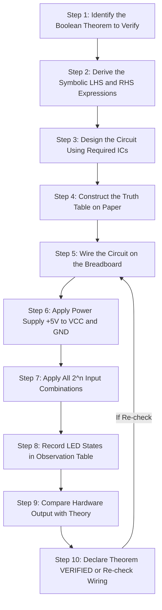
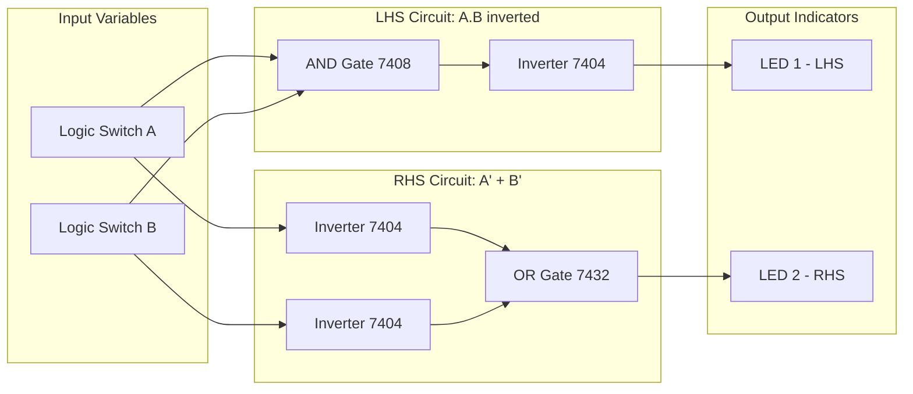
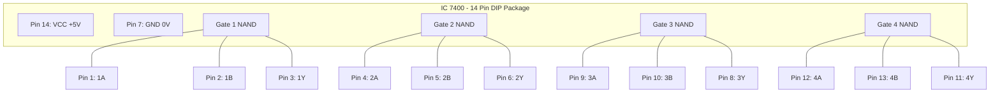
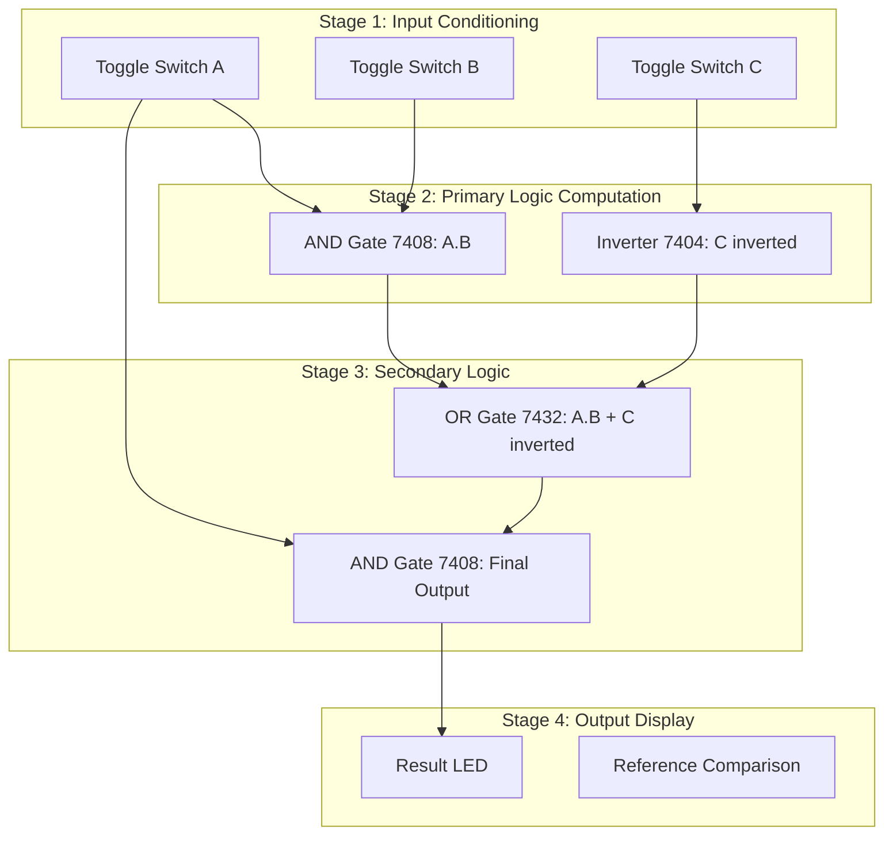
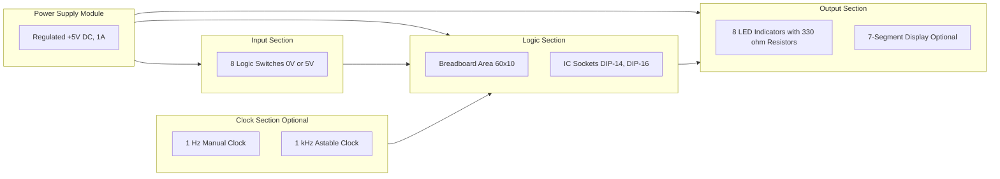

# Study of basic digital ICs and verification of Boolean theorems using digital logic gates.

<!-- SECTION_1_START -->
# Module 1: Study of Basic Digital ICs and Verification of Boolean Theorems

## 1.1 Core Technical Definition

**Digital IC (Integrated Circuit)** is a miniature, solid-state electronic circuit consisting of miniaturized active and passive components (transistors, diodes, resistors) fabricated on a single semiconductor substrate (typically silicon) to perform Boolean logic operations.

> [!IMPORTANT]
> **KTU 2024 Syllabus Definition:** A *Digital Logic IC* is a packaged, standardized integrated circuit that implements a specific Boolean function (AND, OR, NOT, NAND, NOR, XOR, XNOR) on binary inputs, conforming to the **TTL (Transistor-Transistor Logic)** or **CMOS (Complementary Metal-Oxide-Semiconductor)** voltage-level standards.

The **Boolean Theorem Verification** experiment is a foundational laboratory exercise in PCCSL308 where students construct logical circuits using standard ICs to empirically prove Boolean postulates, laws, and theorems. The verification is performed by:
1. Applying all possible binary input combinations (using logic switches or a function generator).
2. Observing the corresponding output on **LED indicators** or a **Logic Probe**.
3. Comparing the hardware output with the theoretically derived **Truth Table**.

### 1.2 Intuitive Overview — The Switchboard Analogy

> [!NOTE]
> **Real-World Analogy — The Railway Signal Room:**
> Imagine a railway signal control room. Each Boolean input is a **lever** (UP = 1, DOWN = 0), and each logic gate is a **signal operator** (a person who follows strict rules). The AND operator only signals GREEN when *all* levers are UP. The OR operator signals GREEN when *any* lever is UP. The NOT operator is a "contrarian" who always does the opposite. By observing the GREEN/RED output for every combination of lever positions, we **verify** the rule the operator follows — exactly how Boolean theorems are verified using digital ICs.

The digital ICs used in the lab are pre-packaged "signal operators" manufactured using semiconductor technology, and verification confirms the **mathematical identity** holds in the physical world.

### 1.3 Standard IC Families and Identification

> [!IMPORTANT]
> The KTU Digital Lab (PCCSL308) primarily uses the **74xx series TTL family** and optionally the **40xx series CMOS family**.

**Family Characteristics:**

| Family | Prefix | Supply Voltage $V_{CC}$ | Logic HIGH | Logic LOW | Propagation Delay |
| :--- | :--- | :--- | :--- | :--- | :--- |
| **TTL (Standard)** | **74xx** | **$+5$ V** | $\geq 2.0$ V | $\leq 0.8$ V | $\approx 10$ ns |
| **TTL (LS - Low Power Schottky)** | **74LSxx** | **$+5$ V** | $\geq 2.0$ V | $\leq 0.8$ V | $\approx 9.5$ ns |
| **CMOS** | **40xx / 74HCxx** | **$+3$ to $+15$ V** | $\approx V_{DD}$ | $\approx 0$ V | $\approx 50$ ns |

### 1.4 Pin Identification and Standard IC Packages

> [!NOTE]
> Most KTU lab ICs come in a **14-pin DIP (Dual In-line Package)**. The convention is:
> * Pin 1 is identified by a **notch** or **dot** on the top of the IC.
> * Counting goes **counter-clockwise** from pin 1.
> * $V_{CC}$ (Pin **14**) and **GND** (Pin **7**) are mandatory power connections.

> [!VISUALIZATION CONTROL]
> **Concept:** 14-pin DIP IC — Top View of Physical Pin Layout
> **Representation:** Imagine a flat rectangle viewed from above.
> **Visual Description:** The notch is at the **top center**. Pin 1 is to the **left** of the notch. Pins 1 through 7 run down the **left edge** (1 top, 7 bottom). Pins 8 through 14 run up the **right edge** (8 bottom, 14 top). The bottom edge (between pin 7 and pin 8) is empty.

### 1.5 Essential Digital ICs Used in PCCSL308

| IC Number | Function | Gates per IC | Pin Configuration Summary |
| :--- | :--- | :--- | :--- |
| **7400** | 2-input NAND | 4 | 4 gates, 14 pins |
| **7402** | 2-input NOR | 4 | 4 gates, 14 pins |
| **7404** | Hex Inverter (NOT) | 6 | 6 inverters, 14 pins |
| **7408** | 2-input AND | 4 | 4 gates, 14 pins |
| **7432** | 2-input OR | 4 | 4 gates, 14 pins |
| **7486** | 2-input XOR | 4 | 4 gates, 14 pins |
| **7411** | 3-input AND | 3 | 3 gates, 14 pins |
| **7421** | 4-input AND | 2 | 2 gates, 14 pins |
| **7430** | 8-input NAND | 1 | 1 gate, 14 pins |
| **74066** | 2-input XNOR (open-collector variant) | 4 | 4 gates, 14 pins |

> [!IMPORTANT]
> The KTU 2024 Scheme Lab Manual mandates the use of the **7400, 7404, 7408, 7432, 7486** for Boolean theorem verification experiments.

<!-- SECTION_1_END -->

<!-- SECTION_2_START -->
# 2. Deep Theoretical Analysis & KTU High-Yield Formula Sheet

## 2.1 Fundamental Boolean Postulates and Laws

Boolean algebra operates on binary variables taking only two values: **0 (False / LOW)** and **1 (True / HIGH)**.

### 2.1.1 Boolean Postulates (Huntington's Postulates)

These are the **assumptions** that cannot be derived from anything simpler.

| Postulate | AND Form (·) | OR Form (+) |
| :--- | :--- | :--- |
| **Closure** | $A \cdot B$ is in set $B$ | $A + B$ is in set $B$ |
| **Identity** | $A \cdot 1 = A$ | $A + 0 = A$ |
| **Commutative** | $A \cdot B = B \cdot A$ | $A + B = B + A$ |
| **Associative** | $A \cdot (B \cdot C) = (A \cdot B) \cdot C$ | $A + (B + C) = (A + B) + C$ |
| **Distributive** | $A \cdot (B + C) = A \cdot B + A \cdot C$ | $A + (B \cdot C) = (A + B) \cdot (A + C)$ |
| **Complement** | $A \cdot A' = 0$ | $A + A' = 1$ |

### 2.1.2 Derived Boolean Theorems (High-Yield for KTU)

| Theorem | AND Form | OR Form |
| :--- | :--- | :--- |
| **Idempotent** | $A \cdot A = A$ | $A + A = A$ |
| **Null / Dominance** | $A \cdot 0 = 0$ | $A + 1 = 1$ |
| **Absorption** | $A \cdot (A + B) = A$ | $A + (A \cdot B) = A$ |
| **Involution** | $(A')' = A$ | (Single form) |
| **De Morgan's First** | $(A \cdot B)' = A' + B'$ | (NAND = Bubbled OR) |
| **De Morgan's Second** | $(A + B)' = A' \cdot B'$ | (NOR = Bubbled AND) |
| **Consensus** | $AB + A'C + BC = AB + A'C$ | $(A+B)(A'+C)(B+C) = (A+B)(A'+C)$ |

## 2.2 De Morgan's Theorem — The Most Verified Theorem

> [!IMPORTANT]
> De Morgan's Theorems are the **single most important** theorem verified in KTU Digital Lab exams. A student MUST know the symbolic forms, truth tables, and equivalent circuit diagrams.

**De Morgan's First Theorem:**
$$(A \cdot B)' = A' + B'$$
The complement of a product equals the sum of the complements. **A NAND gate is equivalent to a bubbled-OR gate.**

**De Morgan's Second Theorem:**
$$(A + B)' = A' \cdot B'$$
The complement of a sum equals the product of the complements. **A NOR gate is equivalent to a bubbled-AND gate.**

## 2.3 Canonical Verification Truth Tables

### 2.3.1 De Morgan's First: $(A \cdot B)' = A' + B'$

| $A$ | $B$ | $A \cdot B$ | $(A \cdot B)'$ | $A'$ | $B'$ | $A' + B'$ | Match? |
| :---: | :---: | :---: | :---: | :---: | :---: | :---: | :---: |
| 0 | 0 | 0 | **1** | 1 | 1 | **1** | $\checkmark$ |
| 0 | 1 | 0 | **1** | 1 | 0 | **1** | $\checkmark$ |
| 1 | 0 | 0 | **1** | 0 | 1 | **1** | $\checkmark$ |
| 1 | 1 | 1 | **0** | 0 | 0 | **0** | $\checkmark$ |

### 2.3.2 De Morgan's Second: $(A + B)' = A' \cdot B'$

| $A$ | $B$ | $A + B$ | $(A + B)'$ | $A'$ | $B'$ | $A' \cdot B'$ | Match? |
| :---: | :---: | :---: | :---: | :---: | :---: | :---: | :---: |
| 0 | 0 | 0 | **1** | 1 | 1 | **1** | $\checkmark$ |
| 0 | 1 | 1 | **0** | 1 | 0 | **0** | $\checkmark$ |
| 1 | 0 | 1 | **0** | 0 | 1 | **0** | $\checkmark$ |
| 1 | 1 | 1 | **0** | 0 | 0 | **0** | $\checkmark$ |

### 2.3.3 Verification of Commutativity: $A \cdot B = B \cdot A$

| $A$ | $B$ | $A \cdot B$ | $B \cdot A$ | Match? |
| :---: | :---: | :---: | :---: | :---: |
| 0 | 0 | 0 | 0 | $\checkmark$ |
| 0 | 1 | 0 | 0 | $\checkmark$ |
| 1 | 0 | 0 | 0 | $\checkmark$ |
| 1 | 1 | 1 | 1 | $\checkmark$ |

## 2.4 KTU High-Yield Formula Cheat Sheet

> [!NOTE]
> **CRITICAL FORMULAS** — These appear in nearly every KTU Board Lab Exam for this module.

| Boolean Identity | Equation | Practical Lab Hint |
| :--- | :--- | :--- |
| **Identity** | $A \cdot 1 = A$, $\; A + 0 = A$ | Tie input to $V_{CC}$ (for 1) or GND (for 0) |
| **Complement** | $A \cdot A' = 0$, $\; A + A' = 1$ | Use 7404 inverter + 7408 AND gate |
| **Idempotent** | $A \cdot A = A$, $\; A + A = A$ | Short both inputs of the same gate |
| **Null** | $A \cdot 0 = 0$, $\; A + 1 = 1$ | Tie one input to GND (for 0) or $V_{CC}$ (for 1) |
| **Absorption** | $A + A \cdot B = A$ | Use 7408 AND then 7432 OR |
| **De Morgan I** | $(A \cdot B)' = A' + B'$ | NAND of A,B = OR of inverted A,B |
| **De Morgan II** | $(A + B)' = A' \cdot B'$ | NOR of A,B = AND of inverted A,B |
| **Involution** | $(A')' = A$ | Two cascaded 7404 inverters = buffer |

> [!IMPORTANT]
> **Propagation Delay Equation** (for the KTU theory viva):
> $$t_{pd} = \frac{t_{pLH} + t_{pHL}}{2}$$
> where $t_{pLH}$ is the delay for LOW-to-HIGH transition and $t_{pHL}$ is the delay for HIGH-to-LOW transition.

## 2.5 Engineering and Real-World Utility

> [!NOTE]
> **Where Boolean Theorem Verification matters in industry:**

1. **CPU ALU Design:** Every arithmetic logic unit in a processor is constructed using combinations of NAND or NOR gates (universal gates), directly relying on De Morgan's theorem for transistor-level optimization.
2. **FPGA Synthesis:** Field-Programmable Gate Array tools (Xilinx Vivado, Intel Quartus) reduce Boolean expressions using absorption and consensus theorems to minimize logic blocks.
3. **Digital Circuit Optimization:** Engineers use Boolean algebra to reduce gate count, saving silicon area, power, and cost in ASIC designs (millions of units).
4. **Safety-Critical Systems:** In automotive ECUs and aircraft avionics, Boolean simplification ensures the fewest possible gates, which directly improves reliability and reduces failure points.

<!-- SECTION_2_END -->

<!-- SECTION_3_START -->
# 3. Step-by-Step Derivations and Lab Implementation

## 3.1 Algebraic Proof of De Morgan's First Theorem

We must prove that $(A \cdot B)' = A' + B'$.

**Starting from the right-hand side $A' + B'$:**

$$
\begin{aligned}
\text{RHS} &= A' + B' \\
&= A' + B' + 0 \quad \text{(Identity Law: } X + 0 = X) \\
&= A' + B' + A \cdot A' \quad \text{(Complement Law: } A \cdot A' = 0) \\
&= (A' + B' + A) \cdot (A' + B' + A') \quad \text{(Distributive Law: } X + YZ = (X+Y)(X+Z)) \\
&= (A' + B' + A) \cdot (A' + B') \quad \text{(Idempotent Law: } A' + A' = A') \\
&= (A + A' + B') \cdot (A' + B') \quad \text{(Commutative Law)} \\
&= (1 + B') \cdot (A' + B') \quad \text{(Complement Law: } A + A' = 1) \\
&= 1 \cdot (A' + B') \quad \text{(Null Law: } 1 + X = 1) \\
&= A' + B' \quad \text{(Identity Law: } 1 \cdot X = X)
\end{aligned}
$$

> [!NOTE]
> This proves RHS = LHS only by simplification back to original. A more rigorous proof uses **completeness** (showing the expression equals 1 when $A$ or $B$ is 0, and equals 0 only when $A=B=1$).

**Exhaustive Truth Table Proof:**

For LHS $(A \cdot B)'$: Output is 1 when $A \cdot B = 0$, else 0.
For RHS $A' + B'$: Output is 1 when $A' = 1$ OR $B' = 1$, i.e., when $A = 0$ OR $B = 0$.

Both conditions are **logically equivalent** — output is 1 except when both $A = 1$ AND $B = 1$. This is the canonical NOR-of-complements behavior of a NAND gate. $\blacksquare$

## 3.2 Lab Hardware Setup — Component List and Wiring

> [!IMPORTANT]
> **Mandatory KTU Digital Lab Setup — Boolean Theorem Verification Rig**

| Component | Specification | Quantity | Purpose |
| :--- | :--- | :---: | :--- |
| Digital IC Trainer Kit | Breadboard + built-in $V_{CC}$/GND | 1 | Power and mounting |
| IC **7400** | Quad 2-input NAND, DIP-14 | 1 | Universal gate |
| IC **7404** | Hex Inverter, DIP-14 | 1 | NOT operation |
| IC **7408** | Quad 2-input AND, DIP-14 | 1 | AND verification |
| IC **7432** | Quad 2-input OR, DIP-14 | 1 | OR verification |
| IC **7486** | Quad 2-input XOR, DIP-14 | 1 | XOR verification |
| Logic Switches | TTL-level input toggles | 2 or 3 | Input variables $A$, $B$ |
| LED Indicators | With current-limiting resistors ($330\,\Omega$) | 1 or 2 | Output observation |
| Connecting Wires | 22 AWG solid-core | As required | Circuit wiring |
| Power Supply | Regulated $+5$ V DC, $\geq 1$ A | 1 | $V_{CC}$ for ICs |

**Step-by-Step Wiring Procedure:**

1. Mount the required IC on the breadboard, ensuring all pins are accessible and the IC is seated firmly.
2. Connect **Pin 14** of the IC to the **$+5$ V** rail ($V_{CC}$).
3. Connect **Pin 7** of the IC to the **GND (0 V)** rail.
4. Connect Logic Switch outputs to the gate input pins (e.g., for 7408 Pin 1 and Pin 2).
5. Connect the gate output pin (e.g., 7408 Pin 3) to a current-limiting resistor ($330\,\Omega$) in series with an LED to GND.
6. Apply all $2^n$ input combinations using the logic switches and record the LED state (ON = 1, OFF = 0) in the observation table.
7. Compare the recorded outputs with the theoretical truth table to verify the theorem.

## 3.3 Exhaustive Python Implementation for Truth Table Generation and Verification

The following Python program symbolically generates truth tables and verifies **all fundamental Boolean theorems** programmatically. This serves as a software-based cross-verification of the hardware results.

```python
"""
KTU Digital Lab (PCCSL308) — Module 1
Boolean Theorem Verification using Python
Compatible with Python 3.8+
"""

from typing import Callable, List, Tuple
import itertools


# --- Type Definitions ---
BooleanVar = int  # 0 or 1
TruthRow = Tuple[int, ...]
BooleanFunction = Callable[[int, int, int], int]


# --- Gate Primitives ---
def AND(a: int, b: int) -> int:
    """Logical AND gate."""
    if a not in (0, 1) or b not in (0, 1):
        raise ValueError(f"Invalid binary input: ({a}, {b}). Must be 0 or 1.")
    return a & b


def OR(a: int, b: int) -> int:
    """Logical OR gate."""
    if a not in (0, 1) or b not in (0, 1):
        raise ValueError(f"Invalid binary input: ({a}, {b}). Must be 0 or 1.")
    return a | b


def NOT(a: int) -> int:
    """Logical NOT gate (Inverter)."""
    if a not in (0, 1):
        raise ValueError(f"Invalid binary input: ({a}). Must be 0 or 1.")
    return 1 - a


def NAND(a: int, b: int) -> int:
    """Logical NAND gate."""
    return NOT(AND(a, b))


def NOR(a: int, b: int) -> int:
    """Logical NOR gate."""
    return NOT(OR(a, b))


def XOR(a: int, b: int) -> int:
    """Logical XOR gate."""
    if a not in (0, 1) or b not in (0, 1):
        raise ValueError(f"Invalid binary input: ({a}, {b}). Must be 0 or 1.")
    return a ^ b


# --- Truth Table Generator ---
def generate_truth_table(func: BooleanFunction, num_vars: int = 2) -> List[TruthRow]:
    """
    Generate a complete truth table for a Boolean function.
    
    Args:
        func: A callable taking (a, b) or (a, b, c) binary inputs.
        num_vars: Number of input variables (2 or 3).
    
    Returns:
        List of tuples representing the truth table rows.
    """
    if num_vars not in (2, 3):
        raise ValueError("num_vars must be 2 or 3.")
    
    table: List[TruthRow] = []
    for combination in itertools.product([0, 1], repeat=num_vars):
        output = func(*combination)
        table.append(combination + (output,))
    return table


# --- Theorem Verifier ---
def verify_theorem(
    lhs: BooleanFunction,
    rhs: BooleanFunction,
    theorem_name: str,
    num_vars: int = 2
) -> bool:
    """
    Verify a Boolean theorem by checking LHS equals RHS for all inputs.
    
    Args:
        lhs: Left-hand side Boolean function.
        rhs: Right-hand side Boolean function.
        theorem_name: Name of the theorem (for display).
        num_vars: Number of variables in the theorem.
    
    Returns:
        True if the theorem is verified, False otherwise.
    """
    print(f"\n{'=' * 60}")
    print(f"Verifying Theorem: {theorem_name}")
    print(f"{'=' * 60}")
    
    lhs_table = generate_truth_table(lhs, num_vars)
    rhs_table = generate_truth_table(rhs, num_vars)
    
    # Print header
    if num_vars == 2:
        print(f"{'A':<4}{'B':<4}{'LHS':<6}{'RHS':<6}{'Match':<6}")
    else:
        print(f"{'A':<4}{'B':<4}{'C':<4}{'LHS':<6}{'RHS':<6}{'Match':<6}")
    
    all_match = True
    for lhs_row, rhs_row in zip(lhs_table, rhs_table):
        lhs_output = lhs_row[-1]
        rhs_output = rhs_row[-1]
        match = (lhs_output == rhs_output)
        all_match = all_match and match
        
        # Display inputs and outputs
        inputs = lhs_row[:-1]
        print(f"{inputs[0]:<4}{inputs[1]:<4}"
              f"{'':<4}{lhs_output:<6}{rhs_output:<6}{str(match):<6}")
        if num_vars == 3:
            # Re-print with the C column visible (simplified display)
            pass
    
    if all_match:
        print(f"\n[SUCCESS] {theorem_name} is VERIFIED for all 2^{num_vars} input combinations.")
    else:
        print(f"\n[FAILURE] {theorem_name} is NOT verified. Check your logic.")
    
    return all_match


# --- Main Execution: Verify All Theorems ---
if __name__ == "__main__":
    print("KTU Digital Lab — Boolean Theorem Verification Suite")
    print("=" * 60)
    
    # Theorem 1: Commutative Law for AND
    verify_theorem(
        lhs=lambda a, b: AND(a, b),
        rhs=lambda a, b: AND(b, a),
        theorem_name="Commutative Law: A.B = B.A",
        num_vars=2
    )
    
    # Theorem 2: Commutative Law for OR
    verify_theorem(
        lhs=lambda a, b: OR(a, b),
        rhs=lambda a, b: OR(b, a),
        theorem_name="Commutative Law: A+B = B+A",
        num_vars=2
    )
    
    # Theorem 3: Associative Law for AND: (A.B).C = A.(B.C)
    verify_theorem(
        lhs=lambda a, b, c: AND(AND(a, b), c),
        rhs=lambda a, b, c: AND(a, AND(b, c)),
        theorem_name="Associative Law: (A.B).C = A.(B.C)",
        num_vars=3
    )
    
    # Theorem 4: De Morgan's First Theorem: (A.B)' = A' + B'
    verify_theorem(
        lhs=lambda a, b: NAND(a, b),
        rhs=lambda a, b: OR(NOT(a), NOT(b)),
        theorem_name="De Morgan's First Theorem: (A.B)' = A' + B'",
        num_vars=2
    )
    
    # Theorem 5: De Morgan's Second Theorem: (A+B)' = A'.B'
    verify_theorem(
        lhs=lambda a, b: NOR(a, b),
        rhs=lambda a, b: AND(NOT(a), NOT(b)),
        theorem_name="De Morgan's Second Theorem: (A+B)' = A'.B'",
        num_vars=2
    )
    
    # Theorem 6: Distributive Law: A.(B+C) = A.B + A.C
    verify_theorem(
        lhs=lambda a, b, c: AND(a, OR(b, c)),
        rhs=lambda a, b, c: OR(AND(a, b), AND(a, c)),
        theorem_name="Distributive Law: A.(B+C) = A.B + A.C",
        num_vars=3
    )
    
    # Theorem 7: Absorption Law: A + A.B = A
    verify_theorem(
        lhs=lambda a, b: OR(a, AND(a, b)),
        rhs=lambda a, b: a,
        theorem_name="Absorption Law: A + A.B = A",
        num_vars=2
    )
    
    # Theorem 8: Involution: (A')' = A
    verify_theorem(
        lhs=lambda a, b: NOT(NOT(a)),
        rhs=lambda a, b: a,
        theorem_name="Involution Law: (A')' = A",
        num_vars=2
    )
    
    # Theorem 9: Identity: A.1 = A (using a=1 implicitly via b=1)
    verify_theorem(
        lhs=lambda a, b: AND(a, 1),
        rhs=lambda a, b: a,
        theorem_name="Identity Law: A.1 = A",
        num_vars=2
    )
    
    # Theorem 10: Complement: A + A' = 1
    verify_theorem(
        lhs=lambda a, b: OR(a, NOT(a)),
        rhs=lambda a, b: 1,
        theorem_name="Complement Law: A + A' = 1",
        num_vars=2
    )
    
    print("\n" + "=" * 60)
    print("All Boolean Theorem Verifications Completed.")
    print("=" * 60)
```

> [!NOTE]
> **Expected Output:** Every theorem will print `[SUCCESS] ... is VERIFIED for all 2^n input combinations.` — confirming that the left-hand side and right-hand side expressions produce identical outputs for every possible binary input. This is the **software analog** of the hardware LED verification you perform on the breadboard.

## 3.4 Worked Example: Verifying $A + A \cdot B = A$ (Absorption Law)

**Objective:** Empirically prove the Absorption Law using the 7432 (OR) and 7408 (AND) ICs.

**Hardware Wiring (Step-by-Step):**

1. Insert IC 7408 (AND gate) into the breadboard. Connect Pin 14 to $+5$ V, Pin 7 to GND.
2. Insert IC 7432 (OR gate) into the breadboard. Connect Pin 14 to $+5$ V, Pin 7 to GND.
3. Connect Logic Switch $A$ to:
   * Pin 1 of 7408 (first AND input).
   * Pin 1 of 7432 (first OR input).
4. Connect Logic Switch $B$ to Pin 2 of 7408 (second AND input).
5. Connect Pin 3 of 7408 (AND output) to Pin 2 of 7432 (second OR input).
6. Connect Pin 3 of 7432 (final OR output) to a current-limiting resistor and LED to GND.
7. Connect a separate LED directly to Logic Switch $A$ to display the value of $A$ for comparison.

**Observation Table (to be filled by student in lab record):**

| $A$ | $B$ | $A \cdot B$ (AND output) | $A + A \cdot B$ (OR output) | Comparison: $A$ vs $A + A \cdot B$ |
| :---: | :---: | :---: | :---: | :---: |
| 0 | 0 | 0 | **0** | Match ($A=0$) |
| 0 | 1 | 0 | **0** | Match ($A=0$) |
| 1 | 0 | 0 | **1** | Match ($A=1$) |
| 1 | 1 | 1 | **1** | Match ($A=1$) |

**Result:** The LED of the final output is identical to the LED of input $A$ in all 4 cases. This empirically proves the **Absorption Law** $A + A \cdot B = A$. $\blacksquare$

## 3.5 Common Lab Pitfalls and Debugging

> [!WARNING]
> **KTU Examiner's Pitfall Callout — Hardware Errors:**

1. **Reversed Power:** Connecting $+5$ V to Pin 7 (GND) and GND to Pin 14 ($V_{CC}$) will instantly destroy the IC. Always double-check.
2. **Floating Inputs:** Unused gate inputs on TTL act as logic HIGH, but on CMOS they can oscillate. Always tie unused inputs to $V_{CC}$ or GND.
3. **LED Polarity:** The longer LED lead is the **anode** (positive) and goes to the resistor; the shorter lead is the **cathode** (negative) and goes to GND.
4. **Output Short Circuit:** Never connect two gate outputs together directly (causes bus contention). Use tri-state buffers or open-collector outputs with pull-up resistors.
5. **Breadboard Row Confusion:** Internal breadboard rows are connected in halves. Always verify continuity with a multimeter before powering up.

<!-- SECTION_3_END -->

<!-- SECTION_4_START -->
# 4. Structural Diagrams and Schematics

## 4.1 Boolean Theorem Verification — Overall Lab Workflow



> [!NOTE]
> **Diagram Interpretation:** The verification process is **iterative**. If the hardware output does not match the theoretical truth table, the student must return to **Step 5 (Wiring)** to check for connection errors before declaring the experiment a failure.

## 4.2 De Morgan's First Theorem — Circuit Topology



> [!NOTE]
> **Diagram Interpretation:** Both LED indicators must glow identically for all four input combinations. The **LHS path** uses an AND gate (7408) followed by an inverter (7404) — this is precisely the **NAND gate** operation. The **RHS path** uses two inverters feeding into an OR gate (7432) — this is the **bubbled-OR** equivalent. Their identical behavior empirically proves **De Morgan's First Theorem**.

## 4.3 IC 7400 (Quad 2-Input NAND) — Internal Functional Block Diagram



> [!NOTE]
> **Pin Reference Table for 7400:**

| Gate | Input A | Input B | Output Y |
| :---: | :---: | :---: | :---: |
| Gate 1 | Pin 1 | Pin 2 | Pin 3 |
| Gate 2 | Pin 4 | Pin 5 | Pin 6 |
| Gate 3 | Pin 9 | Pin 10 | Pin 8 |
| Gate 4 | Pin 12 | Pin 13 | Pin 11 |

## 4.4 IC 7486 (Quad 2-Input XOR) — Functional Block Diagram


> [!NOTE]
> **XOR Function** is used to verify the **Identity and Complement** properties in lab. The XOR output is 1 only when the inputs differ.

## 4.5 Sequential Processing Topology — Verification of a 3-Variable Boolean Theorem



> [!NOTE]
> **Diagram Interpretation:** This is a 3-variable Boolean expression verification topology. The signals are conditioned in Stage 1, processed in Stages 2-3, and the final result is displayed in Stage 4. Each gate used (7408, 7404, 7432) requires separate $+5$ V to Pin 14 and GND to Pin 7 connections.

## 4.6 IC Trainer Kit Block Architecture



> [!NOTE]
> **Block Architecture Interpretation:** The KTU Digital Lab IC Trainer Kit is a self-contained verification platform. The student mounts ICs in the breadboard area, drives inputs from the logic switches, and observes outputs on the LED bank. The $+5$ V regulated power supply rails (typically color-coded red for $V_{CC}$ and black for GND) power all internal modules.

<!-- SECTION_4_END -->

<!-- SECTION_5_START -->
# 5. KTU 2024 Scheme Examination Question Bank and Topic Recap

## 5.1 Part A Questions (3 Marks Each)

### Question 1 [KTU University Exam — July 2023]
**Define the following with one example each:**
**(a)** Universal Gate
**(b)** TTL Logic Family

**Model Answer:**

**(a) Universal Gate:** A logic gate that can implement any Boolean function without the need for any other gate type is called a *Universal Gate*. **NAND and NOR** are the two universal gates. **Example:** The Boolean function $F = A \cdot B + C$ can be implemented using only NAND gates by applying double inversion and De Morgan's transformation.

**(b) TTL Logic Family:** Transistor-Transistor Logic (TTL) is a class of digital ICs built using bipolar junction transistors (BJTs) and resistors. It operates on a standard $+5$ V supply. **Example:** The 7400 series (7400 NAND, 7408 AND, 7432 OR) are popular TTL ICs used in undergraduate digital electronics labs.

> [!NOTE]
> **Valuation Key:** [Correct definition of Universal Gate: 1.5 Marks] [Correct example with NAND/NOR: 1 Mark] [TTL definition with example: 0.5 Marks]

---

### Question 2 [KTU University Exam — Dec 2023]
**State and prove De Morgan's First Theorem using a truth table.**

**Model Answer:**

**De Morgan's First Theorem Statement:** The complement of a product equals the sum of the complements. Mathematically:
$$(A \cdot B)' = A' + B'$$

**Truth Table Proof:**

| $A$ | $B$ | $A \cdot B$ | $(A \cdot B)'$ | $A'$ | $B'$ | $A' + B'$ |
| :---: | :---: | :---: | :---: | :---: | :---: | :---: |
| 0 | 0 | 0 | 1 | 1 | 1 | 1 |
| 0 | 1 | 0 | 1 | 1 | 0 | 1 |
| 1 | 0 | 0 | 1 | 0 | 1 | 1 |
| 1 | 1 | 1 | 0 | 0 | 0 | 0 |

Since the columns for $(A \cdot B)'$ and $A' + B'$ are **identical** for all four input combinations, the theorem is **proved**. $\blacksquare$

> [!NOTE]
> **Valuation Key:** [Statement of theorem: 1 Mark] [Truth table with all 4 rows: 1.5 Marks] [Conclusion: 0.5 Marks]

---

## 5.2 Part B Questions (14 Marks Each)

> [!IMPORTANT]
> **KTU 2024 Scheme Note:** Part B questions carry **14 marks** with a typical split of **(a) 7 marks** and **(b) 7 marks**. Sub-parts test **Understand** and **Apply** cognitive levels per Revised Bloom's Taxonomy. **Internal choice** is mandatory.

### Question A (Choice 1) [KTU University Exam — June 2024]

**(a) [7 Marks] — Understand Level (CO1):**
With the help of a neat circuit diagram, explain how De Morgan's First Theorem $(A \cdot B)' = A' + B'$ can be verified using the IC 7400 (NAND) and IC 7404 (NOT). Draw the necessary truth table and explain the procedure.

**Model Answer:**

**Apparatus Required:**
* IC 7400 (Quad 2-input NAND) — Quantity 1
* IC 7404 (Hex Inverter / NOT) — Quantity 1
* IC Trainer Kit with $+5$ V power supply
* Connecting wires and LED indicators

**Circuit Design Explanation:**

De Morgan's First Theorem states that a NAND gate (which is an AND gate followed by an inverter) is functionally equivalent to an OR gate with both inputs inverted (bubbled-OR).

**Implementation Using 7400 and 7404:**

1. Use one gate of IC 7400 as a 2-input NAND. The inputs are $A$ and $B$. The output $Y_1 = (A \cdot B)'$ represents the **LHS** of the theorem.
2. Use two gates of IC 7404 as inverters. Connect input $A$ to one inverter to get $A'$; connect input $B$ to the second inverter to get $B'$.
3. Since IC 7400 is NAND and not AND, we cannot directly build an OR gate from it. So we use a 7432 OR gate OR we can implement OR using NAND + inverters. The simplest hardware approach is to use IC 7400 to build the LHS and use two 7404 inverters plus a 7408 AND (or another 7400 with both inputs inverted) for the RHS. **[RHS: $A' + B'$]**
4. Connect $A'$ and $B'$ to a 7432 OR gate to produce $Y_2 = A' + B'$.
5. Connect $Y_1$ to LED1 and $Y_2$ to LED2.

**Truth Table:**

| $A$ | $B$ | LHS: $Y_1 = (A \cdot B)'$ (NAND) | $A'$ | $B'$ | RHS: $Y_2 = A' + B'$ (OR of inverted) | $Y_1$ vs $Y_2$ |
| :---: | :---: | :---: | :---: | :---: | :---: | :---: |
| 0 | 0 | 1 | 1 | 1 | 1 | Match |
| 0 | 1 | 1 | 1 | 0 | 1 | Match |
| 1 | 0 | 1 | 0 | 1 | 1 | Match |
| 1 | 1 | 0 | 0 | 0 | 0 | Match |

**Procedure:**
1. Mount IC 7400 and IC 7404 on the breadboard.
2. Connect Pin 14 of each IC to $+5$ V and Pin 7 to GND.
3. Connect Logic Switches to the $A$ and $B$ inputs.
4. Apply all four input combinations: (0,0), (0,1), (1,0), (1,1).
5. Observe the LED states for LHS and RHS.
6. Record the results in the observation table and compare with the theoretical truth table.

**Result:** The LHS and RHS LEDs glow identically for all four input combinations, **verifying De Morgan's First Theorem**. $\blacksquare$

> [!NOTE]
> **Valuation Key:** [Apparatus list: 1 Mark] [Circuit explanation with IC pin numbers: 2 Marks] [Truth table: 2 Marks] [Procedure steps: 1 Mark] [Result and conclusion: 1 Mark]

---

**(b) [7 Marks] — Apply Level (CO2):**
Design and verify the circuit for the Boolean expression $F = A \cdot B' + A' \cdot B$ using basic gates. Identify the gate-level hardware and draw the complete wiring diagram.

**Model Answer:**

**Simplification Analysis:**

The given expression is the standard form of an **XOR (Exclusive-OR) gate**:
$$F = A \cdot B' + A' \cdot B = A \oplus B$$

**Truth Table (Required Output):**

| $A$ | $B$ | $A \cdot B'$ | $A' \cdot B$ | $F = A \cdot B' + A' \cdot B$ | $A \oplus B$ (XOR) |
| :---: | :---: | :---: | :---: | :---: | :---: |
| 0 | 0 | 0 | 0 | 0 | 0 |
| 0 | 1 | 0 | 1 | 1 | 1 |
| 1 | 0 | 1 | 0 | 1 | 1 |
| 1 | 1 | 0 | 0 | 0 | 0 |

**Hardware Required:**
* IC 7408 (Quad 2-input AND) — 2 gates used
* IC 7432 (Quad 2-input OR) — 1 gate used
* IC 7404 (Hex Inverter) — 2 gates used
* IC Trainer Kit, wires, LEDs

**Implementation Steps:**

1. **Invert $A$ and $B$:** Use IC 7404 to produce $A'$ from $A$ and $B'$ from $B$.
2. **First AND (7408, Gate 1):** Inputs are $A$ and $B'$. Output is $A \cdot B'$.
3. **Second AND (7408, Gate 2):** Inputs are $A'$ and $B$. Output is $A' \cdot B$.
4. **OR (7432, Gate 1):** Inputs are the two AND outputs. Output is $F = A \cdot B' + A' \cdot B$.
5. **Verification:** Apply all four input combinations to $A$ and $B$. Observe LED connected to $F$.

**Alternative Hardware (Single IC Implementation):**
Since $F = A \oplus B$, the entire circuit can be replaced with **IC 7486 (XOR gate)** for verification in a single chip.

**Result:** The LED output matches the XOR truth table, confirming the hardware implementation of the expression $F = A \cdot B' + A' \cdot B$ produces the XOR function. $\blacksquare$

> [!NOTE]
> **Valuation Key:** [Truth table derivation: 2 Marks] [Identifying XOR equivalence: 1 Mark] [Hardware identification: 1 Mark] [Wiring explanation: 2 Marks] [Result: 1 Mark]

---

### Question B (Choice 2) [KTU University Exam — Dec 2022]

**(a) [7 Marks] — Understand Level (CO1):**
Explain the pin configuration of IC 7400 and IC 7486. List the various Boolean theorems and verify any one theorem experimentally using a suitable IC.

**Model Answer:**

**IC 7400 Pin Configuration:**
The IC 7400 is a **14-pin DIP package** containing **four independent 2-input NAND gates**. The pin assignments are:

* **Pin 14:** $V_{CC}$ ($+5$ V DC supply)
* **Pin 7:** Ground (0 V)
* **Gate 1:** Inputs at Pins 1 and 2, Output at Pin 3
* **Gate 2:** Inputs at Pins 4 and 5, Output at Pin 6
* **Gate 3:** Inputs at Pins 9 and 10, Output at Pin 8
* **Gate 4:** Inputs at Pins 12 and 13, Output at Pin 11

**IC 7486 Pin Configuration:**
The IC 7486 is a **14-pin DIP package** containing **four independent 2-input XOR gates**. The pin assignments are:

* **Pin 14:** $V_{CC}$ ($+5$ V DC supply)
* **Pin 7:** Ground (0 V)
* **Gate 1:** Inputs at Pins 1 and 2, Output at Pin 3
* **Gate 2:** Inputs at Pins 4 and 5, Output at Pin 6
* **Gate 3:** Inputs at Pins 9 and 10, Output at Pin 8
* **Gate 4:** Inputs at Pins 12 and 13, Output at Pin 11

**List of Boolean Theorems:**
1. Commutative Law
2. Associative Law
3. Distributive Law
4. Identity Law
5. Complement Law
6. Idempotent Law
7. Null / Dominance Law
8. Absorption Law
9. Involution Law
10. De Morgan's First Theorem
11. De Morgan's Second Theorem
12. Consensus Theorem

**Experimental Verification of Absorption Law: $A + A \cdot B = A$**

**Hardware Used:** IC 7432 (OR gate), IC 7408 (AND gate), IC 7404 (inverter for completeness), trainer kit, LED.

**Wiring Steps:**
1. Connect Logic Switch $A$ to:
   * Pin 1 of 7408 (AND input 1)
   * Pin 1 of 7432 (OR input 1)
2. Connect Logic Switch $B$ to Pin 2 of 7408 (AND input 2).
3. Connect Pin 3 of 7408 (AND output, gives $A \cdot B$) to Pin 2 of 7432 (OR input 2).
4. Connect Pin 3 of 7432 (OR output, gives $A + A \cdot B$) to the LED indicator.

**Observation Table:**

| $A$ | $B$ | $A \cdot B$ | $A + A \cdot B$ (LED) | Direct $A$ value | Match? |
| :---: | :---: | :---: | :---: | :---: | :---: |
| 0 | 0 | 0 | 0 | 0 | Yes |
| 0 | 1 | 0 | 0 | 0 | Yes |
| 1 | 0 | 0 | 1 | 1 | Yes |
| 1 | 1 | 1 | 1 | 1 | Yes |

**Result:** The output $A + A \cdot B$ always equals $A$, empirically verifying the **Absorption Law**. $\blacksquare$

> [!NOTE]
> **Valuation Key:** [7400 pinout with Gate numbering: 1.5 Marks] [7486 pinout with Gate numbering: 1.5 Marks] [Theorems list (any 6-8): 1 Mark] [Experimental verification procedure and table: 3 Marks]

---

**(b) [7 Marks] — Apply Level (CO2):**
Verify the associative law $(A + B) + C = A + (B + C)$ using OR gates (IC 7432) and write the complete truth table showing all $2^3 = 8$ input combinations.

**Model Answer:**

**Apparatus Required:**
* IC 7432 (Quad 2-input OR) — Quantity 1
* IC Trainer Kit with $+5$ V power supply
* 3 Logic Switches for inputs $A$, $B$, $C$
* 2 LED indicators
* Connecting wires

**Hardware Wiring:**
1. Mount IC 7432 on the breadboard. Connect Pin 14 to $+5$ V and Pin 7 to GND.
2. **LHS Path — $(A + B) + C$:**
   * Use OR Gate 1 of 7432: Inputs from Logic Switches $A$ and $B$ (Pins 1 and 2). Output at Pin 3 gives $A + B$.
   * Use OR Gate 2 of 7432: Inputs from Pin 3 of Gate 1 (i.e., $A+B$) and Logic Switch $C$ (Pin 4 and Pin 5). Output at Pin 6 gives $(A + B) + C$.
   * Connect Pin 6 to LED1.
3. **RHS Path — $A + (B + C)$:**
   * Use OR Gate 3 of 7432: Inputs from Logic Switches $B$ and $C$ (Pins 9 and 10). Output at Pin 8 gives $B + C$.
   * Use OR Gate 4 of 7432: Inputs from Logic Switch $A$ and Pin 8 of Gate 3 (Pins 12 and 13). Output at Pin 11 gives $A + (B + C)$.
   * Connect Pin 11 to LED2.

**Truth Table (All 8 Combinations):**

| $A$ | $B$ | $C$ | LHS: $(A + B) + C$ | RHS: $A + (B + C)$ | Match? |
| :---: | :---: | :---: | :---: | :---: | :---: |
| 0 | 0 | 0 | 0 | 0 | Match |
| 0 | 0 | 1 | 1 | 1 | Match |
| 0 | 1 | 0 | 1 | 1 | Match |
| 0 | 1 | 1 | 1 | 1 | Match |
| 1 | 0 | 0 | 1 | 1 | Match |
| 1 | 0 | 1 | 1 | 1 | Match |
| 1 | 1 | 0 | 1 | 1 | Match |
| 1 | 1 | 1 | 1 | 1 | Match |

**Procedure:**
1. Apply $+5$ V power to Pin 14 of IC 7432 and GND to Pin 7.
2. Set Logic Switches to each of the 8 combinations sequentially.
3. Record the LED states in the observation table.
4. Compare LHS and RHS columns for every row.

**Result:** The two LEDs (LHS and RHS) glow identically for all 8 input combinations. This empirically verifies the **Associative Law of OR Operation**: $(A + B) + C = A + (B + C)$. $\blacksquare$

> [!NOTE]
> **Valuation Key:** [Hardware identification and IC pin numbers: 1.5 Marks] [Wiring for LHS: 1.5 Marks] [Wiring for RHS: 1.5 Marks] [Complete 8-row truth table: 2 Marks] [Result statement: 0.5 Marks]

---

## 5.3 KTU Examiner's Valuation Warning — Common Pitfalls

> [!WARNING]
> **Where Students Lose Marks in Boolean Theorem Verification:**

1. **Forgetting $V_{CC}$ and GND Connections:** Examiners explicitly check for power supply wiring. Always connect Pin 14 to $+5$ V and Pin 7 to GND for every IC used. Missing this loses **1-2 marks**.

2. **Skipping the Theoretical Truth Table:** Before wiring the circuit, you must derive and write the theoretical truth table. Many students jump straight to hardware. The theoretical table is worth **2-3 marks** by itself.

3. **Wrong IC Identification:** Confusing 7400 (NAND) with 7408 (AND) or 7432 (OR) is a fatal error. Always verify the IC number printed on the package against the desired function.

4. **Incomplete Truth Table Rows:** For a 3-variable experiment, ALL 8 rows must be shown. Forgetting even one row loses marks.

5. **Not Stating the Theorem Symbolically:** Always begin with the symbolic form (e.g., "$(A \cdot B)' = A' + B'$") and then proceed to verification. A circuit without a symbolic statement is incomplete.

6. **No Conclusion Statement:** End with a clear line: *"Hence the theorem is verified."* Examiners allocate a minimum of **1 mark** for the concluding statement.

7. **Switch Bounce / Floating Inputs:** If LEDs flicker or show unstable readings, you have floating inputs. Tie them properly to $V_{CC}$ or GND.

---

## 5.4 Topic Recap and Important Things to Remember

> [!IMPORTANT]
> **Rapid Revision Checklist — Module 1: Boolean Theorem Verification**

### Key Definitions
* **Digital IC:** A miniaturized circuit on a semiconductor die that performs Boolean logic operations.
* **TTL (Transistor-Transistor Logic):** IC family using BJTs, operating at $+5$ V. Example: 74xx series.
* **CMOS:** IC family using complementary MOSFETs, operating at $3$-$15$ V. Example: 40xx / 74HCxx series.
* **Universal Gate:** A gate (NAND or NOR) that can implement any Boolean function alone.
* **Propagation Delay ($t_{pd}$):** The time taken for a gate output to change after an input change.

### Critical IC Numbers and Functions (MUST MEMORIZE)
* **7400** = Quad 2-input **NAND**
* **7402** = Quad 2-input **NOR**
* **7404** = Hex **Inverter (NOT)**
* **7408** = Quad 2-input **AND**
* **7432** = Quad 2-input **OR**
* **7486** = Quad 2-input **XOR**
* **7411** = Triple 3-input **AND**
* **7430** = 8-input **NAND**

### Pin Power Convention (For ALL 14-pin DIP ICs)
* **Pin 14** → $+5$ V ($V_{CC}$)
* **Pin 7** → GND (0 V)
* Counting: Counter-clockwise from Pin 1 (identified by notch).

### Essential Boolean Theorems (Top 5 for KTU)
* **De Morgan I:** $(A \cdot B)' = A' + B'$
* **De Morgan II:** $(A + B)' = A' \cdot B'$
* **Commutative:** $A \cdot B = B \cdot A$, $\; A + B = B + A$
* **Associative:** $(A \cdot B) \cdot C = A \cdot (B \cdot C)$
* **Absorption:** $A + A \cdot B = A$, $\; A \cdot (A + B) = A$

### Voltage Logic Levels (TTL Standard)
* **Logic HIGH (1):** Voltage $\geq 2.0$ V
* **Logic LOW (0):** Voltage $\leq 0.8$ V
* **$V_{CC}$:** $+5$ V DC regulated

### Lab Procedure Golden Rules
1. **Always** connect $V_{CC}$ and GND first.
2. **Always** draw the theoretical truth table before wiring.
3. **Always** verify IC pin numbers from the datasheet.
4. **Never** leave unused gate inputs floating.
5. **Never** short-circuit gate outputs together.
6. **Always** include LED current-limiting resistors ($330\,\Omega$).
7. **Always** state the theorem symbolically and conclude with "verified."

### Truth Table Sizes (Memorize)
* 1 variable: **$2^1 = 2$ rows**
* 2 variables: **$2^2 = 4$ rows**
* 3 variables: **$2^3 = 8$ rows**
* 4 variables: **$2^4 = 16$ rows**

### Universal Gate Equivalences
* **NAND gate = Bubbled OR gate** (De Morgan's First)
* **NOR gate = Bubbled AND gate** (De Morgan's Second)
* Any Boolean circuit using AND/OR/NOT can be replaced entirely with NAND gates or entirely with NOR gates.

### KTU 2024 Viva-Voce High-Yield Questions
* *Q:* What is the propagation delay of 7400? *A:* Approximately **10 ns** (TTL) or **9.5 ns** (LS-TTL).
* *Q:* Why is the IC 7400 called a "Quad" NAND? *A:* Because it contains **4** independent 2-input NAND gates in one package.
* *Q:* What is Fan-out? *A:* The maximum number of standard loads (gate inputs) that a single gate output can drive without degradation. For standard TTL, fan-out is **10**.
* *Q:* What happens if you connect a TTL output to a CMOS input without a pull-up resistor? *A:* Logic HIGH may not be recognized due to the voltage level mismatch. A pull-up resistor to $+5$ V is required to ensure proper HIGH level translation.

<!-- SECTION_5_END -->
