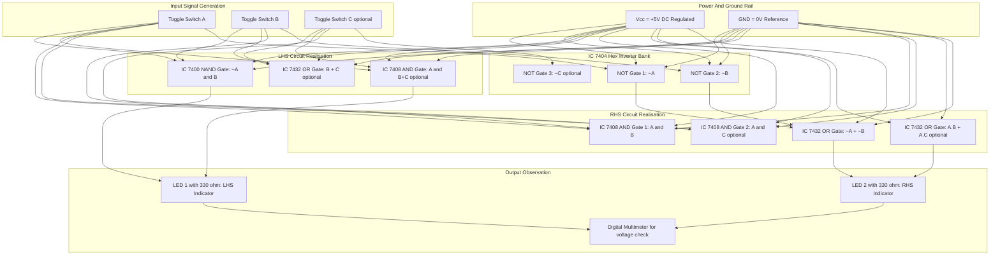
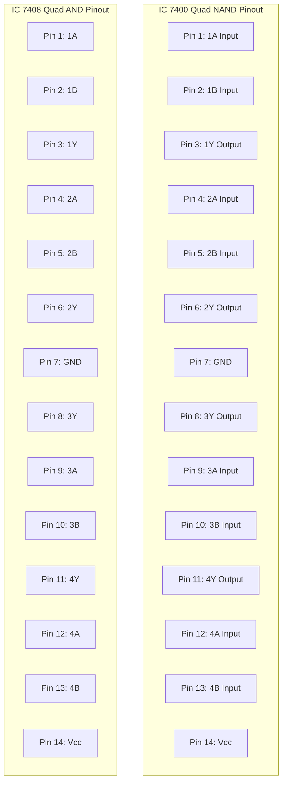

# using gate level primitives

<!-- SECTION_1_START -->
# Gate Level Primitives — KTU 2024 Digital Lab

## 1. Core Technical Definition & Intuitive Overview

### 1.1 Formal Definition

In the context of the KTU **PCCSL308 – Digital Lab** syllabus, a **Gate Level Primitive (GLP)** is the most fundamental, atomic representation of a digital logic function using the standard 7400-series **TTL (Transistor-Transistor Logic)** integrated circuits. Each primitive corresponds to a fixed-function combinational gate (AND, OR, NOT, NAND, NOR, XOR, XNOR) implemented as a hard-wired silicon die inside a 14-pin or 16-pin DIP (Dual In-line Package). Boolean theorems (algebraic identities over the binary set $\{0, 1\}$) are physically *verified* by wiring these primitive gates together on a breadboard and observing the output LED state for every input combination (truth-table exhaustively checked for $2^n$ rows, where $n$ is the number of variables).

> [!IMPORTANT]
> **KTU Syllabus Definition (verbatim flavour):** "Study of basic digital ICs and verification of Boolean theorems using digital ICs." This translates operationally to building Boolean expression equivalence circuits using **discrete gate ICs** as the primitive building blocks, then confirming equivalence by lighting an LED at logic **HIGH (≈ 5 V, "1")** or keeping it OFF at logic **LOW (≈ 0 V, "0")**.

### 1.2 Conceptual Analogy — The "Lego Brick" View

Imagine Boolean algebra as a language. A **sentence** in this language is a Boolean expression such as $F = (A \cdot B) + C'$. Each **alphabet letter** of the language ($A$, $B$, $C$, the operators $\cdot$, $+$, the prime ${}'$) must ultimately be realised physically so a machine can "read" it. The **gate level primitives** are exactly like the *Lego bricks* of electronics:

- A single **AND brick** (IC 7408) — the dot ($\cdot$) operator.
- A single **OR brick** (IC 7432) — the plus ($+$) operator.
- A single **NOT brick** (IC 7404) — the prime (${}'$) operator.
- The **NAND brick** (IC 7400) and **NOR brick** (IC 7402) are the *universal* bricks because from just one of them you can build every other gate (this is what makes De Morgan's verification so elegant).

A **Boolean theorem** like $A + A \cdot B = A$ is the algebraic claim that two different Lego constructions produce *the exact same output pattern* for every possible input. Your job in the lab is to assemble both sides of the claim using the bricks, then sweep every input from 0 to 1 and visually confirm the outputs are identical. The theorem is *verified* only when **all 4 rows** (for 2 variables) or **all 8 rows** (for 3 variables) of the truth table match.

> [!NOTE]
> **Key Standard Metric:** A standard **TTL gate** in the 74xx family operates with a supply voltage **$V_{CC} = +5\text{ V}$**. Logic "1" is recognised by the gate when the input voltage is in the range **$2.0\text{ V}$ to $5.0\text{ V}$**, and logic "0" is recognised when the input voltage is in **$0.0\text{ V}$ to $0.8\text{ V}$**. Anything in between is the forbidden/noise margin zone. Fan-out (the maximum number of similar loads one output can drive) is **$\mathbf{10}$** for standard TTL.

> [!VISUALIZATION CONTROL]
> **Concept:** Truth-table sweep for a 2-input primitive (AND gate) over the 4 possible binary input combinations.
> **Truth Table Coordinates (X = A, Y = B, Z = A AND B):**
> * $(0, 0) \rightarrow 0$
> * $(0, 1) \rightarrow 0$
> * $(1, 0) \rightarrow 0$
> * $(1, 1) \rightarrow 1$
>
> **Visual Description:** When A and B are plotted along two horizontal axes (0 or 1) and the output Z is plotted on the vertical axis, the AND output forms a flat plane at 0 with a single peak rising to 1 only at the $(1,1)$ corner — the famous "multiplication-like" behaviour of Boolean AND.

### 1.3 The 7400-Series IC Family — The "Primitive Catalogue"

| IC Number | Primitive Function | Gates per Package | Pin Count | Logic Symbol |
|:---------:|:-------------------|:-----------------:|:---------:|:------------:|
| **7400**  | 2-input NAND       | 4                | 14        | $\overline{A \cdot B}$ |
| **7402**  | 2-input NOR        | 4                | 14        | $\overline{A + B}$ |
| **7404**  | Hex Inverter (NOT) | 6                | 14        | $\overline{A}$ |
| **7408**  | 2-input AND        | 4                | 14        | $A \cdot B$ |
| **7432**  | 2-input OR         | 4                | 14        | $A + B$ |
| **7486**  | 2-input XOR        | 4                | 14        | $A \oplus B$ |
| **7411**  | 3-input AND        | 3                | 14        | $A \cdot B \cdot C$ |
| **7421**  | 4-input AND        | 2                | 14        | $A \cdot B \cdot C \cdot D$ |
| **7430**  | 8-input NAND       | 1                | 14        | $\overline{A \cdot B \cdot C \cdot D \cdot E \cdot F \cdot G \cdot H}$ |

> [!IMPORTANT]
> **Universal Gate Highlight:** Both **NAND (IC 7400)** and **NOR (IC 7402)** are *functionally complete* — any Boolean function of any complexity can be realised using *only* NANDs or *only* NORs. This is why De Morgan's theorem verification almost always uses the 7400 IC.

<!-- SECTION_1_END -->

<!-- SECTION_2_START -->
# 2. Deep Theoretical Analysis & KTU High-Yield Formula Sheet

## 2.1 Operational Philosophy of Gate-Level Verification

Boolean algebra is a **closed algebraic system** over the binary set $B = \{0, 1\}$ with two binary operators ($\cdot$ for AND, $+$ for OR) and one unary operator (${}'$ for NOT). A **theorem** in this system is an identity $L(A, B, C, \ldots) \equiv R(A, B, C, \ldots)$ that holds for *every* possible assignment of the variables. Verification at the gate level proceeds via this 4-step operational loop:

1. **Algebraic Reduction:** Manipulate the LHS or RHS using the theorem rules to obtain a *simplified canonical form*.
2. **Truth-Table Enumeration:** Build the truth table of the LHS expression — $2^n$ rows for $n$ variables.
3. **Gate-Level Implementation:** Translate the truth-table expression into a netlist using only the 74xx primitive ICs on the breadboard.
4. **Empirical Sweep:** Toggle every input (using logic switches or wire links to $V_{CC}$/GND) and read every output (via an LED + current-limiting resistor) to confirm the LHS and RHS outputs match row-by-row.

> [!NOTE]
> **Why this matters in production engineering:** Gate-level primitives are the foundational layer of the **digital design abstraction stack**. Even though modern FPGAs and ASICs use millions of transistors, the *synthesis tool* still maps any HDL description down to a gate-level netlist composed of these exact same primitive library cells. Understanding them is the difference between *using* a chip and *designing* one.

## 2.2 The KTU High-Yield Boolean Theorem Cheat Sheet

> [!IMPORTANT]
> Memorise the **Laws** column as a permanent mental table — every KTU university exam question on this module is a direct application of one of these identities. The "Verification Hint" column tells you which ICs you will physically use on the breadboard.

| # | Law / Theorem | Algebraic Form (AND/OR form) | Dual Form (swap $\cdot \leftrightarrow +$ and $0 \leftrightarrow 1$) | Verification Hint (Lab ICs) |
|:-:|:-------------|:----------------------------:|:-------------------------------------------------------------------------:|:---------------------------:|
| 1 | **Identity Law** | $A \cdot 1 = A$ | $A + 0 = A$ | 7408 + $V_{CC}$ tie-high |
| 2 | **Null Law** | $A \cdot 0 = 0$ | $A + 1 = 1$ | 7408 with one input grounded |
| 3 | **Idempotent Law** | $A \cdot A = A$ | $A + A = A$ | Single 7408 with tied inputs |
| 4 | **Complement Law** | $A \cdot \overline{A} = 0$ | $A + \overline{A} = 1$ | 7408 + 7404 |
| 5 | **Double Negation** | $\overline{\overline{A}} = A$ | (self-dual) | Two cascaded 7404 inverters |
| 6 | **Commutative Law** | $A \cdot B = B \cdot A$ | $A + B = B + A$ | Two 7408s (or two 7432s) cross-wired |
| 7 | **Associative Law** | $A \cdot (B \cdot C) = (A \cdot B) \cdot C$ | $A + (B + C) = (A + B) + C$ | Three 7411/7408 ICs cascaded |
| 8 | **Distributive Law** | $A \cdot (B + C) = A \cdot B + A \cdot C$ | $A + (B \cdot C) = (A + B) \cdot (A + C)$ | 7408 + 7432 mixed |
| 9 | **Absorption Law** | $A + A \cdot B = A$ | $A \cdot (A + B) = A$ | 7408 + 7432 |
| 10 | **De Morgan's 1st** | $\overline{A \cdot B} = \overline{A} + \overline{B}$ | (self-dual form: $\overline{A + B} = \overline{A} \cdot \overline{B}$) | 7400 + 7404 + 7432 (or 7402) |
| 11 | **Consensus Law** | $A \cdot B + \overline{A} \cdot C + B \cdot C = A \cdot B + \overline{A} \cdot C$ | $(A + B) \cdot (\overline{A} + C) \cdot (B + C) = (A + B) \cdot (\overline{A} + C)$ | 7408 + 7432 + 7404 |

## 2.3 The Hardware Reality of a Single Primitive Gate

Every primitive gate IC has **four mandatory wiring requirements** that students routinely miss in the lab:

1. **$V_{CC}$ (Pin 14 for 14-pin DIP):** Connect to **+5 V** DC from a regulated bench power supply.
2. **GND (Pin 7 for 14-pin DIP):** Connect to **0 V (ground)** — *failure to do this causes undefined behaviour and the IC may overheat*.
3. **Unused inputs:** Must be **tied HIGH** (to $V_{CC}$ through a 1 k$\Omega$ resistor) or **tied LOW** (directly to GND) — *never leave floating*, because floating TTL inputs sit at logic HIGH but are highly noise-sensitive.
4. **Unused outputs:** May be **left open** (no connection) — this is the only safe floating signal in TTL.

> [!NOTE]
> **Engineering Real-World Utility:** Gate-level primitives form the **standard cell library** of every VLSI fabrication process. When you write `Y = A & B` in Verilog and feed it to a synthesis tool like Synopsys Design Compiler or Cadence Genus, the tool picks the *smallest, fastest NAND or AND cell* from the foundry library that implements the function. Knowing the IC-level behaviour of these cells is what allows digital design engineers to **estimate area, delay, and power** before fabrication.

## 2.4 De Morgan's Theorem — The Star Theorem

Because De Morgan's theorem is the most-frequently-asked identity in KTU exams, it deserves special attention:

$$\overline{A \cdot B} = \overline{A} + \overline{B}$$

$$\overline{A + B} = \overline{A} \cdot \overline{B}$$

The first form says: *a NAND gate is electrically equivalent to an OR gate whose inputs are first inverted*. The second form says: *a NOR gate is equivalent to an AND gate whose inputs are first inverted*. This is why the **invert-bubble "bubble-matching" rule** works: push the inversion bubble across the gate boundary and the gate shape flips (AND $\leftrightarrow$ OR).

> [!IMPORTANT]
> **Memory Trick:** "**Break the bar, change the sign**." Whenever you see a long overbar covering an entire expression, *break it over each term* and *flip* the operator between the terms ($\cdot$ becomes $+$, $+$ becomes $\cdot$).

<!-- SECTION_2_END -->

<!-- SECTION_3_START -->
# 3. Step-by-Step Derivations, Hardware Wiring & Code Implementation

## 3.1 Worked Example 1 — Verifying De Morgan's 1st Theorem: $\overline{A \cdot B} = \overline{A} + \overline{B}$

### 3.1.1 Algebraic Derivation (full step-by-step)

$$
\begin{aligned}
\text{LHS} &= \overline{A \cdot B} \\
&= \overline{A \cdot B} \quad \text{[Starting expression — built with one NAND gate]} \\
\text{RHS} &= \overline{A} + \overline{B} \\
&= \overline{A} \cdot 1 + 1 \cdot \overline{B} \quad \text{[Identity law: } A \cdot 1 = A \text{]} \\
&= \overline{A} \cdot (B + \overline{B}) + (A + \overline{A}) \cdot \overline{B} \quad \text{[Complement law: } X + \overline{X} = 1 \text{]} \\
&= \overline{A} \cdot B + \overline{A} \cdot \overline{B} + A \cdot \overline{B} + \overline{A} \cdot \overline{B} \quad \text{[Distributive expansion]} \\
&= \overline{A} \cdot B + (\overline{A} \cdot \overline{B} + \overline{A} \cdot \overline{B}) + A \cdot \overline{B} \quad \text{[Idempotent: } X + X = X \text{]} \\
&= \overline{A} \cdot B + \overline{A} \cdot \overline{B} + A \cdot \overline{B} \quad \text{[Simplify]} \\
&= \overline{A} \cdot (B + \overline{B}) + A \cdot \overline{B} \quad \text{[Factor } \overline{A} \text{]} \\
&= \overline{A} \cdot 1 + A \cdot \overline{B} \quad \text{[Complement law]} \\
&= \overline{A} + A \cdot \overline{B} \quad \text{[Identity law]} \\
&= (\overline{A} + A) \cdot (\overline{A} + \overline{B}) \quad \text{[Distributive law]} \\
&= 1 \cdot (\overline{A} + \overline{B}) \quad \text{[Complement law]} \\
&= \overline{A} + \overline{B} \quad \text{[Identity law]} \\
\therefore \;\; \text{RHS} &= \text{LHS} \quad \blacksquare
\end{aligned}
$$

### 3.1.2 Truth-Table Enumeration

| Row | A | B | $\overline{A}$ | $\overline{B}$ | $\overline{A \cdot B}$ (LHS) | $\overline{A} + \overline{B}$ (RHS) | Match? |
|:---:|:-:|:-:|:--------------:|:--------------:|:---------------------------:|:---------------------------------:|:------:|
| 0   | 0 | 0 | 1              | 1              | **1**                       | **1**                             | $\checkmark$ |
| 1   | 0 | 1 | 1              | 0              | **1**                       | **1**                             | $\checkmark$ |
| 2   | 1 | 0 | 0              | 1              | **1**                       | **1**                             | $\checkmark$ |
| 3   | 1 | 1 | 0              | 0              | **0**                       | **0**                             | $\checkmark$ |

### 3.1.3 Hardware Wiring (Breadboard Implementation)

| Net | IC Used | IC Pins | Wire Destination |
|:----|:--------|:-------:|:-----------------|
| $V_{CC}$ (+5 V) | All | Pin 14 of each IC | Red rail of breadboard |
| GND (0 V) | All | Pin 7 of each IC | Blue rail of breadboard |
| Switch A | — | — | Toggle switch to +5 V (logic 1) or GND (logic 0) |
| Switch B | — | — | Toggle switch to +5 V (logic 1) or GND (logic 0) |
| A signal | 7404 (Inverter) | Pin 1 (in) | Pin 14 of 7400 (NAND input 1) |
| B signal | 7404 (Inverter) | Pin 3 (in) | Pin 2 of 7400 (NAND input 2) |
| $\overline{A}$ | 7404 | Pin 2 (out) | Pin 1 of 7432 (OR input 1) |
| $\overline{B}$ | 7404 | Pin 4 (out) | Pin 2 of 7432 (OR input 2) |
| LHS output $\overline{A \cdot B}$ | 7400 | Pin 3 (out) | LED 1 (via 330 $\Omega$ resistor) |
| RHS output $\overline{A} + \overline{B}$ | 7432 | Pin 3 (out) | LED 2 (via 330 $\Omega$ resistor) |
| Logic probe / DMM | — | — | Verify each row of the truth table |

> [!IMPORTANT]
> **LED Polarity Note:** The LED's **anode** (longer lead, A) connects to the IC output pin. The LED's **cathode** (shorter lead, K) connects through the 330 $\Omega$ current-limiting resistor to GND. Without the resistor, the LED will burn out within seconds and may also damage the IC output stage.

### 3.1.4 HDL Implementation (Verilog Gate-Level Primitives)

The "gate level primitive" concept also has a direct HDL equivalent. In Verilog, the built-in primitive gates are invoked using the keyword `and`, `or`, `not`, `nand`, `nor`, `xor`, `xnor` (all lowercase) with output port first, followed by input ports. Here is the full HDL implementation of De Morgan's 1st theorem with a built-in self-checking testbench:

```verilog
// File: demorgan_1st_primitives.v
// Module: Gate-level primitive verification of De Morgan's 1st Theorem
//   ~(A & B)  ==  ~A | ~B
// Mapped to: 7400 (NAND) + 7404 (NOT) + 7432 (OR)

`timescale 1ns / 1ps

module demorgan_1st_primitives (
    input  wire A,
    input  wire B,
    output wire LHS_nand,    // ~(A & B)  — built with one nand primitive
    output wire RHS_or_inv    // ~A | ~B  — built with two not + one or primitive
);

    // ---- Gate-Level Primitive Instantiation ----
    // Syntax: <primitive_keyword> <instance_name> (output, input1, input2, ...);

    nand (LHS_nand, A, B);          // IC 7400 emulation: 1 NAND gate

    not  (na, A);                   // IC 7404: invert A
    not  (nb, B);                   // IC 7404: invert B
    or   (RHS_or_inv, na, nb);      // IC 7432: OR the two inverted signals

endmodule


// ============================================================
// Self-checking testbench
// ============================================================
module tb_demorgan_1st;
    reg  A, B;
    wire LHS_nand, RHS_or_inv;
    integer errors;
    integer i;

    // DUT instantiation
    demorgan_1st_primitives DUT (
        .A(A),
        .B(B),
        .LHS_nand(LHS_nand),
        .RHS_or_inv(RHS_or_inv)
    );

    initial begin
        $display("Time(ns) | A B | LHS(~(A&B)) | RHS(~A|~B) | Match");
        $display("---------+-----+-------------+-------------+------");
        errors = 0;

        for (i = 0; i < 4; i = i + 1) begin
            {A, B} = i;                       // Sweep 00, 01, 10, 11
            #10;
            $display("   %4t  | %b %b |     %b      |     %b      |  %s",
                     $time, A, B, LHS_nand, RHS_or_inv,
                     (LHS_nand === RHS_or_inv) ? "OK" : "FAIL");
            if (LHS_nand !== RHS_or_inv) errors = errors + 1;
        end

        $display("----------------------------------------");
        if (errors == 0)
            $display("DE MORGAN'S 1st THEOREM: VERIFIED  (0 errors / 4 vectors)");
        else
            $display("DE MORGAN'S 1st THEOREM: FAILED   (%0d errors / 4 vectors)", errors);

        $finish;
    end
endmodule
```

> [!NOTE]
> **Expected simulation output:**
> ```
> Time(ns) | A B | LHS(~(A&B)) | RHS(~A|~B) | Match
> ---------+-----+-------------+-------------+------
>       10 | 0 0 |     1      |     1      |  OK
>       20 | 0 1 |     1      |     1      |  OK
>       30 | 1 0 |     1      |     1      |  OK
>       40 | 1 1 |     0      |     0      |  OK
> ----------------------------------------
> DE MORGAN'S 1st THEOREM: VERIFIED  (0 errors / 4 vectors)
> ```

## 3.2 Worked Example 2 — Verifying the Distributive Law: $A \cdot (B + C) = A \cdot B + A \cdot C$

### 3.2.1 Gate-Level Schematic (mapped to 74xx primitives)

| Sub-Block | Primitive Required | IC Number | Used For |
|:----------|:-------------------|:---------:|:---------|
| $B + C$ | 1× 2-input OR | 7432 | Inner OR term |
| $A \cdot (B+C)$ | 1× 2-input AND | 7408 | LHS final gate |
| $A \cdot B$ | 1× 2-input AND | 7408 | First product term |
| $A \cdot C$ | 1× 2-input AND | 7408 | Second product term |
| $(A \cdot B) + (A \cdot C)$ | 1× 2-input OR | 7432 | RHS final gate |
| **Total ICs** | **3× 7408 + 2× 7432** | — | Full distributive verification |

### 3.2.2 Truth Table for Verification (3 variables → 8 rows)

| # | A | B | C | $B+C$ | $A \cdot (B+C)$ (LHS) | $A \cdot B$ | $A \cdot C$ | $A \cdot B + A \cdot C$ (RHS) | Match? |
|:-:|:-:|:-:|:-:|:-----:|:---------------------:|:-----------:|:-----------:|:-----------------------------:|:------:|
| 0 | 0 | 0 | 0 | 0 | 0 | 0 | 0 | 0 | $\checkmark$ |
| 1 | 0 | 0 | 1 | 1 | 0 | 0 | 0 | 0 | $\checkmark$ |
| 2 | 0 | 1 | 0 | 1 | 0 | 0 | 0 | 0 | $\checkmark$ |
| 3 | 0 | 1 | 1 | 1 | 0 | 0 | 0 | 0 | $\checkmark$ |
| 4 | 1 | 0 | 0 | 0 | 0 | 0 | 0 | 0 | $\checkmark$ |
| 5 | 1 | 0 | 1 | 1 | 1 | 0 | 1 | 1 | $\checkmark$ |
| 6 | 1 | 1 | 0 | 1 | 1 | 1 | 0 | 1 | $\checkmark$ |
| 7 | 1 | 1 | 1 | 1 | 1 | 1 | 1 | 1 | $\checkmark$ |

### 3.2.3 Verilog Implementation Using Gate Primitives

```verilog
// File: distributive_law_primitives.v
// Verifies: A & (B | C)  ==  (A & B) | (A & C)

`timescale 1ns / 1ps

module distributive_law (
    input  wire A, B, C,
    output wire LHS_dist,   // A & (B | C)
    output wire RHS_dist    // (A & B) | (A & C)
);
    wire b_or_c;
    wire a_and_b, a_and_c;

    // LHS = A & (B | C)
    or  (b_or_c, B, C);
    and (LHS_dist, A, b_or_c);

    // RHS = (A & B) | (A & C)
    and (a_and_b, A, B);
    and (a_and_c, A, C);
    or  (RHS_dist, a_and_b, a_and_c);

endmodule


module tb_distributive_law;
    reg A, B, C;
    wire LHS_dist, RHS_dist;
    integer errors, i;

    distributive_law DUT (.A(A), .B(B), .C(C), .LHS_dist(LHS_dist), .RHS_dist(RHS_dist));

    initial begin
        errors = 0;
        $display("Row | A B C | LHS A&(B|C) | RHS (A&B)|(A&C) | Match");
        $display("----+-------+-------------+-----------------+------");
        for (i = 0; i < 8; i = i + 1) begin
            {A, B, C} = i;
            #10;
            $display(" %0d  | %b %b %b |      %b      |       %b        |  %s",
                     i, A, B, C, LHS_dist, RHS_dist,
                     (LHS_dist === RHS_dist) ? "OK" : "FAIL");
            if (LHS_dist !== RHS_dist) errors = errors + 1;
        end
        if (errors == 0)
            $display("DISTRIBUTIVE LAW: VERIFIED (0/8 errors)");
        else
            $display("DISTRIBUTIVE LAW: FAILED  (%0d/8 errors)", errors);
        $finish;
    end
endmodule
```

## 3.3 Complete Lab-Equipment Pin Configuration & Tool Profile

| Equipment | Specification | Purpose in This Experiment |
|:----------|:--------------|:---------------------------|
| **Breadboard** | 830 tie-points, 2 power rails | Mechanical + electrical mounting of ICs |
| **DC Power Supply** | Regulated **+5 V ± 0.25 V**, 1 A min | $V_{CC}$ rail for 74xx TTL family |
| **Logic Switches** | SPDT toggle, debounced | Generate $A$, $B$, $C$ input combinations |
| **Logic Indicators (LEDs)** | Red, 5 mm, $V_F \approx 2\text{ V}$, $I_F = 15\text{ mA}$ | Visual output of gate outputs |
| **Resistors** | 330 $\Omega$ $\pm 5\%$, $\frac{1}{4}\text{ W}$ | Current limiting for each LED |
| **IC 7400** | Quad 2-input NAND, 14-pin DIP | Universal gate for De Morgan verification |
| **IC 7404** | Hex Inverter, 14-pin DIP | Generate $\overline{A}$, $\overline{B}$, $\overline{C}$ |
| **IC 7408** | Quad 2-input AND, 14-pin DIP | AND operations |
| **IC 7432** | Quad 2-input OR, 14-pin DIP | OR operations |
| **Digital Multimeter (DMM)** | 3.5 digit, $10\text{ M}\Omega$ input impedance | Verify logic levels at gate outputs |
| **Connecting Wires** | 22 AWG solid-core, pre-stripped | Breadboard point-to-point wiring |
| **IC Extractor / Puller** | — | Safe IC removal (no bent pins) |

> [!IMPORTANT]
> **Safety & Wiring Sequence (always follow this order):**
> 1. Switch OFF the power supply.
> 2. Insert ICs into the breadboard (notch on the IC faces left, pin 1 lower-left).
> 3. Wire **GND (pin 7) first**, then **$V_{CC}$ (pin 14)**.
> 4. Wire the signal inputs (switches).
> 5. Wire the gate-to-gate interconnects.
> 6. Wire the LED output indicators (with 330 $\Omega$ resistor to GND).
> 7. Triple-check polarity of every IC and every LED.
> 8. **Power ON** and verify a known input combination (e.g., all switches LOW → expected LHS = 0, RHS = 0).
> 9. Sweep the full truth table and tabulate.

<!-- SECTION_3_END -->

<!-- SECTION_4_START -->
# 4. Structural Diagrams & Schematics

## 4.1 Top-Level Lab Architecture — Gate-Level Primitive Verification Flow



## 4.2 Sequential Processing Topology — Verification Methodology Matrix

```mermaid
flowchart LR
    subgraph STEP1["Stage 1 Algebraic"]
        S1A["Read the Boolean theorem LHS = RHS"]
        S1B["Simplify both sides to canonical form"]
        S1C["Enumerate full truth table 2 to power n rows"]
    end

    subgraph STEP2["Stage 2 Schematic Capture"]
        S2A["Identify required gate primitives AND OR NOT NAND NOR XOR"]
        S2B["Map each primitive to a 74xx IC number"]
        S2C["Count total ICs required and check availability"]
    end

    subgraph STEP3["Stage 3 Breadboard Wiring"]
        S3A["Power OFF the DC supply"]
        S3B["Insert ICs notch to the left"]
        S3C["Wire GND pin 7 and Vcc pin 14 of every IC"]
        S3D["Wire logic switches to all gate inputs"]
        S3E["Wire gate interconnects signal flow"]
        S3F["Wire LED indicators via 330 ohm to GND"]
    end

    subgraph STEP4["Stage 4 Empirical Sweep"]
        S4A["Power ON supply and verify all voltages at 5V"]
        S4B["Sweep every row of the truth table"]
        S4C["Read LHS LED and RHS LED for each row"]
        S4D["Tabulate LHS RHS and Match columns"]
    end

    subgraph STEP5["Stage 5 Conclusion"]
        S5A["If all rows match the theorem is VERIFIED"]
        S5B["If any row mismatches recheck wiring and IC seating"]
        S5C["Document the lab record with signature"]
    end

    S1A --> S1B --> S1C
    S1C --> S2A --> S2B --> S2C
    S2C --> S3A --> S3B --> S3C --> S3D --> S3E --> S3F
    S3F --> S4A --> S4B --> S4C --> S4D
    S4D --> S5A --> S5B --> S5C
```



## 4.3 Subgraph: IC Pinout Reference (14-Pin DIP, Top View)



<!-- SECTION_4_END -->

<!-- SECTION_5_START -->
# 5. KTU 2024 Scheme Examination Question Bank & Topic Recap

## 5.1 Part A Questions (3 Marks Each) — Remember / Understand

### **Question A1.** [KTU University Exam - Dec 2023]
List any **three 74xx series TTL ICs** along with their logic function and pin count. State the standard $V_{CC}$ voltage for the 74xx TTL family.

**Model Answer (Valuation Key — 3 Marks):**
1. **IC 7400** — Quad 2-input NAND gate — **14 pins** — $[1 \text{ Mark}]$
2. **IC 7408** — Quad 2-input AND gate — **14 pins** — $[1 \text{ Mark}]$
3. **IC 7432** — Quad 2-input OR gate — **14 pins** — $[0.5 \text{ Marks}]$
4. Standard $V_{CC} =$ **+5 V DC** — $[0.5 \text{ Marks}]$

---

### **Question A2.** [KTU University Exam - July 2024]
State **De Morgan's two theorems** in their canonical Boolean algebraic form.

**Model Answer (Valuation Key — 3 Marks):**

$$
\begin{aligned}
\text{Theorem 1:} \quad & \overline{A \cdot B} = \overline{A} + \overline{B} \quad [1.5 \text{ Marks}] \\
\text{Theorem 2:} \quad & \overline{A + B} = \overline{A} \cdot \overline{B} \quad [1.5 \text{ Marks}]
\end{aligned}
$$

> [!WARNING]
> **Examiner's Pitfall:** Many students write only *one* form and lose 1.5 marks. The KTU valuation key demands **both** forms explicitly.

---

## 5.2 Part B Questions (14 Marks Each) — Apply / Analyse

### **Question B-Option-A (14 Marks)** [KTU University Exam - Dec 2023]

#### (a) Design and verify the Boolean identity $\overline{A + B} = \overline{A} \cdot \overline{B}$ using gate-level primitives. Draw the circuit diagram using 74xx ICs and tabulate the truth table. (7 Marks)

**Model Solution:**

**Step 1 — Identify primitives required:** $[1 \text{ Mark}]$

| Function | Primitive Gate | IC Used |
|:---------|:---------------|:--------|
| $\overline{A}$ | NOT | 7404 |
| $\overline{B}$ | NOT | 7404 |
| $\overline{A} \cdot \overline{B}$ (RHS) | AND | 7408 |
| $\overline{A + B}$ (LHS) | NOR | 7402 |

**Step 2 — Truth Table:** $[3 \text{ Marks}]$

| A | B | $\overline{A}$ | $\overline{B}$ | LHS = $\overline{A+B}$ | RHS = $\overline{A} \cdot \overline{B}$ | Match |
|:-:|:-:|:--------------:|:--------------:|:----------------------:|:--------------------------------------:|:-----:|
| 0 | 0 | 1 | 1 | **1** | **1** | $\checkmark$ |
| 0 | 1 | 1 | 0 | **0** | **0** | $\checkmark$ |
| 1 | 0 | 0 | 1 | **0** | **0** | $\checkmark$ |
| 1 | 1 | 0 | 0 | **0** | **0** | $\checkmark$ |

**Step 3 — Circuit Diagram & Wiring:** $[2 \text{ Marks}]$

- LHS side: A and B fed into pins 2, 3 of **IC 7402**; output at pin 1 drives **LED 1**.
- RHS side: A fed into pin 1 of **IC 7404**, output at pin 2 → pin 1 of **IC 7408**. B fed into pin 3 of **IC 7404**, output at pin 4 → pin 2 of **IC 7408**. IC 7408 output at pin 3 drives **LED 2**.
- $V_{CC}$ = +5 V at pin 14 of every IC; GND at pin 7 of every IC; 330 $\Omega$ resistor in series with each LED.

**Step 4 — Conclusion:** $[1 \text{ Mark}]$

Since LHS and RHS match for **all 4 rows**, De Morgan's 2nd theorem is **verified**.

---

#### (b) Using a 2-input NAND gate (IC 7400) and a single NOT gate (IC 7404), implement the OR function $Y = A + B$. Justify using De Morgan's theorem and draw the wiring diagram. (7 Marks)

**Model Solution:**

**Step 1 — Algebraic Justification:** $[3 \text{ Marks}]$

$$
\begin{aligned}
Y &= A + B \\
  &= \overline{\overline{A + B}} \quad \text{[Double negation: } \overline{\overline{X}} = X \text{]} \\
  &= \overline{\overline{A} \cdot \overline{B}} \quad \text{[Apply De Morgan's 2nd theorem]} \\
  &= \text{NAND}(\overline{A}, \overline{B})
\end{aligned}
$$

This means: **invert A and B first, then feed both inverted signals into a NAND gate** → the output is the OR of A and B.

**Step 2 — Primitive Mapping:** $[1 \text{ Mark}]$
- 2× NOT gates from **IC 7404** (invert A and B).
- 1× NAND gate from **IC 7400** (combine the inverted inputs).
- 1× LED + 330 $\Omega$ to observe output.

**Step 3 — Truth Table Verification:** $[2 \text{ Marks}]$

| A | B | $\overline{A}$ | $\overline{B}$ | $\overline{\overline{A} \cdot \overline{B}} = A + B$ |
|:-:|:-:|:--------------:|:--------------:|:---------------------------------------------------:|
| 0 | 0 | 1 | 1 | **0** |
| 0 | 1 | 1 | 0 | **1** |
| 1 | 0 | 0 | 1 | **1** |
| 1 | 1 | 0 | 0 | **1** |

**Step 4 — Conclusion:** $[1 \text{ Mark}]$

The output column exactly matches the standard OR truth table. Therefore, **OR is realised using 1 NAND + 2 NOTs**, proving NAND's universality.

---

### **Question B-Option-B (14 Marks)** [KTU University Exam - July 2024]

#### (a) Verify the **Absorption Law** $A + A \cdot B = A$ experimentally using a 7408 (AND) and 7432 (OR) IC. Tabulate the truth table for all four input combinations of A and B. (7 Marks)

**Model Solution:**

**Step 1 — Identify the sub-circuits:** $[1 \text{ Mark}]$
- **LHS sub-circuit:** $A \cdot B$ built with one AND gate of **IC 7408**; then OR with A using one OR gate of **IC 7432**.
- **RHS sub-circuit:** Direct connection of input A to a separate LED (or through a buffer for fan-out safety).

**Step 2 — Truth Table:** $[4 \text{ Marks}]$

| A | B | $A \cdot B$ | LHS = $A + A \cdot B$ | RHS = $A$ | Match |
|:-:|:-:|:-----------:|:---------------------:|:---------:|:-----:|
| 0 | 0 | 0 | **0** | **0** | $\checkmark$ |
| 0 | 1 | 0 | **0** | **0** | $\checkmark$ |
| 1 | 0 | 0 | **1** | **1** | $\checkmark$ |
| 1 | 1 | 1 | **1** | **1** | $\checkmark$ |

**Step 3 — Wiring:** $[1.5 \text{ Marks}]$
- A → pin 1 of IC 7408 (AND gate 1) and pin 1 of IC 7432 (OR gate 1).
- B → pin 2 of IC 7408.
- Output of IC 7408 at pin 3 → pin 2 of IC 7432.
- Output of IC 7432 at pin 3 → LED 1 (LHS).
- Input A also → LED 2 (RHS), with each LED in series with a 330 $\Omega$ resistor to GND.
- $V_{CC} = +5$ V on pin 14, GND on pin 7 of every IC.

**Step 4 — Conclusion:** $[0.5 \text{ Marks}]$
All 4 rows match, so the absorption law is **verified**.

---

#### (b) Implement the **XOR function** $Y = A \oplus B$ using only **NAND gates (IC 7400)**. Show the algebraic conversion, draw the circuit, and write the Verilog gate-level primitive code. (7 Marks)

**Model Solution:**

**Step 1 — Algebraic Conversion to NAND-only form:** $[2 \text{ Marks}]$

$$
\begin{aligned}
Y &= A \oplus B \\
  &= A \cdot \overline{B} + \overline{A} \cdot B \\
  &= \overline{\overline{A \cdot \overline{B} + \overline{A} \cdot B}} \quad \text{[Double negation]} \\
  &= \overline{\overline{A \cdot \overline{B}} \cdot \overline{\overline{A} \cdot B}} \quad \text{[De Morgan's 1st theorem]} \\
  &= \text{NAND}\bigl(\text{NAND}(A, \overline{B}),\; \text{NAND}(\overline{A}, B)\bigr)
\end{aligned}
$$

Where $\overline{A}$ and $\overline{B}$ themselves are NANDs with tied inputs: $\overline{A} = \text{NAND}(A, A)$ and $\overline{B} = \text{NAND}(B, B)$.

**Step 2 — Total NAND count:** $[1 \text{ Mark}]$
- 2× NAND for $\overline{A}$ and $\overline{B}$ (tied inputs).
- 1× NAND for $\text{NAND}(A, \overline{B})$.
- 1× NAND for $\text{NAND}(\overline{A}, B)$.
- 1× NAND as the final combiner.
- **Total: 5 NAND gates** → requires **2× IC 7400** (each contains 4 NANDs).

**Step 3 — Verilog Gate-Level Primitive Code:** $[3 \text{ Marks}]$

```verilog
// xor_using_nand.v
// XOR implemented using only NAND gate primitives
`timescale 1ns / 1ps

module xor_using_nand (input wire A, B, output wire Y);
    wire nA, nB, t1, t2;
    nand (nA, A, A);          // ~A using NAND with tied inputs
    nand (nB, B, B);          // ~B using NAND with tied inputs
    nand (t1, A, nB);         // ~(A & ~B)
    nand (t2, nA, B);         // ~(~A & B)
    nand (Y,  t1, t2);        // ~( ~(A&~B) & ~(~A&B) ) = A ^ B
endmodule


module tb_xor_using_nand;
    reg A, B; wire Y;
    integer i, err;
    xor_using_nand DUT (.A(A), .B(B), .Y(Y));
    initial begin
        err = 0;
        for (i = 0; i < 4; i = i + 1) begin
            {A, B} = i; #10;
            $display("A=%b B=%b Y=%b %s", A, B, Y,
                     (Y === (A ^ B)) ? "OK" : "FAIL");
            if (Y !== (A ^ B)) err = err + 1;
        end
        $display("XOR via NAND: %s", (err == 0) ? "PASS" : "FAIL");
        $finish;
    end
endmodule
```

**Step 4 — Conclusion:** $[1 \text{ Mark}]$
XOR is implemented using **5 NAND gates only**, demonstrating the **functional completeness of the NAND primitive**.

---

> [!WARNING]
> **KTU Examiner's Valuation Warning — Common Mark-Loss Traps:**
> 1. **Forgetting to connect GND (pin 7) on the IC** — the gate will malfunction unpredictably. Examiners will not award the "wiring diagram" marks if the power/ground pins are not shown.
> 2. **Leaving unused inputs floating** — in TTL, floating inputs act as logic HIGH but pick up noise. Always tie unused inputs to $V_{CC}$ or GND explicitly.
> 3. **Reversing LED polarity** — the LED will not light and you may wrongly conclude the theorem failed. Always check the longer lead (anode) faces the IC output.
> 4. **Writing the truth table with fewer than $2^n$ rows** — for a 3-variable expression like $A \cdot (B+C) = A \cdot B + A \cdot C$, the table **must** have **8 rows**, not 4. Skipping rows is a guaranteed 1–2 mark deduction.
> 5. **Confusing the dual form** of De Morgan's theorems in the answer script — examiners often set traps asking for "the *other* form." Always write both $\overline{A \cdot B} = \overline{A} + \overline{B}$ **and** $\overline{A + B} = \overline{A} \cdot \overline{B}$.
> 6. **Forgetting to mention the $V_{CC} = +5$ V requirement** in the procedure — this is a frequently-tested safety/practical point worth 1 mark in most valuation keys.

---

## 5.3 Topic Recap & Important Things to Remember

- **Gate Level Primitive (GLP)** = the smallest, fixed-function digital building block implemented inside a 74xx-series TTL IC.
- The 74xx family uses **TTL logic levels**: Logic **"1"** $= 2.0\text{ V}$ to $5.0\text{ V}$; Logic **"0"** $= 0.0\text{ V}$ to $0.8\text{ V}$; $V_{CC} = +5\text{ V}$.
- The **five "core" 74xx ICs** for this lab module are **7400 (NAND), 7402 (NOR), 7404 (NOT), 7408 (AND), 7432 (OR)**. IC **7486 (XOR)** and IC **7430 (8-input NAND)** are used for advanced theorems.
- **NAND (7400) and NOR (7402) are *universal gates*** — any Boolean function can be realised using only one of them.
- **Verification of a Boolean theorem** at the gate level requires building **both sides** of the identity using primitive ICs and confirming the truth-table outputs match for **all $2^n$ input rows**.
- **De Morgan's Theorems** (most-frequently-tested):
  $$\overline{A \cdot B} = \overline{A} + \overline{B} \quad \text{and} \quad \overline{A + B} = \overline{A} \cdot \overline{B}$$
  Memory trick: **"Break the bar, change the sign."**
- **Distributive Law:** $A \cdot (B + C) = A \cdot B + A \cdot C$ — needs 7408 + 7432 in a mixed cascade.
- **Absorption Law:** $A + A \cdot B = A$ and $A \cdot (A + B) = A$ — only needs 2 ICs to verify.
- **Hardware wiring rule** — always connect **pin 7 (GND)** and **pin 14 ($V_{CC}$)** of every 14-pin DIP IC *first*, before any signal wires.
- **Unused inputs must be tied to $V_{CC}$ or GND** — never left floating in TTL.
- **LEDs require a 330 $\Omega$ current-limiting resistor** between cathode and GND; anode goes to the IC output.
- In **Verilog**, gate-level primitives are invoked as: `<keyword> (output, input1, ..., inputN);` — keywords are `and`, `or`, `not`, `nand`, `nor`, `xor`, `xnor` (lowercase, *reserved* in Verilog).
- The **Consensus Law** $A B + \overline{A} C + B C = A B + \overline{A} C$ is a high-yield 3-variable theorem often asked in Part B.
- The **14-pin DIP IC standard pinout** has pin 1 at the lower-left when the notch faces up, and pin numbering proceeds counter-clockwise: $1, 2, 3, \ldots, 7$ (bottom row), then $8, 9, \ldots, 14$ (top row).
- The **fan-out of standard TTL = 10** — one output can drive up to 10 standard TTL inputs.
- The **propagation delay** of a typical 74xx gate is **$\approx 10$ ns**, which is why TTL is still used in undergraduate labs where signals are slow enough to observe with the naked eye through an LED.
- **Total IC count quick-references** for common KTU exam circuits:
  - De Morgan 1st: 1× 7400 + 1× 7404 + 1× 7432
  - De Morgan 2nd: 1× 7402 + 1× 7404 + 1× 7408
  - Distributive Law: 3× 7408 + 2× 7432
  - Absorption Law: 1× 7408 + 1× 7432
  - XOR from NANDs: 2× 7400 (uses 5 of the 8 available NANDs)

<!-- SECTION_5_END -->
