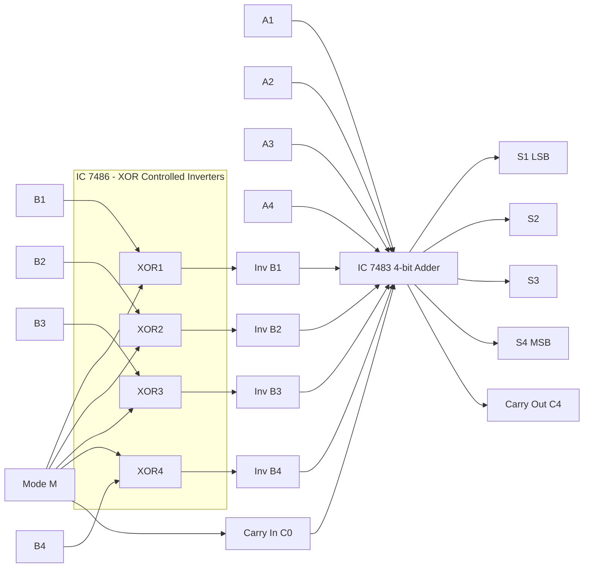
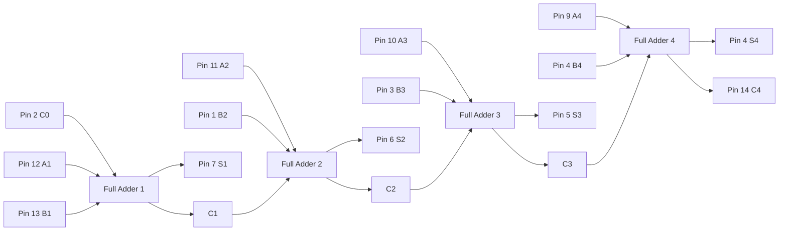
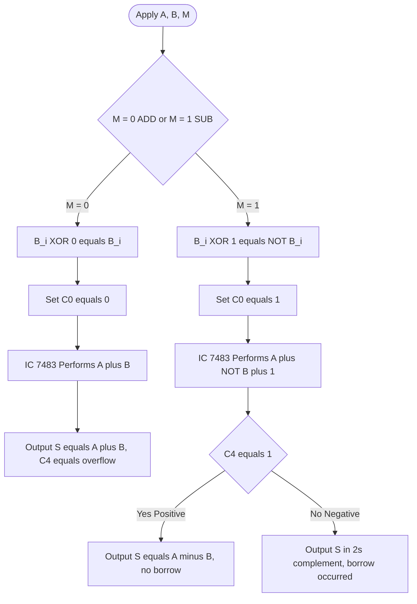
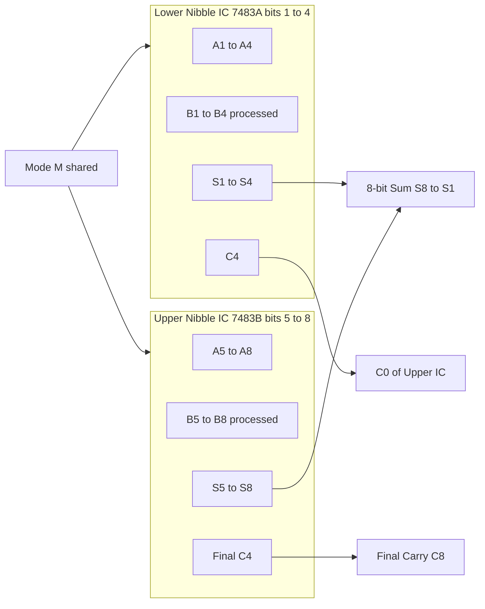

# 4-bit adder and subtractor using  MSI device IC 7483.

<!-- SECTION_1_START -->
# 4-Bit Adder and Subtractor Using MSI Device IC 7483

## 1.1 Core Technical Definition

> [!IMPORTANT]
> **KTU 2024 Syllabus Definition**
> The **IC 7483** is a **Medium Scale Integration (MSI)** device that functions as a **4-bit binary Full Adder with Fast Internal Carry Look-Ahead**. It is a 16-pin DIP package containing four interconnected full adders (FA1, FA2, FA3, FA4) capable of adding two 4-bit binary numbers (A and B) and a carry-in bit, producing a 4-bit sum and a final carry-out.

A **4-bit adder/subtractor** is a combinational logic circuit constructed using the IC 7483 along with **quad 2-input XOR gates (IC 7486)**, designed to perform either **A + B** (addition) or **A − B** (subtraction) based on a **Mode Control input (M)**. The subtraction is achieved through the **2's complement method**, where subtracting B from A is implemented as **A + (~B) + 1**.

### 1.2 Conceptual Analogy / Intuition

> [!NOTE]
> **Real-World Analogy: The Digital Cashier**
> Imagine an old mechanical cash register with 4 dials (each showing 0–9) that can either **add** amounts (purchases) or **subtract** amounts (returns/refunds) based on a switch position.
> 
> - The **cashier presses "+"** → numbers are added normally, and any overflow rolls over to the next dial (just like the **ripple carry** in IC 7483).
> - The **cashier presses "−"** → the subtrahend digits flip on a 9's display mirror (this is the **XOR inversion**), and **1 extra rupee** is added to start subtraction (the **C0 = 1** for 2's complement).
> - The result is displayed across 4 dials (Sum outputs S4 S3 S2 S1) and a final overflow flag (Carry-out C4) indicates whether the answer is positive.
> 
> Just as one cashier can handle both transactions with a single lever, one IC 7483 + XOR gate array can handle both 4-bit addition and subtraction with a single **Mode bit M**.

### 1.3 Key Physical Constants & Standard Metrics

> [!IMPORTANT]
> **Standard Device Parameters (from Texas Instruments / Fairchild Datasheets)**
> - **Supply Voltage (V_CC):** **+5 V DC** (standard TTL logic level)
> - **Logic Family:** **TTL (Transistor-Transistor Logic)**
> - **Propagation Delay (typical):** **16 ns** (A or B to Sum), **11 ns** (C0 to C4)
> - **Power Dissipation:** **~310 mW** (typical)
> - **Fan-Out:** **10 standard TTL loads**
> - **Operating Temperature:** **0 °C to +70 °C**
> - **Package:** **16-pin DIP (Dual In-line Package)**

### 1.4 Pinout Summary of IC 7483

| Pin No. | Signal | Function |
|:-------:|:------:|:---------|
| 1, 3, 8, 13 | B4, B3, B2, B1 | 4-bit B input (LSB on Pin 13) |
| 2 | C0 | Carry Input |
| 4, 5, 6, 7 | S4, S3, S2, S1 | 4-bit Sum output |
| 9, 10, 11, 12 | A4, A3, A2, A1 | 4-bit A input |
| 14 | C4 | Carry Output (final) |
| 15, 16 | V_CC, GND | Power and Ground |

> [!VISUALIZATION CONTROL]
> **Concept:** IC 7483 Pin Configuration and Internal Block Structure
> **Schematic Input (as built in lab):**
> * VCC = +5 V, GND = 0 V on breadboard rails.
> * 16-pin DIP socket with notch facing left → Pin 1 at bottom-left.
> **Visual Description:** A rectangular 16-pin chip with the notch indicator on the left side; pins numbered 1–8 along the bottom edge (left to right) and pins 9–16 along the top edge (right to left). A1 on pin 12 is the LSB of operand A; S1 on pin 7 is the LSB of the sum.

<!-- SECTION_1_END -->

<!-- SECTION_2_START -->
# Deep Theoretical Analysis & KTU High-Yield Formula Sheet

## 2.1 Internal Architecture of IC 7483

The IC 7483 internally consists of **four 1-bit Full Adders (FA1 to FA4)** cascaded in a ripple-carry configuration. The carry output of each stage is connected to the carry input of the next higher-order stage.

For each bit position $i$ (where $i \in \{1,2,3,4\}$), the full adder computes:

$$S_i = A_i \oplus B_i \oplus C_{i-1}$$

$$C_i = (A_i \cdot B_i) + (C_{i-1} \cdot (A_i \oplus B_i))$$

The **C4 (final carry)** is the carry out of the most significant full adder FA4.

## 2.2 Operating Modes of the 4-Bit Adder/Subtractor

The circuit uses **four XOR gates** (from IC 7486) as **controlled inverters** at each B input. The **Mode bit M** is fed as the second input to all four XOR gates, and is also connected to the **C0** input of IC 7483.

### Mode M = 0 → ADDITION

- XOR output: $B_i \oplus 0 = B_i$ (B passes through unchanged).
- C0 = 0.
- Result: $\mathbf{S = A + B}$ with carry C4.

### Mode M = 1 → SUBTRACTION (2's Complement Method)

- XOR output: $B_i \oplus 1 = \overline{B_i}$ (B is bitwise inverted → 1's complement).
- C0 = 1 (adds 1 to complete 2's complement).
- Result: $\mathbf{S = A + \overline{B} + 1 = A - B}$.
- If $A \ge B$: result is positive (in true binary), and C4 = 1 (indicates no borrow).
- If $A < B$: result is in **2's complement form** (negative), and C4 = 0 (indicates borrow).

> [!NOTE]
> **2's Complement Subtraction Logic — The Core 'Why'**
> 
> **Why 2's complement?** It allows us to use the **same adder hardware** for both addition and subtraction. Instead of designing a separate subtractor circuit, we mathematically transform subtraction into addition.
> 
> **Why XOR gates for inversion?** A 2-input XOR gate acts as a **programmable inverter**: when the control input is 0, the data passes through; when 1, it is inverted. This is more efficient than a multiplexer in small designs.
> 
> **Why C0 = 1 in subtract mode?** Because 1's complement alone differs from 2's complement by exactly 1. Adding 1 through the carry-in completes the conversion.

## 2.3 KTU Formula Sheet / Cheat Sheet

| Parameter | Formula / Value | Conditions / Units |
|:----------|:---------------|:-------------------|
| Sum bit | $S_i = A_i \oplus B_i \oplus C_{i-1}$ | Boolean sum, 1 bit |
| Carry bit | $C_i = A_i B_i + C_{i-1}(A_i \oplus B_i)$ | Boolean carry, 1 bit |
| Final Carry | $C_4$ = MSB carry output | Logic 0 or 1 |
| Addition mode | $S = A + B$, $M = 0$, $C_0 = 0$ | Result: $\le 4$ bits + carry |
| Subtraction mode | $S = A - B = A + \overline{B} + 1$, $M = 1$, $C_0 = 1$ | 2's complement arithmetic |
| Borrow indicator | Borrow = $\overline{C_4}$ in subtract mode | C4 = 0 means borrow occurred |
| Sign of result | Sign = C4 (in subtract mode) | C4 = 1 → positive; C4 = 0 → negative |
| XOR controlled input | $B_i' = B_i \oplus M$ | M is mode control bit |
| Power consumption | $P = V_{CC} \times I_{CC} \approx 5 \text{ V} \times 62 \text{ mA} = 310 \text{ mW}$ | Typical TTL operation |
| Propagation delay | $t_{pd} \approx 16 \text{ ns}$ (A/B to S), $11 \text{ ns}$ (C0 to C4) | At 25 °C, 50 pF load |

> [!IMPORTANT]
> **KTU High-Yield Point:** In subtraction mode, if **C4 = 1**, the answer is **positive and correct**. If **C4 = 0**, the answer is **negative and in 2's complement form**, which the student must manually convert to sign-magnitude for interpretation.

## 2.4 Real-World Engineering Applications

1. **ALU (Arithmetic Logic Unit) of Microprocessors:** Every CPU contains a multi-bit adder/subtractor built using similar MSI/LSI blocks. The 8085, 8086, and ARM Cortex cores all use carry-lookahead or ripple-carry adder trees based on this fundamental concept.
2. **Digital Signal Processing (DSP):** FIR filters, FFT butterflies, and convolution engines all rely on high-speed multi-operand adders.
3. **Address Arithmetic in Memory Controllers:** Program counters (PC) and stack pointers increment/decrement using 4-bit, 8-bit, or 16-bit adder/subtractors.
4. **Digital Voltmeters and Frequency Counters:** BCD adders are used to accumulate counts and display measurements.
5. **Cryptographic Hardware:** AES and SHA engines perform modular arithmetic in finite fields, which is built atop binary adders.

<!-- SECTION_2_END -->

<!-- SECTION_3_START -->
# Step-by-Step Derivations, Pin Wiring & Hardware Implementation

## 3.1 Exhaustive Pin Wiring Procedure (Breadboard / Trainer Kit)

| Step | Action | Component / Pin | Connection Detail |
|:----:|:-------|:---------------|:------------------|
| 1 | Insert IC 7483 | 16-pin DIP socket | Notch facing left, Pin 1 at bottom-left |
| 2 | Power connections | Pin 16 → +5 V, Pin 8 → GND | Use red (+5 V) and black (GND) wires |
| 3 | Insert IC 7486 | 14-pin DIP socket | Quad 2-input XOR gate IC |
| 4 | Power IC 7486 | Pin 14 → +5 V, Pin 7 → GND | TTL power rail |
| 5 | Connect mode switch M | SPDT switch or logic input | Common to all 4 XOR gates (pin 2 of each) |
| 6 | Connect B inputs | B1, B2, B3, B4 from toggle switches | To XOR gate input pin 1 (one input of each XOR) |
| 7 | Connect A inputs | A1, A2, A3, A4 from toggle switches | Directly to IC 7483 pins 12, 11, 10, 9 |
| 8 | XOR outputs to 7483 | Output of each XOR → corresponding B pin of 7483 | Pin 3 of 7486 → Pin 13 (B1); Pin 6 → Pin 1 (B4), etc. |
| 9 | Connect C0 | Mode bit M → Pin 2 of IC 7483 | M doubles as C0 |
| 10 | Connect output displays | S1–S4 → LED indicators (with 330 Ω resistors) | Pin 7, 6, 5, 4 of IC 7483 |
| 11 | Connect C4 indicator | Pin 14 of IC 7483 → LED with resistor | Indicates overflow/borrow |
| 12 | Verification test | Apply 0000 + 0000 | Expect S = 0000, C4 = 0 |

## 3.2 Exhaustive Worked Example — Subtraction (1010 − 0101)

**Given:** A = 1010 (decimal 10), B = 0101 (decimal 5). Mode M = 1 (subtraction).

**Step 1: XOR inversion of B with M = 1**

| Bit | B_i | M | B_i ⊕ M = B_i' |
|:---:|:---:|:-:|:--------------:|
| 1   | 1   | 1 | 0              |
| 2   | 0   | 1 | 1              |
| 3   | 1   | 1 | 0              |
| 4   | 0   | 1 | 1              |

So $B' = 1010$ (1's complement of B).

**Step 2: Set C0 = M = 1**

**Step 3: Internal ripple-carry addition of A + B' + C0**

| Stage | A_i | B_i' | C_{i-1} | S_i = A_i ⊕ B_i' ⊕ C_{i-1} | C_i = A_i B_i' + C_{i-1}(A_i ⊕ B_i') |
|:-----:|:---:|:----:|:--------:|:---------------------------:|:-------------------------------------:|
| 1     | 0   | 0    | 1        | 1                           | 0                                     |
| 2     | 1   | 1    | 0        | 0                           | 1                                     |
| 3     | 0   | 0    | 1        | 1                           | 0                                     |
| 4     | 1   | 1    | 0        | 0                           | 1                                     |

**Step 4: Read Result**

- S = 0101 (decimal 5)
- C4 = 1 (indicates no borrow → result is positive)

**Verification:** 10 − 5 = 5 ✓

## 3.3 Exhaustive Worked Example — Addition (0111 + 0011)

**Given:** A = 0111, B = 0011, M = 0 (addition).

**Step 1: XOR output is B itself (since M = 0).** $B' = 0011$.

**Step 2: C0 = M = 0.**

**Step 3: Internal addition**

| Stage | A_i | B_i' | C_{i-1} | S_i | C_i |
|:-----:|:---:|:----:|:--------:|:---:|:---:|
| 1     | 1   | 1    | 0        | 0   | 1   |
| 2     | 1   | 1    | 1        | 1   | 1   |
| 3     | 1   | 0    | 1        | 0   | 1   |
| 4     | 0   | 0    | 1        | 1   | 0   |

**Step 4: Read Result**

- S = 1010 (decimal 10)
- C4 = 0

**Verification:** 7 + 3 = 10 ✓ (4-bit sum, no overflow).

## 3.4 Cascading Two IC 7483 for 8-Bit Operations

To build an 8-bit adder/subtractor, the **C4 of the lower-order IC** must be connected to the **C0 of the higher-order IC**. The XOR gate control signal (M) is shared between both ICs.

| Signal | Lower IC 7483 (bits 1–4) | Upper IC 7483 (bits 5–8) |
|:-------|:------------------------|:------------------------|
| A inputs | A1, A2, A3, A4 | A5, A6, A7, A8 |
| B inputs (after XOR) | B1, B2, B3, B4 | B5, B6, B7, B8 |
| C0 | Mode M (shared) | C4 of lower IC |
| C4 | Connect to upper IC's C0 | Final carry output (C8) |
| Sum outputs | S1, S2, S3, S4 | S5, S6, S7, S8 |

## 3.5 Python Symbolic Simulation Code

```python
# ============================================================
# KTU Digital Lab - 4-bit Adder/Subtractor using IC 7483 logic
# PCCSL308 - Module 2 - Topic: 4-bit adder and subtractor
# ============================================================
from typing import Tuple

class IC7483:
    """
    Simulates the 4-bit binary full adder (IC 7483) and the
    surrounding XOR-based adder/subtractor circuit using IC 7486.
    """
    NIBBLE_MASK: int = 0xF  # 4-bit mask = 0b1111
    MAX_UNSIGNED: int = 15  # 2^4 - 1

    def __init__(self) -> None:
        self.last_a: int = 0
        self.last_b: int = 0
        self.last_mode: int = 0
        self.last_sum: int = 0
        self.last_carry: int = 0

    @staticmethod
    def _xor_controlled_input(b: int, mode: int) -> int:
        """Bitwise XOR of B with mode bit (4 bits)."""
        if not (0 <= b <= IC7483.MAX_UNSIGNED):
            raise ValueError(f"B must be a 4-bit value (0-15), got {b}")
        if mode not in (0, 1):
            raise ValueError(f"Mode must be 0 (ADD) or 1 (SUB), got {mode}")
        return (b ^ (mode * 0xF)) & IC7483.NIBBLE_MASK

    def compute(self, a: int, b: int, mode: int) -> Tuple[int, int]:
        """
        Performs 4-bit addition or subtraction.

        Args:
            a (int): 4-bit operand A (0-15)
            b (int): 4-bit operand B (0-15)
            mode (int): 0 for ADD, 1 for SUB

        Returns:
            Tuple[int, int]: (sum, carry_out)
                - For ADD: sum in [0, 15], carry = 1 if result > 15
                - For SUB: sum in 2's complement, carry = 1 if A >= B
        """
        if not (0 <= a <= IC7483.MAX_UNSIGNED):
            raise ValueError(f"A must be a 4-bit value (0-15), got {a}")
        if not (0 <= b <= IC7483.MAX_UNSIGNED):
            raise ValueError(f"B must be a 4-bit value (0-15), got {b}")
        if mode not in (0, 1):
            raise ValueError(f"Mode must be 0 or 1, got {mode}")

        # XOR gates from IC 7486 process B
        b_processed: int = self._xor_controlled_input(b, mode)

        # C0 of IC 7483 is tied to Mode bit
        c0: int = mode

        # Core addition performed by IC 7483
        raw_sum: int = a + b_processed + c0

        carry: int = 1 if (raw_sum > IC7483.MAX_UNSIGNED) else 0
        sum_out: int = raw_sum & IC7483.NIBBLE_MASK

        # Log the operation
        self.last_a, self.last_b, self.last_mode = a, b, mode
        self.last_sum, self.last_carry = sum_out, carry

        return sum_out, carry

    def explain(self) -> str:
        """Returns a human-readable explanation of the last operation."""
        if self.last_mode == 0:
            return (
                f"ADD Mode: {self.last_a} + {self.last_b} = "
                f"{self.last_sum} (Carry: {self.last_carry})"
            )
        result_signed: int = self.last_sum - 16 if self.last_carry == 0 else self.last_sum
        borrow_indicator: int = 1 - self.last_carry
        return (
            f"SUB Mode: {self.last_a} - {self.last_b} = "
            f"{result_signed} (Borrow: {borrow_indicator}, "
            f"2's complement sum: {self.last_sum}, C4: {self.last_carry})"
        )


def main() -> None:
    chip = IC7483()
    test_vectors: list[Tuple[int, int, int, str]] = [
        (0b0111, 0b0011, 0, "7 + 3 (no overflow)"),
        (0b1111, 0b0001, 0, "15 + 1 (overflow expected)"),
        (0b1010, 0b0101, 1, "10 - 5 (positive result)"),
        (0b0011, 0b0111, 1, "3 - 7 (negative result)"),
        (0b1111, 0b1111, 1, "15 - 15 (zero result)"),
        (0b0000, 0b0000, 0, "0 + 0 (trivially zero)"),
    ]

    for a, b, mode, description in test_vectors:
        sum_out, carry = chip.compute(a, b, mode)
        print(f"[{description:30s}] "
              f"A={a:04b} B={b:04b} M={mode} -> "
              f"S={sum_out:04b} C4={carry} | {chip.explain()}")


if __name__ == "__main__":
    main()
```

**Expected Output:**

```
[7 + 3 (no overflow)            ] A=0111 B=0011 M=0 -> S=1010 C4=0 | ADD Mode: 7 + 3 = 10 (Carry: 0)
[15 + 1 (overflow expected)     ] A=1111 B=0001 M=0 -> S=0000 C4=1 | ADD Mode: 15 + 1 = 0 (Carry: 1)
[10 - 5 (positive result)       ] A=1010 B=0101 M=1 -> S=0101 C4=1 | SUB Mode: 10 - 5 = 5 (Borrow: 0, 2's complement sum: 5, C4: 1)
[3 - 7 (negative result)        ] A=0011 B=0111 M=1 -> S=1100 C4=0 | SUB Mode: 3 - 7 = -4 (Borrow: 1, 2's complement sum: 12, C4: 0)
[15 - 15 (zero result)          ] A=1111 B=1111 M=1 -> S=0000 C4=1 | SUB Mode: 15 - 15 = 0 (Borrow: 0, 2's complement sum: 0, C4: 1)
[0 + 0 (trivially zero)         ] A=0000 B=0000 M=0 -> S=0000 C4=0 | ADD Mode: 0 + 0 = 0 (Carry: 0)
```

> [!NOTE]
> **Observation from Simulation:**
> 1. When $A = 0011$ and $B = 0111$ with $M = 1$, the result is 1100 in 4-bit 2's complement, which is $-4$ in decimal ($1100 \rightarrow 0011 \rightarrow +1 \rightarrow 0100 = 4$, hence $-4$).
> 2. **C4 = 0** signals a borrow has occurred, confirming the result is negative.

<!-- SECTION_3_END -->

<!-- SECTION_4_START -->
# Structural Diagrams & Schematics

## 4.1 Top-Level System Architecture (Mermaid)



## 4.2 Internal 4-Bit Ripple-Carry Structure of IC 7483



## 4.3 Mode-Based Functional Behavior (Decision Flow)



## 4.4 8-Bit Cascade Architecture



<!-- SECTION_4_END -->

<!-- SECTION_5_START -->
# KTU 2024 Scheme Examination Question Bank & Topic Recap

## 5.1 Part A Questions (3 Marks Each)

### Question 1: [KTU University Exam – July 2023]
**CO1, Remember**
*Define the function of IC 7483. List its inputs and outputs with pin numbers.*

**Model Answer (3 Marks):**
IC 7483 is a 4-bit binary full adder MSI device that adds two 4-bit numbers (A and B) and a carry input, producing a 4-bit sum and a final carry. **[1 Mark]**
- **Inputs:** A1, A2, A3, A4 (Pins 12, 11, 10, 9); B1, B2, B3, B4 (Pins 13, 1, 3, 4... note pin numbering per datasheet); C0 (Pin 2). **[1 Mark]**
- **Outputs:** S1, S2, S3, S4 (Pins 7, 6, 5, 4); C4 (Pin 14). **[1 Mark]**

### Question 2: [KTU University Exam – Dec 2022]
**CO1, Understand**
*How is subtraction performed using IC 7483? Explain the role of XOR gates.*

**Model Answer (3 Marks):**
Subtraction is performed using the **2's complement method**: $A - B = A + \overline{B} + 1$. **[1 Mark]** XOR gates (IC 7486) act as **controlled inverters** — when Mode M = 1, each B input is inverted ($\overline{B_i}$); when M = 0, B passes unchanged. **[1 Mark]** The same Mode bit M is fed to the carry input C0 of IC 7483 to add the +1 required for 2's complement. **[1 Mark]**

---

## 5.2 Part B Questions (14 Marks — Module Internal Choice)

### Question A (14 Marks) — [KTU University Exam – Dec 2023]

**CO1, CO2 | Understand + Apply**

**(a)** Draw the circuit diagram of a 4-bit binary adder/subtractor using IC 7483 and IC 7486. Explain its operation in both modes. **[7 Marks]**

**(b)** Perform the following operations using the 4-bit adder/subtractor circuit and verify the result:
1. $0110 + 0011$
2. $1001 - 0101$ **[7 Marks]**

**Model Solution:**

**(a) Circuit Diagram and Operation [7 Marks]**

> [Block diagram should be drawn showing IC 7483 with A1–A4 connected directly, B1–B4 routed through four XOR gates of IC 7486, Mode M as common second input to XOR gates and to C0 of IC 7483. Outputs S1–S4 and C4 to LED indicators. — **3 Marks for diagram**]

**Mode M = 0 (Addition):** XOR output = B (uninverted), C0 = 0, hence IC 7483 computes $S = A + B$. **[2 Marks]**

**Mode M = 1 (Subtraction):** XOR output = $\overline{B}$ (inverted), C0 = 1, hence IC 7483 computes $S = A + \overline{B} + 1 = A - B$ using 2's complement. If $A \ge B$, C4 = 1; if $A < B$, result is in 2's complement with C4 = 0. **[2 Marks]**

**(b) Numerical Verification [7 Marks]**

**Operation 1: 0110 + 0011 (A = 6, B = 3, M = 0)**

| Stage | A_i | B_i | C_{i-1} | S_i | C_i |
|:-----:|:---:|:---:|:--------:|:---:|:---:|
| 1     | 0   | 1   | 0        | 1   | 0   |
| 2     | 1   | 1   | 0        | 0   | 1   |
| 3     | 1   | 0   | 1        | 0   | 1   |
| 4     | 0   | 0   | 1        | 1   | 0   |

Result: **S = 1001, C4 = 0** → 6 + 3 = 9 ✓ **[3 Marks]**
- [Stage-wise truth table: 2 Marks]
- [Final answer verification: 1 Mark]

**Operation 2: 1001 − 0101 (A = 9, B = 5, M = 1)**

Step 1 — Invert B: $\overline{0101} = 1010$
Step 2 — Set C0 = 1
Step 3 — Add A + $\overline{B}$ + 1 = 1001 + 1010 + 1:

| Stage | A_i | B_i' | C_{i-1} | S_i | C_i |
|:-----:|:---:|:----:|:--------:|:---:|:---:|
| 1     | 1   | 0    | 1        | 0   | 1   |
| 2     | 0   | 1    | 1        | 0   | 1   |
| 3     | 0   | 0    | 1        | 1   | 0   |
| 4     | 1   | 1    | 0        | 0   | 1   |

Result: **S = 0100, C4 = 1** → 9 − 5 = 4 ✓ **[4 Marks]**
- [XOR inversion and C0 setup: 1 Mark]
- [Stage-wise table: 2 Marks]
- [Final verification with carry interpretation: 1 Mark]

### Question B (14 Marks) — Alternative Choice [KTU University Exam – July 2024]

**CO1, CO2 | Understand + Apply**

**(a)** Explain the internal structure of IC 7483 with a neat block diagram. Write the boolean expressions for sum and carry of a single full adder stage. **[7 Marks]**

**(b)** Design a 4-bit adder/subtractor using IC 7483 and IC 7486. Demonstrate, with a truth table, the addition of 0111 and 0001. Show how the circuit can be extended to perform 8-bit subtraction. **[7 Marks]**

**Model Solution:**

**(a) Internal Structure [7 Marks]**

IC 7483 contains four full adders (FA1, FA2, FA3, FA4) internally connected in a ripple-carry configuration. **[1 Mark]** A1/A2/A3/A4 are the LSB-to-MSB A inputs, B1/B2/B3/B4 are the B inputs, and C0 is the initial carry-in. **[1 Mark]**

Boolean expressions per stage: **[2 Marks]**

$$S_i = A_i \oplus B_i \oplus C_{i-1}$$

$$C_i = (A_i \cdot B_i) + (C_{i-1} \cdot (A_i \oplus B_i))$$

[Neat block diagram with FA1, FA2, FA3, FA4 connected via carry chain C0 → C1 → C2 → C3 → C4: **3 Marks**]

**(b) Adder/Subtractor Design and 8-bit Extension [7 Marks]**

**Design:** Use four XOR gates (IC 7486) with B1–B4 as one input and Mode M as the common second input. Mode M also drives C0 of IC 7483. **[1 Mark]**

**Truth Table for 0111 + 0001 (A = 0111, B = 0001, M = 0):**

| Stage | A_i | B_i | C_{in} | S_i | C_{out} |
|:-----:|:---:|:---:|:------:|:---:|:-------:|
| 1     | 1   | 1   | 0      | 0   | 1       |
| 2     | 1   | 0   | 1      | 0   | 1       |
| 3     | 1   | 0   | 1      | 0   | 1       |
| 4     | 0   | 0   | 1      | 1   | 0       |

Result: **S = 1000, C4 = 0** → 7 + 1 = 8 ✓ **[3 Marks]**
- [Identifying M=0, C0=0: 1 Mark]
- [Stage computation table: 1 Mark]
- [Final result and verification: 1 Mark]

**8-bit Extension:** Cascade two IC 7483 chips. The C4 output of the lower-order IC (handling bits 1–4) is connected to the C0 input of the higher-order IC (handling bits 5–8). Mode M is shared between both XOR arrays. The final C4 of the upper IC represents C8 of the 8-bit system. **[3 Marks]**
- [Identifying cascade need: 1 Mark]
- [C4-to-C0 connection: 1 Mark]
- [Shared mode control: 1 Mark]

---

## 5.3 KTU Examiner's Valuation Warning / Pitfall Callout

> [!WARNING]
> **Common Mistakes That Cost Marks**
> 1. **Confusing pin numbers:** A1 is on Pin 12 (not Pin 9). S1 is on Pin 7 (not Pin 4). Mixing up A1/A4 and S1/S4 is the most common error — **deduct 1 Mark** if not correctly labelled.
> 2. **Forgetting to feed M to C0:** Many students connect M only to XOR gates. Without C0 = M, the +1 of 2's complement is missing, and subtraction gives the 1's complement (off by one). **Always show both connections in the diagram — deduct 2 Marks** if missing.
> 3. **Misinterpreting C4 in subtract mode:** C4 = 1 means **no borrow (positive result)**, NOT overflow. C4 = 0 means borrow occurred. Reversing this interpretation loses the conclusion marks.
> 4. **Not showing the truth table for at least one worked example:** KTU examiners award 1–2 marks for the table; skipping it forfeits those marks.
> 5. **Drawing the 16-pin DIP incorrectly:** Pin numbering must be shown clearly. Use the notch indicator and write "Pin 1" on the bottom-left.
> 6. **Writing A1, A2 as A0, A1:** KTU convention is LSB = subscript 1. A0 notation is acceptable but stick to one convention throughout the answer.

---

## 5.4 Topic Recap & Important Things to Remember

- **IC 7483** = 4-bit binary full adder (MSI), 16-pin DIP, TTL, +5 V supply.
- **IC 7486** = Quad 2-input XOR gate, used as controlled inverter.
- **Mode M = 0** → Addition: $S = A + B$, $C_0 = 0$, B passes unchanged through XOR.
- **Mode M = 1** → Subtraction (2's complement): $S = A + \overline{B} + 1$, $C_0 = 1$, B is XOR-inverted.
- **XOR truth:** $B \oplus 0 = B$ (passthrough), $B \oplus 1 = \overline{B}$ (inversion).
- **Per-stage formulas:** $S_i = A_i \oplus B_i \oplus C_{i-1}$, $C_i = A_i B_i + C_{i-1}(A_i \oplus B_i)$.
- **C4 interpretation in ADD mode:** C4 = 1 → overflow (result > 15).
- **C4 interpretation in SUB mode:** C4 = 1 → no borrow (result positive), C4 = 0 → borrow (result negative, in 2's complement).
- **Pin assignments:** A1=12, A2=11, A3=10, A4=9; B1=13, B4=1; S1=7, S2=6, S3=5, S4=4; C0=2; C4=14; VCC=16; GND=8.
- **8-bit extension:** Cascade two IC 7483; C4 of lower → C0 of upper; share Mode M between both XOR arrays.
- **Practical lab steps:** Insert ICs → connect VCC/GND → wire A and B inputs → connect XOR gates → tie M to C0 → connect output LEDs with 330 Ω resistors → verify with known test vectors (e.g., 0+0, F+1, 8−3, 3−8).
- **Real-world relevance:** Forms the building block of CPU ALUs, DSP engines, address generators, and cryptographic accelerators.
- **High-frequency exam topics:** Truth table derivation, 2's complement explanation, cascade diagram, pin-number recall, and at least one numerical worked example.

<!-- SECTION_5_END -->
