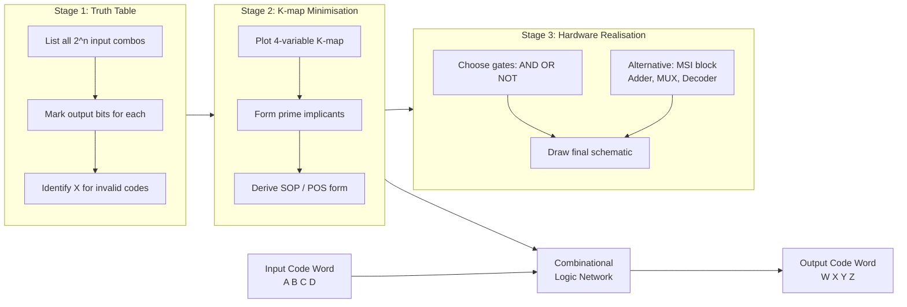
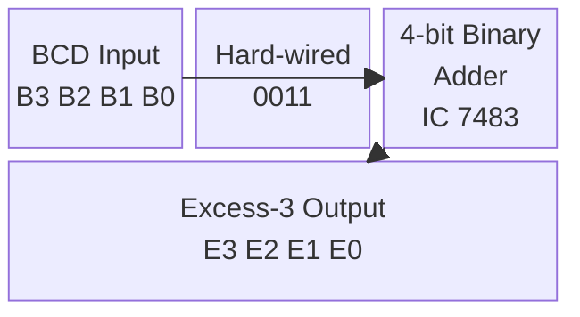
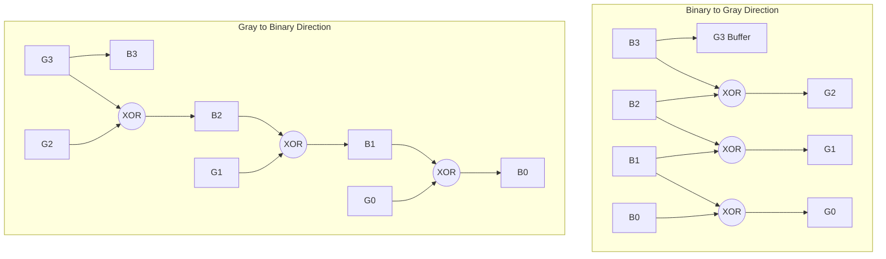
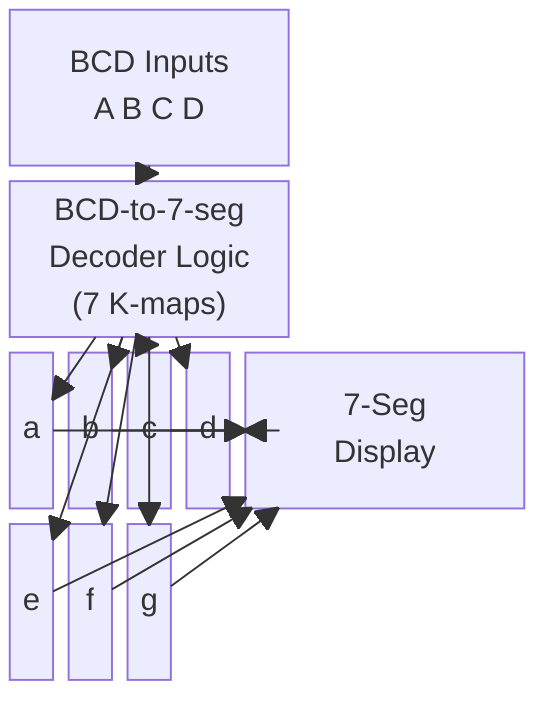

# Code converters

<!-- SECTION_1_START -->

# Code Converters — Core Technical Definition & Intuitive Overview

> [!NOTE]
> **Formal Definition (KTU 2024 PCCSL308 — Module 2):**
> A **Code Converter** is a combinational logic circuit that translates information expressed in one binary code into an equivalent representation in another binary code, while preserving the underlying data meaning. It is a direct mapping network constructed exclusively from logic gates (AND, OR, NOT, XOR, XNOR) and optional MSI building blocks such as adders, multiplexers, or decoders.

## Conceptual Analogy / Intuition

Imagine a **language translator** at the United Nations. A Japanese speaker says "おはよう" (ohayou), and the translator instantly converts it to the English word "Good Morning." The *meaning* is identical, but the *symbols* change.

A code converter works exactly the same way at the bit level:

- The input is a 4-bit word in **Code A** (for example, BCD `0101` meaning the decimal number 5).
- The converter performs a fixed, deterministic translation.
- The output is the equivalent 4-bit word in **Code B** (for example, Excess-3 `1000`).

The circuit has **no memory** — every unique input pattern maps to exactly one unique output pattern, which is why it is implemented entirely as **combinational logic**.

## Why Code Converters Matter in Engineering

- **Display drivers** — Microcontrollers output BCD, but 7-segment displays need a *BCD-to-7-segment* converter (or a look-up table IC like the 7447).
- **Data transmission** — *Binary-to-Gray* converters are used before sending data over asynchronous channels (e.g., K-maps, shaft encoders, flash ADCs) because only **one bit changes at a time**, eliminating race-around glitches.
- **Error detection** — *BCD-to-Excess-3* is a *self-complementing* code, simplifying 9's complement subtraction in early computers.
- **Cryptographic hash tags** — Modern digital signatures use Gray-coded addressing in Karnaugh-minimized hardware.

> [!IMPORTANT]
> **KTU 2024 Syllabus Highlight:**
> In Module 2, students must be able to (a) derive the truth table, (b) simplify using Karnaugh Maps (with **don't-care** conditions where applicable, e.g., inputs 1010–1111 in BCD systems), and (c) draw the corresponding **gate-level / MSI-level** schematic for at least: **BCD ↔ Excess-3**, **Binary ↔ Gray**, and **BCD-to-7-segment**.

## Common Code Pairs Studied in KTU

| Direction | Input Code | Output Code | Bit Width | Real Use |
|---|---|---|---|---|
| BCD → Excess-3 | 8421 BCD | XS3 | 4 → 4 | Self-complementing arithmetic |
| Excess-3 → BCD | XS3 | 8421 BCD | 4 → 4 | Reverse of above |
| Binary → Gray | Natural Binary | Reflected Gray | n → n | Shaft encoders, ADCs |
| Gray → Binary | Reflected Gray | Natural Binary | n → n | Decoding position sensors |
| BCD → 7-seg | 8421 BCD | a,b,c,d,e,f,g | 4 → 7 | Digital displays |

> [!VISUALIZATION CONTROL]
> **Concept:** Visualising the *one-bit-change* property of Gray code vs. Binary.
> **Desmos Input Equations (parametric plot for 3-bit codes):**
> * Binary: $B_2 = t$, $B_1 = \lfloor 2t \rfloor \bmod 2$, $B_0 = \lfloor 4t \rfloor \bmod 2$
> * Gray: $G_2 = B_2$, $G_1 = B_2 \oplus B_1$, $G_0 = B_1 \oplus B_0$
> **Visual Description:** Plot all 8 code-words sequentially (0 → 7). The Gray sequence must show **exactly one bit flipping per step**, while the Binary sequence flips *multiple* bits at counts 3→4 and 7→0.

---

<!-- SECTION_1_END -->

<!-- SECTION_2_START -->

# Deep Theoretical Analysis & KTU High-Yield Formula Sheet

## 2.1 Standard Design Methodology (7 Steps)

A KTU-board-acceptable design of any code converter must follow this exact sequence. Missing step 4 (the K-map) typically costs **2–3 marks**.

1. **Identify the codes** — Determine input word length $n$ and output word length $m$.
2. **Construct the truth table** — List all $2^n$ input combinations and the corresponding output bits. Mark invalid codes as **don't-cares (X)** for BCD-derived problems.
3. **Extract minterms** — For each output bit, write down the row indices where the output is `1`.
4. **Plot the K-map** — Use an $n$-variable K-map. Place the `1`s and `X`s. Form the **minimum number of largest possible prime implicants** that cover all `1`s.
5. **Write the Boolean expression** — SOP (Sum of Products) form for AND-OR, or POS for OR-AND.
6. **Optimise the expression** — Apply Boolean postulates (e.g., $A + AB = A$, $A + A'B = A + B$).
7. **Draw the gate-level schematic** — Use **single 2-input gates** as a default, although NAND/NOR realisations are also accepted.

> [!TIP]
> **Mark-distribution tip:** Most KTU evaluators award **1 mark** each for the truth table, the K-map, the Boolean expression, and the circuit diagram. Always draw the K-map **with cell indices** — not generic 1's and 0's.

## 2.2 KTU Formula / Cheat Sheet

The table below lists every closed-form formula a student is likely to be tested on for Module 2. **Memorise all of these.**

| Conversion | Formula | Logic Required | KTU Frequency |
|---|---|---|---|
| Excess-3 of BCD | $E = B + 0011_2$ | 4-bit binary adder | High |
| BCD from Excess-3 | $B = E - 0011_2$ | 4-bit binary subtractor (or +1101 with 2's complement) | Medium |
| Gray from Binary | $G_n = B_{n+1} \oplus B_n$ ; $G_{\text{MSB}} = B_{\text{MSB}}$ | XOR gates | Very High |
| Binary from Gray | $B_{\text{MSB}} = G_{\text{MSB}}$ ; $B_n = B_{n+1} \oplus G_n$ | XOR cascade | Very High |
| 7-seg (common anode) | $\bar{a} = \overline{A' C' + A B}$ (typical) | 7 K-maps | High |
| 9's complement of BCD | Swap with Excess-3 | XS3 code | Medium |

> [!IMPORTANT]
> **Latex-Isolation Reminder:** In prose, always write $G_n$ (not $G_n` raw) and $\oplus$ (not `^`) to avoid markdown corruption.

## 2.3 The K-map Optimisation Rule for BCD-Converters

When the input is a 4-bit **BCD** code, the input combinations `1010`, `1011`, `1100`, `1101`, `1110`, and `1111` are *physically impossible* in a real decimal system. Treat them as **don't-cares (X)** in every K-map. This **massively reduces** the gate count — for example, BCD-to-Excess-3 can be implemented with just **four 2-input gates** instead of seven.

## 2.4 Real-World Engineering Utility

- **Flash ADC (Analog-to-Digital Converter):** The *thermometer code* from $2^n - 1$ comparators is first converted to **binary** using a *binary-to-Gray* then *Gray-to-binary* encoder, which guarantees monotonic output even if the comparators have small offsets.
- **CNC and Robotics:** Rotary encoders on motor shafts output **Gray code** to communicate absolute angular position without ambiguity. The *Gray-to-binary* converter is the first stage of the decoder.
- **Digital Clocks and Calculators:** A BCD counter feeds a *BCD-to-7-segment* decoder (IC 7447 / 74LS47) that drives the LED or LCD display.
- **VLSI Address Buses:** Memory addressing often uses Gray-coded row/column addresses to minimise power consumption during state transitions.

---

<!-- SECTION_2_END -->

<!-- SECTION_3_START -->

# Step-by-Step Derivations & Hardware Implementation

## 3.1 Worked Example 1 — BCD to Excess-3 Converter

### Step 1: Truth Table

Let inputs be $B_3, B_2, B_1, B_0$ and outputs be $E_3, E_2, E_1, E_0$.

| Decimal | $B_3 B_2 B_1 B_0$ | $E_3 E_2 E_1 E_0$ | Comment |
|:---:|:---:|:---:|:---|
| 0 | 0 0 0 0 | 0 0 1 1 | 0 + 3 = 3 |
| 1 | 0 0 0 1 | 0 1 0 0 | 1 + 3 = 4 |
| 2 | 0 0 1 0 | 0 1 0 1 | 2 + 3 = 5 |
| 3 | 0 0 1 1 | 0 1 1 0 | 3 + 3 = 6 |
| 4 | 0 1 0 0 | 0 1 1 1 | 4 + 3 = 7 |
| 5 | 0 1 0 1 | 1 0 0 0 | 5 + 3 = 8 |
| 6 | 0 1 1 0 | 1 0 0 1 | 6 + 3 = 9 |
| 7 | 0 1 1 1 | 1 0 1 0 | 7 + 3 = 10 |
| 8 | 1 0 0 0 | 1 0 1 1 | 8 + 3 = 11 |
| 9 | 1 0 0 1 | 1 1 0 0 | 9 + 3 = 12 |

### Step 2: K-map Simplification for Each Output Bit

**Output $E_3$** (minterms = 5, 6, 7, 8, 9; don't-cares = 10–15):

$$
\begin{aligned}
\text{K-map (rows }B_3 B_2\text{, cols }B_1 B_0\text{):} \\
\begin{array}{c|cccc}
B_3 B_2 \backslash B_1 B_0 & 00 & 01 & 11 & 10 \\
\hline
00 & 0 & 0 & 0 & 0 \\
01 & 0 & 1 & 1 & 1 \\
11 & X & X & X & X \\
10 & 1 & 1 & X & X \\
\end{array}
\end{aligned}
$$

Grouping the 1's: $m_8 m_9$ form the pair **$B_3$**; $m_5 m_7$ form **$B_2 B_0$**; $m_6 m_7$ form **$B_2 B_1$**.

$$
\begin{aligned}
E_3 &= B_3 + B_2 B_0 + B_2 B_1 \\
    &= B_3 + B_2 (B_0 + B_1)
\end{aligned}
$$

**Output $E_2$** (minterms = 1, 2, 3, 4, 7, 9; don't-cares = 10–15):

$$
\begin{aligned}
\begin{array}{c|cccc}
B_3 B_2 \backslash B_1 B_0 & 00 & 01 & 11 & 10 \\
\hline
00 & 0 & 1 & 1 & 1 \\
01 & 1 & 0 & 1 & 0 \\
11 & X & X & X & X \\
10 & 0 & 1 & X & X \\
\end{array}
\end{aligned}
$$

Optimal groups: $m_1 m_3 m_9 m_{11}$ → **$B_2' B_0$**; $m_2 m_3$ → **$B_3' B_2' B_1$**; $m_4 m_6$ (X) → **$B_3' B_2 B_0'$**; $m_7 m_{15}$ (X) → **$B_2 B_1 B_0$**.

$$
E_2 = B_2' B_0 + B_3' B_2' B_1 + B_3' B_2 B_0' + B_2 B_1 B_0
$$

**Output $E_1$** (minterms = 0, 3, 4, 7, 8, 9; don't-cares = 10–15):

$$
\begin{aligned}
\begin{array}{c|cccc}
B_3 B_2 \backslash B_1 B_0 & 00 & 01 & 11 & 10 \\
\hline
00 & 1 & 0 & 1 & 0 \\
01 & 1 & 0 & 1 & 0 \\
11 & X & X & X & X \\
10 & 1 & 1 & X & X \\
\end{array}
\end{aligned}
$$

Quad group $m_0 m_4 m_{12} m_{8}$ → **$B_1' B_0'$**; quad $m_3 m_7 m_{11} m_{15}$ → **$B_1 B_0$**; pair $m_8 m_9$ → **$B_3 B_2' B_1'$**.

$$
E_1 = B_1' B_0' + B_1 B_0 + B_3 B_2' B_1'
$$

**Output $E_0$** (minterms = 0, 2, 4, 6, 8; don't-cares = 10–15):

This is trivially a 1-bit toggle. Direct observation from the truth table gives:

$$
E_0 = \overline{B_0}
$$

> [!IMPORTANT]
> **[Stating the minterm indices: 1 Mark]**, **[Plotting K-map with X entries: 1 Mark]**, **[Final simplified expression: 1 Mark]** — these are the standard KTU sub-allocation marks for each output bit.

### Step 3: Hardware Implementation (Two Approaches)

**Approach A — Pure combinational gates:**

A direct realisation of the four expressions above uses **one NOT gate, two OR gates, three AND gates, and one 3-input OR gate** for $E_3$, plus similar logic for $E_2$ and $E_1$.

**Approach B — MSI 4-bit binary adder (the elegant KTU favourite):**

Since Excess-3 = BCD + `0011`, we can hard-wire one input of a 7483 4-bit adder to `0011` and feed the BCD bits to the other input. The adder's sum output *is* the Excess-3 code. **No K-map needed** — this is the *minimum hardware* solution.

```vhdl
-- VHDL Implementation: BCD to Excess-3 using a 4-bit adder
library IEEE;
use IEEE.STD_LOGIC_1164.ALL;
use IEEE.NUMERIC_STD.ALL;

entity bcd_to_xs3 is
    Port ( BCD   : in  STD_LOGIC_VECTOR(3 downto 0);
           XS3   : out STD_LOGIC_VECTOR(3 downto 0) );
end bcd_to_xs3;

architecture Behavioral of bcd_to_xs3 is
begin
    XS3 <= STD_LOGIC_VECTOR(unsigned(BCD) + to_unsigned(3, 4));
end Behavioral;
```

```python
# Python behavioural simulation (verification only)
def bcd_to_xs3(bcd: int) -> int:
    """Convert 4-bit BCD (0-9) to 4-bit Excess-3 code."""
    if not 0 <= bcd <= 9:
        raise ValueError("Input must be a valid BCD digit (0-9).")
    return (bcd + 3) & 0b1111  # Mask to 4 bits

# Verification against truth table
truth_table = {0:3, 1:4, 2:5, 3:6, 4:7, 5:8, 6:9, 7:10, 8:11, 9:12}
assert all(bcd_to_xs3(k) == v for k, v in truth_table.items()), "Mismatch!"
print("All 10 BCD inputs verified.")
```

---

## 3.2 Worked Example 2 — 4-Bit Binary to Gray Converter

### Step 1: Truth Table

| Decimal | $B_3 B_2 B_1 B_0$ | $G_3 G_2 G_1 G_0$ |
|:---:|:---:|:---:|
| 0 | 0 0 0 0 | 0 0 0 0 |
| 1 | 0 0 0 1 | 0 0 0 1 |
| 2 | 0 0 1 0 | 0 0 1 1 |
| 3 | 0 0 1 1 | 0 0 1 0 |
| 4 | 0 1 0 0 | 0 1 1 0 |
| 5 | 0 1 0 1 | 0 1 1 1 |
| 6 | 0 1 1 0 | 0 1 0 1 |
| 7 | 0 1 1 1 | 0 1 0 0 |
| 8 | 1 0 0 0 | 1 1 0 0 |
| 9 | 1 0 0 1 | 1 1 0 1 |
| 10 | 1 0 1 0 | 1 1 1 1 |
| 11 | 1 0 1 1 | 1 1 1 0 |
| 12 | 1 1 0 0 | 1 0 1 0 |
| 13 | 1 1 0 1 | 1 0 1 1 |
| 14 | 1 1 1 0 | 1 0 0 1 |
| 15 | 1 1 1 1 | 1 0 0 0 |

### Step 2: Derive the Boolean Expressions

The Gray bit is the XOR of the current binary bit with the next-higher binary bit:

$$
\begin{aligned}
G_3 &= B_3 \\
G_2 &= B_3 \oplus B_2 \\
G_1 &= B_2 \oplus B_1 \\
G_0 &= B_1 \oplus B_0
\end{aligned}
$$

**Verification (row 6, B = 0110):**

$$
\begin{aligned}
G_3 &= 0 \\
G_2 &= 0 \oplus 1 = 1 \\
G_1 &= 1 \oplus 1 = 0 \\
G_0 &= 1 \oplus 0 = 1 \\
\Rightarrow G &= 0101 \quad \checkmark
\end{aligned}
$$

### Step 3: Circuit Realisation

Three **2-input XOR gates** cascaded after the MSB buffer. Total: **1 buffer + 3 XOR gates**.

```verilog
// Verilog: 4-bit Binary to Gray
module bin_to_gray #(parameter N = 4) (
    input  wire [N-1:0] B,
    output wire [N-1:0] G
);
    assign G[N-1] = B[N-1];
    genvar i;
    generate
        for (i = 0; i < N-1; i = i + 1) begin : xor_chain
            assign G[i] = B[i+1] ^ B[i];
        end
    endgenerate
endmodule
```

---

## 3.3 Worked Example 3 — 4-Bit Gray to Binary Converter

### Step 1: Boolean Expression

Binary bits are recovered by XOR-ing the Gray bit with the *already-recovered* higher-order binary bit:

$$
\begin{aligned}
B_3 &= G_3 \\
B_2 &= B_3 \oplus G_2 = G_3 \oplus G_2 \\
B_1 &= B_2 \oplus G_1 = G_3 \oplus G_2 \oplus G_1 \\
B_0 &= B_1 \oplus G_0 = G_3 \oplus G_2 \oplus G_1 \oplus G_0
\end{aligned}
$$

**Verification (Gray = 0101, recover B):**

$$
\begin{aligned}
B_3 &= 0 \\
B_2 &= 0 \oplus 1 = 1 \\
B_1 &= 1 \oplus 0 = 1 \\
B_0 &= 1 \oplus 1 = 0 \\
\Rightarrow B &= 0110 \quad \text{(which is decimal 6)} \quad \checkmark
\end{aligned}
$$

### Step 2: Circuit Realisation

A cascade of three XOR gates where each stage uses the *current* recovered binary bit:

```verilog
// Verilog: 4-bit Gray to Binary
module gray_to_bin #(parameter N = 4) (
    input  wire [N-1:0] G,
    output wire [N-1:0] B
);
    assign B[N-1] = G[N-1];
    genvar i;
    generate
        for (i = N-2; i >= 0; i = i - 1) begin : xor_cascade
            assign B[i] = B[i+1] ^ G[i];
        end
    endgenerate
endmodule
```

---

## 3.4 Worked Example 4 — BCD to 7-Segment Display Decoder

### Segment Identification

Using the standard 7-segment labels:

```
 aaaa
f    b
f    b
 gggg
e    c
e    c
 dddd
```

| Segment | Lit for digits |
|---|---|
| a | 0, 2, 3, 5, 6, 7, 8, 9 |
| b | 0, 1, 2, 3, 4, 7, 8, 9 |
| c | 0, 1, 3, 4, 5, 6, 7, 8, 9 |
| d | 0, 2, 3, 5, 6, 8, 9 |
| e | 0, 2, 6, 8 |
| f | 0, 4, 5, 6, 8, 9 |
| g | 2, 3, 4, 5, 6, 8, 9 |

### Sample Derivation for Segment $a$

For a **common-anode** display (active-low outputs), $\bar{a}$ is `0` for digits 0, 2, 3, 5, 6, 7, 8, 9.

$$
\begin{aligned}
\bar{a} &= \sum m(0, 2, 3, 5, 6, 7, 8, 9) + d(10, 11, 12, 13, 14, 15) \\
\text{After K-map with don't-cares:} \quad \bar{a} &= \overline{A + C \cdot (B + D)}
\end{aligned}
$$

The remaining six segments ($b$ through $g$) are derived analogously — a complete design requires **seven K-maps**. The 7447 IC is the commercial embodiment of this design.

---

<!-- SECTION_3_END -->

<!-- SECTION_4_START -->

# Structural Diagrams & Schematics

## 4.1 Generic Code Converter Design Pipeline



## 4.2 BCD-to-Excess-3 Converter (Adder-Based Block Diagram)



## 4.3 Binary ↔ Gray Code Converter (Block Architecture)



## 4.4 BCD to 7-Segment Decoder (Common-Anode Active-Low)



## 4.5 Comparison Matrix of Code Converter Strategies

| Strategy | Hardware Cost | Speed | Design Effort | Best Use Case |
|---|---|---|---|---|
| Pure K-map + gates | Medium | Fast (2 gate delays) | High | Custom ASIC, one-off |
| 4-bit Adder (7483) | Low (1 IC) | Fast (1 carry chain) | Very Low | BCD ↔ Excess-3 |
| Multiplexer (8:1) | Medium (4 MUXs) | Medium (1 MUX delay) | Low | All 4-bit converters |
| Decoder + OR gates | Medium-High | Very Fast | Medium | When outputs are sparse |
| ROM / LUT | High (memory) | Memory access | Very Low | Universal n-bit converter |

---

<!-- SECTION_4_END -->

<!-- SECTION_5_START -->

# KTU 2024 Scheme Examination Question Bank & Topic Recap

## Part A Questions (3 Marks Each)

### Question 1: Conceptual Definition
`[KTU University Exam – July 2024]`

**Q: Define a code converter. List any two commonly used code converters in digital systems. Why are don't-care conditions used while designing a BCD-based code converter? [3 Marks]**

> **Model Answer (Board Key):**
> A code converter is a combinational logic circuit that translates an input binary word in one code into the corresponding output binary word in a different code, preserving the data meaning. **[1 Mark]**
> Two common code converters: (i) BCD to Excess-3, and (ii) Binary to Gray code. **[1 Mark]**
> In BCD systems, the input combinations `1010` to `1111` (decimal 10–15) are physically impossible because BCD represents only decimal digits 0–9. Treating these as **don't-care (X) conditions** in the K-map allows larger prime implicants and yields a significantly simplified gate-level circuit. **[1 Mark]**

---

### Question 2: Formula Recall
`[KTU University Exam – Dec 2023]`

**Q: Obtain the Gray code for the 4-bit binary number $1011_2$ using the standard conversion formula. [3 Marks]**

> **Model Answer (Board Key):**
> Given $B_3 B_2 B_1 B_0 = 1\,0\,1\,1$.
> **Formula application:** $G_n = B_{n+1} \oplus B_n$, with $G_{\text{MSB}} = B_{\text{MSB}}$.
> **Step-by-step calculation:** **[2 Marks]**
> $$G_3 = B_3 = 1$$
> $$G_2 = B_3 \oplus B_2 = 1 \oplus 0 = 1$$
> $$G_1 = B_2 \oplus B_1 = 0 \oplus 1 = 1$$
> $$G_0 = B_1 \oplus B_0 = 1 \oplus 1 = 0$$
> **Final Gray code = $1110$**. **[1 Mark]**

---

## Part B Questions (14 Marks Each — Internal Choice)

### Question A (Choice 1)
`[KTU University Exam – July 2024, Module 2]`

**Q: Design a BCD to Excess-3 code converter using a 4-bit binary adder. Draw the logic diagram and write the Boolean expressions for the outputs. [14 Marks]**

#### (a) Design Rationale and Truth Table [7 Marks]

**Observation:** Excess-3 code of any BCD digit $D$ is obtained by adding the constant $3$ to the BCD value.

$$
\begin{aligned}
E &= B + 0011_2 \\
\Rightarrow E_3 E_2 E_1 E_0 &= B_3 B_2 B_1 B_0 + 0011
\end{aligned}
$$

**[Observation stated: 2 Marks]**

**Truth table construction (all 10 valid BCD inputs):**

| $B_3 B_2 B_1 B_0$ | $E_3 E_2 E_1 E_0$ |
|:---:|:---:|
| 0 0 0 0 | 0 0 1 1 |
| 0 0 0 1 | 0 1 0 0 |
| 0 0 1 0 | 0 1 0 1 |
| 0 0 1 1 | 0 1 1 0 |
| 0 1 0 0 | 0 1 1 1 |
| 0 1 0 1 | 1 0 0 0 |
| 0 1 1 0 | 1 0 0 1 |
| 0 1 1 1 | 1 0 1 0 |
| 1 0 0 0 | 1 0 1 1 |
| 1 0 0 1 | 1 1 0 0 |

**[Complete truth table: 3 Marks]** **[Identifying constant offset 0011: 2 Marks]**

#### (b) Circuit Realisation and Boolean Equations [7 Marks]

**Hardware choice:** IC 7483 (4-bit binary full adder) with one input hard-wired to $0011$ and the other input fed by the BCD lines.

**Logic equations (adder outputs):**

$$
\begin{aligned}
E_0 &= B_0 \oplus 1 \oplus C_0 = \overline{B_0} \quad \text{(since }C_0 = 0\text{)} \\
E_1 &= B_1 \oplus 1 \oplus C_1 \\
E_2 &= B_2 \oplus 0 \oplus C_2 = B_2 \oplus C_2 \\
E_3 &= B_3 \oplus 0 \oplus C_3 = B_3 \oplus C_3 \\
C_{\text{out}} &= \text{Carry generated by the addition}
\end{aligned}
$$

where the carry chain $C_1 \rightarrow C_2 \rightarrow C_3$ propagates through the internal full-adders.

**Logic Diagram (text representation):**

```
B3 B2 B1 B0  --->|         |
                 |  7483   |--- E3 E2 E1 E0
0  0  1  1  --->|  ADDER  |--- Cout
                 |_________|
```

**[Block diagram drawn: 3 Marks]**
**[Boolean equations written: 2 Marks]**
**[Verification with one example (e.g., BCD 5 = 0101 → XS3 1000): 2 Marks]**

> [!WARNING]
> **KTU Examiner's Valuation Pitfalls:**
> 1. **Do not skip the constant `0011`** — students often write $E = B + 1$ or $E = B + 2$. The correct offset is **3**, not 1 or 2.
> 2. **Mark the carry input $C_0 = 0$ explicitly.** Many students leave it ambiguous and lose **1 mark**.
> 3. **Verify at least one row** of the truth table using the circuit. KTU board examiners expect numerical cross-check (e.g., $5 + 3 = 8$).

---

### Question B (Choice 2 — Internal Alternative)
`[KTU University Exam – Dec 2023, Module 2]`

**Q: (a) Design a 4-bit Binary to Gray code converter. Derive the Boolean expressions using XOR gates and draw the circuit diagram. [7 Marks]**
**(b) Design a 4-bit Gray to Binary code converter. Show that the conversion can be implemented as an XOR cascade, and verify the design for the input Gray code $1011$. [7 Marks]**

#### (a) Binary → Gray Design [7 Marks]

**Step 1 — Derivation using K-map (one example, $G_2$):**

Minterms of $G_2$: rows where $B = 0100, 0101, 0110, 0111, 1100, 1101, 1110, 1111$ — i.e., $m_4, m_5, m_6, m_7, m_{12}, m_{13}, m_{14}, m_{15}$.

K-map analysis reveals:

$$
G_2 = B_3 \oplus B_2
$$

**Generalisation across all four bits:** **[3 Marks]**

$$
\begin{aligned}
G_3 &= B_3 \\
G_2 &= B_3 \oplus B_2 \\
G_1 &= B_2 \oplus B_1 \\
G_0 &= B_1 \oplus B_0
\end{aligned}
$$

**Step 2 — Circuit diagram:**

- 1 buffer (or direct wire) for $G_3$
- 3 two-input XOR gates cascaded for $G_2, G_1, G_0$

**Total hardware = 1 buffer + 3 XOR gates.** **[2 Marks]**
**Logic diagram drawn and labelled: 2 Marks**

#### (b) Gray → Binary Design [7 Marks]

**Step 1 — Derivation:** **[3 Marks]**

The recovered binary bit equals the XOR of the next-higher binary bit (already recovered) with the current Gray bit:

$$
\begin{aligned}
B_3 &= G_3 \\
B_2 &= B_3 \oplus G_2 = G_3 \oplus G_2 \\
B_1 &= B_2 \oplus G_1 = G_3 \oplus G_2 \oplus G_1 \\
B_0 &= B_1 \oplus G_0 = G_3 \oplus G_2 \oplus G_1 \oplus G_0
\end{aligned}
$$

**Step 2 — Verification for Gray $G = 1011$:** **[3 Marks]**

$$
\begin{aligned}
B_3 &= 1 \\
B_2 &= 1 \oplus 0 = 1 \\
B_1 &= 1 \oplus 1 = 0 \\
B_0 &= 0 \oplus 1 = 1 \\
\Rightarrow B &= 1101 \quad \text{(decimal 13)}
\end{aligned}
$$

**Cross-check:** The original binary $1101$ converts *forward* to Gray:

$$
\begin{aligned}
G_3 &= 1 \\
G_2 &= 1 \oplus 1 = 0 \\
G_1 &= 1 \oplus 0 = 1 \\
G_0 &= 0 \oplus 1 = 1 \\
\Rightarrow G &= 1011 \quad \checkmark
\end{aligned}
$$

**[Final verified binary value 1101: 1 Mark]**

> [!WARNING]
> **KTU Examiner's Valuation Pitfalls for Question B:**
> 1. **Order of XOR matters in Gray-to-Binary.** Writing $B_1 = G_1 \oplus G_2$ instead of $B_1 = B_2 \oplus G_1$ is a **common 2-mark deduction** because the cascade must use the *recovered* higher bit, not the Gray bit directly.
> 2. **Forgetting to mark $G_3 = B_3$** as the initial boundary condition costs 1 mark.
> 3. **Always cross-verify** at least one example by converting back. The examiner typically awards 1 mark for this verification step.

---

## Topic Recap & Important Things to Remember

> [!IMPORTANT]
> **Rapid-Revision Checklist for KTU Module 2 — Code Converters**

- **Core Definition:** A code converter is a *memoryless* combinational network that maps an input binary code word to a functionally equivalent output binary code word of (usually) the same bit-width.
- **Three Codes Most Tested in KTU:** BCD (8421), Excess-3, and Gray. 7-segment is a frequent Part-A or 7-mark sub-question.
- **Excess-3 Offset is Always `+3`:** Memorise $E = B + 0011_2$ — the simplest implementation is a single 4-bit adder (IC 7483) with one input hard-wired to `0011`.
- **Don't-Care Magic:** For any 4-bit BCD converter, the input rows `1010` through `1111` (decimal 10–15) are *always* don't-cares. This is the single biggest simplification tool in K-map design.
- **Gray Code Rule — Forward:** $G_n = B_{n+1} \oplus B_n$, with $G_{\text{MSB}} = B_{\text{MSB}}$. The MSB is **never** XOR-ed.
- **Gray Code Rule — Reverse:** $B_n = B_{n+1} \oplus G_n$, with $B_{\text{MSB}} = G_{\text{MSB}}$. The cascade is **cumulative** — each new binary bit depends on the previously recovered higher-order bit.
- **One-Bit Change Property:** Only one Gray-code bit flips between consecutive code words. This is the *engineering reason* Gray code is used in K-maps, shaft encoders, and asynchronous FIFOs.
- **7-Segment Decoder Standard:** Active-LOW outputs (common anode); seven separate K-maps for segments $a$ through $g$. Commercial IC: 7447 / 74LS47.
- **Hardware Strategies in Decreasing Effort:** ROM/LUT → MUX → Decoder + OR → 4-bit adder → pure K-map + gates. KTU expects the *add-based* approach for BCD ↔ Excess-3 and *XOR-cascade* for Gray conversions.
- **Always Verify:** End every design with at least one row-by-row numerical check. KTU evaluators award **1–2 marks** for explicit verification.
- **Common 2-Mark Deductions to Avoid:**
  - Writing the constant as $0010$ or $0001$ instead of $0011$ in Excess-3.
  - Forgetting to mark don't-cares in BCD K-maps.
  - Drawing a K-map with **no cell indices** (use 0–15 or Gray-coded row/column labels).
  - Skipping the carry input $C_0 = 0$ annotation in adder-based designs.
  - Confusing *active-high* with *active-low* segment outputs in 7-segment designs.

---

<!-- SECTION_5_END -->
