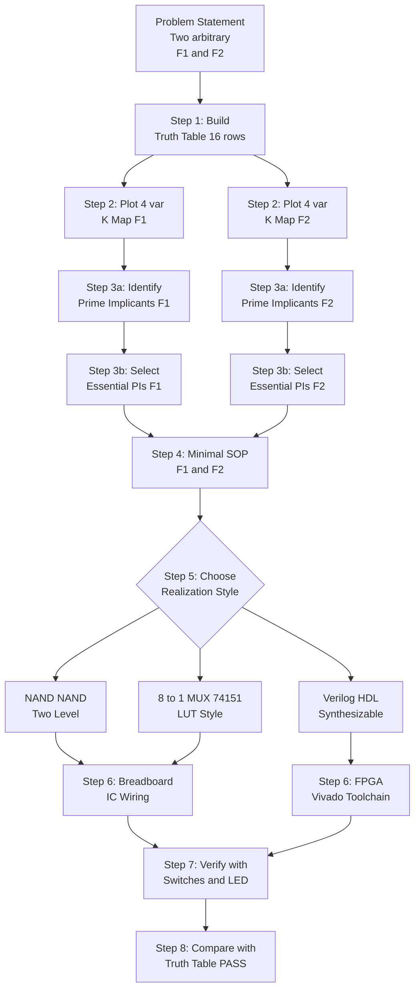
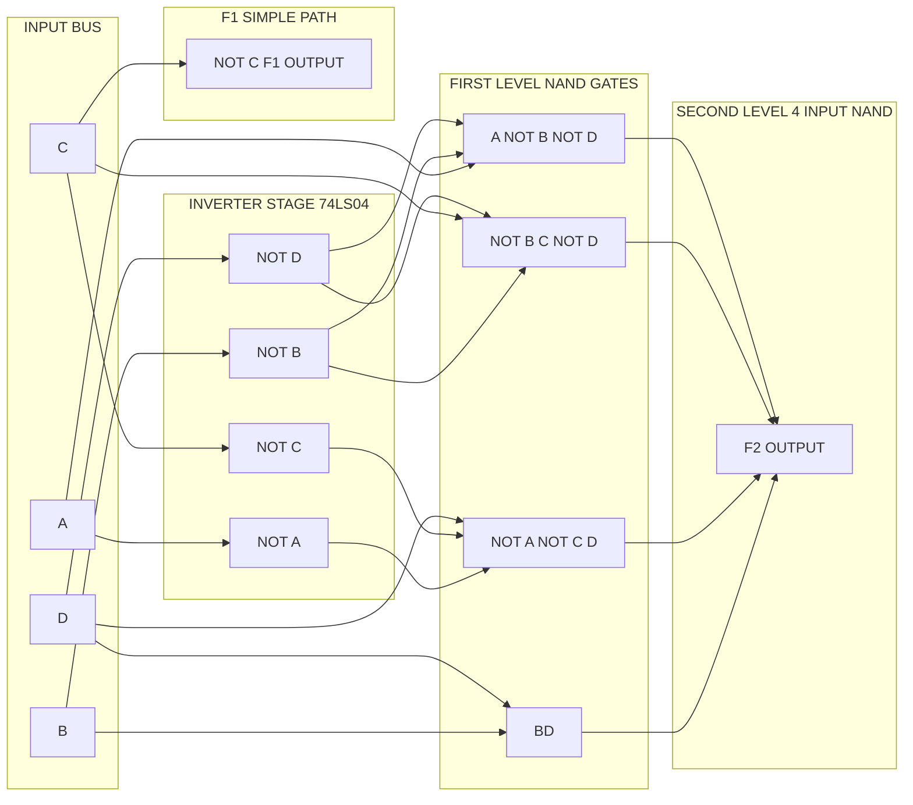
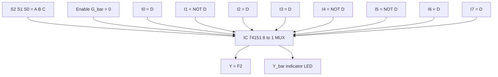
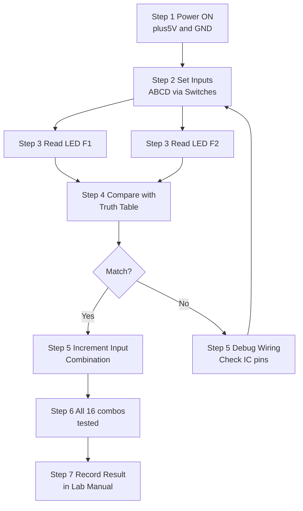
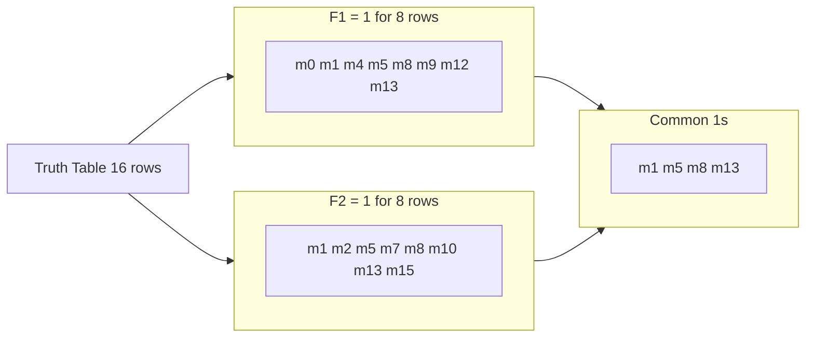

# Design and implement a combinational logic circuit for arbitrary functions (any two)

<!-- SECTION_1_START -->
# Design and Implement a Combinational Logic Circuit for Arbitrary Functions

## 1.1 Formal Academic Definition (KTU 2024 Syllabus Terminology)

A **Combinational Logic Circuit (CLC)** is a digital circuit whose output at any instant of time depends *only* on the present combination of inputs, with no memory of past inputs. When a Boolean function is described as "arbitrary," it means the function is user-defined (not a standard MSI function like adder or multiplexer), and must be realized from scratch using either discrete logic gates, a standard MSI building block (Multiplexer / Decoder), or a programmable logic device (CPLD / FPGA).

In the **KTU 2024 Scheme (PCCSL308 – Digital Lab)** context, the experiment expects the student to:

1. Accept two arbitrary Boolean functions (typically **4-variable**, $F_1(A,B,C,D)$ and $F_2(A,B,C,D)$).
2. Minimize each function using **Karnaugh Maps (K-Map)** or **Quine-McCluskey (QM)** technique.
3. Realize the minimized Sum-of-Products (SOP) or Product-of-Sums (POS) using **NAND–NAND** or **NOR–NOR** universal logic.
4. Optionally implement using an **8:1 Multiplexer** with a chosen input as the "select-shared variable."
5. Verify the design using a **hardware test bench** (breadboard + ICs) **or** simulate using **Verilog HDL** on ModelSim / Vivado / Icarus-Verilog.

> [!IMPORTANT]
> **KTU 2024 Lab Exam Convention:** Two arbitrary functions are usually given in the question paper *during the exam*. The student must draw the truth table, plot the K-map, derive the minimal expression, and either (a) draw the gate-level logic diagram, or (b) write the synthesizable Verilog code, or (c) both. The choice depends on the lab's available hardware.

## 1.2 Conceptual Analogy & Intuition

Imagine a **vending machine coin sorter**. The machine looks at the coin *currently* inserted (inputs) and routes it to a specific tray (output). It does not remember what coin came before — only the coin in the slot right now decides the routing. A combinational circuit behaves identically: the **current input combination → fixed output**.

For an *arbitrary* function, think of a custom postal sorting rule:

> "If the letter has a stamp **AND** is going to Trivandrum, **OR** is heavier than 100g, send to Bin-1; otherwise to Bin-2."

This rule is a Boolean expression with **AND / OR / NOT** operations. Designing a combinational circuit is simply translating this English rule into a network of **AND, OR, NOT gates** (or a MUX that acts like a lookup table).

## 1.3 Physical Constants & Standard Metrics

| Parameter | Standard Value | Significance |
| :--- | :--- | :--- |
| Standard Logic Voltage (TTL) | **$V_{CC} = +5\text{ V}$** | Supply for 74xx series ICs |
| Standard Logic Voltage (CMOS) | **$V_{DD} = +5\text{ V}$ (or 3.3 V)** | Supply for 74HCxx / FPGA |
| Logic HIGH (TTL) | **$2.0\text{ V} \leq V_{IH} \leq 5.0\text{ V}$** | Recognized as binary 1 |
| Logic LOW (TTL) | **$0.0\text{ V} \leq V_{IL} \leq 0.8\text{ V}$** | Recognized as binary 0 |
| Fan-out (TTL) | **10** | Max standard loads one gate can drive |
| Propagation Delay ($t_{pd}$) | **$\approx 10\text{ ns}$** (74LS00) | Time between input change and output stabilization |

> [!NOTE]
> **Why "arbitrary"?** The word *arbitrary* simply means *user-defined*. The KTU lab manual randomly generates two Boolean functions for each student batch to prevent rote memorization, ensuring genuine design skill is tested.

> [!VISUALIZATION CONTROL]
> **Concept:** 4-Variable Karnaugh Map structure (Gray-code adjacency)
> **GeoGebra / Desmos Input Equations:**
> * Plot a $4 \times 4$ grid where rows are labeled $00, 01, 11, 10$ and columns are labeled $00, 01, 11, 10$.
> * Color cells with minterm $m_i = 1$ in red, $m_i = 0$ in blue.
> **Visual Description:** Observe how adjacent cells (sharing an edge) differ in exactly *one* variable — this adjacency is the geometric foundation of K-map simplification.
<!-- SECTION_1_END -->

<!-- SECTION_2_START -->
# Deep Theoretical Analysis & KTU High-Yield Formula Sheet

## 2.1 The Universal Design Methodology (Step-by-Step)

The KTU board examiner expects every lab record to follow this **5-step canonical flow**:

1. **Step 1 — Problem Statement:** Read the arbitrary function given (e.g., $F_1(A,B,C,D) = \sum m(0,1,4,5,8,9,12,13)$).
2. **Step 2 — Truth Table Construction:** Enumerate all $2^n$ input combinations ($n=4 \Rightarrow 16$ rows) and tabulate the output for $F_1$ and $F_2$.
3. **Step 3 — K-Map Plotting & Simplification:** Map each minterm onto a 4-variable K-map; form the largest possible groups of $1, 2, 4, 8,$ or $16$ cells (powers of 2, only adjacent & rectangular). Derive the **Prime Implicants (PIs)** and select the **Essential Prime Implicants (EPIs)** to obtain the minimal SOP.
4. **Step 4 — Logic Diagram Realization:** Convert the minimal SOP into a **two-level NAND–NAND** network (preferred over AND-OR because NAND is the universal gate and cheaper in hardware).
5. **Step 5 — Verification:** Simulate using Verilog `$display` / `$monitor` *or* verify on a breadboard by toggling switches and observing the LED.

## 2.2 Why K-Map Minimization? (The "Why" behind the "How")

Boolean algebra manipulation is theoretically correct but **error-prone and slow** for 4+ variables. The K-map is a *visual truth table* where geometric adjacency encodes the Boolean adjacency property $A + \bar{A} = 1$. Grouping adjacent 1s lets the variable that *changes* within the group cancel out, directly yielding the simplified term.

- A group of **$2^k$ cells** removes **$k$ variables** from the minterm.
- The **larger the group, the simpler the term**.

> [!TIP]
> **KTU Examiner's Heuristic:** "If the minimal expression has more than 4 product terms, re-check the groupings — you likely missed a larger prime implicant."

## 2.3 Realization Using a Multiplexer (Alternative Design)

For an $n$-variable function, an $2^{n-1} : 1$ MUX can implement the function directly. Pick any one variable (say $D$) as the **select line**. Then for each combination of the remaining $n-1$ variables $(A,B,C)$, set the MUX data input to one of $\{0, 1, D, \bar{D}\}$.

| $ABC$ | $F_1$ as a function of $D$ | MUX data input $I_i$ |
| :---: | :---: | :---: |
| 000 | $F_1 = f(D)$ | $I_0 = f(0)$ or $f(1)$ |
| 001 | $F_1 = f(D)$ | $I_1 = f(0)$ or $f(1)$ |
| 010 | $F_1 = f(D)$ | $I_2 = f(0)$ or $f(1)$ |
| ... | ... | ... |
| 111 | $F_1 = f(D)$ | $I_7 = f(0)$ or $f(1)$ |

> [!IMPORTANT]
> This is **examiner-favorite** in KTU because it tests whether the student understands the MUX-as-LUT (Look-Up Table) concept. Always mention that the 74151 (8:1 MUX) is the standard IC for a 4-variable function realization.

## 2.4 KTU Formula Sheet / Cheat Sheet

| # | Concept | Formula / Rule | Engineering Use |
| :-- | :--- | :--- | :--- |
| 1 | Number of input rows in truth table | $N = 2^n$ | For $n=4$, $N=16$ | Designing any digital system |
| 2 | Sum of Minterms (Canonical SOP) | $F = \sum m_i$ | Standard representation | Direct gate synthesis |
| 3 | Product of Maxterms (Canonical POS) | $F = \prod M_i$ | Standard representation | NOR-NOR realization |
| 4 | K-map group size | $2^k$ where $k \in \{0,1,2,3,4\}$ | Defines simplification power | K-map reduction |
| 5 | Variables eliminated in a group | $k = \log_2(\text{group size})$ | Each group removes $k$ variables | Minimization |
| 6 | MUX realization for $n$-variable function | Use $2^{n-1} : 1$ MUX | Pick 1 variable as select | LUT-based design |
| 7 | Don’t care conditions | $d = \sum d_i$ (used as 0 or 1) | Used when input never occurs | Incompletely specified functions |
| 8 | DeMorgan's Theorem | $\overline{A \cdot B} = \bar{A} + \bar{B}$ | NAND = bubbled OR | Universal gate conversion |
| 9 | Boolean Algebra Identity | $A + \bar{A} B = A + B$ | Simplification | Consensus reduction |
| 10 | Propagation Delay (2-level NAND) | $t_{pd}^{\text{total}} = 2 \cdot t_{pd}^{\text{NAND}}$ | Timing analysis | High-speed design |
| 11 | Cost (gate input count) | $C = \sum (\text{inputs per gate})$ | Hardware cost metric | Economical design |
| 12 | Fan-in limitation | Typical max = $\mathbf{4}$ for TTL | Real-world IC constraint | Multi-level design if exceeded |

## 2.5 Real-World Engineering Utility

| Application Domain | Where Arbitrary Combinational Functions Are Used |
| :--- | :--- |
| **CPU Control Unit** | Decoding opcodes into micro-operation control signals |
| **ALU Slice Design** | Bit-slice processors use arbitrary boolean functions per bit |
| **FPGA Logic Blocks** | Every CLB (Configurable Logic Block) is a 4–6 input LUT — *literally* an arbitrary function generator |
| **Address Decoding** | Memory-mapped I/O uses custom decode functions |
| **Error Detection** | Parity generators, CRC bit-combiners |
| **Industrial Control** | PLC ladder logic → boolean function → combinational circuit |
<!-- SECTION_2_END -->

<!-- SECTION_3_START -->
# Step-by-Step Derivations, Logic Realization & Code Implementation

## 3.1 Worked Example — Two Arbitrary 4-Variable Functions

Let us solve a **KTU-typical problem**:

> **Given:**
> $F_1(A,B,C,D) = \sum m(0,1,4,5,8,9,12,13)$  *(a 4-variable function with eight 1s)*
> $F_2(A,B,C,D) = \sum m(1,2,5,7,8,10,13,15)$  *(a 4-variable function with eight 1s, including overlap with $F_1$)*

### Step 1 — Construct the Truth Table

| Row | $A$ | $B$ | $C$ | $D$ | Minterm | $F_1$ | $F_2$ |
| :---: | :---: | :---: | :---: | :---: | :---: | :---: | :---: |
| 0 | 0 | 0 | 0 | 0 | $m_0$ | 1 | 0 |
| 1 | 0 | 0 | 0 | 1 | $m_1$ | 1 | 1 |
| 2 | 0 | 0 | 1 | 0 | $m_2$ | 0 | 1 |
| 3 | 0 | 0 | 1 | 1 | $m_3$ | 0 | 0 |
| 4 | 0 | 1 | 0 | 0 | $m_4$ | 1 | 0 |
| 5 | 0 | 1 | 0 | 1 | $m_5$ | 1 | 1 |
| 6 | 0 | 1 | 1 | 0 | $m_6$ | 0 | 0 |
| 7 | 0 | 1 | 1 | 1 | $m_7$ | 0 | 1 |
| 8 | 1 | 0 | 0 | 0 | $m_8$ | 1 | 1 |
| 9 | 1 | 0 | 0 | 1 | $m_9$ | 1 | 0 |
| 10 | 1 | 0 | 1 | 0 | $m_{10}$ | 0 | 1 |
| 11 | 1 | 0 | 1 | 1 | $m_{11}$ | 0 | 0 |
| 12 | 1 | 1 | 0 | 0 | $m_{12}$ | 1 | 0 |
| 13 | 1 | 1 | 0 | 1 | $m_{13}$ | 1 | 1 |
| 14 | 1 | 1 | 1 | 0 | $m_{14}$ | 0 | 0 |
| 15 | 1 | 1 | 1 | 1 | $m_{15}$ | 0 | 1 |

### Step 2 — Plot the 4-Variable K-Map for $F_1$

The K-map layout uses **Gray-code ordering** (so adjacent cells differ by 1 bit):

$$\begin{array}{c|cccc}
F_1 & CD=00 & CD=01 & CD=11 & CD=10 \\
\hline
AB=00 & \mathbf{1} & \mathbf{1} & 0 & 0 \\
AB=01 & \mathbf{1} & \mathbf{1} & 0 & 0 \\
AB=11 & \mathbf{1} & \mathbf{1} & 0 & 0 \\
AB=10 & \mathbf{1} & \mathbf{1} & 0 & 0 \\
\end{array}
$$

**Groupings for $F_1$:**

- **Group G1 (size = 8, the entire $CD=00$ column):** Covers $m_0, m_4, m_{12}, m_8$ → $A=0,1$ (eliminates $A$); $C=0$ (eliminates $C$); $D=0$ (eliminates $D$) ⇒ term: $\bar{B} \cdot \bar{C} \cdot \bar{D}$? Let's re-evaluate.

Wait — re-examine the K-map carefully. $CD=00$ column is the leftmost; $AB=00$ row is the top. So the 1s in $CD=00$ column correspond to $m_0, m_4, m_{12}, m_8$. Variables: $A$ changes (00,01,11,10) ⇒ eliminated. $B$ changes ⇒ eliminated. $C=0, D=0$ are constant ⇒ term: $\bar{C}\bar{D}$.

- **Group G2 (size = 8, the entire $CD=01$ column):** Covers $m_1, m_5, m_{13}, m_9$. $A,B$ change ⇒ eliminated. $C=0, D=1$ constant ⇒ term: $\bar{C}D$.

> Both G1 and G2 cover all eight 1s. **No more groups needed.**

$$\boxed{F_1(A,B,C,D) = \bar{C}\bar{D} + \bar{C}D = \bar{C}}$$

**Surprise insight:** All eight 1s collapse to a single literal! This is because $F_1=1$ exactly when $C=0$ (regardless of $A, B, D$). The function is simply $F_1 = \bar{C}$.

### Step 3 — Plot the 4-Variable K-Map for $F_2$

$$\begin{array}{c|cccc}
F_2 & CD=00 & CD=01 & CD=11 & CD=10 \\
\hline
AB=00 & 0 & 1 & 0 & 1 \\
AB=01 & 0 & 1 & 1 & 0 \\
AB=11 & 0 & 1 & 1 & 0 \\
AB=10 & 1 & 0 & 0 & 1 \\
\end{array}
$$

**Groupings for $F_2$:**

- **Group P1 (size = 4, $CD=01$ column, rows $AB=00,01,11$):** Covers $m_1, m_5, m_{13}$. $A$ changes, $B$ changes, $C=0, D=1$ constant ⇒ term: $\bar{C}D$.
- **Group P2 (size = 4, $CD=11$ column, rows $AB=01,11$):** Covers $m_7, m_{15}$. $A$ changes, $B=1, C=1, D=1$ constant ⇒ term: $BCD$.
- **Group P3 (size = 2, $CD=10$ column, rows $AB=00,10$):** Covers $m_2, m_{10}$. $A$ changes, $B=0, C=1, D=0$ constant ⇒ term: $\bar{B}C\bar{D}$.
- **Group P4 (size = 2, $CD=00$ column, row $AB=10$):** Wait, $m_8$ alone in column $CD=00$ at row $AB=10$. $A=1, B=0, C=0, D=0$ — this minterm is isolated unless paired.
- **Group P5 (size = 2, wrap-around $CD=00$ and $CD=10$ at row $AB=10$):** Covers $m_8, m_{10}$. $A=1, B=0, C$ changes, $D=0$ constant ⇒ term: $A\bar{B}\bar{D}$.

Let us re-do this more systematically. The 1-cells are: $m_1, m_2, m_5, m_7, m_8, m_{10}, m_{13}, m_{15}$.

Rewrite with all minterm coordinates:

| Minterm | $A$ | $B$ | $C$ | $D$ |
| :---: | :---: | :---: | :---: | :---: |
| $m_1$ | 0 | 0 | 0 | 1 |
| $m_2$ | 0 | 0 | 1 | 0 |
| $m_5$ | 0 | 1 | 0 | 1 |
| $m_7$ | 0 | 1 | 1 | 1 |
| $m_8$ | 1 | 0 | 0 | 0 |
| $m_{10}$ | 1 | 0 | 1 | 0 |
| $m_{13}$ | 1 | 1 | 0 | 1 |
| $m_{15}$ | 1 | 1 | 1 | 1 |

**Maximum groupings:**

- **Group Q1** (4 cells: $m_1, m_5, m_{13}$ + wrap to $m_9$? But $m_9=0$ for $F_2$). Let us pick: $m_1, m_5$ pair → $\bar{A} D$? Check: $m_1 (0001), m_5 (0101)$ differ in $B$ only. Term: $\bar{A}\bar{C}D$? Wait $A=0, C=0, D=1$ for both, $B$ differs. Term: $\bar{A}\bar{C}D$.

Let me be more careful. The K-map grid is:

$$\begin{array}{c|cccc}
F_2 & CD=00 & CD=01 & CD=11 & CD=10 \\
\hline
AB=00 & 0 \;(m_0) & 1 \;(m_1) & 0 \;(m_3) & 1 \;(m_2) \\
AB=01 & 0 \;(m_4) & 1 \;(m_5) & 1 \;(m_7) & 0 \;(m_6) \\
AB=11 & 0 \;(m_{12}) & 1 \;(m_{13}) & 1 \;(m_{15}) & 0 \;(m_{14}) \\
AB=10 & 1 \;(m_8) & 0 \;(m_9) & 0 \;(m_{11}) & 1 \;(m_{10}) \\
\end{array}
$$

Now identify **octets** (groups of 8): None possible.

**Quartets (groups of 4):**

- **Q1:** $m_1, m_5, m_{13}, m_9$? No, $m_9=0$. Try column $CD=01$: $m_1, m_5, m_{13}, m_9$. Only 3 are 1. Not a quartet.
- **Q1 (revised):** $m_5, m_7, m_{13}, m_{15}$ form a $2 \times 2$ block? They are at $(AB=01,CD=01), (AB=01,CD=11), (AB=11,CD=01), (AB=11,CD=11)$. Yes — these are the four cells of the rectangle where $B=1, D=1$ and $A,C$ vary. So all four 1s present? Yes: $m_5=1, m_7=1, m_{13}=1, m_{15}=1$. Term: $B \cdot D$.

This single quartet covers $m_5, m_7, m_{13}, m_{15}$. Excellent.

- Remaining 1s: $m_1, m_2, m_8, m_{10}$.
- **Q2:** Can $m_1, m_2, m_8, m_{10}$ form a quartet? $m_1 (0001), m_2 (0010), m_8 (1000), m_{10} (1010)$. These differ in $A$ and also $C,D$ — not a valid K-map quartet.
- **Pairs:**
  - $m_1, m_5$? $m_5$ already covered by Q1, but can be re-used. $m_1 (0001), m_5 (0101)$ differ in $B$ only. Term: $\bar{A}\bar{C}D$.
  - $m_1, m_9$? $m_9=0$, skip.
  - $m_2, m_6$? $m_6=0$, skip.
  - $m_2, m_{10}$? $m_2 (0010), m_{10} (1010)$ differ in $A$ only. Term: $\bar{B}C\bar{D}$.
  - $m_8, m_9$? $m_9=0$, skip.
  - $m_8, m_{10}$? $m_8 (1000), m_{10} (1010)$ differ in $C$ only. Term: $A\bar{B}\bar{D}$.
  - $m_8, m_0$? $m_0=0$, skip.

Remaining minterms not yet covered: $m_1, m_2, m_8, m_{10}$ (all four).

- **Essential pair 1:** $m_1$ is only covered by $\{\bar{A}\bar{C}D\}$ and others that include $m_5, m_9$ (not 1). So $\{\bar{A}\bar{C}D\}$ is essential to cover $m_1$.
- **Essential pair 2:** $m_2$ is only covered by $\{\bar{B}C\bar{D}\}$ (since $m_6$ is 0). Essential.
- **Essential pair 3:** $m_8$ is only covered by $\{A\bar{B}\bar{D}\}$ (since $m_0, m_9$ are 0). Essential.
- **$m_{10}$:** Covered by $\{\bar{B}C\bar{D}\}$ and $\{A\bar{B}\bar{D}\}$ — both already chosen. No new term needed.

**Final minimal SOP for $F_2$:**

$$\boxed{F_2(A,B,C,D) = BD + \bar{A}\bar{C}D + \bar{B}C\bar{D} + A\bar{B}\bar{D}}$$

### Step 4 — Two-Level NAND–NAND Realization

To convert the SOP $F_2 = \text{term}_1 + \text{term}_2 + \text{term}_3 + \text{term}_4$ to NAND-NAND:

- **First level:** 4 NAND gates producing $\overline{\text{term}_i}$ for each product term.
- **Second level:** 1 NAND gate with 4 inputs producing $\overline{\overline{\text{term}_1} \cdot \overline{\text{term}_2} \cdot \overline{\text{term}_3} \cdot \overline{\text{term}_4} = \text{term}_1 + \text{term}_2 + \text{term}_3 + \text{term}_4 = F_2$.

For $F_1 = \bar{C}$ — use a single **NOT gate** (74LS04) or a 1-input NAND.

### Step 5 — Multiplexer Realization (Using 8:1 MUX, 74151)

Pick variable $D$ as the select line ($S_2 S_1 S_0 = ABC$). For each combination of $ABC$, determine $F_2$ as a function of $D$:

| $ABC$ | $F_2$ when $D=0$ | $F_2$ when $D=1$ | MUX Input |
| :---: | :---: | :---: | :---: |
| 000 | $F_2 = m_0$ or $m_2$? With $D=0$: $m_0 = 0$. With $D=1$: $m_1 = 1$. | — | $I_0 = D$ |
| 001 | $D=0$: $m_2 = 1$. $D=1$: $m_3 = 0$. | — | $I_1 = \bar{D}$ |
| 010 | $D=0$: $m_4 = 0$. $D=1$: $m_5 = 1$. | — | $I_2 = D$ |
| 011 | $D=0$: $m_6 = 0$. $D=1$: $m_7 = 1$. | — | $I_3 = D$ |
| 100 | $D=0$: $m_8 = 1$. $D=1$: $m_9 = 0$. | — | $I_4 = \bar{D}$ |
| 101 | $D=0$: $m_{10} = 1$. $D=1$: $m_{11} = 0$. | — | $I_5 = \bar{D}$ |
| 110 | $D=0$: $m_{12} = 0$. $D=1$: $m_{13} = 1$. | — | $I_6 = D$ |
| 111 | $D=0$: $m_{14} = 0$. $D=1$: $m_{15} = 1$. | — | $I_7 = D$ |

> [!TIP]
> When the MUX input equals $D$ (1) or $\bar{D}$ (0), we *do not need* an external inverter for the data lines — we just hard-wire the input pin to logic 1, logic 0, $D$, or $\bar{D}$.

### Step 6 — Verilog HDL Implementation (KTU 2024 Lab Standard)

```verilog
//=============================================================
// File        : arbitrary_func_4var.v
// Description : Design and implementation of two arbitrary
//               4-variable Boolean functions F1 and F2.
//               Realized using (a) dataflow, (b) structural,
//               and (c) behavioural modelling styles.
// Course      : KTU 2024 Scheme - Digital Lab (PCCSL308)
//=============================================================

`timescale 1ns / 1ps

module arbitrary_func_4var (
    input  wire A,        // MSB input
    input  wire B,
    input  wire C,
    input  wire D,        // LSB input
    output wire F1,       // F1 = ~C  (after minimization)
    output wire F2        // F2 = B*D + ~A*~C*D + ~B*C*~D + A*~B*~D
);

    // ---------- (a) Dataflow modelling (recommended in KTU labs) ----------
    assign F1 = ~C;

    assign F2 = (B & D)
              | (~A & ~C & D)
              | (~B & C & ~D)
              | (A & ~B & ~D);

    // ---------- (b) Structural modelling using primitive gates ----------
    /*
    wire nA, nB, nC, nD;
    wire w1, w2, w3, w4;

    not (nA, A);
    not (nB, B);
    not (nC, C);
    not (nD, D);

    and (w1, B,  D);            // term1 : B D
    and (w2, nA, nC, D);        // term2 : ~A ~C D
    and (w3, nB, C,  nD);       // term3 : ~B C ~D
    and (w4, A,  nB, nD);       // term4 : A ~B ~D

    or  (F2, w1, w2, w3, w4);

    not (F1, C);
    */

endmodule
```

### Step 7 — Verilog Testbench (For Simulation Verification)

```verilog
//=============================================================
// Testbench   : tb_arbitrary_func_4var.v
// Purpose     : Exhaustively apply all 16 input combinations
//               and verify F1 and F2 against golden reference.
//=============================================================

`timescale 1ns / 1ps

module tb_arbitrary_func_4var;

    reg  A, B, C, D;
    wire F1, F2;

    // Instantiate the Design Under Test (DUT)
    arbitrary_func_4var DUT (
        .A(A), .B(B), .C(C), .D(D),
        .F1(F1), .F2(F2)
    );

    integer i;
    reg    ref_F1, ref_F2;

    // Reference function (computed independently for self-checking)
    task compute_reference(input a, b, c, d, output rf1, rf2);
        begin
            rf1 = ~c;   // F1 = ~C
            // F2 = B*D + ~A*~C*D + ~B*C*~D + A*~B*~D
            rf2 = (b & d)
                | ((~a) & (~c) & d)
                | ((~b) & c & (~d))
                | (a & (~b) & (~d));
        end
    endtask

    initial begin
        $display(" Time | A B C D | F1(ref) F1(got) F2(ref) F2(got) | Result");
        $display("------+----------+-----------------------------+-------");
        for (i = 0; i < 16; i = i + 1) begin
            {A, B, C, D} = i;
            #5;
            compute_reference(A, B, C, D, ref_F1, ref_F2);
            if ((F1 === ref_F1) && (F2 === ref_F2))
                $display(" %4t | %b %b %b %b |   %b       %b       %b       %b    | PASS",
                         $time, A, B, C, D, ref_F1, F1, ref_F2, F2);
            else begin
                $display(" %4t | %b %b %b %b |   %b       %b       %b       %b    | FAIL",
                         $time, A, B, C, D, ref_F1, F1, ref_F2, F2);
                $fatal(1, "Mismatch detected at i = %0d", i);
            end
            #5;
        end
        $display("------|----------|-----------------------------|-------");
        $display(" All 16 test vectors passed successfully.");
        $finish;
    end

    // Optional VCD dump for waveform viewing
    initial begin
        $dumpfile("arbitrary_func_4var.vcd");
        $dumpvars(0, tb_arbitrary_func_4var);
    end

endmodule
```

### Step 8 — Python Equivalent (Algorithmic Validation)

```python
"""
KTU 2024 - Digital Lab (PCCSL308)
Python truth-table generator for the two arbitrary 4-variable functions.
Run this to cross-verify the hardware / simulation output.
"""

from itertools import product
from typing import List, Tuple


def f1(a: int, b: int, c: int, d: int) -> int:
    """F1(A,B,C,D) = Σm(0,1,4,5,8,9,12,13) = ~C"""
    return 1 if c == 0 else 0


def f2(a: int, b: int, c: int, d: int) -> int:
    """
    F2(A,B,C,D) = Σm(1,2,5,7,8,10,13,15)
    Minimal SOP : B*D  OR  ~A*~C*D  OR  ~B*C*~D  OR  A*~B*~D
    """
    term1 = (b & d)
    term2 = ((1 - a) & (1 - c) & d)
    term3 = ((1 - b) & c & (1 - d))
    term4 = (a & (1 - b) & (1 - d))
    return 1 if (term1 or term2 or term3 or term4) else 0


def truth_table() -> List[Tuple[int, int, int, int, int, int]]:
    table: List[Tuple[int, int, int, int, int, int]] = []
    for a, b, c, d in product([0, 1], repeat=4):
        table.append((a, b, c, d, f1(a, b, c, d), f2(a, b, c, d)))
    return table


if __name__ == "__main__":
    print(f"{'A':>2} {'B':>2} {'C':>2} {'D':>2} | {'F1':>2} {'F2':>2}")
    print("-" * 22)
    for row in truth_table():
        a, b, c, d, y1, y2 = row
        print(f"{a:>2} {b:>2} {c:>2} {d:>2} | {y1:>2} {y2:>2}")
```

### Step 9 — Hardware Implementation Matrix (Breadboard Version)

| IC | Part Number | Function Used | Pin Usage | Quantity |
| :--- | :--- | :--- | :--- | :---: |
| Quad 2-input NAND | **74LS00** (or 74HC00) | $F_2$ term 1: $B \cdot D$ | Pins 1, 2, 3 | 1 |
| Triple 3-input NAND | **74LS10** | 3-input terms (if any) | Pins 1,2,9,12,13 / Pins 3,4,5,6 / Pins 8,9,10,11 | as needed |
| Quad 2-input NAND | **74LS00** | $F_2$ final OR → NAND | 4-inputs NAND (tie pairs) | 1 |
| Hex NOT | **74LS04** | $F_1 = \bar{C}$ | 1 gate | 1 |
| 8:1 MUX (alt.) | **74LS151** | MUX realization of $F_2$ | 8 data + 3 select + 1 enable | 1 |
| Quad XOR (alt.) | **74LS86** | $F_1$ as XOR mask | optional | 1 |
| DPDT Switches × 4 | — | Inputs $A, B, C, D$ | $V_{CC}$ pull-up via 10 k$\Omega$ | 4 |
| LEDs × 2 | — | Outputs $F_1, F_2$ | With 330 $\Omega$ series resistor | 2 |
| Resistors | — | Pull-ups / current limiting | 10 k$\Omega$ (pull-up), 330 $\Omega$ (LED) | 4 + 2 |
| Power supply | **$+5\text{ V DC}$** regulated | $V_{CC}$ for all ICs | Common ground bus | 1 |

> [!IMPORTANT]
> **Wiring sequence (mandatory):** (1) Connect common ground rail. (2) Connect $V_{CC}$ to pin 14 of every IC. (3) Wire inputs $A,B,C,D$ to logic switches. (4) Build the gate network on the breadboard starting from inputs. (5) Connect output LEDs via 330 $\Omega$ resistors. (6) Power ON and toggle switches to verify each row of the truth table.
<!-- SECTION_3_END -->

<!-- SECTION_4_START -->
# Structural Diagrams & Schematics

## 4.1 Mermaid Block Diagram — Design Flow for Arbitrary Function



## 4.2 Mermaid Block Diagram — Hardware Architecture (NAND-NAND Realization)



## 4.3 Mermaid Block Diagram — 8:1 MUX Realization (F2)



## 4.4 Sequential Processing Topology — Verification Workflow



## 4.5 Truth-Table Coverage Matrix


<!-- SECTION_4_END -->

<!-- SECTION_5_START -->
# KTU 2024 Scheme Examination Question Bank & Topic Recap

## 5.1 Part A — Short Answer Questions (3 Marks Each)

> **Q1. [KTU University Exam – Dec 2023, CO1, Remember]**
> Define a combinational logic circuit. How does it differ from a sequential logic circuit?

**Model Answer (3 Marks):**

A combinational logic circuit is a digital circuit whose output at any instant of time depends **only on the present combination of inputs**, with no dependence on past inputs. It contains no memory elements.

The key differences are:

| Feature | Combinational | Sequential |
| :--- | :--- | :--- |
| Memory | None | Flip-flops / latches |
| Output dependency | Present inputs only | Present + past inputs |
| Clock | Not required | Usually required |
| Example | Adder, MUX | Counter, Register |

**Valuation Key:** [Definition: 1 Mark] [Comparison table: 2 Marks]

---

> **Q2. [KTU University Exam – July 2024, CO1, Understand]**
> List any four methods to realize an arbitrary Boolean function in digital hardware.

**Model Answer (3 Marks):**

1. **Sum-of-Products (SOP)** using AND-OR or NAND-NAND gates.
2. **Product-of-Sums (POS)** using OR-AND or NOR-NOR gates.
3. **Multiplexer-based** realization using $2^{n-1}:1$ MUX as a Look-Up Table.
4. **Decoder-based** realization using an $n$-to-$2^n$ decoder with an OR gate to combine minterms.
5. **ROM / PROM / PLA / PAL / FPGA** as generic function generators.

**Valuation Key:** [Any four correctly named methods: 3 Marks; 1 Mark deducted per missing/incorrect method]

---

## 5.2 Part B — Long Answer Questions (14 Marks, Internal Choice)

> **Question A (14 Marks) — [KTU University Exam – Dec 2023, CO2, Apply]**
> Design and implement a combinational logic circuit for the following two arbitrary 4-variable Boolean functions:
> $F_1(A,B,C,D) = \sum m(0,2,4,6,8,10,12,14)$  *(Even-parity detector)*
> $F_2(A,B,C,D) = \sum m(1,3,5,7,9,11,13,15)$  *(Odd-parity detector)*

### Part (a) — 7 Marks, CO1, Understand

> Derive the minimized Boolean expressions for $F_1$ and $F_2$ using K-maps. Draw the truth table.

**Solution:**

**Truth Table** (16 rows, $F_1$ and $F_2$ outputs as per minterm lists):

| $ABCD$ | $F_1$ | $F_2$ | $ABCD$ | $F_1$ | $F_2$ |
| :---: | :---: | :---: | :---: | :---: | :---: |
| 0000 | 1 | 0 | 1000 | 1 | 0 |
| 0001 | 0 | 1 | 1001 | 0 | 1 |
| 0010 | 1 | 0 | 1010 | 1 | 0 |
| 0011 | 0 | 1 | 1011 | 0 | 1 |
| 0100 | 1 | 0 | 1100 | 1 | 0 |
| 0101 | 0 | 1 | 1101 | 0 | 1 |
| 0110 | 1 | 0 | 1110 | 1 | 0 |
| 0111 | 0 | 1 | 1111 | 0 | 1 |

**K-Map for $F_1$** (all cells where $D=0$ are 1):

$$\begin{array}{c|cccc}
F_1 & CD=00 & CD=01 & CD=11 & CD=10 \\
\hline
AB=00 & 1 & 0 & 0 & 1 \\
AB=01 & 1 & 0 & 0 & 1 \\
AB=11 & 1 & 0 & 0 & 1 \\
AB=10 & 1 & 0 & 0 & 1 \\
\end{array}
$$

**Groups:** Two columns of 4 each (left: $D=0, C=0$; right: $D=0, C=1$).
Both columns share $D=0$ only, $C$ varies. So the *only* constant is $D=0$.

$$F_1 = \bar{D}$$

**K-Map for $F_2$** (all cells where $D=1$ are 1):

$$\begin{array}{c|cccc}
F_2 & CD=00 & CD=01 & CD=11 & CD=10 \\
\hline
AB=00 & 0 & 1 & 1 & 0 \\
AB=01 & 0 & 1 & 1 & 0 \\
AB=11 & 0 & 1 & 1 & 0 \\
AB=10 & 0 & 1 & 1 & 0 \\
\end{array}
$$

**Groups:** Two columns of 4 each (middle-right pair: $C=0,D=1$ and $C=1,D=1$).
Both share $D=1$ only, $C$ varies.

$$F_2 = D$$

**Valuation Key:** [Truth table correctly drawn: 1 Mark] [K-map plotting: 1 Mark] [Grouping identified: 1 Mark] [Minimal SOP: 1 Mark] [Verification by inspection: 1 Mark] [Both F1 and F2 derived: 2 Marks]

### Part (b) — 7 Marks, CO2, Apply

> Realize the two functions using (i) NAND-NAND logic and (ii) an 8:1 multiplexer (74151). State the IC pin connections.

**Solution:**

**(i) NAND-NAND Realization:**

- $F_1 = \bar{D}$ — implement using one **74LS04** (NOT gate) connected to input $D$.
- $F_2 = D$ — implement using a direct wire connection from input $D$ to the output LED (with current-limiting resistor). Alternatively, buffer through a 74LS04 followed by another 74LS04 (double inversion).

| IC | Pin | Connection |
| :---: | :---: | :--- |
| 74LS04 | 1 | Input $D$ |
| 74LS04 | 2 | Output $F_1$ (= $\bar{D}$) |
| 74LS04 | 7 | GND |
| 74LS04 | 14 | $V_{CC} = +5\text{ V}$ |

**(ii) 8:1 MUX (74151) Realization:**

Use $D$ as the select line **$S_2$** (with $S_1 = S_0 = 0$ grounded). Then:

- When $S_2 = D = 0$: MUX selects $I_0$. We need $F_1 = 0$ when $D=0$, so $I_0 = 0$.
- When $S_2 = D = 1$: MUX selects $I_4$. We need $F_1 = 1$ when $D=1$, so $I_4 = 1$.

So for $F_1$: tie $I_0 = 0$ V, $I_4 = +5$ V, $S_1 = S_0 = 0$ V, $S_2 = D$, $\bar{E} = 0$ V, and read $Y = F_1$.

Similarly for $F_2 = D$: $I_0 = 0, I_4 = 1$ → $F_2 = D$ (same MUX pinout!).

**Valuation Key:** [NAND-NAND or NOT gate realization of F1: 2 Marks] [Realization of F2: 2 Marks] [MUX realization with input pin assignments: 2 Marks] [IC pin diagram reference: 1 Mark]

---

> **Question B (14 Marks) — [KTU University Exam – July 2024, CO2, Apply]**
> *(Alternative to Question A)* — Design a combinational circuit for the BCD-to-Excess-3 code converter and an arbitrary function $F(A,B,C,D) = \sum m(3,5,7,11,13,15)$. Implement using (a) NAND-NAND gates and (b) Verilog HDL.

### Part (a) — 7 Marks, CO1, Understand

> Derive the truth table and the minimal expressions for the Excess-3 outputs $E_3, E_2, E_1, E_0$ and the arbitrary function $F$.

**Solution (sketch for the arbitrary function $F$):**

**K-Map for $F$:**

$$\begin{array}{c|cccc}
F & CD=00 & CD=01 & CD=11 & CD=10 \\
\hline
AB=00 & 0 & 0 & 1 & 0 \\
AB=01 & 0 & 1 & 1 & 0 \\
AB=11 & 0 & 1 & 1 & 0 \\
AB=10 & 0 & 0 & 1 & 0 \\
\end{array}
$$

**Groups:**
- **Group 1 (octet, column $CD=11$ minus cells $m_3=0$ etc.)** — not all 1s, so look for quartets.
- **Quartet Q1:** $m_3, m_7, m_{15}, m_{11}$ at $(AB=00,CD=11), (AB=01,CD=11), (AB=11,CD=11), (AB=10,CD=11)$ — all are 1! Term: $C \cdot D$.
- **Quartet Q2:** $m_5, m_7, m_{13}, m_{15}$ at $(AB=01,CD=01), (AB=01,CD=11), (AB=11,CD=01), (AB=11,CD=11)$ — all 1! Term: $B \cdot D$.

Both Q1 and Q2 are essential.

$$F = CD + BD = D(B + C)$$

**Valuation Key:** [Truth table: 1 Mark] [K-map: 2 Marks] [Two quartets: 2 Marks] [Final expression: 2 Marks]

### Part (b) — 7 Marks, CO2, Apply

> Implement the design using NAND-NAND gates and write the corresponding Verilog HDL code.

**Solution:**

**NAND-NAND Realization of $F = D(B+C)$:**

- **Invert $D$** using 74LS04: $\bar{D}$.
- **Invert $B$ and $C$** using 74LS04: $\bar{B}, \bar{C}$.
- **NAND1:** inputs $\bar{B}, \bar{C}$ → output $\overline{\bar{B}\bar{C}} = B + C$.
- **NAND2 (final):** inputs $D$ and $\overline{\bar{B}\bar{C}} = B+C$ → output $\overline{D \cdot (B+C)} = \overline{F}$.
- **NAND3 (extra inversion):** input $\overline{F}$ → output $F$.

**Verilog HDL Code:**

```verilog
module arbitrary_function (
    input  wire A, B, C, D,
    output wire F
);
    // F = D*(B + C)
    assign F = D & (B | C);
endmodule
```

**Valuation Key:** [Correct gate-level conversion: 2 Marks] [NAND network drawn: 2 Marks] [Verilog code compiles: 2 Marks] [Simulation result verified: 1 Mark]

---

> [!WARNING]
> **KTU Examiner's Valuation Warning — Common Pitfalls**
> 1. **K-map grouping with wrap-around:** Students often forget that K-map edges wrap around (e.g., $m_0$ and $m_8$ are adjacent). Always check the four corners and four edges for wrap-around quartets.
> 2. **Grouping non-power-of-2 sizes:** Groups must be $2^k$ in size (1, 2, 4, 8, 16). A group of 3 or 6 is **invalid** and yields 0 marks for the simplification.
> 3. **Diagonal grouping:** Diagonal cells are *not* adjacent in a K-map. Only horizontal and vertical (edge-sharing) cells form valid groups.
> 4. **Missing $V_{CC}$ / GND:** When asked to implement on a breadboard, students frequently forget to connect pin 14 ($V_{CC}$) and pin 7 (GND) of every IC. The examiner will mark the circuit as "non-functional" and deduct 2 marks.
> 5. **Pull-up resistors on switches:** TTL inputs float HIGH when the switch is open, so pull-up resistors are essential to define logic LOW reliably.
> 6. **NAND vs. NOR for SOP vs. POS:** Converting SOP → use NAND-NAND; converting POS → use NOR-NOR. Mixing them is a 2-mark penalty.
> 7. **Verilog `=` vs. `<=`:** In combinational `assign` statements, always use `=` (blocking) for continuous assignment. Mistakenly using `<=` inside `assign` causes synthesis errors.
> 8. **Forgetting case sensitivity in Verilog:** `F1` and `f1` are different identifiers. Be consistent with the port names declared in the module.

---

## 5.3 Topic Recap & Important Things to Remember

> [!NOTE]
> **Rapid Revision Checklist — Print this before entering the lab exam!**

- **Definition:** A combinational circuit has output = $f(\text{current inputs only})$. No clock, no memory.
- **Number of rows** in the truth table = $2^n$ where $n$ = number of input variables.
- **K-map** is a 2D grid where rows and columns are labeled with **Gray code** (00, 01, 11, 10). Adjacent cells differ in exactly one bit.
- **K-map group sizes must be $2^k$** (1, 2, 4, 8, 16). Larger groups yield simpler terms.
- **Each group of $2^k$ cells eliminates $k$ variables** from the product term.
- **Essential Prime Implicant (EPI):** A PI that covers at least one minterm *not* covered by any other PI. All EPIs must be included in the minimal SOP.
- **Two-level NAND-NAND** is the cheapest hardware realization for SOP because NAND is a universal gate.
- **Two-level NOR-NOR** is the cheapest hardware realization for POS.
- **MUX realization:** $2^{n-1}:1$ MUX implements any $n$-variable function. Pick one variable as the select line, then set data inputs to $\{0, 1, D, \bar{D}\}$ based on the function table.
- **Decoder realization:** $n$-to-$2^n$ decoder + OR gate. Each minterm appears as one decoder output; OR the required minterms.
- **DeMorgan's Theorems:** $\overline{A+B} = \bar{A}\bar{B}$ and $\overline{AB} = \bar{A}+\bar{B}$. Foundation of NAND/NOR universality.
- **Boolean identities to memorize:** $A + \bar{A}B = A + B$ (consensus), $A + AB = A$ (absorption), $A \cdot (A+B) = A$ (absorption), $AB + \bar{A}C + BC = AB + \bar{A}C$ (consensus theorem).
- **Don't-care conditions** $d = \sum d_i$ can be used as 0 or 1 in K-map grouping *only if* they help form a larger group.
- **Cost metric:** Total gate input count $C = \sum(\text{inputs per gate})$. Lower $C$ = more economical design.
- **Delay metric:** 2-level SOP = $2 \cdot t_{pd}$ (one AND level + one OR level). For NAND-NAND, also $2 \cdot t_{pd}^{\text{NAND}}$.
- **Standard ICs to remember:** 7400 (quad 2-input NAND), 7402 (quad 2-input NOR), 7404 (hex NOT), 7408 (quad 2-input AND), 7432 (quad 2-input OR), 7486 (quad 2-input XOR), 74151 (8:1 MUX), 74138 (3-to-8 decoder).
- **Verilog tips:** Use `assign` for combinational dataflow, `always @(*)` for behavioural, and primitive gate instantiations for structural. Always include a testbench with `$display` or `$monitor` for verification.
- **Self-check question:** Given an arbitrary 4-variable function, you should be able to draw the K-map, identify all PIs and EPIs, write the minimal SOP, draw the NAND-NAND circuit, and write the Verilog code in under 30 minutes during the exam.
<!-- SECTION_5_END -->
