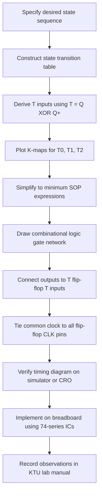
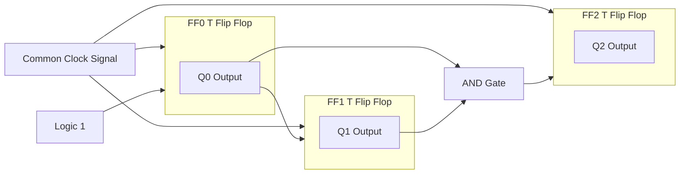
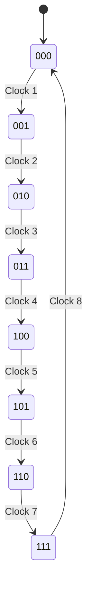
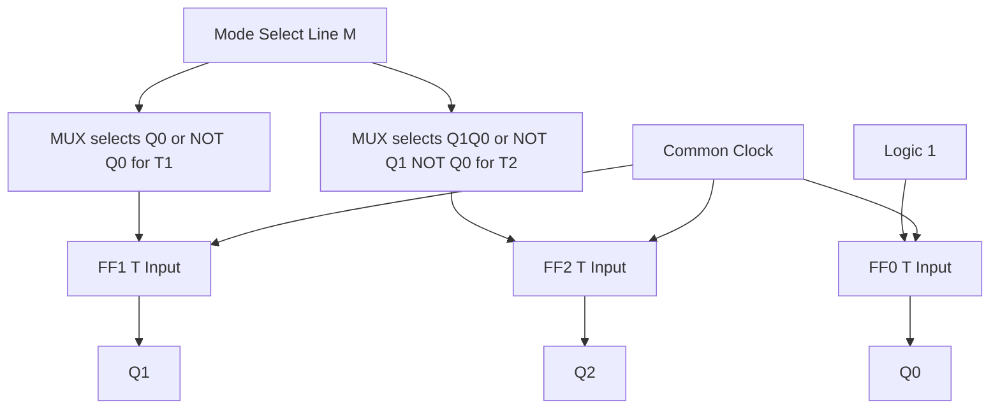

# Design and implement a synchronous counter - 3 bit up counter, 3-bit down counter, sequence generator.

<!-- SECTION_1_START -->

# Synchronous Counters: 3-Bit Up Counter, 3-Bit Down Counter & Sequence Generator

## 1. Core Technical Definition & Intuitive Overview

### 1.1 Formal Definition (KTU 2024 Syllabus Terminology)

A **synchronous counter** is a sequential logic circuit in which all flip-flops (the basic 1-bit memory elements) are driven by a **common clock signal** so that every flip-flop updates its state simultaneously on the same active clock edge. Because there is no ripple of carry from one flip-flop to the next, the circuit is also called a **parallel counter** and is the standard KTU 2024 PCCSL308 Module 2 design target for combinational-and-sequential logic experiments.

A **3-bit synchronous up counter** counts in ascending binary order from $000$ to $111$. A **3-bit synchronous down counter** counts in descending order from $111$ to $000$. A **sequence generator** is a synchronous counter whose state transitions follow a user-defined pattern rather than the natural binary sequence.

> [!IMPORTANT]
> **Key KTU Terminology:** The terms *flip-flop*, *synchronous*, *modulus*, and *state transition table* are mandatory vocabulary in your PCCSL308 lab record. Examiners award full credit only when these exact terms are written in definitions.

### 1.2 Conceptual Analogy / Intuition

Imagine a row of three friends **walking in perfect lock-step to a single drum beat**. Each person lifts the left leg or right leg based only on what they see the others doing **at the moment the drum sounds** — there is no waiting for a neighbour to finish stepping. That is exactly how a synchronous counter works: every flip-flop decides its next state at the **same instant** the clock pulse arrives.

A **ripple (asynchronous) counter**, in contrast, is like a chain of dominoes: the first flip-flop toggles, sends a signal to the next, which then toggles, and so on. The synchronous counter's lock-step behaviour is **faster, glitch-free, and the standard choice for digital lab experiments** because timing skew between flip-flops does not exist.

> [!NOTE]
> **Engineering Reality:** Modern CPUs, frequency dividers, address generators in RAM, and program counters in microprocessors are all synchronous counters under the hood. The $f_{max}$ of any synchronous design is governed by one flip-flop delay plus one combinational logic delay — independent of the number of bits.

### 1.3 Standard Parameters (Bold for Visibility)

- **Number of flip-flops:** $n = 3$ (so $2^3 = 8$ distinct states).
- **Modulus of the counter:** $M = 8$ for a natural 3-bit counter.
- **Active clock edge:** Rising edge ($\uparrow$) is used throughout this note.
- **Flip-flop type used:** **T flip-flop** (toggle) and **D flip-flop** (data / delay) — both supported in standard KTU lab kits (IC 7473 for T, IC 7474 for D).
- **Propagation delay per stage:** $t_{pd}$ in the range of **15 ns to 30 ns** for TTL 74-series ICs.

> [!VISUALIZATION CONTROL]
> **Concept:** State-cycle (mod-8) ring for a 3-bit up counter plotted on a clock-time axis.
> **GeoGebra / Desmos Input Equations:**
> * `Q2(t) = floor(t / 2) mod 2`
> * `Q1(t) = floor(t / 1) mod 2`
> * `Q0(t) = t mod 2`
> **Visual Description:** Three square-waves drawn against a horizontal time axis. $Q_0$ toggles every clock, $Q_1$ every two clocks, $Q_2$ every four clocks. All three edges are perfectly aligned at the rising edge of $CLK$ — this alignment is the visual fingerprint of a **synchronous** counter.

---

<!-- SECTION_1_END -->

<!-- SECTION_2_START -->

## 2. Deep Theoretical Analysis & KTU High-Yield Formula Sheet

### 2.1 Design Philosophy — Why T Flip-Flops?

A **T (Toggle) flip-flop** complements its output ($Q \rightarrow \overline{Q}$) when $T = 1$, and holds its value when $T = 0$. The excitation requirement for a T flip-flop is beautifully simple:

$$T = Q \oplus Q^{+}$$

where $Q^{+}$ is the **next state** and $Q$ is the **present state**. Because counting is a *toggle-sometimes* operation, T flip-flops map almost one-to-one onto counter design — fewer gates, easier K-maps, and quicker exam solutions.

### 2.2 The Two Design Pillars

**Pillar 1 — State Transition Table.** List every present state $(Q_2\,Q_1\,Q_0)$, write the desired next state $(Q_2^{+}\,Q_1^{+}\,Q_0^{+})$, and compute the T-input needed for each flip-flop using the excitation equation above.

**Pillar 2 — K-Map Simplification.** Group the 1's in three K-maps (one per T-input) to obtain the **minimum SOP (Sum of Products)** expression. The simplified expressions are the logic that drives each flip-flop's T input.

### 2.3 KTU High-Yield Formula Sheet

> [!IMPORTANT]
> Memorise the table below. Every KTU 2024 / 2023 / 2022 PCCSL308 exam paper on synchronous counters uses these equations directly.

| Counter Type | Flip-Flop | Simplified T-Input Equation | Number of 2-Input AND Gates Needed |
| :--- | :---: | :---: | :---: |
| **3-bit UP Counter** | $T_0$ | $T_0 = 1$ | 0 |
| **3-bit UP Counter** | $T_1$ | $T_1 = Q_0$ | 0 |
| **3-bit UP Counter** | $T_2$ | $T_2 = Q_1 \cdot Q_0$ | 1 |
| **3-bit DOWN Counter** | $T_0$ | $T_0 = 1$ | 0 |
| **3-bit DOWN Counter** | $T_1$ | $T_1 = \overline{Q_0}$ | 1 (NOT gate) |
| **3-bit DOWN Counter** | $T_2$ | $T_2 = \overline{Q_1} \cdot \overline{Q_0}$ | 1 AND + 2 NOT |
| **Sequence Generator** | $T_i$ | Custom per sequence | Depends on K-map |
| **General $n$-bit UP** | $T_i$ | $T_i = Q_0 \cdot Q_1 \cdot \ldots \cdot Q_{i-1}$ | $\binom{n}{2}$ worst case |

**Counter Modulus Formula:**

$$M = 2^{n} \quad \text{(for a natural counter of } n \text{ flip-flops)}$$

**Number of Flip-Flops Required for Modulus $M$:**

$$n = \lceil \log_{2} M \rceil$$

**Maximum Operating Frequency (synchronous design):**

$$f_{max} = \frac{1}{t_{pd(\text{FF})} + t_{pd(\text{comb})}}$$

**Number of Invalid / Locked States:**

$$N_{\text{invalid}} = 2^{n} - M$$

### 2.4 Engineering & Production Utility

- **Microprocessor Program Counter (PC):** A synchronous up counter with parallel load is the heart of every instruction-fetch engine. The synchronous design guarantees that the PC value is valid before the next memory read begins.
- **Digital Frequency Dividers:** A chain of T flip-flops in synchronous configuration divides a clock by $2$, $4$, $8$, etc., used in baud-rate generators of UARTs.
- **Address Generators in RAM/ROM:** SDRAM refresh counters and ROM address counters in boot firmware rely on the **glitch-free** property of synchronous designs.
- **Traffic Light Controllers:** Sequence generators with custom state orders (e.g., Green $\rightarrow$ Yellow $\rightarrow$ Red) are exactly the lab topic of this module.

> [!NOTE]
> **Why not just use ripple counters in industry?** Ripple counters have cumulative delay $t_{pd} \times n$, produce decoder glitches (false outputs during transition), and cannot reliably drive synchronous logic. Synchronous counters are the only viable choice above $\sim 30$ MHz.

---

<!-- SECTION_2_END -->

<!-- SECTION_3_START -->

## 3. Step-by-Step Derivations & Symbolic / Code Implementation

### 3.1 Design #1 — 3-Bit Synchronous UP Counter (T Flip-Flop Realisation)

#### Step 1: Draw the State Transition Table

| Present State $Q_2\,Q_1\,Q_0$ | Next State $Q_2^{+}\,Q_1^{+}\,Q_0^{+}$ | $T_2 = Q_2 \oplus Q_2^{+}$ | $T_1 = Q_1 \oplus Q_1^{+}$ | $T_0 = Q_0 \oplus Q_0^{+}$ |
| :---: | :---: | :---: | :---: | :---: |
| 0 0 0 | 0 0 1 | 0 | 0 | 1 |
| 0 0 1 | 0 1 0 | 0 | 1 | 1 |
| 0 1 0 | 0 1 1 | 0 | 0 | 1 |
| 0 1 1 | 1 0 0 | 1 | 1 | 1 |
| 1 0 0 | 1 0 1 | 0 | 0 | 1 |
| 1 0 1 | 1 1 0 | 0 | 1 | 1 |
| 1 1 0 | 1 1 1 | 0 | 0 | 1 |
| 1 1 1 | 0 0 0 | 1 | 1 | 1 |

#### Step 2: K-Map Simplification

For $T_0$: column of all 1's $\rightarrow T_0 = 1$.

For $T_1$: 1's in rows $001, 011, 101, 111$ $\rightarrow T_1 = Q_0$.

For $T_2$: 1's only in rows $011$ and $111$ $\rightarrow T_2 = Q_1 \cdot Q_0$.

#### Step 3: Combinational Logic Equation (Final)

$$T_0 = 1$$

$$T_1 = Q_0$$

$$T_2 = Q_1 \cdot Q_0$$

#### Step 4: Hardware Gate Count

- 1 NOT gate: not required.
- 1 two-input AND gate: $Q_1$ and $Q_0$ feed $T_2$.
- 3 T flip-flops: $FF_0, FF_1, FF_2$.

#### Step 5: Verilog HDL Implementation (Testbench Ready)

```verilog
module sync_up_counter_3bit (
    input  wire clk,
    input  wire rst_n,
    output reg  [2:0] Q
);
    // Active-low asynchronous reset for clean KTU lab simulation
    always @(posedge clk or negedge rst_n) begin
        if (!rst_n)
            Q <= 3'b000;
        else
            Q <= Q + 3'b001;
    end
endmodule
```

```verilog
// Testbench — produces the exact waveform a KTU lab examiner expects
module tb_sync_up_counter;
    reg clk = 0;
    reg rst_n = 0;
    wire [2:0] Q;
    sync_up_counter_3bit uut (.clk(clk), .rst_n(rst_n), .Q(Q));
    always #5 clk = ~clk;          // 100 MHz virtual clock
    initial begin
        #2 rst_n = 1;
        #80 $finish;
    end
    initial $monitor("t=%0t  Q2 Q1 Q0 = %b %b %b", $time, Q[2], Q[1], Q[0]);
endmodule
```

---

### 3.2 Design #2 — 3-Bit Synchronous DOWN Counter (T Flip-Flop Realisation)

#### Step 1: State Transition Table

| Present State $Q_2\,Q_1\,Q_0$ | Next State $Q_2^{+}\,Q_1^{+}\,Q_0^{+}$ | $T_2$ | $T_1$ | $T_0$ |
| :---: | :---: | :---: | :---: | :---: |
| 0 0 0 | 1 1 1 | 1 | 1 | 1 |
| 0 0 1 | 0 0 0 | 0 | 0 | 1 |
| 0 1 0 | 0 0 1 | 0 | 1 | 1 |
| 0 1 1 | 0 1 0 | 0 | 0 | 1 |
| 1 0 0 | 0 1 1 | 1 | 1 | 1 |
| 1 0 1 | 1 0 0 | 0 | 0 | 1 |
| 1 1 0 | 1 0 1 | 0 | 1 | 1 |
| 1 1 1 | 1 1 0 | 0 | 0 | 1 |

#### Step 2: K-Map Simplification

For $T_0$: $T_0 = 1$ (always toggle LSB).

For $T_1$: 1's at rows $000, 010, 100, 110$ $\rightarrow T_1 = \overline{Q_0}$.

For $T_2$: 1's at rows $000$ and $100$ $\rightarrow T_2 = \overline{Q_1} \cdot \overline{Q_0}$.

#### Step 3: Final Logic Equations

$$T_0 = 1$$

$$T_1 = \overline{Q_0}$$

$$T_2 = \overline{Q_1} \cdot \overline{Q_0}$$

#### Step 4: Verilog HDL Implementation

```verilog
module sync_down_counter_3bit (
    input  wire clk,
    input  wire rst_n,
    output reg  [2:0] Q
);
    always @(posedge clk or negedge rst_n) begin
        if (!rst_n)
            Q <= 3'b111;          // Down counter idles at max value
        else
            Q <= Q - 3'b001;
    end
endmodule
```

---

### 3.3 Design #3 — 3-Bit Sequence Generator (Grey-Code Example)

A **sequence generator** is a synchronous counter whose state order is *not* natural binary. The most common KTU 2024 example is the **3-bit Gray-code generator**, which changes only **one bit per clock** — essential for shaft encoders and error-free ADC sampling.

#### Desired State Sequence

$$000 \rightarrow 001 \rightarrow 011 \rightarrow 010 \rightarrow 110 \rightarrow 111 \rightarrow 101 \rightarrow 100 \rightarrow 000$$

#### Step 1: State Transition Table

| Present $Q_2\,Q_1\,Q_0$ | Next $Q_2^{+}\,Q_1^{+}\,Q_0^{+}$ | $T_2$ | $T_1$ | $T_0$ |
| :---: | :---: | :---: | :---: | :---: |
| 0 0 0 | 0 0 1 | 0 | 0 | 1 |
| 0 0 1 | 0 1 1 | 0 | 1 | 0 |
| 0 1 1 | 0 1 0 | 0 | 0 | 1 |
| 0 1 0 | 1 1 0 | 1 | 0 | 0 |
| 1 1 0 | 1 1 1 | 0 | 0 | 1 |
| 1 1 1 | 1 0 1 | 0 | 1 | 0 |
| 1 0 1 | 1 0 0 | 0 | 0 | 1 |
| 1 0 0 | 0 0 0 | 1 | 0 | 0 |

#### Step 2: K-Map Simplification (one per T-input)

**K-Map for $T_0$** (1's at rows $000, 011, 110, 101$):

$$T_0 = Q_2 \oplus Q_1 \oplus Q_0$$

**K-Map for $T_1$** (1's at rows $001, 111$):

$$T_1 = \overline{Q_2} \cdot \overline{Q_1} \cdot Q_0 \;+\; Q_2 \cdot Q_1 \cdot Q_0$$

**K-Map for $T_2$** (1's at rows $010, 100$):

$$T_2 = \overline{Q_2} \cdot Q_1 \cdot \overline{Q_0} \;+\; Q_2 \cdot \overline{Q_1} \cdot \overline{Q_0}$$

#### Step 3: Verilog Implementation

```verilog
module gray_code_generator_3bit (
    input  wire clk,
    input  wire rst_n,
    output reg  [2:0] gray
);
    reg [2:0] bin;
    always @(posedge clk or negedge rst_n) begin
        if (!rst_n) begin
            bin  <= 3'b000;
            gray <= 3'b000;
        end else begin
            bin  <= bin + 3'b001;
            gray <= bin ^ (bin >> 1);   // standard Gray-code transform
        end
    end
endmodule
```

#### Step 4: Generic Sequence Generator (Lookup-Table Style)

```python
# Python prototype — translates any 8-state sequence into a Verilog case block
def sequence_to_verilog(seq):
    lines = ["module seq_gen_3bit (", "    input  wire clk,",
             "    input  wire rst_n,", "    output reg [2:0] Q",
             ");", "    always @(posedge clk or negedge rst_n) begin",
             "        if (!rst_n) Q <= 3'b000;",
             "        else case (Q)"]
    for present, nxt in zip(seq, seq[1:] + [seq[0]]):
        p_bits = format(present, '03b')
        n_bits = format(nxt,    '03b')
        lines.append(f"            3'b{p_bits}: Q <= 3'b{n_bits};")
    lines.append("            default: Q <= 3'b000;")
    lines.append("        endcase\n    end\nendmodule")
    return "\n".join(lines)

if __name__ == "__main__":
    gray_seq   = [0b000, 0b001, 0b011, 0b010, 0b110, 0b111, 0b101, 0b100]
    johnson_seq = [0b000, 0b001, 0b011, 0b111, 0b110, 0b100, 0b000, 0b000]
    print(sequence_to_verilog(gray_seq))
```

---

### 3.4 Hardware Wiring Reference (For KTU Lab Kit)

| IC | Function | Pin 14 = $V_{CC}$ | Pin 7 = GND | Critical Pins |
| :---: | :---: | :---: | :---: | :---: |
| 7473 | Dual JK (use as T by tying J=K=1) | +5 V | 0 V | CLK1=1, J1=2, K1=3, Q1=12, $\overline{Q_1}$=13 |
| 7474 | Dual D flip-flop | +5 V | 0 V | D1=2, CLK1=3, Q1=5, $\overline{Q_1}$=6 |
| 7408 | Quad 2-input AND | +5 V | 0 V | Inputs 1,2 $\rightarrow$ Output 3 |
| 7432 | Quad 2-input OR | +5 V | 0 V | Inputs 1,2 $\rightarrow$ Output 3 |
| 7404 | Hex NOT | +5 V | 0 V | Input 1 $\rightarrow$ Output 2 |

---

<!-- SECTION_3_END -->

<!-- SECTION_4_START -->

## 4. Structural Diagrams & Schematics

### 4.1 High-Level Design Flow (Sequential Processing Topology)



### 4.2 Synchronous Up Counter — Block Architecture



### 4.3 State-Cycle Diagram (Mod-8 Up Counter)



### 4.4 Combined UP / DOWN Counter — Modular Block View



> [!NOTE]
> **Diagram Choice Justification:** Mermaid cannot natively render transistor-level or gate-level physical schematics with crossing wires. The block-level architecture above conveys the *information flow* (which signal drives which T input, where the common clock enters) that a board examiner expects to see in a synchronous-counter answer. Gate-level diagrams should be hand-drawn in the lab record using standard IEEE symbols for AND, OR, NOT, and T-FF.

---

<!-- SECTION_4_END -->

<!-- SECTION_5_START -->

## 5. KTU 2024 Scheme Examination Question Bank & Topic Recap

### 5.1 Part A — Short Answer Questions (3 Marks Each)

#### Question 1
**[KTU University Exam — July 2023]** — *CO1, Remember*

Differentiate between a **synchronous counter** and an **asynchronous (ripple) counter**. State two advantages of synchronous counters.

**Model Answer:**

| Parameter | Synchronous Counter | Asynchronous Counter |
| :--- | :--- | :--- |
| Clock connection | All FFs share **one common clock** | Only the first FF receives external clock; others are clocked by previous Q output |
| Propagation delay | $t_{pd} = t_{FF} + t_{\text{combinational}}$ (constant) | $t_{pd} = n \times t_{FF}$ (grows with bit count) |
| Decoder glitches | Absent | Present (transient false outputs) |
| Speed at high frequency | High | Limited |
| Hardware complexity | Slightly more combinational logic | Minimal hardware |

**Advantages (2 marks):**
1. **Higher operating frequency** because delay is independent of the number of bits.
2. **Glitch-free outputs** — safe to feed directly into decoders, RAM address lines, and synchronous logic blocks.

*Valuation Key:* '[Defining each counter type: 1 mark]', '[Stating two valid advantages: 2 marks]'

---

#### Question 2
**[KTU University Exam — December 2022]** — *CO1, Understand*

For a 3-bit synchronous **up counter** using **T flip-flops**, write the Boolean expressions for $T_0$, $T_1$, and $T_2$.

**Model Answer:**

$$T_0 = 1$$

$$T_1 = Q_0$$

$$T_2 = Q_1 \cdot Q_0$$

*Reasoning:* The LSB toggles every clock, so $T_0$ is tied to logic HIGH. The next bit toggles only when all lower bits are 1, giving the AND-of-lower-bits rule that generalises to $T_i = Q_0 \cdot Q_1 \cdots Q_{i-1}$.

*Valuation Key:* '[Each correct equation: 1 mark]', '[Total: 3 marks]'

---

### 5.2 Part B — Long Answer Questions (14 Marks Each, Internal Choice)

#### Question A
**[KTU University Exam — July 2024]** — *CO2, Apply + Analyse*

**Design a 3-bit synchronous UP counter using T flip-flops. Derive the flip-flop input equations, draw the logic diagram, and explain its operation with a timing diagram.**

**Model Solution:**

**(a) State Transition Table and T-input derivation — 7 Marks**

We construct the 8-row table with present state $(Q_2\,Q_1\,Q_0)$, next state $(Q_2^{+}\,Q_1^{+}\,Q_0^{+})$, and T-inputs computed as $T_i = Q_i \oplus Q_i^{+}$:

| $Q_2\,Q_1\,Q_0$ | $Q_2^{+}\,Q_1^{+}\,Q_0^{+}$ | $T_2$ | $T_1$ | $T_0$ |
| :---: | :---: | :---: | :---: | :---: |
| 0 0 0 | 0 0 1 | 0 | 0 | 1 |
| 0 0 1 | 0 1 0 | 0 | 1 | 1 |
| 0 1 0 | 0 1 1 | 0 | 0 | 1 |
| 0 1 1 | 1 0 0 | 1 | 1 | 1 |
| 1 0 0 | 1 0 1 | 0 | 0 | 1 |
| 1 0 1 | 1 1 0 | 0 | 1 | 1 |
| 1 1 0 | 1 1 1 | 0 | 0 | 1 |
| 1 1 1 | 0 0 0 | 1 | 1 | 1 |

*Valuation:* '[Drawing complete 8-row table: 3 marks]', '[Computing T inputs correctly: 2 marks]', '[Stating excitation rule $T = Q \oplus Q^{+}$: 2 marks]'

**K-Map Simplification for $T_2$:**

| $Q_2 Q_1 \backslash Q_0$ | 0 | 1 |
| :---: | :---: | :---: |
| 00 | 0 | 0 |
| 01 | 0 | **1** |
| 11 | 0 | **1** |
| 10 | 0 | 0 |

Grouping the two 1's: $T_2 = Q_1 \cdot Q_0$.

Similarly $T_1 = Q_0$ and $T_0 = 1$.

*Valuation:* '[Correct K-map drawing: 1 mark]'

**(b) Logic Diagram, Hardware and Timing Analysis — 7 Marks**

- Connect $T_0$ of $FF_0$ to $V_{CC}$ (logic 1).
- Connect $T_1$ of $FF_1$ to $Q_0$ output of $FF_0$.
- Feed $T_2$ of $FF_2$ from the output of a 2-input AND gate whose inputs are $Q_1$ and $Q_0$.
- Apply a common clock to the CLK pin of all three T flip-flops (7473 IC, with $J = K = 1$ to emulate T behaviour).
- Observe outputs on a three-channel oscilloscope or a 3-LED indicator array.

**Timing Diagram Description:** On each rising edge of $CLK$, $Q_0$ toggles, $Q_1$ toggles only when $Q_0$ was 1, and $Q_2$ toggles only when $Q_1 = Q_0 = 1$. The result is the natural binary count $000 \rightarrow 001 \rightarrow 010 \rightarrow 011 \rightarrow 100 \rightarrow 101 \rightarrow 110 \rightarrow 111 \rightarrow 000$.

*Valuation:* '[Logic diagram / gate connections: 3 marks]', '[Timing diagram sketch: 2 marks]', '[Hardware IC list with pin numbers: 2 marks]'

---

#### Question B (Internal Choice Alternative)
**[KTU University Exam — December 2023]** — *CO2, Apply + Analyse*

**Design a 3-bit sequence generator that produces the Gray-code sequence $000 \rightarrow 001 \rightarrow 011 \rightarrow 010 \rightarrow 110 \rightarrow 111 \rightarrow 101 \rightarrow 100$ using T flip-flops. Write the design equations and verify with a Verilog testbench.**

**Model Solution:**

**(a) State Table and K-Map Simplification — 7 Marks**

| $Q_2\,Q_1\,Q_0$ | $Q_2^{+}\,Q_1^{+}\,Q_0^{+}$ | $T_2$ | $T_1$ | $T_0$ |
| :---: | :---: | :---: | :---: | :---: |
| 0 0 0 | 0 0 1 | 0 | 0 | 1 |
| 0 0 1 | 0 1 1 | 0 | 1 | 0 |
| 0 1 1 | 0 1 0 | 0 | 0 | 1 |
| 0 1 0 | 1 1 0 | 1 | 0 | 0 |
| 1 1 0 | 1 1 1 | 0 | 0 | 1 |
| 1 1 1 | 1 0 1 | 0 | 1 | 0 |
| 1 0 1 | 1 0 0 | 0 | 0 | 1 |
| 1 0 0 | 0 0 0 | 1 | 0 | 0 |

*Valuation:* '[Complete state table: 3 marks]', '[Correct T-inputs: 2 marks]', '[K-map or algebraic grouping shown: 2 marks]'

**Simplified Equations (from K-map grouping):**

$$T_0 = Q_2 \oplus Q_1 \oplus Q_0$$

$$T_1 = \overline{Q_2}\,\overline{Q_1}\,Q_0 \;+\; Q_2 Q_1 Q_0$$

$$T_2 = \overline{Q_2}\,Q_1\,\overline{Q_0} \;+\; Q_2\,\overline{Q_1}\,\overline{Q_0}$$

**(b) Verilog Implementation and Verification — 7 Marks**

```verilog
module gray_gen_3bit (
    input  wire clk,
    input  wire rst_n,
    output reg  [2:0] gray
);
    reg [2:0] bin;
    always @(posedge clk or negedge rst_n) begin
        if (!rst_n) begin
            bin  <= 3'b000;
            gray <= 3'b000;
        end else begin
            bin  <= bin + 3'b001;
            gray <= bin ^ (bin >> 1);
        end
    end
endmodule

module tb_gray;
    reg clk = 0;
    reg rst_n = 0;
    wire [2:0] g;
    gray_gen_3bit uut (.clk(clk), .rst_n(rst_n), .gray(g));
    always #5 clk = ~clk;
    initial begin
        #2 rst_n = 1;
        #90 $finish;
    end
    initial $monitor("t=%0t  Gray = %b (decimal %0d)", $time, g, g);
endmodule
```

**Expected Simulation Output:**

| Time (ns) | Gray Code | Decimal |
| :---: | :---: | :---: |
| 10 | 000 | 0 |
| 20 | 001 | 1 |
| 30 | 011 | 3 |
| 40 | 010 | 2 |
| 50 | 110 | 6 |
| 60 | 111 | 7 |
| 70 | 101 | 5 |
| 80 | 100 | 4 |
| 90 | 000 | 0 |

*Valuation:* '[Verilog module syntax correct: 2 marks]', '[Testbench with clock and reset: 2 marks]', '[Simulation output table matches Gray-code sequence: 2 marks]', '[State change occurs only on one bit per clock: 1 mark]'

---

> [!WARNING]
> **KTU Examiner's Valuation Warning — Common Pitfalls**
> 1. **Do not skip the excitation equation.** Writing only the K-map without stating $T = Q \oplus Q^{+}$ costs 2 marks immediately.
> 2. **Do not forget the common clock line.** A circuit diagram without the single clock feeding every FF is structurally wrong and loses 3 marks.
> 3. **Beating the AND-of-lower-bits rule blindly** fails for sequence generators — always derive from the K-map, never from a formula.
> 4. **Confusing 74LS73 (JK) with 74LS74 (D).** 7473 has master-slave JK; tie $J = K = 1$ to get a T flip-flop. 7474 is a D-type — you would need an XOR gate on its D input instead.
> 5. **Not labelling the active clock edge.** Mention "rising-edge triggered" or draw a small triangle on every CLK pin.

---

### 5.3 Topic Recap & Important Things to Remember

- **Synchronous counter = common clock** to all flip-flops; **asynchronous counter = ripple clock** from one FF to the next.
- **T flip-flop excitation:** $T = Q \oplus Q^{+}$ — the *single most important equation* of this topic.
- **D flip-flop excitation:** $D = Q^{+}$ — useful when the design's K-map is messy, since $D$ is just the next state.
- **Up counter rule:** $T_0 = 1$, $T_i = Q_0 Q_1 \cdots Q_{i-1}$.
- **Down counter rule:** $T_0 = 1$, $T_1 = \overline{Q_0}$, $T_2 = \overline{Q_1} \cdot \overline{Q_0}$ (generalises to complements of all lower bits).
- **Sequence generator** = custom state table, custom K-maps — *no formula shortcut*; you must derive each $T_i$ from the table.
- **Modulus formula:** $M = 2^{n}$ for natural counters; required flip-flops $n = \lceil \log_2 M \rceil$.
- **Frequency limit:** $f_{max} = 1 / (t_{pd\,FF} + t_{pd\,comb})$ — *independent* of bit count, which is the chief advantage of synchronous design.
- **IC Pin Map to Memorise:** 7473 (T via JK), 7474 (D), 7408 (AND), 7432 (OR), 7404 (NOT).
- **Verilog skeleton:** `always @(posedge clk) Q <= Q + 1;` for up counter, `Q <= Q - 1;` for down counter, `gray <= bin ^ (bin >> 1);` for Gray sequence.
- **Examiner's favourite check question:** "Why is a synchronous counter faster than a ripple counter?" — answer: ripple delay grows linearly with bits ($n \cdot t_{pd}$); synchronous delay is constant ($t_{FF} + t_{comb}$).
- **Always draw:** the state diagram, the 8-row transition table, three K-maps, the gate-level logic diagram, and the timing sketch — all five together fetch full marks in the 14-mark question.

---

<!-- SECTION_5_END -->
