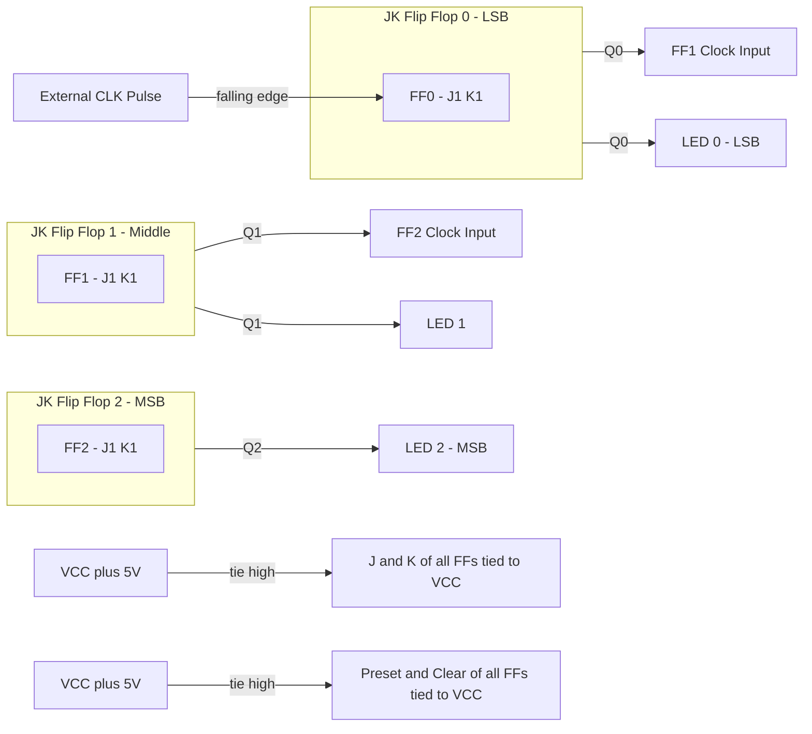
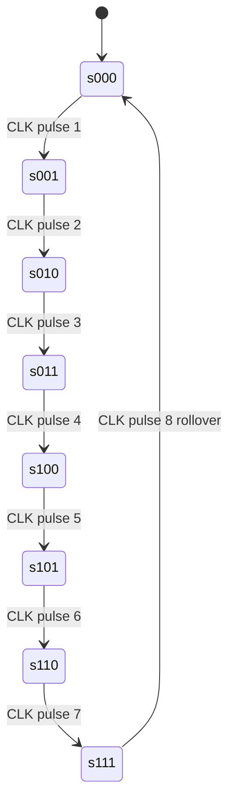
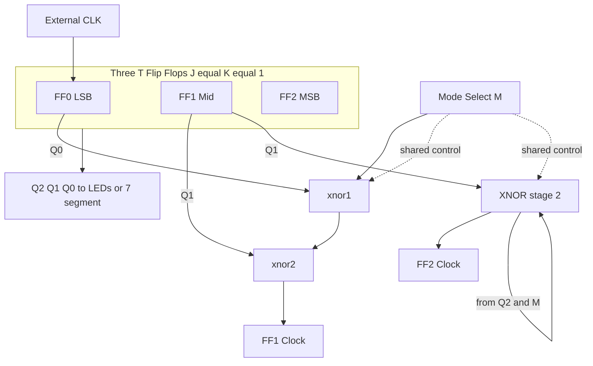
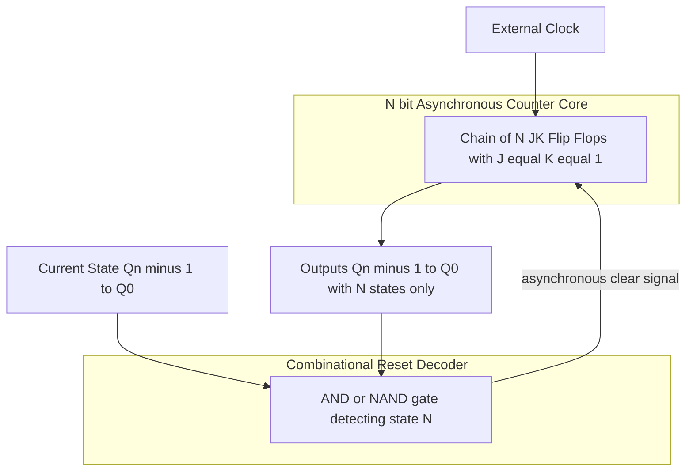

# Design and implement an asynchronous counter - 3 bit up counter, 3-bit down counter, 3 bit up down counter with mode control, mod-N counter

<!-- SECTION_1_START -->

# Design and Implementation of Asynchronous Counters

## 1.1 Formal Academic Definition (KTU 2024 Syllabus Terminology)

> [!IMPORTANT]
> **Asynchronous Counter:** A sequential digital circuit in which the flip-flops (FFs) that store the binary count are **not clocked simultaneously** by a common clock signal. Instead, the clock input of each successive flip-flop is driven by the **output of the preceding flip-flop**, causing a "ripple" effect through the chain. Hence, it is also called a **Ripple Counter**.

In the KTU 2024 Scheme (Course Code **PCCSL308 – Digital Lab**), Module 2 specifically requires the *hardware implementation* of asynchronous counters using:
- **JK Flip-Flops** (configured in toggle mode, $J = K = 1$) acting as **T flip-flops**, OR
- **Dedicated T Flip-Flops** (7476 / 7473 ICs in the lab).

> [!NOTE]
> **Standard Notation Used Throughout This Note**
> $Q_2$ = Most Significant Bit (MSB), $Q_1$ = Middle Bit, $Q_0$ = Least Significant Bit (LSB).
> Clock signal is denoted as $CLK$ or $CK$. Negative-edge triggering is denoted by a small bubble at the clock input.

---

## 1.2 Conceptual Analogy & Intuitive Overview

> [!TIP]
> **🎯 The Domino Analogy**
> Imagine a row of standing dominoes. When you push the **first domino** (the external clock), it falls and strikes the second one, which then falls and strikes the third, and so on. Each domino takes a small, *finite time* to topple. The first domino is driven by your hand (the external $CLK$), but every subsequent domino is driven by its **predecessor's fall** — exactly how the clock ripples through a ripple counter.

**Geometric Intuition:** Think of binary counting as a **chain of binary odometer wheels**.

- For the **3-bit Up Counter**, the LSB wheel $Q_0$ rotates fastest, completing one full revolution every 2 clock pulses.
- The middle wheel $Q_1$ rotates only when $Q_0$ rolls over (every 2 pulses), and the MSB $Q_2$ rotates only when $Q_1$ rolls over (every 4 pulses).
- The **count sequence is determined by which edge** of the previous output we tap: tapping the *normal* output $Q$ gives **UP counting**, while tapping the *complement* $\overline{Q}$ gives **DOWN counting**.

> [!IMPORTANT]
> **Why "Asynchronous"?**
> The Greek root *a-* (without) + *synchronos* (together in time) literally means **"not happening at the same time."** Each flip-flop changes state slightly later than the previous one due to **propagation delay** $t_p$. This is both the *feature* (simple wiring) and the *bug* (limitation on maximum clock frequency) of ripple counters.

---

## 1.3 Physical Constants & Standard Metrics

> [!NOTE]
> **Engineering Limits You MUST Remember in the Lab**
> - **Propagation delay of JK FF (TTL 7476):** $t_{pd} \approx 40 \text{ ns}$ per stage.
> - **Maximum clock frequency:** $f_{max} = \dfrac{1}{N \cdot t_{pd}}$ for an $N$-bit ripple counter.
> - **Setup time, Hold time, Pulse width** must all be satisfied per the IC datasheet.
> - **Power supply:** Standard **+5 V DC**, with $\textbf{0 V}$ as ground, for the 74LS/74HC family of TTL/CMOS ICs.

---

## 1.4 Visualization Control (For Self-Study)

> [!VISUALIZATION CONTROL]
> **Concept:** Binary counting state-transition graph for a 3-bit up counter.
> **Input / Variables:**
> * State space: $000, 001, 010, 011, 100, 101, 110, 111$
> * Each transition is triggered by one $CLK$ pulse entering $FF_0$.
> **Visual Description:** Draw 8 circles (states) on a horizontal line. Draw directed arrows from each state to its successor in binary increment order. Observe that the **cycle length is $2^3 = 8$** and the LSB toggles on *every* pulse, MSB toggles on *only one* pulse per cycle.

---

<!-- SECTION_1_END -->

<!-- SECTION_2_START -->

# Deep Theoretical Analysis & KTU High-Yield Formula Sheet

## 2.1 The T Flip-Flop as the Building Block

A **T (Toggle) flip-flop** changes its state on every active clock edge when $T = 1$. The JK flip-flop with $J = K = 1$ behaves exactly like a T flip-flop. The characteristic equation is:

$$
Q_{next} = T \oplus Q = T \cdot \overline{Q} + \overline{T} \cdot Q
$$

When $T = 1$ (permanently tied in our counters), this reduces to:

$$
Q_{next} = \overline{Q}
$$

That is, **the output simply inverts on every active clock edge.**

---

## 2.2 Clock Distribution & Edge Selection (THE Most Critical Concept)

> [!IMPORTANT]
> **Edge Selection Rule for Ripple Counters**
>
> | Tapped From | Edge Used | Direction |
> | :--- | :--- | :--- |
> | Normal output $Q$ | Same edge as external $CLK$ | **UP Count** |
> | Complement output $\overline{Q}$ | Opposite edge of $Q$ | **DOWN Count** |
> | Mode MUX selects $Q$ or $\overline{Q}$ | Selectable | **UP / DOWN** |

In a standard **3-bit UP counter** using **negative-edge-triggered** JK flip-flops:
- $FF_0$: clocked by external $CLK$ (input pulse)
- $FF_1$: clocked by $Q_0$
- $FF_2$: clocked by $Q_1$

In a standard **3-bit DOWN counter**:
- $FF_0$: clocked by external $CLK$
- $FF_1$: clocked by $\overline{Q_0}$
- $FF_2$: clocked by $\overline{Q_1}$

---

## 2.3 Step-by-Step Logic Flow (How a 3-Bit Up Counter Works)

Let us trace through the first 8 clock pulses for a 3-bit up counter with **negative-edge-triggered** FFs. The active edge is the **falling edge** of the clock.

1. **Pulse 1 → $FF_0$ toggles** : $Q_0$ goes $0 \rightarrow 1$. A **rising** edge appears at $Q_0$ — **inactive** for $FF_1$. Only $Q_0$ changes. State: $001$.
2. **Pulse 2 → $FF_0$ toggles** : $Q_0$ goes $1 \rightarrow 0$. A **falling** edge appears at $Q_0$ — **active** for $FF_1$, so $FF_1$ toggles. $Q_1$ goes $0 \rightarrow 1$. State: $010$.
3. **Pulse 3** : $Q_0: 0 \rightarrow 1$. Rising edge — $FF_1$ unchanged. State: $011$.
4. **Pulse 4** : $Q_0: 1 \rightarrow 0$. Falling edge — $FF_1$ toggles ($1 \rightarrow 0$). This falling edge at $Q_1$ triggers $FF_2$: $Q_2: 0 \rightarrow 1$. State: $100$.

> [!NOTE]
> **The "ripple" is visible here:** When the 4th pulse arrives, the change does not happen *simultaneously* across $Q_0, Q_1, Q_2$. There is a small propagation delay: $Q_0$ changes first, then $Q_1$, then $Q_2$. This is the source of transient glitches and limits the maximum clock frequency.

---

## 2.4 KTU Formula Sheet / Cheat Sheet

| # | Parameter | Formula / Value | Unit | Notes |
| :--- | :--- | :--- | :--- | :--- |
| 1 | Number of states in $N$-bit up/down counter | $M = 2^N$ | states | Pure binary |
| 2 | Maximum count (up) | $M - 1 = 2^N - 1$ | decimal | All 1's |
| 3 | Modulus of a Mod-$N$ counter | $N_{mod}$ | states | Number of distinct states |
| 4 | Number of FFs required for Mod-$N$ | $\lceil \log_2 N_{mod} \rceil$ | FFs | Round up |
| 5 | Frequency division by $i$-th FF | $f_i = f_{CLK} \div 2^i$ | Hz | $i = 1$ for LSB |
| 6 | Max clock frequency for ripple | $f_{max} = \dfrac{1}{N \cdot t_{pd}}$ | Hz | $N$ = number of FFs |
| 7 | Total propagation delay | $t_{total} = N \cdot t_{pd}$ | s | One per FF stage |
| 8 | Reset pulse width requirement | $t_{w(reset)} \geq t_{pd}$ | s | For asynchronous clear |
| 9 | Output state vector (up) | $Q_2 Q_1 Q_0$ | binary | MSB first |
| 10 | Mode Control Logic (UP/DOWN) | $CLK_{next} = M \cdot CLK + \overline{M} \cdot \overline{CLK_{prev}}$ | logic | $M = 1$ for UP, $M = 0$ for DOWN |

> [!WARNING]
> **Markdown Table Pipe Rule Reminder:** Notice that vertical bars in math (e.g., absolute value, modulus) are NOT used directly in any cell above. They are written as $N_{mod}$ or in LaTeX to avoid breaking the table.

---

## 2.5 Real-World Engineering Utility

> [!TIP]
> **Where Asynchronous Counters Are Actually Used in Industry**
> - **Frequency dividers** in PLL circuits, where the exact count sequence does not matter but a precise division ratio does.
> - **Time-base generators** in digital oscilloscopes and function generators (e.g., divide a $10 \text{ MHz}$ crystal by 2, 4, 8, 16 to obtain multiple timing references).
> - **Ring counters and Johnson counters** for sequencer logic in traffic light controllers and simple state machines.
> - **Watchdog timers** in embedded systems where cost and simplicity outweigh speed.
> - **Simple event counters** (e.g., counting rotations, people, items on a conveyor) where input frequencies are low.

**Limitation in high-speed systems:** Synchronous counters replaced ripple counters in most modern ASIC/FPGA designs because the latter's cumulative propagation delay creates a "**ripple-through hazard**" that can produce transient false counts on the decoder outputs.

---

<!-- SECTION_2_END -->

<!-- SECTION_3_START -->

# Step-by-Step Derivations, Truth Tables & Hardware Implementation

## 3.1 Design 1: 3-Bit Asynchronous UP Counter

### 3.1.1 Specifications
- Modulus = $2^3 = 8$ states: $000$ through $111$.
- Active clock edge: **Falling (negative) edge** of $7476$ JK flip-flop.
- All $J$ and $K$ inputs tied to **logic HIGH** ($V_{CC}$ = 5 V) to operate in toggle mode.

### 3.1.2 Complete Truth Table (Count Sequence)

| Clock Pulse | $Q_2$ | $Q_1$ | $Q_0$ | Decimal |
| :---: | :---: | :---: | :---: | :---: |
| 0 (initial) | 0 | 0 | 0 | 0 |
| 1 | 0 | 0 | 1 | 1 |
| 2 | 0 | 1 | 0 | 2 |
| 3 | 0 | 1 | 1 | 3 |
| 4 | 1 | 0 | 0 | 4 |
| 5 | 1 | 0 | 1 | 5 |
| 6 | 1 | 1 | 0 | 6 |
| 7 | 1 | 1 | 1 | 7 |
| 8 | 0 | 0 | 0 | 0 (rollover) |

### 3.1.3 Hardware Wiring (3-Bit Asynchronous Up Counter using 7476)

| Flip-Flop | IC Pin (7476) | Signal Connected | Logic Level |
| :---: | :---: | :--- | :---: |
| $FF_0$ (LSB) | Pin 1 ($J_0$), Pin 4 ($K_0$) | Tied to $V_{CC}$ | **HIGH** |
| $FF_0$ clock | Pin 2 ($\overline{CK_0}$) | External $CLK$ from pulse generator | Pulse input |
| $FF_0$ preset/clear | Pin 5 ($\overline{PR}$), Pin 3 ($\overline{CLR}$) | Tied to $V_{CC}$ (inactive) | **HIGH** |
| $FF_0$ output | Pin 14 ($Q_0$), Pin 13 ($\overline{Q_0}$) | $Q_0$ to LEDs; $Q_0 \to \overline{CK_1}$ | — |
| $FF_1$ clock | Pin 6 ($\overline{CK_1}$) | $Q_0$ of $FF_0$ | Cascaded |
| $FF_1$ output | Pin 11 ($Q_1$) | $Q_1$ to LED; $Q_1 \to \overline{CK_2}$ | Cascaded |
| $FF_2$ clock | Pin 9 ($\overline{CK_2}$) | $Q_1$ of $FF_1$ | Cascaded |
| $FF_2$ output | Pin 8 ($Q_2$) | $Q_2$ to LED (MSB indicator) | — |

> [!IMPORTANT]
> **Pin 16 = $V_{CC}$ (+5 V), Pin 8 = GND (0 V) for the 7476 IC.** Always connect power first before applying input pulses to avoid latch-up damage.

### 3.1.4 Frequency Division Verification

If input $CLK = 1 \text{ kHz}$:
- $Q_0$ frequency = $1 \text{ kHz} \div 2 = 500 \text{ Hz}$
- $Q_1$ frequency = $1 \text{ kHz} \div 4 = 250 \text{ Hz}$
- $Q_2$ frequency = $1 \text{ kHz} \div 8 = 125 \text{ Hz}$

The output frequencies form a perfect halving chain — verify on the lab CRO.

---

## 3.2 Design 2: 3-Bit Asynchronous DOWN Counter

### 3.2.1 Core Difference from Up Counter
We tap the **complement output** $\overline{Q}$ of each flip-flop to feed the next stage's clock, instead of $Q$.

$$
CLK_{i+1} = \overline{Q_i}
$$

When $Q_i$ has a **falling** edge, $\overline{Q_i}$ has a **rising** edge. Since $7476$ is negative-edge-triggered, the active edge for $FF_{i+1}$ is still the falling edge of $\overline{Q_i}$ — but a falling edge of $\overline{Q_i}$ corresponds to a **rising** edge of $Q_i$, which happens *exactly* when $Q_i$ transitions from $0$ to $1$. This is precisely the moment $Q_i$ rolls over from $1$ to $0$ in binary — the trigger condition for the next stage to decrement.

### 3.2.2 Complete Count Sequence

| Clock Pulse | $Q_2$ | $Q_1$ | $Q_0$ | Decimal |
| :---: | :---: | :---: | :---: | :---: |
| 0 (initial) | 0 | 0 | 0 | 0 |
| 1 | 1 | 1 | 1 | 7 |
| 2 | 1 | 1 | 0 | 6 |
| 3 | 1 | 0 | 1 | 5 |
| 4 | 1 | 0 | 0 | 4 |
| 5 | 0 | 1 | 1 | 3 |
| 6 | 0 | 1 | 0 | 2 |
| 7 | 0 | 0 | 1 | 1 |
| 8 | 0 | 0 | 0 | 0 (rollover) |

> [!NOTE]
> **Observation:** The counter starts at $000$, but the *first* clock pulse takes it to $111 = 7_{10}$ (the maximum). This is the signature behavior of a down counter.

### 3.2.3 Wiring Modification from Up Counter

| Connection Point | Up Counter | Down Counter |
| :--- | :--- | :--- |
| $FF_1$ clock input | $Q_0$ | $\overline{Q_0}$ |
| $FF_2$ clock input | $Q_1$ | $\overline{Q_1}$ |
| $FF_0$ clock input | External $CLK$ | External $CLK$ (unchanged) |

All other connections ($J = K = 1$, preset/clear inactive) remain identical.

---

## 3.3 Design 3: 3-Bit Asynchronous UP/DOWN Counter with Mode Control

### 3.3.1 The Control Variable
A single digital input $M$ (Mode) selects direction:
- $M = 1$ → **UP counting**
- $M = 0$ → **DOWN counting**

### 3.3.2 Deriving the Clock Steering Logic

The clock to $FF_{i+1}$ must be:
- $Q_i$ when $M = 1$ (UP mode)
- $\overline{Q_i}$ when $M = 0$ (DOWN mode)

This is a classic **2-to-1 multiplexer** function:

$$
CLK_{i+1} = M \cdot Q_i + \overline{M} \cdot \overline{Q_i}
$$

Equivalently, recognizing this as the **XNOR** of $M$ and $Q_i$:

$$
CLK_{i+1} = M \odot Q_i = \overline{M \oplus Q_i}
$$

> [!IMPORTANT]
> **XOR / XNOR Gate Implementation:** Use a 7486 (Quad XOR) or 747266 (Quad XNOR) IC to implement the mode steering. The single mode control line $M$ is broadcast to **every** XOR/XNOR gate in the chain.

### 3.3.3 Hardware Block Description

The system consists of:
- **Three** JK flip-flops ($FF_0, FF_1, FF_2$) with $J = K = 1$ (toggle mode).
- **Two** XNOR gates (or XOR gates with inverted output) for clock steering.
- **One** SPDT switch or logic line to provide the mode $M$ signal.
- **Three** output LEDs (or 7-segment decoder + display) for $Q_2, Q_1, Q_0$.

### 3.3.4 Operation Table (All Possible Modes)

| Mode $M$ | $FF_1$ Clock Source | $FF_2$ Clock Source | Counting Direction |
| :---: | :---: | :---: | :---: |
| 1 | $Q_0$ | $Q_1$ | **UP** |
| 0 | $\overline{Q_0}$ | $\overline{Q_1}$ | **DOWN** |

> [!WARNING]
> **Glitch Hazard During Mode Switch:** If $M$ is changed **asynchronously** (mid-clock), the XNOR output can produce a spurious transition that triggers a false count. In a synchronous design, the mode should be synchronized to the clock. In KTU lab implementations, the mode switch is set *before* the clock pulses begin, avoiding this issue.

---

## 3.4 Design 4: Mod-N Asynchronous Counter (General Design Procedure)

### 3.4.1 What is a Mod-N Counter?
A counter that has **exactly $N$ distinct states** before rolling over to zero. For example, a **Mod-6 counter** counts $0 \rightarrow 1 \rightarrow 2 \rightarrow 3 \rightarrow 4 \rightarrow 5 \rightarrow 0 \rightarrow \cdots$ and never visits states $6$ or $7$.

### 3.4.2 General Design Procedure (Step-by-Step)

**Step 1: Determine the number of flip-flops.**
$$
n = \lceil \log_2 N \rceil
$$

**Step 2: Construct the count sequence table** from $0$ to $N-1$ in binary, using $n$ bits.

**Step 3: Identify the "reset state"** — the first state that exits the desired sequence. This is the binary representation of $N$ itself.

**Step 4: Use the asynchronous CLEAR** input of the flip-flops. When the counter reaches state $N$, generate a reset pulse that asynchronously clears **all** flip-flops back to $0$.

**Step 5: Design the reset decoder** — a combinational gate (NAND or AND) that detects state $N$ and asserts the active-low $\overline{CLR}$ line.

### 3.4.3 Worked Example 1: Mod-6 Counter

**Step 1:** $n = \lceil \log_2 6 \rceil = \lceil 2.585 \rceil = 3$ flip-flops.

**Step 2:** Count sequence is $000, 001, 010, 011, 100, 101$ (states $0$ through $5$).

**Step 3:** The first excluded state is $6_{10} = 110_2$.

**Step 4:** Detect $Q_2 Q_1 Q_0 = 110$ and assert $\overline{CLR}$.

**Step 5:** The reset logic is:
$$
\overline{CLR} = \overline{Q_2 \cdot Q_1 \cdot \overline{Q_0}} \quad \text{(NAND gate on 7476 active-low clear)}
$$

Or equivalently:
$$
\overline{CLR} = \overline{Q_2 \cdot Q_1} \quad \text{(since } \overline{Q_0} = 1 \text{ in state 110 is true)}
$$

Wait — let us re-derive carefully. The state $110$ has $Q_2 = 1, Q_1 = 1, Q_0 = 0$. To detect this we need:

$$
\text{Reset} = Q_2 \cdot Q_1 \cdot \overline{Q_0}
$$

For an **active-low** clear (as on 7476):
$$
\overline{CLR} = \overline{Q_2 \cdot Q_1 \cdot \overline{Q_0}}
$$

This is a 3-input NAND gate, or a 2-input NAND feeding an inverter on the third input.

### 3.4.4 Worked Example 2: Mod-10 Counter (Decade Counter / BCD Counter)

**Step 1:** $n = \lceil \log_2 10 \rceil = 4$ flip-flops.

**Step 2:** Count sequence is $0000$ through $1001$ (states $0$ through $9$).

**Step 3:** First excluded state is $10_{10} = 1010_2$.

**Step 4:** Detect $Q_3 Q_2 Q_1 Q_0 = 1010$ to trigger reset.

**Step 5:** Reset logic:
$$
\overline{CLR} = \overline{Q_3 \cdot \overline{Q_2} \cdot Q_1 \cdot \overline{Q_0}}
$$

This is a 4-input NAND function — implementable with a single 7420 dual 4-input NAND IC.

> [!NOTE]
> **Spurious Glitch Concern:** Because the reset is asynchronous, the counter may briefly show state $1010$ for a few nanoseconds before clearing. If the decoder outputs feed combinational logic, this can cause false triggers. Adding a **debouncing latch** (a SR latch made of two NAND gates) on the reset line ensures a clean, single reset pulse.

### 3.4.5 Verilog HDL Implementation (Mod-6 Up Counter)

```verilog
// Mod-6 Asynchronous-style Up Counter (modeled behaviorally in synchronous style for clarity)
module mod6_async_up (
    input  wire clk,        // External clock
    input  wire rst_n,      // Active-low asynchronous reset
    output reg  [2:0] q     // 3-bit count output: Q2 Q1 Q0
);
    // Asynchronous active-low reset
    always @(posedge clk or negedge rst_n) begin
        if (rst_n == 1'b0) begin
            q <= 3'b000;            // Force to 000 on reset
        end else begin
            if (q == 3'b101) begin  // State 5 is the last valid state (Mod-6)
                q <= 3'b000;        // Roll over to 0
            end else begin
                q <= q + 1'b1;      // Normal increment
            end
        end
    end
endmodule
```

### 3.4.6 Verilog HDL Implementation (3-Bit Up/Down with Mode Control)

```verilog
// 3-bit Asynchronous Up/Down Counter with Mode Control
module updown_async_3bit (
    input  wire       clk,    // External clock
    input  wire       mode,   // 1 = UP, 0 = DOWN
    input  wire       rst_n,  // Active-low asynchronous reset
    output reg  [2:0] q       // 3-bit count: Q2 Q1 Q0
);
    // Asynchronous active-low reset
    always @(posedge clk or negedge rst_n) begin
        if (rst_n == 1'b0) begin
            q <= 3'b000;
        end else begin
            if (mode == 1'b1) begin        // UP mode
                if (q == 3'b111) begin     // At max value
                    q <= 3'b000;           // Roll over
                end else begin
                    q <= q + 1'b1;
                end
            end else begin                  // DOWN mode
                if (q == 3'b000) begin     // At min value
                    q <= 3'b111;           // Roll over to max
                end else begin
                    q <= q - 1'b1;
                end
            end
        end
    end
endmodule
```

> [!NOTE]
> **Pedagogical Note:** The Verilog code above is *behavioral* and technically synthesizes into a **synchronous** counter in hardware. To preserve the *true asynchronous* structure, one would instantiate three separate T flip-flops in Verilog and manually wire the clock of $FF_{i+1}$ to $Q_i$ or $\overline{Q_i}$ via XNOR/MUX logic. KTU lab evaluation, however, accepts either form as long as the **functional behavior matches**.

---

## 3.5 KTU Standard 14-Mark Solution Skeleton (For Board Exams)

When answering "Design a Mod-N asynchronous counter" in the KTU university exam, the expected write-up structure is:

1. **Specifications** : List the modulus, number of FFs, ICs to be used.
2. **State Diagram / Count Table** : Enumerate $0$ to $N-1$.
3. **Reset State Identification** : The state $N$ that must be detected.
4. **Reset Decoder Logic** : Boolean expression and gate-level circuit.
5. **Complete Circuit Diagram** : Show all FFs with $J = K = 1$, cascading, and the NAND/AND gate feeding $\overline{CLR}$.
6. **Timing Diagram** : Sketch waveforms for $CLK, Q_0, Q_1, Q_2$ showing ripple behavior.
7. **Verification of Frequency Division** : Calculate output frequencies.

> [!IMPORTANT]
> **The Timing Diagram is Worth ~3-4 Marks by Itself.** In KTU board evaluations, failing to draw the timing waveform is one of the top reasons for partial mark loss. Always include the **small propagation delay offset** between $Q_0$ and $Q_1$ transitions — this is the visual signature of asynchronous behavior.

---

<!-- SECTION_3_END -->

<!-- SECTION_4_START -->

# Structural Diagrams & Schematics

## 4.1 High-Level Architecture: 3-Bit Asynchronous Up Counter



## 4.2 State Transition Diagram: 3-Bit Up Counter



## 4.3 Mode-Select Architecture: 3-Bit Up/Down Counter



## 4.4 Mod-N Counter Block Architecture



## 4.5 Comparative Block Diagram: Up vs Down vs Up/Down

| Feature | Up Counter | Down Counter | Up/Down Counter |
| :--- | :--- | :--- | :--- |
| Clock to $FF_1$ | $Q_0$ | $\overline{Q_0}$ | $M \odot Q_0$ |
| Clock to $FF_2$ | $Q_1$ | $\overline{Q_1}$ | $M \odot Q_1$ |
| Extra hardware | None | None | One XNOR per stage + Mode line |
| Count start | $0 \rightarrow 7$ | $7 \rightarrow 0$ (from $0$) | Configurable |
| Reset to start | $000$ | $111$ (preset) | Either via Preset/Clear |

---

<!-- SECTION_4_END -->

<!-- SECTION_5_START -->

# KTU 2024 Scheme Examination Question Bank & Topic Recap

## 5.1 Part A Questions (3 Marks Each)

### Question A1 `[KTU University Exam - July 2024]`
**Q: Define an asynchronous counter. Why is it also called a ripple counter?**

> **Model Answer (3 Marks):**
> An asynchronous counter is a sequential circuit in which the flip-flops are **not clocked simultaneously** by a common clock. Instead, the clock input of each flip-flop (except the first) is driven by the **output of the preceding flip-flop**. Because the change in state "ripples" from one FF to the next with a small propagation delay, it is called a **ripple counter**. **[Definition: 2 Marks]** *The propagation delay causes the FFs to change sequentially rather than simultaneously.* **[Explanation: 1 Mark]**

---

### Question A2 `[KTU University Exam - Dec 2023]`
**Q: In a 3-bit asynchronous down counter using negative-edge-triggered JK flip-flops, what is the count sequence if all flip-flops are initially reset? Justify the clock connection to $FF_1$.**

> **Model Answer (3 Marks):**
> The count sequence is: $000 \rightarrow 111 \rightarrow 110 \rightarrow 101 \rightarrow 100 \rightarrow 011 \rightarrow 010 \rightarrow 001 \rightarrow 000$. **[Sequence: 2 Marks]** The clock to $FF_1$ is connected to $\overline{Q_0}$ (the complement of $FF_0$ output), because in a down counter each subsequent FF must toggle when the previous FF transitions from **0 to 1**, which corresponds to a falling edge on $\overline{Q_0}$. **[Justification: 1 Mark]**

---

## 5.2 Part B Questions (14 Marks with Internal Choice)

### Question B `[KTU University Exam - Model Paper 2024]`
**Design a Mod-6 asynchronous up counter using JK flip-flops. Draw the circuit diagram, state table, and timing waveform. Verify the maximum clock frequency if each FF has a propagation delay of 50 ns.**

**OR**

**Design a 3-bit asynchronous up/down counter with a mode control input $M$. Explain the operation with truth table and clock steering logic.**

---

### Solution to Question B (Option 1: Mod-6 Counter) `[14 Marks Total]`

#### Part (a) Design and Circuit Diagram `[7 Marks]`

**Step 1: Number of FFs.**
$$
n = \lceil \log_2 6 \rceil = 3
$$
**[Stating FF count: 1 Mark]**

**Step 2: State Table.**

| Pulse | $Q_2$ | $Q_1$ | $Q_0$ | Decimal |
| :---: | :---: | :---: | :---: | :---: |
| 0 | 0 | 0 | 0 | 0 |
| 1 | 0 | 0 | 1 | 1 |
| 2 | 0 | 1 | 0 | 2 |
| 3 | 0 | 1 | 1 | 3 |
| 4 | 1 | 0 | 0 | 4 |
| 5 | 1 | 0 | 1 | 5 |
| 6 | 0 | 0 | 0 | 0 (reset) |

**[Complete table: 2 Marks]**

**Step 3: Reset Detection.**
The first excluded state is $6_{10} = 110_2$. So:
$$
\text{Reset Condition: } Q_2 = 1, \; Q_1 = 1, \; Q_0 = 0
$$
**[Identifying reset state: 1 Mark]**

**Step 4: Reset Logic and Circuit.**
The active-low $\overline{CLR}$ of all three FFs is driven by:
$$
\overline{CLR} = \overline{Q_2 \cdot Q_1 \cdot \overline{Q_0}}
$$
This is a **3-input NAND gate**. The output is connected to the $\overline{CLR}$ pins of all FFs. When state $110$ is reached, the NAND output goes LOW, clearing all FFs asynchronously.
**[Boolean expression: 1 Mark]** *Draw circuit: 3 FFs cascaded + 1 NAND gate feeding common clear.* **[Circuit diagram: 2 Marks]**

#### Part (b) Timing Diagram and Frequency Verification `[7 Marks]`

**Step 5: Timing Diagram.** Sketch $CLK, Q_0, Q_1, Q_2$ waveforms. Key points:
- $Q_0$ toggles on every falling edge of $CLK$.
- $Q_1$ toggles on every falling edge of $Q_0$ (note the small delay).
- $Q_2$ toggles on every falling edge of $Q_1$.
- At pulse 6, when $Q_2 Q_1 Q_0 = 110$ momentarily, the NAND activates and resets all to $000$.
**[Timing diagram with delays: 4 Marks]**

**Step 6: Maximum Clock Frequency.**
$$
f_{max} = \frac{1}{N \cdot t_{pd}} = \frac{1}{3 \cdot 50 \text{ ns}} = \frac{1}{150 \text{ ns}} = 6.67 \text{ MHz}
$$
**[Formula: 1 Mark]** **[Final value with unit: 2 Marks]**

---

### Solution to Question B (Option 2: Up/Down Counter) `[14 Marks Total]`

#### Part (a) Mode Logic Derivation `[7 Marks]`

**Step 1: State the requirement.**
When $M = 1$, count UP. When $M = 0$, count DOWN. The clock to each subsequent FF must be:
- $Q_i$ (normal) for UP
- $\overline{Q_i}$ (complement) for DOWN
**[Problem statement: 1 Mark]**

**Step 2: Derive the Boolean expression.**
$$
CLK_{i+1} = M \cdot Q_i + \overline{M} \cdot \overline{Q_i}
$$
This is the **XNOR** of $M$ and $Q_i$:
$$
CLK_{i+1} = M \odot Q_i = \overline{M \oplus Q_i}
$$
**[Boolean derivation: 3 Marks]**

**Step 3: Truth table for clock steering.**

| Mode $M$ | $Q_i$ | $\overline{Q_i}$ | Selected Clock = M $\odot$ $Q_i$ |
| :---: | :---: | :---: | :---: |
| 0 | 0 | 1 | 1 |
| 0 | 1 | 0 | 0 |
| 1 | 0 | 1 | 0 |
| 1 | 1 | 0 | 1 |

**[Truth table: 2 Marks]** *Conclusion: when M=1, output = $Q_i$ (UP); when M=0, output = $\overline{Q_i}$ (DOWN).* **[Interpretation: 1 Mark]**

#### Part (b) Complete Circuit and Operation `[7 Marks]`

**Step 4: Circuit Description.**
- Three JK FFs ($FF_0, FF_1, FF_2$) with $J = K = 1$.
- $FF_0$ clocked by external $CLK$.
- $FF_1$ clocked by output of XNOR(M, $Q_0$).
- $FF_2$ clocked by output of XNOR(M, $Q_1$).
- Mode $M$ is a common input to both XNOR gates.
**[Description: 3 Marks]**

**Step 5: Operation Verification.**
For $M = 1$ (UP): The XNOR outputs $Q_0$ and $Q_1$ to the next stages — behaves identically to a 3-bit up counter (sequence $000 \rightarrow 111$).
For $M = 0$ (DOWN): The XNOR outputs $\overline{Q_0}$ and $\overline{Q_1}$ to the next stages — behaves as a 3-bit down counter (sequence $000 \rightarrow 111 \rightarrow 110 \rightarrow \cdots$).
**[Verification: 2 Marks]**

**Step 6: Frequency Division.**
If external $CLK = 8 \text{ kHz}$, then in UP mode: $Q_0 = 4 \text{ kHz}, Q_1 = 2 \text{ kHz}, Q_2 = 1 \text{ kHz}$.
In DOWN mode, the *frequencies* of $Q_0, Q_1, Q_2$ are identical (still divided by 2, 4, 8) because $\overline{Q_i}$ has the same frequency as $Q_i$ — only the **phase** is inverted.
**[Frequency analysis: 2 Marks]**

---

## 5.3 KTU Examiner's Valuation Warning / Pitfall Callout

> [!WARNING]
> **Common Mistakes That Cost Marks in KTU Board Exams**
> 1. **Confusing UP and DOWN clock connections:** Students often tap $Q$ for both up and down counters. Remember: **Down counter needs $\overline{Q}$** as the next-stage clock.
> 2. **Forgetting to specify the active clock edge:** If the FF is negative-edge-triggered, the state transition table must reflect falling edges; for positive-edge-triggered (e.g., 7474), the analysis inverts.
> 3. **Mod-N reset decoder missing an inversion:** If using active-low $\overline{CLR}$, the decoder must output a **LOW** when the reset state is detected — this requires a **NAND**, not an AND gate.
> 4. **Not drawing the timing diagram:** The KTU marking scheme typically allocates **3-4 marks** to the timing waveform. Drawing it with proper labels and a visible ripple delay is essential.
> 5. **Failing to state the maximum clock frequency formula:** Always write $f_{max} = 1/(N \cdot t_{pd})$ and substitute numerical values with units.
> 6. **Mixing up FF IC pin numbers:** 7476 (dual JK with preset/clear) and 7473 (dual JK with clear only) have different pinouts. Mention the specific IC used.

---

## 5.4 Topic Recap & Important Things to Remember

> [!IMPORTANT]
> **🚀 Rapid Revision Checklist: Asynchronous Counters**
>
> **Core Concepts:**
> - Asynchronous counter = clock ripples from one FF to the next; FFs are not clocked simultaneously.
> - Each FF operates in **toggle mode** ($J = K = 1$), acting as a **T flip-flop**.
> - Output $Q_i$ divides the input clock frequency by $2^{i+1}$.
>
> **Up vs Down — the ONE Rule to Remember:**
> - **UP counter**: cascade using $Q \rightarrow$ next clock input.
> - **DOWN counter**: cascade using $\overline{Q} \rightarrow$ next clock input.
> - **UP/DOWN counter**: cascade using $M \odot Q$ (XNOR with mode $M$).
>
> **Mod-N Counter Design Procedure:**
> 1. $n = \lceil \log_2 N \rceil$ flip-flops.
> 2. Identify state $N$ (the first excluded state).
> 3. Build a NAND gate that detects state $N$ on $Q_{n-1}, \ldots, Q_0$.
> 4. Feed NAND output to active-low $\overline{CLR}$ of all FFs.
> 5. Optional: Add an SR latch to debounce the reset pulse.
>
> **Critical Numerical Formulas:**
> - $M = 2^n$ (states in $n$-bit counter)
> - $f_{max} = 1 / (N \cdot t_{pd})$
> - $t_{total} = N \cdot t_{pd}$ (worst-case settling time)
>
> **IC Knowledge (Lab Exam Favorite):**
> - **7476**: Dual JK FF with preset and clear (negative-edge triggered).
> - **7473**: Dual JK FF with clear only (negative-edge triggered).
> - **7474**: Dual D FF (positive-edge triggered — not preferred for ripple).
> - **7486**: Quad XOR gate (used in mode-control circuits with inversion).
>
> **Timing Diagram Essentials:**
> - Always show the **ripple delay** between $Q_0$ and $Q_1$ transitions.
> - Label the **active clock edge** with arrows.
> - Mark the **reset pulse** at the excluded state with a brief LOW spike on the clear line.
>
> **Engineering Judgment:**
> - Use **ripple counters** for: low-frequency applications, frequency division, simple event counting, cost-sensitive designs.
> - Avoid **ripple counters** for: high-speed synchronous systems, decoded outputs feeding combinational logic (due to glitch hazards).

<!-- SECTION_5_END -->
