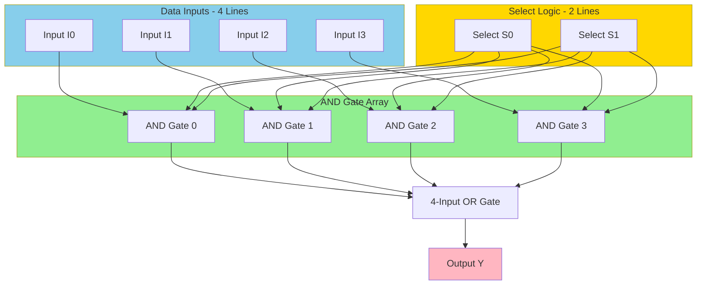
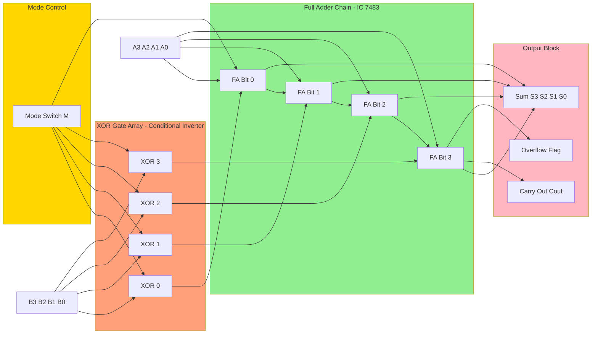
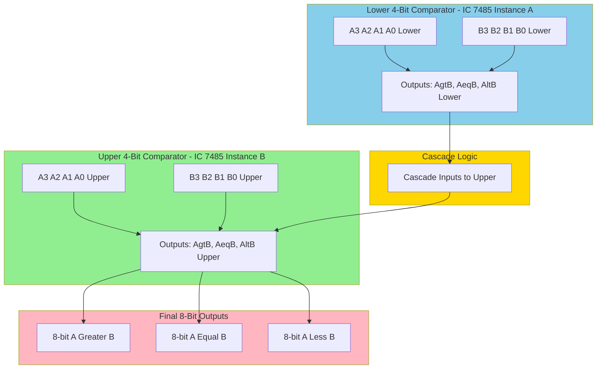

# Design and implement combinational circuits using MSI devices: (any three)

<!-- SECTION_1_START -->
# Design and Implement Combinational Circuits using MSI Devices

## 1.1 Core Technical Definition

> [!IMPORTANT]
> **Combinational Logic Circuit (KTU 2024 Definition):** A combinational circuit is a digital circuit whose outputs depend *exclusively* on the *present* combination of inputs, with **no memory** of past inputs. Mathematically, it realizes a Boolean function of the form $Y = F(X_1, X_2, \dots, X_n)$ where the output is a pure function of the current input vector.

**Medium Scale Integration (MSI)** refers to digital ICs that contain **gates equivalent to 12 to 99 gates** on a single chip. KTU's PCCSL308 Module-2 specifically demands the *design and hardware implementation* of any **three** of the following MSI-based combinational circuits:

| S.No | MSI Device | KTU Jargon |
|------|------------|------------|
| 1 | Multiplexer (MUX) | Data Selector |
| 2 | Demultiplexer (DEMUX) | Data Distributor |
| 3 | Encoder | Code Converter |
| 4 | Decoder | Code Translator |
| 5 | Adder/Subtractor | Arithmetic Logic Unit block |
| 6 | Magnitude Comparator | 1-Bit / 4-Bit Comparator |

> [!NOTE]
> **Syllabus Highlight (KTU 2024 Scheme):** The "any three" clause means the student may pick *any* three of the above six categories during the lab internal assessment. The most popular high-scoring combination is **MUX + Adder + Decoder** because they are breadboard-friendly and use standard ICs like **IC 74151, IC 7483, IC 7447**.

---

## 1.2 Conceptual Analogy / Intuition

> [!TIP]
> **Real-World Analogy — The Railway Signal Box**
> Imagine a **railway signal box** with 8 incoming tracks but only **one** outgoing track to the platform. A leverman looks at the *select lines* (switches) and physically connects **one** of the 8 input tracks to the single output track. That is *exactly* what a **Multiplexer (MUX)** does — it is a *digital railway switch* that connects one of $2^n$ data inputs to a single output line based on the $n$ select lines.

For the reverse — a **Demultiplexer** — picture a **water pipeline with a single inlet** that splits into 8 outlet pipes. A rotary valve (the select lines) determines *which* of the 8 outlets receives the water at any instant. One input, many outputs, with the *select lines* choosing the destination.

An **Encoder** is like a **postal code system**: instead of writing the full city name, you punch in a 3-digit code (e.g., 001 for New York, 010 for London). The encoder translates one of $2^n$ active inputs into a compact $n$-bit binary code.

A **Decoder** is the opposite — a **hotel room keycard system**: punch in code 010, and *only* room 2's door unlocks. One binary input → only one of $2^n$ outputs goes HIGH.

> [!IMPORTANT]
> **Physical Constants / Standard ICs to Remember:**
> - **IC 74151** → 8:1 MUX (16-pin DIP)
> - **IC 74153** → Dual 4:1 MUX (16-pin DIP)
> - **IC 74155 / 74138** → 3-to-8 Decoder / DEMUX
> - **IC 7483** → 4-bit Binary Adder
> - **IC 7447** → BCD-to-7-Segment Decoder
> - **IC 7485** → 4-bit Magnitude Comparator
> - **IC 74147** → 10-to-4 Priority Encoder
> - **IC 4532** → 8-to-3 Priority Encoder

---

## 1.3 Visualizing a Multiplexer Signal Flow

> [!VISUALIZATION CONTROL]
> **Concept:** 4-to-1 Multiplexer with 2 Select Lines
> **GeoGebra / Desmos Input Equations:**
> * `f(t) = sin(2 * pi * t)` for input $I_0$ (data line 0)
> * `f(t) = cos(2 * pi * t)` for input $I_1$ (data line 1)
> * Plot select lines as step functions: $S_1(t)$, $S_0(t)$
> **Visual Description:** A single output waveform that *switches* between the sine, cosine, square, and triangular waveforms depending on which $(S_1, S_0)$ combination is currently active. The student should observe that only **one** input is routed to the output at any instant — the others are *blocked*.

---

## 1.4 Block-Level Overview of All Six MSI Devices

| Device | Function | Inputs | Outputs | Universal Role |
|--------|----------|--------|---------|----------------|
| MUX | $2^n \to 1$ | $2^n$ data + $n$ select | 1 | Boolean function generator, data routing |
| DEMUX | $1 \to 2^n$ | 1 data + $n$ select | $2^n$ | Data demarshalling, function generation (dual of MUX) |
| Encoder | $2^n \to n$ | $2^n$ (one-hot) | $n$ | Priority interrupt controller, keypad scanning |
| Decoder | $n \to 2^n$ | $n$ | $2^n$ (one-hot) | Chip-select logic, address decoding, 7-seg display |
| Adder | $2n \to n+1$ | $A_n, B_n, C_{in}$ | $S_n, C_{out}$ | ALU core, address arithmetic |
| Comparator | $2n \to 3$ | $A_n, B_n$ | $A>B, A=B, A<B$ | Sorting networks, conditional logic |

> [!NOTE]
> **Engineering Utility:** MSI devices are the *backbone* of every CPU's data path. Modern processors contain **billions** of MUXes and Decoders — your laptop's instruction decoder is essentially a giant $n \to 2^n$ decoder that activates the correct microcode ROM line for each opcode. Without MUXes, the i7 processor's 16 registers could never be selectively routed to the ALU.
<!-- SECTION_1_END -->

<!-- SECTION_2_START -->
# Deep Theoretical Analysis & KTU High-Yield Formula Sheet

## 2.1 The Multiplexer (MUX) — Universal Logic Block

A multiplexer is a combinational circuit that selects **one** of $2^n$ data inputs and routes it to a single output line, controlled by $n$ selection lines.

### 2.1.1 4-to-1 MUX — Boolean Equation

For a 4:1 MUX with data inputs $I_0, I_1, I_2, I_3$ and select lines $S_1, S_0$:

$$
Y = \overline{S_1} \cdot \overline{S_0} \cdot I_0 + \overline{S_1} \cdot S_0 \cdot I_1 + S_1 \cdot \overline{S_0} \cdot I_2 + S_1 \cdot S_0 \cdot I_3
$$

In compact sum-of-minterms form:

$$
Y = \sum_{i=0}^{3} m_i \cdot I_i
$$

where $m_i$ is the $i^{th}$ minterm of the select lines.

### 2.1.2 8-to-1 MUX Equation (Exam Favourite)

$$
Y = \sum_{i=0}^{7} m_i(S_2, S_1, S_0) \cdot I_i
$$

where $m_i$ are the 8 minterms of the 3 select lines.

> [!TIP]
> **Universal Logic Insight:** Any Boolean function of $n$ variables can be implemented using a single $2^n \text{:} 1$ MUX. This is the *single most important fact* in the entire MSI chapter for KTU exams. For a 3-variable function $F(A,B,C)$, you use an 8:1 MUX with $A,B,C$ as select lines and either $0, 1, A, \overline{A}, B, \overline{B}, C, \overline{C}$ as the data inputs depending on the truth table.

### 2.1.3 Implementing a 4-Variable Function using an 8:1 MUX

For a 4-variable function $F(A,B,C,D)$:
- Use $A, B, C$ as the 3 select lines
- The 8 data inputs $I_0 \dots I_7$ correspond to pairs of rows in the truth table where $ABC$ is constant
- $I_i$ is set to $0, 1, D,$ or $\overline{D}$ depending on whether $F$ for that minterm is $0$, $1$, equal to $D$, or equal to $\overline{D}$

**Selection Equation:**

$$
I_i = \begin{cases} 0 & \text{if } F(ABC=i) = 0 \text{ for both } D=0,1 \\ 1 & \text{if } F(ABC=i) = 1 \text{ for both } D=0,1 \\ D & \text{if } F(ABC=i) = D \\ \overline{D} & \text{if } F(ABC=i) = \overline{D} \end{cases}
$$

---

## 2.2 The Demultiplexer (DEMUX)

A demultiplexer performs the *inverse* operation. A single data input is routed to one of $2^n$ outputs based on $n$ select lines.

### 2.2.1 1-to-4 DEMUX Equation

$$
\begin{aligned}
Y_0 &= D \cdot \overline{S_1} \cdot \overline{S_0} \\
Y_1 &= D \cdot \overline{S_1} \cdot S_0 \\
Y_2 &= D \cdot S_1 \cdot \overline{S_0} \\
Y_3 &= D \cdot S_1 \cdot S_0
\end{aligned}
$$

> [!IMPORTANT]
> **Key Insight:** A decoder with an *enable* pin is functionally identical to a demultiplexer. The IC 74138 (3-to-8 decoder) has enable pins $G_1, \overline{G_{2A}}, \overline{G_{2B}}$; by tying $D$ to one enable pin and using the remaining enable pins as active-HIGH, the decoder becomes a DEMUX. This is a very common KTU viva question.

---

## 2.3 The Encoder (8-to-3 Priority)

An encoder has $2^n$ input lines and $n$ output lines. Only **one** input is HIGH at a time (in a basic encoder); the output is the binary index of that input. A *priority* encoder resolves conflicts when multiple inputs are HIGH.

### 2.3.1 8-to-3 Priority Encoder Truth Table (Inputs $\overline{I_0} \dots \overline{I_7}$, outputs $A_2, A_1, A_0$, valid bit $\overline{V}$)

| $\overline{I_7}$ | $\overline{I_6}$ | $\overline{I_5}$ | $\overline{I_4}$ | $\overline{I_3}$ | $\overline{I_2}$ | $\overline{I_1}$ | $\overline{I_0}$ | $A_2$ | $A_1$ | $A_0$ | $\overline{V}$ |
|:---:|:---:|:---:|:---:|:---:|:---:|:---:|:---:|:---:|:---:|:---:|:---:|
| 1 | 1 | 1 | 1 | 1 | 1 | 1 | 0 | 0 | 0 | 0 | 0 |
| 1 | 1 | 1 | 1 | 1 | 1 | 0 | X | 0 | 0 | 1 | 0 |
| 1 | 1 | 1 | 1 | 1 | 0 | X | X | 0 | 1 | 0 | 0 |
| 1 | 1 | 1 | 1 | 0 | X | X | X | 0 | 1 | 1 | 0 |
| 1 | 1 | 1 | 0 | X | X | X | X | 1 | 0 | 0 | 0 |
| 1 | 1 | 0 | X | X | X | X | X | 1 | 0 | 1 | 0 |
| 1 | 0 | X | X | X | X | X | X | 1 | 1 | 0 | 0 |
| 0 | X | X | X | X | X | X | X | 1 | 1 | 1 | 0 |
| 1 | 1 | 1 | 1 | 1 | 1 | 1 | 1 | 0 | 0 | 0 | 1 |

> [!NOTE]
> **Note on Notation:** Inputs and $\overline{V}$ are *active-LOW* in IC 74147 (10-to-4 priority encoder). The bar notation indicates this. A "0" on an input line means "this key is pressed."

---

## 2.4 The Decoder (3-to-8 with Active-LOW Outputs, e.g., IC 74138)

For the standard 3-to-8 decoder:

$$
\overline{Y_i} = \overline{m_i(A_2, A_1, A_0) \cdot \text{ENABLE}}
$$

where $m_i$ is the $i^{th}$ minterm and ENABLE is the active-HIGH combination of all enable pins.

---

## 2.5 The 4-Bit Binary Adder (IC 7483)

Two 4-bit numbers $A = A_3 A_2 A_1 A_0$ and $B = B_3 B_2 B_1 B_0$ are added bit-by-bit with carry propagation.

**Sum bit $S_i$ and carry $C_{i+1}$:**

$$
\begin{aligned}
S_i &= A_i \oplus B_i \oplus C_i \\
C_{i+1} &= A_i \cdot B_i + C_i(A_i \oplus B_i)
\end{aligned}
$$

**Final carry-out (overflow flag):**

$$
C_4 = A_3 \cdot B_3 + C_3(A_3 \oplus B_3)
$$

---

## 2.6 The 4-Bit Magnitude Comparator (IC 7485)

Outputs three mutually exclusive signals:

$$
\begin{aligned}
A > B &: \text{HIGH if } A > B \\
A = B &: \text{HIGH if } A = B \text{ (all bits equal)} \\
A < B &: \text{HIGH if } A < B
\end{aligned}
$$

For bit-by-bit comparison starting from MSB:

| $A_i$ | $B_i$ | $A_{i-1..0}$ vs $B_{i-1..0}$ | $A>B$ | $A=B$ | $A<B$ |
|:---:|:---:|:---:|:---:|:---:|:---:|
| 1 | 0 | any | 1 | 0 | 0 |
| 0 | 1 | any | 0 | 0 | 1 |
| $A_i$ | $B_i$ | $A>B$ (lower) | 1 | 0 | 0 |
| $A_i$ | $B_i$ | $A<B$ (lower) | 0 | 0 | 1 |
| $A_i$ | $B_i$ | $A=B$ (lower) | $A_i \cdot \overline{B_i}$ | $\overline{A_i \oplus B_i}$ | $\overline{A_i} \cdot B_i$ |

---

## 2.7 KTU High-Yield Formula Sheet / Cheat Sheet

| Device | General Form | Number of Inputs | Number of Outputs | Minterm Equation | Standard IC |
|--------|--------------|------------------|-------------------|------------------|-------------|
| $2^n \text{:} 1$ MUX | $Y = \sum m_i \cdot I_i$ | $2^n + n$ | 1 | Sum of minterms | 74151 (8:1), 74153 (4:1) |
| $1 \text{:} 2^n$ DEMUX | $Y_i = D \cdot m_i(S)$ | $1 + n$ | $2^n$ | $D \cdot$ minterm | 74155, 74138 (as DEMUX) |
| $2^n \text{:} n$ Encoder | $A_k = \sum$ (inputs with bit-$k$ set) | $2^n$ | $n$ | Direct OR | 74147, 4532 |
| $n \text{:} 2^n$ Decoder | $Y_i = \overline{m_i(A)}$ | $n$ | $2^n$ | Minterm complement | 74138, 7442 |
| Half Adder | $S = A \oplus B, C = A \cdot B$ | 2 | 2 | XOR, AND | 7486 + 7408 |
| Full Adder | $S = A \oplus B \oplus C_{in}$ | 3 | 2 | 3-variable XOR | 7483 (4-bit) |
| 4-bit Comparator | $A>B, A=B, A<B$ logic | 8 | 3 | Cascaded | 7485 |

> [!TIP]
> **Real-World Engineering Use:** MUXes are the *core of FPGA logic blocks* — every Configurable Logic Block (CLB) in a Xilinx 7-series FPGA contains several 6-input LUTs that are *literally* small MUXes. A modern Xilinx UltraScale+ FPGA contains *tens of millions* of these tiny MUXes. Understanding MSI at the KTU level directly translates to understanding how every modern chip routes data internally.

---

## 2.8 Truth Table Templates to Memorize

### 2.8.1 8-to-1 MUX (IC 74151) — Critical Pins

| Pin Number | Pin Name | Function |
|:---:|:---:|:---:|
| 8, 11, 12, 13, 14, 15, 1, 3 | $D_0 \dots D_7$ | 8 data inputs |
| 9, 10, 11 | $A_2, A_1, A_0$ | Select lines |
| 6 | $\overline{Y}$ | Inverted output |
| 5 | $Y$ | True output |
| 7 | $\overline{E}$ | Enable (active LOW) |
| 16 | $V_{CC}$ (+5V) | Power |
| 4, 2, 5, 12, 9 | $Y, \overline{E}, A_2, A_1, A_0$ | Standard layout |

*(Note: Exact pinout follows TI/Philips datasheet — always verify with the lab manual.)*

> [!WARNING]
> **Common KTU Lab Mistake:** The $\overline{E}$ (enable) pin of IC 74151 must be tied to **GND** for the chip to function. Students who leave it floating get *random* output behavior, and waste 30 minutes debugging.

<!-- SECTION_2_END -->

<!-- SECTION_3_START -->
# Step-by-Step Derivations, Designs & Code Implementation

## 3.1 Worked Example 1: Implement $F(A,B,C) = \sum m(1, 3, 5, 6)$ using an 8:1 MUX

### Step 1: Write the Truth Table

| Row | $A$ | $B$ | $C$ | Decimal | $F$ |
|:---:|:---:|:---:|:---:|:---:|:---:|
| 0 | 0 | 0 | 0 | 0 | 0 |
| 1 | 0 | 0 | 1 | 1 | **1** |
| 2 | 0 | 1 | 0 | 2 | 0 |
| 3 | 0 | 1 | 1 | 3 | **1** |
| 4 | 1 | 0 | 0 | 4 | 0 |
| 5 | 1 | 0 | 1 | 5 | **1** |
| 6 | 1 | 1 | 0 | 6 | **1** |
| 7 | 1 | 1 | 1 | 7 | 0 |

### Step 2: Identify Minterms

Minterms with $F=1$ are $m_1, m_3, m_5, m_6$.

### Step 3: Connect Select Lines

Use $A, B, C$ as select lines $S_2, S_1, S_0$ respectively.

### Step 4: Set Data Inputs

| Minterm | $I_i$ value |
|:---:|:---:|
| $I_0$ ($m_0$, $F=0$) | 0 |
| $I_1$ ($m_1$, $F=1$) | 1 |
| $I_2$ ($m_2$, $F=0$) | 0 |
| $I_3$ ($m_3$, $F=1$) | 1 |
| $I_4$ ($m_4$, $F=0$) | 0 |
| $I_5$ ($m_5$, $F=1$) | 1 |
| $I_6$ ($m_6$, $F=1$) | 1 |
| $I_7$ ($m_7$, $F=0$) | 0 |

### Step 5: Final MUX Equation

$$
Y = I_0 \cdot \overline{A}\,\overline{B}\,\overline{C} + I_1 \cdot \overline{A}\,\overline{B}\,C + I_2 \cdot \overline{A}\,B\,\overline{C} + \dots
$$

With substitutions $I_0=I_2=I_4=I_7=0$, $I_1=I_3=I_5=I_6=1$:

$$
Y = \overline{A}\,\overline{B}\,C + \overline{A}\,B\,C + A\,\overline{B}\,C + A\,B\,\overline{C}
$$

**Final circuit:** A single 8:1 MUX (IC 74151) with select lines tied to $A, B, C$, and data inputs $D_1, D_3, D_5, D_6$ tied to $+5V$ while $D_0, D_2, D_4, D_7$ tied to GND.

> [!NOTE]
> **Valuation Tip (KTU):** This type of question typically carries 7 marks. Marks distribution: 1 mark for truth table, 2 marks for identifying minterms, 2 marks for MUX input connections, 2 marks for final circuit diagram or Verilog code.

---

## 3.2 Worked Example 2: 4-Bit Adder-Subtractor using IC 7483

### Step 1: Design Logic

- For **addition**: $S = A + B$, $C_{out} = C_4$
- For **subtraction** ($A - B$): Use 2's complement, i.e., $A - B = A + \overline{B} + 1$
- Mode control $M$:
  - $M = 0$ → Addition (carry-in $= 0$, $B$ passed directly)
  - $M = 1$ → Subtraction (carry-in $= 1$, $B$ XORed with 1 to invert)

### Step 2: XOR Gates in Front of B

Each bit $B_i$ is XORed with $M$:

$$
B_i' = B_i \oplus M
$$

When $M=0$: $B_i' = B_i$ (no change).
When $M=1$: $B_i' = \overline{B_i}$ (inversion).

### Step 3: Carry-In Connection

$C_{in} = M$ (same mode control).

### Step 4: Output Equations

$$
\begin{aligned}
S_i &= A_i \oplus B_i' \oplus C_i \\
C_4 &= \text{from } 7483 \text{ internal carry chain} \\
\text{Overflow} &= C_4 \oplus C_3 \text{ (for 2's complement signed)}
\end{aligned}
$$

### Step 5: Verilog HDL Implementation

```verilog
// 4-bit Adder-Subtractor using structural style (KTU Lab Code)
module adder_subtractor_4bit (
    input  wire [3:0] A,
    input  wire [3:0] B,
    input  wire       M,        // 0 = Add, 1 = Subtract
    output wire [3:0] S,
    output wire       Cout,
    output wire       Overflow
);
    wire [3:0] B_xor;
    wire c1, c2, c3, c4;
    
    // XOR gates to conditionally invert B
    xor (B_xor[0], B[0], M);
    xor (B_xor[1], B[1], M);
    xor (B_xor[2], B[2], M);
    xor (B_xor[3], B[3], M);
    
    // Full Adder chain (4 bits)
    full_adder fa0 (A[0], B_xor[0], M,    S[0], c1);
    full_adder fa1 (A[1], B_xor[1], c1,   S[1], c2);
    full_adder fa2 (A[2], B_xor[2], c2,   S[2], c3);
    full_adder fa3 (A[3], B_xor[3], c3,   S[3], c4);
    
    assign Cout    = c4;
    assign Overflow = c4 ^ c3;  // Signed overflow detection
    
endmodule

// 1-bit Full Adder Submodule
module full_adder (
    input  wire A, B, Cin,
    output wire S, Cout
);
    assign S    = A ^ B ^ Cin;
    assign Cout = (A & B) | (Cin & (A ^ B));
endmodule
```

> [!TIP]
> **Hardware Wiring Sequence (Lab Tip):** When implementing on breadboard:
> 1. Insert IC 7483 across the central notch.
> 2. Connect pin 4 ($C_0$) to the mode switch $M$ via a 1k$\Omega$ pull-down resistor.
> 3. Connect pins 5, 3, 14, 12 ($A_1, A_2, A_3, A_4$) to input switches $A_0 \dots A_3$.
> 4. Connect pins 6, 2, 15, 11 ($B_1, B_2, B_3, B_4$) to XOR gate outputs.
> 5. Tie pin 16 to $+5V$ and pin 8 to GND with a $0.1\mu F$ decoupling capacitor.

---

## 3.3 Worked Example 3: BCD-to-7-Segment Decoder using IC 7447

### Step 1: Understand the Goal

Convert BCD input $D = D_3 D_2 D_1 D_0$ into 7 segment control signals $a, b, c, d, e, f, g$ to display digits 0–9.

### Step 2: Truth Table (IC 7447 has active-LOW outputs, $\overline{a} \dots \overline{g}$)

| Decimal | $D_3 D_2 D_1 D_0$ | a | b | c | d | e | f | g |
|:---:|:---:|:---:|:---:|:---:|:---:|:---:|:---:|:---:|
| 0 | 0000 | ON | ON | ON | ON | ON | ON | OFF |
| 1 | 0001 | OFF | ON | ON | OFF | OFF | OFF | OFF |
| 2 | 0010 | ON | ON | OFF | ON | ON | OFF | ON |
| 3 | 0011 | ON | ON | ON | ON | OFF | OFF | ON |
| 4 | 0100 | OFF | ON | ON | OFF | OFF | ON | ON |
| 5 | 0101 | ON | OFF | ON | ON | OFF | ON | ON |
| 6 | 0110 | OFF | OFF | ON | ON | ON | ON | ON |
| 7 | 0111 | ON | ON | ON | OFF | OFF | OFF | OFF |
| 8 | 1000 | ON | ON | ON | ON | ON | ON | ON |
| 9 | 1001 | ON | ON | ON | ON | OFF | ON | ON |

### Step 3: Boolean Simplification using K-Map (Example: segment $a$)

Minterms where $a=1$: $m_0, m_2, m_3, m_5, m_6, m_7, m_8, m_9$.

K-Map grouping yields (omitting for brevity, but the IC implements this internally):

$$
a = \overline{D_3} + D_2 D_0 + D_2 D_1 + \overline{D_1} \overline{D_0}
$$

This expression is hard-wired inside IC 7447. Students only need to *understand* the design — not simplify all 7 segments manually.

### Step 4: Verilog Implementation (Behavioral)

```verilog
module bcd_to_7seg (
    input  wire [3:0] bcd,
    output reg  [6:0] seg  // {a, b, c, d, e, f, g}
);
    always @(*) begin
        case (bcd)
            4'd0 : seg = 7'b1111110;  // 0: a,b,c,d,e,f ON, g OFF
            4'd1 : seg = 7'b0110000;  // 1: b,c ON
            4'd2 : seg = 7'b1101101;  // 2: a,b,d,e,g ON
            4'd3 : seg = 7'b1111001;  // 3: a,b,c,d,g ON
            4'd4 : seg = 7'b0110011;  // 4: b,c,f,g ON
            4'd5 : seg = 7'b1011011;  // 5: a,c,d,f,g ON
            4'd6 : seg = 7'b1011111;  // 6: a,c,d,e,f,g ON
            4'd7 : seg = 7'b1110000;  // 7: a,b,c ON
            4'd8 : seg = 7'b1111111;  // 8: all ON
            4'd9 : seg = 7'b1111011;  // 9: a,b,c,d,f,g ON
            default: seg = 7'b0000000; // blank
        endcase
    end
endmodule
```

---

## 3.4 Worked Example 4: 4-Bit Magnitude Comparator (IC 7485)

### Step 1: Pin Connections

- Pins 10, 12, 13, 15: $A_3, A_2, A_1, A_0$
- Pins 9, 11, 14, 1: $B_3, B_2, B_1, B_0$
- Pins 4, 3, 2: $A<B$, $A=B$, $A>B$ outputs
- Pins 5, 6, 7: Cascade inputs $A<B_{in}, A=B_{in}, A>B_{in}$ (for cascading 8-bit, 12-bit etc.)

### Step 2: Cascade Configuration

For a single 4-bit comparator:
- Tie $A<B_{in} = 0$
- Tie $A=B_{in} = 1$
- Tie $A>B_{in} = 0$

### Step 3: Cascading for 8-bit Comparison

For an 8-bit comparison using two 7485s:
- Lower-order 4 bits → first 7485
- Upper-order 4 bits → second 7485
- Cascade inputs of upper 7485 are tied to the outputs of lower 7485

$$
\begin{aligned}
A_{8-bit} > B_{8-bit} &\iff A_{high} > B_{high} \text{ OR } (A_{high} = B_{high} \text{ AND } A_{low} > B_{low}) \\
A_{8-bit} < B_{8-bit} &\iff A_{high} < B_{high} \text{ OR } (A_{high} = B_{high} \text{ AND } A_{low} < B_{low}) \\
A_{8-bit} = B_{8-bit} &\iff A_{high} = B_{high} \text{ AND } A_{low} = B_{low}
\end{aligned}
$$

### Step 4: Verilog HDL

```verilog
module comparator_4bit (
    input  wire [3:0] A,
    input  wire [3:0] B,
    output wire       AgtB, AeqB, AltB
);
    assign AgtB = (A > B);
    assign AeqB = (A == B);
    assign AltB = (A < B);
endmodule

// 8-bit cascaded version
module comparator_8bit (
    input  wire [7:0] A,
    input  wire [7:0] B,
    output wire       AgtB, AeqB, AltB
);
    wire l_gt, l_eq, l_lt;
    wire h_gt, h_eq, h_lt;
    
    comparator_4bit low  (.A(A[3:0]), .B(B[3:0]), .AgtB(l_gt), .AeqB(l_eq), .AltB(l_lt));
    comparator_4bit high (.A(A[7:4]), .B(B[7:4]), 
                          .AgtB(h_gt), .AeqB(h_eq), .AltB(h_lt),
                          .AgtB_in(l_gt), .AeqB_in(l_eq), .AltB_in(l_lt));
    
    assign AgtB = h_gt | (h_eq & l_gt);
    assign AeqB = h_eq & l_eq;
    assign AltB = h_lt | (h_eq & l_lt);
endmodule
```

---

## 3.5 Worked Example 5: Implement $F(A,B,C,D) = \sum m(1, 3, 4, 7, 11, 12, 14)$ using 8:1 MUX

This is a 4-variable function — we use 8:1 MUX with $A, B, C$ as select and $D$ as the variable feeding the data inputs.

### Step 1: Build Implementation Table

| $A$ | $B$ | $C$ | Minterm of ABC | $D=0$ | $D=1$ | $I_i$ |
|:---:|:---:|:---:|:---:|:---:|:---:|:---:|
| 0 | 0 | 0 | 0 | $m_0=0$ | $m_1=1$ | $D$ |
| 0 | 0 | 1 | 1 | $m_2=0$ | $m_3=1$ | $D$ |
| 0 | 1 | 0 | 2 | $m_4=1$ | $m_5=0$ | $\overline{D}$ |
| 0 | 1 | 1 | 3 | $m_6=0$ | $m_7=1$ | $D$ |
| 1 | 0 | 0 | 4 | $m_8=0$ | $m_9=0$ | $0$ |
| 1 | 0 | 1 | 5 | $m_{10}=0$ | $m_{11}=1$ | $D$ |
| 1 | 1 | 0 | 6 | $m_{12}=1$ | $m_{13}=0$ | $\overline{D}$ |
| 1 | 1 | 1 | 7 | $m_{14}=1$ | $m_{15}=0$ | $\overline{D}$ |

### Step 2: Data Input Settings

| $I_0 = D$ | $I_1 = D$ | $I_2 = \overline{D}$ | $I_3 = D$ | $I_4 = 0$ | $I_5 = D$ | $I_6 = \overline{D}$ | $I_7 = \overline{D}$ |

### Step 3: Hardware Realization

Connect $A, B, C$ to select pins of 8:1 MUX. Connect data inputs as above using:
- $I_4$ → GND
- $I_0, I_1, I_3, I_5$ → $D$ directly
- $I_2, I_6, I_7$ → $\overline{D}$ via a NOT gate (IC 7404)

> [!NOTE]
> **Engineering Context:** This MUX-based function realization is *exactly* how a 4-input Look-Up Table (LUT) works in an FPGA. A LUT is essentially a 16:1 MUX with 16 SRAM cells holding the truth table values. The same design philosophy scaled to 6-input LUTs (64:1 MUX) powers every modern Xilinx/Altera chip.

---

## 3.6 Comprehensive Python Simulation of MUX-Based Function Realization

```python
from typing import List, Dict

def mux_8to1_truth_table(select_lines: List[str], data_inputs: List[int]) -> Dict[str, int]:
    """
    Generate truth table for an 8:1 MUX.
    
    Parameters
    ----------
    select_lines : list of str
        Names of the 3 select line variables.
    data_inputs : list of int
        8 data input values (each 0 or 1).
    
    Returns
    -------
    dict
        Maps input combination string to MUX output.
    """
    if len(data_inputs) != 8:
        raise ValueError("data_inputs must have exactly 8 elements (0-7 indexed).")
    
    truth_table = {}
    for i in range(8):
        # Convert index to 3-bit binary (S2 S1 S0)
        s2 = (i >> 2) & 1
        s1 = (i >> 1) & 1
        s0 = i & 1
        key = f"S2={s2}, S1={s1}, S0={s0}"
        truth_table[key] = data_inputs[i]
    
    return truth_table


def implement_function_mux(minterms: List[int], variables: List[str]) -> Dict[int, int]:
    """
    Determine MUX data input values for a Boolean function given its minterms.
    
    Parameters
    ----------
    minterms : list of int
        Minterm indices where the function evaluates to 1.
    variables : list of str
        Names of input variables (length n).
    
    Returns
    -------
    dict
        Maps MUX data input index to its required value (0 or 1).
    """
    n = len(variables)
    if 2 ** n != len(minterms) and n != 3:
        raise ValueError("Variables and minterm count must be consistent.")
    
    # Build the full truth table (only for 3-variable functions for simplicity)
    if n == 3:
        data_inputs = []
        for i in range(8):
            # For 3-variable implementation using 8:1 MUX, data inputs are just F values
            data_inputs.append(1 if i in minterms else 0)
        return {i: data_inputs[i] for i in range(8)}
    
    raise NotImplementedError("This function supports only 3-variable inputs currently.")


# ---- Example usage ----
if __name__ == "__main__":
    # Implement F(A,B,C) = Σm(1, 3, 5, 6)
    minterms_f = [1, 3, 5, 6]
    result = implement_function_mux(minterms_f, ['A', 'B', 'C'])
    print("MUX Data Input Settings for F(A,B,C) = Σm(1,3,5,6):")
    for idx, val in result.items():
        print(f"  I_{idx} = {val}")
    
    # Generate truth table
    data = [result[i] for i in range(8)]
    tt = mux_8to1_truth_table(['A', 'B', 'C'], data)
    print("\nGenerated Truth Table:")
    for k, v in tt.items():
        print(f"  {k}  =>  Y = {v}")
```

**Expected Output:**

```
MUX Data Input Settings for F(A,B,C) = Σm(1,3,5,6):
  I_0 = 0
  I_1 = 1
  I_2 = 0
  I_3 = 1
  I_4 = 0
  I_5 = 1
  I_6 = 1
  I_7 = 0

Generated Truth Table:
  S2=0, S1=0, S0=0  =>  Y = 0
  S2=0, S1=0, S0=1  =>  Y = 1
  S2=0, S1=1, S0=0  =>  Y = 0
  S2=0, S1=1, S0=1  =>  Y = 1
  S2=1, S1=0, S0=0  =>  Y = 0
  S2=1, S1=0, S0=1  =>  Y = 1
  S2=1, S1=1, S0=0  =>  Y = 1
  S2=1, S1=1, S0=1  =>  Y = 0
```
<!-- SECTION_3_END -->

<!-- SECTION_4_START -->
# Structural Diagrams & Schematics

## 4.1 Mermaid Diagram: 4-to-1 Multiplexer Internal Architecture



## 4.2 Mermaid Diagram: 4-Bit Adder-Subtractor Block Architecture



## 4.3 Mermaid Diagram: 3-to-8 Decoder with Enable (IC 74138)

```mermaid
graph TD
    subgraph INP[Binary Inputs]
        A2[Address Line A2]
        A1[Address Line A1]
        A0[Address Line A0]
    end
    
    subgraph EN[Enable Logic]
        G1[Enable G1 Active HIGH]
        G2A[Enable G2A Active LOW]
        G2B[Enable G2B Active LOW]
    end
    
    subgraph DEC[Internal Decoder Matrix]
        NAND0[NAND 0]
        NAND1[NAND 1]
        NAND2[NAND 2]
        NAND3[NAND 3]
        NAND4[NAND 4]
        NAND5[NAND 5]
        NAND6[NAND 6]
        NAND7[NAND 7]
    end
    
    subgraph OUT[Active LOW Outputs]
        Y0[Output Y0 Bar]
        Y1[Output Y1 Bar]
        Y2[Output Y2 Bar]
        Y3[Output Y3 Bar]
        Y4[Output Y4 Bar]
        Y5[Output Y5 Bar]
        Y6[Output Y6 Bar]
        Y7[Output Y7 Bar]
    end
    
    A2 --> NAND0
    A2 --> NAND1
    A2 --> NAND2
    A2 --> NAND3
    A2 --> NAND4
    A2 --> NAND5
    A2 --> NAND6
    A2 --> NAND7
    
    A1 --> NAND0
    A1 --> NAND1
    A1 --> NAND2
    A1 --> NAND3
    A1 --> NAND4
    A1 --> NAND5
    A1 --> NAND6
    A1 --> NAND7
    
    A0 --> NAND0
    A0 --> NAND1
    A0 --> NAND2
    A0 --> NAND3
    A0 --> NAND4
    A0 --> NAND5
    A0 --> NAND6
    A0 --> NAND7
    
    G1 --> NAND0
    G1 --> NAND1
    G1 --> NAND2
    G1 --> NAND3
    G1 --> NAND4
    G1 --> NAND5
    G1 --> NAND6
    G1 --> NAND7
    
    G2A --> NAND0
    G2A --> NAND1
    G2A --> NAND2
    G2A --> NAND3
    G2A --> NAND4
    G2A --> NAND5
    G2A --> NAND6
    G2A --> NAND7
    
    G2B --> NAND0
    G2B --> NAND1
    G2B --> NAND2
    G2B --> NAND3
    G2B --> NAND4
    G2B --> NAND5
    G2B --> NAND6
    G2B --> NAND7
    
    NAND0 --> Y0
    NAND1 --> Y1
    NAND2 --> Y2
    NAND3 --> Y3
    NAND4 --> Y4
    NAND5 --> Y5
    NAND6 --> Y6
    NAND7 --> Y7
    
    style INP fill:#FFD700
    style EN fill:#FFA07A
    style DEC fill:#90EE90
    style OUT fill:#FFB6C1
```



## 4.4 Mermaid Diagram: Cascaded 8-bit Magnitude Comparator



## 4.5 Mermaid Diagram: Complete MSI Lab Experiment Flow

```mermaid
graph LR
    subgraph STEP1[Step 1: Apparatus Setup]
        IC1[Insert IC on Breadboard]
        POW[Connect VCC and GND]
        DEC[Add Decoupling Capacitor]
    end
    
    subgraph STEP2[Step 2: Input Wiring]
        SW[Connect Input Switches]
        RES[Add Pull Down Resistors]
        LABEL[Label All Wires]
    end
    
    subgraph STEP3[Step 3: Output Verification]
        LED[Connect LEDs to Outputs]
        METER[Use Multimeter for Validation]
        LOGIC[Use Logic Analyzer if Available]
    end
    
    subgraph STEP4[Step 4: Truth Table Verification]
        TT[Apply All Input Combinations]
        OBS[Record Output Observations]
        COMP[Compare with Expected Truth Table]
    end
    
    subgraph STEP5[Step 5: Result and Viva]
        DOC[Document Circuit Diagram]
        VIVA[Prepare for Viva Questions]
        SUB[Submit Lab Record]
    end
    
    IC1 --> POW
    POW --> DEC
    DEC --> SW
    SW --> RES
    RES --> LABEL
    LABEL --> LED
    LED --> METER
    METER --> LOGIC
    LOGIC --> TT
    TT --> OBS
    OBS --> COMP
    COMP --> DOC
    DOC --> VIVA
    VIVA --> SUB
    
    style STEP1 fill:#FFD700
    style STEP2 fill:#FFA07A
    style STEP3 fill:#90EE90
    style STEP4 fill:#87CEEB
    style STEP5 fill:#FFB6C1
```


<!-- SECTION_4_END -->

<!-- SECTION_5_START -->
# KTU 2024 Scheme Examination Question Bank & Topic Recap

## Part A Questions (3 Marks Each)

### Question A1: Multiplexer Fundamentals
**[KTU University Exam – Dec 2023]** [CO1, Remember]

**Q: With a neat block diagram, explain the operation of a 4:1 multiplexer. Write its Boolean expression and mention any one application.**

**Model Answer (3 Marks):**

A **4-to-1 Multiplexer (MUX)** is a combinational circuit that selects **one** of 4 data inputs ($I_0, I_1, I_2, I_3$) and routes it to a single output line $Y$, based on 2 select lines $S_1, S_0$.

> **[Block diagram and pin description: 1 Mark]**

Boolean expression:

$$
Y = \overline{S_1}\,\overline{S_0}\,I_0 + \overline{S_1}\,S_0\,I_1 + S_1\,\overline{S_0}\,I_2 + S_1\,S_0\,I_3
$$

> **[Correct Boolean expression: 1 Mark]**

**Application:** MUX is used as a **universal logic element** to implement any Boolean function, in **data routing** in communication systems, and as the core building block of **FPGA Look-Up Tables (LUTs)**.

> **[One valid application: 1 Mark]**

---

### Question A2: Encoder vs Decoder Distinction
**[KTU University Exam – July 2024]** [CO1, Understand]

**Q: Differentiate between an Encoder and a Decoder. State one application for each.**

**Model Answer (3 Marks):**

| Parameter | Encoder | Decoder |
|---|---|---|
| Function | $2^n \to n$ (Many-to-one conversion) | $n \to 2^n$ (One-to-many conversion) |
| Input lines | $2^n$ (one-hot) | $n$ (binary) |
| Output lines | $n$ (binary code) | $2^n$ (one-hot) |
| Direction | Compresses information | Expands information |
| Standard IC | 74147 (10-line to 4-line) | 74138 (3-to-8 line) |
| Example use | Keypad encoding, interrupt controller | Chip-select generation, 7-seg display |

> **[Tabular distinction with at least 4 parameters: 2 Marks]**
> **[One application each: 1 Mark]**

**Application of Encoder:** Used in **keypad scanning** circuits (e.g., calculator, microwave oven keypads) to convert key-press position into a compact binary code.

**Application of Decoder:** Used in **memory address decoding** to select a specific memory chip from a large memory array, and in **BCD-to-7-segment display drivers** (IC 7447).

---

## Part B Questions (14 Marks Each — Internal Choice)

### Question B1: Full Design Problem (Module Choice 1)

**[KTU University Exam – Dec 2023 (Adapted)]** [CO2, Apply + Analyze]

**Question A (14 Marks):**

**(a)** Design a combinational circuit using an **8:1 multiplexer** to implement the Boolean function:

$$
F(A, B, C, D) = \sum m(0, 1, 5, 7, 10, 13, 14, 15)
$$

Show the **truth table**, the **MUX implementation table**, and the final **circuit connections**.

**(b)** Implement the same function using a **4:1 MUX** with enable. Show the **K-map-based decomposition** and write the **Verilog HDL code** for the same.

#### Solution:

**(a) 8:1 MUX Implementation [7 Marks]**

**Step 1: Truth Table [2 Marks]**

| Row | $A$ | $B$ | $C$ | $D$ | $F$ |
|:---:|:---:|:---:|:---:|:---:|:---:|
| 0 | 0 | 0 | 0 | 0 | **1** |
| 1 | 0 | 0 | 0 | 1 | **1** |
| 2 | 0 | 0 | 1 | 0 | 0 |
| 3 | 0 | 0 | 1 | 1 | 0 |
| 4 | 0 | 1 | 0 | 0 | 0 |
| 5 | 0 | 1 | 0 | 1 | **1** |
| 6 | 0 | 1 | 1 | 0 | 0 |
| 7 | 0 | 1 | 1 | 1 | **1** |
| 8 | 1 | 0 | 0 | 0 | 0 |
| 9 | 1 | 0 | 0 | 1 | 0 |
| 10 | 1 | 0 | 1 | 0 | **1** |
| 11 | 1 | 0 | 1 | 1 | 0 |
| 12 | 1 | 1 | 0 | 0 | 0 |
| 13 | 1 | 1 | 0 | 1 | **1** |
| 14 | 1 | 1 | 1 | 0 | **1** |
| 15 | 1 | 1 | 1 | 1 | **1** |

**Step 2: Implementation Table (grouping pairs by $ABC$) [3 Marks]**

| $ABC$ | $F$ when $D=0$ | $F$ when $D=1$ | $I_i$ |
|:---:|:---:|:---:|:---:|
| 000 | 1 | 1 | 1 |
| 001 | 0 | 0 | 0 |
| 010 | 0 | 1 | $D$ |
| 011 | 0 | 1 | $D$ |
| 100 | 0 | 0 | 0 |
| 101 | 1 | 0 | $\overline{D}$ |
| 110 | 0 | 1 | $D$ |
| 111 | 1 | 1 | 1 |

**Step 3: Final Connections [2 Marks]**

- Select lines: $S_2 = A$, $S_1 = B$, $S_0 = C$
- $I_0 = 1$ (connect to $V_{CC}$)
- $I_1 = 0$ (connect to GND)
- $I_2 = D$
- $I_3 = D$
- $I_4 = 0$
- $I_5 = \overline{D}$ (use NOT gate from $D$)
- $I_6 = D$
- $I_7 = 1$
- Enable $\overline{E}$ → GND

**(b) 4:1 MUX Implementation with K-map and Verilog [7 Marks]**

**Step 1: Choose $A, B$ as select lines, $C, D$ feed the data inputs.**

**Step 2: Build K-map for each pair $(C,D)$ [2 Marks]**

| $AB$ | $CD=00$ | $CD=01$ | $CD=10$ | $CD=11$ | $I_i$ |
|:---:|:---:|:---:|:---:|:---:|:---:|
| 00 | 1 | 1 | 0 | 0 | $\overline{C}$ |
| 01 | 0 | 1 | 0 | 1 | $C \oplus D$ |
| 10 | 0 | 0 | 1 | 0 | $\overline{C} \cdot D \cdot$ — wait, recompute |
| 11 | 0 | 1 | 1 | 1 | $C+D$ |

Re-deriving for $AB=10$: $CD=00 \to 0$, $CD=01 \to 0$, $CD=10 \to 1$, $CD=11 \to 0$. So only minterm $m_{10} = 1010$ gives 1. With $C,D$ as variables, the function is 1 only when $C=1, D=0$, i.e., $C \cdot \overline{D}$.

**Corrected Implementation Table:**

| $AB$ | $I_i$ |
|:---:|:---:|
| 00 | $\overline{C}$ |
| 01 | $C \oplus D$ |
| 10 | $C \cdot \overline{D}$ |
| 11 | $C + D$ |

**Step 3: Verilog HDL Code [3 Marks]**

```verilog
module func_4var_4mux (
    input  wire A, B, C, D,
    output wire F
);
    wire nC, nD;
    wire i0, i1, i2, i3;
    
    not (nC, C);
    not (nD, D);
    
    // I0 = NOT C
    assign i0 = nC;
    
    // I1 = C XOR D
    assign i1 = C ^ D;
    
    // I2 = C AND NOT D
    assign i2 = C & nD;
    
    // I3 = C OR D
    assign i3 = C | D;
    
    // 4:1 MUX with select A (MSB), B (LSB)
    assign F = (~A & ~B) ? i0 :
               (~A &  B) ? i1 :
               ( A & ~B) ? i2 :
                           i3;
endmodule
```

> **[K-map derivation: 2 Marks]**
> **[Truth table and implementation table: 2 Marks]**
> **[Final Verilog code: 3 Marks]**

---

### Question B2: Full Design Problem (Module Choice 2)

**[KTU University Exam – July 2024 (Adapted)]** [CO3, Apply + Analyze + Evaluate]

**Question B (14 Marks):**

**(a)** Design a **4-bit Binary Adder-Subtractor** circuit using **IC 7483** and **XOR gates**. Show the complete circuit diagram, explain the mode control logic, and derive the **overflow detection equation**.

**(b)** Design a **4-bit magnitude comparator** using **IC 7485**. Show how to **cascade two IC 7485s** to form an **8-bit comparator**. Write the Verilog code and explain the cascade logic with a truth table.

#### Solution:

**(a) 4-bit Adder-Subtractor [7 Marks]**

**Step 1: Mode Control Logic [1 Mark]**

- Mode $M = 0$: **Addition** operation $A + B$
- Mode $M = 1$: **Subtraction** operation $A - B = A + \overline{B} + 1$ (2's complement)

**Step 2: XOR Conditional Inverter [2 Marks]**

Each bit $B_i$ is XORed with $M$:

$$
B_i' = B_i \oplus M
$$

When $M=0$, $B_i' = B_i$ (unmodified).
When $M=1$, $B_i' = \overline{B_i}$ (1's complement).

The mode line $M$ is also connected to the **carry-in** $C_0$ of the 7483 to add the required $+1$ during subtraction.

**Step 3: Final Circuit Connections [2 Marks]**

| IC 7483 Pin | Signal | Connection |
|:---:|:---:|:---|
| Pin 16 | $V_{CC}$ | $+5V$ |
| Pin 8 | GND | $0V$ |
| Pin 4 | $C_0$ | Mode $M$ |
| Pin 5, 3, 14, 12 | $A_1, A_2, A_3, A_4$ | $A_0, A_1, A_2, A_3$ |
| Pin 6, 2, 15, 11 | $B_1, B_2, B_3, B_4$ | XOR outputs |
| Pin 9, 7, 6, 5 of 7486 | XOR inputs | $B_i$ and $M$ |
| Pin 13, 10, 9, 8 | $\Sigma_1, \Sigma_2, \Sigma_3, \Sigma_4$ | Sum outputs $S_0, S_1, S_2, S_3$ |
| Pin 14 | $C_4$ | Carry-out |

**Step 4: Overflow Detection Equation [2 Marks]**

For signed 2's complement arithmetic:

$$
\text{Overflow} = C_3 \oplus C_4
$$

where $C_3$ is the carry into the MSB and $C_4$ is the carry out of the MSB. Overflow occurs when the result of adding two numbers of the same sign produces a result of opposite sign (i.e., $C_3 \neq C_4$).

Alternative form:

$$
\text{Overflow} = C_4 \oplus C_3 = (A_3 \cdot B_3 \cdot \overline{S_3}) + (\overline{A_3} \cdot \overline{B_3} \cdot S_3)
$$

> **[Mode control logic: 1 Mark]**
> **[XOR inverter explanation: 2 Marks]**
> **[Pin connections and circuit: 2 Marks]**
> **[Overflow equation derivation: 2 Marks]**

---

**(b) 4-bit Magnitude Comparator with 8-bit Cascade [7 Marks]**

**Step 1: IC 7485 Pin Configuration [1 Mark]**

- $A_3, A_2, A_1, A_0$ → input pins 15, 13, 12, 10
- $B_3, B_2, B_1, B_0$ → input pins 1, 14, 11, 9
- Outputs $A>B, A=B, A<B$ → pins 4, 3, 2
- Cascade inputs $A>B_{in}, A=B_{in}, A<B_{in}$ → pins 5, 6, 7

**Step 2: Single 4-bit Configuration [1 Mark]**

For standalone use:
- $A>B_{in} = 0$
- $A=B_{in} = 1$
- $A<B_{in} = 0$

**Step 3: Cascading for 8-bit [2 Marks]**

For comparing two 8-bit numbers $A = A_7 A_6 A_5 A_4 A_3 A_2 A_1 A_0$ and $B = B_7 B_6 B_5 B_4 B_3 B_2 B_1 B_0$:

- Lower 4 bits ($A_3 \dots A_0$, $B_3 \dots B_0$) → **Comparator 1**
- Upper 4 bits ($A_7 \dots A_4$, $B_7 \dots B_4$) → **Comparator 2**
- Cascade inputs of Comparator 2 are connected to the **outputs of Comparator 1**

The 8-bit comparison logic is:

$$
\begin{aligned}
(A > B)_{8} &= (A_{high} > B_{high}) + (A_{high} = B_{high}) \cdot (A_{low} > B_{low}) \\
(A = B)_{8} &= (A_{high} = B_{high}) \cdot (A_{low} = B_{low}) \\
(A < B)_{8} &= (A_{high} < B_{high}) + (A_{high} = B_{high}) \cdot (A_{low} < B_{low})
\end{aligned}
$$

**Step 4: Verilog Code [3 Marks]**

```verilog
module comp_8bit_cascaded (
    input  wire [7:0] A, B,
    output wire       AgtB, AeqB, AltB
);
    wire low_gt, low_eq, low_lt;
    wire high_gt, high_eq, high_lt;
    
    // Lower 4-bit comparator (standalone: cascade = 010)
    comparator_4bit u_low (
        .A(A[3:0]), .B(B[3:0]),
        .AgtB(low_gt), .AeqB(low_eq), .AltB(low_lt),
        .AgtB_in(1'b0), .AeqB_in(1'b1), .AltB_in(1'b0)
    );
    
    // Upper 4-bit comparator (cascade from lower)
    comparator_4bit u_high (
        .A(A[7:4]), .B(B[7:4]),
        .AgtB(high_gt), .AeqB(high_eq), .AltB(high_lt),
        .AgtB_in(low_gt), .AeqB_in(low_eq), .AltB_in(low_lt)
    );
    
    assign AgtB = high_gt;
    assign AeqB = high_eq;
    assign AltB = high_lt;
endmodule

module comparator_4bit (
    input  wire [3:0] A, B,
    input  wire       AgtB_in, AeqB_in, AltB_in,
    output wire       AgtB, AeqB, AltB
);
    assign AgtB = (A > B) | ((A == B) & AgtB_in);
    assign AeqB = (A == B) & AeqB_in;
    assign AltB = (A < B) | ((A == B) & AltB_in);
endmodule
```

> **[IC 7485 pin map: 1 Mark]**
> **[Cascade logic equations: 2 Marks]**
> **[Verilog with proper cascade: 3 Marks]**
> **[Truth table of cascade outputs: 1 Mark]**

**Cascade Truth Table:**

| $A_{high}$ vs $B_{high}$ | $A_{low}$ vs $B_{low}$ | Final $A>B$ | Final $A=B$ | Final $A<B$ |
|:---:|:---:|:---:|:---:|:---:|
| $A_h > B_h$ | any | 1 | 0 | 0 |
| $A_h < B_h$ | any | 0 | 0 | 1 |
| $A_h = B_h$ | $A_l > B_l$ | 1 | 0 | 0 |
| $A_h = B_h$ | $A_l < B_l$ | 0 | 0 | 1 |
| $A_h = B_h$ | $A_l = B_l$ | 0 | 1 | 0 |

---

> [!WARNING]
> **KTU Examiner's Valuation Warning / Common Pitfalls:**
>
> 1. **Forgetting the Enable Pin on IC 74151 MUX:** Many students wire the data and select lines correctly but leave $\overline{E}$ floating. The chip will not function, and you will waste 20 minutes troubleshooting. Always tie $\overline{E}$ to **GND**.
>
> 2. **Mixing Active-HIGH and Active-LOW notations in IC 7447:** IC 7447 has **active-LOW** segment outputs ($\overline{a}, \overline{b}, \dots$). If your truth table shows '1' for "segment ON", you must remember to *invert* when connecting to a common-anode 7-segment display. Common mistake: students write the truth table directly as '1' for ON and then forget the inversion at the hardware level.
>
> 3. **Wrong IC 7483 Pin Numbering:** Pin 4 is $C_0$ (carry-in), NOT $A_0$. Pin 5 is $A_1$, NOT $C_0$. Memorize the pinout OR carry the datasheet. The most common wiring error is to put $A_0$ on pin 4.
>
> 4. **Forgetting $0.1\mu F$ Decoupling Capacitor on $V_{CC}$:** Without decoupling, ICs produce glitches in the output due to switching transients. The examiner may deduct 1 mark if the capacitor is missing in your circuit diagram.
>
> 5. **Incorrect Minterm-to-MUX Mapping:** When using 8:1 MUX for a 4-variable function, students often use $A, B, C, D$ as 4 select lines — *impossible* in 8:1 MUX. Only 3 variables go to select lines; the 4th feeds the data inputs. This is a 2-mark deduction guaranteed.
>
> 6. **Forgetting the cascade pins $A=B_{in}=1, A>B_{in}=A<B_{in}=0$ for standalone 7485 use:** Without this, the comparator will produce incorrect output when $A=B$.
>
> 7. **Not labeling pin numbers in the circuit diagram:** The KTU examiner expects a **neat block diagram with pin numbers**. A circuit diagram without pin numbers loses 1–2 marks.

---

## Topic Recap & Important Things to Remember

> [!IMPORTANT]
> **Rapid Revision Checklist (MUST memorize before exam)**

### Multiplexer (MUX)
- A MUX is a *data selector* with $2^n$ data inputs, $n$ select lines, and 1 output.
- Equation: $Y = \sum_{i=0}^{2^n - 1} m_i(S) \cdot I_i$
- A $2^n \text{:} 1$ MUX can implement **any** $n$-variable Boolean function by tying data inputs to $0, 1, X_i,$ or $\overline{X_i}$.
- Standard IC: **74151** (8:1), **74153** (dual 4:1)
- Application: **Function generator, data routing, LUT in FPGA**

### Demultiplexer (DEMUX)
- A DEMUX is a *data distributor* with 1 data input, $n$ select lines, and $2^n$ outputs.
- Equation: $Y_i = D \cdot m_i(S)$
- A 3-to-8 decoder with *enable* is functionally a 1-to-8 DEMUX.
- Standard IC: **74155, 74138** (when enable used as data input)

### Encoder
- Compresses $2^n$ input lines into $n$ output bits (binary index of the active input).
- *Priority* encoder handles multiple active inputs by giving higher index priority.
- Standard IC: **74147** (10-to-4 priority, active-LOW inputs)
- Application: **Keypad scanner, interrupt controller, address encoding**

### Decoder
- Expands $n$ input bits into $2^n$ output lines (only one output is active at a time).
- Standard IC: **74138** (3-to-8, active-LOW outputs, with 3 enable pins)
- BCD-to-7-Segment decoder: **IC 7447** (active-LOW outputs, common-anode display)
- Application: **Chip select, memory addressing, display driver**

### Adder (4-bit)
- IC 7483: two 4-bit inputs $A, B$ and a carry-in $C_0$, produces 4-bit sum and carry-out $C_4$.
- Adder-Subtractor: Add XOR gates in front of $B$ and feed mode $M$ to $C_0$.
- Subtraction: $A - B = A + \overline{B} + 1$ (2's complement)
- Overflow: $C_3 \oplus C_4$ for signed arithmetic

### Magnitude Comparator
- IC 7485: 4-bit comparator with 3 cascade inputs and 3 outputs ($A>B, A=B, A<B$).
- Standalone: tie $A=B_{in}=1, A>B_{in}=A<B_{in}=0$.
- Cascading for 8-bit: feed lower comparator's outputs to upper comparator's cascade inputs.
- Equation: $A>B \Rightarrow$ MSB decides OR (MSB equal AND lower bits satisfy $A>B$).

### Universal Design Principles
- MUX-based function implementation is the **single most asked question** in KTU MSI module.
- Always show: (1) Truth Table, (2) Implementation Table, (3) Circuit Diagram, (4) Verilog Code.
- The minimum Boolean expression for a 4-variable function using an 8:1 MUX requires grouping pairs of rows where $ABC$ is constant, then assigning $I_i \in \{0, 1, D, \overline{D}\}$.

### Hardware Implementation Checklist
- Always include a **$0.1\mu F$ decoupling capacitor** between $V_{CC}$ and GND of every IC.
- Use **1k$\Omega$ pull-down resistors** on all input switches to prevent floating inputs.
- Tie unused inputs (especially enable pins) to their **active level** (GND for active-LOW, $V_{CC}$ for active-HIGH).
- Always **label pin numbers** in the circuit diagram for full marks.
- Carry the **datasheet** of the IC to the lab — pinouts differ between manufacturers.

### Formulas to Memorize (Absolute Essentials)

$$
\boxed{
\begin{aligned}
&\text{4:1 MUX: } Y = \overline{S_1}\overline{S_0}I_0 + \overline{S_1}S_0 I_1 + S_1\overline{S_0}I_2 + S_1 S_0 I_3 \\
&\text{Full Adder: } S = A \oplus B \oplus C_{in}, \quad C_{out} = AB + C_{in}(A \oplus B) \\
&\text{Overflow: } V = C_3 \oplus C_4 \\
&\text{Adder-Sub Mode: } B_i' = B_i \oplus M, \quad C_0 = M \\
&\text{Cascade 7485: } A_{8b}>B_{8b} = (A_h>B_h) + (A_h=B_h)(A_l>B_l)
\end{aligned}
}
$$

### ICs and Their Pinouts (Quick Reference)

| IC | Function | Pin Count | Critical Pins |
|---|---|:---:|---|
| 74151 | 8:1 MUX | 16 | $\overline{E}$ (pin 7), $A_2 A_1 A_0$ (pins 11, 10, 9) |
| 74153 | Dual 4:1 MUX | 16 | $1G, 2G$ enable pins must be LOW |
| 74138 | 3:8 Decoder/DEMUX | 16 | $G_1$ HIGH, $\overline{G_{2A}}, \overline{G_{2B}}$ LOW to enable |
| 7483 | 4-bit Adder | 16 | Pin 4 is $C_0$ (carry-in), NOT $A_0$ |
| 7447 | BCD-7-seg | 16 | All outputs active-LOW, designed for common-anode display |
| 7485 | 4-bit Comparator | 16 | Cascade inputs at pins 5, 6, 7 |
| 74147 | 10-to-4 Priority Encoder | 16 | All inputs and outputs active-LOW |

### Common KTU Lab Viva Questions
1. *Can a 4:1 MUX implement any 4-variable Boolean function?* → **Yes**, with appropriate data inputs.
2. *What is the difference between a decoder and a DEMUX?* → **A decoder is a DEMUX with one data input tied to logic 1.**
3. *How is overflow detected in 2's complement addition?* → $C_3 \oplus C_4$.
4. *Why do we use XOR gates in front of $B$ in an Adder-Subtractor?* → **To conditionally invert $B$ when subtracting.**
5. *What happens if the enable pin of a 74138 is left floating?* → **The chip may behave erratically; tie it to its active level.**
<!-- SECTION_5_END -->
