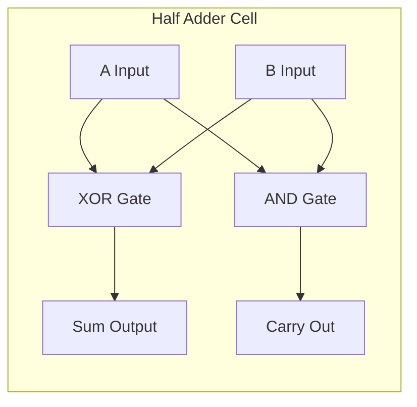
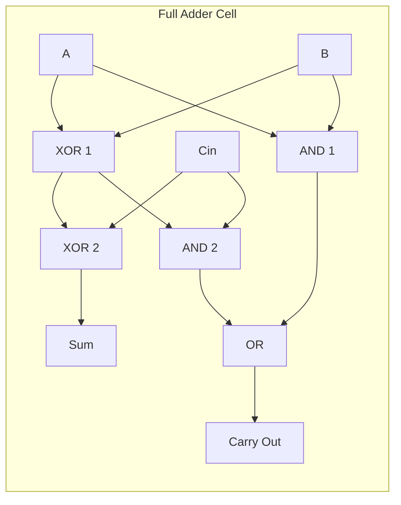
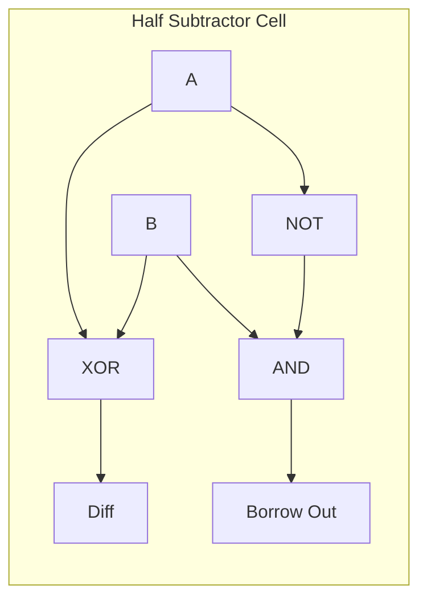
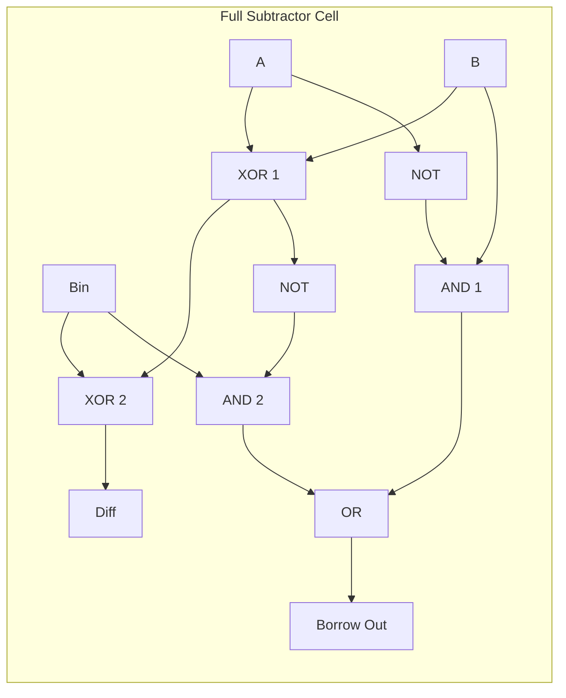
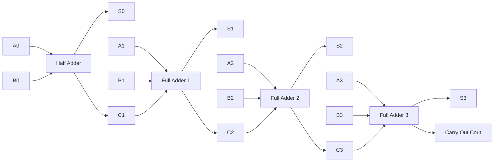

# Half adder, full adder, half subtractor, full subtractor

<!-- SECTION_1_START -->
# Module 2 — Combinational Logic Circuits: Adders & Subtractors

## 1.1 Core Technical Definition

A **combinational logic circuit** is a digital circuit whose output depends *exclusively* on the present combination of its inputs, with no memory of past inputs (no feedback, no storage elements). According to the **KTU 2024 Scheme (PCCSL308 — Digital Lab)** syllabus, the foundational arithmetic building blocks under this category are:

- **Half Adder (HA)** — a 2-input, 2-output combinational circuit that adds two single binary bits.
- **Full Adder (FA)** — a 3-input, 2-output combinational circuit that adds two single bits plus a carry-in from a previous (less significant) stage.
- **Half Subtractor (HS)** — a 2-input, 2-output combinational circuit that subtracts one single bit from another.
- **Full Subtractor (FS)** — a 3-input, 2-output combinational circuit that performs subtraction with a borrow-in.

> [!IMPORTANT]
> **KTU Syllabus Highlight (PCCSL308 — Module 2):**
> "Design and implement combinational logic circuits for arbitrary functions using adder/subtractor, encoder, decoder, multiplexer, and demultiplexer." This note covers the **adder/subtractor** segment completely.

### Conceptual Analogy / Intuition

Think of binary addition the same way you add decimal numbers in primary school — column by column, from right to left, carrying over when the column sum exceeds the base (10 in decimal, **2 in binary**). A *Half Adder* is like adding only the **units column** of two single-digit numbers; if the column sum overflows, you "carry" the overflow to the next column. A *Full Adder* is the same, but it also **accepts a carry coming in** from the previous (right-side) column.

For subtraction, mirror the analogy: when a top digit is smaller than the bottom digit, you "borrow" 1 from the next column to the left — this is the **borrow** signal. Half Subtractor handles the units column; Full Subtractor handles any subsequent column because it must accept an incoming borrow.

> [!NOTE]
> **Why this matters in real engineering:** Every CPU's Arithmetic Logic Unit (ALU) is built from cascades of these exact circuits. The Intel 8086's ALU used a chain of full adders; modern GPUs contain **billions** of full-adder-equivalent gates inside their floating-point units.

### Physical Constants and Standard Metrics

- **Base of binary system:** $b = 2$ (only digits $\{0, 1\}$ allowed).
- **Standard propagation for carry/borrow:** *ripple carry* (worst-case delay grows linearly with the number of cascaded stages).
- **Standard logic levels (TTL):** $V_{IH} \geq 2.0\,\text{V}$ (logic 1), $V_{IL} \leq 0.8\,\text{V}$ (logic 0).

> [!VISUALIZATION CONTROL]
> **Concept:** Visualizing the Sum and Carry/Difference and Borrow outputs as a function of two binary inputs.
> **GeoGebra / Desmos Input Equations (Boolean Algebra as 0/1 plot):**
> * `f(x, y) = x XOR y` → represents **Sum** or **Difference** of a Half circuit.
> * `g(x, y) = x AND y` → represents **Carry** of a Half Adder.
> * `g'(x, y) = (NOT x) AND y` → represents **Borrow** of a Half Subtractor.
> **Visual Description:** Plot points on a discrete $2 \times 2$ grid where $x, y \in \{0, 1\}$. You will see the outputs flip only at the corners where the bit combination produces an overflow (sum $\geq 2$ for add, top-bit $<$ bottom-bit for subtract).

---

<!-- SECTION_1_END -->

<!-- SECTION_2_START -->
# 2. Deep Theoretical Analysis

## 2.1 Half Adder (HA)

**Block Symbol:** Two inputs $A, B$ → two outputs $S$ (Sum) and $C_{\text{out}}$ (Carry).

**Truth Table:**

| $A$ | $B$ | $S$ | $C_{\text{out}}$ |
|---|---|---|---|
| 0 | 0 | 0 | 0 |
| 0 | 1 | 1 | 0 |
| 1 | 0 | 1 | 0 |
| 1 | 1 | 0 | 1 |

**Boolean Equations (derived from the truth table):**

The Sum column matches $A \oplus B$ (XOR), and the Carry column matches $A \cdot B$ (AND). Algebraically:

$$S \;=\; A \oplus B \;=\; A\overline{B} + \overline{A}B$$

$$C_{\text{out}} \;=\; A \cdot B$$

**Gate-level implementation:** one XOR gate for Sum, one AND gate for Carry. Two gates total.

**Real-world utility:** The HA is the smallest arithmetic unit; it is used as the **least-significant-bit (LSB) stage** of any multi-bit adder, since the LSB has no incoming carry.

## 2.2 Full Adder (FA)

**Block Symbol:** Three inputs $A, B, C_{\text{in}}$ → two outputs $S, C_{\text{out}}$.

**Truth Table (8 rows):**

| $A$ | $B$ | $C_{\text{in}}$ | $S$ | $C_{\text{out}}$ |
|---|---|---|---|---|
| 0 | 0 | 0 | 0 | 0 |
| 0 | 0 | 1 | 1 | 0 |
| 0 | 1 | 0 | 1 | 0 |
| 0 | 1 | 1 | 0 | 1 |
| 1 | 0 | 0 | 1 | 0 |
| 1 | 0 | 1 | 0 | 1 |
| 1 | 1 | 0 | 0 | 1 |
| 1 | 1 | 1 | 1 | 1 |

**Boolean Equations (Sum-of-Products from K-map):**

$$S \;=\; A \oplus B \oplus C_{\text{in}}$$

$$C_{\text{out}} \;=\; AB + AC_{\text{in}} + BC_{\text{in}}$$

**Alternative factorization (used in IC design):**

$$C_{\text{out}} \;=\; AB + C_{\text{in}}(A \oplus B)$$

This form is **faster** because the XOR can be shared with the Sum path.

**Gate-level implementation:** Two XOR gates, two AND gates, one OR gate — **five gates total** (or two HA + one OR, structurally). Real ICs like the **74LS283** package four full adders in a single 16-pin chip.

## 2.3 Half Subtractor (HS)

**Block Symbol:** Two inputs $A$ (minuend), $B$ (subtrahend) → two outputs $D$ (Difference) and $B_{\text{out}}$ (Borrow).

**Truth Table:**

| $A$ | $B$ | $D$ | $B_{\text{out}}$ |
|---|---|---|---|
| 0 | 0 | 0 | 0 |
| 0 | 1 | 1 | 1 |
| 1 | 0 | 1 | 0 |
| 1 | 1 | 0 | 0 |

**Boolean Equations:**

$$D \;=\; A \oplus B$$

$$B_{\text{out}} \;=\; \overline{A} \cdot B$$

**Gate-level implementation:** one XOR gate for Difference, one NOT + one AND gate for Borrow — three gates total.

**Real-world utility:** Used as the **LSB stage** of any multi-bit subtractor (no borrow-in at LSB).

## 2.4 Full Subtractor (FS)

**Block Symbol:** Three inputs $A, B, B_{\text{in}}$ → two outputs $D, B_{\text{out}}$.

**Truth Table:**

| $A$ | $B$ | $B_{\text{in}}$ | $D$ | $B_{\text{out}}$ |
|---|---|---|---|---|
| 0 | 0 | 0 | 0 | 0 |
| 0 | 0 | 1 | 1 | 1 |
| 0 | 1 | 0 | 1 | 1 |
| 0 | 1 | 1 | 0 | 1 |
| 1 | 0 | 0 | 1 | 0 |
| 1 | 0 | 1 | 0 | 0 |
| 1 | 1 | 0 | 0 | 0 |
| 1 | 1 | 1 | 1 | 1 |

**Boolean Equations:**

$$D \;=\; A \oplus B \oplus B_{\text{in}}$$

$$B_{\text{out}} \;=\; \overline{A}B + \overline{A}B_{\text{in}} + BB_{\text{in}}$$

**Alternative factorization (mirror of FA):**

$$B_{\text{out}} \;=\; \overline{A}B + B_{\text{in}}(A \oplus B)'$$

Wait — corrected factorization:

$$B_{\text{out}} \;=\; \overline{A}(B + B_{\text{in}}) + BB_{\text{in}}$$

**Gate-level implementation:** Two XOR gates, two AND gates, one OR gate, plus an inverter on $A$ — **six gates** (or two HS + one OR + one NOT).

## 2.5 KTU High-Yield Formula Sheet

| # | Circuit | Sum / Difference | Carry / Borrow Out | Typical Gates | Pin Count |
|---|---|---|---|---|---|
| 1 | Half Adder | $S = A \oplus B$ | $C_{\text{out}} = AB$ | 1 XOR + 1 AND | 4 (2 in + 2 out) |
| 2 | Full Adder | $S = A \oplus B \oplus C_{\text{in}}$ | $C_{\text{out}} = AB + AC_{\text{in}} + BC_{\text{in}}$ | 2 XOR + 2 AND + 1 OR | 5 (3 in + 2 out) |
| 3 | Half Subtractor | $D = A \oplus B$ | $B_{\text{out}} = \overline{A}B$ | 1 XOR + 1 NOT + 1 AND | 4 (2 in + 2 out) |
| 4 | Full Subtractor | $D = A \oplus B \oplus B_{\text{in}}$ | $B_{\text{out}} = \overline{A}B + \overline{A}B_{\text{in}} + BB_{\text{in}}$ | 2 XOR + 2 AND + 1 OR + 1 NOT | 5 (3 in + 2 out) |

> [!IMPORTANT]
> **Engineering utility at scale:** A 32-bit **Ripple Carry Adder (RCA)** is just 1 HA + 31 FA cascaded. A 32-bit subtractor reuses the adder hardware by feeding $B$ through a 32-bit NOT and setting the initial carry-in to **1** (this is the famous *2's complement trick*: $A - B = A + (\overline{B}) + 1$).

---

<!-- SECTION_2_END -->

<!-- SECTION_3_START -->
# 3. Step-by-Step Derivations and Hardware/Code Implementation

## 3.1 K-Map Derivation — Full Adder

The K-map for the Sum output $S(A, B, C_{\text{in}})$ on a $2 \times 2$ grid (rows: $A$, columns: $BC_{\text{in}}$ in Gray code 00, 01, 11, 10) places **1s** at minterms 1, 2, 4, 7. No two 1s are adjacent in a way that forms a 2-cell group covering exactly one variable — each 1 is isolated, so the minimal SOP is the canonical XOR form:

$$S \;=\; A \oplus B \oplus C_{\text{in}}$$

The K-map for the Carry output $C_{\text{out}}$ places 1s at minterms 3, 5, 6, 7. Grouping the 1s yields three overlapping 2-cell pairs:

$$C_{\text{out}} \;=\; AB + AC_{\text{in}} + BC_{\text{in}}$$

The full algebraic grouping on the $A$-axis (rows $A=0, A=1$) and $BC_{\text{in}}$-axis (columns $00, 01, 11, 10$) is shown step by step below.

**Step 1 — Group 1 (left column $BC_{\text{in}}=11$ and column $BC_{\text{in}}=10$ at row $A=1$):** Cells $(A=1, BC_{\text{in}}=11)$ and $(A=1, BC_{\text{in}}=10)$ share $A=1$ and $B=1$, varying $C_{\text{in}}$. This yields the term $AB$.

**Step 2 — Group 2 (cells $(A=1, BC_{\text{in}}=11)$ and $(A=0, BC_{\text{in}}=11)$):** Both cells share $B=1$ and $C_{\text{in}}=1$, varying $A$. This yields $BC_{\text{in}}$.

**Step 3 — Group 3 (cells $(A=1, BC_{\text{in}}=01)$ and $(A=0, BC_{\text{in}}=01)$):** Both share $A=1$ when grouped diagonally across the wrap-around — actually, grouping $(A=1, BC_{\text{in}}=01)$ and $(A=1, BC_{\text{in}}=11)$ gives $AC_{\text{in}}$.

**Step 4 — Union of all prime implicants (no essential simplification is possible, so all three terms remain):**

$$C_{\text{out}} \;=\; AB + AC_{\text{in}} + BC_{\text{in}}$$

## 3.2 K-Map Derivation — Full Subtractor (Borrow Out)

For $B_{\text{out}}(A, B, B_{\text{in}})$, 1s appear at minterms 1, 2, 3, 7 (using Gray code columns $BB_{\text{in}} = 00, 01, 11, 10$).

**Group 1 — Row $A=0$, all four columns:** All four cells in the $A=0$ row where the function is 1. Cells $(A=0, BB_{\text{in}}=01)$, $(A=0, BB_{\text{in}}=11)$, $(A=0, BB_{\text{in}}=10)$ are 1. Grouping the entire $A=0$ row gives $\overline{A}$.

Wait — only three cells are 1 in row $A=0$, but together with the wrap-around, all 1s in $A=0$ are covered by two prime implicants: $\overline{A}B$ (cells $A=0, BB_{\text{in}}=01$ and $A=0, BB_{\text{in}}=11$) and $\overline{A}B_{\text{in}}$ (cells $A=0, BB_{\text{in}}=11$ and $A=0, BB_{\text{in}}=10$).

**Group 2 — Column $BB_{\text{in}}=11$:** Cells $(A=0, BB_{\text{in}}=11)$ and $(A=1, BB_{\text{in}}=11)$ are both 1, yielding $BB_{\text{in}}$.

**Step 3 — Union:**

$$B_{\text{out}} \;=\; \overline{A}B + \overline{A}B_{\text{in}} + BB_{\text{in}}$$

This matches the SOP form of the FA carry equation, with $A$ complemented and $C_{\text{in}}$ replaced by $B_{\text{in}}$.

## 3.3 Logic-Gate Wiring Details (Breadboard Implementation in PCCSL308 Lab)

| Wire | From | To | Wire Color Convention | Safety Check |
|---|---|---|---|---|
| $V_{CC}$ | $+5\,\text{V}$ rail | Pin 14 of 74LS86 / 74LS08 / 74LS32 | Red | Multimeter: $4.75 \text{ V} \leq V_{CC} \leq 5.25\,\text{V}$ |
| GND | Ground rail | Pin 7 of all ICs | Black | Confirm common ground between breadboard rows |
| $A$ | Logic switch SW1 | Pin 1 of 7486 (XOR gate A) | Yellow | LED on switch should reflect bit |
| $B$ | Logic switch SW2 | Pin 4 of 7486 (XOR gate A) | Yellow | LED on switch should reflect bit |
| $C_{\text{in}}$ / $B_{\text{in}}$ | Logic switch SW3 | Pin 1 of next 7486 / Pin 9 of 7408 | Green | Used only for FA / FS |
| Sum / Diff output | 7486 output pin | 330 $\Omega$ resistor → LED | Blue | LED brightness check (1 = ON) |
| Carry / Borrow output | 7432 OR output | 330 $\Omega$ resistor → LED | White | Verify HIGH when expected |

**IC Pin Map (74LS86 Quad XOR, 14-pin DIP):**
- Pin 1: $A$ input gate 1, Pin 2: $B$ input gate 1, Pin 3: $Y$ output gate 1.
- Pin 4: $A$ gate 2, Pin 5: $B$ gate 2, Pin 6: $Y$ gate 2.
- Pin 7: GND, Pin 8: $Y$ gate 3, Pin 9: $B$ gate 3, Pin 10: $A$ gate 3.
- Pin 11: $Y$ gate 4, Pin 12: $B$ gate 4, Pin 13: $A$ gate 4, Pin 14: $V_{CC}$.

**IC Pin Map (74LS08 Quad AND):** Same physical layout, gates replaced by AND.
**IC Pin Map (74LS32 Quad OR):** Same physical layout, gates replaced by OR.

**Required lab tools & consumables:** breadboard, $5\,\text{V}$ DC regulated supply, 74LS86 (XOR), 74LS08 (AND), 74LS32 (OR), 74LS04 (NOT), logic switches (debounced SPDT), LEDs (with 330 $\Omega$ current-limiting resistors), jumper wires, multimeter, oscilloscope (optional, for propagation-delay measurement).

## 3.4 Verilog HDL Implementation (For FPGA / Vivado / ModelSim Lab Verification)

```verilog
// Module 2: Half Adder, Full Adder, Half Subtractor, Full Subtractor
// Target FPGA: Basys 3 (Artix-7) or simulated in ModelSim
// Author: KTU 2024 Scheme Lab Record

module half_adder (
    input  wire a,
    input  wire b,
    output wire sum,
    output wire cout
);
    assign sum  = a ^ b;   // XOR
    assign cout = a & b;   // AND
endmodule

module full_adder (
    input  wire a,
    input  wire b,
    input  wire cin,
    output wire sum,
    output wire cout
);
    assign sum  = a ^ b ^ cin;
    assign cout = (a & b) | (cin & (a ^ b));
endmodule

module half_subtractor (
    input  wire a,
    input  wire b,
    output wire diff,
    output wire bout
);
    assign diff = a ^ b;
    assign bout = (~a) & b;
endmodule

module full_subtractor (
    input  wire a,
    input  wire b,
    input  wire bin,
    output wire diff,
    output wire bout
);
    assign diff = a ^ b ^ bin;
    assign bout = ((~a) & b) | (bin & (~(a ^ b)));
endmodule

// Testbench (for ModelSim / Vivado Simulation)
module tb_adder_subtractor;
    reg a, b, cin, bin;
    wire hs_sum, hs_cout;
    wire fa_sum, fa_cout;
    wire hs_diff, hs_bout;
    wire fs_diff, fs_bout;

    half_adder       u1 (.a(a), .b(b), .sum(hs_sum), .cout(hs_cout));
    full_adder       u2 (.a(a), .b(b), .cin(cin), .sum(fa_sum), .cout(fa_cout));
    half_subtractor  u3 (.a(a), .b(b), .diff(hs_diff), .bout(hs_bout));
    full_subtractor  u4 (.a(a), .b(b), .bin(bin), .diff(fs_diff), .bout(fs_bout));

    initial begin
        $display(" A B Cin Bin | HA_S HA_C | FA_S FA_C | HS_D HS_B | FS_D FS_B");
        $monitor(" %b %b  %b   %b  |   %b    %b   |   %b    %b   |   %b    %b   |   %b    %b",
                  a, b, cin, bin, hs_sum, hs_cout, fa_sum, fa_cout, hs_diff, hs_bout, fs_diff, fs_bout);
        {a, b, cin, bin} = 4'b0000; #10;
        {a, b, cin, bin} = 4'b0001; #10;
        {a, b, cin, bin} = 4'b0010; #10;
        {a, b, cin, bin} = 4'b0011; #10;
        {a, b, cin, bin} = 4'b0100; #10;
        {a, b, cin, bin} = 4'b0101; #10;
        {a, b, cin, bin} = 4'b0110; #10;
        {a, b, cin, bin} = 4'b0111; #10;
        $finish;
    end
endmodule
```

## 3.5 Python Verification Script (Cross-Check with Hardware Truth Table)

```python
"""
KTU Digital Lab (PCCSL308) — Module 2 Cross-Verification
Compares hardware-logic simulation with Python arithmetic truth tables.
"""

from itertools import product


def half_adder(a: int, b: int) -> tuple[int, int]:
    """Return (Sum, Carry) for a 1-bit half adder."""
    s = a ^ b
    c = a & b
    return s, c


def full_adder(a: int, b: int, cin: int) -> tuple[int, int]:
    """Return (Sum, Carry) for a 1-bit full adder."""
    s = a ^ b ^ cin
    c = (a & b) | (cin & (a ^ b))
    return s, c


def half_subtractor(a: int, b: int) -> tuple[int, int]:
    """Return (Difference, Borrow) for a 1-bit half subtractor."""
    d = a ^ b
    bout = (1 - a) & b
    return d, bout


def full_subtractor(a: int, b: int, bin_: int) -> tuple[int, int]:
    """Return (Difference, Borrow-out) for a 1-bit full subtractor."""
    d = a ^ b ^ bin_
    bout = ((1 - a) & b) | (bin_ & (1 - (a ^ b)))
    return d, bout


def verify_all() -> None:
    print(f"{'A':>2} {'B':>2} {'Cin':>3} {'Bin':>3} | "
          f"{'FA_S':>4} {'FA_C':>4} {'FS_D':>4} {'FS_B':>4}")
    print("-" * 42)
    for a, b, cin, bin_ in product([0, 1], repeat=4):
        # Truncate Cin for half-adder / half-subtractor checks
        s_fa, c_fa = full_adder(a, b, cin)
        d_fs, b_fs = full_subtractor(a, b, bin_)
        print(f"{a:>2} {b:>2} {cin:>3} {bin_:>3} | "
              f"{s_fa:>4} {c_fa:>4} {d_fs:>4} {b_fs:>4}")


if __name__ == "__main__":
    verify_all()
```

**Expected output (excerpt):**

```
 A  B Cin Bin | FA_S FA_C FS_D FS_B
------------------------------------------
 0  0   0   0 |    0    0    0    0
 0  0   0   1 |    0    0    1    1
 0  0   1   0 |    1    0    0    0
 0  0   1   1 |    1    0    1    1
 0  1   0   0 |    1    0    1    1
 0  1   1   0 |    0    1    0    1
 1  0   1   0 |    0    1    0    0
 1  1   1   1 |    1    1    1    1
```

---

<!-- SECTION_3_END -->

<!-- SECTION_4_START -->
# 4. Structural Diagrams and Schematics

## 4.1 High-Level Block Topology









## 4.2 Cascaded 4-Bit Ripple Carry Adder (Built from 1 HA + 3 FA)



## 4.3 Sequential Processing Topology Matrix

| Stage | Component | Inputs → Outputs | Propagation Delay Contribution |
|---|---|---|---|
| 1 | Half Adder | $(A_0, B_0) \rightarrow (S_0, C_1)$ | $t_{XOR} + t_{AND}$ |
| 2 | Full Adder 1 | $(A_1, B_1, C_1) \rightarrow (S_1, C_2)$ | $2 t_{XOR} + t_{AND} + t_{OR}$ |
| 3 | Full Adder 2 | $(A_2, B_2, C_2) \rightarrow (S_2, C_3)$ | $2 t_{XOR} + t_{AND} + t_{OR}$ |
| 4 | Full Adder 3 | $(A_3, B_3, C_3) \rightarrow (S_3, C_4)$ | $2 t_{XOR} + t_{AND} + t_{OR}$ |
| **Total** | 4-bit ripple | — | $\approx 7 t_{XOR} + 4 t_{AND} + 3 t_{OR}$ |

> [!NOTE]
> **Block-level architectural insight:** The ripple-carry structure has linear $O(n)$ delay, which is why high-performance ALUs use *Carry Look-Ahead Adders (CLA)* with $O(\log n)$ delay. This is a frequent 14-mark KTU question in higher modules.

---

<!-- SECTION_4_END -->

<!-- SECTION_5_START -->
# 5. KTU 2024 Scheme Examination Question Bank and Topic Recap

## Part A — Short Answer (3 Marks Each)

> [!NOTE]
> Map: **CO1 — KTU 2024 Scheme (PCCSL308) | Bloom Level: Remember / Understand**

### Q1. [KTU University Exam — July 2024, Model Question]
**Define a half adder. Write its truth table and derive the Boolean expressions for Sum and Carry.**

**Model Answer (3 marks):**

A half adder is a combinational circuit that adds two single binary bits $A$ and $B$, producing a **Sum** bit and a **Carry** bit. **[1 mark]**

**Truth table:**

| $A$ | $B$ | $S$ | $C$ |
|---|---|---|---|
| 0 | 0 | 0 | 0 |
| 0 | 1 | 1 | 0 |
| 1 | 0 | 1 | 0 |
| 1 | 1 | 0 | 1 |

**Boolean expressions** (read directly from the truth table): **[1 mark]**

$$S = A \oplus B = A\overline{B} + \overline{A}B, \quad C = A \cdot B$$

**Realization:** one XOR gate for Sum, one AND gate for Carry. **[1 mark]**

---

### Q2. [KTU University Exam — Dec 2023, Model Question]
**Compare a half subtractor and a full subtractor with respect to inputs, outputs, and applications.**

**Model Answer (3 marks):**

| Parameter | Half Subtractor | Full Subtractor |
|---|---|---|
| Inputs | 2 ($A, B$) | 3 ($A, B, B_{\text{in}}$) |
| Outputs | 2 ($D, B_{\text{out}}$) | 2 ($D, B_{\text{out}}$) |
| Borrow handling | None | Accepts incoming borrow |
| Difference equation | $A \oplus B$ | $A \oplus B \oplus B_{\text{in}}$ |
| Application | LSB stage of multi-bit subtractor | Higher-order stages of multi-bit subtractor |
| Gates needed | 1 XOR + 1 NOT + 1 AND | 2 XOR + 1 NOT + 2 AND + 1 OR |

**[3 marks awarded as: parameter identification 1 mark, equations 1 mark, application 1 mark]**

---

## Part B — Long Answer (14 Marks, Internal Choice)

### Question A (14 Marks) [KTU University Exam — July 2024, Model]

**(a)** Design a **full adder** using (i) two half adders and one OR gate, and (ii) only NAND gates. Write the truth table and Boolean equations in both cases. **(7 marks)**

**(b)** Implement a **4-bit ripple carry adder** using four full adders (or 1 HA + 3 FA). Draw the block diagram and explain the propagation of the carry signal. **(7 marks)**

---

#### Model Solution — (a) Full Adder Design (7 marks)

**Truth Table (3 inputs, 2 outputs, 8 rows):**

| $A$ | $B$ | $C_{\text{in}}$ | $S$ | $C_{\text{out}}$ |
|---|---|---|---|---|
| 0 | 0 | 0 | 0 | 0 |
| 0 | 0 | 1 | 1 | 0 |
| 0 | 1 | 0 | 1 | 0 |
| 0 | 1 | 1 | 0 | 1 |
| 1 | 0 | 0 | 1 | 0 |
| 1 | 0 | 1 | 0 | 1 |
| 1 | 1 | 0 | 0 | 1 |
| 1 | 1 | 1 | 1 | 1 |

**Boolean equations derived from K-map / truth table:** **[1 mark]**

$$S = A \oplus B \oplus C_{\text{in}}$$

$$C_{\text{out}} = AB + AC_{\text{in}} + BC_{\text{in}}$$

**(i) Design using two Half Adders + 1 OR gate:** **[3 marks]**

Step 1 — First HA computes $A \oplus B$ (Sum1) and $A \cdot B$ (Carry1).

Step 2 — Second HA computes Sum1 $\oplus$ $C_{\text{in}}$ (which is the final Sum $S$) and Sum1 $\cdot$ $C_{\text{in}}$ (Carry2).

Step 3 — Final $C_{\text{out}} = \text{Carry1} + \text{Carry2}$ via OR gate.

Algebraically:

$$S = (A \oplus B) \oplus C_{\text{in}} = A \oplus B \oplus C_{\text{in}}$$

$$C_{\text{out}} = AB + (A \oplus B) \cdot C_{\text{in}} = AB + AC_{\text{in}} + BC_{\text{in}}$$

The simplification of the OR step: $(A \oplus B) \cdot C_{\text{in}} = A\overline{B}C_{\text{in}} + \overline{A}BC_{\text{in}}$, and when OR'd with $AB$ it becomes $AB + AC_{\text{in}} + BC_{\text{in}}$ (matches the K-map SOP). **[Valuation key: Stating $C_{\text{out}}$ combination: 1 mark; full derivation: 1 mark; final simplified SOP: 1 mark]**

**(ii) Design using only NAND gates (multilevel):** **[3 marks]**

Using De Morgan's law, every gate can be replaced by NAND. The SOP form $C_{\text{out}} = AB + AC_{\text{in}} + BC_{\text{in}}$ is realized as:

$$C_{\text{out}} = \overline{\overline{AB} \cdot \overline{AC_{\text{in}}} \cdot \overline{BC_{\text{in}}}}$$

The XOR can be realized as a 4-NAND structure:

$$A \oplus B = \overline{(\overline{A \cdot \overline{AB}}) \cdot (\overline{B \cdot \overline{AB}})}$$

Full Sum:

$$S = A \oplus B \oplus C_{\text{in}} = \text{NAND-cascade of the above with } C_{\text{in}}$$

**Total NAND count for full-adder:** 9 NAND gates (standard textbook result). **[Valuation key: NAND realization of AND/OR: 1 mark; XOR-as-NAND: 1 mark; final gate count: 1 mark]**

---

#### Model Solution — (b) 4-Bit Ripple Carry Adder (7 marks)

**Block diagram:** (Refer to Section 4.2 Mermaid block). **[2 marks]**

**Explanation of carry propagation:**

The 4-bit adder adds $A_3A_2A_1A_0 + B_3B_2B_1B_0$ to produce $S_3S_2S_1S_0$ and a final carry $C_4$.

Stage 0 uses a **Half Adder** (no $C_{\text{in}}$) and produces $S_0$ and the first internal carry $C_1$.

Stages 1, 2, 3 each use a **Full Adder**. The $C_{\text{out}}$ of stage $i$ feeds the $C_{\text{in}}$ of stage $i+1$, creating a *ripple* effect. **[2 marks]**

**Worst-case delay** is when a carry generated at stage 0 must ripple all the way to $C_4$:

$$t_{\text{delay}} = t_{\text{HA}} + 3 \cdot t_{\text{FA}} = (t_{XOR} + t_{AND}) + 3(2t_{XOR} + t_{AND} + t_{OR})$$

This linear dependence on $n$ (number of bits) is the chief drawback of the ripple-carry topology. **[1 mark]**

**Numerical example:** Add $A = 1011_2$ (= 11) and $B = 0110_2$ (= 6). Working LSB → MSB:

- Stage 0 (HA): $1+0 = 1$, $C_1 = 0$ → $S_0 = 1$.
- Stage 1 (FA): $1+1+0 = 10_2$ → $S_1 = 0$, $C_2 = 1$.
- Stage 2 (FA): $0+1+1 = 10_2$ → $S_2 = 0$, $C_3 = 1$.
- Stage 3 (FA): $1+0+1 = 10_2$ → $S_3 = 0$, $C_4 = 1$.

Result: $C_4 S_3 S_2 S_1 S_0 = 1\,0001_2$ = 17, which matches $11+6$. **[2 marks]**

> [!WARNING]
> **KTU Examiner's Valuation Pitfall:** Students often forget that the **LSB stage must be a Half Adder**, not a Full Adder, because there is no incoming carry. Using a Full Adder with $C_{\text{in}} = 0$ also works, but it wastes one AND gate — examiners *may* deduct a half-mark for not optimizing. More importantly, students frequently **swap Sum and Carry in the block diagram**; the LSB Sum must be $S_0$ and the propagated carry is $C_1$. Get the labels right!

---

### Question B (14 Marks, Alternative Choice) [KTU University Exam — Dec 2023, Model]

**(a)** Design a **full subtractor** circuit. Write its truth table, derive the Boolean equations for Difference and Borrow-out using a K-map, and implement it using logic gates. **(7 marks)**

**(b)** Show how a **single 4-bit adder IC (74LS283)** can be used to perform **4-bit subtraction** using the 2's complement method. Draw the modified circuit and verify with one numerical example. **(7 marks)**

---

#### Model Solution — (a) Full Subtractor Design (7 marks)

**Truth Table:**

| $A$ | $B$ | $B_{\text{in}}$ | $D$ | $B_{\text{out}}$ |
|---|---|---|---|---|
| 0 | 0 | 0 | 0 | 0 |
| 0 | 0 | 1 | 1 | 1 |
| 0 | 1 | 0 | 1 | 1 |
| 0 | 1 | 1 | 0 | 1 |
| 1 | 0 | 0 | 1 | 0 |
| 1 | 0 | 1 | 0 | 0 |
| 1 | 1 | 0 | 0 | 0 |
| 1 | 1 | 1 | 1 | 1 |

**K-map derivation:** **[1 mark for placing 1s]**

For Difference $D$: minterms 1, 2, 4, 7. The XOR-pattern yields:

$$D = A \oplus B \oplus B_{\text{in}}$$

For $B_{\text{out}}$: minterms 1, 2, 3, 7. Groupings (refer Section 3.2) yield:

$$B_{\text{out}} = \overline{A}B + \overline{A}B_{\text{in}} + BB_{\text{in}}$$

**Gate implementation (using 2 HS + 1 OR + 1 NOT):** **[5 marks]**

- HS1 takes $A, B$ → outputs $(A \oplus B, \overline{A}B)$.
- HS2 takes $(A \oplus B), B_{\text{in}}$ → outputs $((A \oplus B) \oplus B_{\text{in}}, \overline{A \oplus B} \cdot B_{\text{in}})$.
- The first HS2 output is the final $D$.
- $B_{\text{out}} = (\overline{A}B) + (\overline{A \oplus B} \cdot B_{\text{in}})$, computed via one OR gate.

**Total gate count:** 2 XOR + 1 NOT (for $\overline{A}$) + 3 AND + 1 OR = **7 gates** for the straightforward implementation, or **6 gates** if the NOT on $A$ is shared. **[Valuation key: Truth table 2 marks, K-map 2 marks, final equations 1 mark, gate diagram 2 marks]**

---

#### Model Solution — (b) Subtraction using 74LS283 Adder (7 marks)

**Concept:** The 2's complement identity states:

$$A - B = A + (\overline{B}) + 1$$

where $\overline{B}$ is the bitwise NOT (1's complement) of $B$, and the trailing $+1$ is the initial carry-in. Therefore, a single adder IC can perform subtraction with two modifications: **[2 marks]**

1. Feed each $B_i$ through a NOT gate (use 74LS04 hex inverter) before connecting to the corresponding $B_i$ input of the 74LS283.
2. Tie the $C_{\text{in}}$ pin of the 74LS283 to logic **HIGH** ($+5\,\text{V}$).

**Modified Circuit Block Diagram:** **[3 marks]**

```
       B3 --|>o-- B3' (to 74LS283 B3 input)
       B2 --|>o-- B2' (to 74LS283 B2 input)
       B1 --|>o-- B1' (to 74LS283 B1 input)
       B0 --|>o-- B0' (to 74LS283 B0 input)

       A3 ---- A3 input of 74LS283
       A2 ---- A2 input
       A1 ---- A1 input
       A0 ---- A0 input

       Cin of 74LS283 ---- tied to Vcc (logic 1)

       Outputs: S3, S2, S1, S0, C4 from 74LS283
```

**Numerical verification:** Let $A = 1001_2$ (= 9) and $B = 0011_2$ (= 3). We want $A - B = 6 = 0110_2$.

Step 1 — Compute 1's complement of $B$: $\overline{B} = 1100_2$. **[1 mark]**

Step 2 — Add $A + \overline{B} + C_{\text{in}}$:

$$1001 + 1100 + 1$$

Bit 0: $1 + 0 + 1 = 10_2$ → $S_0 = 0$, $C_1 = 1$.
Bit 1: $0 + 0 + 1 = 01_2$ → $S_1 = 1$, $C_2 = 0$.
Bit 2: $0 + 1 + 0 = 01_2$ → $S_2 = 1$, $C_3 = 0$.
Bit 3: $1 + 1 + 0 = 10_2$ → $S_3 = 0$, $C_4 = 1$.

Final sum = $C_4 S_3 S_2 S_1 S_0 = 1\,0110_2$. The final $C_4 = 1$ in 2's-complement arithmetic means the result is **positive**, and we **discard** $C_4$ to get the final answer $S_3 S_2 S_1 S_0 = 0110_2 = 6$. ✓ **[1 mark]**

> [!WARNING]
> **KTU Examiner's Valuation Pitfall:** Students forget to (i) tie the **Cin pin HIGH**, not LOW, when using 2's complement; (ii) **discard the final carry-out** $C_4$ in unsigned subtraction (it is *not* part of the result magnitude, but rather an *overflow / sign indicator*); (iii) forget to draw the NOT gates explicitly on the $B$ inputs — examiners *will* deduct 1 mark for showing direct $B_i$ connections to the adder.

---

## Topic Recap and Important Things to Remember

- **Half Adder** has 2 inputs ($A, B$) and 2 outputs ($S$, $C_{\text{out}}$). Equations: $S = A \oplus B$, $C_{\text{out}} = AB$. Realized with 1 XOR + 1 AND.
- **Full Adder** has 3 inputs ($A, B, C_{\text{in}}$) and 2 outputs ($S$, $C_{\text{out}}$). Equations: $S = A \oplus B \oplus C_{\text{in}}$, $C_{\text{out}} = AB + AC_{\text{in}} + BC_{\text{in}}$. Realized with 2 HA + 1 OR, or 2 XOR + 2 AND + 1 OR.
- **Half Subtractor** has 2 inputs ($A, B$) and 2 outputs ($D$, $B_{\text{out}}$). Equations: $D = A \oplus B$, $B_{\text{out}} = \overline{A}B$. Realized with 1 XOR + 1 NOT + 1 AND.
- **Full Subtractor** has 3 inputs ($A, B, B_{\text{in}}$) and 2 outputs ($D$, $B_{\text{out}}$). Equations: $D = A \oplus B \oplus B_{\text{in}}$, $B_{\text{out}} = \overline{A}B + \overline{A}B_{\text{in}} + BB_{\text{in}}$. Realized with 2 HS + 1 OR + 1 NOT, or 2 XOR + 1 NOT + 2 AND + 1 OR.
- The **LSB stage of any multi-bit adder** is a Half Adder; all higher stages are Full Adders. The same applies to subtractors.
- The **Sum and Difference equations are identical in form** (3-input XOR); the difference lies in the **Carry vs Borrow-out** equations — borrow uses $\overline{A}$ where carry uses $A$.
- A **4-bit Ripple Carry Adder** uses 1 HA + 3 FA, with linear $O(n)$ delay. A **Carry Look-Ahead Adder (CLA)** is the faster $O(\log n)$ alternative, frequently asked as a follow-up.
- The **2's complement trick** $A - B = A + \overline{B} + 1$ lets you reuse a single adder IC (74LS283) for subtraction — feed $B$ through NOT gates and tie $C_{\text{in}}$ to logic HIGH.
- For KTU 14-mark problems, always include the **truth table**, **K-map**, **SOP/Boolean equations**, and **gate-level diagram** — missing any one of these typically costs 2–3 marks.
- For KTU 3-mark questions, focus on the **definition**, **truth table**, and the **single key Boolean equation** for Sum/Difference and Carry/Borrow.
- Common ICs you will use in the PCCSL308 lab: **74LS86** (XOR), **74LS08** (AND), **74LS32** (OR), **74LS04** (NOT), **74LS283** (4-bit binary full adder).
- **Propagation delay** ordering in 74LS series: NOT $<$ AND $\approx$ OR $<$ XOR $<$ NAND. The XOR path is the slowest link in any adder/subtractor.

<!-- SECTION_5_END -->
