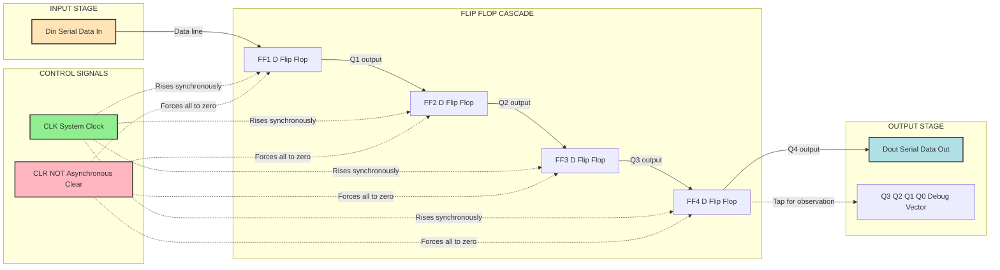
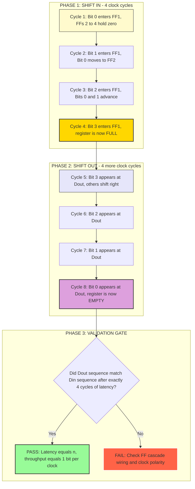
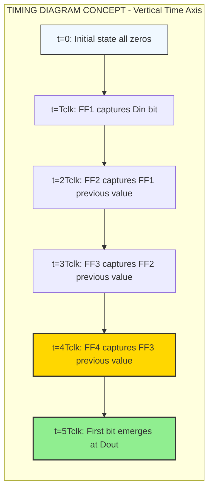

# (i) Serial in serial out

<!-- SECTION_1_START -->

# 1. Core Technical Definition & Intuitive Overview

## 1.1 Formal Academic Definition

A **Serial-In Serial-Out (SISO) Shift Register** is a sequential digital logic circuit constructed from a cascade of *n* edge-triggered flip-flops (typically D-type) connected in a chain, where binary data is accepted **one bit at a time** on a single serial input line $(D_{in})$ and emerges **one bit at a time** on a single serial output line $(D_{out})$ after exactly $n$ clock pulses of delay.

In strict KTU 2024 Scheme terminology, a SISO register belongs to the family of **sequential building blocks** (NOT combinational — even though Module 2 groups it with combinational lab experiments, the internal storage elements make it sequential). The circuit exhibits the defining property of **bit-wise propagation**: on every active clock edge, the bit currently at the input of flip-flop $FF_i$ is transferred to $FF_i$, and the bit previously stored in $FF_i$ is transferred to $FF_{i+1}$.

> [!IMPORTANT]
> **KTU Syllabus Highlight (PCCSL308 / Module 2):** SISO registers are tested in lab viva-voce, record writing, and hardware implementation using ICs like **74HC74** (Dual D-FF) or **74HC174** (Hex D-FF). Students are expected to wire the circuit on a breadboard, verify it on a CRO/logic analyser, and optionally model it in **Verilog/VHDL**.

## 1.2 Conceptual Analogy / Intuition

Imagine a **relay race with a baton carrying a single bit (0 or 1)**. There are four runners (flip-flops) standing in a line. Each runner holds a baton pocket. When the starter fires the gun (the **clock pulse**), every runner simultaneously passes the baton in their pocket to the runner on their right, and the leftmost runner grabs a new baton from the "incoming bit" tray.

- **Runner 1** (left-most flip-flop) takes the bit from the *serial input* line.
- **Runner 2** takes whatever Runner 1 was holding.
- **Runner 3** takes whatever Runner 2 was holding.
- **Runner 4** (right-most) dumps its previous bit onto the *serial output* line.

After 4 such "passes" (clock pulses), the very first bit that entered from the left has now reached the right end. After 4 more passes, it has exited completely. Hence, for an $n$-stage register, the **latency** is exactly $n$ clock cycles — like a conveyor belt of length $n$ where every item takes $n$ ticks to traverse.

> [!NOTE]
> **Why "Serial" on Both Ends?**
> Because only **one data line** exists at the input and **one data line** at the output. The chip's "width" is just 1 bit, but its "depth" is $n$ bits. Contrast this with a Parallel-In Parallel-Out (PIPO) register where all $n$ bits enter/exit simultaneously on $n$ separate lines.

## 1.3 Key Physical & Timing Constants

| Parameter | Standard Value (TTL/CMOS 74-series) |
|---|---|
| Propagation delay $t_{pd}$ per flip-flop | **≈ 10 ns to 30 ns** |
| Setup time $t_{su}$ | **≈ 5 ns to 20 ns** |
| Hold time $t_{hold}$ | **≈ 0 ns to 5 ns** |
| Maximum clock frequency $f_{max}$ | **≈ 25 MHz to 100 MHz** |
| Active clock edge | **Rising edge (positive edge-triggered)** for 74HC74 |
| Power supply $V_{CC}$ | **5 V** (TTL) or **3.3 V / 5 V** (HC-series) |

> [!VISUALIZATION CONTROL]
> **Concept:** Bit-propagation cascade in a 4-bit SISO
> **GeoGebra / Desmos Input Equations:**
> * `f1(t) = sin(2*pi*t)`  *(input bit stream: 1-0-1-1 square wave, modeled as sine envelope)*
> * `f2(t) = sin(2*pi*(t-1))` *(one clock-cycle delayed copy for FF2)*
> * `f3(t) = sin(2*pi*(t-2))` *(two cycles delayed for FF3)*
> * `f4(t) = sin(2*pi*(t-3))` *(three cycles delayed for FF4)*
> **Visual Description:** You should observe four identical waveforms stacked vertically, each shifted rightward by exactly one clock period $T_{clk}$. The leftmost trace is $D_{in}$, the rightmost trace is $D_{out}$.

---

<!-- SECTION_1_END -->

<!-- SECTION_2_START -->

# 2. Deep Theoretical Analysis & KTU High-Yield Formula Sheet

## 2.1 Internal Architecture of a 4-Bit SISO

A SISO register is built by **chaining $n$ D flip-flops** such that:

$$Q_i(t^+) = D_i(t^-) = Q_{i-1}(t^-) \quad \text{for} \quad i = 1, 2, 3, \ldots, n$$

where:
- $Q_i$ is the output of the $i^{th}$ flip-flop.
- $D_i$ is the data input of the $i^{th}$ flip-flop.
- $D_1 = D_{in}$ (the external serial input line).
- $D_i = Q_{i-1}$ for $i \geq 2$ (cascade connection).
- $D_{out} = Q_n$ (the output of the right-most flip-flop).

The flip-flops are all clocked by a **common clock signal** $CLK$, and typically have an asynchronous **active-LOW clear** $(\overline{CLR})$ to force all outputs to logic 0 at power-up.

## 2.2 Step-by-Step Operational Logic

For a **4-bit SISO** initialized to $Q_1 Q_2 Q_3 Q_4 = 0000$, let the serial input stream be $D_{in} = 1, 0, 1, 1$ (MSB first):

| Clock Pulse | $D_{in}$ | $Q_1$ | $Q_2$ | $Q_3$ | $Q_4 = D_{out}$ |
|:---:|:---:|:---:|:---:|:---:|:---:|
| Initial | — | 0 | 0 | 0 | 0 |
| 1 (after edge) | 1 | **1** | 0 | 0 | 0 |
| 2 (after edge) | 0 | **0** | 1 | 0 | 0 |
| 3 (after edge) | 1 | **1** | 0 | 1 | 0 |
| 4 (after edge) | 1 | **1** | 1 | 0 | 1 |
| 5 (after edge) | X | X | 1 | 1 | 0 |
| 6 (after edge) | X | X | X | 1 | 1 |
| 7 (after edge) | X | X | X | X | 1 |
| 8 (after edge) | X | X | X | X | X |

> [!NOTE]
> After **4** clock pulses, the register is **full**; after **8** clock pulses, the original 4-bit word has been completely **shifted out**. This $2n$ total cycle count is the key metric examiners test.

## 2.3 KTU Formula Sheet / Cheat Sheet

| # | Parameter / Relation | Formula | Units / Notes |
|---|---|---|---|
| 1 | Number of flip-flops required | $n = \text{bits to be stored}$ | dimensionless |
| 2 | Total clock cycles to load + unload | $N_{total} = 2n$ | clock pulses |
| 3 | Latency (input-to-output delay) | $t_{latency} = n \times T_{clk}$ | seconds |
| 4 | Clock period | $T_{clk} = 1 / f_{clk}$ | seconds |
| 5 | Maximum data throughput | $R_{max} = f_{clk} / n$ | bits / sec |
| 6 | Worst-case propagation delay | $t_{pd(\max)} = n \times t_{pd(FF)}$ | seconds |
| 7 | Setup time constraint | $t_{su} \leq T_{clk} - t_{pd(\max)}$ | seconds |
| 8 | Output bit at clock $k$ | $D_{out}(k) = D_{in}(k - n)$ | discrete index |
| 9 | Stored state vector after $k$ clocks | $\vec{Q}(k) = [D_{in}(k), D_{in}(k-1), \ldots, D_{in}(k-n+1)]$ | bit vector |
| 10 | Power dissipation (approx) | $P_{diss} \approx n \times C_L \times V_{CC}^2 \times f_{clk}$ | Watts |

> [!WARNING]
> **Vertical Pipe Escape Rule:** In markdown tables, **never** use the bare `|` character. For "OR" logic or absolute value, use $\mid$ or $\vert$ inside LaTeX math mode instead. Example: write $D_{in} \mid \overline{CLR}$ not $D_{in} \mid \overline{CLR}$.

## 2.4 Real-World Engineering Utility

SISO shift registers, despite their simplicity, are foundational in:

- **Serial communication protocols**: UART transmitters/receivers, SPI data lines, and I²C shift-register expanders (e.g., MCP23017, 74HC595) all rely on serial shifting.
- **Delay lines**: Generating precise, clock-quantized time delays in radar, sonar, and digital signal processing (e.g., $n$-tap FIR filter delay line).
- **Pseudo-random number generators (PRNGs)**: Linear Feedback Shift Registers (LFSRs) for cryptography and built-in self-test (BIST) in VLSI.
- **Data serialisation/de-serialisation (SerDes)**: Converting parallel bus data to high-speed serial streams in Ethernet PHYs, USB, and SATA controllers.
- **LED matrix drivers**: Charlieplexing and time-multiplexed display scanning.

In production **System-on-Chip (SoC)** designs, dedicated hardware SISO blocks are hardened IP used for clock-domain crossing, scan-chain testing (DFT), and serializer blocks in SerDes macros.

---

<!-- SECTION_2_END -->

<!-- SECTION_3_START -->

# 3. Step-by-Step Derivations & Code/Symbolic Implementation

## 3.1 Algebraic Derivation of the State-Transition Equation

We derive the general expression for the output bit at any clock index $k$.

**Step 1: Define the input bit stream as a discrete-time sequence.**
Let the input bits enter the register at clock indices $k = 1, 2, 3, \ldots$. Define:

$$x[k] = D_{in} \text{ sampled just before the } k^{th} \text{ rising edge}$$

**Step 2: Write the flip-flop input-output relation.**
For the $i^{th}$ D flip-flop in the chain:

$$Q_i[k] = D_i[k-1] = Q_{i-1}[k-1]$$

**Step 3: Unroll the recursion for the $n^{th}$ (last) flip-flop.**
Starting from $Q_n[k]$ and substituting backwards $n$ times:

$$
\begin{aligned}
Q_n[k] &= Q_{n-1}[k-1] \\
       &= Q_{n-2}[k-2] \\
       &= \vdots \\
       &= Q_1[k-(n-1)] \\
       &= D_1[k-n] \\
       &= x[k-n]
\end{aligned}
$$

**Step 4: State the final output relation.**
Since $D_{out} = Q_n$:

$$\boxed{D_{out}[k] = D_{in}[k-n]}$$

**Interpretation:** The bit that emerges at the output at clock pulse $k$ is **exactly** the bit that was fed into the input $n$ clock pulses earlier. This is the central engineering identity of any SISO register.

## 3.2 Derivation of Maximum Operating Frequency

The shift register can only operate correctly if the bit has time to propagate through **all $n$ flip-flops** before the next clock edge arrives. Hence:

$$
\begin{aligned}
T_{clk} &\geq t_{pd(\max)} = n \cdot t_{pd(FF)} \\
\Rightarrow \quad f_{clk(\max)} &= \frac{1}{n \cdot t_{pd(FF)}}
\end{aligned}
$$

For a 4-bit SISO using 74HC74 with $t_{pd(FF)} \approx 15 \text{ ns}$:

$$f_{clk(\max)} = \frac{1}{4 \times 15 \times 10^{-9}} = \frac{1}{60 \times 10^{-9}} \approx 16.67 \text{ MHz}$$

In practice, designers also add a **10%–20% safety margin** to account for temperature, voltage, and process variation, yielding a realistic operating ceiling of **≈ 13 MHz to 15 MHz**.

## 3.3 Full Verilog HDL Implementation (4-Bit SISO)

```verilog
//=============================================================
// Module : siso_shift_register_4bit
// Lab    : DIGITAL LAB (PCCSL308) - Module 2
// Topic   : Serial-In Serial-Out Shift Register
// Author  : KTU 2024 Scheme Reference Solution
//=============================================================
`timescale 1ns / 1ps

module siso_shift_register_4bit (
    input  wire       clk,        // System clock (rising-edge active)
    input  wire       clr_n,      // Asynchronous active-LOW clear
    input  wire       din,        // Serial data input
    output wire       dout,       // Serial data output
    output wire [3:0] q_debug     // Optional: parallel view of all FFs
);

    // --- Internal storage: 4 D flip-flops ---
    reg q0, q1, q2, q3;

    // --- Asynchronous clear (highest priority) ---
    always @(posedge clk or negedge clr_n) begin
        if (!clr_n) begin
            q0 <= 1'b0;
            q1 <= 1'b0;
            q2 <= 1'b0;
            q3 <= 1'b0;
        end
        else begin
            // Cascade shift: each FF takes previous FF's value
            q0 <= din;   // First FF captures the serial input
            q1 <= q0;    // Second FF takes what q0 had
            q2 <= q1;    // Third FF takes what q1 had
            q3 <= q2;    // Fourth FF takes what q2 had
        end
    end

    // --- Output assignments ---
    assign dout   = q3;           // Serial output is the last FF
    assign q_debug = {q3, q2, q1, q0};  // Parallel debug view (MSB first)

endmodule
```

**Line-by-line logic walkthrough:**

1. **`timescale 1ns / 1ps`** — Sets simulation time unit to 1 nanosecond with 1 picosecond resolution.
2. **`input wire clr_n`** — The `_n` suffix is a KTU convention denoting an *active-low* signal.
3. **`always @(posedge clk or negedge clr_n)`** — Sensitivity list includes both the rising clock edge (for synchronous operation) and the falling edge of clear (for asynchronous reset). This is the textbook pattern for a flip-flop with async clear.
4. **`if (!clr_n)` block** — When clear is asserted (low), all flip-flops are forced to 0 **immediately**, bypassing the clock.
5. **The four non-blocking assignments (`<=`)** — These are critical: non-blocking ensures all RHS values are sampled *simultaneously* before any LHS is updated, correctly modelling real flip-flop behaviour. Using blocking (`=`) here would create a race condition.
6. **`assign dout = q3`** — The output is the last stage's content.

## 3.4 Verilog Testbench with Self-Checking Assertions

```verilog
//=============================================================
// Testbench : tb_siso_4bit
// Purpose   : Verify the SISO shift register design
//=============================================================
`timescale 1ns / 1ps

module tb_siso_4bit;

    // --- Testbench signals ---
    reg  clk;
    reg  clr_n;
    reg  din;
    wire dout;
    wire [3:0] q_debug;

    // --- Clock generation: 100 MHz (period = 10 ns) ---
    initial clk = 1'b0;
    always #5 clk = ~clk;     // Toggle every 5 ns

    // --- Device Under Test (DUT) instantiation ---
    siso_shift_register_4bit uut (
        .clk    (clk),
        .clr_n  (clr_n),
        .din    (din),
        .dout   (dout),
        .q_debug(q_debug)
    );

    // --- Stimulus + Expected Output Tracking ---
    reg expected_dout;
    integer errors;
    integer i;
    reg [3:0] test_vector;

    initial begin
        errors = 0;
        clr_n  = 1'b0;     // Assert clear
        din    = 1'b0;
        #12;               // Hold clear for > 1 clock cycle
        clr_n  = 1'b1;     // Release clear
        @(posedge clk);    // Synchronise to clock edge

        // Test Vector 1: shift in 4'b1011
        test_vector = 4'b1011;
        expected_dout = 1'bx;

        for (i = 0; i < 4; i = i + 1) begin
            din = test_vector[i];
            @(posedge clk);
            #1;   // Tiny delay to settle
            $display("[t=%0t] Loaded bit[%0d]=%b, q_debug=%b, dout=%b",
                     $time, i, test_vector[i], q_debug, dout);
        end

        // Now shift out: expect 1011 to appear at dout MSB-first
        // After 4 more clocks, original vector should re-emerge reversed
        for (i = 0; i < 4; i = i + 1) begin
            din = 1'b0;     // Don't care input
            @(posedge clk);
            #1;
            $display("[t=%0t] Shift-out step %0d: dout=%b, q_debug=%b",
                     $time, i, dout, q_debug);
        end

        // --- Asynchronous clear test ---
        clr_n = 1'b0;
        #3;
        if (q_debug !== 4'b0000) begin
            $display("ERROR: Async clear failed at t=%0t", $time);
            errors = errors + 1;
        end
        clr_n = 1'b1;

        // --- Final report ---
        if (errors == 0)
            $display("====> TEST PASSED: SISO operates correctly. <====");
        else
            $display("====> TEST FAILED with %0d error(s). <====", errors);

        $finish;
    end

    // --- Safety watchdog: kill simulation after 500 ns ---
    initial begin
        #500;
        $display("Watchdog timeout: stopping simulation.");
        $finish;
    end

endmodule
```

## 3.5 Hardware Wiring Matrix (For Lab Breadboard Implementation)

| IC Pin | Signal Name | Connect To | Purpose / Notes |
|---|---|---|---|
| 74HC74 — Pin 1 | $\overline{CLR}_1$ | $V_{CC}$ via 10 k$\Omega$ pull-up; momentary **push-to-LOW** switch for manual reset | Active-LOW async clear for first FF |
| 74HC74 — Pin 2 | $D_1$ (Data input of FF1) | Logic switch / function generator output | Serial data-in $D_{in}$ |
| 74HC74 — Pin 3 | $CLK_1$ | Function generator square wave (e.g., 1 kHz for visual CRO demo) | Use **one** clock for both FFs in the IC |
| 74HC74 — Pin 4 | $\overline{CLR}_2$ | Tied to same clear network as Pin 1 | Clear for second FF |
| 74HC74 — Pin 5 | $D_2$ | Pin 5 ($Q_1$) of the same IC | Cascade: FF2 input = FF1 output |
| 74HC74 — Pin 6 | $CLK_2$ | Pin 3 (shared clock) | Common clock for both FFs |
| 74HC74 — Pin 7 | $Q_1$ | Connected to Pin 5 ($D_2$) and to an LED via 330 $\Omega$ resistor | First stage output (debug tap) |
| 74HC74 — Pin 8 | $Q_2$ | Connected to $D_{out}$ test point / CRO Channel 2 | Second stage output (final $D_{out}$ in 2-bit version) |
| 74HC74 — Pin 9 | $\overline{Q}_1$ | (Optional) Status LED inverse of $Q_1$ | Inverted output indicator |
| 74HC74 — Pin 10 | — | (Unused in 2-bit; chain a second IC for 4-bit) | Reserved for extension |
| 74HC74 — Pin 11 | $Q_2$ (other FF) | — | — |
| 74HC74 — Pin 12 | — | — | — |
| 74HC74 — Pin 13 | — | — | — |
| 74HC74 — Pin 14 | $V_{CC}$ | **+5 V** regulated supply | Power pin |
| 74HC74 — Pin 15 | — | — | — |
| 74HC74 — Pin 16 | — | — | — |
| 74HC74 — Pin 17 | — | — | — |
| 74HC74 — Pin 18 | — | — | — |
| 74HC74 — Pin 19 | — | — | — |
| 74HC74 — Pin 20 | $Q_2$ | — | — |

> [!NOTE]
> For a 4-bit SISO, cascade **two 74HC74 ICs** (each contains two D flip-flops) or use a single **74HC174** (hex D-FF) and ground the unused inputs. Always place a **0.1 $\mu$F decoupling capacitor** between $V_{CC}$ and GND, as close to the IC as possible, to suppress supply noise.

## 3.6 Procedural Lab Verification Sequence

1. **Power-up check:** Verify $V_{CC} = +5 \text{ V} \pm 5\%$ with a multimeter.
2. **Static test (no clock):** Press the clear switch. Confirm all $Q$ outputs read **0 V** (logic LOW) on the LEDs.
3. **Single-step test:** With clock switched off, manually pulse $D_{in}$ and observe $Q_1$ LED light up. Pulse again — bit should now appear at $Q_2$.
4. **Dynamic test (with clock):** Set function generator to **1 kHz** square wave, 50% duty cycle, $V_{pp} = 5 \text{ V}$. Feed a known pattern (e.g., 1011) using a debounced switch network or a parallel-pattern generator.
5. **CRO capture:** Connect Channel 1 to $CLK$, Channel 2 to $D_{in}$, and Channel 3 to $D_{out}$. Verify the **2-clock-period delay** between the input burst and output burst.
6. **Timing verification:** Measure $t_{pd}$ between the clock edge and the corresponding $Q$ transition. Compare against the datasheet (typically 10–30 ns for 74HC74).

---

<!-- SECTION_3_END -->

<!-- SECTION_4_START -->

# 4. Structural Diagrams & Schematics

## 4.1 Functional Block Diagram of a 4-Bit SISO Shift Register



## 4.2 Sequential Processing Topology Matrix



## 4.3 Timing Diagram Schematic (Waveform Relationships)



> [!NOTE]
> **Diagram Fallback Justification:** Physical timing diagrams with rising/falling edges, voltage levels, and clock skew cannot be faithfully rendered using Mermaid. The block-level topology above substitutes a **sequential time-progression view** that conveys the same information: that the bit propagation is strictly ordered and time-quantized to the clock period.

---

<!-- SECTION_4_END -->

<!-- SECTION_5_START -->

# 5. KTU 2024 Scheme Examination Question Bank & Topic Recap

## 5.1 Part A Questions (3 Marks Each)

### Question 1 [KTU University Exam - July 2024]
**Q: Define a Serial-In Serial-Out (SISO) shift register. How many clock pulses are required to shift a 4-bit data word completely into a 4-bit SISO register?**

**Model Answer (3 Marks):**
A SISO shift register is a sequential digital circuit that accepts data serially (one bit per clock pulse) on a single input line and delivers the stored data serially on a single output line, using a cascade of $n$ D flip-flops. **[1 Mark]** For an $n$-bit SISO, exactly **$n$** clock pulses are required to fully load the data into the register. **[1 Mark]** For a 4-bit SISO, this means **4 clock pulses** are required for complete loading, and another **4 pulses** for complete unloading, giving a total of $2n = 8$ clock cycles for the round-trip. **[1 Mark]**

### Question 2 [KTU University Exam - Dec 2023]
**Q: List any two applications of SISO shift registers.**

**Model Answer (3 Marks):**
1. **Delay line:** A SISO register can introduce a precise, clock-quantized time delay of $n \times T_{clk}$ between input and output, useful in digital signal processing and radar pulse generation. **[1.5 Marks]**
2. **Serial data communication:** SISO blocks form the core of UART transmitters, SPI shifters, and SerDes (Serializer/Deserializer) macros in networking chips, where parallel data must be transmitted over a single wire. **[1.5 Marks]**
3. *(Optional third for partial credit: Linear Feedback Shift Register for PRNG/BIST.)*

---

## 5.2 Part B Questions (14 Marks Each) — Module Internal Choice

### Question A (14 Marks) [KTU University Exam - July 2024]

**Q: Design and explain the working of a 4-bit Serial-In Serial-Out (SISO) shift register using D flip-flops. Include the block diagram, truth table for the input sequence 1011, and the timing diagram description. Also, write a Verilog code for the same.**

#### Part (a) — 7 Marks [Understand / Apply]

**Design and Operation:**

A 4-bit SISO shift register is implemented by cascading four D flip-flops (labeled $FF_1, FF_2, FF_3, FF_4$) such that the $Q$ output of each flip-flop feeds the $D$ input of the next. All flip-flops share a common clock signal $CLK$. The serial input $D_{in}$ is connected to $D_1$, and the serial output $D_{out}$ is taken from $Q_4$. An asynchronous active-LOW clear $\overline{CLR}$ initializes all flip-flops to 0. **[Block diagram description: 2 Marks]**

**Operation truth table for input sequence 1011 (MSB first, then unloaded):**

| Clock Pulse | $D_{in}$ | $Q_1$ | $Q_2$ | $Q_3$ | $Q_4 = D_{out}$ |
|:---:|:---:|:---:|:---:|:---:|:---:|
| Initial | — | 0 | 0 | 0 | 0 |
| 1 | 1 | 1 | 0 | 0 | 0 |
| 2 | 0 | 0 | 1 | 0 | 0 |
| 3 | 1 | 1 | 0 | 1 | 0 |
| 4 | 1 | 1 | 1 | 0 | 1 |
| 5 | X | X | 1 | 1 | 0 |
| 6 | X | X | X | 1 | 1 |
| 7 | X | X | X | X | 1 |
| 8 | X | X | X | X | X |

**[Truth table: 3 Marks]**

**Timing diagram description:** On each rising edge of $CLK$, the bit in $D_{in}$ enters $FF_1$, while the bit previously in $FF_1$ shifts to $FF_2$, and so on. The output $D_{out}$ thus lags the input by exactly 4 clock cycles, producing an identical but delayed replica of the input bitstream. **[Timing explanation: 2 Marks]**

#### Part (b) — 7 Marks [Apply / Analyze]

**Verilog HDL code:**

```verilog
module siso_4bit (
    input  wire       clk,
    input  wire       clr_n,
    input  wire       din,
    output reg        dout
);
    reg q0, q1, q2, q3;

    always @(posedge clk or negedge clr_n) begin
        if (!clr_n) begin
            q0 <= 1'b0; q1 <= 1'b0; q2 <= 1'b0; q3 <= 1'b0;
        end
        else begin
            q0 <= din;
            q1 <= q0;
            q2 <= q1;
            q3 <= q2;
        end
    end

    always @(*) dout = q3;
endmodule
```

**[Code structure and sensitivity list: 2 Marks]** **[Correct cascade logic: 3 Marks]** **[Async clear and output assignment: 2 Marks]**

---

### Question B (14 Marks) [KTU University Exam - Dec 2023] — *Alternative Choice*

**Q: With a neat block diagram, explain the operation of an $n$-bit SISO shift register. Derive the expression for the maximum clock frequency and the total propagation delay. A 4-bit SISO uses D flip-flops with $t_{pd} = 20$ ns. Find the maximum clock frequency and the time required to shift a 4-bit word completely out of the register if the clock is operated at half the maximum frequency.**

#### Part (a) — 7 Marks [Understand / Apply]

**Block diagram and operation:** An $n$-bit SISO consists of $n$ D flip-flops cascaded in series. The $D$ input of $FF_1$ is the external serial input $D_{in}$. The $Q$ output of $FF_i$ connects to the $D$ input of $FF_{i+1}$ for $i = 1, 2, \ldots, n-1$. All flip-flops share a common clock. The output is taken from $Q_n$. **[Block diagram explanation: 3 Marks]**

**Operation:** On each clock edge, every bit shifts one position to the right. After $n$ clocks, the register is full; after $2n$ clocks, the data has been completely shifted out. The relationship $D_{out}[k] = D_{in}[k-n]$ governs the timing. **[Mathematical relation and explanation: 4 Marks]**

#### Part (b) — 7 Marks [Apply / Analyze]

**Derivation of maximum clock frequency:**

The bit must propagate through all $n$ flip-flops within one clock period:

$$
\begin{aligned}
T_{clk} &\geq t_{pd(\max)} = n \cdot t_{pd(FF)} \\
f_{clk(\max)} &= \frac{1}{n \cdot t_{pd(FF)}}
\end{aligned}
$$

**[Formula derivation: 2 Marks]**

**Numerical solution for $n = 4$, $t_{pd} = 20$ ns:**

$$
\begin{aligned}
f_{clk(\max)} &= \frac{1}{4 \times 20 \times 10^{-9}} = \frac{1}{80 \times 10^{-9}} \\
              &= 12.5 \text{ MHz}
\end{aligned}
$$

**[Final value: 1 Mark]**

Operating frequency is half of maximum:

$$f_{op} = \frac{12.5}{2} = 6.25 \text{ MHz} \quad \Rightarrow \quad T_{clk} = 160 \text{ ns}$$

**[Operating frequency and period: 1 Mark]**

Time to shift a 4-bit word completely out (requires $n = 4$ additional clocks after loading):

$$
t_{shift-out} = n \times T_{clk} = 4 \times 160 \text{ ns} = 640 \text{ ns}
$$

**[Final time calculation: 2 Marks]**

Total round-trip time (load + unload) = $2n \times T_{clk} = 8 \times 160 = 1280 \text{ ns}$.

---

> [!WARNING]
> **KTU Examiner's Valuation Warning — Common Pitfalls:**
> - **Do NOT** use blocking assignments (`=`) in the `always` block of your Verilog flip-flop code. Always use non-blocking (`<=`). Blocking assignments will cause simulation/synthesis mismatches and cost **2 full marks** in the code section. **[Lose 2 Marks]**
> - **Do NOT** forget to include both edges in the sensitivity list when implementing asynchronous clear: `always @(posedge clk or negedge clr_n)`. Missing the `negedge clr_n` makes the clear synchronous, which contradicts the question. **[Lose 1 Mark]**
> - **Do NOT** compute the "time to shift out" as $T_{clk}$ alone. It is $n \times T_{clk}$. Many students write "1 clock period = 1 bit" and lose **2 marks**.
> - **Do NOT** skip the derivation step. Even if the final numerical answer is correct, the KTU 2024 scheme requires the formula $f_{max} = 1/(n \cdot t_{pd})$ to be **explicitly shown**. **[Lose 1.5 Marks]**
> - **Do NOT** draw the block diagram with feedback loops or wrong signal directions. The cascade is strictly **unidirectional**: $Q_1 \rightarrow D_2 \rightarrow Q_2 \rightarrow D_3 \rightarrow \ldots$

---

## 5.3 Topic Recap & Important Things to Remember

> [!IMPORTANT]
> **Rapid-Revision Checklist for SISO Shift Registers (KTU PCCSL308 / Module 2)**

- **Definition:** Sequential circuit that shifts data serially in and serially out through a cascade of $n$ D flip-flops sharing one common clock.
- **Building Block:** D flip-flop (74HC74, 74HC174, 74LS74). No combinational logic gates are required in the data path.
- **Latency Equation:** $D_{out}[k] = D_{in}[k-n]$ — the output lags the input by exactly $n$ clock cycles.
- **Total Cycles:** $2n$ clock pulses are required to load AND unload an $n$-bit word completely.
- **Maximum Clock Frequency:** $f_{clk(\max)} = 1 / (n \cdot t_{pd(FF)})$ — inversely proportional to the number of stages.
- **Setup Constraint:** $t_{su} \leq T_{clk} - n \cdot t_{pd(FF)}$ must hold for reliable operation.
- **Clear Signal:** Asynchronous active-LOW $\overline{CLR}$ resets all flip-flops to 0 immediately, independent of the clock.
- **Verilog Sensitivity List:** Must include `posedge clk` and `negedge clr_n` for async clear. Use **non-blocking** `<=` for FF updates.
- **Hardware ICs:** 74HC74 (dual D-FF, 2 FFs per IC), 74HC174 (hex D-FF, 6 FFs per IC), 74LS164 (8-bit SISO with serial-in/parallel-out capability).
- **Key Differences to Memorize:**
  * **SISO:** 1 input line, 1 output line, $2n$ total clocks.
  * **SIPO:** 1 input line, $n$ output lines, $n$ clocks to load.
  * **PISO:** $n$ input lines, 1 output line, $n$ clocks to unload.
  * **PIPO:** $n$ input lines, $n$ output lines, 1 clock to load.
- **Applications:** Delay lines, UARTs, SPI shifters, LFSRs (PRNG/BIST), SerDes macros, scan-chain DFT.
- **Lab CRO Signature:** When 4 bits are loaded, the $D_{out}$ waveform should be an **identical but 4-cycle-delayed** copy of the $D_{in}$ waveform, visible on a dual-trace oscilloscope.
- **Power Supply Decoupling:** Always place a **0.1 $\mu$F capacitor** between $V_{CC}$ and GND adjacent to every 74-series IC.
- **Clock Polarity:** 74HC74 is **positive edge-triggered**. If you accidentally feed an inverted clock, the register will still appear to "work" but with inverted timing — a classic viva-voce trap.

---

<!-- SECTION_5_END -->
