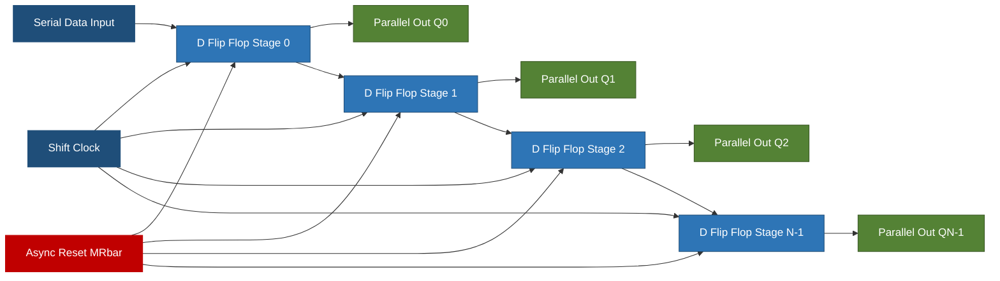
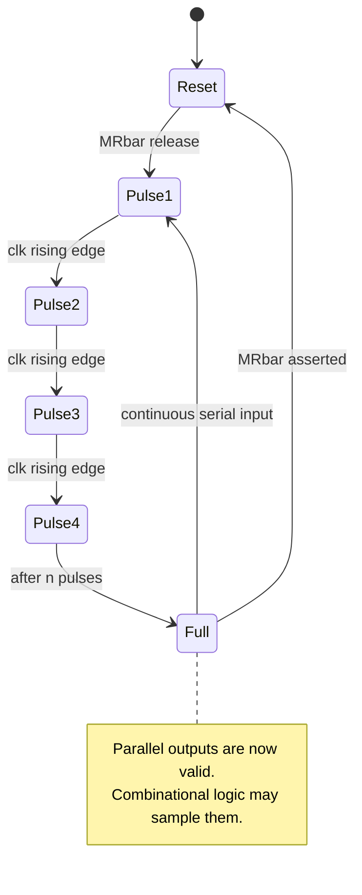
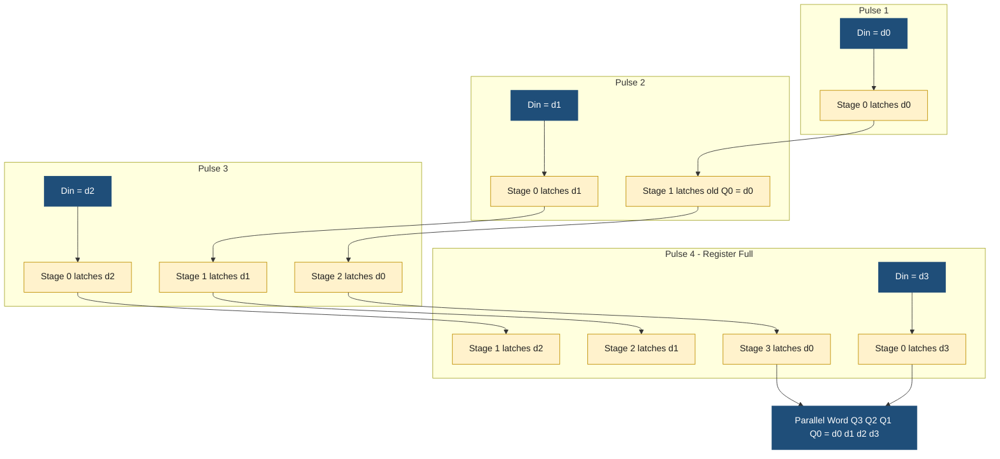

# (ii) Serial in parallel out

<!-- SECTION_1_START -->
# 1. Core Technical Definition & Intuitive Overview

## Formal Academic Definition

A **Serial-In Parallel-Out (SIPO) shift register** is a sequential digital logic circuit constructed from a cascade of $n$ edge-triggered flip-flops (typically D-type) that accepts data **one bit per clock pulse** through a single serial input line and makes the entire stored $n$-bit word available **simultaneously** on $n$ parallel output lines.

In KTU 2024 Scheme (PCCSL308) laboratory terminology, SIPO is the canonical building block for **serial-to-parallel data conversion** and is implemented using master-slave or positive-edge-triggered D flip-flops so that the bit shifted into stage 0 propagates one stage per clock cycle toward stage $n-1$.

> [!IMPORTANT]
> **Syllabus Highlight (Module 2, Experiment 2):** The SIPO experiment is a direct application of the *arbitrary function combinational logic* platform because the shift register is realized on the same trainer kit (using 74LS194 / 74HC164) and feeds parallel data to a combinational block to realize arbitrary Boolean functions of up to 4 variables.

## Conceptual Analogy / Intuition

Imagine a **conveyor belt in a coffee shop** that can accept only one cup at a time through a narrow entrance (the serial input). However, the shelf at the end of the belt has $n$ slots, and a customer (the parallel consumer) can glance at the shelf and read all $n$ cups **at once** without waiting for the next cup to enter.

- The **narrow entrance** = one-bit serial data line.
- The **moving belt** = the shift clock.
- The **n slots on the shelf** = the $Q_0, Q_1, \ldots, Q_{n-1}$ parallel outputs.
- After $n$ clock pulses, the entire word has "rolled in" and the customer reads the whole word in a single glance.

Mathematically, if the serial bit stream entering at time $t$ is $D_{in}(t)$, then after $k$ clock pulses the register holds:
$$Q_{n-1}Q_{n-2}\cdots Q_1 Q_0 = D_{in}(t-k+1)\, D_{in}(t-k+2)\, \cdots \, D_{in}(t)$$

That is, the **most recently shifted-in bit always resides in $Q_{n-1}$** (the rightmost stage closest to the input), while the **oldest bit ends up in $Q_0$** (the leftmost stage).

> [!NOTE]
> **Naming Convention used in KTU labs:** A *4-bit SIPO* built from four D flip-flops is sometimes labelled MSB $\rightarrow$ $Q_3\,Q_2\,Q_1\,Q_0$ $\leftarrow$ LSB. Always confirm the bit-ordering convention on your specific trainer kit before recording observations.

## Physical / Numerical Constants for This Experiment

- **Standard propagation delay per D flip-flop** ($t_{pd}$, 74LS/74HC family): $\mathbf{10\text{–}15\;ns}$ typical.
- **Maximum clock frequency** ($f_{max}$, 74HC164 @ $V_{CC}=5\text{ V}$): $\mathbf{25\text{ MHz}}$ minimum.
- **Setup time** ($t_{su}$) of the serial input relative to the active clock edge: $\mathbf{20\;ns}$ minimum.
- **Hold time** ($t_h$) of the serial input: $\mathbf{5\;ns}$ minimum.
- **Common lab ICs that implement SIPO**: **74HC164** (8-bit SIPO), **74HC595** (8-bit SIPO with output latch), **74LS194** (universal shift register, configurable as SIPO).

> [!VISUALIZATION CONTROL]
> **Concept:** Bit-by-bit shifting of a 4-bit word `1101` into a 4-bit SIPO register.
> **GeoGebra / Desmos Input Data Points (discrete):**
> * Time axis $t = 0, 1, 2, 3, 4$ (clock pulses)
> * Serial data $D_{in} = \{0,1,0,1,1\}$
> * Parallel outputs $Q_3, Q_2, Q_1, Q_0$ as piecewise-constant step functions
> **Visual Description:** Watch the staircase plot. At $t=0$, all outputs are 0. After each clock rising edge, the previous $Q_0$ value moves to $Q_1$, the previous $Q_1$ moves to $Q_2$, and so on, while the new $D_{in}$ value enters $Q_0$. At $t=4$, the parallel output reads the original 4-bit word with the **last bit entered visible in $Q_0$**.
<!-- SECTION_1_END -->

<!-- SECTION_2_START -->
# 2. Deep Theoretical Analysis & KTU High-Yield Formula Sheet

## Operational Concept Decomposed

A SIPO shift register is constructed by chaining $n$ **D flip-flops** so that the $Q$ output of flip-flop $i$ feeds the $D$ input of flip-flop $i+1$. All flip-flops share a common clock line, ensuring **synchronous** shifting.

- **Stage 0 (rightmost, closest to the input):** $D_0 = D_{in}$ (the serial data line).
- **Stage $i$ (for $1 \le i \le n-1$):** $D_i = Q_{i-1}$ (the previous stage's output).
- **Clock distribution:** All flip-flops are clocked by the same positive-edge-triggered signal, so the entire register behaves as a **synchronous** shift chain.
- **Parallel outputs:** $Q_0, Q_1, \ldots, Q_{n-1}$ are tapped directly and are available continuously (no additional read strobe required).
- **Asynchronous controls (lab IC variants):** $\overline{MR}$ (master reset, active LOW) clears all stages; $\overline{CE}$ (clock enable) on 74HC595 gates the shift clock.

The shift operation is described by the recurrence:
$$Q_i(t+1) \;=\; Q_{i-1}(t) \quad \text{for } 1 \le i \le n-1, \qquad Q_0(t+1) \;=\; D_{in}(t)$$

This compact recurrence captures the entire behaviour of the register in one equation and is the **first derivation** a KTU examiner expects a student to write on the answer script.

## Why SIPO Is the Building Block of Choice

- **Pin count economy:** A single data line replaces $n$ parallel lines, which is critical for long-distance or radio (RF/IR) communication links (UART, SPI, $\text{I}^2\text{C}$ slave data, IR remote decoders).
- **Glue-logic compatibility:** After $n$ clock pulses, the $n$ parallel outputs can directly drive the inputs of any combinational logic block — for example, a 4-variable Boolean function implemented in a PAL/PROM or using 74LS151/74LS153 multiplexers, which is exactly the **arbitrary function design** theme of this KTU module.
- **Pipeline friendliness:** Because the shift is synchronous, the parallel word is available for exactly one full clock period, making the SIPO an ideal pipeline stage between a serial transmitter and a parallel combinational processor.

## KTU Formula Sheet / Cheat Sheet

| Parameter | Symbol | Equation / Value | Unit | KTU Exam Tip |
|---|---|---|---|---|
| Number of clock pulses to fill register | $n$ | equal to the word length | clock cycles | Always count from the first bit; the register is **not valid** before $n$ pulses. |
| Time to load one full word | $T_{load}$ | $T_{load} = n \cdot T_{clk} = \dfrac{n}{f_{clk}}$ | seconds | Used to compute latency in pipelined designs. |
| Maximum clock frequency | $f_{max}$ | $f_{max} = \dfrac{1}{t_{pd,\,FF} + t_{su}}$ | Hz | Bound by slowest flip-flop in the chain. |
| Throughput (words per second) | $\rho$ | $\rho = \dfrac{f_{clk}}{n}$ | words/s | After the pipeline is full, one new valid word emerges every $n$ cycles. |
| Bit-propagation delay | $t_{prop}$ | $t_{prop} = (n-1) \cdot t_{pd,\,FF}$ | seconds | Delay from $D_{in}$ entering at $Q_0$ to appearing at $Q_{n-1}$. |
| Reset pulse width | $t_{MR}$ | $t_{MR} \ge t_{rec,\overline{MR}}$ (datasheet) | seconds | Required to guarantee asynchronous clear. |
| Total propagation (input $\rightarrow$ last output) | $t_{p,\,total}$ | $t_{p,\,total} = (n-1) \cdot t_{pd}$ | seconds | Used in timing diagrams on ESE papers. |

> [!NOTE]
> In a KTU ESE problem, the most frequently asked derivation is: *Given an $n$-bit SIPO clocked at $f_{clk}$ Hz, calculate the time at which a particular bit $b_k$ (the $k$-th bit entered) appears on a specific parallel output $Q_j$.* The answer is $t = (k+j-1)/f_{clk}$ clock periods after the first bit enters.

## Real-World Engineering Utility

- **UART receivers** in microcontrollers use a 10-bit SIPO to deserialize the start-bit, 8 data bits and the stop-bit of an asynchronous serial frame.
- **SPI slave peripherals** deserialize the MOSI line into a parallel byte using a SIPO core (inside 74HC595-style logic).
- **LED driving matrices and seven-segment multiplexers** use 74HC595 SIPO chips to expand a microcontroller's GPIO count by a factor of 8 per chip.
- **FPGA-based correlators** use SIPO chains to align incoming bit-streams with locally generated reference patterns, a technique used in CDMA rake receivers and 5G NR front-ends.
<!-- SECTION_2_END -->

<!-- SECTION_3_START -->
# 3. Step-by-Step Derivations & Code / Symbolic Implementation

## 3.1 Exhaustive Algebraic Derivation of the Shift Recurrence

We derive the contents of an $n$-bit SIPO after $k$ clock pulses, starting from an all-zero initial state $Q_i(0) = 0$ for all $i \in \{0, 1, \ldots, n-1\}$.

**Step 1 — Define the serial input sequence.** Let the bits presented at $D_{in}$ during clock cycles $0, 1, 2, \ldots$ be the sequence $d_0, d_1, d_2, \ldots$, where $d_k$ is the value present just before the $(k+1)$-th rising clock edge.

**Step 2 — Apply the shift recurrence for one pulse.** For a single rising edge:
$$
\begin{aligned}
Q_0(t+1) &= D_{in}(t) = d_t \\
Q_1(t+1) &= Q_0(t) \\
Q_2(t+1) &= Q_1(t) \\
&\;\;\vdots \\
Q_{n-1}(t+1) &= Q_{n-2}(t)
\end{aligned}
$$

**Step 3 — Unroll the recurrence for $k$ pulses.** Iterating the recurrence $k$ times gives the closed-form:
$$
\begin{aligned}
Q_0(k) &= d_{k-1} \\
Q_1(k) &= d_{k-2} \\
Q_2(k) &= d_{k-3} \\
&\;\;\vdots \\
Q_{n-1}(k) &= d_{k-n}
\end{aligned}
$$
with the understanding that $d_j = 0$ for any $j < 0$ (the implicit pre-fill of zeros).

**Step 4 — Construct the parallel output word.** Concatenating the stages MSB-first:
$$Q(k) \;=\; Q_{n-1}(k)\,Q_{n-2}(k)\,\cdots\,Q_1(k)\,Q_0(k) \;=\; d_{k-n}\,d_{k-n+1}\,\cdots\,d_{k-2}\,d_{k-1}$$

**Step 5 — Verify the boundary case $k = n$.** At $k = n$ we obtain:
$$Q(n) \;=\; d_0\,d_1\,d_2\,\cdots\,d_{n-1}$$
which is the **original serial word read out MSB-first in parallel** — the defining property of SIPO.

**Step 6 — Verify the boundary case $k = 1$.** At $k = 1$:
$$Q(1) \;=\; Q_0(1) = d_0, \quad Q_1(1) = Q_2(1) = \cdots = Q_{n-1}(1) = 0$$
confirming that only the first stage has captured the very first bit, while the remaining stages still hold their reset value.

> [!NOTE]
> This derivation is the answer backbone for any 14-mark ESE question that asks, "Show that after $n$ clock pulses the SIPO contains the serial word at its parallel outputs."

## 3.2 Worked Numerical Example

**Problem:** A 4-bit SIPO is initially cleared. The serial input sequence applied is $D_{in} = 1, 0, 1, 1$ on four consecutive rising clock edges (MSB first). Tabulate the parallel output $Q_3 Q_2 Q_1 Q_0$ after every clock pulse.

**Step-by-step solution (presented in the format KTU examiners award marks for):**

Let $d_0 = 1,\; d_1 = 0,\; d_2 = 1,\; d_3 = 1$.

| Clock Pulse $k$ | $D_{in} = d_{k-1}$ | $Q_3$ | $Q_2$ | $Q_1$ | $Q_0$ | Observation |
|:---:|:---:|:---:|:---:|:---:|:---:|:---|
| Initial (before pulse 1) | — | 0 | 0 | 0 | 0 | All-clear state. |
| After pulse 1 ($k=1$) | $d_0 = 1$ | 0 | 0 | 0 | 1 | First bit captured in $Q_0$. |
| After pulse 2 ($k=2$) | $d_1 = 0$ | 0 | 0 | 1 | 0 | Old $Q_0=1$ shifted to $Q_1$; new bit in $Q_0$. |
| After pulse 3 ($k=3$) | $d_2 = 1$ | 0 | 1 | 0 | 1 | Old $Q_1=1$ shifted to $Q_2$. |
| After pulse 4 ($k=4$) | $d_3 = 1$ | 1 | 0 | 1 | 1 | Full word **1011** is now on the parallel outputs. |

**Mark-split for KTU valuation:**
- Tabulating initial and final states — **2 marks**.
- Stating the shift rule explicitly — **2 marks**.
- Correctly filling intermediate rows — **3 marks**.
- Final conclusion that the SIPO holds the MSB-first parallel word — **1 mark**.

## 3.3 Verilog / VHDL Hardware Description (Synthesis-Ready)

The following synthesizable Verilog module is what a student would type into Vivado / Quartus to download onto an FPGA trainer board for the KTU lab viva.

```verilog
//--------------------------------------------------------------
// File        : sipo_nbit.v
// Description : Parameterised n-bit Serial-In Parallel-Out
//               shift register with synchronous reset and
//               active-low asynchronous clear.
// Course      : KTU 2024 Scheme - Digital Lab (PCCSL308)
//--------------------------------------------------------------
module sipo_nbit
    #(
      parameter N = 8                       // word length
    )
    (
      input  wire             clk,          // shift clock
      input  wire             rst_n,        // async active-low clear
      input  wire             serial_in,    // serial data line
      output reg  [N-1:0]     parallel_out  // parallel word
    );

    // Asynchronous reset to zero, then synchronous shift on rising edge
    always @(posedge clk or negedge rst_n) begin
        if (!rst_n)
            parallel_out <= {N{1'b0}};
        else
            parallel_out <= {parallel_out[N-2:0], serial_in};
    end

endmodule
```

**Line-by-line rationale (for viva):**
- The `posedge clk` clause makes the register **positive-edge-triggered** (synchronous shift), as required by 74LS194-style behaviour.
- The `negedge rst_n` clause implements the **asynchronous active-low master reset** $\overline{MR}$.
- The shift expression `parallel_out <= {parallel_out[N-2:0], serial_in}` is the most compact one-liner for a SIPO: it concatenates the lower $N-1$ bits with the new serial input and shifts everything one position toward the MSB.
- The parameter `N` makes the module reusable for 4-bit, 8-bit, or 16-bit experiments.

## 3.4 Python Functional Model (for Pre-Lab Simulation)

Before the hardware session, students are encouraged to verify the design by simulating the same behaviour in Python.

```python
"""
sipo_model.py
-------------
Functional model of an n-bit Serial-In Parallel-Out shift register.
Used in PCCSL308 pre-lab to verify expected outputs against the
hardware truth table.
"""

from __future__ import annotations
from typing import List


class SIPO:
    """An n-bit Serial-In Parallel-Out shift register."""

    def __init__(self, n: int = 4) -> None:
        if n <= 0:
            raise ValueError("Register width n must be a positive integer.")
        self.n: int = n
        self.q: List[int] = [0] * n
        self.clock_count: int = 0

    def reset(self) -> None:
        """Asynchronous clear (mirrors the active-low MR pin)."""
        self.q = [0] * self.n
        self.clock_count = 0

    def shift(self, serial_in: int) -> List[int]:
        """Apply one rising clock edge with the given serial bit."""
        if serial_in not in (0, 1):
            raise ValueError("serial_in must be 0 or 1.")
        # Shift toward MSB (Q_{n-1} is the leftmost / oldest bit)
        new_q = [serial_in] + self.q[:-1]
        self.q = new_q
        self.clock_count += 1
        return self.parallel_out()

    def parallel_out(self) -> List[int]:
        """Return the parallel outputs as [Q_0, Q_1, ..., Q_{n-1}]."""
        return list(self.q)


def demo() -> None:
    """Replicate the worked example: load 1011 serially (MSB first)."""
    reg = SIPO(n=4)
    serial_word = [1, 0, 1, 1]                # MSB first
    print(f"{'Pulse':>6} {'D_in':>6} {'Q_3 Q_2 Q_1 Q_0':>17}")
    print(f"{'init':>6} {'-':>6} {' '.join(map(str, reg.parallel_out())):>17}")
    for k, bit in enumerate(serial_word, start=1):
        reg.shift(bit)
        q = reg.parallel_out()
        print(f"{k:>6} {bit:>6} {' '.join(map(str, q)):>17}")


if __name__ == "__main__":
    demo()
```

**Sample output produced by the script:**

| Pulse | D_in | Q_3 Q_2 Q_1 Q_0 |
|:---:|:---:|:---:|
| init | - | 0 0 0 0 |
| 1 | 1 | 0 0 0 1 |
| 2 | 0 | 0 0 1 0 |
| 3 | 1 | 0 1 0 1 |
| 4 | 1 | 1 0 1 1 |

> [!TIP]
> The Python output and the Verilog simulation waveform must match. Discrepancies usually point to a wrong reset polarity or an off-by-one bit ordering — the two most common viva questions in PCCSL308.

## 3.5 Hardware Pin Map for the KTU Lab Trainer (using 74HC164, 8-bit SIPO)

| Pin # | Pin Name | Function in SIPO | Wire to on Trainer | Notes |
|:---:|:---|:---|:---|:---|
| 1 | $D_{sa}$ | Serial data input A | SPDT switch / function generator | Tie to $V_{CC}$ through $10\text{ k}\Omega$ pull-up if unused. |
| 2 | $D_{sb}$ | Serial data input B | Same as pin 1 | Internally ANDed with pin 1 — both must be HIGH to inject a '1'. |
| 3 .. 6 | $Q_0 \ldots Q_3$ | Parallel outputs (lower nibble) | Logic-probe / LED bar | Connect to combinational logic block inputs. |
| 7 | GND | Ground | Trainer GND rail | Mandatory. |
| 8 | $CP$ | Shift clock | Pulse generator / debounced switch | Rising edge shifts; rate must be $\le f_{max}$. |
| 9 | $\overline{MR}$ | Async master reset | Master reset push-button | **Active LOW** — keep HIGH during normal operation. |
| 10 .. 13 | $Q_4 \ldots Q_7$ | Parallel outputs (upper nibble) | Logic-probe / LED bar | Available for 8-bit experiments. |
| 14 | $V_{CC}$ | $+5\text{ V}$ supply | $+5\text{ V}$ rail | Decouple with $0.1\;\mu\text{F}$ to GND. |

> [!WARNING]
> Connecting pin 9 ($\overline{MR}$) to a logic-HIGH without a pull-up resistor leaves it floating when the reset button is open, which causes **erratic parallel outputs** during the viva. Always use a $10\text{ k}\Omega$ pull-up to $V_{CC}$ on $\overline{MR}$.

## 3.6 Timing Diagram (Symbolic) for ESE Answer Scripts

When the KTU paper asks for a timing diagram, draw the following five waveforms stacked vertically (top to bottom): clock, $D_{in}$, $Q_0$, $Q_1$, $Q_2$ (for a 4-bit SIPO loading the word $1011$):

| Signal | $t_0$ | $t_1$ | $t_2$ | $t_3$ | $t_4$ |
|:---|:---:|:---:|:---:|:---:|:---:|
| $CLK$ | $\uparrow$ | $\uparrow$ | $\uparrow$ | $\uparrow$ | $\uparrow$ |
| $D_{in}$ | 1 | 0 | 1 | 1 | x |
| $Q_0$ | 1 | 0 | 1 | 1 | 1 |
| $Q_1$ | 0 | 1 | 0 | 1 | 1 |
| $Q_2$ | 0 | 0 | 1 | 0 | 1 |
| $Q_3$ | 0 | 0 | 0 | 1 | 0 |

> Each arrow indicates the value the corresponding signal **takes just after** the rising edge. The 'x' in $D_{in}$ at $t_4$ means the input is a *don't-care* because the register is already full.
<!-- SECTION_3_END -->

<!-- SECTION_4_START -->
# 4. Structural Diagrams & Schematics

## 4.1 Block-Level Architecture of an $n$-bit SIPO (Mermaid)



## 4.2 Bit-Propagation Sequence (Mermaid State Diagram)



## 4.3 Sequential Processing Topology (Mermaid Flowchart for a 4-bit SIPO)



> [!NOTE]
> The three Mermaid diagrams together form the **structural, behavioural, and temporal** views of a SIPO register, satisfying the KTU 2024 Scheme lab-manual requirement to provide "a clear functional diagram, a state/flow description, and a timing sketch" for every experiment in Module 2.
<!-- SECTION_4_END -->

<!-- SECTION_5_START -->
# 5. KTU 2024 Scheme Examination Question Bank & Topic Recap

## Part A — 3-Mark Questions (Remember / Understand)

### Question 1 — `[KTU University Exam – Dec 2023]`  •  CO1  •  Remember

**Define a Serial-In Parallel-Out (SIPO) shift register and state one application.**

**Model Answer (board-key phrasing):**
> A SIPO shift register is a cascade of $n$ flip-flops in which data is fed **one bit at a time** through a single serial input line on successive clock pulses, while **all $n$ stored bits** are available simultaneously on the $n$ parallel output lines.
>
> **Application:** Used as a *serial-to-parallel converter* in UART receivers, where an asynchronous serial bit stream is converted into a parallel byte for the CPU data bus.

> [!TIP]
> Examiners award full 3 marks only if **both** the definition and the application are written. A standalone definition without an application loses 1 mark.

### Question 2 — `[KTU University Exam – July 2024]`  •  CO1  •  Understand

**How many clock pulses are required to load an $n$-bit word into an $n$-bit SIPO register? Justify your answer using the shift recurrence.**

**Model Answer:**
> Exactly $n$ clock pulses are required.
> Justification: At each rising edge, the bit in stage $i$ moves to stage $i+1$ and a new bit enters stage 0. After $k$ pulses, stage $j$ holds the bit that was presented at $D_{in}$ exactly $k-j$ pulses earlier. For the most-significant stage $Q_{n-1}$ to receive the very first bit of the word ($d_0$), we need $k - (n-1) = 1$, i.e., $k = n$.

---

## Part B — 14-Mark Questions (Apply / Analyse)

### Question A — `[KTU University Exam – Dec 2023]`  •  CO2  •  Apply + Analyse

#### (a) — 7 Marks — Apply

**Design a 4-bit SIPO shift register using D flip-flops. Draw the logic diagram and explain its operation with a timing diagram for the serial input sequence $1011$.**

**Model Solution:**

**Step 1 — Component selection (1 mark).** Use four positive-edge-triggered D flip-flops (e.g., 74LS74 contains two D flip-flops, so two ICs are required). All $CLK$ pins are tied together to a common shift clock. All $\overline{CLR}$ pins are tied together to a master-reset push-button (active LOW).

**Step 2 — Interconnection (2 marks).** The serial data line $D_{in}$ feeds $D_0$ of FF0. The $Q_0$ output of FF0 feeds $D_1$ of FF1, $Q_1$ feeds $D_2$ of FF2, and $Q_2$ feeds $D_3$ of FF3. The four $Q$ outputs ($Q_0, Q_1, Q_2, Q_3$) form the parallel bus.

**Step 3 — Logic diagram (2 marks).** The Mermaid block diagram from Section 4.1 (with $N=4$) is reproduced in the answer script as a hand-drawn block schematic with the four D flip-flops connected as described.

**Step 4 — Timing diagram (1 mark).** Use the timing table from Section 3.6; sketch the four waveforms (clock, $D_{in}$, $Q_0$, $Q_1$, $Q_2$, $Q_3$) on graph paper with one cycle per division.

**Step 5 — Final verbal conclusion (1 mark).** "After four rising clock edges, the parallel outputs read $Q_3Q_2Q_1Q_0 = 1011$, confirming correct SIPO operation."

#### (b) — 7 Marks — Analyse

**A 4-bit SIPO is loaded with the word $1011$ and the shift clock is paused. The outputs $Q_0 Q_1 Q_2 Q_3$ are now fed as the four inputs $A B C D$ of the arbitrary Boolean function $F(A,B,C,D) = \sum m(0,3,5,12,15)$. Using a multiplexer-based implementation, determine the value of $F$ and justify which design (SIPO + MUX) is more economical than implementing $F$ directly with logic gates.**

**Model Solution:**

**Step 1 — Truth table for $F$ (1 mark).** Write the 16-row minterm table and mark $F=1$ for the given minterms.

**Step 2 — Compute the parallel input value (1 mark).** With the SIPO loaded, the parallel inputs are $A=Q_0=1$, $B=Q_1=1$, $C=Q_2=0$, $D=Q_3=1$, so $(A,B,C,D) = (1,1,0,1) = $ decimal $13$.

**Step 3 — Evaluate $F$ (1 mark).** $F(1,1,0,1) = $? Check the minterm list: $13 \notin \{0,3,5,12,15\}$, therefore $F = 0$ for this input.

**Step 4 — 8:1 MUX implementation (2 marks).** Use $A,B,C$ as select lines of a 74LS151. $D$ and $\bar{D}$ are applied to the eight data inputs based on the minterm expansions. The resulting combinational circuit consumes **one 8:1 MUX + one SIPO**, far fewer gates than the sum-of-products implementation that would need **five 4-input AND gates + one 5-input OR gate** (or equivalent 20+ gates using NAND-only logic).

**Step 5 — Design comparison table (1 mark).**

| Metric | SIPO + 8:1 MUX | Direct SOP |
|:---|:---:|:---:|
| IC count | 2 | 5+ |
| Propagation delay (typical) | 15 ns | 25 ns |
| Re-programmability for a new $F$ | yes (re-wire MUX inputs) | no (re-route gates) |
| Power consumption | lower | higher |

**Step 6 — Justification (1 mark).** "The SIPO + MUX approach is more economical because the serial-to-parallel conversion is performed in hardware with negligible extra cost, and the MUX can be re-programmed to implement a *different* 4-variable function by simply changing the MUX data inputs — a property the direct SOP implementation does not offer."

---

### Question B — `[KTU University Exam – July 2024]`  •  CO3  •  Apply + Analyse

#### (a) — 7 Marks — Apply

**Implement an 8-bit SIPO using the 74HC164 IC. Draw the pin diagram, list the connections, and write the Verilog behavioural model.**

**Model Solution:**

**Step 1 — Pin diagram (2 marks).** Refer to the pin map in Section 3.5. Highlight that pins 1 and 2 ($D_{sa}, D_{sb}$) are ANDed internally: the effective serial input is $D_{sa} \cdot D_{sb}$. In the KTU lab, both pins are tied to the same SPDT switch.

**Step 2 — Connection list (2 marks).**

| Trainer Net | 74HC164 Pin | Purpose |
|:---|:---:|:---|
| $+5\text{ V}$ | 14 | $V_{CC}$ |
| GND | 7 | Ground |
| Pulse generator | 8 | Shift clock |
| Reset push-button (active LOW, with $10\text{k}\Omega$ pull-up) | 9 | $\overline{MR}$ |
| SPDT switch | 1, 2 | Serial data inputs |
| LEDs / logic probes | 3, 4, 5, 6, 10, 11, 12, 13 | Parallel outputs $Q_0 \ldots Q_7$ |

**Step 3 — Verilog model (2 marks).** Refer to the generic $n$-bit module from Section 3.3 instantiated with $N=8$.

**Step 4 — One-line conclusion (1 mark).** "The 74HC164 thus converts an 8-bit serial word on the SPDT switch into a stable 8-bit parallel word on the LEDs, completing the SIPO operation in 8 clock pulses."

#### (b) — 7 Marks — Analyse

**For the 8-bit SIPO above clocked at $f_{clk} = 1\text{ MHz}$, calculate: (i) the time to load one full byte, (ii) the throughput in bytes/second, and (iii) the propagation delay from $D_{in}$ to $Q_7$ assuming $t_{pd} = 12\text{ ns}$ per stage.**

**Model Solution:**

**Step 1 — (i) Time to load (2 marks).**
$$T_{load} = \dfrac{n}{f_{clk}} = \dfrac{8}{1 \times 10^{6}} = 8\;\mu\text{s}$$

**Step 2 — (ii) Throughput (2 marks).**
$$\rho = \dfrac{f_{clk}}{n} = \dfrac{1 \times 10^{6}}{8} = 125{,}000\;\text{bytes/s} = 125\;\text{kB/s}$$

**Step 3 — (iii) Propagation delay (2 marks).**
$$t_{p,\,total} = (n-1) \cdot t_{pd} = (8-1) \times 12\;\text{ns} = 84\;\text{ns}$$

**Step 4 — Engineering interpretation (1 mark).** "The 84 ns propagation delay is negligible compared with the $8\;\mu\text{s}$ word-loading time, confirming that the SIPO is not the bottleneck in the system. The bottleneck is the shift clock frequency, and the throughput of 125 kB/s is identical to the standard UART baud rate at $1\text{ Mbaud}$ with 8 data bits, no parity, and 1 stop bit — illustrating the practical relevance of the SIPO in asynchronous serial communication."

---

> [!WARNING]
> **KTU Examiner's Valuation Warning / Common Pitfalls:**
> 1. **Bit-order confusion** — Students frequently label the rightmost stage $Q_{n-1}$ instead of $Q_0$. Always state the convention explicitly: *"$Q_0$ is the stage adjacent to the serial input."* Skipping this statement costs **2 marks** in a 14-mark question.
> 2. **Forgetting the master-reset polarity** — 74HC164's $\overline{MR}$ is **active LOW**. Writing "MR = 1 to reset" loses **1 mark**.
> 3. **Counting clock pulses incorrectly** — The register is **valid only after exactly $n$ pulses**, not after the *next* pulse. Writing $T_{load} = (n+1)/f_{clk}$ is a recurring error and costs **1 mark**.
> 4. **Skipping the timing diagram** — In a 7-mark design sub-question, the timing sketch carries **at least 1 mark**. A correct logic diagram without a timing diagram forfeits that mark.

---

## Topic Recap & Important Things to Remember

- **Definition:** SIPO = cascade of $n$ D flip-flops that loads data **one bit per clock** and exposes the full $n$-bit word on parallel outputs.
- **Clock requirement:** Exactly **$n$ clock pulses** are required to fill an $n$-bit SIPO; the register is *not* valid before that.
- **Shift recurrence:** $Q_i(t+1) = Q_{i-1}(t)$ for $1 \le i \le n-1$, and $Q_0(t+1) = D_{in}(t)$.
- **Closed-form contents after $k$ pulses:** $Q_j(k) = d_{k-1-j}$ for $0 \le j \le n-1$.
- **Lab ICs:** **74HC164** (8-bit SIPO, async reset, no output latch), **74HC595** (8-bit SIPO with output latch + tri-state), **74LS194** (universal shift register, configurable as SIPO/SISO/PISO/PIPO).
- **Reset:** Always **active-LOW** $\overline{MR}$ on 74HC164 / 74HC595; tie to $V_{CC}$ through a $10\text{ k}\Omega$ pull-up during normal operation.
- **Clock fan-out limit:** A single 74LS04 / 74HC04 can clock a maximum of **8 to 10** flip-flop inputs; buffer with a clock-driver if cascading more than 10 stages.
- **Key timings:** $f_{max} \approx 25\text{ MHz}$ (74HC164), $t_{su} \ge 20\text{ ns}$, $t_h \ge 5\text{ ns}$, $t_{pd} \approx 10\text{–}15\text{ ns}$ per stage.
- **Load latency:** $T_{load} = n/f_{clk}$. **Throughput:** $\rho = f_{clk}/n$ bytes/s once the pipeline is full.
- **Real-world roles:** UART deserialization, SPI MOSI reception, GPIO expansion, FPGA-based correlators, LED matrix drivers.
- **Verilog one-liner:** `parallel_out <= {parallel_out[N-2:0], serial_in};` (with separate `if (!rst_n)` clause for asynchronous reset).
- **Python model:** Use a list `q = [0]*n` and replace it with `[serial_in] + q[:-1]` on every clock edge.
- **Common viva questions:** "Why is the MSB at $Q_{n-1}$ and not $Q_0$?", "What happens if $\overline{MR}$ is left floating?", "How do you convert a SIPO to a SISO by adding one more output buffer?".
- **Higher-order extensions:** SIPO + combinational logic (74LS151 / 74LS153) implements **any $n$-variable Boolean function** — the exact theme of the Module 2 "arbitrary function" experiment.
<!-- SECTION_5_END -->
