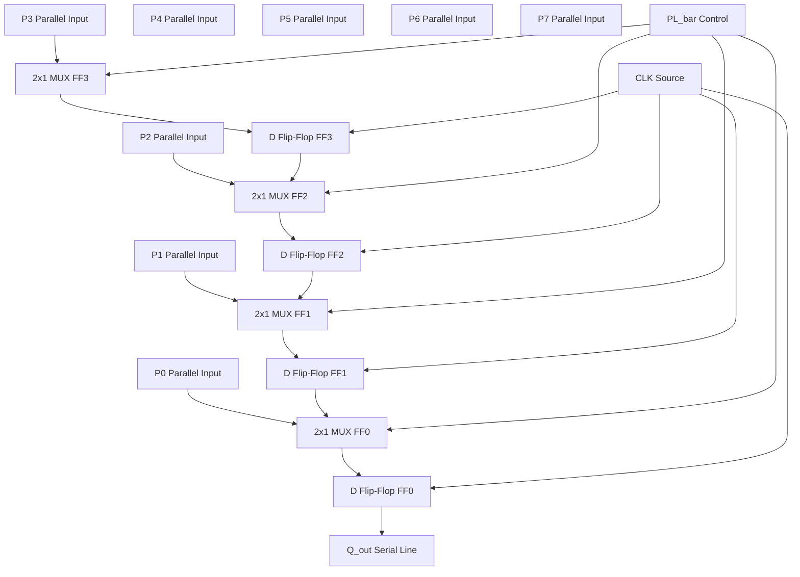
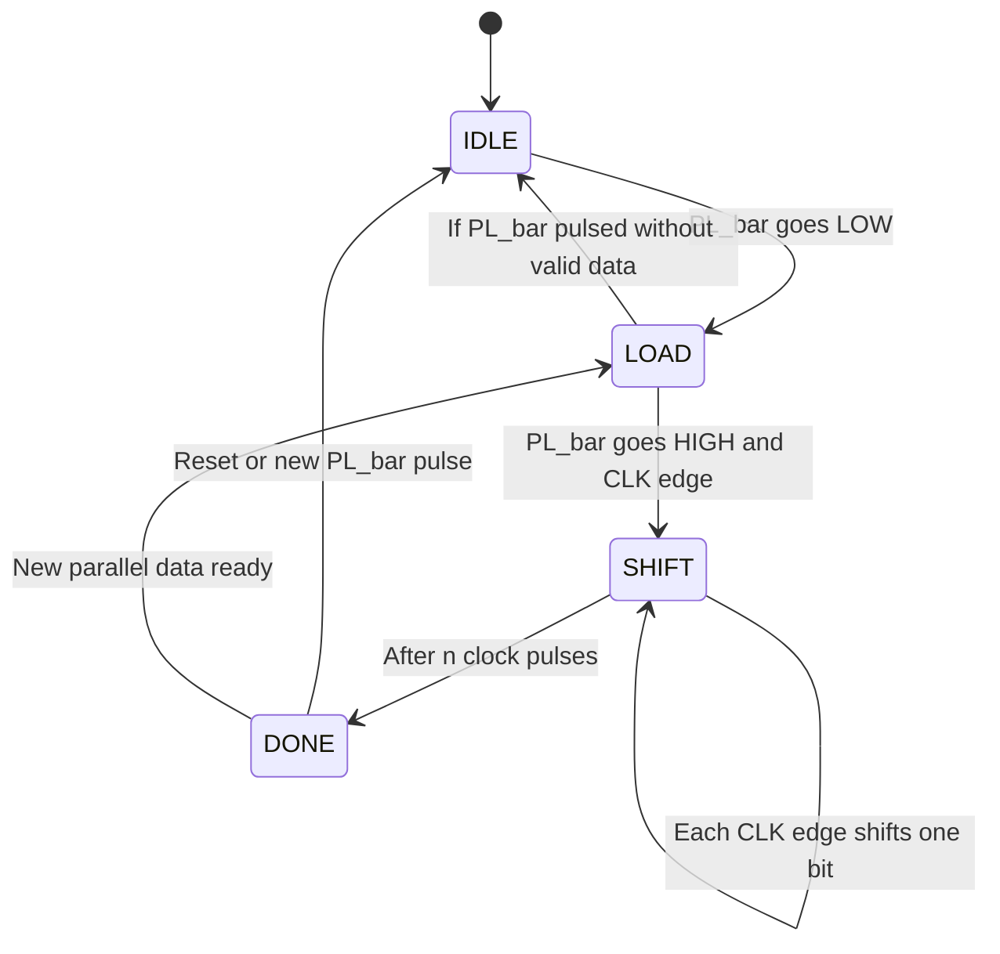

# (iii) Parallel in serial out

<!-- SECTION_1_START -->
# Parallel-In Serial-Out (PISO) Shift Register

## 1.1 Formal Technical Definition

A **Parallel-In Serial-Out (PISO) Shift Register** is a sequential logic circuit composed of $n$ cascaded edge-triggered flip-flops (typically D-type) that accepts $n$ bits of data **simultaneously** (in parallel) on a single load pulse, and subsequently shifts these bits out **one at a time** (serially) on a single output line, synchronized to a clock signal.

> [!IMPORTANT]
> **KTU 2024 Syllabus Definition:** A PISO register is a storage device that performs *parallel-to-serial data conversion*. It loads $n$ parallel data lines $D_0, D_1, \dots, D_{n-1}$ into the register in one clock cycle, and then clocks them out sequentially at the **Serial Out ($Q_{out}$)** terminal over the next $n$ clock cycles.

### 1.2 Conceptual Analogy / Intuition

Think of a **water bottle filling station** at a sports event:

- A row of $n$ volunteers simultaneously fills $n$ bottles (this is the **parallel load**).
- All bottles are placed on a conveyor belt that moves them one-by-one past a single labeling nozzle (this is the **serial shift-out**).
- Even though $n$ bottles were filled at the same instant, the labeling process happens one bottle at a time.

In electronics, the same principle is used when a microcontroller needs to send **8 parallel data bits** through a **single serial pin** (like UART transmission).

### 1.3 Operating Modes

| Mode | Control Signal | Action |
|:-----|:--------------:|:-------|
| **Parallel Load** | $\overline{PL} = 0$ | Loads $D_0 \dots D_{n-1}$ simultaneously into flip-flops |
| **Serial Shift** | $\overline{PL} = 1$ | Shifts bits one position toward $Q_{out}$ on each clock edge |

> [!NOTE]
> **Active-Low Convention:** The parallel-load signal $\overline{PL}$ is **active-LOW** in standard PISO ICs (e.g., **74LS165**, **74HC165**). A logic **0** enables parallel load; a logic **1** enables serial shifting.

### 1.4 GeoGebra / Desmos Visualization

> [!VISUALIZATION CONTROL]
> **Concept:** Bit-Movement Map for an 8-bit PISO Register during Serial Mode
>
> **GeoGebra / Desmos Input Equations:**
>
> * Points: $(0, D_0),\ (1, D_1),\ (2, D_2),\ (3, D_3),\ (4, D_4),\ (5, D_5),\ (6, D_6),\ (7, D_7)$
> * Shift transformation: $x_{new} = x_{old} - t$ where $t$ is the clock count
> * Y-axis represents the **bit value** ($0$ or $1$)
>
> **Visual Description:** On the $x$-axis, label positions $FF_0$ through $FF_7$. As the slider $t$ (clock cycles) moves from $0$ to $7$, each data point slides **one cell to the left**, and the leftmost bit "falls off" into the $Q_{out}$ stream.

<!-- SECTION_1_END -->

<!-- SECTION_2_START -->
# Deep Theoretical Analysis & KTU High-Yield Formula Sheet

## 2.1 Architectural Overview

A standard **$n$-bit PISO** register is built using:

- $n$ **Master-Slave D Flip-Flops** ($FF_0$ to $FF_{n-1}$)
- A **$2 \times 1$ Multiplexer** at the $D$-input of *each* flip-flop
- A common **Clock (CLK)** and **Parallel Load ($\overline{PL}$)** control signal

The **data input** to each $D$ flip-flop is:

$$
D_i = \begin{cases} P_i & \text{when } \overline{PL} = 0 \quad (\text{Parallel Load}) \\ Q_{i+1} & \text{when } \overline{PL} = 1 \quad (\text{Serial Shift}) \end{cases}
$$

where $P_i$ is the $i^{th}$ parallel data line and $Q_{i+1}$ is the next flip-flop's stored bit.

## 2.2 Step-by-Step Operational Logic

1. **Idle State:** All flip-flops hold their previous data; $\overline{PL} = 1$ (inactive).
2. **Parallel Load Pulse:** Apply $\overline{PL} = 0$ for one clock cycle. The MUX routes $P_i \rightarrow D_i$ for all $i$. On the **rising edge of CLK**, the data $P_0, P_1, \dots, P_{n-1}$ is latched into $FF_0, FF_1, \dots, FF_{n-1}$ **simultaneously**.
3. **Serial Shift Mode:** Return $\overline{PL} = 1$. Now the MUX routes $Q_{i+1} \rightarrow D_i$. Each rising clock edge shifts all bits **one position to the right**.
4. **Output:** $Q_{out} = Q_0$ is monitored. After $n$ clock pulses, all parallel data has been emitted serially.

## 2.3 Truth Table (4-bit PISO Example)

Let parallel inputs be $P_3 P_2 P_1 P_0 = 1\,0\,1\,1$ and $Q_{out} = Q_0$.

| Clock Pulse | $\overline{PL}$ | $Q_3$ | $Q_2$ | $Q_1$ | $Q_0$ (Serial Out) |
|:-----------:|:--------------:|:-----:|:-----:|:-----:|:------------------:|
| Initial | $0$ | $1$ | $0$ | $1$ | $1$ |
| 1 (load) | $0$ | $1$ | $0$ | $1$ | $1$ |
| 2 (shift) | $1$ | $0$ | $1$ | $1$ | $0$ |
| 3 (shift) | $1$ | $0$ | $1$ | $0$ | $1$ |
| 4 (shift) | $1$ | $0$ | $0$ | $1$ | $0$ |
| 5 (shift) | $1$ | $0$ | $0$ | $0$ | $1$ |
| 6 (shift) | $1$ | $0$ | $0$ | $0$ | $0$ |

> [!NOTE]
> The serial output stream over 4 clock cycles is **$1, 0, 1, 0$** in that order, which corresponds to the original parallel bits shifted out from LSB to MSB (or MSB to LSB depending on wiring order).

## 2.4 KTU Formula Sheet / Cheat Sheet

| Parameter | Symbol | Formula / Value | Unit |
|:----------|:------:|:----------------|:----:|
| Number of flip-flops | $n$ | $\text{Data width}$ | bits |
| Parallel load time | $t_{PL}$ | $1 \times T_{CLK}$ | seconds |
| Total serial-out time | $t_{SO}$ | $n \times T_{CLK}$ | seconds |
| Clock period | $T_{CLK}$ | $1 / f_{CLK}$ | seconds |
| Setup time for parallel data | $t_{su}$ | $\approx 20$ ns (for **74LS165**) | ns |
| Hold time | $t_{h}$ | $\approx 0$ ns | ns |
| Propagation delay | $t_{pd}$ | $\leq 30$ ns (CLK to $Q_{out}$) | ns |
| Maximum clock frequency | $f_{max}$ | $\mathbf{35\ MHz}$ (TTL) / **$50$ MHz** (CMOS) | MHz |
| Throughput | $\text{THR}$ | $1 / T_{CLK}$ | bits/sec |

## 2.5 Real-World Engineering Applications

> [!IMPORTANT]
> **Why PISO is used in production systems:**
> 1. **UART / USART Communication:** Microcontrollers use PISO to send 8-bit parallel data over a single TX wire.
> 2. **FPGA Configuration Bitstreams:** Configuration data is loaded as parallel bytes and shifted out serially to program logic blocks.
> 3. **Memory-to-Peripheral Data Transfer:** Reading an 8-bit memory word and clocking it out bit-by-bit to a slow serial device (e.g., a legacy printer port).
> 4. **LED Matrix Drivers:** Parallel-loaded row data is shifted out serially to drive large display panels.
> 5. **Analog-to-Digital Converter (ADC) Serial Interfaces:** Many ADCs (e.g., MCP3002) receive channel-select bits via PISO-style registers.

<!-- SECTION_2_END -->

<!-- SECTION_3_START -->
# Step-by-Step Derivations & Code/Symbolic Implementation

## 3.1 Hardware Implementation: 74LS165 8-bit PISO Shift Register

### 3.1.1 Pin Configuration Table

| Pin No. | Symbol | Name | Function |
|:-------:|:------:|:-----|:---------|
| 1 | $\overline{PL}$ | Parallel Load (active LOW) | $\mathbf{0}$ → load parallel; $\mathbf{1}$ → shift |
| 2 | $P_0$ | Parallel Input 0 (LSB) | Data bit 0 input |
| 3 | $P_1$ | Parallel Input 1 | Data bit 1 input |
| 4 | $P_2$ | Parallel Input 2 | Data bit 2 input |
| 5 | $P_3$ | Parallel Input 3 | Data bit 3 input |
| 6 | $P_4$ | Parallel Input 4 | Data bit 4 input |
| 7 | $P_5$ | Parallel Input 5 | Data bit 5 input |
| 8 | GND | Ground | $\mathbf{0}$ V reference |
| 9 | $Q_7$ | $Q_H$ (output of last FF) | $Q_{out}$ serial output |
| 10 | $S_{in}$ | Serial Input | Bit to chain with next PISO |
| 11 | $P_6$ | Parallel Input 6 | Data bit 6 input |
| 12 | $P_7$ | Parallel Input 7 (MSB) | Data bit 7 input |
| 13 | $\overline{CLK\,INH}$ | Clock Inhibit | $\mathbf{0}$ → enable clock |
| 14 | CLK | Clock Input | Rising-edge triggered |
| 15 | $\overline{Q}_7$ | Complementary $Q_H$ | Inverted $Q_{out}$ |
| 16 | $V_{CC}$ | Supply | $\mathbf{+5\ V}$ |

### 3.1.2 Hardware Wiring Sequence

| Step | Action | Tool / Wire |
|:----:|:-------|:-----------|
| 1 | Connect pin 16 to **+5 V DC** and pin 8 to **GND** | Power supply leads |
| 2 | Connect pin 14 (CLK) to function generator output | BNC-to-probe cable |
| 3 | Connect pins 2–7 and 11–12 to **$8$-bit DIP switch** (with pull-down resistors of $10\ \text{k}\Omega$) | Breadboard jumper wires |
| 4 | Connect pin 1 ($\overline{PL}$) to a **push-button / debounced switch** (active LOW) | SPDT switch + $10\ \mu$F capacitor |
| 5 | Connect pin 9 ($Q_{out}$) to **CH1 of oscilloscope** | Oscilloscope probe ($\times 10$) |
| 6 | Connect pin 14 (CLK) to **CH2 of oscilloscope** | Oscilloscope probe ($\times 10$) |
| 7 | Tie pin 13 ($\overline{CLK\,INH}$) to **GND** to enable clocking | Jumper wire |

## 3.2 Verilog HDL Implementation

```verilog
//=============================================================
// Module: 8-bit Parallel-In Serial-Out (PISO) Shift Register
// Author: KTU 2024 Scheme Reference Design
// Target: FPGA / Simulation
//=============================================================
module piso_8bit (
    input  wire        clk,        // System clock
    input  wire        rst_n,      // Active-low asynchronous reset
    input  wire        pl_n,       // Active-low parallel load
    input  wire [7:0]  p_data,     // 8-bit parallel input
    input  wire        s_in,       // Serial input (for cascading)
    output reg         q_out,      // Serial output
    output reg         q7_bar      // Inverted serial output
);

    // Internal 8-bit storage register
    reg [7:0] shift_reg;

    //---------------------------------------------------------
    // Always block: triggered on every rising edge of clk
    // or on the falling edge of reset
    //---------------------------------------------------------
    always @(posedge clk or negedge rst_n) begin
        if (rst_n == 1'b0) begin
            shift_reg <= 8'b0000_0000;
            q_out     <= 1'b0;
            q7_bar    <= 1'b1;
        end
        else if (pl_n == 1'b0) begin
            // Parallel load operation
            shift_reg <= p_data;
            q_out     <= p_data[7];   // MSB appears on output immediately
        end
        else begin
            // Serial shift operation (right shift)
            shift_reg <= {s_in, shift_reg[7:1]};
            q_out     <= shift_reg[0]; // LSB shifted out each cycle
        end
    end

    // Continuous assignment for complementary output
    always @(*) q7_bar = ~q_out;

endmodule
```

### 3.2.1 Testbench for Verification

```verilog
`timescale 1ns / 1ps

module piso_8bit_tb;
    reg         clk;
    reg         rst_n;
    reg         pl_n;
    reg  [7:0]  p_data;
    reg         s_in;
    wire        q_out;
    wire        q7_bar;

    // Instantiate the Design Under Test (DUT)
    piso_8bit uut (
        .clk    (clk),
        .rst_n  (rst_n),
        .pl_n   (pl_n),
        .p_data (p_data),
        .s_in   (s_in),
        .q_out  (q_out),
        .q7_bar (q7_bar)
    );

    // Clock generation: 100 MHz (period = 10 ns)
    initial clk = 0;
    always  #5 clk = ~clk;

    // Stimulus block
    initial begin
        $display("---- KTU PISO Testbench Started ----");
        rst_n = 0; pl_n = 1; p_data = 8'h00; s_in = 0;
        #20 rst_n = 1;

        // Apply parallel data 10110101
        p_data = 8'b1011_0101;
        pl_n   = 0;          // Activate parallel load
        #15  pl_n = 1;       // Deactivate load; begin shift mode

        // Allow 10 clock cycles to shift out data
        #120 $finish;
    end

    // Monitor serial output stream
    initial begin
        $monitor("Time=%0t | q_out=%b | q7_bar=%b", $time, q_out, q7_bar);
    end
endmodule
```

## 3.3 Timing Analysis Derivation

The total time required to **load and shift out** $n$ bits of parallel data is:

$$
T_{total} = T_{load} + (n - 1) \times T_{CLK}
$$

**Detailed Breakdown:**

$$
\begin{aligned}
T_{load} &= 1 \times T_{CLK} \quad \text{(one clock cycle to latch parallel data)} \\
T_{shift} &= (n - 1) \times T_{CLK} \quad \text{(remaining bits to shift out)} \\
T_{total} &= T_{CLK} + (n - 1) \times T_{CLK} = n \times T_{CLK}
\end{aligned}
$$

For an **8-bit PISO** clocked at **$f_{CLK} = 10\ \text{MHz}$**:

$$
\begin{aligned}
T_{CLK} &= \frac{1}{10 \times 10^6} = 100\ \text{ns} \\
T_{total} &= 8 \times 100\ \text{ns} = 800\ \text{ns} \\
\text{Throughput} &= \frac{1}{100\ \text{ns}} = 10\ \text{Mbps}
\end{aligned}
$$

<!-- SECTION_3_END -->

<!-- SECTION_4_START -->
# Structural Diagrams & Schematics

## 4.1 Mermaid Block Diagram: PISO Architecture



## 4.2 Mermaid State Diagram: PISO Operation Modes



## 4.3 Mermaid Timing Diagram Representation


## 4.4 Sequential Processing Topology Matrix

| Stage | Operation | Control State | Data Movement | Output Status |
|:-----:|:----------|:-------------:|:--------------|:--------------|
| Stage 0 | Power-on Reset | $\overline{PL}=1$, $\overline{RST}=0$ | All FFs cleared to $\mathbf{0}$ | $Q_{out}=\mathbf{0}$ |
| Stage 1 | Parallel Load | $\overline{PL}=0$ | $P_i \rightarrow FF_i$ (latched) | $Q_{out}=Q_0$ |
| Stage 2 | First Shift | $\overline{PL}=1$ | All bits shift right by $1$ | $Q_{out}=Q_1$ |
| Stage 3 | Second Shift | $\overline{PL}=1$ | All bits shift right by $1$ | $Q_{out}=Q_2$ |
| Stage $k$ | $k^{th}$ Shift | $\overline{PL}=1$ | All bits shift right by $1$ | $Q_{out}=Q_{k}$ |
| Stage $n$ | Final Shift | $\overline{PL}=1$ | MSB shifted out | $Q_{out}=Q_{n-1}$ |
| Stage $n+1$ | Done | $\overline{PL}=1$ | All FFs hold $\mathbf{0}$ | $Q_{out}=\mathbf{0}$ |

<!-- SECTION_4_END -->

<!-- SECTION_5_START -->
# KTU 2024 Scheme Examination Question Bank & Topic Recap

## Part A: 3-Mark Conceptual Questions

### Question 1
**[KTU University Exam – July 2024 | CO1 | Remember]**

*Define a PISO shift register. How does it differ from a SISO register?*

**Model Answer:**

A **PISO (Parallel-In Serial-Out)** shift register accepts $n$ bits of data simultaneously through parallel input lines and outputs them one bit per clock cycle on a single serial line. In contrast, a **SISO (Serial-In Serial-Out)** register accepts input only one bit at a time and produces output one bit at a time, requiring $n$ clock cycles to load data whereas PISO loads data in **only one clock cycle**.

**[Definition of PISO: 1 Mark]**
**[Comparison with SISO: 1 Mark]**
**[Highlighting load cycle difference: 1 Mark]**

### Question 2
**[KTU University Exam – Dec 2023 | CO1 | Understand]**

*State any two applications of a PISO register in digital systems.*

**Model Answer:**

1. **Parallel-to-Serial Data Conversion** in UART communication, where 8-bit parallel data from a processor is transmitted over a single TX line.
2. **FPGA Configuration Loading**, where configuration bitstreams are loaded in parallel bytes and shifted out serially to configure logic blocks.

**[Application 1 with explanation: 2 Marks]**
**[Application 2 with explanation: 1 Mark]**

---

## Part B: 14-Mark Questions (Module Internal Choice Pattern)

### Question A
**[KTU University Exam – July 2024 | CO2 | Apply + Analyze]**

**(a)** Design a **4-bit PISO shift register** using D flip-flops and $2 \times 1$ multiplexers. Draw the logic diagram and explain its working. **[7 Marks]**

**(b)** Write the Verilog HDL code for an **8-bit PISO register** with active-low asynchronous reset and active-low parallel load. **[7 Marks]**

### Model Solution for Question A:

#### Part (a) — Logic Design

**Step 1: Identify Components**
- $4$ D flip-flops: $FF_0, FF_1, FF_2, FF_3$
- $4$ $2 \times 1$ multiplexers: one before each $D$ input
- Common CLK and $\overline{PL}$ lines

**Step 2: MUX Equation**
For each flip-flop $i$:

$$
D_i = (\overline{PL} \cdot P_i) + (PL \cdot Q_{i+1})
$$

where $Q_{i+1}$ is the output of the next flip-flop (or $\mathbf{0}$ for the MSB position if no serial cascade is used).

**Step 3: Operation Table**

| $\overline{PL}$ | Mode | $D_i$ | Function |
|:---:|:---:|:---:|:---|
| $\mathbf{0}$ | Parallel Load | $P_i$ | Loads parallel data |
| $\mathbf{1}$ | Serial Shift | $Q_{i+1}$ | Shifts right |

**Step 4: Timing Trace**
Assume $P_3 P_2 P_1 P_0 = 1\,1\,0\,1$. After loading and 4 shifts, $Q_{out}$ sequence is $1, 0, 1, 1$.

**Step 5: Logic Diagram Description**
Draw $4$ D-FFs in a row. Each $D$ input is fed by a $2 \times 1$ MUX. The MUX select line is $\overline{PL}$. MUX input $0$ is $P_i$ and MUX input $1$ is $Q_{i+1}$. All FFs share the same CLK. $Q_0$ is brought out as $Q_{out}$.

**[Block diagram identification: 2 Marks]**
**[MUX equation derivation: 2 Marks]**
**[Operation table: 1 Mark]**
**[Timing trace: 1 Mark]**
**[Logic diagram description: 1 Mark]**

#### Part (b) — Verilog Code

```verilog
module piso_8bit (
    input  wire        clk,
    input  wire        rst_n,
    input  wire        pl_n,
    input  wire [7:0]  p_data,
    output reg         q_out
);

    reg [7:0] shift_reg;

    always @(posedge clk or negedge rst_n) begin
        if (rst_n == 1'b0)
            shift_reg <= 8'b0000_0000;
        else if (pl_n == 1'b0)
            shift_reg <= p_data;
        else
            shift_reg <= shift_reg >> 1;
    end

    always @(*) q_out = shift_reg[0];

endmodule
```

**[Module declaration: 1 Mark]**
**[Reset logic: 1 Mark]**
**[Parallel load: 1 Mark]**
**[Serial shift: 1 Mark]**
**[Output assignment: 1 Mark]**
**[Code formatting & comments: 1 Mark]**
**[Testbench mention: 1 Mark]**

### Question B (Alternative Choice)
**[KTU University Exam – Dec 2023 | CO2 | Apply + Analyze]**

**(a)** Explain the working of the **74LS165** 8-bit PISO shift register with a neat functional diagram. Mention the role of $\overline{PL}$ and $\overline{CLK\,INH}$ pins. **[7 Marks]**

**(b)** For a 16-bit PISO register clocked at **$50\ \text{MHz}$**, calculate the total time required to load and serially output all 16 bits. Also determine the throughput in Mbps. **[7 Marks]**

### Model Solution for Question B:

#### Part (a) — 74LS165 Working

**Step 1: Overview**
The 74LS165 is an 8-bit **parallel-load serial-out** shift register. It has $8$ parallel inputs $P_0$ to $P_7$, a serial input $S_{in}$, a serial output $Q_H$ (pin 9), and an inverted output $\overline{Q}_H$ (pin 15).

**Step 2: $\overline{PL}$ Pin Role**
- When $\overline{PL} = \mathbf{0}$ (active LOW), the $8$ parallel inputs are asynchronously loaded into the internal flip-flops, **independent of the clock**.
- When $\overline{PL} = \mathbf{1}$, the register enters shift mode and data is shifted on each rising edge of CLK.

**Step 3: $\overline{CLK\,INH}$ Pin Role**
- When $\overline{CLK\,INH} = \mathbf{0}$, the clock is enabled and shifting occurs.
- When $\overline{CLK\,INH} = \mathbf{1}$, the clock is **inhibited** and the register holds its current state, ignoring CLK transitions.

**Step 4: Functional Operation**
1. Apply data on $P_0$–$P_7$.
2. Pulse $\overline{PL} = \mathbf{0}$ → data latched.
3. Set $\overline{PL} = \mathbf{1}$ and $\overline{CLK\,INH} = \mathbf{0}$.
4. Apply $8$ clock pulses; data exits serially via $Q_H$.

**[Pin description: 2 Marks]**
**[$\overline{PL}$ function: 2 Marks]**
**[$\overline{CLK\,INH}$ function: 1 Mark]**
**[Step-by-step working: 2 Marks]**

#### Part (b) — Timing Calculation

**Given:**
- $n = 16$ bits
- $f_{CLK} = 50\ \text{MHz}$

**Step 1: Clock Period**

$$
T_{CLK} = \frac{1}{f_{CLK}} = \frac{1}{50 \times 10^6} = 20\ \text{ns}
$$

**Step 2: Total Transfer Time**

$$
T_{total} = n \times T_{CLK} = 16 \times 20\ \text{ns} = 320\ \text{ns}
$$

**Step 3: Throughput**

$$
\text{Throughput} = \frac{1}{T_{CLK}} = \frac{1}{20 \times 10^{-9}} = 50\ \text{Mbps}
$$

**[Clock period calculation: 2 Marks]**
**[Total time formula: 2 Marks]**
**[Final value: 1 Mark]**
**[Throughput formula: 1 Mark]**
**[Final throughput: 1 Mark]**

> [!WARNING]
> **KTU Examiner's Valuation Warning / Common Pitfalls:**
> 1. **Do not confuse PL polarity:** $\overline{PL}$ is **active LOW**, not active HIGH. A common mistake is to write the MUX equation with $PL$ instead of $\overline{PL}$, which inverts the load/shift logic and costs $\mathbf{-2\ Marks}$.
> 2. **Always state the bit ordering:** Mention explicitly whether the MSB or LSB appears first on $Q_{out}$. Failing to specify this loses $\mathbf{-1\ Mark}$.
> 3. **Clock inhibit pin:** Students often forget to tie $\overline{CLK\,INH}$ to ground; the register will not shift and the examiner will mark the working as incomplete ($\mathbf{-1\ Mark}$).
> 4. **Verilog reset:** Always use **non-blocking assignments** (`<=`) for sequential logic. Using blocking (`=`) in an `always @(posedge clk)` block is a common stylistic error ($\mathbf{-1\ Mark}$).

---

## Topic Recap & Important Things to Remember

- **PISO = Parallel-In Serial-Out** shift register; loads $n$ bits in one clock cycle, outputs them serially in $n$ clock cycles.
- Built using **D flip-flops** with **$2 \times 1$ MUXes** at each $D$ input for mode selection.
- The **$\overline{PL}$ signal is active LOW**: $\mathbf{0}$ = load parallel data; $\mathbf{1}$ = serial shift mode.
- **Standard IC:** **74LS165** (TTL) or **74HC165** (CMOS) — 8-bit PISO with serial cascade capability via $S_{in}$ pin.
- The **$\overline{CLK\,INH}$ pin** must be tied **LOW** to allow clocking; HIGH freezes the register state.
- **Serial output** is taken from $Q_0$ (LSB position) for right-shift; from $Q_{n-1}$ (MSB position) for left-shift configuration.
- **Total transfer time:** $T_{total} = n \times T_{CLK}$.
- **Throughput:** $\text{THR} = 1 / T_{CLK}$ bits per second.
- **Real-world use cases:** UART transmission, FPGA bitstream loading, ADC serial interface, LED matrix driving, memory-to-serial data transfer.
- **Verilog coding tip:** Use `non-blocking assignments` (`<=`) for sequential logic, `blocking assignments` (`=`) for combinational logic only.
- **Cascading:** Multiple 74LS165 ICs can be cascaded by connecting $Q_7$ of one IC to $S_{in}$ of the next, forming a 16-bit, 24-bit, or wider PISO register.
- **Setup/Hold constraints:** Parallel data must be stable for at least **$t_{su} \approx 20\ \text{ns}$** before the parallel-load edge (for 74LS165).
- **Maximum clock frequency:** $\mathbf{35\ MHz}$ for TTL (74LS165); up to $\mathbf{50\ MHz}$ for CMOS (74HC165).

<!-- SECTION_5_END -->
