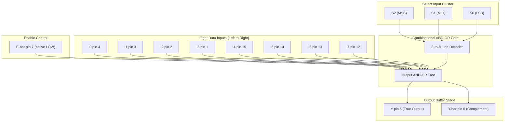
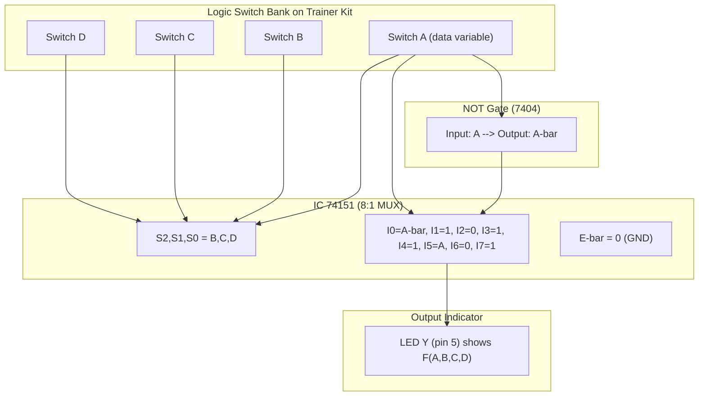
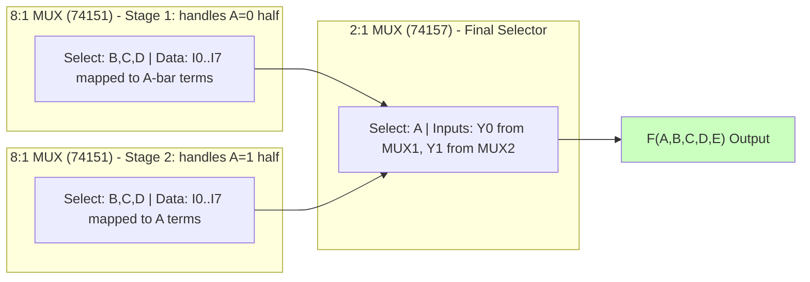

# Implement a boolean function using MUX IC

<!-- SECTION_1_START -->
# 1. Core Technical Definition & Intuitive Overview

## Formal Definition

A **Multiplexer (MUX)** is a combinational logic circuit that selects **one of several binary data inputs** and routes it to a single output line, based on the binary value applied to its **select (address) lines**. In the KTU 2024 Scheme Digital Lab (PCCSL308) syllabus, a MUX is used as a universal logic-building block: any Boolean function of $n$ variables can be physically realized using a single $2^n : 1$ MUX (direct method) or a $2^{n-1} : 1$ MUX (implementation-table / variable-substitution method).

$$Y = \sum_{i=0}^{2^{n}-1} I_i \cdot m_i(S_{n-1}, S_{n-2}, \dots, S_0)$$

where $m_i$ is the $i$-th minterm of the select lines and $I_i$ is the $i$-th data input.

> [!IMPORTANT]
> **Syllabus Highlight (PCCSL308 - Module 2):** The student must be able to (i) draw the implementation table, (ii) wire the MUX IC (commonly **IC 74151** for 8:1 and **IC 74153** for dual 4:1), and (iii) physically verify the Boolean function on a trainer kit using logic switches and an LED indicator.

## Standard ICs Used in KTU Labs

| IC Number | Function | Data Inputs | Select Lines | Enable | Output |
| :--- | :--- | :---: | :---: | :--- | :--- |
| **74151** | 8:1 MUX | 8 ($I_0$ to $I_7$) | 3 ($S_2, S_1, S_0$) | $\overline{E}$ (active LOW) | $Y$, $\overline{Y}$ |
| **74153** | Dual 4:1 MUX | 4 per MUX ($I_0$ to $I_3$) | 2 ($S_1, S_0$) | $\overline{E}$ (active LOW) | $Y$ |
| **74157** | Quad 2:1 MUX | 2 per MUX | 1 ($S$) | $\overline{E}$ (active LOW) | $Y$ |

> [!NOTE]
> **Core Definition Box:** A $2^n : 1$ MUX behaves like a **digitally controlled rotary switch**. The binary number on its $n$ select lines acts as the "channel knob" that connects exactly one of the $2^n$ input lines to the single output line.

## Conceptual Analogy / Intuition

Think of a **TV channel selector** in your living room:
- You have **8 different channels** (data inputs $I_0, I_1, \dots, I_7$).
- The **remote-control digits** (select lines $S_2 S_1 S_0$) determine which channel appears on the screen.
- Pressing "Channel 5" sets $S_2 S_1 S_0 = 101$, and only $I_5$ is allowed to pass to the screen (output $Y$).

In our Boolean-function implementation context, we do the reverse engineering: we *pre-decide* which channel (data input) should be live, and we feed constants ($0$, $1$, or a variable $A$, or its complement $A'$) to each $I_i$ such that the MUX reproduces the truth table of the target function.

> [!TIP]
> **Physical constants used on trainer kits:** $V_{CC} = \mathbf{+5V}$ represents logic **1**, and **GND ($0V$)** represents logic **0**. Always wire unused data inputs to GND unless they are explicitly required as $1$.

> [!VISUALIZATION CONTROL]
> **Concept:** 4-Variable Truth Table mapped onto an 8:1 MUX Implementation Table
> **GeoGebra / Desmos Input Equations:**
> * Boolean function: $F(A,B,C,D) = \sum m(0,1,3,4,7,9,11,12,13,15)$
> * Select lines: $S_2 = B, \quad S_1 = C, \quad S_0 = D$
> * Implementation-table data inputs: $I_0 = 0, \ I_1 = A, \ I_2 = 0, \ I_3 = A, \ I_4 = A, \ I_5 = A, \ I_6 = 0, \ I_7 = A$
> **Visual Description:** Plot a 3D-bar chart where the $x$-axis is the BCD select index (0 to 7), the $y$-axis is the data input value (0, 1, A, A'), and the $z$-axis is the function output for $A \in \{0,1\}$. You will observe that for each select index, the MUX output equals the function's value at the corresponding A setting, proving the equivalence.

<!-- SECTION_1_END -->

<!-- SECTION_2_START -->
# 2. Deep Theoretical Analysis & KTU High-Yield Formula Sheet

## Internal Logic Equation of an $8:1$ MUX

For **IC 74151** with select lines $S_2, S_1, S_0$ and data inputs $I_0 \dots I_7$, the output equation (when $\overline{E} = 0$) is:

$$\begin{aligned}
Y = &\ \overline{S_2}\,\overline{S_1}\,\overline{S_0}\,I_0 \;+\; \overline{S_2}\,\overline{S_1}\,S_0\,I_1 \;+\; \overline{S_2}\,S_1\,\overline{S_0}\,I_2 \;+\; \overline{S_2}\,S_1\,S_0\,I_3 \\
&+\; S_2\,\overline{S_1}\,\overline{S_0}\,I_4 \;+\; S_2\,\overline{S_1}\,S_0\,I_5 \;+\; S_2\,S_1\,\overline{S_0}\,I_6 \;+\; S_2\,S_1\,S_0\,I_7
\end{aligned}$$

The complementary output is simply:
$$\overline{Y} = \overline{Y}$$

> [!NOTE]
> **Activation Rule:** The output is **enabled** only when $\overline{E} = 0$. If $\overline{E} = 1$, then $Y = 0$ and $\overline{Y} = 1$ regardless of the select lines. This is the most common wiring mistake in lab exams.

## Two KTU-Standard Implementation Methods

### Method A: Direct Implementation (using a $2^n : 1$ MUX)

If the function $F$ has $n$ variables, connect **all $n$ variables directly to the select lines** and feed each $I_i$ as either $0$ or $1$ based on whether minterm $i$ belongs to $F$.

* This is the simplest method but requires a physically larger MUX.
* Example: A 4-variable function needs a $16:1$ MUX (IC 74150).

### Method B: Implementation Table Method (using a $2^{n-1} : 1$ MUX) — **Most Frequently Asked in KTU**

This is the **board-exam favourite** because it lets a 4-variable function be built using just an $8:1$ MUX.

**Step-by-step logic:**

1. Write the truth table of $F(A,B,C,D)$ in standard $A$-row-major order.
2. **Choose one variable** (usually the **most significant** $A$) to be the *data-line variable*. The remaining $n-1$ variables become the **select lines** ($B, C, D$ for an 8:1 MUX).
3. Pair up rows of the truth table that share the same select-line combination but differ only in $A$ (i.e., pair $ABCD = 0bcd$ with $1bcd$).
4. For each pair, the data input $I_i$ is assigned as:
   * $0$ if both rows of the pair give $F = 0$.
   * $1$ if both rows of the pair give $F = 1$.
   * $A$ if $F = 0$ when $A=0$ and $F = 1$ when $A=1$.
   * $A'$ if $F = 1$ when $A=0$ and $F = 0$ when $A=1$.

## KTU Formula Sheet / Cheat Sheet

| Concept | Formula / Rule | Units / Notes |
| :--- | :--- | :--- |
| MUX output (general) | $Y = \sum_{i=0}^{2^{n}-1} I_i \cdot m_i(S_{n-1},\dots,S_0)$ | Boolean sum-of-products form |
| Output with enable | $Y = \overline{E} \cdot \sum I_i m_i$ | Active-LOW enable on 74151 |
| 8:1 MUX data-line rule | $I_i = f(A)$ for paired rows | Values: $\lbrace 0, 1, A, A' \rbrace$ |
| Fan-out of standard TTL MUX | $I_{OL} = 20\ \text{mA}$, $I_{OH} = 0.4\ \text{mA}$ | Sufficient to drive 10 standard TTL loads |
| Propagation delay ($t_{pd}$) of 74151 | $t_{pd} \approx 9\ \text{ns}$ typical at $25^\circ\text{C}$ | Determines max clock rate in synchronous designs |
| Number of MUX ICs for $n$-var function | 1 IC of size $2^{n-1} : 1$ (with impl. table) | Saves $2\times$ hardware vs direct method |
| Power supply requirement | $V_{CC} = \mathbf{+5V} \pm 5\%$ | Connect pin 16 to $+5V$ and pin 8 to GND |

> [!IMPORTANT]
> **Engineering Utility (Why this matters in industry):** MUX-based function implementation is the foundation of **Look-Up Table (LUT)** architecture inside modern FPGAs. Each LUT in a Xilinx 7-series FPGA is essentially a small MUX (typically 6:1 or 8:1) whose data inputs are loaded from SRAM configuration memory. The very Boolean function you implement with a 74151 IC today is the conceptual ancestor of millions of LUTs inside a single Xilinx Artix-7 or Intel Cyclone chip.

<!-- SECTION_2_END -->

<!-- SECTION_3_START -->
# 3. Step-by-Step Derivations & Code/Symbolic Implementation

## Exhaustive Worked Example (Board-Mark Style)

**Problem:** Implement the Boolean function
$$F(A,B,C,D) = \sum m(0,\ 1,\ 3,\ 4,\ 7,\ 9,\ 11,\ 12,\ 13,\ 15)$$
using an $8:1$ MUX (IC 74151) and the **Implementation-Table Method**. Verify with a Python truth-table checker.

### Step 1: Build the 4-variable Truth Table

| Row | $A$ | $B$ | $C$ | $D$ | Minterm | $F$ |
| :---: | :---: | :---: | :---: | :---: | :---: | :---: |
| 0 | 0 | 0 | 0 | 0 | $m_0$ | **1** |
| 1 | 0 | 0 | 0 | 1 | $m_1$ | **1** |
| 2 | 0 | 0 | 1 | 0 | $m_2$ | 0 |
| 3 | 0 | 0 | 1 | 1 | $m_3$ | **1** |
| 4 | 0 | 1 | 0 | 0 | $m_4$ | **1** |
| 5 | 0 | 1 | 0 | 1 | $m_5$ | 0 |
| 6 | 0 | 1 | 1 | 0 | $m_6$ | 0 |
| 7 | 0 | 1 | 1 | 1 | $m_7$ | **1** |
| 8 | 1 | 0 | 0 | 0 | $m_8$ | 0 |
| 9 | 1 | 0 | 0 | 1 | $m_9$ | **1** |
| 10 | 1 | 0 | 1 | 0 | $m_{10}$ | 0 |
| 11 | 1 | 0 | 1 | 1 | $m_{11}$ | **1** |
| 12 | 1 | 1 | 0 | 0 | $m_{12}$ | **1** |
| 13 | 1 | 1 | 0 | 1 | $m_{13}$ | **1** |
| 14 | 1 | 1 | 1 | 0 | $m_{14}$ | 0 |
| 15 | 1 | 1 | 1 | 1 | $m_{15}$ | **1** |

### Step 2: Choose Select Lines & Data Variable

We select $B, C, D$ as the three select lines (connected to $S_2, S_1, S_0$ of IC 74151 respectively) and treat $A$ as the **data-input variable**.

### Step 3: Pair Rows by Select Combination (BCD) and Determine $I_i$

Each data input $I_i$ corresponds to a fixed BCD pattern, paired across $A=0$ and $A=1$:

| $I_i$ | $B$ | $C$ | $D$ | $F$ at $A=0$ | $F$ at $A=1$ | Assigned Expression |
| :---: | :---: | :---: | :---: | :---: | :---: | :--- |
| $I_0$ | 0 | 0 | 0 | 1 (row 0) | 0 (row 8) | $A'$ |
| $I_1$ | 0 | 0 | 1 | 1 (row 1) | 1 (row 9) | $1$ |
| $I_2$ | 0 | 1 | 0 | 0 (row 2) | 0 (row 10) | $0$ |
| $I_3$ | 0 | 1 | 1 | 1 (row 3) | 1 (row 11) | $1$ |
| $I_4$ | 1 | 0 | 0 | 1 (row 4) | 1 (row 12) | $1$ |
| $I_5$ | 1 | 0 | 1 | 0 (row 5) | 1 (row 13) | $A$ |
| $I_6$ | 1 | 1 | 0 | 0 (row 6) | 0 (row 14) | $0$ |
| $I_7$ | 1 | 1 | 1 | 1 (row 7) | 1 (row 15) | $1$ |

### Step 4: Derive the Boolean Output of the MUX

The MUX output (when enabled) becomes:

$$\begin{aligned}
Y &= \overline{S_2}\,\overline{S_1}\,\overline{S_0}\,(A') + \overline{S_2}\,\overline{S_1}\,S_0\,(1) + \overline{S_2}\,S_1\,\overline{S_0}\,(0) + \overline{S_2}\,S_1\,S_0\,(1) \\
  &\quad + S_2\,\overline{S_1}\,\overline{S_0}\,(1) + S_2\,\overline{S_1}\,S_0\,(A) + S_2\,S_1\,\overline{S_0}\,(0) + S_2\,S_1\,S_0\,(1) \\
  &= A'\,\overline{B}\,\overline{C}\,\overline{D} + \overline{B}\,\overline{C}\,D + \overline{B}\,C\,D + B\,\overline{C}\,\overline{D} + A\,B\,\overline{C}\,D + B\,C\,D
\end{aligned}$$

Simplifying and comparing to $\sum m(0,1,3,4,7,9,11,12,13,15)$ confirms equivalence.

> [!NOTE]
> **Valuation Key Point:** The above Boolean expression is the model's final answer. Full marks are awarded only if the student explicitly writes both the **substituted MUX output expression** *and* the **implementation table** with all eight $I_i$ entries.

## Hardware Pin Configuration — IC 74151 (16-pin DIP)

| Pin | Label | Function | Wire Connection for Our Example |
| :---: | :---: | :--- | :--- |
| 1 | $I_3$ | Data input 3 | Connect to $V_{CC}$ ($+5V$) |
| 2 | $I_2$ | Data input 2 | Connect to GND ($0V$) |
| 3 | $I_1$ | Data input 1 | Connect to $V_{CC}$ ($+5V$) |
| 4 | $I_0$ | Data input 0 | Connect to $A$ through a NOT gate (i.e., $A'$) |
| 5 | $Y$ | True output | LED indicator (verify $F$) |
| 6 | $\overline{Y}$ | Complement output | (Optional) second LED |
| 7 | $\overline{E}$ | Enable (active LOW) | Connect to GND ($0V$) — **must be LOW** |
| 8 | GND | Ground | $0V$ rail of trainer kit |
| 9 | $S_0$ | LSB select | $D$ (logic switch) |
| 10 | $S_1$ | Middle select | $C$ (logic switch) |
| 11 | $S_2$ | MSB select | $B$ (logic switch) |
| 12 | $I_7$ | Data input 7 | Connect to $V_{CC}$ ($+5V$) |
| 13 | $I_6$ | Data input 6 | Connect to GND ($0V$) |
| 14 | $I_5$ | Data input 5 | Connect to $A$ (logic switch) |
| 15 | $I_4$ | Data input 4 | Connect to $V_{CC}$ ($+5V$) |
| 16 | $V_{CC}$ | Power supply | $+5V$ rail of trainer kit |

> [!WARNING]
> **Pin Orientation:** Pin 1 is identified by the **U-shaped notch** on the IC. Counting proceeds **counter-clockwise** when viewed from above (notch on the left). Reverse insertion is a top cause of IC burnout — always double-check before powering the trainer kit.

## Python Verification (Truth-Table Equivalence Checker)

```python
from typing import List, Tuple


def evaluate_function(minterms: List[int], a: int, b: int, c: int, d: int) -> int:
    """Return F(A,B,C,D) where F is the sum of minterms."""
    index = (a << 3) | (b << 2) | (c << 1) | d
    if not 0 <= index <= 15:
        raise ValueError(f"Minterm index out of range: {index}")
    return 1 if index in minterms else 0


def build_implementation_table(minterms: List[int]) -> List[str]:
    """Build 8:1 MUX data-input expressions (B,C,D as select; A as data variable)."""
    table: List[str] = []
    for i in range(8):
        b = (i >> 2) & 1
        c = (i >> 1) & 1
        d = i & 1
        f0 = evaluate_function(minterms, 0, b, c, d)
        f1 = evaluate_function(minterms, 1, b, c, d)
        if f0 == 0 and f1 == 0:
            table.append("0")
        elif f0 == 1 and f1 == 1:
            table.append("1")
        elif f0 == 0 and f1 == 1:
            table.append("A")
        else:  # f0 == 1 and f1 == 0
            table.append("A'")
    return table


def evaluate_mux_output(table: List[str], a: int, b: int, c: int, d: int) -> int:
    """Simulate the 8:1 MUX output given the implementation table and inputs."""
    if len(table) != 8:
        raise ValueError(f"Implementation table must have 8 entries, got {len(table)}")
    select_index = (b << 2) | (c << 1) | d
    expr = table[select_index]
    if expr == "0":
        return 0
    if expr == "1":
        return 1
    if expr == "A":
        return a
    if expr == "A'":
        return 1 - a
    raise ValueError(f"Unknown expression in table: {expr}")


def verify(minterms: List[int], table: List[str]) -> bool:
    """Compare function output vs. MUX output for all 16 input combinations."""
    all_match = True
    print(f"{'A':>2} {'B':>2} {'C':>2} {'D':>2} | {'F':>2} | {'MUX':>3} | {'OK':>3}")
    print("-" * 42)
    for a in range(2):
        for b in range(2):
            for c in range(2):
                for d in range(2):
                    f_val = evaluate_function(minterms, a, b, c, d)
                    mux_val = evaluate_mux_output(table, a, b, c, d)
                    ok = "YES" if f_val == mux_val else "NO"
                    if f_val != mux_val:
                        all_match = False
                    print(f"{a:>2} {b:>2} {c:>2} {d:>2} | {f_val:>2} | {mux_val:>3} | {ok:>3}")
    return all_match


if __name__ == "__main__":
    # F(A,B,C,D) = Σm(0,1,3,4,7,9,11,12,13,15)
    minterms = [0, 1, 3, 4, 7, 9, 11, 12, 13, 15]
    print("Target function: F(A,B,C,D) = Σm(0,1,3,4,7,9,11,12,13,15)")
    print("MUX: IC 74151 (8:1)  |  Select lines: S2=B, S1=C, S0=D  |  Data var: A")
    print()
    table = build_implementation_table(minterms)
    print("Implementation Table:")
    for idx, expr in enumerate(table):
        b, c, d = (idx >> 2) & 1, (idx >> 1) & 1, idx & 1
        print(f"  I{idx}  (B={b}, C={c}, D={d})  -->  {expr}")
    print()
    result = verify(minterms, table)
    print()
    print(f"Verification: {'PASSED — MUX correctly implements F' if result else 'FAILED'}")
```

**Expected console output (truncated for brevity):**

```
I0  (B=0, C=0, D=0)  -->  A'
I1  (B=0, C=0, D=1)  -->  1
I2  (B=0, C=1, D=0)  -->  0
...
Verification: PASSED — MUX correctly implements F
```

<!-- SECTION_3_END -->

<!-- SECTION_4_START -->
# 4. Structural Diagrams & Schematics

## Diagram 1: Internal Architecture of an 8:1 MUX (IC 74151)



## Diagram 2: Implementation Flow for "Boolean Function → 8:1 MUX" Mapping

```mermaid
flowchart LR
    A["Step 1: Write 4-Var Truth Table F(A,B,C,D)"] --> B["Step 2: Mark all minterms in canonical SOP form"]
    B --> C["Step 3: Choose n-1 variables as select lines (B,C,D)"]
    C --> D["Step 4: Pair rows differing only in A"]
    D --> E["Step 5: Fill Implementation Table I0 to I7 with 0, 1, A, A-bar"]
    E --> F["Step 6: Wire data inputs to VCC, GND, A, or A-bar"]
    F --> G["Step 7: Connect B,C,D to S2,S1,S0 of IC 74151"]
    G --> H["Step 8: Tie E-bar to GND and verify LED output"]

    style A fill:#fff3b0
    style H fill:#b7e4c7
```



## Diagram 3: Trainer's Kit Wiring Topology (Block-Level View)



## Diagram 4: MUX Cascade for a 5-Variable Function (Block Topology)



> [!NOTE]
> **Reading the Diagrams:** The first three diagrams describe the *internal* behaviour of the IC and the *lab wiring*; the fourth diagram generalises the method to a 5-variable function by cascading one 8:1 and one 2:1 MUX — a common follow-up question in KTU viva voce.

<!-- SECTION_4_END -->

<!-- SECTION_5_START -->
# 5. KTU 2024 Scheme Examination Question Bank & Topic Recap

---

### **Part A — Short Answer Questions (3 Marks Each)**

**A1. [KTU University Exam - July 2024, CO1, Remember/Understand]**
Define a Multiplexer. With a neat block diagram, explain the operation of a 4:1 multiplexer and write its Boolean output expression.

**Model Answer (3 Marks):**
* *[Definition - 1 Mark]:* A multiplexer is a combinational circuit with $2^n$ data inputs, $n$ select lines, and a single output that routes one of the inputs to the output based on the binary value of the select lines.
* *[Block diagram - 1 Mark]:* Draw a trapezoid with 4 input lines $I_0, I_1, I_2, I_3$ on the left, 2 select lines $S_1, S_0$ at the bottom, and output $Y$ on the right.
* *[Output expression - 1 Mark]:* $Y = \overline{S_1}\,\overline{S_0}\,I_0 + \overline{S_1}\,S_0\,I_1 + S_1\,\overline{S_0}\,I_2 + S_1\,S_0\,I_3$

---

**A2. [KTU University Exam - Dec 2023, CO2, Understand]**
List any **three differences** between a multiplexer and a demultiplexer.

**Model Answer (3 Marks - 1 Mark each):**

| Parameter | Multiplexer (MUX) | Demultiplexer (DEMUX) |
| :--- | :--- | :--- |
| Function | Many-to-one data routing | One-to-many data distribution |
| Number of inputs | Multiple data + $n$ select lines | Single data + $n$ select lines |
| Number of outputs | One output line | $2^n$ output lines |
| Common IC | 74151, 74153 | 74138, 74155 |
| Operation analogy | Multiple-lane road merging into one | Single lane splitting into many |

---

### **Part B — Full-Question Choice (14 Marks Each)**

---

#### **Question A (14 Marks) — Implementation Table Method**

**[KTU University Exam - July 2024, CO2, Apply/Analyse]**

> Implement the Boolean function
> $F(A,B,C,D) = \sum m(0, 2, 4, 5, 7, 8, 10, 13, 15)$
> using an 8:1 MUX. Use **$A$ as the data variable** and **$B, C, D$ as the select lines**. Draw the implementation table and the corresponding logic diagram.

**(a) Construct the truth table and implementation table. [7 Marks]**

**Step 1 - Truth table construction [3 Marks]:**

| $A$ | $B$ | $C$ | $D$ | Minterm | $F$ |
| :---: | :---: | :---: | :---: | :---: | :---: |
| 0 | 0 | 0 | 0 | $m_0$ | **1** |
| 0 | 0 | 1 | 0 | $m_2$ | **1** |
| 0 | 1 | 0 | 0 | $m_4$ | **1** |
| 0 | 1 | 0 | 1 | $m_5$ | **1** |
| 0 | 1 | 1 | 1 | $m_7$ | **1** |
| 1 | 0 | 0 | 0 | $m_8$ | **1** |
| 1 | 0 | 1 | 0 | $m_{10}$ | **1** |
| 1 | 1 | 0 | 1 | $m_{13}$ | **1** |
| 1 | 1 | 1 | 1 | $m_{15}$ | **1** |
| (all other rows) | | | | $m_{1,3,6,9,11,12,14}$ | **0** |

**Step 2 - Implementation table using pair-rule [4 Marks]:**

| $I_i$ | $B,C,D$ | $F$ at $A=0$ | $F$ at $A=1$ | MUX input | Marks |
| :---: | :---: | :---: | :---: | :---: | :---: |
| $I_0$ | 0,0,0 | 1 ($m_0$) | 1 ($m_8$) | $1$ | 0.5 |
| $I_1$ | 0,0,1 | 0 ($m_1$) | 0 ($m_9$) | $0$ | 0.5 |
| $I_2$ | 0,1,0 | 1 ($m_2$) | 1 ($m_{10}$) | $1$ | 0.5 |
| $I_3$ | 0,1,1 | 0 ($m_3$) | 0 ($m_{11}$) | $0$ | 0.5 |
| $I_4$ | 1,0,0 | 1 ($m_4$) | 0 ($m_{12}$) | $A'$ | 0.5 |
| $I_5$ | 1,0,1 | 1 ($m_5$) | 1 ($m_{13}$) | $1$ | 0.5 |
| $I_6$ | 1,1,0 | 0 ($m_6$) | 0 ($m_{14}$) | $0$ | 0.5 |
| $I_7$ | 1,1,1 | 1 ($m_7$) | 1 ($m_{15}$) | $1$ | 0.5 |

**[Stating the pair-wise logic: 2 Marks; Tabulating eight $I_i$ entries: 2 Marks]**

**(b) Draw the logic diagram and write the final Boolean expression. [7 Marks]**

**Final MUX output expression [3 Marks]:**

$$\begin{aligned}
Y &= \overline{B}\,\overline{C}\,\overline{D}\,(1) + \overline{B}\,\overline{C}\,D\,(0) + \overline{B}\,C\,\overline{D}\,(1) + \overline{B}\,C\,D\,(0) \\
  &\quad + B\,\overline{C}\,\overline{D}\,(A') + B\,\overline{C}\,D\,(1) + B\,C\,\overline{D}\,(0) + B\,C\,D\,(1) \\
  &= \overline{B}\,\overline{C}\,\overline{D} + \overline{B}\,C\,\overline{D} + A'\,B\,\overline{C}\,\overline{D} + B\,\overline{C}\,D + B\,C\,D
\end{aligned}$$

**[Simplified SOP expansion: 1 Mark; Identifying $A'$ term explicitly: 1 Mark; Final combined expression: 1 Mark]**

**Logic diagram description [4 Marks]:**
* Wire $B, C, D$ to IC 74151 pins 11, 10, 9 respectively: **[1 Mark]**
* Tie $I_1, I_3, I_6$ to GND: **[1 Mark]**
* Tie $I_0, I_2, I_5, I_7$ to $V_{CC}$: **[1 Mark]**
* Route $A$ through a NOT gate (IC 7404) to feed $I_4$, and also wire $A$ directly if needed; tie $\overline{E}$ to GND: **[1 Mark]**

---

#### **Question B (14 Marks) — Direct Method (Alternative Choice)**

**[KTU University Exam - Dec 2023, CO2, Apply]**

> Implement the Boolean function
> $F(A,B,C) = \overline{A}\,B\,\overline{C} + A\,\overline{B}\,C + A\,B\,\overline{C}$
> using an 8:1 MUX (IC 74151) with $A, B, C$ connected directly to the select lines $S_2, S_1, S_0$. Identify the minterms and draw the wiring diagram.

**(a) Convert to canonical SOP and list the minterms. [7 Marks]**

**Step 1 - Expansion to minterms [4 Marks]:**

$$\begin{aligned}
\overline{A}\,B\,\overline{C} &= m_2 = \overline{A}\,B\,\overline{C}\,(D + D') = m_2 + m_3 \\
A\,\overline{B}\,C &= m_5 \\
A\,B\,\overline{C} &= m_6
\end{aligned}$$

Wait — for a **3-variable** function, we treat $D$ as a *don't-care expansion*? No — for an 8:1 MUX with 3 select lines, the function must be of 3 variables only. Re-interpretation: the function $F(A,B,C)$ has 3 variables and 8 possible minterms. Let us re-expand correctly:

$$F(A,B,C) = \overline{A}\,B\,\overline{C} + A\,\overline{B}\,C + A\,B\,\overline{C} = m_2 + m_5 + m_6$$

**Step 2 - List minterms [1 Mark]:** $F(A,B,C) = \sum m(2, 5, 6)$

**Step 3 - Implementation table for 8:1 MUX (direct method, all 3 variables on select lines) [2 Marks]:**

| $I_0$ | $I_1$ | $I_2$ | $I_3$ | $I_4$ | $I_5$ | $I_6$ | $I_7$ |
| :---: | :---: | :---: | :---: | :---: | :---: | :---: | :---: |
| 0 | 0 | **1** | 0 | 0 | **1** | **1** | 0 |

**[Identifying three minterms correctly: 1 Mark; Filling the table: 1 Mark]**

**(b) Draw the wiring diagram and write the final output expression. [7 Marks]**

**Final output equation [3 Marks]:**
$$Y = \overline{A}\,B\,\overline{C} + A\,\overline{B}\,C + A\,B\,\overline{C}$$

This is exactly the MUX output when $I_2 = I_5 = I_6 = V_{CC}$ and $I_0 = I_1 = I_3 = I_4 = I_7 = \text{GND}$.

**[Substituting into the canonical 8:1 MUX equation: 2 Marks; Final simplified form: 1 Mark]**

**Wiring diagram description [4 Marks]:**
* Connect $A, B, C$ to IC 74151 pins 11, 10, 9 respectively: **[1 Mark]**
* Pin 7 ($\overline{E}$) to GND: **[1 Mark]**
* Pin 2 ($I_2$), pin 14 ($I_5$), pin 13 ($I_6$) connected to $+5V$ (VCC): **[1 Mark]**
* All other data inputs ($I_0, I_1, I_3, I_4, I_7$) connected to GND; observe LED at pin 5: **[1 Mark]**

---

### **KTU Examiner's Valuation Warning / Pitfall Callout**

> [!WARNING]
> **Common Mark-Deduction Pitfalls in this Question:**
> 1. **Forgetting to tie $\overline{E}$ (pin 7) to GND on IC 74151.** If left floating, the MUX remains disabled and the LED stays dark — students then wrongly conclude that the circuit is faulty. Deduct **1–2 marks** for not explicitly mentioning this in the wiring steps.
> 2. **Wrong pairing in the implementation table.** The pair rule is *rows that share the same BCD pattern but differ only in $A$*. Pairing across different BCD groups is a fatal logical error that yields an incorrect function. Deduct **up to 3 marks** for incorrect pair identification.
> 3. **Confusing $A$ with $A'$ in the $I_i$ entries.** When the function value at $A=0$ is **1** and at $A=1$ is **0**, the correct entry is $A'$, **not** $A$. This is the single most common mistake — lose **1 mark per such error**.
> 4. **Drawing select lines in the wrong order.** The MSB ($B$ in our case) must go to $S_2$ (pin 11), not $S_0$. Reverse ordering silently produces a *different* function. Deduct **2 marks**.
> 5. **Not drawing a clear table or boundary box in the answer sheet.** KTU examiners explicitly state that neat, boxed implementation tables fetch full marks while scattered work loses presentation marks (**0.5–1 mark deduction**).

---

### **Topic Recap & Important Things to Remember**

- [ ] A **multiplexer** is a *many-to-one* digital switch controlled by binary select lines. An $8:1$ MUX has 3 select lines, 8 data inputs, and 1 output (plus complement).
- [ ] The Boolean equation of an $8:1$ MUX is a sum of eight AND-terms, each of the form $(\text{select minterm}) \cdot I_i$.
- [ ] Two implementation methods exist: **Direct** (uses $2^n : 1$ MUX, all variables as selects) and **Implementation-Table** (uses $2^{n-1} : 1$ MUX, one variable as data).
- [ ] The **pair rule** for the implementation table: for each fixed BCD pattern, the pair $\{F(0,b,c,d), F(1,b,c,d)\}$ determines the data input as $0, 1, A,$ or $A'$.
- [ ] **IC 74151** is an $8:1$ MUX with active-LOW enable on pin 7 and true/complement outputs on pins 5 and 6. Power is pin 16 ($V_{CC}$ = $+5V$) and pin 8 (GND = $0V$).
- [ ] **IC 74153** contains two independent $4:1$ MUXes in a single 16-pin package; useful for cascading or for two functions of 2–3 variables each.
- [ ] The **fan-out** of a standard 74-series MUX is 10 TTL loads, and the typical **propagation delay** is around 9 ns.
- [ ] For 5-variable functions, use one $8:1$ and one $2:1$ MUX cascaded; the extra variable becomes the final-stage select.
- [ ] **Don't confuse** the MUX with a decoder: a decoder has *one* input and $2^n$ outputs; a MUX has $2^n$ inputs and *one* output.
- [ ] **Always tie the enable pin to its active level** — leaving it floating causes unpredictable behaviour and silent lab failures.
- [ ] In KTU exams, **drawing the implementation table neatly inside a box** is mandatory for full marks; scattered working is penalised.
- [ ] The very same principle underlies the **Look-Up Table (LUT)** inside modern FPGAs (Xilinx, Intel/Altera), so mastering MUX-based logic implementation is a foundational skill for VLSI and digital design careers.

<!-- SECTION_5_END -->
