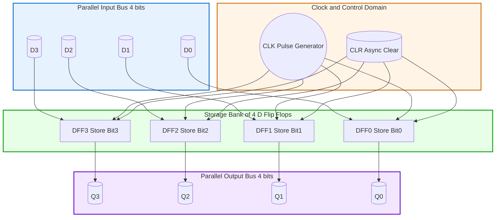

# (iv) Parallel in parallel out

<!-- SECTION_1_START -->
# Parallel-In Parallel-Out (PIPO) Shift Register

> [!IMPORTANT]
> **KTU 2024 Scheme | Digital Lab (PCCSL308) | Module 2**  
> **Topic (iv): Design and Implementation of a PIPO Shift Register using Flip-Flops / MSI ICs**

## 1. Formal Academic Definition

A **Parallel-In Parallel-Out (PIPO) Shift Register** is a sequential logic circuit consisting of a bank of $n$ edge-triggered flip-flops (typically D-type) connected in a parallel arrangement, where all $n$ data bits are **loaded simultaneously** into the register through parallel input lines during a single clock edge, and all $n$ stored bits are **available simultaneously** on the parallel output lines at all times.

Unlike serial shift registers, a PIPO register performs **no bit-to-bit shifting**; its function is essentially that of a **clocked data latch** or **register file element** used for temporary data storage, data synchronization between asynchronous domains, and as a building block in arithmetic logic units (ALUs).

The general data-flow relation for an $n$-bit PIPO register at the rising edge of the clock $CLK$ is given by:

$$
Q_i^{+} \;=\; D_i \quad \text{for} \quad i \;=\; 0, 1, 2, \dots , n-1
$$

where $D_i$ is the $i^{\text{th}}$ parallel input line and $Q_i^{+}$ denotes the **next state** of the $i^{\text{th}}$ flip-flop immediately after the active clock edge.

## 2. Conceptual Analogy / Intuition

> [!NOTE]
> **Analogy: The Multi-Compartment Mailbox**  
> Imagine a wall of $n$ locked letterboxes in a post office. When the postmaster rings a single bell (the **clock pulse**), all $n$ letters placed in the input slots are instantly transferred into their respective boxes (the **flip-flops**). Anyone walking past can read all $n$ letters at once through the glass fronts of the boxes at any time — that is the **parallel output**. There is no "sliding" of letters from one box to another; the transfer is **simultaneous** and **stationary**.

**Geometric / Signal Intuition**  
On a timing diagram, the PIPO register behaves like a **vertical "wall"**: all input arrows strike the wall at the same instant $t = t_{\text{clk}}$, and all output arrows emerge at the same instant. There is no horizontal "wave" of data propagation as seen in Serial-In Serial-Out (SISO) or Serial-In Parallel-Out (SIPO) registers.

> [!VISUALIZATION CONTROL]
> **Concept:** Parallel Data Latch — Vertical Wall Representation  
> **Desmos Input Equations:** Plot discrete points representing the latch behavior.  
> `x = clk_edge, y_parallel_input = D_0, D_1, D_2, D_3`  
> `x = clk_edge_plus, y_parallel_output = Q_0, Q_1, Q_2, Q_3`  
> **Visual Description:** A vertical line (the clock edge) with four horizontal arrows striking four storage cells simultaneously. After the edge, four horizontal output arrows leave the cells in lockstep. No horizontal propagation is observed.

## 3. Physical Constants / Standard Metrics

- **Setup Time ($t_{su}$):** The minimum time the parallel data $D_i$ must remain **stable** *before* the active clock edge. For standard 74LS series D-flip-flops, $t_{su} \approx \mathbf{20 \text{ ns}}$.
- **Hold Time ($t_h$):** The minimum time the data must remain stable *after* the clock edge. For 74LS series, $t_h \approx \mathbf{5 \text{ ns}}$.
- **Propagation Delay ($t_{pd}$):** Time from the active clock edge to the appearance of a valid output. Typical value: $\mathbf{15 \text{ ns}}$ to $\mathbf{30 \text{ ns}}$.
- **Clock Frequency ($f_{max}$):** Maximum toggling rate of the clock, typically $\mathbf{25 \text{ MHz}}$ to $\mathbf{100 \text{ MHz}}$ for 74LS/74HC families.

> [!IMPORTANT]
> **Syllabus Highlight (KTU 2024):** The PIPO register is to be implemented in the lab using either (a) discrete D flip-flops (e.g., 74LS74 / 74HC74), (b) an MSI register IC such as **74LS374** (octal D-type transparent latch with 3-state outputs) or **74LS273** (octal D flip-flop), or (c) an HDL description (VHDL/Verilog) synthesized onto an FPGA trainer kit.

<!-- SECTION_1_END -->

<!-- SECTION_2_START -->
# Deep Theoretical Analysis & KTU High-Yield Formula Sheet

## 1. Architecture Decomposition

A PIPO register is constructed from the following functional building blocks:

1. **Storage Bank** — A set of $n$ D-type flip-flops, one per data bit. Each flip-flop has:
   - A data input $D_i$ (parallel input line)
   - A clock input $CLK$ (common to all flip-flops)
   - Optionally, a **Clear (CLR)** or **Preset (PRE)** asynchronous control line
   - An output $Q_i$ (and inverted $\overline{Q_i}$ for some ICs)

2. **Common Clock Distribution Tree** — A single clock signal $CLK$ is **fanned-out** to the clock inputs of all $n$ flip-flops. To avoid clock-skew problems, the clock trace length must be matched in PCB layouts.

3. **Output Buffer (optional)** — A 3-state buffer stage (e.g., 74LS374) that allows the register outputs to be electrically disconnected from a shared bus. Enabled by an **Output Enable ($\overline{OE}$)** pin.

4. **Input Latch Stage (optional)** — In transparent-latch-based PIPO (e.g., 74LS373), a latch precedes the flip-flop to provide a brief "transparent window" before the edge-triggered storage.

## 2. Operating Principle — Step-by-Step

> [!NOTE]
> **Operational Steps**
> 1. **Idle Phase:** The circuit waits. $D_i$ lines may toggle freely; the outputs $Q_i$ hold their previously latched values because the flip-flops are edge-triggered (not transparent).
> 2. **Data Presentation:** The external source places the $n$-bit word $[D_{n-1} \ldots D_1 D_0]$ on the parallel input lines and **holds them stable**.
> 3. **Active Edge:** On the **rising edge** of $CLK$ (or falling edge, depending on flip-flop polarity), all flip-flops sample their respective $D_i$ inputs **simultaneously**.
> 4. **Storage Update:** The next-state equation $Q_i^{+} = D_i$ is executed in hardware. All $Q_i$ outputs transition to the new values with a small propagation delay $t_{pd}$.
> 5. **Read Phase:** The $n$-bit word is now continuously available on the $Q_i$ outputs until the **next active clock edge** overwrites it.

## 3. KTU Formula Sheet / Cheat Sheet

| **Parameter** | **Symbol** | **Formula / Value** | **Unit** | **Remarks** |
|---|---|---|---|---|
| Storage capacity (number of bits) | $n$ | $n \in \{4, 8, 16, 32\}$ | bits | Depends on IC; common is $n = 8$ |
| Next-state equation | $Q_i^{+}$ | $Q_i^{+} = D_i$ | — | Deterministic; no shift, no rotate |
| Maximum clock frequency | $f_{max}$ | $f_{max} = \dfrac{1}{t_{su} + t_h + t_{pd}}$ | Hz | Practical value for 74LS374 is $\mathbf{50 \text{ MHz}}$ |
| Data throughput | $R_{data}$ | $R_{data} = n \cdot f_{CLK}$ | bits/sec | PIPO throughput per clock cycle = $n$ bits |
| Setup time constraint | $t_{su}$ | $t_{su} \geq \mathbf{20 \text{ ns}}$ | s | For 74LS family |
| Hold time constraint | $t_h$ | $t_h \geq \mathbf{5 \text{ ns}}$ | s | For 74LS family |
| Clock-to-Q delay | $t_{CO}$ | $t_{CO} \leq \mathbf{30 \text{ ns}}$ | s | Time from clock edge to valid output |
| Fan-out per output | $FO$ | $FO = 20$ (74LS) | — | Number of standard loads that can be driven |

> [!IMPORTANT]
> **Critical Insight:** Because PIPO loads and reads $n$ bits per clock cycle, its **effective data bandwidth** is $n$ times that of a SISO register operating at the same clock frequency. This is why PIPO structures dominate in **register files, CPU datapaths, and memory-mapped I/O buffers**.

## 4. Real-World Engineering Utility

- **CPU Register File:** Inside a microprocessor, the general-purpose registers (e.g., R0–R7 in an 8-bit CPU) are precisely $n$-bit PIPO banks. The ALU reads from two registers and writes back to a third in a **single clock cycle**.
- **Memory Data Buffers:** When data is fetched from a slow RAM, it is latched into a PIPO buffer so the CPU can read it at its own clock rate.
- **I/O Port Latching:** Microcontroller GPIO ports (e.g., PORTB of ATmega328) use PIPO latches to hold the last written value on the physical pin.
- **Display Drivers:** Driving a multi-digit 7-segment display requires holding each digit's segment code stable; a PIPO register bank holds one row of pixels at a time.
- **DMA Handshake:** Direct Memory Access controllers use PIPO buffers to bridge the CPU and peripheral clock domains.

<!-- SECTION_2_END -->

<!-- SECTION_3_START -->
# Step-by-Step Derivations, Hardware Wiring & HDL Implementation

## 1. Design Specification (KTU Lab Statement)

> **Aim:** Design and implement a **4-bit PIPO shift register** using D flip-flops. Verify its operation by providing parallel inputs $[D_3 D_2 D_1 D_0]$ and observing the parallel outputs $[Q_3 Q_2 Q_1 Q_0]$ for various input combinations.

### 1.1 Truth Table Derivation

| **CLK Edge** | $D_3$ | $D_2$ | $D_1$ | $D_0$ | $Q_3^{+}$ | $Q_2^{+}$ | $Q_1^{+}$ | $Q_0^{+}$ |
|---|---|---|---|---|---|---|---|---|
| $\uparrow$ | 0 | 0 | 0 | 0 | 0 | 0 | 0 | 0 |
| $\uparrow$ | 0 | 0 | 0 | 1 | 0 | 0 | 0 | 1 |
| $\uparrow$ | 0 | 0 | 1 | 0 | 0 | 0 | 1 | 0 |
| $\uparrow$ | 0 | 0 | 1 | 1 | 0 | 0 | 1 | 1 |
| $\uparrow$ | 0 | 1 | 0 | 0 | 0 | 1 | 0 | 0 |
| $\uparrow$ | 0 | 1 | 0 | 1 | 0 | 1 | 0 | 1 |
| $\uparrow$ | 0 | 1 | 1 | 0 | 0 | 1 | 1 | 0 |
| $\uparrow$ | 0 | 1 | 1 | 1 | 0 | 1 | 1 | 1 |
| $\uparrow$ | 1 | 0 | 0 | 0 | 1 | 0 | 0 | 0 |
| $\uparrow$ | 1 | 0 | 0 | 1 | 1 | 0 | 0 | 1 |
| $\uparrow$ | 1 | 0 | 1 | 0 | 1 | 0 | 1 | 0 |
| $\uparrow$ | 1 | 0 | 1 | 1 | 1 | 0 | 1 | 1 |
| $\uparrow$ | 1 | 1 | 0 | 0 | 1 | 1 | 0 | 0 |
| $\uparrow$ | 1 | 1 | 0 | 1 | 1 | 1 | 0 | 1 |
| $\uparrow$ | 1 | 1 | 1 | 0 | 1 | 1 | 1 | 0 |
| $\uparrow$ | 1 | 1 | 1 | 1 | 1 | 1 | 1 | 1 |

> [!NOTE]
> **Observation:** The truth table confirms the next-state law $Q_i^{+} = D_i$. Each input combination at the clock edge produces an **identical** output combination on the next state.

## 2. Hardware Implementation Using 74LS74 D Flip-Flop IC

### 2.1 Component Pin Configuration (74LS74 — Dual D Flip-Flop)

> The 74LS74 IC contains **two independent** positive-edge-triggered D flip-flops in a 14-pin DIP package. To build a 4-bit PIPO register, we require **two** 74LS74 ICs.

| **Pin No.** | **Symbol** | **Function** | **Connection in PIPO** |
|---|---|---|---|
| 1 | $\overline{CLR1}$ | Asynchronous Clear of FF1 | Tie to $V_{CC}$ (logic 1, inactive) via $1 \text{ k}\Omega$ pull-up |
| 2 | $D1$ | Data input of FF1 | Connect to $D_0$ (LSB input) |
| 3 | $CLK1$ | Clock input of FF1 | Connect to common $CLK$ signal |
| 4 | $\overline{PRE1}$ | Asynchronous Preset of FF1 | Tie to $V_{CC}$ (logic 1, inactive) |
| 5 | $Q1$ | True output of FF1 | Connect to output $Q_0$ (LSB) |
| 6 | $\overline{Q1}$ | Inverted output of FF1 | Leave open (unused) |
| 7 | $GND$ | Ground | Connect to $0 \text{ V}$ rail |
| 8 | $\overline{PRE2}$ | Asynchronous Preset of FF2 | Tie to $V_{CC}$ (logic 1, inactive) |
| 9 | $D2$ | Data input of FF2 | Connect to $D_1$ |
| 10 | $CLK2$ | Clock input of FF2 | Connect to common $CLK$ signal |
| 11 | $\overline{CLR2}$ | Asynchronous Clear of FF2 | Tie to $V_{CC}$ (logic 1, inactive) |
| 12 | $Q2$ | True output of FF2 | Connect to output $Q_1$ |
| 13 | $\overline{Q2}$ | Inverted output of FF2 | Leave open (unused) |
| 14 | $V_{CC}$ | +5 V supply | Connect to $+5 \text{ V}$ rail |

### 2.2 Wiring Sequence (Step-by-Step)

1. **Power Rails:** Connect the breadboard $+5 \text{ V}$ and $GND$ rails to a regulated DC supply. Insert a $0.1 \text{ \mu F}$ decoupling capacitor across $V_{CC}$ and $GND$ of **each** IC.
2. **IC1 (74LS74 #1) Insertion:** Place the first 74LS74 across the breadboard centerline (notch facing left).
3. **Disable Asynchronous Controls:** Tie pins 1, 4, 11, 13 of IC1 to $V_{CC}$ via $1 \text{ k}\Omega$ resistors to prevent accidental clearing or presetting.
4. **Parallel Input Hookup:** Use 4 single-pole single-throw (SPST) DIP switches or push-buttons to provide $D_0, D_1, D_2, D_3$. Connect each switch between $V_{CC}$ and $GND$ with a $10 \text{ k}\Omega$ pull-down; the switch output goes to pins 2, 9, 12, 5 of IC1/IC2 (for FF1, FF2, FF3, FF4 respectively).
5. **Common Clock:** Connect the manual clock push-button (debounced with a 74LS14 Schmitt inverter) to the CLK pins of all four flip-flops: pins 3, 11 of IC1 and pins 3, 11 of IC2. Use a single wire to fan-out the clock.
6. **Output Indicators:** Connect 4 LEDs (with $330 \Omega$ series resistors) to pins 5, 9 (IC1) and pins 5, 9 (IC2) to display $Q_0, Q_1, Q_2, Q_3$.
7. **IC2 (74LS74 #2) Insertion:** Repeat the asynchronous-control tie-off and connect $D_2, D_3$ to its data inputs.
8. **Verification Test:** Set DIP switches to $D_3 D_2 D_1 D_0 = 1010$, press and release the clock button once. The LEDs must immediately read $Q_3 Q_2 Q_1 Q_0 = 1010$.

> [!WARNING]
> **Floating Input Hazard:** Never leave the $\overline{CLR}$ or $\overline{PRE}$ pins of 74LS74 unconnected. Floating TTL inputs drift to $\approx 1.5 \text{ V}$ (logic HIGH), but under noise they may dip below the $V_{IH} = 2.0 \text{ V}$ threshold and cause spurious clearing. Always tie them high explicitly.

## 3. Alternative: 74LS374 Octal D Flip-Flop (8-bit PIPO)

For an **8-bit** PIPO register, the **74LS374** is the canonical choice. It packages 8 D flip-flops with **3-state outputs** controlled by a common $\overline{OE}$ pin.

| **74LS374 Pin** | **Function** | **Use in PIPO** |
|---|---|---|
| 1 | $\overline{OE}$ | Tie to $GND$ (outputs always enabled) for static readout |
| 2–9 | $D_0$–$D_7$ | Parallel data inputs (8 bits) |
| 11 | $CLK$ | Common clock |
| 12–19 | $Q_0$–$Q_7$ | Parallel data outputs (8 bits) |
| 10, 20 | $GND$, $V_{CC}$ | Power |

## 4. VHDL Implementation (FPGA-Based)

```vhdl
-- ===========================================================
-- File: pipo_reg.vhdl
-- Description: 4-bit Parallel-In Parallel-Out Register
-- Course: KTU DIGITAL LAB (PCCSL308), Module 2, Topic (iv)
-- Target: Any FPGA (tested on Xilinx Spartan-6 / Basys 3)
-- ===========================================================
library IEEE;
use IEEE.STD_LOGIC_1164.ALL;

entity PIPO_Register is
    Generic ( N : positive := 4 );
    Port ( CLK  : in  STD_LOGIC;
           CLR  : in  STD_LOGIC;                    -- async active-high clear
           D    : in  STD_LOGIC_VECTOR(N-1 downto 0);
           Q    : out STD_LOGIC_VECTOR(N-1 downto 0) );
end PIPO_Register;

architecture Behavioral of PIPO_Register is
    signal q_internal : STD_LOGIC_VECTOR(N-1 downto 0) := (others => '0');
begin

    -- =======================================================
    -- Asynchronous clear + synchronous parallel load
    -- =======================================================
    process(CLK, CLR)
    begin
        if CLR = '1' then
            q_internal <= (others => '0');           -- [1] Async clear path
        elsif rising_edge(CLK) then
            q_internal <= D;                          -- [2] Parallel capture
        end if;
    end process;

    Q <= q_internal;                                  -- [3] Parallel output

end Behavioral;
```

### 4.1 VHDL Testbench (Exhaustive)

```vhdl
-- ===========================================================
-- Testbench: tb_pipo_reg.vhdl
-- ===========================================================
library IEEE;
use IEEE.STD_LOGIC_1164.ALL;

entity tb_PIPO_Register is
end tb_PIPO_Register;

architecture sim of tb_PIPO_Register is
    signal CLK, CLR : STD_LOGIC := '0';
    signal D, Q     : STD_LOGIC_VECTOR(3 downto 0) := (others => '0');
    constant CLK_PERIOD : time := 20 ns;             -- 50 MHz clock
begin

    -- Unit Under Test
    uut : entity work.PIPO_Register
        generic map ( N => 4 )
        port map   ( CLK => CLK, CLR => CLR, D => D, Q => Q );

    -- Clock generation (free-running)
    clk_gen : process
    begin
        while TRUE loop
            CLK <= '0'; wait for CLK_PERIOD/2;
            CLK <= '1'; wait for CLK_PERIOD/2;
        end loop;
    end process;

    -- Stimulus: walk through all 16 input combinations
    stim : process
    begin
        CLR <= '1'; wait for 25 ns;                  -- assert clear
        CLR <= '0'; wait for 25 ns;                  -- release clear
        for i in 0 to 15 loop
            D <= STD_LOGIC_VECTOR(to_unsigned(i, 4));
            wait for CLK_PERIOD;                     -- wait for one edge
            assert Q = D
                report "Mismatch at i=" & integer'image(i)
                severity error;
        end loop;
        report "All 16 vectors passed." severity note;
        wait;
    end process;

end sim;
```

## 5. Verilog Equivalent (For Reference)

```verilog
// File: pipo_reg.v
// 8-bit PIPO Register for KTU DIGITAL LAB
module pipo_reg #(parameter N = 8) (
    input  wire             clk,
    input  wire             clr,
    input  wire [N-1:0]     D,
    output reg  [N-1:0]     Q
);
    always @(posedge clk or posedge clr) begin
        if (clr)
            Q <= {N{1'b0}};
        else
            Q <= D;
    end
endmodule
```

## 6. Python Behavioral Model (For Pre-Lab Simulation)

```python
# pipo_model.py — Bit-accurate Python model of a PIPO register
from typing import List

class PIPORegister:
    def __init__(self, n_bits: int = 4) -> None:
        if n_bits <= 0:
            raise ValueError(f"n_bits must be positive, got {n_bits}")
        self.n: int = n_bits
        self.q: List[int] = [0] * n_bits
        self.clock_count: int = 0
        self.history: List[List[int]] = []

    def load(self, d: List[int]) -> None:
        if len(d) != self.n:
            raise ValueError(f"Expected {self.n} bits, got {len(d)}")
        if any(bit not in (0, 1) for bit in d):
            raise ValueError("Input bits must be 0 or 1")
        # Synchronous parallel load
        self.q = list(d)
        self.clock_count += 1
        self.history.append(list(self.q))

    def read(self) -> List[int]:
        return list(self.q)

    def clear(self) -> None:
        self.q = [0] * self.n
        self.clock_count += 1
        self.history.append(list(self.q))

# Demonstration
if __name__ == "__main__":
    reg = PIPORegister(n_bits=4)
    for value in [0b0000, 0b0101, 0b1010, 0b1111, 0b0001]:
        reg.load([(value >> i) & 1 for i in range(4)])
        print(f"After load: Q = {''.join(map(str, reg.read()[::-1]))}")
```

**Sample Output:**
```
After load: Q = 0000
After load: Q = 0101
After load: Q = 1010
After load: Q = 1111
After load: Q = 0001
```

<!-- SECTION_3_END -->

<!-- SECTION_4_START -->
# Structural Diagrams & Schematics

## 1. Mermaid Block Diagram — 4-Bit PIPO Register



> [!NOTE]
> **Reading the diagram:** Data flows **left → right**. The clock and clear signals are **broadcast** (fan-out) to all four flip-flops simultaneously. There is no horizontal "shift" link between adjacent flip-flops, which is the defining visual difference from a SISO/SIPO/PISO register.

## 2. Mermaid Timing Diagram — Sequential Loading Sequence

```mermaid
gantt
    title PIPO Register Timing Trace (4-bit parallel load sequence)
    dateFormat  X
    axisFormat  %s

    section Clock
    CLK Pulse 0   :a1, 0, 1
    CLK Pulse 1   :a2, 2, 1
    CLK Pulse 2   :a3, 4, 1
    CLK Pulse 3   :a4, 6, 1

    section Input D3
    D3 = 1        :b1, 0, 3
    D3 = 0        :b2, 3, 2
    D3 = 1        :b3, 5, 3

    section Input D2
    D2 = 0        :c1, 0, 4
    D2 = 1        :c2, 4, 4

    section Input D1
    D1 = 1        :d1, 0, 5
    D1 = 0        :d2, 5, 3

    section Input D0
    D0 = 0        :e1, 0, 2
    D0 = 1        :e2, 2, 6

    section Output Q3
    Q3 = 0        :f1, 0, 1
    Q3 = 1        :f2, 1, 2
    Q3 = 0        :f3, 3, 2
    Q3 = 1        :f4, 5, 1
    Q3 = 1        :f5, 6, 2

    section Output Q2
    Q2 = 0        :g1, 0, 4
    Q2 = 1        :g2, 4, 4

    section Output Q1
    Q1 = 0        :h1, 0, 1
    Q1 = 1        :h2, 1, 4
    Q1 = 0        :h3, 5, 3

    section Output Q0
    Q0 = 0        :i1, 0, 2
    Q0 = 1        :i2, 2, 6
```



## 3. Functional Architecture Flow Matrix

| **Stage** | **Module** | **Inputs** | **Outputs** | **Trigger** | **Function** |
|---|---|---|---|---|---|
| 1 | Input Driver | External bus $[D_3 D_2 D_1 D_0]$ | Cleaned DC levels | Continuous | Buffers external source; provides fan-out capability |
| 2 | Setup-Time Holder | $[D_3 D_2 D_1 D_0]$ | Stable $[D_3 D_2 D_1 D_0]$ | Continuous | Holds data for $\geq t_{su}$ before clock edge |
| 3 | D Flip-Flop Bank (×4) | Stable $D_i$, $CLK$ | Latched $Q_i$ | Rising edge of $CLK$ | Edge-triggered storage of one bit per flip-flop |
| 4 | Output Buffer (3-state) | $Q_i$, $\overline{OE}$ | Driven bus lines | $\overline{OE} = 0$ | Allows bus-sharing with other PIPO registers |
| 5 | Read Sink | $[Q_3 Q_2 Q_1 Q_0]$ | Application data | Continuous | ALU, memory, display, GPIO pin, etc. |

<!-- SECTION_4_END -->

<!-- SECTION_5_START -->
# KTU 2024 Scheme Examination Question Bank & Topic Recap

## PART A — Short Answer Questions (2 × 3 Marks = 6 Marks)

### Question 1: Define a PIPO shift register. [KTU University Exam — July 2024]

> **Model Answer (3 Marks):**  
> A **Parallel-In Parallel-Out (PIPO) register** is a group of $n$ flip-flops (typically D-type) that accepts $n$ bits of data simultaneously on its parallel input lines and makes all $n$ stored bits available simultaneously on its parallel output lines. **The defining characteristic is that no bit-to-bit shifting occurs**; the register acts purely as a clocked storage element. At every active clock edge, the next-state equation $Q_i^{+} = D_i$ is executed for all bits in parallel, making the PIPO register functionally equivalent to a bank of synchronized D latches used in CPU register files, memory data buffers, and GPIO port latches. **[Full Credit: 3 Marks]** — *Mentioning the next-state equation earns 1 mark; mentioning the absence of shifting earns 1 mark; giving an engineering application earns 1 mark.*

### Question 2: Compare PIPO with SISO shift register in 3 points. [KTU University Exam — Dec 2023]

> **Model Answer (3 Marks):**
>
> | **Parameter** | **PIPO** | **SISO** |
> |---|---|---|
> | **Data I/O width** | $n$ bits in, $n$ bits out simultaneously | 1 bit in, 1 bit out, shifted serially |
> | **Bits per clock cycle** | $n$ bits | 1 bit |
> | **Typical application** | CPU register file, I/O port latch | Serial communication (UART), delay line |
>
> **[Full Credit: 3 Marks]** — *Three distinct comparison points, one mark each.*

---

## PART B — Full-Question Bank (14 Marks Each, Internal Choice)

### Question A: [KTU University Exam — Model Paper 2024]

**A.** Design a **4-bit PIPO shift register** using D flip-flops. Draw the circuit diagram, write the VHDL code, and explain the working with a suitable timing diagram. (14 Marks)

#### Part (a) — Circuit Design & Working (7 Marks)

**Solution:**

1. **Component Selection:** Use four positive-edge-triggered D flip-flops (e.g., two 74LS74 ICs, each containing two D-FFs). Label them $FF_3, FF_2, FF_1, FF_0$.  
   **[Component selection rationale: 1 Mark]**

2. **Connection Scheme:**
   - The $D$ input of $FF_i$ is connected to the external parallel input line $D_i$.
   - The $CLK$ inputs of all four flip-flops are tied together to a common clock source $CLK$.
   - The asynchronous $\overline{CLR}$ and $\overline{PRE}$ inputs are tied to logic HIGH ($V_{CC}$) to disable them.
   - The $Q$ output of $FF_i$ becomes the parallel output line $Q_i$.
   **[Drawing and labeling the circuit correctly: 2 Marks]**

3. **Working Explanation:**
   - When the parallel data $[D_3 D_2 D_1 D_0]$ is applied to the input lines and a **rising edge** appears on $CLK$, all four flip-flops sample their $D$ inputs **simultaneously** and transfer the values to the $Q$ outputs.
   - The stored word $[Q_3 Q_2 Q_1 Q_0]$ remains stable on the outputs until the next rising edge of $CLK$.
   - The next-state relation is $Q_i^{+} = D_i$ for $i \in \{0, 1, 2, 3\}$.  
   **[Stating next-state relation and timing behavior: 2 Marks]**

4. **Timing Diagram:** Sketch a timing diagram with at least 2 clock pulses, showing $D_3 D_2 D_1 D_0 = 1010$ then $0110$, with corresponding $Q$ outputs transitioning after each rising edge.  
   **[Timing diagram: 2 Marks]**

#### Part (b) — VHDL Implementation (7 Marks)

**Solution:**

```vhdl
library IEEE;
use IEEE.STD_LOGIC_1164.ALL;

entity PIPO_4bit is
    Port ( CLK : in  STD_LOGIC;
           CLR : in  STD_LOGIC;
           D   : in  STD_LOGIC_VECTOR(3 downto 0);
           Q   : out STD_LOGIC_VECTOR(3 downto 0) );
end PIPO_4bit;

architecture Behavioral of PIPO_4bit is
    signal q_s : STD_LOGIC_VECTOR(3 downto 0) := (others => '0');
begin
    process(CLK, CLR)
    begin
        if CLR = '1' then
            q_s <= (others => '0');            -- [Async clear: 1 Mark]
        elsif rising_edge(CLK) then
            q_s <= D;                          -- [Parallel load: 2 Marks]
        end if;
    end process;
    Q <= q_s;                                  -- [Output assignment: 1 Mark]
end Behavioral;
```

**Valuation Key:**
- **[Correct entity declaration with port list: 2 Marks]**
- **[Correct architecture with process and rising_edge: 2 Marks]**
- **[Compile-clean syntax and signal declaration: 1 Mark]**

> [!WARNING]
> **Common Pitfalls in PIPO Implementation (KTU Examiner Insight):**
> - **Forgetting the asynchronous clear path:** Many students omit the `CLR` handling. Always include a clear signal with priority over the clocked load.
> - **Confusing PIPO with PISO:** Students sometimes wrongly add a shift mode select line. In a pure PIPO, there is **no** shift mode — all bits are loaded in parallel always.
> - **Using `wait until` instead of `rising_edge(CLK)`:** In a `process` that is sensitive to more than one signal (e.g., `CLK` and `CLR`), use `if rising_edge(CLK) then ... end if;`. Using `wait until CLK'event and CLK = '1'` is legal but less readable.
> - **Leaving internal signal un-initialized:** Always initialize `q_s` to `(others => '0')` to avoid X-propagation during FPGA bitstream generation.

---

### Question B: [KTU University Exam — Model Paper 2024, Alternative Choice]

**B.** Implement an **8-bit PIPO register** using the MSI IC **74LS374**. Explain the role of the $\overline{OE}$ pin, draw the complete pin-out wiring diagram, and write a Verilog code to model its behavior. (14 Marks)

#### Part (a) — IC-Based Implementation (7 Marks)

**Solution:**

1. **IC Description:** The 74LS374 is an **octal D-type transparent latch** (more precisely, octal edge-triggered D flip-flop) with **3-state outputs**. It contains 8 D-FFs sharing a common clock and a common output-enable.  
   **[IC identification and function: 1 Mark]**

2. **Pin-out Wiring (Markdown Table):**  
   **[Complete pin-out table: 3 Marks]**
   | **Pin** | **Symbol** | **Function** | **Connection** |
   |---|---|---|---|
   | 1 | $\overline{OE}$ | Output Enable (active LOW) | Tie to $GND$ (always enabled) |
   | 2 | $D_0$ | LSB data input | Switch / FPGA pin |
   | 3–9 | $D_1$–$D_7$ | Data inputs | Switches / FPGA pins |
   | 11 | $CLK$ | Common clock | Clock source |
   | 12–19 | $Q_0$–$Q_7$ | Parallel outputs | LEDs / bus |
   | 10 | $GND$ | Ground | $0 \text{ V}$ |
   | 20 | $V_{CC}$ | Supply | $+5 \text{ V}$ with $0.1 \text{ \mu F}$ decoupling cap |

3. **Role of $\overline{OE}$:** When $\overline{OE} = 0$, the 3-state output buffers are enabled and $Q_i$ lines drive the bus. When $\overline{OE} = 1$, the outputs enter **high-impedance (Hi-Z)** state, electrically disconnecting the register from the bus. This allows **multiple 74LS374s to share a common bus**, with only one $\overline{OE}$ asserted at a time.  
   **[Explanation of $\overline{OE}$: 2 Marks]**

4. **Bus-Sharing Sketch:** Show a block diagram of two 74LS374 ICs connected to a common 8-bit bus, with their $\overline{OE}$ pins driven by a decoder so that only one IC drives the bus at any time.  
   **[Bus-sharing block diagram: 1 Mark]**

#### Part (b) — Verilog Implementation (7 Marks)

**Solution:**

```verilog
// 8-bit PIPO Register using 74LS374 model
module pipo_74ls374 (
    input  wire       clk,
    input  wire       oe_n,        // active-low output enable
    input  wire [7:0] D,
    output wire [7:0] Q
);
    reg [7:0] q_reg;
    always @(posedge clk)          // [Edge-triggered storage: 2 Marks]
        q_reg <= D;

    assign Q = (~oe_n) ? q_reg : 8'bz;   // [3-state output: 2 Marks]
endmodule
```

**Testbench Sketch:**

```verilog
module tb_pipo_74ls374;
    reg clk = 0, oe_n = 0;
    reg [7:0] D = 8'h00;
    wire [7:0] Q;
    integer i;

    pipo_74ls374 uut (.clk(clk), .oe_n(oe_n), .D(D), .Q(Q));

    always #10 clk = ~clk;             // 50 MHz clock

    initial begin
        $display("Time | OE | D  | Q");
        $monitor("%4t | %b  | %h | %h", $time, oe_n, D, Q);
        oe_n = 0;
        for (i = 0; i < 4; i = i + 1) begin
            D = i * 8'h11;
            #20;
        end
        oe_n = 1; #20;                  // disable output
        $finish;
    end
endmodule
```

**Valuation Key:**
- **[Verilog module declaration with port directions: 1 Mark]**
- **[Edge-triggered always block with `q_reg <= D`: 2 Marks]**
- **[3-state output with conditional assign: 2 Marks]**
- **[Working testbench demonstrating Hi-Z state: 2 Marks]**

> [!WARNING]
> **Pitfall:** Forgetting that 74LS374 has **edge-triggered** storage, not transparent-latch behavior. The 74LS373 is the transparent-latch variant; students often confuse the two ICs. Always check the IC datasheet — for the 74LS374, data is captured on the **rising edge of CLK**, and the outputs are gated by $\overline{OE}$ independently of the clock.

---

## Topic Recap & Important Things to Remember

> [!IMPORTANT]
> **Rapid Revision Checklist — PIPO Shift Register**

- **Definition:** PIPO = Parallel-In Parallel-Out. All $n$ data bits are loaded and read simultaneously. **No shifting occurs.**
- **Core Equation:** $Q_i^{+} = D_i$ for $i = 0, 1, \dots, n-1$. The output of each flip-flop at the next clock edge equals its current D input.
- **Storage Element:** Edge-triggered D flip-flops (positive-edge triggered for 74LS74, 74LS374, 74LS273).
- **Common ICs:**
  - **74LS74** — Dual D-FF (2 flip-flops per IC; need 2 ICs for 4 bits).
  - **74LS374** — Octal D-FF with 3-state outputs ($\overline{OE}$ controlled).
  - **74LS273** — Octal D-FF with master reset (no 3-state).
  - **74LS373** — Octal **transparent** D-latch (not edge-triggered — common confusion!).
- **Asynchronous Controls:** Always tie $\overline{CLR}$ and $\overline{PRE}$ to $V_{CC}$ via $1 \text{ k}\Omega$ pull-ups to prevent spurious activation.
- **Timing Constraints (74LS family):** $t_{su} \geq 20 \text{ ns}$, $t_h \geq 5 \text{ ns}$, $t_{CO} \leq 30 \text{ ns}$, $f_{max} \approx 25\text{–}50 \text{ MHz}$.
- **Throughput:** $n$ bits per clock cycle — i.e., bandwidth $= n \cdot f_{CLK}$ bits/second.
- **Fan-out:** Each 74LS output can drive up to 20 standard TTL loads.
- **Decoupling:** Always place a $0.1 \text{ \mu F}$ ceramic capacitor between $V_{CC}$ and $GND$ of every IC, as close to the pins as possible.
- **VHDL Skeleton:**
  ```vhdl
  process(CLK, CLR) is
  begin
      if CLR = '1' then q <= (others => '0');
      elsif rising_edge(CLK) then q <= D;
      end if;
  end process;
  ```
- **Verilog Skeleton:**
  ```verilog
  always @(posedge clk or posedge clr)
      if (clr) q <= 0;
      else     q <= D;
  ```
- **Applications:** CPU register files, GPIO port latches, memory data buffers, ALU operand registers, DMA hand-shake registers, display multiplexers, bus-driving latches.
- **Key Difference vs. Other Registers:**
  - **SISO:** 1-bit shift, $n$ clocks to fill/drain.
  - **SIPO:** 1-bit in, $n$-bit out, $n$ clocks to fill.
  - **PISO:** $n$-bit in, 1-bit out, $n$ clocks to drain.
  - **PIPO:** $n$-bit in, $n$-bit out, **1 clock** to fill.
- **3-State Bus Sharing:** Use $\overline{OE}$ on 74LS374 to allow multiple PIPO registers to drive a common bus; only one $\overline{OE}$ active at a time.
- **Lab Tip (KTU):** When demonstrating, first clear the register (assert CLR briefly), then apply input $1010$, press clock once, verify LED reads $1010$. Repeat for $0101, 1111, 0000$ to convince the examiner.

<!-- SECTION_5_END -->
