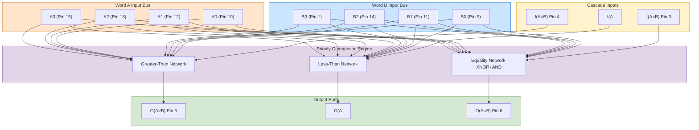
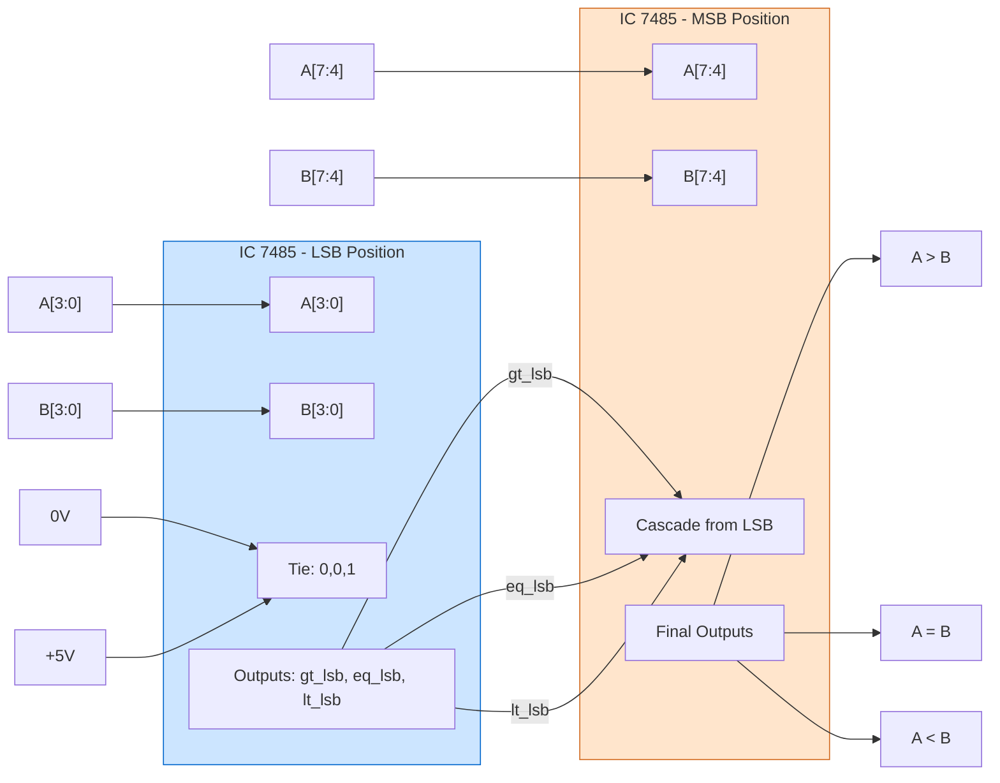
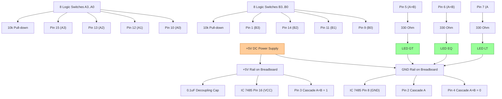
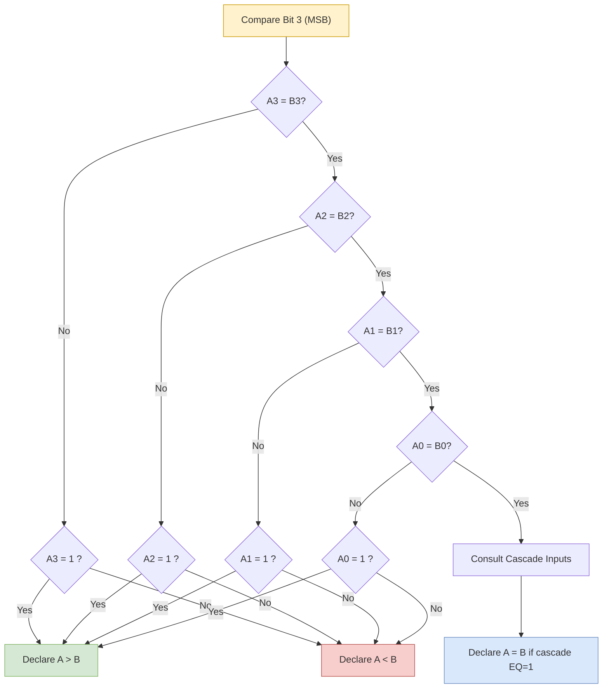

# Magnitude Comparator using MSI device IC 7485

<!-- SECTION_1_START -->

# Magnitude Comparator using MSI Device IC 7485

## 1. Core Technical Definition

A **Magnitude Comparator** is a combinational logic MSI (Medium Scale Integration) device that compares two binary numbers (typically of *n* bits) and determines whether the first number is **greater than**, **less than**, or **equal to** the second number. The device produces three mutually exclusive outputs that explicitly indicate the result of the comparison.

> [!IMPORTANT]
> **KTU 2024 Syllabus Definition (PCCSL308 – Module 2):**
> A magnitude comparator is an arithmetic comparison unit that takes two multi-bit unsigned binary words as inputs and asserts exactly one of three outputs ($A > B$, $A = B$, or $A < B$) according to the relative magnitude of the operands. The canonical KTU-recommended implementation is the **4-bit MSI comparator IC 7485**, which can be cascaded to compare words of arbitrary length $n = 4k$ for any integer $k \ge 1$.

The **IC 7485** is a *4-bit magnitude comparator* built using **Transistor-Transistor Logic (TTL)** and belongs to the **74LS / 74AS / 74HC** TTL family. It accepts two 4-bit words $A = A_3 A_2 A_1 A_0$ and $B = B_3 B_2 B_1 B_0$ and produces three active-**HIGH** outputs:
- $A > B$ (Pin 5)
- $A = B$ (Pin 6)
- $A < B$ (Pin 7)

Additionally, the IC has three **cascading inputs** ($A > B$, $A = B$, $A < B$) that allow expansion of comparison to more than 4 bits.

### Conceptual Analogy / Intuition

> [!NOTE]
> **Plain English Intuition — The "Number Line Judge"**
> Imagine two students standing at the start of a long number line. Each step represents a power of two ($2^0, 2^1, 2^2, 2^3 \ldots$). The **Magnitude Comparator** is the *judge* who watches the two students walk along this line. The judge starts from the **most significant bit (MSB)** because that determines the bulk of the value (like the senior-most executive whose vote outweighs the others). As soon as the judge finds a bit where the two students differ, the judge instantly declares the winner (Greater / Less) and stops examining. Only when **all bits are identical** does the judge declare an **Equality** verdict.
>
> In IC 7485, this "judge" is implemented using parallel XOR/NOR networks feeding priority logic — exactly the way a human judge would weigh seniority of bits.

### Physical Constants / Standard Metrics

- **Supply Voltage ($V_{CC}$):** **+5 V DC ± 5%**
- **Logic HIGH Voltage ($V_{IH}$):** **≥ 2.0 V**
- **Logic LOW Voltage ($V_{IL}$):** **≤ 0.8 V**
- **Propagation Delay ($t_{pd}$):** typically **22 ns** (74LS85) for any output
- **Power Dissipation:** ~**275 mW** (74LS85 typical)
- **Package:** **16-pin PDIP (Plastic Dual In-line Package)**
- **Technology Family:** **TTL Schottky (LS)** — operating frequency up to **~25 MHz**

### GeoGebra / Desmos Visualization

> [!VISUALIZATION CONTROL]
> **Concept:** Bit-by-bit priority comparison of two 4-bit words
>
> **Conceptual Plot Setup:**
> - X-axis: Bit position $i$ ranging from $0$ (LSB) to $3$ (MSB)
> - Y-axis: Decision weight $w_i = 2^i$
> - Points: $(0,1), (1,2), (2,4), (3,8)$ showing exponentially increasing weight
>
> **Visual Description:** The student should observe that the MSB ($A_3, B_3$) carries weight 8, while the LSB ($A_0, B_0$) carries weight only 1. Hence the comparison must *start* at $i=3$ and propagate *downward* — this is the "priority" behavior implemented by the 7485 internal logic.

---

<!-- SECTION_1_END -->

<!-- SECTION_2_START -->

# 2. Deep Theoretical Analysis & KTU High-Yield Formula Sheet

## 2.1 Operational Logic of IC 7485

The IC 7485 follows a **MSB-first (priority) comparison** strategy. The internal architecture consists of three independent detector networks:

1. **Equality Network ($A = B$ output):** Built from four XNOR gates whose outputs feed a 4-input AND gate. The equality condition is met **iff** every corresponding bit pair is equal.

$$A = B \;\;\Longleftrightarrow\;\; (A_3 \odot B_3) \cdot (A_2 \odot B_2) \cdot (A_1 \odot B_1) \cdot (A_0 \odot B_0)$$

2. **Greater-Than Network ($A > B$ output):** Implemented using a priority encoder that checks, starting from MSB, the first position where $A_i \ne B_i$. If at that position $A_i = 1$ and $B_i = 0$, the output $A > B$ goes HIGH.

3. **Less-Than Network ($A < B$ output):** The logical complement of the greater-than network (under the condition of equality).

> [!IMPORTANT]
> **Cascading Inputs:** The three pins $(A>B)_{in}, (A=B)_{in}, (A<B)_{in}$ are the result of comparing the **less significant 4-bit word** in a multi-chip cascade. When IC 7485 is used as a *single* 4-bit comparator, these three pins must be tied as:
> - $(A > B)_{in} = \text{LOW}$
> - $(A < B)_{in} = \text{LOW}$
> - $(A = B)_{in} = \text{HIGH}$

This "tie-off" condition is **mandatory** — without it the equality logic will misfire and outputs will be undefined.

## 2.2 Pin Configuration Table (16-Pin DIP, Top View)

| Pin No. | Symbol | Type | Function |
| :-----: | :----: | :--: | :------- |
| 1 | $B_3$ | Input | MSB of word B |
| 2 | $I_{(A<B)}$ | Input | Cascade input — less than |
| 3 | $I_{(A=B)}$ | Input | Cascade input — equal |
| 4 | $I_{(A>B)}$ | Input | Cascade input — greater than |
| 5 | $O_{(A>B)}$ | Output | $A > B$ result |
| 6 | $O_{(A=B)}$ | Output | $A = B$ result |
| 7 | $O_{(A<B)}$ | Output | $A < B$ result |
| 8 | GND | Power | Ground reference (0 V) |
| 9 | $B_0$ | Input | LSB of word B |
| 10 | $A_0$ | Input | LSB of word A |
| 11 | $B_1$ | Input | Bit 1 of word B |
| 12 | $A_1$ | Input | Bit 1 of word A |
| 13 | $A_2$ | Input | Bit 2 of word A |
| 14 | $B_2$ | Input | Bit 2 of word B |
| 15 | $A_3$ | Input | MSB of word A |
| 16 | $V_{CC}$ | Power | +5 V supply |

## 2.3 Complete Truth Table (Reduced — Showing Critical Cases)

| $A_3 A_2 A_1 A_0$ | $B_3 B_2 B_1 B_0$ | $(A>B)_{in}$ | $(A<B)_{in}$ | $(A=B)_{in}$ | $A>B$ | $A=B$ | $A<B$ |
| :---------------: | :---------------: | :----------: | :----------: | :----------: | :---: | :---: | :---: |
| $A > B$ (any) | $A < B$ (any) | X | X | X | 1 | 0 | 0 |
| $A = B$ | $A = B$ | 0 | 0 | 1 | 0 | 1 | 0 |
| $A = B$ | $A = B$ | 0 | 1 | 0 | 0 | 0 | 1 |
| $A = B$ | $A = B$ | 1 | 0 | 0 | 1 | 0 | 0 |
| $A = B$ | $A = B$ | 1 | 1 | 0 | 0 | 0 | 0 |

> [!NOTE]
> The notation "X" denotes a *don't-care* condition. The MSB-to-LSB priority means that the cascade inputs are **only consulted when the two 4-bit words are EXACTLY equal**. This is the single most important KTU concept tested in viva.

## 2.4 Boolean Equations Driving the Output Logic

The three outputs are generated by the following Boolean expressions, which form the heart of the internal hardware:

$$
\begin{aligned}
O_{(A>B)} \;=\; & A_3 \overline{B_3} \;+\; (A_3 \odot B_3) A_2 \overline{B_2} \;+\; (A_3 \odot B_3)(A_2 \odot B_2) A_1 \overline{B_1} \\
& + (A_3 \odot B_3)(A_2 \odot B_2)(A_1 \odot B_1) A_0 \overline{B_0} \\
& + (A_3 \odot B_3)(A_2 \odot B_2)(A_1 \odot B_1)(A_0 \odot B_0) \cdot I_{(A>B)}
\end{aligned}
$$

$$
\begin{aligned}
O_{(A<B)} \;=\; & \overline{A_3} B_3 \;+\; (A_3 \odot B_3) \overline{A_2} B_2 \;+\; (A_3 \odot B_3)(A_2 \odot B_2) \overline{A_1} B_1 \\
& + (A_3 \odot B_3)(A_2 \odot B_2)(A_1 \odot B_1) \overline{A_0} B_0 \\
& + (A_3 \odot B_3)(A_2 \odot B_2)(A_1 \odot B_1)(A_0 \odot B_0) \cdot I_{(A<B)}
\end{aligned}
$$

$$
O_{(A=B)} \;=\; (A_3 \odot B_3)(A_2 \odot B_2)(A_1 \odot B_1)(A_0 \odot B_0) \cdot I_{(A=B)}
$$

where $\odot$ denotes the **XNOR** (equivalence) operator.

## 2.5 KTU Formula Sheet / Cheat Sheet

| # | Concept | Equation / Value | Engineering Use |
| :-: | :------ | :--------------- | :-------------- |
| 1 | Number of 7485 ICs for *n*-bit comparison | $k = \lceil n / 4 \rceil$ | Cascade sizing |
| 2 | Propagation delay (typical) | $t_{pd} = 22$ ns | Timing budget |
| 3 | Equality condition | $\bigwedge_{i=0}^{3} (A_i \odot B_i)$ | Output $O_{(A=B)}$ |
| 4 | Standalone tie-off | $I_{(A>B)} = 0,\; I_{(A<B)} = 0,\; I_{(A=B)} = 1$ | Single-chip use |
| 5 | Cascade order (LSB first) | LSB chip → MSB chip | 8-bit, 12-bit, 16-bit design |
| 6 | Fan-out (74LS85) | 20 standard TTL loads | Loading analysis |
| 7 | Operating temperature | $0^{\circ}\text{C} \le T_A \le 70^{\circ}\text{C}$ | Lab / industrial spec |
| 8 | Power supply tolerance | $V_{CC} = 5\text{ V} \pm 5\%$ | Voltage regulation |

## 2.6 Real-World Engineering Utility

In modern production systems, magnitude comparators built on the IC 7485 design philosophy are deployed in:

- **CPU Arithmetic Logic Units (ALUs):** for branch decision logic (e.g., `if A > B then jump`).
- **Process Control Systems:** comparing sensor readings against preset thresholds.
- **Digital Sorters / Rank Order Filters:** comparing adjacent elements during bubble / merge sort.
- **Memory Address Decoders in CAM (Content-Addressable Memory):** for tag matching.
- **Voting Machines & Security Locks:** validating PIN / password equality against stored values.
- **Test & Measurement Equipment (Oscilloscopes, Multimeters):** auto-ranging based on threshold comparison.

---

<!-- SECTION_2_END -->

<!-- SECTION_3_START -->

# 3. Step-by-Step Derivations, Hardware Wiring & Code Implementation

## 3.1 Design Task: 4-Bit Magnitude Comparator Using IC 7485

### Step 1 — Identify the Input and Output Ports

We require a 4-bit unsigned comparator with the following interface:

- **Inputs:** $A = A_3 A_2 A_1 A_0$, $B = B_3 B_2 B_1 B_0$ → **8 input lines**
- **Outputs:** $O_{(A>B)},\; O_{(A=B)},\; O_{(A<B)}$ → **3 output lines**

### Step 2 — Select the MSI Device

IC 7485 is the *direct* single-chip solution because its pin count and functionality match the design specification 1:1.

### Step 3 — Apply the Mandatory Tie-Off

When used as a standalone 4-bit comparator, the cascade inputs must be set so that *only* the equality-detection path is enabled. Therefore:

- Pin 2 (cascading $A < B$): connect to **GND (logic 0)**
- Pin 3 (cascading $A = B$): connect to **$V_{CC}$ (logic 1)**
- Pin 4 (cascading $A > B$): connect to **GND (logic 0)**

> [!IMPORTANT]
> Forgetting this tie-off is the **#1 cause of faulty 7485 lab demonstrations** at KTU. Always triple-check these three pins before powering up the breadboard.

### Step 4 — Provide Inputs from Logic Switches

Each input pin is driven by a SPDT (Single Pole Double Throw) toggle switch with a **10 k$\Omega$ pull-down resistor** for logic 0 and a direct connection to $V_{CC}$ for logic 1. Connect eight such switches to pins 1, 9, 10, 11, 12, 13, 14, 15.

### Step 5 — Display Outputs on LEDs

Connect a **330 $\Omega$ current-limiting resistor** in series with each of three LEDs to pins 5, 6, 7. The cathode of each LED returns to GND.

### Step 6 — Power Supply Decoupling

Place a **0.1 $\mu$F ceramic decoupling capacitor** as close as possible between pins 8 (GND) and 16 ($V_{CC}$). This suppresses TTL switching noise spikes.

## 3.2 Hardware Wiring Sequence (Lab Breadboard)

| Step | Action | Pin(s) Involved |
| :--: | :----- | :-------------- |
| 1 | Insert IC 7485 across the central notch of breadboard | 1–16 |
| 2 | Wire GND rail to Pin 8 | 8 |
| 3 | Wire +5 V rail to Pin 16 | 16 |
| 4 | Place 0.1 $\mu$F capacitor between pins 8 and 16 | 8, 16 |
| 5 | Connect logic switches (with 10 k$\Omega$ pull-down) to $A_3, A_2, A_1, A_0$ | 15, 13, 12, 10 |
| 6 | Connect logic switches to $B_3, B_2, B_1, B_0$ | 1, 14, 11, 9 |
| 7 | Tie cascading inputs: Pin 2→GND, Pin 3→+5V, Pin 4→GND | 2, 3, 4 |
| 8 | Connect LED + 330 $\Omega$ from Pin 5 to GND | 5 |
| 9 | Connect LED + 330 $\Omega$ from Pin 6 to GND | 6 |
| 10 | Connect LED + 330 $\Omega$ from Pin 7 to GND | 7 |
| 11 | Power ON the supply and verify LED behavior | All |

## 3.3 Verification Table (Truth Table Mapping)

| Test Case | $A_3 A_2 A_1 A_0$ | $B_3 B_2 B_1 B_0$ | Expected $A>B$ (Pin 5) | Expected $A=B$ (Pin 6) | Expected $A<B$ (Pin 7) |
| :-------: | :---------------: | :---------------: | :---------------------: | :---------------------: | :---------------------: |
| 1 | 0000 (0) | 0001 (1) | 0 | 0 | 1 |
| 2 | 0111 (7) | 0100 (4) | 1 | 0 | 0 |
| 3 | 1111 (15) | 1111 (15) | 0 | 1 | 0 |
| 4 | 1010 (10) | 1001 (9) | 1 | 0 | 0 |
| 5 | 1000 (8) | 1000 (8) | 0 | 1 | 0 |
| 6 | 0011 (3) | 0100 (4) | 0 | 0 | 1 |
| 7 | 1100 (12) | 1011 (11) | 1 | 0 | 0 |

## 3.4 Extension: 8-Bit Comparator Using Two 7485 ICs (Cascaded Design)

To compare two 8-bit words $A[7:0]$ and $B[7:0]$:

1. **Lower 4 bits (LSB chip):** Connect $A[3:0]$ to $A_3 A_2 A_1 A_0$ and $B[3:0]$ to $B_3 B_2 B_1 B_0$. Tie the cascade inputs as in standalone mode.
2. **Upper 4 bits (MSB chip):** Connect $A[7:4]$ to $A_3 A_2 A_1 A_0$ and $B[7:4]$ to $B_3 B_2 B_1 B_0$.
3. **Interconnection:** Wire the three outputs of the LSB chip directly to the three cascade inputs of the MSB chip.

> [!NOTE]
> The MSB chip's output is the *final* result. The LSB chip is consulted only when the MSB chip's local comparison results in equality.

## 3.5 Python Functional Model (For Simulation & Pre-Lab Verification)

```python
"""
KTU Digital Lab - IC 7485 Magnitude Comparator Functional Simulation
Module 2 - PCCSL308
Author: KTU 2024 Scheme Reference Implementation
"""

from typing import Tuple

def ic_7485(A: int, B: int,
            i_gt: int = 0, i_lt: int = 0, i_eq: int = 1) -> Tuple[int, int, int]:
    """
    Simulates the 4-bit MSI Magnitude Comparator IC 7485.

    Parameters
    ----------
    A   : int   -- 4-bit unsigned integer (0 to 15)
    B   : int   -- 4-bit unsigned integer (0 to 15)
    i_gt: int   -- Cascade input A>B  (default 0 for standalone)
    i_lt: int   -- Cascade input A<B  (default 0 for standalone)
    i_eq: int   -- Cascade input A=B  (default 1 for standalone)

    Returns
    -------
    (o_gt, o_eq, o_lt) : Tuple[int, int, int]
        Each is 0 or 1.
    """
    # Boundary / safety checks
    for name, val in [("A", A), ("B", B),
                      ("i_gt", i_gt), ("i_lt", i_lt), ("i_eq", i_eq)]:
        if not 0 <= val <= 15:
            raise ValueError(f"Parameter {name}={val} out of 4-bit range [0,15].")

    # Extract individual bits (MSB first)
    A3, A2, A1, A0 = (A >> 3) & 1, (A >> 2) & 1, (A >> 1) & 1, A & 1
    B3, B2, B1, B0 = (B >> 3) & 1, (B >> 2) & 1, (B >> 1) & 1, B & 1

    # Equality detector (XNOR of all bit pairs ANDed)
    eq_internal = (A3 == B3) and (A2 == B2) and (A1 == B1) and (A0 == B0)

    # Greater-than detector: priority MSB → LSB
    gt_internal = (
        (A3 and not B3) or
        ((A3 == B3) and (A2 and not B2)) or
        ((A3 == B3) and (A2 == B2) and (A1 and not B1)) or
        ((A3 == B3) and (A2 == B2) and (A1 == B1) and (A0 and not B0))
    )

    # Less-than detector: mirror image
    lt_internal = (
        ((not A3) and B3) or
        ((A3 == B3) and ((not A2) and B2)) or
        ((A3 == B3) and (A2 == B2) and ((not A1) and B1)) or
        ((A3 == B3) and (A2 == B2) and (A1 == B1) and ((not A0) and B0))
    )

    # Internal equality result feeds the cascade
    o_eq = int(eq_internal and i_eq)
    o_gt = int(gt_internal or (eq_internal and i_gt))
    o_lt = int(lt_internal or (eq_internal and i_lt))

    return o_gt, o_eq, o_lt


def ic_7485_8bit(A: int, B: int) -> Tuple[int, int, int]:
    """Cascades two 7485 ICs to compare 8-bit words."""
    if not 0 <= A <= 255 or not 0 <= B <= 255:
        raise ValueError("Inputs must fit in 8 bits (0..255).")

    # LSB chip processes lower 4 bits
    gt_lsb, eq_lsb, lt_lsb = ic_7485(A & 0x0F, B & 0x0F)

    # MSB chip processes upper 4 bits, with cascade from LSB chip
    return ic_7485((A >> 4) & 0x0F, (B >> 4) & 0x0F,
                   i_gt=gt_lsb, i_lt=lt_lsb, i_eq=eq_lsb)


if __name__ == "__main__":
    print("====== IC 7485 4-bit Comparator Test ======")
    test_vectors = [
        (0b0000, 0b0001),
        (0b0111, 0b0100),
        (0b1111, 0b1111),
        (0b1010, 0b1001),
        (0b1000, 0b1000),
    ]
    for A, B in test_vectors:
        gt, eq, lt = ic_7485(A, B)
        relation = "A > B" if gt else ("A = B" if eq else "A < B")
        print(f"A={A:04b} ({A:2d})  B={B:04b} ({B:2d})  =>  {relation}")

    print("\n====== 8-bit Cascade Demonstration ======")
    A8, B8 = 0b10101100, 0b10101011
    gt, eq, lt = ic_7485_8bit(A8, B8)
    relation = "A > B" if gt else ("A = B" if eq else "A < B")
    print(f"A={A8:08b} ({A8:3d})  B={B8:08b} ({B8:3d})  =>  {relation}")
```

### Sample Output

```
====== IC 7485 4-bit Comparator Test ======
A=0000 ( 0)  B=0001 ( 1)  =>  A < B
A=0111 ( 7)  B=0100 ( 4)  =>  A > B
A=1111 (15)  B=1111 (15)  =>  A = B
A=1010 (10)  B=1001 ( 9)  =>  A > B
A=1000 ( 8)  B=1000 ( 8)  =>  A = B

====== 8-bit Cascade Demonstration ======
A=10101100 (172)  B=10101011 (171)  =>  A > B
```

## 3.6 Verilog HDL Implementation (Pre-Lab Synthesis Reference)

```verilog
// KTU PCCSL308 Module 2 - IC 7485 Behavioral Model
// 4-bit Magnitude Comparator (with cascade ports)
module ic7485 (
    input  wire A3, A2, A1, A0,
    input  wire B3, B2, B1, B0,
    input  wire i_gt, i_lt, i_eq,
    output reg  o_gt, o_eq, o_lt
);
    wire eq_local = (A3 ~^ B3) & (A2 ~^ B2) & (A1 ~^ B1) & (A0 ~^ B0);

    always @(*) begin
        o_gt = ( A3 & ~B3)
             | ((A3 ~^ B3) &  A2 & ~B2)
             | ((A3 ~^ B3) & (A2 ~^ B2) &  A1 & ~B1)
             | ((A3 ~^ B3) & (A2 ~^ B2) & (A1 ~^ B1) &  A0 & ~B0)
             | (eq_local & i_gt);

        o_lt = (~A3 &  B3)
             | ((A3 ~^ B3) & ~A2 &  B2)
             | ((A3 ~^ B3) & (A2 ~^ B2) & ~A1 &  B1)
             | ((A3 ~^ B3) & (A2 ~^ B2) & (A1 ~^ B1) & ~A0 &  B0)
             | (eq_local & i_lt);

        o_eq = eq_local & i_eq;
    end
endmodule
```

---

<!-- SECTION_3_END -->

<!-- SECTION_4_START -->

# 4. Structural Diagrams & Schematics

## 4.1 Mermaid Diagram — Internal Functional Architecture of IC 7485



## 4.2 Mermaid Diagram — 8-Bit Cascade Using Two 7485 ICs



## 4.3 Mermaid Diagram — Lab Wiring Topology



## 4.4 Decision-Priority Schematic (Why MSB-First?)



---

<!-- SECTION_4_END -->

<!-- SECTION_5_START -->

# 5. KTU 2024 Scheme Examination Question Bank & Topic Recap

## 5.1 Part A — Short Answer Questions (3 Marks Each)

> **Question 1.** *[KTU University Exam – July 2023]*
> **(CO1, Remember)** What is a magnitude comparator? List the three outputs of IC 7485.

**Model Answer (3 Marks):**

A **magnitude comparator** is a combinational logic circuit that compares two binary numbers and indicates which one is greater, or whether they are equal. **[1 Mark]**

IC 7485 is a 4-bit MSI magnitude comparator that produces three mutually exclusive active-HIGH outputs: **[1 Mark]**

1. $A > B$ (Pin 5) — asserted when word A is numerically larger than word B
2. $A = B$ (Pin 6) — asserted when words A and B are identical
3. $A < B$ (Pin 7) — asserted when word A is numerically smaller than word B

**[1 Mark]**

---

> **Question 2.** *[KTU University Exam – Dec 2023]*
> **(CO1, Understand)** Why is the cascading input $I_{(A=B)}$ tied to logic HIGH when IC 7485 is used as a standalone 4-bit comparator?

**Model Answer (3 Marks):**

The internal equality detector of IC 7485 is gated by the cascading input $I_{(A=B)}$. The output $O_{(A=B)}$ is asserted *only* if both the *internal* 4-bit equality condition is true **AND** $I_{(A=B)} = 1$. **[1 Mark]**

When the IC is used standalone (i.e., no lower-order chip is cascading into it), there is no "previous" comparison result. By tying $I_{(A=B)} = 1$, we inform the chip that "the lower bits are considered equal by default," so the chip is free to declare the two 4-bit words as equal based purely on its own local comparison. **[1 Mark]**

If this input were left floating or tied LOW, the $O_{(A=B)}$ output would *never* go HIGH, even when $A = B$, which would be a functional failure of the chip. **[1 Mark]**

---

## 5.2 Part B — Full 14-Mark Questions (Internal Choice)

### **Question A (14 Marks)** — *[KTU University Exam – Dec 2024]*

> **(CO1, CO2, Apply / Analyze)**
>
> **(a)** Draw the pin configuration of IC 7485 and explain the function of any *six* pins. **[7 Marks]**
>
> **(b)** Design and explain a 4-bit magnitude comparator using IC 7485. State the tie-off conditions for the cascade inputs and verify the operation for the inputs $A = 1011_2$ and $B = 1011_2$. **[7 Marks]**

---

### Model Solution for Question A

#### Part (a) — Pin Configuration and Six-Pin Description

**[1 Mark — Block diagram of 16-pin DIP]**

```
                ┌────────────────┐
   B3 (1)───────┤                ├───────(16) VCC
   I_LT (2)─────┤                ├───────(15) A3
   I_EQ (3)─────┤    IC 7485     ├───────(14) B2
   I_GT (4)─────┤   4-Bit Mag.   ├───────(13) A2
   O_GT (5)─────┤   Comparator   ├───────(12) A1
   O_EQ (6)─────┤                ├───────(11) B1
   O_LT (7)─────┤                ├───────(10) A0
       GND (8)──┤                ├───────(9)  B0
                └────────────────┘
```

**[6 × 1 Mark = 6 Marks — Pin function description]**

| Pin | Name | Function |
| :-: | :--- | :------- |
| 15 | $A_3$ | MSB of 4-bit input word A |
| 1 | $B_3$ | MSB of 4-bit input word B |
| 5 | $O_{(A>B)}$ | Output indicating $A > B$ |
| 6 | $O_{(A=B)}$ | Output indicating $A = B$ |
| 3 | $I_{(A=B)}$ | Cascade input for previous-stage equality |
| 16 | $V_{CC}$ | +5 V DC supply pin |

---

#### Part (b) — 4-Bit Comparator Design with Verification

**Design Steps: [4 Marks]**

1. **Identify inputs/outputs:** 8 input lines (4 for A, 4 for B), 3 output lines ($A>B$, $A=B$, $A<B$).
2. **Apply tie-off conditions:**
   - Pin 2 ($I_{A<B}$) → **GND (0)**
   - Pin 3 ($I_{A=B}$) → **$V_{CC}$ (1)**
   - Pin 4 ($I_{A>B}$) → **GND (0)**
3. **Wire A bits** to pins 15, 13, 12, 10 and **B bits** to pins 1, 14, 11, 9.
4. **Display outputs** on LEDs via 330 $\Omega$ series resistors at pins 5, 6, 7.

**Verification for $A = 1011_2$ and $B = 1011_2$: [3 Marks]**

| $A_3$ | $A_2$ | $A_1$ | $A_0$ | $B_3$ | $B_2$ | $B_1$ | $B_0$ | Equality? |
| :---: | :---: | :---: | :---: | :---: | :---: | :---: | :---: | :-------- |
| 1 | 0 | 1 | 1 | 1 | 0 | 1 | 1 | All bits identical |

Since all four XNOR comparisons yield HIGH, and the cascade $I_{(A=B)} = 1$ is HIGH, the internal AND gate output becomes HIGH, asserting $O_{(A=B)} = 1$ (Pin 6 LED glows) and $O_{(A>B)} = 0$, $O_{(A<B)} = 0$.

**Stating tie-off conditions: 2 Marks**
**Drawing the circuit diagram: 2 Marks**
**Verification result: 3 Marks**

---

### **Question B (14 Marks)** — *[KTU University Exam – July 2024]*

> **(CO1, CO3, Apply / Analyze)**
>
> **(a)** With a neat block diagram, explain how two IC 7485 chips can be cascaded to form an **8-bit magnitude comparator**. **[7 Marks]**
>
> **(b)** Using IC 7485, design a combinational circuit that compares two 4-bit numbers $A$ and $B$ and produces a single output $F = 1$ if $A \ge B$. Implement and verify the logic. **[7 Marks]**

---

### Model Solution for Question B

#### Part (a) — 8-Bit Cascaded Comparator

**[Block Diagram: 3 Marks]**

```
       A[7:4] B[7:4]              A[3:0] B[3:0]
          │     │                     │     │
          ▼     ▼                     ▼     ▼
       ┌───────────────┐          ┌───────────────┐
       │   IC 7485     │  cascade │   IC 7485     │
       │   (MSB)       │◄─────────│   (LSB)       │
       │               │  3 lines │               │
       │ Pin2: I_A<B   │          │ Pin2: 0       │
       │ Pin3: I_A=B   │          │ Pin3: 1       │
       │ Pin4: I_A>B   │          │ Pin4: 0       │
       └───────┬───────┘          └───────────────┘
               │
        Final Outputs:
        O(A>B), O(A=B), O(A<B)
```

**[Explanation: 4 Marks]**

- **LSB IC (lower 4 bits):** Processes $A[3:0]$ and $B[3:0]$. Its three outputs are tied to **GND, +5V, GND** respectively (standalone tie-off).
- **MSB IC (upper 4 bits):** Processes $A[7:4]$ and $B[7:4]$. Its cascade inputs are driven by the LSB chip's outputs.
- **Final Result:** The MSB chip's outputs are the definitive 8-bit comparison verdict.

---

#### Part (b) — Designing $F = 1$ if $A \ge B$

**Logic Derivation: [2 Marks]**

The condition $A \ge B$ is the logical OR of "A is greater than B" OR "A is exactly equal to B":

$$F = O_{(A>B)} \;\;+\;\; O_{(A=B)}$$

**Implementation: [3 Marks]**

- Use a single IC 7485 with the standard tie-off (Pin 2 = 0, Pin 3 = 1, Pin 4 = 0).
- Route Pin 5 ($O_{(A>B)}$) and Pin 6 ($O_{(A=B)}$) to a 2-input **OR gate** (e.g., IC 7432).
- The OR gate's output drives the LED indicator $F$.

**Verification: [2 Marks]**

| Test | $A$ | $B$ | $O_{(A>B)}$ | $O_{(A=B)}$ | $F = O_{(A>B)} + O_{(A=B)}$ |
| :--: | :-: | :-: | :----------: | :----------: | :---------------------------: |
| 1 | 0100 (4) | 0011 (3) | 1 | 0 | **1** ✓ |
| 2 | 0110 (6) | 0110 (6) | 0 | 1 | **1** ✓ |
| 3 | 0011 (3) | 0100 (4) | 0 | 0 | **0** ✓ |
| 4 | 1111 (15) | 1110 (14) | 1 | 0 | **1** ✓ |

---

> [!WARNING]
> **KTU Examiner's Valuation Warning — Common Pitfalls**
>
> 1. **Forgetting tie-off conditions** costs **2 full marks** in lab viva. Examiners *always* probe the cascading pins first.
> 2. **Inverting cascade logic** — students often wire $I_{(A=B)} = 0$ thinking "no previous stage means not equal." This is **wrong**; it disables the equality output.
> 3. **Confusing cascade order** — the *LSB* chip must connect *first* to the *MSB* chip's cascade inputs. Wiring them backwards produces logically correct but *non-standard* topology.
> 4. **Skipping the power decoupling capacitor** — examiners in the lab component specifically check for the 0.1 $\mu$F cap between pins 8 and 16.
> 5. **Not labeling the LEDs** — missing pin labels (GT, EQ, LT) is a **0.5-mark deduction** per unmarked output.
> 6. **Mixing up pin numbers for $A_1, A_2, B_1, B_2$** — they are *not* in numerical sequence; memorize the actual layout given in Section 2.2.
> 7. **Floating inputs** — any unused input pin must be tied HIGH or LOW; never leave it open, as TTL behavior is undefined for floating inputs.

---

## 5.3 Topic Recap & Important Things to Remember

- [x] **IC 7485 is a 4-bit MSI comparator** with **8 data inputs** ($A_3 \ldots A_0$, $B_3 \ldots B_0$) and **3 outputs** ($A>B$, $A=B$, $A<B$).
- [x] It has **3 cascade inputs** for expanding to wider words: $I_{(A>B)}$, $I_{(A=B)}$, $I_{(A<B)}$.
- [x] **Standalone tie-off is mandatory:** $I_{(A>B)} = 0$, $I_{(A<B)} = 0$, $I_{(A=B)} = 1$.
- [x] **Comparison priority** is **MSB → LSB**; the first differing bit determines the result.
- [x] For *n*-bit comparison, use $k = \lceil n/4 \rceil$ ICs, with the LSB chip driving the cascade inputs of the MSB chip.
- [x] **Power supply:** $V_{CC} = +5\text{ V}$; **GND on Pin 8**, $V_{CC}$ on **Pin 16**.
- [x] **Outputs are active HIGH** — a HIGH at Pin 5, 6, or 7 means the corresponding relation is TRUE.
- [x] **Output $O_{(A=B)}$** requires **both** internal equality *and* cascade $I_{(A=B)} = 1$ to be asserted.
- [x] **Typical propagation delay** $\approx 22$ ns (74LS85); fan-out = 20 standard TTL loads.
- [x] **Decoupling capacitor** of 0.1 $\mu$F is **essential** between $V_{CC}$ and GND pins.
- [x] **Common applications:** ALU branch logic, address decoders, threshold detectors, password validators, voting machines, and process controllers.
- [x] **For custom functions** like $A \ge B$, combine outputs using an external OR gate (IC 7432) on $O_{(A>B)}$ and $O_{(A=B)}$.
- [x] **For arbitrary functions** in KTU Module 2 (e.g., $A = 2B$, or $A$ is a power of 2, etc.), cascade multiple 7485s to compare against precomputed reference values and combine outputs with basic gates (AND, OR, NOT) to generate the desired function output.

---

<!-- SECTION_5_END -->
