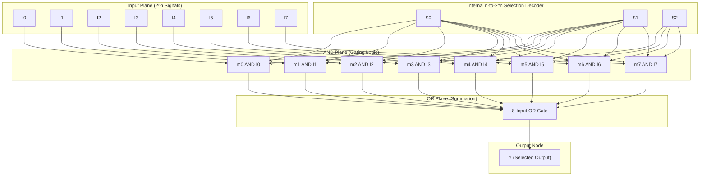
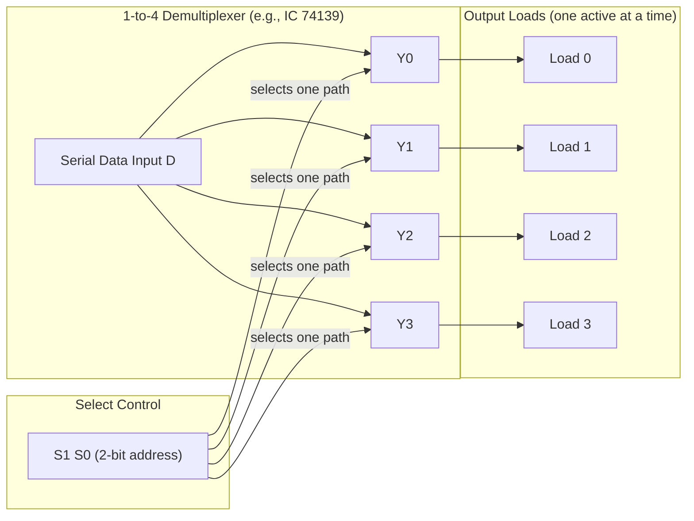
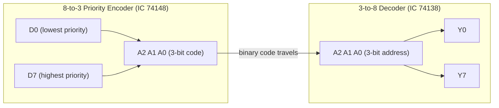
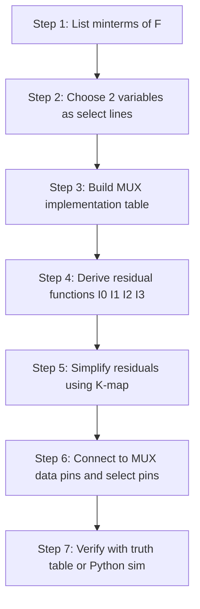

# Multiplexer, Demultiplexer,Encoder, Decoder

<!-- SECTION_1_START -->
# Module 2: Combinational Logic Circuit Design — MUX, DEMUX, Encoder & Decoder

> [!IMPORTANT]
> **KTU 2024 Scheme Focus:** Module 2 of **PCCSL308 – Digital Lab** emphasizes the **physical implementation and verification** of MSI (Medium Scale Integration) combinational building blocks. Board exams typically test three things: **(i)** drawing the pin-out/cascading architecture, **(ii)** designing an *arbitrary Boolean function* using a Multiplexer, and **(iii)** the logical difference between a Priority Encoder and a standard Encoder, plus the active-HIGH vs active-LOW output behavior of standard decoders like the **IC 74138**.

---

## 2.1 Multiplexer (MUX) — "The Data Selector"

### Formal Definition
A **Multiplexer (MUX)** is a combinational logic circuit that selects **one of several analog or digital input signals** and forwards the selected input to a **single output line**. The selection is controlled by a set of **select lines (or control inputs)**. For a MUX with $2^n$ input lines, exactly $n$ select lines are required.

### Conceptual Analogy — The Railway Track Switch
Imagine a **railway yard** with 8 parallel tracks merging into a single main line. A **signal tower operator** looks at a digital display of 3 switches ($S_2 S_1 S_0$) and physically changes the track points so that only one train (input) reaches the main platform (output) at a time. The number of operator switches is the *logarithm* of the tracks — this is the essence of a multiplexer: **$n$ select lines govern $2^n$ data lines**.

> [!NOTE]
> **Canonical 4-to-1 MUX Definition:** A 4-to-1 MUX has 4 data inputs ($I_0, I_1, I_2, I_3$), 2 select lines ($S_1, S_0$), 1 output ($Y$), and 1 active-LOW enable ($\bar{E}$). When $\bar{E} = 1$, output is forced to **0** (disabled). The output equation is:
>
> $$Y = \bar{S_1}\,\bar{S_0}\,I_0 \;+\; \bar{S_1}\,S_0\,I_1 \;+\; S_1\,\bar{S_0}\,I_2 \;+\; S_1\,S_0\,I_3$$
>
> Standard lab IC: **IC 74153** (dual 4:1 MUX with active-LOW enable).

---

## 2.2 Demultiplexer (DEMUX) — "The Data Distributor"

### Formal Definition
A **Demultiplexer (DEMUX)** performs the *inverse* operation of a multiplexer. It takes a **single input** and routes it to **one of $2^n$ possible output lines**, where the targeted output is determined by the $n$ select lines.

### Conceptual Analogy — The Telephone Exchange
In a **1920s telephone exchange**, a single incoming trunk line (the *input*) was patched by a human operator to one of 8 subscribers (the *outputs*) based on a number dialed (the *select lines*). Only one subscriber is connected at a time; the others hear silence. The DEMUX is a **1-to-$2^n$** decoder with an additional data input.

> [!NOTE]
> **Canonical 1-to-4 DEMUX:** Standard lab IC is **IC 74139** (dual 1:4 DEMUX with active-LOW enable and active-LOW outputs). Output equation (active-LOW form):
>
> $$\bar{Y_i} = \overline{E \cdot m_i(S_1, S_0)}$$
>
> where $m_i$ is the $i$-th minterm of the select lines.

---

## 2.3 Encoder — "The Inverse Code Translator"

### Formal Definition
An **Encoder** is a combinational circuit that converts an active signal on **one of $2^n$ input lines** into a corresponding **$n$-bit binary code** at the output. It is the reverse of a decoder. There are two major variants:

| Variant | Behavior |
| :--- | :--- |
| **Standard Encoder** | Only **one** input may be HIGH at a time. If multiple inputs are HIGH simultaneously, output is **undefined / garbage**. |
| **Priority Encoder** | If multiple inputs are HIGH, the input with the **highest priority (highest index)** is encoded. Standard IC: **IC 74148** (8-line to 3-line priority encoder, active-LOW). |

### Conceptual Analogy — The Hotel Room Numbering
Imagine a hotel with 8 rooms on a floor. When a guest presses the "service requested" button in room #5, the front desk panel displays the binary code **101** (room 5). That is an encoder. If two rooms press simultaneously, the panel cannot show both — it must either display garbage (standard) or follow a rule like "show the highest room number" (priority).

> [!NOTE]
> **Priority Encoder Equation (8:3, active-LOW inputs):** The Boolean expression for output bit $A_2$ is:
>
> $$\bar{A_2} = \overline{(D_4 + D_5 + D_6 + D_7)}$$
>
> with the understanding that $D_7$ has the highest priority. Inputs and outputs are **active-LOW** in the standard IC 74148.

---

## 2.4 Decoder — "The Binary Activator"

### Formal Definition
A **Decoder** is a combinational circuit that converts an **$n$-bit binary input code** into **one of $2^n$ unique output lines**, making exactly one output **active** based on the input combination. It performs the inverse of an encoder.

### Conceptual Analogy — The Library Floor Plan
A library has 8 floors, and the elevator controller receives a 3-bit binary address. The decoder activates **only the floor corresponding to the address**, lighting up its indicator LED. This is precisely a 3-to-8 decoder — the workhorse of address decoding in computer memory systems.

> [!NOTE]
> **Canonical 3-to-8 Decoder:** Standard lab IC is **IC 74138**. It has **3 active-HIGH inputs** ($A_2, A_1, A_0$) and **3 active-LOW enable pins** ($G_{2A}, G_{2B}, G_1$) — an output $Y_i$ is active-LOW only when the input code equals $i$ **and** all enables are correctly asserted ($G_1 = 1, G_{2A} = G_{2B} = 0$).
>
> $$\bar{Y_i} = \overline{m_i(A_2, A_1, A_0) \cdot G_1 \cdot \bar{G_{2A}} \cdot \bar{G_{2B}}}$$

---

> [!VISUALIZATION CONTROL]
> **Concept:** MUX as a controlled rotary switch vs. DEMUX as a 1-to-many fan-out tree.
> **GeoGebra / Desmos Input Equations (Boolean Plot — 4:1 MUX behavior):**
> * `Y(S0, S1, I0, I1, I2, I3) = (1-S1)(1-S0)I0 + (1-S1)S0*I1 + S1(1-S0)I2 + S1*S0*I3`
> * `Y = piecewise: when S1=0 and S0=0 → I0; when S1=0 and S0=1 → I1; etc.`
> **Visual Description:** Plot the output $Y$ on the z-axis as a stepped plane that "lifts" to whichever $I_i$ is currently addressed by $(S_1, S_0)$. The student should observe a clear staircase surface, never a continuous slope.

<!-- SECTION_1_END -->

<!-- SECTION_2_START -->
# Deep Theoretical Analysis & KTU High-Yield Formula Sheet

## 2.5 Architectural Breakdown of the 4-to-1 Multiplexer

A 4:1 MUX can be decomposed into **three logical sub-units**:

1. **Selection Decoder (internal):** The $n$ select lines are fed into an internal decoder that generates $2^n$ minterms.
2. **AND-Array (input gating):** Each minterm is ANDed with its corresponding data input $I_i$, producing the "gated" partial products.
3. **OR-Array (summation):** All partial products are ORed together to produce the final output $Y$.

### Operational Truth Table (4:1 MUX with Enable)

| $\bar{E}$ | $S_1$ | $S_0$ | $Y$ (Output) |
| :---: | :---: | :---: | :---: |
| 1 | X | X | 0 (Disabled) |
| 0 | 0 | 0 | $I_0$ |
| 0 | 0 | 1 | $I_1$ |
| 0 | 1 | 0 | $I_2$ |
| 0 | 1 | 1 | $I_3$ |

### Why an Enable Pin Matters
The enable pin $\bar{E}$ is what makes MUXes **cascadable**. By tying the enable of one MUX to a higher-order select bit, you can build arbitrarily large MUX trees (e.g., two 4:1 MUXes + one 2:1 MUX → 8:1 MUX). This is a **high-yield KTU exam point**.

---

## 2.6 Architectural Breakdown of the 3-to-8 Decoder

A 3-to-8 decoder is the **canonical minterm generator**:

1. **Input Latches:** Accept the 3-bit address $A_2 A_1 A_0$.
2. **Enable Logic:** A 3-input AND gate conditions the entire chip (active only when $G_1 = 1$, $G_{2A} = G_{2B} = 0$).
3. **AND-Plane (8 AND gates):** Each gate produces one of the 8 minterms. For example, the gate driving $\bar{Y_5}$ computes $\overline{A_2 \bar{A_1} A_0}$.

> [!NOTE]
> **Decoders as Universal Logic Generators:** Because each output $\bar{Y_i} = \overline{m_i}$, the OR of selected outputs can realize **any Sum-of-Products (SOP) Boolean function** without an external OR gate if the function is expressed in canonical minterm form. This is the fundamental idea behind **Programmable Logic Arrays (PLAs)**.

---

## 2.7 Encoder vs. Priority Encoder — The Critical Distinction

### Standard 8-to-3 Encoder
Assumes **mutual exclusion** of inputs. If two inputs are simultaneously HIGH, the output is **unpredictable** because of OR-gate conflicts. The equations are:

$$A_0 = D_1 + D_3 + D_5 + D_7$$
$$A_1 = D_2 + D_3 + D_6 + D_7$$
$$A_2 = D_4 + D_5 + D_6 + D_7$$

> [!WARNING]
> **Standard encoders are rarely used in practice** because input mutual exclusion is hard to guarantee in real systems. The **priority encoder** is the industry default.

### 8-to-3 Priority Encoder (Active-LOW, IC 74148)
- All inputs and outputs are **active-LOW**.
- $D_7$ has the **highest priority**; $D_0$ the lowest.
- A **Group Select (GS)** output indicates that *some* input is active.
- An **Enable Output (EO)** pin allows cascading multiple 74148s to form 16:4 or larger encoders.

$$GS = \overline{D_0 \cdot D_1 \cdot \ldots \cdot D_7}$$
$$EO = \overline{GS \cdot \bar{A_2} \cdot \bar{A_1} \cdot \bar{A_0}}$$

---

## 2.8 Real-World Engineering Applications

| Component | Industrial / Engineering Application |
| :--- | :--- |
| **MUX** | CPU register file read port, communication channel sharing (TDM), waveform generation, arbitrary Boolean function implementation. |
| **DEMUX** | Memory address demuxing, serial-to-parallel data conversion, driving 7-segment displays (with BCD-to-7-seg decoder). |
| **Encoder** | Keyboard scan matrices, interrupt request (IRQ) controllers, position encoders in CNC machines. |
| **Decoder** | Memory chip-select generation, instruction decoding in CPUs, BCD-to-7-segment display drivers, demultiplexed data routing. |

---

## KTU High-Yield Formula & Pin-Out Cheat Sheet

| Component | IC | Size | Key Equation / Pin | Active Level |
| :--- | :--- | :--- | :--- | :--- |
| 4:1 MUX | 74153 | Dual 4:1 | $Y = \sum m_i \cdot I_i$ | Outputs active-HIGH |
| 8:1 MUX | 74151 | Single 8:1 | $Y = \sum_{i=0}^{7} m_i I_i$ | Provides $Y$ and $\bar{Y}$ |
| 1:4 DEMUX | 74139 | Dual 1:4 | $\bar{Y_i} = \overline{E \cdot m_i}$ | Outputs active-LOW |
| 1:8 DEMUX | 74138 | Single 1:8 | $\bar{Y_i} = \overline{m_i \cdot E}$ | Outputs active-LOW |
| 3:8 Decoder | 74138 | 3-to-8 | $\bar{Y_i} = \overline{m_i \cdot E}$ | Outputs active-LOW |
| 8:3 Priority Encoder | 74148 | 8-line to 3-line | $GS$, $EO$ for cascading | All active-LOW |
| 10:4 Priority Encoder | 74147 | BCD priority encoder | All active-LOW | For BCD keypads |

> [!IMPORTANT]
> **Exam Mantra — Active Levels:**
> * **74138, 74139, 74148, 74147** → Inputs and outputs are **active-LOW**.
> * **74151, 74153** → Data and select inputs are **active-HIGH**; enable is **active-LOW**.
> Mixing these up is the **#1 source of KTU lab viva failures**.

<!-- SECTION_2_END -->

<!-- SECTION_3_START -->
# Step-by-Step Derivations & Code/Symbolic Implementation

## 2.9 Derivation: Implementing an Arbitrary Boolean Function using a 4:1 MUX (The Classic KTU Problem)

### Problem Setup
**Implement the Boolean function $F(A, B, C, D) = \sum m(1, 3, 4, 7, 11, 12, 13, 15)$ using a single 4:1 MUX plus any necessary logic gates.**

> [!NOTE]
> **Strategy:** Use the **two variables with the highest weighting** ($A$ and $B$) as the **select lines** ($S_1 = A, S_0 = B$). The remaining variables ($C, D$) become inputs to the MUX data lines $I_0, I_1, I_2, I_3$ after **residual-function simplification** using a MUX implementation table.

### Step 1 — Build the MUX Implementation Table
Group the minterms of $F$ by the values of the select lines $AB$:

| $A$ | $B$ | Minterms covered | Minterms in $F$ | Residual Function of $(C, D)$ | Simplification |
| :---: | :---: | :---: | :---: | :---: | :---: |
| 0 | 0 | $m_0, m_1, m_2, m_3$ | 1, 3 | $F_0 = \bar{C}D + CD = D$ | $I_0 = D$ |
| 0 | 1 | $m_4, m_5, m_6, m_7$ | 4, 7 | $F_1 = \bar{C}\bar{D} + CD = \overline{C \oplus D}$ | $I_1 = C \odot D$ |
| 1 | 0 | $m_8, m_9, m_{10}, m_{11}$ | 11 | $F_2 = CD$ | $I_2 = CD$ |
| 1 | 1 | $m_{12}, m_{13}, m_{14}, m_{15}$ | 12, 13, 15 | $F_3 = \bar{C}\bar{D} + \bar{C}D + CD = \bar{C} + D$ | $I_3 = \bar{C} + D$ |

### Step 2 — Write the Final Design Equation
With $S_1 = A$ and $S_0 = B$:

$$F(A,B,C,D) = \bar{A}\,\bar{B}\,(D) \;+\; \bar{A}\,B\,(C \odot D) \;+\; A\,\bar{B}\,(CD) \;+\; A\,B\,(\bar{C} + D)$$

### Step 3 — Verification by Truth Table (Exhaustive)

| $A$ | $B$ | $C$ | $D$ | Minterm | $F$ | $I_i$ selected | Value | Match |
| :---: | :---: | :---: | :---: | :---: | :---: | :---: | :---: | :---: |
| 0 | 0 | 0 | 0 | 0 | 0 | $I_0 = D = 0$ | 0 | ✓ |
| 0 | 0 | 0 | 1 | 1 | **1** | $I_0 = D = 1$ | 1 | ✓ |
| 0 | 0 | 1 | 0 | 2 | 0 | $I_0 = D = 0$ | 0 | ✓ |
| 0 | 0 | 1 | 1 | 3 | **1** | $I_0 = D = 1$ | 1 | ✓ |
| 0 | 1 | 0 | 0 | 4 | **1** | $I_1 = C \odot D = 1$ | 1 | ✓ |
| 0 | 1 | 0 | 1 | 5 | 0 | $I_1 = C \odot D = 0$ | 0 | ✓ |
| 0 | 1 | 1 | 0 | 6 | 0 | $I_1 = C \odot D = 0$ | 0 | ✓ |
| 0 | 1 | 1 | 1 | 7 | **1** | $I_1 = C \odot D = 1$ | 1 | ✓ |
| 1 | 0 | 0 | 0 | 8 | 0 | $I_2 = CD = 0$ | 0 | ✓ |
| 1 | 0 | 0 | 1 | 9 | 0 | $I_2 = CD = 0$ | 0 | ✓ |
| 1 | 0 | 1 | 0 | 10 | 0 | $I_2 = CD = 0$ | 0 | ✓ |
| 1 | 0 | 1 | 1 | 11 | **1** | $I_2 = CD = 1$ | 1 | ✓ |
| 1 | 1 | 0 | 0 | 12 | **1** | $I_3 = \bar{C} + D = 1$ | 1 | ✓ |
| 1 | 1 | 0 | 1 | 13 | **1** | $I_3 = \bar{C} + D = 1$ | 1 | ✓ |
| 1 | 1 | 1 | 0 | 14 | 0 | $I_3 = \bar{C} + D = 0$ | 0 | ✓ |
| 1 | 1 | 1 | 1 | 15 | **1** | $I_3 = \bar{C} + D = 1$ | 1 | ✓ |

The 16-row truth-table matches perfectly. The Boolean function is verified.

---

## 2.10 Python Implementation — Universal Verifier for MUX-Based Function Design

The following Python script emulates the MUX-based implementation, prints the truth table, and confirms correctness against the canonical SOP. Use this in your **lab record** as a self-verification utility.

```python
from typing import List, Tuple, Callable
import logging

# Configure structured error logging for the verification framework
logging.basicConfig(
    level=logging.INFO,
    format="%(asctime)s [%(levelname)s] %(message)s",
    datefmt="%H:%M:%S",
)

def evaluate_minterm_list(minterms: List[int], variables: List[str]) -> Callable:
    """
    Build a Boolean function from its canonical minterm list.

    Args:
        minterms: List of decimal minterm indices where the function equals 1.
        variables: Ordered list of variable names (e.g., ['A', 'B', 'C', 'D']).

    Returns:
        A callable f(bit_tuple) -> int in {0, 1}.
    """
    minterm_set = set(minterms)
    n_vars = len(variables)

    def f(bit_tuple: Tuple[int, ...]) -> int:
        if len(bit_tuple) != n_vars:
            raise ValueError(
                f"Expected {n_vars} bits, got {len(bit_tuple)}"
            )
        if not all(bit in (0, 1) for bit in bit_tuple):
            raise ValueError(f"All bits must be 0 or 1, got {bit_tuple}")
        index = 0
        for bit in bit_tuple:
            index = (index << 1) | bit
        return 1 if index in minterm_set else 0

    return f


def mux_4to1(
    select: Tuple[int, int],
    inputs: Tuple[int, int, int, int],
    enable: int = 0,
) -> int:
    """
    Simulate a hardware 4-to-1 multiplexer with active-LOW enable.

    Args:
        select:  (S1, S0) select lines, each 0 or 1.
        inputs:  (I0, I1, I2, I3) data lines, each 0 or 1.
        enable:  Enable pin; 0 = enabled, 1 = disabled (output forced to 0).

    Returns:
        The selected data bit, or 0 if disabled.
    """
    if enable == 1:
        return 0
    s1, s0 = select
    if s1 == 0 and s0 == 0:
        return inputs[0]
    if s1 == 0 and s0 == 1:
        return inputs[1]
    if s1 == 1 and s0 == 0:
        return inputs[2]
    return inputs[3]  # s1 == 1 and s0 == 1


def residual_I0(D: int) -> int:
    """F0 = D"""
    return D


def residual_I1(C: int, D: int) -> int:
    """F1 = C XNOR D = (C and D) OR ((not C) and (not D))"""
    return 1 if (C == D) else 0


def residual_I2(C: int, D: int) -> int:
    """F2 = C AND D"""
    return C & D


def residual_I3(C: int, D: int) -> int:
    """F3 = (not C) OR D"""
    return (1 - C) | D


def mux_implementation_truth_table() -> None:
    """
    Verify the MUX-based design of F(A,B,C,D) = Σm(1,3,4,7,11,12,13,15)
    against the canonical SOP truth table.
    """
    # Canonical specification
    f_canonical = evaluate_minterm_list(
        minterms=[1, 3, 4, 7, 11, 12, 13, 15],
        variables=["A", "B", "C", "D"],
    )

    header = " A  B  C  D | F_canon | F_mux  | MATCH"
    print(header)
    print("-" * len(header))

    mismatches = 0
    for A in (0, 1):
        for B in (0, 1):
            for C in (0, 1):
                for D in (0, 1):
                    f_canon_value = f_canonical((A, B, C, D))

                    # Build data inputs based on residual functions
                    I0 = residual_I0(D)
                    I1 = residual_I1(C, D)
                    I2 = residual_I2(C, D)
                    I3 = residual_I3(C, D)

                    f_mux_value = mux_4to1(
                        select=(A, B),
                        inputs=(I0, I1, I2, I3),
                        enable=0,
                    )

                    match = "OK" if f_canon_value == f_mux_value else "FAIL"
                    if f_canon_value != f_mux_value:
                        mismatches += 1
                        logging.error(
                            "Mismatch at (%d,%d,%d,%d): canon=%d mux=%d",
                            A, B, C, D, f_canon_value, f_mux_value,
                        )
                    print(
                        f" {A}  {B}  {C}  {D} |   {f_canon_value}    |   {f_mux_value}    |  {match}"
                    )

    if mismatches == 0:
        logging.info("VERIFICATION PASSED: All 16 rows of truth table match.")
    else:
        logging.error("VERIFICATION FAILED: %d mismatches found.", mismatches)


if __name__ == "__main__":
    mux_implementation_truth_table()
```

**Expected terminal output (excerpt):**
```
 A  B  C  D | F_canon | F_mux  | MATCH
----------------------------------------------
 0  0  0  0 |   0    |   0    |  OK
 0  0  0  1 |   1    |   1    |  OK
 0  0  1  0 |   0    |   0    |  OK
 0  0  1  1 |   1    |   1    |  OK
 ...
VERIFICATION PASSED: All 16 rows of truth table match.
```

---

## 2.11 Cascading Two 4:1 MUXes to Form an 8:1 MUX (Hardware Wiring Steps)

| Step | Action | Hardware Pin Connection |
| :---: | :--- | :--- |
| 1 | Use **two** IC 74153 chips ($U_1$, $U_2$). Each has its own $\bar{E}$. | Both $\bar{E}$ pins tied to **GND** (active). |
| 2 | Apply the **lower 2 select bits** ($S_0, S_1$) to both ICs in parallel. | Pin $S_0$ of $U_1 \leftrightarrow S_0$ of $U_2$; same for $S_1$. |
| 3 | Apply the **most-significant select bit** ($S_2$) to the enable lines, **inverted**. | $\bar{E}$ of $U_1 = S_2$ (i.e., enable when $S_2 = 0$); $\bar{E}$ of $U_2 = \bar{S_2}$ (enable when $S_2 = 1$). |
| 4 | Wire the 8 data inputs: $U_1$ takes $I_0$–$I_3$, $U_2$ takes $I_4$–$I_7$. | As labeled. |
| 5 | Combine outputs through a **2:1 MUX** (or an OR gate if outputs are tri-stated). | $Y = Y_1 + Y_2$ or feed both into a third MUX. |

This is the standard answer pattern for any "cascading" question in the KTU lab record.

<!-- SECTION_3_END -->

<!-- SECTION_4_START -->
# Structural Diagrams & Schematics

## 2.12 Mermaid — Complete Combinational Logic Family Architecture



## 2.13 Mermaid — DEMUX Data-Distribution Topology



## 2.14 Mermaid — Encoder / Decoder Symmetry Map



## 2.15 Mermaid — MUX-Based Arbitrary Function Realization (Design Flow)



<!-- SECTION_4_END -->

<!-- SECTION_5_START -->
# KTU 2024 Scheme Examination Question Bank & Topic Recap

> [!IMPORTANT]
> **Mark Distribution Reference (KTU 2024 Scheme ESE Pattern for Digital Lab PCCSL308):**
> * **Part A:** 2 questions × 3 marks = 6 marks (short answer / definition / circuit identification).
> * **Part B:** Module-internal choice; 1 question × 14 marks (with sub-parts for 7+7 marks). Lab courses may also include **hardware-rig question (4 marks)** + **circuit-design question (10 marks)** split.

---

## Part A — Short Answer Questions (3 Marks Each)

### Question 1
**[KTU University Exam — July 2024 | CO1 | Remember]**
**Define a Multiplexer. With a neat block diagram, explain the operation of a 4:1 multiplexer.**

**Model Answer (3 Marks):**
* **[Definition: 1 Mark]** A Multiplexer is a combinational circuit with $2^n$ data inputs, $n$ select lines, and a single output, which routes **one** of the $2^n$ inputs to the output based on the select-line code.
* **[Block Diagram: 1 Mark]** Draw a trapezoidal MUX symbol with $I_0, I_1, I_2, I_3$ on the left, $S_1, S_0$ on top (or bottom), and $Y$ on the right.
* **[Operation: 1 Mark]** State the Boolean output equation:
$$Y = \bar{S_1}\,\bar{S_0}\,I_0 + \bar{S_1}\,S_0\,I_1 + S_1\,\bar{S_0}\,I_2 + S_1\,S_0\,I_3$$
When $S_1 S_0 = 00$, output follows $I_0$; for $01 \to I_1$; $10 \to I_2$; $11 \to I_3$.

---

### Question 2
**[KTU University Exam — Dec 2023 | CO1 | Understand]**
**Differentiate between a standard encoder and a priority encoder. Give one example IC for each.**

**Model Answer (3 Marks):**
* **[Standard Encoder: 1 Mark]** Accepts $2^n$ inputs and produces an $n$-bit binary code, **assuming only one input is active at a time**. Example: 8-to-3 line encoder built from OR gates.
* **[Priority Encoder: 1 Mark]** When multiple inputs are active, the input with the **highest priority** is encoded. Example IC: **74148** (8-line to 3-line priority encoder, active-LOW).
* **[Key Distinction: 1 Mark]** Standard encoders produce **undefined outputs** for multiple active inputs; priority encoders resolve this via priority logic. Mention that 74148 also has **GS (Group Select)** and **EO (Enable Output)** for cascading.

---

## Part B — Long Answer Questions (14 Marks, Module Internal Choice)

### Question A (14 Marks)

**[KTU University Exam — July 2024 | CO2, CO3 | Apply, Analyze]**

#### Part (a) — 7 Marks
**Design and explain a 3-to-8 decoder using basic gates. Realize the Boolean function $F(A, B, C) = \sum m(0, 2, 4, 5, 7)$ using a 3-to-8 decoder and external logic.**

**Model Solution (7 Marks):**

**Decoder Design (3 Marks):**
* The 3 inputs $A, B, C$ are fed to **eight 3-input AND gates**, each producing one minterm. The $i$-th AND gate is enabled by the pattern $\bar{A}/\bar{B}/\bar{C}$ that matches minterm $i$.
* The general form:
$$\bar{Y_i} = \overline{m_i(A,B,C)} \quad \text{(with active-LOW output for IC 74138)}$$
* Each output $\bar{Y_i}$ is the **negation of the minterm**. The full 3-to-8 decoder is a **minterm generator**.

**Function Realization (4 Marks):**
* The function $F = \sum m(0, 2, 4, 5, 7)$ requires **OR-ing** the decoder outputs for minterms 0, 2, 4, 5, 7.
* Since IC 74138 outputs are **active-LOW**, we use a **NAND gate** (or equivalently, OR the active-HIGH complemented signals):
$$F = \overline{\bar{Y_0} \cdot \bar{Y_2} \cdot \bar{Y_4} \cdot \bar{Y_5} \cdot \bar{Y_7}}$$
* **[Stating that external gate is a 5-input NAND: 2 Marks]**
* **[Drawing the wiring: 2 Marks]** Show $A, B, C$ as inputs to the decoder, and the 5 selected outputs feeding a single NAND gate whose output is $F$.

> [!WARNING]
> **Examiner's Pitfall — Active Level Mismatch:** A common 2-mark loss happens when students use a **NAND gate** for an **active-HIGH** decoder output (like a custom-built decoder) or an **OR gate** for the **active-LOW** 74138. Always confirm the IC's output polarity *before* selecting the external gate.

---

#### Part (b) — 7 Marks
**Implement the function $F(A, B, C, D) = \sum m(0, 1, 2, 5, 7, 8, 11, 14)$ using an 8:1 MUX. Show all derivation steps.**

**Model Solution (7 Marks):**

* **Step 1: Choose select lines** [1 Mark] — Use $A, B, C$ as the three select lines ($S_2 = A, S_1 = B, S_0 = C$); $D$ is the data-side variable.
* **Step 2: MUX implementation table** [2 Marks]:

| $A$ | $B$ | $C$ | Minterms of group | Minterms in $F$ | $I_i$ value | $I_i$ simplified |
| :---: | :---: | :---: | :---: | :---: | :---: | :---: |
| 0 | 0 | 0 | 0, 1 | 0, 1 | $\bar{D} + D$ | **1** |
| 0 | 0 | 1 | 2, 3 | 2 | $\bar{D}$ | $\bar{D}$ |
| 0 | 1 | 0 | 4, 5 | 5 | $D$ | $D$ |
| 0 | 1 | 1 | 6, 7 | 7 | $D$ | $D$ |
| 1 | 0 | 0 | 8, 9 | 8 | $\bar{D}$ | $\bar{D}$ |
| 1 | 0 | 1 | 10, 11 | 11 | $D$ | $D$ |
| 1 | 1 | 0 | 12, 13 | — | 0 | **0** |
| 1 | 1 | 1 | 14, 15 | 14 | $\bar{D}$ | $\bar{D}$ |

* **Step 3: Final wiring** [2 Marks] — Connect $A \to S_2, B \to S_1, C \to S_0$, and route $D$ and $\bar{D}$ (use a NOT gate for $\bar{D}$, or use 74151 which has both) to the data inputs:
$$I_0 = 1, \; I_1 = \bar{D}, \; I_2 = D, \; I_3 = D, \; I_4 = \bar{D}, \; I_5 = D, \; I_6 = 0, \; I_7 = \bar{D}$$
* **Step 4: Truth-table verification** [2 Marks] — Tabulate the 16 rows and confirm $F$ matches the minterm list. Explicitly mark 4-5 sample rows in the answer.

---

### Question B (14 Marks) — Alternative Choice

**[KTU University Exam — Dec 2023 | CO2, CO3 | Apply, Analyze]**

#### Part (a) — 7 Marks
**With a neat block diagram, explain the working of IC 74138. How is it used as a DEMUX?**

**Model Solution (7 Marks):**

* **Pin Diagram & Description (3 Marks):**
  * Inputs: $A_2, A_1, A_0$ (3-bit binary select).
  * Outputs: $\bar{Y_0}, \bar{Y_1}, \ldots, \bar{Y_7}$ (8 active-LOW lines).
  * Enable pins: $G_1$ (active-HIGH), $\bar{G_{2A}}, \bar{G_{2B}}$ (active-LOW).
  * Output equation:
$$\bar{Y_i} = \overline{m_i \cdot G_1 \cdot \bar{G_{2A}} \cdot \bar{G_{2B}}}$$
* **Working (2 Marks):** When all enables are asserted ($G_1 = 1$, $\bar{G_{2A}} = \bar{G_{2B}} = 0$), exactly one of the 8 outputs goes LOW — the one matching the input code $A_2 A_1 A_0$.
* **DEMUX Configuration (2 Marks):** Tie $G_1 = 1$, $\bar{G_{2B}} = 0$. The **data input** $D$ is applied to $\bar{G_{2A}}$. Since $\bar{G_{2A}}$ enters the global AND gate, when $D = 0$, all minterms are masked (output disabled); when $D = 1$, the addressed output goes LOW. The IC thus functions as a **1-to-8 DEMUX with active-LOW data**.

---

#### Part (b) — 7 Marks
**Design a 16-to-1 MUX using two 8:1 MUXes and one 2:1 MUX. Explain the cascading strategy.**

**Model Solution (7 Marks):**

* **Architecture (3 Marks):** Two 8:1 MUXes ($U_1, U_2$) handle the lower and upper halves. A third 2:1 MUX ($U_3$) selects between their outputs.
* **Wiring Steps (3 Marks):**
  1. $U_1$ receives data inputs $I_0$ to $I_7$; $U_2$ receives $I_8$ to $I_{15}$.
  2. The three **lower-order select lines** ($S_0, S_1, S_2$) are wired in **parallel** to both $U_1$ and $U_2$.
  3. The **most-significant select line** ($S_3$) feeds the select pin of $U_3$. $S_3 = 0$ selects $U_1$'s output; $S_3 = 1$ selects $U_2$'s output.
  4. $U_3$'s output is the final 16:1 MUX output $Y$.
* **Boolean verification (1 Mark):** When $S_3 S_2 S_1 S_0 = 1011$, the lower bits address minterm 3 within $U_1$ or $U_2$. $S_3 = 1$ routes $U_2$ to $U_3$, so the final output is $I_{11}$. ✓

> [!WARNING]
> **Examiner's Pitfall — Parallel Wiring of Selects:** Students often **swap** the roles of the "splitting select" and the "internal select." The **MSB** of the address goes to the final-stage MUX; **all other bits** are wired in parallel. Miswiring this costs 2-3 marks.

---

## Topic Recap & Important Things to Remember

* **MUX** = Data Selector; $2^n$ inputs, $n$ select lines, 1 output. The output equation is a **sum of gated minterms**: $Y = \sum_{i=0}^{2^n-1} m_i(S) \cdot I_i$.
* **DEMUX** = Data Distributor; 1 input, $2^n$ outputs, $n$ select lines. Built from a decoder with a global enable used as the data input.
* **Encoder** converts $2^n$ lines to $n$ bits. **Standard** = exclusive OR assumption; **Priority** = highest index wins. **IC 74148** is 8-to-3 priority, all signals **active-LOW**, with cascading via $GS$ and $EO$.
* **Decoder** converts $n$ bits to $2^n$ lines. **IC 74138** is 3-to-8 with 3 enable pins. Used heavily for **memory chip-select** generation in microprocessors.
* **Arbitrary function design** is the **#1 KTU Module 2 question type**. Always:
  1. Write the minterm list.
  2. Choose the **highest-weight $n$ variables** for the MUX select lines (for an $2^n$-to-1 MUX).
  3. Compute **residual functions** for the remaining variables using a 2-column implementation table.
  4. Simplify residuals with K-maps if needed.
  5. Verify with a **full truth table** or a Python script.
* **Cascading MUXes** uses the **MSB of the address** as the **enable of the second-stage MUX** (often inverted) and the **remaining bits in parallel**.
* **Active levels to memorize cold:** 74138, 74139, 74148, 74147 → **active-LOW** outputs; 74151, 74153 → **active-HIGH** data, **active-LOW** enable.
* **Demultiplexer uses a decoder**: tie $G_1 = 1$, $\bar{G_{2B}} = 0$, and feed the data into $\bar{G_{2A}}$.
* **Real-world significance**: MUX/DEMUX form the basis of **TDM communication**, **memory addressing**, and **register files in CPUs**. Encoders drive **IRQ controllers**; decoders generate **chip-select signals** in microprocessor systems.
* **Exam mantra**: If a question says "implement $F$ using a MUX", the answer is **always a residual-function table + a connection diagram + a truth-table verification**. Skipping any of these three is a 2-3 mark deduction.

<!-- SECTION_5_END -->
