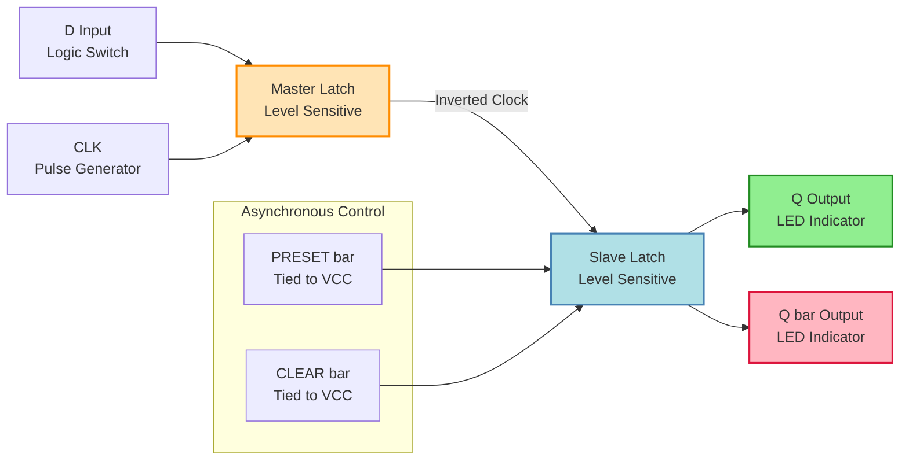
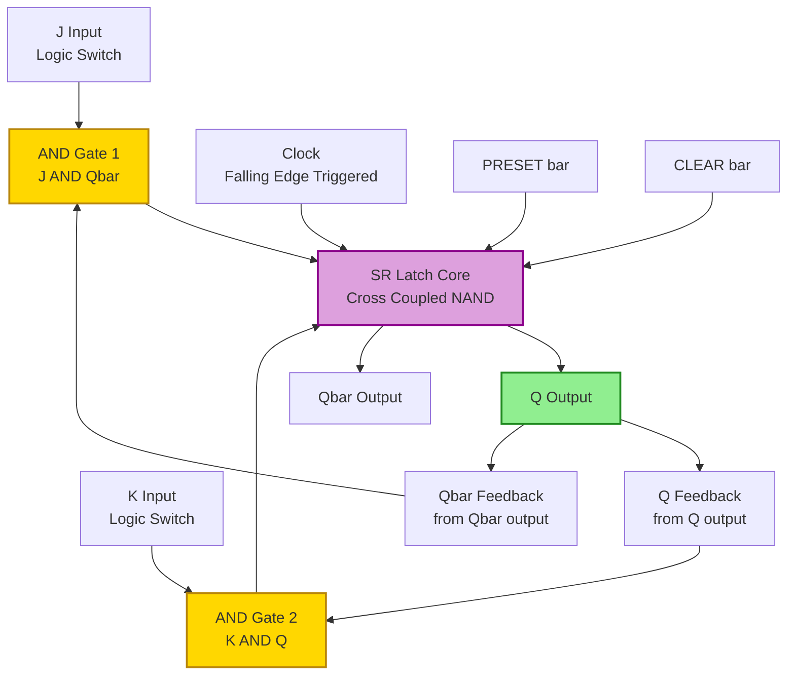
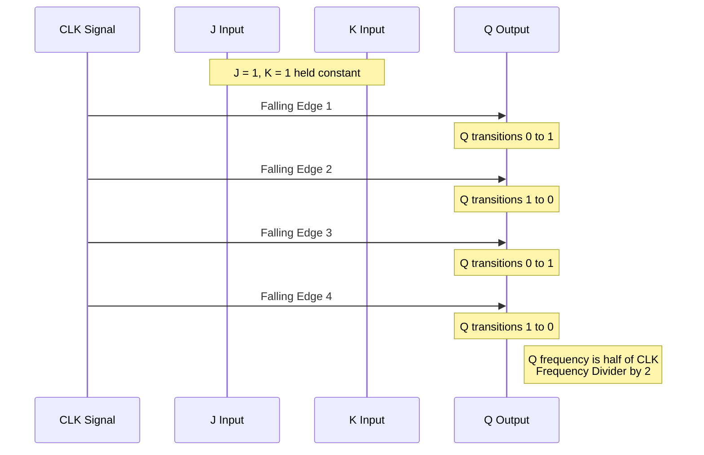
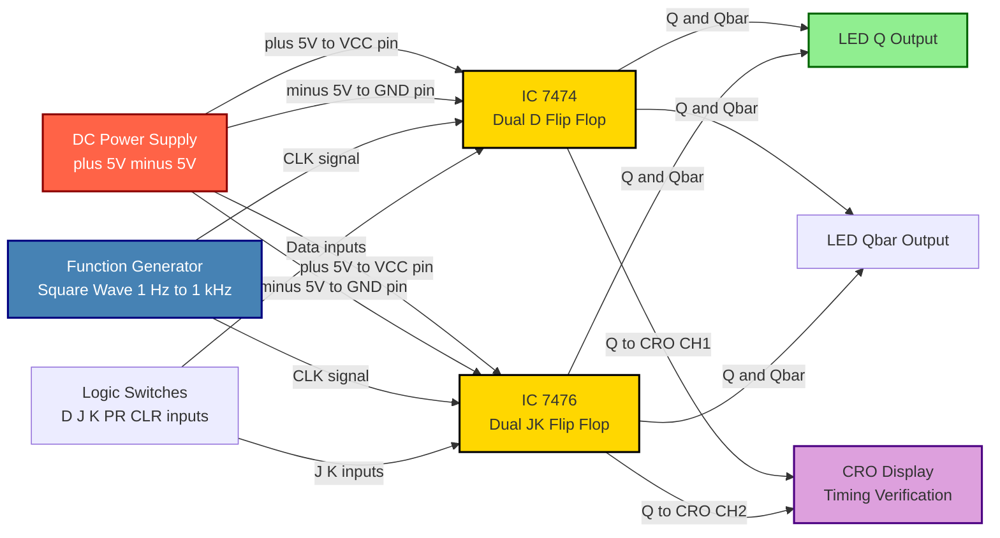
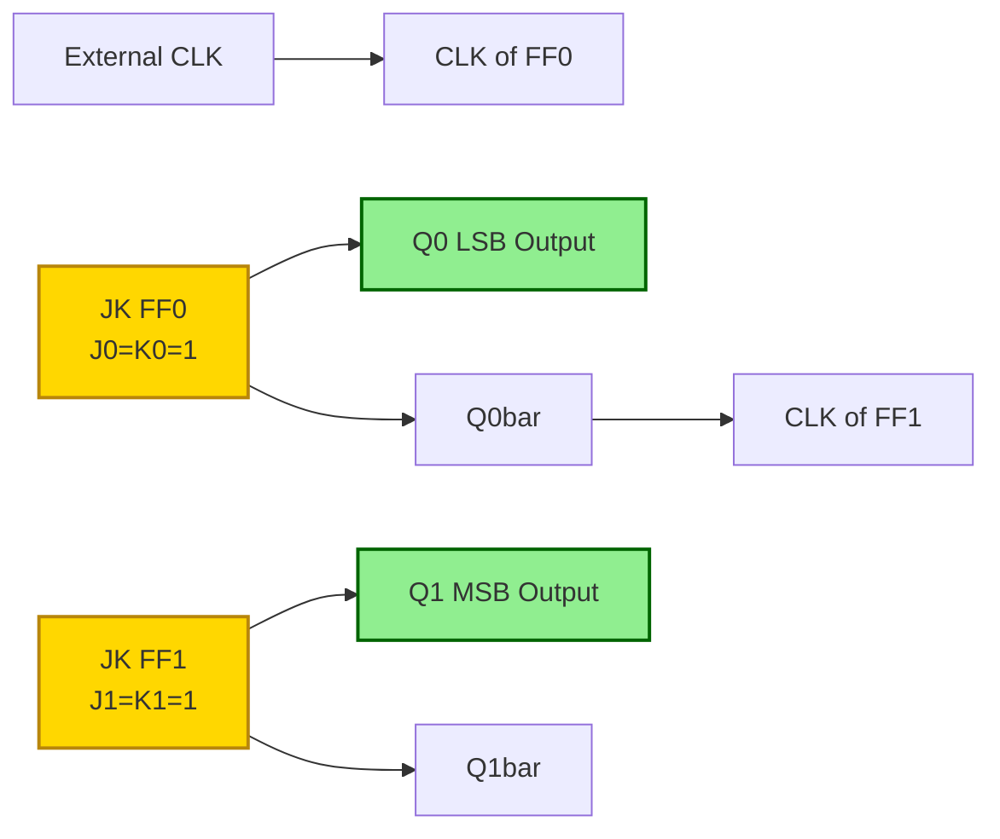

# Study of D flip flop and JK flip flops using ICs

<!-- SECTION_1_START -->
# Study of D Flip-Flop and JK Flip-Flops using ICs

## 1.1 Formal Academic Definition (KTU 2024 Syllabus Terminology)

A **flip-flop** is a fundamental synchronous sequential logic circuit that serves as a single-bit memory element (bi-stable multivibrator). It has two stable complementary output states, denoted as $Q$ and $\bar{Q}$, and stores one bit of binary data. The state transition is governed by a clock signal $CLK$ (edge-triggered) or pulse-triggered, ensuring synchronization with the rest of the digital system.

According to the KTU 2024 Scheme (PCCSL308 – Digital Lab), the two principal flip-flops studied using commercial TTL ICs are:

1. **D (Data / Delay) Flip-Flop** — Implemented using **IC 7474** (Dual D-type positive edge-triggered flip-flop with complementary outputs, preset, and clear).
2. **JK Flip-Flop** — Implemented using **IC 7476** (Dual JK negative edge-triggered flip-flop with preset and clear) or **IC 7473** (Dual JK master-slave with clear only).

The characteristic equation defines the next state $Q_{n+1}$ as a function of current inputs and the present state $Q_n$.

> [!IMPORTANT]
> **KTU Syllabus Highlight (Module 2):** Students must *physically wire* the ICs on a trainer kit, observe the outputs on LEDs for all input combinations using logic switches, and verify the characteristic table against theoretical predictions. Mere simulation will not earn full marks in the KTU lab record.

---

## 1.2 Conceptual Analogy / Intuition

### The D Flip-Flop — A "Photographer's Snapshot"
Imagine a camera pointed at a road. The moment the shutter button (clock edge) is pressed, the camera **freezes whatever it sees on the road (D input)** and locks it into the photo album (Q output). Until the *next* shutter press, the road (D) can change freely, but the photograph (Q) remains unchanged. This is exactly the D flip-flop's behaviour: **D is latched into Q only on the active clock edge**.

### The JK Flip-Flop — A "Voting Booth with a Tie-Breaker"
A regular SR flip-flop has an illegal state ($S=R=1$). JK fixes this. Think of J as the "YES" vote and K as the "NO" vote:

- Both vote NO ($J=0, K=0$) → **Status quo** (no change).
- YES wins ($J=1, K=0$) → **Output set to 1**.
- NO wins ($J=0, K=1$) → **Output reset to 0**.
- Both vote YES ($J=1, K=1$) → **Toggle** the previous result (the tie is broken by flipping the switch).

> [!NOTE]
> **Physical constants to remember for the lab:**
> - Standard TTL supply voltage: **$V_{CC} = +5\text{ V} \pm 5\%$**
> - Logic HIGH (1) input range: **$2.0\text{ V}$ to $5.0\text{ V}$**
> - Logic LOW (0) input range: **$0.0\text{ V}$ to $0.8\text{ V}$**
> - IC 7474 triggers on the **positive (rising) edge** of the clock.
> - IC 7476 / 7473 trigger on the **negative (falling) edge** of the clock.

---

## 1.3 Visualization of Flip-Flop Behaviour

> [!VISUALIZATION CONTROL]
> **Concept:** Behavioural response of D and JK flip-flops as a 2D step plot.
> **GeoGebra / Desmos Input Equations (for D-FF):**
> - $Q_{n+1} = D$ → Plot a step function where the red line ($Q_{n+1}$) overlaps the blue line ($D$) at every clock edge.
> - $Q_{n+1} = J\bar{Q_n} + \bar{K}Q_n$ → Plot for JK-FF.
> **Visual Description:** You should observe that the Q output of the D-FF only changes on the *rising* clock edge (for 7474), while for the JK-FF (7476) the output changes on the *falling* edge. The toggle state of JK ($J=K=1$) creates a frequency-divided square wave at the output.

<!-- SECTION_1_END -->

<!-- SECTION_2_START -->
# Deep Theoretical Analysis & KTU High-Yield Formula Sheet

## 2.1 D Flip-Flop — Truth Table, Excitation Table & Logic

The D flip-flop is the simplest edge-triggered memory element. Its output is a direct sample of the D input at the moment of the active clock edge.

### Characteristic Table

| $D$ | $Q_n$ | $Q_{n+1}$ | Operation |
|:---:|:---:|:---:|:---|
| 0 | 0 | 0 | Reset / Hold Low |
| 0 | 1 | 0 | Reset |
| 1 | 0 | 1 | Set |
| 1 | 1 | 1 | Hold High |

### Excitation Table (Required for sequential design)

| $Q_n$ | $Q_{n+1}$ | $D$ (Required Input) |
|:---:|:---:|:---:|
| 0 | 0 | 0 |
| 0 | 1 | 1 |
| 1 | 0 | 0 |
| 1 | 1 | 1 |

The required $D$ input is simply $D = Q_{n+1}$, because the D-FF makes $Q$ follow $D$ on the clock edge.

### Characteristic Equation

$$
Q_{n+1} = D
$$

This is the **simplest characteristic equation in all of digital electronics** — and the KTU examiner loves to ask for it.

---

## 2.2 JK Flip-Flop — Truth Table, Excitation Table & Logic

The JK flip-flop is a refined version of the SR flip-flop, eliminating the forbidden/indeterminate state ($S=R=1$) by replacing it with a **toggle** action.

### Characteristic Table

| $J$ | $K$ | $Q_n$ | $Q_{n+1}$ | Operation |
|:---:|:---:|:---:|:---:|:---|
| 0 | 0 | 0 | 0 | No Change (Hold) |
| 0 | 0 | 1 | 1 | No Change (Hold) |
| 0 | 1 | 0 | 0 | Reset |
| 0 | 1 | 1 | 0 | Reset |
| 1 | 0 | 0 | 1 | Set |
| 1 | 0 | 1 | 1 | Set |
| 1 | 1 | 0 | 1 | **Toggle** |
| 1 | 1 | 1 | 0 | **Toggle** |

### Excitation Table

| $Q_n$ | $Q_{n+1}$ | $J$ | $K$ |
|:---:|:---:|:---:|:---:|
| 0 | 0 | 0 | X |
| 0 | 1 | 1 | X |
| 1 | 0 | X | 1 |
| 1 | 1 | X | 0 |

(X = Don't Care)

### Characteristic Equation (Derived from K-map)

$$
Q_{n+1} = J\bar{Q_n} + \bar{K}Q_n
$$

---

## 2.3 Race-Around Condition in JK Flip-Flop

A critical concept often asked in KTU viva and theory:

> [!WARNING]
> **Race-Around Condition (KTU favourite 7-marker):**
> If $J = K = 1$ in a level-triggered JK flip-flop and the clock pulse width $t_p > \Delta t$ (propagation delay), the output will **oscillate / race** between 0 and 1 for the entire duration of the clock HIGH level. This produces an *indeterminate* final state when the clock goes LOW.
>
> **Solution:** Use a **Master-Slave JK flip-flop** (two JK latches in cascade) or use an **edge-triggered** JK flip-flop. The condition to avoid race-around is:
> $$t_p < \Delta t < T_{CLK}$$
> where $T_{CLK}$ is the clock period and $\Delta t$ is the propagation delay of a single latch.

---

## 2.4 KTU High-Yield Formula Sheet

| Parameter | D Flip-Flop (IC 7474) | JK Flip-Flop (IC 7476) |
|:---|:---|:---|
| Characteristic Equation | $Q_{n+1} = D$ | $Q_{n+1} = J\bar{Q_n} + \bar{K}Q_n$ |
| Triggering Edge | Positive (Rising) $\uparrow$ | Negative (Falling) $\downarrow$ |
| Number of FFs in IC | 2 (Dual) | 2 (Dual) |
| Asynchronous Inputs | $\overline{PR}$ (Preset), $\overline{CLR}$ (Clear) | $\overline{PR}$ (Preset), $\overline{CLR}$ (Clear) |
| Asynchronous Active Level | Active LOW ($\overline{PR}=0$ forces $Q=1$) | Active LOW ($\overline{CLR}=0$ forces $Q=0$) |
| Toggle Mode | Not Applicable (D=$\bar{Q}$ wired externally) | $J=K=1 \Rightarrow Q_{n+1} = \bar{Q_n}$ |
| Race-Around Susceptibility | None (edge-triggered) | None in 7476 (edge-triggered); exists in level-triggered JK |
| $V_{CC}$ Supply | **$+5\text{ V}$ DC** | **$+5\text{ V}$ DC** |
| Package | 14-pin DIP | 16-pin DIP |
| Function Generator Freq. (typical lab) | **$1\text{ Hz}$ to $1\text{ kHz}$ square wave** | **$1\text{ Hz}$ to $1\text{ kHz}$ square wave** |

---

## 2.5 Real-World Engineering Utility

- **D Flip-Flops** are the building blocks of **shift registers**, **data synchronizers**, **pipelined registers in CPUs**, and **DDR memory address latches**.
- **JK Flip-Flops** are extensively used in **binary counters (ripple and synchronous)**, **frequency dividers** (the $J=K=1$ toggle mode divides clock frequency by 2), and **control state machines**.
- IC 7474 and 7476 are the standard pedagogical ICs in every KTU-affiliated digital electronics lab because they are inexpensive (~$0.20 per IC), pin-compatible with breadboards, and demonstrate the core flip-flop behaviour with auxiliary asynchronous control inputs.

<!-- SECTION_2_END -->

<!-- SECTION_3_START -->
# Step-by-Step Derivations, Code & Hardware Implementation

## 3.1 Derivation of the JK Characteristic Equation using K-Map

Starting from the JK characteristic table, we construct the K-map with $J$ and $K$ as inputs and $Q_{n+1}$ as output (treating $Q_n$ as a third variable):

| $JK \backslash Q_n$ | $Q_n = 0$ | $Q_n = 1$ |
|:---:|:---:|:---:|
| $J=0, K=0$ | 0 | 1 |
| $J=0, K=1$ | 0 | 0 |
| $J=1, K=1$ | 1 | 0 |
| $J=1, K=0$ | 1 | 1 |

Grouping the 1's in a 3-variable K-map:

- Group 1: Cell ($J=1, K=0, Q_n=0$) and ($J=1, K=0, Q_n=1$) → covers $J\bar{K}$.
- Group 2: Cell ($J=0, K=0, Q_n=1$) and ($J=1, K=0, Q_n=1$) → covers $\bar{K}Q_n$.

The minimized sum-of-products equation is:

$$
Q_{n+1} = J\bar{K} + \bar{K}Q_n = J\bar{Q_n} + \bar{K}Q_n
$$

(Factor $\bar{K}$ common, then convert $J\bar{K} = J\bar{K}(Q_n + \bar{Q_n}) = J\bar{K}Q_n + J\bar{K}\bar{Q_n}$; absorb the $J\bar{K}Q_n$ term inside the existing $\bar{K}Q_n$ group, leaving $J\bar{Q_n}$.)

---

## 3.2 Python Implementation — Hardware Behaviour Simulator

```python
"""
Filename: d_jk_flipflop_sim.py
Purpose : Emulate the behaviour of D (IC 7474) and JK (IC 7476) flip-flops
          for KTU Digital Lab verification before wiring the actual IC.
Author  : KTU Digital Lab Reference Code (Python 3.10+)
"""

from __future__ import annotations
from typing import Literal
import logging

logging.basicConfig(level=logging.INFO, format="[%(levelname)s] %(message)s")
log = logging.getLogger("FlipFlopSim")

Edge = Literal["rising", "falling"]
Bit = Literal[0, 1]


class DFlipFlop7474:
    """Emulates one half of a 7474 Dual D Positive-Edge-Triggered Flip-Flop."""

    def __init__(self) -> None:
        self.q: Bit = 0
        self.q_bar: Bit = 1
        self._prev_clk: Bit = 0
        log.info("D-FF (7474) initialised. Q=0, Qbar=1")

    def clock_edge(self, clk: Bit, d: Bit, preset: Bit = 1, clear: Bit = 1) -> None:
        # Active-LOW asynchronous inputs — handle with priority
        if preset == 0 and clear == 1:
            self.q, self.q_bar = 1, 0
            log.info("Asynchronous PRESET activated -> Q=1")
            return
        if clear == 0 and preset == 1:
            self.q, self.q_bar = 0, 1
            log.info("Asynchronous CLEAR  activated -> Q=0")
            return
        if preset == 0 and clear == 0:
            raise ValueError("Invalid state: PR and CLR both LOW simultaneously.")

        # Positive edge detection: 0 -> 1 transition
        if self._prev_clk == 0 and clk == 1:
            self.q, self.q_bar = d, 1 - d
            log.info(f"Rising edge: D={d} latched -> Q={self.q}")
        self._prev_clk = clk

    def read(self) -> tuple[Bit, Bit]:
        return self.q, self.q_bar


class JKFlipFlop7476:
    """Emulates one half of a 7476 Dual JK Negative-Edge-Triggered Flip-Flop."""

    def __init__(self) -> None:
        self.q: Bit = 0
        self.q_bar: Bit = 1
        self._prev_clk: Bit = 1
        log.info("JK-FF (7476) initialised. Q=0, Qbar=1")

    def clock_edge(self, clk: Bit, j: Bit, k: Bit, preset: Bit = 1, clear: Bit = 1) -> None:
        if preset == 0 and clear == 1:
            self.q, self.q_bar = 1, 0
            log.info("Asynchronous PRESET activated -> Q=1")
            return
        if clear == 0 and preset == 1:
            self.q, self.q_bar = 0, 1
            log.info("Asynchronous CLEAR  activated -> Q=0")
            return
        if preset == 0 and clear == 0:
            raise ValueError("Invalid state: PR and CLR both LOW simultaneously.")

        # Negative edge detection: 1 -> 0 transition
        if self._prev_clk == 1 and clk == 0:
            # JK characteristic equation implementation
            if j == 0 and k == 0:
                pass  # Hold — no change
            elif j == 0 and k == 1:
                self.q, self.q_bar = 0, 1  # Reset
            elif j == 1 and k == 0:
                self.q, self.q_bar = 1, 0  # Set
            else:  # j == 1 and k == 1
                self.q, self.q_bar = 1 - self.q, self.q  # Toggle
            log.info(f"Falling edge: J={j} K={k} -> Q={self.q}")
        self._prev_clk = clk

    def read(self) -> tuple[Bit, Bit]:
        return self.q, self.q_bar


# ---------- Demonstration routine ----------
if __name__ == "__main__":
    log.info("=== D Flip-Flop Demonstration ===")
    dff = DFlipFlop7474()
    test_sequence = [
        # (clk, d, preset, clear)
        (0, 1, 1, 1), (1, 1, 1, 1),  # Rising edge: D=1 -> Q=1
        (0, 0, 1, 1), (1, 0, 1, 1),  # Rising edge: D=0 -> Q=0
        (1, 1, 0, 1),                  # Asynchronous PRESET
        (1, 1, 1, 0),                  # Asynchronous CLEAR
    ]
    for clk, d, pr, clr in test_sequence:
        dff.clock_edge(clk, d, pr, clr)

    log.info("=== JK Flip-Flop Demonstration ===")
    jkff = JKFlipFlop7476()
    jk_test = [
        (1, 1, 0, 1, 1),  # J=1,K=0 (no clock edge)
        (0, 1, 0, 1, 1),  # Falling edge: J=1,K=0 -> SET
        (1, 1, 1, 1, 1),  # J=1,K=1 (no clock edge)
        (0, 1, 1, 1, 1),  # Falling edge: J=1,K=1 -> TOGGLE
        (0, 0, 1, 1, 1),  # Falling edge: J=0,K=1 -> RESET
    ]
    for clk, j, k, pr, clr in jk_test:
        jkff.clock_edge(clk, j, k, pr, clr)
```

> **Running this script will show** the live state transitions matching the IC 7474/7476 datasheet, useful for pre-lab viva preparation.

---

## 3.3 Hardware Wiring — Pin Configuration Tables (Breadboard Setup)

### 3.3.1 IC 7474 — Dual D Positive-Edge-Triggered Flip-Flop (14-pin DIP)

| Pin No. | Symbol | Function | Lab Wire Connection |
|:---:|:---|:---|:---|
| 1 | $\overline{CLR}_1$ | Async Clear for FF1 | Tie to **$+5\text{ V}$** (inactive) via $1\text{ k}\Omega$ pull-up |
| 2 | $D_1$ | Data input FF1 | Logic switch input |
| 3 | $CLK_1$ | Clock input FF1 | **Pulse / Square wave** from function generator |
| 4 | $\overline{PR}_1$ | Async Preset for FF1 | Tie to **$+5\text{ V}$** (inactive) |
| 5 | $Q_1$ | Output FF1 | LED indicator (with $220\text{ }\Omega$ series resistor) |
| 6 | $\bar{Q}_1$ | Complementary output FF1 | Optional LED |
| 7 | $Q_2$ | Output FF2 | LED indicator |
| 8 | $\bar{Q}_2$ | Complementary output FF2 | Optional LED |
| 9 | $\overline{PR}_2$ | Async Preset FF2 | **$+5\text{ V}$** |
| 10 | $CLK_2$ | Clock input FF2 | Same clock as FF1 |
| 11 | $\overline{CLR}_2$ | Async Clear FF2 | **$+5\text{ V}$** |
| 12 | $D_2$ | Data input FF2 | Logic switch input |
| 13 | $CLK_2$ (alt) / NC | — | — |
| 14 | $V_{CC}$ | **$+5\text{ V}$** power | **$+5\text{ V}$** rail |

> [!NOTE]
> Pin 7 in some datasheets is $\bar{Q}_2$; verify with your specific trainer kit. **Always connect pin 14 to $V_{CC}$ and pin 7 (GND) to ground first** before inserting the IC into the breadboard (anti-static precaution).

### 3.3.2 IC 7476 — Dual JK Negative-Edge-Triggered Flip-Flop (16-pin DIP)

| Pin No. | Symbol | Function | Lab Wire Connection |
|:---:|:---|:---|:---|
| 1 | $\overline{PR}_1$ | Async Preset FF1 | **$+5\text{ V}$** (pull-up) |
| 2 | $CLK_1$ | Clock input FF1 | **Function generator square wave** |
| 3 | $\overline{CLR}_1$ | Async Clear FF1 | **$+5\text{ V}$** (pull-up) |
| 4 | $J_1$ | J input FF1 | Logic switch |
| 5 | $V_{CC}$ (or NC for 7473) | Power **$+5\text{ V}$** | **$+5\text{ V}$** rail |
| 6 | $K_1$ | K input FF1 | Logic switch |
| 7 | $Q_1$ | Output FF1 | LED + $220\text{ }\Omega$ |
| 8 | $\bar{Q}_1$ | Complementary output | Optional LED |
| 9 | $Q_2$ | Output FF2 | LED |
| 10 | $\bar{Q}_2$ | Complementary output | Optional LED |
| 11 | $K_2$ | K input FF2 | Logic switch |
| 12 | GND | **$0\text{ V}$** | Ground rail |
| 13 | $J_2$ | J input FF2 | Logic switch |
| 14 | $\overline{CLR}_2$ | Async Clear FF2 | **$+5\text{ V}$** |
| 15 | $CLK_2$ | Clock input FF2 | Same clock as FF1 |
| 16 | $\overline{PR}_2$ | Async Preset FF2 | **$+5\text{ V}$** |

---

## 3.4 Lab Procedure — Step-by-Step (For KTU Record Submission)

### Experiment 1: Verification of D Flip-Flop (IC 7474)

**Apparatus Required:** IC 7474, trainer kit, logic switches, LEDs, patch cords, function generator, CRO (Cathode Ray Oscilloscope), $+5\text{ V}$ DC regulated power supply.

**Procedure:**

1. Insert IC 7474 into the breadboard. **Connect pin 14 to $+5\text{ V}$ and pin 7 to GND.**
2. Connect $\overline{PR}_1$ and $\overline{CLR}_1$ to logic switches (initially set to HIGH).
3. Connect $D_1$ to a logic switch and $CLK_1$ to a single-pulse generator (or debounced push-button for manual mode).
4. Connect $Q_1$ and $\bar{Q}_1$ to two LEDs.
5. For each of the four input combinations $(D, CLK \text{ edge})$, record the $Q$ output in the observation table.
6. **Repeat** for $D_2, CLK_2, Q_2, \bar{Q}_2$ (second flip-flop in the IC).
7. **Demonstrate asynchronous PRESET and CLEAR:** momentarily ground the corresponding pin and observe $Q$ going HIGH/LOW independent of the clock.
8. **Draw the timing diagram** on a CRO by feeding a continuous square wave into $CLK$ and a varying $D$ from a second function generator.

**Observation Table (D-FF):**

| S.No | $D$ | Clock Edge | Preset ($\overline{PR}$) | Clear ($\overline{CLR}$) | $Q_{n+1}$ Observed | $\bar{Q}_{n+1}$ Observed |
|:---:|:---:|:---:|:---:|:---:|:---:|:---:|
| 1 | 0 | $\uparrow$ | 1 | 1 | 0 | 1 |
| 2 | 1 | $\uparrow$ | 1 | 1 | 1 | 0 |
| 3 | X | X | 0 | 1 | 1 | 0 (Async Set) |
| 4 | X | X | 1 | 0 | 0 | 1 (Async Reset) |

### Experiment 2: Verification of JK Flip-Flop (IC 7476)

**Procedure:**

1. Insert IC 7476 into the breadboard. **Connect pin 5 to $+5\text{ V}$ and pin 12 to GND.**
2. Connect $J_1$ and $K_1$ to logic switches.
3. Connect $CLK_1$ to the single-pulse generator.
4. Connect $Q_1$ and $\bar{Q}_1$ to two LEDs.
5. Apply all four $(J, K)$ combinations and pulse the clock once for each; record $Q_{n+1}$.
6. **Special case:** Set $J = K = 1$ and apply a continuous square wave clock. Observe on the CRO that the output $Q$ is a square wave at **half the clock frequency** (frequency divider).
7. Verify asynchronous PRESET and CLEAR functionality.

**Observation Table (JK-FF):**

| S.No | $J$ | $K$ | $Q_n$ (Previous) | Clock Edge | $Q_{n+1}$ Observed | Operation |
|:---:|:---:|:---:|:---:|:---:|:---:|:---|
| 1 | 0 | 0 | 0 | $\downarrow$ | 0 | Hold |
| 2 | 0 | 0 | 1 | $\downarrow$ | 1 | Hold |
| 3 | 0 | 1 | 0 | $\downarrow$ | 0 | Reset |
| 4 | 0 | 1 | 1 | $\downarrow$ | 0 | Reset |
| 5 | 1 | 0 | 0 | $\downarrow$ | 1 | Set |
| 6 | 1 | 0 | 1 | $\downarrow$ | 1 | Set |
| 7 | 1 | 1 | 0 | $\downarrow$ | 1 | Toggle |
| 8 | 1 | 1 | 1 | $\downarrow$ | 0 | Toggle |

> [!WARNING]
> **Common Lab Mistakes (lose 2-3 marks each):**
> 1. Confusing pin numbers of IC 7476 (it's 16-pin, NOT 14-pin like 7474).
> 2. Forgetting to tie $\overline{PR}$ and $\overline{CLR}$ to $+5\text{ V}$ — they will float and produce erratic outputs.
> 3. Assuming the JK-FF (7476) triggers on the rising edge — **it triggers on the falling edge**.
> 4. Reversing $V_{CC}$ and GND — this destroys the IC instantly.

<!-- SECTION_3_END -->

<!-- SECTION_4_START -->
# Structural Diagrams & Schematics

## 4.1 Block-Level Functional Architecture — D Flip-Flop (IC 7474)



**Description:** The D-FF architecture is a Master-Slave configuration with inverted clocking between the two latches. The asynchronous PRESET and CLEAR bypass the clock logic to force $Q$ immediately — this is why they are "asynchronous."

---

## 4.2 Block-Level Functional Architecture — JK Flip-Flop (IC 7476)



**Description:** The feedback lines from $Q$ and $\bar{Q}$ to the input AND gates are what eliminate the indeterminate state of the SR flip-flop and produce the toggle action when $J=K=1$.

---

## 4.3 Sequential Processing Topology — Timing Diagram for JK-FF in Toggle Mode



**Description:** Each falling edge of the clock toggles $Q$, producing a $50\%$ duty cycle output at $f_{Q} = f_{CLK}/2$. This is the foundation of asynchronous (ripple) counters.

---

## 4.4 Hardware Wiring Topology (Mermaid Block Diagram)



**Description:** This topology shows the complete breadboard wiring for the dual IC setup. Note that both ICs share a common $+5\text{ V}$ and GND rail, a common clock source (for synchronous experiments), and a common LED indicator bank.

<!-- SECTION_4_END -->

<!-- SECTION_5_START -->
# KTU 2024 Scheme Examination Question Bank & Topic Recap

## 5.1 Part A Questions (3 Marks Each)

### Question 1 **[KTU University Exam – Dec 2023]**
**(CO1, Remember/Understand)**

**Q: Define a flip-flop. With a neat block diagram, explain the operation of a D flip-flop. Mention the IC number used for its implementation in the lab.**

**Model Answer (Valuation Key):**

A **flip-flop** is a synchronous bistable digital electronic circuit used to store one bit of data. It has two stable states (0 and 1) and remains in a particular state indefinitely until a triggering clock edge forces it to change.

A D (Data/Delay) flip-flop has a single data input $D$ and a clock input $CLK$. On the active (rising) edge of the clock, the value present at $D$ is transferred to the output $Q$. The characteristic equation is:

$$
Q_{n+1} = D
$$

**Block Diagram:** $D \rightarrow \boxed{\text{D-FF}} \rightarrow Q$ and $\bar{Q}$, with $CLK$ as the enable.

**Lab IC:** **IC 7474** (Dual D positive-edge-triggered flip-flop with preset and clear).

> **Valuation:** [Definition: 1 Mark] [Block diagram description: 1 Mark] [IC number 7474: 1 Mark]

---

### Question 2 **[KTU University Exam – July 2024]**
**(CO1, Understand)**

**Q: Differentiate between a D flip-flop and a JK flip-flop. State the characteristic equation of each.**

**Model Answer (Valuation Key):**

| Parameter | D Flip-Flop (7474) | JK Flip-Flop (7476) |
|:---|:---|:---|
| Number of data inputs | 1 (only D) | 2 (J and K) |
| Characteristic equation | $Q_{n+1} = D$ | $Q_{n+1} = J\bar{Q_n} + \bar{K}Q_n$ |
| Toggle mode? | No (needs external wiring) | Yes ($J=K=1$ toggles $Q$) |
| Triggering edge | Positive (rising) | Negative (falling) |
| Forbidden state | None | None (illegal state of SR is replaced by toggle) |

> **Valuation:** [Any three valid differences: 3 Marks]

---

## 5.2 Part B Questions (14 Marks Each — Internal Choice)

### Question A — Full 14 Marks **[KTU University Exam – Dec 2023]**

**(a) [7 Marks, CO1, Understand]**
**Q: With a neat logic diagram, explain the internal structure of a JK flip-flop constructed from an SR flip-flop. Derive its characteristic equation.**

**Model Answer:**

The JK flip-flop is constructed by taking a basic SR flip-flop (cross-coupled NOR or NAND gates) and adding two 3-input AND gates at the input. The third input of each AND gate is fed back from the opposite output of the flip-flop:

- The **S input** of the SR-FF is replaced by $S = J \cdot \bar{Q}$.
- The **R input** of the SR-FF is replaced by $R = K \cdot Q$.

This feedback connection eliminates the indeterminate state of SR. When $J = K = 1$, the outputs toggle because at any instant, either $J\bar{Q}$ or $KQ$ is 1 (but never both simultaneously), producing a valid set/reset action.

**Derivation using K-map:**

Truth table entries with $J$, $K$, $Q_n$ produce $Q_{n+1}$ as in §2.2. Plotting in a 3-variable K-map and grouping the 1's yields:

$$
Q_{n+1} = J\bar{Q_n} + \bar{K}Q_n
$$

> **Valuation Key:** [Block diagram with AND gates and feedback: 3 Marks] [Truth table construction: 1 Mark] [K-map grouping: 1 Mark] [Final equation: 1 Mark] [Explanation of toggle: 1 Mark]

**(b) [7 Marks, CO2, Apply]**
**Q: A JK flip-flop is connected with $J = K = 1$. A $1\text{ kHz}$ square wave is applied to the clock input. Draw the timing diagram and calculate the frequency at the Q output. What is this configuration called?**

**Model Answer:**

When $J = K = 1$, the JK flip-flop operates in **toggle mode**. Each active clock edge (falling edge for 7476) complements the output:

$$
Q_{n+1} = \bar{Q_n}
$$

**Timing Diagram:**

```
CLK:  ___|‾‾|___|‾‾|___|‾‾|___|‾‾|___  (1 kHz)
         ↓       ↓       ↓       ↓       (Falling edges)
Q:    ‾‾‾|___|‾‾‾|___|‾‾‾|___|‾‾‾  (0.5 kHz)
```

**Frequency Calculation:**

For a $1\text{ kHz}$ input clock, the output toggles once per clock period:

$$
f_Q = \frac{f_{CLK}}{2} = \frac{1000\text{ Hz}}{2} = 500\text{ Hz} = 0.5\text{ kHz}
$$

**Configuration Name:** This is a **Mod-2 counter** or **Frequency Divider by 2** (also called a **T flip-flop configuration** when $T = 1$ permanently).

> **Valuation Key:** [Toggle mode explanation: 1 Mark] [Timing diagram: 3 Marks] [Frequency calculation: 2 Marks] [Naming the configuration: 1 Mark]

---

### Question B (Alternative Choice) — Full 14 Marks **[KTU University Exam – July 2024]**

**(a) [7 Marks, CO1, Understand]**
**Q: Explain the working of IC 7474 as a D flip-flop. Draw its pin configuration and explain the function of PRESET and CLEAR inputs.**

**Model Answer:**

**IC 7474 Overview:** It is a 14-pin DIP IC containing **two independent D-type positive-edge-triggered flip-flops**. Each flip-flop has complementary outputs $Q$ and $\bar{Q}$, asynchronous active-LOW preset ($\overline{PR}$) and clear ($\overline{CLR}$) inputs, and a single data input $D$.

**Pin Diagram (ASCII representation):**

```
       IC 7474 (14-pin DIP)
        _______________
  CLR1 |1  \         / 14| VCC (+5V)
     D1 |2    7474    13| CLR2
   CLK1 |3             12| D2
    PR1 |4             11| CLK2
     Q1 |5             10| PR2
   Qbar1|6              9| Q2
    GND |7______________8| Qbar2
```

**Function of $\overline{PR}$ and $\overline{CLR}$:**

- **$\overline{PR} = 0$ (LOW):** The output $Q$ is **asynchronously forced to 1**, regardless of the clock and $D$ inputs. This is a "set" operation.
- **$\overline{CLR} = 0$ (LOW):** The output $Q$ is **asynchronously forced to 0**, regardless of the clock and $D$ inputs. This is a "reset" operation.
- **$\overline{PR} = \overline{CLR} = 1$ (HIGH):** Normal synchronous operation. On the **rising edge** of $CLK$, $Q$ becomes $D$.
- **$\overline{PR} = \overline{CLR} = 0$ (LOW):** This is an **invalid/forbidden condition** and must never be applied.

> **Valuation Key:** [IC 7474 overview: 1 Mark] [Pin diagram: 2 Marks] [PR and CLR explanation: 3 Marks] [Forbidden state mention: 1 Mark]

**(b) [7 Marks, CO2, Apply]**
**Q: Design a 2-bit asynchronous (ripple) down counter using JK flip-flops (IC 7476). Draw the circuit and the timing diagram showing all four states (11, 10, 01, 00).**

**Model Answer:**

**Design Steps:**

1. For a **down counter**, each JK flip-flop must be in **toggle mode**, so tie $J = K = 1$ on both FFs.
2. The **LSB flip-flop (FF0)** receives the external clock $CLK$.
3. The **MSB flip-flop (FF1)** receives the clock from $\bar{Q_0}$ of FF0 (this is the standard ripple-down-counter connection — the inverted output of the previous stage clocks the next).

**Circuit Diagram (Mermaid representation since it's a multi-FF cascade):**



**Timing Diagram (showing down-count from 11 to 00):**

| Clock Pulse | $Q_1$ (MSB) | $Q_0$ (LSB) | Decimal |
|:---:|:---:|:---:|:---:|
| Initial | 1 | 1 | 3 |
| 1 | 1 | 0 | 2 |
| 2 | 0 | 1 | 1 |
| 3 | 0 | 0 | 0 |
| 4 | 1 | 1 | 3 (rollover) |

The count sequence is **11 → 10 → 01 → 00 → 11...** (Mod-4 down counter).

> **Valuation Key:** [Tie J=K=1 for toggle: 2 Marks] [Clock fed from Qbar of previous: 2 Marks] [Correct sequence table: 2 Marks] [Naming as Mod-4 ripple down counter: 1 Mark]

---

## 5.3 KTU Examiner's Valuation Warning / Pitfall Callout

> [!WARNING]
> **Common Mistakes That Cause Mark Deductions in KTU Lab Exams:**
> 1. **Wrong clock edge assumption:** Students frequently toggle the inputs and expect output changes immediately. For IC 7474, changes occur ONLY on the **rising edge**; for IC 7476, ONLY on the **falling edge**. A 1-mark deduction per wrong-edge observation.
> 2. **Not tying $\overline{PR}$ and $\overline{CLR}$ to $V_{CC}$:** Floating inputs pick up noise and produce random $Q$ values. Examiner will mark zero for the asynchronous-input verification if both LEDs are flickering randomly.
> 3. **Confusing IC 7474 (14-pin) with IC 7476 (16-pin):** Always check the IC physically before wiring. Inserting a 16-pin IC into a 14-pin socket will short-circuit adjacent pins and may damage the IC.
> 4. **Forgetting the series resistor with LEDs:** Without a $220\text{ }\Omega$ current-limiting resistor, the LED will burn out, and the examiner cannot verify your output.
> 5. **No power-rail decoupling capacitor:** A $0.1\text{ }\mu\text{F}$ capacitor between $V_{CC}$ and GND (placed close to the IC) suppresses switching noise. The examiner may deduct 1 mark for missing this professional practice.
> 6. **Omitting the ground connection:** The most common "IC does nothing" cause. Always connect both $V_{CC}$ and GND before applying any input.

---

## 5.4 Topic Recap & Important Things to Remember

> **Rapid Revision Checklist (Save this section before the lab exam!):**

- **D Flip-Flop (IC 7474):**
    - 14-pin DIP, dual flip-flop package.
    - Characteristic equation: $Q_{n+1} = D$.
    - Triggers on **positive (rising) clock edge** $\uparrow$.
    - Active-LOW asynchronous preset ($\overline{PR}$) and clear ($\overline{CLR}$).
    - Power: $V_{CC} = +5\text{ V}$ on pin 14, GND on pin 7.
    - No forbidden/illegal state.
    - Used in shift registers, data storage registers, synchronizers.

- **JK Flip-Flop (IC 7476):**
    - 16-pin DIP, dual flip-flop package.
    - Characteristic equation: $Q_{n+1} = J\bar{Q_n} + \bar{K}Q_n$.
    - Triggers on **negative (falling) clock edge** $\downarrow$.
    - Active-LOW asynchronous preset and clear.
    - Power: $V_{CC} = +5\text{ V}$ on pin 5, GND on pin 12.
    - $J = K = 1 \Rightarrow$ toggle (used in counters and frequency dividers).
    - Used in counters (ripple and synchronous), control circuits.

- **Universal Conversion Formula (KF-Map KTU Favourite):**
    - D-FF to JK-FF: Replace each $D$ with $J\bar{Q_n} + \bar{K}Q_n$.
    - JK-FF to D-FF: Set $J = D$ and $K = \bar{D}$ (this gives $Q_{n+1} = D\bar{Q_n} + DQ_n = D$).

- **Race-Around Condition:**
    - Occurs in level-triggered JK-FF when $J = K = 1$ and clock pulse width $t_p > \Delta t$.
    - Eliminated by master-slave or edge-triggered design.
    - Avoidance condition: $t_p < \Delta t < T$.

- **Lab Wiring Best Practices:**
    - Always use $220\text{ }\Omega$ series resistors for LEDs.
    - Use a $1\text{ k}\Omega$ pull-up on $\overline{PR}$ and $\overline{CLR}$ to prevent floating.
    - Place a $0.1\text{ }\mu\text{F}$ decoupling capacitor between $V_{CC}$ and GND.
    - Power OFF before inserting or removing ICs (anti-static + anti-short).
    - Use a debounced push-button or single-pulse generator for manual clocking.

- **Frequency Divider Result (must memorize):**
    - One JK-FF in toggle mode divides the clock frequency by **2** (Mod-2 counter).
    - $n$ cascaded JK-FFs in toggle mode divide the clock by **$2^n$** (Mod-$2^n$ counter).

<!-- SECTION_5_END -->
