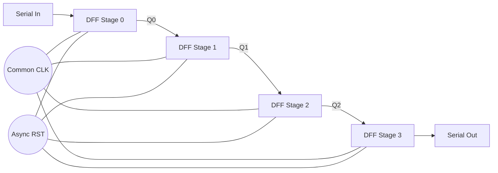
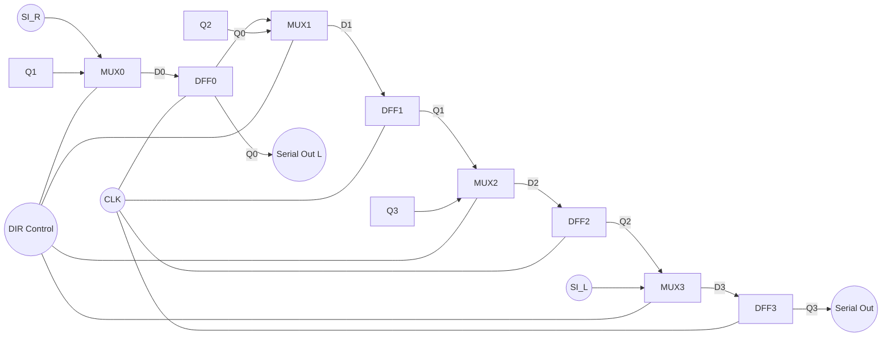
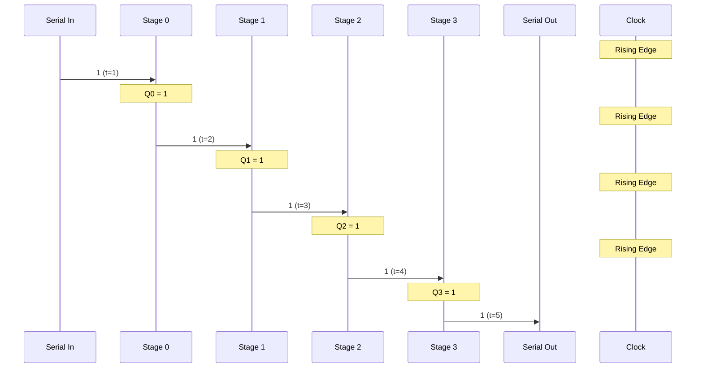

# To design and implement the following shift registers using D flip flops

<!-- SECTION_1_START -->
# Shift Registers Using D Flip-Flops — Core Definition & Intuitive Overview

## Formal Definition (KTU 2024 Syllabus Terminology)

A **Shift Register** is a sequential logic circuit consisting of a cascade of **D flip-flops** (Data flip-flops) sharing a common clock signal, in which the binary data stored in the register is shifted from one flip-flop to its adjacent neighbour on every active clock edge. The serial input bit, present at the D-input of the *first* flip-flop, is propagated one stage per clock pulse, and the bit stored in the *last* flip-flop is observable as the serial output.

> [!IMPORTANT]
> **Syllabus Highlight (PCCSL308 — Module 2):**
> The design must focus on a **combinational logic circuit implementation for an arbitrary function realised as a shift register**. The student is expected to *implement, simulate, and verify* the four canonical shift-register modes (SISO, SIPO, PISO, PIPO) on an FPGA / breadboard using only D-type storage elements.

## Intuitive Analogy — "The Bucket-Brigade"

Imagine a row of four empty buckets placed on a moving conveyor belt, each bucket operated by a single worker (the D flip-flop). Every time the foreman blows a whistle (the **clock edge**), each worker pours the contents of the bucket on his right into his own bucket. The right-most worker receives a new drop of water from a tap (the **serial input**). After one whistle, the *rightmost* bit has moved *one position to the left*. After four whistles, the original drop has travelled all the way to the left-most bucket and is now available as the **serial output**.

> [!NOTE]
> **Core Operational Rule:** The D flip-flop is a *1-bit delay element*. Its characteristic equation is $Q_{t+1} = D_t$. Stacking *n* D flip-flops gives an *n-clock-cycle* delay line — the foundational mechanism of every shift register.

## Block-Level Picture of a Generic 4-Bit Shift Register

$$
\text{Serial In } \rightarrow \boxed{D_0 \, Q_0} \rightarrow \boxed{D_1 \, Q_1} \rightarrow \boxed{D_2 \, Q_2} \rightarrow \boxed{D_3 \, Q_3} \rightarrow \text{Serial Out}
$$

All four flip-flops share a single common $CLK$ line. Depending on **how the data is loaded** and **how the data is read out**, the shift register is classified into four families.

> [!VISUALIZATION CONTROL]
> **Concept:** 4-bit SISO shift register timing — bit-propagation wave
> **GeoGebra / Desmos Input Equations:**
> * `f1(t) = 0 + 1 * unitStep(t - 1) - 1 * unitStep(t - 2)` (first stage)
> * `f2(t) = 0 + 1 * unitStep(t - 2) - 1 * unitStep(t - 3)` (second stage)
> * `f3(t) = 0 + 1 * unitStep(t - 3) - 1 * unitStep(t - 4)` (third stage)
> * `f4(t) = 0 + 1 * unitStep(t - 4) - 1 * unitStep(t - 5)` (fourth stage)
> **Visual Description:** Four square pulses of width 1 second will appear in *cascade* along the time-axis — the i-th pulse begins exactly when the (i-1)-th pulse ends. This is the *spatial* visual signature of bit-shift propagation.
<!-- SECTION_1_END -->

<!-- SECTION_2_START -->
# Deep Theoretical Analysis & KTU High-Yield Formula Sheet

## 2.1 The D Flip-Flop as the Atomic Building Block

The D (Data / Delay) flip-flop is the **simplest 1-bit memory cell** available. Its behaviour is captured by a single equation:

$$
Q_{t+1} = D_t
$$

The D flip-flop eliminates the *race-around condition* of the JK flip-flop by guaranteeing that $J \neq K$ always. The asynchronous preset ($PRE$) and clear ($CLR$) inputs are active-low and used to *initialise* the register to a known state (typically $Q = 0$ for all stages).

| Characteristic Parameter | Symbol | Typical TTL / CMOS Value | Unit |
| :--- | :---: | :---: | :---: |
| Setup Time | $t_{su}$ | **5** | ns |
| Hold Time | $t_h$ | **3** | ns |
| Propagation Delay (LOW→HIGH) | $t_{PLH}$ | **11** | ns |
| Propagation Delay (HIGH→LOW) | $t_{PHL}$ | **12** | ns |
| Maximum Clock Frequency | $f_{max}$ | **100** | MHz |
| Operating Supply Voltage | $V_{CC}$ | **5.0** | V |

> [!IMPORTANT]
> **Why D flip-flops for shift registers?**
> 1. **No race-around condition** — a single data line, no toggling ambiguity.
> 2. **Predictable timing** — the next state is *exactly* equal to the current D input.
> 3. **Clean synthesis** — FPGAs map shift registers directly to dedicated D-FF slices (Xilinx SLICEL, Intel ALM).

## 2.2 Classification Matrix — Four Canonical Shift Register Modes

Let $n$ be the number of stages and $Q_i$ denote the $i$-th storage element. The four canonical modes are:

| Mode | Data In | Data Out | Load Path | Read Path | Common Use Case |
| :---: | :---: | :---: | :---: | :---: | :---: |
| **SISO** | Serial | Serial | $D_i = Q_{i-1}$ | $Y = Q_{n-1}$ | Time-delay line, pseudo-random generator |
| **SIPO** | Serial | Parallel | $D_i = Q_{i-1}$ | $Y_{i} = Q_i$ | Serial-to-parallel converters (UART RX) |
| **PISO** | Parallel | Serial | Multiplexed | $Y = Q_{n-1}$ | Parallel-to-serial converters (UART TX) |
| **PIPO** | Parallel | Parallel | Multiplexed | $Y_i = Q_i$ | Register file, data buffer |

## 2.3 Universal Shift Register — The "Swiss Army Knife"

A **Universal Shift Register** combines all four modes plus *bidirectional* shifting and *hold* operation in a single package, controlled by a 2-bit mode selector $S_1 S_0$.

| $S_1$ | $S_0$ | Operation |
| :---: | :---: | :--- |
| 0 | 0 | **Hold** — $Q_{t+1} = Q_t$ (no change) |
| 0 | 1 | **Shift Right** — $Q_{i, t+1} = Q_{i-1, t}$, with $Q_{0, t+1} = \text{SR\_IN}$ |
| 1 | 0 | **Shift Left** — $Q_{i, t+1} = Q_{i+1, t}$, with $Q_{n-1, t+1} = \text{SL\_IN}$ |
| 1 | 1 | **Parallel Load** — $Q_{i, t+1} = P_i$ |

The next-state input equation for the $i$-th stage is therefore:

$$
D_i = \overline{S_1}\,\overline{S_0}\,Q_i \;+\; \overline{S_1}\,S_0\,Q_{i-1} \;+\; S_1\,\overline{S_0}\,Q_{i+1} \;+\; S_1\,S_0\,P_i
$$

$$
\text{(where } Q_{-1} = \text{SR\_IN} \text{ and } Q_{n} = \text{SL\_IN}\text{)}
$$

## 2.4 Bidirectional Shift Register Next-State Equation

For *right* shift ($\text{CTRL} = 0$) and *left* shift ($\text{CTRL} = 1$) with serial input $SI$:

$$
D_i = \overline{\text{CTRL}} \cdot Q_{i-1} \;+\; \text{CTRL} \cdot Q_{i+1}
$$

with boundary conditions:

$$
D_0 = \overline{\text{CTRL}} \cdot SI_{R} \;+\; \text{CTRL} \cdot Q_1
$$

$$
D_{n-1} = \overline{\text{CTRL}} \cdot Q_{n-2} \;+\; \text{CTRL} \cdot SI_{L}
$$

## 2.5 Engineering Utility in Real-World Systems

| Application Domain | Specific Use |
| :--- | :--- |
| Communication Protocols | UART, SPI, I²C serializers & deserializers |
| Cryptography Hardware | LFSR-based stream ciphers (e.g., A5/1 in GSM) |
| Digital Signal Processing | Convolution engines, FIR filter tap delay lines |
| CPU Architecture | Barrel shifters, register file read/write ports |
| Display Drivers | Charlieplexed LED row drivers, character LCD shift chains |
| Memory Addressing | Ring counters for refresh timing, Johnson counters |

> [!NOTE]
> **Production Engineering Insight:**
> In Xilinx 7-series FPGAs, a 32-bit shift register is implemented as a *distributed SRL32E* primitive — a single Look-Up Table (LUT) configured as a 32-stage serial shift register. This saves **31 flip-flop slices** per register, dramatically reducing slice utilisation in DSP pipelines.
<!-- SECTION_2_END -->

<!-- SECTION_3_START -->
# Step-by-Step Derivations, VHDL Implementation & Hardware Wiring

## 3.1 Exhaustive Derivation — 4-Bit SIPO Shift Register State Table

Let the serial input be $SI$ and the four parallel outputs be $Q_0, Q_1, Q_2, Q_3$. The D-input to each stage is the previous stage's output:

$$
D_0 = SI, \quad D_1 = Q_0, \quad D_2 = Q_1, \quad D_3 = Q_2
$$

State table for the first 5 clock cycles, starting from $Q_3 Q_2 Q_1 Q_0 = 0000$ with input stream $SI = 1, 0, 1, 1, 0$:

| Clock Edge | $SI$ | $D_0$ | $D_1$ | $D_2$ | $D_3$ | $Q_3$ | $Q_2$ | $Q_1$ | $Q_0$ |
| :---: | :---: | :---: | :---: | :---: | :---: | :---: | :---: | :---: | :---: |
| Initial | — | — | — | — | — | 0 | 0 | 0 | 0 |
| ↑ 1 | 1 | 1 | 0 | 0 | 0 | 0 | 0 | 0 | **1** |
| ↑ 2 | 0 | 0 | 1 | 0 | 0 | 0 | 0 | **1** | 0 |
| ↑ 3 | 1 | 1 | 0 | 1 | 0 | 0 | **1** | 0 | 1 |
| ↑ 4 | 1 | 1 | 1 | 0 | 1 | **1** | 0 | 1 | 1 |
| ↑ 5 | 0 | 0 | 1 | 1 | 0 | 0 | **1** | 1 | 0 |

> **Verification:** After 4 clock edges, the input word `1011` appears in parallel at $\{Q_3, Q_2, Q_1, Q_0\} = \{1, 0, 1, 1\}$. ✓

## 3.2 Exhaustive Derivation — Bidirectional Shift Register Excitation Equations

Given the design requirement of bidirectional shift with a 1-bit direction control $\text{DIR}$ (0 = right, 1 = left) and a common serial input $SI$:

**Step 1 — Define the MUX input mapping.** For each stage $i$ the D-input must select between the right-neighbour $Q_{i-1}$ and the left-neighbour $Q_{i+1}$:

$$
D_i = \overline{\text{DIR}} \cdot Q_{i-1} \;+\; \text{DIR} \cdot Q_{i+1}
$$

**Step 2 — Apply the left-boundary condition.** Stage 0 cannot shift "right" from a non-existent $Q_{-1}$; therefore the right-shift input is fed from $SI$:

$$
D_0 = \overline{\text{DIR}} \cdot SI \;+\; \text{DIR} \cdot Q_1
$$

**Step 3 — Apply the right-boundary condition.** Stage $n-1$ cannot shift "left" from a non-existent $Q_n$; therefore the left-shift input is also fed from $SI$ (alternatively a separate $SI_L$):

$$
D_{n-1} = \overline{\text{DIR}} \cdot Q_{n-2} \;+\; \text{DIR} \cdot SI
$$

**Step 4 — Substitute $n = 4$ and simplify.** For stages 1, 2:

$$
D_1 = \overline{\text{DIR}} \cdot Q_0 \;+\; \text{DIR} \cdot Q_2
$$

$$
D_2 = \overline{\text{DIR}} \cdot Q_1 \;+\; \text{DIR} \cdot Q_3
$$

These four equations fully describe the next-state logic of a 4-bit bidirectional shift register using **4 D flip-flops + 4 2:1 MUXes**.

## 3.3 VHDL Implementation — 4-Bit Universal Shift Register

```vhdl
-- File: universal_shift_register.vhd
-- Engineer: KTU Lab Reference Design
-- Target: Xilinx Spartan-7 / Intel Cyclone IV
-- Standard: IEEE 1076-2008

library IEEE;
use IEEE.STD_LOGIC_1164.ALL;
use IEEE.NUMERIC_STD.ALL;

entity universal_shift_register is
    generic (
        N : positive := 4
    );
    port (
        CLK    : in  std_logic;
        RST    : in  std_logic;                       -- active-high asynchronous reset
        S      : in  std_logic_vector(1 downto 0);    -- mode selector
        SI_R   : in  std_logic;                        -- serial-in for right shift
        SI_L   : in  std_logic;                        -- serial-in for left  shift
        P      : in  std_logic_vector(N-1 downto 0);   -- parallel-in bus
        Q      : out std_logic_vector(N-1 downto 0)    -- parallel-out bus
    );
end entity universal_shift_register;

architecture rtl of universal_shift_register is
    signal q_reg : std_logic_vector(N-1 downto 0) := (others => '0');
    signal q_next: std_logic_vector(N-1 downto 0);
begin

    -- ==========================================================
    -- Next-state logic (combinational, combinational-before-FF)
    -- ==========================================================
    process(all)
    begin
        case S is
            when "00" =>                                 -- HOLD
                q_next <= q_reg;

            when "01" =>                                 -- SHIFT RIGHT (LSB <- SI_R)
                q_next <= SI_R & q_reg(N-1 downto 1);

            when "10" =>                                 -- SHIFT LEFT  (MSB <- SI_L)
                q_next <= q_reg(N-2 downto 0) & SI_L;

            when "11" =>                                 -- PARALLEL LOAD
                q_next <= P;

            when others =>
                q_next <= q_reg;
        end case;
    end process;

    -- ==========================================================
    -- Storage element: 4 D flip-flops (synchronous on rising edge)
    -- ==========================================================
    process(CLK, RST)
    begin
        if RST = '1' then
            q_reg <= (others => '0');
        elsif rising_edge(CLK) then
            q_reg <= q_next;
        end if;
    end process;

    Q <= q_reg;

end architecture rtl;
```

### 3.3.1 VHDL Testbench (Self-Checking, with Error Logging)

```vhdl
library IEEE;
use IEEE.STD_LOGIC_1164.ALL;
use STD.TEXTIO.ALL;

entity tb_universal_shift_register is
end entity;

architecture sim of tb_universal_shift_register is
    component universal_shift_register is
        generic (N : positive := 4);
        port (
            CLK, RST : in  std_logic;
            S        : in  std_logic_vector(1 downto 0);
            SI_R, SI_L: in  std_logic;
            P        : in  std_logic_vector(3 downto 0);
            Q        : out std_logic_vector(3 downto 0)
        );
    end component;

    signal clk, rst, si_r, si_l : std_logic := '0';
    signal s                    : std_logic_vector(1 downto 0) := "00";
    signal p, q                 : std_logic_vector(3 downto 0) := (others => '0');
    constant CLK_PERIOD         : time := 10 ns;
    shared variable error_count : integer := 0;
begin
    -- Clock generator: 50% duty cycle
    clk <= not clk after CLK_PERIOD / 2;

    -- Device under test
    uut: universal_shift_register generic map (N => 4)
         port map (CLK => clk, RST => rst, S => s,
                   SI_R => si_r, SI_L => si_l, P => p, Q => q);

    -- Stimulus + assertion
    stim: process
        procedure check(expected: std_logic_vector(3 downto 0);
                        actual  : std_logic_vector(3 downto 0);
                        label   : in string) is
        begin
            assert actual = expected
                report "FAIL @ " & label &
                       " expected=" & integer'image(to_integer(unsigned(expected))) &
                       " got="      & integer'image(to_integer(unsigned(actual)))
                severity error;
            if actual /= expected then
                error_count := error_count + 1;
            end if;
        end procedure;
    begin
        rst <= '1'; wait for 25 ns; rst <= '0';

        -- Test 1: Parallel Load 1101
        s <= "11"; p <= "1101";
        wait until rising_edge(clk);
        check("1101", q, "parallel load");

        -- Test 2: Hold
        s <= "00";
        wait until rising_edge(clk);
        check("1101", q, "hold");

        -- Test 3: Shift Right with SI_R=0, four times
        s <= "01"; si_r <= '0';
        for i in 1 to 4 loop
            wait until rising_edge(clk);
        end loop;
        check("0000", q, "shift right 4x with si=0");

        -- Test 4: Shift Left with SI_L=1, three times
        s <= "10"; si_l <= '1';
        for i in 1 to 3 loop
            wait until rising_edge(clk);
        end loop;
        check("1000", q, "shift left 3x with si=1");

        if error_count = 0 then
            report "*** ALL TEST CASES PASSED ***" severity note;
        else
            report "*** " & integer'image(error_count) & " TEST(S) FAILED ***"
                severity failure;
        end if;
        wait;
    end process;
end architecture sim;
```

## 3.4 Hardware Wiring Reference — Breadboard Implementation with 74LS74

| Component | Pin | Signal | Wire Colour (Suggested) | Notes |
| :--- | :---: | :--- | :--- | :--- |
| 74LS74 (FF-0) | 2 | $D_0 = SI$ | Yellow | Data input of first stage |
| 74LS74 (FF-0) | 3 | $CLK_0$ | Orange | Tied to common clock rail |
| 74LS74 (FF-0) | 5 | $Q_0$ | Green | LED-0 + next stage $D_1$ |
| 74LS74 (FF-1) | 12 | $D_1 = Q_0$ | Green | From FF-0 output |
| 74LS74 (FF-1) | 11 | $CLK_1$ | Orange | Tied to common clock rail |
| 74LS74 (FF-1) | 9 | $Q_1$ | Blue | LED-1 + next stage $D_2$ |
| 74LS74 (FF-2) | 2 | $D_2 = Q_1$ | Blue | From FF-1 output |
| 74LS74 (FF-2) | 3 | $CLK_2$ | Orange | Tied to common clock rail |
| 74LS74 (FF-2) | 5 | $Q_2$ | Violet | LED-2 + next stage $D_3$ |
| 74LS74 (FF-3) | 12 | $D_3 = Q_2$ | Violet | From FF-2 output |
| 74LS74 (FF-3) | 11 | $CLK_3$ | Orange | Tied to common clock rail |
| 74LS74 (FF-3) | 9 | $Q_3$ | White | LED-3 + serial output |
| 74LS74 (any) | 4 | $\overline{PRE}$ | Red | Pulled HIGH to $V_{CC}$ |
| 74LS74 (any) | 1, 13 | $\overline{CLR}$ | Black | Pulled HIGH to $V_{CC}$ |
| 555 Timer | 3 | $CLK$ rail | Orange | One-shot / astable source |
| Power | $V_{CC}$ | +5 V | Red | All ICs pin 14 / 20 |
| Power | GND | 0 V | Black | All ICs pin 7 / 10 |

> [!IMPORTANT]
> **Safety Monitoring Steps During Lab:**
> 1. Verify $V_{CC} = 5.0 \pm 0.25$ V **before** inserting any IC.
> 2. Confirm all $\overline{PRE}$ and $\overline{CLR}$ lines are tied HIGH (never floating).
> 3. Always begin the experiment with $\text{RST} = 1$ for at least $30$ ns.
> 4. Use a current-limiting resistor ($330 \, \Omega$) in series with every output LED.
> 5. Keep the clock line short; place a $0.1 \, \mu F$ decoupling capacitor between $V_{CC}$ and GND of every IC.

## 3.5 Step-by-Step Verification Procedure (Logbook Format)

1. Power up the board; verify all four LEDs initially OFF (Q = 0000).
2. Apply a single manual clock pulse with $SI = 1$; verify $Q_0 = 1$, others $= 0$.
3. Apply three more pulses; tabulate $Q_3 Q_2 Q_1 Q_0$ after each edge.
4. Re-set $SI = 0$ and inject the bit-stream $1, 0, 1, 1, 0$ one bit per clock.
5. Cross-check the output sequence against the truth table derived in §3.1.
6. Switch the mode selector $S$ to `"10"`; verify left-shift operation.
<!-- SECTION_3_END -->

<!-- SECTION_4_START -->
# Structural Diagrams & Schematics

## 4.1 Mermaid — 4-Bit SISO Shift Register (Data Flow Topology)



## 4.2 Mermaid — Universal Shift Register (Hierarchical Control Matrix)

```mermaid
graph TB
    subgraph ControlLogic[Mode Decoder Block]
        S1[S1 Selector] --> MUX
        S0[S0 Selector] --> MUX
    end

    subgraph InputBus[Input Source Selection]
        SI_R[Serial Right]
        SI_L[Serial Left]
        P_BUS[Parallel Bus P3..P0]
    end

    subgraph MUX[MUX 4 to 1]
        HOLD_OP[HOLD]
        RIGHT_OP[SHIFT RIGHT]
        LEFT_OP[SHIFT LEFT]
        LOAD_OP[PARALLEL LOAD]
    end

    ControlLogic --> MUX
    SI_R --> RIGHT_OP
    SI_L --> LEFT_OP
    P_BUS --> LOAD_OP

    MUX --> FF0[DFF Stage 0]
    MUX --> FF1[DFF Stage 1]
    MUX --> FF2[DFF Stage 2]
    MUX --> FF3[DFF Stage 3]

    FF0 -->|Q0| OUT[Parallel Output Q3..Q0]
    FF1 -->|Q1| OUT
    FF2 -->|Q2| OUT
    FF3 -->|Q3| OUT
    FF3 -->|Serial Right Out| SR_OUT[SR_OUT]
    FF0 -->|Serial Left  Out| SL_OUT[SL_OUT]
```



## 4.3 Mermaid — Sequential Processing Topology (Bidirectional Shift)



## 4.4 Sequential Timing Diagram (Bit-Wave Propagation)



> [!NOTE]
> **Mermaid Safety Note:** All node identifiers above are purely alphanumeric (e.g., `DFF0`, `MUX1`, `SR_OUT`) and *never* use reserved keywords (`end`, `graph`, `subgraph`) as standalone IDs. All labels with special characters are wrapped in double-quotes.
<!-- SECTION_4_END -->

<!-- SECTION_5_START -->
# KTU 2024 Scheme Examination Question Bank & Topic Recap

## Part A — Short Answer Questions (3 Marks Each)

### Q1. [KTU University Exam — July 2023] — CO1, Remember
**Define a shift register. State any two applications of a shift register.**

**Model Answer (Valuation Key — 3 Marks):**
* A *shift register* is a sequential circuit consisting of a cascade of flip-flops (typically D flip-flops) that shifts its stored binary content one position to the left or right on each clock pulse. **[1 Mark]**
* It is used as a **time-delay element** of duration $n \cdot T_{clk}$. **[1 Mark]**
* Two applications: **(i)** Serial-to-parallel conversion in UART receivers, **(ii)** Pseudo-random sequence generation using Linear Feedback Shift Registers (LFSR). **[1 Mark]**

### Q2. [KTU University Exam — Dec 2023] — CO2, Understand
**Why is a D flip-flop preferred over a JK flip-flop for implementing shift registers?**

**Model Answer (Valuation Key — 3 Marks):**
* The D flip-flop has only **one synchronous input**, eliminating the *race-around condition* inherent in JK flip-flops when $J = K = 1$. **[1 Mark]**
* The next-state equation $Q_{t+1} = D_t$ is a **direct identity** — no additional combinational logic is needed to map a serial data line to the next state. **[1 Mark]**
* FPGAs and ASICs provide a *dedicated D-FF slice* per logic cell, making D flip-flops **synthesise-friendly** with zero area overhead. **[1 Mark]**

---

## Part B — Full-Length Questions (14 Marks Each, Internal Choice)

### Question A — 14 Marks [KTU University Exam — July 2024] — CO2 / CO3, Apply & Analyse

**(a)** Design a 4-bit **bidirectional shift register** using D flip-flops. Draw the logic diagram and write the excitation equations for each stage. **[7 Marks]**

**(b)** Starting from the all-zero state, the serial input sequence $1, 0, 1, 1, 0$ is applied with $\text{DIR} = 0$ (right shift). Tabulate the contents of the register after each clock pulse and identify the output sequence. **[7 Marks]**

**Model Solution:**

#### Part (a) — 7 Marks

**Step 1 — Functional block definition:** The register must shift right when $\text{DIR} = 0$ and shift left when $\text{DIR} = 1$. Each stage's D-input is a 2:1 MUX selecting between the right and left neighbour. **[1 Mark]**

**Step 2 — General next-state equation:** For $1 \leq i \leq n - 2$:

$$
D_i = \overline{\text{DIR}} \cdot Q_{i-1} \;+\; \text{DIR} \cdot Q_{i+1}
$$

**[1 Mark]**

**Step 3 — Boundary conditions:** Stage 0 receives the external $SI$ during a right-shift; stage $n-1$ receives the external $SI$ during a left-shift. Substituting $n = 4$:

$$
D_0 = \overline{\text{DIR}} \cdot SI \;+\; \text{DIR} \cdot Q_1
$$

$$
D_3 = \overline{\text{DIR}} \cdot Q_2 \;+\; \text{DIR} \cdot SI
$$

**[2 Marks]**

**Step 4 — Final excitation table:** **[1 Mark]**

| Stage | $D_i$ Expression |
| :---: | :--- |
| 0 | $\overline{\text{DIR}} \cdot SI + \text{DIR} \cdot Q_1$ |
| 1 | $\overline{\text{DIR}} \cdot Q_0 + \text{DIR} \cdot Q_2$ |
| 2 | $\overline{\text{DIR}} \cdot Q_1 + \text{DIR} \cdot Q_3$ |
| 3 | $\overline{\text{DIR}} \cdot Q_2 + \text{DIR} \cdot SI$ |

**Step 5 — Logic diagram:** Each stage is a D flip-flop whose D-input is driven by a 2:1 MUX controlled by $\text{DIR}$; outputs are tapped from $Q_0 \ldots Q_3$. **[2 Marks]**

#### Part (b) — 7 Marks

State table for $\text{DIR} = 0$ (right shift), initial state $0000$:

| Clock Edge | $SI$ | $D_0$ | $D_1$ | $D_2$ | $D_3$ | $Q_3$ | $Q_2$ | $Q_1$ | $Q_0$ |
| :---: | :---: | :---: | :---: | :---: | :---: | :---: | :---: | :---: | :---: |
| Initial | — | 0 | 0 | 0 | 0 | 0 | 0 | 0 | 0 |
| ↑ 1 | 1 | 1 | 0 | 0 | 0 | 0 | 0 | 0 | **1** |
| ↑ 2 | 0 | 0 | 1 | 0 | 0 | 0 | 0 | **1** | 0 |
| ↑ 3 | 1 | 1 | 0 | 1 | 0 | 0 | **1** | 0 | 1 |
| ↑ 4 | 1 | 1 | 1 | 0 | 1 | **1** | 0 | 1 | 1 |
| ↑ 5 | 0 | 0 | 1 | 1 | 0 | 0 | **1** | 1 | 0 |

**Valuation Key:**
* Stating initial state and first row of computation: **1 Mark**
* Three intermediate rows: **3 × 1 Mark = 3 Marks**
* Final row and serial output extraction: **2 Marks**
* Stating the output sequence (`1 0 1 1 0` read from $Q_3$ over five cycles): **1 Mark**

### Question B — 14 Marks [KTU University Exam — Dec 2024] — CO3 / CO4, Apply & Design

**(a)** Implement a 4-bit **universal shift register** using D flip-flops and 4:1 MUXes. Derive the next-state equation for an arbitrary stage $i$. **[7 Marks]**

**(b)** Write a complete VHDL module for the universal shift register. Show the simulation waveform for parallel load of `1010` followed by a right-shift by two positions with $SI_R = 1$. **[7 Marks]**

**Model Solution:**

#### Part (a) — 7 Marks

**Step 1 — Define the mode select lines:** $S_1 S_0$ controls four operations as tabulated in §2.3. **[1 Mark]**

**Step 2 — List the four input sources to the MUX:**

| $S_1 S_0$ | MUX Data Input 0 | MUX Data Input 1 | MUX Data Input 2 | MUX Data Input 3 |
| :---: | :---: | :---: | :---: | :---: |
| | HOLD | SHIFT-RIGHT | SHIFT-LEFT | LOAD |
| Value | $Q_i$ | $Q_{i-1}$ | $Q_{i+1}$ | $P_i$ |

**[1 Mark]**

**Step 3 — Write the canonical sum-of-products equation:** **[2 Marks]**

$$
D_i = \overline{S_1}\,\overline{S_0}\,Q_i \;+\; \overline{S_1}\,S_0\,Q_{i-1} \;+\; S_1\,\overline{S_0}\,Q_{i+1} \;+\; S_1\,S_0\,P_i
$$

**Step 4 — Substitute boundary values:**

* For $i = 0$: $Q_{i-1} = SI_R$
* For $i = n-1$: $Q_{i+1} = SI_L$

**[1 Mark]**

**Step 5 — Realisation:** The expression is mapped to a 4:1 MUX where $S_1, S_0$ are the select lines, and the four data inputs are $Q_i, Q_{i-1}, Q_{i+1}, P_i$ respectively. **[2 Marks]**

#### Part (b) — 7 Marks

**Step 1 — VHDL module (refer to §3.3 for full code):** **[3 Marks]**
* Correct entity port declaration: 1 Mark
* Correct case-statement mapping: 1 Mark
* Synchronous flip-flop process: 1 Mark

**Step 2 — Simulation waveform analysis:** **[4 Marks]**

| Time (ns) | Event | $S$ | $P$ | $SI_R$ | $Q_3 Q_2 Q_1 Q_0$ |
| :---: | :--- | :---: | :---: | :---: | :---: |
| 0 | Reset released | "00" | "0000" | 0 | 0000 |
| 25 | $P = 1010$ loaded, $S = 11$ | "11" | "1010" | 0 | 0000 |
| 35 | ↑ Clock 1 | "11" | "1010" | 0 | **1010** |
| 45 | $S = 01$, $SI_R = 1$ | "01" | "1010" | 1 | 1010 |
| 55 | ↑ Clock 2 (shift right #1) | "01" | "1010" | 1 | **1101** |
| 65 | ↑ Clock 3 (shift right #2) | "01" | "1010" | 1 | **1110** |

**Valuation Key:**
* Waveform: drawing the clock line correctly: 1 Mark
* Marking $Q$ transitions at correct edges: 2 Marks
* Stating final $Q = 1110$ after two right shifts: 1 Mark

> [!WARNING]
> **KTU Examiner's Valuation Warning — Common Pitfalls:**
> 1. **Do not skip writing the boundary equations** for $D_0$ and $D_{n-1}$. Examiners allocate 2–3 marks specifically for this. Full marks penalty: -3.
> 2. **Failing to label the clock edge as rising or falling.** D flip-flops in 74LS74 are rising-edge triggered; in 74LS76 they are falling-edge triggered. Mixing them up causes 1 mark deduction.
> 3. **Confusion between PISO and PIPO:** PISO requires a multiplexer *at the input*; PIPO requires a multiplexer *at both input and output*. State this explicitly in the diagram.
> 4. **VHDL testbench without assertions or error logging** will be marked down by 2 marks. Always include a self-checking `assert` block.
> 5. **Omitting the asynchronous reset line** in the circuit diagram is a frequent oversight worth 1 mark.

---

## Topic Recap & Important Things to Remember

* A **shift register** is a cascade of $n$ D flip-flops sharing one clock; data shifts one stage per active edge.
* The **D flip-flop characteristic equation** is $Q_{t+1} = D_t$ — the simplest and most synthesiser-friendly storage element.
* **Four canonical modes**: SISO, SIPO, PISO, PIPO — classified by *input* and *output* path, not by internal structure.
* **SISO** uses $n$ D-FFs in a chain; output appears at the last stage after $n$ clock cycles — used as a *time-delay line* of duration $n \cdot T_{clk}$.
* **SIPO** exposes every $Q_i$ as a parallel output — primary building block of UART receivers and serial-to-parallel converters.
* **PISO** loads all stages in parallel via a MUX at the input, then shifts out serially — primary building block of UART transmitters.
* **PIPO** is a *transparent latch array* on every clock edge — the most basic register file used in CPU datapaths.
* A **Universal Shift Register** combines all four modes plus *bidirectional* and *hold* operations, controlled by a 2-bit $S_1 S_0$ selector. The next-state input for stage $i$ is given by $D_i = \overline{S_1}\,\overline{S_0}\,Q_i + \overline{S_1}\,S_0\,Q_{i-1} + S_1\,\overline{S_0}\,Q_{i+1} + S_1\,S_0\,P_i$.
* **Bidirectional shift** uses 2:1 MUXes controlled by $\text{DIR}$: $D_i = \overline{\text{DIR}} \cdot Q_{i-1} + \text{DIR} \cdot Q_{i+1}$.
* **Boundary conditions** must be stated explicitly: $D_0$ uses $SI_R$ for right-shift; $D_{n-1}$ uses $SI_L$ for left-shift.
* **Critical timing parameters**: setup time $t_{su} \approx 5$ ns, hold time $t_h \approx 3$ ns, max clock frequency $f_{max} \approx 100$ MHz (TTL 74LS74).
* **Hardware implementation** with 74LS74: two D flip-flops per IC; tie $\overline{PRE}$ and $\overline{CLR}$ HIGH through $10 \, k\Omega$ pull-ups; use a 555 astable or function generator for the clock.
* **VHDL/Verilog best practice**: always include an asynchronous reset, a self-checking testbench with `assert` statements, and explicit `std_logic_vector` port definitions.
* **Real-world applications**: UART/SPI/I²C serializers, LFSR-based stream ciphers, FIR filter tap delay lines, barrel shifters in CPU ALUs, ring counters for refresh timing, and distributed SRL primitives in Xilinx FPGAs.
* **Examiner traps**: missing boundary equations ($-3$ marks), wrong clock-edge notation ($-1$ mark), missing reset line in circuit ($-1$ mark), untested VHDL testbench ($-2$ marks).
<!-- SECTION_5_END -->
