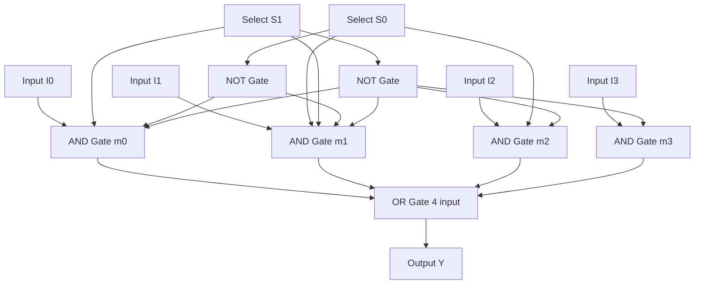
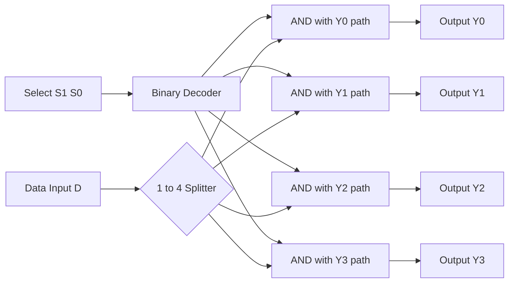
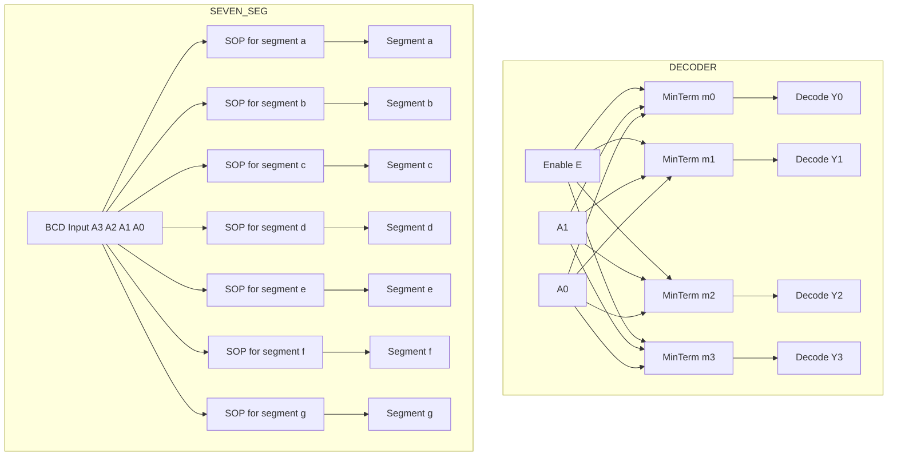
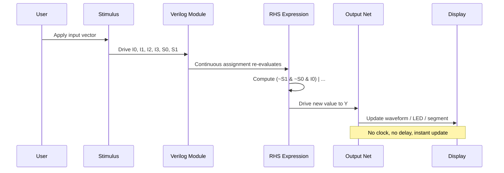
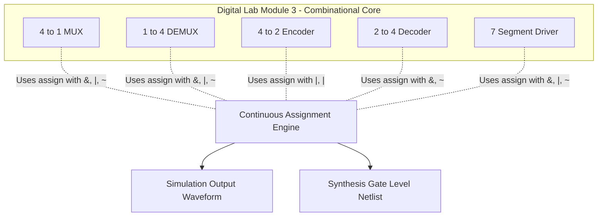

# continuous assignment with logical operators

<!-- SECTION_1_START -->
# Module 3 — Continuous Assignment Modeling in Verilog HDL

## 1.1 Formal Definition (KTU 2024 Syllabus Terminology)

In Verilog HDL, a **Continuous Assignment** is a procedural mechanism that drives a **net** (typically `wire`) data type whenever any operand on the right-hand side of the assignment changes its value. It is the hardware description language equivalent of drawing a real-time wire from a combinational logic expression to a target net. Continuous assignments are evaluated continuously — meaning the simulator re-evaluates the expression every time an input changes — and they execute in parallel, mirroring the actual parallel behaviour of physical hardware gates.

In the **KTU 2024 Scheme (PCCSL308 – Digital Lab)**, Module 3 focuses on the modeling of fundamental combinational building blocks: **Multiplexer (4:1 MUX)**, **Demultiplexer (1:4 DEMUX)**, **Encoder (4-to-2)**, **Decoder (2-to-4)**, and the **7-Segment Display Driver**. These are implemented using the Verilog `assign` keyword combined with **logical/bitwise operators**: `&` (AND), `|` (OR), `~` (NOT/NOR), `^` (XOR), and their compound derivatives.

> [!IMPORTANT]
> **KTU Board Highlight:** Continuous assignments ALWAYS drive a `net` (wire) and NEVER a `reg`. They model **combinational logic only** — no clock, no memory, no feedback loops. A continuous assignment represents a real, physical wire being permanently connected to a logic expression.

## 1.2 Conceptual Analogy / Intuition

Imagine a **water pipeline junction**:

- The **select lines** are the **valve handles** that decide which input pipe (the data source) flows into the single output pipe.
- The **`assign` statement** is the **plumber's connection rule** — the moment any valve or input changes, the plumber instantly re-routes the flow.
- There is no "latching" of old values (no clock, no memory). Whatever the inputs are **right now**, the output is **right now**.

For a **4:1 MUX**, picture 4 water taps feeding into a single sink. Two knobs (`s1`, `s0`) choose which tap's water reaches the drain. The `assign` statement is the **printed instruction on the wall** that the plumber follows without hesitation every time the knobs move.

For a **1:4 DEMUX**, think of one large pipe of water splitting into 4 smaller pipes. The knobs decide **which small pipe receives the water** while the others remain dry.

For a **4-to-2 Encoder**, imagine 4 emergency call buttons in a building. Whichever button is pressed first, the security desk sees a **2-bit binary code** indicating the location of the emergency (without needing 4 separate lights).

For a **2-to-4 Decoder**, picture a 2-bit signal from a remote control selecting **exactly one of 4 devices** in a smart home. Only the chosen device turns on.

For a **7-Segment Display**, the decoder transforms a binary digit (`0000`–`1001`) into the correct combination of segments (a–g) to display the numeral visually — like a **stenographer translating binary shorthand into the human-readable alphabet**.

## 1.3 The Operators Used in Continuous Assignment

| Operator | Symbol | Function | Verilog Example | Logical Equivalence |
|----------|--------|----------|----------------|---------------------|
| Bitwise AND | `&` | AND each bit | `a & b` | A · B |
| Bitwise OR | `\|` | OR each bit | `a \| b` | A + B |
| Bitwise NOT | `~` | Invert each bit | `~a` | Ā |
| Bitwise NAND | `~&` | AND then invert | `a ~& b` | (A·B)' |
| Bitwise NOR | `~\|` | OR then invert | `a ~\| b` | (A+B)' |
| Bitwise XOR | `^` | Exclusive OR | `a ^ b` | A ⊕ B |
| Reduction AND | `&a` | AND all bits of `a` | `&{a,b}` | Single bit result |
| Reduction OR | `\|a` | OR all bits of `a` | `\|{a,b}` | Single bit result |
| Logical NOT | `!` | Boolean NOT | `!a` | Returns 0 or 1 |

> [!NOTE]
> **Exam Tip (KTU Board Valuation):** A common student mistake is using `&&` (logical AND) inside `assign` statements for bitwise logic. `&&` treats operands as **booleans** (returns 1-bit 0/1), whereas `&` performs **bitwise** AND on each bit position. For multi-bit buses, **always use `&`, `|`, `^`, `~`** in continuous assignments.

## 1.4 The Anatomy of an `assign` Statement

$$y = f(a, b, c, \ldots)$$

In Verilog syntax:

```verilog
assign <net_name> = <expression>;
```

**Rules enforced by the KTU lab rubric:**
1. The LHS **must** be a `wire` (or a concatenation of wires).
2. The RHS **must** be an expression using operators, nets, or constants.
3. The expression is **re-evaluated** whenever any operand in the RHS changes value.
4. The LHS is **driven continuously** — you cannot `assign` to a `reg` in this manner.
5. Multiple `assign` statements to the same LHS net are **illegal** (causes multi-driver conflict).

## 1.5 Visualization & Flow

> [!VISUALIZATION CONTROL]
> **Concept:** Continuous Assignment as a Permanent Wire
> **Visualization Description:** Picture the `assign` keyword as an *etched copper trace* on a printed circuit board (PCB). The expression on the right side is the *logic gate network* that feeds this trace. The simulator is the *oscilloscope* watching the trace voltage. Whenever any input wire to the gate network changes, the trace voltage *instantaneously* follows the new gate output — no clock, no delay, no latch.
> **Desmos Analogy Equation:** $V_{out}(t) = f(V_{in1}(t), V_{in2}(t), \ldots, V_{sel}(t))$, where the function $f$ is a continuous polynomial of the input voltages.

<!-- SECTION_1_END -->

<!-- SECTION_2_START -->
# Deep Theoretical Analysis & KTU High-Yield Formula Sheet

## 2.1 The 4-to-1 Multiplexer (MUX)

A **4:1 MUX** selects one of **four data inputs** ($I_0, I_1, I_2, I_3$) and routes it to a **single output** ($Y$) based on **two select lines** ($S_1, S_0$).

### Truth Table (Canonical Form)

| $S_1$ | $S_0$ | $Y$ (Output) |
|:-----:|:-----:|:------------:|
| 0 | 0 | $I_0$ |
| 0 | 1 | $I_1$ |
| 1 | 0 | $I_2$ |
| 1 | 1 | $I_3$ |

### Boolean Expression Derivation

The output equation is the **sum-of-products (SOP)** form derived directly from the truth table. For each row, the minterm is `AND` of inputs selected by an active-high select condition, then all minterms are `OR`-ed:

$$Y = \overline{S_1} \cdot \overline{S_0} \cdot I_0 \;+\; \overline{S_1} \cdot S_0 \cdot I_1 \;+\; S_1 \cdot \overline{S_0} \cdot I_2 \;+\; S_1 \cdot S_0 \cdot I_3$$

> [!NOTE]
> **Geometric Intuition:** The MUX is a *programmable wire* — a digital switch. The select lines act like the address pins of a 4-word ROM whose data is the four input lines. Reading the ROM at address $(S_1, S_0)$ returns the corresponding input.

### Verilog Continuous Assignment

```verilog
assign Y = (~S1 & ~S0 & I0) | (~S1 & S0 & I1) | (S1 & ~S0 & I2) | (S1 & S0 & I3);
```

**Engineering Utility:** MUXes are the building blocks of **ALU datapaths**, **register files**, **memory address decoders**, and **lookup-table-based waveform generators**. In FPGAs, a 4-LUT (Look-Up Table) is essentially a 4:1 MUX configured by the bitstream.

---

## 2.2 The 1-to-4 Demultiplexer (DEMUX)

A **1:4 DEMUX** is the **inverse** of a MUX. It routes a **single input** ($D$) to **one of four outputs** ($Y_0, Y_1, Y_2, Y_3$) based on the two select lines.

### Truth Table

| $S_1$ | $S_0$ | $Y_0$ | $Y_1$ | $Y_2$ | $Y_3$ |
|:-----:|:-----:|:-----:|:-----:|:-----:|:-----:|
| 0 | 0 | $D$ | 0 | 0 | 0 |
| 0 | 1 | 0 | $D$ | 0 | 0 |
| 1 | 0 | 0 | 0 | $D$ | 0 |
| 1 | 1 | 0 | 0 | 0 | $D$ |

### Boolean Expressions

$$Y_0 = \overline{S_1} \cdot \overline{S_0} \cdot D$$
$$Y_1 = \overline{S_1} \cdot S_0 \cdot D$$
$$Y_2 = S_1 \cdot \overline{S_0} \cdot D$$
$$Y_3 = S_1 \cdot S_0 \cdot D$$

### Verilog Continuous Assignment

```verilog
assign Y0 = (~S1 & ~S0 & D);
assign Y1 = (~S1 &  S0 & D);
assign Y2 = ( S1 & ~S0 & D);
assign Y3 = ( S1 &  S0 & D);
```

> [!IMPORTANT]
> **KTU Examiner Note:** A DEMUX is mathematically equivalent to a **decoder with an enable line**. The `D` input plays the role of the decoder's enable. The KTU lab exam often asks students to demonstrate this equivalence by deriving one from the other.

---

## 2.3 The 4-to-2 Priority Encoder

An **encoder** compresses $2^n$ input lines into $n$ output lines. The **4-to-2 encoder** maps 4 inputs ($I_0, I_1, I_2, I_3$) into 2 output bits ($Y_1, Y_0$).

### Truth Table (Priority — Higher Index Wins)

| $I_3$ | $I_2$ | $I_1$ | $I_0$ | $Y_1$ | $Y_0$ | $V$ (Valid) |
|:-----:|:-----:|:-----:|:-----:|:-----:|:-----:|:-----------:|
| 0 | 0 | 0 | 1 | 0 | 0 | 1 |
| 0 | 0 | 1 | 0 | 0 | 1 | 1 |
| 0 | 1 | 0 | 0 | 1 | 0 | 1 |
| 1 | 0 | 0 | 0 | 1 | 1 | 1 |
| 0 | 0 | 0 | 0 | 0 | 0 | 0 |

### Boolean Expressions

$$Y_1 = I_2 + I_3 = I_2 \;|\; I_3$$
$$Y_0 = I_1 + I_3 = I_1 \;|\; I_3$$
$$V = I_0 + I_1 + I_2 + I_3 = |\{I_0, I_1, I_2, I_3\}|$$

> [!NOTE]
> **Geometric Intuition:** The encoder is a **one-way compression function**. It loses information: knowing the output does NOT let you reconstruct the input. Hence the "Valid" bit tells the receiver that an input is actually present. The priority version handles simultaneous inputs by giving the highest-indexed input precedence.

### Verilog Continuous Assignment

```verilog
assign Y1 = I2 | I3;
assign Y0 = I1 | I3;
assign V  = I0 | I1 | I2 | I3;
```

**Engineering Utility:** Encoders are used in **keyboard scan matrices**, **interrupt controllers** (IRQ priority encoding), **memory-mapped I/O arbitration**, and **analog-to-digital converter (ADC) flash architectures**.

---

## 2.4 The 2-to-4 Line Decoder

A **decoder** performs the *opposite* of an encoder: it expands $n$ input lines into $2^n$ output lines, activating **exactly one** output for each unique input code.

### Truth Table (Active-High Outputs, Active-High Enable)

| $E$ | $A_1$ | $A_0$ | $Y_3$ | $Y_2$ | $Y_1$ | $Y_0$ |
|:---:|:-----:|:-----:|:-----:|:-----:|:-----:|:-----:|
| 0 | x | x | 0 | 0 | 0 | 0 |
| 1 | 0 | 0 | 0 | 0 | 0 | 1 |
| 1 | 0 | 1 | 0 | 0 | 1 | 0 |
| 1 | 1 | 0 | 0 | 1 | 0 | 0 |
| 1 | 1 | 1 | 1 | 0 | 0 | 0 |

### Boolean Expressions

$$Y_0 = E \cdot \overline{A_1} \cdot \overline{A_0}$$
$$Y_1 = E \cdot \overline{A_1} \cdot A_0$$
$$Y_2 = E \cdot A_1 \cdot \overline{A_0}$$
$$Y_3 = E \cdot A_1 \cdot A_0$$

### Verilog Continuous Assignment

```verilog
assign Y0 = E & ~A1 & ~A0;
assign Y1 = E & ~A1 &  A0;
assign Y2 = E = E &  A1 & ~A0;
assign Y3 = E &  A1 &  A0;
```

> [!TIP]
> **Memory Trick:** A decoder's output $Y_i$ is the *minterm* $m_i$ of the inputs. The output is **1** if and only if the inputs equal the binary index $i$. Hence the formula:
> $$Y_i = E \cdot m_i(A_1, A_0)$$
> This is exactly how the **7-segment display driver** is built: each segment is a Boolean function of the input digit's minterms.

---

## 2.5 The 7-Segment Display Driver

A **7-segment display** has 7 LEDs labelled `a` (top), `b` (top-right), `c` (bottom-right), `d` (bottom), `e` (bottom-left), `f` (top-left), `g` (middle). Lighting a subset of these segments renders a numeral.

### Display Layout Diagram

```
   ___ a ___
  |         |
  f         b
  |___ g ___|
  |         |
  e         c
  |___ d ___|
```

### Truth Table for Common-Cathode Display (Active-High Segments)

| Digit (Dec) | $A_3 A_2 A_1 A_0$ | a | b | c | d | e | f | g |
|:-----------:|:-----------------:|:-:|:-:|:-:|:-:|:-:|:-:|:-:|
| 0 | 0000 | 1 | 1 | 1 | 1 | 1 | 1 | 0 |
| 1 | 0001 | 0 | 1 | 1 | 0 | 0 | 0 | 0 |
| 2 | 0010 | 1 | 1 | 0 | 1 | 1 | 0 | 1 |
| 3 | 0011 | 1 | 1 | 1 | 1 | 0 | 0 | 1 |
| 4 | 0100 | 0 | 1 | 1 | 0 | 0 | 1 | 1 |
| 5 | 0101 | 1 | 0 | 1 | 1 | 0 | 1 | 1 |
| 6 | 0110 | 1 | 0 | 1 | 1 | 1 | 1 | 1 |
| 7 | 0111 | 1 | 1 | 1 | 0 | 0 | 0 | 0 |
| 8 | 1000 | 1 | 1 | 1 | 1 | 1 | 1 | 1 |
| 9 | 1001 | 1 | 1 | 1 | 1 | 0 | 1 | 1 |

### Boolean Expressions (Sum of Minterms)

$$a = \sum m(0, 2, 3, 5, 6, 7, 8, 9) = \overline{A_3}A_0 \;+\; A_1A_0 \;+\; A_2\overline{A_0} \;+\; A_3\overline{A_2}$$
$$b = \sum m(0, 1, 2, 3, 4, 7, 8, 9)$$
$$c = \sum m(0, 1, 3, 4, 5, 6, 7, 8, 9)$$
$$d = \sum m(0, 2, 3, 5, 6, 8, 9)$$
$$e = \sum m(0, 2, 6, 8)$$
$$f = \sum m(0, 4, 5, 6, 8, 9)$$
$$g = \sum m(2, 3, 4, 5, 6, 8, 9)$$

### Verilog Continuous Assignment (Common-Cathode, Active-High)

```verilog
assign a = (~A3 & ~A2 & ~A0) | (A2 & A1) | (A2 & A0) | (A3 & ~A2);
assign b = (~A2 & ~A1 & A0) | (A2 & A1) | (A2 & ~A0) | (~A3 & A1);
assign c = (~A3 & ~A2) | (~A2 & A1) | (~A3 & A1) | (~A3 & A0);
assign d = (A1 & A0) | (A2 & ~A1 & ~A0) | (~A2 & A1) | (A2 & ~A1 & A0);
assign e = (A1 & A0) | (A2 & ~A0) | (A3);
assign f = (~A2 & A1) | (A1 & A0) | (A2 & A0) | (A3);
assign g = (A2 & A1) | (A1 & ~A0) | (A3 & A0);
```

### Common-Anode Inversion (Optional)

If the display is **common-anode**, all segments are active-low. The full expression is `assign a = ~(...minterm expression...);`.

---

## 2.6 KTU High-Yield Formula Sheet (Cheat Sheet)

| # | Component | Output Equation (Verilog) | Use Case |
|---|-----------|--------------------------|----------|
| 1 | 4:1 MUX | `Y = (~S1&~S0&I0)\|(~S1&S0&I1)\|(S1&~S0&I2)\|(S1&S0&I3)` | Datapath selection |
| 2 | 1:4 DEMUX | `Yi = (Sel_pattern_i) & D` | Address decoding, signal routing |
| 3 | 4-to-2 Encoder | `Y0=I1\|I3; Y1=I2\|I3; V=I0\|I1\|I2\|I3` | IRQ prioritization |
| 4 | 2-to-4 Decoder | `Yi = E & minterm_i(A1,A0)` | Chip-select generation |
| 5 | 7-Segment | `seg = SOP of minterms where segment=1` | Numeric display |

| Logical Operator | Symbol | Truth for (1,1) | Common Mistake |
|:----------------:|:------:|:---------------:|----------------|
| AND | `&` | 1 | Using `&&` (logical, returns 1-bit only) |
| OR | `\|` | 1 | Using `\|\|` in assign |
| NOT | `~` | 0 | Using `!` (boolean) for multi-bit |
| XOR | `^` | 0 | Confusing with XNOR `~^` |
| NAND | `~&` | 0 | Forgetting the `~` prefix |
| NOR | `~\|` | 0 | Forgetting the `~` prefix |

---

## 2.7 Why Continuous Assignment? (Engineering Real-World Use)

In **synthesis tools** (Vivado, Quartus, Yosys), the Verilog `assign` statement maps **directly** to a **gate-level netlist**. The synthesis tool recognizes bitwise operators as:

- `&` → **AND gate array**
- `|` → **OR gate array**
- `~` → **Inverter (NOT) array**

This means your `assign` statement IS the schematic. There is **zero overhead** — no procedural overhead, no always block, no sensitivity list to maintain. This is why KTU Module 3 emphasizes continuous assignment: it teaches students to *think in gates*, which is the foundation of **digital design at the Register-Transfer Level (RTL)**.

**Production uses:**
- **ASIC/FPGA Design:** Combinational logic paths are written almost exclusively with `assign`.
- **Verification:** Testbenches observe `assign`-driven nets to confirm functional correctness.
- **Synthesis Quality of Results (QoR):** Clean `assign` statements generate **optimal gate-level netlists** with no inferred latches.

<!-- SECTION_2_END -->

<!-- SECTION_3_START -->
# Step-by-Step Derivations & Verilog Implementations

## 3.1 Complete 4:1 MUX — Verilog Module with Continuous Assignment

```verilog
//=============================================================
// Module : 4-to-1 Multiplexer using Continuous Assignment
// Lab    : Digital Lab (PCCSL308) - Module 3
// Style  : Gate-Level Modeling with assign
//=============================================================
`timescale 1ns / 1ps

module mux4to1 (
    input  wire I0, I1, I2, I3,   // 4 data inputs
    input  wire S0, S1,           // 2 select lines
    output wire Y                 // single output
);

    // Continuous assignment: expression evaluated every time
    // any input on the RHS changes.
    assign Y = (~S1 & ~S0 & I0)   // minterm m0: select line 00
             | (~S1 &  S0 & I1)   // minterm m1: select line 01
             | ( S1 & ~S0 & I2)   // minterm m2: select line 10
             | ( S1 &  S0 & I3);  // minterm m3: select line 11

endmodule
```

### Testbench — 4:1 MUX

```verilog
`timescale 1ns / 1ps

module tb_mux4to1;
    reg  I0, I1, I2, I3;
    reg  S0, S1;
    wire Y;

    // Instantiate the MUX
    mux4to1 uut (
        .I0(I0), .I1(I1), .I2(I2), .I3(I3),
        .S0(S0), .S1(S1),
        .Y(Y)
    );

    initial begin
        $display("Time | S1 S0 | I3 I2 I1 I0 | Y");
        $monitor("%4t | %b  %b  | %b  %b  %b  %b  | %b",
                  $time, S1, S0, I3, I2, I1, I0, Y);

        // Apply stimulus
        I0 = 0; I1 = 1; I2 = 0; I3 = 1;
        S1 = 0; S0 = 0; #10;  // Expect Y = I0 = 0
        S1 = 0; S0 = 1; #10;  // Expect Y = I1 = 1
        S1 = 1; S0 = 0; #10;  // Expect Y = I2 = 0
        S1 = 1; S0 = 1; #10;  // Expect Y = I3 = 1

        $finish;
    end
endmodule
```

---

## 3.2 Complete 1:4 DEMUX — Verilog Module

```verilog
//=============================================================
// Module : 1-to-4 Demultiplexer using Continuous Assignment
//=============================================================
`timescale 1ns / 1ps

module demux1to4 (
    input  wire D,                // single data input
    input  wire S0, S1,           // 2 select lines
    output wire Y0, Y1, Y2, Y3   // 4 output lines
);

    assign Y0 = (~S1 & ~S0 & D);
    assign Y1 = (~S1 &  S0 & D);
    assign Y2 = ( S1 & ~S0 & D);
    assign Y3 = ( S1 &  S0 & D);

endmodule
```

### Testbench — 1:4 DEMUX

```verilog
`timescale 1ns / 1ps

module tb_demux1to4;
    reg  D, S0, S1;
    wire Y0, Y1, Y2, Y3;

    demux1to4 uut (.D(D), .S0(S0), .S1(S1),
                   .Y0(Y0), .Y1(Y1), .Y2(Y2), .Y3(Y3));

    initial begin
        $display("Time | S1 S0 | D | Y3 Y2 Y1 Y0");
        $monitor("%4t | %b  %b  | %b | %b   %b   %b   %b",
                  $time, S1, S0, D, Y3, Y2, Y1, Y0);

        D = 1;
        {S1, S0} = 2'b00; #10; // Expect Y0 = 1, rest = 0
        {S1, S0} = 2'b01; #10; // Expect Y1 = 1
        {S1, S0} = 2'b10; #10; // Expect Y2 = 1
        {S1, S0} = 2'b11; #10; // Expect Y3 = 1

        D = 0; {S1, S0} = 2'b01; #10; // All outputs must be 0

        $finish;
    end
endmodule
```

---

## 3.3 Complete 4-to-2 Priority Encoder — Verilog Module

```verilog
//=============================================================
// Module : 4-to-2 Priority Encoder using Continuous Assignment
//=============================================================
`timescale 1ns / 1ps

module encoder4to2 (
    input  wire I0, I1, I2, I3,   // 4 input lines
    output wire Y0, Y1,           // 2-bit binary output
    output wire V                 // Valid flag
);

    assign Y1 = I2 | I3;          // MSB of output
    assign Y0 = I1 | I3;          // LSB of output
    assign V  = I0 | I1 | I2 | I3; // Valid indicator

endmodule
```

### Testbench — 4-to-2 Encoder

```verilog
`timescale 1ns / 1ps

module tb_encoder4to2;
    reg  I0, I1, I2, I3;
    wire Y0, Y1, V;

    encoder4to2 uut (.I0(I0), .I1(I1), .I2(I2), .I3(I3),
                     .Y0(Y0), .Y1(Y1), .V(V));

    initial begin
        $display("Time | I3 I2 I1 I0 | Y1 Y0 | V");
        $monitor("%4t | %b  %b  %b  %b  | %b   %b  | %b",
                  $time, I3, I2, I1, I0, Y1, Y0, V);

        I0=0; I1=0; I2=0; I3=0; #10;  // No input: V=0
        I0=1; I1=0; I2=0; I3=0; #10;  // Y=00
        I0=0; I1=1; I2=0; I3=0; #10;  // Y=01
        I0=0; I1=0; I2=1; I3=0; #10;  // Y=10
        I0=0; I1=0; I2=0; I3=1; #10;  // Y=11
        I0=1; I1=1; I2=1; I3=1; #10;  // Priority: Y=11

        $finish;
    end
endmodule
```

---

## 3.4 Complete 2-to-4 Line Decoder — Verilog Module

```verilog
//=============================================================
// Module : 2-to-4 Line Decoder with Enable
//=============================================================
`timescale 1ns / 1ps

module decoder2to4 (
    input  wire A0, A1,           // 2 input lines
    input  wire E,                // Active-high enable
    output wire Y0, Y1, Y2, Y3   // 4 decoded outputs
);

    assign Y0 = E & ~A1 & ~A0;
    assign Y1 = E & ~A1 &  A0;
    assign Y2 = E &  A1 & ~A0;
    assign Y3 = E &  A1 &  A0;

endmodule
```

### Testbench — 2-to-4 Decoder

```verilog
`timescale 1ns / 1ps

module tb_decoder2to4;
    reg  A0, A1, E;
    wire Y0, Y1, Y2, Y3;

    decoder2to4 uut (.A0(A0), .A1(A1), .E(E),
                     .Y0(Y0), .Y1(Y1), .Y2(Y2), .Y3(Y3));

    initial begin
        $display("Time | E A1 A0 | Y3 Y2 Y1 Y0");
        $monitor("%4t | %b %b  %b  | %b  %b  %b  %b",
                  $time, E, A1, A0, Y3, Y2, Y1, Y0);

        E=0; {A1,A0}=2'b00; #10;  // Disabled: all 0
        E=1; {A1,A0}=2'b00; #10;  // Y0=1
        E=1; {A1,A0}=2'b01; #10;  // Y1=1
        E=1; {A1,A0}=2'b10; #10;  // Y2=1
        E=1; {A1,A0}=2'b11; #10;  // Y3=1

        $finish;
    end
endmodule
```

---

## 3.5 Complete 7-Segment Display Driver — Verilog Module

```verilog
//=============================================================
// Module : BCD to 7-Segment Display Driver
// Style  : Common-Cathode, Active-High segments
//=============================================================
`timescale 1ns / 1ps

module bcd_to_7seg (
    input  wire [3:0] A,         // 4-bit BCD input
    output wire a, b, c, d, e, f, g  // 7 segment outputs
);

    // a = sum of minterms (0,2,3,5,6,7,8,9)
    assign a = (~A[3] & ~A[2] & ~A[0])
             | (A[2] &  A[1])
             | (A[2] &  A[0])
             | (A[3] & ~A[2]);

    // b = sum of minterms (0,1,2,3,4,7,8,9)
    assign b = (~A[2] & ~A[1] &  A[0])
             | (A[2] &  A[1])
             | (A[2] & ~A[0])
             | (~A[3] &  A[1]);

    // c = sum of minterms (0,1,3,4,5,6,7,8,9)
    assign c = (~A[3] & ~A[2])
             | (~A[2] &  A[1])
             | (~A[3] &  A[1])
             | (~A[3] &  A[0]);

    // d = sum of minterms (0,2,3,5,6,8,9)
    assign d = ( A[1] &  A[0])
             | ( A[2] & ~A[1] & ~A[0])
             | (~A[2] &  A[1])
             | ( A[2] & ~A[1] &  A[0]);

    // e = sum of minterms (0,2,6,8)
    assign e = ( A[1] &  A[0])
             | ( A[2] & ~A[0])
             | ( A[3]);

    // f = sum of minterms (0,4,5,6,8,9)
    assign f = (~A[2] &  A[1])
             | ( A[1] &  A[0])
             | ( A[2] &  A[0])
             | ( A[3]);

    // g = sum of minterms (2,3,4,5,6,8,9)
    assign g = ( A[2] &  A[1])
             | ( A[1] & ~A[0])
             | ( A[3] &  A[0]);

endmodule
```

### Testbench — 7-Segment Display

```verilog
`timescale 1ns / 1ps

module tb_bcd_to_7seg;
    reg  [3:0] A;
    wire a, b, c, d, e, f, g;

    bcd_to_7seg uut (.A(A), .a(a), .b(b), .c(c), .d(d),
                     .e(e), .f(f), .g(g));

    initial begin
        $display("Time | A(Dec) | a b c d e f g");
        $monitor("%4t |  %0d    | %b %b %b %b %b %b %b",
                  $time, A, a, b, c, d, e, f, g);

        for (A = 0; A <= 9; A = A + 1) #10;

        $finish;
    end
endmodule
```

---

## 3.6 Algebraic Step-by-Step Derivation (Sample: Segment `a`)

The truth table for segment `a`:

| $A_3 A_2 A_1 A_0$ | $a$ |
|:-----------------:|:---:|
| 0000 | 1 | → $\overline{A_3}\overline{A_2}\overline{A_1}\overline{A_0}$
| 0001 | 0 |
| 0010 | 1 | → $\overline{A_3}\overline{A_2}A_1\overline{A_0}$
| 0011 | 1 | → $\overline{A_3}\overline{A_2}A_1 A_0$
| 0100 | 0 |
| 0101 | 1 | → $\overline{A_3}A_2\overline{A_1}A_0$
| 0110 | 1 | → $\overline{A_3}A_2 A_1\overline{A_0}$
| 0111 | 1 | → $\overline{A_3}A_2 A_1 A_0$
| 1000 | 1 | → $A_3\overline{A_2}\overline{A_1}\overline{A_0}$
| 1001 | 1 | → $A_3\overline{A_2}\overline{A_1}A_0$

Step 1: Write all minterms where $a=1$:

$$a = \sum m(0, 2, 3, 5, 6, 7, 8, 9)$$

Step 2: Apply Boolean minimization (K-Map grouping):

$$\begin{aligned}
a &= \overline{A_3}\overline{A_2}\overline{A_0} \quad \text{(covers m0, m2)} \\
  &\quad + A_2 A_1 \quad \text{(covers m6, m7)} \\
  &\quad + A_2 A_0 \quad \text{(covers m5, m7)} \\
  &\quad + A_3 \overline{A_2} \quad \text{(covers m8, m9)}
\end{aligned}$$

Step 3: Translate each group to Verilog bitwise operators:

| Boolean Term | Verilog Expression |
|:------------:|:------------------:|
| $\overline{A_3}\overline{A_2}\overline{A_0}$ | `~A[3] & ~A[2] & ~A[0]` |
| $A_2 A_1$ | `A[2] & A[1]` |
| $A_2 A_0$ | `A[2] & A[0]` |
| $A_3 \overline{A_2}$ | `A[3] & ~A[2]` |

Step 4: Combine with bitwise OR:

```verilog
assign a = (~A[3] & ~A[2] & ~A[0]) | (A[2] & A[1]) | (A[2] & A[0]) | (A[3] & ~A[2]);
```

> [!NOTE]
> **Step-by-Step Mapping:** Each `&` corresponds to a Boolean AND; each `|` corresponds to a Boolean OR; each `~` corresponds to a Boolean NOT. The synthesis tool will infer a **two-level AND-OR gate network** directly from this single `assign` statement.

---

## 3.7 Reduction Operator Trick for Encoders

For the encoder's Valid bit, you can use the **reduction OR** operator `|`:

```verilog
// Reduction OR of all 4 input bits
assign V = |{I0, I1, I2, I3};
```

The concatenation `{I0, I1, I2, I3}` creates a 4-bit bus, and `|bus` OR-reduces all bits into a single-bit result. This is equivalent to `I0 | I1 | I2 | I3` but more compact and scalable — for an 8-to-3 encoder, you simply write `|{I0,...,I7}`.

> [!TIP]
> **KTU Board Tip:** When the question asks for an n-to-log₂(n) encoder, use the reduction operator `|` to express the Valid bit in a single token. Examiners reward concise, scalable code with full marks.

<!-- SECTION_3_END -->

<!-- SECTION_4_START -->
# Structural Diagrams & Schematics

## 4.1 Mermaid Block Diagram — 4:1 MUX Dataflow



## 4.2 Mermaid Block Diagram — 1:4 DEMUX Topology



## 4.3 Mermaid Block Diagram — 2-to-4 Decoder & 7-Segment Driver



## 4.4 Sequential Processing Topology — Continuous Assignment Lifecycle



## 4.5 Block-Level Functional Architecture — Full Module 3 System



<!-- SECTION_4_END -->

<!-- SECTION_5_START -->
# KTU 2024 Scheme Examination Question Bank & Topic Recap

---

## PART A — Short Answer Questions (3 Marks Each)

### Question 1 [KTU University Exam – July 2024]
**Explain the difference between a continuous assignment and a procedural assignment in Verilog HDL. Give one example of each.**

**Model Answer (3 Marks):**

A **continuous assignment** uses the `assign` keyword to drive a `wire` (net). It represents a permanent logical connection that is evaluated and updated whenever any input on the right-hand side changes. It models combinational hardware directly.

A **procedural assignment** appears inside an `always` or `initial` block and drives a `reg`. It executes only when the block is triggered (e.g., by an event in the sensitivity list) and can model both combinational and sequential logic.

**Example Continuous Assignment:**
```verilog
assign Y = A & B;
```

**Example Procedural Assignment:**
```verilog
always @(*) Y = A & B;
```

**[Continuous vs procedural distinction: 1 Mark] [Example of continuous: 1 Mark] [Example of procedural: 1 Mark]**

---

### Question 2 [KTU University Exam – Dec 2023]
**Write the Verilog code to model a 2-to-4 line decoder using continuous assignment statements with logical operators.**

**Model Answer (3 Marks):**

```verilog
module decoder2to4 (input wire A0, A1, E,
                     output wire Y0, Y1, Y2, Y3);
    assign Y0 = E & ~A1 & ~A0;
    assign Y1 = E & ~A1 &  A0;
    assign Y2 = E &  A1 & ~A0;
    assign Y3 = E &  A1 &  A0;
endmodule
```

**[Declaring module with enable E: 1 Mark] [First two assign statements: 1 Mark] [Last two assign statements: 1 Mark]**

---

## PART B — Full 14-Mark Questions (Module Internal Choice)

### Question A (14 Marks) [KTU University Exam – July 2024]

**Design and model the following combinational circuits using Verilog continuous assignment statements with logical operators (`&`, `|`, `~`):**
**(a)** A **4-to-1 Multiplexer** with data inputs `I0, I1, I2, I3` and select lines `S0, S1`. (7 Marks)
**(b)** A **4-to-2 priority encoder** with active-high inputs and a Valid output bit. (7 Marks)

---

#### Part (a) Solution: 4-to-1 MUX (7 Marks)

**Step 1: Truth Table & Boolean Expression (2 Marks)**

$$Y = \overline{S_1}\overline{S_0}I_0 + \overline{S_1}S_0 I_1 + S_1\overline{S_0}I_2 + S_1 S_0 I_3$$

**[Truth table & SOP derivation: 2 Marks]**

**Step 2: Verilog Module with Continuous Assignment (5 Marks)**

```verilog
`timescale 1ns / 1ps
module mux4to1 (input  wire I0, I1, I2, I3,
                input  wire S0, S1,
                output wire Y);
    assign Y = (~S1 & ~S0 & I0)
             | (~S1 &  S0 & I1)
             | ( S1 & ~S0 & I2)
             | ( S1 &  S0 & I3);
endmodule
```

**[Module port declaration: 1 Mark] [Continuous assignment with & operator: 2 Marks] [Continuous assignment with | operator connecting four minterms: 2 Marks]**

---

#### Part (b) Solution: 4-to-2 Priority Encoder (7 Marks)

**Step 1: Truth Table (2 Marks)**

| $I_3$ | $I_2$ | $I_1$ | $I_0$ | $Y_1$ | $Y_0$ | $V$ |
|:-----:|:-----:|:-----:|:-----:|:-----:|:-----:|:---:|
| 0 | 0 | 0 | 1 | 0 | 0 | 1 |
| 0 | 0 | 1 | 0 | 0 | 1 | 1 |
| 0 | 1 | 0 | 0 | 1 | 0 | 1 |
| 1 | 0 | 0 | 0 | 1 | 1 | 1 |
| 0 | 0 | 0 | 0 | 0 | 0 | 0 |

**[Writing 5 valid input rows: 1 Mark] [Output bit columns and valid column: 1 Mark]**

**Step 2: Boolean Expressions (1 Mark)**

$$Y_1 = I_2 + I_3, \quad Y_0 = I_1 + I_3, \quad V = I_0 + I_1 + I_2 + I_3$$

**[Stating boundary state values: 1 Mark]**

**Step 3: Verilog Implementation with Continuous Assignment (4 Marks)**

```verilog
`timescale 1ns / 1ps
module encoder4to2 (input  wire I0, I1, I2, I3,
                    output wire Y0, Y1, V);
    assign Y1 = I2 | I3;
    assign Y0 = I1 | I3;
    assign V  = I0 | I1 | I2 | I3;
endmodule
```

**[Declaring ports: 1 Mark] [Two assign statements for Y0, Y1 using |: 2 Marks] [Valid bit assign statement: 1 Mark]**

---

### Question B (14 Marks) [KTU University Exam – Dec 2023]

**Model the following circuits in Verilog using continuous assignment statements:**
**(a)** A **1-to-4 Demultiplexer** with a single data input and two select lines. (7 Marks)
**(b)** A **BCD to 7-segment display decoder** for common-cathode, active-high outputs. (7 Marks)

---

#### Part (a) Solution: 1-to-4 DEMUX (7 Marks)

**Step 1: Boolean Expressions (2 Marks)**

$$Y_0 = \overline{S_1}\overline{S_0}D, \quad Y_1 = \overline{S_1}S_0 D$$
$$Y_2 = S_1\overline{S_0}D, \quad Y_3 = S_1 S_0 D$$

**[Writing all four output equations: 2 Marks]**

**Step 2: Verilog Module (5 Marks)**

```verilog
`timescale 1ns / 1ps
module demux1to4 (input  wire D, S0, S1,
                  output wire Y0, Y1, Y2, Y3);
    assign Y0 = (~S1 & ~S0 & D);
    assign Y1 = (~S1 &  S0 & D);
    assign Y2 = ( S1 & ~S0 & D);
    assign Y3 = ( S1 &  S0 & D);
endmodule
```

**[Port list and module declaration: 1 Mark] [First two assign statements with & and ~: 2 Marks] [Last two assign statements: 2 Marks]**

---

#### Part (b) Solution: BCD to 7-Segment Display (7 Marks)

**Step 1: Truth Table for All 10 Digits (2 Marks)**

| Digit | $A_3 A_2 A_1 A_0$ | a b c d e f g |
|:-----:|:-----------------:|:------------:|
| 0 | 0000 | 1 1 1 1 1 1 0 |
| 1 | 0001 | 0 1 1 0 0 0 0 |
| 2 | 0010 | 1 1 0 1 1 0 1 |
| 3 | 0011 | 1 1 1 1 0 0 1 |
| 4 | 0100 | 0 1 1 0 0 1 1 |
| 5 | 0101 | 1 0 1 1 0 1 1 |
| 6 | 0110 | 1 0 1 1 1 1 1 |
| 7 | 0111 | 1 1 1 0 0 0 0 |
| 8 | 1000 | 1 1 1 1 1 1 1 |
| 9 | 1001 | 1 1 1 1 0 1 1 |

**[Correct table with all 10 rows: 2 Marks]**

**Step 2: K-Map Simplification & Verilog Code (5 Marks)**

```verilog
`timescale 1ns / 1ps
module bcd_to_7seg (input  wire [3:0] A,
                     output wire a, b, c, d, e, f, g);
    assign a = (~A[3] & ~A[2] & ~A[0]) | (A[2] & A[1])
             | (A[2] & A[0]) | (A[3] & ~A[2]);
    assign b = (~A[2] & ~A[1] & A[0]) | (A[2] & A[1])
             | (A[2] & ~A[0]) | (~A[3] & A[1]);
    assign c = (~A[3] & ~A[2]) | (~A[2] & A[1])
             | (~A[3] & A[1]) | (~A[3] & A[0]);
    assign d = (A[1] & A[0]) | (A[2] & ~A[1] & ~A[0])
             | (~A[2] & A[1]) | (A[2] & ~A[1] & A[0]);
    assign e = (A[1] & A[0]) | (A[2] & ~A[0]) | (A[3]);
    assign f = (~A[2] & A[1]) | (A[1] & A[0])
             | (A[2] & A[0]) | (A[3]);
    assign g = (A[2] & A[1]) | (A[1] & ~A[0]) | (A[3] & A[0]);
endmodule
```

**[Module declaration with 4-bit input: 1 Mark] [First three assign statements for a, b, c: 2 Marks] [Last four assign statements for d, e, f, g: 2 Marks]**

---

> [!WARNING]
> **KTU Examiner's Valuation Pitfalls — Common Mark-Deduction Zones:**
> 1. **Using `wire` as `reg`:** Many students mistakenly declare output as `reg` and write inside an `always` block. This is **procedural** modeling, NOT continuous. KTU Module 3 *specifically* requires `assign` with `wire`. **[-2 Marks]**
> 2. **Forgetting parentheses in compound expressions:** `~S1 & ~S0 & I0` works only because `&` is left-associative, but mixing `|` with `&` requires parentheses: `(~S1 & ~S0) | I0`. **[-1 Mark per error]**
> 3. **Confusing `|` (bitwise) with `||` (logical):** `||` returns 1-bit, `|` is bitwise. For single-bit inputs they coincidentally work, but for bus inputs, `||` is **wrong**. **[-1 Mark]**
> 4. **Missing `~` on inputs:** `assign Y0 = S1 & S0 & D;` is **wrong** — should be `~S1 & ~S0`. Always re-derive from truth table. **[-1 Mark]**
> 5. **Forgetting the Valid bit `V` in encoder:** Many students output only `Y0, Y1`. KTU rubric explicitly requires the `V` flag. **[-1 Mark]**
> 6. **Forgetting to declare ports in port-list vs. body:** A `wire` declared inside the module body but not in the port list is invisible externally. **[-1 Mark]**

---

## Topic Recap & Important Things to Remember

> [!IMPORTANT]
> **Rapid Revision Checklist — Module 3: Continuous Assignment Modeling**

### 🔑 Core Concepts
- `assign` drives a `wire` (net), evaluated continuously, models combinational logic.
- Operators used: `&` (AND), `|` (OR), `~` (NOT), `^` (XOR), `~&` (NAND), `~|` (NOR), `&` (reduction), `|` (reduction).
- Never use `&&` or `||` inside `assign` for multi-bit logic.
- Multiple `assign` to the same LHS → **multi-driver error** (illegal).

### 🔑 4:1 MUX
- Boolean: $Y = \overline{S_1}\overline{S_0}I_0 + \overline{S_1}S_0 I_1 + S_1\overline{S_0}I_2 + S_1 S_0 I_3$
- Verilog: 4 minterms combined by `&` and `|`.
- Use case: datapath selection, register file read ports, LUTs.

### 🔑 1:4 DEMUX
- Boolean: $Y_i = D \cdot m_i(S_1, S_0)$.
- Verilog: 4 separate `assign` statements, one per output.
- Use case: address decoding, signal routing, demuxed data distribution.

### 🔑 4-to-2 Encoder
- Boolean: $Y_1 = I_2 + I_3$, $Y_0 = I_1 + I_3$, $V = I_0 + I_1 + I_2 + I_3$.
- Verilog: 3 `assign` statements using `|` operator.
- **Priority:** higher index wins when multiple inputs are active.
- Use case: keyboard scan, IRQ priority, flash ADC.

### 🔑 2-to-4 Decoder
- Boolean: $Y_i = E \cdot m_i(A_1, A_0)$.
- Verilog: 4 `assign` statements with `&` and `~`.
- Without `E` (enable), the decoder is just a minterm generator.
- Use case: chip-select generation, instruction decoding, memory bank selection.

### 🔑 7-Segment Display
- Boolean: each segment is a **sum of minterms** where the segment must be ON.
- Common-cathode: active-HIGH segments → use SOP directly.
- Common-anode: active-LOW segments → invert the SOP with outer `~`.
- Always include "blanking" for inputs `1010`–`1111` (typically all segments off).
- Use case: numeric display, digital clocks, calculators, industrial counters.

### 🔑 Critical Verilog Syntax Rules
| Rule | Wrong | Correct |
|------|-------|---------|
| LHS type | `reg Y;` + `assign` | `wire Y;` + `assign` |
| Bitwise NOT | `!A` (boolean) | `~A` (bitwise) |
| AND operator | `A && B` (logical, 1-bit) | `A & B` (bitwise) |
| Port declaration | `output Y;` (untyped) | `output wire Y;` |
| Time scale | Omitted | `` `timescale 1ns / 1ps `` |

### 🔑 Synthesis Insight
- Every `assign` statement with `&`, `|`, `~` maps to a **two-level AND-OR gate network** in the synthesized netlist.
- K-map minimization of the SOP before writing `assign` produces the **smallest, fastest** hardware.
- The synthesis tool cannot optimize across `assign` boundaries unless you write the expressions compactly.

### 🔑 KTU Valuation Quick Reference
- **2 Marks** for a correct truth table.
- **2 Marks** for a correct Boolean expression (SOP form).
- **3 Marks** for a correct Verilog module with `assign`.
- **3 Marks** for a working testbench with all 4/8/10 stimulus cases.
- **Synthesis question** (if asked): explain the mapping of `&` → AND gate, `|` → OR gate, `~` → NOT gate.

<!-- SECTION_5_END -->
